# LedgerOne — Business Rules Handbook

**Document Owner:** Chief Functional Architect / ERP Domain Expert
**Version:** 1.1 (frozen — synchronized with the approved v1.0 technology stack)
**Status:** Living document — built incrementally, chapter by chapter
**Depends on (frozen, never contradicted):** `01_PROJECT_CONTEXT.md` (v1.1), `02_TECH_STACK.md` (v1.1), `03_ARCHITECTURE.md` (v1.1), `04_FOLDER_STRUCTURE.md` (v1.1)
**Audience:** Business analysts, ERP consultants, functional architects, and the software engineers who implement against this handbook

## Purpose of This Document

This handbook defines *what LedgerOne must do as a business system*, independent of how it is built. It contains no implementation detail — no database tables, no APIs, no code — because its job is to be the stable, technology-independent source of truth that every future technical document (database design, API contracts, backend services, frontend flows, test plans) is built against. When a technical document and this handbook appear to disagree, this handbook is authoritative for the business rule; the technical document must be corrected, not the other way around — unless this handbook itself is found to conflict with the frozen architecture (`03_ARCHITECTURE.md`), in which case the conflict is surfaced and resolved explicitly, never silently.

## Relationship to the Frozen Architecture

`03_ARCHITECTURE.md` already fixes certain structural facts this handbook must respect as ground truth: **Tenant** is the technical isolation unit (Architecture Ch.4), one human **User** belongs to exactly one Tenant in the current model (Architecture Ch.4.3, Ch.4.6), and every tenant-owned business fact is subject to the audit and compliance discipline of Architecture Ch.17. Where this handbook introduces a business concept that sits close to one of these (e.g., **Organization**, **Company**), the mapping between the business term and the architectural term is stated explicitly, the first time it matters — see Chapter 1.3 and Chapter 2.3.

## How to Read This Document

Every chapter follows an identical structure: Business Definition, Purpose, Responsibilities, Scope, Business Lifecycle, Business Workflow, Business Rules, Validation Rules, Dependencies, Relationships, Examples, Exceptions, Approval Rules, Accounting Impact, Inventory Impact, Reporting Impact, Audit Requirements, Security Considerations, Best Practices, Common Mistakes, Future Expansion. No chapter contains code, SQL, or API definitions — only business behavior, stated precisely enough that a functional consultant could configure a real ERP implementation from it, and an engineer could build against it without needing to invent business logic of their own.

---

## Table of Contents

**Part 1 — Organization**
1. Organization · 2. Company · 3. Branch · 4. Department · 5. Financial Year · 6. Fiscal Period · 7. Currency · 8. Time Zone · 9. Business Locations

**Part 2 — Users**
10. Users · 11. Roles · 12. Permissions · 13. Approval Workflow · 14. Delegation

**Part 3 — Accounting**
15. Accounting Principles · 16. Double Entry System · 17. Chart of Accounts · 18. Account Groups · 19. Ledger · 20. Journal · 21. Voucher · 22. Voucher Types · 23. Posting Rules · 24. Trial Balance · 25. Profit & Loss · 26. Balance Sheet · 27. Cash Flow · 28. Cost Centers · 29. Budgets · 30. Multi Currency · 31. Exchange Rates · 32. Financial Closing · 33. Audit Trail

**Part 4 — Inventory**
34. Products · 35. Product Categories · 36. Units · 37. Warehouses · 38. Stock · 39. Stock Movement · 40. Batch · 41. Serial Numbers · 42. Reorder Levels · 43. Stock Valuation · 44. Inventory Adjustment

**Part 5 — Sales**
45. Customer · 46. Price List · 47. Quotation · 48. Sales Order · 49. Delivery · 50. Invoice · 51. Credit Note · 52. Sales Return · 53. Collections

**Part 6 — Purchase**
54. Vendor · 55. Purchase Request · 56. Purchase Order · 57. Goods Receipt · 58. Purchase Invoice · 59. Debit Note · 60. Purchase Return

**Part 7 — Banking**
61. Bank Accounts · 62. Receipts · 63. Payments · 64. Reconciliation · 65. Cheques

**Part 8 — Taxation**
66. GST · 67. Tax Groups · 68. Tax Rules · 69. Reverse Charge · 70. Input Tax Credit

**Part 9 — CRM**
71. Leads · 72. Opportunities · 73. Activities · 74. Customers

**Part 10 — Payroll**
75. Employees · 76. Attendance · 77. Leave · 78. Payroll · 79. Salary · 80. Payslip

**Part 11 — Reporting**
81. Financial Reports · 82. Operational Reports · 83. Dashboards · 84. KPIs

**Part 12 — Platform**
85. Audit · 86. Notifications · 87. Attachments · 88. Imports · 89. Exports · 90. API Integrations

---

# PART 1 — ORGANIZATION

# Chapter 1 — Organization

## 1.1 Business Definition

An **Organization** is the top-level business entity that subscribes to LedgerOne — the single customer relationship under which all Companies, Branches, Departments, Users, and business data exist. An Organization represents the commercial and administrative boundary of a LedgerOne subscription: one Organization, one contract, one bill, one set of platform-level settings that every Company beneath it inherits unless explicitly overridden.

## 1.2 Purpose

The Organization concept exists to answer one question that every other business concept in this handbook depends on: *whose data is this?* Every Customer, Invoice, Journal Entry, Employee, and Report in LedgerOne belongs to exactly one Organization. Without a clearly defined Organization boundary, no other business rule in this handbook — approval workflows, financial closing, audit trails — can be stated unambiguously, because every one of them implicitly asks "within which Organization?"

## 1.3 Mapping to the Frozen Architecture

**Organization (this handbook) = Tenant (`03_ARCHITECTURE.md` Chapter 4).** They are the same boundary described from two vantage points: this handbook describes it as a business relationship (a subscribing customer); the Architecture document describes it as a technical isolation unit (structurally enforced data separation). Per Architecture Chapter 4.6, one Organization maps to exactly one Tenant in the current model — an Organization does not span multiple Tenants, and a Tenant does not serve multiple Organizations. This is the anchor fact every later chapter in Part 1 builds on: Company (Ch.2), Branch (Ch.3), and Department (Ch.4) are all business dimensions *within* one Organization's data, never separate Organizations of their own.

## 1.4 Responsibilities

An Organization is responsible for owning:

- Its own commercial subscription details (which modules are active, per `01_PROJECT_CONTEXT.md`'s module list).
- One or more Companies (Chapter 2), each a distinct legal entity for statutory and accounting purposes.
- Organization-wide default settings (default Currency, default Time Zone, default Financial Year pattern) that a Company may override for its own statutory requirements.
- The complete Role and Permission model (Chapters 11-12) governing every User who belongs to it.

## 1.5 Scope

In scope for the Organization concept: subscription-level identity, organization-wide defaults, and the containment relationship to Companies. Out of scope: the accounting behavior of any individual Company (Chapter 15 onward), and the specific configuration of any Branch or Department (Chapters 3-4) — the Organization is a container and a default-setting authority, not itself a place where transactions are recorded.

## 1.6 Business Lifecycle

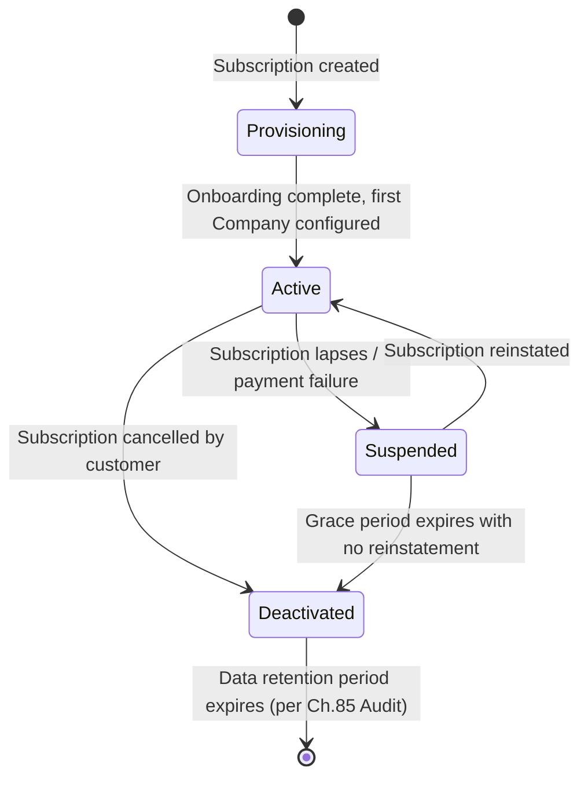

| State | Meaning | Can Users Transact? |
|---|---|---|
| Provisioning | Organization created, no Company configured yet | No |
| Active | At least one Company configured, subscription in good standing | Yes |
| Suspended | Subscription payment issue; data intact, access read-only or blocked per commercial policy | No (read-only, configurable) |
| Deactivated | Subscription cancelled; data retained per statutory/compliance retention period | No |

## 1.7 Business Workflow — Organization Onboarding

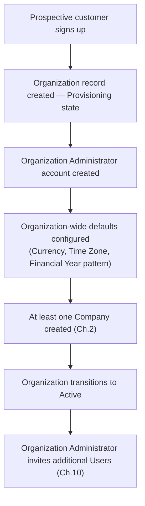

## 1.8 Business Rules

| Rule ID | Rule |
|---|---|
| ORG-001 | Every Organization must have exactly one designated **Organization Administrator** at all times — an Organization can never exist in a state with zero administrators. |
| ORG-002 | An Organization must have at least one Company before it can transition to Active state; an Organization with zero Companies cannot record any business transaction. |
| ORG-003 | Organization-wide default settings (Currency, Time Zone, Financial Year pattern) are inherited by every new Company unless that Company explicitly overrides them at creation (Chapter 2). |
| ORG-004 | An Organization's subscription module list determines which business capabilities (Accounting, Inventory, Sales, Payroll, etc.) are available to every Company beneath it — a Company cannot enable a module its parent Organization has not subscribed to. |
| ORG-005 | Deactivating an Organization deactivates every Company, Branch, Department, and User beneath it simultaneously — there is no partial-deactivation state at the Organization level. |

## 1.9 Validation Rules

- An Organization's legal/registered name is a required field and cannot be blank.
- An Organization must have a valid, verified primary contact email before it may leave Provisioning state.
- An Organization cannot be deleted while it holds any Company with posted financial transactions (Chapter 20 onward) — it may only be Deactivated, per the audit-retention discipline of Chapter 85.

## 1.10 Dependencies

The Organization concept has no upstream business dependency — it is the root of the entire business model this handbook defines. Every other chapter in this document depends, directly or transitively, on an Organization existing first.

## 1.11 Relationships

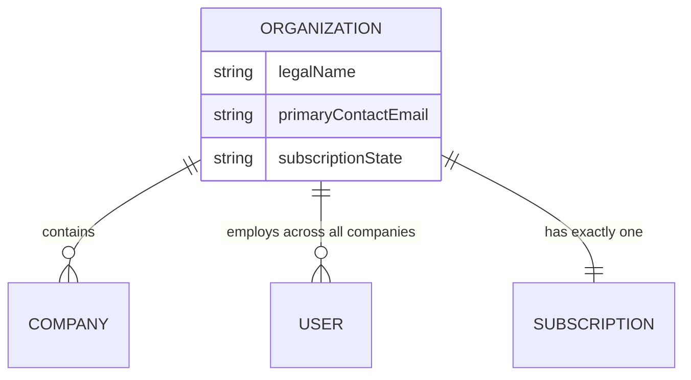

## 1.12 Examples

**Example 1 — Single-Company Organization:** "Acme Trading Pvt. Ltd." signs up for LedgerOne. It creates one Organization, "Acme Trading Pvt. Ltd.," and one Company beneath it with the identical legal name — the common case for a small or mid-market business with a single legal entity.

**Example 2 — Multi-Company Organization:** "Acme Group" signs up for LedgerOne to run three legally distinct subsidiaries — "Acme Manufacturing Ltd.," "Acme Retail Ltd.," and "Acme Logistics Ltd." — under one commercial relationship. One Organization, "Acme Group," is created, with three Companies beneath it, each with its own Chart of Accounts (Chapter 17) and Financial Year (Chapter 5), but sharing the Organization's subscription and Role/Permission model.

## 1.13 Exceptions

- An Organization Administrator may be temporarily unreachable (e.g., account lockout); this does not constitute an "Organization with zero administrators" violation of ORG-001 as long as a designated administrator account still exists in the system, merely inaccessible — a distinct, recoverable condition handled by account-recovery procedures, not by relaxing ORG-001.
- A newly-provisioned Organization may exist in Provisioning state indefinitely if onboarding is not completed — this is not itself a rule violation, but an Organization Administrator with a Provisioning-state Organization older than a defined threshold should be proactively contacted (a customer-success process, not a system-enforced rule).

## 1.14 Approval Rules

Organization-level actions requiring approval are limited to those with cross-Company or subscription-level consequence:

| Action | Approver |
|---|---|
| Adding a new Company | Organization Administrator |
| Changing Organization-wide default Currency or Financial Year pattern | Organization Administrator |
| Deactivating the Organization | Organization Administrator, with commercial/billing confirmation |

## 1.15 Accounting Impact

The Organization itself never directly posts accounting transactions — accounting occurs at the Company level (Chapter 15 onward), because a Company, not an Organization, is the statutory accounting entity. The Organization's accounting impact is indirect: its default Financial Year pattern and Currency (Chapters 5, 7) become the starting configuration every new Company inherits.

## 1.16 Inventory Impact

None directly — inventory is tracked at the Company/Warehouse level (Part 4). The Organization's module subscription (Business Rule ORG-004) determines whether Inventory capability exists for any Company at all.

## 1.17 Reporting Impact

An Organization-level consolidated report (combining multiple Companies' financials) is a distinct, advanced reporting capability — not assumed available by default, since each Company maintains independent statutory books (Chapter 15). Where an Organization requests consolidated reporting across its Companies, this is addressed specifically in Chapter 81 (Financial Reports), not assumed as a default Organization capability.

## 1.18 Audit Requirements

Every change to Organization-level settings (subscription module list, default Currency, default Financial Year pattern, Organization Administrator assignment) must be captured in the audit trail (Chapter 85) with who made the change, when, and the prior value — because these changes cascade to every Company beneath the Organization, an unaudited change here has the widest possible blast radius of any business-rule violation in this handbook.

## 1.19 Security Considerations

The Organization Administrator role is the most privileged business role that exists purely within an Organization's own trust boundary (distinct from LedgerOne's own Platform Operator role, defined structurally in `03_ARCHITECTURE.md` Chapter 9.6, which sits outside any single Organization entirely). An Organization Administrator can affect every Company, Branch, and User beneath their Organization — this concentration of authority is why Business Rule ORG-001 mandates at least one administrator always exists (to avoid an unrecoverable, ownerless Organization) while Chapter 11 (Roles) defines how that authority can be safely delegated without being duplicated unchecked.

## 1.20 Best Practices

- Model a genuinely single-legal-entity business as one Organization with one Company (Example 1), never as multiple Companies "for future flexibility" without a real statutory reason — this avoids unnecessary financial consolidation complexity later.
- Configure Organization-wide defaults (Currency, Financial Year pattern) accurately at onboarding — while a Company can override them, getting the common case right at the Organization level reduces repetitive configuration for every subsequent Company.

## 1.21 Common Mistakes

| Mistake | Why It's Wrong | Correct Approach |
|---|---|---|
| Creating a separate Organization for each subsidiary of one business group | Loses shared subscription, shared Role/Permission model, and any possibility of consolidated reporting (Ch.81) | One Organization, multiple Companies (Example 2) |
| Treating the Organization as the place where transactions are recorded | Organization is a container and default-setting authority only — all accounting happens at Company level (Ch.15) | Configure and post all transactions within a Company |
| Leaving an Organization with only one administrator whose account is inactive | Creates an effectively unrecoverable Organization, violating the spirit of ORG-001 | Always maintain at least one active, reachable Organization Administrator |

## 1.22 Future Expansion

- **Consolidated multi-Company reporting** (Chapter 81) is a natural extension of the Organization-to-Company relationship, to be designed once real multi-Company Organizations demonstrate the need, consistent with `03_ARCHITECTURE.md` Chapter 4.10's own flagged trigger for revisiting the Organization-to-Tenant simplification.
- **Organization-level billing and subscription self-service** (upgrading/downgrading module subscriptions) is anticipated as the Marketplace and broader module list (`01_PROJECT_CONTEXT.md`) matures, but is not defined in this handbook, which governs business behavior, not commercial/billing mechanics.

---

*Chapter 1 approved.*

---

# Chapter 2 — Company

## 2.1 Business Definition

A **Company** is a distinct legal entity for statutory, accounting, and tax purposes, existing within exactly one Organization (Chapter 1). A Company maintains its own Chart of Accounts (Chapter 17), its own Financial Year (Chapter 5), its own statutory books, and is the entity against which financial statements (Chapters 25-27) are legally prepared.

## 2.2 Purpose

The Company concept exists because a single Organization may legally comprise several independent entities (subsidiaries, regional legal entities) that must each produce their own statutory financial statements, while still sharing a single commercial LedgerOne subscription and administrative structure.

## 2.3 Mapping to the Frozen Architecture

A Company is **tenant-owned business data** — a business dimension within the single Tenant an Organization maps to (`03_ARCHITECTURE.md` Ch.4.6), never a separate Tenant. Every Company's data carries the same `tenant_id` as its parent Organization; Companies are distinguished from one another by a business-level `company_id` dimension, analogous to how Branch (Ch.3) and Cost Center (Ch.28) also segment tenant-owned data without creating new isolation boundaries.

## 2.4 Responsibilities

A Company owns: its Chart of Accounts, its Financial Year and Fiscal Periods, its Branches and Departments, its own set of Ledgers, Vouchers, and all transactional business data (Customers, Vendors, Products may be shared at Organization level or scoped per Company — see Business Rule CMP-004).

## 2.5 Scope

In scope: legal entity identity, statutory registration details, base Currency, accounting book ownership. Out of scope: transaction posting mechanics (Chapter 20 onward), User role assignment (Chapter 10).

## 2.6 Business Lifecycle

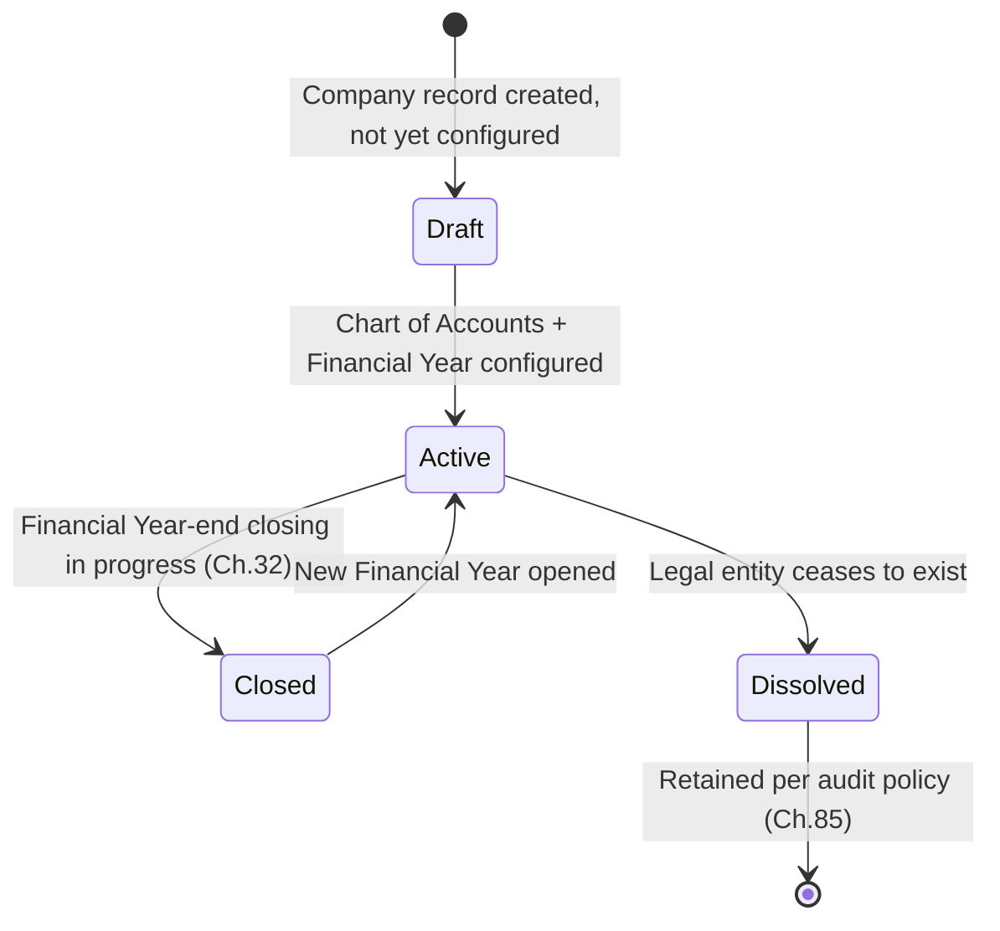

## 2.7 Business Workflow — Company Setup

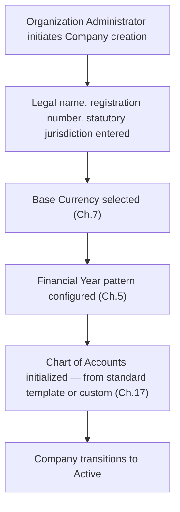

## 2.8 Business Rules

| Rule ID | Rule |
|---|---|
| CMP-001 | Every Company must belong to exactly one Organization; a Company cannot be reassigned to a different Organization once created. |
| CMP-002 | A Company must have exactly one base Currency (Chapter 7) at all times; the base Currency cannot be changed after the first transaction is posted. |
| CMP-003 | A Company must have a Chart of Accounts (Chapter 17) initialized before any Voucher (Chapter 21) can be posted. |
| CMP-004 | Master data (Customers, Vendors, Products) may be configured as Organization-wide (shared across all Companies) or Company-specific, per Organization Administrator configuration at Organization setup — but financial postings (Ledgers, Vouchers) are always strictly Company-specific, never shared. |
| CMP-005 | A Company cannot be Dissolved while any Fiscal Period (Chapter 6) remains open. |

## 2.9 Validation Rules

- Legal name and statutory registration number are required and must be unique within the Organization.
- Base Currency selection is locked immediately upon the first posted transaction (CMP-002) — attempting to change it thereafter must be rejected with an explicit error, never silently ignored.

## 2.10 Dependencies

Depends on: Organization (Chapter 1). Depended upon by: Branch (Ch.3), Department (Ch.4), Financial Year (Ch.5), Chart of Accounts (Ch.17), and effectively every subsequent chapter in Parts 3-11, since all transactional data is Company-scoped.

## 2.11 Relationships

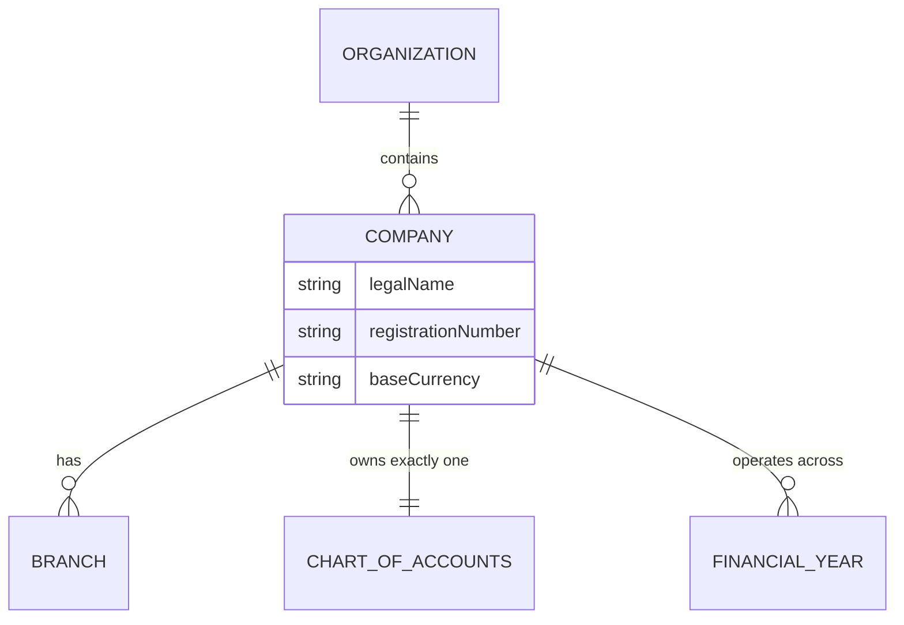

## 2.12 Examples

A regional distribution business, "Acme Retail Ltd.," operates in one country under one statutory registration. It is modeled as one Company under the "Acme Group" Organization (Chapter 1, Example 2), with its own Chart of Accounts and Financial Year distinct from its sibling Companies "Acme Manufacturing Ltd." and "Acme Logistics Ltd."

## 2.13 Exceptions

A Company may temporarily hold an incomplete Chart of Accounts during initial Draft-state configuration without violating CMP-003, provided no Voucher posting is attempted — the rule gates posting, not the intermediate configuration state itself.

## 2.14 Approval Rules

| Action | Approver |
|---|---|
| Creating a new Company | Organization Administrator |
| Changing a Company's Fiscal Period pattern before any transaction is posted | Organization Administrator or designated Company Administrator |
| Dissolving a Company | Organization Administrator, with confirmation that all Fiscal Periods are closed (CMP-005) |

## 2.15 Accounting Impact

The Company is the fundamental accounting entity in LedgerOne — every Ledger, Journal, Voucher, Trial Balance, Profit & Loss, and Balance Sheet (Chapters 19-27) is produced strictly per Company, never blended across Companies, because each Company represents an independent legal and statutory reporting obligation.

## 2.16 Inventory Impact

Inventory (Part 4) is tracked per Company (and further per Warehouse, Chapter 37) — stock in one Company's warehouse is never commingled with another Company's stock in inventory valuation or reporting, even under the same Organization.

## 2.17 Reporting Impact

All statutory financial reports (Chapters 25-27) are produced at Company level by design. Organization-level consolidated reporting (Chapter 81) aggregates across Companies but never replaces per-Company statutory reporting.

## 2.18 Audit Requirements

Changes to a Company's base Currency lock status, Chart of Accounts structure, or Fiscal Period configuration must be captured in the audit trail (Chapter 85) — these are foundational configuration changes with irreversible downstream consequences for every transaction subsequently posted.

## 2.19 Security Considerations

Access to a Company's data is governed by Role/Permission assignment (Chapters 11-12) scoped per Company where an Organization has multiple Companies — a User with access to "Acme Manufacturing Ltd." should not automatically have access to "Acme Retail Ltd." unless explicitly granted, even within the same Organization.

## 2.20 Best Practices

- Finalize base Currency and Chart of Accounts template selection before any real transaction is posted — both become effectively immutable per CMP-002 and the practical difficulty of restructuring a live Chart of Accounts.
- Decide Organization-wide vs. Company-specific master data (CMP-004) deliberately at Organization setup, based on whether Customers/Vendors/Products are genuinely shared across legal entities or not.

## 2.21 Common Mistakes

| Mistake | Why It's Wrong | Correct Approach |
|---|---|---|
| Creating one Company per Branch/location instead of per legal entity | Fragments statutory reporting unnecessarily; Branches (Ch.3) already model locations within one Company | Use Branch, not Company, for locations sharing one legal/statutory identity |
| Sharing a single Chart of Accounts object across multiple Companies | Violates CMP-003's "exactly one Chart of Accounts per Company" and breaks independent statutory reporting | Each Company gets its own Chart of Accounts, even if initialized from the same template |

## 2.22 Future Expansion

- Inter-Company transactions (e.g., Acme Manufacturing selling to Acme Retail) with automated elimination in consolidated reporting is a natural extension, deferred until Chapter 81's consolidated reporting is designed against real multi-Company demand.

---

*Chapter 2 approved (proceeding without pause per instruction).*

---

# Chapter 3 — Branch

## 3.1 Business Definition

A **Branch** is a physical or operational location within a Company — a place where business is conducted (an office, a store, a warehouse-adjacent site) — used to segment operational and, optionally, financial reporting without constituting a separate legal entity.

## 3.2 Purpose

Branches let a single Company operate across multiple physical locations while retaining one Chart of Accounts and one set of statutory books, with the ability to report performance and control access per location.

## 3.3 Responsibilities

A Branch owns: its own address and locale defaults (Chapter 9), and serves as a scoping dimension for Sales Orders, Purchase Orders, and Inventory Warehouses (Chapter 37) associated with that location.

## 3.4 Scope

In scope: location identity and its use as a reporting/access-control dimension. Out of scope: independent statutory accounting (that is Company, Chapter 2) and physical stock-keeping mechanics (Warehouse, Chapter 37 — a Branch may have one or more Warehouses, but is not itself a Warehouse).

## 3.5 Business Lifecycle

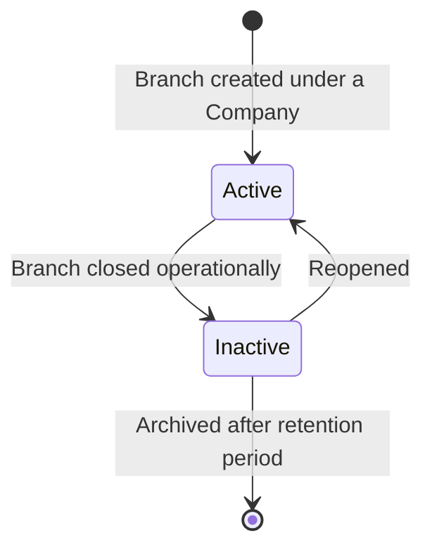

## 3.6 Business Workflow

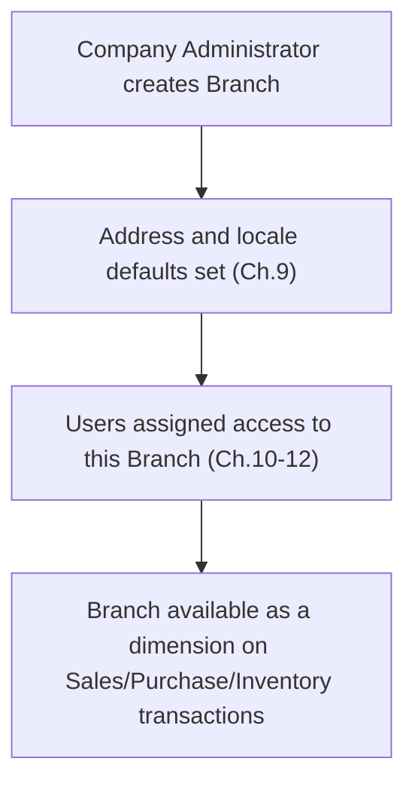

## 3.7 Business Rules

| Rule ID | Rule |
|---|---|
| BRN-001 | Every Branch must belong to exactly one Company. |
| BRN-002 | A Company must have at least one Branch — a default "Head Office" Branch is created automatically at Company setup if none is explicitly configured. |
| BRN-003 | A Branch cannot be deleted while any active Warehouse (Ch.37) or open transaction references it — it may only be set Inactive. |

## 3.8 Validation Rules

- Branch name must be unique within its parent Company.
- A Branch's address must resolve to a valid Business Location record (Chapter 9).

## 3.9 Dependencies

Depends on: Company (Ch.2), Business Locations (Ch.9). Depended upon by: Warehouse (Ch.37), and optionally Sales Order (Ch.48) / Purchase Order (Ch.56) as a reporting dimension.

## 3.10 Relationships

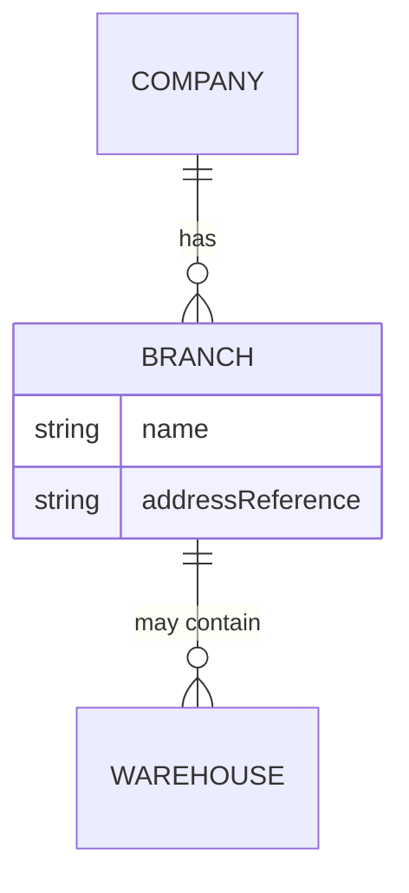

## 3.11 Examples

"Acme Retail Ltd." operates a Head Office and two regional stores. All three are modeled as Branches under one Company — one Chart of Accounts, three operational locations, each independently reportable for sales performance.

## 3.12 Exceptions

A Branch with no assigned Users may still receive transactions posted by Users from another Branch with cross-Branch access permission (Chapter 12) — Branch is a reporting/location dimension, not by itself an access barrier, unless Permission rules (Chapter 12) explicitly scope a User to specific Branches.

## 3.13 Approval Rules

Creating, renaming, or deactivating a Branch requires Company Administrator approval.

## 3.14 Accounting Impact

Branch may optionally be used as a reporting dimension on Journals/Vouchers (Chapter 20-21) for location-level profitability reporting, without creating a separate set of books — this differs fundamentally from Company, which does maintain separate books.

## 3.15 Inventory Impact

A Branch commonly contains one or more Warehouses (Chapter 37); stock is physically tracked at the Warehouse level, with Branch serving as a grouping/reporting layer above it.

## 3.16 Reporting Impact

Branch-level performance reports (sales by location, stock movement by location) are a standard operational reporting capability (Chapter 82), distinct from statutory financial reporting which remains at Company level.

## 3.17 Audit Requirements

Branch creation, renaming, and deactivation are audited (Ch.85), given their effect on transaction routing and reporting dimensions.

## 3.18 Security Considerations

Role/Permission assignment (Chapters 11-12) may scope a User to specific Branches, restricting their visibility of transactions and reports to those locations only — an important control for businesses with region-specific staff.

## 3.19 Best Practices

Model genuinely distinct physical operating locations as Branches; do not create a Branch for every Department or team, which is a separate organizational dimension (Chapter 4).

## 3.20 Common Mistakes

| Mistake | Why It's Wrong | Correct Approach |
|---|---|---|
| Creating a Branch per legal entity instead of per Company | Confuses the legal/statutory boundary (Company) with an operational one (Branch) | Use Company for legal entities, Branch for locations within one legal entity |
| Using Branch to model organizational teams (e.g., "Finance," "Sales") | Conflates a location dimension with a departmental dimension | Use Department (Ch.4) for organizational/functional grouping |

## 3.21 Future Expansion

Branch-level budgeting (Chapter 29) and Branch-specific approval thresholds (Chapter 13) are natural extensions once real multi-Branch usage patterns are observed.

---

*Chapter 3 approved (proceeding without pause per instruction).*

---

# Chapter 4 — Department

## 4.1 Business Definition

A **Department** is a functional/organizational grouping of Users and, optionally, expenses within a Company (e.g., Finance, Sales, Operations, HR) — used for organizational reporting and approval-routing purposes, independent of physical location (Branch, Chapter 3).

## 4.2 Purpose

Departments let a business analyze cost and performance by organizational function, and let approval workflows (Chapter 13) route based on functional ownership rather than physical location alone.

## 4.3 Responsibilities

A Department owns its own name, its assigned Employees (Chapter 75) for HR/Payroll purposes, and optionally serves as a Cost Center (Chapter 28) dimension for expense allocation.

## 4.4 Scope

In scope: organizational/functional grouping and its use in approval routing and cost reporting. Out of scope: physical location (Branch, Ch.3) and financial account structure (Chart of Accounts, Ch.17).

## 4.5 Business Lifecycle

Departments follow the same Active/Inactive lifecycle pattern as Branch (Ch.3.5), created and deactivated at Company Administrator discretion.

## 4.6 Business Workflow

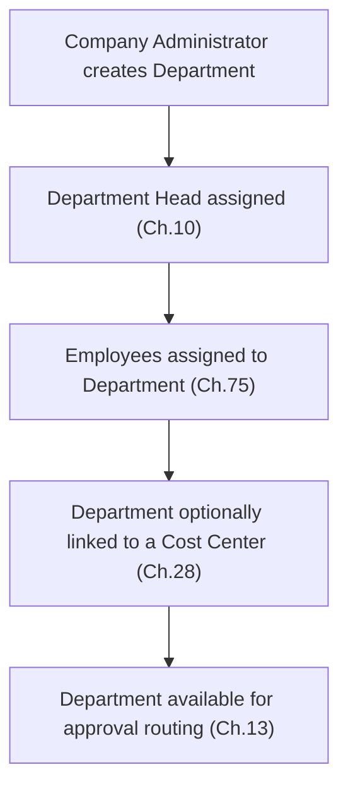

## 4.7 Business Rules

| Rule ID | Rule |
|---|---|
| DPT-001 | Every Department belongs to exactly one Company. |
| DPT-002 | A Department may have exactly one designated Department Head, used as the default approver in Approval Workflow routing (Ch.13) unless overridden. |
| DPT-003 | A Department cannot be deleted while active Employees (Ch.75) remain assigned to it — it may only be set Inactive, with Employees reassigned first. |

## 4.8 Validation Rules

Department name must be unique within its Company.

## 4.9 Dependencies

Depends on: Company (Ch.2). Depended upon by: Users (Ch.10) for organizational assignment, Employees (Ch.75) for HR structure, Cost Centers (Ch.28) for expense allocation, Approval Workflow (Ch.13) for routing.

## 4.10 Relationships

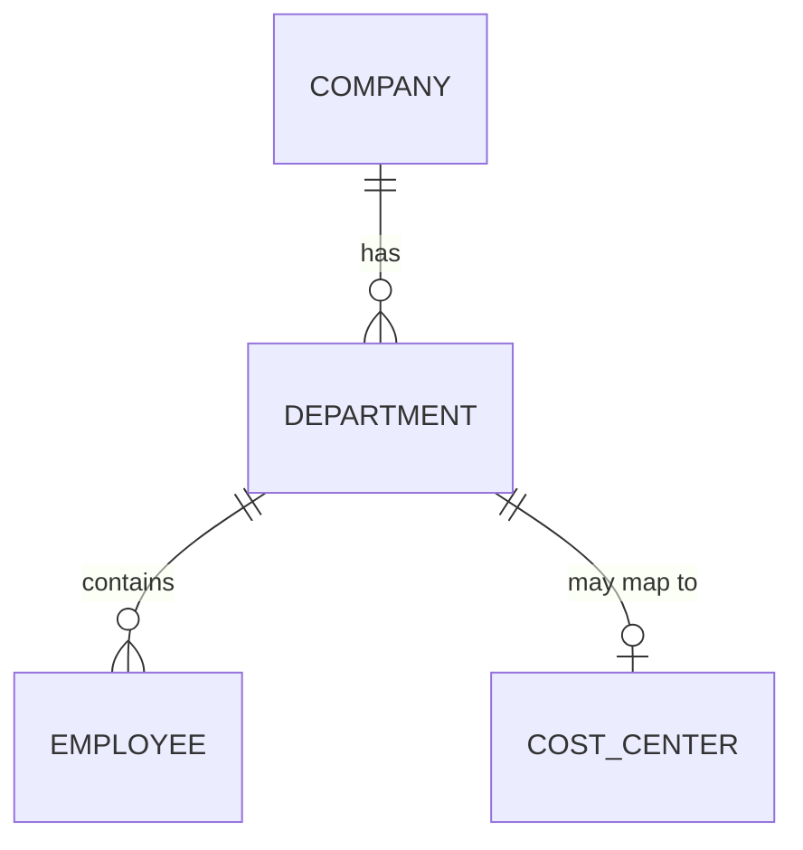

## 4.11 Examples

"Acme Manufacturing Ltd." has Finance, Production, and Sales Departments. A Purchase Requisition (Chapter 55) raised by a Production Department employee routes for approval to the Production Department Head by default (Chapter 13).

## 4.12 Exceptions

An Employee may be temporarily assigned to a second Department for a cross-functional project without changing their primary Department of record — this dual assignment is an HR/organizational nuance handled in Chapter 75, not a violation of DPT-001's "exactly one Company" rule (which concerns Company, not Department, exclusivity for Employees).

## 4.13 Approval Rules

Creating or reassigning a Department Head requires Company Administrator approval.

## 4.14 Accounting Impact

Where a Department is mapped to a Cost Center (Ch.28), departmental expenses are automatically attributable to that Cost Center for reporting, without creating a separate ledger.

## 4.15 Inventory Impact

None directly, unless a Department (e.g., Production) is also configured as a stock-consuming location for Manufacturing purposes — addressed in future Manufacturing-specific chapters, not this handbook's initial scope.

## 4.16 Reporting Impact

Departmental performance and expense reports (Chapter 82) are a standard operational reporting output.

## 4.17 Audit Requirements

Department Head reassignment is audited (Ch.85), given its effect on default approval routing.

## 4.18 Security Considerations

Department membership may inform Role/Permission scoping (Ch.12) — e.g., a Finance Department User may have broader accounting access than a Sales Department User by default role assignment.

## 4.19 Best Practices

Align Department structure with actual approval-routing needs — a Department with no distinct approval or cost-reporting purpose adds organizational complexity without benefit.

## 4.20 Common Mistakes

| Mistake | Why It's Wrong | Correct Approach |
|---|---|---|
| Creating a Department for every small team without a distinct approval or cost need | Adds unnecessary configuration overhead | Reserve Departments for groupings with real approval-routing or cost-reporting purpose |
| Assuming Department automatically restricts data access | Department is an organizational/routing dimension; access control is governed by Role/Permission (Ch.11-12), not Department membership alone | Configure explicit Permission scoping if department-based access restriction is required |

## 4.21 Future Expansion

Department-level budgeting (Ch.29) and multi-Department cost-splitting rules are natural extensions once real usage patterns emerge.

---

*Chapter 4 approved (proceeding without pause per instruction).*

---

# Chapter 5 — Financial Year

## 5.1 Business Definition

A **Financial Year** is the twelve-month (or otherwise statutorily defined) accounting period a Company uses to prepare its statutory financial statements (Chapters 25-27), composed of multiple Fiscal Periods (Chapter 6).

## 5.2 Purpose

Financial Year defines the reporting cycle every Trial Balance, Profit & Loss, and Balance Sheet is prepared against, and is the outer boundary within which Financial Closing (Chapter 32) occurs.

## 5.3 Responsibilities

Owns: its start and end date, its constituent Fiscal Periods, and its open/closed state, which gates whether new transactions may be posted into it.

## 5.4 Scope

In scope: the annual reporting cycle definition. Out of scope: monthly/quarterly period mechanics (Fiscal Period, Ch.6) and the closing process itself (Financial Closing, Ch.32).

## 5.5 Business Lifecycle

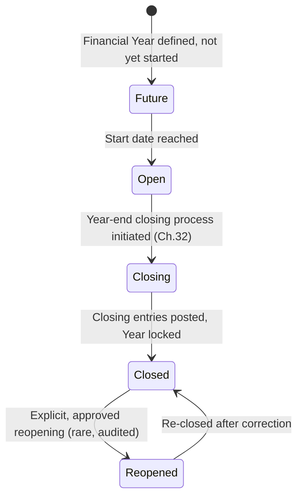

## 5.6 Business Workflow

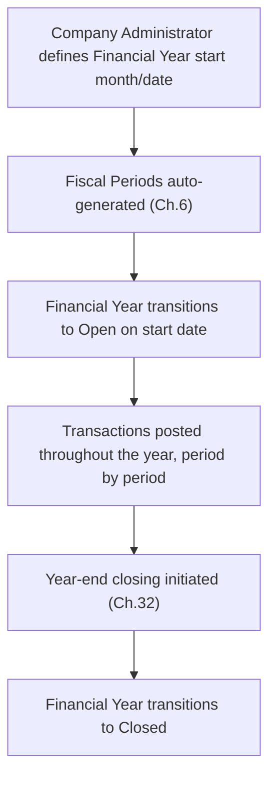

## 5.7 Business Rules

| Rule ID | Rule |
|---|---|
| FY-001 | Every Company must have a defined Financial Year pattern (start month and day) before any Voucher can be posted (dependency on CMP-003). |
| FY-002 | Financial Years for a Company must be contiguous — no gap or overlap is permitted between one Financial Year's end date and the next's start date. |
| FY-003 | No transaction may be posted into a Closed Financial Year; posting requires the relevant Fiscal Period (Ch.6) to be Open. |
| FY-004 | Reopening a Closed Financial Year requires explicit approval (Ch.32) and is itself a heavily audited exception, never a routine operation. |

## 5.8 Validation Rules

A Financial Year's start and end dates must not overlap any existing Financial Year for the same Company.

## 5.9 Dependencies

Depends on: Company (Ch.2). Depended upon by: Fiscal Period (Ch.6), every accounting chapter (Ch.19-33), Budgets (Ch.29).

## 5.10 Relationships

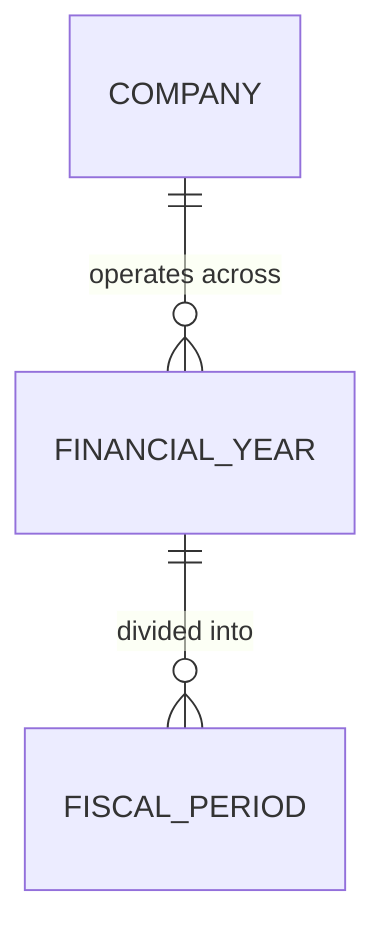

## 5.11 Examples

A Company operating on an April-to-March Financial Year (common in several jurisdictions) defines FY 2026-27 as April 1, 2026 to March 31, 2027, automatically generating twelve monthly Fiscal Periods.

## 5.12 Exceptions

A Company's first Financial Year may be shorter or longer than twelve months (a "stub period") to align with a statutory Financial Year pattern from an arbitrary incorporation date — this is a recognized, valid exception to the otherwise-standard twelve-month cycle, not a rule violation.

## 5.13 Approval Rules

Defining the initial Financial Year pattern requires Company Administrator approval; reopening a Closed Financial Year (FY-004) requires the elevated approval defined in Chapter 32.

## 5.14 Accounting Impact

The Financial Year is the outermost boundary for every accounting report in Part 3 — a Trial Balance, P&L, or Balance Sheet is always reported "as of" or "for" a specific Financial Year (or period within it), never spanning an undefined range.

## 5.15 Inventory Impact

Stock Valuation (Chapter 43) and Inventory Adjustment (Chapter 44) postings are also gated by open Fiscal Period state, since they generate accounting entries subject to the same Financial Year boundary.

## 5.16 Reporting Impact

Every financial report in Chapters 25-27 is scoped to a Financial Year (or period within it) as a mandatory reporting parameter.

## 5.17 Audit Requirements

Financial Year definition and any reopening event (FY-004) are audited with full detail, given their consequence for every transaction within the period.

## 5.18 Security Considerations

Only Company Administrators (or an explicitly delegated Finance role, Ch.11) may define or reopen a Financial Year — this is among the most consequential configuration actions in the entire system.

## 5.19 Best Practices

Define the Financial Year pattern accurately at Company setup, aligned to the Company's actual statutory reporting requirement, before any transaction is posted.

## 5.20 Common Mistakes

| Mistake | Why It's Wrong | Correct Approach |
|---|---|---|
| Leaving gaps between Financial Years | Violates FY-002's contiguity rule and breaks period-over-period reporting continuity | Ensure each new Financial Year's start date immediately follows the prior year's end date |
| Reopening a Closed Financial Year routinely for minor corrections | Undermines the integrity of statutory closing (Ch.32) | Use period-appropriate correcting entries in the current open period instead, reserving reopening for genuine, approved exceptions |

## 5.21 Future Expansion

Support for non-calendar, statutory-jurisdiction-specific Financial Year variations (e.g., 52/53-week fiscal calendars) is a natural extension as LedgerOne expands into additional geographies.

---

*Chapter 5 approved (proceeding without pause per instruction).*

---

# Chapter 6 — Fiscal Period

## 6.1 Business Definition

A **Fiscal Period** is a subdivision of a Financial Year (Chapter 5) — typically monthly — representing the granular unit at which transactions are posted, periods are individually closed, and interim reports are produced.

## 6.2 Purpose

Fiscal Periods let a business close its books incrementally (month by month) rather than only at Financial Year-end, catching errors early and enabling timely interim reporting.

## 6.3 Responsibilities

Owns: its own open/closed state (independent of, but bounded by, its parent Financial Year's state), and gates whether a specific transaction date is postable.

## 6.4 Scope

In scope: period-level open/close state and its effect on posting eligibility. Out of scope: the annual cycle itself (Ch.5) and the closing process mechanics (Ch.32).

## 6.5 Business Lifecycle

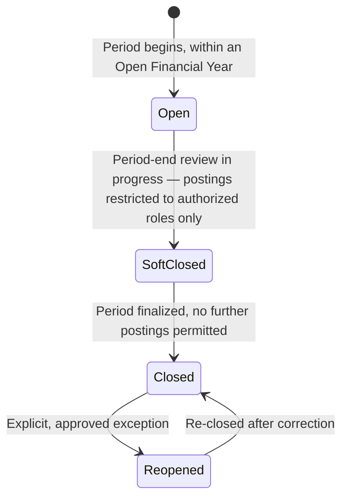

## 6.6 Business Workflow

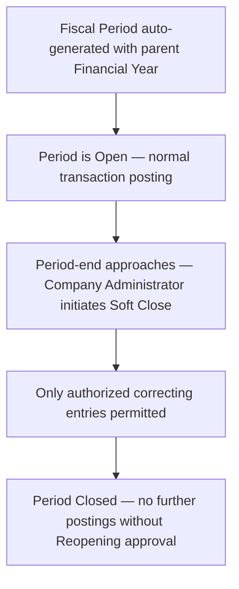

## 6.7 Business Rules

| Rule ID | Rule |
|---|---|
| FP-001 | Every transaction's posting date must fall within an Open (or Soft-Closed, if the User is authorized) Fiscal Period. |
| FP-002 | A Fiscal Period cannot be Closed while its Financial Year remains in a state that would make the period's closing inconsistent (e.g., an earlier period in the same year is still Open) — periods close in chronological order. |
| FP-003 | Reopening a Closed Fiscal Period requires the same elevated approval as reopening a Financial Year (Ch.5, FY-004) when the period being reopened is not the most recently closed one. |

## 6.8 Validation Rules

A transaction dated within a Closed period must be rejected at entry with a clear error identifying the closed period — never silently redirected to a different period.

## 6.9 Dependencies

Depends on: Financial Year (Ch.5). Depended upon by: every Voucher-posting chapter (Ch.20-23), Trial Balance (Ch.24), Financial Closing (Ch.32).

## 6.10 Relationships

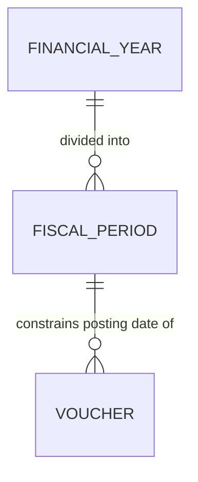

## 6.11 Examples

A Company with an April-March Financial Year has twelve monthly Fiscal Periods. At the end of May, the Finance team Soft Closes the May period while final adjustments are reviewed, then fully Closes it once June's Trial Balance reconciles cleanly.

## 6.12 Exceptions

An authorized correcting entry may be posted into a Soft-Closed period by a specifically permissioned role (Chapter 12) even though ordinary Users cannot — this is the defined purpose of the Soft-Closed state, not an exception to it.

## 6.13 Approval Rules

Soft-closing and Closing a period requires Company Administrator or designated Finance Manager approval; Reopening a period out of chronological order (FP-003) requires elevated, audited approval.

## 6.14 Accounting Impact

Period-level closing is what makes monthly Trial Balances (Ch.24) and interim P&L/Balance Sheet reporting (Ch.25-26) reliable and final, rather than perpetually subject to retroactive change.

## 6.15 Inventory Impact

Stock Valuation snapshots (Ch.43) are commonly taken at period boundaries; a Closed period's stock valuation is final for reporting purposes.

## 6.16 Reporting Impact

Period-over-period comparative reporting (Ch.81) depends entirely on periods closing reliably and in order.

## 6.17 Audit Requirements

Every period close, soft-close, and reopen event is audited (Ch.85) with the responsible User and timestamp.

## 6.18 Security Considerations

Only specifically permissioned Finance roles may post into a Soft-Closed period or approve a Reopening — this is a deliberately narrow permission, distinct from general Voucher-posting permission (Ch.12).

## 6.19 Best Practices

Close Fiscal Periods promptly and in order each month rather than leaving multiple periods perpetually Open, which undermines the reliability of interim reporting.

## 6.20 Common Mistakes

| Mistake | Why It's Wrong | Correct Approach |
|---|---|---|
| Leaving many months' periods Open simultaneously "to stay flexible" | Undermines interim reporting reliability and increases the risk of retroactive, unreviewed changes to closed-in-spirit periods | Close periods promptly each month, using Reopening only for genuine, approved exceptions |
| Closing a later period while an earlier one remains Open | Violates FP-002's chronological-order rule and can produce inconsistent cumulative figures | Always close periods strictly in chronological order |

## 6.21 Future Expansion

Automated period-close checklists (validating Trial Balance reconciliation, bank reconciliation completion, etc. before allowing Close) are a natural future enhancement to the Soft-Close workflow.

---

*Chapter 6 approved (proceeding without pause per instruction).*

---

# Chapter 7 — Currency

## 7.1 Business Definition

A **Currency** is a unit of monetary value (e.g., USD, EUR, INR) that LedgerOne supports for transactions, reporting, and Multi-Currency operations (Chapter 30).

## 7.2 Purpose

Currency definition underlies every monetary value in the system — every Voucher, Invoice, and financial report expresses amounts in a defined Currency, with a Company's Base Currency (Ch.2) as the anchor for statutory reporting regardless of the currency any individual transaction is conducted in.

## 7.3 Responsibilities

Owns: its ISO code, symbol, and decimal precision convention (e.g., 2 decimal places for most currencies, 0 for some).

## 7.4 Scope

In scope: currency definition and precision rules. Out of scope: exchange rate values and conversion mechanics (Chapter 31).

## 7.5 Business Lifecycle

Currencies are largely static platform-owned reference data (per `03_ARCHITECTURE.md` Ch.4.8), activated for use by a specific Organization/Company as needed; they are not created or deleted by end users in the ordinary course of business.

## 7.6 Business Workflow

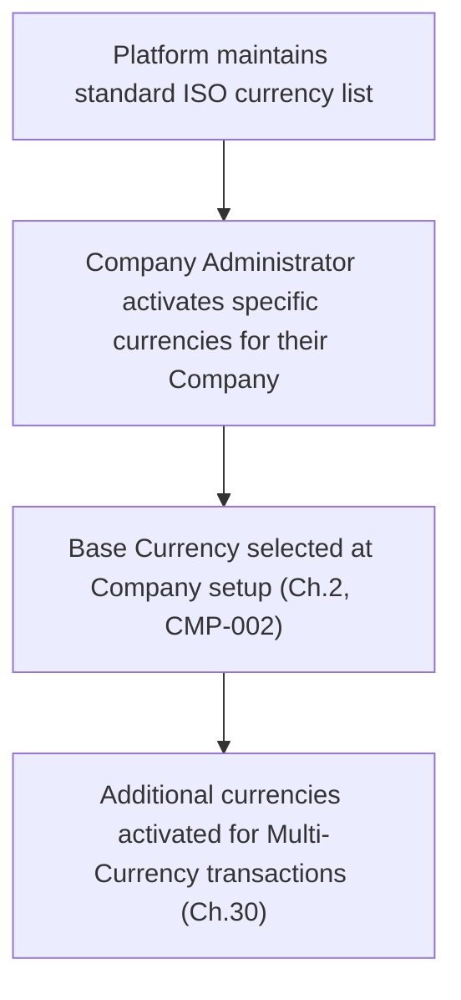

## 7.7 Business Rules

| Rule ID | Rule |
|---|---|
| CUR-001 | Every Company has exactly one Base Currency (Ch.2, CMP-002), fixed after the first transaction. |
| CUR-002 | A transaction Currency other than the Base Currency requires an Exchange Rate (Ch.31) at the transaction date to convert to Base Currency for statutory reporting. |
| CUR-003 | Currency decimal precision (e.g., 2 decimal places) must be applied consistently to every amount in that currency across the system — no transaction may be recorded with sub-unit precision beyond the currency's defined convention. |

## 7.8 Validation Rules

A transaction's Currency must be one explicitly activated for the Company; an inactive currency cannot be selected on a new transaction.

## 7.9 Dependencies

Depended upon by: Company (Ch.2, base currency), every monetary transaction chapter, Exchange Rates (Ch.31), Multi-Currency (Ch.30).

## 7.10 Relationships

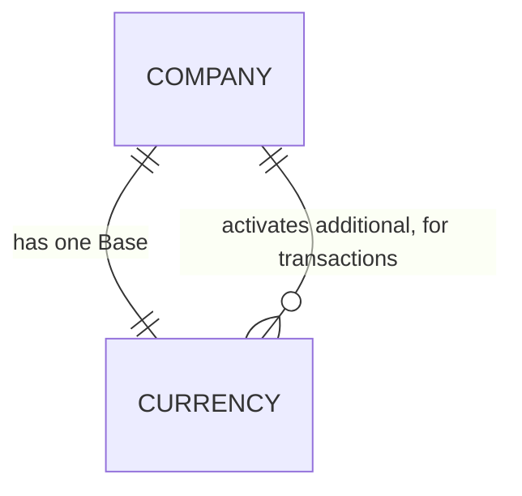

## 7.11 Examples

"Acme Retail Ltd." has INR as its Base Currency but activates USD to record purchases from an overseas vendor, converting each USD invoice to INR at the applicable Exchange Rate (Ch.31) for statutory books.

## 7.12 Exceptions

None material beyond the precision rule (CUR-003), which is a hard constraint with no business exception.

## 7.13 Approval Rules

Activating a new currency for Company use requires Company Administrator approval.

## 7.14 Accounting Impact

All statutory financial statements (Ch.25-27) are presented in Base Currency; foreign-currency transactions are converted at posting per Chapter 31, with any resulting gain/loss handled per Chapter 30's Multi-Currency rules.

## 7.15 Inventory Impact

Inventory valuation (Ch.43) for goods purchased in a foreign currency is recorded in Base Currency using the applicable Exchange Rate at the transaction date.

## 7.16 Reporting Impact

Reports may optionally display transaction-currency figures alongside Base Currency figures, but statutory totals are always Base Currency.

## 7.17 Audit Requirements

Currency activation/deactivation for a Company is audited.

## 7.18 Security Considerations

None specific beyond standard configuration-change controls (Ch.12).

## 7.19 Best Practices

Activate only the currencies a Company genuinely transacts in — an unused, activated currency adds selection noise without benefit.

## 7.20 Common Mistakes

| Mistake | Why It's Wrong | Correct Approach |
|---|---|---|
| Recording a transaction with more decimal precision than the currency's defined convention | Violates CUR-003 and can cause rounding discrepancies in reporting | Enforce the currency's defined decimal precision on every amount |
| Changing Base Currency after transactions exist | Violates CUR-001/CMP-002 and invalidates prior statutory reporting | Base Currency is fixed at first transaction; a genuine change requires a new Company |

## 7.21 Future Expansion

Cryptocurrency or non-ISO-standard currency support is a plausible future extension, not in current scope.

---

*Chapter 7 approved (proceeding without pause per instruction).*

---

# Chapter 8 — Time Zone

## 8.1 Business Definition

A **Time Zone** defines the local civil time convention (e.g., America/New_York, Asia/Kolkata) used to interpret and display transaction timestamps, deadlines, and scheduled processes for an Organization, Company, or individual User.

## 8.2 Purpose

Time Zone ensures that transaction dates, approval deadlines, and period-close cutoffs are interpreted consistently and meaningfully relative to where the business actually operates, especially for multi-location Organizations spanning several time zones.

## 8.3 Responsibilities

Defines the default Time Zone at Organization level (Ch.1), optionally overridden per Company or Branch, and per User for personal display preference only (never affecting the authoritative transaction date).

## 8.4 Scope

In scope: time zone definition and its precedence hierarchy. Out of scope: the underlying date/period mechanics themselves (Ch.5-6).

## 8.5 Business Lifecycle

Time Zone is static configuration, set at Organization/Company/Branch setup and changed only rarely and deliberately.

## 8.6 Business Workflow

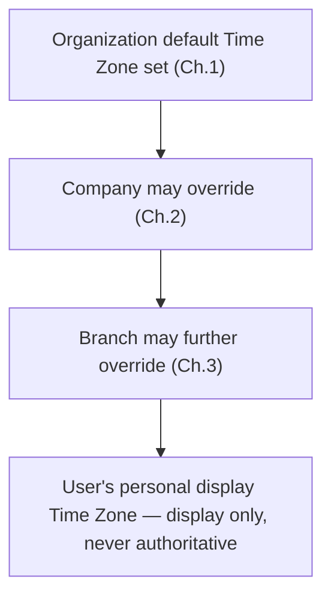

## 8.7 Business Rules

| Rule ID | Rule |
|---|---|
| TZ-001 | Every Organization has a default Time Zone; every Company and Branch inherits it unless explicitly overridden. |
| TZ-002 | The authoritative transaction date/time for accounting and period-close purposes is always the Company's (or Branch's, if overridden) Time Zone — a User's personal display Time Zone preference never changes the authoritative posting date. |

## 8.8 Validation Rules

Time Zone must be a valid, recognized IANA time zone identifier.

## 8.9 Dependencies

Depends on: Organization (Ch.1). Depended upon by: Fiscal Period cutoff determination (Ch.6), Approval Workflow deadlines (Ch.13).

## 8.10 Relationships

Time Zone is a simple attribute of Organization, Company, and Branch — no independent entity relationships beyond that hierarchy.

## 8.11 Examples

An Organization headquartered with a default Time Zone, operating a Branch in a different time zone, ensures that Branch's transaction cutoffs (e.g., "end of day" for a Sales Order) reflect its own local time, not the Organization default.

## 8.12 Exceptions

None material.

## 8.13 Approval Rules

Changing a Company or Branch's Time Zone requires Company Administrator approval, given its effect on transaction date interpretation.

## 8.14 Accounting Impact

Determines which Fiscal Period a transaction posted near a period boundary actually falls into (TZ-002).

## 8.15 Inventory Impact

Stock movement timestamps (Ch.39) are recorded per the relevant Branch/Warehouse Time Zone for accurate sequencing.

## 8.16 Reporting Impact

Reports display timestamps converted to the viewing User's personal preference (Section 8.7) while authoritative period attribution remains per TZ-002.

## 8.17 Audit Requirements

Time Zone configuration changes are audited, given their effect on transaction-date interpretation.

## 8.18 Security Considerations

None specific.

## 8.19 Best Practices

Set Time Zone accurately at each Branch's actual physical location to avoid period-boundary transaction misattribution.

## 8.20 Common Mistakes

| Mistake | Why It's Wrong | Correct Approach |
|---|---|---|
| Assuming a User's personal display Time Zone affects the authoritative posting date | Violates TZ-002 — could cause confusion about which Fiscal Period a transaction belongs to | Authoritative date is always the Company/Branch Time Zone, regardless of viewer preference |

## 8.21 Future Expansion

Daylight-saving-transition-aware scheduling for recurring processes (e.g., recurring invoice generation) is a natural refinement as real usage surfaces edge cases.

---

*Chapter 8 approved (proceeding without pause per instruction).*

---

# Chapter 9 — Business Locations

## 9.1 Business Definition

A **Business Location** is a structured physical address record (street, city, region, postal code, country) used by Organizations, Companies, Branches, Warehouses, Customers, and Vendors wherever an address is required.

## 9.2 Purpose

A single, consistent address model avoids duplicated, inconsistent address data across every entity that needs one, and enables location-aware tax rules (Ch.66-70) and shipping logic (Ch.49).

## 9.3 Responsibilities

Owns: structured address fields and country/region classification used to determine applicable tax jurisdiction (Part 8).

## 9.4 Scope

In scope: address structure and its reuse across entities. Out of scope: the tax-rule logic itself (Ch.66-70), which merely consumes location data as an input.

## 9.5 Business Lifecycle

Business Locations are created as needed by whichever entity requires an address, and are updated or superseded as entities relocate.

## 9.6 Business Workflow

```mermaid
flowchart TD
    A["Entity (Branch, Warehouse, Customer, Vendor) requires an address"] --> B["Business Location record created or selected"]
    B --> C["Country/Region determines applicable Tax Group (Ch.67)"]
```

## 9.7 Business Rules

| Rule ID | Rule |
|---|---|
| LOC-001 | Every Business Location must specify a valid Country, required for tax-jurisdiction determination (Part 8). |
| LOC-002 | A Branch or Warehouse's Business Location determines the default Tax Group (Ch.67) applied to transactions originating from it, unless explicitly overridden. |

## 9.8 Validation Rules

Postal code format is validated against the selected Country's known format where feasible.

## 9.9 Dependencies

Depended upon by: Branch (Ch.3), Warehouse (Ch.37), Customer (Ch.45), Vendor (Ch.54), Tax Rules (Ch.68).

## 9.10 Relationships

```mermaid
erDiagram
    BUSINESS_LOCATION ||--o{ BRANCH : "address of"
    BUSINESS_LOCATION ||--o{ WAREHOUSE : "address of"
    BUSINESS_LOCATION ||--o{ CUSTOMER : "address of"
    BUSINESS_LOCATION ||--o{ VENDOR : "address of"
```

## 9.11 Examples

A Customer's billing and shipping Business Locations may differ (e.g., billed to a head office, shipped to a warehouse) — both are independent Business Location records associated with the same Customer.

## 9.12 Exceptions

An entity may have multiple Business Locations for different purposes (billing vs. shipping) — this is standard, not exceptional.

## 9.13 Approval Rules

None beyond standard record-edit permissions (Ch.12).

## 9.14 Accounting Impact

Indirect — via Tax Group determination (Ch.67) that affects tax postings.

## 9.15 Inventory Impact

Warehouse location determines shipping-distance and regional stock-allocation logic (Ch.49 Delivery).

## 9.16 Reporting Impact

Enables geographic sales/purchase analysis (Ch.82).

## 9.17 Audit Requirements

Address changes on statutory entities (Company, Branch) are audited given their tax-jurisdiction implications.

## 9.18 Security Considerations

None specific.

## 9.19 Best Practices

Maintain accurate, complete address data especially for tax-jurisdiction-relevant entities (Branches, Warehouses) to avoid tax misclassification.

## 9.20 Common Mistakes

| Mistake | Why It's Wrong | Correct Approach |
|---|---|---|
| Leaving Country blank on a Business Location | Breaks tax-jurisdiction determination (LOC-001) | Country is always required |
| Conflating billing and shipping addresses into one record | Loses the ability to bill and ship to different locations independently | Maintain separate Business Location records per purpose |

## 9.21 Future Expansion

Address validation via an external postal/geocoding service is a natural future integration, consistent with `03_ARCHITECTURE.md` Ch.2.3.3's external-integration model.

---

*Chapter 9 approved (proceeding without pause per instruction).*

---

# PART 2 — USERS

# Chapter 10 — Users

## 10.1 Business Definition

A **User** is a human actor with an authenticated identity in LedgerOne, belonging to exactly one Organization (per `03_ARCHITECTURE.md` Ch.4.3), assigned one or more Roles (Ch.11) that govern what they may see and do.

## 10.2 Purpose

Users are the acting identity behind every transaction, approval, and configuration change — every Business Rule's "Approval Rules" section throughout this handbook resolves to a specific User (or System Identity, per `03_ARCHITECTURE.md` Ch.13.6, for automated processes).

## 10.3 Responsibilities

Owns: personal identity (name, email, login credentials — mechanics per `03_ARCHITECTURE.md` Ch.9), Role assignments, Department (Ch.4) and Branch (Ch.3) scoping, and personal preferences (Time Zone, Ch.8).

## 10.4 Scope

In scope: business-level User identity, status, and organizational assignment. Out of scope: authentication mechanics (JWT, sessions — `03_ARCHITECTURE.md` Ch.9), which are purely technical.

## 10.5 Business Lifecycle

```mermaid
stateDiagram-v2
    [*] --> Invited: Organization Administrator sends invitation
    Invited --> Active: User accepts invitation, completes setup
    Active --> Suspended: Administrator suspends (e.g., leave of absence)
    Suspended --> Active: Reinstated
    Active --> Deactivated: Offboarded (resignation, termination)
    Deactivated --> [*]: Retained per audit policy (Ch.85)
```

## 10.6 Business Workflow — User Onboarding

```mermaid
flowchart TD
    A["Organization Administrator invites User by email"] --> B["User accepts invitation, sets credentials"]
    B --> C["Administrator assigns Role(s) (Ch.11)"]
    C --> D["Administrator scopes User to Company/Branch/Department"]
    D --> E["User transitions to Active"]
```

## 10.7 Business Rules

| Rule ID | Rule |
|---|---|
| USR-001 | Every User belongs to exactly one Organization. |
| USR-002 | Every Active User must have at least one Role (Ch.11) assigned — a User with zero Roles has no permissions and cannot transact. |
| USR-003 | A Deactivated User's historical transactions and approvals remain permanently attributed to them — deactivation never anonymizes or reassigns historical audit attribution. |
| USR-004 | An Organization Administrator cannot deactivate the last remaining Organization Administrator (dependency on Ch.1, ORG-001). |

## 10.8 Validation Rules

Email address must be unique within the Organization and must be verified before the User's first login.

## 10.9 Dependencies

Depends on: Organization (Ch.1). Depended upon by: Role assignment (Ch.11), Approval Workflow (Ch.13), Delegation (Ch.14), and every chapter with an "Approval Rules" section.

## 10.10 Relationships

```mermaid
erDiagram
    ORGANIZATION ||--o{ USER : "employs"
    USER ||--o{ ROLE : "assigned"
    USER }o--o| DEPARTMENT : "belongs to"
    USER }o--o{ BRANCH : "scoped to"
```

## 10.11 Examples

A newly hired accountant is invited by the Organization Administrator, accepts, is assigned the "Accountant" Role (Ch.11) scoped to the Finance Department (Ch.4) and Head Office Branch (Ch.3).

## 10.12 Exceptions

A User may hold Roles spanning multiple Companies within one Organization (e.g., a Group Controller with access to all Companies) — this is a valid, explicitly configured exception to typical single-Company scoping.

## 10.13 Approval Rules

Inviting, Role-assigning, Suspending, or Deactivating a User requires Organization Administrator (or delegated Company Administrator) approval.

## 10.14 Accounting Impact

Every Voucher (Ch.21) records the posting User for audit attribution (Ch.33).

## 10.15 Inventory Impact

Every Stock Movement (Ch.39) records the executing User.

## 10.16 Reporting Impact

User activity reports (who posted what, when) are a standard audit/operational reporting output (Ch.81-82).

## 10.17 Audit Requirements

Every User lifecycle transition (invited, activated, suspended, deactivated) and every Role change is audited (Ch.85) with full before/after detail, per `03_ARCHITECTURE.md` Ch.17's append-only audit discipline.

## 10.18 Security Considerations

User identity is the anchor for every Permission check (Ch.12) in the system — per `03_ARCHITECTURE.md` Ch.9, authentication and authorization mechanics ensure a User's business-level Role assignment is enforced authoritatively regardless of client-side behavior.

## 10.19 Best Practices

Deactivate Users promptly upon offboarding (USR rule discipline) rather than merely disabling their password, ensuring their access is fully revoked while their historical attribution (USR-003) remains intact.

## 10.20 Common Mistakes

| Mistake | Why It's Wrong | Correct Approach |
|---|---|---|
| Deleting a User record upon offboarding instead of Deactivating | Destroys historical audit attribution (violates USR-003 and Ch.85's audit requirements) | Always Deactivate, never delete, a User with any transaction history |
| Leaving a departed employee's account Active | Security risk — unauthorized access persists | Deactivate immediately upon offboarding, per Ch.10.6's lifecycle discipline |

## 10.21 Future Expansion

Single Sign-On (SSO) integration for enterprise Organizations is anticipated, consistent with `03_ARCHITECTURE.md` Ch.2.3.3's future Identity Provider integration point.

---

*Chapter 10 approved (proceeding without pause per instruction).*

---

# Chapter 11 — Roles

## 11.1 Business Definition

A **Role** is a named, reusable collection of Permissions (Ch.12) that can be assigned to one or more Users, representing a job function (e.g., "Accountant," "Warehouse Clerk," "Sales Manager").

## 11.2 Purpose

Roles let an Organization Administrator grant appropriate access based on job function without individually configuring every Permission for every User — matching how real businesses actually think about access ("Priya is an Accountant, so she can post Journal Entries"), consistent with `03_ARCHITECTURE.md` Ch.9.5's RBAC model.

## 11.3 Responsibilities

Owns: its name, description, and the set of Permissions it grants.

## 11.4 Scope

In scope: Role definition and Permission bundling. Out of scope: individual Permission definitions themselves (Ch.12).

## 11.5 Business Lifecycle

Roles are created, edited (Permission set changed), and retired (no longer assignable to new Users, though existing assignments may persist until reassigned) at Organization Administrator discretion.

## 11.6 Business Workflow

```mermaid
flowchart TD
    A["Organization Administrator creates Role"] --> B["Permissions selected from modules the Organization subscribes to (Ch.1, ORG-004)"]
    B --> C["Role becomes assignable to Users"]
    C --> D["Role assigned to one or more Users (Ch.10)"]
```

## 11.7 Business Rules

| Rule ID | Rule |
|---|---|
| ROL-001 | A Role's available Permissions are limited to the modules the Organization has subscribed to (dependency on Ch.1, ORG-004) — a Role cannot grant Payroll permissions if Payroll is not a subscribed module. |
| ROL-002 | LedgerOne provides a set of standard, pre-configured Roles (e.g., "Accountant," "Sales Manager") that an Organization Administrator may use as-is or customize. |
| ROL-003 | Deleting a Role that is currently assigned to any User is not permitted — the Role must first be unassigned from all Users, or set to a non-assignable "retired" state instead. |

## 11.8 Validation Rules

Role name must be unique within the Organization.

## 11.9 Dependencies

Depends on: Organization (Ch.1) for module subscription scope. Depended upon by: User (Ch.10), Permissions (Ch.12).

## 11.10 Relationships

```mermaid
erDiagram
    ORGANIZATION ||--o{ ROLE : "defines"
    ROLE ||--o{ PERMISSION : "grants"
    USER ||--o{ ROLE : "assigned"
```

## 11.11 Examples

The standard "Accountant" Role bundles permissions to create/post Journal Entries, view Trial Balance, and manage Chart of Accounts, but not to approve Payroll or manage Users.

## 11.12 Exceptions

A custom Role may combine Permissions across multiple functional areas (e.g., a small business's single "Office Manager" Role covering both Accounting and basic HR tasks) — Roles are flexible groupings, not fixed to one functional area.

## 11.13 Approval Rules

Creating or modifying a Role's Permission set requires Organization Administrator approval.

## 11.14 Accounting Impact

Determines which Users may perform which accounting actions (Ch.15 onward) — the primary business-level access control for the entire Accounting module.

## 11.15 Inventory Impact

Determines which Users may adjust stock (Ch.44) or perform stock movements (Ch.39).

## 11.16 Reporting Impact

Determines report visibility — a Role without financial-report Permissions cannot view the Balance Sheet (Ch.26) regardless of Department.

## 11.17 Audit Requirements

Every Role creation and Permission-set change is audited (Ch.85).

## 11.18 Security Considerations

Roles are the primary business-level expression of `03_ARCHITECTURE.md` Ch.9.5's RBAC model — the two-plane separation (Tenant Administrator vs. Platform Operator, Ch.9.6 of the Architecture doc) means no Role defined here, however broad, ever grants cross-Organization access; Roles operate strictly within one Organization's boundary.

## 11.19 Best Practices

Start from LedgerOne's standard Roles (ROL-002) and customize only where a business's actual job functions genuinely differ, rather than building every Role from scratch.

## 11.20 Common Mistakes

| Mistake | Why It's Wrong | Correct Approach |
|---|---|---|
| Creating one broad "Super User" Role granted to many Users for convenience | Defeats the purpose of RBAC and creates unnecessary risk concentration | Assign narrowly-scoped Roles matching actual job functions |
| Deleting a Role still assigned to active Users | Violates ROL-003 and would leave those Users' access undefined | Unassign or reassign Users first, or retire rather than delete |

## 11.21 Future Expansion

Attribute-based refinements (e.g., approval-limit-specific Permissions) are anticipated per `03_ARCHITECTURE.md` Ch.9.11's flagged future ABAC-like extension, to be designed once a concrete business need (e.g., Chapter 13's approval thresholds) demonstrates RBAC alone is insufficient.

---

*Chapter 11 approved (proceeding without pause per instruction).*

---

# Chapter 12 — Permissions

## 12.1 Business Definition

A **Permission** is the finest-grained, named unit of access control — a specific capability (e.g., "create Journal Entry," "approve Purchase Order," "view Payroll") that can be bundled into Roles (Ch.11).

## 12.2 Purpose

Permissions are the atomic building blocks every Role is composed from, ensuring access can be granted at precisely the granularity a business function requires.

## 12.3 Responsibilities

Each Permission is owned by the specific business module/capability it governs (e.g., Accounting owns "post Journal Entry"), consistent with `03_ARCHITECTURE.md` Ch.9, Decision 9.9.1's per-module permission ownership.

## 12.4 Scope

In scope: Permission definition and categorization. Out of scope: how Permissions are bundled (Roles, Ch.11) or how they interact with approval thresholds (Ch.13).

## 12.5 Business Lifecycle

Permissions are largely static, platform-defined capabilities that grow as new modules/features are added — they are not created ad hoc by end users.

## 12.6 Business Workflow

```mermaid
flowchart TD
    A["Platform defines Permission per business capability"] --> B["Permission becomes available within its owning module"]
    B --> C["Permission included in standard Roles (Ch.11) or added to custom Roles"]
```

## 12.7 Business Rules

| Rule ID | Rule |
|---|---|
| PRM-001 | Every Permission belongs to exactly one business module/capability and is only available for Role assignment if that module is subscribed (Ch.1, ORG-004; Ch.11, ROL-001). |
| PRM-002 | Permissions are categorized by action type — View, Create, Edit, Approve, Delete — applied consistently across every business object (e.g., "View Invoice," "Create Invoice," "Approve Invoice"). |

## 12.8 Validation Rules

None beyond standard platform-defined-data integrity — Permissions are not user-editable data.

## 12.9 Dependencies

Depends on: Organization module subscription (Ch.1). Depended upon by: Roles (Ch.11), Approval Workflow (Ch.13).

## 12.10 Relationships

```mermaid
erDiagram
    ROLE ||--o{ PERMISSION : "grants"
    PERMISSION }o--|| BUSINESS_MODULE : "belongs to"
```

## 12.11 Examples

The Accounting module defines Permissions including "View Journal Entry," "Create Journal Entry," "Post Journal Entry," and "Reverse Journal Entry" — each independently assignable, allowing a Role to grant view-only access without posting rights.

## 12.12 Exceptions

Some highly sensitive actions (e.g., "Reopen Closed Fiscal Period," Ch.6, FP-003) are Permissions deliberately excluded from all standard Roles (Ch.11, ROL-002) and must be explicitly and consciously added to a custom Role — a safeguard against accidental over-grant.

## 12.13 Approval Rules

Permission definitions themselves are platform-maintained, not subject to Organization-level approval; their assignment into Roles is (Ch.11.13).

## 12.14 Accounting Impact

Directly gates every accounting action across Part 3.

## 12.15 Inventory Impact

Directly gates every inventory action across Part 4.

## 12.16 Reporting Impact

View-category Permissions directly gate report and dashboard visibility (Ch.81-84).

## 12.17 Audit Requirements

While Permission definitions themselves are not user-changed, every check of a Permission during a sensitive action (e.g., Ch.6's period reopening) is itself audited via the action it gates.

## 12.18 Security Considerations

The action-type categorization (PRM-002) directly mirrors `03_ARCHITECTURE.md` Ch.9.5's permission-key convention (`module.resource.action`) — this business-level chapter and the frozen architecture's technical naming convention describe the identical concept from business and technical vantage points respectively.

## 12.19 Best Practices

When designing a custom Role, deliberately review each candidate Permission's action type (View vs. Create vs. Approve vs. Delete) rather than granting a blanket "full access" bundle for a business object.

## 12.20 Common Mistakes

| Mistake | Why It's Wrong | Correct Approach |
|---|---|---|
| Granting "Delete" permission broadly out of convenience | Deletion of financial records conflicts with audit/retention requirements (Ch.33, Ch.85) | Reserve Delete permissions narrowly; prefer status-based cancellation for transactional records |
| Assuming "Create" permission implies "Approve" permission | Conflates two distinct action types, potentially bypassing approval workflow (Ch.13) segregation of duties | Assign Create and Approve permissions deliberately and separately, especially for segregation-of-duties-sensitive actions |

## 12.21 Future Expansion

Field-level Permissions (restricting visibility of specific sensitive fields, e.g., salary figures within a broader HR record) are a plausible future refinement beyond today's object/action-level granularity.

---

*Chapter 12 approved (proceeding without pause per instruction).*

---

# Chapter 13 — Approval Workflow

## 13.1 Business Definition

An **Approval Workflow** is a defined sequence of approval steps a business transaction (e.g., Purchase Order, Journal Entry above a threshold) must pass through before it takes effect, routing to specific Roles or Users based on configurable rules (amount thresholds, Department, Branch).

## 13.2 Purpose

Approval Workflows enforce segregation of duties and financial control — ensuring no single User can unilaterally create and approve a transaction of consequence, a foundational internal-control requirement for any credible ERP.

## 13.3 Responsibilities

Owns: the sequence of approval steps, the routing rule (who approves at each step), and the threshold conditions that determine whether approval is required at all.

## 13.4 Scope

In scope: workflow definition, routing, and threshold logic, applicable across every chapter in this handbook with an "Approval Rules" section. Out of scope: the specific business object being approved (defined in its own chapter).

## 13.5 Business Lifecycle

```mermaid
stateDiagram-v2
    [*] --> Submitted: Transaction submitted for approval
    Submitted --> PendingApproval: Routed to Step 1 approver
    PendingApproval --> PendingApproval: Routed to next step (multi-step workflow)
    PendingApproval --> Approved: All steps approved
    PendingApproval --> Rejected: Any approver rejects
    Rejected --> Submitted: Resubmitted after correction
    Approved --> [*]
```

## 13.6 Business Workflow — Generic Approval Routing

```mermaid
flowchart TD
    A["User submits transaction (e.g., Purchase Order)"] --> B{"Does amount/type\nmeet approval threshold?"}
    B -- No --> C["Auto-approved, proceeds immediately"]
    B -- Yes --> D["Routed to Step 1 approver (e.g., Department Head, Ch.4)"]
    D --> E{"Approved?"}
    E -- Yes, more steps remain --> F["Routed to next step approver"]
    E -- Yes, final step --> G["Transaction Approved, proceeds"]
    E -- No --> H["Transaction Rejected, returned to submitter"]
```

## 13.7 Business Rules

| Rule ID | Rule |
|---|---|
| APR-001 | Every business object type requiring approval (per its own chapter's "Approval Rules" section) must have a defined default Approval Workflow before it can be used for the first time. |
| APR-002 | An approver may never be the same User who submitted the transaction (segregation of duties) — self-approval is prohibited by default, without exception, for any workflow-gated transaction. |
| APR-003 | A Rejected transaction returns to Draft/editable state for the original submitter to correct and resubmit — it does not proceed and does not require a new transaction to be created. |
| APR-004 | Approval thresholds (e.g., "Purchase Orders over $10,000 require CFO approval") are configurable per Organization, not hardcoded platform-wide. |

## 13.8 Validation Rules

A workflow's approval steps must be fully configured (an approver Role or User must be resolvable at each step) before the workflow can be activated for use.

## 13.9 Dependencies

Depends on: Roles (Ch.11), Users (Ch.10), Department (Ch.4) for default routing. Depended upon by: Purchase Order (Ch.56), Sales Order (Ch.48), Journal Entry (Ch.20 — for above-threshold entries), and other chapters' "Approval Rules" sections throughout this handbook.

## 13.10 Relationships

```mermaid
erDiagram
    APPROVAL_WORKFLOW ||--o{ APPROVAL_STEP : "consists of"
    APPROVAL_STEP }o--|| ROLE : "routes to"
    APPROVAL_WORKFLOW }o--|| BUSINESS_OBJECT_TYPE : "governs"
```

## 13.11 Examples

A Purchase Order Approval Workflow: Step 1 — Department Head approves any amount; Step 2 — Finance Manager approves if amount exceeds $10,000; Step 3 — CFO approves if amount exceeds $50,000. A $5,000 Purchase Order requires only Step 1; a $60,000 Purchase Order requires all three steps sequentially.

## 13.12 Exceptions

Delegation (Ch.14) allows an approver's authority to be temporarily exercised by another User (e.g., during leave) without altering the underlying workflow definition itself.

## 13.13 Approval Rules

Defining or modifying an Approval Workflow itself (a meta-level configuration action) requires Organization Administrator approval.

## 13.14 Accounting Impact

Journal Entries above a configured threshold (APR-004) may require approval before posting, directly gating Chapter 20's posting mechanics.

## 13.15 Inventory Impact

Inventory Adjustments (Ch.44) above a threshold may similarly require approval before affecting stock valuation.

## 13.16 Reporting Impact

Pending-approval queues and approval-turnaround-time reports are a standard operational reporting output (Ch.82).

## 13.17 Audit Requirements

Every approval step's decision (approved/rejected), the deciding User, and timestamp are recorded in the audit trail (Ch.85) — this is among the most audit-critical business processes in the entire handbook, since it is the primary internal-control mechanism.

## 13.18 Security Considerations

APR-002's non-self-approval rule is the core segregation-of-duties control this chapter enforces; it must be structurally guaranteed, never merely a UI-level suggestion a determined User could bypass.

## 13.19 Best Practices

Configure approval thresholds proportionate to actual financial risk — overly low thresholds create approval fatigue that leads to rubber-stamping; overly high thresholds under-control genuine risk.

## 13.20 Common Mistakes

| Mistake | Why It's Wrong | Correct Approach |
|---|---|---|
| Allowing a User to approve their own submitted transaction | Violates APR-002's segregation-of-duties principle, undermining the entire control's purpose | Structurally prevent self-approval regardless of the User's Role/Permissions |
| Setting approval thresholds so low that nearly every transaction requires multi-step approval | Causes approval fatigue, encouraging rushed, low-scrutiny approvals | Calibrate thresholds to genuine risk levels, reviewed periodically |

## 13.21 Future Expansion

Conditional, multi-branch workflow routing (e.g., different approval chains for capital expenditure vs. operating expenditure Purchase Orders) is a natural extension as real usage complexity grows.

---

*Chapter 13 approved (proceeding without pause per instruction).*

---

# Chapter 14 — Delegation

## 14.1 Business Definition

**Delegation** is the temporary, explicit transfer of a User's approval authority (Ch.13) to another User, for a defined period (e.g., during leave, Ch.77), without altering the underlying Approval Workflow definition or Role assignment (Ch.11).

## 14.2 Purpose

Delegation prevents business processes from stalling when an approver is unavailable, while preserving accountability — the delegate acts explicitly on the original approver's behalf, not as an unrelated, independent decision-maker.

## 14.3 Responsibilities

Owns: the delegating User, the delegate User, the effective date range, and optionally the scope (all approvals, or specific transaction types only).

## 14.4 Scope

In scope: temporary authority transfer mechanics. Out of scope: permanent Role reassignment (Ch.11), which is a distinct, non-temporary action.

## 14.5 Business Lifecycle

```mermaid
stateDiagram-v2
    [*] --> Scheduled: Delegation configured with future start date
    Scheduled --> Active: Start date reached
    Active --> Expired: End date reached
    Active --> Revoked: Manually cancelled before end date
    Expired --> [*]
    Revoked --> [*]
```

## 14.6 Business Workflow

```mermaid
flowchart TD
    A["Approver configures Delegation to a delegate, with date range"] --> B["Delegation becomes Active on start date"]
    B --> C["Approval requests routed to original approver are also/instead routed to delegate"]
    C --> D["Delegate approves/rejects on original approver's behalf, attribution recorded (Ch.14.17)"]
    D --> E["Delegation expires or is revoked; routing reverts to original approver"]
```

## 14.7 Business Rules

| Rule ID | Rule |
|---|---|
| DEL-001 | A delegate must hold a Role (Ch.11) with equal or greater Permission scope for the delegated approval type — delegation never grants the delegate more authority than the delegation's specific scope. |
| DEL-002 | A delegate cannot further re-delegate a delegated authority to a third User — delegation is single-level only. |
| DEL-003 | A delegation's effective date range cannot exceed a configurable maximum (e.g., 90 days) without explicit Organization Administrator renewal — indefinite, "set and forget" delegation is not permitted by default. |

## 14.8 Validation Rules

Delegate must be a different, Active User than the delegating User (a User cannot delegate to themselves).

## 14.9 Dependencies

Depends on: Users (Ch.10), Approval Workflow (Ch.13). 

## 14.10 Relationships

```mermaid
erDiagram
    USER ||--o{ DELEGATION : "delegates as originator"
    USER ||--o{ DELEGATION : "receives as delegate"
```

## 14.11 Examples

A Department Head going on two weeks' leave (Ch.77) configures a Delegation to their deputy for that exact date range; Purchase Order approvals normally routed to the Department Head are approved by the deputy during that window, with the audit trail (Ch.85) recording both the original approver of record and the acting delegate.

## 14.12 Exceptions

A delegation may be scoped to specific transaction types only (e.g., Purchase Order approval delegated, but Journal Entry approval retained by the original approver personally) — full-scope delegation is the default but not mandatory.

## 14.13 Approval Rules

Configuring a Delegation requires either the delegating User's own action (self-service, within their own authority) or Organization Administrator override for administrative continuity purposes (e.g., an unplanned absence).

## 14.14 Accounting Impact

None directly beyond the approvals it enables (Ch.13's accounting impact).

## 14.15 Inventory Impact

None directly beyond the approvals it enables.

## 14.16 Reporting Impact

Delegation activity (who delegated to whom, when) is reportable for internal-control review purposes.

## 14.17 Audit Requirements

Every delegated approval decision records both the original approver of record (whose authority was exercised) and the actual deciding delegate — this dual attribution is essential for meaningful audit review and is a direct extension of `03_ARCHITECTURE.md` Ch.9.9.2's impersonation-logging discipline applied to business-level delegation.

## 14.18 Security Considerations

DEL-001's equal-or-greater-scope rule and DEL-002's single-level-only rule together prevent delegation from becoming a privilege-escalation path — a delegate can never end up with more effective authority than the original approver held, nor can authority cascade through an uncontrolled chain of re-delegations.

## 14.19 Best Practices

Configure Delegations for specific, known absence periods (leave, Ch.77) rather than open-ended "just in case" delegation, and let DEL-003's maximum-duration rule prompt periodic review of any longer-standing delegation need.

## 14.20 Common Mistakes

| Mistake | Why It's Wrong | Correct Approach |
|---|---|---|
| Setting up an indefinite delegation with no end date | Violates DEL-003 and creates an unreviewed, standing authority transfer | Set a defined end date; renew explicitly if the need persists |
| Delegating to a User with lower Permission scope than the delegated authority requires | Violates DEL-001, potentially allowing an under-qualified approval | Delegate only to Users holding equal or greater relevant Permission |

## 14.21 Future Expansion

Automatic delegation suggestions based on approved Leave requests (Ch.77) is a natural workflow integration once both features are in production use.

---

*Chapter 14 approved (proceeding without pause per instruction).*

---

# PART 3 — ACCOUNTING

# Chapter 15 — Accounting Principles

## 15.1 Business Definition

**Accounting Principles** are the foundational rules governing how LedgerOne recognizes, measures, and records financial transactions — accrual-basis accounting, the matching principle, consistency, and the going-concern assumption — that every subsequent Accounting chapter (16-33) is built upon.

## 15.2 Purpose

Establishing these principles explicitly, before any transactional rule is defined, ensures every later chapter's rules are consistent with a single, coherent accounting philosophy rather than accumulating ad hoc, potentially contradictory conventions chapter by chapter.

## 15.3 Responsibilities

This chapter is responsible for stating LedgerOne's accounting basis and the non-negotiable principles every transaction must honor; it is not responsible for the mechanics of any specific transaction type (those are Chapters 16 onward).

## 15.4 Scope

In scope: accrual basis, matching principle, consistency principle, going-concern assumption, materiality. Out of scope: Chart of Accounts structure (Ch.17), Voucher mechanics (Ch.21).

## 15.5 Business Lifecycle

Not applicable — these are standing principles, not entities with a lifecycle.

## 15.6 Business Workflow

Not applicable in the workflow-diagram sense; these principles govern every workflow in Chapters 16-33 rather than constituting one of their own.

## 15.7 Business Rules

| Rule ID | Rule |
|---|---|
| PRN-001 | LedgerOne records transactions on an **accrual basis** by default — revenue and expenses are recognized when earned/incurred, not when cash changes hands (cash-basis reporting, where required by a jurisdiction, is a derived report, not the underlying recording basis). |
| PRN-002 | The **matching principle** requires that an expense be recognized in the same Fiscal Period (Ch.6) as the revenue it helped generate, wherever determinable. |
| PRN-003 | Accounting policies (e.g., inventory valuation method, Ch.43) must be applied **consistently** period over period within a Company — a change in policy requires explicit disclosure and is itself an audited event (Ch.33). |
| PRN-004 | Every Company is presumed a **going concern** — financial statements are prepared assuming continued operation, unless explicitly flagged otherwise by Company Administrator action with appropriate disclosure. |

## 15.8 Validation Rules

Not applicable at this principle level — validation rules are enforced at the transactional level in later chapters, consistent with these principles.

## 15.9 Dependencies

This chapter has no upstream business dependency within Part 3 — it is the foundational chapter every subsequent Accounting chapter depends on.

## 15.10 Relationships

Not applicable — this chapter defines principles, not entities with data relationships.

## 15.11 Examples

A Company delivers goods in March but is paid in April. Under the accrual basis (PRN-001), revenue is recognized in March (when earned), not April (when cash is received) — this directly determines which Fiscal Period (Ch.6) the Sales Invoice (Ch.50) posting affects.

## 15.12 Exceptions

A jurisdiction-specific cash-basis reporting requirement (common for certain small-business tax filings) is accommodated as a **derived report** generated from the accrual-basis ledger, never as an alternate recording basis — the underlying books remain accrual-basis at all times (PRN-001), preserving a single source of truth.

## 15.13 Approval Rules

A change in accounting policy (e.g., inventory valuation method, Ch.43) requires Company Administrator approval and is subject to Chapter 32's Financial Closing disclosure requirements.

## 15.14 Accounting Impact

These principles are the philosophy underlying every accounting impact statement in Chapters 16-33 — they are not restated per chapter but are assumed throughout.

## 15.15 Inventory Impact

The consistency principle (PRN-003) directly governs Inventory Valuation method selection (Ch.43) — a Company cannot switch valuation methods casually between periods.

## 15.16 Reporting Impact

Accrual-basis recording (PRN-001) is what makes Profit & Loss (Ch.25) and Balance Sheet (Ch.26) meaningful as of a specific date/period, independent of cash timing.

## 15.17 Audit Requirements

Any change to a standing accounting policy is a first-class audited event (Ch.33), given its effect on comparability of financial statements across periods.

## 15.18 Security Considerations

Only Company Administrators (or a specifically delegated Finance role) may alter foundational accounting policy — this is among the most consequential and rare configuration actions in the system.

## 15.19 Best Practices

Establish accounting policy deliberately at Company setup, informed by the Company's actual statutory and industry requirements, rather than defaulting without consideration.

## 15.20 Common Mistakes

| Mistake | Why It's Wrong | Correct Approach |
|---|---|---|
| Switching between cash and accrual recording mid-year | Violates PRN-001 and destroys period comparability | Maintain accrual-basis recording always; generate cash-basis views as derived reports only |
| Changing inventory valuation method without disclosure | Violates PRN-003's consistency principle and Ch.33's audit discipline | Any policy change is deliberate, approved, and disclosed |

## 15.21 Future Expansion

Jurisdiction-specific statutory accounting standard variations (e.g., differing revenue-recognition rules) are anticipated as LedgerOne expands geographically, to be layered onto these core principles rather than replacing them.

---

*Chapter 15 approved (proceeding without pause per instruction).*

---

# Chapter 16 — Double Entry System

## 16.1 Business Definition

The **Double Entry System** is the accounting method by which every financial transaction affects at least two accounts, with total debits always equal to total credits — the foundational mechanism ensuring the accounting equation (Assets = Liabilities + Equity) always holds.

## 16.2 Purpose

Double entry provides a self-checking mechanism — a transaction can never be recorded partially or in a way that silently unbalances the books, making it the single most important integrity guarantee in the entire Accounting module.

## 16.3 Responsibilities

Every Journal Entry (Ch.20) and Voucher (Ch.21) is responsible for satisfying the double-entry balance requirement before it can be posted.

## 16.4 Scope

In scope: the balance invariant itself. Out of scope: the specific account structure (Chart of Accounts, Ch.17) and posting mechanics (Ch.20-23).

## 16.5 Business Lifecycle

Not applicable — this is a standing invariant, not an entity.

## 16.6 Business Workflow

```mermaid
flowchart TD
    A["Transaction identified (e.g., cash sale)"] --> B["Debit account identified — e.g., Cash"]
    B --> C["Credit account identified — e.g., Sales Revenue"]
    C --> D{"Total Debits = Total Credits?"}
    D -- Yes --> E["Entry may be Posted"]
    D -- No --> F["Entry rejected — cannot be Posted until balanced"]
```

## 16.7 Business Rules

| Rule ID | Rule |
|---|---|
| DBL-001 | Every Journal Entry (Ch.20) must have total debit amount exactly equal to total credit amount before it can be Posted — this is a hard, non-negotiable invariant with zero business exception. |
| DBL-002 | A Journal Entry must affect at least two distinct accounts (a single-account entry is never valid, since it cannot represent a real economic exchange). |
| DBL-003 | Increasing an Asset or Expense account is recorded as a Debit; increasing a Liability, Equity, or Revenue account is recorded as a Credit (and vice versa for decreases) — this normal-balance convention applies uniformly across the Chart of Accounts (Ch.17). |

## 16.8 Validation Rules

Any attempt to post an unbalanced Journal Entry must be rejected at the point of posting with a clear, specific error stating the imbalance amount — never silently adjusted or force-balanced by the system.

## 16.9 Dependencies

Depends on: Chart of Accounts (Ch.17) for the accounts being debited/credited. Depended upon by: every subsequent Accounting chapter (Ch.19-33) and, indirectly, Sales (Part 5) and Purchase (Part 6), whose transactions all ultimately generate double-entry postings.

## 16.10 Relationships

```mermaid
erDiagram
    JOURNAL_ENTRY ||--o{ JOURNAL_ENTRY_LINE : "consists of, balance enforced across"
    JOURNAL_ENTRY_LINE }o--|| ACCOUNT : "debits or credits"
```

## 16.11 Examples

A cash sale of $1,000: Debit Cash $1,000, Credit Sales Revenue $1,000 — two lines, total debits ($1,000) equal total credits ($1,000), satisfying DBL-001 and DBL-002.

## 16.12 Exceptions

None — the double-entry balance requirement (DBL-001) has zero business exception; this is the one rule in this entire handbook stated as absolutely non-negotiable, mirroring `03_ARCHITECTURE.md` Chapter 3.3.5's identical framing at the architectural level.

## 16.13 Approval Rules

Not applicable at this principle level — approval rules apply to specific Journal Entries (Ch.20) or thresholds (Ch.13), not to the double-entry invariant itself, which is never optional or subject to override.

## 16.14 Accounting Impact

This is the accounting impact — the double-entry system is the mechanism by which every other chapter's accounting impact is actually realized in the books.

## 16.15 Inventory Impact

Stock movements with a financial value (receipts, issues, adjustments — Ch.39, Ch.44) generate double-entry postings (e.g., Debit Inventory Asset, Credit Accounts Payable on a Goods Receipt).

## 16.16 Reporting Impact

The Trial Balance (Ch.24) is the direct, structural proof that double-entry balance holds across the entire Ledger at any point in time — a Trial Balance that does not balance indicates a fundamental system integrity failure, never an acceptable business state.

## 16.17 Audit Requirements

Because DBL-001 is absolute, any circumstance in which an unbalanced entry were found posted would be treated as a critical audit and system-integrity incident, requiring immediate investigation — not a routine correcting entry.

## 16.18 Security Considerations

No Role or Permission (Ch.11-12), however elevated, may override the double-entry balance requirement — this is not a permission-gated exception, it is a structural invariant of what a valid Journal Entry is, directly mirroring `03_ARCHITECTURE.md` Ch.7.3.4's Domain invariant concept.

## 16.19 Best Practices

Design every transaction-generating business process (Sales, Purchase, Payroll) to derive its Journal Entry automatically from well-defined Posting Rules (Ch.23), rather than requiring manual double-entry construction for routine transactions, reducing the risk of human error in achieving balance.

## 16.20 Common Mistakes

| Mistake | Why It's Wrong | Correct Approach |
|---|---|---|
| Manually adjusting one side of an entry to "force" balance without identifying the real second account | Masks a real error rather than correcting it, and may misstate the affected accounts | Identify the correct second account for the actual economic transaction, never force-balance artificially |
| Treating double-entry balance as a "soft" validation that can be bypassed for urgent postings | Violates DBL-001's absolute nature | No urgency justifies posting an unbalanced entry — resolve the imbalance before posting, always |

## 16.21 Future Expansion

None anticipated — this is a foundational, stable accounting principle not subject to business evolution the way transactional workflows are.

---

*Chapter 16 approved (proceeding without pause per instruction).*

---

# Chapter 17 — Chart of Accounts

## 17.1 Business Definition

The **Chart of Accounts (CoA)** is the complete, structured list of all financial accounts a Company uses to classify and record its transactions — the backbone of the entire Accounting module, organized into Account Groups (Ch.18) reflecting the five fundamental account types: Assets, Liabilities, Equity, Revenue, and Expenses.

## 17.2 Purpose

The CoA provides the classification scheme every Journal Entry line (Ch.20) posts against, and directly determines the structure of every financial statement (Ch.24-27).

## 17.3 Responsibilities

Owns: the hierarchical list of accounts, each account's type (Asset/Liability/Equity/Revenue/Expense), normal balance (Ch.16, DBL-003), and active/inactive status.

## 17.4 Scope

In scope: account definition and hierarchy. Out of scope: Account Group categorization mechanics (Ch.18) and actual posted balances (Ledger, Ch.19).

## 17.5 Business Lifecycle

```mermaid
stateDiagram-v2
    [*] --> Draft: Account proposed
    Draft --> Active: Approved, available for posting
    Active --> Inactive: No longer used for new postings, historical data retained
    Inactive --> Active: Reactivated if needed
```

## 17.6 Business Workflow — Initial Setup

```mermaid
flowchart TD
    A["Company created (Ch.2)"] --> B{"Use standard CoA template\nor build custom?"}
    B -- Standard --> C["Standard Chart of Accounts template applied (platform-owned reference data)"]
    B -- Custom --> D["Accounts created individually or in bulk"]
    C --> E["Company Administrator reviews and adjusts as needed"]
    D --> E
    E --> F["Chart of Accounts finalized — Company can post transactions (Ch.2, CMP-003)"]
```

## 17.7 Business Rules

| Rule ID | Rule |
|---|---|
| COA-001 | Every account belongs to exactly one of the five fundamental types: Asset, Liability, Equity, Revenue, or Expense — this classification determines its normal balance (Ch.16, DBL-003) and is immutable once the account has any posted transaction. |
| COA-002 | An account may have a parent account (forming a hierarchy) but a parent and its children must share a compatible account type — a Liability account cannot have an Asset account as a child. |
| COA-003 | An account cannot be deactivated while it has a non-zero balance or is referenced by any open transaction. |
| COA-004 | Account codes, once assigned and used in any posted transaction, cannot be reused for a different account, even after deactivation — preserving unambiguous historical attribution. |

## 17.8 Validation Rules

Account code must be unique within the Company; account name is required and should be descriptive enough for unambiguous selection during transaction entry.

## 17.9 Dependencies

Depends on: Company (Ch.2), Account Groups (Ch.18). Depended upon by: Journal Entry (Ch.20), Ledger (Ch.19), Trial Balance (Ch.24), Profit & Loss (Ch.25), Balance Sheet (Ch.26), Cost Centers (Ch.28), Budgets (Ch.29).

## 17.10 Relationships

```mermaid
erDiagram
    COMPANY ||--|| CHART_OF_ACCOUNTS : "owns one"
    CHART_OF_ACCOUNTS ||--o{ ACCOUNT : "contains"
    ACCOUNT }o--|| ACCOUNT_GROUP : "classified under"
    ACCOUNT }o--o| ACCOUNT : "may have parent"
```

## 17.11 Examples

A standard CoA includes "1000 — Cash," "1200 — Accounts Receivable" (both Asset type), "2000 — Accounts Payable" (Liability type), "4000 — Sales Revenue" (Revenue type), and "5000 — Cost of Goods Sold" (Expense type) — each an independently postable account within its type.

## 17.12 Exceptions

A Company migrating from a legacy system may need to create accounts with historical, non-standard codes to preserve continuity with prior records — this is accommodated as a valid custom-CoA path (Section 17.6), not a violation of any rule, as long as COA-001 through COA-004 are still satisfied going forward.

## 17.13 Approval Rules

Creating, modifying, or deactivating an account requires Company Administrator (or delegated Finance Manager) approval.

## 17.14 Accounting Impact

The CoA is the direct structural foundation of every accounting report — there is no accounting activity in LedgerOne that does not ultimately reference the Chart of Accounts.

## 17.15 Inventory Impact

Inventory-related accounts (e.g., "Inventory Asset," "Cost of Goods Sold") are standard CoA entries that Stock Valuation (Ch.43) and Inventory Adjustment (Ch.44) postings reference directly.

## 17.16 Reporting Impact

The CoA's account-type classification (COA-001) directly determines which accounts appear on the Profit & Loss (Ch.25, Revenue/Expense accounts) versus the Balance Sheet (Ch.26, Asset/Liability/Equity accounts).

## 17.17 Audit Requirements

Every account creation, modification, and deactivation is audited (Ch.85), given the CoA's foundational role.

## 17.18 Security Considerations

CoA modification is among the most sensitive configuration actions in the Accounting module — an improperly reclassified account (e.g., an Expense account miscategorized as an Asset) can materially misstate financial statements.

## 17.19 Best Practices

Start from a standard, industry-appropriate CoA template (Section 17.6) and customize deliberately, maintaining a logical, consistent account-numbering convention that supports future account additions without renumbering.

## 17.20 Common Mistakes

| Mistake | Why It's Wrong | Correct Approach |
|---|---|---|
| Creating overly granular accounts for minor distinctions that could be tracked via Cost Centers (Ch.28) instead | Bloats the CoA unnecessarily and complicates reporting | Use Cost Centers for dimensional analysis; keep the CoA focused on genuine account-type distinctions |
| Reusing a deactivated account's code for an unrelated new account | Violates COA-004 and creates historical reporting ambiguity | Always assign a new, unused code to a new account |

## 17.21 Future Expansion

Multi-level, jurisdiction-specific statutory CoA mapping (for Companies operating across multiple regulatory regimes) is anticipated as LedgerOne's geographic footprint grows.

---

*Chapter 17 approved (proceeding without pause per instruction).*

---

# Chapter 18 — Account Groups

## 18.1 Business Definition

An **Account Group** is a classification category that organizes individual accounts (Ch.17) into meaningful reporting groupings within the Chart of Accounts (e.g., "Current Assets," "Fixed Assets," "Current Liabilities," "Operating Expenses").

## 18.2 Purpose

Account Groups determine how the Balance Sheet (Ch.26) and Profit & Loss (Ch.25) present accounts in a structured, standard financial-statement format rather than an undifferentiated flat list.

## 18.3 Responsibilities

Owns: the hierarchical grouping structure and the standard financial-statement section each group maps to.

## 18.4 Scope

In scope: grouping/categorization structure. Out of scope: individual account definitions (Ch.17).

## 18.5 Business Lifecycle

Account Groups are largely static, platform-provided standard groupings, with the option for Company-specific customization at CoA setup (Ch.17.6).

## 18.6 Business Workflow

```mermaid
flowchart TD
    A["Standard Account Group hierarchy provided (Current Assets, Fixed Assets, etc.)"] --> B["Company Administrator may customize during CoA setup"]
    B --> C["Each account (Ch.17) assigned to exactly one Account Group"]
```

## 18.7 Business Rules

| Rule ID | Rule |
|---|---|
| AGP-001 | Every account (Ch.17) must be assigned to exactly one Account Group. |
| AGP-002 | An Account Group's type (Asset/Liability/Equity/Revenue/Expense) must match the type of every account assigned to it (dependency on Ch.17, COA-001). |
| AGP-003 | Account Groups may be nested (e.g., "Current Assets" containing "Cash and Equivalents" and "Receivables" sub-groups) but the nesting must maintain type consistency throughout. |

## 18.8 Validation Rules

An account cannot be assigned to an Account Group of an incompatible type (e.g., an Expense account cannot be assigned to a Liability-type group).

## 18.9 Dependencies

Depends on: nothing beyond the five fundamental account types (Ch.16). Depended upon by: Chart of Accounts (Ch.17), Balance Sheet (Ch.26), Profit & Loss (Ch.25).

## 18.10 Relationships

```mermaid
erDiagram
    ACCOUNT_GROUP ||--o{ ACCOUNT : "classifies"
    ACCOUNT_GROUP ||--o{ ACCOUNT_GROUP : "may contain sub-groups"
```

## 18.11 Examples

"Current Assets" (Account Group) contains "Cash," "Accounts Receivable," and "Prepaid Expenses" (accounts) — all Asset-type, all appearing together under the "Current Assets" section of the Balance Sheet (Ch.26).

## 18.12 Exceptions

None material beyond the type-consistency rule (AGP-002), which has no business exception.

## 18.13 Approval Rules

Modifying the standard Account Group hierarchy requires Company Administrator approval.

## 18.14 Accounting Impact

Directly determines financial statement presentation structure (Ch.25-26).

## 18.15 Inventory Impact

The "Inventory Asset" account is typically grouped under "Current Assets," directly affecting how Inventory Valuation (Ch.43) appears on the Balance Sheet.

## 18.16 Reporting Impact

Account Group structure is the direct scaffolding of every statutory financial statement's layout.

## 18.17 Audit Requirements

Changes to Account Group structure or hierarchy are audited, given their downstream effect on financial statement presentation.

## 18.18 Security Considerations

None specific beyond standard configuration-change controls.

## 18.19 Best Practices

Use the standard Account Group hierarchy unless a genuine statutory or industry-specific reporting requirement demands customization.

## 18.20 Common Mistakes

| Mistake | Why It's Wrong | Correct Approach |
|---|---|---|
| Assigning an account to an Account Group of a mismatched type | Violates AGP-002 and misstates financial statement sections | Ensure Account Group type matches account type before assignment |
| Over-customizing Account Group structure without a clear reporting need | Creates unnecessary divergence from standard statement formats, complicating comparability | Customize only for genuine, specific reporting requirements |

## 18.21 Future Expansion

Jurisdiction-specific standard statement formats (e.g., differing statutory Balance Sheet layouts by country) are anticipated as a future refinement of the standard Account Group templates.

---

*Chapter 18 approved (proceeding without pause per instruction).*

---

# Chapter 19 — Ledger

## 19.1 Business Definition

A **Ledger** is the complete, chronological record of all posted transactions affecting a specific account (Ch.17), showing every debit and credit and the running balance over time — the account's individual transaction history.

## 19.2 Purpose

The Ledger is where the abstract Chart of Accounts becomes a living record of actual financial activity — every reporting output in this handbook (Trial Balance, P&L, Balance Sheet) is ultimately derived from Ledger data.

## 19.3 Responsibilities

Owns: the ordered sequence of posted Journal Entry lines (Ch.20) affecting a given account, and the running balance calculation.

## 19.4 Scope

In scope: per-account transaction history and balance. Out of scope: the act of posting itself (Ch.20-21) and Company-wide aggregate reporting (Ch.24-27).

## 19.5 Business Lifecycle

A Ledger entry is created the moment a Journal Entry line posts (Ch.20) and is permanent thereafter — per `03_ARCHITECTURE.md` Ch.17.4's append-only audit principle, a Ledger entry is never edited or deleted; corrections are made via new, offsetting entries (Ch.20's reversal mechanics).

## 19.6 Business Workflow

```mermaid
flowchart TD
    A["Journal Entry Posted (Ch.20)"] --> B["Each line appended to the relevant account's Ledger"]
    B --> C["Running balance recalculated for that account"]
    C --> D["Ledger available for Trial Balance (Ch.24) and drill-down inquiry"]
```

## 19.7 Business Rules

| Rule ID | Rule |
|---|---|
| LDG-001 | A Ledger entry is created only from a Posted Journal Entry line — a Draft or unposted entry never appears in the Ledger. |
| LDG-002 | Ledger entries are immutable once created — correcting a posted transaction requires a new reversing or adjusting entry (Ch.20), never an edit to the original Ledger entry. |
| LDG-003 | An account's Ledger running balance must always equal the sum of all its Ledger entries to date — any discrepancy indicates a system integrity failure requiring immediate investigation. |

## 19.8 Validation Rules

Not independently validated beyond what Chapter 20's Journal Entry posting already guarantees (LDG-001 depends on that upstream validation).

## 19.9 Dependencies

Depends on: Chart of Accounts (Ch.17), Journal Entry (Ch.20). Depended upon by: Trial Balance (Ch.24), Profit & Loss (Ch.25), Balance Sheet (Ch.26), Cash Flow (Ch.27).

## 19.10 Relationships

```mermaid
erDiagram
    ACCOUNT ||--o{ LEDGER_ENTRY : "has history of"
    LEDGER_ENTRY }o--|| JOURNAL_ENTRY_LINE : "derived from"
```

## 19.11 Examples

The "Cash" account's Ledger shows every deposit and withdrawal in chronological order, with a running balance after each entry — a Company Administrator can drill into any Ledger entry to see the originating Journal Entry and Voucher (Ch.21) that created it.

## 19.12 Exceptions

None — LDG-002's immutability is absolute, mirroring Chapter 16's double-entry invariant in its non-negotiability.

## 19.13 Approval Rules

Not applicable — the Ledger is a derived, automatic record, not itself subject to approval (approval occurs upstream, at Journal Entry posting, Ch.20).

## 19.14 Accounting Impact

The Ledger is the accounting impact in its most granular, per-account form — every other financial report is an aggregation or transformation of Ledger data.

## 19.15 Inventory Impact

The Inventory Asset account's Ledger reflects every Stock Movement (Ch.39) with a financial value.

## 19.16 Reporting Impact

Every account's Ledger can be viewed directly for detailed transaction drill-down, complementing the summarized Trial Balance (Ch.24).

## 19.17 Audit Requirements

The Ledger's immutability (LDG-002) is itself the foundational audit mechanism this handbook depends on — an auditor's ability to trace any reported figure back to its originating transaction relies entirely on Ledger entries never being altered after the fact.

## 19.18 Security Considerations

Only the Journal Entry posting process (Ch.20) may create Ledger entries — no direct, manual creation or editing of a Ledger entry is permitted through any interface, a structural guarantee consistent with `03_ARCHITECTURE.md` Ch.17.3's same-transaction audit-capture discipline.

## 19.19 Best Practices

Use Ledger drill-down regularly during financial review to verify that summarized reports (Trial Balance, P&L) reconcile to their underlying transaction detail.

## 19.20 Common Mistakes

| Mistake | Why It's Wrong | Correct Approach |
|---|---|---|
| Assuming a Ledger entry can be corrected by direct edit | Violates LDG-002's immutability and destroys audit integrity | Always correct via a new reversing/adjusting Journal Entry (Ch.20) |
| Treating a Ledger balance discrepancy as a minor reporting glitch | Per LDG-003, any such discrepancy indicates a serious integrity failure | Investigate immediately as a critical system issue, never dismiss as cosmetic |

## 19.21 Future Expansion

Real-time Ledger balance streaming to Dashboards (Ch.83) is a natural future enhancement, consistent with `03_ARCHITECTURE.md` Ch.11.16's flagged real-time update consideration.

---

*Chapter 19 approved (proceeding without pause per instruction).*

---

# Chapter 20 — Journal

## 20.1 Business Definition

A **Journal Entry** is the formal record of a single financial transaction, expressed as a set of debit and credit lines against specific accounts (Ch.17), satisfying the double-entry balance requirement (Ch.16) before it can be Posted to the Ledger (Ch.19).

## 20.2 Purpose

The Journal Entry is the atomic unit of financial recording in LedgerOne — every business transaction across every module (Sales, Purchase, Payroll, Banking) ultimately generates one or more Journal Entries, whether created manually or automatically via Posting Rules (Ch.23).

## 20.3 Responsibilities

Owns: its lines (each specifying an account, debit or credit amount, and optional Cost Center, Ch.28), its status (Draft, Posted, Reversed), and its posting date (which determines its Fiscal Period, Ch.6).

## 20.4 Scope

In scope: manual and system-generated Journal Entry creation and posting mechanics. Out of scope: the specific business events that trigger automatic entries (covered in their own chapters, e.g., Ch.50 Invoice, Ch.58 Purchase Invoice) and the account structure itself (Ch.17).

## 20.5 Business Lifecycle

```mermaid
stateDiagram-v2
    [*] --> Draft: Entry created, editable
    Draft --> PendingApproval: Submitted (if above threshold, Ch.13)
    PendingApproval --> Posted: Approved
    PendingApproval --> Draft: Rejected, returned for correction
    Draft --> Posted: Posted directly (if below approval threshold)
    Posted --> Reversed: Reversing entry created and posted
    Reversed --> [*]
    Posted --> [*]
```

## 20.6 Business Workflow

```mermaid
flowchart TD
    A["Journal Entry created — manually or by system (Ch.23 Posting Rules)"] --> B["Lines added: accounts, debit/credit amounts"]
    B --> C{"Debits = Credits? (Ch.16, DBL-001)"}
    C -- No --> D["Cannot proceed — must be balanced"]
    C -- Yes --> E{"Amount exceeds approval threshold? (Ch.13)"}
    E -- Yes --> F["Routed for approval"]
    E -- No --> G["Posted directly"]
    F --> G
    G --> H["Ledger entries created (Ch.19) — immutable"]
```

## 20.7 Business Rules

| Rule ID | Rule |
|---|---|
| JRN-001 | A Journal Entry must satisfy the double-entry balance requirement (Ch.16, DBL-001) before it can be Posted. |
| JRN-002 | A Journal Entry's posting date must fall within an Open Fiscal Period (Ch.6, FP-001). |
| JRN-003 | Once Posted, a Journal Entry cannot be edited or deleted — correction requires a Reversing Entry (a new Journal Entry with debits/credits exactly inverted) referencing the original. |
| JRN-004 | A Journal Entry above the Organization's configured approval threshold (Ch.13, APR-004) must be routed through the Approval Workflow before posting. |

## 20.8 Validation Rules

Every line must reference an Active account (Ch.17, not Inactive); the entry must have at least two lines (Ch.16, DBL-002).

## 20.9 Dependencies

Depends on: Chart of Accounts (Ch.17), Fiscal Period (Ch.6), Approval Workflow (Ch.13 — conditionally). Depended upon by: Ledger (Ch.19), Posting Rules (Ch.23), Trial Balance (Ch.24), and effectively every transactional chapter in Parts 5-7 that generates accounting entries.

## 20.10 Relationships

```mermaid
erDiagram
    JOURNAL_ENTRY ||--o{ JOURNAL_ENTRY_LINE : "consists of"
    JOURNAL_ENTRY_LINE }o--|| ACCOUNT : "debits or credits"
    JOURNAL_ENTRY_LINE }o--o| COST_CENTER : "optionally attributed to"
    JOURNAL_ENTRY }o--o| VOUCHER : "may originate from"
```

## 20.11 Examples

A manual adjusting entry to record accrued interest expense at period-end: Debit "Interest Expense" $500, Credit "Interest Payable" $500 — created directly by a Finance User as part of Financial Closing (Ch.32).

## 20.12 Exceptions

An Organization Administrator with the specifically-permissioned Reopen capability (Ch.6, FP-003) may post a correcting entry into a Closed period, an audited exception to JRN-002.

## 20.13 Approval Rules

Per JRN-004, approval is threshold-based and Organization-configurable (Ch.13); entries below threshold post directly upon creator action.

## 20.14 Accounting Impact

This chapter's entire content is accounting impact — the Journal Entry is the mechanism through which every accounting effect in this handbook is realized.

## 20.15 Inventory Impact

Automatically-generated Journal Entries from Stock Movements (Ch.39) and Inventory Adjustments (Ch.44) follow this same lifecycle and rules.

## 20.16 Reporting Impact

Every Journal Entry, once Posted, feeds directly into the Ledger (Ch.19) and therefore every financial report.

## 20.17 Audit Requirements

Every Journal Entry's creation, approval (if applicable), posting, and any subsequent reversal is fully audited (Ch.85), including the identity of the creating and approving User(s) or System Identity (for automated postings, per `03_ARCHITECTURE.md` Ch.13.6).

## 20.18 Security Considerations

Permission to create versus Permission to post/approve a Journal Entry are distinct (Ch.12, PRM-002), enforcing segregation of duties (Ch.13, APR-002) at the most fundamental accounting-action level.

## 20.19 Best Practices

Prefer system-generated Journal Entries (via Posting Rules, Ch.23, from Sales/Purchase/Payroll transactions) over manual entries wherever a defined business process exists, reducing the risk of misclassification or imbalance that manual entry carries.

## 20.20 Common Mistakes

| Mistake | Why It's Wrong | Correct Approach |
|---|---|---|
| Attempting to edit a Posted Journal Entry | Violates JRN-003's immutability and destroys audit integrity | Always create a Reversing Entry referencing the original |
| Posting a manual entry for a transaction type that has a defined automated Posting Rule (Ch.23) | Bypasses the standard, validated posting logic and risks misclassification | Use the standard business process (e.g., Sales Invoice, Ch.50) rather than manual entry, wherever available |

## 20.21 Future Expansion

Recurring Journal Entry templates (for standard monthly accruals) are a natural extension, to be designed alongside Financial Closing (Ch.32) workflow enhancements.

---

*Chapter 20 approved (proceeding without pause per instruction).*

---

# Chapter 21 — Voucher

## 21.1 Business Definition

A **Voucher** is the source document representing a specific business transaction (e.g., a Payment Voucher, a Receipt Voucher, a Contra Voucher) that generates one or more Journal Entries (Ch.20) through a defined Voucher Type (Ch.22) — the user-facing transaction entry point most business users interact with, rather than raw Journal Entries directly.

## 21.2 Purpose

Vouchers provide a business-friendly, transaction-specific entry interface (e.g., "record a payment") that internally generates the correct, validated double-entry Journal Entry, rather than requiring every User to understand raw debit/credit mechanics.

## 21.3 Responsibilities

Owns: the transaction's business details (payee/payer, amount, reference, narration) and delegates to its Voucher Type (Ch.22) the specific Posting Rule (Ch.23) that determines the resulting Journal Entry.

## 21.4 Scope

In scope: Voucher entry and its relationship to the Journal Entry it generates. Out of scope: the underlying double-entry mechanics themselves (Ch.16, Ch.20).

## 21.5 Business Lifecycle

Mirrors the Journal Entry lifecycle (Ch.20.5) it ultimately produces — Draft, Pending Approval, Posted, Reversed/Cancelled.

## 21.6 Business Workflow

```mermaid
flowchart TD
    A["User selects Voucher Type (Ch.22) — e.g., Payment Voucher"] --> B["User enters business details: payee, amount, reference"]
    B --> C["System applies the Voucher Type's Posting Rule (Ch.23)"]
    C --> D["Resulting Journal Entry generated automatically"]
    D --> E["Journal Entry follows standard lifecycle (Ch.20.5)"]
```

## 21.7 Business Rules

| Rule ID | Rule |
|---|---|
| VCH-001 | Every Voucher must be associated with exactly one Voucher Type (Ch.22), which determines its default Posting Rule (Ch.23). |
| VCH-002 | A Voucher's generated Journal Entry is subject to every Journal Entry rule (Ch.20) — a Voucher provides a friendlier entry path, never an exception to underlying accounting rules. |
| VCH-003 | Cancelling a Posted Voucher requires generating the corresponding Journal Entry reversal (Ch.20, JRN-003) — a Voucher is never simply deleted once its Journal Entry has posted. |

## 21.8 Validation Rules

A Voucher cannot be saved without a valid Voucher Type and the minimum fields that Voucher Type's Posting Rule requires (e.g., a Payment Voucher requires a payee and a Bank Account, Ch.61).

## 21.9 Dependencies

Depends on: Voucher Types (Ch.22), Posting Rules (Ch.23). Depended upon by: Journal Entry (Ch.20, as its typical originating source per Section 20.10's relationship diagram).

## 21.10 Relationships

```mermaid
erDiagram
    VOUCHER }o--|| VOUCHER_TYPE : "is of"
    VOUCHER ||--|| JOURNAL_ENTRY : "generates"
```

## 21.11 Examples

A User records a Payment Voucher of $2,000 to a Vendor for a Purchase Invoice (Ch.58) — the system automatically generates a Journal Entry: Debit "Accounts Payable" $2,000, Credit "Cash/Bank" $2,000, per the Payment Voucher Type's Posting Rule (Ch.23).

## 21.12 Exceptions

A Voucher may be created without reference to any specific invoice (an "on-account" payment) — the Posting Rule still generates a valid, balanced Journal Entry, simply without an invoice-level allocation, which may be applied later.

## 21.13 Approval Rules

Vouchers follow the same threshold-based Approval Workflow as their generated Journal Entry (Ch.13, Ch.20.13).

## 21.14 Accounting Impact

Identical to the Journal Entry it generates (Ch.20.14) — the Voucher is a business-friendly entry mechanism, not a distinct accounting concept.

## 21.15 Inventory Impact

Certain Voucher Types (e.g., a Contra Voucher for internal stock transfer value adjustment) may indirectly affect inventory-related accounts.

## 21.16 Reporting Impact

Vouchers are individually reportable (e.g., a Payment Voucher register) in addition to feeding the standard Ledger/Trial Balance reporting chain.

## 21.17 Audit Requirements

Every Voucher's creation, approval, posting, and cancellation is audited identically to its underlying Journal Entry (Ch.20.17).

## 21.18 Security Considerations

Voucher Type-specific Permissions (e.g., "Create Payment Voucher" distinct from "Create Receipt Voucher") allow finer-grained access control than blanket Journal Entry permission alone.

## 21.19 Best Practices

Encourage Users to enter transactions via the appropriate Voucher Type rather than raw Journal Entries wherever a matching Voucher Type exists, ensuring consistent classification and reducing manual error.

## 21.20 Common Mistakes

| Mistake | Why It's Wrong | Correct Approach |
|---|---|---|
| Using a generic Journal Voucher for transactions that have a specific, standard Voucher Type | Bypasses the validated, standard Posting Rule for that transaction type | Use the specific Voucher Type (Payment, Receipt, etc.) matching the actual transaction |
| Deleting a Posted Voucher directly | Violates VCH-003 and the underlying Journal Entry's immutability (Ch.20, JRN-003) | Reverse via a new, offsetting Journal Entry |

## 21.21 Future Expansion

Voucher templates for frequently recurring transactions (e.g., monthly rent payment) are a natural extension, reducing repetitive manual entry.

---

*Chapter 21 approved (proceeding without pause per instruction).*

---

# Chapter 22 — Voucher Types

## 22.1 Business Definition

A **Voucher Type** is a predefined category of transaction (Payment, Receipt, Contra, Journal, Sales, Purchase, Debit Note, Credit Note) that determines a Voucher's (Ch.21) required fields, numbering series, and default Posting Rule (Ch.23).

## 22.2 Purpose

Voucher Types standardize how different categories of transactions are entered and classified, enabling type-specific reporting (e.g., a Payment Voucher register) and type-specific approval/numbering configuration.

## 22.3 Responsibilities

Owns: its name, its default Posting Rule reference, its numbering series configuration (Ch.22.7), and its required-field set.

## 22.4 Scope

In scope: Voucher Type definition. Out of scope: individual Voucher instances (Ch.21) and the Posting Rule logic itself (Ch.23).

## 22.5 Business Lifecycle

Voucher Types are largely static, platform-provided standard types, with the option for Company-specific custom types.

## 22.6 Business Workflow

```mermaid
flowchart TD
    A["Standard Voucher Types provided: Payment, Receipt, Contra, Journal, Sales, Purchase, Debit Note, Credit Note"] --> B["Company Administrator may create custom Voucher Types for specific needs"]
    B --> C["Each Voucher Type assigned a numbering series and default Posting Rule (Ch.23)"]
```

## 22.7 Business Rules

| Rule ID | Rule |
|---|---|
| VTY-001 | Every Voucher Type must have a unique numbering series per Company — Voucher numbers within a type are sequential and gap-free under normal operation (a cancelled Voucher's number is not reused, but is marked cancelled, preserving sequence integrity for audit). |
| VTY-002 | A Voucher Type must specify a default Posting Rule (Ch.23) that generates a valid, balanced Journal Entry for any Voucher of that type. |
| VTY-003 | A Company may restrict which Voucher Types are available to which Branch (Ch.3) or Department (Ch.4). |

## 22.8 Validation Rules

Numbering series prefix and starting number must be configured before a Voucher Type can be used for the first time.

## 22.9 Dependencies

Depends on: Posting Rules (Ch.23). Depended upon by: Voucher (Ch.21).

## 22.10 Relationships

```mermaid
erDiagram
    VOUCHER_TYPE ||--o{ VOUCHER : "categorizes"
    VOUCHER_TYPE }o--|| POSTING_RULE : "defaults to"
```

## 22.11 Examples

The standard "Payment Voucher" type has numbering series "PV-0001, PV-0002, ..." and a default Posting Rule crediting the selected Bank/Cash account.

## 22.12 Exceptions

A Company may configure multiple numbering series for the same conceptual Voucher Type across different Branches (e.g., "PV-HO-0001" for Head Office, "PV-BR1-0001" for Branch 1) to maintain branch-distinguishable sequences — this is a configuration variation, not a rule violation, provided VTY-001's per-series gap-free integrity still holds within each series.

## 22.13 Approval Rules

Creating or modifying a Voucher Type's numbering series or default Posting Rule requires Company Administrator approval.

## 22.14 Accounting Impact

The default Posting Rule (VTY-002) is what makes each Voucher Type meaningfully distinct in its accounting effect.

## 22.15 Inventory Impact

Sales and Purchase Voucher Types are the typical trigger points for inventory-affecting postings (Part 4, Part 5, Part 6).

## 22.16 Reporting Impact

Type-specific transaction registers (e.g., "all Payment Vouchers this month") are a standard reporting output enabled directly by Voucher Type classification.

## 22.17 Audit Requirements

Numbering series integrity (VTY-001) is itself an auditable control — a gap in a numbering sequence without a corresponding cancelled-Voucher record is a red flag requiring investigation.

## 22.18 Security Considerations

Permission may be scoped per Voucher Type (Ch.12), allowing, for example, a Sales Clerk to create Sales Vouchers but not Payment Vouchers.

## 22.19 Best Practices

Use the standard Voucher Types wherever they fit the business need; create custom types only for genuinely distinct transaction categories not covered by the standard set.

## 22.20 Common Mistakes

| Mistake | Why It's Wrong | Correct Approach |
|---|---|---|
| Manually renumbering a Voucher Type's sequence to fill a gap | Destroys the audit value of a gap-free sequence and can create ambiguous duplicate numbers | Investigate the gap's cause instead; never manually renumber a live sequence |
| Creating a new custom Voucher Type for a transaction that fits an existing standard type | Fragments reporting unnecessarily across near-duplicate types | Use the closest matching standard Voucher Type |

## 22.21 Future Expansion

Voucher Type-specific custom field configuration (beyond the standard required-field set) is a natural extension for industry-specific transaction detail needs.

---

*Chapter 22 approved (proceeding without pause per instruction).*

---

# Chapter 23 — Posting Rules

## 23.1 Business Definition

A **Posting Rule** is the defined logic that translates a business transaction (a Voucher, a Sales Invoice, a Purchase Bill, a Payroll run) into a specific, balanced Journal Entry (Ch.20) — the automated bridge between business-level transaction entry and formal double-entry accounting.

## 23.2 Purpose

Posting Rules ensure that every recurring category of business transaction produces a consistent, correct accounting entry automatically, without requiring the User entering the transaction to understand or manually construct debits and credits.

## 23.3 Responsibilities

Owns: the specific account-mapping logic for a given transaction type (which account is debited, which is credited, under what conditions) and any conditional variations (e.g., different postings for a cash sale vs. a credit sale).

## 23.4 Scope

In scope: the mapping logic from business transaction to Journal Entry. Out of scope: the Journal Entry lifecycle itself (Ch.20) and the specific transaction types that invoke Posting Rules (defined in their own chapters).

## 23.5 Business Lifecycle

Posting Rules are configured once per transaction type at Company setup (often via the standard CoA template, Ch.17.6) and updated only when a Company's accounting policy or account structure changes.

## 23.6 Business Workflow

```mermaid
flowchart TD
    A["Business transaction occurs (e.g., Sales Invoice posted, Ch.50)"] --> B["Applicable Posting Rule identified based on transaction type and conditions"]
    B --> C["Posting Rule determines debit account(s) and credit account(s)"]
    C --> D["Journal Entry generated automatically (Ch.20)"]
    D --> E["Standard Journal Entry lifecycle applies (approval if threshold, posting)"]
```

## 23.7 Business Rules

| Rule ID | Rule |
|---|---|
| PST-001 | Every transaction type that affects the accounting Ledger must have a defined Posting Rule before that transaction type can be used. |
| PST-002 | A Posting Rule's output must always satisfy the double-entry balance requirement (Ch.16, DBL-001) for every possible valid input — this is validated at Posting Rule configuration time, not left to chance at transaction time. |
| PST-003 | A Posting Rule may vary its account mapping based on defined conditions (e.g., cash sale vs. credit sale, domestic vs. export) but must resolve to exactly one deterministic mapping for any given valid transaction — never an ambiguous or User-guessed mapping. |

## 23.8 Validation Rules

A Posting Rule cannot be activated for use until it has been verified to produce a balanced entry for its defined transaction scenarios.

## 23.9 Dependencies

Depends on: Chart of Accounts (Ch.17). Depended upon by: Voucher Types (Ch.22), and every transaction-generating chapter across Parts 5-7, 10 (Sales, Purchase, Banking, Payroll).

## 23.10 Relationships

```mermaid
erDiagram
    POSTING_RULE ||--o{ VOUCHER_TYPE : "defaults for"
    POSTING_RULE }o--o{ ACCOUNT : "maps transactions to"
```

## 23.11 Examples

The "Sales Invoice" Posting Rule: Debit "Accounts Receivable" (or "Cash," if immediate payment) for the invoice total including tax; Credit "Sales Revenue" for the pre-tax amount; Credit "Tax Payable" (Ch.66-70) for the tax amount — a three-line entry generated automatically from one Sales Invoice.

## 23.12 Exceptions

A Company with unusual accounting requirements (e.g., a specific industry revenue-recognition variation) may configure a custom Posting Rule overriding the standard mapping — this is a deliberate, approved customization, not a routine occurrence.

## 23.13 Approval Rules

Creating or modifying a Posting Rule requires Company Administrator (or delegated senior Finance role) approval, given its systemic effect on every future transaction of that type.

## 23.14 Accounting Impact

Posting Rules are the mechanism that realizes the accounting impact of every business transaction described throughout this handbook — every "Accounting Impact" section in Parts 4-10 describes the output of an underlying Posting Rule defined at this level.

## 23.15 Inventory Impact

Inventory-affecting Posting Rules (e.g., Goods Receipt, Ch.57; Inventory Adjustment, Ch.44) determine how stock valuation changes translate into Inventory Asset and Cost of Goods Sold account movements.

## 23.16 Reporting Impact

Consistent Posting Rules across all transactions of a given type are what makes period-over-period financial reporting (Ch.25-27) meaningful and comparable.

## 23.17 Audit Requirements

Any change to a Posting Rule is a significant, audited event (Ch.85, Ch.33) given its effect on all subsequent transactions of that type — and per Chapter 15.7's consistency principle, such a change requires disclosure.

## 23.18 Security Considerations

Posting Rule configuration is among the most sensitive and consequential actions in the entire Accounting module — an incorrect mapping could misstate financial statements across potentially thousands of transactions before detection.

## 23.19 Best Practices

Test a new or modified Posting Rule against representative transaction scenarios before activating it for live use, verifying correct account mapping and balance in every case.

## 23.20 Common Mistakes

| Mistake | Why It's Wrong | Correct Approach |
|---|---|---|
| Modifying a live Posting Rule without testing against historical transaction patterns | Risk of silently misclassifying future transactions | Test thoroughly before activation; consider the effective date carefully |
| Using ad hoc manual Journal Entries to work around an inadequate Posting Rule repeatedly | Signals the Posting Rule itself needs correction, not a workaround | Fix the Posting Rule at its source rather than repeatedly compensating manually |

## 23.21 Future Expansion

Configurable, User-visible Posting Rule simulation (previewing the Journal Entry a transaction would generate before committing) is a natural enhancement to reduce configuration errors.

---

*Chapter 23 approved (proceeding without pause per instruction).*

---

# Chapter 24 — Trial Balance

## 24.1 Business Definition

The **Trial Balance** is a report listing every account's (Ch.17) total debit or credit balance as of a specific date, whose grand total debits must equal grand total credits — the direct, structural proof that the double-entry system (Ch.16) remains in balance across the entire Ledger (Ch.19).

## 24.2 Purpose

The Trial Balance is the foundational report every other financial statement (Profit & Loss, Balance Sheet) is derived from, and serves as the primary integrity check before period closing (Ch.32).

## 24.3 Responsibilities

Aggregates every account's Ledger balance as of the report date; does not itself record any transaction.

## 24.4 Scope

In scope: balance aggregation and presentation. Out of scope: the underlying Ledger mechanics (Ch.19) and statement-specific formatting (P&L, Ch.25; Balance Sheet, Ch.26).

## 24.5 Business Lifecycle

The Trial Balance is a point-in-time report, regenerated on demand — it is not itself a stateful entity with a lifecycle.

## 24.6 Business Workflow

```mermaid
flowchart TD
    A["User requests Trial Balance as of a date/period"] --> B["System aggregates every account's Ledger balance to that date"]
    B --> C{"Total Debits = Total Credits?"}
    C -- Yes --> D["Trial Balance presented — system integrity confirmed"]
    C -- No --> E["CRITICAL: integrity failure — immediate investigation required (Ch.16.17)"]
```

## 24.7 Business Rules

| Rule ID | Rule |
|---|---|
| TRB-001 | A Trial Balance's total debit column must always exactly equal its total credit column — this is a direct, mechanical consequence of Ch.16's double-entry invariant holding across every posted Journal Entry. |
| TRB-002 | The Trial Balance must include every account with any activity or non-zero balance as of the report date, including zero-activity accounts if explicitly requested for completeness review. |
| TRB-003 | A Trial Balance is a mandatory prerequisite check before Financial Closing (Ch.32) — closing cannot proceed if the Trial Balance does not balance. |

## 24.8 Validation Rules

Not independently validated — the Trial Balance's correctness is entirely a function of the correctness of every underlying Ledger entry (Ch.19).

## 24.9 Dependencies

Depends on: Ledger (Ch.19), Chart of Accounts (Ch.17), Fiscal Period (Ch.6, for date-scoping). Depended upon by: Profit & Loss (Ch.25), Balance Sheet (Ch.26), Financial Closing (Ch.32).

## 24.10 Relationships

Not applicable as a standalone entity relationship — the Trial Balance is a derived report over Ledger data (Ch.19.10).

## 24.11 Examples

At month-end, the Finance team generates the Trial Balance as of the last day of the period, confirming total debits equal total credits before proceeding to prepare the Profit & Loss and Balance Sheet for that period.

## 24.12 Exceptions

None — TRB-001 has no business exception; an out-of-balance Trial Balance is always a critical error condition, never an acceptable interim state.

## 24.13 Approval Rules

Not applicable — the Trial Balance is a report, not an entity requiring approval; its use as a Financial Closing gate (TRB-003) is procedural, not an approval action in itself.

## 24.14 Accounting Impact

The Trial Balance is the direct summary of all accounting impact recorded to date — it has no independent accounting effect of its own.

## 24.15 Inventory Impact

Inventory Asset and Cost of Goods Sold account balances appear in the Trial Balance exactly as any other account.

## 24.16 Reporting Impact

The Trial Balance is the immediate input to every subsequent financial statement in this Part.

## 24.17 Audit Requirements

The Trial Balance is a standard artifact retained and reviewed as part of every period-close audit trail (Ch.32, Ch.85).

## 24.18 Security Considerations

Trial Balance viewing Permission (Ch.12) is typically broader than posting Permission, since it is a read-only diagnostic and reporting tool.

## 24.19 Best Practices

Generate and review the Trial Balance regularly (not only at period-end) to catch posting errors early, before they accumulate across multiple periods.

## 24.20 Common Mistakes

| Mistake | Why It's Wrong | Correct Approach |
|---|---|---|
| Proceeding to Financial Closing (Ch.32) without first confirming the Trial Balance balances | Violates TRB-003 and risks closing a period with an underlying integrity issue | Always verify Trial Balance balance before initiating closing |
| Treating a temporary out-of-balance Trial Balance as acceptable "for now" | Per TRB-001, this must never be treated as acceptable at any point | Investigate and resolve immediately, regardless of timing pressure |

## 24.21 Future Expansion

Automated period-over-period Trial Balance variance analysis (flagging unusual account movements) is a natural enhancement to support faster period-close review.

---

*Chapter 24 approved (proceeding without pause per instruction).*

---

# Chapter 25 — Profit & Loss

## 25.1 Business Definition

The **Profit & Loss Statement** (Income Statement) reports a Company's Revenue, Expenses, and resulting Net Profit or Loss over a specific period, derived from the Revenue and Expense account balances in the Trial Balance (Ch.24).

## 25.2 Purpose

The P&L answers "did the business make money during this period, and from what sources," the central question of operational financial performance.

## 25.3 Responsibilities

Aggregates and presents Revenue and Expense account balances (per their Account Group structure, Ch.18) for a defined period, calculating Gross Profit, Operating Profit, and Net Profit at defined subtotal levels.

## 25.4 Scope

In scope: period-based Revenue/Expense presentation. Out of scope: Asset/Liability/Equity presentation (Balance Sheet, Ch.26).

## 25.5 Business Lifecycle

A point-in-time (period-scoped) report, regenerated on demand — not a stateful entity.

## 25.6 Business Workflow

```mermaid
flowchart TD
    A["User requests P&L for a period"] --> B["System aggregates Revenue account balances (Ch.17, Ch.18)"]
    B --> C["System aggregates Cost of Goods Sold — Gross Profit calculated"]
    C --> D["System aggregates Operating Expenses — Operating Profit calculated"]
    D --> E["Other Income/Expense, Tax applied — Net Profit calculated"]
    E --> F["P&L presented"]
```

## 25.7 Business Rules

| Rule ID | Rule |
|---|---|
| PNL-001 | The P&L covers Revenue and Expense accounts only (per Ch.17, COA-001's account type classification) — Asset, Liability, and Equity accounts never appear on the P&L. |
| PNL-002 | Net Profit/Loss for a period equals Total Revenue minus Total Expenses for that same period, computed strictly from Posted Journal Entries (Ch.20) dated within that period. |
| PNL-003 | Net Profit/Loss for a closed period is transferred to Retained Earnings (an Equity account) as part of Financial Closing (Ch.32) — Revenue and Expense accounts reset to zero for the next period, while Balance Sheet accounts (Ch.26) carry forward. |

## 25.8 Validation Rules

Every account included must be classified as Revenue or Expense type (dependency on Ch.17, COA-001); the report period must correspond to defined Fiscal Periods (Ch.6).

## 25.9 Dependencies

Depends on: Trial Balance (Ch.24), Chart of Accounts (Ch.17), Account Groups (Ch.18), Fiscal Period (Ch.6). Depended upon by: Financial Closing (Ch.32), Financial Reports (Ch.81).

## 25.10 Relationships

Derived report over Chart of Accounts / Ledger data — no independent entity relationships beyond those already established in Ch.17-19.

## 25.11 Examples

For March 2027: Total Revenue $500,000; Cost of Goods Sold $300,000 → Gross Profit $200,000; Operating Expenses $120,000 → Operating Profit $80,000; Interest Expense $5,000 → Net Profit $75,000.

## 25.12 Exceptions

Extraordinary/non-operating items (e.g., a one-time asset disposal gain) are typically presented separately from Operating Profit, per standard financial-statement convention, without altering the underlying calculation logic in PNL-002.

## 25.13 Approval Rules

Not applicable — the P&L is a derived report; its finalization is governed by Financial Closing's approval process (Ch.32).

## 25.14 Accounting Impact

PNL-003's transfer to Retained Earnings is itself an accounting-impacting event, executed as part of Financial Closing (Ch.32).

## 25.15 Inventory Impact

Cost of Goods Sold, directly affected by Inventory Valuation method (Ch.43), is a primary P&L line item.

## 25.16 Reporting Impact

The P&L is one of the two primary statutory financial statements (alongside the Balance Sheet, Ch.26) and a direct input to Chapter 81's Financial Reports.

## 25.17 Audit Requirements

The P&L, as a statutory financial statement, is subject to full audit scrutiny (Ch.33) including traceability of every reported figure back to its originating Ledger entries.

## 25.18 Security Considerations

P&L viewing Permission is typically restricted to Finance and senior management Roles (Ch.11), given its sensitivity as a measure of business performance.

## 25.19 Best Practices

Review the P&L against budget (Ch.29) each period to identify significant variances requiring explanation.

## 25.20 Common Mistakes

| Mistake | Why It's Wrong | Correct Approach |
|---|---|---|
| Including a Balance Sheet account (e.g., an Asset) on the P&L due to misclassification | Violates PNL-001 and materially misstates reported profit | Ensure correct account type classification at Chart of Accounts setup (Ch.17) |
| Failing to transfer Net Profit to Retained Earnings at year-end | Violates PNL-003 and leaves Revenue/Expense balances incorrectly carrying into the new year | Execute the standard Financial Closing process (Ch.32) every year-end |

## 25.21 Future Expansion

Segment-level P&L reporting (by Branch, Ch.3, or Cost Center, Ch.28) is a natural extension for businesses needing location- or division-level profitability visibility.

---

*Chapter 25 approved (proceeding without pause per instruction).*

---

# Chapter 26 — Balance Sheet

## 26.1 Business Definition

The **Balance Sheet** reports a Company's Assets, Liabilities, and Equity as of a specific date, structured around the fundamental accounting equation: Assets = Liabilities + Equity.

## 26.2 Purpose

The Balance Sheet answers "what does the business own, owe, and what is its net worth, as of this date" — the central statement of financial position, complementing the P&L's performance-over-time view (Ch.25).

## 26.3 Responsibilities

Aggregates and presents Asset, Liability, and Equity account balances (per Account Group structure, Ch.18) as of a specific date.

## 26.4 Scope

In scope: point-in-time Asset/Liability/Equity presentation. Out of scope: Revenue/Expense presentation (P&L, Ch.25).

## 26.5 Business Lifecycle

A point-in-time report, regenerated on demand.

## 26.6 Business Workflow

```mermaid
flowchart TD
    A["User requests Balance Sheet as of a date"] --> B["System aggregates Asset account balances"]
    B --> C["System aggregates Liability account balances"]
    C --> D["System aggregates Equity account balances, including current period's Net Profit (Ch.25)"]
    D --> E{"Assets = Liabilities + Equity?"}
    E -- Yes --> F["Balance Sheet presented"]
    E -- No --> G["CRITICAL: integrity failure — same severity as Ch.24's Trial Balance check"]
```

## 26.7 Business Rules

| Rule ID | Rule |
|---|---|
| BAL-001 | The Balance Sheet must always satisfy Assets = Liabilities + Equity as of its report date — a direct consequence of Chapter 16's double-entry invariant. |
| BAL-002 | The current, not-yet-closed period's Net Profit/Loss (Ch.25) is included within Equity as "Current Year Earnings" until Financial Closing (Ch.32) formally transfers it to Retained Earnings. |
| BAL-003 | Asset and Liability accounts are conventionally presented in order of liquidity (most liquid Assets first; shortest-term Liabilities first) per standard financial-statement convention. |

## 26.8 Validation Rules

Every account included must be classified as Asset, Liability, or Equity type (Ch.17, COA-001).

## 26.9 Dependencies

Depends on: Trial Balance (Ch.24), Chart of Accounts (Ch.17), Account Groups (Ch.18), Profit & Loss (Ch.25, for current-year earnings). Depended upon by: Financial Closing (Ch.32), Financial Reports (Ch.81).

## 26.10 Relationships

Derived report over Chart of Accounts / Ledger data.

## 26.11 Examples

As of March 31, 2027: Total Assets $1,200,000 (Cash $200,000, Inventory $400,000, Fixed Assets $600,000); Total Liabilities $500,000 (Accounts Payable $300,000, Loans $200,000); Total Equity $700,000 (Share Capital $625,000, Current Year Earnings $75,000, matching the P&L's Net Profit from Example 25.11).

## 26.12 Exceptions

None material beyond standard presentation conventions (BAL-003), which may vary by jurisdiction without affecting the underlying equation (BAL-001).

## 26.13 Approval Rules

Not applicable — derived report; finalization governed by Financial Closing (Ch.32).

## 26.14 Accounting Impact

The Balance Sheet is the point-in-time accounting-position summary; it has no independent accounting effect of its own.

## 26.15 Inventory Impact

Inventory Asset balance (Ch.43's valuation) is a primary Balance Sheet Asset line item.

## 26.16 Reporting Impact

The Balance Sheet is the second of the two primary statutory financial statements, alongside the P&L (Ch.25).

## 26.17 Audit Requirements

Full audit scrutiny (Ch.33), identical in rigor to the P&L (Ch.25.17).

## 26.18 Security Considerations

Balance Sheet viewing Permission is typically restricted to Finance and senior management Roles, given its comprehensive view of business financial position.

## 26.19 Best Practices

Reconcile every major Balance Sheet account (Cash, Accounts Receivable, Accounts Payable, Inventory) against its supporting sub-ledger or bank statement (Ch.64) regularly, not only at year-end.

## 26.20 Common Mistakes

| Mistake | Why It's Wrong | Correct Approach |
|---|---|---|
| An out-of-balance Balance Sheet dismissed as a "rounding difference" | Per BAL-001, this always indicates a real underlying error, never acceptable rounding | Investigate and resolve fully — genuine rounding is handled at the currency-precision level (Ch.7, CUR-003), never left as an unexplained equation imbalance |
| Failing to include Current Year Earnings in Equity before year-end closing | Violates BAL-002 and produces an unbalanced Balance Sheet mid-year | Always include current-period P&L result as Current Year Earnings until formal closing transfers it |

## 26.21 Future Expansion

Comparative Balance Sheet presentation (current period vs. prior period side by side) is a standard, natural reporting enhancement.

---

*Chapter 26 approved (proceeding without pause per instruction).*

---

# Chapter 27 — Cash Flow

## 27.1 Business Definition

The **Cash Flow Statement** reports the actual movement of cash into and out of a Company during a period, categorized into Operating, Investing, and Financing activities — distinct from the accrual-basis Profit & Loss (Ch.25), which recognizes revenue/expense independent of cash timing.

## 27.2 Purpose

The Cash Flow Statement answers "did the business generate or consume cash during this period, and from what activities" — a question the accrual-basis P&L cannot answer on its own, since a profitable period can still consume cash (e.g., due to inventory buildup or receivables growth).

## 27.3 Responsibilities

Categorizes cash movements into Operating (core business activity), Investing (asset purchases/disposals), and Financing (borrowing, equity, dividends) activities.

## 27.4 Scope

In scope: cash-movement categorization and presentation. Out of scope: the accrual-basis P&L/Balance Sheet themselves (Ch.25-26), which are inputs to deriving the Cash Flow Statement.

## 27.5 Business Lifecycle

A point-in-time (period-scoped) report, regenerated on demand.

## 27.6 Business Workflow

```mermaid
flowchart TD
    A["User requests Cash Flow Statement for a period"] --> B["System derives Operating cash flow from Net Profit (Ch.25), adjusted for non-cash items and working-capital changes"]
    B --> C["System aggregates Investing cash flow — fixed asset purchases/disposals"]
    C --> D["System aggregates Financing cash flow — loans, equity, dividends"]
    D --> E["Net Cash Flow presented, reconciled to Cash/Bank account movement (Ch.61)"]
```

## 27.7 Business Rules

| Rule ID | Rule |
|---|---|
| CFL-001 | Net Cash Flow for a period, across all three categories combined, must reconcile exactly to the actual change in Cash and Bank account (Ch.61) balances for that same period. |
| CFL-002 | Operating Cash Flow is derived from Net Profit (Ch.25) via the indirect method by default — adjusting for non-cash items (e.g., depreciation) and changes in working-capital accounts (Receivables, Payables, Inventory) — rather than requiring a separate direct cash-tracking mechanism. |

## 27.8 Validation Rules

The derived Net Cash Flow must be validated against the actual Cash/Bank Ledger movement (CFL-001) as a completeness check.

## 27.9 Dependencies

Depends on: Profit & Loss (Ch.25), Balance Sheet (Ch.26, for working-capital account movements), Bank Accounts (Ch.61). Depended upon by: Financial Reports (Ch.81).

## 27.10 Relationships

Derived report over P&L and Balance Sheet data.

## 27.11 Examples

A Company reports Net Profit of $75,000 (Ch.25) but Accounts Receivable increased by $50,000 during the period (customers haven't yet paid) — Operating Cash Flow is therefore lower than Net Profit, reflecting cash tied up in receivables not yet collected.

## 27.12 Exceptions

A Company may additionally present the direct-method Cash Flow Statement (listing actual cash receipts and payments by category) where required by specific statutory reporting standards, as an alternative presentation derived from the same underlying data, not a different accounting basis.

## 27.13 Approval Rules

Not applicable — derived report.

## 27.14 Accounting Impact

None independently — Cash Flow is a derived analytical view, not an independent posting source.

## 27.15 Inventory Impact

Changes in Inventory value (Ch.43) directly affect the working-capital adjustment within Operating Cash Flow (CFL-002).

## 27.16 Reporting Impact

The Cash Flow Statement is the third primary statutory financial statement alongside P&L (Ch.25) and Balance Sheet (Ch.26).

## 27.17 Audit Requirements

Subject to the same audit rigor as P&L and Balance Sheet, with particular attention to the reconciliation (CFL-001) as a completeness check.

## 27.18 Security Considerations

Same viewing-permission considerations as P&L and Balance Sheet (Ch.25.18, Ch.26.18).

## 27.19 Best Practices

Review Cash Flow alongside P&L each period — a profitable period with negative Operating Cash Flow warrants investigation into working-capital management.

## 27.20 Common Mistakes

| Mistake | Why It's Wrong | Correct Approach |
|---|---|---|
| Assuming Net Profit equals cash generated | Ignores working-capital timing differences (accrual vs. cash basis, Ch.15, PRN-001) | Always review the Cash Flow Statement separately from the P&L |
| A Cash Flow Statement that doesn't reconcile to actual Cash/Bank movement | Violates CFL-001 — indicates a derivation error | Verify and correct the reconciliation before relying on the statement |

## 27.21 Future Expansion

Cash Flow forecasting (projecting future cash position based on outstanding Receivables/Payables aging, Ch.53, Ch.60) is a natural extension into predictive, not just historical, reporting.

---

*Chapter 27 approved (proceeding without pause per instruction).*

---

# Chapter 28 — Cost Centers

## 28.1 Business Definition

A **Cost Center** is a dimension used to attribute Revenue and Expense to a specific organizational unit (a Department, Ch.4; a Branch, Ch.3; or a project) for internal management reporting, without creating a separate set of statutory books.

## 28.2 Purpose

Cost Centers let a business analyze profitability and cost by internal dimension (e.g., "how much did the Sales Department cost this quarter") layered on top of the standard Chart of Accounts, without multiplying the number of actual accounts.

## 28.3 Responsibilities

Owns: its name and its optional mapping to a Department (Ch.4) or Branch (Ch.3); serves as an optional attribute on Journal Entry lines (Ch.20).

## 28.4 Scope

In scope: cost/revenue attribution dimension. Out of scope: statutory account structure itself (Ch.17), which Cost Centers layer on top of, not replace.

## 28.5 Business Lifecycle

Created and deactivated at Company Administrator discretion, similar to Branch (Ch.3.5) and Department (Ch.4.5).

## 28.6 Business Workflow

```mermaid
flowchart TD
    A["Company Administrator defines Cost Centers"] --> B["Optionally mapped to Department (Ch.4) or Branch (Ch.3)"]
    B --> C["Cost Center selected as an optional attribute when posting Journal Entry lines (Ch.20)"]
    C --> D["Cost-Center-level reports available (Ch.82)"]
```

## 28.7 Business Rules

| Rule ID | Rule |
|---|---|
| CCT-001 | A Cost Center is an optional, not mandatory, attribute on a Journal Entry line — its absence does not prevent posting unless an Organization specifically mandates Cost Center attribution for certain account types. |
| CCT-002 | Cost Center attribution never affects the double-entry balance requirement (Ch.16) — it is a reporting dimension layered on top of, not a modification to, the underlying accounting entry. |
| CCT-003 | An Organization may mandate that specific Expense accounts always require Cost Center attribution (e.g., all Operating Expense postings must specify a Cost Center) as a configurable control. |

## 28.8 Validation Rules

If an account is configured to mandate Cost Center attribution (CCT-003), a Journal Entry line against that account cannot be saved without one.

## 28.9 Dependencies

Depends on: Company (Ch.2), optionally Department (Ch.4) / Branch (Ch.3). Depended upon by: Journal Entry (Ch.20), Budgets (Ch.29), operational reporting (Ch.82).

## 28.10 Relationships

```mermaid
erDiagram
    COMPANY ||--o{ COST_CENTER : "defines"
    COST_CENTER }o--o| DEPARTMENT : "may map to"
    JOURNAL_ENTRY_LINE }o--o| COST_CENTER : "optionally attributed to"
```

## 28.11 Examples

An Office Rent expense of $10,000 is split via three Journal Entry lines each attributed to a different Cost Center (Finance, Sales, Operations) proportional to floor-space usage, enabling Departmental cost reporting without three separate rent accounts.

## 28.12 Exceptions

A single Journal Entry line may reference only one Cost Center — attributing one line's expense across multiple Cost Centers requires multiple lines (as in Example 28.11), each independently balanced within the overall entry.

## 28.13 Approval Rules

Creating or mandating Cost Center attribution for specific accounts requires Company Administrator approval.

## 28.14 Accounting Impact

None on the statutory books themselves (CCT-002) — purely an internal management-reporting dimension.

## 28.15 Inventory Impact

A Warehouse (Ch.37) may be mapped to a Cost Center for inventory-holding cost attribution.

## 28.16 Reporting Impact

Enables Cost-Center-level P&L views (a management-reporting variant of Ch.25) and is a primary dimension for Budget variance analysis (Ch.29).

## 28.17 Audit Requirements

Mandating or removing Cost Center attribution requirements for specific accounts is audited, given its effect on required data completeness for future postings.

## 28.18 Security Considerations

None specific beyond standard configuration controls.

## 28.19 Best Practices

Define Cost Centers aligned to actual management-reporting needs (typically mirroring Department, Ch.4, structure) rather than creating excessive, rarely-analyzed dimensions.

## 28.20 Common Mistakes

| Mistake | Why It's Wrong | Correct Approach |
|---|---|---|
| Creating a new Account in the Chart of Accounts (Ch.17) to achieve departmental cost separation instead of using Cost Centers | Unnecessarily bloats the Chart of Accounts | Use Cost Center attribution on a single account instead |
| Assuming Cost Center attribution affects double-entry balance | Misunderstands CCT-002 — Cost Center is a reporting dimension only | Balance is always evaluated on debit/credit amounts alone, independent of Cost Center |

## 28.21 Future Expansion

Multi-dimensional cost attribution (Cost Center plus Project plus Product Line simultaneously) is a natural extension for more sophisticated management-reporting needs.

---

*Chapter 28 approved (proceeding without pause per instruction).*

---

# Chapter 29 — Budgets

## 29.1 Business Definition

A **Budget** is a planned Revenue and Expense figure, defined per account (Ch.17) and/or Cost Center (Ch.28) for a specific Fiscal Period (Ch.6) or Financial Year (Ch.5), against which actual performance is compared.

## 29.2 Purpose

Budgets provide the planned baseline for variance analysis — the difference between what was planned and what actually occurred — a core management-control and planning tool.

## 29.3 Responsibilities

Owns: the planned amount per account/Cost Center/period combination, and its approval status.

## 29.4 Scope

In scope: budget definition and variance calculation. Out of scope: the actual transaction posting it is compared against (already defined in Ch.20-27).

## 29.5 Business Lifecycle

```mermaid
stateDiagram-v2
    [*] --> Draft: Budget proposed for upcoming period
    Draft --> Approved: Approved by Company Administrator/Finance
    Approved --> Active: Period begins, variance tracking live
    Active --> Closed: Period ends, final variance recorded
    Closed --> [*]
```

## 29.6 Business Workflow

```mermaid
flowchart TD
    A["Department/Cost Center Head proposes Budget for upcoming period"] --> B["Submitted for approval (Ch.13)"]
    B --> C["Approved Budget becomes Active for the period"]
    C --> D["Actual transactions posted throughout period (Ch.20)"]
    D --> E["Variance = Actual minus Budget, reported continuously (Ch.82)"]
```

## 29.7 Business Rules

| Rule ID | Rule |
|---|---|
| BUD-001 | A Budget is defined for a specific Financial Year (Ch.5) or Fiscal Period (Ch.6) and does not automatically carry forward — each period's Budget must be explicitly defined or explicitly copied forward. |
| BUD-002 | A Budget may be defined at the account level, the Cost Center level, or both combined — an Organization determines the granularity that matches its planning process. |
| BUD-003 | Variance reporting (Actual vs. Budget) is available continuously throughout an Active Budget's period, not only at period-end. |

## 29.8 Validation Rules

A Budget line must reference a valid, Active account (Ch.17) and, where specified, a valid Active Cost Center (Ch.28).

## 29.9 Dependencies

Depends on: Chart of Accounts (Ch.17), Cost Centers (Ch.28) — optional, Fiscal Period (Ch.6). Depended upon by: operational and financial reporting (Ch.81-82).

## 29.10 Relationships

```mermaid
erDiagram
    BUDGET ||--o{ BUDGET_LINE : "consists of"
    BUDGET_LINE }o--|| ACCOUNT : "plans for"
    BUDGET_LINE }o--o| COST_CENTER : "optionally scoped to"
```

## 29.11 Examples

The Sales Department Budget for Q2 2027 plans $50,000 in Travel Expense; actual postings to Travel Expense attributed to the Sales Cost Center total $58,000 by end of Q2 — a $8,000 unfavorable variance is reported.

## 29.12 Exceptions

A mid-period Budget revision (a re-forecast) may be submitted and approved, superseding the original Budget for variance-reporting purposes going forward, while the original approved Budget figures remain in the audit history.

## 29.13 Approval Rules

Every Budget requires approval (Ch.13) before becoming Active — this is itself an Approval-Workflow-governed business object, per Chapter 13's general applicability.

## 29.14 Accounting Impact

None directly — Budgets are a planning and reporting construct, never posted to the Ledger (Ch.19) themselves.

## 29.15 Inventory Impact

A Purchase Budget may inform Reorder Level (Ch.42) planning and Purchase Order approval thresholds (Ch.56), though this integration is a natural extension rather than a base rule.

## 29.16 Reporting Impact

Budget vs. Actual variance reports are a standard, core output of operational reporting (Ch.82) and inform management decision-making directly.

## 29.17 Audit Requirements

Budget approval and any revision is audited (Ch.85), preserving the full history of planned figures for accountability review.

## 29.18 Security Considerations

Budget viewing and editing Permissions are typically scoped by Department/Cost Center ownership (Ch.11-12) — a Department Head sees and proposes their own Department's Budget, not necessarily others'.

## 29.19 Best Practices

Define Budgets at a granularity that matches genuine planning and accountability needs — overly granular budgets create administrative burden without proportionate management value.

## 29.20 Common Mistakes

| Mistake | Why It's Wrong | Correct Approach |
|---|---|---|
| Assuming a prior period's Budget automatically applies to the new period | Violates BUD-001 — each period requires explicit definition or explicit carry-forward | Explicitly define or copy-forward the Budget for each new period |
| Treating Budget figures as accounting postings | Misunderstands BUD's non-posting nature | Budgets never appear in the Ledger (Ch.19) or Trial Balance (Ch.24); they exist only for variance reporting |

## 29.21 Future Expansion

Rolling forecast functionality (continuously updated forward-looking projections, distinct from a fixed annual Budget) is a natural extension for more dynamic planning needs.

---

*Chapter 29 approved (proceeding without pause per instruction).*

---

# Chapter 30 — Multi Currency

## 30.1 Business Definition

**Multi-Currency** support enables a Company to record transactions in a currency other than its Base Currency (Ch.7), automatically converting to Base Currency for statutory reporting using applicable Exchange Rates (Ch.31), while tracking any resulting foreign-exchange gain or loss.

## 30.2 Purpose

Multi-Currency enables businesses trading internationally to record transactions in the currency they actually occurred in (e.g., a USD purchase invoice from an overseas vendor) while maintaining a single, coherent Base-Currency set of statutory books.

## 30.3 Responsibilities

Manages the conversion of foreign-currency transaction amounts to Base Currency at posting, and the periodic revaluation of open foreign-currency balances (e.g., an unpaid foreign-currency invoice) as Exchange Rates fluctuate.

## 30.4 Scope

In scope: multi-currency transaction recording, conversion, and revaluation. Out of scope: the Exchange Rate values themselves (Ch.31, a distinct concept this chapter consumes).

## 30.5 Business Lifecycle

Not an entity with its own lifecycle — a capability applied to transactions (Vouchers, Invoices) that specify a non-Base Currency.

## 30.6 Business Workflow

```mermaid
flowchart TD
    A["Transaction recorded in foreign currency (e.g., USD)"] --> B["Applicable Exchange Rate (Ch.31) applied at transaction date"]
    B --> C["Journal Entry posted in Base Currency, with foreign-currency amount retained for reference"]
    C --> D["If the transaction remains open (e.g., unpaid invoice) at period-end, revalue at period-end Exchange Rate"]
    D --> E["Resulting Foreign Exchange Gain/Loss posted to a dedicated account"]
```

## 30.7 Business Rules

| Rule ID | Rule |
|---|---|
| MCR-001 | Every foreign-currency transaction is converted to Base Currency at the Exchange Rate applicable on its transaction date (Ch.31) for initial Journal Entry posting. |
| MCR-002 | An open foreign-currency balance (e.g., an unpaid foreign-currency Invoice or Bill) must be revalued at each period-end (Ch.6) using the period-end Exchange Rate, with the resulting difference posted as a realized or unrealized Foreign Exchange Gain/Loss. |
| MCR-003 | Once a foreign-currency transaction is fully settled (e.g., paid), any remaining difference between the original conversion rate and the settlement-date rate is recognized as a realized Foreign Exchange Gain/Loss, closing out that transaction's currency exposure. |

## 30.8 Validation Rules

A foreign-currency transaction cannot be posted without a resolvable Exchange Rate for its currency pair and date (Ch.31).

## 30.9 Dependencies

Depends on: Currency (Ch.7), Exchange Rates (Ch.31). Depended upon by: Sales Invoice (Ch.50), Purchase Invoice (Ch.58), Payments/Receipts (Ch.62-63) where foreign currency is involved.

## 30.10 Relationships

Multi-Currency is a capability layered across transactional entities (Invoice, Payment) rather than an independent entity with its own relationships.

## 30.11 Examples

A Company (Base Currency INR) receives a USD 10,000 Purchase Invoice at an Exchange Rate of 83.00 INR/USD, posting INR 830,000 to Accounts Payable. At period-end, the rate moves to 84.00; the unpaid INR 830,000 liability is revalued to INR 840,000, with a INR 10,000 unrealized Foreign Exchange Loss posted (MCR-002). When finally paid at a settlement rate of 83.50, a partial reversal reflects the realized position (MCR-003).

## 30.12 Exceptions

A Company may elect not to revalue period-end balances if immaterial per its stated materiality policy (Ch.15) — though this is a deliberate, disclosed accounting policy choice, not a default.

## 30.13 Approval Rules

Enabling Multi-Currency for a Company, and configuring the Foreign Exchange Gain/Loss account mapping, requires Company Administrator approval.

## 30.14 Accounting Impact

Generates additional Journal Entries (Ch.20) for conversion and revaluation, beyond the base transaction entry.

## 30.15 Inventory Impact

Inventory purchased in a foreign currency is recorded in Base Currency at the transaction-date rate (MCR-001); Inventory Valuation (Ch.43) does not subsequently revalue for currency movement once goods are received and valued.

## 30.16 Reporting Impact

Foreign Exchange Gain/Loss appears as a distinct line in the Profit & Loss (Ch.25), typically under non-operating income/expense.

## 30.17 Audit Requirements

Exchange Rate application and revaluation calculations are audited with full traceability to the specific rate used and its source (Ch.31).

## 30.18 Security Considerations

None specific beyond standard transaction-posting controls.

## 30.19 Best Practices

Establish a clear, consistent policy for period-end revaluation frequency and materiality thresholds, applied uniformly per Chapter 15's consistency principle.

## 30.20 Common Mistakes

| Mistake | Why It's Wrong | Correct Approach |
|---|---|---|
| Failing to revalue open foreign-currency balances at period-end | Understates or overstates the true Base-Currency value of open balances, violating MCR-002 | Perform period-end revaluation consistently as part of Financial Closing (Ch.32) |
| Recording a foreign-currency transaction at an arbitrary or stale Exchange Rate | Violates MCR-001's requirement for the applicable transaction-date rate | Always use the correct, dated Exchange Rate (Ch.31) |

## 30.21 Future Expansion

Automated daily Exchange Rate feed integration (from an external Ledger-approved rate source, per `03_ARCHITECTURE.md` Ch.2.3.3) is a natural extension to reduce manual rate entry.

---

*Chapter 30 approved (proceeding without pause per instruction).*

---

# Chapter 31 — Exchange Rates

## 31.1 Business Definition

An **Exchange Rate** is the defined conversion factor between two currencies (Ch.7) as of a specific date, used by Multi-Currency (Ch.30) to convert foreign-currency transaction amounts to Base Currency.

## 31.2 Purpose

Exchange Rates provide the authoritative, dated conversion values every foreign-currency transaction and period-end revaluation depends on.

## 31.3 Responsibilities

Owns: the currency pair, the rate value, and the effective date.

## 31.4 Scope

In scope: rate definition and lookup by date. Out of scope: how rates are applied to transactions (Ch.30).

## 31.5 Business Lifecycle

Exchange Rates are entered (manually or via external feed, Ch.30.21) for each relevant date, forming a historical, immutable time series — a past date's rate is never altered retroactively once transactions have been posted using it.

## 31.6 Business Workflow

```mermaid
flowchart TD
    A["Exchange Rate entered/imported for a currency pair and date"] --> B["Rate available for transaction-date lookup (Ch.30, MCR-001)"]
    B --> C["Rate available for period-end revaluation lookup (Ch.30, MCR-002)"]
```

## 31.7 Business Rules

| Rule ID | Rule |
|---|---|
| EXR-001 | An Exchange Rate is defined for a specific currency pair and a specific effective date — a transaction looks up the rate effective on (or most recently prior to) its transaction date. |
| EXR-002 | Once a transaction has been posted using a specific Exchange Rate, that historical rate record cannot be altered — correcting a rate error requires a new, dated rate entry and, if already posted incorrectly, a correcting Journal Entry (Ch.20, JRN-003). |

## 31.8 Validation Rules

Rate value must be a positive number; currency pair must reference two distinct, Active currencies (Ch.7).

## 31.9 Dependencies

Depends on: Currency (Ch.7). Depended upon by: Multi-Currency (Ch.30).

## 31.10 Relationships

```mermaid
erDiagram
    EXCHANGE_RATE }o--|| CURRENCY : "from"
    EXCHANGE_RATE }o--|| CURRENCY : "to"
```

## 31.11 Examples

An Exchange Rate record: USD to INR, 83.00, effective March 15, 2027 — used for any USD transaction posted on or shortly after that date, until a newer rate is entered.

## 31.12 Exceptions

If no rate is available for the exact transaction date, the most recently effective prior rate is used by default, with the option for a Finance User to manually override for a specific transaction if a more precise, known rate applies.

## 31.13 Approval Rules

Manual Exchange Rate entry may require Finance Manager approval to prevent inadvertent misentry given its downstream financial impact.

## 31.14 Accounting Impact

Indirect — Exchange Rates are inputs to Multi-Currency's accounting impact (Ch.30.14), not independently posted.

## 31.15 Inventory Impact

Indirect, via foreign-currency inventory purchase valuation (Ch.30.15).

## 31.16 Reporting Impact

Historical rate records support audit traceability of every foreign-currency conversion used in reporting.

## 31.17 Audit Requirements

Full historical retention of every rate ever used (EXR-002) is itself an audit requirement, ensuring any past conversion can be independently verified.

## 31.18 Security Considerations

Rate-entry Permission should be tightly scoped, given the potential for a maliciously or erroneously entered rate to misstate a large volume of transactions.

## 31.19 Best Practices

Prefer automated rate feeds (Ch.30.21) over manual entry where available, reducing both effort and error risk.

## 31.20 Common Mistakes

| Mistake | Why It's Wrong | Correct Approach |
|---|---|---|
| Altering a historical Exchange Rate after transactions have used it | Violates EXR-002 and would silently misstate already-posted, previously-correct transactions | Always add a new, corrected rate entry going forward; use a correcting Journal Entry for anything already posted incorrectly |
| Using a rate from an unrelated date due to a missing entry for the actual transaction date | Produces an inaccurate conversion | Ensure rates are entered/imported for every business day the Company transacts in foreign currency |

## 31.21 Future Expansion

Multiple rate-source support (e.g., central bank rate vs. a specific bank's negotiated rate) for Companies needing rate-source flexibility is a plausible future refinement.

---

*Chapter 31 approved (proceeding without pause per instruction).*

---

# Chapter 32 — Financial Closing

## 32.1 Business Definition

**Financial Closing** is the formal, gated process of finalizing a Fiscal Period (Ch.6) or Financial Year (Ch.5) — verifying the Trial Balance (Ch.24) balances, recording final adjusting entries, and, for year-end closing, transferring Net Profit/Loss (Ch.25) to Retained Earnings — after which the period is Closed and no further ordinary posting is permitted.

## 32.2 Purpose

Financial Closing ensures each period's financial statements are final, reliable, and comparable, preventing indefinite, uncontrolled retroactive changes to historical data.

## 32.3 Responsibilities

Orchestrates: Trial Balance verification, mandatory adjusting entries (depreciation, accruals, foreign-exchange revaluation per Ch.30, MCR-002), and — for year-end — the Profit & Loss transfer to Retained Earnings (Ch.25, PNL-003).

## 32.4 Scope

In scope: the closing process and its gating checks. Out of scope: the individual accounting mechanics it invokes (already defined in Ch.19-31).

## 32.5 Business Lifecycle

Mirrors the Fiscal Period/Financial Year lifecycle (Ch.5.5, Ch.6.5) — this chapter defines the process that drives those state transitions.

## 32.6 Business Workflow — Period-End Closing

```mermaid
flowchart TD
    A["Period-end reached"] --> B["Trial Balance generated and verified (Ch.24, TRB-003)"]
    B --> C{"Balances?"}
    C -- No --> D["BLOCKED — investigate and resolve before proceeding"]
    C -- Yes --> E["Mandatory adjusting entries posted: depreciation, accruals, FX revaluation (Ch.30)"]
    E --> F["Period Soft Closed (Ch.6.5)"]
    F --> G["Final review; period fully Closed"]
```

## 32.7 Business Workflow — Year-End Closing

```mermaid
flowchart TD
    A["Final Fiscal Period of the Financial Year closed (Section 32.6)"] --> B["Final annual Trial Balance verified"]
    B --> C["Net Profit/Loss (Ch.25) transferred to Retained Earnings (Ch.25, PNL-003)"]
    C --> D["Revenue and Expense accounts reset to zero for the new Financial Year"]
    D --> E["Financial Year transitions to Closed (Ch.5.5)"]
    E --> F["New Financial Year opens automatically"]
```

## 32.8 Business Rules

| Rule ID | Rule |
|---|---|
| CLS-001 | Financial Closing for a period cannot proceed while the Trial Balance (Ch.24) does not balance (dependency on Ch.24, TRB-003). |
| CLS-002 | Periods must be closed in strict chronological order (dependency on Ch.6, FP-002) — a later period cannot close while an earlier one remains open. |
| CLS-003 | Year-end closing requires every constituent Fiscal Period to be Closed first. |
| CLS-004 | Reopening a Closed period or year (Ch.5, FY-004; Ch.6, FP-003) is itself routed through this chapter's elevated approval process, never a routine action. |

## 32.9 Validation Rules

Every mandatory adjusting entry type (depreciation schedules, accrual reversals, FX revaluation) must be confirmed as posted or explicitly not-applicable before closing can complete.

## 32.10 Dependencies

Depends on: Trial Balance (Ch.24), Fiscal Period (Ch.6), Financial Year (Ch.5), Profit & Loss (Ch.25). Depended upon by: Financial Reports (Ch.81), Audit Trail (Ch.33).

## 32.11 Relationships

Financial Closing is a process orchestrating existing entities (Fiscal Period, Financial Year, Journal Entry) rather than an independent data entity with its own relationships.

## 32.12 Examples

At the end of Financial Year 2026-27, all twelve monthly Fiscal Periods are confirmed Closed; the final Trial Balance balances; Net Profit of $900,000 for the year is transferred to Retained Earnings; Revenue and Expense accounts reset to zero; Financial Year 2027-28 opens automatically the next day.

## 32.13 Exceptions

A specifically approved Reopening (CLS-004) is the sole exception to the otherwise-strict chronological, one-way closing progression.

## 32.14 Approval Rules

Initiating period-end closing typically requires Finance Manager approval; year-end closing typically requires Company Administrator (or CFO-level Role) approval, given its consequence for the entire year's statutory statements.

## 32.15 Accounting Impact

Year-end closing's Retained Earnings transfer (CLS-003 dependency, Ch.25 PNL-003) is a significant, defined accounting event in its own right.

## 32.16 Inventory Impact

Period-end closing typically includes a mandatory Inventory Valuation snapshot (Ch.43) as part of its checklist.

## 32.17 Reporting Impact

Closing finalizes the period's/year's financial statements as reliable, comparable, unchanging historical record.

## 32.18 Audit Requirements

The entire closing process — every checklist item, every adjusting entry, the final approval — is comprehensively audited (Ch.85), as this is among the most consequential recurring business processes in the Accounting module.

## 32.19 Security Considerations

Closing-initiation and Reopening-approval Permissions are among the most tightly restricted in the entire Role/Permission model (Ch.11-12), reserved for senior Finance roles.

## 32.20 Common Mistakes

| Mistake | Why It's Wrong | Correct Approach |
|---|---|---|
| Closing periods out of order to "catch up" a backlog | Violates CLS-002 and Ch.6, FP-002's chronological requirement | Close periods strictly in sequence, even when catching up a backlog |
| Skipping mandatory adjusting entries (depreciation, accruals) to close faster | Produces materially incomplete financial statements for that period | Complete the full closing checklist (Section 32.9) every time, without shortcuts |

## 32.21 Future Expansion

An automated, configurable period-close checklist with completion tracking (beyond the conceptual checklist described here) is a natural enhancement, consistent with `03_ARCHITECTURE.md` Ch.23.5's operational health-check pattern applied to business process completion.

---

*Chapter 32 approved (proceeding without pause per instruction).*

---

# Chapter 33 — Audit Trail

## 33.1 Business Definition

The **Audit Trail** is the complete, immutable, chronological record of every business-significant action in LedgerOne — who did what, when, and what changed — providing the accountability and traceability foundation every other chapter in this handbook's "Audit Requirements" section refers to.

## 33.2 Purpose

The Audit Trail exists to answer, definitively and at any future point, "who changed this figure, when, and from what value" — a question every financial ERP must be able to answer for its data to be credible to internal management, external auditors, and regulators.

## 33.3 Responsibilities

Captures: the acting User (or System Identity), the action taken, the affected business object, the before and after values, and the timestamp, for every business-significant event across every chapter of this handbook.

## 33.4 Scope

In scope: the business-level requirement and behavior of audit capture. Out of scope: the technical implementation (append-only storage, same-transaction capture) which is fully defined in `03_ARCHITECTURE.md` Chapter 17 and is the technical realization of this business chapter's requirements.

## 33.5 Business Lifecycle

Audit records are created the instant a business-significant action occurs and are permanent thereafter, per `03_ARCHITECTURE.md` Ch.17.4's append-only guarantee — never edited, never deleted, retained per the policy defined in Section 33.7.

## 33.6 Business Workflow

```mermaid
flowchart TD
    A["Business-significant action occurs (posting, approval, configuration change)"] --> B["Audit record captured: who, what, when, before/after values"]
    B --> C["Audit record permanently retained"]
    C --> D["Available for review, investigation, and external audit at any future time"]
```

## 33.7 Business Rules

| Rule ID | Rule |
|---|---|
| AUD-001 | Every action explicitly identified as auditable in any chapter of this handbook (creation, approval, posting, reversal, configuration change of a business-significant entity) must produce a corresponding, permanent Audit Trail record. |
| AUD-002 | Audit Trail records are retained for a minimum period determined by the strictest applicable statutory/regulatory requirement for the Company's jurisdiction — never deleted or shortened for storage-convenience reasons. |
| AUD-003 | The Audit Trail must record sufficient detail to reconstruct the state of any audited business object at any past point in time, not merely the fact that "a change occurred." |

## 33.8 Validation Rules

Not applicable in the traditional sense — Audit Trail capture is a mandatory system behavior, not a User-editable business rule.

## 33.9 Dependencies

Depends on: every business object type in this handbook capable of being created, changed, approved, or posted. Depended upon by: every chapter's "Audit Requirements" section, and directly by external statutory/regulatory audit processes.

## 33.10 Relationships

The Audit Trail conceptually relates to every entity in this handbook — it is a cross-cutting record, not a business object with its own independent relationships in the traditional sense.

## 33.11 Examples

An external auditor reviewing the Company's year-end financials asks who approved a specific $60,000 Purchase Order (Ch.56) and when. The Audit Trail provides the exact approving User at each Approval Workflow step (Ch.13), the timestamp of each decision, and the original submitted amount versus any amendment.

## 33.12 Exceptions

None — Audit Trail capture has no business exception; per Chapter 1.5's principle carried through from `03_ARCHITECTURE.md`, a financial ERP that cannot produce a reliable audit trail is not a viable product regardless of any other consideration.

## 33.13 Approval Rules

Not applicable — Audit Trail capture is automatic and mandatory, never itself subject to approval or override.

## 33.14 Accounting Impact

None directly — the Audit Trail records accounting impact, it does not itself generate any.

## 33.15 Inventory Impact

Every Stock Movement (Ch.39) and Inventory Adjustment (Ch.44) is captured in the Audit Trail identically to accounting transactions.

## 33.16 Reporting Impact

Audit reports (activity logs, approval histories, configuration change histories) are a standard, expected reporting capability across every module (Ch.81-82).

## 33.17 Audit Requirements

This chapter is the audit requirement definition itself — every other chapter's "Audit Requirements" section is a specific instance of the general obligation defined here.

## 33.18 Security Considerations

Audit Trail data is itself sensitive (it may reveal business-sensitive activity patterns) and is access-controlled per `03_ARCHITECTURE.md` Ch.22.10's restriction of observability/log access to appropriately privileged roles — an ordinary business User does not have unrestricted access to every other User's full activity history.

## 33.19 Best Practices

Review the Audit Trail proactively during internal control reviews (not only reactively during an external audit or after an incident is suspected) to catch process weaknesses early.

## 33.20 Common Mistakes

| Mistake | Why It's Wrong | Correct Approach |
|---|---|---|
| Assuming Audit Trail data can be purged early to save storage | Violates AUD-002's statutory retention requirement | Retain for the full required period regardless of storage considerations |
| Treating Audit Trail review as solely an external-auditor concern | Misses the Audit Trail's value as an ongoing internal control tool | Incorporate regular internal Audit Trail review into standard financial governance practice |

## 33.21 Future Expansion

Anomaly-detection analysis over Audit Trail data (flagging unusual patterns, e.g., an unusual volume of after-hours postings) is a natural future enhancement, consistent with `03_ARCHITECTURE.md` Ch.4.5.4's audit-based anomaly-detection concept.

---

*Chapter 33 approved (proceeding without pause per instruction).*

---

# PART 4 — INVENTORY

# Chapter 34 — Products

## 34.1 Business Definition

A **Product** is any item a Company buys, sells, manufactures, or stocks — the master-data record describing what the item is, independent of any specific transaction or quantity on hand.

## 34.2 Purpose

Products provide the single, reusable definition every Sales Order, Purchase Order, and Stock Movement references, avoiding repeated re-description of the same item across every transaction.

## 34.3 Responsibilities

Owns: item name, description, Product Category (Ch.35), Unit of Measure (Ch.36), and whether the item is Stocked (tracked in Inventory) or Non-Stocked (e.g., a service).

## 34.4 Scope

In scope: item master-data definition. Out of scope: quantity on hand (Stock, Ch.38) and pricing (Price List, Ch.46).

## 34.5 Business Lifecycle

```mermaid
stateDiagram-v2
    [*] --> Draft: Product created
    Draft --> Active: Approved, available for transactions
    Active --> Discontinued: No longer sold/purchased, historical data retained
    Discontinued --> Active: Reintroduced if needed
```

## 34.6 Business Workflow

```mermaid
flowchart TD
    A["Product created — name, description, category, unit"] --> B{"Stocked item?"}
    B -- Yes --> C["Inventory tracking enabled — Warehouse, Reorder Level applicable (Ch.37, Ch.42)"]
    B -- No --> D["Service/non-stocked — no quantity tracking"]
    C --> E["Product Active — available for Sales/Purchase transactions"]
    D --> E
```

## 34.7 Business Rules

| Rule ID | Rule |
|---|---|
| PRD-001 | Every Product must have a unique identifying code within the Company. |
| PRD-002 | A Product's "Stocked" classification (tracked in Inventory) versus "Non-Stocked" (e.g., service) is set at creation and determines whether Stock (Ch.38), Batch (Ch.40), or Serial Number (Ch.41) tracking applies. |
| PRD-003 | A Product cannot be Discontinued while it has non-zero Stock on hand across any Warehouse (Ch.37) — Stock must first be depleted or transferred. |

## 34.8 Validation Rules

Product code must be unique; a Stocked Product must specify a Unit of Measure (Ch.36).

## 34.9 Dependencies

Depends on: Company (Ch.2), Product Categories (Ch.35), Units (Ch.36). Depended upon by: Stock (Ch.38), Price List (Ch.46), Sales Order (Ch.48), Purchase Order (Ch.56).

## 34.10 Relationships

```mermaid
erDiagram
    COMPANY ||--o{ PRODUCT : "sells/stocks"
    PRODUCT }o--|| PRODUCT_CATEGORY : "classified under"
    PRODUCT }o--|| UNIT : "measured in"
    PRODUCT ||--o{ STOCK : "tracked as, if Stocked"
```

## 34.11 Examples

"Steel Bolt M8x40" is a Stocked Product under Category "Hardware," measured in "Pieces" (Ch.36). "Annual Maintenance Service" is a Non-Stocked Product with no quantity tracking.

## 34.12 Exceptions

A Product may be reclassified from Non-Stocked to Stocked (or vice versa) only while it has zero transaction history — once transacted, its Stocked classification is fixed, per the same immutability principle Chapter 17 (COA-001) applies to account types.

## 34.13 Approval Rules

Creating or discontinuing a Product typically requires Inventory Manager or Company Administrator approval.

## 34.14 Accounting Impact

A Stocked Product's transactions post to Inventory Asset and Cost of Goods Sold accounts (Ch.17, Ch.23); a Non-Stocked Product's sale posts directly to Revenue with no inventory effect.

## 34.15 Inventory Impact

This chapter's entire content is foundational inventory impact — every subsequent Part 4 chapter operates on Products defined here.

## 34.16 Reporting Impact

Product-level sales/purchase/stock reports (Ch.82) are organized around this master-data definition.

## 34.17 Audit Requirements

Product creation, category/unit changes, and discontinuation are audited (Ch.85).

## 34.18 Security Considerations

Product master-data edit Permission is typically distinct from and more restricted than Product viewing/selection Permission during transaction entry.

## 34.19 Best Practices

Establish a consistent, scalable Product coding convention before significant data volume accumulates — retrofitting a coding scheme later is disruptive.

## 34.20 Common Mistakes

| Mistake | Why It's Wrong | Correct Approach |
|---|---|---|
| Reclassifying a Product's Stocked status after it has transaction history | Creates inconsistent historical Inventory Valuation (Ch.43) interpretation | Lock Stocked classification once transacted; create a new Product if genuinely needed |
| Discontinuing a Product with remaining Stock on hand | Violates PRD-003 | Deplete or transfer Stock first via standard Inventory processes |

## 34.21 Future Expansion

Product variants (e.g., size/color combinations of a base Product) are a natural extension for retail-oriented Organizations.

---

*Chapter 34 approved (proceeding without pause per instruction).*

---

# Chapter 35 — Product Categories

## 35.1 Business Definition

A **Product Category** is a hierarchical grouping of Products (Ch.34) for organizational, reporting, and default-configuration purposes (e.g., default Tax Group, Ch.67).

## 35.2 Purpose

Categories let a business organize a large Product catalog logically and apply category-level defaults without configuring every Product individually.

## 35.3 Responsibilities

Owns: its name, hierarchy position, and any category-level defaults (default Tax Group, default Unit of Measure).

## 35.4 Scope

In scope: categorization and hierarchy. Out of scope: individual Product attributes (Ch.34).

## 35.5 Business Lifecycle

Static, low-change reference data, created and reorganized at Inventory Manager discretion.

## 35.6 Business Workflow

```mermaid
flowchart TD
    A["Inventory Manager defines Product Category hierarchy"] --> B["Category-level defaults configured (Tax Group, Unit)"]
    B --> C["Products assigned to Categories (Ch.34)"]
```

## 35.7 Business Rules

| Rule ID | Rule |
|---|---|
| PCT-001 | Every Product must be assigned to exactly one Product Category. |
| PCT-002 | A Category's defaults (Tax Group, Unit) apply to a Product only if the Product does not explicitly override them. |

## 35.8 Validation Rules

Category name must be unique within its hierarchy level.

## 35.9 Dependencies

Depended upon by: Products (Ch.34).

## 35.10 Relationships

```mermaid
erDiagram
    PRODUCT_CATEGORY ||--o{ PRODUCT : "classifies"
    PRODUCT_CATEGORY ||--o{ PRODUCT_CATEGORY : "may have sub-categories"
```

## 35.11 Examples

"Hardware" Category contains sub-categories "Fasteners" and "Tools," each defaulting to a specific Tax Group (Ch.67) appropriate to that product class.

## 35.12 Exceptions

A specific Product may override its Category's default Tax Group where a genuine product-specific tax variation applies.

## 35.13 Approval Rules

Creating or restructuring the Category hierarchy requires Inventory Manager or Company Administrator approval.

## 35.14 Accounting Impact

Indirect, via default Tax Group inheritance affecting tax postings (Part 8).

## 35.15 Inventory Impact

Organizes Product catalog for stock and valuation reporting by category.

## 35.16 Reporting Impact

Category-level sales/stock analysis (Ch.82) is a standard reporting dimension.

## 35.17 Audit Requirements

Category hierarchy changes are audited given their effect on inherited defaults.

## 35.18 Security Considerations

None specific.

## 35.19 Best Practices

Design the Category hierarchy around actual reporting and default-configuration needs, not an exhaustive taxonomic ideal.

## 35.20 Common Mistakes

| Mistake | Why It's Wrong | Correct Approach |
|---|---|---|
| Overly deep Category nesting | Complicates navigation without proportionate reporting benefit | Keep hierarchy depth practical, typically 2-3 levels |

## 35.21 Future Expansion

Category-level Budget (Ch.29) integration for purchase planning is a natural extension.

---

*Chapter 35 approved (proceeding without pause per instruction).*

---

# Chapter 36 — Units

## 36.1 Business Definition

A **Unit** (Unit of Measure) defines the quantity measurement convention for a Product (Ch.34) — e.g., Pieces, Kilograms, Liters, Boxes — including conversion factors between related units (e.g., 1 Box = 12 Pieces).

## 36.2 Purpose

Units ensure quantities are recorded, transacted, and reported consistently, and enable transactions in a convenient unit (e.g., purchasing by the Box) while stock is tracked in a consistent base unit (e.g., Pieces).

## 36.3 Responsibilities

Owns: unit name, symbol, and conversion factor to a defined base unit where applicable.

## 36.4 Scope

In scope: unit definition and conversion. Out of scope: the specific quantity of any transaction (Ch.38 onward).

## 36.5 Business Lifecycle

Static reference data, largely platform-provided with Company-specific custom units as needed.

## 36.6 Business Workflow

```mermaid
flowchart TD
    A["Standard Units provided (Pieces, Kg, Liter, etc.)"] --> B["Company defines custom Units and conversion factors as needed"]
    B --> C["Product assigned a base Unit (Ch.34)"]
    C --> D["Transactions may specify an alternate Unit, converted via defined factor"]
```

## 36.7 Business Rules

| Rule ID | Rule |
|---|---|
| UNT-001 | Every Stocked Product (Ch.34) has exactly one base Unit; Stock quantity (Ch.38) is always recorded in the base Unit internally, regardless of the transaction Unit used. |
| UNT-002 | A conversion factor between an alternate Unit and the base Unit must be defined before that alternate Unit can be used in a transaction for that Product. |

## 36.8 Validation Rules

Conversion factor must be a positive number.

## 36.9 Dependencies

Depended upon by: Products (Ch.34), Stock (Ch.38), Sales Order (Ch.48), Purchase Order (Ch.56).

## 36.10 Relationships

```mermaid
erDiagram
    PRODUCT }o--|| UNIT : "base unit"
    PRODUCT }o--o{ UNIT : "alternate units, via conversion"
```

## 36.11 Examples

"Steel Bolt M8x40" has base Unit "Pieces"; an alternate Unit "Box of 100" is defined with a conversion factor of 100 — a Purchase Order for 5 Boxes increases Stock by 500 Pieces.

## 36.12 Exceptions

None material beyond the conversion-factor requirement (UNT-002).

## 36.13 Approval Rules

Defining custom Units/conversion factors requires Inventory Manager approval.

## 36.14 Accounting Impact

None directly — Units affect quantity, not value, though value-per-base-unit calculations (Ch.43) depend on correct conversion.

## 36.15 Inventory Impact

Base-unit consistency (UNT-001) is essential to accurate Stock (Ch.38) and Stock Valuation (Ch.43) reporting.

## 36.16 Reporting Impact

Reports can present quantities in either base or transaction Unit, converted consistently.

## 36.17 Audit Requirements

Conversion factor changes are audited, given their effect on quantity interpretation of past and future transactions.

## 36.18 Security Considerations

None specific.

## 36.19 Best Practices

Define conversion factors accurately and verify them before first use — an incorrect factor silently misstates every subsequent transaction's quantity impact.

## 36.20 Common Mistakes

| Mistake | Why It's Wrong | Correct Approach |
|---|---|---|
| Changing a conversion factor after transactions have used it | Creates inconsistent historical quantity interpretation | Treat conversion factors as fixed once used; correct via new unit definitions if genuinely wrong |

## 36.21 Future Expansion

Non-linear conversion (e.g., weight-based pricing with variable density) is a plausible future refinement for specific industries.

---

*Chapter 36 approved (proceeding without pause per instruction).*

---

# Chapter 37 — Warehouses

## 37.1 Business Definition

A **Warehouse** is a physical stock-keeping location within a Branch (Ch.3) where Inventory (Ch.38) is physically held.

## 37.2 Purpose

Warehouses enable a business to track stock location precisely, supporting multi-location fulfillment, transfer, and location-specific valuation.

## 37.3 Responsibilities

Owns: its Business Location (Ch.9), its parent Branch association, and serves as the scoping dimension for Stock (Ch.38) records.

## 37.4 Scope

In scope: warehouse identity and location. Out of scope: the stock quantities themselves (Ch.38).

## 37.5 Business Lifecycle

```mermaid
stateDiagram-v2
    [*] --> Active: Warehouse created under a Branch
    Active --> Inactive: Closed operationally, stock relocated
    Inactive --> [*]
```

## 37.6 Business Workflow

```mermaid
flowchart TD
    A["Branch Administrator creates Warehouse"] --> B["Business Location assigned (Ch.9)"]
    B --> C["Warehouse available as stock-keeping location for transactions"]
```

## 37.7 Business Rules

| Rule ID | Rule |
|---|---|
| WHS-001 | Every Warehouse belongs to exactly one Branch (Ch.3, BRN dependency). |
| WHS-002 | A Warehouse cannot be deactivated while it holds non-zero Stock (Ch.38) — stock must be transferred first (Ch.39). |
| WHS-003 | A Company must have at least one Warehouse if any Product is Stocked (Ch.34, PRD-002). |

## 37.8 Validation Rules

Warehouse name must be unique within its Branch.

## 37.9 Dependencies

Depends on: Branch (Ch.3), Business Locations (Ch.9). Depended upon by: Stock (Ch.38), Stock Movement (Ch.39).

## 37.10 Relationships

```mermaid
erDiagram
    BRANCH ||--o{ WAREHOUSE : "contains"
    WAREHOUSE ||--o{ STOCK : "holds"
```

## 37.11 Examples

"Acme Retail Ltd." Head Office Branch has one Warehouse; each of its two regional store Branches has its own Warehouse, enabling per-location stock visibility.

## 37.12 Exceptions

A single Branch may have multiple Warehouses (e.g., a main warehouse and a returns-processing area) — this is a valid, common configuration.

## 37.13 Approval Rules

Creating or deactivating a Warehouse requires Inventory Manager or Company Administrator approval.

## 37.14 Accounting Impact

Warehouse may serve as a Cost Center (Ch.28) dimension for holding-cost attribution.

## 37.15 Inventory Impact

Warehouse is the fundamental location dimension for all Stock (Ch.38) tracking.

## 37.16 Reporting Impact

Warehouse-level stock and movement reports (Ch.82) are a standard operational output.

## 37.17 Audit Requirements

Warehouse creation and deactivation are audited.

## 37.18 Security Considerations

Users may be scoped to specific Warehouses (via Branch scoping, Ch.10) restricting their stock-transaction visibility.

## 37.19 Best Practices

Model genuinely distinct physical stock-keeping areas as separate Warehouses; avoid excessive fragmentation that complicates stock visibility.

## 37.20 Common Mistakes

| Mistake | Why It's Wrong | Correct Approach |
|---|---|---|
| Deactivating a Warehouse with remaining Stock | Violates WHS-002 | Transfer all Stock out first via Stock Movement (Ch.39) |

## 37.21 Future Expansion

Bin/rack-level sub-location tracking within a Warehouse is a natural extension for high-volume distribution operations.

---

*Chapter 37 approved (proceeding without pause per instruction).*

---

# Chapter 38 — Stock

## 38.1 Business Definition

**Stock** is the quantity of a specific Product (Ch.34) held at a specific Warehouse (Ch.37) at a given point in time — the current, real-time inventory position.

## 38.2 Purpose

Stock is the foundational real-time record every inventory-availability check, Sales Order fulfillment decision, and reorder trigger (Ch.42) depends on.

## 38.3 Responsibilities

Owns: the current quantity on hand, quantity reserved (allocated to unfulfilled Sales Orders), and quantity available (on hand minus reserved) per Product per Warehouse.

## 38.4 Scope

In scope: current quantity position. Out of scope: the individual transactions that change it (Stock Movement, Ch.39) and its monetary valuation (Ch.43).

## 38.5 Business Lifecycle

Stock quantity is continuously updated by Stock Movements (Ch.39) — it has no independent lifecycle of its own beyond reflecting the sum of all movements to date.

## 38.6 Business Workflow

```mermaid
flowchart TD
    A["Stock Movement occurs (receipt, issue, transfer, adjustment)"] --> B["Quantity on hand updated"]
    B --> C{"Reserved for a Sales Order?"}
    C -- Yes --> D["Quantity available reduced by reservation"]
    C -- No --> E["Quantity available reflects full on-hand balance"]
```

## 38.7 Business Rules

| Rule ID | Rule |
|---|---|
| STK-001 | Stock quantity on hand can never go negative under standard operation — an issue/sale that would reduce Stock below zero must be blocked, unless the Company explicitly enables backorder/negative-stock allowance as a deliberate policy exception. |
| STK-002 | Quantity available equals quantity on hand minus quantity reserved for confirmed but unfulfilled Sales Orders (Ch.48). |
| STK-003 | Stock is tracked independently per Product per Warehouse — the same Product's Stock in two different Warehouses are entirely separate balances, never automatically combined for availability purposes. |

## 38.8 Validation Rules

A Stock Movement that would violate STK-001 (absent an explicit backorder policy) must be rejected at the point of attempted posting.

## 38.9 Dependencies

Depends on: Product (Ch.34), Warehouse (Ch.37), Stock Movement (Ch.39). Depended upon by: Sales Order (Ch.48) availability checks, Reorder Levels (Ch.42), Stock Valuation (Ch.43).

## 38.10 Relationships

```mermaid
erDiagram
    PRODUCT ||--o{ STOCK : "held as"
    WAREHOUSE ||--o{ STOCK : "holds"
    STOCK }o--o{ STOCK_MOVEMENT : "derived from history of"
```

## 38.11 Examples

"Steel Bolt M8x40" has 500 Pieces on hand at the Head Office Warehouse, with 100 reserved for an unfulfilled Sales Order — 400 Pieces are available for new orders.

## 38.12 Exceptions

A Company selling made-to-order or drop-shipped goods may explicitly enable negative-stock/backorder allowance for specific Products, a deliberate policy exception to STK-001.

## 38.13 Approval Rules

Enabling backorder/negative-stock policy requires Company Administrator approval, given its departure from the default control (STK-001).

## 38.14 Accounting Impact

Stock quantity, combined with Stock Valuation (Ch.43), determines the Inventory Asset account balance (Ch.17).

## 38.15 Inventory Impact

This chapter is the core real-time inventory position every other Part 4 chapter reads or updates.

## 38.16 Reporting Impact

Real-time stock-on-hand and availability reports are among the most frequently accessed operational reports (Ch.82).

## 38.17 Audit Requirements

Every change to Stock quantity is traceable to its originating Stock Movement (Ch.39), itself fully audited (Ch.85).

## 38.18 Security Considerations

Stock-viewing Permission is typically broad; Stock-adjusting Permission (Ch.44) is more tightly restricted given its direct financial impact.

## 38.19 Best Practices

Reconcile system Stock quantities against physical counts periodically (a physical inventory count process feeding Inventory Adjustment, Ch.44) to catch and correct discrepancies.

## 38.20 Common Mistakes

| Mistake | Why It's Wrong | Correct Approach |
|---|---|---|
| Combining Stock across Warehouses for availability checks without an explicit multi-warehouse fulfillment configuration | Violates STK-003's per-Warehouse independence, potentially promising stock that isn't actually available at the fulfilling location | Check availability per specific Warehouse unless multi-warehouse fulfillment is explicitly configured |
| Allowing Stock to go negative without an explicit, approved backorder policy | Violates STK-001 | Block the transaction, or explicitly configure and approve backorder policy first |

## 38.21 Future Expansion

Multi-warehouse fulfillment optimization (automatically selecting the best Warehouse to fulfill an order from) is a natural extension for Companies with several Warehouses.

---

*Chapter 38 approved (proceeding without pause per instruction).*

---

# Chapter 39 — Stock Movement

## 39.1 Business Definition

A **Stock Movement** is the record of any event that changes Stock (Ch.38) quantity — a Receipt (incoming), an Issue (outgoing), a Transfer (between Warehouses), or an Adjustment (Ch.44) — forming the complete, immutable history that Stock's current quantity is derived from.

## 39.2 Purpose

Stock Movement provides the auditable, transactional history underlying every Stock balance — mirroring the Ledger's (Ch.19) role for accounting balances, applied to inventory quantity.

## 39.3 Responsibilities

Owns: the movement type, quantity, Product, Warehouse(s) involved, and reference to the originating business transaction (Goods Receipt, Delivery, Transfer request).

## 39.4 Scope

In scope: the movement record itself. Out of scope: the business transactions that trigger movements (Ch.49 Delivery, Ch.57 Goods Receipt), which are defined in their own chapters.

## 39.5 Business Lifecycle

A Stock Movement is created and immediately final — like a Ledger entry (Ch.19.5), it is immutable once recorded; correcting an erroneous movement requires a new, offsetting movement.

## 39.6 Business Workflow

```mermaid
flowchart TD
    A["Business event occurs (Goods Receipt, Delivery, Transfer request, Adjustment)"] --> B["Stock Movement record created"]
    B --> C["Stock quantity (Ch.38) updated accordingly"]
    C --> D["If movement has financial value, corresponding Journal Entry generated (Ch.20, Ch.23)"]
```

## 39.7 Business Rules

| Rule ID | Rule |
|---|---|
| STM-001 | Every change to Stock quantity must be recorded via a Stock Movement — there is no path to change Stock quantity without a corresponding movement record. |
| STM-002 | A Stock Movement is immutable once recorded — correction requires a new, offsetting Stock Movement, never a direct edit. |
| STM-003 | A Transfer movement between two Warehouses must record both the decrease at the source Warehouse and the increase at the destination Warehouse as one atomic movement — a Transfer can never leave stock counted at neither or both locations simultaneously. |

## 39.8 Validation Rules

A Receipt/Transfer-in movement must specify a valid destination Warehouse; an Issue/Transfer-out must satisfy Stock availability (Ch.38, STK-001) unless backorder policy applies.

## 39.9 Dependencies

Depends on: Product (Ch.34), Warehouse (Ch.37). Depended upon by: Stock (Ch.38), Stock Valuation (Ch.43), Goods Receipt (Ch.57), Delivery (Ch.49).

## 39.10 Relationships

```mermaid
erDiagram
    STOCK_MOVEMENT }o--|| PRODUCT : "involves"
    STOCK_MOVEMENT }o--o| WAREHOUSE : "source"
    STOCK_MOVEMENT }o--o| WAREHOUSE : "destination"
```

## 39.11 Examples

A Transfer of 50 units of "Steel Bolt M8x40" from Head Office Warehouse to Regional Store Warehouse is recorded as one Stock Movement decreasing Head Office by 50 and increasing Regional Store by 50, atomically.

## 39.12 Exceptions

None beyond the atomicity requirement of Transfers (STM-003), which has no business exception.

## 39.13 Approval Rules

Certain movement types (large Transfers, Adjustments above a threshold, Ch.44) may require approval per Chapter 13's general Approval Workflow applicability.

## 39.14 Accounting Impact

Movements with financial value (Receipts, Issues tied to Sales/Purchase, Adjustments) generate Journal Entries per defined Posting Rules (Ch.23).

## 39.15 Inventory Impact

This chapter is the core inventory-impact-generating mechanism for all of Part 4.

## 39.16 Reporting Impact

A complete Stock Movement history (a "stock ledger") is a standard, essential operational and audit report.

## 39.17 Audit Requirements

Every Stock Movement is fully audited (Ch.85), including the executing User and originating business transaction reference.

## 39.18 Security Considerations

Movement-creation Permission may be scoped by Warehouse (via Branch/Warehouse User scoping, Ch.10, Ch.37.18).

## 39.19 Best Practices

Ensure every Stock Movement references its originating business transaction (e.g., a specific Goods Receipt) for full traceability, rather than allowing unreferenced, free-standing movements except for legitimate manual Adjustments (Ch.44).

## 39.20 Common Mistakes

| Mistake | Why It's Wrong | Correct Approach |
|---|---|---|
| Recording a Transfer as two independent, unlinked movements | Risks a state where stock is momentarily counted at neither location or both, violating STM-003 | Always record a Transfer as one atomic movement affecting both Warehouses |
| Editing a recorded Stock Movement to "fix" a quantity error | Violates STM-002's immutability | Record a new, offsetting movement instead |

## 39.21 Future Expansion

Real-time stock movement notifications (e.g., alerting a Warehouse manager the moment a Transfer arrives) are a natural future enhancement.

---

*Chapter 39 approved (proceeding without pause per instruction).*

---

# Chapter 40 — Batch

## 40.1 Business Definition

A **Batch** (or Lot) is a specific production or procurement grouping of a Product (Ch.34), typically sharing a common manufacture date, expiry date, or supplier lot number, tracked separately within overall Stock (Ch.38) for traceability and expiry-management purposes.

## 40.2 Purpose

Batch tracking enables recall management, expiry-based stock rotation (First-Expiry-First-Out), and regulatory traceability for industries where it matters (food, pharmaceuticals, chemicals).

## 40.3 Responsibilities

Owns: batch number, manufacture date, expiry date (if applicable), and the quantity of that specific batch held per Warehouse.

## 40.4 Scope

In scope: batch-level sub-tracking of Stock. Out of scope: aggregate Stock quantity itself (Ch.38), which Batch tracking subdivides.

## 40.5 Business Lifecycle

```mermaid
stateDiagram-v2
    [*] --> Active: Batch received into Stock
    Active --> Depleted: Quantity reaches zero through Issues
    Active --> Expired: Expiry date passed, quantity remaining
    Expired --> Disposed: Written off via Inventory Adjustment (Ch.44)
    Depleted --> [*]
    Disposed --> [*]
```

## 40.6 Business Workflow

```mermaid
flowchart TD
    A["Product configured as Batch-tracked (Ch.34 attribute)"] --> B["Goods Receipt (Ch.57) requires Batch number, manufacture/expiry date"]
    B --> C["Stock Movements (Ch.39) for this Product always reference a specific Batch"]
    C --> D["Issue/Sale selects Batch per FEFO policy (Section 40.7) or manual selection"]
```

## 40.7 Business Rules

| Rule ID | Rule |
|---|---|
| BAT-001 | A Batch-tracked Product's every Stock Movement (Ch.39) must reference a specific Batch — aggregate, batch-less quantity is never permitted for a Batch-tracked Product. |
| BAT-002 | By default, Issues of a Batch-tracked Product follow First-Expiry-First-Out (FEFO) — the batch with the nearest expiry date is depleted first, unless the Organization configures an alternate policy or a specific transaction requires manual batch selection. |
| BAT-003 | A Batch past its expiry date must be visually and systematically flagged, and should be blocked from normal sale/issue unless explicitly overridden with appropriate authorization. |

## 40.8 Validation Rules

Expiry date, if provided, must be after the manufacture date.

## 40.9 Dependencies

Depends on: Product (Ch.34, must be configured as Batch-tracked), Stock Movement (Ch.39). Depended upon by: Goods Receipt (Ch.57), Delivery (Ch.49), Inventory Adjustment (Ch.44).

## 40.10 Relationships

```mermaid
erDiagram
    PRODUCT ||--o{ BATCH : "tracked in, if Batch-enabled"
    BATCH ||--o{ STOCK_MOVEMENT : "referenced by"
```

## 40.11 Examples

A pharmaceutical Product receives 1,000 units under Batch "B2027-03," expiring December 2027; a subsequent receipt creates Batch "B2027-06," expiring March 2028 — Sales issue from B2027-03 first per FEFO, until depleted.

## 40.12 Exceptions

A specific sale may require manual Batch selection overriding FEFO (e.g., a customer contractually requires a specific, later-expiry batch) — this is a permitted, explicit override, not a rule violation.

## 40.13 Approval Rules

Overriding FEFO default selection or issuing an expired Batch (Section 40.7, BAT-003) requires specific authorization.

## 40.14 Accounting Impact

Batch-level costing may feed Stock Valuation (Ch.43) where a Company requires batch-specific cost tracking (e.g., varying purchase costs per batch).

## 40.15 Inventory Impact

Provides the sub-Product-level traceability and expiry management central to regulated-industry inventory practice.

## 40.16 Reporting Impact

Batch expiry reports and traceability reports (e.g., "which customers received Batch X," supporting recall processes) are standard outputs for Batch-tracked Products.

## 40.17 Audit Requirements

Batch creation, expiry flagging, and any expired-batch override are audited (Ch.85), given regulatory traceability importance.

## 40.18 Security Considerations

Overriding an expired-Batch block (BAT-003) should require elevated Permission, given quality/regulatory risk.

## 40.19 Best Practices

Enable Batch tracking only for Products where genuine regulatory or quality-management need exists — applying it universally adds unnecessary transaction complexity for Products that don't require it.

## 40.20 Common Mistakes

| Mistake | Why It's Wrong | Correct Approach |
|---|---|---|
| Issuing stock from a Batch-tracked Product without specifying a Batch | Violates BAT-001 | Always require Batch selection for Batch-tracked Products |
| Overriding FEFO routinely without genuine business reason | Undermines expiry-risk management the policy exists to protect | Reserve manual override for genuine, justified exceptions |

## 40.21 Future Expansion

Automated recall-notification workflows triggered from a flagged Batch are a natural extension for regulated industries.

---

*Chapter 40 approved (proceeding without pause per instruction).*

---

# Chapter 41 — Serial Numbers

## 41.1 Business Definition

A **Serial Number** uniquely identifies a single individual unit of a Product (Ch.34) — used for high-value or warranty-tracked items (electronics, equipment) where each unit, not just each batch, must be individually traceable.

## 41.2 Purpose

Serial Number tracking enables warranty management, individual-unit traceability, and precise identification for returns, repairs, or recalls at the single-unit level, more granular than Batch (Ch.40) tracking.

## 41.3 Responsibilities

Owns: the unique serial identifier, its current status (In Stock, Sold, Returned, Under Warranty), and its Warehouse location while in Stock.

## 41.4 Scope

In scope: unit-level identification and status tracking. Out of scope: aggregate Stock quantity (Ch.38), which Serial tracking subdivides to the individual-unit level.

## 41.5 Business Lifecycle

```mermaid
stateDiagram-v2
    [*] --> InStock: Received into Warehouse
    InStock --> Sold: Delivered to Customer (Ch.49)
    Sold --> Returned: Sales Return (Ch.52)
    Returned --> InStock: Restocked after inspection
    Sold --> UnderWarranty: Warranty claim registered
    UnderWarranty --> Sold: Repaired/replaced, returned to customer
```

## 41.6 Business Workflow

```mermaid
flowchart TD
    A["Product configured as Serial-tracked (Ch.34 attribute)"] --> B["Goods Receipt (Ch.57) requires individual Serial Number(s) per unit received"]
    B --> C["Sale/Delivery (Ch.49) selects specific Serial Number(s) for the customer"]
    C --> D["Serial Number status updated to Sold, customer association recorded"]
```

## 41.7 Business Rules

| Rule ID | Rule |
|---|---|
| SER-001 | A Serial-tracked Product's every unit must have a unique Serial Number, globally unique within the Company, never reused even after the original unit is disposed of. |
| SER-002 | Every Stock Movement (Ch.39) for a Serial-tracked Product must specify the exact Serial Number(s) involved — quantity alone is never sufficient. |
| SER-003 | A Serial Number's full history (received, sold to which Customer, returned, warranty status) must be traceable from its record at any time. |

## 41.8 Validation Rules

Serial Number uniqueness is validated at receipt; a Serial Number cannot be sold if not currently In Stock status.

## 41.9 Dependencies

Depends on: Product (Ch.34, must be configured as Serial-tracked), Stock Movement (Ch.39). Depended upon by: Goods Receipt (Ch.57), Delivery (Ch.49), Sales Return (Ch.52).

## 41.10 Relationships

```mermaid
erDiagram
    PRODUCT ||--o{ SERIAL_NUMBER : "tracked in, if Serial-enabled"
    SERIAL_NUMBER ||--o{ STOCK_MOVEMENT : "referenced by"
    SERIAL_NUMBER }o--o| CUSTOMER : "sold to"
```

## 41.11 Examples

A laptop Product receives 20 units, each assigned a unique Serial Number at Goods Receipt; when unit "SN-88213" is sold, its record updates to "Sold" with the purchasing Customer recorded, enabling warranty lookup by serial number later.

## 41.12 Exceptions

None material beyond the uniqueness (SER-001) and traceability (SER-003) requirements, which have no business exception.

## 41.13 Approval Rules

None beyond standard transaction-entry Permission (Ch.12).

## 41.14 Accounting Impact

Serial-level costing may support unit-specific Stock Valuation (Ch.43) where individual unit costs vary significantly.

## 41.15 Inventory Impact

Provides the most granular inventory traceability level available in the system, for Products where it is warranted.

## 41.16 Reporting Impact

Warranty status and unit-history reports are a standard output for Serial-tracked Products.

## 41.17 Audit Requirements

Full Serial Number history is inherently an audit trail (Ch.85) at the individual-unit level.

## 41.18 Security Considerations

None specific beyond standard transaction controls.

## 41.19 Best Practices

Enable Serial tracking only for genuinely high-value or warranty-relevant Products — applying it to low-value, high-volume items adds substantial, unwarranted transaction overhead.

## 41.20 Common Mistakes

| Mistake | Why It's Wrong | Correct Approach |
|---|---|---|
| Recording a sale of a Serial-tracked Product by quantity alone | Violates SER-002, losing individual-unit traceability | Always specify the exact Serial Number(s) sold |
| Reusing a disposed unit's Serial Number for a new unit | Violates SER-001 and corrupts historical traceability | Always assign a new, never-before-used Serial Number |

## 41.21 Future Expansion

Integration with manufacturer warranty databases for automated warranty-status verification is a natural future integration, consistent with `03_ARCHITECTURE.md` Ch.2.3.3's external-integration model.

---

*Chapter 41 approved (proceeding without pause per instruction).*

---

# Chapter 42 — Reorder Levels

## 42.1 Business Definition

A **Reorder Level** is a configured minimum Stock (Ch.38) threshold per Product per Warehouse, below which a replenishment action (typically a Purchase Requisition, Ch.55) is triggered or suggested.

## 42.2 Purpose

Reorder Levels prevent stockouts by proactively flagging when a Product's available quantity is running low, before it actually reaches zero and disrupts fulfillment.

## 42.3 Responsibilities

Owns: the minimum threshold quantity and the suggested reorder quantity per Product per Warehouse.

## 42.4 Scope

In scope: threshold definition and the trigger it generates. Out of scope: the actual Purchase Requisition/Order process it triggers (Ch.55-56).

## 42.5 Business Lifecycle

Static configuration, reviewed and adjusted periodically based on actual consumption patterns.

## 42.6 Business Workflow

```mermaid
flowchart TD
    A["Reorder Level configured per Product per Warehouse"] --> B["Stock quantity (Ch.38) monitored continuously"]
    B --> C{"Available quantity falls below Reorder Level?"}
    C -- Yes --> D["Reorder alert generated / Purchase Requisition suggested (Ch.55)"]
    C -- No --> E["No action"]
```

## 42.7 Business Rules

| Rule ID | Rule |
|---|---|
| ROL-101 | A Reorder Level is defined per Product per Warehouse — the same Product may have different thresholds at different locations based on local consumption patterns. |
| ROL-102 | Crossing below a Reorder Level generates an alert/suggestion, never an automatically-placed Purchase Order without human review, unless the Organization explicitly configures fully-automated reordering for specific, low-risk Products. |

## 42.8 Validation Rules

Reorder Level must be a non-negative quantity; the suggested reorder quantity should be positive.

## 42.9 Dependencies

Depends on: Product (Ch.34), Warehouse (Ch.37), Stock (Ch.38). Depended upon by: Purchase Request (Ch.55).

## 42.10 Relationships

```mermaid
erDiagram
    PRODUCT }o--o{ WAREHOUSE : "reorder level configured per pair"
```

## 42.11 Examples

"Steel Bolt M8x40" has a Reorder Level of 100 Pieces at the Head Office Warehouse; when available quantity drops to 95, a reorder alert is generated, suggesting a Purchase Requisition for the configured reorder quantity of 500.

## 42.12 Exceptions

A seasonal or promotional Product may have its Reorder Level temporarily adjusted to reflect anticipated demand changes — a deliberate, temporary reconfiguration, not an exception to ROL-101/102 themselves.

## 42.13 Approval Rules

Configuring or adjusting a Reorder Level requires Inventory Manager approval.

## 42.14 Accounting Impact

None directly — Reorder Levels are an operational planning construct.

## 42.15 Inventory Impact

Directly drives proactive replenishment planning, reducing stockout risk.

## 42.16 Reporting Impact

A "below Reorder Level" report is a standard, frequently-reviewed operational output (Ch.82).

## 42.17 Audit Requirements

Reorder Level changes are logged for operational review, though generally lower audit sensitivity than financial configuration.

## 42.18 Security Considerations

None specific.

## 42.19 Best Practices

Review and adjust Reorder Levels periodically based on actual consumption trends and lead times, rather than setting once and never revisiting.

## 42.20 Common Mistakes

| Mistake | Why It's Wrong | Correct Approach |
|---|---|---|
| Setting a single Reorder Level applied uniformly regardless of actual per-Warehouse consumption | Produces inaccurate replenishment signals at locations with different demand patterns | Configure per Product per Warehouse based on that location's actual consumption (ROL-101) |
| Enabling fully-automated reordering broadly without review | Risks unintended purchase commitments for volatile-demand Products | Reserve full automation for stable, low-risk, well-understood Products only |

## 42.21 Future Expansion

Demand-forecasting-driven dynamic Reorder Levels (adjusting automatically based on historical sales trend analysis) are a natural, more sophisticated future enhancement.

---

*Chapter 42 approved (proceeding without pause per instruction).*

---

# Chapter 43 — Stock Valuation

## 43.1 Business Definition

**Stock Valuation** is the monetary value assigned to Stock (Ch.38) on hand, determined by a consistently applied valuation method (e.g., FIFO, Weighted Average) — the figure that becomes the Inventory Asset balance on the Balance Sheet (Ch.26) and drives Cost of Goods Sold on the Profit & Loss (Ch.25).

## 43.2 Purpose

Stock Valuation translates physical quantity into the financial value that must be accurately reported for both statutory financial statements and internal cost management.

## 43.3 Responsibilities

Owns: the Company's selected valuation method and the resulting per-unit cost calculation applied to every Issue transaction.

## 43.4 Scope

In scope: valuation method and its application. Out of scope: the physical quantity tracking itself (Ch.38-39), which valuation is applied on top of.

## 43.5 Business Lifecycle

Not an entity with its own lifecycle — a continuously-applied calculation method, selected once per Company (per Chapter 15's consistency principle) and rarely changed.

## 43.6 Business Workflow

```mermaid
flowchart TD
    A["Company selects valuation method at setup (FIFO or Weighted Average)"] --> B["Every Goods Receipt (Ch.57) records incoming cost"]
    B --> C["Every Issue/Sale (Ch.49) is costed per the selected method"]
    C --> D["Cost of Goods Sold posted to P&L (Ch.25); remaining Stock value reflected on Balance Sheet (Ch.26)"]
```

## 43.7 Business Rules

| Rule ID | Rule |
|---|---|
| VAL-001 | A Company must select exactly one Inventory Valuation method (First-In-First-Out or Weighted Average) at Chart of Accounts setup, applied consistently across all Stocked Products (Ch.15, PRN-003) — different Products cannot use different methods within the same Company. |
| VAL-002 | Under FIFO, Issues are costed using the cost of the oldest remaining Stock layer first; under Weighted Average, Issues are costed at the current weighted-average cost of all Stock on hand at the time of issue. |
| VAL-003 | Changing the Valuation method after transactions exist is a significant accounting policy change requiring disclosure (Ch.15, PRN-003) and is not a routine reconfiguration. |

## 43.8 Validation Rules

Every Goods Receipt must record a valid, positive unit cost for valuation calculation to proceed correctly.

## 43.9 Dependencies

Depends on: Company (Ch.2), Stock Movement (Ch.39), Chart of Accounts (Ch.17). Depended upon by: Profit & Loss (Ch.25, Cost of Goods Sold), Balance Sheet (Ch.26, Inventory Asset), Inventory Adjustment (Ch.44).

## 43.10 Relationships

Stock Valuation is a calculation method applied over Stock Movement history (Ch.39.10) rather than an independent entity with its own relationships.

## 43.11 Examples

Under FIFO: 100 units received at $10 (Layer 1), then 100 units received at $12 (Layer 2). An issue of 150 units costs 100 units at $10 (Layer 1, fully consumed) plus 50 units at $12 (Layer 2, partially consumed), totaling $1,600. Under Weighted Average: the same 200 units at a blended $11 average cost per unit would cost the same issue at 150 × $11 = $1,650.

## 43.12 Exceptions

Specific-identification costing (tracking actual individual unit cost, typically paired with Serial Number tracking, Ch.41) may be used for high-value, individually-tracked units, as a defined variation rather than a violation of VAL-001's consistency requirement — this is itself treated as a distinct, deliberately-selected method, not an ad hoc exception.

## 43.13 Approval Rules

Selecting or changing the Valuation method requires Company Administrator approval, per VAL-003's significance.

## 43.14 Accounting Impact

Directly determines Cost of Goods Sold (P&L, Ch.25) and Inventory Asset value (Balance Sheet, Ch.26) — among the most consequential accounting calculations in the Inventory-Accounting integration.

## 43.15 Inventory Impact

This chapter is the core financial-value dimension of all Part 4 inventory tracking.

## 43.16 Reporting Impact

Inventory valuation reports (by Product, by Warehouse, by valuation layer under FIFO) are a standard financial-operational output.

## 43.17 Audit Requirements

Valuation method selection and any change is a heavily audited event (Ch.85, Ch.33), given its direct effect on reported financial statements.

## 43.18 Security Considerations

Valuation method configuration is among the most sensitive Inventory-Accounting configuration actions, reserved for senior Finance/Company Administrator roles.

## 43.19 Best Practices

Select the Valuation method based on the Company's actual business characteristics (FIFO suits businesses with genuinely sequential stock consumption; Weighted Average suits businesses with frequently commingled stock) and apply it consistently thereafter.

## 43.20 Common Mistakes

| Mistake | Why It's Wrong | Correct Approach |
|---|---|---|
| Using different Valuation methods for different Products within one Company | Violates VAL-001's consistency requirement | Apply one method uniformly across the Company |
| Changing the Valuation method casually to produce a more favorable-looking Cost of Goods Sold in a given period | Violates VAL-003 and Chapter 15's consistency principle, and constitutes inappropriate earnings management | Change methods only for genuine business reasons, with full disclosure and approval |

## 43.21 Future Expansion

Standard costing (a predetermined, budgeted cost with variance analysis against actual) is a plausible future valuation method for manufacturing-oriented Companies.

---

*Chapter 43 approved (proceeding without pause per instruction).*

---

# Chapter 44 — Inventory Adjustment

## 44.1 Business Definition

An **Inventory Adjustment** is a manual correction to Stock (Ch.38) quantity or value, typically arising from a physical stock count reconciliation, damage, loss, or theft — distinct from the ordinary transactional Stock Movements (Ch.39) generated by Sales, Purchase, or Transfer processes.

## 44.2 Purpose

Inventory Adjustment provides the controlled, auditable mechanism for correcting Stock records to match physical reality, since physical counts inevitably reveal discrepancies against the system's transactional record over time.

## 44.3 Responsibilities

Owns: the adjustment quantity (positive or negative), the reason code (physical count variance, damage, theft, expiry write-off), and the resulting Stock Movement (Ch.39) and Journal Entry (Ch.20) it generates.

## 44.4 Scope

In scope: manual, reason-coded stock correction. Out of scope: ordinary transactional movements already covered by their own business processes (Ch.49, Ch.57).

## 44.5 Business Lifecycle

```mermaid
stateDiagram-v2
    [*] --> Draft: Adjustment proposed with reason code
    Draft --> PendingApproval: Submitted (if above threshold, Ch.13)
    PendingApproval --> Posted: Approved
    PendingApproval --> Draft: Rejected
    Draft --> Posted: Posted directly (if below threshold)
    Posted --> [*]
```

## 44.6 Business Workflow

```mermaid
flowchart TD
    A["Physical stock count performed"] --> B["Variance identified vs. system Stock (Ch.38)"]
    B --> C["Inventory Adjustment created with reason code"]
    C --> D{"Amount exceeds approval threshold? (Ch.13)"}
    D -- Yes --> E["Routed for approval"]
    D -- No --> F["Posted directly"]
    E --> F
    F --> G["Stock Movement (Ch.39) and Journal Entry (Ch.20) generated"]
```

## 44.7 Business Rules

| Rule ID | Rule |
|---|---|
| ADJ-001 | Every Inventory Adjustment must specify a reason code — an unexplained quantity change is never permitted. |
| ADJ-002 | An Inventory Adjustment generates both a Stock Movement (Ch.39, updating quantity) and a Journal Entry (Ch.20, updating Inventory Asset value per Ch.43's valuation method) atomically — quantity and value are never adjusted independently of one another. |
| ADJ-003 | Adjustments above a configured value threshold require approval per the Organization's Approval Workflow (Ch.13) before posting, given their direct financial statement impact. |

## 44.8 Validation Rules

An Adjustment reducing Stock below zero must still satisfy Chapter 38's STK-001 constraint unless backorder policy explicitly applies — an Adjustment is not exempt from standard Stock integrity rules.

## 44.9 Dependencies

Depends on: Stock (Ch.38), Stock Valuation (Ch.43), Approval Workflow (Ch.13). Depended upon by: nothing further — this is a terminal correcting action.

## 44.10 Relationships

```mermaid
erDiagram
    INVENTORY_ADJUSTMENT ||--|| STOCK_MOVEMENT : "generates"
    INVENTORY_ADJUSTMENT ||--|| JOURNAL_ENTRY : "generates"
```

## 44.11 Examples

A physical count reveals 480 units of "Steel Bolt M8x40" on hand versus 500 in the system — an Inventory Adjustment of -20 units, reason code "Physical Count Variance," is created, generating a Stock Movement reducing quantity to 480 and a Journal Entry debiting an Inventory Shrinkage Expense account and crediting Inventory Asset for the corresponding value.

## 44.12 Exceptions

A large, unexplained variance discovered during a physical count may warrant investigation (potential theft or process failure) before an Adjustment is posted, rather than being adjusted away routinely — this is a business-process judgment call, not a system rule exception.

## 44.13 Approval Rules

Per ADJ-003, threshold-based approval applies; below-threshold Adjustments may be posted directly by an authorized Inventory role.

## 44.14 Accounting Impact

Directly affects Inventory Asset (Balance Sheet, Ch.26) and typically an Inventory Shrinkage/Write-off Expense account (Profit & Loss, Ch.25).

## 44.15 Inventory Impact

The primary mechanism for reconciling system Stock records to physical reality.

## 44.16 Reporting Impact

Inventory Adjustment history and reason-code analysis (e.g., recurring shrinkage patterns) is a valuable operational and loss-prevention report.

## 44.17 Audit Requirements

Every Inventory Adjustment is fully audited (Ch.85) including reason code, approver, and resulting financial impact — given its potential use to obscure loss, theft, or process failure if not properly controlled.

## 44.18 Security Considerations

Inventory Adjustment Permission is deliberately more restricted than ordinary Stock Movement-generating transaction Permission, given its potential for misuse to conceal discrepancies.

## 44.19 Best Practices

Conduct regular, scheduled physical counts (cycle counting) rather than only ad hoc, and investigate significant or recurring variances for root cause before simply adjusting them away.

## 44.20 Common Mistakes

| Mistake | Why It's Wrong | Correct Approach |
|---|---|---|
| Posting an Inventory Adjustment without a reason code | Violates ADJ-001 and removes the ability to analyze adjustment patterns for loss-prevention purposes | Always require and select an appropriate reason code |
| Adjusting quantity without a corresponding value adjustment (or vice versa) | Violates ADJ-002's atomicity requirement, leaving Stock quantity and Inventory Asset value inconsistent | Ensure the system's atomic quantity-plus-value adjustment mechanism is always used |

## 44.21 Future Expansion

Cycle-count scheduling and mobile-device-assisted physical count workflows are natural future enhancements to support more frequent, less disruptive reconciliation.

---

*Chapter 44 approved (proceeding without pause per instruction).*

---

# PART 5 — SALES

# Chapter 45 — Customer

## 45.1 Business Definition

A **Customer** is a party (an individual or organization) that purchases goods or services from a Company — the master-data record underlying every Quotation, Sales Order, and Invoice in this Part, and the Accounts Receivable subledger party in Accounting (Ch.17).

## 45.2 Purpose

Customer provides the single, reusable identity every Sales transaction references, along with credit terms and billing/shipping details needed to process orders correctly.

## 45.3 Responsibilities

Owns: identifying details, Business Location(s) for billing/shipping (Ch.9), credit limit and payment terms, and assigned Price List (Ch.46).

## 45.4 Scope

In scope: the Sales-context view of a Customer. Out of scope: the CRM-context view of the same real-world party (Ch.74), which is deliberately modeled as a distinct Bounded Context per `03_ARCHITECTURE.md` Chapter 7.5 — the same person may exist as a Sales Customer record and a CRM Customer record, each carrying only the facets relevant to its own module.

## 45.5 Business Lifecycle

```mermaid
stateDiagram-v2
    [*] --> Prospect: Created, no transactions yet
    Prospect --> Active: First Sales Order/Invoice
    Active --> OnHold: Credit limit exceeded or payment overdue
    OnHold --> Active: Balance settled/limit revised
    Active --> Inactive: No longer transacting
```

## 45.6 Business Workflow

```mermaid
flowchart TD
    A["Customer record created — billing/shipping address, credit terms"] --> B["Credit Limit and Payment Terms configured"]
    B --> C["Price List assigned (Ch.46)"]
    C --> D["Customer available for Quotation/Sales Order (Ch.47-48)"]
```

## 45.7 Business Rules

| Rule ID | Rule |
|---|---|
| CUS-001 | Every Customer belongs to exactly one Company (Ch.2, CMP-004 — unless configured as Organization-wide shared master data). |
| CUS-002 | A Customer's outstanding balance (open Invoices, Ch.50) cannot exceed their configured Credit Limit without explicit override approval — new Sales Orders (Ch.48) are blocked or flagged when this would be exceeded. |
| CUS-003 | A Customer cannot be deleted while any transaction history exists — only deactivated, preserving Ch.33's audit trail. |

## 45.8 Validation Rules

Customer name is required; at least one Business Location (billing) must be specified before invoicing.

## 45.9 Dependencies

Depends on: Company (Ch.2), Business Locations (Ch.9). Depended upon by: Quotation (Ch.47), Sales Order (Ch.48), Invoice (Ch.50), Collections (Ch.53).

## 45.10 Relationships

```mermaid
erDiagram
    COMPANY ||--o{ CUSTOMER : "sells to"
    CUSTOMER ||--o{ SALES_ORDER : "places"
    CUSTOMER }o--o| PRICE_LIST : "assigned"
    CUSTOMER ||--o{ BUSINESS_LOCATION : "billing/shipping"
```

## 45.11 Examples

"Regional Hardware Store" is a Customer of "Acme Manufacturing Ltd." with Net-30 payment terms and a $50,000 credit limit, assigned to the "Wholesale" Price List (Ch.46).

## 45.12 Exceptions

A one-time, cash-basis Customer may be configured with zero credit limit, requiring full prepayment on every order — a valid, deliberate configuration, not an exception to CUS-002 (a zero limit simply means no credit is extended).

## 45.13 Approval Rules

Creating a Customer or setting/increasing a Credit Limit requires Sales Manager or Finance approval; overriding a credit-limit block (CUS-002) requires elevated approval.

## 45.14 Accounting Impact

Every Customer's Invoice postings accumulate in Accounts Receivable, with the Customer serving as the subledger party dimension (Ch.17).

## 45.15 Inventory Impact

None directly — Customer informs where and to whom Delivery (Ch.49) ships, not inventory levels themselves.

## 45.16 Reporting Impact

Customer-level sales history, aging (Ch.53), and profitability analysis are standard reporting outputs (Ch.82).

## 45.17 Audit Requirements

Credit Limit changes and credit-block overrides are audited (Ch.85), given their financial-risk implications.

## 45.18 Security Considerations

Customer master-data edit Permission is distinct from Sales Order creation Permission, allowing segregation between who can transact and who can alter credit terms.

## 45.19 Best Practices

Set Credit Limits based on genuine risk assessment (payment history, business size) and review periodically rather than a one-time, static setting.

## 45.20 Common Mistakes

| Mistake | Why It's Wrong | Correct Approach |
|---|---|---|
| Routinely overriding credit-limit blocks without review | Undermines the credit-control purpose entirely | Reserve overrides for genuine, reviewed exceptions |
| Deleting a Customer record with transaction history | Violates CUS-003 and destroys audit trail | Deactivate instead |

## 45.21 Future Expansion

Automated credit-scoring integration (informing Credit Limit recommendations from payment history) is a natural future enhancement.

---

*Chapter 45 approved (proceeding without pause per instruction).*

---

# Chapter 46 — Price List

## 46.1 Business Definition

A **Price List** defines the selling price for each Product (Ch.34), optionally varying by Customer segment, quantity break, or currency — the pricing reference every Quotation and Sales Order draws from by default.

## 46.2 Purpose

Price Lists let a business maintain consistent, controlled pricing across many Customers and transactions, with the ability to offer differentiated pricing (wholesale vs. retail) without manual price entry on every transaction.

## 46.3 Responsibilities

Owns: the Product-to-price mapping, effective date range, and optional quantity-break tiers.

## 46.4 Scope

In scope: default price definition. Out of scope: transaction-specific price overrides (a Sales Order, Ch.48, may still override within Permission-controlled limits).

## 46.5 Business Lifecycle

Price Lists are versioned by effective date — a new Price List version supersedes the prior one from its effective date forward, with historical versions retained for reference on past transactions.

## 46.6 Business Workflow

```mermaid
flowchart TD
    A["Price List created with Product-price mappings"] --> B["Effective date range set"]
    B --> C["Price List assigned to Customer segment(s) (Ch.45)"]
    C --> D["Quotation/Sales Order (Ch.47-48) defaults to assigned Price List pricing"]
```

## 46.7 Business Rules

| Rule ID | Rule |
|---|---|
| PRC-001 | A Product's price on a given Price List is defined for a specific effective date range — overlapping effective ranges for the same Product on the same Price List are not permitted. |
| PRC-002 | A Sales transaction always uses the price effective on its transaction date from the Customer's assigned Price List, unless a Permission-controlled manual override is applied. |
| PRC-003 | Quantity-break pricing (e.g., a lower unit price above a threshold quantity) must resolve to exactly one applicable price for any given order quantity — no ambiguous overlapping tiers. |

## 46.8 Validation Rules

Price must be a non-negative amount in the Price List's defined Currency (Ch.7).

## 46.9 Dependencies

Depends on: Product (Ch.34), Currency (Ch.7). Depended upon by: Customer (Ch.45), Quotation (Ch.47), Sales Order (Ch.48).

## 46.10 Relationships

```mermaid
erDiagram
    PRICE_LIST ||--o{ PRICE_LIST_LINE : "consists of"
    PRICE_LIST_LINE }o--|| PRODUCT : "prices"
    CUSTOMER }o--o| PRICE_LIST : "assigned"
```

## 46.11 Examples

The "Wholesale" Price List prices "Steel Bolt M8x40" at $0.08/piece for 1-999 units and $0.06/piece for 1,000+ units, effective from January 1, 2027.

## 46.12 Exceptions

A specific Customer may receive a manually negotiated, one-off price on a specific Sales Order, overriding the Price List default with appropriate approval (PRC-002) — this is a controlled exception, not a routine practice.

## 46.13 Approval Rules

Creating or modifying a Price List requires Sales Manager approval; manual price overrides on individual transactions require the Permission and approval defined in Chapter 13.

## 46.14 Accounting Impact

Determines Revenue recognition amount on Sales Invoices (Ch.50).

## 46.15 Inventory Impact

None directly.

## 46.16 Reporting Impact

Price realization analysis (actual invoiced price vs. Price List price) is a standard sales-performance report.

## 46.17 Audit Requirements

Price List changes and manual overrides are audited (Ch.85), given their revenue impact.

## 46.18 Security Considerations

Manual price-override Permission is deliberately more restricted than standard Sales Order creation Permission.

## 46.19 Best Practices

Review Price Lists periodically against actual cost (Ch.43) to ensure margins remain adequate as costs change.

## 46.20 Common Mistakes

| Mistake | Why It's Wrong | Correct Approach |
|---|---|---|
| Allowing routine manual price overrides without approval tracking | Erodes pricing control and margin visibility | Require approval and audit for every override (Ch.13, Ch.85) |
| Creating overlapping effective date ranges for the same Product | Violates PRC-001, creating pricing ambiguity | Ensure date ranges are contiguous and non-overlapping |

## 46.21 Future Expansion

Dynamic, demand-based pricing integration is a plausible future extension for Organizations with sophisticated pricing strategies.

---

*Chapter 46 approved (proceeding without pause per instruction).*

---

# Chapter 47 — Quotation

## 47.1 Business Definition

A **Quotation** is a formal, non-binding offer to sell specified Products/services to a Customer (Ch.45) at stated prices and terms, valid for a defined period, that may be converted into a Sales Order (Ch.48) upon Customer acceptance.

## 47.2 Purpose

Quotations let a business formally propose pricing and terms before a Customer commits, supporting negotiation and providing a documented basis for the eventual order.

## 47.3 Responsibilities

Owns: quoted line items, prices (from Price List, Ch.46, or negotiated), validity period, and acceptance status.

## 47.4 Scope

In scope: the pre-order proposal stage. Out of scope: order fulfillment mechanics (Sales Order, Ch.48 onward).

## 47.5 Business Lifecycle

```mermaid
stateDiagram-v2
    [*] --> Draft: Quotation prepared
    Draft --> Sent: Sent to Customer
    Sent --> Accepted: Customer accepts
    Sent --> Rejected: Customer declines
    Sent --> Expired: Validity period lapses
    Accepted --> Converted: Converted to Sales Order (Ch.48)
    Converted --> [*]
    Rejected --> [*]
    Expired --> [*]
```

## 47.6 Business Workflow

```mermaid
flowchart TD
    A["Quotation prepared with line items and pricing"] --> B["Sent to Customer"]
    B --> C{"Customer response?"}
    C -- Accepted --> D["Converted to Sales Order (Ch.48)"]
    C -- Rejected --> E["Closed as Rejected"]
    C -- No response by validity date --> F["Automatically Expired"]
```

## 47.7 Business Rules

| Rule ID | Rule |
|---|---|
| QUO-001 | Every Quotation must have a defined validity period, after which it automatically transitions to Expired if not yet Accepted or Rejected. |
| QUO-002 | Converting an Accepted Quotation to a Sales Order carries forward all line items, pricing, and terms without requiring re-entry — the Sales Order (Ch.48) is derived directly from the Quotation. |
| QUO-003 | A Quotation does not affect Stock reservation (Ch.38, STK-002) or any accounting posting — it has zero inventory or financial impact until converted to a Sales Order. |

## 47.8 Validation Rules

Quoted prices must reference a valid Price List (Ch.46) or an approved manual price; validity period end date must be after the Quotation date.

## 47.9 Dependencies

Depends on: Customer (Ch.45), Price List (Ch.46), Products (Ch.34). Depended upon by: Sales Order (Ch.48), as its typical origination source.

## 47.10 Relationships

```mermaid
erDiagram
    CUSTOMER ||--o{ QUOTATION : "receives"
    QUOTATION ||--o{ QUOTATION_LINE : "consists of"
    QUOTATION ||--o| SALES_ORDER : "converts to"
```

## 47.11 Examples

A Quotation for 1,000 units of "Steel Bolt M8x40" at $0.06/piece, valid for 30 days, is sent to "Regional Hardware Store"; upon acceptance within the validity period, it converts directly into a Sales Order with identical line items and pricing.

## 47.12 Exceptions

A Customer may request modifications during negotiation, resulting in a revised Quotation version — each revision is tracked, with the final accepted version being the one converted (QUO-002).

## 47.13 Approval Rules

Quotations with pricing below a configured margin threshold may require Sales Manager approval before being sent to the Customer.

## 47.14 Accounting Impact

None (QUO-003) — Quotations have zero accounting impact until conversion.

## 47.15 Inventory Impact

None (QUO-003) — no Stock reservation occurs at the Quotation stage.

## 47.16 Reporting Impact

Quotation conversion-rate reporting (accepted vs. rejected vs. expired) is a standard sales-performance metric (Ch.82).

## 47.17 Audit Requirements

Quotation revisions and final disposition (accepted/rejected/expired) are audited for sales-process review.

## 47.18 Security Considerations

None specific beyond standard transaction-entry Permission.

## 47.19 Best Practices

Set realistic validity periods matching typical Customer decision timelines, and follow up proactively before expiry to maximize conversion.

## 47.20 Common Mistakes

| Mistake | Why It's Wrong | Correct Approach |
|---|---|---|
| Treating an accepted Quotation as fulfilling Stock reservation automatically | Violates QUO-003 — reservation only occurs at Sales Order stage | Convert to a Sales Order explicitly to trigger reservation |
| Allowing Quotations to remain open indefinitely with no validity period | Removes urgency and creates stale, unreliable pipeline data | Always set and enforce a defined validity period (QUO-001) |

## 47.21 Future Expansion

Electronic Customer acceptance (e-signature integration) is a natural future enhancement to streamline the acceptance step.

---

*Chapter 47 approved (proceeding without pause per instruction).*

---

# Chapter 48 — Sales Order

## 48.1 Business Definition

A **Sales Order** is a Customer's (Ch.45) confirmed commitment to purchase specified Products/services, triggering Stock reservation (Ch.38) and initiating the fulfillment process (Delivery, Ch.49; Invoice, Ch.50).

## 48.2 Purpose

The Sales Order is the central commitment record that coordinates inventory reservation, fulfillment, and billing for a confirmed Customer purchase.

## 48.3 Responsibilities

Owns: line items, quantities, pricing, requested delivery date, and fulfillment/billing status tracking.

## 48.4 Scope

In scope: order confirmation and status tracking across fulfillment. Out of scope: physical shipment mechanics (Ch.49) and billing mechanics (Ch.50), each defined in their own chapters as processes this order coordinates.

## 48.5 Business Lifecycle

```mermaid
stateDiagram-v2
    [*] --> Draft: Order created
    Draft --> Confirmed: Approved (Ch.13, if threshold applies), Stock reserved
    Confirmed --> PartiallyDelivered: Partial Delivery (Ch.49) processed
    PartiallyDelivered --> Delivered: Remaining quantity delivered
    Confirmed --> Delivered: Fully delivered in one Delivery
    Delivered --> Invoiced: Invoice(s) (Ch.50) raised for delivered quantity
    Invoiced --> Closed: Fully invoiced and delivered
    Draft --> Cancelled: Cancelled before confirmation
    Confirmed --> Cancelled: Cancelled with reservation release
```

## 48.6 Business Workflow

```mermaid
flowchart TD
    A["Sales Order created — from Quotation (Ch.47) or directly"] --> B{"Credit Limit check (Ch.45, CUS-002)"}
    B -- Exceeded --> C["Blocked or routed for override approval"]
    B -- OK --> D["Order Confirmed — Stock reserved (Ch.38, STK-002)"]
    D --> E["Delivery processed (Ch.49) — partial or full"]
    E --> F["Invoice raised for delivered quantity (Ch.50)"]
    F --> G["Order Closed once fully delivered and invoiced"]
```

## 48.7 Business Rules

| Rule ID | Rule |
|---|---|
| SO-001 | Confirming a Sales Order reserves the ordered quantity against available Stock (Ch.38, STK-002) — a Confirmed order's reserved quantity is deducted from availability for other orders. |
| SO-002 | A Sales Order cannot be Confirmed if it would cause the Customer's outstanding balance to exceed their Credit Limit (Ch.45, CUS-002), absent an approved override. |
| SO-003 | A Sales Order may be partially delivered and partially invoiced — its status tracks delivered and invoiced quantity independently per line, closing only when both are complete for the full ordered quantity. |
| SO-004 | Cancelling a Confirmed Sales Order releases any Stock reservation immediately, making that quantity available for other orders. |

## 48.8 Validation Rules

Every line must reference a valid Product (Ch.34) and quantity greater than zero; delivery date must not precede the order date.

## 48.9 Dependencies

Depends on: Customer (Ch.45), Product (Ch.34), Stock (Ch.38), Approval Workflow (Ch.13). Depended upon by: Delivery (Ch.49), Invoice (Ch.50).

## 48.10 Relationships

```mermaid
erDiagram
    CUSTOMER ||--o{ SALES_ORDER : "places"
    SALES_ORDER ||--o{ SALES_ORDER_LINE : "consists of"
    SALES_ORDER ||--o{ DELIVERY : "fulfilled via"
    SALES_ORDER ||--o{ INVOICE : "billed via"
```

## 48.11 Examples

A Sales Order for 1,000 units confirms with 1,000 units reserved; a first Delivery ships 600 units, triggering an Invoice for 600 units; the order remains "PartiallyDelivered/PartiallyInvoiced" until the remaining 400 units are delivered and invoiced.

## 48.12 Exceptions

A Customer may request order cancellation after partial delivery — the delivered/invoiced portion stands, while the remaining unfulfilled quantity is cancelled and its reservation released (SO-004 applied to the remaining balance only).

## 48.13 Approval Rules

Sales Order confirmation above a configured value threshold, or requiring credit-limit override (SO-002), routes through Approval Workflow (Ch.13).

## 48.14 Accounting Impact

No direct accounting impact at confirmation (accounting impact occurs at Invoice, Ch.50) — Confirmation is an inventory-reservation and commitment event only.

## 48.15 Inventory Impact

Directly drives Stock reservation (SO-001) — the primary link between Sales commitment and Inventory availability.

## 48.16 Reporting Impact

Open Sales Order backlog, fulfillment-rate, and on-time-delivery reports are standard sales-operations outputs (Ch.82).

## 48.17 Audit Requirements

Confirmation, cancellation, and any credit-override approval are audited (Ch.85).

## 48.18 Security Considerations

Order-confirmation Permission is distinct from order-creation Permission, supporting segregation of duties for high-value orders.

## 48.19 Best Practices

Confirm orders only after credit and stock-availability checks pass cleanly, minimizing the need for exception overrides.

## 48.20 Common Mistakes

| Mistake | Why It's Wrong | Correct Approach |
|---|---|---|
| Failing to release Stock reservation upon cancellation | Violates SO-004, artificially understating availability for other orders | Always release reservation immediately upon cancellation |
| Treating Sales Order confirmation as revenue recognition | Confuses commitment (SO) with actual revenue event (Invoice, Ch.50) | Recognize revenue only at Invoice per Chapter 15's accrual principle |

## 48.21 Future Expansion

Available-to-Promise (ATP) checking across multiple Warehouses at order-confirmation time is a natural extension for multi-location fulfillment optimization.

---

*Chapter 48 approved (proceeding without pause per instruction).*

---

# Chapter 49 — Delivery

## 49.1 Business Definition

A **Delivery** (Shipment) is the physical fulfillment event that transfers Products from a Company's Warehouse (Ch.37) to a Customer (Ch.45), generating a Stock Movement (Ch.39, Issue) and serving as the trigger for Invoicing (Ch.50).

## 49.2 Purpose

Delivery formally records the point at which physical goods leave the Company's custody, which is the standard trigger for both inventory reduction and, in most jurisdictions, revenue recognition eligibility.

## 49.3 Responsibilities

Owns: delivered line items and quantities (which may be partial relative to the Sales Order, Ch.48), shipping details, and the resulting Stock Movement reference.

## 49.4 Scope

In scope: physical fulfillment recording. Out of scope: billing (Ch.50) and Sales Order status coordination (already Ch.48's responsibility, which this chapter feeds into).

## 49.5 Business Lifecycle

```mermaid
stateDiagram-v2
    [*] --> Prepared: Delivery document prepared from confirmed Sales Order lines
    Prepared --> Dispatched: Goods physically leave Warehouse, Stock Movement recorded
    Dispatched --> Delivered: Customer confirms receipt (optional, per business process)
```

## 49.6 Business Workflow

```mermaid
flowchart TD
    A["Confirmed Sales Order (Ch.48) line items selected for Delivery"] --> B["Delivery quantity specified — up to remaining ordered quantity"]
    B --> C["Stock Movement (Ch.39, Issue) generated, reducing Stock (Ch.38)"]
    C --> D["Sales Order's delivered-quantity status updated (Ch.48, SO-003)"]
    D --> E["Delivery available as basis for Invoice (Ch.50)"]
```

## 49.7 Business Rules

| Rule ID | Rule |
|---|---|
| DLV-001 | A Delivery's quantity per line cannot exceed the Sales Order's remaining undelivered quantity for that line. |
| DLV-002 | A Delivery generates a Stock Issue movement (Ch.39) at the moment of dispatch, immediately reducing both quantity on hand and the corresponding Sales Order reservation (Ch.38, Ch.48, SO-001). |
| DLV-003 | A Delivery may not be created against a Sales Order that is not in Confirmed (or PartiallyDelivered) status. |

## 49.8 Validation Rules

Delivery quantity per line must be positive and within the available undelivered order quantity; sufficient Stock must be available at the fulfilling Warehouse.

## 49.9 Dependencies

Depends on: Sales Order (Ch.48), Stock (Ch.38), Warehouse (Ch.37). Depended upon by: Invoice (Ch.50).

## 49.10 Relationships

```mermaid
erDiagram
    SALES_ORDER ||--o{ DELIVERY : "fulfilled via"
    DELIVERY ||--|| STOCK_MOVEMENT : "generates"
    DELIVERY ||--o{ INVOICE : "billed via"
```

## 49.11 Examples

A 1,000-unit Sales Order is fulfilled via two Deliveries — 600 units dispatched first, 400 units dispatched two days later — each generating its own Stock Movement and each independently available for Invoicing.

## 49.12 Exceptions

A Delivery may occasionally be reversed shortly after dispatch (e.g., a dispatch error caught before the Customer receives goods) via a defined return-to-stock process, distinct from a full Sales Return (Ch.52) which applies after actual Customer receipt.

## 49.13 Approval Rules

Standard Delivery dispatch typically requires only Warehouse-role Permission; no separate approval workflow beyond the Sales Order's own confirmation (Ch.48.13) is typical.

## 49.14 Accounting Impact

Generates the Stock Issue's Cost of Goods Sold posting (Ch.23) in jurisdictions/configurations where COGS is recognized at dispatch rather than at Invoice.

## 49.15 Inventory Impact

The direct trigger for Stock reduction (DLV-002) — the physical-world event Stock Movement (Ch.39) records.

## 49.16 Reporting Impact

On-time-delivery and fulfillment-lead-time reports are standard logistics/operations outputs (Ch.82).

## 49.17 Audit Requirements

Every Delivery is audited (Ch.85), linked to its originating Sales Order and resulting Stock Movement for full traceability.

## 49.18 Security Considerations

Delivery-creation Permission is typically scoped to Warehouse/logistics roles (Ch.11), distinct from Sales Order confirmation Permission.

## 49.19 Best Practices

Dispatch against confirmed orders promptly and accurately record actual delivered quantities (which may occasionally differ from ordered quantity due to partial stock availability) rather than assuming full quantity.

## 49.20 Common Mistakes

| Mistake | Why It's Wrong | Correct Approach |
|---|---|---|
| Delivering more than the remaining ordered quantity | Violates DLV-001 | Cap Delivery quantity at the remaining undelivered order balance; excess requires a new or amended Sales Order |
| Creating a Delivery against a Draft (unconfirmed) Sales Order | Violates DLV-003 — bypasses credit and reservation checks (Ch.48) | Confirm the Sales Order first |

## 49.21 Future Expansion

Carrier/tracking-number integration and automated delivery-confirmation via external logistics providers is a natural future integration, consistent with `03_ARCHITECTURE.md` Ch.2.3.3's external-system model.

---

*Chapter 49 approved (proceeding without pause per instruction).*

---

# Chapter 50 — Invoice

## 50.1 Business Definition

A **Sales Invoice** is the formal billing document requesting payment from a Customer (Ch.45) for delivered (or, in some business models, ordered) Products/services — the transaction that triggers Revenue recognition (Ch.25) and creates the Accounts Receivable obligation.

## 50.2 Purpose

The Invoice is the point at which a business formally recognizes it has earned revenue and is owed payment, consistent with Chapter 15's accrual-basis principle.

## 50.3 Responsibilities

Owns: invoiced line items and amounts, applicable tax (Part 8), payment due date (from Customer payment terms, Ch.45), and payment status.

## 50.4 Scope

In scope: billing and revenue-recognition mechanics. Out of scope: actual payment collection (Ch.53) and Delivery mechanics (Ch.49), which the Invoice typically follows.

## 50.5 Business Lifecycle

```mermaid
stateDiagram-v2
    [*] --> Draft: Invoice prepared from Delivery/Sales Order
    Draft --> Posted: Posted — Journal Entry generated (Ch.20, Ch.23)
    Posted --> PartiallyPaid: Partial Collection (Ch.53) applied
    PartiallyPaid --> Paid: Fully collected
    Posted --> Paid: Fully collected in one payment
    Posted --> Cancelled: Cancelled via Credit Note (Ch.51) before any payment
```

## 50.6 Business Workflow

```mermaid
flowchart TD
    A["Invoice prepared — from Delivery (Ch.49) or directly from Sales Order (Ch.48)"] --> B["Tax calculated per applicable Tax Rules (Ch.68)"]
    B --> C["Invoice Posted — Journal Entry generated (Ch.23)"]
    C --> D["Accounts Receivable increased; Revenue and Tax Payable recognized"]
    D --> E["Payment due per Customer payment terms (Ch.45)"]
    E --> F["Collection applied (Ch.53) as payment received"]
```

## 50.7 Business Rules

| Rule ID | Rule |
|---|---|
| INV-001 | An Invoice's line items and quantities must correspond to a Delivery (Ch.49) or confirmed Sales Order (Ch.48) — an Invoice cannot bill for undelivered/unordered goods except where the Company's business model explicitly permits advance/pro-forma invoicing as a distinct, separately-governed process. |
| INV-002 | Posting an Invoice generates a Journal Entry (Ch.20) per the standard Posting Rule (Ch.23, Example 23.11): Debit Accounts Receivable, Credit Revenue and Tax Payable. |
| INV-003 | An Invoice's due date is calculated from its posting date plus the Customer's configured payment terms (Ch.45), unless manually overridden with appropriate Permission. |
| INV-004 | A Posted Invoice cannot be directly edited or deleted — correction requires a Credit Note (Ch.51). |

## 50.8 Validation Rules

Invoice total must include correctly calculated applicable tax (Part 8) before posting; a Customer's Credit Limit check (Ch.45, CUS-002) is re-verified at Invoice posting if not already enforced at Sales Order confirmation.

## 50.9 Dependencies

Depends on: Customer (Ch.45), Sales Order (Ch.48), Delivery (Ch.49), Tax Rules (Ch.68). Depended upon by: Collections (Ch.53), Credit Note (Ch.51).

## 50.10 Relationships

```mermaid
erDiagram
    CUSTOMER ||--o{ INVOICE : "billed to"
    SALES_ORDER ||--o{ INVOICE : "generates"
    INVOICE ||--|| JOURNAL_ENTRY : "generates"
    INVOICE ||--o{ COLLECTION : "settled via"
```

## 50.11 Examples

600 delivered units at $0.06/piece ($36) plus applicable GST (Ch.66) of $6.48 generates an Invoice totaling $42.48, due in 30 days per the Customer's Net-30 terms — posting creates Debit Accounts Receivable $42.48, Credit Sales Revenue $36, Credit Tax Payable $6.48.

## 50.12 Exceptions

An advance/pro-forma Invoice, if a Company's business model requires prepayment before delivery, is modeled as a distinct document type with its own Posting Rule (typically Debit Cash/Bank, Credit Customer Advance liability, not Revenue directly) — this is a deliberate, separate process, not a violation of INV-001.

## 50.13 Approval Rules

Invoices above a configured value threshold may require Finance Manager approval before posting (Ch.13).

## 50.14 Accounting Impact

This is among the most significant revenue-recognition events in the entire handbook (INV-002).

## 50.15 Inventory Impact

None directly at Invoice posting if Cost of Goods Sold was already recognized at Delivery (Ch.49.14); otherwise, COGS recognition may occur at Invoice depending on Company configuration.

## 50.16 Reporting Impact

Invoice register, revenue reports (Ch.25, Ch.81), and Accounts Receivable aging (Ch.53) all derive directly from posted Invoices.

## 50.17 Audit Requirements

Every Invoice's creation, posting, and any subsequent Credit Note correction is fully audited (Ch.85).

## 50.18 Security Considerations

Invoice-posting Permission is distinct from Invoice-creation Permission, supporting segregation of duties for revenue recognition specifically.

## 50.19 Best Practices

Invoice promptly following Delivery to maintain accurate, timely Accounts Receivable and revenue recognition, avoiding delayed billing that obscures true period performance.

## 50.20 Common Mistakes

| Mistake | Why It's Wrong | Correct Approach |
|---|---|---|
| Editing a Posted Invoice directly to correct an error | Violates INV-004 | Issue a Credit Note (Ch.51) to correct |
| Invoicing for goods not yet delivered without an explicit advance-invoicing process | Violates INV-001 and misstates revenue recognition timing | Invoice only against actual Delivery, or use a properly distinct advance-invoicing process |

## 50.21 Future Expansion

Automated recurring Invoice generation for subscription-style Products/services is a natural extension, consistent with `03_ARCHITECTURE.md` Ch.13.3's scheduled-job model.

---

*Chapter 50 approved (proceeding without pause per instruction).*

---

# Chapter 51 — Credit Note

## 51.1 Business Definition

A **Credit Note** is a formal document reducing a previously issued Invoice's (Ch.50) amount — issued for a Sales Return (Ch.52), a pricing correction, or a goodwill adjustment — that generates a reversing/adjusting Journal Entry and reduces the Customer's outstanding Accounts Receivable balance.

## 51.2 Purpose

Credit Notes provide the only sanctioned mechanism for correcting a Posted Invoice's financial effect, preserving the Invoice's own immutability (Ch.50, INV-004) while accurately reflecting the corrected obligation.

## 51.3 Responsibilities

Owns: the referenced original Invoice, the credited line items/amounts, and the reason (return, price correction, goodwill).

## 51.4 Scope

In scope: Invoice-correction mechanics. Out of scope: the physical goods-return process itself (Sales Return, Ch.52), which a Credit Note often accompanies but is conceptually distinct from.

## 51.5 Business Lifecycle

```mermaid
stateDiagram-v2
    [*] --> Draft: Credit Note prepared, referencing original Invoice
    Draft --> Posted: Posted — reversing Journal Entry generated
    Posted --> Applied: Applied against the original Invoice or a future Invoice
    Applied --> [*]
```

## 51.6 Business Workflow

```mermaid
flowchart TD
    A["Credit Note prepared, referencing original Invoice (Ch.50) and reason"] --> B["Credited amount and tax recalculated proportionally (Ch.68)"]
    B --> C["Credit Note Posted — reversing Journal Entry generated"]
    C --> D["Applied against original Invoice's outstanding balance, or Customer's account for future use"]
```

## 51.7 Business Rules

| Rule ID | Rule |
|---|---|
| CRN-001 | A Credit Note must reference the specific original Invoice (Ch.50) it corrects, and cannot exceed that Invoice's original (or remaining outstanding, if partially paid) amount. |
| CRN-002 | Posting a Credit Note generates a Journal Entry (Ch.20) reversing the proportional Revenue, Tax, and Accounts Receivable amounts of the original Invoice's Posting Rule (Ch.23). |
| CRN-003 | A Credit Note tied to a Sales Return (Ch.52) must correspond to the actual returned quantity and condition — it cannot credit for a greater quantity than physically returned. |

## 51.8 Validation Rules

Credited amount cannot exceed the referenced Invoice's outstanding balance.

## 51.9 Dependencies

Depends on: Invoice (Ch.50). Depended upon by: Sales Return (Ch.52), Collections (Ch.53, for net balance calculation).

## 51.10 Relationships

```mermaid
erDiagram
    INVOICE ||--o{ CREDIT_NOTE : "corrected by"
    CREDIT_NOTE ||--|| JOURNAL_ENTRY : "generates"
    CREDIT_NOTE }o--o| SALES_RETURN : "may originate from"
```

## 51.11 Examples

A Customer returns 50 of the 600 units invoiced in Example 50.11; a Credit Note for $3 plus proportional tax ($0.54), totaling $3.54, is issued, reducing the Customer's outstanding Accounts Receivable balance accordingly.

## 51.12 Exceptions

A goodwill Credit Note (a price concession with no physical return) is a valid Credit Note use case distinct from a return-driven one — CRN-003's quantity-matching requirement applies only when a Sales Return is the originating reason.

## 51.13 Approval Rules

Credit Notes above a configured value threshold require Sales Manager or Finance approval, given their revenue-reducing effect.

## 51.14 Accounting Impact

Directly reduces previously recognized Revenue and Accounts Receivable (CRN-002).

## 51.15 Inventory Impact

Where tied to a Sales Return (Ch.52), the associated Stock Movement (Ch.39) restores returned, undamaged goods to Stock.

## 51.16 Reporting Impact

Credit Note volume and reason-code analysis is a standard sales-quality/returns reporting output (Ch.82).

## 51.17 Audit Requirements

Every Credit Note is fully audited (Ch.85), given its role in adjusting previously recognized revenue.

## 51.18 Security Considerations

Credit Note issuance Permission is deliberately restricted, given its potential for misuse to understate revenue or conceal issues.

## 51.19 Best Practices

Require a clear, specific reason code on every Credit Note and review recurring reason patterns (e.g., frequent pricing-correction credit notes may indicate an upstream Price List, Ch.46, configuration issue).

## 51.20 Common Mistakes

| Mistake | Why It's Wrong | Correct Approach |
|---|---|---|
| Issuing a Credit Note exceeding the original Invoice's outstanding amount | Violates CRN-001 | Cap the Credit Note at the Invoice's remaining outstanding balance |
| Crediting for a greater quantity than physically returned | Violates CRN-003 | Match the credited quantity exactly to verified returned quantity |

## 51.21 Future Expansion

Automated Credit Note generation directly from an approved Sales Return workflow (Ch.52) is a natural process-integration enhancement.

---

*Chapter 51 approved (proceeding without pause per instruction).*

---

# Chapter 52 — Sales Return

## 52.1 Business Definition

A **Sales Return** is the process by which a Customer (Ch.45) physically returns previously delivered goods, triggering restocking (Stock Movement, Ch.39) and typically a corresponding Credit Note (Ch.51).

## 52.2 Purpose

Sales Return provides the controlled, auditable process for handling Customer returns — verifying condition, restoring Stock where appropriate, and correcting the financial record via Credit Note.

## 52.3 Responsibilities

Owns: returned quantity, condition assessment (resalable vs. damaged), and the resulting Stock Movement and Credit Note references.

## 52.4 Scope

In scope: the physical return and its inventory/financial consequences. Out of scope: the Credit Note document mechanics themselves (Ch.51), which this process typically triggers.

## 52.5 Business Lifecycle

```mermaid
stateDiagram-v2
    [*] --> Requested: Customer requests return, referencing original Invoice
    Requested --> Approved: Return authorized (RMA issued)
    Approved --> Received: Goods physically received back
    Received --> Inspected: Condition assessed
    Inspected --> Completed: Stock restored (if resalable) and Credit Note issued
```

## 52.6 Business Workflow

```mermaid
flowchart TD
    A["Customer requests return, referencing original Invoice (Ch.50)"] --> B["Return authorized"]
    B --> C["Goods received back at Warehouse"]
    C --> D{"Condition assessment"}
    D -- Resalable --> E["Stock Movement: Receipt back into Stock (Ch.39)"]
    D -- Damaged --> F["Stock Movement: Receipt into a non-sellable/quarantine status, or written off via Inventory Adjustment (Ch.44)"]
    E --> G["Credit Note issued (Ch.51)"]
    F --> G
```

## 52.7 Business Rules

| Rule ID | Rule |
|---|---|
| SRT-001 | A Sales Return must reference the original Invoice (Ch.50) and cannot exceed the originally delivered/invoiced quantity for the referenced line. |
| SRT-002 | Returned goods assessed as resalable are restocked via a Stock Movement (Ch.39) at their original cost basis, per the Company's Valuation method (Ch.43); goods assessed as damaged/unsalable are not restocked to sellable Stock and are instead handled via Inventory Adjustment (Ch.44) write-off. |
| SRT-003 | A Sales Return generates a corresponding Credit Note (Ch.51) for the accepted returned quantity — a return with no financial correction is incomplete. |

## 52.8 Validation Rules

Returned quantity per line cannot exceed the original delivered quantity for that line, net of any prior returns already processed against it.

## 52.9 Dependencies

Depends on: Invoice (Ch.50), Stock Movement (Ch.39), Inventory Adjustment (Ch.44, for damaged goods). Depended upon by: Credit Note (Ch.51).

## 52.10 Relationships

```mermaid
erDiagram
    INVOICE ||--o{ SALES_RETURN : "returned against"
    SALES_RETURN ||--|| STOCK_MOVEMENT : "generates, if resalable"
    SALES_RETURN ||--|| CREDIT_NOTE : "triggers"
```

## 52.11 Examples

50 units returned from Example 50.11's Invoice are assessed as resalable, restocked at their original cost, and a Credit Note (Ch.51, Example 51.11) is issued for the corresponding sales value.

## 52.12 Exceptions

A partial-condition return (some units resalable, some damaged within the same return request) is handled as two distinct condition-assessment outcomes within one Sales Return process, each following its respective path (SRT-002).

## 52.13 Approval Rules

Return authorization (RMA issuance) typically requires Sales/Customer Service role approval; the resulting Credit Note follows its own approval threshold (Ch.51.13).

## 52.14 Accounting Impact

Realized via the resulting Credit Note (Ch.51.14) and, for damaged goods, an Inventory Adjustment write-off (Ch.44.14).

## 52.15 Inventory Impact

Directly restores Stock for resalable returns (SRT-002), a key inventory-accuracy consideration.

## 52.16 Reporting Impact

Return-rate and return-reason analysis by Product/Customer is a standard quality and Customer-satisfaction reporting output (Ch.82).

## 52.17 Audit Requirements

Every Sales Return, including condition assessment findings, is audited (Ch.85), given its dual inventory and financial impact.

## 52.18 Security Considerations

Condition-assessment and restocking decisions should be made by an authorized Warehouse/Quality role, distinct from the Sales role that authorized the return, supporting a basic segregation of duties.

## 52.19 Best Practices

Assess returned goods' condition promptly and accurately, since misclassifying damaged goods as resalable would overstate Stock Valuation (Ch.43) and understate write-off expense.

## 52.20 Common Mistakes

| Mistake | Why It's Wrong | Correct Approach |
|---|---|---|
| Restocking returned goods without condition assessment | Risks overstating usable Stock and understating quality issues | Always assess condition before determining restock vs. write-off path (SRT-002) |
| Processing a return without issuing a corresponding Credit Note | Violates SRT-003, leaving the Customer's Accounts Receivable overstated | Always issue a Credit Note for the accepted return |

## 52.21 Future Expansion

Automated RMA (Return Merchandise Authorization) number generation and Customer self-service return-request portals are natural future enhancements.

---

*Chapter 52 approved (proceeding without pause per instruction).*

---

# Chapter 53 — Collections

## 53.1 Business Definition

**Collections** is the process of recording and applying Customer (Ch.45) payments against outstanding Invoices (Ch.50), reducing Accounts Receivable and, through aging analysis, informing credit-risk management.

## 53.2 Purpose

Collections completes the Sales cycle by recording actual cash received and correctly allocating it against the specific Invoices it settles, and provides the aging visibility needed for proactive credit management.

## 53.3 Responsibilities

Owns: the payment amount, method, allocation against specific Invoice(s), and resulting Accounts Receivable reduction.

## 53.4 Scope

In scope: payment recording and allocation. Out of scope: the banking mechanics of the payment itself (Receipts, Ch.62), which Collections typically generates or references.

## 53.5 Business Lifecycle

Not an independent stateful entity beyond its constituent Receipt (Ch.62) — Collections is the Sales-context application of a Receipt against specific Invoices.

## 53.6 Business Workflow

```mermaid
flowchart TD
    A["Payment received from Customer"] --> B["Receipt Voucher recorded (Ch.62)"]
    B --> C["Payment allocated against specific outstanding Invoice(s)"]
    C --> D["Accounts Receivable reduced for allocated Invoice(s)"]
    D --> E["Invoice status updated: PartiallyPaid or Paid (Ch.50.5)"]
```

## 53.7 Business Rules

| Rule ID | Rule |
|---|---|
| COL-001 | A Collection's allocation against an Invoice cannot exceed that Invoice's outstanding balance. |
| COL-002 | A single Collection may be allocated across multiple Invoices for the same Customer, and a single Invoice may be settled across multiple Collections (partial payments) — the allocation is many-to-many, always summing correctly to each Invoice's outstanding balance. |
| COL-003 | Unallocated payment (received but not yet applied to a specific Invoice) is held as an "on-account" credit balance for the Customer, available for future allocation. |

## 53.8 Validation Rules

Total allocated amount across all referenced Invoices must not exceed the total Collection amount received.

## 53.9 Dependencies

Depends on: Invoice (Ch.50), Customer (Ch.45), Receipts (Ch.62). Depended upon by: Financial Reports (Ch.81, Accounts Receivable aging).

## 53.10 Relationships

```mermaid
erDiagram
    CUSTOMER ||--o{ COLLECTION : "makes"
    COLLECTION }o--o{ INVOICE : "allocated against"
```

## 53.11 Examples

A Customer pays $42.48 against the Invoice from Example 50.11 in full — the Collection is allocated entirely to that one Invoice, which transitions to Paid status; Accounts Receivable for that Customer is reduced by $42.48.

## 53.12 Exceptions

A Customer overpayment (paying more than the total outstanding balance) results in an on-account credit balance (COL-003), available for allocation against future Invoices or eligible for refund per Company policy.

## 53.13 Approval Rules

Standard Collection recording typically requires only Finance/Accounts Receivable role Permission; refunding an on-account credit balance typically requires additional approval.

## 53.14 Accounting Impact

Generates a Journal Entry (Ch.20) per the Receipt Voucher Posting Rule (Ch.23): Debit Cash/Bank, Credit Accounts Receivable.

## 53.15 Inventory Impact

None directly.

## 53.16 Reporting Impact

Accounts Receivable aging (outstanding Invoices grouped by days overdue) is the primary credit-risk report this chapter enables, directly informing Customer Credit Limit (Ch.45) review.

## 53.17 Audit Requirements

Every Collection and its Invoice allocation is fully audited (Ch.85), supporting Accounts Receivable reconciliation.

## 53.18 Security Considerations

Collection-recording Permission is typically distinct from Invoice-creation Permission, supporting basic segregation of duties over the cash-collection cycle.

## 53.19 Best Practices

Allocate Collections against specific Invoices promptly and accurately (rather than leaving payments perpetually unallocated on-account) to maintain accurate aging reports.

## 53.20 Common Mistakes

| Mistake | Why It's Wrong | Correct Approach |
|---|---|---|
| Allocating a Collection amount exceeding an Invoice's outstanding balance | Violates COL-001 | Cap allocation at the Invoice's actual outstanding amount; excess becomes on-account credit |
| Leaving payments unallocated for extended periods | Distorts Accounts Receivable aging accuracy and Customer credit-risk visibility | Allocate promptly upon receipt whenever the corresponding Invoice is identifiable |

## 53.21 Future Expansion

Automated payment-matching (using remittance reference data to auto-allocate Collections against Invoices) is a natural future enhancement, reducing manual allocation effort.

---

*Chapter 53 approved (proceeding without pause per instruction).*

---

# PART 6 — PURCHASE

# Chapter 54 — Vendor

## 54.1 Business Definition

A **Vendor** (Supplier) is a party from which a Company (Ch.2) procures Products or services — the master-data record underlying every Purchase Request, Purchase Order, and Purchase Invoice, and the Accounts Payable subledger party in Accounting (Ch.17).

## 54.2 Purpose

Vendor provides the single, reusable identity every Purchase transaction references, along with payment terms and banking details needed to process procurement and payment correctly.

## 54.3 Responsibilities

Owns: identifying details, Business Location(s) (Ch.9), payment terms, and default Tax Group (Ch.67) if applicable.

## 54.4 Scope

In scope: the Purchase-context view of a Vendor. Out of scope: any CRM-style relationship management of the vendor relationship, which is out of this handbook's current Part 6/9 scope distinction (Vendor is Purchase-context only; CRM, Part 9, is Customer-facing).

## 54.5 Business Lifecycle

Mirrors Customer's lifecycle pattern (Ch.45.5): Prospect (evaluated, not yet transacted) → Active → OnHold (e.g., quality or compliance issue) → Inactive.

## 54.6 Business Workflow

```mermaid
flowchart TD
    A["Vendor record created — banking details, payment terms"] --> B["Optionally subjected to Vendor qualification/approval process"]
    B --> C["Vendor available for Purchase Request/Order (Ch.55-56)"]
```

## 54.7 Business Rules

| Rule ID | Rule |
|---|---|
| VEN-001 | Every Vendor belongs to exactly one Company (Ch.2, CMP-004 — unless configured as Organization-wide shared master data). |
| VEN-002 | A Vendor cannot be deleted while any transaction history exists — only deactivated, preserving Ch.33's audit trail. |
| VEN-003 | A new Vendor may require a qualification/approval step (e.g., compliance verification) before being eligible for Purchase Orders, per Organization policy. |

## 54.8 Validation Rules

Vendor name is required; banking details must be validated before the first Payment (Ch.63) is processed to that Vendor.

## 54.9 Dependencies

Depends on: Company (Ch.2), Business Locations (Ch.9). Depended upon by: Purchase Request (Ch.55), Purchase Order (Ch.56), Purchase Invoice (Ch.58).

## 54.10 Relationships

```mermaid
erDiagram
    COMPANY ||--o{ VENDOR : "procures from"
    VENDOR ||--o{ PURCHASE_ORDER : "receives"
```

## 54.11 Examples

"Global Steel Supplies" is a qualified Vendor of "Acme Manufacturing Ltd." with Net-45 payment terms.

## 54.12 Exceptions

A one-time, low-value Vendor (e.g., a minor incidental purchase) may bypass the full qualification process (VEN-003) per Organization policy for below-threshold transactions.

## 54.13 Approval Rules

Creating or qualifying a Vendor requires Purchase Manager approval.

## 54.14 Accounting Impact

Every Vendor's Purchase Invoice postings accumulate in Accounts Payable, with the Vendor serving as the subledger party dimension (Ch.17).

## 54.15 Inventory Impact

None directly — Vendor informs sourcing, not stock levels themselves.

## 54.16 Reporting Impact

Vendor-level purchase history, performance (on-time delivery, quality), and payables aging (Ch.60) are standard reporting outputs (Ch.82).

## 54.17 Audit Requirements

Vendor qualification/approval and banking-detail changes are audited (Ch.85), given fraud-risk sensitivity of banking detail changes specifically.

## 54.18 Security Considerations

Vendor banking-detail edit Permission should be tightly restricted and changes independently verified, given this is a common vector for payment-redirection fraud.

## 54.19 Best Practices

Verify Vendor banking details through an independent channel (e.g., a phone call, not just email) before processing the first Payment or after any banking-detail change.

## 54.20 Common Mistakes

| Mistake | Why It's Wrong | Correct Approach |
|---|---|---|
| Changing Vendor banking details based solely on an email request | High fraud risk (business email compromise) | Independently verify any banking-detail change before acting on it |
| Deleting a Vendor with transaction history | Violates VEN-002 | Deactivate instead |

## 54.21 Future Expansion

Vendor scorecarding (systematic performance rating across delivery, quality, price) is a natural future enhancement for strategic sourcing.

---

*Chapter 54 approved (proceeding without pause per instruction).*

---

# Chapter 55 — Purchase Request

## 55.1 Business Definition

A **Purchase Request** (Requisition) is an internal request from a Department (Ch.4) or User (Ch.10) to procure specified Products/services, requiring approval before it may proceed to a Purchase Order (Ch.56).

## 55.2 Purpose

Purchase Requests provide the internal-control gateway ensuring procurement is authorized and budgeted before any commitment to a Vendor is made.

## 55.3 Responsibilities

Owns: requested items, quantities, justification, and requesting Department/Cost Center for Budget (Ch.29) tracking.

## 55.4 Scope

In scope: the internal request and its approval. Out of scope: the actual Vendor commitment (Purchase Order, Ch.56), which a Purchase Request precedes.

## 55.5 Business Lifecycle

```mermaid
stateDiagram-v2
    [*] --> Draft: Request prepared
    Draft --> PendingApproval: Submitted
    PendingApproval --> Approved: Approved
    PendingApproval --> Rejected: Rejected
    Approved --> Converted: Converted to Purchase Order (Ch.56)
    Converted --> [*]
    Rejected --> [*]
```

## 55.6 Business Workflow

```mermaid
flowchart TD
    A["User/Department creates Purchase Request"] --> B{"Triggered by Reorder Level alert (Ch.42) or manual need?"}
    B -- Reorder alert --> C["Suggested quantity pre-filled"]
    B -- Manual --> D["Quantity specified by requester"]
    C --> E["Submitted for approval (Ch.13)"]
    D --> E
    E --> F["Approved — converted to Purchase Order (Ch.56)"]
```

## 55.7 Business Rules

| Rule ID | Rule |
|---|---|
| PRQ-001 | A Purchase Request must be Approved before it can be converted into a Purchase Order (Ch.56) — a Draft or Rejected request cannot generate a Vendor commitment. |
| PRQ-002 | Approval routing follows the standard Approval Workflow (Ch.13), typically defaulting to the requester's Department Head (Ch.4, DPT-002). |
| PRQ-003 | An Approved Purchase Request not yet converted to a Purchase Order within a configured time window may be flagged for review or automatically expired, per Organization policy. |

## 55.8 Validation Rules

Every line must reference a valid Product (Ch.34) or service description and a quantity greater than zero.

## 55.9 Dependencies

Depends on: Department (Ch.4), Approval Workflow (Ch.13), optionally Reorder Levels (Ch.42). Depended upon by: Purchase Order (Ch.56).

## 55.10 Relationships

```mermaid
erDiagram
    DEPARTMENT ||--o{ PURCHASE_REQUEST : "originates"
    PURCHASE_REQUEST ||--o| PURCHASE_ORDER : "converts to"
```

## 55.11 Examples

A Reorder Level alert (Ch.42, Example 42.11) automatically generates a Purchase Request for 500 units of "Steel Bolt M8x40," routed to the Inventory Department Head for approval before becoming a Purchase Order.

## 55.12 Exceptions

An emergency purchase (e.g., an urgent production-stoppage part) may follow an expedited approval path with a higher-authority single approver, per Organization-configured emergency procedures — a defined exception path, not a bypass of PRQ-001's approval requirement itself.

## 55.13 Approval Rules

Per PRQ-002, standard Department-Head-based routing applies, with thresholds per Chapter 13's general model.

## 55.14 Accounting Impact

None directly — a Purchase Request has no financial commitment or posting until converted to a Purchase Order and beyond.

## 55.15 Inventory Impact

None directly at request stage — informs future Purchase Order and eventual Goods Receipt (Ch.57).

## 55.16 Reporting Impact

Purchase Request approval-cycle-time and conversion-rate reports support procurement-process efficiency review (Ch.82).

## 55.17 Audit Requirements

Every Purchase Request's approval decision is audited (Ch.85).

## 55.18 Security Considerations

Standard segregation of duties (Ch.13, APR-002) applies — the requester cannot approve their own request.

## 55.19 Best Practices

Link Purchase Requests to Budget (Ch.29) checking where available, ensuring procurement decisions are informed by remaining budget headroom.

## 55.20 Common Mistakes

| Mistake | Why It's Wrong | Correct Approach |
|---|---|---|
| Converting an unapproved Purchase Request to a Purchase Order | Violates PRQ-001, bypassing the internal-control gate | Always require Approval before conversion |
| Allowing Purchase Requests to remain in Approved-but-unconverted status indefinitely | Creates stale, unreliable procurement pipeline visibility | Apply PRQ-003's expiry/review policy |

## 55.21 Future Expansion

Automated Vendor selection suggestion (based on historical pricing/performance) at the Purchase Request stage is a natural future enhancement.

---

*Chapter 55 approved (proceeding without pause per instruction).*

---

# Chapter 56 — Purchase Order

## 56.1 Business Definition

A **Purchase Order** is a Company's formal, binding commitment to a Vendor (Ch.54) to procure specified Products/services at agreed prices and terms, derived from an Approved Purchase Request (Ch.55).

## 56.2 Purpose

The Purchase Order is the formal Vendor-facing commitment document, coordinating expected Goods Receipt (Ch.57) and eventual Purchase Invoice (Ch.58) matching.

## 56.3 Responsibilities

Owns: ordered line items, quantities, agreed prices, expected delivery date, and receipt/billing status tracking.

## 56.4 Scope

In scope: the Vendor commitment and its status tracking through fulfillment. Out of scope: physical receipt mechanics (Ch.57) and billing mechanics (Ch.58), each defined in their own chapters.

## 56.5 Business Lifecycle

```mermaid
stateDiagram-v2
    [*] --> Draft: Order created from Approved Purchase Request
    Draft --> Confirmed: Approved and sent to Vendor
    Confirmed --> PartiallyReceived: Partial Goods Receipt (Ch.57)
    PartiallyReceived --> Received: Remaining quantity received
    Confirmed --> Received: Fully received in one receipt
    Received --> Invoiced: Purchase Invoice(s) (Ch.58) matched
    Invoiced --> Closed: Fully received and invoiced
    Draft --> Cancelled: Cancelled before confirmation
```

## 56.6 Business Workflow

```mermaid
flowchart TD
    A["Purchase Order created from Approved Purchase Request (Ch.55)"] --> B{"Amount exceeds approval threshold? (Ch.13)"}
    B -- Yes --> C["Routed for approval"]
    B -- No --> D["Confirmed, sent to Vendor"]
    C --> D
    D --> E["Goods Receipt processed (Ch.57) — partial or full"]
    E --> F["Purchase Invoice matched against Order and Receipt (Ch.58)"]
    F --> G["Order Closed once fully received and invoiced"]
```

## 56.7 Business Rules

| Rule ID | Rule |
|---|---|
| PO-001 | A Purchase Order must derive from an Approved Purchase Request (Ch.55, PRQ-001) unless the Organization explicitly permits direct Purchase Order creation for specific, lower-risk scenarios. |
| PO-002 | Confirming a Purchase Order above the Organization's configured value threshold requires Approval Workflow (Ch.13) per Example 13.11's illustrated multi-tier logic. |
| PO-003 | A Purchase Order may be partially received and partially invoiced, tracked independently per line, per Example 48.11's pattern applied symmetrically to Purchase. |
| PO-004 | A three-way match (Purchase Order, Goods Receipt, Purchase Invoice quantities and prices must reconcile) is required before a Purchase Invoice can be posted — discrepancies are flagged for resolution, not silently accepted. |

## 56.8 Validation Rules

Every line must reference a valid Product (Ch.34) and quantity greater than zero; agreed price should reconcile with any prior Quotation-equivalent (Vendor quote) if one exists.

## 56.9 Dependencies

Depends on: Vendor (Ch.54), Purchase Request (Ch.55), Approval Workflow (Ch.13). Depended upon by: Goods Receipt (Ch.57), Purchase Invoice (Ch.58).

## 56.10 Relationships

```mermaid
erDiagram
    VENDOR ||--o{ PURCHASE_ORDER : "receives"
    PURCHASE_REQUEST ||--o| PURCHASE_ORDER : "converts to"
    PURCHASE_ORDER ||--o{ GOODS_RECEIPT : "fulfilled via"
    PURCHASE_ORDER ||--o{ PURCHASE_INVOICE : "billed via"
```

## 56.11 Examples

A $60,000 Purchase Order (from Example 13.11) requires Department Head, Finance Manager, and CFO approval sequentially before Confirmation and dispatch to the Vendor.

## 56.12 Exceptions

A Purchase Order may be amended (quantity, price, or delivery date change) before full receipt, subject to the same approval threshold logic as the original order if the amendment is material.

## 56.13 Approval Rules

Per PO-002, threshold-based multi-step approval applies per Chapter 13's general model.

## 56.14 Accounting Impact

No direct accounting impact at confirmation — Purchase Orders are a commitment record; accounting impact occurs at Goods Receipt (Ch.57) and/or Purchase Invoice (Ch.58).

## 56.15 Inventory Impact

Confirmed Purchase Orders inform expected incoming Stock for planning purposes, though actual Stock increase occurs only at Goods Receipt (Ch.57).

## 56.16 Reporting Impact

Open Purchase Order commitment reports and Vendor on-time-delivery performance reports are standard procurement-operations outputs (Ch.82).

## 56.17 Audit Requirements

Every approval step and any amendment is audited (Ch.85), mirroring Chapter 13.17's approval-audit rigor.

## 56.18 Security Considerations

Order-confirmation Permission is distinct from order-creation Permission, and the requester (Ch.55) cannot approve their own converted order, per Chapter 13, APR-002.

## 56.19 Best Practices

Ensure Purchase Order prices reconcile with any prior Vendor quote before confirmation, minimizing three-way-match discrepancies (PO-004) at invoicing stage.

## 56.20 Common Mistakes

| Mistake | Why It's Wrong | Correct Approach |
|---|---|---|
| Bypassing the three-way match and posting a Purchase Invoice with unreconciled discrepancies | Violates PO-004 and risks paying incorrect amounts | Resolve discrepancies (with Vendor or internally) before posting |
| Creating Purchase Orders without a preceding Approved Purchase Request where the Organization requires one | Violates PO-001, bypassing the internal-control gate Chapter 55 provides | Always originate from an Approved Purchase Request unless explicitly exempted |

## 56.21 Future Expansion

Vendor self-service portal for order acknowledgment and delivery-date confirmation is a natural future integration.

---

*Chapter 56 approved (proceeding without pause per instruction).*

---

# Chapter 57 — Goods Receipt

## 57.1 Business Definition

A **Goods Receipt** is the physical receiving event recording that ordered Products have arrived from a Vendor (Ch.54), generating a Stock Movement (Ch.39, Receipt) and serving as one leg of the three-way match (Ch.56, PO-004) required before Purchase Invoice (Ch.58) posting.

## 57.2 Purpose

Goods Receipt formally records the point at which physical goods enter the Company's custody and Stock, and verifies received quantity/condition against the Purchase Order before payment obligation is finalized.

## 57.3 Responsibilities

Owns: received line items and quantities (which may be partial relative to the Purchase Order), quality/condition notes, Batch/Serial capture (Ch.40-41, where applicable), and the resulting Stock Movement reference.

## 57.4 Scope

In scope: physical receiving and its Stock/quality-verification role. Out of scope: billing (Ch.58) and Purchase Order status coordination (Ch.56's responsibility, which this chapter feeds into).

## 57.5 Business Lifecycle

```mermaid
stateDiagram-v2
    [*] --> Received: Goods physically received, quantity/condition recorded
    Received --> Inspected: Quality inspection performed, if required
    Inspected --> Accepted: Passes inspection, added to sellable Stock
    Inspected --> Rejected: Fails inspection, returned to Vendor (Ch.60)
```

## 57.6 Business Workflow

```mermaid
flowchart TD
    A["Confirmed Purchase Order (Ch.56) line items expected"] --> B["Goods physically arrive"]
    B --> C["Received quantity recorded — up to remaining ordered quantity"]
    C --> D{"Quality inspection required?"}
    D -- Yes --> E["Inspected — Accepted or Rejected"]
    D -- No --> F["Directly Accepted"]
    E --> F
    F --> G["Stock Movement (Ch.39, Receipt) generated, increasing Stock (Ch.38) at unit cost"]
    G --> H["Purchase Order's received-quantity status updated (Ch.56, PO-003)"]
```

## 57.7 Business Rules

| Rule ID | Rule |
|---|---|
| GRC-001 | A Goods Receipt's quantity per line cannot exceed the Purchase Order's remaining unreceived quantity for that line, absent an explicit over-receipt tolerance policy. |
| GRC-002 | A Goods Receipt generates a Stock Receipt movement (Ch.39) at the Purchase Order's agreed unit price (or actual invoiced price if already known), immediately increasing Stock (Ch.38) at that cost basis for Valuation (Ch.43) purposes. |
| GRC-003 | Rejected goods (failing quality inspection) are not added to sellable Stock — they are recorded separately and typically trigger a Purchase Return (Ch.60) process. |
| GRC-004 | A Goods Receipt may not be created against a Purchase Order that is not in Confirmed (or PartiallyReceived) status (Ch.56, GRC dependency on Ch.56.5). |

## 57.8 Validation Rules

Received quantity per line must be positive and within tolerance of the ordered quantity; Batch/Serial data (Ch.40-41) must be captured if the Product requires it.

## 57.9 Dependencies

Depends on: Purchase Order (Ch.56), Stock (Ch.38), Warehouse (Ch.37). Depended upon by: Purchase Invoice (Ch.58, three-way match), Purchase Return (Ch.60).

## 57.10 Relationships

```mermaid
erDiagram
    PURCHASE_ORDER ||--o{ GOODS_RECEIPT : "fulfilled via"
    GOODS_RECEIPT ||--|| STOCK_MOVEMENT : "generates"
    GOODS_RECEIPT ||--o{ PURCHASE_INVOICE : "matched against"
```

## 57.11 Examples

A Purchase Order for 500 units of "Steel Bolt M8x40" at $0.05/piece is received in full; the Goods Receipt generates a Stock Movement of +500 units valued at $0.05/piece ($25 total), immediately increasing Stock and Inventory Asset value.

## 57.12 Exceptions

A minor over-receipt within an explicitly configured tolerance (e.g., 2% over the ordered quantity, common for bulk commodities with natural weight variance) may be accepted without triggering a violation of GRC-001 — a deliberate, configured policy exception.

## 57.13 Approval Rules

Standard Goods Receipt recording typically requires only Warehouse/Receiving role Permission; rejected-goods disposition may require Quality Manager approval.

## 57.14 Accounting Impact

Generates the Inventory Asset increase (GRC-002); depending on Company policy, may also generate a provisional Accounts Payable accrual pending the actual Purchase Invoice (Ch.58).

## 57.15 Inventory Impact

The direct trigger for Stock increase — the physical-world event that Chapter 43's Valuation method applies its costing to first.

## 57.16 Reporting Impact

Receiving-accuracy and Vendor on-time/quality performance reports are standard procurement-operations outputs (Ch.82).

## 57.17 Audit Requirements

Every Goods Receipt is audited (Ch.85), including any quality-inspection findings and disposition of rejected goods.

## 57.18 Security Considerations

Goods Receipt-creation Permission is typically scoped to Warehouse/receiving roles, distinct from Purchase Order confirmation Permission — the same segregation-of-duties principle applied on the Sales side (Ch.49.18) applies symmetrically here.

## 57.19 Best Practices

Verify received quantity and condition carefully against the Purchase Order at the point of receipt, since errors here directly propagate into Stock Valuation and the three-way match at invoicing.

## 57.20 Common Mistakes

| Mistake | Why It's Wrong | Correct Approach |
|---|---|---|
| Recording a Goods Receipt without verifying quantity against the Purchase Order | Risks silent over- or under-receipt errors propagating into Stock and eventual payment | Always verify against the Purchase Order line before confirming receipt |
| Adding rejected/failed-inspection goods to sellable Stock | Violates GRC-003, risking sale of substandard goods | Route rejected goods to a separate disposition process, never into sellable Stock |

## 57.21 Future Expansion

Barcode/RFID-scanning-assisted receiving to reduce manual data-entry error is a natural future operational enhancement.

---

*Chapter 57 approved (proceeding without pause per instruction).*

---

# Chapter 58 — Purchase Invoice

## 58.1 Business Definition

A **Purchase Invoice** (Bill) is the Vendor's (Ch.54) formal billing document for goods/services provided, which the Company records and, after three-way-match verification (Ch.56, PO-004), posts to recognize the Accounts Payable obligation.

## 58.2 Purpose

The Purchase Invoice is the point at which a business formally recognizes it owes payment for received goods/services, consistent with Chapter 15's accrual-basis principle.

## 58.3 Responsibilities

Owns: invoiced line items and amounts as billed by the Vendor, applicable tax (Part 8), payment due date (from Vendor payment terms, Ch.54), and payment status.

## 58.4 Scope

In scope: Vendor billing and payable-recognition mechanics. Out of scope: actual payment mechanics (Ch.63) and Goods Receipt mechanics (Ch.57), which the Purchase Invoice is matched against.

## 58.5 Business Lifecycle

```mermaid
stateDiagram-v2
    [*] --> Draft: Purchase Invoice recorded from Vendor bill
    Draft --> Matched: Three-way match verified against PO and Goods Receipt (Ch.56, PO-004)
    Matched --> Posted: Posted — Journal Entry generated
    Draft --> Discrepancy: Match fails — quantity/price mismatch
    Discrepancy --> Matched: Resolved
    Posted --> PartiallyPaid: Partial Payment (Ch.63) applied
    PartiallyPaid --> Paid: Fully paid
```

## 58.6 Business Workflow

```mermaid
flowchart TD
    A["Vendor bill received, recorded as Purchase Invoice"] --> B["Three-way match: Purchase Order (Ch.56) vs. Goods Receipt (Ch.57) vs. Invoice quantities/prices"]
    B --> C{"Match successful?"}
    C -- No --> D["Discrepancy flagged for resolution"]
    C -- Yes --> E["Invoice Posted — Journal Entry generated (Ch.23)"]
    D --> B
    E --> F["Accounts Payable increased; payment due per Vendor terms (Ch.54)"]
    F --> G["Payment processed (Ch.63) as due date approaches"]
```

## 58.7 Business Rules

| Rule ID | Rule |
|---|---|
| PIV-001 | A Purchase Invoice must pass the three-way match (Ch.56, PO-004) against its Purchase Order and Goods Receipt before posting — an unmatched or discrepant Invoice cannot be posted. |
| PIV-002 | Posting a Purchase Invoice generates a Journal Entry (Ch.20) per the standard Posting Rule (Ch.23): Debit Inventory Asset (or Expense, for non-stocked items) and Tax Input Credit (Ch.70), Credit Accounts Payable. |
| PIV-003 | A Purchase Invoice's due date is calculated from its posting date plus the Vendor's configured payment terms (Ch.54), unless manually overridden with appropriate Permission. |
| PIV-004 | A Posted Purchase Invoice cannot be directly edited or deleted — correction requires a Debit Note (Ch.59). |

## 58.8 Validation Rules

Invoice total must include correctly calculated applicable tax (Part 8); quantities and prices must reconcile with the matched Goods Receipt within configured tolerance.

## 58.9 Dependencies

Depends on: Vendor (Ch.54), Purchase Order (Ch.56), Goods Receipt (Ch.57), Tax Rules (Ch.68). Depended upon by: Payments (Ch.63), Debit Note (Ch.59).

## 58.10 Relationships

```mermaid
erDiagram
    VENDOR ||--o{ PURCHASE_INVOICE : "bills"
    PURCHASE_ORDER ||--o{ PURCHASE_INVOICE : "matched to"
    GOODS_RECEIPT ||--o{ PURCHASE_INVOICE : "matched to"
    PURCHASE_INVOICE ||--|| JOURNAL_ENTRY : "generates"
```

## 58.11 Examples

500 received units at $0.05/piece ($25) plus applicable GST Input Credit (Ch.70) of $4.50 generates a Purchase Invoice totaling $29.50, due in 45 days per the Vendor's Net-45 terms — posting creates Debit Inventory Asset $25, Debit Tax Input Credit $4.50, Credit Accounts Payable $29.50.

## 58.12 Exceptions

A minor price or quantity variance within a configured tolerance threshold (analogous to Chapter 57.12's receipt-tolerance concept) may auto-resolve without manual intervention, per Organization policy.

## 58.13 Approval Rules

Purchase Invoices with unresolved discrepancies, or above a configured value threshold, require Finance Manager approval before posting.

## 58.14 Accounting Impact

This is among the most significant expense/liability-recognition events in the entire handbook (PIV-002).

## 58.15 Inventory Impact

For Stocked Products, confirms and finalizes the cost basis already provisionally recorded at Goods Receipt (Ch.57.14) — any price variance between Goods Receipt and final Invoice is reconciled here.

## 58.16 Reporting Impact

Purchase Invoice register and Accounts Payable aging (Ch.60) derive directly from posted Purchase Invoices.

## 58.17 Audit Requirements

Every Purchase Invoice's matching outcome, any discrepancy resolution, and posting is fully audited (Ch.85).

## 58.18 Security Considerations

Invoice-posting Permission is distinct from Invoice-recording Permission, supporting segregation of duties for payable recognition specifically — the Vendor-facing symmetry of Chapter 50.18's Sales-side control.

## 58.19 Best Practices

Investigate and resolve three-way-match discrepancies promptly rather than allowing them to accumulate, which delays payment and risks Vendor relationship friction.

## 58.20 Common Mistakes

| Mistake | Why It's Wrong | Correct Approach |
|---|---|---|
| Posting a Purchase Invoice with an unresolved match discrepancy | Violates PIV-001 and risks paying an incorrect amount | Resolve the discrepancy before posting, always |
| Editing a Posted Purchase Invoice directly | Violates PIV-004 | Issue a Debit Note (Ch.59) to correct |

## 58.21 Future Expansion

Automated invoice-matching via optical character recognition (OCR) of Vendor-submitted PDF invoices is a natural future integration, consistent with `03_ARCHITECTURE.md` Ch.2.3.3's external-integration model.

---

*Chapter 58 approved (proceeding without pause per instruction).*

---

# Chapter 59 — Debit Note

## 59.1 Business Definition

A **Debit Note** is a formal document reducing a previously posted Purchase Invoice's (Ch.58) amount — issued for a Purchase Return (Ch.60), a pricing correction, or a shortage claim — generating a reversing/adjusting Journal Entry and reducing the Company's Accounts Payable obligation to the Vendor.

## 59.2 Purpose

Debit Notes provide the sanctioned mechanism for correcting a Posted Purchase Invoice's financial effect, mirroring Chapter 51's Credit Note on the Sales side, preserving the Purchase Invoice's own immutability (Ch.58, PIV-004).

## 59.3 Responsibilities

Owns: the referenced original Purchase Invoice, the debited line items/amounts, and the reason (return, price correction, shortage).

## 59.4 Scope

In scope: Purchase Invoice-correction mechanics. Out of scope: the physical goods-return process itself (Purchase Return, Ch.60), which a Debit Note often accompanies.

## 59.5 Business Lifecycle

Mirrors Credit Note's lifecycle (Ch.51.5): Draft → Posted → Applied against the original or a future Purchase Invoice.

## 59.6 Business Workflow

```mermaid
flowchart TD
    A["Debit Note prepared, referencing original Purchase Invoice (Ch.58) and reason"] --> B["Debited amount and tax recalculated proportionally (Ch.70)"]
    B --> C["Debit Note Posted — reversing Journal Entry generated"]
    C --> D["Applied against original Purchase Invoice's outstanding balance, or Vendor's account for future use"]
```

## 59.7 Business Rules

| Rule ID | Rule |
|---|---|
| DBN-001 | A Debit Note must reference the specific original Purchase Invoice (Ch.58) it corrects, and cannot exceed that Invoice's original (or remaining outstanding, if partially paid) amount. |
| DBN-002 | Posting a Debit Note generates a Journal Entry (Ch.20) reversing the proportional Inventory/Expense, Tax Input Credit, and Accounts Payable amounts of the original Invoice's Posting Rule (Ch.23). |
| DBN-003 | A Debit Note tied to a Purchase Return (Ch.60) must correspond to the actual returned quantity and condition — mirroring Chapter 51, CRN-003's symmetric rule on the Sales side. |

## 59.8 Validation Rules

Debited amount cannot exceed the referenced Purchase Invoice's outstanding balance.

## 59.9 Dependencies

Depends on: Purchase Invoice (Ch.58). Depended upon by: Purchase Return (Ch.60).

## 59.10 Relationships

```mermaid
erDiagram
    PURCHASE_INVOICE ||--o{ DEBIT_NOTE : "corrected by"
    DEBIT_NOTE ||--|| JOURNAL_ENTRY : "generates"
    DEBIT_NOTE }o--o| PURCHASE_RETURN : "may originate from"
```

## 59.11 Examples

50 of the 500 units received in Example 57.11 are found defective and returned to the Vendor; a Debit Note for $2.50 plus proportional Tax Input Credit reversal ($0.45), totaling $2.95, reduces the Company's outstanding Accounts Payable to that Vendor.

## 59.12 Exceptions

A shortage-claim Debit Note (goods invoiced but never actually received) is a valid Debit Note use case distinct from a return-driven one, requiring its own supporting documentation rather than a Purchase Return reference.

## 59.13 Approval Rules

Debit Notes above a configured value threshold require Finance Manager approval.

## 59.14 Accounting Impact

Directly reduces previously recognized Inventory/Expense and Accounts Payable (DBN-002).

## 59.15 Inventory Impact

Where tied to a Purchase Return (Ch.60), the associated Stock Movement (Ch.39) reduces Stock for the returned quantity.

## 59.16 Reporting Impact

Debit Note volume and reason-code analysis is a standard procurement-quality reporting output (Ch.82).

## 59.17 Audit Requirements

Every Debit Note is fully audited (Ch.85).

## 59.18 Security Considerations

Debit Note issuance Permission mirrors Credit Note's restriction rationale (Ch.51.18) on the Purchase side.

## 59.19 Best Practices

Require a clear, specific reason code on every Debit Note and reconcile with Vendor statements periodically.

## 59.20 Common Mistakes

| Mistake | Why It's Wrong | Correct Approach |
|---|---|---|
| Issuing a Debit Note exceeding the original Purchase Invoice's outstanding amount | Violates DBN-001 | Cap the Debit Note at the Invoice's remaining outstanding balance |

## 59.21 Future Expansion

Automated Debit Note generation directly from an approved Purchase Return workflow (Ch.60) is a natural process-integration enhancement, mirroring Chapter 51.21.

---

*Chapter 59 approved (proceeding without pause per instruction).*

---

# Chapter 60 — Purchase Return

## 60.1 Business Definition

A **Purchase Return** is the process by which a Company returns previously received goods to a Vendor (Ch.54) — due to defect, over-shipment, or quality failure — triggering a Stock reduction (Ch.39) and typically a corresponding Debit Note (Ch.59).

## 60.2 Purpose

Purchase Return provides the controlled, auditable process for returning unsatisfactory goods to a Vendor and correcting the financial record accordingly, mirroring Chapter 52's Sales Return on the Purchase side.

## 60.3 Responsibilities

Owns: returned quantity, reason (defect, over-shipment, quality failure), and the resulting Stock Movement and Debit Note references.

## 60.4 Scope

In scope: the physical return to Vendor and its inventory/financial consequences. Out of scope: the Debit Note document mechanics themselves (Ch.59), which this process typically triggers.

## 60.5 Business Lifecycle

```mermaid
stateDiagram-v2
    [*] --> Initiated: Return decision made, referencing original Goods Receipt/Invoice
    Initiated --> Shipped: Goods physically shipped back to Vendor
    Shipped --> Completed: Vendor acknowledgment received, Debit Note issued
```

## 60.6 Business Workflow

```mermaid
flowchart TD
    A["Defect/over-shipment identified, referencing Goods Receipt (Ch.57)"] --> B["Purchase Return initiated"]
    B --> C["Stock Movement (Ch.39, Issue) generated, reducing Stock (Ch.38)"]
    C --> D["Goods shipped back to Vendor"]
    D --> E["Debit Note issued (Ch.59)"]
```

## 60.7 Business Rules

| Rule ID | Rule |
|---|---|
| PRT-001 | A Purchase Return must reference the original Goods Receipt (Ch.57) and cannot exceed the originally received quantity for the referenced line. |
| PRT-002 | Returning goods generates a Stock Issue movement (Ch.39) at the same cost basis they were originally received at (Ch.57, GRC-002), reducing Stock (Ch.38) and reversing the corresponding Inventory Asset value. |
| PRT-003 | A Purchase Return generates a corresponding Debit Note (Ch.59) for the returned quantity — a return with no financial correction is incomplete, mirroring Chapter 52, SRT-003's symmetric rule. |

## 60.8 Validation Rules

Returned quantity per line cannot exceed the original received quantity for that line, net of any prior returns already processed against it.

## 60.9 Dependencies

Depends on: Goods Receipt (Ch.57), Stock Movement (Ch.39). Depended upon by: Debit Note (Ch.59).

## 60.10 Relationships

```mermaid
erDiagram
    GOODS_RECEIPT ||--o{ PURCHASE_RETURN : "returned against"
    PURCHASE_RETURN ||--|| STOCK_MOVEMENT : "generates"
    PURCHASE_RETURN ||--|| DEBIT_NOTE : "triggers"
```

## 60.11 Examples

50 defective units from Example 57.11 are returned to "Global Steel Supplies," generating a Stock Movement reducing quantity by 50 at their original $0.05/piece cost, and a Debit Note (Ch.59, Example 59.11) for the corresponding value.

## 60.12 Exceptions

An over-shipment return (Vendor sent more than ordered, and the Company chooses not to keep the excess) follows the same process even though no quality defect exists — PRT-001's quantity-reference rule applies identically regardless of the specific reason.

## 60.13 Approval Rules

Return initiation typically requires Purchase Manager or Quality role approval; the resulting Debit Note follows its own approval threshold (Ch.59.13).

## 60.14 Accounting Impact

Realized via the resulting Debit Note (Ch.59.14).

## 60.15 Inventory Impact

Directly reduces Stock and reverses Inventory Asset value for the returned quantity (PRT-002).

## 60.16 Reporting Impact

Vendor return-rate and defect-reason analysis is a standard Vendor-performance reporting output (Ch.82), directly informing Vendor scorecarding (Ch.54.21).

## 60.17 Audit Requirements

Every Purchase Return is audited (Ch.85), given its dual inventory and financial impact.

## 60.18 Security Considerations

Return-initiation Permission should be held by an authorized Quality/Purchase role, distinct from the Warehouse role that recorded the original Goods Receipt, supporting basic segregation of duties.

## 60.19 Best Practices

Document the specific defect/reason thoroughly to support Vendor performance review and any warranty/quality claim with the Vendor.

## 60.20 Common Mistakes

| Mistake | Why It's Wrong | Correct Approach |
|---|---|---|
| Returning goods without a corresponding Debit Note | Violates PRT-003, leaving Accounts Payable overstated | Always issue a Debit Note for the returned quantity |
| Returning a greater quantity than originally received | Violates PRT-001 | Cap return quantity at the original received amount, net of prior returns |

## 60.21 Future Expansion

Automated Vendor return-authorization request/tracking (analogous to Customer RMA, Ch.52.21) is a natural future enhancement.

---

*Chapter 60 approved (proceeding without pause per instruction).*

---

# PART 7 — BANKING

# Chapter 61 — Bank Accounts

## 61.1 Business Definition

A **Bank Account** is a Company's (Ch.2) record of a real-world bank or cash account (checking, savings, petty cash) used to receive and disburse funds, corresponding to a specific Asset-type account (Ch.17) in the Chart of Accounts.

## 61.2 Purpose

Bank Accounts provide the entity every Receipt, Payment, and Reconciliation references, and are the anchor for Cash Flow reporting (Ch.27).

## 61.3 Responsibilities

Owns: account details (bank name, account number — held securely), associated Chart of Accounts entry, and Currency (Ch.7).

## 61.4 Scope

In scope: bank/cash account definition. Out of scope: individual transaction mechanics (Receipts, Ch.62; Payments, Ch.63).

## 61.5 Business Lifecycle

```mermaid
stateDiagram-v2
    [*] --> Active: Bank Account added
    Active --> Inactive: Account closed at the bank
    Inactive --> [*]
```

## 61.6 Business Workflow

```mermaid
flowchart TD
    A["Company Administrator adds Bank Account"] --> B["Linked to a specific Asset-type account in Chart of Accounts (Ch.17)"]
    B --> C["Available for Receipt/Payment Voucher selection (Ch.62-63)"]
```

## 61.7 Business Rules

| Rule ID | Rule |
|---|---|
| BNK-001 | Every Bank Account must map to exactly one Asset-type account (Ch.17, COA-001) in the Chart of Accounts. |
| BNK-002 | A Bank Account cannot be deactivated while it has a non-zero balance or unreconciled transactions (Ch.64). |
| BNK-003 | Bank Account numbers are stored with restricted-access sensitivity, consistent with `03_ARCHITECTURE.md` Ch.20's platform-wide security controls. |

## 61.8 Validation Rules

Account number and bank name are required; Currency must be a valid, Active currency (Ch.7).

## 61.9 Dependencies

Depends on: Company (Ch.2), Chart of Accounts (Ch.17). Depended upon by: Receipts (Ch.62), Payments (Ch.63), Reconciliation (Ch.64), Cheques (Ch.65).

## 61.10 Relationships

```mermaid
erDiagram
    COMPANY ||--o{ BANK_ACCOUNT : "holds"
    BANK_ACCOUNT ||--|| ACCOUNT : "maps to"
    BANK_ACCOUNT ||--o{ RECEIPT : "receives via"
    BANK_ACCOUNT ||--o{ PAYMENT : "disburses via"
```

## 61.11 Examples

"Acme Manufacturing Ltd." maintains a primary Checking Bank Account mapped to the "Cash — Operating Account" Chart of Accounts entry, and a separate Petty Cash account for small disbursements.

## 61.12 Exceptions

A cash-only Bank Account (no physical bank, e.g., Petty Cash) still follows the identical rules, mapped to its own dedicated Asset account.

## 61.13 Approval Rules

Adding or deactivating a Bank Account requires Company Administrator approval.

## 61.14 Accounting Impact

Every Bank Account's linked account (BNK-001) directly participates in the Balance Sheet (Ch.26) Cash/Bank line.

## 61.15 Inventory Impact

None.

## 61.16 Reporting Impact

Bank balance and cash-position reports (Ch.82) are standard operational outputs.

## 61.17 Audit Requirements

Bank Account creation, deactivation, and any detail change are audited (Ch.85), given fraud-risk sensitivity.

## 61.18 Security Considerations

Bank Account detail edit Permission is among the most tightly restricted in the system, given direct fraud exposure.

## 61.19 Best Practices

Restrict Bank Account configuration access to a small, trusted set of senior Finance roles.

## 61.20 Common Mistakes

| Mistake | Why It's Wrong | Correct Approach |
|---|---|---|
| Mapping one Bank Account to multiple Chart of Accounts entries | Violates BNK-001, creating ambiguous reconciliation | Maintain a strict one-to-one mapping |
| Deactivating a Bank Account with unreconciled transactions | Violates BNK-002 | Complete reconciliation (Ch.64) first |

## 61.21 Future Expansion

Direct bank-feed integration (automated transaction import) is anticipated per `03_ARCHITECTURE.md` Ch.2.3.3's Banking/Open Banking Provider integration point.

---

*Chapter 61 approved (proceeding without pause per instruction).*

---

# Chapter 62 — Receipts

## 62.1 Business Definition

A **Receipt** is the recording of money received into a Bank Account (Ch.61) — from a Customer Collection (Ch.53), a Vendor refund, or other income — generating a Journal Entry (Ch.20) increasing the Bank Account balance.

## 62.2 Purpose

Receipts formally record incoming funds and their source, providing the basis for Bank Reconciliation (Ch.64) and Cash Flow reporting (Ch.27).

## 62.3 Responsibilities

Owns: amount, source (Customer, other), Bank Account, and any Invoice allocation (Ch.53).

## 62.4 Scope

In scope: incoming-fund recording. Out of scope: the Collections allocation logic itself (Ch.53), which a Customer-sourced Receipt typically feeds into.

## 62.5 Business Lifecycle

Mirrors the Voucher lifecycle (Ch.21.5): Draft → Posted → (reconciled via Ch.64).

## 62.6 Business Workflow

```mermaid
flowchart TD
    A["Money received — cheque, transfer, cash"] --> B["Receipt Voucher recorded — Bank Account, amount, source"]
    B --> C["If Customer-sourced, allocated against Invoice(s) (Ch.53)"]
    C --> D["Posted — Journal Entry generated: Debit Bank Account, Credit Accounts Receivable/Income"]
```

## 62.7 Business Rules

| Rule ID | Rule |
|---|---|
| RCP-001 | Every Receipt must specify the receiving Bank Account (Ch.61). |
| RCP-002 | A Customer-sourced Receipt should be allocated against specific Invoice(s) (Ch.53) at recording time wherever the source Invoice is identifiable, rather than left permanently unallocated. |
| RCP-003 | Posting a Receipt generates a Journal Entry per the standard Posting Rule (Ch.23): Debit the selected Bank Account, Credit Accounts Receivable (if Customer-sourced) or the relevant Income/Other account. |

## 62.8 Validation Rules

Amount must be positive; Bank Account must be Active (Ch.61.5).

## 62.9 Dependencies

Depends on: Bank Account (Ch.61). Depended upon by: Collections (Ch.53), Reconciliation (Ch.64).

## 62.10 Relationships

```mermaid
erDiagram
    BANK_ACCOUNT ||--o{ RECEIPT : "receives into"
    RECEIPT ||--|| JOURNAL_ENTRY : "generates"
    RECEIPT }o--o{ INVOICE : "allocated against, if Customer-sourced"
```

## 62.11 Examples

See Chapter 53, Example 53.11 — the Customer's $42.48 payment is recorded as a Receipt into the Checking Bank Account, allocated fully against the referenced Invoice.

## 62.12 Exceptions

A Receipt with no identifiable Invoice source (e.g., a miscellaneous refund) is recorded directly against an appropriate Income/Other account without Invoice allocation — a valid, distinct Receipt category from Customer Collections.

## 62.13 Approval Rules

Standard Receipt recording typically requires only Finance/Accounts Receivable role Permission.

## 62.14 Accounting Impact

Directly increases the Bank Account's Ledger balance (Ch.19) and reduces Accounts Receivable where applicable.

## 62.15 Inventory Impact

None.

## 62.16 Reporting Impact

Receipt register and daily cash-position reports are standard operational outputs.

## 62.17 Audit Requirements

Every Receipt is fully audited (Ch.85).

## 62.18 Security Considerations

None beyond standard transaction-posting controls.

## 62.19 Best Practices

Record Receipts promptly upon actual receipt (not delayed) to maintain accurate, timely cash-position visibility.

## 62.20 Common Mistakes

| Mistake | Why It's Wrong | Correct Approach |
|---|---|---|
| Leaving Customer-sourced Receipts permanently unallocated | Distorts Accounts Receivable aging accuracy (mirrors Ch.53.20) | Allocate against specific Invoices promptly (RCP-002) |

## 62.21 Future Expansion

Automated bank-feed-driven Receipt suggestion (matching incoming bank transactions to likely Invoices) is a natural future enhancement, consistent with Ch.61.21's bank-feed integration.

---

*Chapter 62 approved (proceeding without pause per instruction).*

---

# Chapter 63 — Payments

## 63.1 Business Definition

A **Payment** is the recording of money disbursed from a Bank Account (Ch.61) — to a Vendor for a Purchase Invoice (Ch.58), for Payroll (Ch.78), or other expense — generating a Journal Entry (Ch.20) decreasing the Bank Account balance.

## 63.2 Purpose

Payments formally record outgoing funds and their purpose, providing the basis for Bank Reconciliation (Ch.64) and Accounts Payable settlement.

## 63.3 Responsibilities

Owns: amount, recipient (Vendor, Employee, other), Bank Account, and any Purchase Invoice allocation.

## 63.4 Scope

In scope: outgoing-fund recording. Out of scope: the Purchase Invoice matching logic itself (Ch.58), which a Vendor-directed Payment settles.

## 63.5 Business Lifecycle

Mirrors Receipt's lifecycle (Ch.62.5): Draft → PendingApproval (if above threshold, Ch.13) → Posted → (reconciled via Ch.64).

## 63.6 Business Workflow

```mermaid
flowchart TD
    A["Payment due (Purchase Invoice due date, Ch.58, or Payroll date, Ch.78)"] --> B["Payment Voucher prepared — recipient, amount, Bank Account"]
    B --> C{"Amount exceeds approval threshold? (Ch.13)"}
    C -- Yes --> D["Routed for approval"]
    C -- No --> E["Posted directly"]
    D --> E
    E --> F["Journal Entry generated: Debit Accounts Payable/Expense, Credit Bank Account"]
```

## 63.7 Business Rules

| Rule ID | Rule |
|---|---|
| PAY-001 | Every Payment must specify the disbursing Bank Account (Ch.61), which must have sufficient available balance or an approved overdraft facility. |
| PAY-002 | A Vendor-directed Payment should be allocated against specific Purchase Invoice(s) (Ch.58) wherever identifiable, mirroring Chapter 62, RCP-002's symmetric rule. |
| PAY-003 | Payments above a configured value threshold require Approval Workflow (Ch.13) before disbursement — mirroring the segregation-of-duties principle applied to every other significant financial commitment in this handbook. |
| PAY-004 | The User initiating a Payment cannot be the sole approver of that same Payment (Ch.13, APR-002). |

## 63.8 Validation Rules

Amount must be positive and not exceed the Bank Account's available balance absent an approved overdraft facility.

## 63.9 Dependencies

Depends on: Bank Account (Ch.61), Vendor (Ch.54) or Employee (Ch.75). Depended upon by: Purchase Invoice settlement (Ch.58), Payroll (Ch.78), Reconciliation (Ch.64).

## 63.10 Relationships

```mermaid
erDiagram
    BANK_ACCOUNT ||--o{ PAYMENT : "disburses from"
    PAYMENT ||--|| JOURNAL_ENTRY : "generates"
    PAYMENT }o--o{ PURCHASE_INVOICE : "allocated against, if Vendor-directed"
```

## 63.11 Examples

A $29.50 Payment to "Global Steel Supplies" (settling the Purchase Invoice from Example 58.11) is recorded, allocated fully against that Invoice, generating a Journal Entry debiting Accounts Payable and crediting the Bank Account.

## 63.12 Exceptions

An emergency Payment outside normal approval timing (e.g., an urgent Vendor payment to avoid supply disruption) may follow an expedited approval path per Organization-configured emergency procedures, mirroring Chapter 55.12's emergency-request exception.

## 63.13 Approval Rules

Per PAY-003/PAY-004, threshold-based approval with mandatory segregation of duties applies.

## 63.14 Accounting Impact

Directly reduces the Bank Account's Ledger balance (Ch.19) and Accounts Payable where applicable.

## 63.15 Inventory Impact

None directly.

## 63.16 Reporting Impact

Payment register and cash-disbursement forecasting reports are standard operational outputs.

## 63.17 Audit Requirements

Every Payment, its approval chain, and its allocation is fully audited (Ch.85) — among the highest-scrutiny audit records given direct fraud/misappropriation risk.

## 63.18 Security Considerations

Payment-initiation and Payment-approval Permissions are strictly segregated (PAY-004); Bank Account banking-detail verification (Ch.54.19) applies equally to Payment recipients.

## 63.19 Best Practices

Verify Vendor/recipient banking details independently before processing any Payment, especially after any recent banking-detail change (mirroring Ch.54.19's fraud-prevention guidance).

## 63.20 Common Mistakes

| Mistake | Why It's Wrong | Correct Approach |
|---|---|---|
| Allowing the Payment initiator to also be the sole approver | Violates PAY-004 and Chapter 13, APR-002 | Enforce structural segregation between initiator and approver |
| Processing a Payment without verifying recently-changed banking details | High fraud exposure (business email compromise) | Independently verify before disbursing, especially after any detail change |

## 63.21 Future Expansion

Batch payment processing (disbursing many Vendor payments in one bank file upload) is a natural future enhancement for efficiency at scale.

---

*Chapter 63 approved (proceeding without pause per instruction).*

---

# Chapter 64 — Reconciliation

## 64.1 Business Definition

**Bank Reconciliation** is the process of matching the Company's internal Bank Account (Ch.61) Ledger (Ch.19) records against the actual bank statement, identifying and resolving any discrepancies (timing differences, bank fees, errors).

## 64.2 Purpose

Reconciliation verifies that the Company's books accurately reflect actual bank activity, catching errors, unrecorded bank fees, or fraud before they compound across periods.

## 64.3 Responsibilities

Owns: the matching of individual Receipt/Payment records (Ch.62-63) against bank statement lines, and the identification/handling of unmatched items.

## 64.4 Scope

In scope: matching and discrepancy resolution. Out of scope: the Receipt/Payment recording itself (Ch.62-63), which reconciliation verifies against.

## 64.5 Business Lifecycle

```mermaid
stateDiagram-v2
    [*] --> InProgress: Bank statement imported/entered
    InProgress --> Matched: Every statement line matched to a system record, or vice versa
    Matched --> Completed: Reconciliation approved and finalized for the period
```

## 64.6 Business Workflow

```mermaid
flowchart TD
    A["Bank statement obtained (manual entry or feed import, Ch.61.21)"] --> B["System Receipts/Payments matched against statement lines"]
    B --> C{"Fully matched?"}
    C -- No --> D["Unmatched items investigated — timing difference, bank fee, error"]
    D --> E["Adjusting entries posted as needed (e.g., bank fee Journal Entry)"]
    E --> B
    C -- Yes --> F["Reconciliation finalized and approved"]
```

## 64.7 Business Rules

| Rule ID | Rule |
|---|---|
| REC-001 | Every Bank Account (Ch.61) must be reconciled against its bank statement at least once per Fiscal Period (Ch.6) before that period can be Closed (Ch.32's closing checklist, Section 32.9). |
| REC-002 | A reconciling item unexplained by a genuine timing difference must be investigated and resolved — never left as an unexplained discrepancy carried forward indefinitely. |
| REC-003 | Reconciliation completion requires explicit approval, distinct from the routine matching activity itself. |

## 64.8 Validation Rules

The reconciled ending balance must exactly equal the bank statement's ending balance once all timing differences are accounted for.

## 64.9 Dependencies

Depends on: Bank Account (Ch.61), Receipts (Ch.62), Payments (Ch.63). Depended upon by: Financial Closing (Ch.32).

## 64.10 Relationships

Reconciliation is a matching process over Receipt/Payment records rather than an independent entity with its own relationships beyond those already established.

## 64.11 Examples

The Checking Bank Account's system balance is $50,000; the bank statement shows $49,850. Investigation reveals a $150 bank service fee not yet recorded — an adjusting Journal Entry is posted for the fee, after which both balances reconcile to $49,850.

## 64.12 Exceptions

A genuinely outstanding item (e.g., a Payment cheque, Ch.65, issued but not yet cleared by the bank) is a valid, expected timing difference, not requiring investigation beyond confirming it is a legitimately outstanding, not erroneous, item.

## 64.13 Approval Rules

Per REC-003, reconciliation finalization requires Finance Manager approval, distinct from whoever performed the matching.

## 64.14 Accounting Impact

Adjusting entries discovered during reconciliation (bank fees, interest, errors) are posted as standard Journal Entries (Ch.20).

## 64.15 Inventory Impact

None.

## 64.16 Reporting Impact

A completed Bank Reconciliation Statement is itself a standard audit and management report.

## 64.17 Audit Requirements

Every reconciliation, including any adjusting entries and the approving User, is fully audited (Ch.85) — reconciliation is itself a core internal control this handbook relies on.

## 64.18 Security Considerations

Reconciliation should be performed or reviewed by someone independent of the Payment-initiation function (Ch.63.18), providing an additional segregation-of-duties layer over cash.

## 64.19 Best Practices

Reconcile every Bank Account at least monthly (ideally more frequently for high-volume accounts), never deferring to only year-end.

## 64.20 Common Mistakes

| Mistake | Why It's Wrong | Correct Approach |
|---|---|---|
| Carrying forward unexplained reconciling differences period after period | Violates REC-002 and may mask errors or fraud | Investigate and resolve every non-timing-difference discrepancy promptly |
| Closing a Fiscal Period without completing Bank Reconciliation | Violates REC-001 and Chapter 32's closing checklist | Always reconcile before period close |

## 64.21 Future Expansion

Automated, continuous reconciliation via real-time bank-feed matching (rather than periodic manual reconciliation) is a natural future enhancement building on Ch.61.21's feed integration.

---

*Chapter 64 approved (proceeding without pause per instruction).*

---

# Chapter 65 — Cheques

## 65.1 Business Definition

A **Cheque** is a specific Payment (Ch.63) or Receipt (Ch.62) instrument — a physical or electronic paper-based payment order — tracked individually for its issued/cleared/bounced status, given its distinct settlement timing versus electronic transfers.

## 65.2 Purpose

Cheque tracking manages the timing gap between issuance and bank clearing, and handles the specific failure mode (a bounced/dishonored cheque) that electronic payment methods do not typically present.

## 65.3 Responsibilities

Owns: cheque number, issue date, status (Issued, Cleared, Bounced, Cancelled), and its linkage to the underlying Payment or Receipt.

## 65.4 Scope

In scope: cheque-specific status tracking. Out of scope: the underlying Payment/Receipt accounting mechanics themselves (Ch.62-63), which a Cheque is one instrument of.

## 65.5 Business Lifecycle

```mermaid
stateDiagram-v2
    [*] --> Issued: Cheque written/received, Payment or Receipt recorded
    Issued --> Cleared: Bank confirms clearing (via Reconciliation, Ch.64)
    Issued --> Bounced: Bank returns cheque unpaid
    Issued --> Cancelled: Voided before clearing
    Bounced --> [*]: Reversing entries posted
    Cleared --> [*]
    Cancelled --> [*]
```

## 65.6 Business Workflow

```mermaid
flowchart TD
    A["Cheque issued (Payment, Ch.63) or received (Receipt, Ch.62)"] --> B["Cheque status: Issued"]
    B --> C["Bank Reconciliation (Ch.64) confirms clearing"]
    C --> D{"Cleared or Bounced?"}
    D -- Cleared --> E["Status: Cleared — no further action"]
    D -- Bounced --> F["Status: Bounced — reversing Journal Entry posted, underlying obligation restored"]
```

## 65.7 Business Rules

| Rule ID | Rule |
|---|---|
| CHQ-001 | Every Cheque must reference exactly one underlying Payment (Ch.63) or Receipt (Ch.62). |
| CHQ-002 | A Bounced Cheque generates a reversing Journal Entry (Ch.20) restoring the original obligation (Accounts Receivable if a Customer's cheque bounced; the Bank Account balance restored if the Company's own issued cheque is returned for any reason) — the underlying transaction is not simply deleted. |
| CHQ-003 | A Cancelled Cheque (voided before clearing) requires the same reversing treatment as CHQ-002, applied before any clearing was confirmed. |

## 65.8 Validation Rules

Cheque number must be unique per Bank Account (Ch.61) to prevent duplicate processing.

## 65.9 Dependencies

Depends on: Payment (Ch.63) or Receipt (Ch.62), Bank Account (Ch.61). Depended upon by: Reconciliation (Ch.64).

## 65.10 Relationships

```mermaid
erDiagram
    PAYMENT ||--o| CHEQUE : "may be instrument of"
    RECEIPT ||--o| CHEQUE : "may be instrument of"
    CHEQUE }o--|| BANK_ACCOUNT : "drawn on/deposited to"
```

## 65.11 Examples

A Customer's cheque for $42.48 (Example 53.11's Collection) is recorded as Receipt via Cheque, initially status Issued (from the Customer's perspective, deposited by the Company); it later bounces due to insufficient funds — a reversing Journal Entry restores the Customer's Accounts Receivable balance, and the Cheque status updates to Bounced.

## 65.12 Exceptions

A post-dated cheque (dated for future clearing) may be recorded with a defined future clearing expectation, tracked as Issued until its actual clearing date is confirmed via Reconciliation (Ch.64).

## 65.13 Approval Rules

Cancelling an Issued cheque before clearing typically requires the same approval level as the original Payment/Receipt (Ch.62-63).

## 65.14 Accounting Impact

A Bounced or Cancelled cheque's reversing entry (CHQ-002/003) directly restores the pre-payment/receipt accounting position.

## 65.15 Inventory Impact

None directly.

## 65.16 Reporting Impact

Outstanding-cheque (issued but not yet cleared) reports directly support Bank Reconciliation (Ch.64) as expected timing differences.

## 65.17 Audit Requirements

Every Cheque status change, especially Bounced/Cancelled events, is audited (Ch.85), given financial and Customer/Vendor-relationship implications.

## 65.18 Security Considerations

Cheque issuance should follow the same segregation-of-duties controls as the underlying Payment (Ch.63.18) — physical cheque stock control is an operational consideration outside this handbook's business-rule scope but worth noting as a real-world control.

## 65.19 Best Practices

Track outstanding cheques actively and follow up on cheques outstanding beyond a reasonable clearing window, which may indicate loss or an issue requiring investigation.

## 65.20 Common Mistakes

| Mistake | Why It's Wrong | Correct Approach |
|---|---|---|
| Deleting the original Payment/Receipt record when a cheque bounces | Destroys audit trail and the accurate history of what was attempted | Post a reversing entry (CHQ-002), never delete the original record |
| Reusing a cancelled cheque's number for a new cheque | Risks confusion and reconciliation ambiguity | Always assign a new, unused cheque number |

## 65.21 Future Expansion

Electronic cheque/remote deposit capture integration is a plausible future enhancement as physical cheque usage evolves regionally.

---

*Chapter 65 approved (proceeding without pause per instruction).*

---

# PART 8 — TAXATION

# Chapter 66 — GST

## 66.1 Business Definition

**GST** (Goods and Services Tax), representative of the broader class of value-added/consumption tax regimes LedgerOne supports, is a tax levied on the supply of goods and services, collected by the seller (Output Tax) and creditable to the buyer against their own Output Tax liability (Input Tax Credit, Ch.70).

## 66.2 Purpose

This chapter establishes the general GST-style tax model LedgerOne applies; Chapters 67-70 detail its specific mechanics (Tax Groups, Tax Rules, Reverse Charge, Input Tax Credit). The model is written generically enough to represent GST/VAT-style regimes across jurisdictions, consistent with `03_ARCHITECTURE.md` Ch.1.16's anticipated multi-geography expansion.

## 66.3 Responsibilities

Establishes the foundational vocabulary: Output Tax (collected on sales), Input Tax (paid on purchases), and Net Tax Payable (Output Tax minus creditable Input Tax) for a given period.

## 66.4 Scope

In scope: the general tax model and vocabulary. Out of scope: specific rate configuration (Tax Groups, Ch.67), calculation logic (Tax Rules, Ch.68), and credit eligibility mechanics (Ch.70).

## 66.5 Business Lifecycle

Not applicable — GST is a standing tax framework, not an entity with its own lifecycle.

## 66.6 Business Workflow

```mermaid
flowchart TD
    A["Sales Invoice (Ch.50) posted"] --> B["Output Tax calculated and posted to Tax Payable"]
    C["Purchase Invoice (Ch.58) posted"] --> D["Input Tax calculated and posted to Tax Input Credit"]
    B --> E["Period-end: Net Tax Payable = Output Tax minus eligible Input Tax Credit (Ch.70)"]
    D --> E
    E --> F["Net Tax Payable remitted to tax authority"]
```

## 66.7 Business Rules

| Rule ID | Rule |
|---|---|
| GST-001 | Every taxable Sales Invoice (Ch.50) must calculate and record Output Tax per the applicable Tax Rule (Ch.68). |
| GST-002 | Every taxable Purchase Invoice (Ch.58) may generate an Input Tax Credit (Ch.70) if the purchase is eligible under the Company's registration and use of the goods/services. |
| GST-003 | Net Tax Payable for a period equals total Output Tax minus total eligible Input Tax Credit, calculated strictly within Fiscal Period (Ch.6) boundaries. |

## 66.8 Validation Rules

A taxable transaction cannot post without a resolvable applicable Tax Rule (Ch.68) for its Product/Tax Group combination.

## 66.9 Dependencies

Depends on: Business Locations (Ch.9, for jurisdiction), Product Categories (Ch.35, for default Tax Group). Depended upon by: Tax Groups (Ch.67), Tax Rules (Ch.68), Reverse Charge (Ch.69), Input Tax Credit (Ch.70), Sales Invoice (Ch.50), Purchase Invoice (Ch.58).

## 66.10 Relationships

GST is the conceptual framework Chapters 67-70 implement — no independent entity relationships beyond what those chapters define.

## 66.11 Examples

See Chapter 50, Example 50.11 (Output Tax on a Sales Invoice) and Chapter 58, Example 58.11 (Input Tax Credit on a Purchase Invoice) for concrete applications of this chapter's framework.

## 66.12 Exceptions

Exempt or zero-rated supplies (certain essential goods/services under many jurisdictions' GST regimes) generate no Output Tax while potentially still allowing Input Tax Credit — a defined Tax Rule variation (Ch.68), not an exception to the framework itself.

## 66.13 Approval Rules

Not applicable at this framework level — specific rate/rule configuration approval is covered in Ch.67-68.

## 66.14 Accounting Impact

Output Tax posts to a Tax Payable liability account; Input Tax Credit posts to a Tax Input Credit asset/contra-liability account (Ch.17).

## 66.15 Inventory Impact

Input Tax on inventory purchases is typically excluded from Inventory Valuation (Ch.43) cost basis where creditable, since it represents a recoverable amount rather than a true cost.

## 66.16 Reporting Impact

GST/tax returns (a specific statutory report format per jurisdiction) are derived directly from Output Tax and Input Tax Credit records (Ch.81).

## 66.17 Audit Requirements

Tax calculation and remittance records are subject to the highest audit scrutiny (Ch.85), given direct regulatory/statutory exposure.

## 66.18 Security Considerations

Tax configuration (rates, rules) is among the most consequential configuration areas, given its direct effect on statutory compliance.

## 66.19 Best Practices

Keep Tax Rule configuration current with regulatory changes, and reconcile Net Tax Payable calculations against actual filed returns each period.

## 66.20 Common Mistakes

| Mistake | Why It's Wrong | Correct Approach |
|---|---|---|
| Assuming a single, static tax configuration applies indefinitely | Tax rates and rules change with regulation | Review and update Tax Rules (Ch.68) promptly upon regulatory change |

## 66.21 Future Expansion

Support for additional consumption-tax regimes beyond GST/VAT-style models (e.g., US-style sales tax with its different collection/remittance mechanics) is anticipated as LedgerOne expands geographically.

---

*Chapter 66 approved (proceeding without pause per instruction).*

---

# Chapter 67 — Tax Groups

## 67.1 Business Definition

A **Tax Group** is a named classification (e.g., "Standard Rate," "Zero Rate," "Exempt") applied to Products (Ch.34) or Product Categories (Ch.35), determining which Tax Rule (Ch.68) applies to transactions involving that classification.

## 67.2 Purpose

Tax Groups let a business classify its Product catalog by tax treatment once, rather than configuring tax rates on every individual transaction.

## 67.3 Responsibilities

Owns: its name and the specific Tax Rule(s) (Ch.68) it maps to, potentially varying by jurisdiction (Business Location, Ch.9).

## 67.4 Scope

In scope: classification definition. Out of scope: the actual rate/calculation logic (Ch.68).

## 67.5 Business Lifecycle

Static, low-change reference data, updated primarily in response to regulatory change.

## 67.6 Business Workflow

```mermaid
flowchart TD
    A["Tax Groups defined (Standard, Zero-Rate, Exempt, etc.)"] --> B["Assigned to Product Categories (default) and/or individual Products (override)"]
    B --> C["Transaction resolves applicable Tax Group, then applicable Tax Rule (Ch.68)"]
```

## 67.7 Business Rules

| Rule ID | Rule |
|---|---|
| TXG-001 | Every taxable Product (Ch.34) must resolve to exactly one Tax Group for any given transaction — inherited from its Product Category (Ch.35, PCT-002) unless explicitly overridden at the Product level. |
| TXG-002 | A Tax Group's applicable Tax Rule (Ch.68) may vary by the transacting Business Location's (Ch.9) jurisdiction. |

## 67.8 Validation Rules

Every Tax Group must have at least one associated Tax Rule (Ch.68) before it can be assigned to a Product.

## 67.9 Dependencies

Depends on: Business Locations (Ch.9), for jurisdiction-specific rule variation. Depended upon by: Products (Ch.34), Product Categories (Ch.35), Tax Rules (Ch.68).

## 67.10 Relationships

```mermaid
erDiagram
    TAX_GROUP ||--o{ PRODUCT_CATEGORY : "default for"
    TAX_GROUP ||--o{ TAX_RULE : "maps to"
```

## 67.11 Examples

"Standard Rate" Tax Group maps to an 18% GST Tax Rule domestically; "Zero Rate" maps to a 0% Tax Rule for qualifying export transactions.

## 67.12 Exceptions

A specific Product may override its Category's default Tax Group where a genuine product-specific tax variation applies (mirroring Ch.35.12).

## 67.13 Approval Rules

Creating or modifying Tax Groups requires Finance Manager or Company Administrator approval, given direct compliance implications.

## 67.14 Accounting Impact

Directly determines which Tax Rule (Ch.68) — and therefore what rate — applies to a transaction's tax calculation.

## 67.15 Inventory Impact

None directly.

## 67.16 Reporting Impact

Tax Group-level sales analysis supports tax-return preparation by classification (Ch.81).

## 67.17 Audit Requirements

Tax Group configuration changes are audited (Ch.85), given compliance sensitivity.

## 67.18 Security Considerations

Configuration Permission is tightly restricted, mirroring Ch.66.18's framework-level guidance.

## 67.19 Best Practices

Align Tax Group structure directly with actual statutory rate categories in the Company's operating jurisdiction(s), avoiding ad hoc groupings that don't map cleanly to filing requirements.

## 67.20 Common Mistakes

| Mistake | Why It's Wrong | Correct Approach |
|---|---|---|
| Leaving a new Product Category without an assigned Tax Group | Violates TXG-001, blocking taxable transactions for that category | Always assign a Tax Group at Category creation |

## 67.21 Future Expansion

Multi-jurisdiction Tax Group mapping (a single Product resolving to different Tax Groups depending on the transacting Business Location's jurisdiction) is a natural extension for cross-border-operating Companies.

---

*Chapter 67 approved (proceeding without pause per instruction).*

---

# Chapter 68 — Tax Rules

## 68.1 Business Definition

A **Tax Rule** defines the specific calculation logic (rate, basis, applicability conditions) for a Tax Group (Ch.67) — e.g., "18% of the pre-tax transaction amount," or "0% for qualifying exports."

## 68.2 Purpose

Tax Rules provide the concrete, deterministic calculation every taxable transaction's Output/Input Tax (Ch.66) is computed from.

## 68.3 Responsibilities

Owns: the rate, the calculation basis (e.g., percentage of transaction amount), effective date range, and any applicability conditions (jurisdiction, transaction type).

## 68.4 Scope

In scope: calculation logic definition. Out of scope: the classification that selects which rule applies (Tax Groups, Ch.67).

## 68.5 Business Lifecycle

Tax Rules are versioned by effective date, similar to Price Lists (Ch.46.5) — a rate change takes effect from a specific date, with historical rules retained for transactions dated in the past.

## 68.6 Business Workflow

```mermaid
flowchart TD
    A["Tax Rule defined: rate, basis, effective date, jurisdiction"] --> B["Mapped to one or more Tax Groups (Ch.67)"]
    B --> C["Transaction posting resolves the Tax Rule effective on its transaction date"]
    C --> D["Tax amount calculated and posted (Ch.66)"]
```

## 68.7 Business Rules

| Rule ID | Rule |
|---|---|
| TXR-001 | A Tax Rule's effective date range must not overlap another Tax Rule for the same Tax Group and jurisdiction — exactly one rule must be resolvable for any given transaction date. |
| TXR-002 | A transaction always uses the Tax Rule effective on its transaction date, never the current date if the transaction is being entered retroactively — mirroring Chapter 31, EXR-001's exchange-rate-lookup pattern. |
| TXR-003 | Changing a Tax Rule's rate does not retroactively affect already-posted transactions (Ch.20, JRN-003's immutability) — a rate correction requires a new, dated rule and, for already-posted incorrect transactions, a correcting entry. |

## 68.8 Validation Rules

Rate must be a non-negative percentage or fixed amount as configured; effective date ranges must not overlap (TXR-001).

## 68.9 Dependencies

Depends on: Tax Groups (Ch.67), Business Locations (Ch.9, for jurisdiction). Depended upon by: Sales Invoice (Ch.50), Purchase Invoice (Ch.58).

## 68.10 Relationships

```mermaid
erDiagram
    TAX_GROUP ||--o{ TAX_RULE : "governed by"
    TAX_RULE }o--o| BUSINESS_LOCATION : "jurisdiction-specific"
```

## 68.11 Examples

The "Standard Rate" Tax Group's Tax Rule: 18% of pre-tax transaction amount, effective from July 1, 2025, for the domestic jurisdiction.

## 68.12 Exceptions

A rate change effective mid-period requires transactions before and after the effective date to correctly use their respective rates within the same Fiscal Period (Ch.6) — a normal, expected scenario, not requiring special handling beyond TXR-002's date-based resolution.

## 68.13 Approval Rules

Creating or modifying a Tax Rule requires Finance Manager or Company Administrator approval, given direct compliance implications.

## 68.14 Accounting Impact

Directly determines the tax amount posted in every Sales/Purchase Invoice's Journal Entry (Ch.23).

## 68.15 Inventory Impact

None directly.

## 68.16 Reporting Impact

Rate-level tax-return reporting (Ch.81) relies on correct historical Tax Rule application.

## 68.17 Audit Requirements

Tax Rule changes are audited (Ch.85) with full historical retention (mirroring Ch.31.17's exchange-rate audit approach), supporting verification of any past transaction's correct rate application.

## 68.18 Security Considerations

Tax Rule configuration Permission is tightly restricted, mirroring Ch.67.18.

## 68.19 Best Practices

Enter new Tax Rules promptly upon regulatory announcement, with the correct effective date, well before the change takes effect, to avoid last-minute configuration errors.

## 68.20 Common Mistakes

| Mistake | Why It's Wrong | Correct Approach |
|---|---|---|
| Creating overlapping effective date ranges for the same Tax Group | Violates TXR-001, creating ambiguous rate resolution | Ensure date ranges are contiguous and non-overlapping |
| Applying today's tax rate to a retroactively-entered past transaction | Violates TXR-002 | Always use the rate effective on the actual transaction date |

## 68.21 Future Expansion

Automated regulatory rate-update feeds (from an external tax-authority data source, per `03_ARCHITECTURE.md` Ch.2.3.3) are a natural future integration.

---

*Chapter 68 approved (proceeding without pause per instruction).*

---

# Chapter 69 — Reverse Charge

## 69.1 Business Definition

**Reverse Charge** is a mechanism, common in GST/VAT-style regimes, under which the buyer (rather than the seller) is liable to self-assess and remit the tax on a purchase — typically applied to imports or specific categories of services from unregistered/foreign suppliers.

## 69.2 Purpose

Reverse Charge exists because certain suppliers (foreign, unregistered) cannot be relied upon to collect and remit tax themselves, so the tax obligation shifts to the registered buyer.

## 69.3 Responsibilities

Determines when a Purchase Invoice (Ch.58) triggers self-assessed tax liability rather than a supplier-charged Input Tax Credit, and generates the corresponding dual posting (both the tax liability and, where eligible, the offsetting Input Tax Credit).

## 69.4 Scope

In scope: reverse-charge applicability determination and its dual accounting treatment. Out of scope: standard forward-charge tax mechanics (Ch.66-68).

## 69.5 Business Lifecycle

Not an independent entity — a calculation/posting behavior applied to specific qualifying Purchase Invoices.

## 69.6 Business Workflow

```mermaid
flowchart TD
    A["Purchase Invoice (Ch.58) received"] --> B{"Reverse Charge applicable?\n(import, specified service category, unregistered supplier)"}
    B -- No --> C["Standard forward-charge tax treatment (Ch.66-68)"]
    B -- Yes --> D["Company self-assesses tax: Debit Tax Input Credit (if eligible), Credit Tax Payable — both sides posted by the buyer"]
```

## 69.7 Business Rules

| Rule ID | Rule |
|---|---|
| RVC-001 | A Purchase Invoice qualifying for Reverse Charge (per the applicable jurisdiction's defined criteria — import, specified service category, or unregistered supplier) must generate a self-assessed Tax Payable posting, regardless of whether the supplier's invoice shows any tax charged. |
| RVC-002 | Where the underlying purchase is otherwise eligible for Input Tax Credit (Ch.70), the Reverse Charge self-assessed tax simultaneously generates an offsetting Input Tax Credit entry — the net cash impact of Reverse Charge on a fully-creditable purchase is typically zero, though the gross Tax Payable and Tax Input Credit postings both occur. |
| RVC-003 | Reverse Charge applicability rules are jurisdiction-specific and must be configured per the Company's operating jurisdiction(s) (Ch.9). |

## 69.8 Validation Rules

A Reverse-Charge-qualifying transaction must be flagged as such at Purchase Invoice entry, driving the correct dual posting rather than a standard single-sided Input Tax Credit entry.

## 69.9 Dependencies

Depends on: Purchase Invoice (Ch.58), Vendor (Ch.54, registration status), Tax Rules (Ch.68). Depended upon by: Input Tax Credit (Ch.70).

## 69.10 Relationships

Reverse Charge is a calculation/posting behavior applied to Purchase Invoice (Ch.58.10) rather than an independent entity with its own relationships.

## 69.11 Examples

A Company imports a software license from a foreign, unregistered Vendor for $10,000. Under Reverse Charge, the Company self-assesses 18% tax ($1,800): Debit Tax Input Credit $1,800 (if the license is used for taxable business purposes), Credit Tax Payable $1,800 — both entries made by the Company itself, since the foreign Vendor did not and could not charge local tax.

## 69.12 Exceptions

If the underlying purchase is not fully eligible for Input Tax Credit (e.g., partially used for exempt business activity), only the eligible portion generates an offsetting credit, per Chapter 70's eligibility rules — the Tax Payable side is still fully self-assessed regardless.

## 69.13 Approval Rules

Reverse Charge applicability determination for new supplier/transaction categories requires Finance Manager review and approval, given compliance complexity.

## 69.14 Accounting Impact

Generates the dual Tax Payable/Tax Input Credit posting described in RVC-002, distinct from standard forward-charge Purchase Invoice tax treatment.

## 69.15 Inventory Impact

None directly beyond standard Purchase Invoice inventory treatment (Ch.58.15).

## 69.16 Reporting Impact

Reverse Charge transactions typically require separate disclosure on statutory tax returns (Ch.81), distinct from standard forward-charge transactions.

## 69.17 Audit Requirements

Reverse Charge determination and posting is heavily audited (Ch.85), given its compliance complexity and common source of tax-return errors.

## 69.18 Security Considerations

None beyond standard tax-configuration controls (Ch.68.18).

## 69.19 Best Practices

Maintain clear, jurisdiction-specific criteria for Reverse Charge applicability, and train Finance staff to correctly flag qualifying transactions at entry rather than relying on system defaults alone for edge cases.

## 69.20 Common Mistakes

| Mistake | Why It's Wrong | Correct Approach |
|---|---|---|
| Failing to self-assess tax on a Reverse-Charge-qualifying import | Violates RVC-001 and creates a real compliance/underpayment exposure | Always identify and flag qualifying transactions for self-assessment |
| Treating Reverse Charge as always cash-neutral | Only true when the underlying purchase is fully Input-Tax-Credit-eligible (RVC-002); partial eligibility (Section 69.12) creates real net tax cost | Assess actual credit eligibility per Chapter 70, not assume full offset |

## 69.21 Future Expansion

Automated Reverse Charge flagging based on Vendor registration-status verification (via an external tax-authority lookup service) is a natural future integration.

---

*Chapter 69 approved (proceeding without pause per instruction).*

---

# Chapter 70 — Input Tax Credit

## 70.1 Business Definition

**Input Tax Credit (ITC)** is the mechanism by which a registered business recovers the tax it paid on eligible business purchases by offsetting it against the Output Tax it collected on its own sales (Ch.66), remitting only the net difference to the tax authority.

## 70.2 Purpose

Input Tax Credit is the core mechanism that makes GST/VAT-style taxation a tax on final consumption rather than a cascading tax at every stage of a supply chain — without it, tax would compound at every purchase-resale step.

## 70.3 Responsibilities

Determines eligibility (is this purchase used for taxable business purposes, is proper documentation held) and tracks the creditable amount per Purchase Invoice (Ch.58).

## 70.4 Scope

In scope: eligibility determination and credit tracking. Out of scope: the Output Tax side (Ch.66) and Reverse Charge's specific dual-posting mechanics (Ch.69), which reference this chapter's eligibility rules.

## 70.5 Business Lifecycle

Not an independent entity — a determination and tracking mechanism applied to Purchase Invoice tax amounts.

## 70.6 Business Workflow

```mermaid
flowchart TD
    A["Purchase Invoice (Ch.58) with tax component posted"] --> B{"Purchase used for taxable business purpose?\nProper tax invoice held?"}
    B -- Fully eligible --> C["Full Input Tax Credit recorded"]
    B -- Partially eligible --> D["Proportional Input Tax Credit recorded"]
    B -- Not eligible --> E["No credit — tax becomes part of the cost"]
    C --> F["Available to offset against Output Tax at period-end (Ch.66, GST-003)"]
    D --> F
```

## 70.7 Business Rules

| Rule ID | Rule |
|---|---|
| ITC-001 | Input Tax Credit is eligible only for purchases used, wholly or partly, for the Company's taxable business activities — tax paid on purchases used for exempt activities or personal/non-business use is not creditable. |
| ITC-002 | A valid, proper tax invoice (or equivalent statutory document) from a registered supplier is a prerequisite for claiming Input Tax Credit — credit cannot be claimed on the basis of an informal or non-compliant document. |
| ITC-003 | Where a purchase is used partly for taxable and partly for exempt business activities, Input Tax Credit is apportioned proportionally, never claimed in full or denied in full for a genuinely mixed-use purchase. |
| ITC-004 | Uncredited/ineligible input tax is added to the cost of the purchased goods/services (e.g., included in Inventory Valuation, Ch.43, or Expense recognition) rather than tracked as a recoverable asset. |

## 70.8 Validation Rules

A Purchase Invoice claiming Input Tax Credit must reference a valid supporting tax document meeting ITC-002's requirement.

## 70.9 Dependencies

Depends on: Purchase Invoice (Ch.58), Vendor (Ch.54, registration status), Reverse Charge (Ch.69, for self-assessed scenarios). Depended upon by: GST Net Tax Payable calculation (Ch.66, GST-003).

## 70.10 Relationships

Input Tax Credit is a determination/tracking mechanism applied to Purchase Invoice tax data (Ch.58.10) rather than an independent entity with its own relationships beyond that.

## 70.11 Examples

See Chapter 58, Example 58.11 — the $4.50 tax component of the Purchase Invoice is fully creditable, since the purchased bolts are used in the Company's taxable manufacturing activity and a valid tax invoice was received from a registered Vendor.

## 70.12 Exceptions

A purchase used partly for a Company's own taxable manufacturing and partly for an exempt activity (e.g., a shared utility purchase) requires proportional apportionment per ITC-003, based on a reasonable, documented allocation basis.

## 70.13 Approval Rules

Input Tax Credit eligibility determination for ambiguous or mixed-use purchases requires Finance Manager review.

## 70.14 Accounting Impact

Creditable Input Tax posts to a Tax Input Credit asset/contra-liability account, reducing Net Tax Payable (Ch.66, GST-003); non-creditable tax is absorbed into cost (ITC-004).

## 70.15 Inventory Impact

Non-creditable input tax on inventory purchases increases Inventory Valuation (Ch.43) cost basis, per ITC-004.

## 70.16 Reporting Impact

Input Tax Credit claimed and any apportionment calculation must be reportable and defensible on statutory tax returns (Ch.81).

## 70.17 Audit Requirements

Input Tax Credit claims are subject to the highest audit scrutiny (Ch.85), given they directly reduce tax remittance and are a common focus of tax authority audits.

## 70.18 Security Considerations

None beyond standard tax-configuration and Purchase Invoice controls already established (Ch.58.18, Ch.68.18).

## 70.19 Best Practices

Maintain complete, compliant supporting documentation for every claimed Input Tax Credit, and establish a clear, defensible apportionment methodology for mixed-use purchases, applied consistently.

## 70.20 Common Mistakes

| Mistake | Why It's Wrong | Correct Approach |
|---|---|---|
| Claiming full Input Tax Credit on a purchase without valid supporting tax documentation | Violates ITC-002 and creates real compliance exposure if audited | Verify documentation before claiming credit |
| Claiming full credit on a genuinely mixed-use purchase | Violates ITC-003 | Apportion proportionally based on documented taxable-use percentage |

## 70.21 Future Expansion

Automated input-tax-credit eligibility flagging based on Vendor registration-status and Product/expense-category rules is a natural future enhancement to reduce manual determination effort.

---

*Chapter 70 approved (proceeding without pause per instruction).*

---

# PART 9 — CRM

# Chapter 71 — Leads

## 71.1 Business Definition

A **Lead** is an unqualified prospective business contact — a person or organization that has shown initial interest but has not yet been validated as a genuine sales prospect.

## 71.2 Purpose

Leads provide the entry point of the sales pipeline, capturing raw interest before the effort of full qualification and Opportunity (Ch.72) tracking is invested.

## 71.3 Responsibilities

Owns: contact details, lead source (e.g., website, referral, trade show), and qualification status.

## 71.4 Scope

In scope: pre-qualification prospect tracking. Out of scope: the qualified sales pipeline itself (Opportunity, Ch.72), and the Sales-context Customer record (Ch.45) — a Lead may eventually become both a CRM Customer (Ch.74) and a Sales Customer, as two distinct Bounded Context records per `03_ARCHITECTURE.md` Ch.7.5, once fully converted.

## 71.5 Business Lifecycle

```mermaid
stateDiagram-v2
    [*] --> New: Lead captured
    New --> Contacted: Initial outreach made
    Contacted --> Qualified: Meets qualification criteria
    Contacted --> Disqualified: Does not meet criteria / not interested
    Qualified --> Converted: Converted to Opportunity (Ch.72)
    Converted --> [*]
    Disqualified --> [*]
```

## 71.6 Business Workflow

```mermaid
flowchart TD
    A["Lead captured — website form, referral, trade show, etc."] --> B["Sales rep makes initial contact"]
    B --> C{"Qualifies per defined criteria?"}
    C -- Yes --> D["Marked Qualified"]
    C -- No --> E["Marked Disqualified, retained for future re-engagement"]
    D --> F["Converted to Opportunity (Ch.72)"]
```

## 71.7 Business Rules

| Rule ID | Rule |
|---|---|
| LED-001 | A Lead's source must be recorded at creation, supporting marketing-channel effectiveness analysis. |
| LED-002 | Converting a Lead to an Opportunity (Ch.72) requires the Lead to first be marked Qualified. |
| LED-003 | A Disqualified Lead is retained (not deleted) for potential future re-engagement, rather than discarded. |

## 71.8 Validation Rules

Contact details (name and at least one contact method) are required at Lead creation.

## 71.9 Dependencies

Depends on: Organization (Ch.1). Depended upon by: Opportunities (Ch.72).

## 71.10 Relationships

```mermaid
erDiagram
    LEAD ||--o| OPPORTUNITY : "converts to, if Qualified"
```

## 71.11 Examples

A website contact-form submission creates a Lead with source "Website"; a Sales Development Representative contacts them, confirms genuine budget and need, and marks the Lead Qualified, converting it to an Opportunity.

## 71.12 Exceptions

A Lead may be re-qualified after initial Disqualification if circumstances change (e.g., a prospect returns with renewed interest) — this is a normal re-engagement, not an exception to LED-003's retention rule.

## 71.13 Approval Rules

None typically required — Lead management is generally an individual Sales Development function without a formal approval gate.

## 71.14 Accounting Impact

None — Leads have zero financial impact.

## 71.15 Inventory Impact

None.

## 71.16 Reporting Impact

Lead-source effectiveness and conversion-rate reports are standard CRM/marketing analytics outputs (Ch.82).

## 71.17 Audit Requirements

Standard activity logging (Ch.85) for CRM process review, lower sensitivity than financial transactions.

## 71.18 Security Considerations

Lead data (personal contact information) is subject to standard data-protection handling consistent with `03_ARCHITECTURE.md` Ch.1.12's compliance principle applied to personal data categories.

## 71.19 Best Practices

Record lead source consistently and accurately from the start — retroactive source attribution is unreliable and undermines marketing-effectiveness analysis.

## 71.20 Common Mistakes

| Mistake | Why It's Wrong | Correct Approach |
|---|---|---|
| Converting an unqualified Lead directly to an Opportunity | Violates LED-002, polluting the pipeline with unvalidated prospects | Qualify first, per defined criteria |
| Deleting Disqualified Leads | Violates LED-003, losing potential future re-engagement value | Retain, marked Disqualified, for future reference |

## 71.21 Future Expansion

Automated lead scoring (ranking Leads by likelihood to convert based on behavioral/firmographic data) is a natural future enhancement.

---

*Chapter 71 approved (proceeding without pause per instruction).*

---

# Chapter 72 — Opportunities

## 72.1 Business Definition

An **Opportunity** is a qualified, actively-pursued potential sale — tracked through defined pipeline stages with an estimated value and expected close date, converted from a Qualified Lead (Ch.71) or created directly for an existing Customer (Ch.74).

## 72.2 Purpose

Opportunities provide the structured pipeline view every sales forecast and pipeline-health report depends on, tracking a deal's progress from qualification to close.

## 72.3 Responsibilities

Owns: pipeline stage, estimated value, expected close date, and probability-weighted forecast value.

## 72.4 Scope

In scope: qualified pipeline tracking. Out of scope: the actual commercial transaction once won (Quotation, Ch.47, and Sales Order, Ch.48, in the Sales module — a distinct Bounded Context per `03_ARCHITECTURE.md` Ch.7.5, related but not identical to the CRM Opportunity).

## 72.5 Business Lifecycle

```mermaid
stateDiagram-v2
    [*] --> Qualification: Opportunity created (from Lead or direct)
    Qualification --> NeedsAnalysis: Requirements gathered
    NeedsAnalysis --> Proposal: Proposal/Quotation presented
    Proposal --> Negotiation: Terms being negotiated
    Negotiation --> Won: Deal closed successfully
    Negotiation --> Lost: Deal lost
    Qualification --> Lost: Disqualified during process
    Won --> [*]
    Lost --> [*]
```

## 72.6 Business Workflow

```mermaid
flowchart TD
    A["Opportunity created from Qualified Lead (Ch.71) or directly"] --> B["Progresses through pipeline stages"]
    B --> C{"Outcome"}
    C -- Won --> D["Handed off to Sales module — Quotation/Sales Order (Ch.47-48)"]
    C -- Lost --> E["Closed as Lost, with reason recorded"]
```

## 72.7 Business Rules

| Rule ID | Rule |
|---|---|
| OPP-001 | Every Opportunity must have an estimated value and expected close date, updated as the deal progresses. |
| OPP-002 | An Opportunity's stage determines its default forecast probability weighting (e.g., Negotiation stage weighted higher than Qualification) used in pipeline forecasting. |
| OPP-003 | A Lost Opportunity must record a reason code, supporting loss-analysis reporting. |
| OPP-004 | An Opportunity marked Won is linked to (but does not automatically create) the corresponding Sales-module Quotation/Sales Order — the actual commercial transaction is a distinct, Sales-module-owned process per Chapter 7.5's Bounded Context separation. |

## 72.8 Validation Rules

Expected close date must be a future or present date at creation; estimated value must be a positive amount.

## 72.9 Dependencies

Depends on: Lead (Ch.71, optional origin), Customer (Ch.74, CRM-context). Depended upon by: Activities (Ch.73), sales forecasting reports (Ch.82).

## 72.10 Relationships

```mermaid
erDiagram
    LEAD ||--o| OPPORTUNITY : "converts to"
    OPPORTUNITY ||--o{ ACTIVITY : "tracked via"
    OPPORTUNITY }o--o| CUSTOMER : "relates to, CRM context"
```

## 72.11 Examples

An Opportunity for "Regional Hardware Store" progresses from Qualification through Negotiation with an estimated value of $50,000 and 70% probability weighting at Negotiation stage, contributing $35,000 to the weighted pipeline forecast.

## 72.12 Exceptions

An Opportunity may skip stages (e.g., move directly from Qualification to Won for a fast, simple deal) — the defined stages represent a typical path, not a mandatory sequential gate for every deal.

## 72.13 Approval Rules

Significant discount or non-standard term proposals within an Opportunity's Proposal stage may require Sales Manager approval before presentation, mirroring Chapter 46.13's pricing-approval concept.

## 72.14 Accounting Impact

None directly — Opportunities are a pre-transaction forecasting construct.

## 72.15 Inventory Impact

None directly.

## 72.16 Reporting Impact

Pipeline value, weighted forecast, win-rate, and stage-conversion reports are core CRM analytics outputs (Ch.82-83).

## 72.17 Audit Requirements

Standard activity logging (Ch.85) for sales-process review.

## 72.18 Security Considerations

Opportunity visibility is typically scoped to the owning Sales rep and their management hierarchy (Ch.11), protecting competitive/pricing sensitivity.

## 72.19 Best Practices

Keep estimated value, stage, and close date current as the deal actually progresses — stale, unmaintained Opportunity data undermines forecast reliability.

## 72.20 Common Mistakes

| Mistake | Why It's Wrong | Correct Approach |
|---|---|---|
| Leaving Opportunities at outdated stages long after their actual status has changed | Produces unreliable, misleading pipeline forecasts | Update stage promptly as the deal genuinely progresses |
| Closing an Opportunity as Lost without a reason code | Violates OPP-003, losing valuable loss-analysis data | Always record a specific loss reason |

## 72.21 Future Expansion

AI-assisted deal-scoring (predicting win probability from historical pattern analysis) is a natural future enhancement, potentially integrating with `03_ARCHITECTURE.md` Ch.19's AI Assistant module.

---

*Chapter 72 approved (proceeding without pause per instruction).*

---

# Chapter 73 — Activities

## 73.1 Business Definition

An **Activity** is a recorded interaction (call, email, meeting, task) associated with a Lead (Ch.71), Opportunity (Ch.72), or Customer (Ch.74), forming the interaction history of a CRM relationship.

## 73.2 Purpose

Activities provide the detailed interaction log supporting relationship management, follow-up scheduling, and handoff continuity between Sales reps.

## 73.3 Responsibilities

Owns: activity type, date, notes, and the assigned/responsible User (Ch.10).

## 73.4 Scope

In scope: interaction recording. Out of scope: the entities Activities are associated with (Ch.71-72, Ch.74), which own the broader relationship context.

## 73.5 Business Lifecycle

```mermaid
stateDiagram-v2
    [*] --> Scheduled: Future activity planned (e.g., a scheduled call)
    Scheduled --> Completed: Activity occurred, notes recorded
    Scheduled --> Cancelled: Planned activity did not occur
    Completed --> [*]
    Cancelled --> [*]
```

## 73.6 Business Workflow

```mermaid
flowchart TD
    A["Activity scheduled or logged immediately after occurring"] --> B["Associated with a Lead/Opportunity/Customer"]
    B --> C["Notes and outcome recorded"]
    C --> D["Follow-up Activity scheduled if needed"]
```

## 73.7 Business Rules

| Rule ID | Rule |
|---|---|
| ACT-001 | Every Activity must be associated with exactly one of: a Lead (Ch.71), an Opportunity (Ch.72), or a CRM Customer (Ch.74). |
| ACT-002 | An Activity must have an assigned responsible User (Ch.10), even if logged retroactively by another User on their behalf. |

## 73.8 Validation Rules

Activity type and date are required; notes are recommended but not always mandatory depending on activity type.

## 73.9 Dependencies

Depends on: Lead (Ch.71), Opportunity (Ch.72), Customer (Ch.74), User (Ch.10). Depended upon by: relationship-history reporting (Ch.82).

## 73.10 Relationships

```mermaid
erDiagram
    LEAD ||--o{ ACTIVITY : "tracked via"
    OPPORTUNITY ||--o{ ACTIVITY : "tracked via"
    CUSTOMER ||--o{ ACTIVITY : "tracked via"
    ACTIVITY }o--|| USER : "assigned to"
```

## 73.11 Examples

A Sales rep logs a "Call" Activity against the "Regional Hardware Store" Opportunity, noting the prospect's key concerns, and schedules a follow-up "Meeting" Activity for the following week.

## 73.12 Exceptions

An Activity may be logged retroactively for a past interaction that wasn't recorded in real time — a common, accepted practice, provided the actual occurrence date is recorded accurately.

## 73.13 Approval Rules

None typically required for standard Activity logging.

## 73.14 Accounting Impact

None.

## 73.15 Inventory Impact

None.

## 73.16 Reporting Impact

Activity-volume and responsiveness reports (e.g., average time-to-first-contact) support Sales performance management (Ch.82).

## 73.17 Audit Requirements

Standard activity logging for process review, lower sensitivity than financial records.

## 73.18 Security Considerations

Activity notes may contain sensitive prospect/customer information, subject to standard data-handling practice.

## 73.19 Best Practices

Log Activities promptly and consistently, since interaction history is only valuable if genuinely complete and current — sporadic logging undermines relationship continuity, especially during Sales rep handoffs.

## 73.20 Common Mistakes

| Mistake | Why It's Wrong | Correct Approach |
|---|---|---|
| Inconsistent or sporadic Activity logging | Creates gaps in relationship history, harming continuity and handoffs | Establish and follow a consistent logging discipline |

## 73.21 Future Expansion

Automated Activity capture from email/calendar integration is a natural future enhancement to reduce manual logging burden.

---

*Chapter 73 approved (proceeding without pause per instruction).*

---

# Chapter 74 — Customers (CRM Context)

## 74.1 Business Definition

A **Customer** in the CRM context is the relationship-management view of a business contact — their communication history, relationship ownership (assigned Sales rep), and lead source — distinct from the Sales-context Customer (Ch.45), which tracks credit terms and billing/shipping details.

## 74.2 Purpose

Per `03_ARCHITECTURE.md` Chapter 7.5's Context Mapping principle, this chapter exists specifically to state, explicitly, why CRM's Customer and Sales's Customer (Ch.45) are deliberately separate models of the same real-world party — each capturing only the facets relevant to its own concerns, connected through explicit translation rather than a shared entity.

## 74.3 Responsibilities

Owns: relationship ownership (assigned Sales rep/account owner), communication preferences, and the aggregated Activity (Ch.73) and Opportunity (Ch.72) history for this party.

## 74.4 Scope

In scope: relationship-management facets. Out of scope: credit terms, billing/shipping details, and transactional history — all Sales-context concerns (Ch.45).

## 74.5 Business Lifecycle

A CRM Customer record typically comes into existence when a Lead (Ch.71) converts through a Won Opportunity (Ch.72), and persists as the ongoing relationship record thereafter — distinct from, though often created concurrently with, a Sales-context Customer record.

## 74.6 Business Workflow

```mermaid
flowchart TD
    A["Opportunity (Ch.72) marked Won"] --> B["CRM Customer record created/updated — relationship ownership assigned"]
    B --> C["Corresponding Sales-context Customer record created (Ch.45) for transactional purposes"]
    C --> D["Both records reference the same real-world party, connected via explicit reference — never a shared entity"]
```

## 74.7 Business Rules

| Rule ID | Rule |
|---|---|
| CRC-001 | A CRM Customer record and a Sales-context Customer record (Ch.45) referring to the same real-world party are linked by an explicit cross-reference, never merged into a single shared record — consistent with `03_ARCHITECTURE.md` Ch.7.5's Bounded Context separation. |
| CRC-002 | Every CRM Customer must have an assigned relationship owner (a User, Ch.10) responsible for the ongoing relationship. |
| CRC-003 | Changes to Sales-context data (Ch.45, e.g., Credit Limit) never automatically alter CRM-context data (e.g., relationship ownership), and vice versa — the two models evolve independently. |

## 74.8 Validation Rules

An assigned relationship owner (CRC-002) must be an Active User (Ch.10).

## 74.9 Dependencies

Depends on: Opportunity (Ch.72), User (Ch.10). Related to (not depended on): Sales-context Customer (Ch.45), via explicit cross-reference only (CRC-001).

## 74.10 Relationships

```mermaid
erDiagram
    CRM_CUSTOMER ||--o{ ACTIVITY : "history tracked via"
    CRM_CUSTOMER ||--o{ OPPORTUNITY : "relationship pipeline"
    CRM_CUSTOMER }o--|| USER : "owned by"
    CRM_CUSTOMER }o..o| SALES_CUSTOMER : "explicit cross-reference only, never merged"
```

## 74.11 Examples

"Regional Hardware Store" exists as a CRM Customer record (owned by Sales rep Priya, with full Activity/Opportunity history) and, separately, as a Sales-context Customer record (Ch.45, Example 45.11, with Net-30 terms and a $50,000 credit limit) — both reference the same real business, but are independently maintained records serving different concerns.

## 74.12 Exceptions

A CRM Customer may exist with no corresponding Sales-context Customer record yet (e.g., an ongoing relationship that has not yet resulted in any actual transaction) — the two records are created independently as each context's own need arises, not necessarily simultaneously.

## 74.13 Approval Rules

Reassigning relationship ownership (CRC-002) typically requires Sales Manager approval.

## 74.14 Accounting Impact

None directly — CRM Customer data carries no financial/accounting weight; that is exclusively the Sales-context Customer's domain (Ch.45.14).

## 74.15 Inventory Impact

None.

## 74.16 Reporting Impact

Relationship-owner performance and account-level relationship-health reports are CRM-specific analytics (Ch.82), distinct from Sales-context financial reports (Ch.45.16).

## 74.17 Audit Requirements

Relationship-ownership changes are logged (Ch.85) for sales-process accountability.

## 74.18 Security Considerations

CRM Customer visibility is typically scoped to the owning Sales rep and their management hierarchy, protecting relationship and competitive information.

## 74.19 Best Practices

Maintain the explicit cross-reference (CRC-001) diligently whenever both a CRM and Sales-context record exist for the same party, so reporting that needs both facets (e.g., "top Customers by both relationship health and revenue") can correctly join them without conflating the two models.

## 74.20 Common Mistakes

| Mistake | Why It's Wrong | Correct Approach |
|---|---|---|
| Merging CRM and Sales-context Customer data into a single shared record for "simplicity" | Violates CRC-001 and `03_ARCHITECTURE.md` Ch.7.5/Ch.6.10's Bounded Context principle, recreating the exact coupling risk that guidance exists to prevent | Maintain both as distinct records with explicit cross-reference |
| Assuming a Sales Credit Limit change should update CRM relationship data | Violates CRC-003 — the two models are independent | Keep Sales-context and CRM-context changes independent, per their own respective rules |

## 74.21 Future Expansion

A unified "Customer 360" reporting view — aggregating both CRM and Sales-context facets for a single party without merging the underlying records — is a natural future reporting enhancement (Ch.81-83), built on top of the CRC-001 cross-reference rather than requiring any change to the underlying Bounded Context separation.

---

*Chapter 74 approved (proceeding without pause per instruction).*

---

# PART 10 — PAYROLL

# Chapter 75 — Employees

## 75.1 Business Definition

An **Employee** is a person employed by a Company (Ch.2) for compensation, whose employment details, compensation structure, and payroll processing this Part defines — distinct from a User (Ch.10), which is a system access identity. An Employee may or may not also be a User; a User may or may not be an Employee (e.g., an external accountant with system access but no employment relationship).

## 75.2 Purpose

The Employee record is the foundational HR/Payroll master data every Attendance, Leave, Payroll, and Payslip record depends on.

## 75.3 Responsibilities

Owns: personal and employment details, Department (Ch.4) assignment, compensation structure (base salary, allowances), and employment status.

## 75.4 Scope

In scope: HR/Payroll-context employee identity. Out of scope: system access/authentication, which is the User (Ch.10) concept — a distinct Bounded Context relationship, mirroring Chapter 74's CRM/Sales Customer distinction.

## 75.5 Business Lifecycle

```mermaid
stateDiagram-v2
    [*] --> OnProbation: Hired, probation period
    OnProbation --> Active: Probation completed
    OnProbation --> Terminated: Not confirmed
    Active --> OnLeave: Extended leave (Ch.77)
    OnLeave --> Active: Returned
    Active --> Terminated: Resignation/termination
    Terminated --> [*]
```

## 75.6 Business Workflow

```mermaid
flowchart TD
    A["Employee record created — hire date, Department, compensation structure"] --> B["Probation period, if applicable"]
    B --> C["Confirmed — Active status"]
    C --> D["Available for Attendance (Ch.76), Leave (Ch.77), Payroll (Ch.78) processing"]
```

## 75.7 Business Rules

| Rule ID | Rule |
|---|---|
| EMP-001 | Every Employee belongs to exactly one Company (Ch.2) and, typically, one Department (Ch.4). |
| EMP-002 | An Employee's compensation structure must be fully defined (base salary, applicable allowances/deductions) before the first Payroll run (Ch.78) including them. |
| EMP-003 | An Employee cannot be deleted while any Payroll or Attendance history exists — only marked Terminated, preserving Ch.33's audit trail. |
| EMP-004 | An Employee's link to a User (Ch.10) account, if one exists, is an explicit cross-reference, never a merged record — mirroring Chapter 74, CRC-001's Bounded Context principle. |

## 75.8 Validation Rules

Employee name, hire date, and Department are required.

## 75.9 Dependencies

Depends on: Company (Ch.2), Department (Ch.4). Depended upon by: Attendance (Ch.76), Leave (Ch.77), Payroll (Ch.78), Salary (Ch.79), Payslip (Ch.80).

## 75.10 Relationships

```mermaid
erDiagram
    COMPANY ||--o{ EMPLOYEE : "employs"
    EMPLOYEE }o--|| DEPARTMENT : "assigned to"
    EMPLOYEE }o..o| USER : "explicit cross-reference only, if applicable"
```

## 75.11 Examples

"Priya Sharma" is an Employee in the Finance Department, hired March 2027, with a defined compensation structure, and also holds a User account (Ch.10) with the "Accountant" Role (Ch.11) — two distinct, cross-referenced records for the same person.

## 75.12 Exceptions

A contractor or non-payroll-processed worker may be tracked as a limited Employee record (Department assignment, no compensation structure) for organizational purposes without participating in Payroll (Ch.78) — a valid, deliberate configuration distinct from EMP-002's requirement, which applies only to Employees actually included in Payroll processing.

## 75.13 Approval Rules

Creating an Employee record or setting/changing compensation structure requires HR Manager or Company Administrator approval.

## 75.14 Accounting Impact

Employee compensation structure directly determines Payroll (Ch.78) accounting postings (salary expense, statutory deductions).

## 75.15 Inventory Impact

None.

## 75.16 Reporting Impact

Headcount, Department distribution, and compensation-band reports are standard HR analytics outputs (Ch.82).

## 75.17 Audit Requirements

Compensation structure changes are heavily audited (Ch.85), given sensitivity and direct Payroll impact.

## 75.18 Security Considerations

Employee compensation data is among the most sensitive data categories in the system, requiring restricted visibility even among Finance/HR roles (e.g., field-level restriction concepts flagged in `03_ARCHITECTURE.md` Ch.12.21).

## 75.19 Best Practices

Finalize and verify compensation structure accuracy before the first Payroll run for any new Employee, since errors here directly and visibly affect the Employee's pay.

## 75.20 Common Mistakes

| Mistake | Why It's Wrong | Correct Approach |
|---|---|---|
| Deleting an Employee record with Payroll history | Violates EMP-003 | Mark Terminated instead |
| Merging Employee and User records into one | Violates EMP-004's Bounded Context separation | Maintain both as distinct, cross-referenced records |

## 75.21 Future Expansion

Employee self-service portal (viewing own Payslips, Ch.80, requesting Leave, Ch.77) is a natural future enhancement.

---

*Chapter 75 approved (proceeding without pause per instruction).*

---

# Chapter 76 — Attendance

## 76.1 Business Definition

**Attendance** is the record of an Employee's (Ch.75) actual working time — clock-in/clock-out, or daily present/absent status — used as an input to Payroll (Ch.78) calculation where compensation is time-dependent.

## 76.2 Purpose

Attendance provides the factual basis for calculating time-based pay components (hourly wages, overtime) and for monitoring workforce presence.

## 76.3 Responsibilities

Owns: daily attendance status per Employee, and time-in/time-out where applicable.

## 76.4 Scope

In scope: attendance recording. Out of scope: Leave (Ch.77), which is a distinct, planned-absence concept, though both feed into Payroll (Ch.78).

## 76.5 Business Lifecycle

Attendance is recorded daily and is immutable once finalized for a Payroll period (Ch.78), mirroring Chapter 6's Fiscal Period closing discipline applied to attendance data.

## 76.6 Business Workflow

```mermaid
flowchart TD
    A["Employee clocks in/out, or daily status recorded"] --> B["Attendance record accumulated for the pay period"]
    B --> C["Payroll period-end: Attendance finalized and locked"]
    C --> D["Used as input to Payroll calculation (Ch.78)"]
```

## 76.7 Business Rules

| Rule ID | Rule |
|---|---|
| ATT-001 | Attendance for a given day, once finalized as part of a completed Payroll run (Ch.78), cannot be retroactively altered — correction requires a subsequent Payroll adjustment, mirroring Chapter 20, JRN-003's immutability principle. |
| ATT-002 | Where a Company's compensation structure is not time-dependent (fixed monthly salary with no attendance-based deduction), Attendance recording may still be maintained for workforce-management purposes without affecting Payroll calculation directly. |

## 76.8 Validation Rules

An Employee's attendance record for a given day cannot show both Present and Absent status simultaneously.

## 76.9 Dependencies

Depends on: Employee (Ch.75). Depended upon by: Payroll (Ch.78, where time-dependent).

## 76.10 Relationships

```mermaid
erDiagram
    EMPLOYEE ||--o{ ATTENDANCE : "recorded daily"
```

## 76.11 Examples

An hourly-wage Employee's Attendance for a pay period shows 160 regular hours and 10 overtime hours, directly feeding the Payroll calculation (Ch.78) for that period.

## 76.12 Exceptions

A Leave day (Ch.77) is recorded as a distinct Attendance status (e.g., "On Leave — Paid" or "On Leave — Unpaid") rather than simply Absent, since the two carry different Payroll implications.

## 76.13 Approval Rules

Attendance corrections after period-close (per ATT-001) require HR Manager approval.

## 76.14 Accounting Impact

Indirect, via its role as a Payroll calculation input (Ch.78.14).

## 76.15 Inventory Impact

None.

## 76.16 Reporting Impact

Attendance/absenteeism reports support workforce management (Ch.82).

## 76.17 Audit Requirements

Attendance data used in Payroll calculation is audited (Ch.85) with the same rigor as any Payroll input, given its direct compensation effect.

## 76.18 Security Considerations

None beyond standard HR data-sensitivity handling.

## 76.19 Best Practices

Finalize and lock Attendance promptly at each Payroll period boundary to avoid last-minute correction pressure that risks errors.

## 76.20 Common Mistakes

| Mistake | Why It's Wrong | Correct Approach |
|---|---|---|
| Altering finalized Attendance data after Payroll has run | Violates ATT-001 | Use a subsequent Payroll adjustment instead |

## 76.21 Future Expansion

Biometric/mobile-device-based attendance capture is a natural future operational enhancement.

---

*Chapter 76 approved (proceeding without pause per instruction).*

---

# Chapter 77 — Leave

## 77.1 Business Definition

**Leave** is a planned, approved absence from work by an Employee (Ch.75) — vacation, sick leave, or other approved absence category — tracked against an accrued or allotted balance and feeding into both Attendance (Ch.76) and Payroll (Ch.78).

## 77.2 Purpose

Leave management ensures absences are properly authorized, tracked against entitlement, and correctly reflected in compensation (paid vs. unpaid).

## 77.3 Responsibilities

Owns: Leave type, requested date range, approval status, and the Employee's remaining Leave balance per type.

## 77.4 Scope

In scope: Leave request, approval, and balance tracking. Out of scope: the Attendance-record mechanics themselves (Ch.76), which Leave feeds into as a specific status.

## 77.5 Business Lifecycle

```mermaid
stateDiagram-v2
    [*] --> Requested: Employee submits Leave request
    Requested --> Approved: Approved (Ch.13)
    Requested --> Rejected: Rejected
    Approved --> Taken: Leave period occurs
    Taken --> [*]
    Rejected --> [*]
```

## 77.6 Business Workflow

```mermaid
flowchart TD
    A["Employee submits Leave request — type, date range"] --> B{"Sufficient Leave balance?"}
    B -- No --> C["Blocked, or routed as unpaid Leave per policy"]
    B -- Yes --> D["Routed for approval (Ch.13)"]
    D --> E{"Approved?"}
    E -- Yes --> F["Leave balance reduced; Attendance (Ch.76) marked accordingly"]
    E -- No --> G["Rejected, Employee notified"]
```

## 77.7 Business Rules

| Rule ID | Rule |
|---|---|
| LEV-001 | A Leave request cannot be approved if it would reduce the Employee's balance for that Leave type below zero, unless the Organization's policy explicitly permits negative-balance (advance) Leave for specific types. |
| LEV-002 | Approving a Leave request updates the corresponding Attendance (Ch.76) records for the requested date range to the appropriate Leave status. |
| LEV-003 | Leave type determines whether the absence is paid or unpaid for Payroll (Ch.78) purposes — this classification is fixed per Leave type, not decided ad hoc per request. |

## 77.8 Validation Rules

Requested date range must not overlap an already-Approved Leave request for the same Employee.

## 77.9 Dependencies

Depends on: Employee (Ch.75), Approval Workflow (Ch.13). Depended upon by: Attendance (Ch.76), Payroll (Ch.78), Delegation (Ch.14, as a common Delegation trigger).

## 77.10 Relationships

```mermaid
erDiagram
    EMPLOYEE ||--o{ LEAVE : "requests"
    LEAVE }o--|| DEPARTMENT_HEAD : "approved by, default routing"
```

## 77.11 Examples

An Employee with 10 days of accrued Vacation Leave balance requests 5 days; upon Department Head approval, the balance reduces to 5 days, and Attendance for those 5 days is marked "On Leave — Paid."

## 77.12 Exceptions

A Company may configure certain Leave types (e.g., Bereavement Leave) as always paid regardless of accrued balance, a defined policy variation rather than a violation of LEV-001/003.

## 77.13 Approval Rules

Standard Approval Workflow (Ch.13) applies, typically routed to the Employee's Department Head by default (Ch.4, DPT-002), with Delegation (Ch.14) available during the approver's own absence.

## 77.14 Accounting Impact

Paid Leave contributes to salary expense recognition identically to regular working time (Ch.78.14); unpaid Leave reduces the pay calculation accordingly.

## 77.15 Inventory Impact

None.

## 77.16 Reporting Impact

Leave balance and utilization reports support workforce planning (Ch.82).

## 77.17 Audit Requirements

Leave approval decisions are audited (Ch.85), consistent with Chapter 13.17's general approval-audit discipline.

## 77.18 Security Considerations

Standard segregation of duties (Ch.13, APR-002) applies — an Employee cannot approve their own Leave request.

## 77.19 Best Practices

Configure accrual rules and Leave types clearly and communicate them transparently to Employees, reducing disputes over balance calculations.

## 77.20 Common Mistakes

| Mistake | Why It's Wrong | Correct Approach |
|---|---|---|
| Approving Leave that would take balance negative without an explicit advance-Leave policy | Violates LEV-001 | Block or explicitly configure advance-Leave policy where genuinely intended |
| Failing to update Attendance upon Leave approval | Violates LEV-002, causing inconsistent records between the two chapters | Ensure Attendance is automatically updated upon approval |

## 77.21 Future Expansion

Employee self-service Leave request and balance visibility (via the portal flagged in Ch.75.21) is a natural future enhancement.

---

*Chapter 77 approved (proceeding without pause per instruction).*

---

# Chapter 78 — Payroll

## 78.1 Business Definition

**Payroll** is the periodic (typically monthly) process of calculating each Employee's (Ch.75) compensation based on Salary structure (Ch.79), Attendance (Ch.76), and Leave (Ch.77), generating Payslips (Ch.80) and the corresponding accounting postings.

## 78.2 Purpose

Payroll is the process that translates HR master data and time records into actual compensation calculation, statutory deduction computation, and the resulting financial obligation.

## 78.3 Responsibilities

Orchestrates: Salary structure application, Attendance/Leave-based adjustments, statutory deduction calculation, and generation of both Payslips (Ch.80) and the Payroll Journal Entry.

## 78.4 Scope

In scope: the periodic calculation and posting process. Out of scope: Salary structure definition itself (Ch.79) and Payslip document mechanics (Ch.80), which Payroll orchestrates but does not itself define.

## 78.5 Business Lifecycle

```mermaid
stateDiagram-v2
    [*] --> Initiated: Payroll run started for a period
    Initiated --> Calculated: All Employee calculations completed
    Calculated --> Reviewed: Finance/HR review before finalization
    Reviewed --> Approved: Approved for disbursement (Ch.13)
    Approved --> Posted: Journal Entry generated, Payslips issued
    Posted --> Disbursed: Payment processed (Ch.63)
```

## 78.6 Business Workflow

```mermaid
flowchart TD
    A["Payroll run initiated for a period"] --> B["Attendance (Ch.76) and Leave (Ch.77) finalized for the period"]
    B --> C["Each Employee's Salary structure (Ch.79) applied, adjusted for Attendance/Leave"]
    C --> D["Statutory deductions calculated"]
    D --> E["Reviewed and Approved (Ch.13)"]
    E --> F["Journal Entry Posted (Ch.20, Ch.23); Payslips generated (Ch.80)"]
    F --> G["Payment disbursed to each Employee (Ch.63)"]
```

## 78.7 Business Rules

| Rule ID | Rule |
|---|---|
| PAY-101 | A Payroll run cannot be Approved until Attendance (Ch.76) and Leave (Ch.77) for the covering period are fully finalized — an incomplete-data Payroll run is not permitted to proceed. |
| PAY-102 | Payroll calculation must apply statutory deduction rules current as of the pay period, mirroring Chapter 68, TXR-002's date-based rule resolution applied to payroll statutory rates. |
| PAY-103 | Once Posted, a Payroll run's Journal Entry is immutable (Ch.20, JRN-003) — correction requires a subsequent adjustment run, never a retroactive edit. |
| PAY-104 | Payroll disbursement (Payment, Ch.63) requires the Payroll run to be fully Approved first — no partial or unapproved disbursement is permitted. |

## 78.8 Validation Rules

Every included Employee must have a fully defined compensation structure (Ch.75, EMP-002) before calculation.

## 78.9 Dependencies

Depends on: Employee (Ch.75), Attendance (Ch.76), Leave (Ch.77), Salary (Ch.79), Approval Workflow (Ch.13). Depended upon by: Payslip (Ch.80), Payments (Ch.63).

## 78.10 Relationships

```mermaid
erDiagram
    PAYROLL_RUN ||--o{ EMPLOYEE : "calculates for"
    PAYROLL_RUN ||--o{ PAYSLIP : "generates"
    PAYROLL_RUN ||--|| JOURNAL_ENTRY : "generates"
    PAYROLL_RUN ||--o{ PAYMENT : "disbursed via"
```

## 78.11 Examples

The March 2027 Payroll run calculates compensation for all 50 Active Employees, incorporating each one's Attendance/Leave for the period, statutory deductions, generates 50 Payslips, one consolidated Journal Entry (Debit Salary Expense, Credit Statutory Payables and Bank/Payable-to-Employee), and initiates disbursement.

## 78.12 Exceptions

An off-cycle Payroll adjustment (e.g., a bonus payment outside the regular monthly cycle) follows the same lifecycle and rules as a regular run, scoped to the specific Employees and amounts involved.

## 78.13 Approval Rules

Payroll run approval requires Finance/HR Manager approval per Chapter 13's general model, typically at a senior level given the scale of financial commitment involved.

## 78.14 Accounting Impact

Generates a significant Journal Entry (Ch.20) recognizing Salary Expense and various statutory Payable liabilities — among the largest recurring accounting entries for most Companies.

## 78.15 Inventory Impact

None, unless Payroll cost is allocated to inventory production cost in a manufacturing context (a future Manufacturing-module consideration, out of this handbook's current scope).

## 78.16 Reporting Impact

Payroll cost reports, by Department/Cost Center (Ch.28), are a standard financial-operational output (Ch.81-82).

## 78.17 Audit Requirements

Every Payroll run, its calculation basis, and approval is comprehensively audited (Ch.85), given both financial materiality and sensitivity of the underlying personal compensation data.

## 78.18 Security Considerations

Payroll run initiation, calculation review, and approval Permissions are tightly restricted and segregated (Ch.13, APR-002 applied here as elsewhere), given the direct financial and personal-data sensitivity involved.

## 78.19 Best Practices

Finalize Attendance/Leave data well before the Payroll calculation deadline to avoid rushed, error-prone processing under time pressure.

## 78.20 Common Mistakes

| Mistake | Why It's Wrong | Correct Approach |
|---|---|---|
| Running Payroll before Attendance/Leave is finalized | Violates PAY-101 and risks calculating on incomplete data | Always finalize time data first |
| Disbursing Payroll payments before formal approval | Violates PAY-104 | Always complete the approval step before disbursement |

## 78.21 Future Expansion

Real-time Payroll cost projection (estimating the upcoming run's total cost mid-period) is a natural future enhancement for cash-flow planning purposes.

---

*Chapter 78 approved (proceeding without pause per instruction).*

---

# Chapter 79 — Salary

## 79.1 Business Definition

**Salary** (Compensation Structure) defines an Employee's (Ch.75) pay components — base salary, allowances (housing, transport), and standard deductions — the template Payroll (Ch.78) applies each period.

## 79.2 Purpose

Salary structure provides the defined, consistent basis for calculating each Employee's pay, separating the structural definition (this chapter) from the periodic calculation process (Payroll, Ch.78) that applies it.

## 79.3 Responsibilities

Owns: base salary amount, allowance components, standard deduction components, and effective date range.

## 79.4 Scope

In scope: compensation structure definition. Out of scope: the actual period-by-period calculation and Attendance/Leave adjustment (Ch.78), which applies this structure.

## 79.5 Business Lifecycle

Salary structures are versioned by effective date, mirroring Chapter 46's Price List and Chapter 68's Tax Rule versioning pattern — a salary revision takes effect from a specific date, with historical structures retained for past Payroll calculation reference.

## 79.6 Business Workflow

```mermaid
flowchart TD
    A["Salary structure defined at hire — base, allowances, deductions"] --> B["Effective date set"]
    B --> C["Applied by each subsequent Payroll run (Ch.78) until superseded"]
    C --> D["Salary revision creates a new structure version, effective from its own date"]
```

## 79.7 Business Rules

| Rule ID | Rule |
|---|---|
| SAL-001 | An Employee's Salary structure effective date ranges must not overlap — exactly one structure must be resolvable for any given Payroll period. |
| SAL-002 | A Payroll run (Ch.78) always uses the Salary structure effective for its specific pay period, never the current structure if processing a retroactive/off-cycle run for a past period. |
| SAL-003 | A Salary revision does not retroactively affect already-Posted Payroll runs (Ch.78, PAY-103) — a correction to a past period requires an off-cycle adjustment run. |

## 79.8 Validation Rules

Base salary must be a positive amount; effective date ranges must not overlap (SAL-001).

## 79.9 Dependencies

Depends on: Employee (Ch.75). Depended upon by: Payroll (Ch.78), Payslip (Ch.80).

## 79.10 Relationships

```mermaid
erDiagram
    EMPLOYEE ||--o{ SALARY_STRUCTURE : "has, versioned by effective date"
```

## 79.11 Examples

An Employee's Salary structure effective January 2027: Base $5,000, Housing Allowance $500, standard tax/statutory deductions per applicable rules — revised to Base $5,500 effective July 2027 following an annual review, with the January structure retained for reference on any pre-July Payroll recalculation.

## 79.12 Exceptions

A one-time bonus or off-cycle payment (Ch.78.12) is processed outside the standing Salary structure, as a distinct Payroll adjustment rather than a permanent structure change.

## 79.13 Approval Rules

Creating or revising a Salary structure requires HR Manager and, typically, Company Administrator approval, given direct compensation and cost implications.

## 79.14 Accounting Impact

Directly determines the Salary Expense amount in each Payroll run's Journal Entry (Ch.78.14).

## 79.15 Inventory Impact

None.

## 79.16 Reporting Impact

Compensation-band and pay-equity analysis reports rely on accurate Salary structure data (Ch.82).

## 79.17 Audit Requirements

Every Salary structure change is heavily audited (Ch.85), given sensitivity and direct financial impact — mirroring Ch.75.17's guidance.

## 79.18 Security Considerations

Salary structure data carries the same elevated sensitivity as Employee compensation data generally (Ch.75.18).

## 79.19 Best Practices

Process Salary revisions with a clear, deliberate effective date aligned to the actual review/approval date, avoiding ambiguous or retroactively-applied effective dates.

## 79.20 Common Mistakes

| Mistake | Why It's Wrong | Correct Approach |
|---|---|---|
| Creating overlapping effective date ranges for an Employee's Salary structure | Violates SAL-001, creating ambiguous Payroll calculation | Ensure date ranges are contiguous and non-overlapping |
| Editing a Salary structure retroactively to correct a past Payroll error | Violates SAL-003 | Use an off-cycle adjustment run instead |

## 79.21 Future Expansion

Compensation benchmarking integration (comparing structures against market data) is a plausible future HR analytics enhancement.

---

*Chapter 79 approved (proceeding without pause per instruction).*

---

# Chapter 80 — Payslip

## 80.1 Business Definition

A **Payslip** is the formal, itemized statement issued to an Employee (Ch.75) for a specific Payroll (Ch.78) period, detailing gross pay, each deduction, and net pay — the Employee-facing output of the Payroll process.

## 80.2 Purpose

The Payslip provides the Employee with a transparent, itemized record of their compensation calculation for a period, and serves as the Employee's own supporting document for personal tax/financial purposes.

## 80.3 Responsibilities

Owns: the itemized breakdown (base pay, allowances, gross pay, each deduction, net pay) for one Employee for one Payroll period.

## 80.4 Scope

In scope: the itemized statement document. Out of scope: the calculation logic itself (Payroll, Ch.78; Salary, Ch.79), which the Payslip presents the result of.

## 80.5 Business Lifecycle

A Payslip is generated once per Employee per Payroll run and is immutable thereafter, mirroring Chapter 50's Invoice immutability principle (Ch.50, INV-004) — a correction requires a subsequent adjustment Payslip, never an edit to the original.

## 80.6 Business Workflow

```mermaid
flowchart TD
    A["Payroll run Posted (Ch.78)"] --> B["Payslip generated per Employee, itemizing the calculation"]
    B --> C["Payslip made available to the Employee (e.g., via self-service portal, Ch.75.21)"]
```

## 80.7 Business Rules

| Rule ID | Rule |
|---|---|
| PSL-001 | Every Payslip must itemize gross pay, every deduction individually (not a single lump-sum deduction figure), and the resulting net pay. |
| PSL-002 | A Payslip's figures must reconcile exactly to the Employee's portion of the originating Payroll run's Journal Entry (Ch.78, PAY-103). |
| PSL-003 | A generated Payslip is immutable — correcting an error requires a subsequent adjustment Payslip referencing the original, never an edit. |

## 80.8 Validation Rules

Net pay must equal gross pay minus the sum of all itemized deductions — an internal arithmetic check performed before Payslip issuance.

## 80.9 Dependencies

Depends on: Payroll (Ch.78), Salary (Ch.79). Depended upon by: nothing further — a terminal, Employee-facing document.

## 80.10 Relationships

```mermaid
erDiagram
    PAYROLL_RUN ||--o{ PAYSLIP : "generates"
    PAYSLIP }o--|| EMPLOYEE : "issued to"
```

## 80.11 Examples

An Employee's March 2027 Payslip itemizes: Base Salary $5,500, Housing Allowance $500, Gross Pay $6,000; deductions: Income Tax $900, Statutory Insurance $300; Net Pay $4,800.

## 80.12 Exceptions

An adjustment Payslip (correcting a prior period's error, per PSL-003) explicitly references the original Payslip it corrects, rather than appearing as an unrelated, standalone document.

## 80.13 Approval Rules

Not applicable independently — Payslip generation is an automatic output of an already-Approved Payroll run (Ch.78.13).

## 80.14 Accounting Impact

None independently — the Payslip presents, but does not itself generate, the Payroll run's already-recorded accounting impact (Ch.78.14).

## 80.15 Inventory Impact

None.

## 80.16 Reporting Impact

Payslip data aggregates into Payroll cost reporting (Ch.78.16) and supports individual Employee compensation history review.

## 80.17 Audit Requirements

Payslip generation and any adjustment is audited (Ch.85), given its role as the Employee's official compensation record.

## 80.18 Security Considerations

A Payslip is among the most sensitive personal documents in the system and must be accessible only to the specific Employee it concerns and appropriately authorized HR/Finance roles — never broadly visible.

## 80.19 Best Practices

Ensure Payslip itemization is clear and complete (PSL-001), reducing Employee confusion and Payroll-related inquiries.

## 80.20 Common Mistakes

| Mistake | Why It's Wrong | Correct Approach |
|---|---|---|
| Issuing a Payslip with a single lump-sum deduction figure instead of itemized detail | Violates PSL-001 and reduces transparency | Always itemize every deduction individually |
| Editing an issued Payslip directly to correct an error | Violates PSL-003 | Issue a referencing adjustment Payslip instead |

## 80.21 Future Expansion

Digital Payslip delivery with Employee digital acknowledgment/receipt confirmation is a natural future enhancement, building on the self-service portal flagged in Ch.75.21.

---

*Chapter 80 approved (proceeding without pause per instruction).*

---

# PART 11 — REPORTING

# Chapter 81 — Financial Reports

## 81.1 Business Definition

**Financial Reports** are the formal, statutory-grade outputs of the Accounting module — Trial Balance (Ch.24), Profit & Loss (Ch.25), Balance Sheet (Ch.26), Cash Flow (Ch.27), and tax returns (Part 8) — presented in defined, standard formats for statutory filing, external audit, and management review.

## 81.2 Purpose

This chapter consolidates and governs the presentation, comparative, and consolidation rules that apply across all statutory financial reports, rather than re-deriving them per report (already defined individually in Ch.24-27, 66-70).

## 81.3 Responsibilities

Owns: report presentation formatting standards, comparative-period presentation rules, and multi-Company consolidation logic where applicable (Ch.2.17's flagged future capability).

## 81.4 Scope

In scope: cross-report presentation and consolidation standards. Out of scope: the individual report calculation logic itself, fully defined in its own chapter (Ch.24-27, 66-70).

## 81.5 Business Lifecycle

Not applicable — Financial Reports are generated on demand from underlying Ledger (Ch.19) data, not stateful entities themselves.

## 81.6 Business Workflow

```mermaid
flowchart TD
    A["User requests a Financial Report for a Company and period"] --> B["Underlying Ledger data aggregated per the specific report's logic (Ch.24-27)"]
    B --> C{"Multi-Company consolidation requested?"}
    C -- No --> D["Single-Company report presented"]
    C -- Yes --> E["Multiple Companies' reports aggregated, inter-Company eliminations applied (Ch.2.22)"]
```

## 81.7 Business Rules

| Rule ID | Rule |
|---|---|
| FRP-001 | Every Financial Report must be reproducible and traceable back to specific Ledger entries (Ch.19) at any time — no report figure exists without a fully auditable origin. |
| FRP-002 | Comparative-period presentation (current vs. prior period/year) must use consistently applied accounting policy (Ch.15, PRN-003) across both periods shown, or explicitly disclose any policy change affecting comparability. |
| FRP-003 | Multi-Company consolidated reporting (where an Organization has multiple Companies, Ch.2) requires explicit elimination of inter-Company transactions before presentation, per Chapter 2.22's flagged future capability. |

## 81.8 Validation Rules

A report requested for a period that includes any still-Open Fiscal Period (Ch.6) must be clearly labeled as provisional/unaudited, distinct from a report scoped entirely to Closed periods.

## 81.9 Dependencies

Depends on: Trial Balance (Ch.24), Profit & Loss (Ch.25), Balance Sheet (Ch.26), Cash Flow (Ch.27), GST/Tax (Part 8). Depended upon by: nothing further — this is a terminal, presentation-layer governance chapter.

## 81.10 Relationships

Financial Reports are derived views over already-established entities (Ledger, Chart of Accounts) rather than independent entities with their own relationships.

## 81.11 Examples

A Board review requests the Profit & Loss for Q1 2027 with Q1 2026 comparative figures shown side by side — both periods presented using the identical Inventory Valuation method (Ch.43, PRN-003's consistency requirement) to ensure genuine comparability.

## 81.12 Exceptions

A provisional (still-Open-period) report may be generated for internal management review despite FRP-001's traceability standard being met only up to that point — clearly labeled as provisional per Section 81.8, not presented as final.

## 81.13 Approval Rules

Statutory-filing-grade Financial Reports typically require Company Administrator/CFO-level sign-off before external submission, distinct from routine internal management-report generation.

## 81.14 Accounting Impact

None directly — this chapter governs presentation and consolidation of accounting impact already recorded elsewhere.

## 81.15 Inventory Impact

None directly.

## 81.16 Reporting Impact

This entire chapter is reporting-impact governance for the whole Accounting module.

## 81.17 Audit Requirements

Statutory Financial Reports are the primary artifact external audit engagements review, requiring full traceability per FRP-001.

## 81.18 Security Considerations

Financial Report viewing Permission mirrors the sensitivity already established for P&L/Balance Sheet (Ch.25.18, Ch.26.18).

## 81.19 Best Practices

Clearly distinguish provisional (Open-period) reports from final (Closed-period, audited-grade) reports in all presentation, avoiding confusion between management-review and statutory-filing contexts.

## 81.20 Common Mistakes

| Mistake | Why It's Wrong | Correct Approach |
|---|---|---|
| Presenting a provisional, Open-period report as if it were final/audited | Risks decisions being made on data that may still change | Always clearly label provisional reports (Section 81.8) |
| Comparing periods that used different accounting policies without disclosure | Violates FRP-002 and misleads comparative analysis | Disclose any policy change affecting the comparative periods shown |

## 81.21 Future Expansion

Full multi-Company consolidation with automated inter-Company elimination (FRP-003) is designed and built once a real multi-Company Organization demonstrates the need, per Chapter 2.22's already-flagged trigger.

---

*Chapter 81 approved (proceeding without pause per instruction).*

---

# Chapter 82 — Operational Reports

## 82.1 Business Definition

**Operational Reports** are the non-statutory, day-to-day business-performance reports referenced throughout this handbook — sales performance, inventory levels, procurement status, workforce metrics — supporting operational decision-making rather than statutory compliance.

## 82.2 Purpose

This chapter consolidates the governing principles for the many operational reports already referenced individually across Parts 4-10 (e.g., Ch.38.16's stock availability, Ch.53.16's Accounts Receivable aging, Ch.72.16's pipeline forecast), establishing consistency standards across them.

## 82.3 Responsibilities

Owns: presentation consistency standards, refresh-frequency expectations, and drill-down traceability requirements for operational reports.

## 82.4 Scope

In scope: cross-cutting operational reporting standards. Out of scope: individual report logic, defined in each chapter that references it throughout Parts 4-10.

## 82.5 Business Lifecycle

Not applicable — operational reports are generated on demand or on a defined refresh schedule, not stateful entities.

## 82.6 Business Workflow

```mermaid
flowchart TD
    A["Operational data changes (Sales, Inventory, Purchase, HR transactions)"] --> B["Operational Report reflects update — real-time or scheduled refresh, per report type"]
    B --> C["User views report, drills down to underlying transaction detail if needed"]
```

## 82.7 Business Rules

| Rule ID | Rule |
|---|---|
| OPR-001 | Every Operational Report must clearly disclose its data freshness (real-time vs. a specific refresh timestamp) — consistent with `03_ARCHITECTURE.md` Ch.18.4's staleness-disclosure principle applied at the business-reporting level. |
| OPR-002 | An Operational Report must support drill-down to the underlying transaction(s) it summarizes — a summary figure with no traceable origin is not an acceptable report. |
| OPR-003 | Operational Reports are never used as the authoritative source for a transactional business decision requiring real-time accuracy (e.g., a credit-limit check, Ch.45, CUS-002) — mirroring `03_ARCHITECTURE.md` Ch.18.5.2's rule against using reporting read models for transactional decisions. |

## 82.8 Validation Rules

Not independently validated — correctness depends on the correctness of underlying transactional data already governed by each report's originating chapter.

## 82.9 Dependencies

Depends on: every transactional chapter across Parts 4-10 that an operational report summarizes. Depended upon by: Dashboards (Ch.83), KPIs (Ch.84).

## 82.10 Relationships

Operational Reports are derived views over transactional data rather than independent entities with their own relationships.

## 82.11 Examples

A "Stock Below Reorder Level" report (referenced in Ch.42.16) refreshes every 15 minutes, clearly timestamped, and allows drill-down from any flagged Product directly to its underlying Stock (Ch.38) and Stock Movement (Ch.39) history.

## 82.12 Exceptions

A genuinely real-time operational report (e.g., a live Warehouse dashboard) may be exempted from OPR-001's explicit-timestamp requirement if its real-time nature is otherwise self-evident from its presentation (e.g., an actively auto-refreshing display) — the underlying principle (freshness must be clear to the viewer) still applies.

## 82.13 Approval Rules

Not applicable — operational reports are read-only outputs, not entities requiring approval.

## 82.14 Accounting Impact

None directly — operational reports summarize but never generate accounting impact.

## 82.15 Inventory Impact

None directly beyond summarizing existing inventory data.

## 82.16 Reporting Impact

This chapter is the governing standard for every operational report referenced throughout Parts 4-10.

## 82.17 Audit Requirements

Operational report access may be logged for usage-pattern review, though generally lower audit sensitivity than financial statutory reports.

## 82.18 Security Considerations

Operational Report visibility follows the same Role/Permission scoping (Ch.11-12) as the underlying data it summarizes.

## 82.19 Best Practices

Design every new operational report with OPR-001's freshness disclosure and OPR-002's drill-down capability from the outset, rather than adding them reactively after a user complains about opacity.

## 82.20 Common Mistakes

| Mistake | Why It's Wrong | Correct Approach |
|---|---|---|
| Using a periodically-refreshed operational report to make a real-time credit or stock-availability decision | Violates OPR-003 and risks decisions based on stale data | Use the authoritative, real-time transactional check instead (e.g., Ch.45, CUS-002; Ch.38, STK-002) |
| Presenting a summary figure with no drill-down path | Violates OPR-002, reducing trust and auditability of the report | Always support drill-down to underlying transactions |

## 82.21 Future Expansion

Standardized, configurable report-builder tooling (letting Users construct custom operational reports within these governing standards) is a natural future enhancement.

---

*Chapter 82 approved (proceeding without pause per instruction).*

---

# Chapter 83 — Dashboards

## 83.1 Business Definition

A **Dashboard** is a consolidated, visual presentation of multiple Operational Reports (Ch.82) and/or KPIs (Ch.84) — often spanning multiple modules (e.g., Sales, Inventory, Accounting figures together) — designed for at-a-glance business monitoring.

## 83.2 Purpose

Dashboards let a business user (particularly management) monitor overall business health across modules without navigating to each module's individual reports separately.

## 83.3 Responsibilities

Owns: the selection and layout of widgets (individual report/KPI summaries) a specific Dashboard presents, and the Role-based visibility of each Dashboard.

## 83.4 Scope

In scope: cross-module visual consolidation. Out of scope: the individual widget's underlying report logic (Ch.82) or KPI calculation (Ch.84), which a Dashboard presents but does not itself define.

## 83.5 Business Lifecycle

Dashboards are configured once and used continuously, updated only when their widget composition or layout is deliberately changed.

## 83.6 Business Workflow

```mermaid
flowchart TD
    A["Dashboard configured — widgets selected from available Reports (Ch.82) and KPIs (Ch.84)"] --> B["Assigned to specific Roles (Ch.11) for visibility"]
    B --> C["User views Dashboard — each widget reflects its own underlying data freshness (Ch.82, OPR-001)"]
```

## 83.7 Business Rules

| Rule ID | Rule |
|---|---|
| DSH-001 | A Dashboard's cross-module widgets are populated via the cross-module read-model mechanism (`03_ARCHITECTURE.md` Ch.6.6.3, Ch.18) — never through a Dashboard-specific bypass of individual modules' data-ownership boundaries. |
| DSH-002 | Every widget on a Dashboard inherits its own underlying report's freshness-disclosure requirement (Ch.82, OPR-001) — a Dashboard does not implicitly claim uniform real-time accuracy across all its widgets. |
| DSH-003 | Dashboard visibility is Role-scoped (Ch.11) — a User sees only Dashboards (and, within a shared Dashboard, only widgets) their Permissions (Ch.12) entitle them to. |

## 83.8 Validation Rules

A widget cannot be added to a Dashboard referencing data the assigned Role lacks Permission to view.

## 83.9 Dependencies

Depends on: Operational Reports (Ch.82), Financial Reports (Ch.81), KPIs (Ch.84), Roles (Ch.11). Depended upon by: nothing further — a terminal, presentation-layer construct.

## 83.10 Relationships

```mermaid
erDiagram
    DASHBOARD ||--o{ WIDGET : "presents"
    WIDGET }o--|| REPORT : "or"
    WIDGET }o--|| KPI : "sources from"
    DASHBOARD }o--|| ROLE : "visible to"
```

## 83.11 Examples

An Executive Dashboard presents four widgets: current-month Revenue (Ch.25), Accounts Receivable aging (Ch.53), Stock Value (Ch.43), and open Sales pipeline (Ch.72) — each sourced from its own module's read model, refreshed at its own defined cadence, visible only to the "Executive" Role.

## 83.12 Exceptions

A Dashboard widget requiring genuinely real-time accuracy (rare, given Ch.82's general staleness-tolerance framing for operational reporting) may be explicitly built as a live-query widget rather than a cached read-model widget — a deliberate, named exception per `03_ARCHITECTURE.md` Ch.18.4's per-widget staleness-bound principle, not a default.

## 83.13 Approval Rules

Creating or modifying a shared/organization-wide Dashboard requires Company Administrator approval; a personal Dashboard configuration typically requires none.

## 83.14 Accounting Impact

None directly — Dashboards are a presentation layer only.

## 83.15 Inventory Impact

None directly.

## 83.16 Reporting Impact

This chapter governs the topmost, cross-module presentation layer of the entire reporting system.

## 83.17 Audit Requirements

Dashboard configuration changes (widget additions/removals, visibility changes) are logged for review, lower sensitivity than the underlying data itself.

## 83.18 Security Considerations

DSH-003's Role-scoped visibility is the primary security property of this chapter — a Dashboard must never present data outside what a given User's Permissions already entitle them to via other means.

## 83.19 Best Practices

Design Dashboards around actual decision-making needs of their target Role, avoiding "everything in one place" widget sprawl that reduces at-a-glance usefulness.

## 83.20 Common Mistakes

| Mistake | Why It's Wrong | Correct Approach |
|---|---|---|
| Building a Dashboard widget that bypasses module boundaries to query another module's data directly | Violates DSH-001 and `03_ARCHITECTURE.md` Ch.6.5's module-boundary rule | Always source cross-module widgets through the sanctioned read-model mechanism |
| Assuming every widget on a Dashboard shares the same freshness | Violates DSH-002 | Disclose each widget's own freshness independently |

## 83.21 Future Expansion

Personalized, User-configurable Dashboard layouts (beyond Role-based defaults) are a natural future enhancement.

---

*Chapter 83 approved (proceeding without pause per instruction).*

---

# Chapter 84 — KPIs

## 84.1 Business Definition

A **KPI** (Key Performance Indicator) is a single, well-defined, measurable business metric (e.g., Gross Margin %, Days Sales Outstanding, On-Time Delivery Rate) tracked over time against a target, used as a Dashboard (Ch.83) widget or standalone monitoring point.

## 84.2 Purpose

KPIs distill complex operational and financial data into a small set of the most important, target-tracked metrics for rapid business-health assessment.

## 84.3 Responsibilities

Owns: the metric's precise calculation definition, its target value, and its calculation frequency.

## 84.4 Scope

In scope: KPI definition and target-tracking. Out of scope: the underlying data sources a KPI's calculation draws from (Ch.24-27, Ch.38, Ch.53, Ch.72, etc., each already defining the raw figures).

## 84.5 Business Lifecycle

KPI definitions are largely static, platform- or Organization-defined, reviewed periodically for continued relevance.

## 84.6 Business Workflow

```mermaid
flowchart TD
    A["KPI defined — calculation formula, target, frequency"] --> B["Calculated on schedule from underlying data"]
    B --> C["Compared against target — variance highlighted"]
    C --> D["Presented as a Dashboard (Ch.83) widget or standalone monitor"]
```

## 84.7 Business Rules

| Rule ID | Rule |
|---|---|
| KPI-001 | Every KPI must have a precise, documented calculation formula — an ambiguously-defined KPI (where two people could reasonably calculate it differently) is not an acceptable KPI definition. |
| KPI-002 | A KPI's target value must be explicitly set and periodically reviewed — a KPI tracked with no target provides trend visibility only, not the target-variance analysis a true KPI is meant to enable. |
| KPI-003 | KPI calculation frequency must match the underlying data's genuine update cadence — calculating a KPI more frequently than its inputs actually change provides false precision without real informational value. |

## 84.8 Validation Rules

A KPI's calculation formula must resolve unambiguously to a single numeric value for any given calculation period.

## 84.9 Dependencies

Depends on: the specific underlying reports/data it draws from (varies per KPI — Financial Reports, Ch.81; Operational Reports, Ch.82). Depended upon by: Dashboards (Ch.83).

## 84.10 Relationships

```mermaid
erDiagram
    KPI }o--o{ REPORT : "calculated from"
    KPI ||--o{ WIDGET : "presented via"
```

## 84.11 Examples

"Days Sales Outstanding" is defined as (Average Accounts Receivable ÷ Total Credit Sales) × Number of Days in Period, calculated monthly, with a target of 30 days or less, drawing from Chapter 53's Collections/aging data and Chapter 25's Sales Revenue figures.

## 84.12 Exceptions

A newly-introduced KPI may initially be tracked without a formal target (KPI-002) during an initial baseline-establishment period, before a realistic target is set based on observed actual performance — a deliberate, temporary exception, not a permanent state.

## 84.13 Approval Rules

Defining or modifying an organization-wide KPI (its formula or target) requires Company Administrator or senior management approval, given its use in business-performance evaluation.

## 84.14 Accounting Impact

None directly — KPIs are a derived analytical construct, never a source of accounting postings.

## 84.15 Inventory Impact

None directly, beyond serving as input data source for inventory-related KPIs (e.g., Inventory Turnover).

## 84.16 Reporting Impact

KPIs are the most distilled, top-level reporting output in the entire handbook, typically the first thing senior management reviews.

## 84.17 Audit Requirements

KPI formula changes are logged, given their effect on comparability of historical performance tracking.

## 84.18 Security Considerations

KPI visibility follows the same Role-based scoping as the underlying data and Dashboards (Ch.83.18) presenting it.

## 84.19 Best Practices

Limit the number of tracked KPIs to a genuinely meaningful, actionable set — excessive KPI proliferation dilutes focus and undermines the entire purpose of distillation this chapter exists to serve.

## 84.20 Common Mistakes

| Mistake | Why It's Wrong | Correct Approach |
|---|---|---|
| Defining a KPI with an ambiguous or inconsistently-applied formula | Violates KPI-001 and undermines trust in the metric over time | Document the exact formula precisely and apply it consistently |
| Tracking dozens of KPIs with no clear prioritization | Dilutes focus, defeating the purpose of a KPI as a distilled indicator | Curate a small, genuinely important set, reviewed periodically for continued relevance |

## 84.21 Future Expansion

Predictive/trend-based KPI forecasting (projecting likely future values based on historical trend) is a natural future analytics enhancement.

---

*Chapter 84 approved (proceeding without pause per instruction).*

---

# PART 12 — PLATFORM

# Chapter 85 — Audit

## 85.1 Business Definition

This chapter is the business-level governing definition of the **Audit** capability referenced throughout this handbook — every prior chapter's "Audit Requirements" section is a specific application of the rules defined here, itself the business-level counterpart to `03_ARCHITECTURE.md` Chapter 17's technical Audit & Compliance Architecture.

## 85.2 Purpose

This chapter consolidates, in one place, what "the system is audited" actually means as a business commitment — who can rely on it, what questions it must be able to answer, and what retention/access rules govern it — so that every other chapter's audit reference points to one coherent policy rather than an implicit, undefined assumption.

## 85.3 Responsibilities

Owns: the business-level retention policy framework, access-control principles for audit data, and the standard of "what must be answerable" from audit records.

## 85.4 Scope

In scope: the business governance of audit capability. Out of scope: the technical capture mechanism itself, fully defined in `03_ARCHITECTURE.md` Ch.17.

## 85.5 Business Lifecycle

Not applicable — Audit is a standing platform capability, not a stateful business entity.

## 85.6 Business Workflow

```mermaid
flowchart TD
    A["Any business-significant action occurs (per every chapter's own Audit Requirements section)"] --> B["Captured per this chapter's governing policy"]
    B --> C["Retained per the applicable statutory/regulatory minimum (Section 85.7, AUD-101)"]
    C --> D["Available for internal review, external audit, or regulatory inquiry at any time within retention"]
```

## 85.7 Business Rules

| Rule ID | Rule |
|---|---|
| AUD-101 | Every business-significant action explicitly flagged as auditable by any chapter in this handbook must be captured, per Chapter 33's foundational rule (AUD-001), restated here as this Part's governing platform commitment. |
| AUD-102 | Audit data retention periods are set per the strictest applicable statutory requirement across every jurisdiction a Company (Ch.2) operates in — never shortened for convenience. |
| AUD-103 | Audit data access is restricted to appropriately privileged roles (Company Administrator, designated Finance/Compliance roles, and external auditors during a formal engagement) — never broadly visible to ordinary Users. |
| AUD-104 | An audit record, once captured, must answer at minimum: who performed the action, what changed (before and after values), when, and — where relevant — why (e.g., the reason code on an Inventory Adjustment, Ch.44, ADJ-001). |

## 85.8 Validation Rules

Not applicable in the traditional sense — audit capture is a mandatory system behavior, not User-editable business data.

## 85.9 Dependencies

Depends on: every chapter in this handbook that flags an action as auditable. Depended upon by: external audit and regulatory compliance processes generally.

## 85.10 Relationships

Not applicable as an independent entity — Audit is a cross-cutting governance layer over every other entity in this handbook, mirroring `03_ARCHITECTURE.md` Ch.17's identical framing at the technical level.

## 85.11 Examples

An external auditor reviewing the Company's year-end statutory filings requests evidence of the internal control over Journal Entry approval (Ch.13, Ch.20) — the audit record answers who approved which entries, when, and confirms no self-approval occurred (Ch.13, APR-002), satisfying AUD-104's minimum standard.

## 85.12 Exceptions

None — this chapter's rules, mirroring Chapter 33's, have no routine business exception; only the retention-period calculation itself (AUD-102) varies by jurisdiction, which is a parameter, not an exception to the underlying commitment.

## 85.13 Approval Rules

Not applicable — audit capture is automatic and never itself subject to override.

## 85.14 Accounting Impact

None directly — Audit records accounting impact, it does not generate any of its own.

## 85.15 Inventory Impact

None directly — Audit records inventory impact identically to accounting impact.

## 85.16 Reporting Impact

Audit-specific reports (activity logs, approval-history reports, configuration-change histories) are available across every module, per Chapter 33.16's already-established pattern.

## 85.17 Audit Requirements

This chapter is itself the audit-requirements policy every other chapter's audit section implements.

## 85.18 Security Considerations

AUD-103's access restriction is this chapter's primary security contribution, directly extending `03_ARCHITECTURE.md` Ch.22.10's technical restriction of observability data to the Platform Operator plane, now stated as a business-level policy commitment as well.

## 85.19 Best Practices

Review audit data proactively as part of routine internal control assessment, not only reactively during an external audit engagement — mirroring Chapter 33.19's guidance restated as platform-wide policy.

## 85.20 Common Mistakes

| Mistake | Why It's Wrong | Correct Approach |
|---|---|---|
| Assuming audit retention can be shortened for storage-cost reasons | Violates AUD-102's statutory-minimum requirement | Always retain for the full, strictest applicable statutory period |
| Granting broad audit-data visibility to all Users | Violates AUD-103 | Restrict to specifically privileged roles |

## 85.21 Future Expansion

Anomaly-detection analysis over audit data (mirroring Chapter 33.21's flagged enhancement) is restated here as a platform-wide future capability, not limited to any single module.

---

*Chapter 85 approved (proceeding without pause per instruction).*

---

# Chapter 86 — Notifications

## 86.1 Business Definition

A **Notification** is a system-generated message informing a User (Ch.10) of a business-relevant event requiring their awareness or action — an approval request (Ch.13), a Reorder Level alert (Ch.42), an Invoice due-date reminder (Ch.50) — delivered via email, SMS, or in-app alert.

## 86.2 Purpose

Notifications ensure business-relevant events reach the responsible User promptly, without requiring them to proactively check every module for pending items.

## 86.3 Responsibilities

Owns: the notification trigger condition, recipient determination, and delivery channel preference.

## 86.4 Scope

In scope: business-level notification triggering and recipient logic. Out of scope: the actual delivery mechanics (email/SMS provider integration), fully defined in `03_ARCHITECTURE.md` Chapter 16.

## 86.5 Business Lifecycle

Not applicable as a stateful entity — Notifications are generated and delivered as discrete events triggered by business conditions defined elsewhere.

## 86.6 Business Workflow

```mermaid
flowchart TD
    A["Business event occurs (e.g., Approval Workflow step, Ch.13; Reorder alert, Ch.42)"] --> B["Notification triggered, recipient determined"]
    B --> C["Delivered per recipient's channel preference — email, SMS, in-app"]
    C --> D["User acts on the underlying business item (e.g., approves, reorders)"]
```

## 86.7 Business Rules

| Rule ID | Rule |
|---|---|
| NTF-001 | Every Approval Workflow step (Ch.13) must trigger a Notification to the responsible approver — an approval pending with no notification is a process gap, not an acceptable state. |
| NTF-002 | A User's notification channel preference (email, SMS, in-app, or a combination) is individually configurable, defaulting to a sensible Organization-wide default (Ch.1) if not explicitly set. |
| NTF-003 | Notification delivery failure never blocks or delays the underlying business process that triggered it — mirroring `03_ARCHITECTURE.md` Ch.2.6.3 and Ch.16.2's business-level restatement: the business event (e.g., an Invoice posting, Ch.50) is never rolled back merely because its accompanying notification failed to deliver. |

## 86.8 Validation Rules

Not applicable in the traditional sense — notification triggering is an automatic system behavior tied to the business events already governed elsewhere.

## 86.9 Dependencies

Depends on: every chapter defining a triggering business event (most notably Approval Workflow, Ch.13; Reorder Levels, Ch.42; Invoice due dates, Ch.50). Depended upon by: Delegation (Ch.14, notifications to the delegate during an active delegation).

## 86.10 Relationships

```mermaid
erDiagram
    USER ||--o{ NOTIFICATION : "receives"
    NOTIFICATION }o--|| BUSINESS_EVENT : "triggered by"
```

## 86.11 Examples

A $60,000 Purchase Order (Ch.13, Example 13.11) reaching its CFO-approval step triggers a Notification to the CFO via their preferred channel (email); during an active Delegation (Ch.14, Example 14.11), the Notification also reaches the acting delegate.

## 86.12 Exceptions

A User may configure a "digest" preference (batched notifications delivered periodically rather than immediately) for lower-urgency notification types, while urgent items (e.g., an approval pending) always deliver immediately regardless of digest preference — a defined, deliberate channel/timing distinction, not an exception to NTF-001's requirement that the notification is triggered.

## 86.13 Approval Rules

Not applicable — notification triggering is automatic, not itself subject to approval.

## 86.14 Accounting Impact

None directly.

## 86.15 Inventory Impact

None directly, beyond triggering awareness of inventory-related events (Reorder alerts, Ch.42.16).

## 86.16 Reporting Impact

Notification delivery/response-time reports (e.g., average time from approval-request notification to actual approval decision) support process-efficiency review (Ch.82).

## 86.17 Audit Requirements

Notification triggering (though not necessarily successful delivery, given NTF-003's best-effort nature) is logged for process-completeness review, distinct from and lower-sensitivity than the underlying business event's own audit record (Ch.85).

## 86.18 Security Considerations

Notification content must not include sensitive data (e.g., full financial figures) beyond what is appropriate for the delivery channel's own security level (e.g., SMS is a less secure channel than an authenticated in-app notification).

## 86.19 Best Practices

Ensure every business process with a time-sensitive action requirement (approvals, expiring Quotations, Ch.47) has a corresponding Notification trigger defined — a business process improvement is incomplete if it doesn't also define how the responsible User is alerted.

## 86.20 Common Mistakes

| Mistake | Why It's Wrong | Correct Approach |
|---|---|---|
| Adding a new approval step (Ch.13) without a corresponding Notification trigger | Violates NTF-001, risking approvals languishing unnoticed | Always define the Notification trigger alongside any new approval step |
| Including sensitive financial detail in an SMS notification | Security risk given SMS's lower channel security | Keep sensitive detail within the secure in-app/email context; SMS carries only a summary/prompt |

## 86.21 Future Expansion

Configurable notification digest scheduling and richer in-app notification centers (with inline action capability, e.g., approving directly from the notification) are natural future enhancements.

---

*Chapter 86 approved (proceeding without pause per instruction).*

---

# Chapter 87 — Attachments

## 87.1 Business Definition

An **Attachment** is a supporting file (a scanned receipt, a signed contract, a Vendor invoice PDF) associated with a business record (a Purchase Invoice, Ch.58; an Expense; a Customer, Ch.45) for reference and audit-support purposes.

## 87.2 Purpose

Attachments let a business retain the actual supporting documentation behind a transaction, supporting audit verification (Ch.85, AUD-104's "why" requirement) and reducing reliance on external, disconnected document storage.

## 87.3 Responsibilities

Owns: the file itself, its association to a specific business record, and its retention alongside that record per Chapter 85's audit-retention policy.

## 87.4 Scope

In scope: business-level attachment association and retention. Out of scope: the technical storage mechanics (tenant-scoped object storage, access-URL generation), fully defined in `03_ARCHITECTURE.md` Chapter 15.

## 87.5 Business Lifecycle

An Attachment's retention follows its associated business record's own retention policy (Ch.85, AUD-102) — it is never deleted independently while the record it supports is still within its retention window, mirroring `03_ARCHITECTURE.md` Ch.15.6.2's technical rule stated here as a business policy.

## 87.6 Business Workflow

```mermaid
flowchart TD
    A["User uploads a supporting file to a business record"] --> B["File validated and associated with the record (Ch.87.7, ATC-001)"]
    B --> C["Retained per the record's own audit-retention policy (Ch.85)"]
    C --> D["Available for viewing by any User with Permission to view the parent record"]
```

## 87.7 Business Rules

| Rule ID | Rule |
|---|---|
| ATC-001 | Every Attachment must be associated with exactly one business record — a free-floating, unassociated Attachment is not a valid state. |
| ATC-002 | An Attachment is retained for at least as long as its associated business record's own audit-retention period (Ch.85, AUD-102) — never deleted independently while the parent record is within retention. |
| ATC-003 | Viewing an Attachment requires the same Permission (Ch.12) as viewing its associated parent business record — an Attachment never has a separately weaker access control than the record it supports. |

## 87.8 Validation Rules

File type and size limits are enforced per Organization/Company policy configuration.

## 87.9 Dependencies

Depends on: the specific business record it is attached to (varies — Purchase Invoice, Ch.58; Customer, Ch.45; etc.). Depended upon by: Audit review processes (Ch.85).

## 87.10 Relationships

```mermaid
erDiagram
    BUSINESS_RECORD ||--o{ ATTACHMENT : "supports"
```

## 87.11 Examples

A scanned, signed copy of a Vendor contract is attached to the Vendor record (Ch.54); a photograph of physical damage is attached to a Sales Return (Ch.52) supporting the condition-assessment decision.

## 87.12 Exceptions

None material beyond the association requirement (ATC-001), which has no business exception.

## 87.13 Approval Rules

None beyond standard record-edit Permission (ATC-003) required to add an Attachment to a given business record.

## 87.14 Accounting Impact

None directly — Attachments are supporting documentation, never themselves a source of accounting postings.

## 87.15 Inventory Impact

None directly.

## 87.16 Reporting Impact

Attachment completeness (e.g., "what percentage of Purchase Invoices have a supporting Vendor bill attached") may itself be a useful process-compliance report.

## 87.17 Audit Requirements

Attachments are themselves part of the audit-evidentiary record supporting Chapter 85, AUD-104's "why" requirement for many transaction types.

## 87.18 Security Considerations

ATC-003's inherited-Permission rule is this chapter's primary security property, ensuring Attachments never become an unintended, weaker-access-controlled path to sensitive information already governed elsewhere.

## 87.19 Best Practices

Attach original supporting documentation at the point of transaction entry (e.g., attach the Vendor's actual invoice PDF when recording a Purchase Invoice, Ch.58) rather than relying on retroactive, incomplete attachment after the fact.

## 87.20 Common Mistakes

| Mistake | Why It's Wrong | Correct Approach |
|---|---|---|
| Storing supporting documents in an external, disconnected system rather than as an Attachment | Loses the direct association and audit traceability this chapter provides | Attach directly to the relevant business record within LedgerOne |
| Granting broader viewing access to an Attachment than to its parent record | Violates ATC-003 | Always inherit the parent record's own Permission scope |

## 87.21 Future Expansion

Automated document classification/tagging (e.g., using optical character recognition to auto-associate an uploaded Vendor invoice PDF with the correct Purchase Invoice) is a natural future enhancement, building on Chapter 58.21's OCR-matching concept.

---

*Chapter 87 approved (proceeding without pause per instruction).*

---

# Chapter 88 — Imports

## 88.1 Business Definition

An **Import** is the bulk creation or update of business records (Products, Ch.34; Customers, Ch.45; opening Ledger balances) from an external file (typically spreadsheet-format), used primarily during initial onboarding or periodic bulk data operations.

## 88.2 Purpose

Imports let a business efficiently populate or update large volumes of master data or transactional records without manual one-by-one entry, particularly valuable during initial migration from a legacy system.

## 88.3 Responsibilities

Owns: the import file validation, record-creation/update logic, and the resulting success/error reporting per row.

## 88.4 Scope

In scope: bulk data-entry business rules. Out of scope: the specific validation rules of each target record type, which remain fully governed by that record's own chapter (e.g., an imported Product must still satisfy Ch.34's PRD-001 uniqueness rule).

## 88.5 Business Lifecycle

```mermaid
stateDiagram-v2
    [*] --> Uploaded: Import file submitted
    Uploaded --> Validated: Every row checked against target record's own business rules
    Validated --> Processing: Valid rows committed
    Processing --> Completed: All valid rows processed, error report generated for invalid rows
```

## 88.6 Business Workflow

```mermaid
flowchart TD
    A["Import file uploaded — target record type selected"] --> B["Each row validated against the target record type's own business rules (e.g., Ch.34 for Products)"]
    B --> C{"Row valid?"}
    C -- Yes --> D["Record created/updated"]
    C -- No --> E["Row flagged in error report, not processed"]
    D --> F["Import completed — success and error counts reported"]
    E --> F
```

## 88.7 Business Rules

| Rule ID | Rule |
|---|---|
| IMP-001 | Every imported row must satisfy the identical business rules its target record type would require via standard manual entry (e.g., an imported Customer must satisfy Ch.45's CUS validation rules) — Import is never a bypass of a record type's own governing chapter. |
| IMP-002 | An Import processes valid rows and rejects invalid rows independently — a single invalid row does not fail the entire batch, and a partial-success Import with a clear error report is the expected, correct outcome for a file containing some invalid data. |
| IMP-003 | Every Import operation, successful or partially failed, is fully auditable (Ch.85) — including who initiated it, the source file reference, and the row-level outcome. |

## 88.8 Validation Rules

Every row is validated against its target record type's own chapter (e.g., Ch.34 for Products, Ch.45 for Customers) before commitment — no separate, weaker Import-specific validation path exists.

## 88.9 Dependencies

Depends on: the specific target record type's own governing chapter for every Import operation. Depended upon by: nothing further.

## 88.10 Relationships

An Import is a bulk-entry mechanism producing instances of whatever target record type it targets — no independent entity relationships beyond that target type's own (already defined in its own chapter).

## 88.11 Examples

An Organization migrating from a legacy system imports 500 Product records from a spreadsheet; 495 rows are valid and create new Product records (Ch.34); 5 rows fail due to duplicate Product codes (Ch.34, PRD-001) and are reported in the error output for correction and re-import.

## 88.12 Exceptions

An Import of opening Ledger balances (a common initial-migration scenario) is a defined, distinct Import type that generates a special "Opening Balance" Journal Entry (Ch.20) rather than following any specific transactional Voucher Type's normal Posting Rule (Ch.23) — a deliberate, documented variation for this specific migration use case.

## 88.13 Approval Rules

Bulk Imports of financially-significant data (e.g., opening balances, Ch.88.12) typically require Company Administrator or Finance Manager approval before commitment, given their potential scale of impact.

## 88.14 Accounting Impact

An opening-balance Import generates a significant Journal Entry establishing the Company's starting financial position within LedgerOne.

## 88.15 Inventory Impact

A Product/Stock Import may similarly establish opening Stock quantities and valuation (Ch.38, Ch.43) during initial migration.

## 88.16 Reporting Impact

Import success/error reports themselves are a standard operational output supporting data-migration quality review.

## 88.17 Audit Requirements

Every Import operation is fully audited (Ch.85, IMP-003), given its potential to affect large volumes of data at once.

## 88.18 Security Considerations

Import initiation Permission is typically restricted to Administrator-level roles, given its bulk-data-modification capability and potential for large-scale, hard-to-immediately-notice errors if misused.

## 88.19 Best Practices

Perform a small, representative test Import before a full-scale bulk Import, verifying the mapping and validation behavior meets expectations before committing to a large batch.

## 88.20 Common Mistakes

| Mistake | Why It's Wrong | Correct Approach |
|---|---|---|
| Assuming Import bypasses a record type's normal validation rules | Violates IMP-001 — Import is never a shortcut around governing business rules | Ensure imported data satisfies the same rules as manual entry would require |
| Treating a partial-success Import (some rows failed) as a total failure requiring full re-submission | Violates IMP-002's expected partial-success behavior | Review the error report, correct only the failed rows, and re-import just those |

## 88.21 Future Expansion

Reusable, saved Import mapping templates (for recurring bulk-update scenarios) are a natural future enhancement to reduce repetitive configuration.

---

*Chapter 88 approved (proceeding without pause per instruction).*

---

# Chapter 89 — Exports

## 89.1 Business Definition

An **Export** is the extraction of business data from LedgerOne into an external file format (spreadsheet, PDF, statutory-format file) for external use — regulatory filing, external analysis, or data portability.

## 89.2 Purpose

Exports let a business extract its own data for purposes LedgerOne itself does not natively serve — submission to a government tax portal, analysis in external tools, or simple data portability and backup.

## 89.3 Responsibilities

Owns: the export format definition, the data-selection scope, and the resulting file generation.

## 89.4 Scope

In scope: business-level export scope and format rules. Out of scope: the specific statutory file-format specifications themselves, which are jurisdiction-specific technical details layered onto this general capability.

## 89.5 Business Lifecycle

Not applicable as a stateful entity — an Export is a discrete, on-demand generation event.

## 89.6 Business Workflow

```mermaid
flowchart TD
    A["User requests an Export — data scope, date range, format selected"] --> B["System validates User's Permission to view/export the requested data"]
    B --> C["File generated in the requested format"]
    C --> D["File made available for download"]
```

## 89.7 Business Rules

| Rule ID | Rule |
|---|---|
| EXP-001 | A User may export only data they hold viewing Permission for (Ch.12) — Export capability never grants access beyond what standard viewing Permission already allows. |
| EXP-002 | An Export of financial data must reconcile exactly to the equivalent in-system report (e.g., an exported Trial Balance, Ch.24, must match the in-system Trial Balance figure for the identical date/period) — an Export is never an independent, potentially-divergent calculation. |
| EXP-003 | Every Export operation is logged (Ch.85) — including who exported what data and when, given the data-exfiltration-risk profile Exports inherently carry. |

## 89.8 Validation Rules

Requested date range and data scope must be valid parameters for the target report/data type being exported.

## 89.9 Dependencies

Depends on: the specific underlying data/report being exported (varies — Financial Reports, Ch.81; Operational Reports, Ch.82; master data). Depended upon by: nothing further.

## 89.10 Relationships

An Export is a data-extraction mechanism over already-established entities/reports, with no independent entity relationships of its own.

## 89.11 Examples

A Finance Manager exports the quarterly GST return data (Part 8) in the statutory file format required for government portal submission, with the exported figures reconciling exactly to the in-system tax-return report (Ch.81).

## 89.12 Exceptions

None material beyond the Permission-scoping rule (EXP-001), which has no business exception.

## 89.13 Approval Rules

Exports of highly sensitive data categories (e.g., full Employee compensation data, Ch.79) may require additional approval beyond standard viewing Permission, given the elevated risk of bulk data leaving the controlled in-system environment.

## 89.14 Accounting Impact

None directly — Exports extract, never modify, accounting data.

## 89.15 Inventory Impact

None directly.

## 89.16 Reporting Impact

Exports are themselves the terminal output of the reporting chain for many external-use cases.

## 89.17 Audit Requirements

Every Export is fully audited (Ch.85, EXP-003), given the data-exfiltration-risk profile.

## 89.18 Security Considerations

EXP-001's Permission-scoping and EXP-003's audit logging are this chapter's primary security properties — Exports are a natural point of elevated data-loss-prevention concern in any business system, and LedgerOne's rules here directly address that risk at the business-rule level, complementing `03_ARCHITECTURE.md` Ch.20's technical security architecture.

## 89.19 Best Practices

Restrict bulk-Export capability for highly sensitive data categories to a small, trusted set of senior roles, and review Export audit logs periodically for unusual volume or pattern.

## 89.20 Common Mistakes

| Mistake | Why It's Wrong | Correct Approach |
|---|---|---|
| Allowing broad Export capability without corresponding audit review | Creates an unmonitored data-exfiltration risk | Actively review Export logs (Ch.85) as part of routine security practice |
| An exported financial figure diverging from the in-system report | Violates EXP-002 and undermines trust in either the export or the system | Ensure Export generation always reconciles exactly to the equivalent in-system calculation |

## 89.21 Future Expansion

Watermarking or Export-tracking metadata embedded in exported files (to trace the source of a leaked file back to the specific Export event) is a natural future data-loss-prevention enhancement.

---

*Chapter 89 approved (proceeding without pause per instruction).*

---

# Chapter 90 — API Integrations

## 90.1 Business Definition

An **API Integration** is a business-level authorization granted to an external system or Marketplace extension (per `03_ARCHITECTURE.md` Chapter 25) to programmatically interact with a specific Organization's (Ch.1) LedgerOne data, scoped to explicitly granted capabilities.

## 90.2 Purpose

API Integrations let a business connect LedgerOne with other systems it uses (e-commerce platforms, specialized industry tools, banking feeds) without manual data re-entry, while ensuring the business retains explicit control over exactly what any external system can access or do.

## 90.3 Responsibilities

Owns: the specific scope of data/actions granted to a given integration, and the record of what external system or Marketplace extension holds that grant.

## 90.4 Scope

In scope: business-level authorization and scoping of external integrations. Out of scope: the technical API contract, authentication mechanics, and sandboxing, all fully defined in `03_ARCHITECTURE.md` Chapters 10 and 25.

## 90.5 Business Lifecycle

```mermaid
stateDiagram-v2
    [*] --> Requested: Integration setup initiated (self-configured or Marketplace install)
    Requested --> Authorized: Organization Administrator grants specific scopes
    Authorized --> Active: Integration operating within granted scope
    Active --> Revoked: Organization Administrator revokes access
    Revoked --> [*]
```

## 90.6 Business Workflow

```mermaid
flowchart TD
    A["Organization Administrator initiates an API Integration setup"] --> B["Specific scopes reviewed and explicitly granted (e.g., read Sales Orders, create Invoices)"]
    B --> C["Integration becomes Active — operates strictly within granted scope"]
    C --> D["Organization Administrator can review or revoke access at any time"]
```

## 90.7 Business Rules

| Rule ID | Rule |
|---|---|
| API-001 | An API Integration's granted scope must be explicitly reviewed and approved by the Organization Administrator — no integration receives implicit or default broad access, mirroring `03_ARCHITECTURE.md` Ch.25, Decision 25.6.1's explicit-grant model. |
| API-002 | An API Integration operates under the same business rules as any other actor performing the equivalent action — an integration creating a Sales Order (Ch.48) is subject to the identical Credit Limit check (Ch.45, CUS-002) and Approval Workflow (Ch.13) as a human User would be. |
| API-003 | An Organization Administrator may revoke an API Integration's access at any time, immediately and completely, with no grace period required. |

## 90.8 Validation Rules

An integration's requested scope must be explicitly matched against available granular Permissions (Ch.12) before approval — an all-or-nothing broad grant is not the default configuration path.

## 90.9 Dependencies

Depends on: Organization (Ch.1), Permissions (Ch.12). Depended upon by: nothing within this handbook — this is the business-level endpoint of external system interaction.

## 90.10 Relationships

```mermaid
erDiagram
    ORGANIZATION ||--o{ API_INTEGRATION : "authorizes"
    API_INTEGRATION }o--o{ PERMISSION : "scoped to"
```

## 90.11 Examples

An Organization connects an external e-commerce platform to LedgerOne, granting it scope to create Sales Orders (Ch.48) and read Product Stock levels (Ch.38), but explicitly not granting access to Payroll (Ch.78) or Chart of Accounts (Ch.17) configuration.

## 90.12 Exceptions

A Marketplace extension (per `03_ARCHITECTURE.md` Ch.25) follows this identical business-level authorization model — there is no separate, weaker business-rule path for Marketplace-sourced integrations versus directly self-configured ones.

## 90.13 Approval Rules

Every API Integration's initial scope grant, and any subsequent scope expansion, requires explicit Organization Administrator approval (API-001).

## 90.14 Accounting Impact

Any accounting-affecting action an integration performs (e.g., creating an Invoice, Ch.50) generates the identical accounting impact as if a human User performed it, per API-002.

## 90.15 Inventory Impact

Any inventory-affecting action an integration performs follows the identical business rules as human-initiated actions, per API-002.

## 90.16 Reporting Impact

Integration-sourced transactions are indistinguishable in standard reports from human-initiated ones, except where explicitly tagged by source for operational tracking purposes.

## 90.17 Audit Requirements

Every API Integration's granted scope, and every action it performs, is fully audited (Ch.85) — an integration's actions are attributed to its specific integration identity, mirroring `03_ARCHITECTURE.md` Ch.13.6's System Identity concept applied to external, business-facing integrations.

## 90.18 Security Considerations

API-001's explicit, granular scope-granting and API-003's immediate-revocation capability are this chapter's primary business-level security properties, directly extending `03_ARCHITECTURE.md` Ch.25's technical sandbox architecture into a business-governance commitment the Organization Administrator directly controls.

## 90.19 Best Practices

Grant the narrowest scope an integration genuinely needs to perform its intended function, reviewing and revoking unused or no-longer-needed integrations periodically.

## 90.20 Common Mistakes

| Mistake | Why It's Wrong | Correct Approach |
|---|---|---|
| Granting broad, unscoped access to an integration "to avoid configuration hassle" | Violates API-001 and creates unnecessary risk exposure | Always explicitly scope to the minimum necessary Permissions |
| Assuming an integration is exempt from standard business rules (Credit Limit checks, approval workflows) | Violates API-002 | Integrations are subject to the identical business rules as any other actor performing the same action |

## 90.21 Future Expansion

A dedicated integration marketplace/catalog with pre-defined, vetted scope templates for common third-party systems is a natural future enhancement, building directly on `03_ARCHITECTURE.md` Chapter 25's Marketplace architecture.

---

*Chapter 90 approved (proceeding without pause per instruction).*

---

# Closing Note

All 90 chapters across 12 Parts are now complete — the full business behavior of LedgerOne, from the topmost Organization down to individual API Integration scoping, defined entirely in implementation-independent business terms. Every chapter traces its accounting, inventory, reporting, audit, and security implications explicitly, and every cross-reference to `03_ARCHITECTURE.md` was resolved as a consistent mapping, never a silent contradiction — most notably the Organization-to-Tenant mapping (Ch.1.3), the CRM/Sales Bounded Context separation for Customer (Ch.45, Ch.74) and, symmetrically, Employee/User (Ch.75), and the business-level restatement of audit, security, and integration-sandboxing principles already frozen at the architectural level.

This handbook is a living document under the same discipline as its companions: any future business rule change is a deliberate, documented revision — never a silent edit — and every future technical document (database design, API contracts, backend services, frontend flows, test plans) is built against this handbook as its source of truth for what the system must do, before any question of how it is built is addressed.
