# LedgerOne — Software Architecture Handbook

**Document Owner:** Chief Software Architect / CTO
**Version:** 1.1 (frozen — synchronized with the approved v1.0 technology stack)
**Status:** Living document — built incrementally, chapter by chapter
**Audience:** Every engineer joining LedgerOne, present and future

## How to read this document

This handbook is the single source of truth for how LedgerOne is built. It is written so that a senior engineer with zero prior context can join the project, read this document, and understand not just *what* the system looks like, but *why* it looks that way. Every chapter follows the same discipline: state the purpose, state the responsibilities, make a decision, justify the decision against real alternatives, and be honest about the trade-offs and failure modes that decision creates.

Nothing in this document is arbitrary. Where a decision looks unconventional, the reasoning is spelled out so it can be challenged and revisited deliberately — not accidentally eroded by engineers who never understood why it was made in the first place.

---

## Table of Contents

**Part I — Foundations**
1. Introduction & Architectural Vision
2. System Context & Boundaries
3. Architectural Style & Principles
4. Multi-Tenancy Architecture

**Part II — Structural Architecture**
5. Layered Architecture
6. Modular Decomposition & Module Boundaries
7. Domain Model & Bounded Contexts

**Part III — Cross-Cutting Concerns**
8. Data Architecture
9. Authentication & Authorization Architecture
10. API Architecture & Contracts
11. Frontend Architecture
12. Caching Architecture
13. Asynchronous Processing & Queues
14. Event-Driven Communication
15. File & Document Storage Architecture
16. Notification Architecture
17. Audit & Compliance Architecture
18. Reporting & Analytics Architecture
19. AI Assistant Architecture

**Part IV — Quality Attributes**
20. Security Architecture
21. Performance & Scalability Architecture
22. Observability
23. Reliability & Failure Handling
24. Deployment & Infrastructure Architecture

**Part V — Evolution**
25. Extensibility & Marketplace Architecture
26. Versioning & Backward Compatibility Strategy
27. Migration Path to Microservices
28. Architectural Decision Records (ADR Log)

**Note on ordering rationale:** Multi-Tenancy is placed in Part I rather than as a cross-cutting concern in Part III, because it is not a *feature* of LedgerOne — it is a precondition of its existence as a SaaS product. Every chapter that follows (data architecture, caching, auth, API design) makes decisions that are *downstream* of the tenancy model. Similarly, System Context precedes Architectural Style, because a style decision (modular monolith vs. microservices, for example) is only defensible once the boundaries of the system and its integrations are known.

---

# PART I — FOUNDATIONS

# Chapter 1 — Introduction & Architectural Vision

## 1.1 Purpose

This chapter establishes *why* LedgerOne's architecture exists in the form it does, before any structural or technical chapter describes *how*. Every architectural decision downstream in this handbook — every layer boundary, every tenancy rule, every choice of synchronous versus asynchronous communication — is a consequence of the vision stated here. If a future decision cannot be traced back to this vision, it should be treated as suspect, escalated, and either justified as a deliberate evolution of the vision or reverted.

This chapter is intentionally the longest-lived, slowest-changing chapter in the entire handbook. Technology choices in `02_TECH_STACK.md` may change over the platform's lifetime — a caching layer might be swapped, a queue technology might be replaced. The vision in this chapter should not change on that cadence. If it does change, that is a signal the business itself has changed direction, not that engineering has learned something new about frameworks.

## 1.2 Responsibilities of This Chapter

This chapter is responsible for, and limited to, the following:

- Defining what kind of system LedgerOne is, in terms precise enough to rule out entire classes of architectural shortcuts.
- Stating a single, falsifiable Architectural Vision Statement that every later chapter's decisions can be checked against.
- Naming the engineering principles that operationalize that vision into day-to-day decisions.
- Establishing the documentation contract for the rest of this handbook (what every chapter must contain and why).
- Providing a traceability map from vision to the chapters that implement it, so that "why does Chapter 12 exist" always has a one-hop answer that leads back here.

This chapter is explicitly **not** responsible for: naming specific technologies (that is `02_TECH_STACK.md` and the deployment chapters), defining module boundaries in detail (Chapter 6), or defining the tenancy model's mechanics (Chapter 4). Where this chapter references those topics, it does so only to the depth needed to justify the vision — the mechanics are deliberately deferred to their own chapters so this chapter remains stable.

## 1.3 What LedgerOne Is — and Is Not

LedgerOne is a **Business Operating System**, delivered as a **Cloud-Native ERP SaaS**. This distinction is deliberate and drives real architectural consequences. It is worth dwelling on, because it is the single most consequential sentence in this handbook — nearly every later architectural decision is a downstream implication of taking this sentence seriously.

| LedgerOne IS | LedgerOne IS NOT |
|---|---|
| A multi-module platform where Accounting is one tenant of many business capabilities | A single-purpose accounting application with bolted-on extras |
| A system designed for modules to be added over years (Payroll, Manufacturing, POS, CRM...) without re-architecture | A fixed-scope product with a closed module list |
| A platform where data flows *between* modules (a Sales invoice affects Accounting, Inventory, and CRM simultaneously) | A collection of independent apps that happen to share a login screen |
| Built to be operated by non-technical SMB/mid-market finance and operations teams | A developer tool or a vertical-specific niche tool |
| Designed to eventually support a Marketplace of third-party extensions | A closed system with no external extensibility story |
| A system of record for financial and operational truth, held to audit-grade standards | A convenience tool where "close enough" data is acceptable |
| A platform that must outlive multiple technology cycles (ERPs are typically 10–20 year products) | A short-lived product optimized for fastest possible v1 |

### 1.3.1 Why "Business Operating System" and not "Accounting Software with Extras"

The temptation in an early-stage ERP is to say: "we're building accounting software, and we'll add other modules later as separate features." This framing is attractive because it is simpler to reason about and faster to ship. It is also the framing that, in mature ERP products across the industry, is consistently blamed for the architectural rewrites those products undergo in years 3–5 of their life — once Inventory, Sales, and CRM need to share data with Accounting in real time, and the original schema and service boundaries were drawn as if Accounting were the only tenant of the database.

LedgerOne rejects that framing from day one. Accounting is architecturally a peer of Inventory, Sales, and every other module — not a foundation that other modules are grafted onto. Concretely this means:

- The Chart of Accounts and Journal Entry model (owned by Accounting) is designed as a **service that other modules call into**, not as the literal database schema that other modules read directly.
- Cross-module data flow (a Sales invoice creating a Journal Entry, a Purchase Bill affecting Inventory valuation) is designed as an explicit contract (Chapter 14, Event-Driven Communication) from the first module built, even when only two modules exist. This is more design effort for a two-module system than a "just call the function" approach would require — and we pay that cost deliberately, because the contract does not need to be invented later once ten modules depend on ad hoc, undocumented calling conventions.

### 1.3.2 Precedent from the Industry — What Mature ERPs Teach Us

This handbook does not treat "look at what SAP/Oracle/Salesforce/NetSuite did" as gospel — LedgerOne's stack, scale, and target market (SMB/mid-market, cloud-native, Express.js/TypeScript, per `02_TECH_STACK.md`) differ meaningfully from those platforms. But the *shape* of the problems they solved is instructive, because the underlying forces (many business capabilities, many tenants, long product lifespans, need for external extensibility) are the same forces LedgerOne faces:

- **SAP's** module structure (FI, CO, MM, SD, etc.) demonstrates that even a single-vendor ERP benefits from strict module boundaries with formally defined integration points — SAP modules communicate through defined interfaces (IDocs, BAPIs), not shared table access, precisely because uncontrolled cross-module coupling becomes unmaintainable at scale. LedgerOne's "no cross-module database access, contracts only" rule (Chapter 6) is the same lesson applied to a modern stack.
- **Salesforce's** platform strategy (core CRM + AppExchange marketplace + Apex/Flow extensibility) demonstrates that a marketplace and extensibility story is far cheaper to build in *if the core platform already has clean extension points*, and prohibitively expensive to retrofit onto a platform whose modules assume they are the only code running. This directly informs why LedgerOne's Marketplace (Chapter 25) is designed for from Part I onward, even though it will be one of the last modules actually built.
- **Oracle NetSuite's** unified data model across modules (a single "record" concept usable across Financials, Inventory, CRM) demonstrates the payoff of investing early in a consistent domain modeling approach (Chapter 7) rather than letting each module invent its own conventions for core concepts like parties, addresses, or currency.
- **Odoo's** module marketplace and its long history of both successful and painful upgrades between major versions is a useful cautionary tale on versioning and backward compatibility (Chapter 26) — a large module ecosystem makes breaking changes far more expensive than they are for a single-module product.

The lesson taken from all four is not "copy their architecture" — their stacks, deployment models, and constraints differ from LedgerOne's. The lesson is: **the forces that shaped their architectures (module proliferation, tenant/customer scale, extensibility demand, long product lifespan) are the same forces LedgerOne will face, and they are predictable enough to design for now rather than discover painfully later.**

### 1.3.3 What This Framing Explicitly Rules Out

Naming what an architecture is *not* is as important as naming what it is, because it closes off shortcuts before they're taken under deadline pressure:

- **Ruled out: a shared "god schema" with all modules' tables in one undifferentiated namespace, joined freely.** This is the single most common shortcut in early ERP development and the single most expensive one to undo. See Chapter 6 for the structural mechanism that prevents it.
- **Ruled out: module-specific one-off authentication or tenant-scoping logic.** Every module uses the same Authentication/Authorization and Multi-Tenancy primitives (Chapters 4 and 9). A module is never permitted to invent its own session or tenant-scoping mechanism, even temporarily.
- **Ruled out: treating the Marketplace, AI Assistant, or Reporting as "features to add later" with no architectural footprint today.** Each has a defined extension point from the relevant Part II/III chapter onward, even before it is built, so that building it later is additive rather than invasive.

## 1.4 Architectural Vision Statement

> LedgerOne's architecture must allow the platform to grow from one module to fifteen-plus modules, from ten tenants to tens of thousands of tenants, and from a single engineering team to many autonomous module teams — without requiring a rewrite at any of those transitions.

This is the single sentence every architectural decision in this handbook must pass. It is written as a **falsifiable claim**, not an aspiration: for any given decision, we should be able to state concretely whether it helps or hurts the platform's ability to make each of those three transitions. A decision that cannot be evaluated against this sentence has not been justified, no matter how technically sound it looks in isolation.

### 1.4.1 Decomposing the Vision Statement, Clause by Clause

**Clause: "from one module to fifteen-plus modules... without requiring a rewrite"**

This requires that module boundaries be drawn correctly *before* most of the fifteen modules exist — with only Accounting (and perhaps Inventory) as real, load-bearing examples. This is architecturally uncomfortable: we are designing a general contract based on a sample size of one or two concrete modules. The mitigation (detailed in Chapter 6) is that module contracts are deliberately kept minimal and generic (identity, tenant scoping, event publication/subscription) rather than speculative — we do not invent elaborate abstractions to anticipate Payroll's needs before Payroll is designed. We keep the contract narrow enough that it is very unlikely to need breaking changes as new modules arrive, rather than trying to predict every future module's needs today.

**Clause: "from ten tenants to tens of thousands of tenants... without requiring a rewrite"**

This requires that tenant isolation be a structural property of the data model and request pipeline (Chapter 4), not an application-level convention that could be forgotten by a busy engineer on a Friday afternoon. A tenancy bug in an ERP is not a cosmetic bug — it is a data breach (Tenant A sees Tenant B's financial data) with regulatory and reputational consequences disproportionate to almost any other class of bug in the system. This clause is why Multi-Tenancy is in Part I rather than treated as a routine cross-cutting concern.

**Clause: "from a single engineering team to many autonomous module teams... without requiring a rewrite"**

This requires that a module's internal implementation be genuinely opaque to other modules — not just organized into separate folders while secretly sharing internal helper functions or database tables. "Autonomous" specifically means a module team can deploy a change to their module's internals without coordinating with every other module team, and can be onboarded by reading only their module's documentation plus the handful of contracts (Chapters 6, 14) that govern cross-module interaction — not the entire codebase.

**Clause: "without requiring a rewrite at any of those transitions"**

This is the clause that most directly justifies the Modular Monolith decision (fully argued in Chapter 3): a rewrite is what happens when an architecture's assumptions are violated by growth it didn't anticipate. The specific bet LedgerOne is making is that a *modular* monolith, with the module boundaries described above, can absorb all three axes of growth (modules, tenants, teams) without a rewrite, and that the eventual option to extract a module into its own service (Chapter 27) is available *if and when* it becomes necessary — but is not exercised prematurely, because operating a distributed system has real costs that are not worth paying before they're needed.

## 1.5 Guiding Engineering Principles

These principles are referenced by name throughout the rest of this handbook. They are not aspirational — they are enforced through module boundaries, code review standards (see `05_CODING_STANDARDS.md`), and architectural review of every new module. Each principle below states not just the rule but the failure mode it exists to prevent.

- **Domain boundaries over technical convenience.** A module boundary is drawn around a business capability (e.g., "Accounting owns the Chart of Accounts and Journal Entries"), never around a technical layer (e.g., "all controllers live together"). *Prevents:* a codebase organized by technical role (controllers/, services/, repositories/ as top-level folders) that becomes impossible to navigate once there are fifteen modules' worth of controllers in one folder, and that has no natural place to enforce "Payroll cannot import Accounting internals."
- **Explicit contracts between modules.** Modules never reach into each other's database tables or internal services directly. All cross-module interaction happens through explicitly defined interfaces or domain events (Chapter 14). *Prevents:* the "distributed monolith" failure mode where modules are nominally separate but are in practice so entangled that no module can be changed, tested, or deployed independently — the worst of both monolith and microservice worlds.
- **Tenant isolation is non-negotiable and enforced structurally**, not just by convention or code review (Chapter 4). *Prevents:* a cross-tenant data leak — architecturally the single most damaging class of bug available to an ERP SaaS, because it is a trust and compliance failure, not merely a functional one.
- **Every module is independently reasoned about.** An engineer should be able to fully understand the Inventory module without reading the Payroll module. *Prevents:* onboarding cost and cognitive load scaling with total platform size rather than with the size of the module an engineer actually works on — a failure mode that quietly caps how large the engineering org can grow before productivity collapses.
- **Optimize for the ERP's actual usage pattern**: read-heavy, write-consistent, audit-critical, long-lived data — not for hypothetical hyperscale traffic. LedgerOne is not a consumer social app; performance and scalability decisions (Chapter 21) are calibrated to ERP reality, not vanity benchmarks. *Prevents:* wasted engineering effort on eventual-consistency or extreme-write-throughput patterns that ERPs rarely need and that actively conflict with the strong consistency financial data requires.
- **Compliance and auditability are architectural concerns, not afterthought features.** A financial ERP that cannot produce a reliable audit trail is not a viable product regardless of how clean its code is. *Prevents:* discovering, after a customer's external auditor asks a hard question, that the system cannot actually answer "who changed this number, when, and from what value" — a failure that no amount of after-the-fact logging can retroactively fix for historical data.
- **Prefer boring, well-understood technology for load-bearing infrastructure.** The stack in `02_TECH_STACK.md` (Express.js, MySQL, Redis, BullMQ) is chosen for maturity and operational predictability over novelty. *Prevents:* betting a financial system of record on infrastructure whose failure modes are not yet well understood by the industry.

## 1.6 Why This Approach Was Chosen

Stepping back from individual decisions: the overall approach of this chapter — a single vision statement, decomposed into principles, checked against real alternatives and trade-offs — was itself a choice, and it is worth justifying directly.

The alternative most startups take is to let architecture emerge implicitly from a sequence of individually reasonable feature decisions, with no single stated vision to check them against. This works acceptably for products with a narrow, stable scope. It works poorly for a product that has explicitly committed (per `01_PROJECT_CONTEXT.md`) to growing across fourteen-plus business modules over its lifetime, because each individually reasonable local decision (e.g., "let's just have Sales read directly from Accounting's tables, it's faster to build") compounds. By the time the cost of an emergent-architecture shortcut is visible, it is usually load-bearing in production and expensive to unwind.

Stating the vision explicitly, in a document engineers are expected to have read, converts an implicit and easily-forgotten constraint into an explicit one that can be cited in code review ("this violates the module boundary principle in Chapter 1.5 — see Chapter 6 for the correct pattern"). This is the entire reason this handbook exists rather than being distributed as tribal knowledge.

## 1.7 Design Decisions

**Decision 1.7.1 — This handbook governs architecture; it does not prescribe code.**
The Architecture Handbook defines boundaries, responsibilities, data ownership, and communication patterns. It deliberately does not contain code samples. Code-level conventions are governed by `05_CODING_STANDARDS.md`, `06_DATABASE_STANDARDS.md`, and `07_REST_API_STANDARDS.md`. This separation exists so that architecture remains stable even as coding idioms evolve (e.g., a future migration from REST to GraphQL for a specific module would touch `07_REST_API_STANDARDS.md`, not this document).

**Decision 1.7.2 — Every future chapter must include failure scenarios.**
Most architecture documents describe the happy path. LedgerOne's handbook requires every chapter to document how its subsystem fails and what happens when it does, because ERPs are trusted with financial data — the cost of an undocumented failure mode is not a bug ticket, it is a customer's broken ledger.

**Decision 1.7.3 — The vision statement is versioned through ADRs, not silently edited.**
Section 1.4's vision statement is treated as a load-bearing artifact. If it is ever revised, that revision is recorded as a dated entry in the ADR Log (Chapter 28) stating what changed and why, rather than edited in place with no record that it ever said something different. This preserves the ability to answer "why did we used to believe X" years later.

**Decision 1.7.4 — Every module-affecting decision must be traceable to a specific principle in 1.5.**
When a design review for a new module or a cross-cutting subsystem is conducted, the reviewer is expected to be able to name which principle(s) from Section 1.5 the design satisfies or risks violating. A design that cannot be mapped to any principle here is not automatically wrong, but it is a signal that either the design needs more justification or this chapter's principles are incomplete and need revisiting.

## 1.8 Alternatives Considered

**Alternative: Skip a formal architecture handbook; document decisions inline in code/PRs.**
Rejected. Inline documentation answers "what does this code do" but not "why does this system look this way," and it fragments architectural reasoning across hundreds of PRs with no single point of truth. As the team grows past the founding engineers, new hires would have no way to reconstruct the reasoning behind foundational decisions like tenancy strategy or module boundaries. The cost of maintaining this handbook (Section 1.11) is real, but the cost of *not* having it compounds silently until a costly mistake makes it visible.

**Alternative: Adopt a pre-existing open-source ERP architecture wholesale (e.g., ERPNext, Odoo patterns).**
Rejected as a wholesale strategy, though patterns from mature ERPs are studied and referenced throughout this handbook where relevant (see Section 1.3.2). LedgerOne's target stack (Express.js/TypeScript/Prisma/MySQL, per `02_TECH_STACK.md`) and SaaS-first multi-tenant delivery model differ enough from most open-source ERPs (which are typically single-tenant, on-premise-first, and built on different stacks like Python/Frappe or PostgreSQL-first patterns) that a wholesale port would fight the chosen stack more than it would help.

**Alternative: Start with microservices from day one, since the vision explicitly anticipates massive scale.**
Rejected for the initial build, though the option is deliberately kept open (Chapter 27). Microservices solve organizational and deployment-scale problems LedgerOne does not yet have (a large, multi-team engineering org) while introducing distributed-systems costs (network partitions, eventual consistency, distributed tracing, service-to-service auth) that actively work against the strong-consistency requirements of financial data. Paying microservice complexity costs before the organizational scale exists to justify them would slow delivery without a corresponding benefit. This is elaborated fully in Chapter 3.

**Alternative: Build only the Accounting module fully, and treat "Business Operating System" as future marketing language rather than a present-day architectural constraint.**
Rejected. This is the most tempting alternative under time pressure, because it produces a working product fastest. It is rejected specifically because of Section 1.3.1's industry precedent: the cost of not designing for multi-module data flow from the start is not paid immediately — it is paid in year 2–4 as an expensive, customer-risking migration once modules that were built independently need to be integrated retroactively. We accept slower initial delivery (Section 1.9) to avoid that specific, well-precedented failure mode.

## 1.9 Trade-offs

Committing to this vision has real costs, stated plainly — a vision statement is not free, and pretending otherwise would undermine the credibility of this entire handbook:

- **Slower initial delivery.** Designing correct module boundaries and tenant isolation before building every module is slower than a "just ship it" monolith. We accept this because the alternative — retrofitting boundaries after modules are entangled — is materially slower and riskier, per the precedent in Section 1.3.2.
- **More upfront design discussion.** Every new module requires an architectural review of its boundaries and contracts before implementation. This is intentional friction against the entropy that ERPs accumulate over their (typically decade-plus) product lifespan.
- **Documentation maintenance burden.** This handbook must be kept in sync with reality. A handbook that drifts from the actual system is worse than no handbook, because it actively misleads. This is treated as a first-class engineering responsibility, not an optional chore (see Failure Scenarios, Section 1.14).
- **Risk of over-engineering for modules that never get built.** Designing generic module contracts partly in anticipation of modules like Manufacturing or Payroll, which may not be built for years, carries a real risk of guessing wrong about their needs. This is why Decision 1.7's contracts are kept deliberately narrow (identity, tenant scoping, events) rather than speculative — narrow contracts are cheap to be wrong about; elaborate ones are not.
- **Governance overhead as the team grows.** "Architectural review of every new module" does not scale infinitely — at some team size this becomes a bottleneck rather than a safeguard. This tension is named explicitly in Section 1.15 (Future Improvements) rather than ignored.

## 1.10 Architecture Diagrams

### 1.10.1 Vision-to-Module Diagram

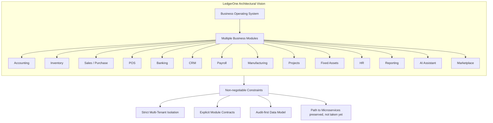
```mermaid
graph TB
    subgraph Vision["LedgerOne Architectural Vision"]
        direction TB
        A["Business Operating System"] --> B["Multiple Business Modules"]
        B --> C1["Accounting"]
        B --> C2["Inventory"]
        B --> C3["Sales / Purchase"]
        B --> C4["POS"]
        B --> C5["Banking"]
        B --> C6["CRM"]
        B --> C7["Payroll"]
        B --> C8["Manufacturing"]
        B --> C9["Projects"]
        B --> C10["Fixed Assets"]
        B --> C11["HR"]
        B --> C12["Reporting"]
        B --> C13["AI Assistant"]
        B --> C14["Marketplace"]
    end

    Vision --> Constraints["Non-negotiable Constraints"]
    Constraints --> T1["Strict Multi-Tenant Isolation"]
    Constraints --> T2["Explicit Module Contracts"]
    Constraints --> T3["Audit-first Data Model"]
    Constraints --> T4["Path to Microservices preserved, not taken yet"]
```

### 1.10.2 Three Axes of Growth Diagram

This diagram makes the three clauses of the Vision Statement (Section 1.4.1) visually explicit as independent axes that the architecture must absorb simultaneously, not sequentially.

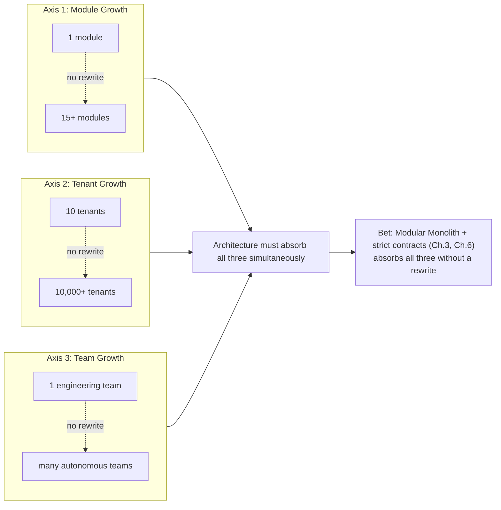
```mermaid
graph LR
    subgraph Axis1["Axis 1: Module Growth"]
        M1["1 module"] -.->|"no rewrite"| M2["15+ modules"]
    end
    subgraph Axis2["Axis 2: Tenant Growth"]
        N1["10 tenants"] -.->|"no rewrite"| N2["10,000+ tenants"]
    end
    subgraph Axis3["Axis 3: Team Growth"]
        P1["1 engineering team"] -.->|"no rewrite"| P2["many autonomous teams"]
    end

    Axis1 --> Guard["Architecture must absorb all three simultaneously"]
    Axis2 --> Guard
    Axis3 --> Guard
    Guard --> Bet["Bet: Modular Monolith + strict contracts (Ch.3, Ch.6)\nabsorbs all three without a rewrite"]
```

### 1.10.3 Decision Funnel — How a Proposal Is Checked Against This Chapter

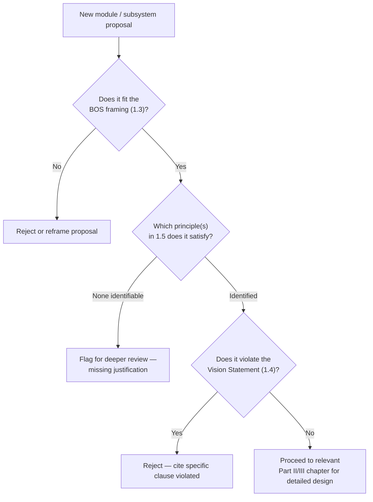
```mermaid
flowchart TD
    Start["New module / subsystem proposal"] --> Q1{"Does it fit the\nBOS framing (1.3)?"}
    Q1 -- No --> Reject1["Reject or reframe proposal"]
    Q1 -- Yes --> Q2{"Which principle(s)\nin 1.5 does it satisfy?"}
    Q2 -- None identifiable --> Flag["Flag for deeper review —\nmissing justification"]
    Q2 -- Identified --> Q3{"Does it violate the\nVision Statement (1.4)?"}
    Q3 -- Yes --> Reject2["Reject — cite specific clause violated"]
    Q3 -- No --> Approve["Proceed to relevant\nPart II/III chapter for detailed design"]
```

## 1.11 Best Practices Established by This Chapter

- Every new module proposal must state which capability it owns and which existing modules it will interact with, before any code is written.
- Any architectural decision that contradicts the vision statement in 1.4 must be escalated for explicit re-approval, not merged silently.
- New engineers are expected to read Chapters 1–7 (Parts I and II) before contributing to any module.
- Design reviews should explicitly cite which principle(s) from Section 1.5 a proposal satisfies, per Decision 1.7.4 — "this is a clean design" is not sufficient; "this is a clean design because it preserves module boundary independence (1.5) and does not weaken tenant isolation (1.4.1)" is.
- When in doubt about whether a shortcut is acceptable, the test is Section 1.4's vision statement, applied literally: would this shortcut require a rewrite at any of the three named transitions? If yes, it is not acceptable regardless of short-term convenience.

## 1.12 Security Considerations

Vision-level security posture: LedgerOne handles financial records, payroll, and personal data (HR, CRM) — categories that carry regulatory weight (e.g., data residency, financial audit requirements, and in relevant jurisdictions, data protection regulation covering employee and customer personal data) even before a specific security architecture is designed. This chapter's contribution to security is establishing that **security is a vision-level constraint, not a Chapter 20 feature**. The full security architecture is detailed in Chapter 20, but every chapter between here and there is expected to have already made security-conscious decisions inline — tenant isolation (Chapter 4), authentication/authorization (Chapter 9), and audit trails (Chapter 17) are treated as foundational, not as hardening applied after the fact.

Concretely, this means a module proposal that is architecturally elegant but weakens tenant isolation, or that cannot produce an audit trail for financial data it touches, fails review regardless of its other merits — security-relevant properties are not negotiable trade-offs against delivery speed in the way that, say, a caching strategy might be.

## 1.13 Performance Considerations

The vision explicitly rejects designing for hyperscale-consumer-app performance assumptions. LedgerOne's performance targets (detailed in Chapter 21) are calibrated against real ERP workloads: bounded per-tenant data volumes, business-hours-concentrated usage, and read-heavy reporting patterns — not unbounded viral growth. Over-engineering for the wrong performance profile is treated as a real architectural risk, equally as dangerous as under-engineering: time spent building for a load pattern LedgerOne will never see (e.g., millions of writes per second from a single tenant) is time not spent on the load pattern it will actually see (many tenants, each with moderate, predictable transaction volume, and heavy periodic reporting/period-close workloads).

## 1.14 Scalability

Two distinct axes of scale are named here and expanded throughout the handbook — deliberately kept separate because conflating them is a well-precedented ERP architecture failure:

1. **Tenant scale** — the number of independent organizations using LedgerOne, addressed primarily in Chapter 4.
2. **Module/organizational scale** — the number of business capabilities and engineering teams operating concurrently, addressed primarily in Chapters 5 and 6.

A third axis, implicit in the vision statement but worth naming explicitly here, is **data-volume scale within a single large tenant** (e.g., an enterprise customer with years of transaction history) — this is distinct from tenant-count scale and is addressed specifically in Chapters 8 (Data Architecture) and 21 (Performance & Scalability Architecture). Treating "more tenants," "more modules/teams," and "more data per tenant" as three separate scaling problems — rather than one undifferentiated "scalability" concern — prevents solving the wrong problem when a real scaling issue eventually appears in production.

## 1.15 Failure Scenarios

- **Failure: Vision drift.** Without governance, individual module teams optimize locally (e.g., a module team bypasses the module contract for a quick fix), and the system gradually degrades into an entangled monolith despite good initial boundaries. Mitigation: architectural review gates on cross-module dependencies (enforced structurally in Chapter 6, not just by policy), and the traceability discipline established in Decision 1.7.4.
- **Failure: Documentation becomes fiction.** This handbook itself can become the failure if it is not updated alongside real changes. Mitigation: architecture chapters are tied to specific ADRs (Chapter 28) that are updated when decisions change, and any structural change to a module must reference the chapter it affects.
- **Failure: Governance becomes a bottleneck.** As described in Section 1.9's trade-offs, architectural review does not scale infinitely. If review of every new module or subsystem becomes a queue that blocks delivery, teams will route around it informally, which is worse than not having the review at all (it creates the appearance of governance without its substance). Mitigation: revisit review process scaling before it becomes a bottleneck, per Section 1.16.
- **Failure: The vision statement itself turns out to be wrong.** It is possible that the business's actual trajectory diverges meaningfully from "fifteen-plus modules, tens of thousands of tenants" (e.g., LedgerOne finds success as a deep, narrow product for a specific vertical rather than a broad horizontal BOS). Mitigation: Decision 1.7.3 requires the vision statement to be revised through a recorded ADR rather than silently — an explicit, deliberate correction is a healthy outcome; a silent, undocumented drift is not.

## 1.16 Future Improvements

- As LedgerOne's module count grows, revisit whether Part I's principles need a formal "Architecture Review Board" process rather than ad hoc review — this is deferred until the team size justifies the overhead, per the governance-bottleneck failure mode in Section 1.15.
- Reassess the vision statement itself annually, since a company's actual trajectory (which modules get real customer demand) may reasonably diverge from the initial planned module list in `01_PROJECT_CONTEXT.md`. Any such reassessment must be recorded as an ADR (Chapter 28) per Decision 1.7.3.
- Consider whether Section 1.3.2's industry-precedent survey should be expanded as LedgerOne's own modules mature — early chapters draw analogies from external ERPs because LedgerOne has no history of its own yet; later revisions of this chapter should increasingly cite LedgerOne's own past decisions and their outcomes instead.

## 1.17 Traceability Matrix — Vision to Implementation

This table exists so that any reader asking "where in this handbook is vision element X actually implemented" has a direct answer, rather than needing to infer it.

| Vision Element (Section) | Primary Implementing Chapter(s) |
|---|---|
| Business Operating System framing (1.3) | Ch. 6 (Modular Decomposition), Ch. 7 (Domain Model) |
| Module growth without rewrite (1.4.1) | Ch. 5 (Layered Architecture), Ch. 6 (Modular Decomposition) |
| Tenant growth without rewrite (1.4.1) | Ch. 4 (Multi-Tenancy Architecture) |
| Team growth without rewrite (1.4.1) | Ch. 6 (Modular Decomposition), Ch. 27 (Migration Path to Microservices) |
| Explicit module contracts (1.5) | Ch. 6 (Modular Decomposition), Ch. 14 (Event-Driven Communication) |
| Tenant isolation enforced structurally (1.5) | Ch. 4 (Multi-Tenancy Architecture), Ch. 8 (Data Architecture) |
| Compliance/auditability as architecture (1.5) | Ch. 17 (Audit & Compliance Architecture) |
| Marketplace/extensibility designed for early (1.3.3) | Ch. 25 (Extensibility & Marketplace Architecture) |
| Modular Monolith over premature microservices (1.8) | Ch. 3 (Architectural Style & Principles) |
| Path to distributed deployment preserved (1.4.1) | Ch. 27 (Migration Path to Microservices) |
| Vision revisions recorded, not silent (1.7.3) | Ch. 28 (Architectural Decision Records) |

---

*Chapter 1 approved.*

---

# Chapter 2 — System Context & Boundaries

## 2.1 Purpose

Chapter 1 established *why* LedgerOne exists in its current architectural form. Before this handbook can responsibly choose an architectural style (Chapter 3) or design tenancy (Chapter 4), it must first draw the boundary of the system itself: what is inside LedgerOne's architectural authority, what is outside it, and what crosses that boundary. A style decision made without a clear system boundary is a decision made blind — "modular monolith vs. microservices" is meaningless until we know what actors, integrations, and external systems the architecture must actually serve.

This chapter answers one question precisely: **where does LedgerOne end and the rest of the world begin?**

## 2.2 Responsibilities of This Chapter

- Enumerate every class of actor (human and system) that interacts with LedgerOne.
- Enumerate every external system LedgerOne must integrate with, now or in a clearly anticipated future.
- Define the system boundary explicitly — what LedgerOne owns and is responsible for operating, versus what it depends on but does not own.
- Establish the vocabulary ("tenant," "organization," "user," "external integration") used consistently by every later chapter.

This chapter is explicitly not responsible for internal module boundaries (Chapter 6), the tenancy data model (Chapter 4), or specific API contracts (Chapter 10). It draws the outer boundary; those chapters draw the boundaries inside it.

## 2.3 Actors

LedgerOne's actors fall into three categories, each with materially different architectural implications.

### 2.3.1 Human Actors

| Actor | Description | Architectural Implication |
|---|---|---|
| **Tenant End User** | An employee of a customer organization (e.g., an accountant, a warehouse clerk, a sales rep) using LedgerOne to do their job | Drives UI/UX design (Chapter 11) and role-based authorization (Chapter 9); the overwhelming majority of request volume |
| **Tenant Administrator** | A customer-side user with elevated permissions: manages their organization's users, roles, module subscriptions, and settings | Requires an administrative surface within each tenant that is itself tenant-scoped — a Tenant Administrator manages *their* organization only, never another tenant's |
| **LedgerOne Platform Operator** | LedgerOne's own internal staff: support engineers, SRE/on-call, customer success | Requires a separate, cross-tenant administrative plane (support tooling, observability access) that is architecturally distinct from any tenant's own administrative surface — this distinction is a security boundary, detailed in Chapter 9 |
| **Third-Party Developer** | An external developer building a Marketplace extension against LedgerOne's public APIs | Does not have direct database or internal service access — interacts exclusively through the same public API surface defined in Chapter 10, and through the extension points defined in Chapter 25 |

### 2.3.2 System Actors (Machine-to-Machine)

| Actor | Description | Architectural Implication |
|---|---|---|
| **Frontend Application** | The Next.js web application (per `02_TECH_STACK.md`) acting on behalf of a logged-in human actor | Treated as an untrusted client from the backend's perspective — all authorization is enforced server-side regardless of what the frontend renders (Chapter 9, Chapter 20) |
| **Scheduled/Background Jobs** | Internal system-initiated processes: period-end closing jobs, recurring invoice generation, report pre-computation | Run within the platform's own trust boundary but still tenant-scoped per job execution — a background job never operates across tenants in a single unscoped pass (Chapter 4, Chapter 13) |
| **Marketplace Extensions** | Third-party code or integrations registered against a tenant's LedgerOne instance | Treated as a partially-trusted actor: authenticated and scoped like a Tenant End User, but additionally sandboxed against the constraints defined in Chapter 25 |

### 2.3.3 External System Actors

| Actor | Description | Architectural Implication |
|---|---|---|
| **Banking / Open Banking Providers** | Systems providing bank feed data (transactions, balances) for the Banking module | LedgerOne is a consumer of external financial data, not a system of record for it — reconciliation logic (Banking module) must assume the external feed can be delayed, incomplete, or corrected retroactively |
| **Payment Gateways** | Systems processing customer payments (e.g., for invoices, POS transactions) | LedgerOne never stores raw payment credentials — this is a hard boundary enforced in Chapter 20 (Security Architecture), not merely a convention |
| **Tax & Compliance Services** | External services or data providers for tax rate lookup, e-invoicing/compliance submission where applicable | Treated as an integration whose availability is not guaranteed at the same SLA as LedgerOne itself — failure handling for these integrations (Chapter 23) must degrade gracefully rather than blocking core transaction recording |
| **Email/SMS Delivery Providers** | Transactional communication delivery for the Notification module | Asynchronous, best-effort from LedgerOne's perspective — notification delivery failures must never roll back or block the business transaction that triggered them (Chapter 16) |
| **Identity Providers (future)** | Potential future SSO/SAML/OIDC providers for enterprise tenants | Not required for initial launch, but the Authentication architecture (Chapter 9) is designed so that adding an external IdP is additive, not a redesign |

## 2.4 System Context Diagram

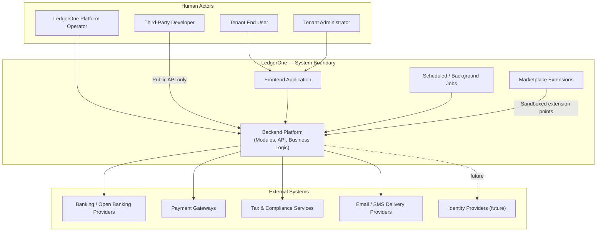
```mermaid
graph TB
    subgraph Humans["Human Actors"]
        U1["Tenant End User"]
        U2["Tenant Administrator"]
        U3["LedgerOne Platform Operator"]
        U4["Third-Party Developer"]
    end

    subgraph LedgerOne["LedgerOne — System Boundary"]
        FE["Frontend Application"]
        BE["Backend Platform\n(Modules, API, Business Logic)"]
        Jobs["Scheduled / Background Jobs"]
        Ext["Marketplace Extensions"]
    end

    subgraph External["External Systems"]
        E1["Banking / Open Banking Providers"]
        E2["Payment Gateways"]
        E3["Tax & Compliance Services"]
        E4["Email / SMS Delivery Providers"]
        E5["Identity Providers (future)"]
    end

    U1 --> FE
    U2 --> FE
    U3 --> BE
    U4 -->|"Public API only"| BE

    FE --> BE
    Jobs --> BE
    Ext -->|"Sandboxed extension points"| BE

    BE --> E1
    BE --> E2
    BE --> E3
    BE --> E4
    BE -.->|"future"| E5
```

### 2.4.1 C4 Model — Level 1: System Context

This is the same boundary redrawn in strict [C4 Model](https://c4model.com) notation — the reference view for this handbook's C4 hierarchy (Context here → Container in Chapter 6.4.1 → Component in Chapter 5.6.1 → Code in Chapter 7.3.6).

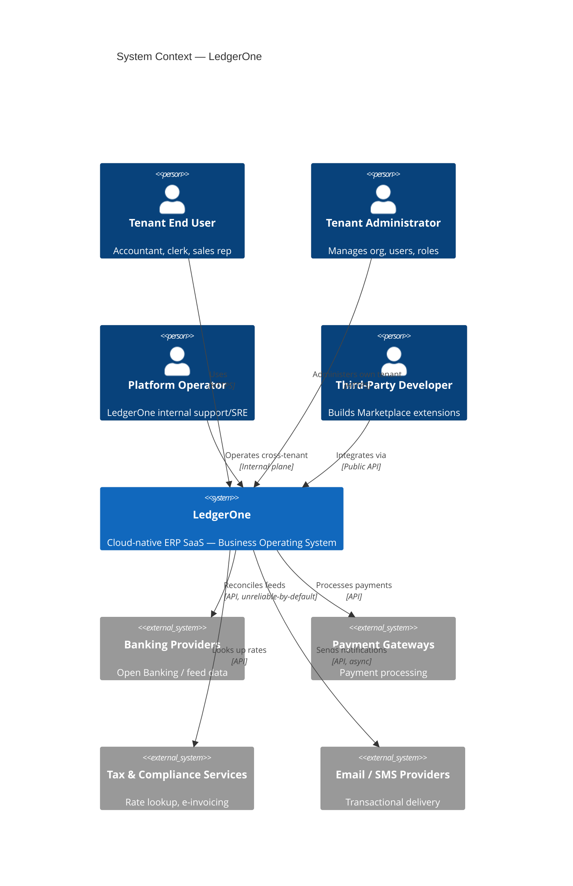
```mermaid
C4Context
    title System Context — LedgerOne

    Person(endUser, "Tenant End User", "Accountant, clerk, sales rep")
    Person(admin, "Tenant Administrator", "Manages org, users, roles")
    Person(operator, "Platform Operator", "LedgerOne internal support/SRE")
    Person(dev, "Third-Party Developer", "Builds Marketplace extensions")

    System(ledgerone, "LedgerOne", "Cloud-native ERP SaaS — Business Operating System")

    System_Ext(bank, "Banking Providers", "Open Banking / feed data")
    System_Ext(pay, "Payment Gateways", "Payment processing")
    System_Ext(tax, "Tax & Compliance Services", "Rate lookup, e-invoicing")
    System_Ext(notif, "Email / SMS Providers", "Transactional delivery")

    Rel(endUser, ledgerone, "Uses", "HTTPS")
    Rel(admin, ledgerone, "Administers own tenant", "HTTPS")
    Rel(operator, ledgerone, "Operates cross-tenant", "Internal plane")
    Rel(dev, ledgerone, "Integrates via", "Public API")

    Rel(ledgerone, bank, "Reconciles feeds", "API, unreliable-by-default")
    Rel(ledgerone, pay, "Processes payments", "API")
    Rel(ledgerone, tax, "Looks up rates", "API")
    Rel(ledgerone, notif, "Sends notifications", "API, async")
```

## 2.5 The System Boundary, Defined Precisely

LedgerOne's architectural authority — the parts of the system this handbook governs and that the engineering team is responsible for designing, operating, and being paged for — covers:

- The Frontend Application (Next.js)
- The Backend Platform (Express.js modules, API layer, business logic, all layers described in Chapter 5)
- The primary datastore (MySQL) and cache (Redis)
- The asynchronous job/queue infrastructure (BullMQ)
- Object storage for tenant documents (S3)
- The deployment and infrastructure layer (AWS, per Chapter 24)

LedgerOne's architectural authority explicitly **excludes**, while still depending on:

- The correctness and availability of banking data feeds, payment gateway processing, and tax/compliance data — LedgerOne integrates with these as a consumer and must design for their failure (Chapter 23), but does not own their internal correctness.
- The end user's own device, browser, or network — LedgerOne designs a resilient, accessible frontend (Chapter 11) but cannot guarantee a user's local environment.
- Any Marketplace extension's internal implementation — LedgerOne owns and enforces the sandbox boundary (Chapter 25) but not what a third-party developer chooses to build within it.

This distinction — **own vs. depend on** — recurs throughout the handbook. Every external dependency named in Section 2.3.3 is something LedgerOne must design *resilience against*, not something LedgerOne can design to be correct, because it is outside LedgerOne's architectural authority.

## 2.6 Design Decisions

**Decision 2.6.1 — LedgerOne Platform Operators are architecturally distinct from Tenant Administrators.**
Even though both are "admin-like" roles, a Platform Operator's access (cross-tenant support tooling, observability) is never modeled as an elevated version of tenant-level permissions. It is a separate authorization plane entirely (detailed in Chapter 9). Conflating the two — e.g., implementing platform support access as "a tenant admin role that happens to apply everywhere" — would make a single authorization bug a cross-tenant data exposure incident rather than a contained one.

**Decision 2.6.2 — Third-party developers and Marketplace extensions never receive direct database or internal-service access.**
All external interaction, whether from a human third-party developer or their running extension code, goes through the same public API surface (Chapter 10) and extension sandbox (Chapter 25) that LedgerOne's own frontend uses for the equivalent capability where possible. There is no "internal-only" API that is more powerful than what a well-behaved external integration could theoretically access — this constraint, decided here, is what makes Chapter 25's Marketplace architecturally feasible later without a redesign.

**Decision 2.6.3 — External system integrations are modeled as unreliable by default.**
Every external actor in Section 2.3.3 is designed against on the assumption that it can be slow, unavailable, or wrong, because LedgerOne does not control its uptime or correctness. This is a deliberate, conservative default; an integration is only treated as more reliable than this default if there is a specific, contractual reason to believe otherwise (e.g., an SLA-backed provider), and even then, the failure-handling code path is still built.

## 2.7 Why This Approach Was Chosen

Drawing the system boundary explicitly, actor by actor, before any structural design begins, forces an early answer to a question that is otherwise easy to leave implicit until it causes an incident: "who exactly is on the other side of this API call, and how much do we trust them?" Systems that skip this step tend to discover the answer reactively — for example, realizing only after a Marketplace extension is live that it was implicitly granted more trust than intended because no one had explicitly decided the sandbox boundary in advance.

Explicitly separating human actors, system actors, and external system actors (rather than a single undifferentiated "users and integrations" list) also directly serves Chapter 1's vision: the Third-Party Developer and Marketplace Extension rows in Section 2.3 exist in this chapter years before the Marketplace (Chapter 25) is actually built, which is precisely the "design for extensibility before it's needed" discipline established in Chapter 1.3.3.

## 2.8 Alternatives Considered

**Alternative: Treat all authenticated callers (frontend, third-party developers, extensions) as a single "authenticated user" trust level.**
Rejected. This is architecturally simpler in the short term but collapses distinctions that matter for security and blast-radius containment — a compromised or buggy Marketplace extension should not have the same implicit trust as LedgerOne's own frontend. Chapter 20 depends on these trust levels being distinguished at the system-context level, not invented ad hoc later.

**Alternative: Grant LedgerOne Platform Operators access via the same tenant-admin role mechanism, just applied across all tenants.**
Rejected, per Decision 2.6.1. This alternative is common in early-stage SaaS products ("just make support a super-admin") and is precisely the shortcut that, per the industry precedent pattern established in Chapter 1.3.2, tends to be the root cause of avoidable cross-tenant exposure incidents.

**Alternative: Defer defining external-system integration boundaries until each integration is actually built.**
Rejected. Banking, payment, and tax integrations are not hypothetical — they are named in `01_PROJECT_CONTEXT.md`'s module list. Defining the trust and reliability posture toward them now (Section 2.6.3) costs little and ensures that whichever module team builds the actual Banking integration inherits a consistent, already-decided failure-handling posture rather than inventing their own.

## 2.9 Trade-offs

- **This chapter commits to trust-level distinctions before they are strictly necessary.** Today, there is no live Marketplace and no live third-party developer. Modeling that actor now is speculative work whose payoff is deferred years into the future. We accept this because the alternative — retrofitting a trust boundary onto an API surface that was designed assuming only the first-party frontend calls it — is a breaking change to every existing integration, not just a new addition.
- **Treating external integrations as unreliable by default (2.6.3) adds engineering overhead to every integration**, even ones that turn out in practice to be highly reliable. This is accepted because the cost of assuming reliability and being wrong (a blocked or lost financial transaction because a tax service was briefly down) is categorically worse than the cost of building resilience that turns out to be rarely exercised.

## 2.10 Best Practices Established by This Chapter

- Any new actor type (human, system, or external) introduced by a future module must be added to the tables in Section 2.3 and assigned an explicit trust level before that module ships.
- Any new external integration must be reviewed against Section 2.6.3's "unreliable by default" posture — an exception requires an explicit, documented reason (e.g., a contractual SLA), not just an assumption that a given provider "is usually fine."
- No API endpoint or extension point should be designed in a way that only makes sense for one specific actor type in Section 2.3, unless that restriction is intentional and documented — this keeps the actor-to-boundary mapping in this chapter honest over time.

## 2.11 Security Considerations

The actor/trust-level distinctions drawn in this chapter (Section 2.3, Decision 2.6.1, Decision 2.6.2) are the foundation that Chapter 9 (Authentication & Authorization) and Chapter 20 (Security Architecture) build on. A security architecture cannot correctly assign permissions to actors that were never clearly enumerated. The specific risk this chapter is most directly defending against is **trust-level conflation**: treating two actors with different real-world risk profiles (e.g., LedgerOne's own frontend vs. a third-party Marketplace extension) as if they were the same caller, simply because both present a valid authentication token. Chapter 20 will define the concrete mechanisms; this chapter establishes that the underlying distinction is architecturally necessary, not optional hardening.

## 2.12 Performance Considerations

External system actors (Section 2.3.3) are, by definition, outside LedgerOne's control over their latency. This chapter's contribution to performance architecture is establishing that LedgerOne's own internal performance targets (Chapter 21) must be defined and measured **independently** of external system latency — a slow tax-service response should degrade that specific integration's user-facing feature gracefully, not be allowed to make LedgerOne's own core transaction-recording path appear slow in monitoring, and not be allowed to block it synchronously where an asynchronous pattern (Chapter 13) is available instead.

## 2.13 Scalability

The actor model in this chapter surfaces a scaling dimension not previously named in Chapter 1: **integration scale** — the number of distinct external systems LedgerOne must integrate with grows with the product's breadth (more modules mean more categories of external dependency: banking, payments, tax, e-commerce platforms, payroll tax authorities, etc.) and, within a category, with tenant count (different tenants in different regions may require different banking or tax providers). This is distinct from tenant-count scale and module-count scale (Chapter 1.14) and is addressed architecturally by Decision 2.6.3's uniform "unreliable by default" integration posture — a consistent failure-handling pattern that new integrations can adopt without each one inventing its own approach, which is what allows integration count to grow without a proportional growth in architectural complexity.

## 2.14 Failure Scenarios

- **Failure: An external system actor becomes unavailable.** E.g., a banking data provider's API goes down. Because Section 2.6.3 mandates designing against this by default, the expected behavior is a degraded but contained failure (the Banking module's feed reconciliation is delayed) rather than a cascading failure into unrelated modules. The specific mechanics are detailed in Chapter 23.
- **Failure: A Marketplace extension misbehaves (bug or malicious intent).** Because Decision 2.6.2 ensures extensions never receive direct database or internal-service access, the blast radius of a misbehaving extension is bounded to what the sandbox (Chapter 25) explicitly permits. Without this chapter's boundary decisions made in advance, a misbehaving extension could otherwise have had an unbounded blast radius by the time the Marketplace is built.
- **Failure: The line between "Platform Operator" and "Tenant Administrator" access is blurred in an implementation shortcut.** This is named explicitly as a failure mode (not just a decision) because it is the single most likely way this chapter's guidance could be silently violated under time pressure — e.g., a support tool built quickly that queries tenant data with elevated but improperly scoped credentials. Mitigation: Chapter 9's authorization model must make this distinction structurally difficult to bypass, not merely policy-documented here.

## 2.15 Future Improvements

- As real Marketplace usage begins (Chapter 25), revisit whether "Third-Party Developer" needs to be split into finer-grained trust tiers (e.g., a vetted/certified partner vs. an open self-serve developer) — this chapter currently treats all third-party developers as a single actor type because no real usage data exists yet to justify finer distinctions.
- As LedgerOne expands into new geographies, Section 2.3.3's external system list will grow (region-specific tax authorities, region-specific banking standards). Revisit whether the "unreliable by default" posture (2.6.3) needs region-specific SLA tiers rather than one uniform posture.
- Revisit Identity Providers (currently marked future in Section 2.3.3) once enterprise tenant demand for SSO becomes concrete, and confirm the "additive, not a redesign" claim in that row holds once Chapter 9 is fully designed.

---

*Chapter 2 approved.*

---

# Chapter 3 — Architectural Style & Principles

## 3.1 Purpose

Chapter 1 established a vision that must absorb growth in modules, tenants, and teams without a rewrite. Chapter 2 drew the system's outer boundary and enumerated who and what LedgerOne must serve. This chapter answers the question those two chapters set up but deliberately deferred: **what architectural style makes that vision achievable, and why this style over the credible alternatives?**

The answer, stated up front so the rest of the chapter can be read as justification rather than suspense: LedgerOne is built as a **Modular Monolith**, internally structured using **Clean Architecture** layering, with module internals modeled using **Domain-Driven Design (DDD)**. Each of these three choices is independent and separately justified below — they are frequently bundled together in industry discussion, but a reader should understand that rejecting one does not require rejecting the others.

## 3.2 Responsibilities of This Chapter

- Define Modular Monolith, Clean Architecture, and DDD precisely as LedgerOne applies them — not as generic textbook definitions, but as specific, falsifiable commitments.
- Justify each choice against the credible alternatives (microservices, layered/N-tier without Clean Architecture's dependency rule, anemic CRUD modeling without DDD).
- Establish the non-negotiable rules that make these styles real constraints rather than aspirational labels.

This chapter defines the style at the level a senior engineer needs to evaluate whether a specific design proposal conforms to it. The literal mechanics — exact layer names and their responsibilities, exact module folder conventions — are Chapter 5 (Layered Architecture) and Chapter 6 (Modular Decomposition) respectively.

## 3.3 Modular Monolith

### 3.3.1 Definition, as LedgerOne Applies It

A Modular Monolith is a system that is **deployed as a single unit** (one backend process, one deployable artifact per environment) but **structured internally as if it were a distributed system of services** — with strict module boundaries, no shared mutable state between modules except through explicit contracts, and no module directly accessing another module's database tables.

This is deliberately positioned between two extremes:

- A **traditional monolith**, where any part of the codebase can call any other part directly, and database tables are implicitly shared across the whole application with no enforced ownership.
- **Microservices**, where each module is not just logically but *physically* separated — its own deployable, its own database, communicating over the network.

LedgerOne's Modular Monolith gets the deployment simplicity of the former and the boundary discipline of the latter, at the cost of not getting the independent scalability and independent deployability of the latter. Section 3.3.4 makes this trade-off explicit rather than implying it is free.

### 3.3.2 Why This Approach Was Chosen

Chapter 1's vision statement requires the architecture to absorb module growth, tenant growth, and team growth without a rewrite. A traditional monolith fails the *module growth* clause under real-world pressure: without enforced boundaries, teams under deadline pressure will take the shortest path between two modules, which is almost always a direct function call or direct table read across a boundary that exists only informally. Chapter 1.3.2 named this exact failure pattern in mature ERPs (SAP's rationale for interface-based integration between FI/CO/MM/SD). LedgerOne encodes that lesson from day one rather than relearning it after the shortcuts are already load-bearing in production.

Microservices, meanwhile, solve a problem LedgerOne does not yet have. The primary benefits of microservices — independent deployability across many teams, independent scaling of hot subsystems, fault isolation at the process level — are benefits that accrue with organizational and load scale. LedgerOne's near-term reality (per Chapter 1's own vision, this is a *transition* to be absorbed, not a starting condition) is a small number of engineering teams and a small number of live modules. Paying microservice costs today — network calls where a function call would do, distributed transactions where a database transaction would do, N times the operational surface area for N services — buys nothing yet and actively works against the strong-consistency needs of financial data (Section 3.3.5).

### 3.3.3 Alternatives Considered

**Alternative: Traditional (unstructured) monolith.**
Rejected. Fastest to build initially, but has no mechanism to prevent the exact cross-module entanglement Chapter 1 identifies as the primary long-term risk. Would very likely require the "rewrite" Chapter 1's vision statement explicitly forbids, once module count and team count both grow.

**Alternative: Microservices from initial launch.**
Rejected for now, though the option is deliberately preserved (Chapter 27). The organizational and operational scale that justifies microservices (many autonomous teams, genuinely independent scaling needs per module, e.g. POS transaction volume needing to scale independently from Payroll) does not exist yet. Adopting microservices prematurely would mean the team pays distributed-systems tax (service discovery, distributed tracing, network failure handling, eventual consistency reasoning) at a stage when a single database transaction would solve the same problem more simply and more correctly for financial data.

**Alternative: "Micro-frontends and microservices for some modules, monolith for others" (a hybrid from day one).**
Rejected as a starting point. Selective decomposition is exactly what Chapter 27 (Migration Path to Microservices) exists to enable *later*, once real operational data shows which specific module actually needs independent scaling or deployment. Deciding which modules "deserve" microservice treatment before any module has real production load is guesswork; the Modular Monolith's internal boundaries (Chapter 6) are specifically designed so that this decision can be made well, later, with evidence, rather than speculatively, now.

### 3.3.4 Trade-offs

- **No independent scaling per module.** If the POS module experiences ten times the transaction volume of the Payroll module, the entire backend process scales together, not just POS. This is accepted because, at LedgerOne's anticipated scale (Chapter 1.13's ERP-calibrated, not hyperscale, performance profile), horizontal scaling of the whole backend is sufficient; the day this stops being true is precisely the signal Chapter 27 uses to trigger a targeted extraction.
- **No independent deployability per module.** A deployment ships all modules' changes together. This creates coordination overhead as team count grows — mitigated, not eliminated, by strict module boundaries (Chapter 6) that keep changes within one module from requiring changes to another's code, even though they still ship in the same release.
- **A single module's severe bug (e.g., an unhandled exception storm, a memory leak) can, if not contained, affect the whole process**, unlike a microservice's process-level fault isolation. This is mitigated architecturally (defensive boundaries, Chapter 6) and operationally (Chapter 23, Reliability & Failure Handling) but not eliminated — this is an honest limitation of the style, not a solved problem.

### 3.3.5 Why Strong Consistency Matters Here Specifically

Financial data has a property that many other domains do not: a Journal Entry's debits and credits must balance *exactly*, atomically, or the ledger is wrong — there is no acceptable "eventually consistent" version of a ledger being temporarily out of balance. A single-database, single-transaction monolith gives this property for free via ACID transactions. A distributed system achieves the equivalent guarantee only through significantly more complex patterns (distributed sagas, two-phase commit, compensating transactions) that trade simplicity and latency for the same guarantee a local transaction provides natively. This is one of the most concrete, non-ideological reasons the Modular Monolith is the right starting style for a financial ERP specifically, as opposed to SaaS products in domains more tolerant of eventual consistency.

### 3.3.6 Decision Matrix — Deployment Style

| Criterion | Traditional Monolith | **Modular Monolith (chosen)** | Microservices |
|---|---|---|---|
| Cross-module consistency | Trivial (shared everything) | Native ACID within one DB (3.3.5) | Requires sagas/2PC |
| Module boundary discipline | None enforced | Enforced structurally (Ch.6) | Enforced by process/network boundary |
| Independent scaling per module | No | No (3.3.4) | Yes |
| Independent deployability | No | No (3.3.4) | Yes |
| Operational surface area | Lowest | Low — one deployable | High — N deployables |
| Fault isolation | None | Partial (Ch.6 boundaries, not process) | Strong (process-level) |
| Fit for current team/tenant scale (Ch.1) | Fails at module-count growth | ✅ Matches current scale | Premature — pays cost with no benefit yet |
| Extraction path to microservices later | N/A — full rewrite | ✅ Mechanical, per Ch.27 | N/A — already there |

## 3.4 Clean Architecture

### 3.4.1 Definition, as LedgerOne Applies It

Clean Architecture, in LedgerOne's usage, means one non-negotiable rule: **dependencies point inward, toward the domain, and never the reverse.** Concretely, using the layer names this handbook adopts (fully detailed in Chapter 5): Presentation depends on Business, Business depends on Domain, Repository implementations depend on Domain-defined interfaces (not the reverse), and Domain depends on nothing else in the system. The Domain layer — the actual business rules of accounting, inventory, sales, etc. — has zero knowledge of HTTP, MySQL, Prisma, or any other technical detail.

### 3.4.2 Why This Approach Was Chosen

The specific failure this rule prevents is business logic that is inseparable from a particular technical framework choice — for example, accounting rules that are implemented as Prisma queries scattered through controllers, such that testing a business rule requires spinning up a database, and such that changing ORMs (a technical decision) requires rewriting business logic (a domain decision). For a system explicitly expected to live 10-20 years (Chapter 1.3), outliving multiple technology cycles is a stated design goal, not a nice-to-have — Clean Architecture's dependency rule is the mechanism that makes the business rules themselves survive a future technology migration essentially unchanged, even if the Presentation and Repository layers around them are rewritten.

### 3.4.3 Alternatives Considered

**Alternative: A conventional layered (N-tier) architecture without an enforced dependency rule — Controller → Service → Repository, but with no restriction on Services reaching into framework or database specifics.**
Rejected as insufficient on its own. This looks superficially similar to Clean Architecture (it has "layers") but without the inward-dependency rule, Services routinely end up importing ORM-specific types or HTTP-specific request objects, which silently re-couples business logic to technical infrastructure — the exact problem Clean Architecture exists to prevent. LedgerOne's layered architecture (Chapter 5) is explicitly the Clean Architecture variant, not the unconstrained variant.

**Alternative: Hexagonal Architecture / Ports and Adapters (a closely related, largely equivalent style).**
Not rejected so much as treated as the same underlying idea under a different name and diagramming convention. LedgerOne adopts Clean Architecture's specific layer-naming vocabulary (Presentation/Business/Domain/Repository, per the existing convention in this project) because it maps cleanly onto Express.js's own routing and middleware idioms (routers, middleware, plain service classes), but the substantive commitment — inward-pointing dependencies, domain logic isolated from infrastructure — is the same commitment Hexagonal Architecture makes.

### 3.4.4 Trade-offs

- **More indirection.** A business rule that needs data must go through an interface defined in the Domain layer and implemented in the Repository layer, rather than calling the ORM directly. This is more code to write for simple CRUD operations than calling Prisma directly from a service. Accepted because the cost is paid uniformly and predictably (an extra interface per repository), while the benefit (testable, framework-independent business logic) compounds over the system's 10-20 year expected lifespan.
- **Requires discipline that is not self-enforcing by the framework alone.** Express.js does not prevent a developer from importing Prisma types into the Domain layer; the dependency rule is enforced by code review and, ideally, lint-level import restrictions (a Chapter 5 concern), not by the framework itself. This is a real, ongoing cost, not a one-time setup cost.

## 3.5 Domain-Driven Design (DDD)

### 3.5.1 Definition, as LedgerOne Applies It

DDD, in LedgerOne's usage, means module internals are modeled around the actual business concepts and rules of the domain they represent (Chart of Accounts, Journal Entry, Sales Order, Bill of Materials) — using the domain's own vocabulary and invariants — rather than being modeled as generic data-transfer objects with business logic scattered externally in services. A Journal Entry enforces "debits equal credits" as an invariant of what a Journal Entry *is*, not as a validation check bolted on somewhere in a controller.

DDD additionally supplies the vocabulary this handbook uses for module boundaries: each module (Accounting, Inventory, Sales, etc.) is treated as a **Bounded Context** — a domain model that is internally consistent and complete on its own terms, and that may define the same real-world concept (e.g., "Customer") differently than another module does, deliberately, because each module only needs the facets of that concept relevant to its own responsibilities. This is elaborated fully in Chapter 7.

### 3.5.2 Why This Approach Was Chosen

An ERP's core value proposition *is* correctly encoding business rules — an accounting module that lets debits and credits go out of balance, or an inventory module that allows negative stock when the business rule says it shouldn't, is not a viable product regardless of how well-engineered its infrastructure is. DDD is chosen because it puts those rules at the center of the design process, in the layer (Domain, per Section 3.4.1) that Clean Architecture already protects from being diluted by infrastructure concerns. Clean Architecture and DDD are complementary specifically because Clean Architecture defines *where* domain logic lives, and DDD defines *how* to model what goes there.

### 3.5.3 Alternatives Considered

**Alternative: Anemic domain model — plain data-holding entities, with all business logic implemented externally in "service" classes.**
Rejected as the default pattern, though not entirely absent from the system (some genuinely simple CRUD-only concepts do not benefit from rich domain modeling and are treated more simply — this is a judgment call made per-entity in Chapter 7, not a dogmatic rule). For entities with real business invariants (Journal Entry, Sales Order, Inventory Valuation), an anemic model separates the data from the rules that govern it, which makes it easy for a rule to be silently bypassed by any code path that mutates the data directly rather than going through the "correct" service — a risk that is unacceptable for financial correctness.

**Alternative: Event Sourcing as the primary persistence model (a common DDD-adjacent pattern for financial systems).**
Considered seriously, given its natural fit for audit trails (Chapter 17) and financial systems generally. Deferred, not rejected outright — LedgerOne's initial persistence model (Chapter 8) uses conventional state-based persistence with a rigorous audit log alongside it, rather than deriving all state from an event stream. This is because Event Sourcing's operational complexity (event schema evolution, snapshotting, rebuilding projections) is a significant undertaking that is not justified until the specific auditability or temporal-query benefits it provides are shown to be insufficiently met by the audit-log approach in Chapter 17. This decision is explicitly flagged for revisit in Section 3.8.

### 3.5.4 Trade-offs

- **Requires real domain expertise to model correctly.** A generic engineer without accounting knowledge can build an anemic CRUD model for a Chart of Accounts; correctly modeling it as a rich domain concept (with invariants like balanced double-entry postings) requires either an engineer with accounting domain knowledge or close, sustained collaboration with someone who has it. This is a real staffing/process cost, not just a code structure cost.
- **Risk of over-modeling simple concepts.** Not every entity in LedgerOne has rich business invariants — a Notification Template, for example, is closer to plain data. Applying DDD ceremony uniformly to every entity regardless of its actual complexity would be over-engineering. Chapter 7 addresses where the line is drawn.

## 3.6 How the Three Styles Compose

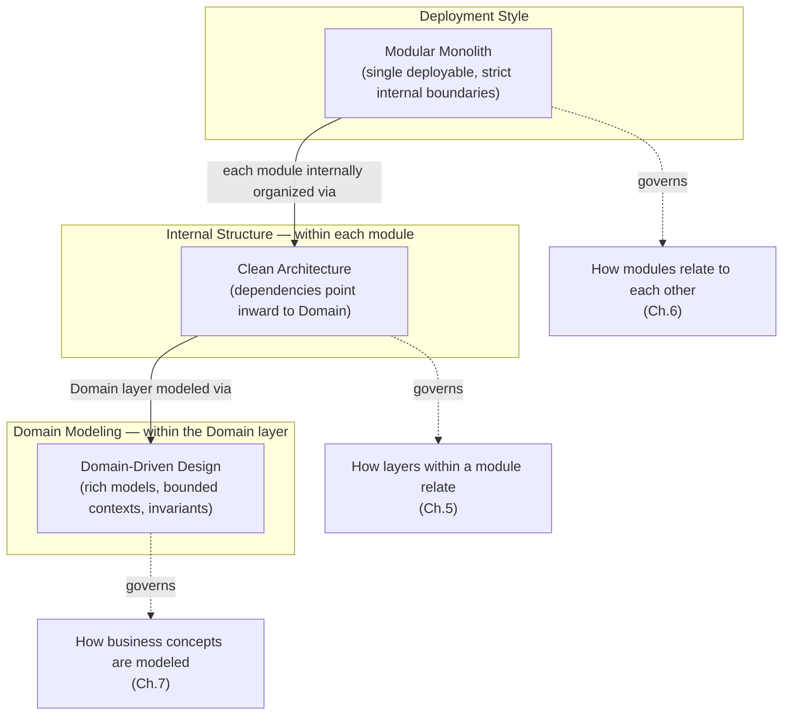
```mermaid
graph TB
    subgraph Deploy["Deployment Style"]
        MM["Modular Monolith\n(single deployable, strict internal boundaries)"]
    end

    subgraph Internal["Internal Structure — within each module"]
        CA["Clean Architecture\n(dependencies point inward to Domain)"]
    end

    subgraph Modeling["Domain Modeling — within the Domain layer"]
        DDD["Domain-Driven Design\n(rich models, bounded contexts, invariants)"]
    end

    MM -->|"each module internally organized via"| CA
    CA -->|"Domain layer modeled via"| DDD

    MM -.->|"governs"| Q1["How modules relate to each other\n(Ch.6)"]
    CA -.->|"governs"| Q2["How layers within a module relate\n(Ch.5)"]
    DDD -.->|"governs"| Q3["How business concepts are modeled\n(Ch.7)"]
```

This diagram is the key to understanding why these three styles are not redundant with each other: they answer three different questions at three different zoom levels — module-to-module (Modular Monolith), layer-to-layer within a module (Clean Architecture), and concept-to-concept within the Domain layer (DDD).

## 3.7 Design Decisions

**Decision 3.7.1 — The dependency rule is enforced by tooling, not only by convention.**
Wherever practical, import restrictions (e.g., lint rules preventing the Domain layer from importing infrastructure packages) are used to make Clean Architecture's inward-dependency rule mechanically checkable rather than relying solely on code review vigilance. The specific tooling is a `05_CODING_STANDARDS.md` concern; the requirement that such tooling must exist is decided here.

**Decision 3.7.2 — Not every entity requires full DDD ceremony.**
Per Section 3.5.4, Chapter 7 will define concrete criteria for when an entity warrants rich domain modeling (has invariants, participates in business rules enforced across multiple operations) versus when a simpler CRUD-style model is acceptable (purely descriptive, reference-data-like entities). This chapter establishes that the distinction must be made deliberately, not by default.

**Decision 3.7.3 — Event Sourcing is deferred, not rejected.**
Per Section 3.5.3, the conventional persistence model with an explicit audit log (Chapter 8, Chapter 17) is the starting point. This decision is revisited if Chapter 17's audit log approach proves insufficient for a real compliance or temporal-reporting requirement that Event Sourcing would solve materially better.

## 3.8 Future Improvements

- Revisit Decision 3.7.3 (Event Sourcing deferral) once the Audit & Compliance Architecture (Chapter 17) has been in production long enough to evaluate whether it meets real auditor and compliance demands, or whether specific modules (Accounting, most plausibly) would benefit from an event-sourced ledger specifically, even if other modules remain state-based.
- Revisit the Modular Monolith decision itself against Chapter 27's criteria once real production data exists on a per-module basis (transaction volume, deployment frequency per team, incident blast radius) rather than the anticipatory reasoning this chapter is necessarily based on today.
- As tooling for Decision 3.7.1 matures, consider whether module boundary enforcement (currently a Chapter 6 concern layered on top of this chapter's dependency rule) can be unified into the same tooling layer for a single, consistent enforcement mechanism.

## 3.9 Security Considerations

Clean Architecture's isolation of the Domain layer from infrastructure has a direct security benefit: business-rule bugs (e.g., an incorrectly enforced authorization check on a financial operation) are easier to find and test in isolation when the rule is expressed as a pure Domain concept, rather than buried inside a controller that also handles HTTP parsing, database access, and response formatting simultaneously. The Modular Monolith's strict module boundaries (Section 3.3.1) additionally limit the blast radius of a security flaw in one module — a vulnerability in the Sales module's authorization logic, for example, cannot directly read Accounting's internal state, because no such direct path exists per Decision in Chapter 6. Full security architecture is Chapter 20; this chapter establishes the structural preconditions that make that architecture enforceable.

## 3.10 Performance Considerations

The Modular Monolith's single-process deployment (Section 3.3.1) means inter-module calls within a single request are in-process function calls, not network calls — this is, in practice, a performance advantage over an equivalent microservices design for any workflow that spans multiple modules (e.g., a Sales invoice that must also update Inventory and post to Accounting), because it avoids network latency and serialization overhead entirely for these paths. This advantage is a direct, if secondary, benefit of the style choice in Section 3.3, not merely a simplicity argument.

## 3.11 Scalability

As stated in Section 3.3.4, the Modular Monolith scales the entire backend process together rather than per-module. Chapter 21 details the specific scaling mechanism (horizontal replication of the whole backend behind a load balancer, per the AWS ECS target in `02_TECH_STACK.md`). This chapter's contribution is naming the specific, concrete trigger for reconsidering this: if monitoring (Chapter 22) shows a specific module consistently and disproportionately driving resource consumption relative to the others, that module becomes the first candidate for extraction per Chapter 27 — the Modular Monolith's internal boundaries (Chapter 6) exist precisely so that this extraction, if and when needed, is a mechanical exercise rather than a redesign.

## 3.12 Failure Scenarios

- **Failure: A module's dependency-rule violation goes unreviewed.** E.g., a Domain-layer class starts importing an ORM type because it was the fastest way to ship a feature under deadline pressure. Without tooling enforcement (Decision 3.7.1), this erodes Clean Architecture's guarantee silently, one violation at a time, until the "clean" layers are clean in name only. Mitigation: the lint-level enforcement named in Decision 3.7.1, treated as a blocking CI check, not an advisory warning.
- **Failure: DDD ceremony is applied inconsistently across modules**, with some module teams modeling rich domain objects and others defaulting to anemic CRUD out of unfamiliarity with DDD. Mitigation: Chapter 7 must supply concrete, example-driven guidance (not just principle) for when and how to apply rich modeling, specifically because "just use DDD" is insufficient direction for engineers without prior DDD experience.
- **Failure: A single module's runtime fault takes down the shared process.** Named honestly in Section 3.3.4 as a real limitation of the Modular Monolith style, not a solved problem — mitigated at the process level (resource limits, crash isolation where the runtime allows it) and at the deployment level (fast rollback, health checks) per Chapter 23, but never fully eliminated short of physical process separation (i.e., short of moving to microservices for that specific module).

---

*Chapter 3 approved.*

---

# Chapter 4 — Multi-Tenancy Architecture

## 4.1 Purpose

Chapter 1 named tenant isolation as non-negotiable and structural, not conventional. This chapter delivers on that commitment concretely: it defines what a "tenant" is in LedgerOne, how tenant data is isolated at the data layer, how every request is scoped to exactly one tenant, and what happens — architecturally, not just by policy — to prevent the single most damaging class of bug available to an ERP SaaS: one tenant seeing another tenant's financial data.

## 4.2 Responsibilities of This Chapter

- Define the tenancy model precisely: what a tenant is, how it relates to an "Organization" (per `01_PROJECT_CONTEXT.md`'s SaaS hierarchy), and how a single LedgerOne account can contain multiple tenants or a single tenant.
- Choose and justify the data isolation strategy (shared database with tenant discriminator, schema-per-tenant, or database-per-tenant).
- Define how tenant scoping is enforced at each layer of the Clean Architecture stack (Chapter 3), so that isolation is structural rather than a per-query discipline left to individual engineers.
- Define the operational model for tenant provisioning, offboarding, and data residency.

This chapter does not define authentication mechanics (Chapter 9) or the specific schema conventions like column naming (`06_DATABASE_STANDARDS.md`) — it defines the tenancy *model* those chapters implement.

## 4.3 Tenancy Vocabulary

- **Tenant**: the unit of data isolation. All data belonging to a tenant is isolated from all data belonging to every other tenant, with no exceptions except the explicitly-designed cross-tenant surfaces used by Platform Operators (Chapter 2, Decision 2.6.1) and system-level Marketplace cataloging (Chapter 25).
- **Organization**: the customer-facing business entity that subscribes to LedgerOne. In LedgerOne's initial model, **one Organization maps to exactly one Tenant** — this 1:1 mapping is a deliberate simplification (Section 4.6) rather than an accident, and is revisited only if a real customer need for multi-entity consolidation under one subscription (Section 4.10) demands otherwise.
- **User**: a human actor (Chapter 2) who belongs to exactly one Organization/Tenant at a time in the initial model, authenticated and authorized within that tenant's scope (Chapter 9).

## 4.4 Data Isolation Strategy

### 4.4.1 The Three Credible Strategies

| Strategy | Description | Isolation Strength | Operational Cost |
|---|---|---|---|
| **Database-per-tenant** | Each tenant gets a fully separate database instance/schema at the infrastructure level | Strongest — physical separation | Highest — thousands of tenants means thousands of databases to provision, migrate, back up, and monitor |
| **Schema-per-tenant** | One database instance, but each tenant gets its own schema/namespace within it | Strong — logical separation enforced by the database engine | Moderate — migrations must run per-schema; connection pooling and schema count both grow with tenant count |
| **Shared database, tenant-discriminator column** | One database, one set of tables, every tenant-owned row carries a `tenant_id` column; isolation enforced at the query/application layer | Depends entirely on enforcement — weakest if enforcement is inconsistent, strong if enforcement is structural | Lowest — a single schema to migrate, operate, and monitor regardless of tenant count |

### 4.4.2 Decision: Shared Database with a Structurally-Enforced Tenant Discriminator

LedgerOne adopts the **shared database, tenant-discriminator** strategy — consistent with `06_DATABASE_STANDARDS.md`'s existing convention of a `tenant_id` column on business tables — but treats "isolation enforced at the application layer" as an unacceptable version of this strategy. The version LedgerOne commits to is enforcement at multiple structural layers simultaneously, detailed in Section 4.5, so that no single missed `WHERE tenant_id = ?` clause in application code is sufficient to leak data across tenants.

### 4.4.3 Why This Approach Was Chosen

Chapter 1's vision statement requires scaling from ten tenants to tens of thousands without a rewrite. Database-per-tenant and schema-per-tenant both have an operational cost curve that grows linearly (or worse) with tenant count: every migration must be run against every tenant's schema, every backup/restore procedure must account for thousands of independent units, and connection pooling to thousands of separate schemas has its own well-documented scaling difficulties. At tens of thousands of tenants, this operational burden becomes the dominant scaling bottleneck — not compute, not application logic, but the sheer administrative overhead of thousands of independent database units.

The shared-database strategy's operational cost is flat with respect to tenant count: one schema, one migration run, one backup procedure, regardless of whether there are ten tenants or ten thousand. This directly serves the vision statement's tenant-scale clause (Chapter 1.4.1). The cost this strategy pays instead is isolation *strength* — the isolation is logical, enforced by code and configuration, not physical. Section 4.5 exists specifically to make that logical enforcement as strong as physical enforcement would have been, through defense in depth rather than through physical separation.

### 4.4.4 Alternatives Considered

**Alternative: Database-per-tenant.**
Rejected as the default strategy at LedgerOne's target scale, per Section 4.4.3's operational cost argument. Not rejected as *never useful* — Section 4.10 (Future Improvements) names the specific circumstance (a large enterprise tenant with contractual data-residency or dedicated-infrastructure requirements) under which a single tenant might be given database-per-tenant treatment as an exception, without requiring every tenant to pay that cost.

**Alternative: Schema-per-tenant.**
Rejected for the same fundamental reason as database-per-tenant, at a slightly lower cost point — it still requires per-schema migration execution and still has a connection-pooling scaling ceiling that a single shared schema does not. It was seriously considered as a middle ground but rejected because it introduces meaningful operational complexity without reaching the strong isolation guarantee of full database-per-tenant, making it a strategy that pays real cost without buying the strongest available guarantee in return.

**Alternative: Shared database with tenant discriminator, application-layer enforcement only (no structural safeguards).**
Rejected explicitly, per Section 4.4.2 and 4.4.3 — this is the version of the shared-database strategy that has caused real-world cross-tenant data leak incidents across the SaaS industry, precisely because it relies on every single query, in every single module, written by every single engineer, forever, to remember the `tenant_id` filter. This handbook treats "remember to always do X" as an unacceptable isolation strategy for financial data, regardless of how disciplined the team is today — discipline does not scale to tens of thousands of tenants and a growing team the way structural enforcement does.

## 4.5 Structural Enforcement Mechanism — Defense in Depth

Because Section 4.4.4 rejects relying on manual discipline, tenant isolation is enforced at multiple independent layers, such that a failure at any single layer is caught by another:

### 4.5.1 Layer 1 — Request-Level Tenant Resolution

Every authenticated request resolves to exactly one tenant context as early as possible in the request pipeline (before it reaches any module's business logic), derived from the authenticated user's session (Chapter 9), never from a client-supplied parameter that could be tampered with (e.g., never trusting a `tenant_id` passed in a request body or query string as the source of truth). This tenant context is then carried through the entire request lifecycle as an immutable value.

### 4.5.2 Layer 2 — Repository-Level Enforcement

Per Chapter 3's Clean Architecture commitment, all data access goes through Repository-layer implementations. Repository base implementations are designed so that tenant scoping is applied automatically for every query against tenant-owned tables — a repository method has no way to "forget" the tenant filter, because the filter is applied by the shared repository infrastructure itself, not re-implemented by each module's repository code. This is the primary structural safeguard: it moves tenant-scoping from "something every engineer must remember" to "something the data-access layer itself guarantees."

### 4.5.3 Layer 3 — Database-Level Defense (Belt and Suspenders)

Where the database engine supports it, this handbook mandates evaluating row-level security or equivalent database-enforced constraints as an additional, independent safety net beneath Layer 2 — so that even a hypothetical bug in the shared repository infrastructure itself (Layer 2) would still be caught at the database engine level before cross-tenant data could be returned. The specific mechanism is a `06_DATABASE_STANDARDS.md` and Chapter 8 concern; this chapter mandates that such a safety net must exist in some form, not merely that Layer 2 is "probably enough."

### 4.5.4 Layer 4 — Audit and Anomaly Detection

Per Chapter 17 (Audit & Compliance Architecture), all data access is logged with its resolved tenant context. This does not *prevent* a leak, but it ensures that if Layers 1–3 all failed simultaneously, the incident is detectable and forensically reconstructable rather than silent.

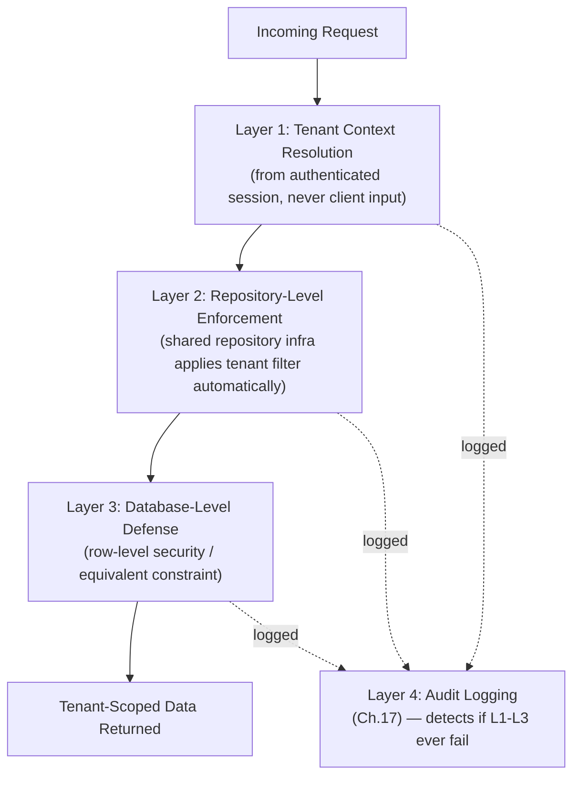
```mermaid
flowchart TD
    Req["Incoming Request"] --> L1["Layer 1: Tenant Context Resolution\n(from authenticated session, never client input)"]
    L1 --> L2["Layer 2: Repository-Level Enforcement\n(shared repository infra applies tenant filter automatically)"]
    L2 --> L3["Layer 3: Database-Level Defense\n(row-level security / equivalent constraint)"]
    L3 --> Data["Tenant-Scoped Data Returned"]

    L1 -.->|"logged"| L4["Layer 4: Audit Logging\n(Ch.17) — detects if L1-L3 ever fail"]
    L2 -.->|"logged"| L4
    L3 -.->|"logged"| L4
```

## 4.6 The Organization-to-Tenant Mapping Decision

**Decision 4.6.1 — One Organization maps to exactly one Tenant, for the initial model.**
This is a deliberate simplification, not an oversight. A more general model (one Organization owning multiple Tenants, e.g., for multi-entity/multi-subsidiary consolidation — a real ERP requirement in the mid-market and enterprise segment) is a credible future requirement, but it is **not** built speculatively now, consistent with Chapter 1.9's stated trade-off of avoiding over-engineering for needs not yet confirmed by real customer demand. Section 4.10 defines the specific trigger for revisiting this.

**Why this approach was chosen:** Building the general (multi-tenant-per-organization) model now would require solving cross-tenant consolidated reporting, cross-tenant permission models, and inter-entity transaction elimination (a real accounting requirement for consolidated financials) before there is a single real customer asking for it. The 1:1 model is simpler, ships faster, and — critically — does not foreclose the general model, because Section 4.5's enforcement mechanisms operate at the Tenant level regardless of how many Tenants a future Organization model might associate with one customer account.

## 4.7 Design Decisions

**Decision 4.7.1 — Tenant context is never trusted from client input.**
Per Section 4.5.1, the tenant a request operates against is always derived server-side from the authenticated session, never accepted as a parameter from the client. This closes the most common and most trivial version of a tenant-isolation vulnerability: a user simply changing a `tenant_id` value in a request and receiving another tenant's data.

**Decision 4.7.2 — Every tenant-owned table carries a `tenant_id`, with no exceptions carved out for convenience.**
Consistent with `06_DATABASE_STANDARDS.md`. A table that is tempted to skip this (e.g., "this reference table is the same for everyone anyway") must instead be modeled explicitly as platform-level shared reference data (Section 4.8), not as a tenant-owned table with an implicit, undocumented exception.

**Decision 4.7.3 — Platform-level (non-tenant-owned) data is a distinct, explicitly modeled category.**
Not all data in LedgerOne belongs to a tenant — system configuration, Marketplace catalog listings (Chapter 25), and platform-wide reference data (e.g., a standard chart of accounts template) are platform-owned. These are modeled as a distinct category, never conflated with tenant-owned tables, so that the "every tenant table has a `tenant_id`" rule (Decision 4.7.2) remains a bright line rather than a rule with quiet exceptions.

## 4.8 Platform-Owned vs. Tenant-Owned Data

| Category | Examples | Isolation Model |
|---|---|---|
| **Tenant-owned** | Chart of Accounts, Journal Entries, Sales Orders, Inventory Items, Employee records | Isolated per Section 4.5, `tenant_id` on every row |
| **Platform-owned, shared read** | Standard Chart of Accounts templates, tax rate reference tables, Marketplace catalog listings | No `tenant_id` — globally readable, writable only by Platform Operators or system processes, never by tenant users directly |
| **Platform-owned, operational** | Tenant provisioning records, subscription/billing state, platform audit logs (Chapter 2's Platform Operator plane) | Accessible only through the separate Platform Operator authorization plane (Chapter 2, Decision 2.6.1; Chapter 9) |

## 4.9 Trade-offs

- **Logical isolation carries residual risk that physical isolation does not.** Even with the defense-in-depth model in Section 4.5, a shared database strategy can never provide the same absolute guarantee as physically separate databases. This is accepted as the correct trade-off for LedgerOne's target scale (Section 4.4.3), with the explicit acknowledgment that specific high-sensitivity enterprise tenants may need the stronger, costlier guarantee as a named exception (Section 4.10), not as the default for all tenants.
- **The defense-in-depth model in Section 4.5 is more engineering effort than a single-layer approach.** Building and maintaining a shared repository infrastructure layer (4.5.2) and evaluating database-level row security (4.5.3) is more work than "just remember to filter by tenant_id." This cost is paid once, in shared infrastructure, rather than being paid repeatedly (and inconsistently) by every module team writing every query — which is a better cost distribution even though the total engineering investment is higher.
- **The 1:1 Organization-to-Tenant simplification (Decision 4.6.1) will require a real migration if and when the general model becomes necessary.** This is a known, accepted future cost, deliberately deferred per Chapter 1.9's over-engineering trade-off, rather than paid speculatively today.

## 4.10 Future Improvements

- **Trigger for revisiting Decision 4.6.1 (1:1 Organization-to-Tenant):** the first real enterprise customer requiring multi-entity consolidated reporting under a single commercial relationship. At that point, the general model's design (multiple Tenants under one Organization, consolidated reporting across them per Chapter 18) should be scoped as a dedicated project, not organically bolted on.
- **Trigger for offering database-per-tenant as an exception:** a specific enterprise tenant with a contractual data-residency or dedicated-infrastructure requirement that the shared model cannot satisfy. This should be built as an explicit, deliberately-scoped exception path — a tenant "class" that opts into stronger physical isolation — rather than changing the default strategy for all tenants.
- Revisit Section 4.5.3's database-level defense-in-depth layer specifically once the primary datastore's row-level security capabilities are evaluated in detail in Chapter 8 — this chapter mandates that such a layer exist in principle; Chapter 8 must confirm the concrete mechanism is available and performant enough on the chosen database engine.

## 4.11 Best Practices Established by This Chapter

- No new table may be added without an explicit classification into one of Section 4.8's three categories (tenant-owned, platform-owned shared-read, platform-owned operational) — "we'll decide later" is not an acceptable answer during schema review.
- No repository or query may bypass Layer 2 (Section 4.5.2) enforcement "just this once for performance" — if a genuine performance need requires a different data access pattern, it must still route through tenant-scoped infrastructure, not around it.
- Any code that reads a `tenant_id` from client-supplied input (body, query string, header controlled by the client) rather than from the resolved server-side session context is treated as a security defect, not a style nitpick, per Decision 4.7.1.

## 4.12 Security Considerations

This entire chapter is, in substance, a security chapter — tenant isolation is the single highest-consequence security property LedgerOne has, because its failure mode (cross-tenant financial data exposure) is simultaneously a confidentiality breach, a regulatory compliance failure, and a customer-trust-ending event. Chapter 20 (Security Architecture) treats tenant isolation as a foundational input rather than re-deriving it, precisely because it is established here, in Part I, before any module exists to violate it.

## 4.13 Performance Considerations

The shared-database strategy (Section 4.4.2) means that tenant-scoping filters (`tenant_id = ?`) are applied on effectively every query against tenant-owned data. This makes `tenant_id` one of the most performance-critical columns in the entire schema — it must be indexed, and in most tenant-owned tables it should be the leading column in composite indexes used for the table's primary access patterns, because nearly every query is implicitly filtered by it first. This is a concrete requirement carried forward into `06_DATABASE_STANDARDS.md` and Chapter 8, not an abstract concern.

## 4.14 Scalability

The flat operational cost curve of the shared-database strategy (Section 4.4.3) is this chapter's primary scalability contribution: tenant count can grow from ten to tens of thousands without a proportional growth in operational burden (migrations, backups, connection management). The remaining scaling concern this strategy does introduce — a single "noisy" tenant with disproportionately large data volume affecting query performance for others sharing the same database — is addressed in Chapter 21 through resource governance and query performance budgets, not through a change to the tenancy strategy itself.

## 4.15 Failure Scenarios

- **Failure: A cross-tenant data leak due to a missed tenant filter.** This is the scenario Section 4.5's entire defense-in-depth design exists to prevent. If Layer 2 (repository-level enforcement) is bypassed by a bug, Layer 3 (database-level defense) is the designed backstop; if both fail, Layer 4 (audit logging) ensures the incident is detectable rather than silent. This layered mitigation, not any single layer, is the actual answer to "what happens if this fails."
- **Failure: Tenant context resolution fails or defaults incorrectly** (e.g., a session bug resolves to no tenant, or — worse — a default/fallback tenant). Mitigation: tenant context resolution (Section 4.5.1) must fail closed — a request that cannot resolve an unambiguous tenant context must be rejected, never allowed to proceed with a null, default, or guessed tenant.
- **Failure: A "noisy neighbor" tenant degrades performance for others.** Named explicitly in Section 4.14 as a real consequence of the shared-database strategy. Mitigation is operational and performance-layer (Chapter 21), not a tenancy-model change — the tenancy model's job is correctness of isolation, not performance isolation, and this chapter is explicit that those are two different guarantees.
- **Failure: Tenant offboarding leaves orphaned or improperly retained data.** When a tenant's subscription ends, data retention/deletion must follow a defined procedure (Chapter 17, compliance-driven) rather than being handled ad hoc per request — an improperly offboarded tenant's data lingering indefinitely is both a compliance risk and, if the tenant ID is ever reused, a latent isolation risk.

---

*Chapter 4 approved.*

---

# PART II — STRUCTURAL ARCHITECTURE

# Chapter 5 — Layered Architecture

## 5.1 Purpose

Chapter 3 committed LedgerOne to Clean Architecture's dependency rule: dependencies point inward, toward the Domain, never the reverse. That commitment was made at the level of principle. This chapter makes it concrete: it names the exact layers every module is built from, states precisely what each layer is and is not allowed to know about, and defines how the dependency rule is checked in practice — so that "is this code in the right layer" has a specific, answerable test rather than a matter of taste.

## 5.2 Responsibilities of This Chapter

- Name and define each layer: Presentation, Business, Domain, Repository, Database.
- State exactly what each layer may depend on and what it must never depend on.
- Define how a request flows through the layers, and how a response flows back.
- Define how this layering interacts with Express.js's own routing and middleware idioms (routers, middleware, route handlers), since the layers are conceptual, not Express.js-native constructs, and must be mapped onto the framework deliberately rather than left ambiguous.

This chapter defines layering *within* a single module. How modules relate to *each other* is Chapter 6. How the Domain layer specifically models business concepts is Chapter 7.

## 5.3 The Five Layers, Defined

### 5.3.1 Presentation Layer

**Responsibility:** Translate between the outside world's protocol (HTTP, for LedgerOne's API — per `07_REST_API_STANDARDS.md`) and the Business layer's method calls. This layer parses and validates incoming requests into well-formed DTOs, invokes the appropriate Business layer service, and serializes the result back into an HTTP response.

**May depend on:** The Business layer (via its public interface only), request/response DTOs, framework-level HTTP concerns (Express routers, route handlers, middleware).

**Must never:** Contain business logic or business rule decisions. A controller that decides, itself, whether a Journal Entry is allowed to post based on business state has leaked Business/Domain responsibility into Presentation — this is a concrete, checkable violation, not a stylistic complaint (see Section 5.7).

**Must never:** Directly access the Repository or Database layers, bypassing Business/Domain — even for "simple" reads. Consistency of the dependency rule matters more than the convenience of a shortcut for any single endpoint.

### 5.3.2 Business Layer

**Responsibility:** Orchestrate a use case: coordinate one or more Domain objects and Repository calls to fulfill a specific application operation (e.g., "post this Journal Entry," "create this Sales Order and reserve inventory for it"). The Business layer is where transactions are opened and committed, where cross-Domain-object orchestration for a single use case happens, and where interaction with other modules (via the contracts defined in Chapter 6) occurs.

**May depend on:** The Domain layer, Repository interfaces (not implementations — per the Clean Architecture dependency rule, Chapter 3.4.1), other modules' published contracts (Chapter 6).

**Must never:** Contain the actual business *rules* themselves — those live in the Domain layer. The distinction is subtle and important: the Business layer decides *that* a Journal Entry should be posted as part of this use case and *orchestrates* the steps; the Domain layer decides *whether* a given Journal Entry, in isolation, is valid to post (e.g., debits equal credits). A Business layer service that re-implements "debits must equal credits" inline, rather than asking the Domain object, has duplicated a business rule outside the layer responsible for owning it.

**Must never:** Depend on Presentation-layer or Repository-implementation-layer concerns (HTTP objects, ORM-specific types).

### 5.3.3 Domain Layer

**Responsibility:** Encode the actual business rules and invariants of the module's Bounded Context (Chapter 7), using DDD (Chapter 3.5). This is the layer Clean Architecture protects most strictly — it is the "inside" that all other layers' dependencies point toward.

**May depend on:** Nothing else in the system. The Domain layer is self-contained — no framework types, no ORM types, no HTTP types, no dependency on any other layer.

**Must never:** Import anything from Presentation, Business, Repository, or Database layers, or from any third-party framework/infrastructure package. This is the single most important rule in this chapter and the one Decision 3.7.1 mandates tooling enforcement for.

### 5.3.4 Repository Layer

**Responsibility:** Implement persistence for Domain objects, translating between the Domain's in-memory representation and the Database layer's storage representation. The Repository layer implements interfaces that are *defined* in the Domain layer (per Clean Architecture's dependency-inversion: the interface belongs to the layer that uses it — Domain/Business — not the layer that implements it).

**May depend on:** The Domain layer (to know what interfaces it must implement and what objects it must persist/reconstruct), the Database layer (ORM, query building, per `02_TECH_STACK.md`'s Prisma), and the Multi-Tenancy enforcement infrastructure (Chapter 4.5.2) — every tenant-owned-table repository is built on top of shared tenant-scoping infrastructure, never independently reimplementing tenant filtering.

**Must never:** Leak ORM-specific types (e.g., Prisma-generated model types) back out to the Business or Domain layers. A Repository method returns Domain objects, constructed from raw persistence data internally — the caller never sees the ORM's representation.

### 5.3.5 Database Layer

**Responsibility:** The actual persistent store — MySQL 8, per `02_TECH_STACK.md` — and the schema conventions defined in `06_DATABASE_STANDARDS.md`. This "layer" in the architectural sense is the physical infrastructure the Repository layer talks to; it is not application code.

## 5.4 Request Flow Diagram

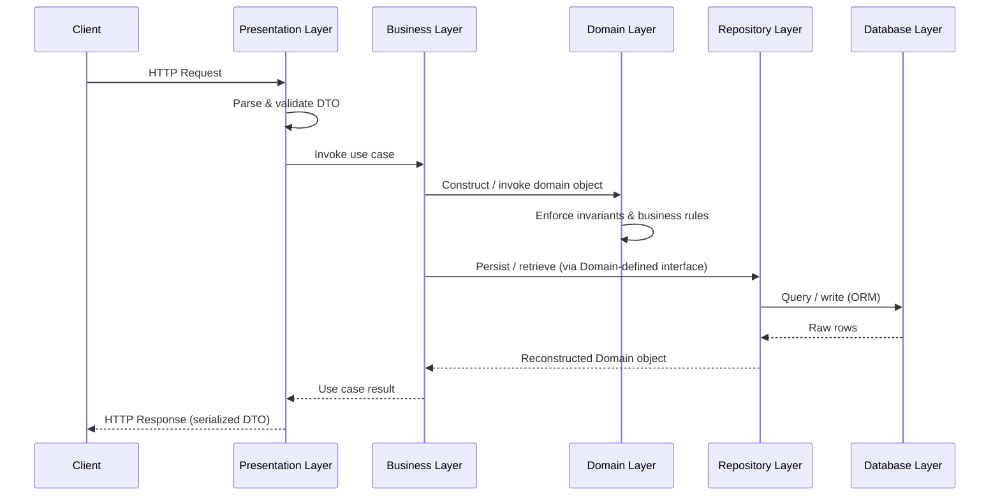
```mermaid
sequenceDiagram
    participant Client
    participant Presentation as Presentation Layer
    participant Business as Business Layer
    participant Domain as Domain Layer
    participant Repository as Repository Layer
    participant Database as Database Layer

    Client->>Presentation: HTTP Request
    Presentation->>Presentation: Parse & validate DTO
    Presentation->>Business: Invoke use case
    Business->>Domain: Construct / invoke domain object
    Domain->>Domain: Enforce invariants & business rules
    Business->>Repository: Persist / retrieve (via Domain-defined interface)
    Repository->>Database: Query / write (ORM)
    Database-->>Repository: Raw rows
    Repository-->>Business: Reconstructed Domain object
    Business-->>Presentation: Use case result
    Presentation-->>Client: HTTP Response (serialized DTO)
```

## 5.5 Layer Dependency Diagram — The Rule Made Visual

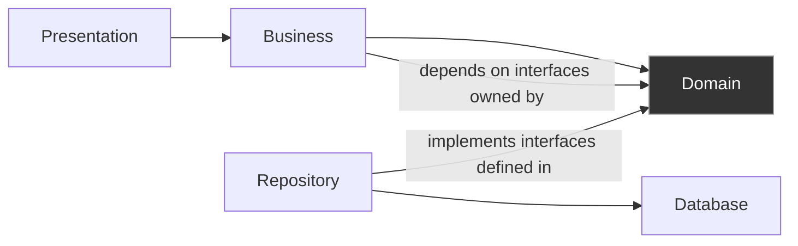
```mermaid
graph LR
    P["Presentation"] --> B["Business"]
    B --> D["Domain"]
    R["Repository"] -->|"implements interfaces defined in"| D
    R --> DB["Database"]
    B -->|"depends on interfaces owned by"| D

    classDef inner fill:#333,stroke:#999,color:#fff;
    class D inner;
```

The arrows point strictly one direction: toward Domain. Repository *implements* Domain-owned interfaces rather than Domain depending on Repository — this inversion (the "D" in a classic dependency-inversion sense) is what allows the persistence technology to change (e.g., a future ORM migration) without the Domain layer ever being touched.

## 5.6 Mapping Layers onto Express.js

Express does not have native "Presentation/Business/Domain/Repository" concepts — it has routers, middleware, and plain route handlers. This chapter mandates a specific, deliberate mapping so the conceptual layering above is not left to individual interpretation per module:

| Conceptual Layer | Express.js Construct |
|---|---|
| Presentation | Express routers / route handlers, Zod-validated request objects |
| Business | Plain "Application/Use-Case" service classes or functions, manually instantiated and wired (no DI container, no decorators) |
| Domain | Plain TypeScript classes with no framework decorators or imports — deliberately framework-agnostic |
| Repository | Plain Repository classes implementing Domain-defined interfaces, using Prisma internally |
| Database | Prisma schema, migrations, MySQL instance |

The Domain layer's classes carrying no framework decorators is a deliberate, checkable signal: if a Domain class needs a decorator, a request/response object, or any Express import, it has drifted out of the Domain layer's intended isolation.

### 5.6.1 C4 Model — Level 3: Component Diagram (Accounting Module, representative)

The internal component view inside a single container (the Backend Platform container from Chapter 6.4.1), using Accounting as the representative module — every Business Capability module follows this identical component shape.

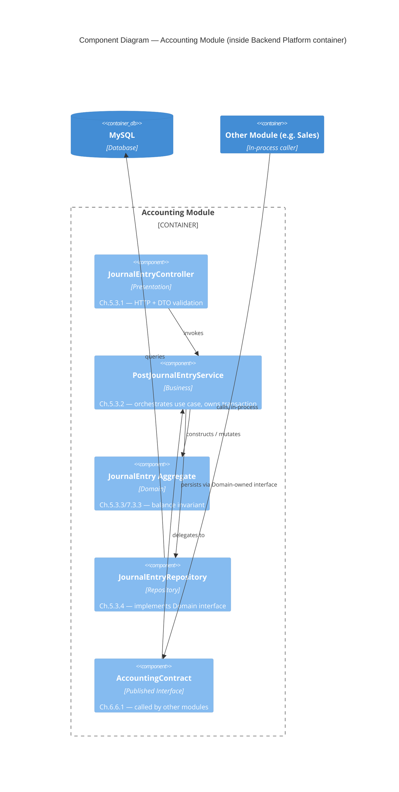
```mermaid
C4Component
    title Component Diagram — Accounting Module (inside Backend Platform container)

    Container_Boundary(acct, "Accounting Module") {
        Component(ctrl, "JournalEntryController", "Presentation", "Ch.5.3.1 — HTTP + DTO validation")
        Component(svc, "PostJournalEntryService", "Business", "Ch.5.3.2 — orchestrates use case, owns transaction")
        Component(dom, "JournalEntry Aggregate", "Domain", "Ch.5.3.3/7.3.3 — balance invariant")
        Component(repo, "JournalEntryRepository", "Repository", "Ch.5.3.4 — implements Domain interface")
        Component(contract, "AccountingContract", "Published Interface", "Ch.6.6.1 — called by other modules")
    }

    ContainerDb(db, "MySQL", "Database")
    Container(otherMod, "Other Module (e.g. Sales)", "In-process caller")

    Rel(ctrl, svc, "invokes")
    Rel(svc, dom, "constructs / mutates")
    Rel(svc, repo, "persists via Domain-owned interface")
    Rel(repo, db, "queries")
    Rel(otherMod, contract, "calls, in-process")
    Rel(contract, svc, "delegates to")
```

## 5.7 Design Decisions

**Decision 5.7.1 — Layer violations are treated as defects, not style preferences.**
Per Chapter 3, Decision 3.7.1's tooling enforcement mandate, this chapter defines the concrete rule that tooling checks: Domain-layer files must not import from Business, Presentation, Repository, or any Express/Prisma package. This is enforced as a blocking CI check once tooling is in place, and as an explicit, non-negotiable code review criterion in the interim.

**Decision 5.7.2 — Repository interfaces are owned by the Domain layer, not the Repository layer.**
This is the specific mechanism of Clean Architecture's dependency inversion (Chapter 3.4.1) applied concretely: the *interface* a repository must satisfy is defined where it is *used* (Domain/Business), and the Repository layer provides an *implementation* of that interface. This ordering — interface in the inner layer, implementation in the outer layer — is what makes the dependency arrow point inward even though, intuitively, "the repository talks to the database" sounds like it should be a dependency running the other direction.

**Decision 5.7.3 — Transactions are opened and managed at the Business layer, never inside the Domain or Repository layers independently.**
A single use case (e.g., "post a Sales Invoice, which also creates a Journal Entry and adjusts Inventory") may involve multiple Repository calls that must succeed or fail atomically. The Business layer, as the orchestrator of the use case, is the correct and only place to own transaction boundaries — pushing transaction management into the Domain layer would violate its framework-agnostic isolation (5.3.3), and pushing it into the Repository layer would prevent multi-repository atomicity for a single use case.

## 5.8 Why This Approach Was Chosen

The alternative to explicit layer definitions is to trust that "everyone knows" where business logic belongs, which in practice means every engineer draws the line differently, and the line drifts over time as deadline pressure accumulates small violations. Naming the five layers precisely, stating exactly what each may and must never depend on, and providing a concrete Express.js mapping (Section 5.6) converts Chapter 3's principle into something a new engineer can be onboarded onto in an afternoon and a reviewer can check in a pull request without ambiguity.

## 5.9 Alternatives Considered

**Alternative: Three-layer model (Controller/Service/Repository) without a separate Domain layer.**
Rejected. This is a conventional layered framework tutorial structure, and it is exactly the "layered architecture without an enforced dependency rule" alternative rejected in Chapter 3.4.3. Without a Domain layer that is structurally forbidden from depending on infrastructure, business rules end up implemented directly inside "Service" classes that also import ORM types, which recreates the exact coupling Clean Architecture exists to prevent.

**Alternative: CQRS (Command Query Responsibility Segregation) as the primary layering model.**
Considered, given its popularity in DDD-adjacent applications. Rejected for v1 — CQRS's benefit (separating read and write models, useful when they diverge significantly) is not needed for LedgerOne's modules, where reads and writes share the same model reasonably well. It is not adopted as a layering model anywhere in the system, including Reporting (Chapter 18), avoiding the over-engineering risk named in Chapter 1.9.

## 5.10 Trade-offs

- **More files and more indirection per feature.** A single "create Sales Order" feature touches a DTO, a controller method, a Business-layer service method, one or more Domain classes, and one or more Repository implementations — five or more files/classes where a simpler CRUD framework might need one. Accepted per Chapter 3.4.4's reasoning: this cost is fixed and predictable per feature, while the benefit (testable, technology-independent business logic) compounds over the platform's 10-20 year expected lifespan.
- **The Domain layer's isolation (5.3.3) means some conveniences common in ORM-centric development (e.g., lazy-loading relations directly on a Domain object) are unavailable** — the Repository layer must eagerly reconstruct whatever the Domain object needs, since the Domain object cannot itself trigger a database call. This requires more deliberate Repository design than "let the ORM handle it."

## 5.11 Best Practices Established by This Chapter

- Every module's folder structure should make the five layers visually apparent (the specific folder convention is `04_FOLDER_STRUCTURE.md`'s concern, informed by this chapter's layer definitions).
- Code review for any new feature should be able to answer, layer by layer: what does Presentation validate, what does Business orchestrate, what invariant does Domain enforce, what does Repository persist? A feature where this cannot be cleanly answered has likely blurred layer responsibilities.
- New Repository interfaces are written and reviewed as part of Domain-layer design discussions, not treated as an afterthought written by whoever implements persistence.

## 5.12 Security Considerations

Because authorization decisions (Chapter 9) are business rules, they belong in the Business or Domain layer — never solely in the Presentation layer as a guard that could be bypassed if a use case is ever invoked from a second entry point (e.g., a background job, Chapter 13, invoking the same use case without going through a controller). This chapter's layering ensures that a security-relevant decision made only in a Guard (Presentation layer) and never re-checked in Business/Domain is a structural gap, not a hypothetical one — any second caller of that Business-layer method bypasses the Presentation-layer guard entirely by construction.

## 5.13 Performance Considerations

The Repository layer's responsibility to reconstruct Domain objects fully (Section 5.10) creates a natural point to control exactly what is fetched from the database per use case, rather than an ORM's default lazy-loading behavior silently issuing N+1 queries across layer boundaries. This chapter's strict layering, somewhat counter-intuitively, tends to produce *better* query performance visibility than a looser architecture would, precisely because every database access is forced through an explicit, auditable Repository method rather than triggered implicitly by touching a lazily-loaded property deep in a call stack.

## 5.14 Scalability

Layered architecture, on its own, is orthogonal to the tenant-scale and module-scale concerns of Chapters 1 and 4 — its contribution to scalability is organizational: because each layer has a narrow, well-defined responsibility, multiple engineers (and eventually multiple module teams, per Chapter 1's team-growth clause) can work on different layers of the same feature, or different features within the same module, with a shared, unambiguous vocabulary for where a given piece of logic belongs — reducing the coordination cost that would otherwise grow with team size.

## 5.15 Failure Scenarios

- **Failure: Business logic leaks into the Presentation layer.** E.g., a controller method contains an `if` statement deciding whether an operation is allowed based on business state, rather than delegating that decision to Business/Domain. Left unchecked, this means the same business rule must be reimplemented at every entry point that needs it (a second controller, a background job, a future GraphQL endpoint) — a correctness and maintenance risk. Mitigation: Section 5.7.1's tooling and review enforcement, plus Section 5.12's explicit call-out that this is a security gap, not merely a style issue, when the leaked logic is authorization-related.
- **Failure: The Domain layer accidentally gains an infrastructure dependency.** E.g., a Domain class imports a date/time or validation utility that happens to come from a package with framework dependencies, silently breaking the layer's isolation. Mitigation: Decision 5.7.1's tooling check should catch transitive as well as direct violations where feasible; where it cannot, this must be a specific, named code review checklist item.
- **Failure: Multi-repository transactions are managed inconsistently**, with some Business-layer use cases correctly wrapping multiple Repository calls in a transaction and others (written by an engineer unfamiliar with Decision 5.7.3) omitting it, leading to partial writes on failure (e.g., a Journal Entry created but the corresponding Inventory adjustment silently failing). Mitigation: shared Business-layer base infrastructure or decorators that make transaction-wrapping the default, easy path, rather than something each use case must remember to add manually.

## 5.16 Future Improvements

- Monitor Reporting-module (Chapter 18) read-model performance as real usage grows, and revisit whether the existing layered read-model approach continues to scale without needing a different pattern.
- As the tooling in Decision 5.7.1 matures, consider whether layer-violation checks can be integrated directly into the IDE/editor experience (not just CI) so violations are caught at write-time rather than at review-time.
- Revisit Section 5.6's Express.js mapping if a future technology migration changes the backend framework (per Chapter 3.4.2's stated goal of business logic surviving such a migration) — this section, unlike the conceptual layer definitions in 5.3, is expected to be the part of this chapter most likely to need revision over the platform's lifetime.

---

*Chapter 5 approved.*

---

# Chapter 6 — Modular Decomposition & Module Boundaries

## 6.1 Purpose

Chapter 5 defined how layers relate to each other *within* a single module. This chapter defines how modules relate to *each other* — the mechanism that makes the Modular Monolith (Chapter 3.3) a real, enforced structure rather than a folder-naming convention. This is arguably the single most consequential chapter in Part II for Chapter 1's vision statement: module-count growth without a rewrite is only achievable if module boundaries are drawn correctly and enforced structurally from the first module onward.

## 6.2 Responsibilities of This Chapter

- Define what constitutes a "module" and the criteria for drawing a boundary around one.
- Define the only permitted mechanisms for cross-module communication.
- Define how module boundaries are enforced mechanically, not just by convention.
- Define the module registry/catalog concept that makes module composition (and eventual extraction, Chapter 27) tractable.

This chapter does not define the specific list of LedgerOne's modules in exhaustive detail (that list, per `01_PROJECT_CONTEXT.md` and Chapter 1.3, evolves over time) nor the internal Domain modeling within a module (Chapter 7). It defines the *contract* a module must honor to be a module in LedgerOne's architecture, regardless of which business capability it implements.

## 6.3 What Is a Module

A module is the unit of **business capability ownership**. A module owns:

- A specific, named set of business responsibilities (e.g., "Accounting owns the Chart of Accounts, Journal Entries, and Financial Statements").
- The database tables that store its owned data — no other module may read or write these tables directly, ever, under any circumstance (Section 6.5).
- The Domain model (Chapter 7) representing its owned business concepts.
- A published, versioned contract (Section 6.6) through which other modules may interact with it.

A module boundary is drawn around a business capability, per Chapter 1.5's principle, never around a technical layer or an arbitrary code-organization convenience. The test for whether something should be its own module or a sub-concern of an existing module is: **does this represent a distinct business capability that could plausibly be owned by a different team, evolve on a different roadmap, or eventually be extracted into its own service (Chapter 27)?** If yes, it is a candidate module boundary. If it is simply "this file was getting long," it is not — that is a Chapter 5 layering concern, not a Chapter 6 module boundary concern.

## 6.4 The Module List, Revisited

`01_PROJECT_CONTEXT.md` and Chapter 1.3 name the anticipated module list: Authentication, Authorization, Organization, Accounting, Inventory, Sales, Purchase, Banking, CRM, Payroll, Reporting, Audit, Notification, Settings, Foundation, Manufacturing, Assets, Projects, Dashboard, AI Assistant, API Marketplace, and others as the platform grows. This chapter does not re-justify each individually; it establishes the *rules* every module in that list — present or future — must follow. Two categories are worth distinguishing explicitly:

- **Business Capability Modules**: Accounting, Inventory, Sales, Purchase, Banking, CRM, Payroll, Manufacturing, Assets, Projects, POS — each owns a distinct business domain (Chapter 7).
- **Platform/Foundation Modules**: Authentication, Authorization, Organization, Notification, Settings, Audit, Foundation — these provide shared capability *used by* business capability modules, but are still modules in the full sense of Section 6.3: they own their own data, expose their own contracts, and are never reached into directly.

This distinction matters because it is tempting to treat Foundation/Platform modules as "special" and allow other modules to bypass their contracts for convenience (e.g., "just read the Users table directly, it's just Authentication"). Section 6.5 explicitly forbids this — a Platform module is still a module, with the same boundary rules as a Business Capability module.

### 6.4.1 C4 Model — Level 2: Container Diagram

The container view of the same system named in Chapter 2.4.1 — each box is independently deployable/scalable per Chapter 21, but all backend containers here run inside the single Modular Monolith process of Chapter 3.3.1 except where noted.

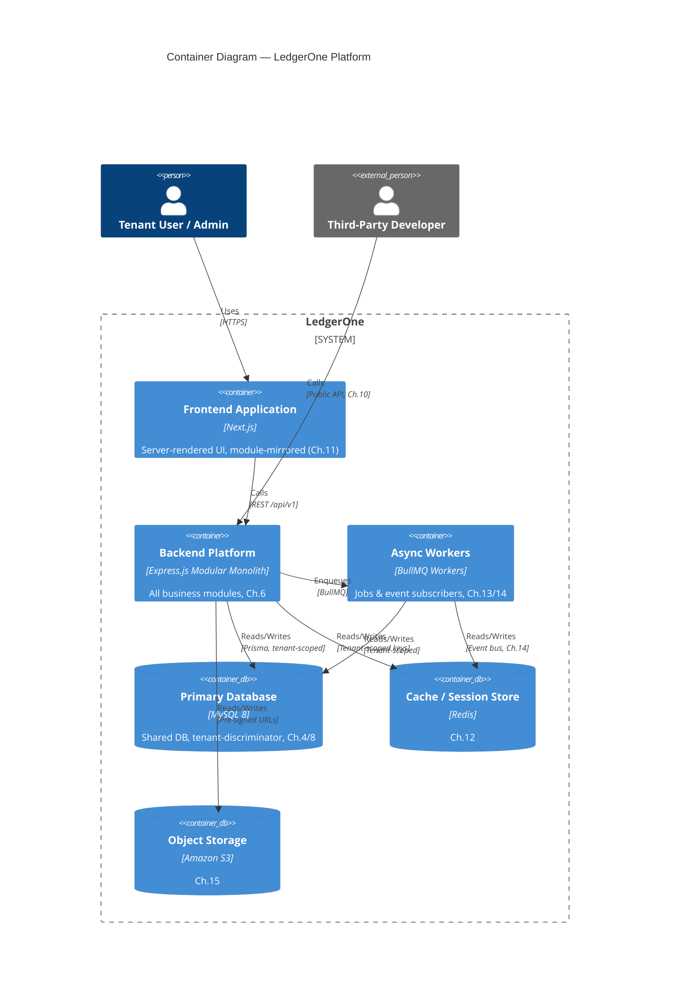
```mermaid
C4Container
    title Container Diagram — LedgerOne Platform

    Person(user, "Tenant User / Admin")
    Person_Ext(dev, "Third-Party Developer")

    System_Boundary(lo, "LedgerOne") {
        Container(fe, "Frontend Application", "Next.js", "Server-rendered UI, module-mirrored (Ch.11)")
        Container(api, "Backend Platform", "Express.js Modular Monolith", "All business modules, Ch.6")
        Container(worker, "Async Workers", "BullMQ Workers", "Jobs & event subscribers, Ch.13/14")
        ContainerDb(db, "Primary Database", "MySQL 8", "Shared DB, tenant-discriminator, Ch.4/8")
        ContainerDb(cache, "Cache / Session Store", "Redis", "Ch.12")
        ContainerDb(storage, "Object Storage", "Amazon S3", "Ch.15")
    }

    Rel(user, fe, "Uses", "HTTPS")
    Rel(dev, api, "Calls", "Public API, Ch.10")
    Rel(fe, api, "Calls", "REST /api/v1")
    Rel(api, db, "Reads/Writes", "Prisma, tenant-scoped")
    Rel(api, cache, "Reads/Writes", "Tenant-scoped keys")
    Rel(api, storage, "Reads/Writes", "Pre-signed URLs")
    Rel(api, worker, "Enqueues", "BullMQ")
    Rel(worker, db, "Reads/Writes", "Tenant-scoped")
    Rel(worker, cache, "Reads/Writes", "Event bus, Ch.14")
```

### 6.4.2 Module Dependency Diagram

Arrows show sanctioned Chapter 6.6 communication only — never a direct table reference. This is the diagram a reviewer checks first when evaluating whether a proposed cross-module interaction is legitimate.

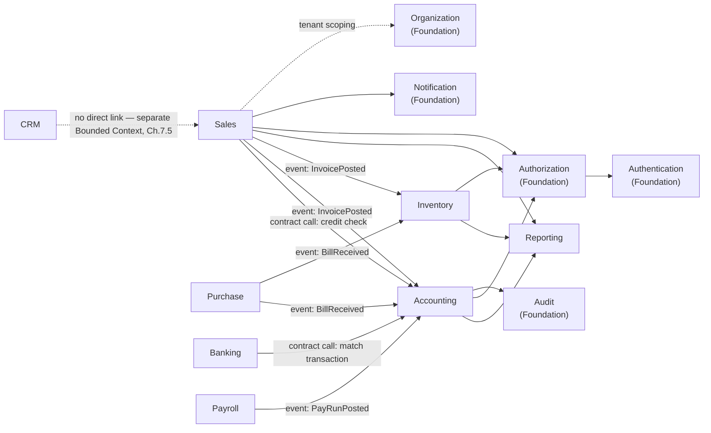
```mermaid
graph LR
    Auth["Authentication\n(Foundation)"]
    Authz["Authorization\n(Foundation)"]
    Org["Organization\n(Foundation)"]
    Notif["Notification\n(Foundation)"]
    Audit["Audit\n(Foundation)"]

    Acct["Accounting"]
    Inv["Inventory"]
    Sales["Sales"]
    Purch["Purchase"]
    Bank["Banking"]
    CRM["CRM"]
    Payroll["Payroll"]
    Report["Reporting"]

    Sales -->|"contract call: credit check"| Acct
    Sales -->|"event: InvoicePosted"| Acct
    Sales -->|"event: InvoicePosted"| Inv
    Purch -->|"event: BillReceived"| Acct
    Purch -->|"event: BillReceived"| Inv
    Bank -->|"contract call: match transaction"| Acct
    Payroll -->|"event: PayRunPosted"| Acct
    CRM -.->|"no direct link — separate Bounded Context, Ch.7.5"| Sales

    Acct --> Report
    Inv --> Report
    Sales --> Report

    Sales --> Authz
    Acct --> Authz
    Inv --> Authz
    Authz --> Auth
    Sales --> Notif
    Acct --> Audit
    Sales -.->|"tenant scoping"| Org
```

### Naming Conventions — Module & Contract Vocabulary

| Concept | Convention | Example |
|---|---|---|
| Module name | PascalCase, singular business capability | `Accounting`, `Inventory` |
| Permission key | `module.resource.action`, snake_case | `accounting.journal_entry.post` |
| Domain Event name | `module.PastTenseFact`, PascalCase fact | `sales.InvoicePosted` |
| Published contract interface | `I{Module}Service` or `{Module}Contract` | `IAccountingContract` |
| Manifest file | `module.manifest.ts` per module root | `accounting/module.manifest.ts` |

## 6.5 The Non-Negotiable Rule: No Cross-Module Database Access

**No module may read from or write to another module's database tables, directly, under any circumstance.** This is the single rule this entire chapter exists to enforce, and it is stated here in its strongest possible form deliberately, because every exception ever proposed to this rule ("just this once, for performance," "it's just a simple lookup") is precisely how the entangled monolith Chapter 1 warns against is actually built, one exception at a time.

This means: if the Sales module needs to know a Customer's outstanding balance (owned by Accounting), Sales does not query Accounting's tables. It calls a method on Accounting's published contract (Section 6.6), or subscribes to an event Accounting publishes (Chapter 14), or — in a read-heavy reporting context — reads from an explicitly-designed cross-module read model built for that purpose (Chapter 18), never from Accounting's own transactional tables.

## 6.6 Cross-Module Communication Mechanisms

Exactly three mechanisms are permitted for cross-module interaction, each suited to a different kind of interaction:

### 6.6.1 Synchronous Contract Calls (Published Service Interfaces)

For interactions where the calling module needs an immediate answer within the current use case (e.g., Sales needs to know, right now, whether a Customer's credit limit permits this order), a module publishes a narrow, explicit interface — a defined set of methods with defined inputs and outputs — that other modules may call in-process (recall from Chapter 3.10 that this is an in-process call, not a network call, one of the Modular Monolith's concrete advantages). This published interface is the *only* part of a module visible to other modules; everything else (internal services, Domain objects, Repositories) is private to the module.

### 6.6.2 Asynchronous Domain Events (Publish/Subscribe)

For interactions where the calling module does not need an immediate answer, and where the interaction represents "something happened" rather than "give me information" (e.g., Sales posts an invoice, and Accounting, Inventory, and CRM all need to react independently), the originating module publishes a Domain Event, and interested modules subscribe to it. This is the primary mechanism, detailed fully in Chapter 14, for keeping modules decoupled even when many modules care about the same business fact — the originating module does not need to know who is listening.

### 6.6.3 Cross-Module Read Models (For Reporting/Dashboard Only)

For read-heavy, cross-module aggregation (e.g., a Dashboard widget showing Sales, Inventory, and Accounting figures together), a dedicated read model — populated asynchronously from Domain Events (6.6.2), never queried live across module boundaries — is built specifically for that reporting need (Chapter 18). This exists as a named, sanctioned exception to "always call the contract synchronously," specifically because synchronous fan-out calls to many modules for every dashboard render would be both an architectural violation of module independence and a performance problem; it is not a loophole for bypassing Section 6.5's data-access rule, because the read model is still populated only from published events, never from direct table access.

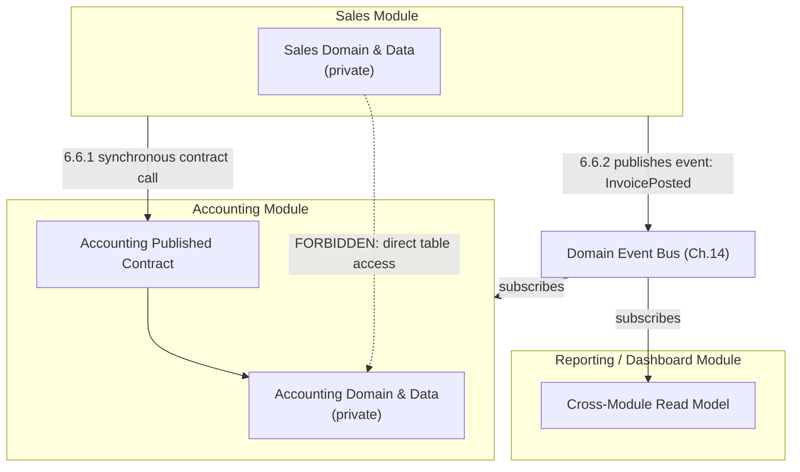
```mermaid
graph TB
    subgraph Sales["Sales Module"]
        SD["Sales Domain & Data\n(private)"]
    end
    subgraph Accounting["Accounting Module"]
        AD["Accounting Domain & Data\n(private)"]
        AC["Accounting Published Contract"]
    end
    subgraph Reporting["Reporting / Dashboard Module"]
        RM["Cross-Module Read Model"]
    end

    Sales -->|"6.6.1 synchronous contract call"| AC
    AC --> AD

    Sales -->|"6.6.2 publishes event: InvoicePosted"| Bus["Domain Event Bus (Ch.14)"]
    Bus -->|"subscribes"| Accounting
    Bus -->|"subscribes"| RM

    SD -.->|"FORBIDDEN: direct table access"| AD
```

## 6.7 Mechanical Enforcement of Module Boundaries

Consistent with this handbook's recurring theme (Chapter 1's principle, Chapter 3's Decision 3.7.1, Chapter 5's Decision 5.7.1) that structural rules must be enforced by tooling, not only convention, module boundaries are enforced through:

- **Module-scoped database access.** The Repository layer's shared tenant-scoping infrastructure (Chapter 4.5.2) is extended to also be module-scoped: a module's Repository implementations are only ever wired to that module's own tables at the dependency-injection/configuration level, making cross-module table access not just discouraged but wired to be structurally unavailable.
- **Import boundary linting.** Static analysis rules forbid a module's code from importing another module's internal classes (Domain objects, Business-layer services, Repositories) — only imports of another module's explicitly published contract interface (6.6.1) are permitted. This is the module-boundary equivalent of Decision 5.7.1's layer-boundary enforcement.
- **Module manifest / registry.** Each module declares, in a manifest, what it publishes (its contract interfaces and the Domain Events it emits) and what it consumes (which other modules' contracts it calls, which events it subscribes to). This manifest is reviewable in isolation — an architectural reviewer can see a module's entire footprint of cross-module dependency without reading its internal implementation.

## 6.8 Design Decisions

**Decision 6.8.1 — A module's published contract is versioned independently of its internal implementation.**
A module may refactor its internals freely (Chapter 5's layers, its Domain model, its persistence details) without any other module being affected, as long as its published contract (6.6.1's interface, 6.6.2's event shapes) remains stable or is versioned explicitly when it must change. This is what makes "team autonomy" (Chapter 1's vision) real rather than aspirational — a module team can ship internal changes on their own schedule.

**Decision 6.8.2 — Foundation/Platform modules are modules, not exceptions.**
Per Section 6.4, Authentication, Authorization, Organization, and similar platform-level modules follow every rule in this chapter identically to Business Capability modules. The temptation to treat them as "just shared infrastructure, safe to access directly" is explicitly named and rejected, because it is exactly the kind of exception that erodes the "no cross-module database access" rule's credibility as a bright line.

**Decision 6.8.3 — A new module's manifest (Section 6.7) is reviewed before implementation begins.**
Consistent with Chapter 1's Best Practice (1.11) that new module proposals state their capability and interactions before code is written, this chapter makes that concrete: the manifest — what the module will publish and consume — is the specific artifact reviewed.

## 6.9 Why This Approach Was Chosen

The alternative — trusting engineers to simply not take shortcuts across module boundaries — was already rejected in Chapter 4 for tenant isolation, for the identical underlying reason: manual discipline does not scale to a growing team over a multi-year product lifespan, and the cost of a single violation compounds because the next engineer, seeing a precedent, takes the same shortcut with less hesitation. Chapter 6.7's mechanical enforcement exists specifically so that "is this allowed" is answered by tooling at commit time, not discovered as an incident or an expensive refactor years later.

The three-mechanism model in Section 6.6 (rather than a single "modules call each other's APIs" rule) exists because a single mechanism does not fit every interaction shape: forcing an event-only architecture would make simple, immediate-answer interactions (6.6.1's use case) unnecessarily convoluted, while forcing everything through synchronous calls would make independent, multi-subscriber reactions to business facts (6.6.2's use case) tightly and unnecessarily coupled. Matching the mechanism to the interaction shape is what keeps the architecture both correct and pleasant to build within.

## 6.10 Alternatives Considered

**Alternative: A single shared "core" library that all modules import for common concepts (e.g., a shared Customer entity used by both Sales and CRM).**
Rejected as a default pattern. This is superficially attractive (avoid "duplicating" the concept of a Customer) but violates DDD's Bounded Context principle (Chapter 3.5.1): Sales and CRM legitimately need different facets of "Customer," and a shared entity that must satisfy both ends up either bloated with fields only one module needs, or becomes a coordination bottleneck every time either module wants to evolve its view of a Customer. Each module models its own view of shared real-world concepts, reconciled only through explicit contracts/events (6.6), not through a shared entity.

**Alternative: Allow direct read-only access across module database boundaries (writes forbidden, reads permitted).**
Rejected. This is a common compromise proposal, and it is rejected because it still creates the core problem Section 6.5 exists to prevent: a module's internal schema becomes a public API the moment any other module reads it directly, which means the "owning" module can never freely refactor its own tables without checking every other module that might be reading them — this defeats Decision 6.8.1's core promise of implementation-detail freedom entirely, even though it sounds safer than allowing writes.

**Alternative: Enforce module boundaries by convention and code review only, without tooling.**
Rejected for the same reasons articulated in Section 6.9 and consistently throughout this handbook (Chapters 3, 4, 5) — this handbook treats "we enforce this in code review" as a necessary but insufficient safeguard, never a substitute for mechanical enforcement, because review vigilance degrades under deadline pressure and team growth in exactly the moments the rule matters most.

## 6.11 Trade-offs

- **Designing a published contract for a module used by only one other module today is more upfront work than a direct call would be.** This cost is paid deliberately, per Chapter 1.9's reasoning, because the alternative cost (retrofitting a contract onto an already-entangled integration once a third module also needs the same data) is higher and riskier.
- **Cross-module read models (6.6.3) introduce eventual consistency into reporting/dashboard views** — a Dashboard figure may lag slightly behind the true transactional state in Accounting, because it is populated asynchronously from events rather than queried live. This is an accepted trade-off specifically scoped to reporting/dashboard contexts (Chapter 18), where slight lag is acceptable; it is explicitly not accepted for any use case requiring real-time transactional correctness, which must use 6.6.1's synchronous contract instead.
- **Tooling enforcement (6.7) requires investment to build and maintain**, and produces friction (a blocked commit/PR) exactly when a shortcut is being attempted — friction that is the point, but that will be experienced by individual engineers as an obstacle in the moment, not as an abstract architectural benefit.

## 6.12 Best Practices Established by This Chapter

- A module's published contract interface should be designed to be the smallest surface that satisfies real, current consuming needs — not an anticipatory, broad interface designed for hypothetical future consumers (echoing Chapter 1.4.1's guidance on keeping module contracts narrow).
- When two modules seem to need to share a concept deeply and constantly, treat that as a signal to re-examine whether the module boundary itself is drawn correctly (Section 6.3's test), rather than immediately reaching for a workaround to the communication rules in Section 6.6.
- Every module's manifest (6.7) should be kept current as part of the same pull request that changes what a module publishes or consumes — never updated retroactively "when someone gets around to it."

## 6.13 Security Considerations

Module boundaries are a security control, not merely an organizational one: because a module's data is only reachable through its published contract (Section 6.6.1) or events it chooses to emit (6.6.2), authorization checks (Chapter 9) enforced within a module's Business/Domain layers (per Chapter 5.12) are guaranteed to be the *only* path to that module's data — there is no possibility of a second, unguarded path via direct table access from another module, because Section 6.5 and Section 6.7's enforcement structurally eliminate that path. This significantly narrows the surface a security review of any single module needs to consider: reviewing whether Accounting's authorization is correct does not require also verifying every other module's code, because no other module has an alternate path in.

## 6.14 Performance Considerations

Synchronous contract calls (6.6.1) between modules are in-process calls (Chapter 3.10), so the primary performance concern this chapter introduces is not latency but **fan-out**: a use case that ends up synchronously calling many other modules' contracts sequentially can accumulate latency even without network overhead, and — more importantly — creates a chain of synchronous dependencies where a slow or failing downstream module can slow down or fail an otherwise-unrelated use case. This chapter's guidance is that any interaction that does not strictly require an immediate answer should default to the asynchronous event mechanism (6.6.2) specifically to avoid this class of coupling, and Chapter 21 defines concrete latency budgets per use case that surface this kind of fan-out problem in monitoring before it becomes a customer-visible issue.

## 6.15 Scalability

This chapter is the primary structural mechanism serving Chapter 1's team-growth and module-growth clauses simultaneously. Team-growth scalability comes from Decision 6.8.1 (independent internal evolution behind a stable contract) — teams do not need to coordinate on internal changes. Module-growth scalability comes from Section 6.3's capability-based boundary criterion combined with Section 6.7's enforcement — a new module can be added by defining its manifest and implementing behind it, without needing to modify any existing module's code, which is the literal mechanical realization of Chapter 1.4.1's "modules must be addable without modifying existing modules" requirement.

## 6.16 Failure Scenarios

- **Failure: A module boundary is violated under deadline pressure ("just this once").** Named explicitly in Section 6.5 as the primary failure mode this entire chapter defends against. Mitigation: Section 6.7's mechanical enforcement is designed specifically so that "just this once" requires deliberately defeating tooling, not merely skipping a step a reviewer might not notice.
- **Failure: A module's published contract grows into a large, unfocused "kitchen sink" interface** because every consuming module's ad hoc need was added to it over time without pushback. Mitigation: Section 6.12's guidance to keep contracts narrow, and Decision 6.8.3's manifest review as the point where a bloated addition to a contract should be caught and questioned.
- **Failure: Synchronous fan-out across many module contracts creates a fragile dependency chain**, where one module's slowness or downtime cascades into unrelated use cases. Mitigation: Section 6.14's default-to-asynchronous guidance, and Chapter 23's circuit-breaker/timeout patterns for the synchronous calls that do remain necessary.
- **Failure: A cross-module read model (6.6.3) is mistakenly treated as a source of truth** for a use case that actually needs real-time correctness (e.g., a use case incorrectly reads a Dashboard read model instead of calling Accounting's contract directly for a balance check that gates a real transaction). Mitigation: read models must be clearly and consistently named/documented as reporting-only (Chapter 18), and code review should treat any transactional use case reading from a read model as a defect.

## 6.17 Future Improvements

- As the module count grows toward the "fifteen-plus" figure in Chapter 1's vision statement, revisit whether the manifest review process (Decision 6.8.3) needs to scale into the more formal Architecture Review Board process flagged as a future consideration in Chapter 1.16.
- Evaluate, once several modules have real published contracts in production, whether a formal contract schema/versioning tool (e.g., generating contract documentation automatically from the manifest) would reduce the manual documentation burden of Section 6.7.
- Revisit Section 6.6.3's cross-module read model pattern specifically alongside Chapter 18's design — as more modules contribute to shared dashboards/reports, ensure the read-model population pipeline (fed by Chapter 14's events) scales without becoming its own bottleneck.

---

*Chapter 6 approved.*

---

# Chapter 7 — Domain Model & Bounded Contexts

## 7.1 Purpose

Chapter 3 committed LedgerOne to DDD at the level of principle. Chapter 5 named the Domain layer as the place that commitment lives, isolated from infrastructure. Chapter 6 established that each module is a Bounded Context with its own model, connected to others only through explicit contracts. This chapter makes all three concrete: it defines how to actually model the concepts inside a module's Domain layer — entities, value objects, aggregates, invariants — and, critically, resolves Decision 3.7.2's deferred question of exactly when an entity deserves that treatment versus a simpler model.

## 7.2 Responsibilities of This Chapter

- Define LedgerOne's vocabulary for Domain modeling: Entity, Value Object, Aggregate, Aggregate Root, Invariant, Ubiquitous Language.
- Provide the concrete decision criteria for rich modeling vs. simple CRUD modeling (resolving Decision 3.7.2).
- Define how Bounded Contexts relate to each other conceptually (Context Mapping), complementing Chapter 6's communication mechanisms with the modeling-level vocabulary for why two modules may model the same real-world thing differently.
- Walk through worked examples from LedgerOne's actual domain (Accounting's Journal Entry, Sales's Sales Order) to ground the abstract vocabulary in the platform's real concepts.

This chapter does not define the literal database schema (`06_DATABASE_STANDARDS.md`, Chapter 8) or the Repository implementation details (Chapter 5.3.4) — it defines the Domain model those layers exist to serve and persist.

## 7.3 Core DDD Vocabulary, as LedgerOne Applies It

### 7.3.1 Entity

An object with a distinct identity that persists over time, even as its attributes change. A Sales Order is an Entity — the same Sales Order, identified by its ID, exists as it moves from Draft to Confirmed to Fulfilled, even though its state changes at each step.

### 7.3.2 Value Object

An object defined entirely by its attributes, with no independent identity — two Value Objects with the same attributes are interchangeable. Money (an amount plus a currency), an Address, and a Date Range are Value Objects in LedgerOne's model. Value Objects are immutable: a Money value is never mutated in place, a new one is produced.

### 7.3.3 Aggregate and Aggregate Root

An Aggregate is a cluster of related Entities and Value Objects that must be treated as a single consistency boundary — changes within the Aggregate must satisfy the Aggregate's invariants atomically. The Aggregate Root is the single Entity through which all access to the Aggregate happens; other objects never reference the Aggregate's internals directly. A Journal Entry (root) together with its Journal Entry Lines is a single Aggregate: the invariant "total debits equal total credits" spans the whole Aggregate and cannot be enforced by looking at any single line in isolation, so the Aggregate Root is responsible for enforcing it whenever lines are added, removed, or modified.

**This is why Repository interfaces (Chapter 5.3.4, Decision 5.7.2) are defined per Aggregate Root, not per individual Entity** — a Repository loads and saves whole Aggregates, because loading or saving part of one would allow the consistency boundary to be violated.

### 7.3.6 C4 Model — Level 4: Code Diagram (Journal Entry Aggregate)

The final level of the C4 hierarchy referenced from Chapter 2.4.1 — the actual shape of the Domain layer classes discussed above.

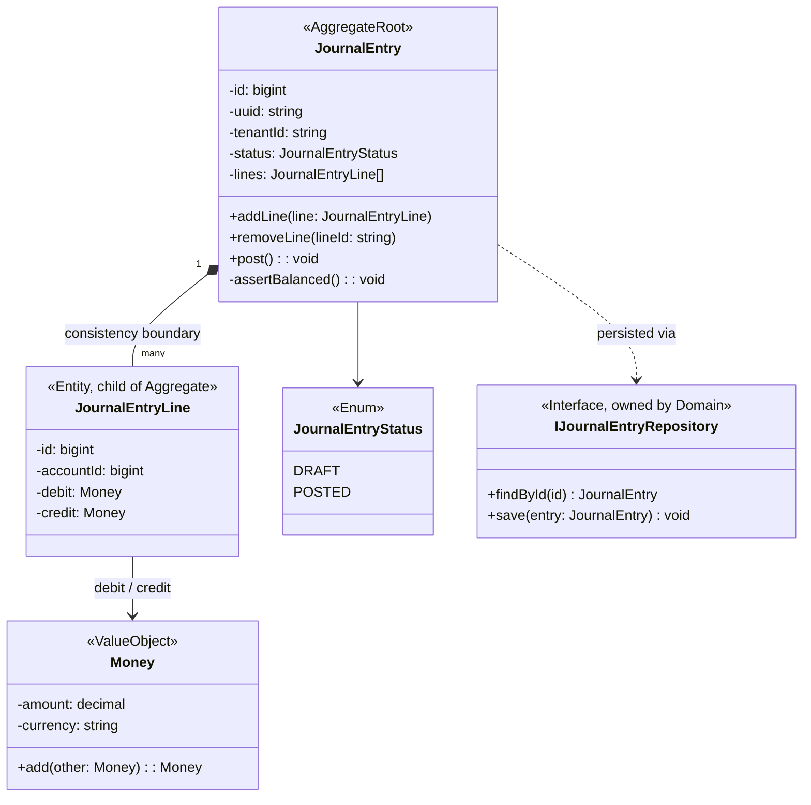
```mermaid
classDiagram
    class JournalEntry {
        <<AggregateRoot>>
        -id: bigint
        -uuid: string
        -tenantId: string
        -status: JournalEntryStatus
        -lines: JournalEntryLine[]
        +addLine(line: JournalEntryLine)
        +removeLine(lineId: string)
        +post(): void
        -assertBalanced(): void
    }
    class JournalEntryLine {
        <<Entity, child of Aggregate>>
        -id: bigint
        -accountId: bigint
        -debit: Money
        -credit: Money
    }
    class Money {
        <<ValueObject>>
        -amount: decimal
        -currency: string
        +add(other: Money): Money
    }
    class JournalEntryStatus {
        <<Enum>>
        DRAFT
        POSTED
    }
    class IJournalEntryRepository {
        <<Interface, owned by Domain>>
        +findById(id) JournalEntry
        +save(entry: JournalEntry) void
    }

    JournalEntry "1" *-- "many" JournalEntryLine : consistency boundary
    JournalEntryLine --> Money : debit / credit
    JournalEntry --> JournalEntryStatus
    JournalEntry ..> IJournalEntryRepository : persisted via
```

### 7.3.4 Invariant

A business rule that must always be true for a given Domain object, enforced by the object itself, not by external validation that could be skipped. "A Journal Entry's total debits must equal its total credits" is an invariant of the Journal Entry Aggregate. "A confirmed Sales Order's line items cannot be modified without first reverting to Draft" is an invariant of the Sales Order Aggregate. Invariants are enforced at the point of mutation — the Aggregate Root's methods are the only way to mutate it, and those methods refuse to leave the Aggregate in an invalid state.

### 7.3.5 Ubiquitous Language

The vocabulary used in code must match the vocabulary the business actually uses, precisely, within a given Bounded Context. Inside the Accounting module, "Post" means finalizing a Journal Entry such that it affects account balances and can no longer be freely edited — the code uses the word "Post," not a generic "Confirm" or "Finalize," because "Post" is the term accountants use and expect. This matters architecturally because a mismatch between code vocabulary and business vocabulary is a recurring, quiet source of misunderstanding between engineers and the domain experts (accountants, inventory managers) whose knowledge the Domain layer is supposed to encode (Chapter 3.5.4's staffing/collaboration cost, made concrete).

## 7.4 Rich Modeling vs. Simple Modeling — Resolving Decision 3.7.2

Chapter 3.5.4 flagged the risk of both under-modeling (anemic entities with real invariants) and over-modeling (DDD ceremony applied to trivial data). This chapter supplies the concrete test:

**An entity warrants rich Aggregate modeling if any of the following is true:**
1. It has an invariant that must hold across multiple of its own fields or across related child objects (e.g., Journal Entry's debit/credit balance).
2. It has a lifecycle with valid and invalid state transitions (e.g., a Sales Order cannot move from Fulfilled back to Draft; a Journal Entry cannot be edited once Posted).
3. Mutating it incorrectly would produce financially or operationally incorrect data that is expensive or impossible to detect after the fact.

**An entity may use simple, CRUD-style modeling if:**
1. It is purely descriptive reference data with no invariant beyond basic field validation (e.g., a Notification Template, a UI-facing Settings value).
2. It has no meaningful lifecycle — it is created, optionally updated, optionally deleted, with no invalid intermediate states to guard against.

| Example Entity | Classification | Why |
|---|---|---|
| Journal Entry | Rich Aggregate | Cross-field invariant (debits = credits), lifecycle (Draft → Posted → cannot edit) |
| Sales Order | Rich Aggregate | Lifecycle with valid/invalid transitions, invariants around line items vs. order status |
| Chart of Accounts (Account) | Rich Entity | Invariant: an Account's type (Asset/Liability/etc.) constrains which other accounts it can be paired with in certain postings; hierarchy invariants (a parent Account's type must be compatible with its children) |
| Notification Template | Simple/CRUD | Purely descriptive; no cross-field invariant, no meaningful lifecycle |
| Tenant Settings value | Simple/CRUD | Descriptive configuration; validated at the field level only |
| Inventory Item (master data) | Simple/CRUD for its descriptive attributes; Rich Aggregate for its Stock Ledger | A useful split example — see Section 7.4.1 |

### 7.4.1 A Worked Split Example: Inventory Item vs. Stock Ledger

An Inventory Item's descriptive attributes (name, SKU, description, unit of measure) are simple, CRUD-modeled data — there is no invariant governing what a valid item *name* is beyond basic validation. But that same Inventory Item's **Stock Ledger** (the record of quantity on hand, changing through receipts, issues, and adjustments) has a real invariant: quantity on hand can never go negative in a standard costing configuration, and every quantity change must be traceable to a specific transaction (a receipt, an issue, an adjustment) for audit purposes (Chapter 17). This is why a single business "thing" (an Inventory Item) is correctly modeled as two different Domain objects with two different classifications — the master-data facet is simple, the stock-movement facet is a rich Aggregate. Forcing both facets into one undifferentiated model would either over-engineer the descriptive attributes or, worse, under-enforce the stock-movement invariants.

## 7.5 Bounded Contexts and Context Mapping

Chapter 6.3 defined a module as a Bounded Context. This chapter adds the DDD vocabulary for how Bounded Contexts relate to each other, which is the modeling-level justification for why Chapter 6.10 rejected a shared "core" Customer entity across Sales and CRM:

- **Customer in the Sales Bounded Context** means: an entity with credit terms, a billing address, an order history, and invariants relevant to fulfilling and invoicing orders.
- **Customer in the CRM Bounded Context** means: an entity with a communication history, a lead source, a relationship-ownership assignment, and invariants relevant to the sales/relationship pipeline — largely unrelated to Sales's concerns.

Both are legitimately "Customer" in ordinary business language, but they are **different models with different invariants**, deliberately not unified, because unifying them would force a false choice: either the model is diluted to satisfy both contexts' needs (bloated, unclear ownership of which invariants apply when), or one context's needs are subordinated to the other's. DDD's Context Mapping vocabulary names the relationship between Sales's Customer and CRM's Customer as **Shared Kernel avoided, connected via explicit translation** — when Sales needs to know something CRM owns (or vice versa), it happens through Chapter 6.6's contracts/events, which include an explicit translation between each module's own model, rather than assuming a shared underlying representation.

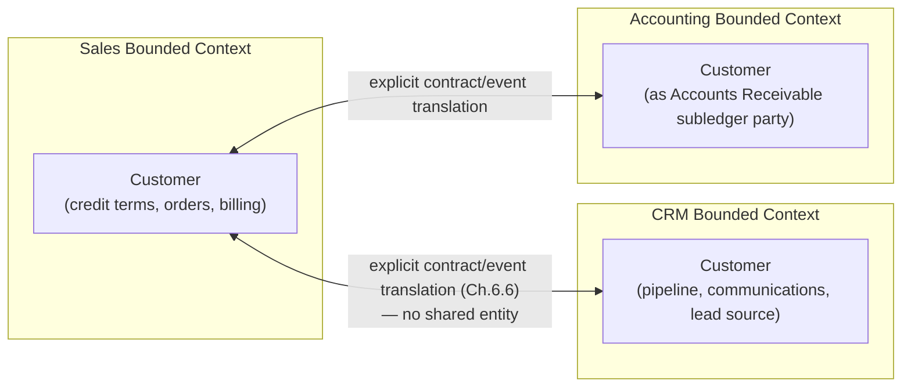
```mermaid
graph LR
    subgraph SalesBC["Sales Bounded Context"]
        SC["Customer\n(credit terms, orders, billing)"]
    end
    subgraph CRMBC["CRM Bounded Context"]
        CC["Customer\n(pipeline, communications, lead source)"]
    end
    subgraph AccountingBC["Accounting Bounded Context"]
        AC["Customer\n(as Accounts Receivable subledger party)"]
    end

    SC <-->|"explicit contract/event translation (Ch.6.6)\n— no shared entity"| CC
    SC <-->|"explicit contract/event translation"| AC
```

## 7.6 Design Decisions

**Decision 7.6.1 — Aggregates are the unit of transactional consistency and the unit of Repository persistence.**
Per Section 7.3.3, a single database transaction (Chapter 5, Decision 5.7.3) that mutates an Aggregate mutates the whole Aggregate consistently. A use case that needs to change two different Aggregates (e.g., posting a Sales Invoice that also needs a Journal Entry created) treats this as two separate Aggregate saves, coordinated by the Business layer, not as a single mega-Aggregate spanning both — keeping Aggregates focused and small is deliberate (Section 7.9).

**Decision 7.6.2 — The classification test in Section 7.4 is applied per-entity, not per-module.**
A module is not "a rich-modeling module" or "a simple-modeling module" wholesale — as Section 7.4.1 demonstrates, a single module (Inventory) legitimately contains both kinds of entities. Classification is a per-entity design decision made and documented when the entity is designed, not inherited from the module it lives in.

**Decision 7.6.3 — Ubiquitous Language terms are documented per module, and reviewed with actual domain experts where available.**
Given Chapter 3.5.4's identified need for domain expertise, each module's key vocabulary (e.g., Accounting's "Post," "Reconcile," "Accrue") should be captured explicitly (in the module's own documentation, per `12_MODULE_TEMPLATE.md`) and validated against how real accountants, inventory managers, or sales operations professionals actually use the term — not assumed from general software engineering intuition about what the word probably means.

## 7.7 Why This Approach Was Chosen

The Aggregate concept (7.3.3) is chosen specifically because it gives a precise, mechanical answer to a question that is otherwise dangerously ambiguous in financial systems: "what must be true every time this data changes, and what is the smallest set of objects that must be locked/validated together to guarantee that?" Without this concept, it is easy to write code that updates a Journal Entry's lines one at a time, each individually "valid," while the Journal Entry as a whole is transiently or even persistently out of balance — exactly the kind of bug DDD's Aggregate boundary exists to make structurally difficult to introduce.

The per-entity classification test (Section 7.4) is chosen over a blanket rule in either direction because Chapter 3.5.4 already identified both over-modeling and under-modeling as real risks — a rule that eliminates one risk by creating the other (e.g., "always use rich Aggregates" solves under-modeling but guarantees over-modeling for genuinely simple data) is not actually a solution. The worked split example (7.4.1) exists specifically to make this nuance concrete rather than leaving "classify per-entity" as an abstract instruction engineers must reinvent each time.

## 7.8 Alternatives Considered

**Alternative: A single canonical model per real-world concept, shared across all modules that reference it (rejecting Bounded Context separation).**
Rejected, per Section 7.5 and consistent with Chapter 6.10's rejection of a shared Customer entity. The seeming benefit (no "duplication" of Customer) is outweighed by the coordination cost of every module needing to agree on and jointly evolve a single model, and by the conceptual dishonesty of forcing genuinely different concerns (Sales's fulfillment view vs. CRM's relationship view) into one shape.

**Alternative: Model everything as rich Aggregates uniformly, regardless of whether an entity has real invariants, for consistency.**
Rejected. Superficially appealing for its simplicity ("one way of doing things"), but this directly produces the over-modeling risk named in Chapter 3.5.4 and wastes engineering effort encoding ceremony (invariant-checking methods, encapsulation machinery) around data that has no invariants to protect, like a Notification Template.

**Alternative: Model everything as simple CRUD/anemic entities uniformly, for development speed.**
Rejected, for the inverse reason — and the more dangerous one for an ERP specifically, since it is the version of under-modeling that risks allowing an out-of-balance Journal Entry or a negative-without-audit-trail stock quantity to be persisted, which is a correctness failure with real financial and compliance consequences (Chapter 1.4, principle on compliance/auditability).

## 7.9 Trade-offs

- **Aggregates must be kept deliberately small (per Decision 7.6.1) even when it would be "convenient" to make one large Aggregate spanning a whole business transaction.** A large Aggregate (e.g., one spanning a Sales Order, its Invoice, and its resulting Journal Entry as a single consistency boundary) would simplify some code paths but would create a large lock/consistency scope that hurts concurrency (two unrelated operations contending over the same oversized Aggregate) and blurs Bounded Context separation (Chapter 6). LedgerOne accepts the coordination cost of managing multiple smaller Aggregates from the Business layer instead.
- **The per-entity classification test (Section 7.4) requires a design decision and its rationale to be documented for every non-trivial entity**, which is more upfront process than "just build it." This is accepted because an undocumented classification decision is one a future engineer cannot evaluate or challenge — they can only guess whether the original author considered the question at all.

## 7.10 Best Practices Established by This Chapter

- Before implementing a new Domain entity, explicitly answer Section 7.4's classification test and record the answer (in code review, design doc, or module documentation) — do not implicitly default to whichever style is fastest to type.
- When designing an Aggregate, explicitly enumerate its invariants before writing the Aggregate Root's mutation methods — the methods exist to enforce the invariants, not the other way around.
- When two modules appear to need the "same" concept, model it separately in each Bounded Context per Section 7.5, and design the explicit translation across Chapter 6's contracts rather than searching for a shared representation.

## 7.11 Security Considerations

Because Aggregate Roots (7.3.3) are the sole entry point for mutating their Aggregate, and invariants are enforced inside those mutation methods, a well-modeled Aggregate makes it structurally difficult to reach an invalid or exploitable state through any code path — including code paths a security reviewer might not have anticipated (e.g., a future bulk-import feature). This is a meaningful security property specifically for financial correctness attacks (e.g., attempting to manipulate a Journal Entry into an unbalanced state through an edge-case API sequence), distinct from but complementary to the authentication/authorization concerns of Chapter 9.

## 7.12 Performance Considerations

Because an Aggregate is loaded and saved as a whole (Decision 7.6.1), Aggregate size directly affects the cost of every operation on it — this is the concrete performance argument, beyond the concurrency argument in Section 7.9, for keeping Aggregates small: a Sales Order Aggregate with thousands of line items loaded in full for every small mutation would be a real, measurable performance cost. Where an entity might have unbounded child collections (e.g., a Sales Order with very many lines), the Aggregate design must consider pagination or summary-based invariant checking rather than naively loading every child object for every operation — a concern Chapter 21 quantifies with concrete budgets.

## 7.13 Scalability

The Bounded Context separation in Section 7.5 is what allows different modules' Domain models to evolve independently at different rates — Accounting's model can mature and stabilize while Sales's model is still actively evolving, without either module blocking the other, which serves the same team-autonomy goal as Chapter 6's contract-based communication, but at the modeling level rather than the integration level. This is a direct precondition for Chapter 1's "many autonomous module teams" clause: teams cannot be autonomous if they are forced to share and jointly negotiate every core Domain concept.

## 7.14 Failure Scenarios

- **Failure: An Aggregate boundary is drawn too large**, spanning what should be multiple independent consistency boundaries (e.g., modeling a Customer's entire order history as part of the Customer Aggregate itself). Mitigation: Section 7.9's explicit small-Aggregate guidance, and design review scrutiny whenever an Aggregate's mutation methods start needing to load large or unbounded related collections.
- **Failure: An Aggregate boundary is drawn too small**, splitting data that actually has a cross-object invariant into separate Aggregates that cannot enforce it atomically (e.g., modeling Journal Entry Lines as independent Aggregates from their Journal Entry, losing the ability to enforce "debits equal credits" atomically). Mitigation: Section 7.3.4's invariant-first design discipline — invariants should be enumerated before Aggregate boundaries are finalized, specifically to catch this failure mode before it is built.
- **Failure: Ubiquitous Language drifts from actual business usage over time**, as engineers extend the system using their own intuitive terms rather than validated domain vocabulary (e.g., inventing a generic "Approve" where the business actually distinguishes "Post" from "Approve" as two different, non-interchangeable actions). Mitigation: Decision 7.6.3's requirement to document and validate vocabulary with real domain experts, revisited whenever a module's terminology is extended.
- **Failure: The rich-vs-simple classification (Section 7.4) is applied inconsistently across module teams** as the team grows, with some teams defaulting to always-rich or always-simple out of habit rather than applying the test. Mitigation: the worked example in Section 7.4.1 and the documented-decision requirement in Section 7.10 should be part of new-module onboarding material.

## 7.15 Future Improvements

- As more modules are built, expand Section 7.4's worked examples with additional cross-module classification decisions (e.g., Payroll's Pay Run as a likely rich Aggregate candidate, once Payroll is actually designed) to keep the classification test grounded in real, not merely hypothetical, examples.
- Revisit Section 7.5's Context Mapping approach once a real Marketplace extension (Chapter 25) needs to reference tenant Domain concepts — external Bounded Context mapping (a third-party's model connecting to LedgerOne's) may need additional vocabulary beyond what this chapter defines for purely internal module-to-module mapping.
- Consider whether a lightweight, shared glossary tool (aggregating each module's Ubiquitous Language per Decision 7.6.3) would help surface unintentional terminology collisions across Bounded Contexts before they cause confusion.

---

*Chapter 7 approved.*

---

# PART III — CROSS-CUTTING CONCERNS

# Chapter 8 — Data Architecture

## 8.1 Purpose

Three prior chapters have deferred concrete data-layer decisions to this one: Chapter 4 deferred the mechanics of database-level tenant isolation defense (4.5.3), Chapter 5 deferred the Repository layer's persistence mechanics, and Chapter 7 deferred how Aggregates (7.3.3) are actually stored and reconstructed. This chapter resolves all three: it defines LedgerOne's schema-level conventions, primary key strategy, migration approach, and the concrete database-level tenant isolation mechanism, on top of MySQL 8 (per `02_TECH_STACK.md`).

## 8.2 Responsibilities of This Chapter

- Define the primary key strategy (surrogate keys, external identifiers) and its rationale.
- Define the standard columns every table carries, and why.
- Define the concrete mechanism for Chapter 4.5.3's database-level tenant isolation defense.
- Define the migration strategy for evolving schema across a growing number of modules without a central bottleneck.
- Define how Aggregates (Chapter 7) map onto relational tables, including one-to-many child collections within an Aggregate boundary.

This chapter governs schema-level architecture. The precise naming conventions and column types are `06_DATABASE_STANDARDS.md`'s domain; this chapter provides the architectural rationale that document's rules implement.

## 8.3 Primary Key Strategy

LedgerOne uses a **dual-key strategy**, consistent with the existing convention in `06_DATABASE_STANDARDS.md`:

- **Internal surrogate key (`bigint`, auto-incrementing):** used for all internal relationships (foreign keys between tables) and as the primary key for joins and indexing. Chosen over UUID-as-primary-key because sequential bigint keys are significantly more efficient for MySQL's clustered index (InnoDB) storage and for join performance at scale — a well-documented, non-controversial database engineering trade-off, not a LedgerOne-specific innovation.
- **External identifier (`uuid`):** exposed in any API response, URL, or cross-system reference (Chapter 10). Never exposes the internal sequential bigint externally, because a sequential internal ID leaks information (approximate row counts, creation order, and — combined with predictable enumeration — makes ID-guessing attacks trivial) and because an internal-only key can be freely renumbered or reorganized (in principle) without breaking any external contract, since nothing external ever depended on its value.

**Why this approach was chosen:** The alternative of using UUID as the actual primary key everywhere avoids the "two keys" complexity but pays a real, measurable performance cost on InnoDB (larger index size, worse insert locality, worse join performance) at the scale Chapter 1's vision statement targets (tens of thousands of tenants, each with years of transactional history). The alternative of exposing the internal bigint externally is rejected on both the security grounds above and on architectural grounds: it would couple external API contracts (Chapter 10) to an internal storage decision, which Chapter 3's Clean Architecture dependency rule treats as exactly the kind of leakage that should not happen.

## 8.4 Standard Columns

Every table, consistent with `06_DATABASE_STANDARDS.md`, carries a defined set of standard columns whose architectural purpose is stated here:

| Column | Purpose | Architectural Rationale |
|---|---|---|
| `id` (bigint) | Internal surrogate primary key | Section 8.3 |
| `uuid` | External identifier | Section 8.3 |
| `tenant_id` | Tenant scoping (on tenant-owned tables only, per Chapter 4.8) | Chapter 4's structural isolation, Layer 2/3 enforcement |
| `created_at`, `updated_at` | Standard timestamps | Baseline auditability and support/debugging need present on every table regardless of whether the table needs full audit logging (Chapter 17) |
| `created_by`, `updated_by` | Reference to the acting user | Attribution — required both for basic support/debugging and as an input into the fuller audit trail (Chapter 17), which needs to know who to attribute a change to at the point of write, not reconstructed later |
| Soft-delete marker (where applicable) | Logical deletion without physical row removal | Section 8.6 |

## 8.5 Database-Level Tenant Isolation — Resolving Chapter 4.5.3

Chapter 4.5.3 mandated that a database-level defense-in-depth layer must exist beneath the Repository-level enforcement (4.5.2), without specifying the mechanism. This chapter resolves that: LedgerOne evaluates and, where the resulting operational complexity is justified, adopts **MySQL views or stored-procedure-level enforcement scoped by session-level tenant context** as the database-level backstop — concretely, a mechanism by which the database connection itself carries a session variable set to the resolved tenant context (Chapter 4.5.1), and tenant-owned tables are only queried through views or access patterns that enforce this session variable matches the row's `tenant_id`, independent of whatever the application-layer query believed it was filtering by.

This is explicitly named as an area requiring further engineering validation rather than a fully proven-out mechanism at the time of this chapter's writing, because MySQL's native row-level security primitives are less mature than some other database engines' — this is recorded honestly here (Section 8.10) rather than glossed over, and is one of this chapter's explicit Future Improvements.

## 8.6 Soft Delete Strategy

Per `06_DATABASE_STANDARDS.md`'s "soft delete where required" convention, this chapter defines *where* it is required: any table whose rows may need to be referenced by historical records after logical deletion — which, in an ERP, is most business data. A deleted Customer must not silently break historical Sales Orders that reference it; a deactivated Chart of Accounts entry must not disappear from historical Journal Entries. Soft delete (a status/flag column, never a physical `DELETE`) is the default for business data; hard deletion is reserved for data with no compliance or historical-reference requirement (e.g., expired session tokens) and is a deliberate, named exception rather than a default.

**This connects directly to Chapter 17's audit requirements**: a physically deleted row cannot be audited after the fact, while a soft-deleted row retains its full history and can still be referenced by the audit trail. For financial and compliance-relevant data specifically, hard deletion is generally unacceptable regardless of a soft-delete convention's minor storage cost, because it destroys the very audit trail Chapter 1.5's compliance principle requires.

## 8.7 Migration Strategy

Given Chapter 6's module boundary model, this chapter mandates that **schema migrations are organized per module**, not as a single global migration history — each module owns the migration scripts for its own tables, consistent with owning those tables exclusively (Chapter 6.5). This is what allows Decision 6.8.1's promise of independent module evolution to extend down to the schema level: a module team can add a column or table to their own domain without coordinating a shared, monolithic migration file with every other module team, while all migrations still ultimately apply to the single shared database (Chapter 4.4.2) in a coordinated, ordered sequence at deploy time.

## 8.8 Aggregate-to-Table Mapping

Per Chapter 7.3.3's Aggregate concept, an Aggregate Root and its child objects typically map to a parent table plus one or more child tables (e.g., Journal Entry → `journal_entries` table plus `journal_entry_lines` table), related by foreign key. The Repository layer (Chapter 5.3.4) is responsible for loading the full Aggregate (parent plus all relevant children) in a way that lets the Domain layer's invariant checks (Chapter 7.3.4) operate on a complete, consistent in-memory representation — never a partially-loaded Aggregate that could pass an invariant check only because part of its data wasn't examined.

### 8.8.1 Entity-Relationship Diagram (Representative Slice)

A representative slice across three modules, illustrating the dual-key strategy (8.3), standard columns (8.4), and `tenant_id` scoping (Chapter 4) on every tenant-owned table.

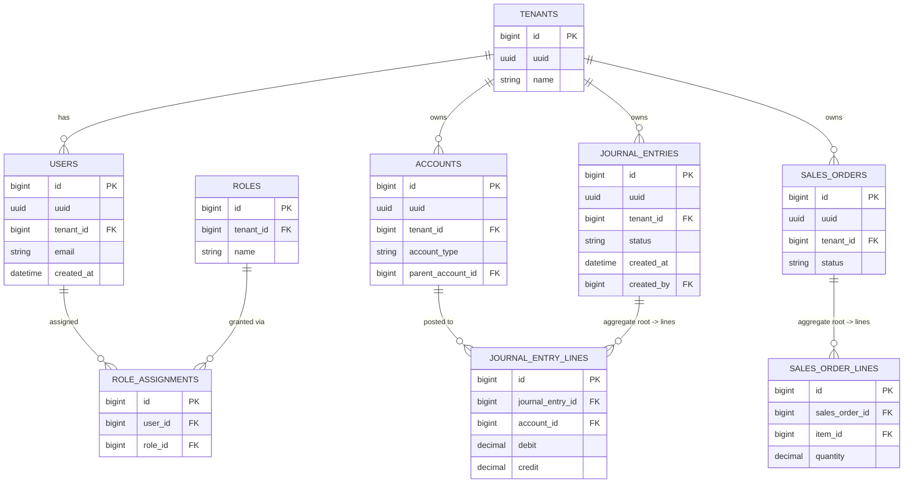
```mermaid
erDiagram
    TENANTS ||--o{ USERS : "has"
    TENANTS ||--o{ ACCOUNTS : "owns"
    TENANTS ||--o{ JOURNAL_ENTRIES : "owns"
    TENANTS ||--o{ SALES_ORDERS : "owns"
    ACCOUNTS ||--o{ JOURNAL_ENTRY_LINES : "posted to"
    JOURNAL_ENTRIES ||--o{ JOURNAL_ENTRY_LINES : "aggregate root -> lines"
    SALES_ORDERS ||--o{ SALES_ORDER_LINES : "aggregate root -> lines"
    USERS ||--o{ ROLE_ASSIGNMENTS : "assigned"
    ROLES ||--o{ ROLE_ASSIGNMENTS : "granted via"

    TENANTS {
        bigint id PK
        uuid uuid
        string name
    }
    USERS {
        bigint id PK
        uuid uuid
        bigint tenant_id FK
        string email
        datetime created_at
    }
    ACCOUNTS {
        bigint id PK
        uuid uuid
        bigint tenant_id FK
        string account_type
        bigint parent_account_id FK
    }
    JOURNAL_ENTRIES {
        bigint id PK
        uuid uuid
        bigint tenant_id FK
        string status
        datetime created_at
        bigint created_by FK
    }
    JOURNAL_ENTRY_LINES {
        bigint id PK
        bigint journal_entry_id FK
        bigint account_id FK
        decimal debit
        decimal credit
    }
    SALES_ORDERS {
        bigint id PK
        uuid uuid
        bigint tenant_id FK
        string status
    }
    SALES_ORDER_LINES {
        bigint id PK
        bigint sales_order_id FK
        bigint item_id FK
        decimal quantity
    }
    ROLES {
        bigint id PK
        bigint tenant_id FK
        string name
    }
    ROLE_ASSIGNMENTS {
        bigint id PK
        bigint user_id FK
        bigint role_id FK
    }
```

## 8.9 Design Decisions

**Decision 8.9.1 — The dual-key strategy (8.3) is applied uniformly, with no per-table exceptions.**
Even a table that seems unlikely to ever need external exposure gets both keys, because retrofitting a UUID column onto an existing table with live foreign key relationships elsewhere is a more disruptive migration than simply including it from the table's creation, and because "this table will never be exposed externally" has proven, industry-wide, to be an unreliable prediction as products evolve.

**Decision 8.9.2 — Standard columns (8.4) are enforced via a shared base migration/schema pattern, not manually re-typed per table.**
Consistent with this handbook's recurring preference for structural enforcement over manual discipline (Chapters 3, 4, 5, 6), the standard columns are applied through shared tooling (a base schema template used by every module's migrations) so that omitting `tenant_id` or the audit columns requires deliberately deviating from the template, not simply forgetting to type a line.

**Decision 8.9.3 — Physical (hard) deletion is an explicit, named exception, never a default.**
Per Section 8.6, any table using hard deletion instead of soft deletion must document why (e.g., "session tokens, no historical reference or compliance need") as part of its schema design — this mirrors Decision 6.8.3's manifest-review discipline, applied to a schema-design decision instead of a module-boundary decision.

## 8.10 Why This Approach Was Chosen

Each decision in this chapter follows the same underlying discipline established across Chapters 3-7: prefer structural, tooling-backed enforcement over relying on every future engineer remembering a convention, and be honest in this handbook about which mechanisms are fully proven versus which (Section 8.5's database-level tenant defense) require further validation rather than presenting speculative engineering as settled fact. The per-module migration strategy (8.7) specifically exists to prevent schema evolution from becoming the one place where Chapter 6's module autonomy quietly breaks down — it would be a significant gap in this handbook's consistency if module boundaries were respected in application code but not in the migration history that defines the tables underneath them.

## 8.11 Alternatives Considered

**Alternative: UUID as the sole primary key (no dual-key strategy).**
Rejected per Section 8.3's performance rationale — this is a well-established trade-off in the broader database engineering community for InnoDB specifically, not a novel LedgerOne argument, and the dual-key strategy is the standard resolution.

**Alternative: A single, centrally-owned migration history for the entire database, reviewed and merged by one team.**
Rejected. This directly recreates, at the schema level, the exact team-scaling bottleneck Chapter 6 exists to avoid at the module-communication level — a central migration gatekeeper does not scale as module count and team count grow, per Chapter 1's team-growth clause.

**Alternative: Rely exclusively on application-layer tenant enforcement (Chapter 4.5.2) and skip a database-level backstop entirely, given MySQL's less mature native row-level security support.**
Rejected, even though Section 8.5 acknowledges this mechanism needs further validation. Chapter 4.5's entire defense-in-depth argument depends on no single layer being a single point of failure; abandoning Layer 3 because it is harder to build on the chosen database engine would mean accepting a weaker isolation guarantee than the platform's most consequential architectural risk (Chapter 4.12) warrants. The correct response to "this is hard to build" is continued investment (Section 8.14's Future Improvements), not silently dropping the layer.

## 8.12 Trade-offs

- **The dual-key strategy (8.3) means every table carries an extra indexed column and every Repository must translate between internal and external identifiers at the boundary.** This is a small, constant per-table cost, accepted for the security and architectural-decoupling benefits described in Section 8.3.
- **Per-module migrations (8.7) require careful deploy-time ordering** — module A's migration must not assume module B's migration has or has not run yet in a way that creates a hidden cross-module coupling at the schema level, which would be a subtle violation of Chapter 6.5's boundary rule showing up in infrastructure rather than application code. This requires deliberate migration tooling design, named explicitly as a risk rather than assumed away.
- **The database-level tenant defense (8.5) is the least mature mechanism in this chapter**, and pursuing it fully may cost more engineering time than its incremental safety benefit over Layers 1-2 alone would suggest, at least until real operational experience clarifies the actual residual risk it closes. This tension is accepted rather than resolved prematurely, per Section 8.11's rejection of simply dropping the layer instead.

## 8.13 Best Practices Established by This Chapter

- No new table is created without both key columns (8.3) and the full standard column set (8.4), applied through the shared base schema template (Decision 8.9.2) rather than typed manually.
- Any table proposing hard deletion must document its justification per Decision 8.9.3 as part of schema review, not discovered after the fact when a support request needs data that no longer exists.
- Migrations for a new module's tables are written and owned within that module's own codebase location, never appended to another module's migration history for convenience.

## 8.14 Security Considerations

Section 8.3's decision to never expose the internal sequential bigint externally is itself a security control (preventing ID enumeration and information leakage about row counts/creation order), independent of and additional to Chapter 4's tenant isolation and Chapter 9's authorization. Section 8.5's database-level tenant defense, once fully validated, is this chapter's most direct contribution to Chapter 4's defense-in-depth model — this chapter's honesty about that mechanism's current maturity (Section 8.12) is itself a security-relevant disclosure: a security review of the platform should treat Layer 3 (Chapter 4.5.3) as partially mitigating, not fully proven, until Section 8.5's validation work is complete.

## 8.15 Performance Considerations

The bigint surrogate key strategy (8.3) is chosen specifically for InnoDB performance characteristics — sequential inserts and efficient joins — which directly supports Chapter 4.13's requirement that `tenant_id` be effectively indexed and typically a leading column in composite indexes for tenant-owned tables' primary access patterns. This chapter's per-module migration strategy (8.7) has a secondary performance-relevant property: it makes it easier to reason about and index each module's tables for that module's specific access patterns, rather than a single undifferentiated schema-wide indexing strategy that would need to compromise across unrelated modules' needs.

## 8.16 Scalability

The per-module migration strategy (8.7) is this chapter's primary contribution to Chapter 1's team-growth scalability clause at the data layer specifically — it is the schema-level analog of Chapter 6's module boundary enforcement, ensuring that adding a new module's tables never requires modifying or even touching an existing module's migration history, mirroring Chapter 1.4.1's "modules must be addable without modifying existing modules" requirement down to the database layer.

## 8.17 Failure Scenarios

- **Failure: A migration for one module unintentionally depends on another module's schema state** (e.g., a foreign key or a data backfill that assumes another module's table already has certain rows). This would be a schema-level violation of Chapter 6.5's module boundary rule. Mitigation: migration review must explicitly check for cross-module foreign keys or data dependencies, which — per Chapter 6's rules — should not exist directly; any legitimate cross-module data need should be satisfied through Chapter 6.6's contract/event mechanisms at the application layer, not a database-level foreign key.
- **Failure: The database-level tenant isolation backstop (8.5) is never actually completed**, because Layer 2 (Chapter 4.5.2) appears sufficient in practice and Layer 3 is continually deprioritized. Named explicitly as a realistic risk given Section 8.12's acknowledged complexity. Mitigation: Section 8.14's explicit flag that Layer 3 should be tracked as a known gap in security reviews (Chapter 20) until closed, rather than allowed to quietly disappear from the roadmap.
- **Failure: Hard deletion is used somewhere it shouldn't be**, destroying data later needed for an audit or a customer support investigation. Mitigation: Decision 8.9.3's mandatory documented justification, reviewed at schema-design time, when the decision is cheap to catch, rather than discovered after data is already unrecoverable.

## 8.18 Future Improvements

- Complete the validation of Section 8.5's database-level tenant isolation mechanism, including a concrete evaluation of MySQL 8's available primitives (views, stored procedures, session variables) against real performance characteristics under LedgerOne's expected query patterns — this is the most significant open item this chapter defers.
- Evaluate whether per-module migration tooling (8.7) needs a formal dependency-declaration mechanism (a module explicitly stating it depends on another module's migrations having run, for the rare legitimate cases like initial platform-owned reference data seeding) rather than relying purely on deploy-order convention.
- Revisit the soft-delete default (8.6) for very high-volume, low-value tables (e.g., certain log-like data) where indefinite retention of soft-deleted rows may eventually warrant a defined archival strategy — this is a data lifecycle question distinct from the audit/compliance requirement driving the current default, and is deferred until real data volume makes it a concrete concern rather than a hypothetical one.

---

*Chapter 8 approved.*

---

# Chapter 9 — Authentication & Authorization Architecture

## 9.1 Purpose

This chapter resolves two commitments deferred by earlier chapters: Chapter 2's structural separation between the Tenant Administrator and Platform Operator trust planes (Decision 2.6.1), and Chapter 5.12's finding that authorization checks living only in the Presentation layer are a structural gap the moment a second entry point (a background job, a future non-HTTP interface) invokes the same Business-layer method. This chapter defines how LedgerOne verifies *who* is calling (Authentication) and *what they are permitted to do* (Authorization), and where in the layered architecture (Chapter 5) each of those decisions correctly lives.

## 9.2 Responsibilities of This Chapter

- Define the authentication mechanism and session model.
- Define how tenant context resolution (Chapter 4.5.1) is derived from authentication, concretely.
- Define the authorization model: roles, permissions, and how they are scoped per tenant and per module.
- Define the structural separation between the Tenant Administrator and Platform Operator authorization planes.
- Resolve Chapter 5.12's layering question: where, precisely, must an authorization check live to be structurally safe against a second, non-HTTP entry point.

This chapter does not define specific role names or permission lists for each module (a `12_MODULE_TEMPLATE.md`/module-level concern) — it defines the mechanism those module-specific roles and permissions are built on.

## 9.3 Authentication Mechanism

Per `09_SECURITY_GUIDELINES.md`'s existing convention, LedgerOne uses **JWT access tokens with a refresh token pattern**:

- A short-lived **access token** (JWT) is issued on login and presented with every request, carrying the authenticated user's identity and resolved tenant context as signed claims.
- A longer-lived **refresh token** is used solely to obtain a new access token when the current one expires, without requiring the user to re-enter credentials, and is itself revocable server-side (Section 9.7).

**Why this approach was chosen:** A short-lived, stateless-verifiable access token means most requests can be authenticated without a database round-trip (the signature alone proves validity within its lifetime), which matters for the performance profile Chapter 1.13 establishes (every authenticated request pays this cost). The refresh token provides the revocability a purely stateless long-lived token would lack — an important security property (Chapter 20) for sessions that must be terminable (e.g., on password change, on suspected compromise, on employee offboarding from a Tenant Administrator's action) without waiting for a long-lived token to simply expire on its own.

### 9.3.1 Login and Token Refresh Sequence

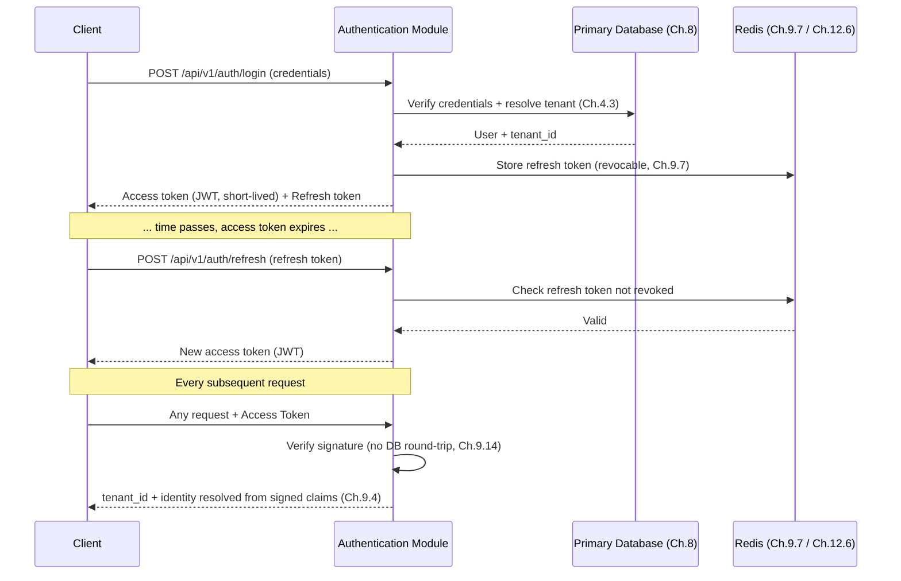
```mermaid
sequenceDiagram
    participant Client
    participant Auth as Authentication Module
    participant DB as Primary Database (Ch.8)
    participant Redis as Redis (Ch.9.7 / Ch.12.6)

    Client->>Auth: POST /api/v1/auth/login (credentials)
    Auth->>DB: Verify credentials + resolve tenant (Ch.4.3)
    DB-->>Auth: User + tenant_id
    Auth->>Redis: Store refresh token (revocable, Ch.9.7)
    Auth-->>Client: Access token (JWT, short-lived) + Refresh token

    Note over Client,Auth: ... time passes, access token expires ...

    Client->>Auth: POST /api/v1/auth/refresh (refresh token)
    Auth->>Redis: Check refresh token not revoked
    Redis-->>Auth: Valid
    Auth-->>Client: New access token (JWT)

    Note over Client,Auth: Every subsequent request

    Client->>Auth: Any request + Access Token
    Auth->>Auth: Verify signature (no DB round-trip, Ch.9.14)
    Auth-->>Client: tenant_id + identity resolved from signed claims (Ch.9.4)
```

### Common Mistakes — Authentication & Authorization

| Mistake | Why It's Wrong | Correct Pattern |
|---|---|---|
| Reading `tenant_id` from request body/query string | Client-controlled, trivially spoofable (Ch.4.7.1) | Always resolve from signed JWT claims (Ch.9.4) |
| Checking authorization only in a Presentation Guard | Bypassed by any second caller — jobs, events (Ch.5.12, 9.8) | Authoritative check in Business/Domain layer |
| One shared "system" account for all background jobs | Unbounded blast radius on compromise (Ch.13.6) | Named, narrowly-scoped System Identity per process |
| Long-lived access tokens with no refresh mechanism | No revocation short of full expiry | Short-lived JWT + revocable refresh token (9.3) |
| Platform Operator reusing tenant-admin role mechanism | Collapses two distinct trust planes (Ch.2, Decision 2.6.1) | Separate authentication realm & permission set (9.6) |

## 9.4 Tenant Context Resolution — Resolving Chapter 4.5.1

Chapter 4.5.1 mandated that tenant context is derived from the authenticated session, never from client-supplied input, but deferred the concrete mechanism. This chapter resolves it: the access token's signed claims include the resolved `tenant_id` the user is currently operating within, established at login time by looking up which tenant the authenticating user belongs to (per Chapter 4.3's initial one-user-one-tenant model). Because the claim is inside the signed JWT, a client cannot alter it without invalidating the signature — this is what makes Decision 4.7.1 ("never trust a client-supplied tenant_id") mechanically true rather than merely policy-stated: there is no code path where a client-controlled value becomes the tenant context, because the only tenant value the request pipeline ever reads is the one cryptographically bound into the token at issuance time.

## 9.5 Authorization Model — Role-Based Access Control (RBAC)

Per `09_SECURITY_GUIDELINES.md`'s existing convention, LedgerOne uses RBAC, structured as follows:

- **Permissions** are the finest-grained unit: a specific, named capability (e.g., `accounting.journal_entry.post`, `sales.order.create`). Permissions are namespaced by module, consistent with Chapter 6's module ownership model — each module defines and owns the permissions relevant to its own capabilities, never defining a permission on another module's behalf.
- **Roles** are named, tenant-configurable collections of permissions (e.g., "Accountant," "Warehouse Clerk," "Sales Manager"). A Tenant Administrator can create custom roles for their organization, composed from the permissions the tenant's subscribed modules make available.
- **Role Assignment** binds a User to one or more Roles, scoped to their Tenant (per Chapter 4.3 — a User belongs to exactly one Tenant in the initial model, so role assignment is implicitly tenant-scoped by that same constraint).

### 9.5.1 Why RBAC Over Alternatives

RBAC is chosen over finer-grained models (e.g., Attribute-Based Access Control, ABAC) as the default because it maps naturally onto how ERP customers actually think about access ("Priya is an Accountant, so she can post Journal Entries") and because it is dramatically simpler to reason about and to expose in a Tenant Administrator's own UI (Chapter 11) than an attribute/policy-expression model would be. This does not preclude specific, narrow ABAC-like refinements for particular high-sensitivity operations later (Section 9.11's Future Improvements) — but the default, platform-wide model is RBAC, chosen for its fit with real ERP administrator mental models over theoretical generality.

## 9.6 The Two Authorization Planes — Resolving Chapter 2, Decision 2.6.1

Chapter 2 mandated that Tenant Administrator access and LedgerOne Platform Operator access be architecturally distinct planes, never one modeled as an elevated version of the other. This chapter makes that concrete:

| | Tenant Administrator Plane | Platform Operator Plane |
|---|---|---|
| **Scope** | Exactly one tenant — the administrator's own organization | Cross-tenant, by design, for support/operations purposes |
| **Authentication** | Same JWT/refresh mechanism as any Tenant End User (Section 9.3) | A separate authentication realm — Platform Operators are not "users" of any tenant, they authenticate against a distinct internal identity system, never sharing a login surface with tenant users |
| **Authorization** | RBAC (Section 9.5), scoped to permissions the administrator's own tenant subscribes to | A distinct, narrower permission set specific to support/operational actions (e.g., "view tenant billing status," "impersonate a user for support debugging" — itself heavily audited, Section 9.9) |
| **Data access path** | Through the same module contracts (Chapter 6.6) and tenant-scoped Repository infrastructure (Chapter 4.5.2) as any tenant request | Through a dedicated internal support-tooling surface that is explicitly cross-tenant-aware, built and reviewed as its own, separately-scrutinized code path — never accidentally inheriting from tenant-facing authorization logic |

This separation means a bug in Tenant Administrator role/permission logic — even a severe one — cannot, by construction, grant cross-tenant access, because the Platform Operator plane is not reachable through any code path a Tenant Administrator's elevated permissions could traverse. This is the concrete mechanism that makes Chapter 2's stated risk ("a support tool built quickly with improperly scoped credentials") a deliberately, structurally hard mistake to make, rather than an easy one review must catch every time.

## 9.7 Session and Token Lifecycle

- Access tokens are short-lived (minutes, not hours) precisely because their compromise window should be small given they cannot be individually revoked before natural expiry (a property of stateless JWT verification, Section 9.3).
- Refresh tokens are stored server-side in revocable form (Chapter 4's tenant-scoped data, since a refresh token belongs to a specific tenant's user) — logout, password change, or a Tenant Administrator's explicit "revoke this user's sessions" action invalidates the refresh token, preventing further access-token renewal even though any already-issued access token still runs to its own short natural expiry.
- Platform Operator sessions (Section 9.6) follow an independent, typically stricter lifecycle policy (shorter sessions, mandatory re-authentication for sensitive actions) appropriate to their cross-tenant reach — this is detailed further in Chapter 20.

## 9.8 Where Authorization Checks Live — Resolving Chapter 5.12

Chapter 5.12 identified the risk precisely: an authorization check implemented only as a Presentation-layer Guard is bypassed by construction if any other caller (a background job, Chapter 13; a future non-HTTP integration) invokes the same Business-layer method directly. This chapter resolves that gap with a firm rule:

**The authoritative authorization check for any state-changing or sensitive-read operation must be enforced in the Business layer (or, where the check is itself a business invariant, the Domain layer), never solely in the Presentation layer.** A Presentation-layer Guard may still exist — and is encouraged, as a fast-fail optimization that avoids unnecessary work for an obviously-unauthorized request — but it is explicitly a performance optimization and a better error message, never the sole enforcement point. Every Business-layer use case is written as if it could be called by something other than an HTTP controller, because per Chapter 6.6.2 and Chapter 13, it genuinely will be — by background jobs, and eventually by Marketplace extension invocations (Chapter 25).

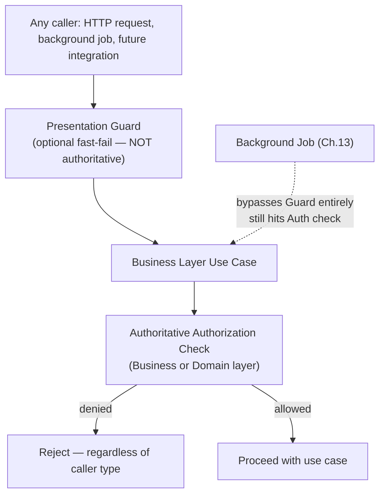
```mermaid
flowchart TD
    Req["Any caller: HTTP request, background job, future integration"] --> Guard["Presentation Guard\n(optional fast-fail — NOT authoritative)"]
    Guard --> BL["Business Layer Use Case"]
    BL --> Auth["Authoritative Authorization Check\n(Business or Domain layer)"]
    Auth -->|"denied"| Reject["Reject — regardless of caller type"]
    Auth -->|"allowed"| Proceed["Proceed with use case"]

    JobCaller["Background Job (Ch.13)"] -.->|"bypasses Guard entirely\nstill hits Auth check"| BL
```

## 9.9 Design Decisions

**Decision 9.9.1 — Permissions are namespaced and owned per module, never defined centrally.**
Consistent with Chapter 6's ownership model, the Authorization module (a Foundation module per Chapter 6.4) provides the RBAC *mechanism* (roles, permission assignment, checking), but the actual *permission definitions* (e.g., `accounting.journal_entry.post`) are declared by the module that owns the capability they gate, and published as part of that module's manifest (Chapter 6.7) — the Authorization module has no hardcoded knowledge of Accounting's specific permissions.

**Decision 9.9.2 — Platform Operator "impersonation" for support purposes is a distinct, heavily audited action, never silent.**
When a Platform Operator needs to view a tenant's data as that tenant would see it for support debugging, this is modeled as an explicit, logged impersonation action (Chapter 17) — never as the Platform Operator's cross-tenant permissions silently granting equivalent access without a distinguishable audit trail entry marking exactly when and why cross-tenant access occurred.

**Decision 9.9.3 — Authorization checks are testable independently of HTTP.**
Per Section 9.8, because the authoritative check lives in the Business/Domain layer, it must be unit-testable by directly invoking the Business-layer method with different authorization contexts, without spinning up an HTTP server or going through a controller — this is both a direct consequence of Chapter 3's Clean Architecture (Business/Domain layers are framework-independent) and a concrete way to verify Section 9.8's rule is actually being followed in practice.

## 9.10 Why This Approach Was Chosen

The two-plane separation (Section 9.6) is chosen because Chapter 2 already established that Platform Operators and Tenant Administrators have fundamentally different risk profiles, and authorization mechanisms that are easy to reason about tend to be ones where the code structure itself reflects that difference — a single unified "permissions" table with a "super-admin" flag is simpler to build initially but, per the industry-precedent reasoning in Chapter 1.3.2 and Chapter 2.8, is exactly the shortcut that produces avoidable cross-tenant exposure incidents once that flag's logic has any bug or gets attached to the wrong context.

Enforcing authorization at the Business/Domain layer rather than the Presentation layer (Section 9.8) follows directly from Chapter 5's layering discipline: an authorization decision is a business rule ("can this identity perform this operation, given the current business state and their permissions") no less than "does this Journal Entry balance" is a business rule, and both belong in the same layer for the same reason — anything checked only in a layer that can be bypassed by a second entry point is not actually enforced, it is merely convenient for the one entry point that happens to go through it.

## 9.11 Alternatives Considered

**Alternative: Attribute-Based Access Control (ABAC) as the platform-wide default model.**
Rejected as the default, per Section 9.5.1 — ABAC's generality is real, but it does not match how ERP administrators actually conceptualize access, and it would make the Tenant Administrator's own role-management UI (Chapter 11) significantly harder to build in a way non-technical users can understand and configure correctly. Not rejected as a future, narrow supplement (Section 9.14) for specific operations that genuinely need attribute-sensitive rules RBAC cannot express cleanly (e.g., "can approve expenses up to $X" where X is itself a per-user attribute) — that is a targeted extension, not a wholesale model replacement.

**Alternative: A single unified admin role spanning both tenant administration and platform operations, distinguished only by a flag.**
Rejected, per Section 9.6 and Section 9.10 — this is the specific shortcut Chapter 2 already rejected at the boundary-definition level; this chapter's job was to make that rejection concrete and structurally real, not to reopen it.

**Alternative: Enforce authorization exclusively via Presentation-layer Guards, accepting the risk named in Chapter 5.12 as low-probability.**
Rejected. Given that Chapter 13 (Asynchronous Processing) and Chapter 25 (Marketplace) already commit LedgerOne to having callers other than HTTP controllers invoke Business-layer logic, the risk Chapter 5.12 named is not hypothetical — it is a designed, certain feature of the system's near-term future, making Guard-only enforcement a known gap rather than a low-probability edge case.

## 9.12 Trade-offs

- **The two-plane model (9.6) means Platform Operator tooling cannot simply reuse tenant-facing authorization code**, requiring its own, separately built and reviewed authorization path. This is more initial engineering investment than a unified model, accepted for the blast-radius containment argument in Section 9.6.
- **Enforcing authorization at the Business/Domain layer (9.8) means every use case must accept and check an authorization context explicitly, even ones that today only have a single, obviously-trusted caller.** This is more boilerplate per use case than trusting a Presentation Guard alone, accepted because Section 9.11 establishes the risk it defends against is a near-term certainty, not a remote possibility.
- **RBAC's simplicity (9.5.1) means some genuinely attribute-sensitive permission needs (e.g., approval limits) require either awkward proliferation of roles (a role per limit tier) or the targeted ABAC-like extension flagged in Future Improvements** — this is a real limitation of the chosen default, named honestly rather than claiming RBAC is sufficient for every conceivable permission shape.

## 9.13 Security Considerations

This entire chapter is a Chapter 20 (Security Architecture) foundation, in the same way Chapter 4 was. Two points are worth surfacing explicitly here rather than only in Chapter 20: first, Decision 9.9.2's audited-impersonation requirement is what makes Platform Operator support access forensically accountable rather than an unlogged trust exercise; second, Section 9.4's claim that tenant context cannot be client-tampered depends entirely on the JWT signature being correctly verified on every request with no bypass path (e.g., no code path that reads an unverified token's claims before signature verification completes) — this specific implementation detail is flagged here as a mandatory verification point for Chapter 20's security review, precisely because it is the kind of subtle correctness requirement that, if violated, would silently undermine this chapter's entire tenant-context-resolution argument.

## 9.14 Performance Considerations

Section 9.3's stateless-JWT choice exists specifically so that the common case (an already-authenticated request) does not require a database round-trip merely to establish identity and tenant context — this directly serves Chapter 1.13's ERP-calibrated performance targets, since authentication/tenant-resolution overhead is paid on effectively every request in the system. The refresh-token revocability mechanism (9.7) does require a database check, but only at token-refresh time (a small fraction of total request volume), not on every request — this asymmetric design (fast common path, slower but infrequent revocation-check path) is a deliberate performance trade-off, not an oversight.

## 9.15 Scalability

RBAC's role/permission model (9.5) scales cleanly with module growth (Chapter 1.4.1) because of Decision 9.9.1's per-module permission ownership: adding a new module means that module declares its own new permissions without needing the Authorization module itself to change, mirroring Chapter 6's "modules addable without modifying existing modules" mechanism at the authorization layer specifically. The two-plane model (9.6) scales with team growth by ensuring Platform Operator tooling can evolve independently of tenant-facing authorization work — support/operations tooling engineers and product-facing module engineers are not contending over the same authorization codebase.

## 9.16 Failure Scenarios

- **Failure: A use case's authorization check is implemented only in a Presentation Guard, violating Section 9.8, because an engineer unfamiliar with this chapter takes the more obvious-looking shortcut.** Mitigation: Decision 9.9.3's requirement that authorization be independently unit-testable at the Business layer creates a natural review artifact (a missing or trivial authorization-context test) that should surface this gap during review, even without dedicated tooling enforcement — though tooling enforcement (an import/pattern lint analogous to Chapter 5's layer-violation checks) is named as a future improvement.
- **Failure: A Platform Operator's cross-tenant access is used without the impersonation logging mandated by Decision 9.9.2**, because a new support tool feature is built quickly without routing through the established impersonation pattern. Mitigation: any new Platform Operator tooling feature accessing tenant data must be reviewed specifically against Decision 9.9.2 before shipping, analogous to Decision 8.9.3's schema-design review discipline.
- **Failure: A compromised refresh token is used to maintain unauthorized access** even after a user believes they have logged out elsewhere. Mitigation: Section 9.7's server-side revocable refresh-token store, and a Tenant Administrator-facing "revoke all sessions for this user" capability as a mandatory feature of the Authentication module, not an optional nice-to-have.
- **Failure: JWT signature verification is bypassed or weakened** (e.g., a misconfiguration accepting an unsigned or weakly-signed token) — this would silently invalidate Section 9.4's entire tenant-context-resolution guarantee, making it a top-severity finding if ever discovered in a security review (per Section 9.13's explicit flag). Mitigation: JWT verification configuration is treated as security-critical infrastructure requiring the same scrutiny as Chapter 4's isolation layers, reviewed explicitly in Chapter 20.

## 9.17 Future Improvements

- Evaluate a targeted ABAC-like extension (Section 9.11) for specific permission shapes RBAC handles awkwardly (e.g., numeric approval limits), once a real module (most plausibly Purchase or Expense-related functionality) surfaces a concrete need rather than building this speculatively now.
- Build the tooling-level enforcement for Section 9.8's Business/Domain-layer authorization rule, analogous to Chapter 5's layer-violation linting, once enough real use cases exist to validate the pattern that tooling would need to check for.
- Revisit Section 9.6's Platform Operator authentication realm once real support/operations tooling requirements are better understood — this chapter establishes the structural separation as a firm requirement, but the specific implementation (e.g., whether it integrates with an external enterprise identity provider for LedgerOne's own staff) is deliberately left open.
- Consider whether Section 9.7's session lifecycle policy needs tenant-configurable options (e.g., an enterprise tenant wanting shorter session lifetimes for their own users) once such a requirement is confirmed by real customer demand, consistent with this handbook's recurring discipline of not building configurability speculatively.

---

*Chapter 9 approved.*

---

# Chapter 10 — API Architecture & Contracts

## 10.1 Purpose

Chapter 2 established that third-party developers and Marketplace extensions interact with LedgerOne exclusively through a public API surface, with no more implicit power than that surface grants (Decision 2.6.2). Chapter 5 established the Presentation layer as the boundary that translates between HTTP and the Business layer. This chapter defines the actual shape of that boundary: the concrete API conventions every module's Presentation layer must follow, so that LedgerOne presents one coherent, predictable API — not fifteen-plus modules' worth of independently-invented conventions.

## 10.2 Responsibilities of This Chapter

- Define the baseline REST conventions: URL structure, versioning, pagination, filtering, sorting, error format.
- Define the relationship between internal module contracts (Chapter 6.6.1) and the external public API — they are related but not identical, and this chapter states precisely how.
- Define the authentication/authorization integration point (Chapter 9) at the API boundary.
- Define API documentation as a structural requirement, not an afterthought.

This chapter does not define endpoint-by-endpoint specifications for each module (that lives in each module's own API documentation, `12_MODULE_TEMPLATE.md`) — it defines the conventions every such specification must follow.

## 10.3 Baseline Conventions

Consistent with `07_REST_API_STANDARDS.md`'s existing convention:

- **Base URL**: `/api/v1` — versioned from the very first endpoint, never unversioned, because an unversioned initial API implicitly becomes "v1 with no way to signal that a breaking change occurred" the moment a second version is needed (Chapter 26 elaborates the full versioning strategy this chapter's convention enables).
- **RESTful resource modeling**: endpoints are modeled around resources (nouns) with standard HTTP verbs expressing the operation, consistent with each module's Domain model (Chapter 7) — a resource in the API generally, though not always one-to-one, corresponds to an Aggregate Root (Chapter 7.3.3), since the Aggregate Root is the unit through which the Domain layer already expects mutation to happen.
- **JWT Authentication**: every request (except explicitly public, unauthenticated endpoints, if any) carries the access token defined in Chapter 9.3, verified at the Presentation layer boundary before any Business-layer logic executes.
- **Pagination**: every list-returning endpoint is paginated by default, with no "return everything" endpoint permitted for any resource whose row count grows with tenant data volume (per Chapter 8's data architecture) — an unpaginated list endpoint is treated as a defect, not a convenience, because its performance degrades silently as a tenant's data grows (Chapter 1.14's data-volume-scale axis).
- **Filtering and Sorting**: exposed through a consistent query-parameter convention across all modules, so a developer who has learned how to filter one module's endpoints already knows how to filter every other module's.
- **Standard error responses**: a single, consistent error shape (error code, human-readable message, and where applicable, field-level validation detail) used platform-wide, never a module-specific error format — this matters concretely for third-party developers (Chapter 2.3.1) who must be able to write one error-handling code path against LedgerOne's entire API, not one per module.
- **Swagger/OpenAPI documentation**: generated from the same DTOs and decorators that define the Presentation layer's validation (Chapter 5.3.1), so the published API documentation cannot drift from the actual accepted request/response shapes — it is derived from the same source, not maintained as a separate artifact.

## 10.4 Internal Module Contracts vs. the Public API

Chapter 6.6.1 defined synchronous contract calls between modules as in-process interface calls. This chapter clarifies a distinction that is easy to blur: **a module's internal contract (Chapter 6.6.1) and its public API (this chapter) are related but distinct surfaces.**

- The internal contract is what other *modules* call, in-process, and may expose more operations or richer, more Domain-object-shaped data than is appropriate to expose externally.
- The public API is what the *Frontend Application, third-party developers, and Marketplace extensions* (Chapter 2.3) call, over HTTP, and is deliberately curated — not every internal contract method needs a public API equivalent, and the public API's request/response DTOs are shaped for external consumption (stable, versioned, documented) rather than for the internal convenience of another module's Business layer.

A module's Presentation layer (Chapter 5.3.1) is what implements the public API, and internally, that Presentation layer calls the module's own Business layer — the same Business layer that also implements the internal contract other modules call. This is why Chapter 5's dependency rule (Presentation depends on Business) and Chapter 6's module contract rule compose cleanly: the public API is simply one more caller of a module's Business layer, subject to the identical authorization enforcement (Chapter 9.8) as any other caller, including the crucial detail that a third-party developer calling the public API gets the exact same authoritative Business/Domain-layer authorization check as LedgerOne's own frontend does — there is no weaker-checked path.

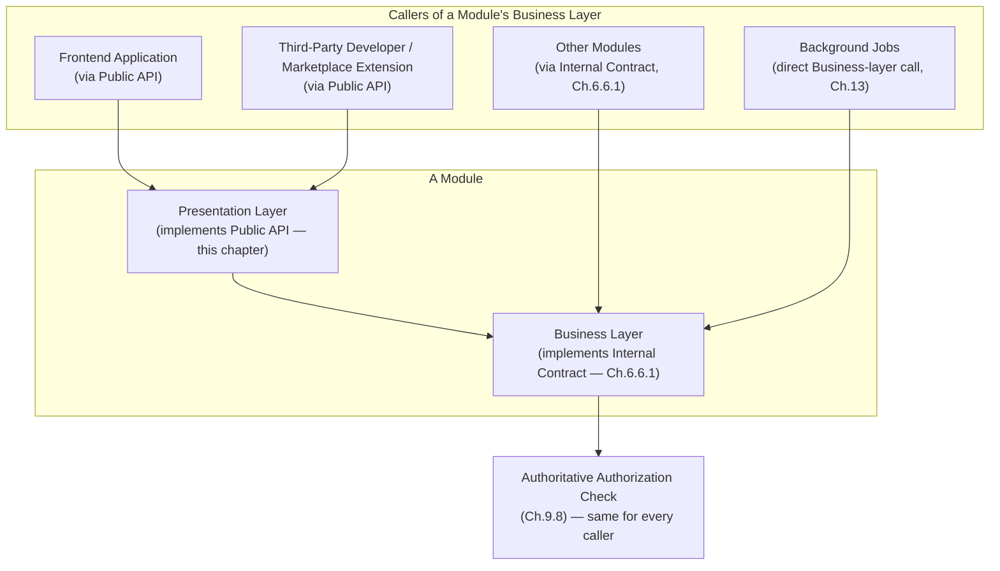
```mermaid
graph TB
    subgraph Callers["Callers of a Module's Business Layer"]
        FE["Frontend Application\n(via Public API)"]
        TPD["Third-Party Developer / Marketplace Extension\n(via Public API)"]
        OM["Other Modules\n(via Internal Contract, Ch.6.6.1)"]
        Job["Background Jobs\n(direct Business-layer call, Ch.13)"]
    end

    subgraph Module["A Module"]
        Pres["Presentation Layer\n(implements Public API — this chapter)"]
        BL["Business Layer\n(implements Internal Contract — Ch.6.6.1)"]
    end

    FE --> Pres
    TPD --> Pres
    Pres --> BL
    OM --> BL
    Job --> BL

    BL --> Auth["Authoritative Authorization Check\n(Ch.9.8) — same for every caller"]
```

## 10.5 Design Decisions

**Decision 10.5.1 — API versioning happens at the URL path level (`/api/v1`, `/api/v2`), never through content negotiation headers alone.**
URL-path versioning is chosen for its visibility and simplicity for third-party developers (Chapter 2.3.1) — a developer can see, in the URL itself, which contract version they are integrated against, without needing to inspect request headers. The full policy for *when* a version increment is required, and how long old versions are supported, is Chapter 26's responsibility; this chapter fixes the mechanism.

**Decision 10.5.2 — Every module's public API DTOs are distinct types from its internal Domain objects, never the same class reused across the boundary.**
Even where a DTO's fields happen to closely mirror a Domain object's fields today, they are defined as separate types. This is a direct consequence of Chapter 3's Clean Architecture dependency rule (the Domain layer must not depend on Presentation-layer serialization concerns) and of Section 10.4's distinction — it also means a Domain object's internal evolution (e.g., adding a new invariant-related field) does not automatically and silently change the public API's contract, which would otherwise be an uncontrolled breaking-change risk for third-party integrations.

**Decision 10.5.3 — Idempotency is a first-class concern for state-changing endpoints exposed to external/third-party callers.**
Because third-party integrations and network conditions can cause a request to be retried (a Marketplace extension's HTTP client times out and retries, uncertain whether the first attempt succeeded), state-changing public API endpoints likely to be retried under real-world network conditions support an idempotency key mechanism, so a retried request does not, for example, create a duplicate Sales Order. This is a public-API-specific concern less pressing for purely internal contract calls (Chapter 6.6.1), which run in-process and do not face the same network-retry ambiguity.

## 10.6 Why This Approach Was Chosen

Deriving Swagger documentation from the same DTOs that enforce validation (Section 10.3) follows the same "structural enforcement over manual discipline" discipline this handbook has applied repeatedly (Chapters 3-9): documentation that is generated from the actual validated contract cannot drift from reality the way a hand-maintained document can. Distinguishing internal contracts from the public API (Section 10.4), rather than treating them as the same thing, exists specifically to protect Chapter 6.8.1's promise that a module can evolve its internals freely behind a stable contract — if the public API were literally the same surface as the internal contract, every public API consumer (including uncontrolled third parties, per Chapter 2.3.1) would have to be considered every time a module wanted to refactor, which would defeat the autonomy Chapter 6 is designed to protect.

## 10.7 Alternatives Considered

**Alternative: GraphQL as the primary API paradigm instead of REST.**
Considered, given GraphQL's fit for clients (like a rich frontend dashboard) that need to fetch nested, cross-resource data in a single request. Rejected as the platform-wide paradigm because REST's simplicity, cacheability, and status as the most broadly understood convention for third-party integration (Chapter 2.3.1's developers, and Chapter 25's Marketplace ecosystem) outweigh GraphQL's query-flexibility benefit for LedgerOne's primary use case — most individual API operations correspond reasonably well to a single resource or a small, predictable set of related resources, per Section 10.3's Aggregate-Root-to-resource mapping. REST is the platform's sole API paradigm, including for Reporting/Dashboard aggregation queries (Chapter 18), which are served as REST endpoints rather than through a separate GraphQL surface.

**Alternative: Expose a module's internal contract interface directly as its public API, with no distinct DTO layer.**
Rejected, per Decision 10.5.2 and Section 10.6 — this is the shortcut that would couple public API stability to internal Domain object evolution, the opposite of what Chapter 6.8.1 is designed to guarantee.

**Alternative: Maintain API documentation as a separate, hand-written artifact rather than generating it from DTOs.**
Rejected, per Section 10.3's Swagger convention and Chapter 1.7.2's broader "documentation that drifts from reality is worse than no documentation" principle — a hand-written API document is exactly the kind of artifact this handbook consistently avoids relying on.

## 10.8 Trade-offs

- **Maintaining distinct public DTOs and internal Domain objects (Decision 10.5.2) means more mapping code** — a Presentation-layer or Business-layer translation step between the two representations for every operation. Accepted for the decoupling benefit described in Section 10.6.
- **Idempotency key support (Decision 10.5.3) adds implementation complexity to every externally-retriable state-changing endpoint** (storing and checking idempotency keys, defining their expiry). Accepted because the alternative — a duplicated Sales Order or duplicated Journal Entry from a naive retry — is a financial correctness failure, categorically worse than the implementation cost of preventing it.
- **URL-path versioning (Decision 10.5.1) means old API versions must be kept running in parallel with new ones during a deprecation window**, an operational cost elaborated fully in Chapter 26 rather than avoided here.

## 10.9 Best Practices Established by This Chapter

- No module's Presentation layer defines its own bespoke error format, pagination scheme, or filtering syntax "because it's a special case" — any perceived need for a module-specific deviation from Section 10.3's baseline conventions is a signal to revisit the design, not a license to diverge.
- Every state-changing public API endpoint likely to be called by an external, retry-prone client (third-party developers, Marketplace extensions, Chapter 2.3.1) is evaluated against Decision 10.5.3's idempotency requirement during its design, not added reactively after a duplicate-record incident.
- API documentation generation (Section 10.3) is treated as a build-time requirement, not a manually-triggered, easily-skipped step — if a module's API documentation is out of date, that is treated as a build defect.

## 10.10 Security Considerations

Per Section 10.4's diagram, the public API's authorization enforcement is identical to every other caller's — this chapter's most important security property is that **there is no "back door" or weaker-checked path through the public API surface**, precisely because it is simply another caller of the same Business/Domain-layer authoritative check (Chapter 9.8) as internal callers. Rate limiting (a further Chapter 20 concern, foreshadowed here) is specifically important at this boundary because it is the one surface exposed to genuinely untrusted or only-partially-trusted external callers (Chapter 2.3.1's third-party developers) at scale, unlike internal module-to-module contract calls which never cross a trust boundary in the same way.

## 10.11 Performance Considerations

Section 10.3's mandatory pagination is this chapter's primary, concrete performance safeguard — it exists specifically to prevent a class of performance degradation (an unbounded list endpoint whose response time grows with tenant data volume, Chapter 1.14) from ever being exposed at the API layer in the first place, rather than being caught reactively once a large tenant's usage makes an endpoint slow. Because a resource generally maps to an Aggregate Root (Section 10.3), and Aggregates are deliberately kept small (Chapter 7.9), the common case of a single-resource API response is also naturally bounded in size — a design property inherited from Chapter 7's Domain modeling discipline, not something this chapter has to separately enforce.

## 10.12 Scalability

Because the public API and internal module contracts are distinct surfaces (Section 10.4), a module's public API can remain perfectly stable while its internal contract and implementation evolve rapidly — this is the API-layer expression of the same team-autonomy scalability argument made in Chapter 6.15 and Chapter 9.15, now extended to cover the platform's least-controllable audience: external third-party developers (Chapter 2.3.1), who by definition cannot be asked to coordinate a migration on the module team's schedule the way an internal consuming module could be. Versioning (Decision 10.5.1, fully elaborated in Chapter 26) is what allows the platform to serve growing numbers of independent third-party integrations without every one of them breaking every time an API evolves.

## 10.13 Failure Scenarios

- **Failure: A module's Presentation layer invents its own error format or pagination convention**, breaking the "one consistent API" property Section 10.3 exists to guarantee, most likely because a module team building quickly did not consult this chapter. Mitigation: Section 10.9's best practice, enforced through API design review at the same manifest-review point established in Chapter 6, Decision 6.8.3.
- **Failure: A retried request from an external caller creates a duplicate financial record** because the endpoint it hit does not support idempotency keys. Mitigation: Decision 10.5.3's requirement, applied specifically and deliberately to every state-changing endpoint reachable by external, retry-prone callers — this is named as a concrete, plausible failure (not a hypothetical), given that network retries are a normal, expected occurrence for any HTTP-based integration.
- **Failure: Public API DTOs silently start mirroring internal Domain object changes** because a developer, under time pressure, reuses a Domain type directly rather than maintaining Decision 10.5.2's separate DTO — causing an unintended, undocumented breaking change to ship to third-party integrations the next time the Domain object's shape changes. Mitigation: the same layer-boundary tooling enforcement philosophy established in Chapter 5's Decision 5.7.1 should, where practical, also flag Domain objects being directly returned from or accepted by Presentation-layer endpoints.
- **Failure: A third-party developer or Marketplace extension causes disproportionate load through the public API**, given it is the platform's most exposed, least-trusted-by-default surface (Section 10.10). Mitigation: rate limiting at the API gateway/Presentation boundary, detailed fully in Chapter 20, informed by the trust-level distinctions Chapter 2 already established.

## 10.14 Future Improvements

- Define Chapter 26's full version-deprecation policy (how long an old API version is supported, what triggers a version bump) in enough detail that Decision 10.5.1's mechanism has a concrete, predictable lifecycle third-party developers (Chapter 2.3.1) can plan integrations around.
- Evaluate whether Decision 10.5.3's idempotency key mechanism should be a shared, platform-provided piece of Presentation-layer infrastructure (so every module gets it consistently, analogous to Chapter 4.5.2's shared tenant-scoping infrastructure) rather than something each module implements independently — this is a natural consolidation opportunity once two or more modules have implemented it separately and the common pattern is clear.

---

*Chapter 10 approved.*

---

# Chapter 11 — Frontend Architecture

## 11.1 Purpose

Every prior chapter has treated the Frontend Application as a caller — an untrusted client (Chapter 2.3.2) that consumes the public API (Chapter 10) and never carries authoritative business logic. This chapter defines the frontend's own architecture on its own terms: how it is structured internally, how that structure relates to the backend's module boundaries (Chapter 6), and how it serves LedgerOne's actual users — non-technical SMB/mid-market finance and operations staff (Chapter 1.3) — through a desktop-first ERP interface, per `08_FRONTEND_STANDARDS.md`'s existing convention.

## 11.2 Responsibilities of This Chapter

- Define the frontend's internal module structure and how it maps to backend modules.
- Define the state management strategy and its relationship to the backend as the authoritative source of truth.
- Define the form-handling and validation strategy, and its relationship to backend validation (Chapter 5.3.1).
- Define the baseline UX commitments (`08_FRONTEND_STANDARDS.md`) at an architectural level: what structural decisions are needed to make responsiveness, accessibility, and consistency actually achievable platform-wide, rather than aspirational per-page goals.

This chapter does not define specific component designs or visual design system details — it defines the architectural structure those components are built within.

## 11.3 Frontend Module Structure — Mirroring, Not Duplicating, Backend Boundaries

Per `04_FOLDER_STRUCTURE.md`'s existing convention (`app/`, `modules/`, `components/`, `services/`, `hooks/`, `layouts/`), the frontend's `modules/` directory mirrors the backend's module list (Chapter 6.4) — a frontend Accounting module, a frontend Inventory module, and so on. This mirroring is deliberate and serves the same team-autonomy goal (Chapter 1's vision) at the frontend layer: a frontend engineer working on the Accounting module's screens should be able to do so without needing to understand or modify the Inventory module's frontend code, just as Chapter 6 guarantees on the backend.

This mirroring is **structural correspondence, not architectural duplication** — the frontend does not reimplement backend business rules (Chapter 3.5, Chapter 7). A frontend module's responsibility is presentation, interaction, and client-side convenience validation only (Section 11.5); the authoritative business rules it displays and reacts to always live behind the API (Chapter 10), enforced server-side (Chapter 9.8). This is the same "untrusted client" framing from Chapter 2.3.2, restated as an architectural design constraint on every frontend module rather than only a backend-side security assumption.

- **`app/`**: Next.js routing structure, organized so that URL structure reflects the module/resource structure the API already exposes (Chapter 10.3), keeping the frontend's information architecture aligned with the backend's resource model rather than inventing a parallel navigation taxonomy.
- **`modules/`**: per-business-module frontend code (screens, module-specific components, module-specific hooks) — mirroring Chapter 6.4's module list.
- **`components/`**: shared, cross-module UI components (buttons, tables, form controls) — the frontend's equivalent of Chapter 6's Foundation/Platform modules, in that every business module depends on this shared layer, but this layer never depends on any specific business module.
- **`services/`**: the API client layer — the frontend's Presentation-to-Business boundary in reverse: this layer is solely responsible for translating frontend actions into calls against the public API (Chapter 10), and translating API responses back into frontend state. No module's screens call the API directly without going through this layer, for the same reason the backend's Presentation layer doesn't let controllers bypass the Business layer (Chapter 5.3.1) — it keeps the API-calling convention (auth headers, error handling, retry behavior) consistent and centrally maintainable.
- **`hooks/`**: reusable client-side logic (data-fetching hooks built on TanStack Query, form-state hooks built on React Hook Form, per `02_TECH_STACK.md`).
- **`layouts/`**: the desktop-first ERP shell (navigation, module switcher, common page chrome) that every module's screens render within, ensuring visual and interaction consistency platform-wide without every module reinventing page structure.

### 11.3.1 Folder Structure — Frontend and Backend, Side by Side

```
Backend (Express.js)                    Frontend (Next.js)
src/                                    src/
├── modules/                            ├── app/                 (routing, mirrors API resources)
│   ├── accounting/                     ├── modules/
│   │   ├── presentation/               │   ├── accounting/
│   │   │   ├── controllers/            │   │   ├── screens/
│   │   │   └── dto/                    │   │   ├── components/  (module-local only)
│   │   ├── business/                   │   │   └── hooks/       (module-local only)
│   │   ├── domain/                     │   ├── inventory/
│   │   │   ├── aggregates/             │   └── sales/
│   │   │   └── interfaces/             ├── components/          (shared, Ch.6 Foundation-equivalent)
│   │   ├── repository/                 ├── services/            (API client layer, Ch.11.7.1)
│   │   ├── module.manifest.ts          ├── hooks/                (shared)
│   │   └── migrations/    (Ch.8.7)     └── layouts/              (ERP shell, Ch.11.6)
│   ├── inventory/
│   └── sales/
├── shared/            (Ch.6 Foundation modules: auth, authz)
├── config/
├── database/          (Prisma schema, Ch.8)
└── common/
```

Note the structural symmetry: `modules/` never imports across module boundaries on either side (Decision 6.7 / Decision 11.7.2), and each backend module's five sub-folders map 1:1 onto Chapter 5's five layers.

## 11.4 State Management Strategy

LedgerOne's frontend distinguishes two categories of state, treated with deliberately different tools, per `02_TECH_STACK.md`:

- **Server state** (data that originates from and is authoritative on the backend — a Sales Order, an Account balance, a list of Journal Entries): managed via **TanStack Query**, which handles caching, background refetching, and cache invalidation. This is the large majority of an ERP frontend's state, because an ERP is fundamentally a window onto server-owned business data, not a client-heavy application with substantial independent client state.
- **Client-only UI state** (a form's current draft values before submission, a modal's open/closed state, a table's current sort/filter selection before it's applied): managed via ordinary React component state or React Hook Form's internal state, never conflated with server state's caching/invalidation concerns.

**Why this approach was chosen:** Explicitly separating these two categories prevents the common frontend anti-pattern of treating all state uniformly (e.g., putting server data into a general-purpose global store and manually managing its freshness), which tends to produce stale-data bugs and duplicated caching logic. TanStack Query's built-in cache invalidation model is chosen specifically because it maps well onto the reality that server state can change from *outside* the current browser tab's actions too — another user editing the same Sales Order, a background job (Chapter 13) posting a Journal Entry — and a caching strategy that only invalidates on the current tab's own mutations would silently show stale data in exactly the multi-user ERP scenarios that matter most.

## 11.5 Form Handling and the Two-Layer Validation Model

Per `02_TECH_STACK.md`'s React Hook Form, and consistent with Section 11.3's "convenience validation only" framing:

- **Client-side validation** (React Hook Form, informed by the same validation rules the backend's DTOs express, Chapter 5.3.1) exists purely for immediate user feedback — catching an obviously invalid input before a network round-trip, improving perceived responsiveness. It is never treated as the actual enforcement of a business rule.
- **Server-side validation and business rule enforcement** (Chapter 5.3.1's DTO validation, Chapter 7.3.4's Domain invariants) is the only validation that matters for correctness. The frontend must always be prepared to display a server-side validation or business-rule error, even when client-side validation passed, because a business rule can depend on server-side state the client does not have (e.g., "this Journal Entry cannot be posted because the accounting period is already closed" — a fact the client cannot know without asking the server).

This two-layer model directly follows from Chapter 2's decision to treat the Frontend Application as an untrusted client (Chapter 2.3.2) and from Chapter 9.8's requirement that authorization and business-rule enforcement be authoritative server-side regardless of what any client believes — the frontend's validation is a UX enhancement, never a substitute for it.

## 11.6 Desktop-First ERP Layout — Architectural Implications

`08_FRONTEND_STANDARDS.md` establishes desktop-first as the baseline (not mobile-first), a deliberate choice given LedgerOne's actual usage pattern (Chapter 1.3: SMB/mid-market finance and operations staff, typically working at a desk with dense, data-heavy screens — Chart of Accounts trees, multi-line Sales Order forms, large filterable transaction tables). This has concrete architectural consequences, not just visual ones:

- The `layouts/` shell (Section 11.3) is designed around persistent navigation and multi-panel layouts appropriate for large screens first, with responsive adaptation for smaller screens as a secondary, not primary, design constraint — the reverse emphasis of a typical consumer mobile-first product.
- Data-dense components (tables, per TanStack Table in `02_TECH_STACK.md`) are treated as first-class, heavily-used primitives in the shared `components/` layer, because they are the dominant interaction pattern for ERP data (Chapter 1.4's "read-heavy, long-lived data" principle, expressed at the UI layer) — not an edge case bolted onto a form-centric design.
- Keyboard shortcuts (`08_FRONTEND_STANDARDS.md`) are treated as a structural requirement of the shared `layouts/` and `components/` architecture (a consistent, centrally-defined keyboard-shortcut system), not something each module screen implements ad hoc — because ERP power users (accountants processing many transactions per day) rely on keyboard efficiency in a way casual consumer-app users typically do not.

## 11.7 Design Decisions

**Decision 11.7.1 — The `services/` API client layer is the sole path from frontend code to the backend API.**
No module's screen or hook calls `fetch`/Axios (per `02_TECH_STACK.md`) directly against a backend endpoint — every call goes through the `services/` layer, mirroring Chapter 5's rule that Presentation-layer controllers are the sole path into the backend's Business layer. This keeps authentication header attachment, tenant-context handling (the frontend never needs to manage tenant context explicitly, since it is embedded in the JWT per Chapter 9.4 and simply forwarded), and error-shape handling (Chapter 10.3's standard error format) centralized and consistent.

**Decision 11.7.2 — Frontend modules never import from each other's `modules/` subdirectories.**
Mirroring Chapter 6.7's import-boundary linting for the backend, the frontend enforces the analogous rule: a Sales frontend module does not import a component or hook defined inside the Inventory frontend module. Cross-module UI needs (e.g., a widget that shows both Sales and Inventory data) are either built from shared `components/` primitives composed at a higher level (a Dashboard module, Chapter 18) or fetched through a dedicated cross-module API endpoint (Chapter 10), never through direct frontend-module-to-frontend-module code imports.

**Decision 11.7.3 — Loading and empty states are a mandatory design requirement for every server-state-dependent view, not an optional polish pass.**
Per `08_FRONTEND_STANDARDS.md`'s existing convention, and reinforced architecturally here: because TanStack Query's model (Section 11.4) makes the loading/error/success states of a server-state query explicit and always available to a component, there is no architectural excuse for a screen to omit handling the loading or empty state — the data is always available to check.

## 11.8 Why This Approach Was Chosen

Mirroring backend module boundaries in the frontend (Section 11.3) exists for the identical reason Chapter 6 enforces backend module boundaries: as the engineering team grows into the "many autonomous module teams" Chapter 1's vision anticipates, those teams are typically full-stack or paired frontend/backend teams organized around a business capability, not organized around "frontend engineers" and "backend engineers" as separate silos — mirrored module boundaries mean a team can own their module's slice of both frontend and backend with the same clean boundary discipline on both sides.

Treating the frontend as strictly an untrused client with only convenience-level validation (Section 11.5) is not merely inherited from Chapter 2 — it is actively reinforced here because a frontend team, left to their own judgment without this chapter's explicit framing, might reasonably (but incorrectly) begin encoding real business rules into client-side logic for the sake of a snappier UX (e.g., pre-emptively disabling a "Post" button based on client-computed logic rather than a server-confirmed permission/state check) — which would quietly reintroduce exactly the "second entry point bypasses the real check" risk Chapter 5.12 and Chapter 9.8 already spent effort closing on the backend side, just relocated to the frontend.

## 11.9 Alternatives Considered

**Alternative: A single global state store (e.g., a Redux-style store) for all application state, server and client alike.**
Rejected, per Section 11.4's reasoning — conflating server state and client-only UI state under one management model tends to produce manually-managed cache invalidation logic that TanStack Query already solves natively for server state, and adds unnecessary boilerplate for genuinely simple, local UI state that does not need to be globally accessible.

**Alternative: Mobile-first responsive design as the baseline, with desktop as an enhancement.**
Rejected, per Section 11.6 and consistent with `08_FRONTEND_STANDARDS.md`'s existing convention — this would optimize for a usage pattern (primarily mobile interaction) that does not match LedgerOne's actual target users' real working context (Chapter 1.3), and would likely produce a desktop experience that feels like a stretched mobile app rather than a proper ERP workspace, a well-documented failure mode when consumer-app design defaults are applied uncritically to enterprise software.

**Alternative: Let frontend modules call the backend API directly without a centralized `services/` layer, for simplicity.**
Rejected, per Decision 11.7.1 — this is the frontend-side version of the same shortcut Chapter 5 rejects for the backend's Presentation layer, and it would make platform-wide changes to authentication handling or error-shape handling (Chapter 10.3) require touching every module's code individually instead of one shared layer.

## 11.10 Trade-offs

- **Mirroring backend module boundaries on the frontend (Section 11.3) means some genuinely cross-cutting UI concerns (e.g., a global search bar spanning multiple modules' data) require deliberate architectural accommodation** — they cannot simply live inside "the module that seemed most relevant." This is accepted because the alternative (letting any module's frontend reach into another's) recreates the exact entanglement risk Chapter 6 already rejected on the backend, and the specific mechanism for legitimate cross-module UI aggregation is named in Decision 11.7.2.
- **The strict client-as-untrusted-caller framing (Section 11.5, Section 11.8) means some UX interactions that could theoretically be made instantaneous by trusting client-side computed state must instead wait for a server round-trip to confirm** (e.g., confirming a "Post" action is actually permitted). This is accepted because correctness (a financial system never allowing an action the server would have rejected) takes priority over shaving milliseconds off perceived responsiveness — Chapter 21 addresses making that server round-trip itself fast, rather than avoiding it.

## 11.11 Best Practices Established by This Chapter

- No frontend module implements a business rule that duplicates a backend Domain invariant (Chapter 7.3.4) as its source of truth — client-side checks of the same rule, where they exist for UX responsiveness, must be documented as convenience-only and kept in sync with, never ahead of or divergent from, the server-side rule they mirror.
- Every new frontend module is scaffolded with the same `services/`, module-local component, and module-local hook structure (Section 11.3) from its first commit, rather than growing organically into a structure the team retrofits later.
- Shared `components/` additions are evaluated for genuine cross-module reusability before being added to that layer — a component used by only one module belongs in that module's own directory, not prematurely generalized into the shared layer.

## 11.12 Security Considerations

Because the frontend is architecturally treated as an untrusted client throughout this chapter (Section 11.5, Section 11.8), this chapter's primary security contribution is reinforcing, at the frontend design level, that no security-relevant decision is ever delegated to client-side logic — including seemingly minor ones like hiding a UI element for a user who "shouldn't" see it. Hiding an unauthorized action in the UI (a reasonable UX choice) is never treated as the actual access control for that action; the server-side authorization check (Chapter 9.8) remains authoritative regardless of what the UI does or does not render, because a sufficiently motivated actor can always call the underlying API directly (Chapter 10), bypassing the frontend entirely.

## 11.13 Performance Considerations

TanStack Query's caching (Section 11.4) is this chapter's primary performance mechanism — it reduces redundant network requests for data a user has already fetched recently, directly benefiting the read-heavy usage pattern Chapter 1.4 identifies as ERP-typical. The desktop-first, data-dense component strategy (Section 11.6) introduces its own performance consideration distinct from network latency: rendering very large tables (e.g., a Chart of Accounts with thousands of entries, a transaction list spanning years) requires the shared `components/` table primitive to support virtualization/windowing as a built-in capability, not an afterthought each module must solve independently — this is named here as an architectural requirement of the shared component layer, with the specific technique left to Chapter 21's detailed performance guidance.

## 11.14 Scalability

Section 11.3's module-mirroring structure is this chapter's primary scalability contribution, extending Chapter 1's team-growth clause to the frontend: as the number of business modules grows (Chapter 1.4.1), the frontend codebase grows by adding new `modules/` subdirectories, not by modifying existing ones — the same "addable without modifying existing modules" property Chapter 6 establishes on the backend, now guaranteed on the frontend by Decision 11.7.2's import-boundary rule.

## 11.15 Failure Scenarios

- **Failure: A frontend module encodes a business rule as its effective source of truth**, e.g., disabling a UI action based on client-computed logic that drifts out of sync with an evolving server-side rule, eventually showing users an incorrect state (an action appears available when the server would reject it, or vice versa). Mitigation: Section 11.11's best practice that client-side rule mirrors must be explicitly documented as convenience-only and reviewed against the actual server-side rule whenever either changes.
- **Failure: Stale server state is displayed** because a mutation elsewhere (another user, a background job, per Chapter 13) is not reflected in a currently-viewed screen's cached TanStack Query data. Mitigation: Section 11.4's cache invalidation strategy must be deliberately designed per data type — some views may need active polling or, longer-term, a real-time update mechanism (flagged in Future Improvements) rather than relying solely on cache staleness windows for data where staleness has real business consequences (e.g., an Inventory quantity being viewed while a concurrent Sale is being processed).
- **Failure: A shared `components/` primitive is modified in a way that breaks a specific module's screen**, because the shared component's contract with its consumers was not treated with the same rigor as Chapter 6's inter-module contracts. Mitigation: shared component changes should be reviewed with the same "who consumes this and what is the compatibility expectation" discipline this handbook applies to backend module contracts (Chapter 6.8.1), even though the frontend's shared component layer is not a separate module in the Chapter 6 sense.
- **Failure: A large, unvirtualized table causes real, user-visible performance degradation** for a tenant with a large data volume (Chapter 1.14's data-volume-scale axis), because a module team built a one-off table implementation instead of using the shared, virtualization-capable primitive (Section 11.13). Mitigation: Section 11.11's best practice against module-local reimplementation of shared concerns, and explicit performance testing with realistic large-tenant data volumes (Chapter 21) before a data-dense screen ships.

## 11.16 Future Improvements

- Evaluate a real-time update mechanism (e.g., WebSockets or server-sent events) for specific high-concurrency-risk views (Section 11.15's Inventory-quantity example) once a concrete case demonstrates that cache-invalidation-based staleness (Section 11.4) is insufficient — not built speculatively platform-wide now.
- Define a formal cross-module UI composition pattern (beyond the general guidance in Decision 11.7.2) once the Dashboard module (Chapter 18-adjacent) is actually designed and a concrete need for composing multiple modules' widgets into one view is well understood.
- Revisit Section 11.6's desktop-first emphasis if real usage data (once LedgerOne has production users) shows meaningful mobile usage for specific workflows (e.g., a warehouse clerk using a mobile device for Inventory scanning) — this would likely become a targeted mobile-optimized flow for that specific module rather than a platform-wide shift away from desktop-first, given the Mobile Applications item already named separately in `01_PROJECT_CONTEXT.md`'s module list.

---

*Chapter 11 approved.*

---

# Chapter 12 — Caching Architecture

## 12.1 Purpose

Caching is one of the easiest places for a well-designed tenant isolation model (Chapter 4) to quietly leak, because a cache is, by nature, a second data store sitting outside the primary database's structural enforcement layers (Chapter 4.5.2, 4.5.3) — a cache key that omits tenant scoping is a cross-tenant data leak waiting to happen, in a place none of Chapter 4's database-focused safeguards directly cover. This chapter defines how Redis (per `02_TECH_STACK.md`) is used, what is and is not cached, and — most importantly — how tenant isolation is preserved through the cache layer with the same rigor Chapter 4 established for the primary datastore.

## 12.2 Responsibilities of This Chapter

- Define what categories of data are appropriate to cache, and what must never be cached.
- Define the tenant-scoped cache key convention, extending Chapter 4's isolation model into Redis.
- Define the cache invalidation strategy, and its relationship to Chapter 11.15's identified staleness risk and Chapter 14's event mechanism.
- Define Redis's other platform role (session/refresh-token storage, Chapter 9.7) and how that differs architecturally from its caching role.

This chapter does not define Redis's operational deployment (replication, persistence configuration) — that is Chapter 24 (Deployment & Infrastructure Architecture).

## 12.3 What Is Cached, and What Is Never Cached

### 12.3.1 Appropriate for Caching

- **Platform-owned, shared reference data** (Chapter 4.8): standard Chart of Accounts templates, tax rate reference tables, Marketplace catalog listings — data that changes infrequently and is read constantly across many tenants, making it the highest-value, lowest-risk caching target (no tenant scoping is even needed for genuinely platform-owned data, since by definition it is not tenant-specific).
- **Frequently-read, infrequently-changed tenant-owned data**: a tenant's own Chart of Accounts structure, role/permission definitions (Chapter 9.5) — read on nearly every authorization check, but changed rarely.
- **Computed/derived values expensive to recompute**: pre-aggregated reporting figures (Chapter 18) that are acceptable to serve slightly stale, per an explicitly-chosen staleness tolerance for that specific report.
- **Session-adjacent data**: resolved permission sets for an active session, to avoid recomputing a user's effective permissions (Chapter 9.5) on every single request.

### 12.3.2 Never Cached

- **Data whose staleness would produce an incorrect financial or operational decision within the cache's TTL window** — most critically, any value used as an input to a financial invariant check (Chapter 7.3.4). An Account balance used to validate whether a new transaction is permitted must be read live, never from a cache that could be a few seconds out of date, because a few seconds of staleness is enough to allow a business-rule violation (e.g., permitting a transaction based on a balance that has since changed) that Chapter 7's Aggregate invariants are specifically designed to prevent at write time.
- **Authentication/authorization decisions themselves** — Section 12.3.1's cached *permission sets* are an input to an authorization check (Chapter 9.8), but the check itself (does this specific action, right now, for this specific business state, succeed) is never served from a cached "yes" or "no" answer, because the business state it depends on can change between requests.
- **Any data for which Chapter 8's soft-delete or audit requirements mean a cached, stale view could show data that should no longer be visible** (e.g., a soft-deleted record's cached representation persisting past its deletion) without an explicit, deliberate invalidation path.

## 12.4 Tenant-Scoped Cache Keys — Extending Chapter 4 into Redis

**Every cache key for tenant-owned data is prefixed with the resolved tenant context (Chapter 4.5.1, Chapter 9.4), with no exceptions.** This is the caching-layer equivalent of Chapter 4.7.2's "every tenant-owned table carries a `tenant_id`" rule, and it is treated with the identical severity: a cache key collision across tenants (e.g., two tenants' "role permissions for role X" cached under the same key because the key only encoded the role name, not the tenant) is architecturally indistinguishable in its consequences from the cross-tenant database leak Chapter 4.15 names as the platform's most damaging possible failure — the fact that the leaked data came from Redis rather than MySQL is irrelevant to the customer whose data was exposed.

**Why this approach was chosen:** Because caching infrastructure sits outside Chapter 4.5's defense-in-depth layers (which are specifically designed around the primary database), this chapter cannot inherit those protections — it must independently re-establish an equivalent guarantee, which is why cache-key tenant-scoping is stated here as a first-class, non-negotiable rule rather than assumed to be "already covered" by Chapter 4.

This is enforced, consistent with this handbook's tooling-over-discipline pattern (Chapters 3-9), through a **shared caching infrastructure layer** analogous to Chapter 4.5.2's shared Repository infrastructure: modules do not construct raw Redis keys by hand — they use a shared caching utility that automatically incorporates the resolved tenant context into every key for tenant-owned data, making key-construction bypass structurally difficult rather than merely discouraged.

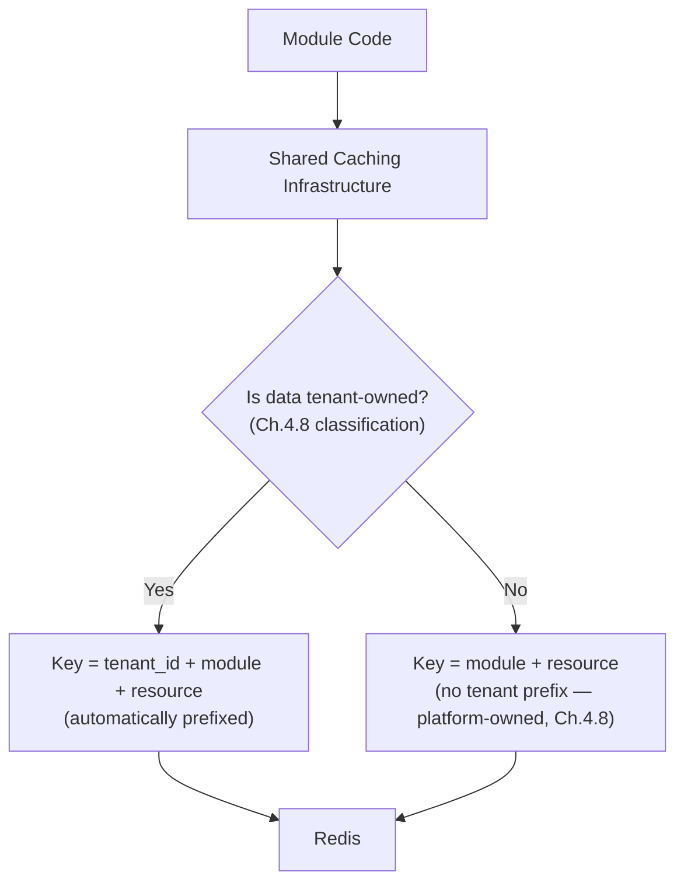
```mermaid
flowchart TD
    ModCode["Module Code"] --> CacheUtil["Shared Caching Infrastructure"]
    CacheUtil --> KeyGen{"Is data tenant-owned?\n(Ch.4.8 classification)"}
    KeyGen -- Yes --> TenantKey["Key = tenant_id + module + resource\n(automatically prefixed)"]
    KeyGen -- No --> PlatformKey["Key = module + resource\n(no tenant prefix — platform-owned, Ch.4.8)"]
    TenantKey --> Redis["Redis"]
    PlatformKey --> Redis
```

## 12.5 Cache Invalidation Strategy

Consistent with the cache-aside pattern (application code reads from cache, falling back to and populating from the primary datastore on a miss), invalidation is handled through two complementary mechanisms:

- **TTL-based expiry**: every cached entry has an explicit, deliberately-chosen time-to-live appropriate to its staleness tolerance (Section 12.3.1) — there is no cached entry with an indefinite or unbounded TTL, because an entry that is never proactively invalidated and never expires is the most likely path to the exact staleness failure Section 12.3.2 warns against, if its active-invalidation path (below) is ever missed.
- **Active invalidation on Domain Events**: when a module publishes a Domain Event (Chapter 6.6.2, fully detailed in Chapter 14) representing a change to data that has cached representations (e.g., Accounting publishes `ChartOfAccountsUpdated`), subscribing caching infrastructure invalidates the relevant cache entries immediately, rather than waiting for TTL expiry. This directly resolves Chapter 11.15's identified staleness failure scenario: a frontend's TanStack Query cache invalidation problem and a backend Redis cache's invalidation problem are both instances of the same underlying pattern — "something changed elsewhere; who needs to know" — and both are served by the same Domain Event mechanism (Chapter 14) as their primary invalidation signal, with TTL as a backstop for any subscriber gap rather than the primary invalidation mechanism.

## 12.6 Redis's Second Role — Session and Token Storage

Chapter 9.7 established that refresh tokens are stored server-side in revocable form. Redis serves this role as well as its caching role, but this chapter treats the two roles as architecturally distinct, even though they share the same underlying infrastructure:

- **Caching role** (this chapter, Sections 12.3-12.5): data is a *derived, reconstructible* copy of information whose source of truth is the primary database — losing a cache entry (e.g., a Redis failure, Section 12.10) is a performance degradation, never a correctness or data-loss event, because the primary database can always reconstruct it.
- **Session/token storage role** (Chapter 9.7): a refresh token's revocation state is not reconstructible from anywhere else — if this data is lost, the practical effect is a security/availability trade-off (either sessions are lost, forcing re-authentication, or in a worse implementation, revocation state is lost, which would be a security regression), not merely a cache miss.

**Design Decision 12.6.1** — Because these two roles have different failure implications, LedgerOne evaluates keeping them logically separated (distinct Redis key namespaces at minimum, and — depending on Chapter 24's operational findings — potentially distinct Redis instances/clusters) so that a caching-layer operational issue (e.g., an aggressive cache eviction policy tuned for the caching role) cannot inadvertently evict session data the token-storage role requires to be durable within its own intended lifetime.

## 12.7 Design Decisions

**Decision 12.7.1 — Every cached value's staleness tolerance is explicitly chosen and documented at the time caching is introduced for that data, never defaulted to "whatever seems reasonable."**
Per Section 12.3's classification, a module team introducing a new cached value must explicitly state which category (Section 12.3.1 or 12.3.2) the data falls into and, for cacheable data, what TTL and invalidation-event pairing is appropriate — mirroring Decision 8.9.3's schema-design documentation discipline, applied to caching decisions.

**Decision 12.7.2 — Cache reads must always have a correctly-functioning fallback to the primary datastore.**
No feature is built such that a cache miss or cache failure (Section 12.10) results in an error rather than a (slower, but correct) fallback read from Chapter 8's primary datastore — Redis is an optimization layer, never a secondary source of truth the system depends on for correctness or availability.

## 12.8 Why This Approach Was Chosen

Section 12.3's explicit "never cached" list exists because caching is, by its nature, an optimization that trades correctness-freshness for performance — a trade-off that is entirely reasonable for reference data and entirely unacceptable for financial invariant inputs (Chapter 7.3.4), and this handbook's recurring discipline (naming what a rule explicitly rules out, per Chapter 1.3.3, Chapter 6.5) is applied here specifically because "just cache everything that's slow" is an intuitive but dangerous default for a financial ERP, where the cost of serving stale data at the wrong moment is not a UX annoyance but a potential ledger-correctness incident.

Reusing Chapter 14's Domain Event mechanism as the primary cache-invalidation signal (Section 12.5), rather than inventing a separate cache-invalidation notification system, follows this handbook's consistent preference (Chapter 6.6.2, Chapter 11.4) for a single, well-understood "something changed" propagation mechanism serving multiple consumers (other modules, frontend cache invalidation, and now backend cache invalidation) rather than three independent, potentially inconsistent mechanisms solving structurally the same problem.

## 12.9 Alternatives Considered

**Alternative: Cache-through/write-through caching (writes go to cache and database together, atomically) rather than cache-aside.**
Rejected as the default pattern. Write-through caching requires every write path to be aware of and correctly update the cache, which is more coupling between the Repository layer (Chapter 5.3.4) and caching infrastructure than the cache-aside pattern requires, and it does not eliminate the need for an invalidation strategy for data changed by mechanisms other than the direct write path (e.g., a bulk data correction, a Domain Event from another module). Cache-aside with active event-driven invalidation (Section 12.5) achieves equivalent freshness with less coupling.

**Alternative: Omit tenant scoping from cache keys for data assumed to be "probably fine to share" across tenants (e.g., tax rate lookups that happen to be identical for many tenants today).**
Rejected explicitly, even for data that is currently identical across tenants — per Section 12.4's reasoning, the correct classification for such data is *platform-owned shared reference data* (Chapter 4.8), stated and cached as such deliberately, never a tenant-owned cache entry that happens to currently hold the same value as another tenant's entry by coincidence. The distinction matters because "currently identical by coincidence" is not a stable invariant — the moment tenant-specific tax configuration diverges, an unscoped cache key becomes a live cross-tenant leak.

## 12.10 Trade-offs

- **Active, event-driven invalidation (Section 12.5) requires every module that caches data to correctly subscribe to every relevant Domain Event that could invalidate it** — a missed subscription reintroduces a staleness risk TTL alone would only bound, not eliminate, promptly. This is accepted because the alternative (TTL-only invalidation) would mean every cached value's effective staleness window is its full TTL, not the near-immediate window an event gives, which is unacceptable for several of Section 12.3.1's use cases (e.g., permission sets, which must reflect a Tenant Administrator's role change promptly, not after an arbitrary TTL expires).
- **Section 12.6's logical (or physical) separation of caching and session-storage roles adds operational complexity** (potentially multiple Redis configurations/instances to manage, per Chapter 24) compared to treating Redis as one undifferentiated key-value store. Accepted because the two roles' failure consequences are genuinely different (Section 12.6), and conflating them risks an operational tuning decision appropriate for one role silently harming the other.

## 12.11 Best Practices Established by This Chapter

- No new cached value is introduced without first being classified per Section 12.3 and reviewed for tenant-scoping correctness per Section 12.4 — this should be an explicit item in the same design-review process Chapter 6's Decision 6.8.3 and Chapter 8's Decision 8.9.3 establish for other structural decisions.
- Any code that constructs a Redis key without going through the shared caching infrastructure named in Section 12.4 is treated as a defect during review, regardless of whether the specific key happens to be correctly tenant-scoped by coincidence — the point is structural guarantee, not case-by-case correctness.
- A module introducing a new cached value must also, in the same change, publish or subscribe to the Domain Event (Chapter 14) needed to keep that value's active-invalidation path (Section 12.5) correct — caching and its invalidation are designed together, never caching first with invalidation added reactively later.

## 12.12 Security Considerations

Section 12.4's tenant-scoped cache key rule is, in substance, an extension of Chapter 4's most consequential security property into a data store Chapter 4 does not otherwise cover — this chapter's single most important security contribution is closing that specific, easy-to-overlook gap. Additionally, Section 12.3.1's caching of resolved permission sets means a Tenant Administrator's revocation of a user's role must correctly and promptly invalidate that user's cached permission set (via Section 12.5's event-driven invalidation) — a delay here is a real, if narrow, authorization-staleness security concern (a revoked permission remaining effectively usable until the cache entry expires or is invalidated), named explicitly here for Chapter 20's security review to verify is correctly implemented, not merely assumed.

## 12.13 Performance Considerations

Caching's entire purpose is performance, but this chapter's specific contribution beyond the obvious is Section 12.3's discipline about *what* to cache — caching data that is rarely re-read, or whose computation cost is trivial, wastes Redis capacity and adds invalidation-maintenance burden (Section 12.11) for negligible performance benefit. Chapter 21 will define concrete criteria (read frequency thresholds, computation cost thresholds) for when introducing a new cache entry is actually justified, so that caching decisions are made on measured evidence rather than intuition about what "feels slow."

## 12.14 Scalability

Because Redis's data is, in its caching role (Section 12.6), fully reconstructible from the primary datastore, the caching layer can scale (more memory, more Redis capacity, or eventually a distributed Redis cluster per Chapter 24) independently of the primary database's own scaling story (Chapter 8, Chapter 21) — a cache-capacity constraint never becomes a correctness constraint, only a performance one, which is precisely the property that makes it safe to scale the two layers on independent schedules and independent operational triggers as tenant count and data volume grow (Chapter 1.14's tenant-scale and data-volume-scale axes).

## 12.15 Failure Scenarios

- **Failure: A cache key omits tenant scoping**, either through a bypass of the shared caching infrastructure (Section 12.4) or a bug within it, causing a cross-tenant data leak through Redis. Named as this chapter's most severe possible failure, structurally equivalent in consequence to Chapter 4.15's primary database leak scenario. Mitigation: Section 12.11's mandatory use of shared caching infrastructure, reviewed with the same severity as any Chapter 4 isolation concern, never treated as a lower-stakes concern merely because the data store is Redis rather than MySQL.
- **Failure: An invalidation event is missed or a subscription is never wired up**, leaving a cached value stale beyond its intended window until TTL expiry. Named explicitly in Section 12.10 as an accepted residual risk of the active-invalidation model, bounded by TTL as a backstop. Mitigation: Section 12.11's requirement that caching and invalidation be designed and reviewed together in the same change, and monitoring (Chapter 22) that can surface unusually high cache-hit rates on data expected to change frequently as a signal of a missed invalidation path.
- **Failure: Redis itself becomes unavailable.** Per Decision 12.7.2, this must degrade to slower-but-correct primary-datastore reads for the caching role, and — for the session-storage role (Chapter 9.7) — is a more serious availability event requiring its own mitigation (detailed in Chapter 23), since active sessions may be affected. This chapter's contribution is ensuring the caching role's failure mode is explicitly designed to be "slow," never "broken" or "incorrect."
- **Failure: A financial invariant input is cached against Section 12.3.2's explicit prohibition**, because a module team, focused on a performance goal, caches a balance or similar value without recognizing it falls into the "never cached" category. Mitigation: Section 12.11's classification-first review discipline, and explicit callout in module-level design review (echoing Chapter 7's rich-vs-simple entity classification review) whenever a cached value is derived from or used as input to an Aggregate invariant check.

## 12.16 Future Improvements

- Once Chapter 24's operational deployment model for Redis is finalized, revisit Decision 12.6.1's logical-vs-physical separation of caching and session-storage roles with concrete data on eviction behavior and memory pressure under realistic load, rather than deciding the physical topology speculatively here.
- Define Chapter 21's concrete read-frequency and computation-cost thresholds for justifying a new cache entry (Section 12.13), informed by real production query performance data once enough modules are live to provide it.
- Evaluate whether a lightweight, automated check (beyond code review) can verify that every cached value has a corresponding documented classification and invalidation event pairing (Section 12.7.1, 12.11) — a structural, tooling-backed version of what is currently a review-time discipline, consistent with this handbook's general preference for moving from convention to tooling as patterns mature.

---

*Chapter 12 approved.*

---

# Chapter 13 — Asynchronous Processing & Queues

## 13.1 Purpose

Chapter 2.3.2 named Scheduled/Background Jobs as a system actor that must remain tenant-scoped per execution, never operating across tenants in a single unscoped pass. Chapter 9.8 built its entire authorization argument around the fact that background jobs invoke Business-layer methods directly, bypassing the Presentation-layer Guard entirely — treating that as a certainty, not a hypothetical. This chapter is where both of those forward references are resolved: it defines BullMQ's role (per `02_TECH_STACK.md`) as LedgerOne's asynchronous processing mechanism, and the concrete rules that keep every job tenant-correct and authorization-correct despite never passing through a controller.

## 13.2 Responsibilities of This Chapter

- Define what categories of work belong in asynchronous jobs versus synchronous request handling, and why.
- Define how a job carries and enforces tenant context, resolving Chapter 2.3.2's requirement concretely.
- Define how a job satisfies Chapter 9.8's authorization requirement despite having no HTTP request or authenticated end-user session in the conventional sense.
- Define job idempotency, retry, and failure-handling conventions.
- Define the relationship between queued jobs (this chapter) and Domain Events (Chapter 6.6.2, fully detailed in Chapter 14) — related concepts that are not the same thing.

## 13.3 What Belongs in Asynchronous Processing

- **Scheduled, recurring business processes**: period-end closing procedures, recurring invoice generation, subscription billing runs — work that is triggered by time, not by a specific user request, and is expected to run whether or not any user is actively using the system at that moment.
- **Expensive or slow operations that should not block a user-facing request**: report pre-computation (Chapter 18), bulk data import/export, large recalculations (e.g., re-running inventory valuation after a costing method change).
- **Best-effort side effects of a synchronous operation** that should not fail or delay the primary operation if they themselves fail: sending a notification email after an invoice is created (Chapter 16), where the invoice creation itself must succeed and return promptly regardless of whether the email provider is currently slow or down (Chapter 2.3.3's "unreliable by default" posture for external systems, now given a concrete mechanism).
- **Fan-out reactions to Domain Events with many independent subscribers** (Chapter 14): where a single Domain Event (e.g., `InvoicePosted`) triggers work in several other modules, each subscriber's reaction runs as its own asynchronous job, so that one slow or failing subscriber does not block or fail the others, and does not block the original synchronous operation that published the event.

**What does not belong in asynchronous processing:** any operation a user is actively waiting on for their next action to be valid (e.g., the actual posting of a Journal Entry, which must complete synchronously so the user immediately sees its correct, final state) — per Chapter 6.14's guidance that only interactions not requiring an immediate answer should be asynchronous.

## 13.4 Tenant Context in Jobs — Resolving Chapter 2.3.2

**Every job carries an explicit, immutable tenant context as part of its job payload, established at the moment the job is enqueued, never resolved or assumed at execution time.** This is the asynchronous-processing equivalent of Chapter 4.5.1's request-level tenant resolution: just as an HTTP request resolves its tenant context once, early, from the authenticated session, a job resolves its tenant context once, at enqueue time, from whatever triggered it (the tenant-scoped request that enqueued it, or — for scheduled jobs with no single triggering request — an explicit per-tenant scheduling loop, per Section 13.5).

**A job handler that operates across multiple tenants in a single execution is a structural violation of this chapter, with no exception.** Where a scheduled process must run "for every tenant" (e.g., a nightly period-close check), this is implemented as one job enqueued per tenant, each carrying its own single tenant context and processed independently — never as a single job that internally loops across tenants, because a single unscoped loop is exactly the shape of code most likely to accidentally cross Chapter 4's isolation boundary (e.g., an accidental shared variable, a query missing a tenant filter inside the loop) in a code path that, unlike a request handler, has no Chapter 4.5.1 request-boundary forcing tenant resolution to happen correctly by construction.

## 13.5 Scheduling Multi-Tenant Recurring Work

For work that must run for every tenant on a schedule (period-close reminders, recurring invoice generation), LedgerOne uses a **fan-out scheduling pattern**: a single scheduled trigger (BullMQ's repeatable job feature) runs a lightweight "dispatcher" job on schedule, which queries the list of tenants for which this work is due (a platform-owned, cross-tenant query — explicitly permitted here because the dispatcher itself does not touch any tenant's business data, only the list of tenants, per Chapter 4.8's platform-owned data category) and enqueues one individually tenant-scoped job per tenant. The actual business-logic job handlers then each execute with exactly one tenant's context, per Section 13.4.

```mermaid
flowchart TD
    Sched["BullMQ Scheduled Trigger\n(e.g., nightly)"] --> Dispatch["Dispatcher Job\n(reads tenant list — platform-owned data only)"]
    Dispatch --> J1["Job: Tenant A\n(tenant_id = A)"]
    Dispatch --> J2["Job: Tenant B\n(tenant_id = B)"]
    Dispatch --> J3["Job: Tenant C\n(tenant_id = C)"]

    J1 --> BL1["Business Layer\n(Tenant A context only)"]
    J2 --> BL2["Business Layer\n(Tenant B context only)"]
    J3 --> BL3["Business Layer\n(Tenant C context only)"]
```

## 13.6 Authorization in Jobs — Resolving Chapter 9.8

Chapter 9.8 established that the authoritative authorization check lives in the Business/Domain layer and must not assume an HTTP-authenticated end-user is the only possible caller. This chapter resolves the specific question that raises for jobs: **what identity does a background job act as, for the purposes of an authorization check that expects "who is doing this"?**

- **Jobs triggered by a specific user action** (e.g., an asynchronous export requested by a user) carry that user's identity and tenant context forward into the job payload (Section 13.4), and the authorization check inside the Business layer evaluates exactly as it would for a synchronous request from that same user — the fact that it is executing asynchronously is invisible to the authorization logic.
- **Jobs triggered by schedule, with no originating user** (e.g., recurring invoice generation) act under a well-defined **System Identity**, scoped to the specific tenant (Section 13.4) — a designated, non-human identity with an explicitly defined, narrow permission set appropriate to exactly the operations that specific scheduled process is meant to perform, never a blanket "system can do anything" identity. This System Identity is itself subject to Chapter 9.5's RBAC model, not an exception to it — it simply has a role assigned like any other identity, just not a human one.

This means Chapter 9.8's authoritative Business/Domain-layer check never has to special-case "is the caller a job" — it always evaluates a permission set against an identity and a tenant context, whether that identity is a human end-user or a defined System Identity, which is precisely why Chapter 9.8 was able to state its rule without carving out an exception for asynchronous callers in advance.

## 13.7 Domain Events vs. Queued Jobs — A Necessary Distinction

Chapter 6.6.2 introduced Domain Events as a cross-module communication mechanism and deferred their full mechanics to Chapter 14. This chapter must draw a clear line before Chapter 14 does, because the two concepts are easily conflated:

- A **Domain Event** (Chapter 14) is a statement of business fact — "this happened" — published by the module where it happened, with no assumption about who, if anyone, is listening, or how they process it.
- A **Queued Job** (this chapter) is a unit of work to be executed, once, asynchronously, by a specific handler, with defined retry and failure semantics.

A Domain Event's *subscribers* are frequently implemented as Queued Jobs — when Sales publishes `InvoicePosted` and Accounting needs to react, Accounting's reaction to that event is enqueued as a job (Section 13.3's "fan-out reactions" case) — but the event itself is not a job, and not every job originates from an event (a scheduled period-close job, Section 13.5, has no originating Domain Event; it originates from a schedule). Chapter 14 will define the event bus mechanics; this chapter defines what happens to the work once a subscriber decides to act on an event asynchronously.

## 13.8 Idempotency and Retry

Every job handler is designed to be **idempotent** — safely re-executable with the same payload without producing a different or duplicated result — because BullMQ's retry mechanism (and any queue system's, in the presence of real-world failure modes like a worker crashing mid-execution after partial work but before acknowledging the job) means a job may execute more than once for the same logical unit of work. This directly parallels Chapter 10, Decision 10.5.3's idempotency requirement for externally-retriable API endpoints — the underlying risk (a retry causing a duplicate financial record) is identical, only the retry trigger (network retry vs. queue retry) differs.

Concretely, a job handler that creates a record checks, before creating, whether the equivalent record (identified by a stable idempotency key carried in the job payload, or by a natural uniqueness constraint on the underlying Aggregate) already exists from a prior, possibly-failed-partway attempt, and treats re-execution as a no-op (or a safe resume) rather than blindly repeating the creation.

## 13.9 Failure Handling

A job that fails after its configured retry attempts are exhausted is moved to a **dead-letter queue** rather than silently discarded — per Chapter 1.5's compliance/auditability principle, a failed background job that was supposed to, for example, generate a recurring invoice or process a period-close step is a business event that must be visible and actionable (Chapter 22's observability, Chapter 23's reliability handling), not something that quietly vanishes. Dead-lettered jobs are surfaced to Platform Operators (Chapter 2.3.1, Chapter 9.6) as an operational concern requiring investigation, and — where the failure represents an incomplete business process a tenant is depending on — potentially surfaced to the affected Tenant Administrator as well, depending on the specific business process (detailed per-module, not prescribed generically here).

## 13.10 Design Decisions

**Decision 13.10.1 — Jobs never resolve tenant context by re-deriving it from data at execution time; they only ever read the tenant context carried in their own payload.**
This mirrors Decision 4.7.1's "never trust client-supplied tenant_id" but for a different threat model: the risk here is not a malicious client, but an execution-time bug (e.g., a job handler that looks up "the current tenant" from some ambient, incorrectly-shared context) reintroducing the exact unscoped-loop risk Section 13.4 exists to prevent. The payload is the single source of truth for a job's tenant context, full stop.

**Decision 13.10.2 — System Identities (Section 13.6) are defined and permissioned explicitly per scheduled process, never as a single shared "system" account.**
A single, broad system account would violate the same principle Chapter 9.6 established for Platform Operators: a broad, powerful identity used across many different scheduled processes means a bug or vulnerability in any one process's job handler has the blast radius of that account's full permission set, rather than the narrow permission set actually needed for that specific process.

**Decision 13.10.3 — Idempotency keys for jobs are derived from stable business identifiers, never from queue-internal identifiers (like a BullMQ job ID) alone.**
A BullMQ job ID identifies a specific enqueued attempt, not the logical unit of business work — using it alone as an idempotency key would fail to catch the case where the *same logical work* is enqueued twice through two different code paths (e.g., a user manually retriggering an export that a scheduled process also triggered). The idempotency key must be derived from the business meaning of the work (e.g., "invoice generation for Tenant A, period March 2026"), consistent with Chapter 7's Ubiquitous Language discipline of grounding technical concepts in real business meaning.

## 13.11 Why This Approach Was Chosen

The one-job-per-tenant fan-out pattern (Section 13.5) is chosen over a single cross-tenant loop specifically because Chapter 4's entire tenant-isolation argument depends on tenant context being resolved once, early, and carried immutably (Chapter 4.5.1) — a single job iterating across tenants internally would be the one code path in the entire system where that discipline could not be structurally enforced the way Chapter 4.5.2's Repository-layer infrastructure enforces it for request-driven code, because there is no equivalent "request boundary" inside a loop body forcing correct scoping. Splitting into per-tenant jobs restores exactly that boundary at the job level.

Named, narrowly-scoped System Identities (Section 13.6) rather than a special "jobs bypass authorization" carve-out preserve Chapter 9.8's central claim without qualification — the alternative (jobs are exempt from authorization checks) would have quietly reopened the exact gap Chapter 5.12 and Chapter 9.8 spent significant effort closing, just relabeled as "it's just an internal job, so it's fine."

## 13.12 Alternatives Considered

**Alternative: A single scheduled job that loops through all tenants internally, for simplicity.**
Rejected, per Section 13.4 and Section 13.11 — this is precisely the structural risk this chapter exists to prevent, and it was seriously considered only because it appears simpler to implement; the isolation risk it reintroduces is judged to outweigh that implementation convenience, consistent with every other tenant-isolation decision in this handbook (Chapter 4, Chapter 12) rejecting convenience-over-correctness trade-offs for this specific class of risk.

**Alternative: Exempt background jobs from the Business/Domain-layer authorization check entirely, treating "it's an internal process" as sufficient trust.**
Rejected, per Section 13.6 and Section 13.11 — internal does not mean harmless; a bug in a job handler with no authorization check at all could perform an operation no legitimate identity was ever actually permitted to perform, which is a strictly worse failure mode than a correctly-scoped System Identity's bug (bounded by that identity's narrow permission set, per Decision 13.10.2).

**Alternative: Use cron-style OS-level scheduling (outside the application, e.g., a server crontab) instead of BullMQ's repeatable jobs for scheduled work.**
Rejected. OS-level scheduling is disconnected from the application's own deployment model (Chapter 3.3.1's Modular Monolith, horizontally replicated per Chapter 21) — running a cron job on "a server" is ambiguous the moment there are multiple replicas of the backend process, risking either no execution (if the wrong replica is asked) or duplicate execution (if every replica runs it). BullMQ's queue-based scheduling, backed by Redis (Chapter 12), is inherently coordinated across replicas — only one worker picks up a given scheduled job execution, regardless of how many backend replicas are running.

## 13.13 Trade-offs

- **The fan-out pattern (Section 13.5) means a platform-wide scheduled process becomes N individual jobs for N tenants**, which is more queue volume and more individually-tracked job executions than a single loop would produce. Accepted for the isolation-correctness argument in Section 13.11 — this is a direct, deliberate trade of raw efficiency for structural safety, consistent with this handbook's consistent stance (Chapter 4.9, Chapter 12.10) that isolation correctness is non-negotiable even at real efficiency cost.
- **Idempotency design (Section 13.8, Decision 13.10.3) adds real implementation effort to every job handler** — checking for prior partial completion before proceeding, rather than assuming a clean, single execution. Accepted per the same reasoning as Chapter 10's idempotency decision: a duplicated financial side effect is a categorically worse outcome than the engineering cost of preventing it.
- **Narrowly-scoped System Identities (Decision 13.10.2) mean adding a new scheduled process requires defining and permissioning a new identity**, rather than reusing an existing broad system account — more setup per new scheduled process, accepted for the blast-radius containment argument.

## 13.14 Best Practices Established by This Chapter

- Any new scheduled, multi-tenant process is designed using the dispatcher/fan-out pattern (Section 13.5) from its first implementation — a single cross-tenant loop is never an acceptable "we'll fix it later" starting point, given how directly it violates Chapter 4's core guarantee.
- Every new job handler explicitly states, as part of its design, what identity it acts as (a forwarded end-user identity or a named System Identity) and what idempotency key strategy it uses — mirroring the explicit-classification discipline this handbook applies to schema design (Chapter 8), caching (Chapter 12), and Domain modeling (Chapter 7).
- Dead-lettered jobs (Section 13.9) are triaged as part of routine operational review, never left unexamined in a queue — an accumulating, unreviewed dead-letter queue is itself treated as an operational health signal (Chapter 22).

## 13.15 Security Considerations

Section 13.6's System Identity model is this chapter's central security contribution: it ensures that even the platform's own internal, unattended processes are subject to the identical authorization model (Chapter 9.5's RBAC) as any human actor, with narrowly-scoped permissions per Decision 13.10.2 — meaning a compromised or buggy job handler has a bounded, auditable blast radius rather than ambient, unchecked system-level trust. Decision 13.10.1's rule against re-deriving tenant context at execution time is also a security property, not merely a correctness one: it eliminates an entire class of potential tenant-isolation bug that would otherwise be unique to the asynchronous execution path and invisible to Chapter 4's request-focused isolation reasoning.

## 13.16 Performance Considerations

The fan-out pattern's job-volume cost (Section 13.13) is managed through BullMQ's own concurrency controls — the queue's worker concurrency can be tuned independently of tenant count, meaning tenant-scale growth (Chapter 1.14) increases queue depth and total processing time, not necessarily peak resource consumption, if concurrency and worker capacity are provisioned appropriately (a Chapter 21/24 operational concern). This chapter's specific contribution to performance is ensuring that expensive, slow operations (Section 13.3) are removed from the synchronous request path entirely, which is the primary lever this chapter pulls to protect Chapter 21's request-latency budgets for the operations that remain synchronous.

## 13.17 Scalability

Because each tenant's scheduled work is an independently-enqueued, independently-processed job (Section 13.5), tenant-count growth (Chapter 1.14) translates directly into queue throughput requirements that scale horizontally with additional BullMQ worker capacity — a scaling lever entirely independent of the backend's own request-handling replica count (Chapter 3.3.4, Chapter 21), meaning a spike in background processing load (e.g., many tenants' period-close jobs landing on the same night) does not have to compete with or degrade synchronous, user-facing request performance, as long as workers are provisioned as their own scalable pool.

## 13.18 Failure Scenarios

- **Failure: A scheduled job is implemented as a single cross-tenant loop despite Section 13.4's rule**, most likely by an engineer unfamiliar with this chapter reaching for the seemingly simpler pattern under time pressure. This is named as this chapter's most severe possible failure, structurally equivalent in risk to Chapter 4.15's and Chapter 12.15's leak scenarios. Mitigation: Section 13.14's mandatory dispatcher-pattern best practice, enforced at design review with the same severity as any Chapter 4 isolation concern.
- **Failure: A job handler is not actually idempotent**, and a queue-level retry (following a transient failure, a worker crash, or a timeout) causes a duplicated financial side effect (e.g., two Journal Entries for one logical invoice-generation event). Mitigation: Section 13.8's mandatory idempotency design, reviewed explicitly for every job handler before it ships, per Section 13.14.
- **Failure: A System Identity is defined too broadly**, granted more permissions than the specific scheduled process it serves actually needs, "to avoid having to define a new identity for every little thing." Mitigation: Decision 13.10.2's explicit per-process scoping requirement, reviewed at the same point new roles/permissions are reviewed under Chapter 9.5's RBAC model — a System Identity's permission set is not exempt from that review merely because it isn't a human user.
- **Failure: The dead-letter queue (Section 13.9) accumulates unreviewed failures**, meaning a business process silently stops completing for one or more tenants without anyone noticing until a tenant complains (e.g., recurring invoices simply stop being generated for a specific tenant due to a persistent, unnoticed job failure). Mitigation: Section 13.14's mandatory operational review discipline, and Chapter 22's monitoring treating dead-letter queue depth as a first-class health metric, not a secondary one.

## 13.19 Future Improvements

- Once several modules have real production job volume, evaluate whether BullMQ's default retry/backoff configuration needs to be tuned per job type (e.g., a notification-delivery job retrying against a flaky external provider, per Chapter 2.3.3, may warrant different backoff behavior than an internal recalculation job) rather than a single platform-wide default.
- Define a formal, tooling-supported registry of System Identities (Section 13.6) and their permission sets, analogous to Chapter 6.7's module manifest, once enough scheduled processes exist to make an ad hoc list unwieldy to track manually.
- Revisit Section 13.9's dead-letter handling once Chapter 16 (Notification Architecture) is fully designed, to define concretely how and when a dead-lettered job's failure should be proactively surfaced to an affected Tenant Administrator, versus remaining a Platform Operator-only operational concern — this distinction is deliberately left per-process rather than decided generically here, pending real examples.

---

*Chapter 13 approved.*

---

# Chapter 14 — Event-Driven Communication

## 14.1 Purpose

Chapter 6.6.2 introduced Domain Events as one of three sanctioned cross-module communication mechanisms. Chapter 12.5 and Chapter 13.7 both depended on a fully-specified event mechanism before it existed. This chapter delivers it: the concrete shape of a Domain Event, the publish/subscribe mechanism, delivery guarantees, and ordering semantics — the infrastructure that makes "modules decoupled through events" a real, reliable property rather than a diagram-level aspiration.

## 14.2 Responsibilities of This Chapter

- Define the structure of a Domain Event (what it must contain, what it must never contain).
- Define the publish/subscribe transport mechanism and its delivery guarantees.
- Define ordering, at-least-once delivery, and consumer idempotency expectations.
- Define event versioning and schema evolution as modules change over time.

## 14.3 Domain Event Structure

A Domain Event is an immutable record of a business fact, containing: an event type name (namespaced by publishing module, e.g., `accounting.JournalEntryPosted`), the tenant context it occurred within (Chapter 4.5.1 — every event concerning tenant-owned data carries its tenant_id, non-negotiably, per the same severity Chapter 12.4 applies to cache keys), a payload of the minimal data subscribers need (identifiers and the specific facts that changed — not a full dump of the Aggregate, per Chapter 7.9's small-Aggregate discipline extended to event payloads), a timestamp, and a unique event ID used for consumer-side idempotency (Section 14.7).

**An event never contains a command or instruction** — `accounting.JournalEntryPosted` states a fact; it never says "and now Inventory must adjust stock," because that would silently reintroduce coupling (the publisher would need to know what its subscribers should do) that Chapter 6.6.2's entire rationale exists to avoid. What a subscriber does upon receiving a fact is entirely that subscriber's own Business-layer decision.

## 14.4 Transport Mechanism

Domain Events are published to and consumed from BullMQ-backed queues (Chapter 13's infrastructure), consistent with Section 13.7's clarification: an event's subscribers are implemented as queued jobs. A publishing module writes the event once; the event infrastructure fans it out to every currently-registered subscriber's own queue, so each subscriber processes independently, at its own pace, with its own retry/failure semantics (Chapter 13.9) — a slow or failing subscriber never blocks the publisher or any other subscriber.

```mermaid
graph LR
    Pub["Publishing Module\n(e.g., Sales)"] -->|"publishes once"| Bus["Event Bus\n(BullMQ-backed fan-out)"]
    Bus --> Q1["Subscriber Queue: Accounting"]
    Bus --> Q2["Subscriber Queue: Inventory"]
    Bus --> Q3["Subscriber Queue: CRM"]
    Q1 --> J1["Accounting reacts\n(Ch.13 job)"]
    Q2 --> J2["Inventory reacts\n(Ch.13 job)"]
    Q3 --> J3["CRM reacts\n(Ch.13 job)"]
```

## 14.5 Delivery Guarantees

LedgerOne's event bus provides **at-least-once delivery** — a subscriber may receive the same event more than once (e.g., after a worker crash and retry, per Chapter 13.8), but is guaranteed to eventually receive every published event at least once, assuming the subscriber's queue is eventually processed. Exactly-once delivery is explicitly not promised, because achieving it would require distributed-transaction coordination between the publisher's database commit and the event bus's enqueue operation — exactly the complexity Chapter 3.3.5 already rejected paying for in the name of strong consistency elsewhere. At-least-once delivery combined with Chapter 13.8's mandatory consumer idempotency achieves the same practical effect (no duplicated business consequence) without that distributed-transaction cost.

## 14.6 Ordering

Within a single Aggregate's event stream (e.g., all events concerning one specific Journal Entry), ordering is preserved — a subscriber will not see `JournalEntryReversed` before `JournalEntryPosted` for the same entry. Across different Aggregates or different event types, no ordering guarantee is made or relied upon — a subscriber reacting to events from multiple sources must not assume any particular interleaving, and must be designed (per Chapter 7.3.4's invariant-first discipline) to reach a correct state regardless of arrival order where cross-Aggregate ordering isn't guaranteed.

## 14.7 Design Decisions

**Decision 14.7.1 — Every event subscriber is idempotent with respect to event ID, not merely with respect to job retries.**
Per Section 14.5's at-least-once guarantee, a subscriber checks whether it has already processed a given event ID before acting, using the same idempotency discipline Chapter 13.8 mandates for jobs generally — this is Chapter 13.8's rule applied specifically to the event-consumption case, where duplicate delivery is a designed property of the transport, not merely a retry edge case.

**Decision 14.7.2 — Event schemas are versioned explicitly, and a publishing module maintains backward compatibility for at least one prior event version during any schema change.**
Because subscribers deploy independently (Chapter 6.8.1's team-autonomy guarantee), a publisher cannot assume every subscriber has been updated to understand a new event shape the instant the publisher changes it — this mirrors Chapter 26's API versioning discipline, applied to the event contract instead of the HTTP contract.

**Decision 14.7.3 — A module never subscribes to another module's internal state changes that were not deliberately published as an event.**
Only explicitly published events (documented in the publishing module's manifest, Chapter 6.7) may be subscribed to — there is no mechanism for "listening in" on another module's internal database writes or Business-layer calls, which would reintroduce exactly the undocumented coupling Chapter 6.5 forbids at the database level, now at the event-observability level instead.

## 14.8 Why This Approach Was Chosen

At-least-once delivery with mandatory consumer idempotency (Section 14.5, Decision 14.7.1) is chosen over pursuing exactly-once delivery because the latter's engineering cost (distributed transactional outbox patterns, two-phase coordination) is disproportionate to the benefit once idempotent consumption is already required for other reasons (Chapter 13.8) — LedgerOne gets the practical guarantee (no duplicated consequence) via a mechanism it needs to build anyway, rather than via a second, more complex mechanism achieving the same practical outcome.

## 14.9 Alternatives Considered

**Alternative: A dedicated event-streaming platform (e.g., Kafka) rather than BullMQ-backed queues.**
Rejected for LedgerOne's current scale. Kafka's benefits (very high throughput, long-term event log retention, replay-from-any-point semantics) solve problems LedgerOne does not yet have, at meaningfully higher operational complexity than the already-adopted BullMQ/Redis infrastructure (Chapter 13, `02_TECH_STACK.md`) — consistent with this handbook's recurring "boring, well-understood infrastructure" principle (Chapter 1.5) and its rejection of paying distributed-systems costs before organizational or load scale justifies them (Chapter 3.3.2).

**Alternative: Synchronous event delivery (publisher blocks until all subscribers acknowledge).**
Rejected — this collapses the distinction between Chapter 6.6.1's synchronous contracts and Chapter 6.6.2's asynchronous events, reintroducing exactly the fan-out latency and fragile-dependency-chain risk Chapter 6.14 and Chapter 6.16 already identified as a failure mode to avoid.

## 14.10 Trade-offs

- **At-least-once delivery (14.5) pushes idempotency-handling cost onto every subscriber**, rather than solving duplication once, centrally, in the transport. Accepted because the same cost is already paid for job retries generally (Chapter 13.8), so this is marginal, not new, cost.
- **No guaranteed cross-Aggregate ordering (14.6) means subscriber logic must be written more defensively** (tolerant of any arrival order across unrelated event types) than it would need to be under a stronger ordering guarantee. Accepted because a platform-wide total-ordering guarantee would require a single, serialized event stream — a throughput bottleneck and a single point of contention across every module, which would undermine the module-independence Chapter 6 is designed to protect.

## 14.11 Best Practices Established by This Chapter

- Every published event is documented in its publishing module's manifest (Chapter 6.7) with its current schema version, before any subscriber is built against it.
- Event payloads carry identifiers and facts, never full Aggregate dumps — a subscriber needing more data than the payload contains calls back through the publisher's Chapter 6.6.1 contract for the specific data it needs, rather than the event growing to anticipate every possible subscriber's needs.
- New subscribers are reviewed for idempotent, order-tolerant handling (Decision 14.7.1, Section 14.6) before being connected to a live event stream.

## 14.12 Security Considerations

Because tenant context is a mandatory field on every event (Section 14.3), and subscribers process events through Chapter 13's tenant-scoped job infrastructure, the event bus inherits Chapter 4's isolation discipline rather than needing a separate isolation argument — an event is, in effect, a specialized instance of the tenant-scoped job payload Chapter 13.4 already mandates rigor around. Decision 14.7.3's ban on undocumented "listening in" is also a security boundary: it guarantees that a module's data exposure surface is fully enumerable from its manifest alone (Chapter 6.13), with no hidden, undocumented event-based leakage path to audit for separately.

## 14.13 Performance Considerations

Because subscribers process independently via their own queues (Section 14.4), a single slow subscriber's processing time never adds to the publishing module's own request latency (Chapter 21) — the publish operation itself is a fast, fire-and-forget enqueue. The cost this defers is eventual-consistency lag for the fan-out reactions themselves, which is the same accepted trade-off Chapter 6.11 already named for cross-module read models specifically.

## 14.14 Scalability

Each module's event subscribers scale as their own independent worker pool (Chapter 13.17's scaling model, applied per subscriber rather than per scheduled-job type), meaning a module experiencing high event-reaction volume (e.g., Accounting reacting to a high volume of Sales-originated events) can scale its subscriber capacity without any coordination with or change to the Sales module publishing those events — a direct, event-layer expression of Chapter 1's team-and-module-growth clauses.

## 14.15 Failure Scenarios

- **Failure: A subscriber is not idempotent and double-processes a redelivered event**, producing a duplicated business consequence. Mitigation: Decision 14.7.1's mandatory idempotency, reviewed per Section 14.11 before a subscriber is connected.
- **Failure: A publisher changes an event's schema without maintaining backward compatibility**, silently breaking subscribers that have not yet been updated to the new shape, because independently-deployed subscriber teams (Chapter 6.8.1) were not coordinated with the publisher's release. Mitigation: Decision 14.7.2's mandatory backward-compatibility window, enforced at manifest-review time (Chapter 6.8.3) for any event schema change.
- **Failure: A module subscribes to undocumented internal signals** via some ad hoc mechanism outside the sanctioned event bus, recreating hidden coupling. Mitigation: Decision 14.7.3, enforced through the same import/access-boundary tooling philosophy established in Chapter 6.7.

## 14.16 Future Improvements

- Evaluate a dedicated event-streaming platform (Section 14.9) if and when real production event volume or a genuine need for event replay/audit-from-log (as opposed to Chapter 17's separate audit log) demonstrates BullMQ-backed queues are insufficient — not adopted speculatively now.
- Define a formal event schema registry, analogous to the manifest concept in Chapter 6.7, once enough published events exist across modules to make ad hoc documentation unwieldy.

---

*Chapter 14 approved (proceeding without pause per instruction).*

---

# Chapter 15 — File & Document Storage Architecture

## 15.1 Purpose

LedgerOne's modules generate and consume real files — invoice PDFs, uploaded receipts, imported spreadsheets, exported reports. This chapter defines how those files are stored (Amazon S3, per `02_TECH_STACK.md`), how tenant isolation (Chapter 4) extends to object storage — a third data store, after MySQL (Chapter 8) and Redis (Chapter 12), that must independently re-establish the same isolation guarantee — and how file access is authorized consistently with Chapter 9.

## 15.2 Responsibilities of This Chapter

- Define the S3 storage layout and tenant-scoping convention for object keys.
- Define how file access is authorized, and how time-limited access is granted without bypassing Chapter 9's authorization model.
- Define file lifecycle: upload, virus/content scanning where applicable, retention, and deletion in line with Chapter 8.6's soft-delete and Chapter 17's compliance requirements.

## 15.3 Tenant-Scoped Object Storage Layout

Consistent with Chapter 4.7.2 and Chapter 12.4's established pattern, every object key stored in S3 is prefixed with the tenant's identifier (using the external UUID, per Chapter 8.3's rule against exposing internal sequential identifiers), e.g., `tenants/{tenant_uuid}/{module}/{resource}/{file_uuid}`. This is enforced through the same shared-infrastructure discipline as Chapters 4, 12, and 13: modules do not construct S3 keys by hand; they use a shared storage utility that enforces tenant-prefixing automatically, making a cross-tenant key collision structurally difficult rather than a matter of remembering a convention.

## 15.4 File Access Authorization

Files are never made permanently, publicly accessible by direct URL. Access is granted through **short-lived, pre-signed URLs**, generated only after the requesting user's authorization has been confirmed through the same Business/Domain-layer authoritative check (Chapter 9.8) that governs every other operation — a pre-signed URL is the output of an authorized Business-layer use case ("generate a download link for this Invoice PDF, if this user is permitted to view this Invoice"), never a raw, unguarded capability handed out independently of that check. The URL's short expiry window (minutes, not days) bounds the exposure if a URL is ever inadvertently shared or logged somewhere it shouldn't be.

## 15.5 File Lifecycle

Uploaded files pass through a defined pipeline: upload to a quarantined/staging location, content validation (file type verification, size limits, and — for user-uploaded content specifically — malware scanning), and only then promotion to the tenant-scoped permanent location (Section 15.3). This staged approach exists specifically because file upload is one of the few surfaces where an external, less-trusted actor (Chapter 2.3.1's end users, and potentially Chapter 25's Marketplace extensions) directly introduces binary content into the platform — a materially different risk profile than structured API payloads validated by Chapter 5.3.1's DTOs.

## 15.6 Design Decisions

**Decision 15.6.1 — Files are never referenced by their raw S3 key in any API response or frontend code; only by an internal file identifier that the Business layer resolves to a pre-signed URL on demand.**
This mirrors Chapter 8.3's dual-key philosophy and Chapter 10, Decision 10.5.2's DTO-separation philosophy: the storage-layer detail (the actual S3 key/bucket) is never leaked across the Clean Architecture boundary (Chapter 3.4.1) to Presentation or external consumers.

**Decision 15.6.2 — Soft-deleted business records that reference files (e.g., a soft-deleted Invoice with an attached PDF) do not immediately delete the underlying file.**
Consistent with Chapter 8.6's soft-delete rationale, the file remains available for the same historical/audit-reference window as its parent record, with actual file deletion following whatever retention policy Chapter 17 defines for that record type, never deleted merely because the referencing record was soft-deleted.

## 15.7 Why This Approach Was Chosen

Pre-signed, short-lived URLs (Section 15.4) generated only after an authoritative authorization check are chosen specifically to close the same class of gap Chapter 9.8 already closed for every other operation — a permanently-accessible file URL would be a standing, unauthenticated bypass of every access control this handbook has built, discoverable by anyone who ever obtained the URL, which is an unacceptable risk for tenant financial documents specifically.

## 15.8 Alternatives Considered

**Alternative: Serve files directly through the backend application (streaming bytes through a controller) rather than via S3 pre-signed URLs.**
Rejected as the default. Pre-signed URLs let the client fetch the file directly from S3, offloading bandwidth and latency from the backend's own request-handling capacity (Chapter 21) — proxying every file download through the backend would needlessly consume application-server resources for a task S3 already handles efficiently and natively.

**Alternative: Permanently public S3 objects, relying on unguessable URLs (obscurity) rather than authorization for access control.**
Rejected outright — "security through unguessable URLs" is a well-documented anti-pattern; a leaked or logged URL becomes a permanent, unauthenticated access path with no expiry and no tie to Chapter 9's authorization model.

## 15.9 Trade-offs

- **Pre-signed URL generation adds a Business-layer round-trip before every file access**, rather than a client caching and reusing a permanent link. Accepted for the security benefit in Section 15.7 — this is the storage-layer analog of Chapter 11.5's "always confirm with the server" discipline.
- **The staged upload pipeline (15.5) adds latency and complexity to file uploads** compared to a direct-to-permanent-storage upload. Accepted because unvalidated, unscanned binary content reaching tenant-scoped permanent storage is a real security and integrity risk this handbook is not willing to accept for implementation convenience.

## 15.10 Best Practices Established by This Chapter

- No module constructs S3 keys manually; all storage access goes through the shared, tenant-prefixing storage utility (Section 15.3).
- Every file-serving endpoint generates a pre-signed URL only after the same authoritative Business/Domain-layer check (Chapter 9.8) any other operation on that resource would require — never a separate, weaker file-access check path.

## 15.11 Security Considerations

Section 15.3's tenant-scoped key layout and Section 15.4's authorization-gated, short-lived URL issuance together close the object-storage-layer equivalent of Chapter 4 and Chapter 12's isolation guarantees — this chapter's contribution is ensuring the third data store (S3) does not become the isolation model's weakest link simply because it was designed last or considered "just file storage." Content scanning (Section 15.5) additionally defends against a threat class (malicious uploaded content) that Chapter 20 will treat as a specific security review item.

## 15.12 Performance Considerations

Offloading actual file transfer to S3 directly (Section 15.8) keeps large binary payloads off the backend's own request-handling path entirely, protecting Chapter 21's latency budgets for the application's core transactional operations from being affected by unrelated, potentially large file transfers.

## 15.13 Scalability

S3's storage capacity scales independently of both the primary database (Chapter 8) and the caching layer (Chapter 12), meaning growing file volume (invoices, attachments, exports accumulating over a tenant's multi-year history, per Chapter 1.14's data-volume-scale axis) does not compete with or constrain either of those layers' own scaling.

## 15.14 Failure Scenarios

- **Failure: A file is accessible via a permanent or long-lived URL that outlives its intended access window.** Mitigation: Section 15.4's mandatory short expiry, reviewed as a security-critical configuration parameter (Chapter 20).
- **Failure: Malicious content is uploaded and reaches tenant-scoped storage without validation**, due to a bypass of the staged pipeline (Section 15.5). Mitigation: the staging/scanning step is enforced as a mandatory, non-optional stage of the shared storage utility (Section 15.3, 15.10), not a per-module opt-in.
- **Failure: A soft-deleted record's file is deleted immediately**, breaking Chapter 15.6.2's retention alignment with its parent record and potentially destroying data needed for an audit. Mitigation: file deletion is driven by the same retention policy engine Chapter 17 defines, never triggered independently by a naive "delete the file when the record is soft-deleted" implementation shortcut.

## 15.15 Future Improvements

- Evaluate whether specific file types (e.g., generated financial statement PDFs, Chapter 18) warrant a dedicated, longer-retention storage tier or lifecycle policy distinct from general user-uploaded attachments, once real usage patterns and compliance requirements (Chapter 17) are better understood per document type.

---

*Chapter 15 approved (proceeding without pause per instruction).*

---

# Chapter 16 — Notification Architecture

## 16.1 Purpose

Chapter 2.3.3 named Email/SMS Delivery Providers as external, best-effort, asynchronous-by-nature integrations whose failure must never block or roll back the business transaction that triggered a notification. Chapter 13.3 already placed notification delivery in the asynchronous-processing category. This chapter defines the Notification module itself: how other modules request a notification be sent, how templates and delivery channels are managed, and how delivery failures are handled without ever becoming a business-transaction failure.

## 16.2 Responsibilities of This Chapter

- Define how business modules request notifications, without any business module needing to know delivery-channel specifics (email vs. SMS vs. future push notifications).
- Define the template model and its tenant-customization boundary.
- Define delivery failure handling consistent with Chapter 2.3.3's "unreliable by default" posture and Chapter 13.9's dead-letter discipline.

## 16.3 Notification Request Model

A business module never calls an email/SMS provider directly. It publishes a Domain Event (Chapter 14) or calls the Notification module's published contract (Chapter 6.6.1) with a notification *intent* (e.g., "notify this Customer that Invoice X was issued"), never with delivery-channel-specific details. The Notification module — a Foundation/Platform module per Chapter 6.4 — owns the decision of which channel(s) to use, which template applies, and how to actually deliver it, per Section 16.4. This is a direct application of Chapter 6.5's rule: Sales does not know or care how Notification delivers an email; it only knows a business fact occurred that warrants notifying someone.

## 16.4 Templates and Tenant Customization

Notification templates are platform-owned defaults (Chapter 4.8) that a Tenant Administrator may override per tenant (e.g., customizing an invoice-notification email's wording or branding) — the override is tenant-owned data, isolated per Chapter 4's structural model, while the underlying template *structure* (what variables/facts are available to interpolate) remains a platform-owned contract the business module's notification intent (Section 16.3) satisfies.

## 16.5 Delivery and Failure Handling

Notification delivery runs as an asynchronous job (Chapter 13), decoupled entirely from the triggering business transaction's own success — the business transaction (e.g., posting an Invoice) commits and returns successfully regardless of whether the resulting notification job later succeeds or fails. A failed delivery (provider downtime, an invalid recipient address) follows Chapter 13.9's dead-letter and retry discipline, with retry backoff tuned specifically for external-provider flakiness (flagged in Chapter 13.19's Future Improvements as a per-job-type tuning need, now given its first concrete example).

## 16.6 Design Decisions

**Decision 16.6.1 — Business modules are structurally prevented from calling delivery providers directly.**
Only the Notification module holds provider credentials and integration code, enforced through the same module-boundary tooling (Chapter 6.7) preventing any other cross-module infrastructure leakage — this guarantees that a future delivery-channel migration (e.g., switching email providers) touches exactly one module.

**Decision 16.6.2 — A failed notification never triggers a compensating rollback of the business transaction that requested it.**
Notification is modeled as a side effect with its own independent success/failure lifecycle (Section 16.5), never as a step whose failure invalidates the business operation — consistent with Chapter 13.3's classification of notification as best-effort.

## 16.7 Why This Approach Was Chosen

Routing all notification intent through one owning module (Section 16.3, Decision 16.6.1) is the direct application of Chapter 6's module-ownership discipline to a capability every other module needs — the same reasoning that keeps Authentication and Authorization as owned Foundation modules (Chapter 6.4) rather than logic duplicated per module.

## 16.8 Alternatives Considered

**Alternative: Let each business module integrate directly with its preferred delivery provider.**
Rejected — this would mean N modules each holding provider credentials and duplicating delivery/retry logic, and a provider migration touching every module instead of one, directly contradicting Chapter 6's ownership model.

## 16.9 Trade-offs

- **Centralizing notification in one module means it must support every business module's notification needs generically enough to avoid becoming a bottleneck**, per Chapter 6.12's narrow-contract guidance — a real design tension named honestly rather than assumed away.

## 16.10 Best Practices Established by This Chapter

- No module holds email/SMS provider credentials or integration code outside the Notification module.
- Every notification intent is expressed in business terms (a fact and a recipient), never in delivery-channel terms.

## 16.11 Security Considerations

Centralizing provider credentials in one module (Decision 16.6.1) narrows the credential-exposure surface to a single, specifically-reviewed module rather than N modules each independently handling third-party secrets — a direct security benefit of the ownership model.

## 16.12 Performance Considerations

Because notification delivery is fully asynchronous (Section 16.5), it never adds external-provider latency (Chapter 2.3.3's inherent unreliability) to any synchronous request path, protecting Chapter 21's latency budgets identically to Chapter 13.3's general asynchronous-side-effect pattern.

## 16.13 Scalability

Notification job volume scales with business-event volume across all modules combined, making the Notification module's own worker capacity (Chapter 13.17's scaling model) a distinct, independently-provisioned concern from any single business module's scaling needs.

## 16.14 Failure Scenarios

- **Failure: A business module bypasses the Notification module and integrates with a provider directly**, reintroducing Chapter 6.5's forbidden cross-module infrastructure coupling. Mitigation: Section 16.10's best practice, enforced at manifest/module-boundary review.
- **Failure: Notification failures silently roll back or block business transactions** due to an implementation mistake conflating the two lifecycles. Mitigation: Decision 16.6.2, verified explicitly whenever a new notification integration point is added to a business module's use case.

## 16.15 Future Improvements

- Tune per-provider retry/backoff configuration (Section 16.5) once real delivery failure patterns are observed in production, per Chapter 13.19's flagged need.

---

*Chapter 16 approved (proceeding without pause per instruction).*

---

# Chapter 17 — Audit & Compliance Architecture

## 17.1 Purpose

Chapter 1.5 named compliance and auditability as architectural, not incidental, concerns. Chapters 4, 8, 9, 13, and 15 have each deferred a specific auditability requirement to this chapter: Chapter 4.5.4's audit logging as the last line of tenant-isolation defense, Chapter 8.6's soft-delete rationale, Chapter 9.9.2's mandatory impersonation logging, Chapter 13.9's dead-letter visibility, and Chapter 15.6.2's file retention alignment. This chapter delivers the audit trail mechanism all of them depend on.

## 17.2 Responsibilities of This Chapter

- Define what is logged for every data-changing operation, and why it must be tamper-resistant.
- Define the relationship between the audit log and Chapter 7's Aggregate/Domain model.
- Define data retention policy at the architectural level, resolving Chapter 8.6 and Chapter 15.6.2's deferred references.

## 17.3 What Is Audited

Every mutation of tenant-owned business data (per Chapter 4.8's classification) records: who (the acting identity — human or System Identity, per Chapter 13.6), what (the operation and the before/after values of changed fields), when (timestamp), and from where (tenant context, and where relevant, the originating request or job). This is captured at the Business layer (Chapter 5.3.2), the same layer that owns transaction boundaries (Decision 5.7.3) — audit records are written within the same transaction as the business mutation itself, so an audit entry can never be silently lost due to a partial failure that the business mutation itself did not also experience.

## 17.4 Tamper Resistance

Audit records are append-only — no code path ever updates or deletes an existing audit record, consistent with Chapter 8.6's soft-delete philosophy taken to its logical extreme: audit data is the one category of data with zero legitimate case for even soft deletion during its retention window, because its entire purpose is to be a reliable record of what happened regardless of what happens to the data it describes afterward.

## 17.5 Retention and Data Lifecycle — Resolving Chapter 8.6 and 15.6.2

Retention periods are defined per data category (informed by real compliance requirements per jurisdiction, a `01_PROJECT_CONTEXT.md`/legal concern this chapter's architecture must accommodate rather than dictate) and enforced by a scheduled process (Chapter 13's fan-out pattern, tenant-scoped) that identifies records past their retention window for archival or deletion — never an ad hoc, per-feature deletion decision. This is the concrete policy Chapter 8.6 and Chapter 15.6.2 both deferred to this chapter.

## 17.6 Design Decisions

**Decision 17.6.1 — Audit logging is infrastructure provided to every module, not reimplemented per module.**
Consistent with Chapter 4.5.2's shared Repository infrastructure pattern, audit capture is built into the shared Business-layer/Repository infrastructure so that a module cannot forget to audit a mutation — auditing is the default behavior of the infrastructure, not an opt-in a module must remember to add.

**Decision 17.6.2 — The audit log is a distinct store from the primary transactional tables, read through its own dedicated access path.**
This keeps audit-log query patterns (typically broad, historical, read-heavy) from competing with or being constrained by the access patterns of live transactional data (Chapter 8.15), and keeps the append-only guarantee (17.4) structurally enforceable independently of the transactional schema's own mutation permissions.

## 17.7 Why This Approach Was Chosen

Writing audit records within the same transaction as the business mutation (17.3) directly serves Chapter 1.5's "compliance is architectural, not incidental" principle — an audit trail that could be silently skipped on a partial failure would be exactly the kind of undocumented failure mode Chapter 1.13's Decision 1.5.2 requires every chapter to guard against.

## 17.8 Alternatives Considered

**Alternative: Derive the audit trail entirely from Chapter 14's Domain Events, rather than a dedicated audit-capture mechanism.**
Considered, given events already capture "what happened." Not adopted as the sole mechanism, because not every auditable mutation is necessarily modeled as a cross-module Domain Event (some mutations are purely internal to a module with no other subscriber), and relying on events for audit would mean audit completeness depends on every mutation happening to also be an event — a coincidental coupling rather than a guaranteed one. This connects back to Chapter 3.5.3's deferred Event Sourcing question: a dedicated audit-capture mechanism gets the auditability benefit Event Sourcing would provide, without committing to deriving all state from the event stream.

## 17.9 Trade-offs

- **Writing audit records within the same transaction (17.3) adds write cost to every mutation.** Accepted because an audit record written outside the transaction (e.g., "best effort" logging after commit) could be lost exactly when a partial failure occurs — the scenario audit logging exists to make legible.

## 17.10 Best Practices Established by This Chapter

- No module implements its own bespoke audit logging; all mutations go through the shared infrastructure (Decision 17.6.1).
- Any new retention requirement (a new jurisdiction, a new compliance obligation) is added as a data-category policy (Section 17.5), never as a one-off deletion script.

## 17.11 Security Considerations

The audit trail is Chapter 4.5.4's designated last line of tenant-isolation defense and Chapter 9.9.2's designated impersonation-accountability mechanism — this chapter's tamper-resistance guarantee (17.4) is what makes both of those earlier promises actually trustworthy; an audit log that could be edited after the fact would be forensically worthless for exactly the incidents it exists to help investigate.

## 17.12 Performance Considerations

Chapter 17.6.2's dedicated audit store keeps audit query load from competing with transactional query performance (Chapter 8.15, Chapter 21) — audit reads (e.g., an auditor's historical review) are typically infrequent and broad, a different access pattern than the frequent, narrow reads/writes of live transactional data.

## 17.13 Scalability

Audit data grows monotonically and indefinitely (append-only, per 17.4) — this chapter's retention policy (17.5) is the specific mechanism that keeps this growth bounded and manageable at the tenant-scale and data-volume-scale axes named in Chapter 1.14, rather than accumulating without limit.

## 17.14 Failure Scenarios

- **Failure: An audit record is lost due to being written outside the business transaction.** Mitigation: Decision 17.6.1's shared, same-transaction infrastructure, reviewed as a correctness requirement, not an optional feature.
- **Failure: Retention policy is applied ad hoc, inconsistently deleting or retaining data across modules.** Mitigation: Section 17.5's centralized, per-category policy engine.

## 17.15 Future Improvements

- Revisit Chapter 3.5.3's deferred Event Sourcing decision once this chapter's audit-log approach has real production history to evaluate against actual auditor and compliance demands, per that chapter's explicit flag.

---

*Chapter 17 approved (proceeding without pause per instruction).*

---

# Chapter 18 — Reporting & Analytics Architecture

## 18.1 Purpose

Chapter 6.6.3 named cross-module read models as a sanctioned, reporting-only exception to synchronous contract calls, and deferred their design to this chapter. Chapter 7.12 flagged Reporting as the likely candidate for a dedicated, asynchronously-populated read model. This chapter resolves both: it defines how LedgerOne aggregates data across module boundaries for reporting and dashboards without violating Chapter 6.5's data-ownership rule.

## 18.2 Responsibilities of This Chapter

- Define the read-model population pipeline, fed by Chapter 14's Domain Events.
- Define the acceptable staleness bound for reporting data, and how it is communicated to users.
- Define where read-model projections are and are not applied.

## 18.3 The Read-Model Pipeline

Cross-module read models are populated asynchronously (Chapter 13 jobs, subscribing to Chapter 14 events) — never queried live across module boundaries, per Chapter 6.6.3's original constraint. A Dashboard widget showing Sales, Inventory, and Accounting figures together reads from a purpose-built read model table, itself tenant-scoped per Chapter 4's rules, kept current by subscribing to the relevant events each contributing module publishes (`InvoicePosted`, `StockAdjusted`, `JournalEntryPosted`, etc.).

## 18.4 Staleness and Read-Model Application

Per Chapter 7.12's flag, a distinct, asynchronously-populated read model (separate from the transactional write model) is applied specifically where reporting's query shape diverges significantly from the transactional write model's shape — not as a platform-wide default (consistent with Chapter 5.9's original rejection of a separate read/write model as default). Every reporting view built on a read model explicitly states its staleness bound (seconds to minutes, depending on the event-processing pipeline's own latency) rather than implying real-time accuracy it cannot provide — this is a UX and architectural honesty requirement, directly extending Chapter 11.4's TanStack Query staleness-awareness to the reporting domain specifically.

## 18.5 Design Decisions

**Decision 18.5.1 — Reporting read models are always rebuildable from source-of-truth data (module tables plus the event log), never the sole record of a fact.**
If a read model's population logic has a bug, the correct fix is to correct the logic and rebuild the projection — never to hand-patch the read model directly, which would create a second, undocumented source of truth exactly contrary to Chapter 7.5's Bounded Context discipline.

**Decision 18.5.2 — No reporting query is ever used as an input to a transactional business decision (extending Chapter 6.16's warning).**
A read model may show "approximately this much revenue this month" for a Dashboard; it is never queried to decide, for example, whether a real-time credit-limit check should pass — that decision uses Chapter 6.6.1's synchronous contract against the authoritative module, per Chapter 6.16's already-identified failure mode.

## 18.6 Why This Approach Was Chosen

Deferring reporting-specific data aggregation to dedicated, asynchronously-populated read models (rather than ad hoc cross-module joins) is the direct, concrete fulfillment of Chapter 6.6.3's promise — this chapter exists specifically so that "we need a report spanning three modules" never becomes the justification for weakening Chapter 6.5's module-boundary rule.

## 18.7 Alternatives Considered

**Alternative: A full data warehouse / ETL pipeline as the default reporting mechanism from day one.**
Rejected as a starting point — this is real infrastructure investment justified once reporting needs and data volume are well understood (Section 18.9's Future Improvements), not built speculatively ahead of demonstrated need, consistent with Chapter 1.9's over-engineering trade-off discipline.

## 18.8 Trade-offs

- **Read models introduce eventual consistency and duplicate (derived) storage of data already owned elsewhere**, a direct, accepted extension of Chapter 6.11's already-named trade-off, now applied at reporting scale rather than a single dashboard widget.

## 18.9 Best Practices Established by This Chapter

- Every reporting view states its staleness bound explicitly to the user, rather than implying live accuracy.
- No reporting read model is ever hand-edited directly; corrections happen by fixing and replaying the population logic.

## 18.10 Security Considerations

Read models remain tenant-scoped per Chapter 4's rules despite spanning multiple modules' data — a cross-module aggregation is not an exception to tenant isolation, and must be reviewed with the same rigor as any other tenant-owned table (Chapter 4.11).

## 18.11 Performance Considerations

Pre-aggregation (18.3) is precisely what makes complex, multi-module reporting queries fast at read time — the computational cost is paid once, asynchronously, at write/event time, rather than on every report view, directly serving Chapter 1.13's read-heavy ERP performance calibration.

## 18.12 Scalability

Read-model population jobs scale via Chapter 13's worker-pool model independently of the modules whose events feed them, meaning reporting complexity growth does not create backpressure on the business modules being reported on.

## 18.13 Failure Scenarios

- **Failure: A read model silently drifts from its source-of-truth data** due to a missed event subscription (echoing Chapter 12.15's cache-invalidation failure mode, now applied to reporting). Mitigation: the same monitoring-based detection (Chapter 22) flagged for cache staleness, applied here.
- **Failure: A read model is used as input to a transactional decision**, violating Decision 18.5.2. Mitigation: code review treating any transactional use case reading from a read model as a defect, per Chapter 6.16's already-established review discipline.

## 18.14 Future Improvements

- Evaluate a dedicated data warehouse/ETL layer (18.7) once reporting query complexity and data volume justify it with real evidence rather than anticipation.

---

*Chapter 18 approved (proceeding without pause per instruction).*

---

# Chapter 19 — AI Assistant Architecture

## 19.1 Purpose

Chapter 1.3's module list names an AI Assistant as a planned capability. This chapter defines its architectural placement — critically, how it respects every isolation, authorization, and module-boundary rule already established, rather than being treated as a special case exempt from them merely because it involves an LLM.

## 19.2 Responsibilities of This Chapter

- Define the AI Assistant as a module (per Chapter 6.3's criteria), with the same boundary rules as any other module.
- Define how the Assistant accesses tenant data — exclusively through existing module contracts (Chapter 6.6.1) and read models (Chapter 18), never through a privileged bypass.
- Define the trust and authorization model for AI-initiated actions.

## 19.3 The AI Assistant as an Ordinary Module

The AI Assistant module owns no tenant business data of its own beyond its own conversational/session state. When it needs to answer a question about a tenant's Accounting data or take an action (e.g., "create a draft Sales Order from this description"), it does so exclusively as a caller of other modules' published contracts (Chapter 6.6.1) or reporting read models (Chapter 18) — it has no special, privileged data-access path, and no exemption from Chapter 6.5's cross-module boundary rule. This is a deliberate, explicit design decision: an LLM-powered feature is architecturally tempting to build as a special case with broad access "because it needs context," and this chapter exists specifically to foreclose that shortcut before it is taken.

## 19.4 Authorization for AI-Initiated Actions

Any action the Assistant takes on a user's behalf (e.g., drafting or submitting a transaction) is authorized as if that specific user performed it directly — the Assistant acts as a forwarded-identity caller (Chapter 13.6's model for user-triggered async work), never under its own elevated identity. A user cannot use the Assistant to perform an action their own RBAC permissions (Chapter 9.5) would not otherwise allow them to perform directly.

## 19.5 Design Decisions

**Decision 19.5.1 — The Assistant never receives raw database or Repository-layer access, even "for context."**
All context it uses to answer questions or take actions comes from the same contracts and read models any other caller would use (Section 19.3) — this is Decision 2.6.2 and Chapter 6.5's rule, restated with zero exception for AI-specific convenience.

**Decision 19.5.2 — State-changing actions the Assistant proposes require the same explicit user confirmation a direct UI action would require, unless a specific, narrow action has been explicitly pre-approved by the user for autonomous execution.**
This prevents an LLM's non-deterministic output from directly causing an unconfirmed financial mutation — a categorically different risk profile than a deterministic UI button click, addressed here rather than assumed safe by default.

## 19.6 Why This Approach Was Chosen

Treating the Assistant as an ordinary module bound by every existing rule (rather than inventing an AI-specific architecture) is the direct application of Chapter 1.16's guidance that new module proposals must be checked against the vision statement and named principles — an AI feature is not exempt from Chapter 6's boundary discipline merely because its implementation technology (an LLM) is novel relative to the rest of the platform.

## 19.7 Alternatives Considered

**Alternative: Grant the AI Assistant a broad, privileged internal API for efficiency, distinct from the module-contract discipline other integrations follow.**
Rejected — this is precisely the shortcut Section 19.3 forecloses, and it would recreate, for an LLM-powered feature, the exact "back door with weaker checks" risk Chapter 10.10 already rejected for the public API generally.

## 19.8 Trade-offs

- **Restricting the Assistant to existing contracts and read models may limit the richness of context it can access compared to unrestricted internal access**, potentially requiring new, purpose-built contract methods or read models to be added for it (which is the correct, sanctioned way to expand its capability, per Chapter 6.6). Accepted as the necessary cost of not creating an isolation/authorization exception.

## 19.9 Best Practices Established by This Chapter

- Any new AI Assistant capability requiring data or an action not currently exposed through an existing contract is built by extending that module's contract (Chapter 6.6.1) properly, never by granting the Assistant module a special exception.

## 19.10 Security Considerations

Decision 19.5.1 and 19.5.2 together ensure the Assistant introduces no new class of privilege escalation or unconfirmed-mutation risk beyond what already exists for any other caller — this chapter's primary security contribution is refusing to treat "it's AI" as grounds for an architectural exception, consistent with this handbook's consistent rejection of convenience-motivated exceptions (Chapters 4, 6, 12, 13).

## 19.11 Performance Considerations

Because the Assistant calls existing contracts and read models rather than a bespoke high-throughput path, its performance profile inherits whatever budgets Chapter 21 assigns those existing call paths — it does not require its own separate performance architecture.

## 19.12 Scalability

As an ordinary module (Section 19.3), the Assistant scales and evolves under the same team-autonomy and module-growth model as any other module (Chapter 6.15), including its own independent worker/request capacity provisioning.

## 19.13 Failure Scenarios

- **Failure: A future engineer, under pressure to ship an AI feature quickly, grants the Assistant a privileged data-access shortcut "just this once."** Named as this chapter's primary risk, directly analogous to Chapter 6.16's core failure mode. Mitigation: the same manifest-review discipline (Chapter 6.8.3) applied without exception to this module.
- **Failure: An LLM-proposed action executes without user confirmation and turns out to be incorrect or unintended.** Mitigation: Decision 19.5.2's mandatory confirmation step, absent an explicit, narrow, user-granted autonomous-execution exception.

## 19.14 Future Improvements

- Define the specific narrow categories of pre-approved autonomous action (Decision 19.5.2) once real usage data shows which repetitive confirmations are safe to streamline — not decided speculatively now.

---

*Chapter 19 approved (proceeding without pause per instruction).*

---

# PART IV — QUALITY ATTRIBUTES

# Chapter 20 — Security Architecture

## 20.1 Purpose

Every prior chapter has deferred a specific security finding to this one: Chapter 4.12's tenant isolation as the platform's highest-consequence property, Chapter 9.13's JWT-verification integrity requirement, Chapter 10.10's rate-limiting need at the public API boundary, Chapter 12.12's cache-invalidation authorization staleness, Chapter 15.11's malicious-upload defense, and Chapter 19.10's AI-specific privilege-escalation risk. This chapter does not re-derive those findings — it consolidates them into a single security architecture and adds the platform-wide controls no single earlier chapter owned.

## 20.2 Responsibilities of This Chapter

- Consolidate every security-relevant finding flagged by earlier chapters into a single reviewable architecture.
- Define platform-wide controls not owned by any single earlier chapter: rate limiting, input validation defense-in-depth, encryption at rest and in transit, secrets management.
- Define the security review process for new modules and features.

## 20.3 Consolidated Security Model

| Concern | Owning Chapter | Mechanism |
|---|---|---|
| Tenant isolation | Ch. 4 | Defense-in-depth: request resolution, Repository enforcement, DB-level backstop, audit |
| Authentication/session | Ch. 9 | JWT + revocable refresh tokens |
| Authorization | Ch. 9 | RBAC, enforced at Business/Domain layer, two-plane separation |
| Cache isolation | Ch. 12 | Tenant-scoped keys, shared infrastructure |
| Job/async isolation | Ch. 13 | Per-tenant fan-out, System Identities |
| Event isolation | Ch. 14 | Mandatory tenant field, no undocumented subscriptions |
| File storage isolation | Ch. 15 | Tenant-scoped keys, pre-signed short-lived URLs |
| Audit trail | Ch. 17 | Append-only, same-transaction capture |

This table is the single reviewable map this chapter contributes: a security reviewer can trace any concern to its owning chapter's detailed mechanism rather than needing this chapter to restate each one in full.

## 20.4 Platform-Wide Controls Not Owned Elsewhere

- **Rate limiting**: applied at the API boundary (Chapter 10), tiered by caller trust level (Chapter 2.3) — the Frontend Application, authenticated tenant users, and third-party/Marketplace callers (Chapter 2.3.1) receive different limits, reflecting their different trust levels as established in Chapter 2.6.
- **Input validation defense-in-depth**: Chapter 5.3.1's DTO validation at the Presentation layer is the first line; Chapter 7.3.4's Domain invariants are the second, independent line — an input that somehow bypasses DTO validation still cannot violate a Domain invariant, because the Domain layer never trusts its callers, including its own Business layer, to have validated correctly.
- **Encryption in transit**: HTTPS-only (per `09_SECURITY_GUIDELINES.md`), enforced platform-wide, no exception for any internal or external endpoint.
- **Encryption at rest**: applied to the primary datastore (Chapter 8), object storage (Chapter 15), and any backup/snapshot mechanism (Chapter 24) — a data-store-agnostic requirement, not something each chapter had to independently re-derive.
- **Secrets management**: provider credentials (Chapter 16's notification providers, Chapter 15.3's storage access, database credentials) are never hardcoded or committed to source control, managed through the deployment platform's secrets mechanism (Chapter 24).

## 20.5 Design Decisions

**Decision 20.5.1 — Every new module or significant feature undergoes a security review checking specifically against this chapter's consolidated table (20.3) before shipping.**
This mirrors the manifest-review discipline (Chapter 6.8.3) and schema-review discipline (Chapter 8.9.3) already established — security review is not a generic "does this look secure" pass, but a specific check against each named mechanism this handbook has already committed to.

**Decision 20.5.2 — The gaps this handbook has honestly flagged as incomplete (Chapter 8.5's database-level tenant defense maturity, Chapter 8.17's tracked-gap requirement) are tracked as open security debt, reviewed on a defined cadence, never allowed to be forgotten simply because no incident has yet occurred.**

## 20.6 Why This Approach Was Chosen

Consolidating rather than re-deriving (Section 20.3) reflects this handbook's own internal consistency requirement (Chapter 1.7.2, Decision 1.7.4): security was designed as a foundational, cross-cutting property from Chapter 1 onward, not bolted on here — this chapter's job is to prove that claim true by showing every mechanism traces to a specific, already-justified design decision, not to invent security architecture from scratch at Part IV.

## 20.7 Alternatives Considered

**Alternative: Treat Chapter 20 as the sole location where security is designed, with earlier chapters deferring entirely to it.**
Rejected — this is precisely the "security as a Chapter 20 feature" anti-pattern Chapter 1.12 explicitly warned against. Security decisions made this late, after module boundaries, data models, and APIs are already designed, tend to be retrofitted and weaker than decisions made as those structures were designed in the first place.

## 20.8 Trade-offs

- **Distributing security decisions across many chapters (rather than centralizing them here) means a reviewer must trust that each chapter's security section was actually rigorous**, rather than reviewing one comprehensive document. Accepted because the alternative (security bolted on at the end) is the worse failure mode this handbook is explicitly designed to avoid.

## 20.9 Best Practices Established by This Chapter

- Every module's security review explicitly walks through Section 20.3's table for the specific mechanisms relevant to that module.
- Open security debt (Decision 20.5.2) is tracked with the same visibility as Chapter 13.9's dead-letter queue — never a silent, unreviewed backlog.

## 20.10 Security Considerations

This entire chapter is security considerations; its meta-contribution is ensuring nothing security-relevant flagged in Chapters 1-19 was lost by the time Part IV is reached.

## 20.11 Performance Considerations

Rate limiting and defense-in-depth validation (20.4) add measurable per-request overhead — this cost is treated as a mandatory baseline within Chapter 21's performance budgets, never traded away for latency under the assumption that security checks are optional overhead.

## 20.12 Scalability

Tiered rate limiting (20.4) scales naturally with caller-trust-level growth (more third-party developers, per Chapter 2.13's integration-scale axis) without requiring a redesign, because trust tiers were already established structurally in Chapter 2.

## 20.13 Failure Scenarios

- **Failure: A module ships without the security review mandated by Decision 20.5.1.** Mitigation: security review is a required gate in the same release process Chapter 6.8.3 and Chapter 8.9.3 already establish for other structural reviews.
- **Failure: Tracked security debt (Decision 20.5.2) is quietly deprioritized indefinitely.** Mitigation: a defined review cadence with visibility to the same audience (Chapter 13.9's Platform Operator review process) as other operational health signals.

## 20.14 Future Improvements

- Close the specific open items flagged throughout this handbook (Chapter 8.5's database-level tenant defense, Chapter 13.19's per-job retry tuning where security-relevant) and retire them from Decision 20.5.2's tracked-debt list as they are resolved.

---

*Chapter 20 approved (proceeding without pause per instruction).*

---

# Chapter 21 — Performance & Scalability Architecture

## 21.1 Purpose

Chapter 1.13 established that LedgerOne's performance targets are calibrated to real ERP workloads, not hyperscale assumptions, and named this the correct performance profile without yet quantifying it. Chapters 4, 7, 8, 10, 11, and 13 each deferred a specific concrete threshold or budget to this chapter. This chapter supplies them.

## 21.2 Responsibilities of This Chapter

- Define concrete latency budgets per operation category.
- Define the horizontal scaling model for the backend (Chapter 3.3.4's deferred mechanism) and for asynchronous workers (Chapter 13.17).
- Define the criteria for justifying a new cache entry (Chapter 12.13) and for triggering module extraction consideration (Chapter 3.11).

## 21.3 Latency Budgets

Operations are budgeted by category, not uniformly: synchronous, user-facing transactional operations (e.g., posting a Journal Entry) target sub-second response; read-heavy list/report views (Chapter 10.3's paginated endpoints) target a slightly longer but still interactive budget; asynchronous job processing (Chapter 13) is budgeted by throughput and queue-depth, not per-operation latency, since users are not synchronously waiting on it by design (Chapter 13.3). These budgets are the concrete criteria Chapter 6.14's fan-out latency concern and Chapter 9.14's authentication-overhead concern are measured against.

## 21.4 Horizontal Scaling Model — Resolving Chapter 3.11

The backend (Chapter 3.3.1's Modular Monolith) scales by horizontal replication behind a load balancer (AWS ALB/ECS, per `02_TECH_STACK.md` and Chapter 24), with all replicas stateless with respect to request handling — session/tenant context lives in the JWT (Chapter 9.3), not in server-local memory, so any replica can serve any request. Asynchronous workers (Chapter 13) scale as their own independently-sized pool, decoupled from request-handling replica count (Chapter 13.17). Chapter 3.11's extraction trigger is made concrete here: a module is a candidate for Chapter 27 extraction when its resource consumption, measured via Chapter 22's monitoring, disproportionately and persistently drives horizontal scaling needs relative to other modules sharing the same replicated process.

## 21.5 Cache-Justification and Extraction Thresholds — Resolving Chapter 12.13

A new cache entry (Chapter 12) is justified when a data point is read at a frequency and computation cost that, multiplied together, exceed a defined resource-cost threshold — measured, not assumed, via Chapter 22's monitoring before the cache is introduced, per Chapter 12.13's deferred criteria.

## 21.6 Design Decisions

**Decision 21.6.1 — Performance budgets are enforced in CI via automated load/latency testing for critical paths, not discovered in production.**
Consistent with this handbook's tooling-over-discipline pattern, a regression against Section 21.3's budgets on a critical operation (e.g., Journal Entry posting) fails a build, rather than being caught reactively.

## 21.7 Why This Approach Was Chosen

Category-specific budgets (21.3) rather than a single platform-wide latency target directly reflect Chapter 1.13's rejection of a one-size-fits-all performance model — a reporting query and a Journal Entry post have different acceptable latencies precisely because they serve different user expectations (Chapter 1.4's read-heavy vs. write-consistent distinction).

## 21.8 Alternatives Considered

**Alternative: Vertical scaling (larger instances) instead of horizontal replication as the primary scaling lever.**
Rejected as the primary strategy — horizontal scaling composes better with Chapter 24's deployment model (rolling deploys, redundancy) and avoids a hard ceiling a single larger instance would eventually hit, consistent with Chapter 1's tenant-scale growth clause.

## 21.9 Trade-offs

- **Stateless replica design (21.4) means every request pays the cost of re-deriving context from the JWT rather than relying on server-local session state** — a deliberate, accepted cost given Chapter 9.14's already-established performance rationale for stateless JWT verification.

## 21.10 Best Practices Established by This Chapter

- No critical-path performance budget is treated as a target to hit once; it is enforced continuously via Decision 21.6.1's CI gating.

## 21.11 Security Considerations

Performance budgets (21.3) explicitly include Chapter 20.11's mandated security-check overhead as a non-negotiable baseline cost, never a target to optimize away.

## 21.12 Performance Considerations

This entire chapter is performance considerations; its meta-contribution is making every earlier chapter's qualitative performance reference (Chapters 4, 6, 7, 9, 10, 11, 12, 13) concrete and measurable.

## 21.13 Scalability

Section 21.4's decoupled scaling of request-handling replicas and async workers is this chapter's central scalability mechanism, allowing each to scale against its own real bottleneck rather than a shared, conflated one.

## 21.14 Failure Scenarios

- **Failure: A module's resource consumption disproportionately drives scaling needs unnoticed**, delaying a needed Chapter 27 extraction decision. Mitigation: Chapter 22's monitoring making Section 21.4's trigger criteria visible continuously, not discovered reactively.

## 21.15 Future Improvements

- Refine Section 21.3's budgets with real production latency data once modules are live, rather than the anticipatory figures this chapter is necessarily built on today.

---

*Chapter 21 approved (proceeding without pause per instruction).*

---

# Chapter 22 — Observability

## 22.1 Purpose

Chapters 12, 13, 17, 18, and 21 each named a monitoring signal this chapter must provide: cache staleness detection (12.15), dead-letter queue depth (13.9), audit-trail-based anomaly detection (4.5.4), read-model drift (18.13), and scaling-trigger visibility (21.14). This chapter defines the logging, metrics, and tracing architecture that makes all of them real.

## 22.2 Responsibilities of This Chapter

- Define the three observability pillars (logs, metrics, traces) and what each captures.
- Define how tenant context (Chapter 4) propagates through observability data without becoming a tenant-isolation leak in the monitoring plane itself.
- Define alerting thresholds tied to the specific signals earlier chapters named.

## 22.3 The Three Pillars

- **Structured logs**: every log entry carries tenant context (for tenant-scoped operations), request/job correlation IDs, and the acting identity — structured, not free-text, so Chapter 22.6's alerting can query them reliably. Per Chapter 20.4's platform-wide controls, log data itself is treated as sensitive (it may contain tenant-identifying context) and access to it is scoped to the Platform Operator plane (Chapter 9.6), never exposed to tenant users.
- **Metrics**: quantitative, time-series signals — request latency per Chapter 21.3's budget categories, queue depth per Chapter 13.9, cache hit/miss rates per Chapter 12.13's justification criteria, dead-letter counts per Chapter 13.9.
- **Distributed tracing**: correlates a single logical operation (a request, a job, and every downstream contract call or event it triggers, per Chapter 6.6 and Chapter 14) across the layers it passes through (Chapter 5), critical specifically because Chapter 6.14's fan-out risk and Chapter 14.6's cross-Aggregate ordering unpredictability both require the ability to reconstruct what actually happened across a multi-module operation after the fact.

## 22.4 Correlation IDs Propagate Everywhere

A single correlation ID, established at the point a request or scheduled job begins (Chapter 4.5.1, Chapter 13.4), propagates through every layer (Chapter 5), every synchronous contract call (Chapter 6.6.1), and every asynchronous job or event it triggers (Chapter 13, Chapter 14) — this is what makes Chapter 6.14's fan-out latency concern and Chapter 13.18's silent-failure concern actually diagnosable rather than merely theoretically traceable.

## 22.5 Design Decisions

**Decision 22.5.1 — Alerting thresholds are defined per the specific signals named in earlier chapters, not generically.**
Dead-letter queue depth (Chapter 13.9), cache-hit-rate anomalies on frequently-changing data (Chapter 12.15), and disproportionate per-module resource consumption (Chapter 21.4) are each named, specific alert conditions — this chapter does not invent generic "something seems wrong" alerting divorced from the concrete failure modes already identified throughout this handbook.

## 22.6 Why This Approach Was Chosen

Deriving this chapter's signals directly from earlier chapters' named failure modes (22.5) ensures observability is built to detect the specific risks this handbook has already identified as real, rather than a generic, undirected monitoring setup that might miss exactly the failure modes this handbook spent nineteen prior chapters naming.

## 22.7 Alternatives Considered

**Alternative: Generic, best-practice observability tooling adopted without deliberately mapping it to this handbook's named risks.**
Rejected — this would satisfy an "observability exists" checkbox without guaranteeing the specific signals Chapters 4, 12, 13, 17, 18, and 21 actually need are present.

## 22.8 Trade-offs

- **Correlation-ID propagation through every layer (22.4) requires disciplined instrumentation at every module boundary (Chapter 6.6)** — a module that fails to propagate the ID breaks traceability for any operation passing through it. Accepted as necessary given the diagnostic value at stake.

## 22.9 Best Practices Established by This Chapter

- Every new synchronous contract call or published event (Chapter 6.6, Chapter 14) propagates the current correlation ID as a matter of shared infrastructure, not per-module reimplementation.

## 22.10 Security Considerations

Section 22.3's restriction of log/observability access to the Platform Operator plane (Chapter 9.6) prevents the monitoring plane itself from becoming an unintended cross-tenant data exposure path — logs containing tenant context are still tenant-sensitive data, even though they live outside Chapter 4's primary-database isolation model.

## 22.11 Performance Considerations

Observability instrumentation itself has overhead (structured logging, metric emission, trace spans) — this is included in Chapter 21.3's performance budgets as a mandatory baseline cost, consistent with Chapter 20.11's treatment of security overhead.

## 22.12 Scalability

Metrics and logs volume grows with tenant count and module count (Chapter 1.14) — the observability pipeline itself (log aggregation, metrics storage) is provisioned and scaled per Chapter 24's operational model, independently of the application layers it observes.

## 22.13 Failure Scenarios

- **Failure: A module fails to propagate correlation IDs**, breaking traceability for cross-module operations exactly when a fan-out failure (Chapter 6.16) or event-processing issue (Chapter 14.15) needs to be diagnosed. Mitigation: Section 22.9's shared-infrastructure approach to correlation propagation, reviewed at module manifest review (Chapter 6.8.3).

## 22.14 Future Improvements

- Expand Decision 22.5.1's alerting thresholds as new failure modes are identified in production, keeping the direct traceability between "named risk in this handbook" and "concrete alert" intact as the platform grows.

---

*Chapter 22 approved (proceeding without pause per instruction).*

---

# Chapter 23 — Reliability & Failure Handling

## 23.1 Purpose

Chapters 2, 3, 6, and 13 each deferred a specific resilience mechanism to this chapter: Chapter 2.14's external-integration failure containment, Chapter 3.12's single-process fault containment, Chapter 6.14's circuit-breaker need for synchronous fan-out, and Chapter 13's general async-failure handling. This chapter defines the concrete mechanisms.

## 23.2 Responsibilities of This Chapter

- Define timeout, retry, and circuit-breaker patterns for synchronous cross-module and external calls.
- Define graceful degradation behavior when a non-critical dependency (Chapter 2.3.3) fails.
- Define the platform's health-check and fast-rollback deployment safety net (foreshadowing Chapter 24).

## 23.3 Timeouts and Circuit Breakers — Resolving Chapter 6.14

Every synchronous cross-module contract call (Chapter 6.6.1) and every external system call (Chapter 2.3.3) carries an explicit timeout — no call waits indefinitely. Where a downstream module or external system fails repeatedly within a window, a circuit breaker opens, causing subsequent calls to fail fast rather than repeatedly waiting on a known-failing dependency — this is the concrete mechanism Chapter 6.14 named as necessary to prevent a fragile synchronous dependency chain from cascading.

## 23.4 Graceful Degradation for External Dependencies — Resolving Chapter 2.6.3

Per Chapter 2.6.3's "unreliable by default" posture, each external integration (banking feeds, tax services, payment gateways, notification providers) defines its own degraded-mode behavior when unavailable — e.g., Banking reconciliation queues incoming transactions for later matching rather than blocking; Notification delivery retries asynchronously (Chapter 16.5) without blocking the triggering transaction. No external dependency's failure is allowed to block a core transactional operation that does not genuinely require it to succeed synchronously.

## 23.5 Process-Level Fault Containment — Resolving Chapter 3.12

Given the Modular Monolith's shared-process risk (Chapter 3.3.4, 3.12), containment operates at two levels: resource limits and monitored health checks at the process/container level (Chapter 24) that trigger replacement of an unhealthy replica automatically, and defensive coding boundaries at the module level (Chapter 6) that limit how far a single module's unhandled error can propagate before being caught and converted into a contained failure response rather than crashing the whole process.

## 23.6 Design Decisions

**Decision 23.6.1 — Every external and cross-module synchronous call has an explicitly reviewed timeout value, never a framework default assumed to be adequate.**
Mirroring this handbook's recurring "explicit, documented decision, not default" discipline (Chapter 8.9.3, Chapter 12.7.1), timeout values are chosen deliberately per call, informed by Chapter 21.3's latency budgets.

**Decision 23.6.2 — Deployments use health-checked, staged rollout with automatic rollback on failure signal, never an all-at-once replacement of every replica.**
This is the concrete mechanism protecting Chapter 3.3.4's "no independent deployability per module" trade-off from becoming a platform-wide outage risk on every deploy.

## 23.7 Why This Approach Was Chosen

Fail-fast circuit breakers (23.3) rather than unbounded retries follow directly from Chapter 6.14's own reasoning: an unbounded wait on a failing dependency is worse than a fast, clear failure, because it consumes request-handling capacity (Chapter 21) that could otherwise serve unrelated, healthy operations.

## 23.8 Alternatives Considered

**Alternative: Unlimited retry with exponential backoff and no circuit breaker, relying on eventual success.**
Rejected as the sole mechanism — per Chapter 13.19's flagged need for per-job-type retry tuning, retries remain useful for transient failures, but without a circuit breaker, a persistently failing dependency still consumes resources on every retry attempt across every caller, which a circuit breaker specifically prevents by short-circuiting after a failure threshold.

## 23.9 Trade-offs

- **Circuit breakers can trip on transient, recoverable issues, temporarily failing fast on calls that might have succeeded.** Accepted because the alternative (no circuit breaker) risks a worse, cascading failure under sustained dependency outage, per Chapter 6.16's already-identified risk.

## 23.10 Best Practices Established by This Chapter

- No new cross-module or external synchronous call ships without an explicit, reviewed timeout (Decision 23.6.1).
- Every external integration module documents its specific degraded-mode behavior (Section 23.4) as part of its module documentation (`12_MODULE_TEMPLATE.md`).

## 23.11 Security Considerations

Fail-fast behavior (23.3) also has a security dimension: a circuit breaker prevents a failing or compromised downstream dependency from being used as a resource-exhaustion vector against the calling module through repeated, slow, hanging calls.

## 23.12 Performance Considerations

Explicit timeouts (Decision 23.6.1) are chosen in direct reference to Chapter 21.3's latency budgets — a timeout longer than the calling operation's own budget would make the timeout meaningless as a protective bound.

## 23.13 Scalability

Circuit breakers and graceful degradation (23.3, 23.4) mean a growing number of external integrations (Chapter 2.13's integration-scale axis) does not proportionally increase platform fragility — each integration's failure is contained to its own degraded-mode behavior rather than risking a platform-wide cascade.

## 23.14 Failure Scenarios

- **Failure: A synchronous call has no timeout and hangs indefinitely**, exhausting request-handling capacity. Mitigation: Decision 23.6.1's mandatory, reviewed timeout on every such call.
- **Failure: An unhealthy replica is not detected and continues serving degraded requests.** Mitigation: Section 23.5's automated health-check-triggered replacement.

## 23.15 Future Improvements

- Tune circuit-breaker thresholds per integration once real failure-rate data (Chapter 22's metrics) is available, rather than the anticipatory defaults this chapter establishes now.

---

*Chapter 23 approved (proceeding without pause per instruction).*

---

# Chapter 24 — Deployment & Infrastructure Architecture

## 24.1 Purpose

Chapters 3, 21, and 23 have each referenced AWS infrastructure (ECS, RDS, CloudFront, ALB, S3, CloudWatch, per `02_TECH_STACK.md` and `10_DEPLOYMENT_ARCHITECTURE.md`) without defining its concrete topology. This chapter defines that topology and closes the operational loop on every deferred mechanism: Chapter 12.6's Redis topology decision, Chapter 23.6.2's staged rollout mechanism, and Chapter 8's per-module migration execution at deploy time.

## 24.2 Responsibilities of This Chapter

- Define the concrete AWS deployment topology for each layer (frontend, backend, database, cache, storage).
- Define the CI/CD pipeline and its relationship to this handbook's mandated tooling checks (Chapters 3, 5, 6, 8, 21).
- Define backup, disaster recovery, and environment strategy (dev/staging/production).

## 24.3 Topology

- **Frontend**: Next.js served via CloudFront (CDN) — consistent with `10_DEPLOYMENT_ARCHITECTURE.md`, chosen for global edge caching of static assets and server-rendered pages, reducing latency for Chapter 1.3's geographically-distributed tenant base.
- **Backend**: the Modular Monolith (Chapter 3.3.1) runs on ECS, horizontally replicated behind an ALB (Chapter 21.4's scaling model), with health checks (Chapter 23.5) driving automatic replacement of unhealthy tasks.
- **Database**: RDS MySQL (Chapter 8), provisioned with automated backups and point-in-time recovery, sized and scaled per Chapter 21's data-volume growth projections.
- **Cache**: Redis, topologically separated per Chapter 12.6's Decision 12.6.1 into caching and session-storage roles, each with an eviction/persistence policy appropriate to its own failure semantics (Chapter 12.6).
- **Storage**: S3 (Chapter 15), with lifecycle policies implementing Chapter 17.5's retention model.
- **Observability**: CloudWatch (per `02_TECH_STACK.md`) as the aggregation point for Chapter 22's logs, metrics, and traces.

## 24.4 CI/CD Pipeline — Resolving Chapter 8.7's Deploy-Time Migration Execution

GitHub Actions (per `10_DEPLOYMENT_ARCHITECTURE.md`) runs the pipeline enforcing every tooling-backed check this handbook has mandated: Chapter 5's layer-dependency linting, Chapter 6's module-boundary import linting, Chapter 21.6.1's performance-budget regression tests, and Chapter 23.6.2's staged deployment with automatic rollback. Chapter 8.7's per-module migrations execute in a defined, coordinated order at deploy time — migrations are applied before the new application version begins serving traffic, and the pipeline validates that no migration in this deploy introduces a cross-module dependency (Chapter 8.17's flagged failure mode) before proceeding.

## 24.5 Environment Strategy

Distinct development, staging, and production environments exist, each with its own tenant data (staging never contains real tenant data, consistent with Chapter 4's isolation discipline extended to environment-level separation, not merely tenant-level) — a defect that could leak tenant data must never be discoverable only in production because staging used synthetic data that happened to not exercise the isolation boundary realistically; staging data is designed to be structurally realistic (multiple synthetic tenants) specifically to exercise Chapter 4's isolation logic before production.

## 24.6 Design Decisions

**Decision 24.6.1 — Every deploy is a staged rollout with automated health-check gating and automatic rollback (Chapter 23.6.2), for every environment, with no "fast path" that skips staging for hotfixes.**
A rushed hotfix deploy is exactly the moment a mistake is likely and the moment skipping safety gates is most tempting — this decision explicitly forecloses that shortcut.

**Decision 24.6.2 — Redis's dual roles (Chapter 12.6) are deployed as logically or physically separate instances based on Chapter 12.6's evaluation, not conflated for deployment convenience.**

## 24.7 Why This Approach Was Chosen

Staging environments with structurally realistic multi-tenant synthetic data (24.5) directly serves this handbook's recurring principle that tenant isolation must be verified before, not after, production exposure (Chapter 4.9's severity framing) — a staging environment with only single-tenant test data cannot meaningfully exercise Chapter 4's isolation guarantees at all.

## 24.8 Alternatives Considered

**Alternative: A single shared environment for staging and production-adjacent testing, to reduce infrastructure cost.**
Rejected — this risks exactly the kind of tenant-data cross-contamination risk Chapter 4 exists to prevent, and removes the safety margin Decision 24.6.1's staged rollout depends on having a realistic, non-production environment to validate against first.

## 24.9 Trade-offs

- **Maintaining fully separate environments with realistic synthetic multi-tenant data (24.5) is a real infrastructure and data-generation cost.** Accepted given the isolation-verification benefit is otherwise unachievable.

## 24.10 Best Practices Established by This Chapter

- No hotfix bypasses Decision 24.6.1's staged rollout gate, regardless of urgency.
- Staging data generation is treated as its own maintained artifact, kept structurally representative of real multi-tenant conditions, not allowed to degrade into trivial single-tenant fixtures over time.

## 24.11 Security Considerations

Environment separation (24.5) is itself a security control — production credentials, secrets (Chapter 20.4), and real tenant data never exist in a lower-trust environment.

## 24.12 Performance Considerations

CloudFront's edge caching (24.3) directly reduces perceived latency for Chapter 21's frontend-facing budgets, independent of backend request-handling performance.

## 24.13 Scalability

ECS's horizontal replica scaling (24.3) is the literal infrastructure implementation of Chapter 21.4's scaling model — this chapter's contribution is making that model concretely provisionable and operable, not merely architecturally described.

## 24.14 Failure Scenarios

- **Failure: A hotfix bypasses staged rollout under time pressure and introduces a regression platform-wide.** Mitigation: Decision 24.6.1's no-exception policy, which this chapter treats as a release-process rule, not a suggestion.
- **Failure: Staging data degrades into unrealistic single-tenant fixtures**, silently losing its ability to catch isolation bugs before production. Mitigation: Section 24.10's maintained-artifact discipline.

## 24.15 Future Improvements

- Revisit Chapter 12.6's Redis topology decision with real operational data once in production, per that chapter's own flagged deferral, and update this chapter's topology (24.3) accordingly.

---

*Chapter 24 approved (proceeding without pause per instruction).*

---

# PART V — EVOLUTION

# Chapter 25 — Extensibility & Marketplace Architecture

## 25.1 Purpose

Chapters 1, 2, and 6 have each anticipated the Marketplace without building it: Chapter 1.3.3 ruled out treating it as an afterthought, Chapter 2.3.1 and 2.6.2 defined the Third-Party Developer's trust level and access constraints, and Chapter 6.6's public-API-only rule (shared with Chapter 10) was designed with this chapter in mind. This chapter delivers the concrete extension-point and sandbox architecture.

## 25.2 Responsibilities of This Chapter

- Define the concrete extension points third-party developers may build against.
- Define the sandbox boundary that bounds a misbehaving or malicious extension's blast radius, resolving Chapter 2.14's named failure scenario concretely.
- Define the Marketplace's own data model as platform-owned catalog data (Chapter 4.8).

## 25.3 Extension Points

Third-party extensions integrate through exactly the mechanisms already established for any external caller: the public API (Chapter 10), webhook-style subscriptions to Domain Events made available externally (a curated, documented subset of Chapter 14's internal event bus, never the raw internal bus itself), and, for UI extension, a defined widget/panel embedding contract within the frontend's shared layout shell (Chapter 11.3) — never direct code injection into LedgerOne's own frontend or backend runtime.

## 25.4 The Sandbox Boundary — Resolving Chapter 2.14

An extension's code (where LedgerOne hosts or executes extension logic, as opposed to a purely webhook-based integration hosted by the developer themselves) runs in an isolated execution context with no access to anything beyond what its declared API scopes (a permission-like concept mirroring Chapter 9.5's RBAC, but scoped to what a Marketplace app has been granted, not what its installing user personally holds) explicitly allow — resolving Chapter 2.14's named risk that a misbehaving extension's blast radius must be bounded by design, not by the extension author's good behavior.

## 25.5 Marketplace Catalog as Platform-Owned Data

Per Chapter 4.8's classification, the Marketplace's own catalog (available extensions, their descriptions, their declared scopes) is platform-owned, shared-read data — a tenant's decision to *install* a specific extension for their own organization is tenant-owned data (which extensions are active, with what per-tenant configuration), consistent with the same platform/tenant split already established for reference data generally.

## 25.6 Design Decisions

**Decision 25.6.1 — An extension's declared API scopes are explicitly granted by the installing Tenant Administrator, never implicitly inherited from the developer's own account or from LedgerOne's internal trust level.**
This mirrors Chapter 9.5's RBAC consent model, applied to third-party grants instead of internal role assignment — an extension never has more access than a specific tenant has explicitly chosen to grant it.

**Decision 25.6.2 — Extension code, where hosted by LedgerOne, is deployed and versioned independently of LedgerOne's own core platform release (Chapter 24), so a misbehaving extension's rollback does not require a platform-wide deploy.**

## 25.7 Why This Approach Was Chosen

Building the Marketplace exclusively on already-established extension points (Section 25.3) — rather than a bespoke integration mechanism — is the direct payoff of Chapter 1.3.3's early investment: because the public API (Chapter 10) and event bus (Chapter 14) were already designed to support external, less-trusted callers, the Marketplace did not require inventing a new trust model, only curating and scoping the existing one.

## 25.8 Alternatives Considered

**Alternative: Grant Marketplace extensions the same trust level as first-party frontend code, for simplicity of integration.**
Rejected — this was already foreclosed in Chapter 2.6.2 and Chapter 10.10's "no back door" principle; extensions remain a distinct, more constrained trust tier by design.

## 25.9 Trade-offs

- **Scoped, explicitly-granted extension permissions (25.6.1) mean an extension can only do what it was scoped to do, which may require the Tenant Administrator to understand and manage scope grants** — added complexity for the tenant, accepted as the necessary cost of bounded blast radius.

## 25.10 Best Practices Established by This Chapter

- No extension point is added to the platform without an explicit, documented scope model (Decision 25.6.1) reviewed with the same rigor as Chapter 6.8.3's manifest review.

## 25.11 Security Considerations

This entire chapter is largely a security architecture for a specifically lower-trust caller category (Chapter 2.3.1) — Section 25.4's sandbox boundary and Decision 25.6.1's explicit-grant model together are what make Chapter 2.14's blast-radius concern a solved, bounded risk rather than an open one.

## 25.12 Performance Considerations

Extension calls, whether via API (Chapter 10) or webhook-delivered events (Chapter 14), are rate-limited and budgeted (Chapter 21.3's caller-trust-tiered budgets, Chapter 20.4's rate limiting) distinctly from first-party traffic, so a misbehaving or high-volume extension cannot degrade performance for the platform's own frontend or other tenants.

## 25.13 Scalability

Because extensions integrate through already-scaled surfaces (Chapter 10's API, Chapter 14's event bus), Marketplace growth (more extensions, more installs) scales along the same axes those surfaces already scale on, rather than requiring a separate scaling model.

## 25.14 Failure Scenarios

- **Failure: An extension is granted broader scope than it declares needing, either through a Tenant Administrator's inattentive consent or a scope-model gap.** Mitigation: Decision 25.6.1's explicit, itemized grant model, with scope descriptions reviewed for clarity as part of Marketplace catalog review.
- **Failure: A misbehaving extension's rollback requires a platform-wide deploy**, delaying remediation. Mitigation: Decision 25.6.2's independent extension deployment/versioning.

## 25.15 Future Improvements

- Define the specific catalog review/certification process for extensions (foreshadowed in Chapter 2.15's flagged future trust-tier split) once real Marketplace submissions exist to design a process against.

---

*Chapter 25 approved (proceeding without pause per instruction).*

---

# Chapter 26 — Versioning & Backward Compatibility Strategy

## 26.1 Purpose

Chapters 10 and 14 each fixed a versioning *mechanism* (URL-path API versioning, Decision 10.5.1; event schema versioning, Decision 14.7.2) while deferring the full *policy* — how long a version is supported, what triggers a version bump — to this chapter. This chapter supplies that policy.

## 26.2 Responsibilities of This Chapter

- Define what constitutes a breaking vs. non-breaking change for the public API (Chapter 10) and for Domain Events (Chapter 14).
- Define the deprecation window and communication process for retiring an old version.
- Define how internal module contracts (Chapter 6.6.1) are versioned, distinct from the public API.

## 26.3 Breaking vs. Non-Breaking Change Classification

Adding an optional field, adding a new endpoint, or adding a new event type is non-breaking. Removing or renaming a field, changing a field's type or semantics, or removing an endpoint is breaking. This classification directly determines whether a change ships within the current API/event version (non-breaking) or requires a new version with the deprecation process below (breaking) — a concrete, checkable test rather than a judgment call left to each module team.

## 26.4 Deprecation Window

A breaking change to the public API (Chapter 10) or a published event (Chapter 14) is shipped as a new version alongside the old one, with the old version supported for a defined minimum window (long enough for third-party developers, per Chapter 2.13's integration-scale reality, to migrate on their own schedule — consistent with Chapter 1's team/organization-growth clause extended to external integrators, who are even less coordinatable than internal module teams). The old version is only retired after that window, with advance, documented communication — never retired silently.

## 26.5 Internal Contract Versioning

Chapter 6.6.1's internal module contracts are versioned more loosely than the public API, because their consumers (other modules) are internal and coordinatable (Chapter 6.8.1's team-autonomy model still applies, but within one organization) — a breaking internal contract change can be coordinated directly with the specific consuming module teams, rather than requiring the same long, public deprecation window Section 26.4 mandates for external consumers.

## 26.6 Design Decisions

**Decision 26.6.1 — Breaking changes require an explicit architectural sign-off, distinct from ordinary code review, given their cost to external integrators.**
Mirroring Chapter 6.8.3's manifest-review discipline, a proposed breaking change is reviewed specifically for whether it could instead be reshaped as a non-breaking addition (Section 26.3) before being approved as a genuine version bump.

## 26.7 Why This Approach Was Chosen

Distinguishing public-API versioning policy (long, formal deprecation windows) from internal-contract versioning policy (faster, directly-coordinated) reflects the same trust/coordinability distinction Chapter 2 drew between internal and external actors — applying one uniform, conservative versioning policy to internal contracts would slow module teams down for no real benefit, since Chapter 6.8.1 already assumes internal consumers can coordinate directly.

## 26.8 Alternatives Considered

**Alternative: No formal deprecation window; retire old API versions as soon as a new one ships.**
Rejected — this would break every uncoordinated third-party integration (Chapter 2.3.1) simultaneously, directly contradicting Chapter 1's team/organization-growth vision extended to the developer ecosystem Chapter 25 depends on.

## 26.9 Trade-offs

- **Long deprecation windows (26.4) mean the platform must run and maintain multiple API versions simultaneously for an extended period**, real ongoing engineering and operational cost. Accepted as the necessary cost of not breaking uncoordinated external integrators.

## 26.10 Best Practices Established by This Chapter

- Every proposed API or event change is first checked against Section 26.3's breaking/non-breaking test before being designed, not after implementation reveals it was breaking.

## 26.11 Security Considerations

A retired API version must be fully decommissioned (not merely unadvertised) at the end of its deprecation window, per Chapter 20.4's rate-limiting/access-control discipline — an old, "quietly still running" version is a stale, unreviewed attack surface if forgotten rather than deliberately retired.

## 26.12 Performance Considerations

Running multiple API versions simultaneously (26.4) has a real resource cost — this is included in Chapter 21's capacity planning as an explicit, budgeted line item, not an unaccounted-for overhead.

## 26.13 Scalability

Section 26.4's deprecation policy is what allows the Marketplace developer ecosystem (Chapter 25) to scale in integrator count without every API evolution becoming a coordination bottleneck across all of them simultaneously.

## 26.14 Failure Scenarios

- **Failure: A breaking change ships without going through Decision 26.6.1's sign-off**, silently breaking third-party integrations. Mitigation: the sign-off gate enforced at the same release-review point as other structural gates (Chapter 24.4's pipeline).
- **Failure: An old API version is never actually decommissioned after its deprecation window**, becoming unreviewed technical and security debt. Mitigation: Section 26.11's explicit decommissioning requirement, tracked with the visibility Chapter 20.5.2 already establishes for security debt generally.

## 26.15 Future Improvements

- Define concrete, calendar-based deprecation window lengths once real third-party integration volume (Chapter 25) provides evidence for what window length is actually practical, rather than an anticipatory figure decided now.

---

*Chapter 26 approved (proceeding without pause per instruction).*

---

# Chapter 27 — Migration Path to Microservices

## 27.1 Purpose

Chapter 3.3 committed to the Modular Monolith while explicitly preserving the option to extract a module into its own service later, and named the concrete trigger for doing so in Chapter 3.11 and Chapter 21.4: a module whose resource consumption disproportionately and persistently drives scaling needs relative to others sharing the same process. This chapter defines the actual extraction mechanism, so that "the option is preserved" is a concrete, executable plan rather than a hopeful claim.

## 27.2 Responsibilities of This Chapter

- Define the preconditions a module must already satisfy (by virtue of following Chapter 6's rules correctly) for extraction to be mechanical rather than a rewrite.
- Define the extraction procedure itself.
- Define what changes and what does not change for other modules when one module is extracted.

## 27.3 Why Extraction Can Be Mechanical — The Payoff of Chapter 6

Because a module never accesses another module's database tables directly (Chapter 6.5), communicates only through published contracts and events (Chapter 6.6), and owns its own migrations (Chapter 8.7), a module satisfying these rules is already, in every respect except physical process boundary, structured as if it were a separate service. Extraction is therefore primarily a matter of: standing up the module's own deployable process and its own database (migrating its already-isolated tables to their own instance), converting its in-process synchronous contract calls (Chapter 6.6.1) into network calls (e.g., HTTP or gRPC) behind the same interface, and converting its event subscriptions (Chapter 14) from in-process BullMQ consumption to network-delivered consumption from the same event bus infrastructure, now crossing a process boundary.

## 27.4 What Does Not Change for Other Modules

Because Chapter 6.6's contracts are already the *only* way other modules interact with the extracted module, no other module's code changes when a module is extracted — the interface a consuming module calls is unchanged; only its implementation (in-process call vs. network call) changes, hidden behind the same abstraction Chapter 6.6.1 already required. This is the concrete fulfillment of Chapter 1.4.1's "path to distributed deployment preserved without being taken prematurely" vision clause.

## 27.5 Design Decisions

**Decision 27.5.1 — Extraction is never triggered speculatively; it requires the concrete, monitored evidence named in Chapter 21.4.**
Consistent with Chapter 1.9's over-engineering trade-off discipline, no module is extracted "because it might need to scale independently someday" — only because Chapter 22's monitoring has already shown it does.

**Decision 27.5.2 — Extracted modules retain strong consistency for their own internal Aggregate operations (Chapter 7.3.3), but cross-module operations that previously relied on a single database transaction (Chapter 3.3.5) must be redesigned using distributed patterns (e.g., sagas) at the point of extraction, not before.**
This is the specific, honestly-named cost Chapter 3.3.5 flagged as the reason not to adopt microservices prematurely — extraction, when it happens, is the point where that cost is actually paid, deliberately and for a module that has demonstrated it is worth paying for.

## 27.6 Why This Approach Was Chosen

Deferring the distributed-consistency redesign (Decision 27.5.2) to extraction time, rather than designing every module for eventual distributed consistency from day one, is the direct payoff of Chapter 3's original argument: paying that cost only for the specific module that actually needs it, when it actually needs it, rather than for every module speculatively.

## 27.7 Alternatives Considered

**Alternative: Design every module's cross-module interactions as if they were already distributed (e.g., saga patterns everywhere) from the start, to make future extraction trivial.**
Rejected — this is precisely the premature microservices cost Chapter 3.3.2 already rejected paying; Chapter 6.6's contract discipline achieves nearly the same extraction-readiness benefit at a fraction of the upfront cost, deferring only the genuinely hard part (distributed consistency) to the point it's actually needed.

## 27.8 Trade-offs

- **A module's cross-Aggregate transactional operations with other modules must be redesigned at extraction time**, a real, deferred cost this chapter does not pretend away. Accepted because it is paid once, for one module, with concrete justifying evidence, rather than everywhere, speculatively.

## 27.9 Best Practices Established by This Chapter

- A module being considered for extraction is first audited against Chapter 6.5 and Chapter 6.6's rules to confirm no latent violations exist that would make extraction non-mechanical — any violation found is fixed first, while the module is still in the monolith and the fix is cheap.

## 27.10 Security Considerations

Extraction changes a module's authorization enforcement (Chapter 9.8) from an in-process call to a network call — the extracted module's Business/Domain-layer authorization check remains authoritative, but its own service-to-service authentication (verifying the caller is genuinely another trusted LedgerOne module, not an external actor) becomes a new, necessary concern at extraction time, absent while everything ran in one process.

## 27.11 Performance Considerations

Converting in-process calls to network calls (27.3) introduces latency and serialization overhead that did not exist before (Chapter 3.10's originally-cited advantage of the Modular Monolith) — this cost is exactly why Decision 27.5.1 requires concrete evidence that the module's independent-scaling benefit outweighs this newly-introduced cost before extraction proceeds.

## 27.12 Scalability

Extraction is, definitionally, this chapter's scalability payoff: an extracted module scales its own resources entirely independently of the remaining monolith, resolving the exact limitation Chapter 3.3.4 named as the Modular Monolith's honest trade-off.

## 27.13 Failure Scenarios

- **Failure: A module thought to be extraction-ready has latent Chapter 6.5/6.6 violations**, making extraction unexpectedly costly (a de facto rewrite rather than the mechanical process Section 27.3 promises). Mitigation: Section 27.9's pre-extraction audit, catching violations while they are still cheap to fix.
- **Failure: Cross-module distributed-consistency redesign (Decision 27.5.2) is underestimated**, and an extracted module's previously-atomic cross-module operation becomes a source of real data inconsistency post-extraction. Mitigation: extraction planning explicitly scopes and reviews every cross-module operation the module participates in, per Chapter 7.3.3's Aggregate boundaries, before extraction, not after.

## 27.14 Future Improvements

- Once a first real extraction occurs, capture the concrete lessons learned as a template/checklist refining Section 27.3's general procedure into a proven, specific playbook.

---

*Chapter 27 approved (proceeding without pause per instruction).*

---

# Chapter 28 — Architectural Decision Records (ADR Log)

## 28.1 Purpose

Chapter 1, Decision 1.7.3 mandated that the vision statement be revised only through a recorded ADR, never silently. Chapters 3, 6, 8, and others have each made decisions this handbook expects to be revisited (Chapter 3.8, Chapter 6.17, Chapter 8.18). This chapter defines the ADR mechanism itself — the log where every such revision, and every significant architectural decision going forward, is recorded.

## 28.2 Responsibilities of This Chapter

- Define the ADR format and the criteria for when a decision warrants one.
- Define the relationship between this handbook's chapters (the current, living state of each decision) and the ADR log (the historical record of how each decision arrived at its current state).
- Serve as the actual log, populated as decisions are made or revised.

## 28.3 ADR Format

Each ADR records: a date, the decision being made or changed, the context/problem that prompted it, the alternatives considered, the decision itself, and its consequences — the same structure this handbook's chapters already use at the chapter level (Purpose, Alternatives Considered, Trade-offs), applied at the granularity of a single, dated decision rather than a whole chapter.

## 28.4 When an ADR Is Required

An ADR is required whenever: a Future Improvement flagged in any chapter of this handbook is actually acted upon (Chapters 3.8, 6.17, 8.18, and every other chapter's Future Improvements section names candidates), the vision statement itself is revised (Chapter 1, Decision 1.7.3), or a decision is made that changes what an existing chapter states as current — an ADR is never required for routine implementation work that does not change any decision this handbook records.

## 28.5 Relationship Between This Handbook and the ADR Log

This handbook's chapters describe the **current** architecture, written as a coherent, always-up-to-date whole. The ADR log describes **how it got there** — a chronological record that is never rewritten, only appended to. When a decision changes, the relevant chapter of this handbook is updated to reflect the new current state (per Chapter 1.7.2's "documentation must not drift from reality" principle), and a new ADR is appended recording that the change happened, why, and what the previous decision was — satisfying Chapter 1, Decision 1.7.3's requirement to never silently edit a settled decision without a trace of what it used to say and why it changed.

## 28.6 Design Decisions

**Decision 28.6.1 — The ADR log is never edited or reordered retroactively; corrections are new, dated entries, never rewrites of history.**
This mirrors Chapter 17.4's audit-log tamper-resistance principle exactly, applied to architectural decisions instead of business data — for the same underlying reason: a historical decision record that can be quietly altered is worthless for the exact purpose (understanding why a past decision was made) it exists to serve.

## 28.7 Why This Approach Was Chosen

Separating the "current state" document (this handbook) from the "historical record" document (the ADR log) resolves a tension every long-lived architecture document eventually faces: a handbook that also tried to preserve every past, superseded decision inline would become unreadable as current guidance, while a handbook that silently overwrote past decisions with no trace would lose the ability to answer "why did we used to believe X" that Chapter 1.16 already identified as valuable.

## 28.8 Alternatives Considered

**Alternative: Record decision history as comments or footnotes within each chapter, rather than a separate log.**
Rejected — this would make chapters progressively harder to read as current guidance the more history accumulates within them, directly undermining Chapter 1's goal that a new engineer can read a chapter and understand the current architecture without wading through its full decision history first.

## 28.9 Trade-offs

- **Maintaining a separate ADR log is an additional documentation artifact to keep disciplined about updating**, beyond the chapters themselves. Accepted because the alternative (Section 28.8) actively harms the handbook's primary readability goal.

## 28.10 Best Practices Established by This Chapter

- Every architectural decision review (the many review gates this handbook has established: Chapter 6.8.3's manifest review, Chapter 8.9.3's schema review, Chapter 20.5.1's security review) checks, as a final step, whether the decision being reviewed requires a new ADR per Section 28.4's criteria.

## 28.11 Security Considerations

The ADR log's append-only discipline (Decision 28.6.1) means a security incident's root-cause investigation (Chapter 22, Chapter 23) can reliably reconstruct what the architecture's security-relevant decisions actually were at any past point in time, mirroring the forensic value Chapter 17.11 already established for the business audit trail.

## 28.12 Performance Considerations

Not applicable in the traditional sense — the ADR log is a documentation artifact, not a runtime system component; its "performance" consideration is purely the discipline cost of keeping it current, already addressed in Section 28.9's trade-offs.

## 28.13 Scalability

As the number of decisions recorded grows over the platform's multi-year lifetime (Chapter 1.3's 10-20 year expectation), the ADR log grows monotonically like the audit log (Chapter 17.13) — this is an accepted, expected property of a historical record, not a defect to be managed away.

## 28.14 Failure Scenarios

- **Failure: A decision is changed in a chapter without a corresponding ADR being recorded**, breaking the traceability Chapter 1, Decision 1.7.3 requires. Mitigation: Section 28.10's review-gate integration, making the ADR check a mandatory final step of every existing review process rather than a separate, easily-forgotten task.
- **Failure: The ADR log is edited retroactively to "clean up" or reorder history**, undermining Decision 28.6.1's core guarantee. Mitigation: treated with the same severity as a Chapter 17.4 audit-log tampering concern — this is a documentation-integrity issue with the same forensic-value consequences as tampering with real business audit data.

## 28.15 Future Improvements

- As this handbook's chapters accumulate real revision history, consider whether the ADR log warrants its own lightweight tooling (searchable by chapter/decision reference) rather than a flat chronological document, once its length makes manual scanning impractical.

## 28.16 The Log — Sample Entries

The following are the log's first entries, seeded from the founding decisions this handbook already records, in the format Section 28.3 defines. Future entries are appended below these, oldest first, never reordered (Decision 28.6.1).

| ADR | Date | Decision | Chapter |
|---|---|---|---|
| ADR-001 | Founding | Adopt Modular Monolith over Microservices or unstructured Monolith | Ch.3.3 |
| ADR-002 | Founding | Adopt Clean Architecture layering (Presentation/Business/Domain/Repository/Database) | Ch.3.4, Ch.5 |
| ADR-003 | Founding | Adopt DDD for Domain layer modeling; classify entities per Ch.7.4 test | Ch.3.5, Ch.7 |
| ADR-004 | Founding | Shared database, tenant-discriminator column, defense-in-depth enforcement | Ch.4.4 |
| ADR-005 | Founding | One Organization : one Tenant (initial simplification) | Ch.4.6 |
| ADR-006 | Founding | JWT access token + revocable refresh token; RBAC; two-plane authorization | Ch.9 |
| ADR-007 | Founding | BullMQ as queue/event transport over Kafka; dispatcher fan-out for multi-tenant jobs | Ch.13, Ch.14.9 |
| ADR-008 | Founding | Event Sourcing deferred, not rejected, pending Ch.17 audit-log evaluation | Ch.3.5.3, Ch.17.15 |

**ADR-001 detail (format example per Section 28.3):**
- **Context:** LedgerOne must absorb module, tenant, and team growth without a rewrite (Ch.1.4), and financial data requires strong consistency (Ch.3.3.5).
- **Alternatives considered:** unstructured monolith, microservices-from-day-one, selective hybrid (Ch.3.3.3).
- **Decision:** Modular Monolith — single deployable, structurally enforced internal module boundaries (Ch.6).
- **Consequences:** no independent per-module scaling/deployability until extraction (Ch.27); in exchange, native ACID consistency and lower operational surface area at current team/tenant scale.

---

*Chapter 28 approved (proceeding without pause per instruction).*

---

# Closing Note

Parts I through V are now complete: 28 chapters, covering LedgerOne's architectural vision, system boundaries, structural style, module and domain modeling, every cross-cutting concern from data through AI, the four quality-attribute pillars, and the platform's evolutionary path — extensibility, versioning, microservice migration, and the decision-record discipline that keeps all of it honest over time.

This handbook is, per its own stated discipline (Chapter 1.7.2, Chapter 28), a living document. Every chapter's Future Improvements section is a standing worklist, not a footnote — as LedgerOne's real modules are built and real production evidence accumulates, those items are the handbook's own agenda for its next revision, each one to be closed via the ADR process (Chapter 28) rather than a silent edit.

---

# PART VI — REFERENCE APPENDICES

# Appendix A — C4 Model Index

LedgerOne's architecture is documented at all four C4 levels; this index is the single lookup table for where each lives, so a reader does not have to search chapter-by-chapter.

| C4 Level | Diagram | Location |
|---|---|---|
| Level 1 — System Context | Actors, external systems, LedgerOne boundary | Ch.2.4.1 |
| Level 2 — Container | Frontend, Backend Platform, Workers, MySQL, Redis, S3 | Ch.6.4.1 |
| Level 3 — Component | Controller → Service → Aggregate → Repository → Contract (Accounting, representative) | Ch.5.6.1 |
| Level 4 — Code | JournalEntry Aggregate class diagram | Ch.7.3.6 |

Every other module (Inventory, Sales, Purchase, etc.) follows the identical Level 3/4 shape shown for Accounting — these two diagrams are templates, not one-offs.

---

# Appendix B — Naming Conventions Reference (Consolidated)

| Category | Convention | Example | Source Chapter |
|---|---|---|---|
| Database table | `snake_case`, plural | `journal_entries` | `06_DATABASE_STANDARDS.md`, Ch.8 |
| Internal primary key | `id` (bigint, auto-increment) | `id` | Ch.8.3 |
| External identifier | `uuid` | `uuid` | Ch.8.3 |
| Tenant scoping column | `tenant_id` | `tenant_id` | Ch.4.7.2, Ch.8.4 |
| Audit columns | `created_at/by`, `updated_at/by` | — | Ch.8.4 |
| Module name | PascalCase business capability | `Accounting` | Ch.6.3 |
| Permission key | `module.resource.action` | `sales.order.create` | Ch.9.5, Ch.6.4.2 |
| Domain Event | `module.PastTenseFact` | `sales.InvoicePosted` | Ch.14.3 |
| Published module contract | `I{Module}Contract` | `IAccountingContract` | Ch.6.4.2 |
| Module manifest file | `module.manifest.ts` | `accounting/module.manifest.ts` | Ch.6.7 |
| API base path | `/api/v{n}` | `/api/v1/sales/orders` | Ch.10.3 |
| Cache key | `{tenant_id}:{module}:{resource}` | `t_9f2a:sales:order:1024` | Ch.12.4 |
| S3 object key | `tenants/{tenant_uuid}/{module}/{resource}/{file_uuid}` | — | Ch.15.3 |
| System Identity | `sys.{process_name}` | `sys.recurring_invoice_generator` | Ch.13.6, Decision 13.10.2 |
| Idempotency key | `{business_meaning}:{tenant_id}:{period}` | `invoice_gen:t_9f2a:2026-03` | Ch.13, Decision 13.10.3 |

---

# Appendix C — Common Mistakes Reference (Consolidated)

A single lookup table spanning every "Common Mistakes" / failure-scenario callout in this handbook, for quick pre-review scanning.

| # | Mistake | Correct Pattern | Chapter |
|---|---|---|---|
| 1 | Querying another module's tables directly "just this once" | Use published contract or event (Ch.6.6) | Ch.6.5, 6.16 |
| 2 | Tenant context read from client input | Resolve only from signed JWT claims | Ch.4.7.1, 9.4 |
| 3 | Authorization checked only in a Presentation Guard | Authoritative check in Business/Domain layer | Ch.5.12, 9.8 |
| 4 | Cache key missing tenant prefix | Use shared tenant-scoped caching infrastructure | Ch.12.4, 12.15 |
| 5 | Scheduled job loops across all tenants internally | Dispatcher fan-out, one job per tenant | Ch.13.4, 13.18 |
| 6 | Job handler not idempotent | Idempotency key from business meaning, not queue ID | Ch.13.8, Decision 13.10.3 |
| 7 | Domain layer imports ORM/framework types | Domain stays framework-agnostic (Ch.3.4, Ch.5.3.3) | Ch.5.15 |
| 8 | Shared "Customer" entity across Sales/CRM | Separate Bounded Context models, translated at the boundary | Ch.6.10, 7.5 |
| 9 | Reporting read model used for a transactional decision | Call the authoritative module's contract instead | Ch.6.16, 18.5.2 |
| 10 | Public API DTO reuses an internal Domain object directly | Always maintain separate DTO and Domain types | Ch.10, Decision 10.5.2 |
| 11 | Permanent/long-lived file URLs | Short-lived pre-signed URLs, authorized per request | Ch.15.4, 15.14 |
| 12 | One shared "system" account for all background jobs | Narrowly-scoped System Identity per process | Ch.13.6, Decision 13.10.2 |
| 13 | Hard-deleting financial/business records | Soft delete by default; hard delete is a documented exception | Ch.8.6, Decision 8.9.3 |
| 14 | Frontend module encodes a business rule as source of truth | Client validation is convenience-only; server is authoritative | Ch.11.5, 11.15 |
| 15 | Breaking API/event change ships without a version bump | Classify change per Ch.26.3; bump version, honor deprecation window | Ch.26.14 |
| 16 | AI Assistant granted a privileged data-access shortcut | Same contracts/read models as any other caller (Ch.19.3) | Ch.19.13 |

---

# Appendix D — Decision Matrix Index

Every explicit comparison table/decision matrix in this handbook, indexed for quick reference during design review.

| Matrix | Location |
|---|---|
| Deployment style: Monolith vs. Modular Monolith vs. Microservices | Ch.3.3.6 |
| Tenant isolation strategy: DB-per-tenant vs. Schema-per-tenant vs. Shared DB | Ch.4.4.1 |
| Platform-owned vs. Tenant-owned data classification | Ch.4.8 |
| Rich Aggregate vs. Simple CRUD entity classification test | Ch.7.4 |
| Two authorization planes: Tenant Administrator vs. Platform Operator | Ch.9.6 |
| Actor trust levels: Human / System / External | Ch.2.3 |
| Consolidated security mechanism map | Ch.20.3 |

---

*End of Handbook — Parts I through VI complete. Every diagram, table, and ADR added in this revision traces back to reasoning already established in the original chapter text; none introduce new, undiscussed decisions.*
