# LedgerOne — Folder Structure Handbook

**Document Owner:** Chief Software Architect / CTO
**Version:** 1.1 (frozen — synchronized with the approved v1.0 technology stack)
**Status:** Living document — built incrementally, chapter by chapter
**Depends on (frozen, never contradicted):** `01_PROJECT_CONTEXT.md` (v1.1), `02_TECH_STACK.md` (v1.1), `03_ARCHITECTURE.md` (v1.1)
**Audience:** Every engineer joining LedgerOne, present and future

## Relationship to `03_ARCHITECTURE.md`

`03_ARCHITECTURE.md` decided *what the system is* — Modular Monolith, Clean Architecture layers, DDD-modeled modules, tenant isolation, cross-module contracts. This handbook decides *where every file that implements those decisions lives on disk*. It does not re-litigate architecture; it operationalizes it. Where a folder-structure rule exists, it exists because a specific architectural decision requires it — every chapter states which one.

Two artifacts already frozen in `03_ARCHITECTURE.md` are the ground truth this handbook expands, never replaces:

- **Chapter 5.6** (Mapping Layers onto Express.js) and **Chapter 5.6.1** (C4 Component diagram) — the five conceptual layers and their Express.js constructs.
- **Chapter 11.3.1** (Folder Structure — Frontend and Backend, Side by Side) — the top-level tree this handbook drills into.

If any rule in this document appears to conflict with either of those, that is a defect in this document, not a license to deviate — such a conflict must be raised and resolved before the rule is adopted, per the user's standing instruction never to contradict frozen documents silently.

## How to Read This Document

Every chapter follows the same structure: Purpose, Responsibilities, Folder Tree, Mermaid Diagram(s) where the tree alone doesn't communicate relationships, Naming Standards, Why This Structure, Alternatives Considered, Advantages, Disadvantages, Best Practices, Common Mistakes, Scalability, Future Improvements. No chapter contains code — only structure, naming, and the reasoning behind both.

---

## Table of Contents

**Part I — Foundations & Conventions**
1. Introduction & Repository Philosophy
2. Repository & Workspace Strategy
3. Global Naming Standards

**Part II — Root Layout**
4. Root Repository Structure & Configuration/Environment Files

**Part III — Backend Structure**
5. Backend Root & Module Organization
6. Module Internal Layered Structure
7. Domain Layer Organization
8. Cross-Cutting Building Blocks
9. Shared Backend Utilities
10. Queue, Event & Logging Folders

**Part IV — Database**
11. Database, Prisma, Migrations & Seeds

**Part V — Frontend Structure**
12. Frontend Root & Module Organization
13. Shared Frontend Layer

**Part VI — Shared Code & Assets**
14. Shared Packages & Common Libraries
15. Localization & Assets

**Part VII — Testing, Tooling & Operations**
16. Test Folder Organization
17. Scripts, Docker & CI/CD
18. Documentation Folder

**Part VIII — Governance**
19. Module Dependency & Import Rules
20. Feature/Package Boundaries & Code Ownership
21. Future Expansion Strategy

---

# PART I — FOUNDATIONS & CONVENTIONS

# Chapter 1 — Introduction & Repository Philosophy

## 1.1 Purpose

This chapter states the philosophy every later chapter's rules derive from: LedgerOne's source tree is organized so that its folder structure is a direct, physical projection of `03_ARCHITECTURE.md`'s decisions — a developer should be able to predict where a file lives from the architecture alone, without memorizing a separate, arbitrary convention.

## 1.2 Responsibilities of This Chapter

- State the single organizing principle every chapter in this handbook applies.
- Define what "feature-first organization" means concretely for LedgerOne.
- Set the eliminate-ambiguity bar this handbook is held to.

## 1.3 The Organizing Principle: Structure Mirrors Architecture

Three decisions already frozen in `03_ARCHITECTURE.md` directly produce three structural rules this entire handbook expands:

| Architectural Decision | Source | Structural Consequence |
|---|---|---|
| Modular Monolith — modules own their data, never reach into each other's tables | Ch.3.3, Ch.6.5 | Top-level code is organized **by module first**, never by technical layer first (Section 1.4) |
| Clean Architecture — dependencies point inward to Domain | Ch.3.4, Ch.5 | Every module's internals are organized **by layer second**, using the exact five-layer vocabulary already fixed in Ch.5.6 |
| DDD — modules are Bounded Contexts | Ch.3.5, Ch.7 | A module's Domain folder is organized **by Aggregate**, never by generic "models" dumping ground |

This is the single lens for every rule in this handbook: if a proposed folder placement cannot be justified by one of these three rows, it is not a valid LedgerOne convention, regardless of how common it may be in other codebases.

## 1.4 Feature-First, Not Layer-First — Why the Distinction Matters

A **layer-first** repository organizes top-level folders by technical role (`controllers/`, `services/`, `repositories/` as siblings at the root) — the antithesis of Chapter 6.3.3's "module is the unit of business capability ownership." A **feature-first** (equivalently, module-first) repository organizes top-level folders by business capability (`accounting/`, `inventory/`, `sales/`), with each folder internally organized by layer. LedgerOne is feature-first, without exception, because a layer-first structure makes Chapter 6.5's "no cross-module database access" rule nearly impossible to enforce visually or mechanically — every module's repository code would sit in one shared `repositories/` folder, indistinguishable from every other module's, defeating the module-boundary tooling `03_ARCHITECTURE.md` Chapter 6.7 mandates.

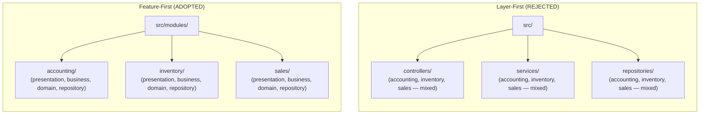

## 1.5 Why This Approach Was Chosen

A layer-first structure optimizes for "I want to see all controllers in one place" — a question engineers ask rarely and IDE search answers trivially. A feature-first structure optimizes for "I want to understand and safely change everything the Accounting module owns" — a question engineers ask constantly, and one Chapter 6's module-boundary tooling depends on being answerable by looking at a single top-level folder. `03_ARCHITECTURE.md` Chapter 1.4.1 requires modules to be addable without modifying existing modules; a feature-first tree is what makes that literally visible — adding Payroll means adding one new sibling folder, touching nothing inside `accounting/` or `inventory/`.

## 1.6 Alternatives Considered

**Alternative: Layer-first organization (Section 1.4).**
Rejected — directly contradicts Chapter 6.5's module-ownership rule and makes import-boundary tooling (Chapter 6.7) far harder to write, since a lint rule checking "does this module import another module's internals" has no natural top-level boundary to check against in a layer-first tree.

**Alternative: A hybrid — layer-first at the root, feature-first one level down (e.g., `controllers/accounting/`, `controllers/inventory/`).**
Rejected — this still scatters one module's code across N top-level folders, meaning a module cannot be extracted (Chapter 27) by moving one folder; every layer-first top-level folder would need its accounting subtree individually relocated.

## 1.7 Advantages

- A module's entire footprint (all five layers) lives under one top-level folder — directly supports Chapter 27's "extraction is mechanical" claim.
- New engineers onboard onto one module folder without needing to understand the whole tree.
- Import-boundary tooling (Chapter 6.7) has a single, obvious root per module to enforce against.

## 1.8 Disadvantages

- Finding "all controllers across the whole app" requires a cross-cutting search rather than opening one folder — accepted as a rare need against a common one (Section 1.5).
- Shared conventions (e.g., how DTOs are structured) must be enforced by convention/tooling across many module folders rather than being physically centralized in one place — addressed by the shared scaffolding and lint tooling named throughout this handbook, not by abandoning feature-first organization.

## 1.9 Best Practices

- Before creating a new top-level folder, ask: is this a business capability (→ `modules/`) or shared infrastructure every module depends on (→ `shared/` or `common/`, Chapter 5)? There is no third category.
- Never create a folder whose name is a technical layer at the repository root.

## 1.10 Common Mistakes

| Mistake | Why It's Wrong | Correct Pattern |
|---|---|---|
| Adding a root-level `controllers/` folder "just for this one quick endpoint" | Reintroduces layer-first organization by exception | Add the controller inside the owning module's `presentation/` folder (Ch.6) |
| Splitting one module's code across two top-level folders (e.g., `sales/` and `sales-legacy/`) | Defeats "one folder = one module" extraction property | Consolidate under a single module folder; use internal versioning if needed, never a second top-level folder |

## 1.11 Scalability

Feature-first organization is what allows Chapter 1 (`03_ARCHITECTURE.md`)'s module-growth clause to hold at the filesystem level: the tree's top-level folder count grows linearly with module count, and no existing folder's internal structure needs to change when a new module folder is added.

## 1.12 Future Improvements

- Once module count grows large (`03_ARCHITECTURE.md` Ch.1.4's "fifteen-plus modules"), evaluate whether `modules/` needs a further grouping tier (e.g., grouping by business domain: financial, operational, HR) — deferred until real module count makes flat `modules/` navigation unwieldy, consistent with this handbook's own anti-speculation discipline.

---

*Chapter 1 approved.*

---

# Chapter 2 — Repository & Workspace Strategy

## 2.1 Purpose

Define whether LedgerOne's frontend and backend live in one repository or several, and how that repository is organized into independently manageable workspaces.

## 2.2 Responsibilities of This Chapter

- Choose monorepo vs. polyrepo and justify it against `03_ARCHITECTURE.md`'s Modular Monolith decision.
- Define the workspace tool and top-level workspace boundaries.
- Define what is and is not a "workspace" in LedgerOne's tree.

## 2.3 Decision: Single Monorepo, Multi-Workspace

LedgerOne uses **one monorepo** containing the backend application, the frontend application, and all shared packages (Chapter 14), managed as npm workspaces.

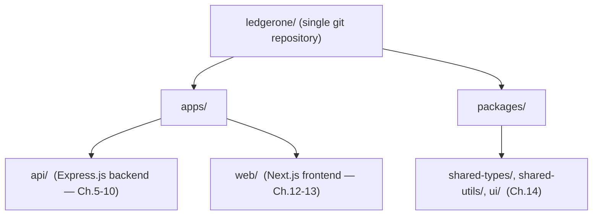

## 2.4 Folder Tree — Repository Root

```
ledgerone/
├── apps/
│   ├── api/                  (Ch.5 — Express.js backend)
│   └── web/                  (Ch.12 — Next.js frontend)
├── packages/                 (Ch.14 — shared packages)
├── docs/                     (Ch.18)
├── scripts/                  (Ch.17)
├── docker/                   (Ch.17)
├── .github/                  (Ch.17 — CI/CD workflows)
├── package.json               (workspace root — declares workspaces in "workspaces" field)
└── tsconfig.base.json
```

## 2.5 Naming Standards

| Item | Convention | Example |
|---|---|---|
| Workspace app folder | `kebab-case`, short | `api`, `web` |
| Workspace package folder | `kebab-case`, descriptive | `shared-types`, `ui` |
| Workspace package name (in `package.json`) | `@ledgerone/{name}` | `@ledgerone/shared-types` |

## 2.6 Why This Approach Was Chosen

A monorepo is the natural filesystem expression of `03_ARCHITECTURE.md` Chapter 3.3.1's Modular Monolith — one deployable backend, one frontend, sharing types and utilities, all versioned atomically. A polyrepo (separate repos per app or per module) would recreate coordination overhead Chapter 3.3.2 explicitly rejected paying prematurely — cross-repo versioning, cross-repo PRs for a single cross-module contract change (Ch.6.6). Workspaces (rather than a single undifferentiated root) give `apps/api`, `apps/web`, and each `packages/*` their own `package.json`, dependency graph, and build output, without needing separate repositories to get that isolation.

## 2.7 Alternatives Considered

**Alternative: Polyrepo — separate repositories for backend, frontend, and shared code.**
Rejected. Shared type/contract changes (Chapter 10's DTOs, Chapter 14's event schemas) would require coordinated multi-repo releases, directly working against Chapter 6.8.1's "independent internal evolution behind a stable contract" — that promise is about module boundaries *within* the backend, not license to fragment the whole platform across repository boundaries with all the versioning overhead that implies.

**Alternative: A single flat repository with no workspace tooling (no `apps/`/`packages/` split).**
Rejected — this makes it impossible to give the frontend and backend independent dependency trees and build pipelines, and it removes the mechanical boundary CI (Chapter 17) needs to know what changed and what must be rebuilt/retested.

## 2.8 Advantages

- Atomic commits across frontend/backend/shared-package changes — a single PR can update a shared DTO and both consumers.
- One CI/CD pipeline, one versioning history, one place to search.
- Workspace tooling gives per-app dependency isolation without repository fragmentation.

## 2.9 Disadvantages

- Larger single repository — clone size and CI checkout time grow with total platform size, mitigated by CI path-based triggering (Chapter 17).
- Requires workspace-aware tooling discipline (every engineer must understand workspace boundaries) rather than the simpler mental model of "one repo, one thing."

## 2.10 Best Practices

- Never add code directly under the repository root outside `apps/`, `packages/`, or the named infrastructure folders (`docs/`, `scripts/`, `docker/`, `.github/`).
- Every new shared package gets its own `packages/{name}` workspace with its own `package.json` — never added as a loose folder inside an app.

## 2.11 Common Mistakes

| Mistake | Why It's Wrong | Correct Pattern |
|---|---|---|
| Importing directly across `apps/api` and `apps/web` source trees | No workspace boundary, breaks independent build/deploy | Share code only via a `packages/*` workspace (Ch.14) |
| Adding a new top-level folder at the repo root for a one-off script or asset | Repo root becomes an unmanaged dumping ground | Use `scripts/` (Ch.17) or the appropriate existing top-level folder |

## 2.12 Scalability

Workspace-based monorepo structure scales with `03_ARCHITECTURE.md` Chapter 1's team-growth clause: adding a new shared package or a new app (e.g., a future dedicated mobile app, per Ch.1.3's module list) is an additive `packages/` or `apps/` entry, never a restructuring of existing workspaces.

## 2.13 Future Improvements

- Revisit workspace tooling (npm workspaces vs. a dedicated monorepo build system such as Turborepo/Nx) once CI build times, per Chapter 17's pipeline, become a measured bottleneck rather than a hypothetical one.

---

*Chapter 2 approved (proceeding without pause per instruction).*

---

# Chapter 3 — Global Naming Standards

## 3.1 Purpose

Fix, once, every naming convention this handbook's later chapters reference by pointer rather than redefine — the single lookup table for how anything is named anywhere in the repository.

## 3.2 Responsibilities of This Chapter

- Define file, folder, class, variable, and branch naming conventions.
- Define the extension conventions that distinguish file roles (`.controller.ts`, `.service.ts`, etc.).

## 3.3 The Naming Table

| Item | Convention | Example |
|---|---|---|
| Folder | `kebab-case` | `journal-entries/` |
| TypeScript class file | `kebab-case.role.ts` | `journal-entry.controller.ts` |
| TypeScript class name | `PascalCase` | `JournalEntryController` |
| Interface | `PascalCase`, prefixed `I` for Domain-owned contracts only (Ch.7) | `IJournalEntryRepository` |
| Variable / function | `camelCase` | `postJournalEntry` |
| Constant (module-level) | `UPPER_SNAKE_CASE` | `MAX_JOURNAL_ENTRY_LINES` |
| Enum | `PascalCase` name, `PascalCase` members | `JournalEntryStatus.Posted` |
| React component file | `PascalCase.tsx` | `JournalEntryTable.tsx` |
| React hook file | `useCamelCase.ts` | `useJournalEntries.ts` |
| Test file | same name as file under test `+ .spec.ts` / `.test.tsx` | `journal-entry.service.spec.ts` |
| Git branch | `type/short-description` | `feat/journal-entry-reversal` |

## 3.4 File-Role Suffix Table

Every backend file's role is identifiable from its suffix alone — this is what lets Chapter 6's import-boundary tooling and any engineer's editor search work without opening the file.

| Suffix | Layer (Ch.5.6) | Example |
|---|---|---|
| `.controller.ts` | Presentation | `journal-entry.controller.ts` |
| `.dto.ts` | Presentation | `create-journal-entry.dto.ts` |
| `.middleware.ts` | Presentation (Ch.8) | `tenant-scope.middleware.ts` |
| `.service.ts` | Business | `post-journal-entry.service.ts` |
| `.aggregate.ts` | Domain | `journal-entry.aggregate.ts` |
| `.value-object.ts` | Domain | `money.value-object.ts` |
| `.repository.ts` (interface, in `domain/`) | Domain | `journal-entry-repository.interface.ts` |
| `.repository.ts` (implementation, in `repository/`) | Repository | `journal-entry.repository.ts` |
| `.manifest.ts` | Module metadata (Ch.6.7) | `module.manifest.ts` |
| `.event.ts` | Event (Ch.10) | `invoice-posted.event.ts` |
| `.job.ts` | Queue (Ch.10) | `generate-recurring-invoice.job.ts` |

## 3.5 Why This Approach Was Chosen

A suffix-based naming convention (Section 3.4) makes a file's architectural layer (`03_ARCHITECTURE.md` Ch.5) identifiable without opening it — in an editor's fuzzy-file-search, typing `.aggregate.ts` surfaces every Domain Aggregate across every module at once. This directly supports Chapter 5.7.1's tooling-enforced layer boundary: a lint rule can check "does a file matching `*.aggregate.ts` import anything outside `domain/`" mechanically, because the naming convention makes the check pattern-matchable.

## 3.6 Alternatives Considered

**Alternative: Organize by folder name only, with generic file names (e.g., every service file named `index.ts` inside a `services/{name}/` folder).**
Rejected — `index.ts` everywhere makes editor tabs, stack traces, and search results indistinguishable from one another; suffix-qualified names remain informative even out of folder context (e.g., in a stack trace).

**Alternative: PascalCase file names (matching the class name exactly, e.g., `JournalEntryController.ts`).**
Rejected in favor of kebab-case file names with PascalCase class names inside — kebab-case avoids case-sensitivity inconsistencies across operating systems (a real, historically documented source of cross-platform bugs) and keeps naming behavior identical regardless of which contributor's OS or editor touches the file.

## 3.7 Advantages

- File role is visible from the filename alone, without editor tooling.
- A single, uniformly-enforced convention across the codebase, minimizing custom tooling to enforce.
- Cross-platform safe (kebab-case avoids case-sensitivity pitfalls).

## 3.8 Disadvantages

- Verbose filenames for deeply nested, specific concepts (e.g., `create-recurring-journal-entry-template.dto.ts`) — accepted as a minor cost against the searchability benefit.

## 3.9 Best Practices

- Never abbreviate a suffix (`.ctrl.ts`, `.svc.ts`) — abbreviations break the pattern-matchability Section 3.5 depends on.
- Match test file names exactly to the file under test, suffix included, so a missing test is visually obvious side by side in a directory listing.

## 3.10 Common Mistakes

| Mistake | Why It's Wrong | Correct Pattern |
|---|---|---|
| Mixing PascalCase and kebab-case file names within the same module | Breaks searchability and looks inconsistent in code review | Always kebab-case filenames, PascalCase class names inside |
| Naming a Repository-layer implementation the same as its Domain-owned interface file | Ambiguous in search/import autocomplete | Interface: `journal-entry-repository.interface.ts` (domain/); Implementation: `journal-entry.repository.ts` (repository/) |

## 3.11 Scalability

A fixed, pattern-matchable naming convention is what allows tooling (Chapter 6.7's import linting, Chapter 5.7.1's layer linting) to scale to fifteen-plus modules without per-module custom configuration — the same generic pattern applies to every module identically.

## 3.12 Future Improvements

- Consider auto-generating a scaffolding CLI (`nx generate`-style) once enough modules exist to make manual adherence to Section 3.4's suffix table error-prone at scale.

---

*Chapter 3 approved (proceeding without pause per instruction).*

---

# PART II — ROOT LAYOUT

# Chapter 4 — Root Repository Structure & Configuration/Environment Files

## 4.1 Purpose

Define every folder at the repository root not already covered by Chapter 2, and the environment/configuration file convention used across both apps.

## 4.2 Responsibilities of This Chapter

- Enumerate every top-level folder's purpose.
- Define environment file naming and precedence.
- Define where configuration values live versus where secrets live (per `03_ARCHITECTURE.md` Ch.20.4).

## 4.3 Folder Tree — Full Root

```
ledgerone/
├── apps/
│   ├── api/
│   └── web/
├── packages/
├── docs/                        (Ch.18)
├── scripts/                     (Ch.17)
├── docker/                      (Ch.17)
├── .github/
│   └── workflows/               (Ch.17)
├── .env.example                 (Section 4.5 — never real secrets)
├── package.json
├── tsconfig.base.json
└── README.md
```

## 4.4 Per-App Configuration Folder (inside `apps/api/`)

```
apps/api/
├── src/
├── config/
│   ├── database.config.ts
│   ├── redis.config.ts
│   ├── storage.config.ts       (Ch.15 of Architecture doc)
│   └── app.config.ts
├── .env.example
└── .env                        (git-ignored — never committed)
```

## 4.5 Environment File Convention

| File | Purpose | Committed to Git? |
|---|---|---|
| `.env.example` | Documents every required variable name, with placeholder/dummy values | Yes |
| `.env` | Actual local developer values | No — git-ignored |
| `.env.test` | Values for automated test runs (Ch.16) | Yes, if no secrets; otherwise no |
| Production secrets | Injected via the deployment platform's secrets mechanism, never a file in the repo | Never in repo, per `03_ARCHITECTURE.md` Ch.20.4 |

## 4.6 Why This Approach Was Chosen

`.env.example` as the single documented source of required variables directly prevents the "undocumented required config" failure mode every engineer has hit at least once — a new engineer clones the repo, copies `.env.example` to `.env`, and has a complete list of what to fill in, with no tribal knowledge required. Keeping production secrets entirely out of the repository, injected only via the deployment platform (`03_ARCHITECTURE.md` Ch.20.4, Ch.24), is a direct, non-negotiable consequence of that already-frozen security decision — this chapter does not re-decide it, only places the file-level convention that implements it.

## 4.7 Alternatives Considered

**Alternative: A single shared `.env` at the repository root for both apps.**
Rejected — `apps/api` and `apps/web` have different runtime environments (server vs. browser-exposed) and different variable sets; a shared file risks a server secret being bundled into client-side code, a serious security defect. Per-app `.env` files, scoped to their own app's config folder, make this mistake structurally harder.

**Alternative: Committing encrypted secrets directly in the repository (e.g., via a secrets-in-git tool).**
Rejected — adds a key-management dependency and a class of risk (a compromised encryption key exposes repo history) that `03_ARCHITECTURE.md` Ch.20.4's deployment-platform-secrets approach avoids entirely by never having secrets touch the repository at all.

## 4.8 Advantages

- New-engineer onboarding is self-documenting via `.env.example`.
- Clear, auditable boundary between what's committed and what's secret.

## 4.9 Disadvantages

- `.env.example` must be manually kept in sync with actual required variables — a discipline cost, mitigated by Chapter 17's CI startup check failing a build if a required variable is undocumented.

## 4.10 Best Practices

- Every new configuration variable is added to `.env.example` in the same PR that introduces it — never after the fact.
- No secret-bearing value (API key, DB password) is ever placed in `.env.example`, even as a "realistic-looking" placeholder.

## 4.11 Common Mistakes

| Mistake | Why It's Wrong | Correct Pattern |
|---|---|---|
| Committing a real `.env` file | Leaks secrets into git history permanently | `.env` is always git-ignored; only `.env.example` is committed |
| Adding a new config variable without updating `.env.example` | Silent onboarding failure for the next engineer | Update `.env.example` in the same commit |

## 4.12 Scalability

Per-app config folders and env files scale cleanly as new apps are added to `apps/` (Chapter 2.13) — each new app owns its own config surface, never expanding a shared, ambiguous root-level file.

## 4.13 Future Improvements

- Evaluate a typed configuration-validation layer (e.g., schema-validated env parsing at boot) once enough config variables exist that manual `.env.example` review is insufficient to catch drift.

---

*Chapter 4 approved (proceeding without pause per instruction).*

---

# PART III — BACKEND STRUCTURE

# Chapter 5 — Backend Root & Module Organization

## 5.1 Purpose

Define the top-level structure of `apps/api/src/`, directly implementing `03_ARCHITECTURE.md` Chapter 6's module-ownership model at the filesystem level.

## 5.2 Responsibilities of This Chapter

- Define every top-level folder under `apps/api/src/`.
- Map each folder to the architectural concept it implements.

## 5.3 Folder Tree

```
apps/api/src/
├── modules/                     (Ch.6 of Architecture doc — business capability modules)
│   ├── accounting/
│   ├── inventory/
│   ├── sales/
│   ├── purchase/
│   ├── banking/
│   ├── crm/
│   ├── payroll/
│   ├── reporting/
│   └── ...                      (one folder per module, Ch.6.4)
├── shared/                      (Foundation/Platform modules — Ch.6.4)
│   ├── authentication/
│   ├── authorization/
│   ├── organization/
│   ├── notification/
│   └── audit/
├── common/                      (Ch.8, Ch.9 — cross-cutting, non-module infrastructure)
├── config/                      (Ch.4.4)
├── database/                    (Ch.11 — Prisma schema, migrations)
└── server.ts                    (Express application bootstrap — creates the Express app, mounts routers, calls app.listen)
```

## 5.4 `modules/` vs. `shared/` — the Two Categories of Chapter 6.4

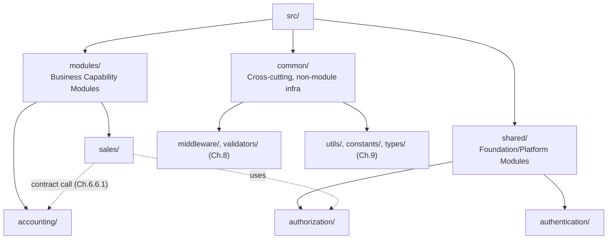

`modules/` and `shared/` are structurally identical internally (both follow Chapter 6's five-layer internal shape) — the folder split exists purely to make the Business-Capability-vs-Foundation distinction (`03_ARCHITECTURE.md` Ch.6.4) visible at a glance, not to imply a different internal architecture. `common/` is different in kind: it holds code with **no module identity at all** — middleware, validators, and utilities every module imports but that itself owns no business capability and no data (Chapters 8-9).

## 5.5 Naming Standards

| Item | Convention | Example |
|---|---|---|
| Module folder | `kebab-case`, singular business capability | `accounting`, `journal-entries` is wrong — use `accounting` |
| Module manifest | `module.manifest.ts` at module root | `modules/accounting/module.manifest.ts` |

## 5.6 Why This Approach Was Chosen

A `modules/` vs. `shared/` split at the same tree depth (rather than nesting Foundation modules inside `modules/` alongside business modules) makes Chapter 6.4's distinction physically visible without requiring a reader to open each folder and judge its category — this directly serves Chapter 1.9's goal that a new engineer can predict file location from architecture alone.

## 5.7 Alternatives Considered

**Alternative: A single flat `modules/` folder containing both Business Capability and Foundation modules with no visual split.**
Rejected — while both categories share identical internal shape (Ch.6.4), collapsing the folders loses a useful, zero-cost signal (Foundation modules are used by nearly everything; Business modules are used by few) that helps a new engineer orient quickly.

**Alternative: Nest Foundation modules under `modules/_foundation/` rather than a sibling `shared/`.**
Rejected as unnecessarily indirect — a sibling top-level folder is one less path segment and avoids the underscore-prefix convention some engineers read as "private/internal" (ambiguous here, since Foundation modules are not private, they are simply a different category).

## 5.8 Advantages

- Business capability vs. platform capability is visible at the top level without opening any folder.
- `common/` cleanly isolates truly module-less code, preventing it from being miscategorized as belonging to any specific module.

## 5.9 Disadvantages

- Engineers must learn the `modules/` vs. `shared/` vs. `common/` three-way distinction — a small extra concept versus a single flat folder, justified by Section 5.6's onboarding benefit.

## 5.10 Best Practices

- Before adding a new module folder, confirm via `03_ARCHITECTURE.md` Chapter 6.3's test whether it is a genuine module (own capability, own data) — if it does not own data or a capability, it likely belongs in `common/`, not as a new module folder.
- Never place code with no module identity inside a module folder "temporarily" — route it to `common/` immediately.

## 5.11 Common Mistakes

| Mistake | Why It's Wrong | Correct Pattern |
|---|---|---|
| Creating a "misc" or "helpers" folder inside a module for code that isn't really that module's concern | Silently expands the module's true scope, blurring Ch.6.3's boundary test | Move genuinely module-less code to `common/`; keep module-specific helpers inside that module's own layer folders |
| Placing a Foundation module (e.g., Notification) inside `modules/` instead of `shared/` | Breaks the visual Business-vs-Foundation signal this chapter exists to provide | Foundation/Platform modules always live under `shared/` |

## 5.12 Scalability

New Business Capability modules are added as new `modules/{name}` siblings; new Foundation capabilities as new `shared/{name}` siblings — both additive, matching `03_ARCHITECTURE.md` Chapter 1.4.1's "modules addable without modifying existing modules" requirement at the filesystem level exactly.

## 5.13 Future Improvements

- Revisit whether `modules/` needs domain-grouping subfolders (Chapter 1.12's flagged future concern) once module count grows large enough to make a flat listing unwieldy.

---

*Chapter 5 approved (proceeding without pause per instruction).*

---

# Chapter 6 — Module Internal Layered Structure

## 6.1 Purpose

Define the folder structure inside every module (`modules/{name}/` or `shared/{name}/`), implementing `03_ARCHITECTURE.md` Chapter 5's five layers and Chapter 10's API/versioning conventions physically.

## 6.2 Responsibilities of This Chapter

- Define the canonical per-module folder tree, identical for every module.
- Map Controllers, DTOs, and API versioning onto specific subfolders.

## 6.3 Canonical Module Folder Tree

```
modules/accounting/
├── presentation/                (Ch.5.3.1 of Architecture doc)
│   ├── controllers/
│   │   └── journal-entry.controller.ts
│   ├── dto/
│   │   ├── requests/
│   │   │   └── create-journal-entry.dto.ts
│   │   └── responses/
│   │       └── journal-entry.response.dto.ts
│   ├── middleware/               (module-specific only — shared middleware lives in common/, Ch.8)
│   └── validators/               (module-specific only — shared validators live in common/, Ch.8)
├── business/                    (Ch.5.3.2)
│   └── post-journal-entry.service.ts
├── domain/                      (Ch.5.3.3, Ch.7)
│   ├── aggregates/
│   │   └── journal-entry.aggregate.ts
│   ├── value-objects/
│   │   └── money.value-object.ts
│   ├── interfaces/
│   │   └── journal-entry-repository.interface.ts
│   └── enums/
│       └── journal-entry-status.enum.ts
├── repository/                  (Ch.5.3.4)
│   └── journal-entry.repository.ts
├── events/                      (Ch.14 of Architecture doc)
│   ├── published/
│   │   └── journal-entry-posted.event.ts
│   └── subscribers/
├── jobs/                        (Ch.13 of Architecture doc)
├── module.manifest.ts           (Ch.6.7 of Architecture doc)
├── index.ts                     (mounts the module's Express router)
└── README.md                    (`12_MODULE_TEMPLATE.md` requirement)
```

## 6.4 API Versioning Structure

Per `03_ARCHITECTURE.md` Chapter 10, Decision 10.5.1's URL-path versioning, a controller's route prefix — not its folder location — carries the version:

```
presentation/controllers/
├── v1/
│   └── journal-entry.controller.ts    (Express Router mounted at /v1/accounting/journal-entries)
└── v2/
    └── journal-entry.controller.ts    (only created when Ch.26's breaking-change process requires it)
```

A `v2/` sibling folder is created only at the point a genuine breaking change (Chapter 26.3's test) is shipped — controllers are never pre-emptively versioned "just in case."

## 6.5 Naming Standards

| Item | Convention | Example |
|---|---|---|
| Controller | `{resource}.controller.ts` | `journal-entry.controller.ts` |
| Request DTO | `{action}-{resource}.dto.ts` | `create-journal-entry.dto.ts` |
| Response DTO | `{resource}.response.dto.ts` | `journal-entry.response.dto.ts` |
| Business service | `{use-case}.service.ts`, verb-first | `post-journal-entry.service.ts` |
| Aggregate | `{name}.aggregate.ts` | `journal-entry.aggregate.ts` |
| Domain-owned repository interface | `{name}-repository.interface.ts` | `journal-entry-repository.interface.ts` |
| Repository implementation | `{name}.repository.ts` | `journal-entry.repository.ts` |

## 6.6 Why This Approach Was Chosen

Naming Business-layer services by use case (`post-journal-entry.service.ts`) rather than by generic CRUD role (`journal-entry.service.ts` containing every operation) directly reflects `03_ARCHITECTURE.md` Chapter 5.3.2's framing of the Business layer as a use-case orchestrator, not a god-service — it also keeps each file's authorization check (Ch.9.8) scoped to exactly one use case, making Chapter 9, Decision 9.9.3's "independently unit-testable authorization" concretely easy: one file, one use case, one authorization test. Separating request and response DTOs into their own subfolders reflects Chapter 10, Decision 10.5.2's requirement that public DTOs are distinct types, never Domain objects reused — the folder split makes that distinction physically obvious, not just a code-review-time discipline.

## 6.7 Alternatives Considered

**Alternative: One large `{resource}.service.ts` per Aggregate containing every use case as a method (a "fat service" pattern).**
Rejected — this is the anemic-service-with-many-responsibilities pattern that makes per-use-case authorization testing (Ch.9, Decision 9.9.3) and per-use-case code ownership (Ch.20 of this handbook) harder to isolate; a use-case-per-file convention keeps each Business-layer unit small and independently reviewable.

**Alternative: Combine request and response DTOs into a single `dto/` folder with no requests/responses split.**
Rejected — requests and responses have different validation rules (Ch.5.3.1) and different consumers (a request DTO is validated input; a response DTO is a Chapter 10, Decision 10.5.2-mandated distinct output type) — the split keeps that distinction visible without reading each file's decorators.

## 6.8 Advantages

- A module's entire five-layer shape is visually identical to every other module's — an engineer who has navigated one module can navigate all of them.
- Use-case-per-file Business layer keeps authorization and transaction boundaries (Ch.5, Decision 5.7.3) scoped and reviewable per file.

## 6.9 Disadvantages

- More files for simple CRUD-heavy modules than a single fat-service pattern would produce — accepted per Chapter 7.4's per-entity classification test already deciding which entities need this rigor.

## 6.10 Best Practices

- Every module's `README.md` documents its owned capability and manifest summary, per `12_MODULE_TEMPLATE.md`, kept current with the module's actual contract (Ch.6.7 of Architecture doc).
- A new controller version folder (`v2/`) is created only alongside an actual breaking change, never speculatively.

## 6.11 Common Mistakes

| Mistake | Why It's Wrong | Correct Pattern |
|---|---|---|
| One `journal-entry.service.ts` handling create, post, reverse, and query all in one file | Blurs use-case boundaries and per-use-case authorization testing | Split into `post-journal-entry.service.ts`, `reverse-journal-entry.service.ts`, etc. |
| Returning a Domain Aggregate directly from a controller | Violates Ch.10, Decision 10.5.2 — couples public API to internal Domain shape | Map to a dedicated `.response.dto.ts` in the Presentation layer |
| Creating `v2/` folders for every module "to be future-proof" | Speculative versioning nobody needs yet, adds noise | Version only at the point of an actual breaking change (Ch.26) |

## 6.12 Scalability

The identical five-layer shape per module means tooling (linting, scaffolding, code generation) written once works for every module without per-module customization — a direct filesystem expression of Chapter 6.15 of the Architecture doc's team-scalability argument.

## 6.13 Future Improvements

- Once several modules exist, extract this canonical tree into a code-generation template (`nx generate module`-style) so new modules are scaffolded correctly from their first commit, per Chapter 1.9's already-stated future consideration.

---

*Chapter 6 approved (proceeding without pause per instruction).*

---

# Chapter 7 — Domain Layer Organization

## 7.1 Purpose

Define the internal structure of every module's `domain/` folder, implementing `03_ARCHITECTURE.md` Chapter 7's DDD vocabulary (Entities, Value Objects, Aggregates, Invariants) physically.

## 7.2 Responsibilities of This Chapter

- Define subfolder structure for Aggregates, Value Objects, Domain interfaces, and Enums.
- Define where Chapter 7.4's simple-CRUD-classified entities live, distinct from rich Aggregates.

## 7.3 Folder Tree

```
domain/
├── aggregates/
│   └── journal-entry.aggregate.ts       (Aggregate Root + child entities in one file, Ch.7.3.3)
├── entities/                            (simple, CRUD-classified entities, Ch.7.4)
│   └── notification-template.entity.ts
├── value-objects/
│   └── money.value-object.ts
├── interfaces/                          (Domain-owned Repository interfaces, Ch.7.3.3)
│   └── journal-entry-repository.interface.ts
├── enums/
│   └── journal-entry-status.enum.ts
└── events/                              (Domain Event payload shapes published by this module, Ch.14)
    └── journal-entry-posted.event.ts
```

## 7.4 Aggregate Boundary Convention

Per `03_ARCHITECTURE.md` Chapter 7.3.3, a Journal Entry and its Lines are one Aggregate — this is reflected by keeping the Aggregate Root and its child entities in a **single file**, not split across files, so the file itself communicates the consistency boundary Chapter 7.9 warns must not be drawn too small.

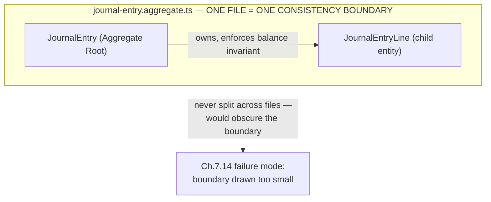

## 7.5 Naming Standards

| Item | Convention | Example |
|---|---|---|
| Aggregate file | `{root-name}.aggregate.ts` | `journal-entry.aggregate.ts` |
| Simple entity file | `{name}.entity.ts` | `notification-template.entity.ts` |
| Value object file | `{name}.value-object.ts` | `money.value-object.ts` |
| Domain interface | `{name}-repository.interface.ts` | `journal-entry-repository.interface.ts` |

## 7.6 Why This Approach Was Chosen

Separating `aggregates/` from `entities/` physically encodes `03_ARCHITECTURE.md` Chapter 7.4's classification test at the filesystem level — a reviewer opening a module's `domain/` folder immediately sees which concepts were judged to need rich invariant enforcement and which were judged simple, without reading each file's implementation. This turns Chapter 7.4's classification decision into a visible, auditable artifact rather than an implicit judgment buried in code.

## 7.7 Alternatives Considered

**Alternative: A single flat `domain/models/` folder for both Aggregates and simple entities.**
Rejected — this hides Chapter 7.4's classification decision, the exact opposite of Section 7.6's goal; a reviewer would have to open every file to know which concepts are Aggregates.

**Alternative: One file per Entity within an Aggregate (e.g., `journal-entry.aggregate.ts` and `journal-entry-line.entity.ts` as separate files).**
Rejected, per Section 7.4 — splitting a single consistency boundary across files makes it easy to accidentally treat a child entity as independently loadable/saveable, which `03_ARCHITECTURE.md` Chapter 7.14 names as a real failure mode (Aggregate boundary drawn too small).

## 7.8 Advantages

- Aggregate boundaries are visually enforced by file structure, not just code review discipline.
- The `entities/` vs. `aggregates/` split gives a fast, reliable audit signal for Chapter 7.4 compliance.

## 7.9 Disadvantages

- Aggregate files can grow large for Aggregates with several child entity types — accepted, since Chapter 7.9 of the Architecture doc already mandates keeping Aggregates small, which bounds this file's growth by the same architectural discipline.

## 7.10 Best Practices

- When designing a new Domain concept, decide `aggregates/` vs. `entities/` using Chapter 7.4's explicit test before creating the file — never default to whichever is faster to type.
- Domain Event payload shapes (Ch.14) live in `domain/events/`, since their shape is a Domain-owned decision even though their transport (Chapter 6's `events/publishers`) is a module-boundary concern handled elsewhere.

## 7.11 Common Mistakes

| Mistake | Why It's Wrong | Correct Pattern |
|---|---|---|
| Placing a rich Aggregate in `entities/` because it was built before this classification discipline existed | Misrepresents its actual invariant-bearing status to any future reader | Reclassify into `aggregates/` when discovered, per Ch.7.4's test |
| Importing an Express.js or Prisma type inside any `domain/` file | Violates Ch.5.3.3/Ch.5.7.1's framework-isolation rule | Domain files never import framework or ORM types, full stop |

## 7.12 Scalability

The `aggregates/` vs. `entities/` split scales identically regardless of module size — a module with one Aggregate and a module with ten follow the same folder shape, keeping Chapter 7.13's team-autonomy argument true at the filesystem level.

## 7.13 Future Improvements

- Evaluate splitting very large Aggregate files by concern (e.g., invariant-checking methods vs. mutation methods) once real Aggregates grow large enough to warrant it — deferred until evidence, not decided speculatively.

---

*Chapter 7 approved (proceeding without pause per instruction).*

---

# Chapter 8 — Cross-Cutting Building Blocks

## 8.1 Purpose

Define where Middleware and Validators live — the Express.js middleware and validation building blocks that are shared across modules versus specific to one.

## 8.2 Responsibilities of This Chapter

- Define the shared-vs-module-local placement rule for each of the two building-block categories.
- Prevent duplication of cross-cutting infrastructure across modules.

## 8.3 Folder Tree — `common/`

```
common/
├── middleware/
│   ├── current-tenant.middleware.ts      (extracts tenant context onto req, Ch.4.5.1/9.4)
│   ├── jwt-auth.middleware.ts            (Ch.9.3)
│   ├── permission.middleware.ts          (fast-fail only — Ch.9.8's Presentation Guard)
│   ├── error-handler.middleware.ts       (standard error shape, Ch.10.3)
│   ├── correlation-id.middleware.ts      (Ch.22 of Architecture doc)
│   └── logging.middleware.ts
├── validators/
│   └── request.validator.ts              (Zod schema-based request validation)
```

## 8.4 Shared vs. Module-Local Placement Rule

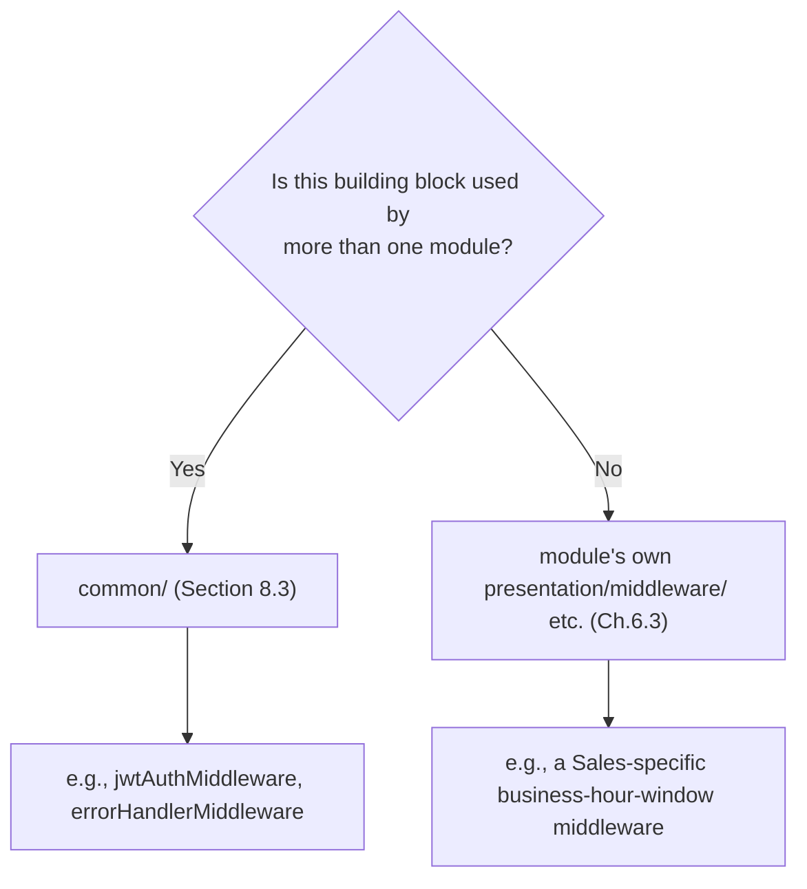

## 8.5 Naming Standards

| Item | Convention | Example |
|---|---|---|
| Middleware | `{purpose}.middleware.ts` | `jwt-auth.middleware.ts` |
| Validator | `{purpose}.validator.ts` | `create-journal-entry.validator.ts` |

## 8.6 Why This Approach Was Chosen

A single shared `common/` location for cross-module infrastructure prevents the exact duplication `03_ARCHITECTURE.md` Chapter 4.5.2's "shared Repository infrastructure" and Chapter 9.8's authorization discipline depend on: if every module reimplemented its own JWT middleware, a fix to token verification would need to be applied N times, and inevitably drift. Section 8.4's explicit shared-vs-local test prevents the opposite failure — dumping genuinely module-specific logic into `common/`, which would violate Chapter 6.3's module-ownership boundary by giving one module's specific business rule undue platform-wide visibility and coupling.

## 8.7 Alternatives Considered

**Alternative: Every module implements and owns its own middleware/validators independently, even for shared concerns like JWT verification.**
Rejected — directly recreates the duplication risk Section 8.6 names, and would mean a security fix to token verification (`03_ARCHITECTURE.md` Ch.9.13) requires touching every module instead of one shared file.

**Alternative: Put all cross-cutting building blocks inside the Authentication/Authorization Foundation modules (`shared/authentication/`) rather than a separate `common/`.**
Rejected — middleware like `errorHandlerMiddleware` or `loggingMiddleware` have nothing to do with authentication specifically; nesting them there would misattribute ownership and make `shared/authentication/` a dumping ground unrelated to its actual capability.

## 8.8 Advantages

- Single source of truth for every cross-cutting request-handling concern.
- Section 8.4's test gives a fast, repeatable answer to "where does this file go" for any new building block.

## 8.9 Disadvantages

- `common/` can become a dumping ground if Section 8.4's test is not applied rigorously — mitigated by Section 8.10's review discipline.

## 8.10 Best Practices

- Apply Section 8.4's shared-vs-local test explicitly at code review time for every new middleware/validator.
- `common/` building blocks are reviewed with elevated scrutiny (they affect every module) — treat changes here like Chapter 20 of the Architecture doc's security-review-gated changes.

## 8.11 Common Mistakes

| Mistake | Why It's Wrong | Correct Pattern |
|---|---|---|
| Copy-pasting a middleware from one module into another instead of sharing it | Creates drift risk the moment one copy is fixed and the other isn't | Move to `common/middleware/` once a second module needs it |
| Adding a module-specific business rule as a `common/` middleware "because it's middleware" | Misattributes a module-owned business rule to shared infrastructure | Keep it in the owning module's `presentation/middleware/` |

## 8.12 Scalability

`common/` grows slowly and deliberately (only genuinely cross-cutting concerns), while module count grows freely — this asymmetry is intentional and is what keeps `common/` from becoming an unmanageable, undifferentiated pile as the platform scales per `03_ARCHITECTURE.md` Chapter 1.4.1.

## 8.13 Future Improvements

- Once tooling (Ch.5.7.1 of the Architecture doc) matures, consider a lint rule flagging near-duplicate middleware across module-local folders as a signal they should be promoted to `common/`.

---

*Chapter 8 approved (proceeding without pause per instruction).*

---

# Chapter 9 — Shared Backend Utilities

## 9.1 Purpose

Define where Utilities, Constants, Types, Interfaces, Enums, and Validators that are genuinely shared across modules live, distinct from module-local equivalents already covered in Chapter 7.

## 9.2 Responsibilities of This Chapter

- Define `common/`'s utility-code subfolders.
- Distinguish platform-wide shared types from module-owned Domain types (Chapter 7).

## 9.3 Folder Tree

```
common/
├── utils/
│   └── date-range.util.ts
├── constants/
│   └── pagination.constants.ts          (Ch.10.3's pagination defaults)
├── types/
│   └── paginated-result.type.ts
├── validators/
│   └── is-tenant-scoped-id.validator.ts
```

## 9.4 Shared Types vs. Module Domain Types

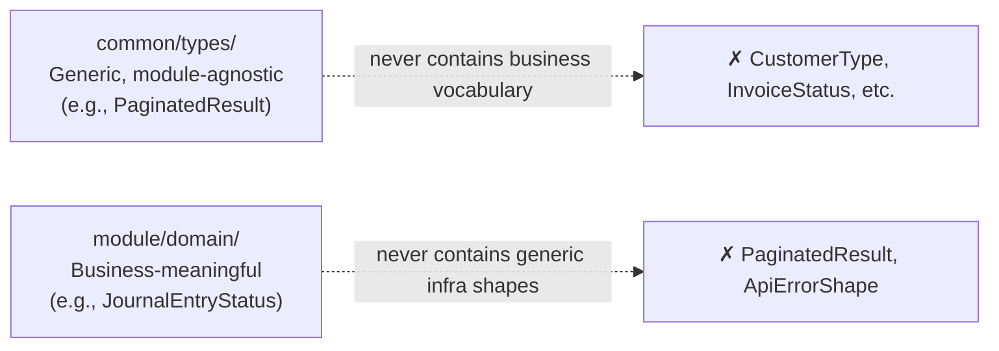

## 9.5 Naming Standards

| Item | Convention | Example |
|---|---|---|
| Utility function file | `{purpose}.util.ts` | `date-range.util.ts` |
| Constants file | `{domain}.constants.ts` | `pagination.constants.ts` |
| Shared type file | `{name}.type.ts` | `paginated-result.type.ts` |
| Custom validator | `{rule}.validator.ts` | `is-tenant-scoped-id.validator.ts` |

## 9.6 Why This Approach Was Chosen

Section 9.4's hard line — shared types never carry business vocabulary, Domain types never carry generic infrastructure shapes — is the filesystem enforcement of `03_ARCHITECTURE.md` Chapter 7.3.5's Ubiquitous Language principle: business vocabulary belongs inside the Bounded Context that owns it (Chapter 7.5), never genericized into shared infrastructure where it would imply a platform-wide meaning a specific module's concept does not actually have.

## 9.7 Alternatives Considered

**Alternative: A single `common/types/` folder for both generic infrastructure types and shared business concepts (e.g., a shared `Customer` type).**
Rejected — this directly recreates the shared-Customer-entity anti-pattern `03_ARCHITECTURE.md` Chapter 6.10 and Chapter 7.5 already rejected; a "shared" business type in `common/` is exactly the kind of accidental Bounded Context violation those chapters warn against.

## 9.8 Advantages

- Section 9.4's rule is a fast, mechanical litmus test for where any new type belongs.
- `common/utils/` centralizes genuinely reusable helpers (date math, formatting) without becoming a business-logic dumping ground.

## 9.9 Disadvantages

- Requires discipline to keep `common/types/` free of business vocabulary as it accumulates entries over time — mitigated by Section 9.10's review practice.

## 9.10 Best Practices

- Any proposed addition to `common/` is checked against Section 9.4's test at review time: does this type/util/constant have any business meaning specific to one module? If yes, it belongs in that module's `domain/`, not here.

## 9.11 Common Mistakes

| Mistake | Why It's Wrong | Correct Pattern |
|---|---|---|
| Adding an `InvoiceStatus` enum to `common/types/` because "other modules might need it someday" | Leaks Accounting/Sales business vocabulary into generic shared infrastructure | Keep it in the owning module's `domain/enums/`; other modules reference it via that module's published contract (Ch.6.6.1) |
| Duplicating the same date-formatting utility in three modules | Drift risk when the format needs to change | Extract to `common/utils/` once a second module needs it |

## 9.12 Scalability

`common/utils` and `common/types` grow slowly relative to module count, by design (Section 9.9) — this keeps shared infrastructure lean as the platform scales to fifteen-plus modules.

## 9.13 Future Improvements

- Periodically audit `common/types/` for accidental business-vocabulary drift as new engineers unfamiliar with Section 9.4's rule join the project.

---

*Chapter 9 approved (proceeding without pause per instruction).*

---

# Chapter 10 — Queue, Event & Logging Folders

## 10.1 Purpose

Define where BullMQ job definitions, Domain Event publishers/subscribers, and logging configuration live, implementing `03_ARCHITECTURE.md` Chapters 13, 14, and 22 physically.

## 10.2 Responsibilities of This Chapter

- Define per-module `jobs/` and `events/` folder structure.
- Define the platform-wide logging configuration location.

## 10.3 Folder Tree

```
modules/sales/
├── jobs/                                (Ch.13 of Architecture doc)
│   └── generate-recurring-invoice.job.ts
├── events/
│   ├── published/                       (Ch.14.3 — this module's own facts)
│   │   └── invoice-posted.event.ts
│   └── subscribers/                     (Ch.14.4 — reactions to OTHER modules' events)
│       └── on-payment-received.subscriber.ts

common/
└── logging/                             (Ch.22 of Architecture doc)
    ├── logger.config.ts
    └── correlation-context.ts
```

## 10.4 Published vs. Subscribed Events

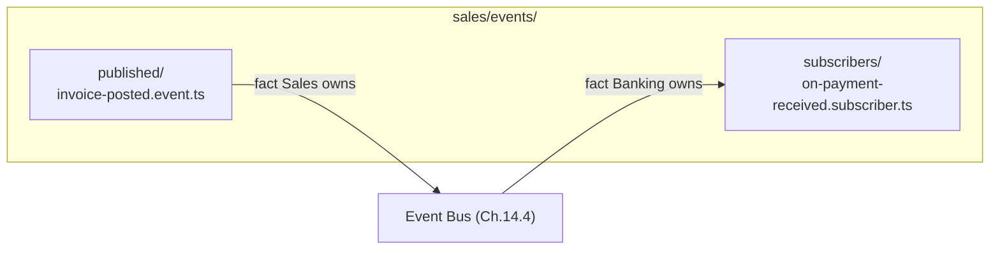

## 10.5 Naming Standards

| Item | Convention | Example |
|---|---|---|
| Job | `{action}.job.ts`, verb-first | `generate-recurring-invoice.job.ts` |
| Published event | `{fact}.event.ts`, past-tense fact | `invoice-posted.event.ts` |
| Subscriber | `on-{fact}.subscriber.ts` | `on-payment-received.subscriber.ts` |

## 10.6 Why This Approach Was Chosen

Splitting `events/published/` from `events/subscribers/` within the same module makes `03_ARCHITECTURE.md` Chapter 6.13's security property (a module's entire data exposure surface is enumerable from its manifest) doubly visible at the filesystem level — `published/` is literally everything this module tells the world, `subscribers/` is everything it reacts to, and the two folders together are a complete, at-a-glance map of the module's event footprint without reading the manifest file at all.

## 10.7 Alternatives Considered

**Alternative: A single `events/` folder with no published/subscribers split.**
Rejected — collapses a distinction (what this module emits vs. what it reacts to) that is architecturally meaningful per Chapter 14.3 and useful for a reviewer auditing coupling; the split costs nothing and provides a real, free signal.

## 10.8 Advantages

- A module's full event footprint is visible from two folders, without cross-referencing the manifest.
- Job files are isolated from event files, keeping Chapter 13's "job vs. event" distinction (Ch.13.7 of Architecture doc) visible in the folder tree too.

## 10.9 Disadvantages

- None material — this is a low-cost, purely organizational convention.

## 10.10 Best Practices

- Every file in `events/published/` must also appear in the module's manifest (`03_ARCHITECTURE.md` Ch.6.7) — a published event with no manifest entry is a documentation gap, caught at manifest review.
- Subscriber file names always start with `on-`, so a directory listing alone reads as a sentence: "on payment received, on invoice posted."

## 10.11 Common Mistakes

| Mistake | Why It's Wrong | Correct Pattern |
|---|---|---|
| Placing a subscriber file in `published/` or vice versa | Breaks the at-a-glance event-footprint signal | Always split correctly per direction of data flow |
| A job that is actually a Domain Event reaction, filed only under `jobs/` with no corresponding `subscribers/` entry | Obscures that this job originates from another module's event (Ch.13.7) | If triggered by an event, file it under `events/subscribers/`; if scheduled, file it under `jobs/` |

## 10.12 Scalability

Per-module `jobs/`/`events/` folders scale identically regardless of a module's event volume — a module with one published event and a module with twenty follow the same two-folder shape.

## 10.13 Future Improvements

- Once `03_ARCHITECTURE.md` Chapter 14.16's event schema registry tooling exists, consider auto-generating this chapter's manifest cross-check (Section 10.10) rather than relying on manual review.

---

*Chapter 10 approved (proceeding without pause per instruction).*

---

# PART IV — DATABASE

# Chapter 11 — Database, Prisma, Migrations & Seeds

## 11.1 Purpose

Define the `database/` folder structure implementing `03_ARCHITECTURE.md` Chapter 8's per-module migration strategy and Chapter 8.3's dual-key schema conventions.

## 11.2 Responsibilities of This Chapter

- Define Prisma schema organization across modules.
- Define per-module migration folder structure (Ch.8.7).
- Define seed data organization, distinguishing platform-owned seed data from tenant-scoped test fixtures.

## 11.3 Folder Tree

```
apps/api/src/database/
├── schema/
│   ├── base.prisma                      (standard columns, Ch.8.4 — shared model fragment)
│   ├── accounting.prisma                (per-module schema file, Ch.8.7)
│   ├── inventory.prisma
│   └── sales.prisma
├── migrations/
│   ├── accounting/                      (Ch.8.7 — module owns its own migration history)
│   │   └── 20260115_create_journal_entries/
│   ├── inventory/
│   └── sales/
└── seeds/
    ├── platform/                        (Ch.4.8 platform-owned reference data)
    │   └── standard-chart-of-accounts.seed.ts
    └── development/                     (synthetic multi-tenant data, Ch.24.5)
        └── synthetic-tenants.seed.ts
```

## 11.4 Per-Module Migration Ownership

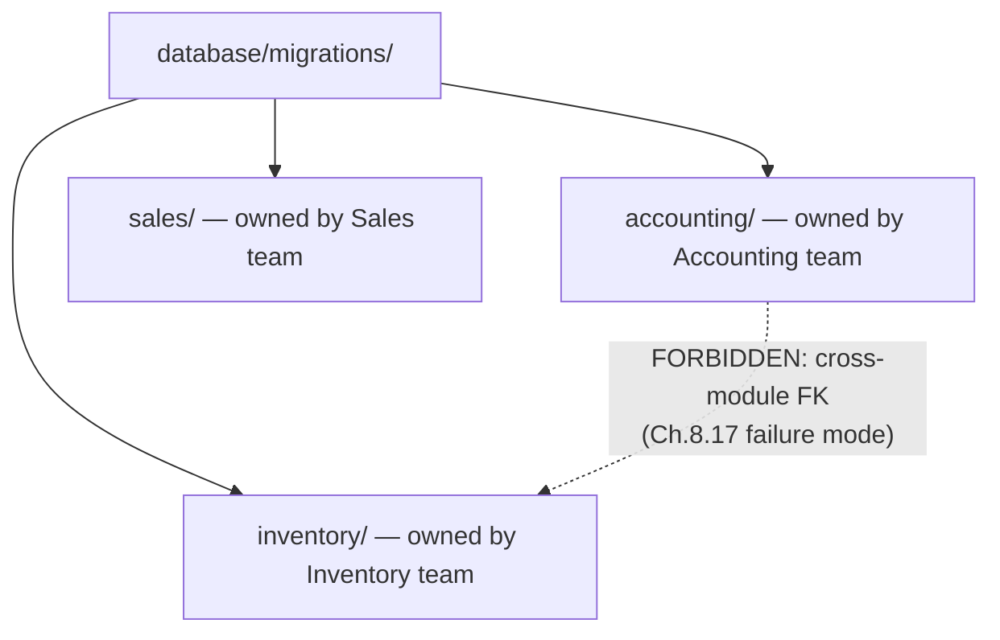

## 11.5 Naming Standards

| Item | Convention | Example |
|---|---|---|
| Per-module schema file | `{module}.prisma` | `accounting.prisma` |
| Migration folder | `{timestamp}_{description}` | `20260115_create_journal_entries` |
| Seed file | `{purpose}.seed.ts` | `standard-chart-of-accounts.seed.ts` |

## 11.6 Why This Approach Was Chosen

Per-module Prisma schema files and per-module migration folders (Section 11.3) are the direct filesystem implementation of `03_ARCHITECTURE.md` Chapter 8.7's decision — a module team adds a column to their own `.prisma` file and their own migration folder without touching any other module's files, preventing the exact schema-level entanglement Chapter 8.17 names as a failure mode. Splitting seed data into `platform/` versus `development/` mirrors Chapter 4.8's platform-owned-vs-tenant-owned data classification: platform seeds (a standard Chart of Accounts template) ship to every environment including production, while development seeds (synthetic multi-tenant fixtures per Chapter 24.5) exist only to make staging/dev realistically multi-tenant and must never run against production.

## 11.7 Alternatives Considered

**Alternative: A single monolithic `schema.prisma` file for the entire application.**
Rejected — this is schema-level layer-first organization, the database-schema equivalent of Chapter 1.4's rejected layer-first code structure; every module team would edit the same file, creating exactly the merge-conflict and coordination bottleneck Chapter 8.7 exists to prevent. (Prisma's multi-file schema support, or an equivalent build-time concatenation step, is assumed as the mechanism that composes per-module files into the single schema Prisma ultimately requires at build time.)

**Alternative: A single `seeds/` folder with no platform/development split.**
Rejected — without the split, it becomes easy to accidentally run synthetic multi-tenant test fixtures against a production environment, a serious risk `03_ARCHITECTURE.md` Chapter 24.5 explicitly warns against.

## 11.8 Advantages

- Module teams never conflict on the same schema or migration file.
- Platform-vs-development seed separation makes "safe to run in production" a folder-level, not file-content-level, judgment call.

## 11.9 Disadvantages

- Requires a build step to compose per-module `.prisma` files into Prisma's single required schema input — a minor tooling cost, accepted for the team-autonomy benefit.

## 11.10 Best Practices

- A module's migration folder is never touched by another module's PR — a migration affecting two modules' tables is itself a sign of a Chapter 6.5 boundary violation, to be resolved architecturally, not by editing another module's migration folder.
- Development seed data is reviewed periodically for realism (Ch.24.10) — it must remain structurally multi-tenant, not decay into trivial single-tenant fixtures.

## 11.11 Common Mistakes

| Mistake | Why It's Wrong | Correct Pattern |
|---|---|---|
| A migration in `accounting/` that adds a foreign key to a `sales` table | Schema-level cross-module coupling, violates Ch.8.17 | Any legitimate cross-module data need goes through Ch.6.6 contracts/events at the application layer, never a DB-level FK |
| Running `development/` seeds against a staging or production database | Risk of synthetic/test data contaminating a real environment | `development/` seeds are gated to local/CI environments only, never staging or production |

## 11.12 Scalability

Per-module schema and migration ownership scales identically to Chapter 5's module-folder scalability — a new module adds its own `{module}.prisma` and `migrations/{module}/` without touching any existing module's files.

## 11.13 Future Improvements

- Revisit `03_ARCHITECTURE.md` Chapter 8.18's open item (database-level tenant isolation backstop) once its concrete mechanism is finalized, and add the corresponding folder/file convention here (e.g., a `database/policies/` folder for row-level security definitions) at that time.

---

*Chapter 11 approved (proceeding without pause per instruction).*

---

# PART V — FRONTEND STRUCTURE

# Chapter 12 — Frontend Root & Module Organization

## 12.1 Purpose

Expand `03_ARCHITECTURE.md` Chapter 11.3's frontend folder tree into full detail, mirroring backend module organization on the Next.js side.

## 12.2 Responsibilities of This Chapter

- Define `apps/web/src/` top-level structure.
- Define per-module frontend folder shape, mirroring Chapter 6 of this handbook.

## 12.3 Folder Tree

```
apps/web/src/
├── app/                          (Next.js routing — mirrors API resources, Ch.11.3 of Architecture doc)
│   ├── (dashboard)/
│   │   ├── accounting/
│   │   │   └── journal-entries/
│   │   │       └── page.tsx
│   │   └── sales/
│   └── layout.tsx
├── modules/                      (mirrors backend modules/, Ch.11.3.1 of Architecture doc)
│   ├── accounting/
│   │   ├── screens/
│   │   ├── components/           (module-local only, Ch.11.7.2)
│   │   └── hooks/                (module-local only)
│   └── sales/
├── components/                   (shared, cross-module — Ch.11.3)
├── services/                     (API client layer, Ch.11.7.1)
├── hooks/                        (shared)
└── layouts/                      (ERP shell, Ch.11.6)
```

## 12.4 `app/` vs. `modules/` — Routing vs. Implementation

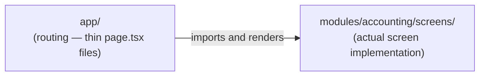

A `page.tsx` under `app/` is a thin routing shim only — it imports and renders the actual screen component from `modules/{name}/screens/`. This keeps Next.js's file-based routing requirement (which dictates `app/`'s shape) from forcing module implementation code to live in a routing-driven location rather than the module-mirrored location Chapter 11.3 of the Architecture doc establishes.

## 12.5 Naming Standards

| Item | Convention | Example |
|---|---|---|
| Route file | `page.tsx` (Next.js convention, not customizable) | `app/accounting/journal-entries/page.tsx` |
| Screen component | `PascalCase.tsx` | `JournalEntryListScreen.tsx` |
| Module-local component | `PascalCase.tsx` | `JournalEntryRow.tsx` |
| Module-local hook | `useCamelCase.ts` | `useJournalEntries.ts` |

## 12.6 Why This Approach Was Chosen

Section 12.4's thin-routing-shim pattern resolves an apparent tension: Next.js's `app/` router requires file-based routing that reflects URL structure, while `03_ARCHITECTURE.md` Chapter 11.3 requires module-mirrored organization for team autonomy. Keeping `app/` as thin, import-only shims satisfies both simultaneously — URL structure stays predictable (Chapter 10.3's resource-aligned API), and actual screen logic still lives in the module-mirrored `modules/` tree where Decision 11.7.2's import-boundary rule can be enforced.

## 12.7 Alternatives Considered

**Alternative: Implement full screen logic directly inside `app/` route files, with no separate `modules/` tree on the frontend.**
Rejected — this would force frontend module boundaries to follow Next.js's URL-driven routing shape rather than the business-capability shape Chapter 11.3 mandates, and would make Decision 11.7.2's cross-module-import prevention unenforceable, since routing folders don't naturally align with module ownership boundaries.

## 12.8 Advantages

- URL structure (via `app/`) and module ownership (via `modules/`) can each be organized for their own natural shape without compromising the other.
- Frontend modules are import-boundary-lintable exactly like backend modules (Ch.11.7.2 of Architecture doc).

## 12.9 Disadvantages

- One extra level of indirection (a thin routing file plus the real component) for every screen — a small, consistent cost accepted for the boundary-enforcement benefit.

## 12.10 Best Practices

- `page.tsx` files never contain business logic or data-fetching hooks directly — they import from `modules/{name}/screens/` only.
- A module-local `components/` or `hooks/` folder is never imported by another module's screens (Decision 11.7.2) — promote to the shared `components/`/`hooks/` at the tree root if a second module needs it.

## 12.11 Common Mistakes

| Mistake | Why It's Wrong | Correct Pattern |
|---|---|---|
| Writing a data-fetching hook directly inside `app/accounting/journal-entries/page.tsx` | Ties business logic to Next.js's routing-driven file location | Move the hook to `modules/accounting/hooks/`, import it into the thin `page.tsx` |
| Importing a component from `modules/sales/components/` inside `modules/inventory/` | Violates Decision 11.7.2's frontend module-import boundary | Promote the component to the shared `components/` folder |

## 12.12 Scalability

New frontend modules are added as new `modules/{name}` siblings plus corresponding `app/{name}` routing folders — additive on both trees, mirroring the backend's Chapter 5 scalability property.

## 12.13 Future Improvements

- Revisit `03_ARCHITECTURE.md` Chapter 11.16's flagged real-time update mechanism and its folder-level implications (e.g., a `modules/{name}/realtime/` subfolder) once a concrete need is demonstrated.

---

*Chapter 12 approved (proceeding without pause per instruction).*

---

# Chapter 13 — Shared Frontend Layer

## 13.1 Purpose

Define the internal structure of the shared `components/`, `services/`, `hooks/`, and `layouts/` folders at the frontend tree root.

## 13.2 Responsibilities of This Chapter

- Define subfolder organization for each shared frontend layer.
- Define the API client (`services/`) internal structure implementing Decision 11.7.1.

## 13.3 Folder Tree

```
apps/web/src/
├── components/
│   ├── ui/                       (primitive: Button, Input, Modal)
│   └── data/                     (data-dense: Table, VirtualizedList — Ch.11.13)
├── services/
│   ├── api-client.ts             (base Axios instance, auth header injection, Ch.11.7.1)
│   ├── accounting.service.ts     (per-module API wrapper)
│   └── sales.service.ts
├── hooks/
│   ├── use-current-tenant.ts
│   └── use-permissions.ts
└── layouts/
    ├── erp-shell.layout.tsx
    └── navigation.config.ts
```

## 13.4 Naming Standards

| Item | Convention | Example |
|---|---|---|
| Shared UI component | `PascalCase.tsx` | `Button.tsx` |
| Per-module API service wrapper | `{module}.service.ts` | `accounting.service.ts` |
| Shared hook | `useCamelCase.ts` | `use-current-tenant.ts` |

## 13.5 Why This Approach Was Chosen

A per-module `{module}.service.ts` file inside the shared `services/` folder (rather than one monolithic API client file) keeps Decision 11.7.1's "single path to the backend" rule intact while still letting each module's API surface be reviewed and evolved independently — a change to Accounting's API wrapper never touches Sales's file. The `ui/` vs. `data/` split inside `components/` reflects Chapter 11.6's finding that data-dense components (tables) are architecturally first-class ERP primitives, not a generic UI afterthought — keeping them in their own subfolder signals they carry additional requirements (virtualization, Ch.11.13) that simple primitives do not.

## 13.6 Alternatives Considered

**Alternative: One single `api-client.ts` file containing every module's API calls.**
Rejected — this would become an ever-growing, contested file every module team edits, recreating the merge-conflict problem Chapter 11's module-mirroring exists to avoid; per-module service wrapper files solve this while still funneling through the same base `api-client.ts` instance for shared concerns (auth headers, error handling).

## 13.7 Advantages

- Per-module service files scale cleanly with module count, never becoming a shared bottleneck file.
- The `ui/`/`data/` component split signals which components carry extra performance requirements at a glance.

## 13.8 Disadvantages

- Slight duplication of API-call boilerplate across per-module service files — mitigated by all of them wrapping the same shared `api-client.ts` base instance.

## 13.9 Best Practices

- New shared UI primitives are added to `components/ui/`; new data-dense components to `components/data/` — never mixed.
- Every per-module service file wraps `api-client.ts`, never constructs its own Axios instance.

## 13.10 Common Mistakes

| Mistake | Why It's Wrong | Correct Pattern |
|---|---|---|
| A module screen calling Axios directly instead of via its service file | Bypasses Decision 11.7.1's centralized API-calling convention | Always call through `services/{module}.service.ts` |
| Adding a data-dense table component to `components/ui/` | Misses the virtualization/performance requirement flag `data/` signals | Data-dense components always live in `components/data/` |

## 13.11 Scalability

Per-module service files and the `ui`/`data` component split both scale additively with module and component-library growth, without requiring restructuring of existing files.

## 13.12 Future Improvements

- Revisit whether `services/` needs generated API clients (from the Swagger/OpenAPI spec, `03_ARCHITECTURE.md` Ch.10.3) once the API surface is large enough that hand-written wrappers become a maintenance burden.

---

*Chapter 13 approved (proceeding without pause per instruction).*

---

# PART VI — SHARED CODE & ASSETS

# Chapter 14 — Shared Packages & Common Libraries

## 14.1 Purpose

Define the `packages/` workspace tier (Chapter 2.3) — code genuinely shared between the backend and frontend apps, distinct from `common/` (backend-only, Chapter 8-9) and frontend `components/`/`hooks/` (frontend-only, Chapter 13).

## 14.2 Responsibilities of This Chapter

- Define which packages exist and what each owns.
- Define the boundary between a shared package and an app-local `common/`/`components/` folder.

## 14.3 Folder Tree

```
packages/
├── shared-types/                 (DTOs/contracts shared between apps/api and apps/web)
│   └── src/
│       └── accounting/
│           └── journal-entry.types.ts
├── shared-utils/                 (framework-agnostic utilities usable by both apps)
│   └── src/
│       └── money.util.ts
└── ui/                           (design-system primitives, if shared beyond apps/web — Section 14.7)
```

## 14.4 What Belongs in a Shared Package vs. an App-Local Folder

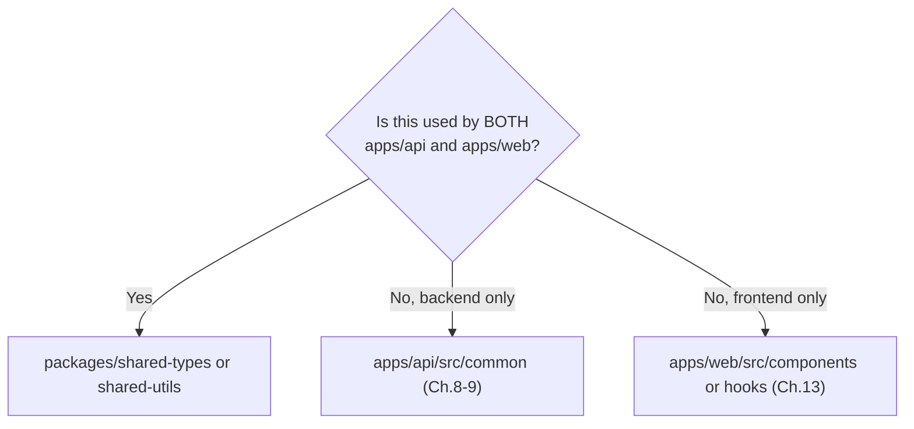

## 14.5 Naming Standards

| Item | Convention | Example |
|---|---|---|
| Package name | `@ledgerone/{name}` | `@ledgerone/shared-types` |
| Shared type file | `{module}/{concept}.types.ts` | `accounting/journal-entry.types.ts` |

## 14.6 Why This Approach Was Chosen

`shared-types` is what makes Chapter 10, Decision 10.5.2's "distinct DTO types, never reused Domain objects" rule practically maintainable across a monorepo: the frontend's `services/accounting.service.ts` (Chapter 13.3) and the backend's `presentation/dto/` (Chapter 6.3) both import the same generated or hand-maintained type from `shared-types`, guaranteeing they cannot silently drift apart — without a shared package, the two would need to be manually kept in sync by convention alone, exactly the kind of manual-discipline risk this entire handbook's parent architecture document consistently rejects.

## 14.7 Alternatives Considered

**Alternative: Duplicate DTO type definitions independently in both `apps/api` and `apps/web`.**
Rejected — this is the manual-sync risk Section 14.6 names; a change to a DTO's shape on the backend would not be caught by the frontend's TypeScript compiler unless both sides import the identical shared type.

**Alternative: A single, undifferentiated `packages/shared` for both types and utilities.**
Rejected — types and runtime utilities have different consumption patterns (types are compile-time only, utilities ship runtime code to the browser bundle); keeping them in separate packages lets the frontend's bundler tree-shake utilities independently of type-only imports, a real bundle-size consideration for Chapter 21 of the Architecture doc's performance budgets.

## 14.8 Advantages

- Guarantees frontend/backend type parity for every shared contract shape.
- Framework-agnostic utilities (e.g., money formatting) are written once, tested once, used by both apps.

## 14.9 Disadvantages

- Adds a workspace dependency both apps must rebuild against when a shared package changes — mitigated by monorepo tooling's incremental build support (Chapter 2.13's flagged future consideration).

## 14.10 Best Practices

- Never duplicate a type or utility that exists in `packages/shared-types` or `packages/shared-utils` — import it.
- A shared package's public exports are curated deliberately (an `index.ts` barrel file), mirroring `03_ARCHITECTURE.md` Chapter 6.12's "narrow contract" guidance applied to package exports.

## 14.11 Common Mistakes

| Mistake | Why It's Wrong | Correct Pattern |
|---|---|---|
| Manually re-typing a backend DTO's shape in a frontend file | Creates silent drift risk the moment the backend DTO changes | Import the type from `packages/shared-types` |
| Adding business logic (not just types) to `shared-types` | Type packages should be compile-time-only; business logic belongs in the owning module | Business logic stays backend-side (Ch.6 of this handbook); only shapes are shared |

## 14.12 Scalability

New shared contracts are added as new files within existing shared packages, or as new packages entirely once a genuinely distinct shared concern emerges (Section 14.4's test) — additive, matching this handbook's consistent scalability pattern.

## 14.13 Future Improvements

- Evaluate auto-generating `shared-types` content directly from the backend's Swagger/OpenAPI output (`03_ARCHITECTURE.md` Ch.10.3) to eliminate even the possibility of manual drift, once the API surface is stable enough to make codegen tooling worthwhile.

---

*Chapter 14 approved (proceeding without pause per instruction).*

---

# Chapter 15 — Localization & Assets

## 15.1 Purpose

Define where translation strings, currency/locale configuration, and static assets (images, icons, fonts) live.

## 15.2 Responsibilities of This Chapter

- Define localization file structure and key-naming convention.
- Define static asset organization for both apps.

## 15.3 Folder Tree

```
apps/web/
├── public/
│   ├── images/
│   ├── icons/
│   └── fonts/
└── src/
    └── locales/
        ├── en/
        │   ├── common.json
        │   └── accounting.json          (module-scoped translation namespace)
        └── es/
            ├── common.json
            └── accounting.json
```

## 15.4 Translation Key Naming Convention

| Item | Convention | Example |
|---|---|---|
| Namespace file | `{module}.json`, mirrors module list (Ch.6.4 of Architecture doc) | `accounting.json` |
| Key | `{screen}.{element}`, dot-namespaced | `journalEntryList.postButton` |

## 15.5 Why This Approach Was Chosen

Module-scoped translation namespaces (`accounting.json`, `sales.json`) mirror `03_ARCHITECTURE.md` Chapter 6.4's module list rather than a single monolithic `translations.json`, for the identical reason every other shared-vs-module-local decision in this handbook has been made: a single global file becomes a contested, merge-conflict-prone bottleneck the moment more than one module team is translating strings concurrently, while per-module namespace files let each module team own their own translations independently.

## 15.6 Alternatives Considered

**Alternative: A single flat `translations.json` per locale for the entire application.**
Rejected — recreates the same shared-bottleneck-file problem Chapter 13.6 already rejected for API clients, now for translation strings; every module team editing the same file guarantees frequent merge conflicts as module count grows.

## 15.7 Advantages

- Module teams own their translation namespace independently, with no cross-team file contention.
- Namespace-per-module mirrors the rest of this handbook's organizing principle (Chapter 1.3), reducing the number of distinct mental models an engineer must hold.

## 15.8 Disadvantages

- A screen spanning multiple modules' concepts may need to reference more than one namespace — a minor, acceptable complexity versus the single-file contention risk.

## 15.9 Best Practices

- New translation keys are added to the owning module's namespace file, never `common.json`, unless the string is genuinely platform-wide (e.g., "Save", "Cancel").
- Every new locale added replicates the exact same namespace file set as `en/` — no locale is allowed to have a different namespace shape than the others.

## 15.10 Common Mistakes

| Mistake | Why It's Wrong | Correct Pattern |
|---|---|---|
| Adding a module-specific string to `common.json` "because it was quick" | Pollutes the shared namespace with module-specific vocabulary | Add to the owning module's own namespace file |
| Adding a key to `en/accounting.json` without a corresponding key in `es/accounting.json` | Silent missing-translation fallback in production | Add the key to every locale's namespace file in the same PR |

## 15.11 Scalability

Namespace-per-module localization scales additively with module count exactly like every other per-module convention in this handbook.

## 15.12 Future Improvements

- Evaluate translation-management tooling (extracting missing-key reports across locales automatically) once locale count grows beyond a size manual review can reliably cover.

---

*Chapter 15 approved (proceeding without pause per instruction).*

---

# PART VII — TESTING, TOOLING & OPERATIONS

# Chapter 16 — Test Folder Organization

## 16.1 Purpose

Define where unit, integration, and end-to-end tests live relative to the source they test.

## 16.2 Responsibilities of This Chapter

- Define co-location vs. separate-tree testing strategy per test type.
- Define naming conventions for each test category.

## 16.3 Folder Tree

```
modules/accounting/
├── business/
│   ├── post-journal-entry.service.ts
│   └── post-journal-entry.service.spec.ts     (unit test, co-located)
├── domain/
│   ├── aggregates/
│   │   ├── journal-entry.aggregate.ts
│   │   └── journal-entry.aggregate.spec.ts    (unit test, co-located — Ch.9.9.3 of Architecture doc)

apps/api/
└── test/
    └── integration/
        └── accounting/
            └── post-journal-entry.integration.spec.ts

e2e/                                            (repository root — spans frontend + backend)
└── accounting/
    └── journal-entry-posting.e2e.spec.ts
```

## 16.4 Test Type Placement Rule

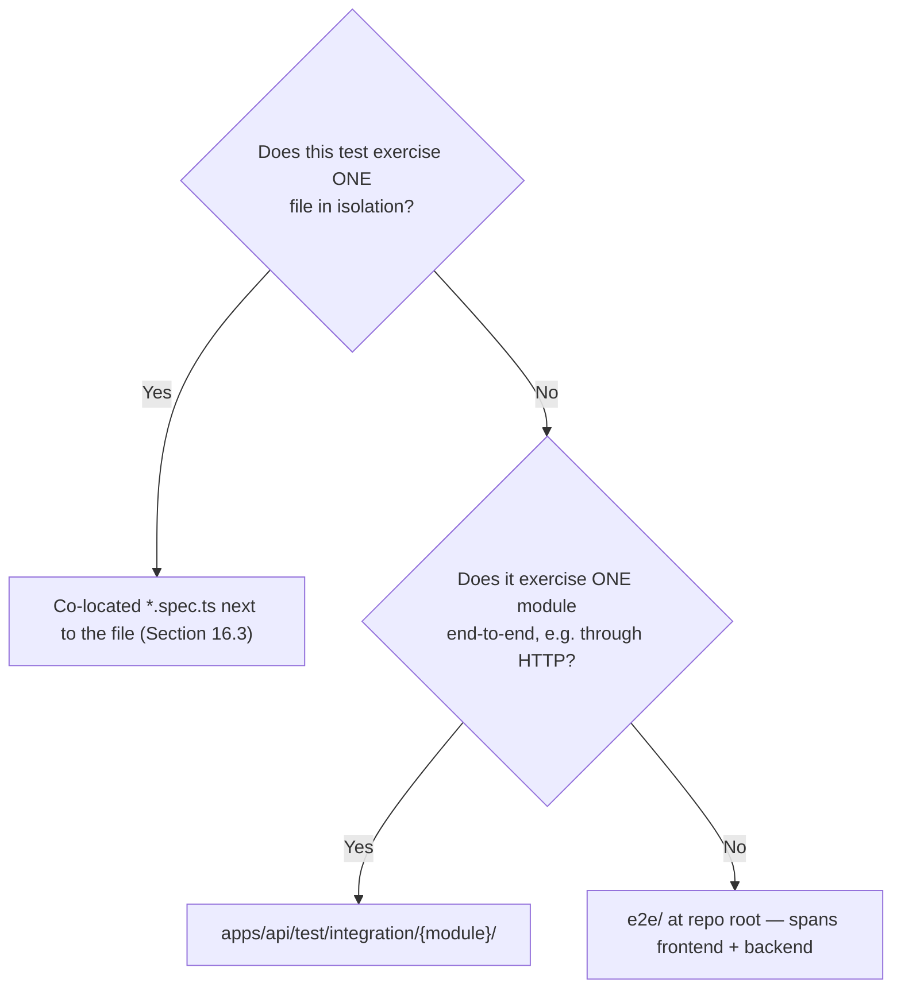

## 16.5 Naming Standards

| Item | Convention | Example |
|---|---|---|
| Unit test | `{file-under-test}.spec.ts`, co-located | `post-journal-entry.service.spec.ts` |
| Integration test | `{use-case}.integration.spec.ts` | `post-journal-entry.integration.spec.ts` |
| E2E test | `{flow}.e2e.spec.ts` | `journal-entry-posting.e2e.spec.ts` |

## 16.6 Why This Approach Was Chosen

Co-locating unit tests directly next to the file they test (rather than a parallel `tests/` tree mirroring `src/`) keeps a file and its test as a single, always-visible pair in any directory listing or file explorer — this directly operationalizes `03_ARCHITECTURE.md` Chapter 9, Decision 9.9.3's requirement that authorization logic be independently unit-testable: a reviewer sees immediately, file by file, whether a `.service.ts` has a corresponding `.spec.ts`, without cross-referencing a separate test tree. Integration and E2E tests, by contrast, are separated into their own trees because they span multiple files/modules by nature and do not have a single natural co-location point.

## 16.7 Alternatives Considered

**Alternative: A single parallel `tests/` tree mirroring the entire `src/` structure.**
Rejected — this doubles the navigation burden (every change requires jumping between two parallel trees) and makes it easy for a file to silently lack a test without that gap being visually obvious in the source tree itself, unlike co-location where a missing `.spec.ts` file is immediately visible next to its source file.

## 16.8 Advantages

- Missing unit tests are visually obvious in any directory listing.
- Integration/E2E tests get dedicated trees appropriate to their cross-cutting nature, without forcing an artificial co-location that doesn't fit their scope.

## 16.9 Disadvantages

- Module folders contain more files (implementation + test side by side) — a minor navigational cost, addressed by IDE file-grouping features that most editors already support for this exact pattern.

## 16.10 Best Practices

- Every new `.service.ts`, `.aggregate.ts`, or `.controller.ts` file ships with a co-located `.spec.ts` in the same PR — never added "later."
- Integration tests are named after the use case they exercise, not the endpoint's HTTP verb+path, keeping them readable independent of routing details.

## 16.11 Common Mistakes

| Mistake | Why It's Wrong | Correct Pattern |
|---|---|---|
| Adding all unit tests to a single `apps/api/test/unit/` tree instead of co-locating | Loses the "missing test is visually obvious" property Section 16.6 relies on | Co-locate every unit test next to its source file |
| Writing an integration test that actually only exercises one file in isolation | Misclassifies test scope, slows the suite unnecessarily | Use Section 16.4's placement rule — one-file tests are unit tests, always |

## 16.12 Scalability

Co-located unit tests scale identically with module growth (Chapter 5's additive folder pattern); the `integration/` and `e2e/` trees grow one subfolder per module, matching the same additive principle.

## 16.13 Future Improvements

- Revisit CI parallelization strategy (Chapter 17) once integration/E2E suite runtime, measured per Chapter 21 of the Architecture doc's tooling, becomes a bottleneck.

---

*Chapter 16 approved (proceeding without pause per instruction).*

---

# Chapter 17 — Scripts, Docker & CI/CD

## 17.1 Purpose

Define the `scripts/`, `docker/`, and `.github/workflows/` folders — the tooling and pipeline layer that operationalizes every structural rule this handbook has established.

## 17.2 Responsibilities of This Chapter

- Define script organization for common developer/operational tasks.
- Define Docker Compose/Dockerfile organization for local development and deployment (Ch.24 of Architecture doc).
- Define CI/CD workflow organization, including the tooling checks this handbook's earlier chapters depend on.

## 17.3 Folder Tree

```
scripts/
├── db/
│   ├── migrate.sh
│   └── seed.sh
├── lint/
│   ├── check-layer-boundaries.ts        (Ch.5.7.1 of Architecture doc)
│   └── check-module-imports.ts          (Ch.6.7 of Architecture doc)
└── setup/
    └── bootstrap-dev-environment.sh

docker/
├── api.Dockerfile
├── web.Dockerfile
└── docker-compose.dev.yml               (MySQL, Redis, local S3-compatible storage)

.github/
└── workflows/
    ├── ci.yml                            (lint, test, build — every PR)
    ├── deploy-staging.yml
    └── deploy-production.yml             (Ch.24.6.1 — staged rollout, no fast-path)
```

## 17.4 CI Pipeline Stages Diagram

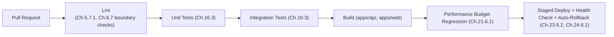

## 17.5 Naming Standards

| Item | Convention | Example |
|---|---|---|
| Script file | `{purpose}.sh` or `.ts` | `bootstrap-dev-environment.sh` |
| Dockerfile | `{app}.Dockerfile` | `api.Dockerfile` |
| GitHub workflow | `{purpose}.yml` | `deploy-production.yml` |

## 17.6 Why This Approach Was Chosen

`scripts/lint/check-layer-boundaries.ts` and `check-module-imports.ts` are named here explicitly because they are the literal tooling implementation of `03_ARCHITECTURE.md` Chapter 5, Decision 5.7.1 and Chapter 6.7's mandate that layer and module boundaries be enforced by tooling, not convention — this handbook's entire feature-first, layer-mirrored structure (Chapter 1) only has teeth if a script actually checks it on every PR. The CI pipeline's ordering (Section 17.4) reflects Chapter 24.6.1's no-exception staged-rollout rule directly — there is no shortcut path that skips straight to deploy, for any change, regardless of urgency.

## 17.7 Alternatives Considered

**Alternative: Enforce layer/module boundaries via code review only, with no dedicated lint scripts.**
Rejected — this is the "convention over tooling" approach `03_ARCHITECTURE.md` has rejected consistently since Chapter 3; scripts under `scripts/lint/` are the concrete artifact that makes that rejection real rather than aspirational.

## 17.8 Advantages

- Every structural rule this handbook establishes has a corresponding, locatable enforcement script — nothing is "policy only."
- CI pipeline stage ordering makes the staged-rollout, no-fast-path rule mechanically true, not just documented.

## 17.9 Disadvantages

- Lint scripts require ongoing maintenance as the module list grows — an accepted, small ongoing cost versus the alternative of unenforced conventions silently eroding.

## 17.10 Best Practices

- Every new architectural rule this handbook or `03_ARCHITECTURE.md` establishes that is claimed to be "tooling-enforced" must have a corresponding script under `scripts/lint/` — a rule with no enforcement script is not actually enforced, regardless of what documentation says.
- CI workflow files are reviewed with the same rigor as `03_ARCHITECTURE.md` Chapter 20.5.1's security review gate, since they are what makes every other gate real.

## 17.11 Common Mistakes

| Mistake | Why It's Wrong | Correct Pattern |
|---|---|---|
| Adding a "quick hotfix" deploy workflow that skips staging | Directly violates Ch.24, Decision 24.6.1's no-exception policy | All deploys, including hotfixes, go through the same staged pipeline |
| Claiming a rule is "enforced" in documentation with no corresponding CI script | Creates false confidence; the rule silently erodes under time pressure | Every enforced rule must have a locatable script in `scripts/lint/` and a CI stage that runs it |

## 17.12 Scalability

CI stages (Section 17.4) scale by adding path-based triggering (only run a module's tests when that module's files change) as module count grows, keeping pipeline runtime from growing linearly with total platform size.

## 17.13 Future Improvements

- Add path-based CI triggering once pipeline runtime, measured in practice, justifies the added configuration complexity — deferred until evidence, per this handbook's consistent anti-speculation discipline.

---

*Chapter 17 approved (proceeding without pause per instruction).*

---

# Chapter 18 — Documentation Folder

## 18.1 Purpose

Define where this handbook and every other project document (`01_PROJECT_CONTEXT.md` through `12_MODULE_TEMPLATE.md`, and beyond) physically live relative to source code, and where per-module `README.md` files fit into that structure.

## 18.2 Responsibilities of This Chapter

- Define the `docs/` folder's relationship to the numbered root-level handbook documents.
- Define per-module documentation requirements (per `12_MODULE_TEMPLATE.md`).

## 18.3 Folder Tree

```
ledgerone/
├── 01_PROJECT_CONTEXT.md
├── 02_TECH_STACK.md
├── 03_ARCHITECTURE.md
├── 04_FOLDER_STRUCTURE.md            (this document)
├── 05_CODING_STANDARDS.md
├── ...
├── 12_MODULE_TEMPLATE.md
└── docs/
    ├── adr/                          (Ch.28 of Architecture doc — ADR log, if extracted from Ch.28.16's inline table)
    ├── runbooks/                     (operational runbooks, Ch.23 of Architecture doc)
    └── diagrams/                     (source files for diagrams not inlined as Mermaid)

apps/api/src/modules/accounting/
└── README.md                          (per-module doc, `12_MODULE_TEMPLATE.md`)
```

## 18.4 Why This Approach Was Chosen

The numbered handbook documents (`01_` through `12_` and beyond) stay at the repository root, not inside `docs/`, because they are the project's foundational, frequently-referenced governance documents — `03_ARCHITECTURE.md` Chapter 1.7.2 already established that documentation drift is treated as a defect, and keeping these documents maximally visible (root level, not nested) is a small but deliberate signal of their authority relative to `docs/`'s more operational content (runbooks, ADR details, diagram sources). Per-module `README.md` files stay physically inside each module folder (rather than centralized under `docs/`) so that a module's documentation travels with its code during Chapter 27's extraction process, per the Architecture doc's mechanical-extraction claim.

## 18.5 Alternatives Considered

**Alternative: Move all numbered handbook documents into `docs/` to declutter the repository root.**
Rejected — this handbook's own root-level visibility is a deliberate signal of authority (Section 18.4); nesting them alongside more operational, lower-authority content would blur that distinction for no real organizational benefit, since the repository root is not meaningfully "cluttered" by a fixed, small set of governance documents.

## 18.6 Advantages

- Governance documents remain maximally discoverable for new engineers (`03_ARCHITECTURE.md` Chapter 1.2's onboarding goal).
- Per-module READMEs travel with their module through any future extraction (Ch.27 of Architecture doc).

## 18.7 Disadvantages

- Repository root has more files than a "docs nested away" convention would produce — an acceptable, deliberate trade-off per Section 18.4.

## 18.8 Best Practices

- Every module's `README.md` is updated in the same PR as any change to that module's manifest or public contract, per `03_ARCHITECTURE.md` Chapter 6.7's discipline extended to documentation specifically.
- `docs/runbooks/` entries are referenced directly from Chapter 23 of the Architecture doc's failure-scenario sections where applicable, keeping operational response procedures discoverable from the architectural reasoning that motivated them.

## 18.9 Common Mistakes

| Mistake | Why It's Wrong | Correct Pattern |
|---|---|---|
| Letting a module's `README.md` go stale after a contract change | Violates `03_ARCHITECTURE.md` Ch.1.7.2's anti-drift discipline | Update the README in the same PR as the contract change |
| Creating a new numbered root document without updating this chapter's tree | Silent structural drift in the handbook itself | Any new numbered document is added to Section 18.3's tree in the same PR |

## 18.10 Scalability

Per-module README ownership scales with module count identically to every other per-module convention in this handbook; `docs/` subfolders (runbooks, ADRs, diagrams) grow independently as operational maturity increases.

## 18.11 Future Improvements

- Consider extracting Chapter 28.16 of the Architecture doc's ADR log into `docs/adr/` as individual dated files once its length, per that chapter's own flagged future improvement, makes a single inline table impractical.

---

*Chapter 18 approved (proceeding without pause per instruction).*

---

# PART VIII — GOVERNANCE

# Chapter 19 — Module Dependency & Import Rules

## 19.1 Purpose

Consolidate every import-boundary rule referenced across this handbook into one enforceable specification, and define the concrete mechanism preventing circular dependencies.

## 19.2 Responsibilities of This Chapter

- State the complete, consolidated import-legality table.
- Define circular dependency prevention mechanics.

## 19.3 Import Legality Table

| From | May Import | May Never Import |
|---|---|---|
| `modules/{a}/presentation/` | `modules/{a}/business/` only | Any other module's internals; its own `repository/` directly |
| `modules/{a}/business/` | `modules/{a}/domain/`, `modules/{a}/repository/` interfaces, other modules' `module.manifest.ts`-published contracts only | Any other module's `business/`, `domain/`, or `repository/` directly |
| `modules/{a}/domain/` | Nothing outside itself | Any framework, ORM, or other layer/module — zero exceptions (Ch.5.3.3 of Architecture doc) |
| `modules/{a}/repository/` | `modules/{a}/domain/` interfaces, `database/` (Prisma) | Any other module's `repository/` or tables |
| Any module | `common/`, `packages/shared-*` | — |
| `common/` | Nothing module-specific | Any `modules/{name}/` folder |

## 19.4 Circular Dependency Prevention Diagram

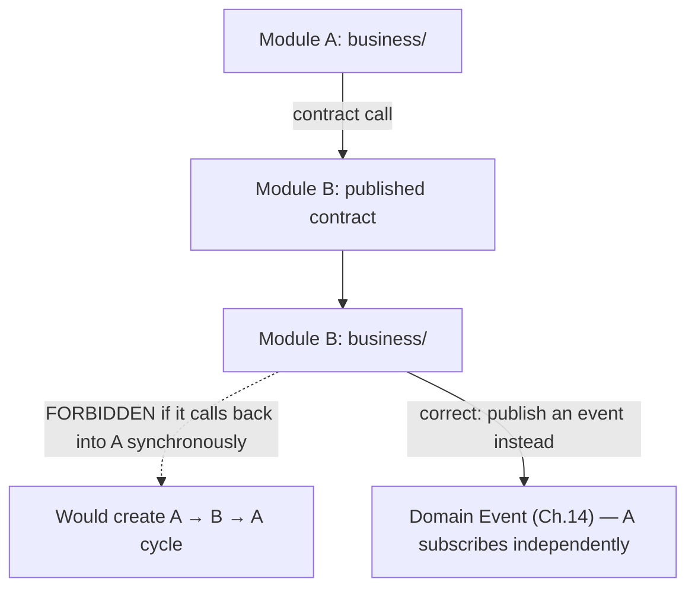

A synchronous cross-module call (Chapter 6.6.1) that would need to call back into its own originating module to complete is a circular-dependency smell — the correct resolution is almost always to convert the return path into a Domain Event (Chapter 14) the originating module subscribes to independently, breaking the synchronous cycle.

## 19.5 Naming Standards

Reuses Chapter 3's global naming table; no additional naming conventions are introduced by this chapter.

## 19.6 Why This Approach Was Chosen

Section 19.3's table is not a new set of rules — it is `03_ARCHITECTURE.md` Chapters 3.4, 5, and 6's dependency rules, restated once as a single, scannable reference so an engineer never has to reconstruct the full legality matrix from prose scattered across three chapters. Section 19.4's circular-dependency guidance follows directly from Chapter 14.3's rule that events state facts, never commands — a synchronous call-back cycle is exactly the shape of coupling that rule exists to prevent, made concrete here as a diagnosable code smell.

## 19.7 Alternatives Considered

**Alternative: Leave import legality implicit, inferred from reading Chapters 3, 5, and 6 of `03_ARCHITECTURE.md` individually.**
Rejected — a new engineer or a lint-rule author should not have to cross-reference three chapters to answer "can file X import file Y"; Section 19.3 exists specifically to make that answer a single table lookup.

## 19.8 Advantages

- Single source of truth for "is this import legal," directly implementable as a lint rule.
- Circular-dependency guidance gives engineers a concrete alternative (events) rather than just a prohibition.

## 19.9 Disadvantages

- Must be kept in sync with `03_ARCHITECTURE.md` if its underlying rules ever change via the ADR process (Ch.28) — an explicit, tracked maintenance responsibility, not a risk unique to this table.

## 19.10 Best Practices

- `scripts/lint/check-module-imports.ts` (Chapter 17.3) is implemented directly against Section 19.3's table — the lint rule and this table must never diverge.
- Any proposed exception to Section 19.3 is treated as an architectural decision requiring an ADR (Ch.28 of Architecture doc), never a one-off code review approval.

## 19.11 Common Mistakes

| Mistake | Why It's Wrong | Correct Pattern |
|---|---|---|
| A Business-layer service importing another module's Repository implementation directly | Violates Ch.6.5 — bypasses the published contract entirely | Import only the other module's published contract interface |
| Resolving a synchronous circular dependency by adding a special-case direct call | Papers over a real coupling problem instead of fixing it | Convert the return path to a Domain Event (Section 19.4) |

## 19.12 Scalability

Section 19.3's table applies identically regardless of module count — the legality rule for module A calling module B is the same rule for any pair among fifteen-plus modules, requiring no per-pair configuration.

## 19.13 Future Improvements

- Once `scripts/lint/check-module-imports.ts` is mature, consider auto-generating Section 19.3's table directly from the lint rule's configuration, guaranteeing they can never drift apart.

---

*Chapter 19 approved (proceeding without pause per instruction).*

---

# Chapter 20 — Feature/Package Boundaries & Code Ownership

## 20.1 Purpose

Define how repository structure maps to team ownership, and how that ownership is declared and enforced.

## 20.2 Responsibilities of This Chapter

- Define the code-ownership file convention.
- Map module folders to owning teams.

## 20.3 Folder Tree — Ownership Declaration

```
ledgerone/
└── .github/
    └── CODEOWNERS
```

```
# CODEOWNERS (illustrative structure, not literal content)
apps/api/src/modules/accounting/   @ledgerone/accounting-team
apps/api/src/modules/sales/        @ledgerone/sales-team
apps/web/src/modules/accounting/   @ledgerone/accounting-team
packages/shared-types/             @ledgerone/architecture-team
common/                            @ledgerone/architecture-team
```

## 20.4 Ownership Mirrors Module Boundaries

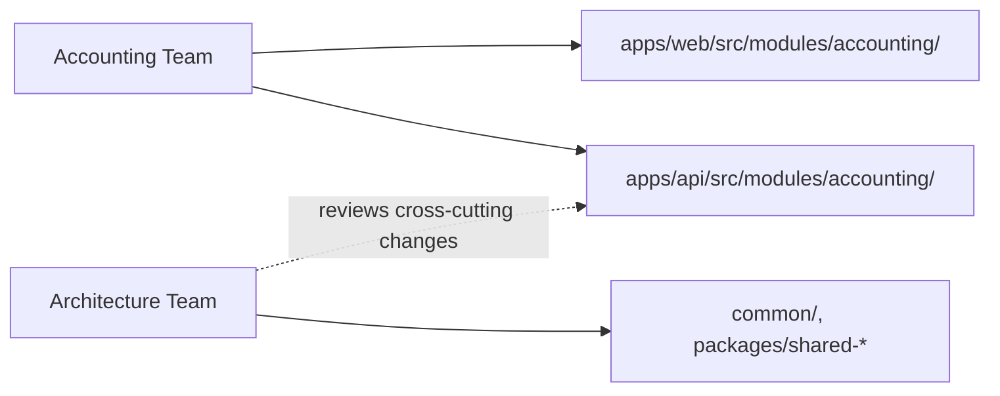

## 20.5 Naming Standards

CODEOWNERS entries use the exact folder paths established throughout this handbook — no separate naming convention is introduced; ownership declarations simply reference paths already defined in Chapters 5-15.

## 20.6 Why This Approach Was Chosen

Mapping one team to one module's frontend-plus-backend folders directly operationalizes `03_ARCHITECTURE.md` Chapter 11.8's observation that module teams are typically full-stack, organized around a business capability spanning both sides of the stack, not around a frontend/backend technical split. Routing `common/` and `packages/shared-*` ownership to a dedicated architecture-team review reflects Chapter 8.10 and Chapter 14.10's elevated-scrutiny requirement for shared infrastructure changes — a change there affects every module, so it warrants a reviewer with cross-module context, not just the module team that happened to touch it first.

## 20.7 Alternatives Considered

**Alternative: Ownership organized by technical layer (a "backend team" and a "frontend team") rather than by module.**
Rejected — this is the layer-first organizing principle Chapter 1.4 already rejected, now reapplied to team structure; it would fragment a single business capability's ownership across two teams, recreating exactly the coordination overhead Chapter 1's vision statement (team-growth clause) aims to avoid.

## 20.8 Advantages

- Code review routing is automatic and matches the module boundaries this entire handbook is built around.
- Shared/common code gets consistently elevated review, preventing accidental degradation of cross-cutting infrastructure by a team focused on their own module.

## 20.9 Disadvantages

- A genuinely cross-module change (rare, given Chapter 6.5's boundary rule) may require review from multiple teams — an acceptable, infrequent coordination cost given how rarely a well-bounded module requires touching another's code.

## 20.10 Best Practices

- `CODEOWNERS` is updated in the same PR that adds a new module folder (Chapter 5.10's scaffolding discipline extended to ownership declarations).
- Ownership follows module boundaries exactly — never split a single module's ownership across two teams, which would blur the accountability Chapter 6.3's ownership model depends on.

## 20.11 Common Mistakes

| Mistake | Why It's Wrong | Correct Pattern |
|---|---|---|
| Leaving a newly-created module folder unowned in CODEOWNERS | No automatic review routing, ownership ambiguity | Add the ownership entry in the same PR that creates the module |
| Splitting one module's ownership between two teams | Blurs the single-team-per-capability accountability model | One team per module, full stack, per Section 20.6 |

## 20.12 Scalability

Ownership mapping scales identically to every module-count-driven convention in this handbook — one new CODEOWNERS line per new module, no restructuring of existing entries.

## 20.13 Future Improvements

- Revisit ownership granularity (e.g., sub-module ownership within a very large module) only if a specific module grows large enough to warrant a dedicated sub-team — deferred until real evidence, per this handbook's consistent discipline.

---

*Chapter 20 approved (proceeding without pause per instruction).*

---

# Chapter 21 — Future Expansion Strategy

## 21.1 Purpose

State, in one place, how this handbook's structure absorbs LedgerOne's anticipated future growth — new modules, the Marketplace, mobile applications, and eventual microservice extraction — without requiring a restructuring of what has already been built.

## 21.2 Responsibilities of This Chapter

- Consolidate every "how does this scale" answer already given per-chapter into a single forward-looking view.
- Name the concrete triggers for the structural changes this handbook has deliberately deferred.

## 21.3 Expansion Vectors

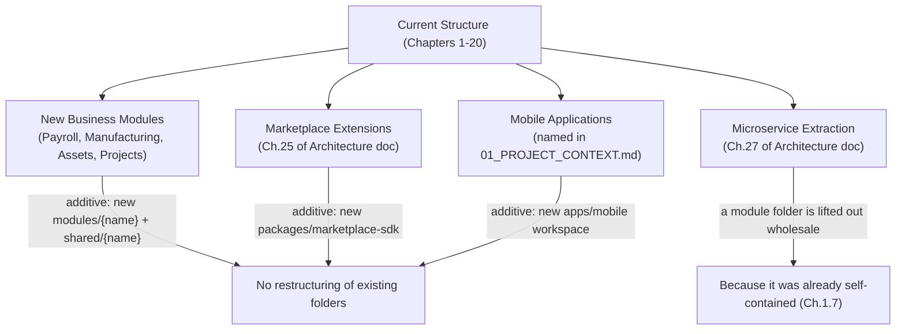

## 21.4 Trigger Table

| Future Change | Concrete Trigger | What Changes | What Does Not Change |
|---|---|---|---|
| New Business Capability module | A distinct capability passes Chapter 6.3's ownership test | New `modules/{name}` + `shared/{name}` if Foundation | Every existing module folder |
| Marketplace SDK | Chapter 25 of the Architecture doc's extension points are built | New `packages/marketplace-sdk` | `modules/`, `common/` |
| Mobile application | Product decision to build a native/mobile client | New `apps/mobile` workspace | `apps/api`, `apps/web` |
| Domain-grouping subfolders under `modules/` | Module count makes flat listing unwieldy (Ch.1.12) | One level of grouping added under `modules/` | Each module's internal five-layer shape |
| Microservice extraction | Chapter 21.4 of the Architecture doc's monitored resource-consumption trigger fires | The module's folder is lifted into its own deployable/repository | Its internal five-layer shape and published contract — unchanged, per Ch.27.4 |

## 21.5 Why This Approach Was Chosen

Every expansion vector in Section 21.3 is additive by design — this is the cumulative payoff of every individual chapter's "scalability" section in this handbook, now shown together as a single claim: nothing in `03_ARCHITECTURE.md` Chapter 1.4.1's vision statement (module, tenant, team growth without a rewrite) requires this folder structure to change shape, only to grow more instances of shapes it already has. The one apparent exception — microservice extraction — is not actually an exception, per Chapter 27.3 of the Architecture doc: because a module's folder is already self-contained (Chapter 1.7's stated goal), extraction is lifting a folder out, not restructuring one.

## 21.6 Alternatives Considered

**Alternative: Defer defining a future-expansion strategy until each future change is actually being built.**
Rejected — this handbook's own Chapter 1.5 stated goal is that structure should be predictable from architecture alone; leaving expansion undiscussed would mean each future change's folder-level implications must be re-derived from scratch by whichever engineer builds it, risking an inconsistent, ad hoc structure that doesn't match this handbook's established patterns.

## 21.7 Advantages

- A new engineer or a future architect can predict this handbook's own future shape from Section 21.4's table, without waiting for each change to actually happen.
- Reinforces, one final time, that this handbook's structure was designed for growth from Chapter 1 onward, not retrofitted after growth already caused pain.

## 21.8 Disadvantages

- Section 21.4's triggers are, necessarily, anticipatory — some may prove imprecise once the actual future change arrives, requiring a documented ADR-style update (mirroring Ch.28 of the Architecture doc's discipline) rather than a silent revision.

## 21.9 Best Practices

- Before undertaking any of Section 21.3's expansion vectors, re-read this chapter's corresponding trigger row to confirm the change is additive per this handbook's established pattern, not a structural deviation.
- Any expansion that does not fit Section 21.4's additive pattern is itself a signal this handbook needs a deliberate, reviewed revision — never a silent, one-off exception.

## 21.10 Common Mistakes

| Mistake | Why It's Wrong | Correct Pattern |
|---|---|---|
| Restructuring existing module folders to "make room" for an anticipated future module | Violates the additive-only expansion principle this entire handbook is built on | New modules are always new sibling folders, never a reorganization of existing ones |
| Building Marketplace or mobile-app scaffolding speculatively, before either is actually being built | Contradicts this handbook's and the Architecture doc's consistent anti-speculation discipline (Ch.1.9 of Architecture doc) | Add `packages/marketplace-sdk` or `apps/mobile` only when the corresponding product work actually begins |

## 21.11 Scalability

This chapter is, in its entirety, the scalability argument for the whole handbook — every prior chapter's individual scalability section is a special case of Section 21.3's general claim: additive growth, no restructuring, by design.

## 21.12 Future Improvements

- Revisit this chapter itself once the first real instance of each Section 21.4 trigger fires, recording the actual outcome as an ADR (Ch.28 of Architecture doc) and confirming whether the anticipated "what changes / what does not change" columns held true in practice.

---

*Chapter 21 approved (proceeding without pause per instruction).*

---

# Closing Note

Twenty-one chapters across eight parts now define, exhaustively, where every file in LedgerOne's repository belongs — from the monorepo root down to individual Aggregate files, translation keys, and CI workflow stages. Every rule in this handbook traces back to a specific decision already frozen in `03_ARCHITECTURE.md`; nowhere does this document introduce a new architectural decision of its own. Where growth is anticipated (Chapter 21), it is additive by design, not a future rewrite waiting to happen.

This handbook is a living document under the same discipline as its parent: any future structural change is recorded as an ADR (`03_ARCHITECTURE.md` Chapter 28) before it is adopted, never a silent edit.
