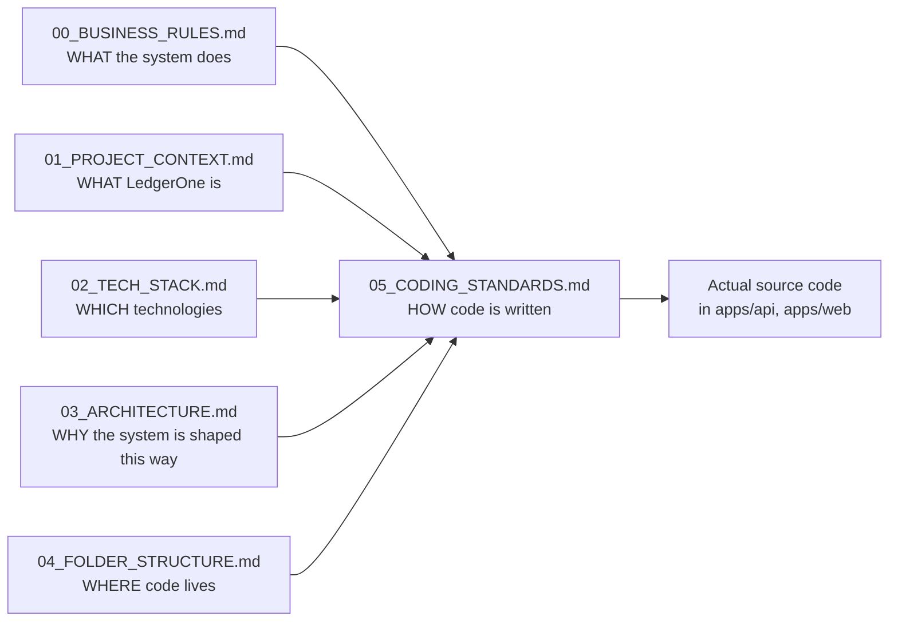
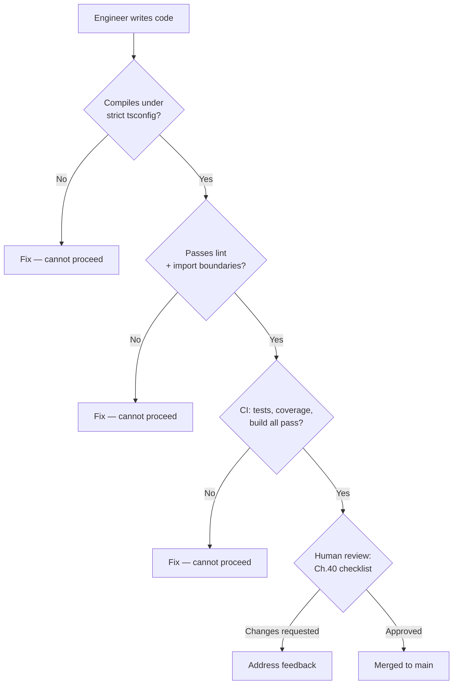
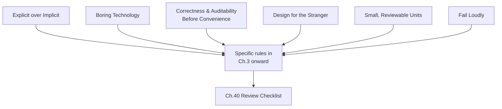
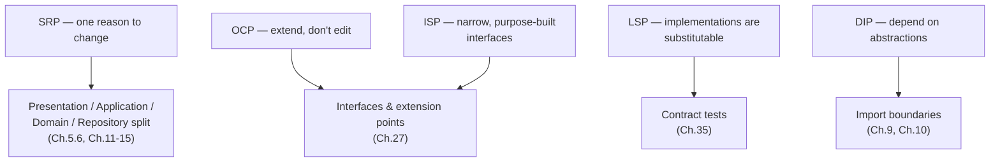

# LedgerOne — Coding Standards Handbook

**Document Owner:** Chief Software Architect / CTO
**Version:** 0.1-draft (Chapter 1 of 43 written; not yet frozen — see Section 1.8 for the amendment process this document itself will follow once complete)
**Status:** In progress — built and approved one chapter at a time

## Relationship to the Frozen Documents

This handbook is subordinate to, and never contradicts, the five frozen documents that precede it (all now at **Version 1.1**, synchronized to the approved v1.0 technology stack):

- `00_BUSINESS_RULES.md` (v1.1) — what the system must do, module by module.
- `01_PROJECT_CONTEXT.md` (v1.1) — what LedgerOne is (a Business Operating System, not an accounting app).
- `02_TECH_STACK.md` (v1.1) — the fixed technology choices this handbook writes standards *for*.
- `03_ARCHITECTURE.md` (v1.1) — the five-layer Clean Architecture, Modular Monolith, and DDD decisions this handbook makes *mechanical*.
- `04_FOLDER_STRUCTURE.md` (v1.1) — the physical folder tree and naming table (Ch.3) this handbook's examples must sit inside without deviation.

Where `03_ARCHITECTURE.md` decides *that* the Business layer must not contain persistence logic, this handbook decides *what a compliant Business-layer file looks like, line by line*. Where `04_FOLDER_STRUCTURE.md` decides *that* a file is named `post-journal-entry.service.ts`, this handbook decides *what must be true inside that file* for it to pass review.

If any rule in this handbook appears to conflict with the frozen documents, that is a defect in this handbook, not a license to deviate — the conflict must be raised and resolved by amending this document, never by silently overriding the frozen ones in code.

## How to Read This Document

Every chapter is independently referenceable during code review — a reviewer should be able to comment `"see 05_CODING_STANDARDS.md Ch.13.4"` and have that be a complete, unambiguous objection. Chapters build on each other in the order presented (Part I establishes philosophy and language-level rules that every later, layer-specific chapter assumes), but each is written to also stand alone as a lookup target.

## Table of Contents

**PART I — FOUNDATIONS**
Ch.1 Introduction · Ch.2 Engineering Philosophy · Ch.3 SOLID Principles · Ch.4 Clean Code · Ch.5 TypeScript Standards · Ch.6 Naming Conventions · Ch.7 Folder Standards · Ch.8 File Standards · Ch.9 Import Rules · Ch.10 Dependency Injection

**PART II — APPLICATION LAYERS**
Ch.11 Module Standards · Ch.12 Controller Standards · Ch.13 Service Standards · Ch.14 Repository Standards · Ch.15 Domain Standards · Ch.16 DTO Standards · Ch.17 Validation Standards · Ch.18 Exception Handling · Ch.19 Logging · Ch.20 Transactions

**PART III — PLATFORM & INFRASTRUCTURE**
Ch.21 Prisma Standards · Ch.22 Redis Standards · Ch.23 BullMQ Standards · Ch.24 Environment Variables · Ch.25 Constants · Ch.26 Enums · Ch.27 Interfaces · Ch.28 Types · Ch.29 Utilities · Ch.30 Events

**PART IV — REQUEST PIPELINE**
Ch.31 Middleware · Ch.32 Validators · Ch.33 Error Handling · Ch.34 Request Context

**PART V — QUALITY & GOVERNANCE**
Ch.35 Testing Standards · Ch.36 Performance Standards · Ch.37 Security Coding · Ch.38 Documentation · Ch.39 Comments · Ch.40 Code Review Checklist · Ch.41 Anti-Patterns · Ch.42 Refactoring · Ch.43 Definition of Done

*(This table of contents is the full planned shape of the handbook. Chapters are written and approved one at a time; unwritten chapters are listed here as a map, not yet as content.)*

---

# PART I — FOUNDATIONS

# Chapter 1 — Introduction

## 1.1 Purpose

Establish what this handbook is, who it binds, how it is enforced, and how it relates to the four documents that already govern LedgerOne's architecture and business behavior — so that every later chapter can assume this context without restating it.

## 1.2 Responsibilities of This Chapter

- State the handbook's authority and scope.
- Define who must comply, and from what point in the development lifecycle.
- Define the enforcement mechanism — this handbook is not aspirational prose, it is a gate.
- Define how this handbook is versioned and amended.
- Define the vocabulary this document uses consistently ("must", "should", "never").

## 1.3 What This Handbook Is — and Is Not

This handbook is **the definition of how code is written at LedgerOne**, not a style-preference document and not a tutorial. It assumes the reader has already read `03_ARCHITECTURE.md` and `04_FOLDER_STRUCTURE.md` — this document does not re-explain Clean Architecture, the five layers, Modular Monolith, or DDD; it tells you what compliant code implementing those decisions looks like, in the specific technologies named in `02_TECH_STACK.md`.

This handbook explicitly does **not**:

- Decide *where* a file lives — that is `04_FOLDER_STRUCTURE.md`'s authority.
- Decide *why* the system is shaped the way it is — that is `03_ARCHITECTURE.md`'s authority.
- Decide *what* the system must do for a given business entity — that is `00_BUSINESS_RULES.md`'s authority.
- Introduce new architectural concepts. If a rule in this handbook seems to require a new architectural concept, the correct action is to raise it against `03_ARCHITECTURE.md`, not to add it here unilaterally.



## 1.4 Who This Handbook Binds

Every engineer who commits code to the LedgerOne monorepo — backend, frontend, or full-stack, employee or contractor, first day or hundredth — is bound by this handbook without exception. Seniority does not create an exemption; a principal engineer's pull request is held to the exact same checklist (Chapter 40) as a new graduate's. The rationale is direct: at 100+ engineers, any informal "senior engineers can skip this" carve-out becomes, within a quarter, an unenforceable standard that nobody can cite with confidence.

This handbook binds code from the moment it is written, not from the moment it is reviewed. An engineer who writes code violating this handbook and hopes review will "catch anything real" has already misused the review process — Chapter 40 exists to catch mistakes and disagreements, not to outsource first-pass compliance.

## 1.5 Enforcement Mechanism

Standards that exist only as prose are not standards — they are suggestions with a byline. Every rule in this handbook is enforced by one of four mechanisms, and every rule states which one applies:

| Mechanism | What It Catches | Example |
|---|---|---|
| **Compiler / `tsconfig` strictness** | Type-level violations | `strict: true` rejects implicit `any` (Ch.5) |
| **ESLint / custom lint rules** | Structural and pattern violations | Import boundary rule rejecting `domain/` importing `@prisma/client` (Ch.9) |
| **CI pipeline gate** | Test coverage, build failures, dependency audit failures | PR blocked if Ch.35's coverage floor is not met |
| **Human code review (Ch.40)** | Judgment calls no mechanical rule can express | Whether a Business-layer service's use case is scoped correctly (Ch.13) |

A rule that is only enforceable by mechanism four (human judgment) is weaker than one enforceable by mechanisms one through three, and this handbook prefers the strongest available mechanism for every rule it states. Where a rule is currently review-only, later chapters flag it as a **Future Consideration** for tooling, rather than accepting review-only enforcement as permanent.



## 1.6 Vocabulary Used Throughout This Handbook

To keep every chapter's rules unambiguous, this handbook uses RFC-2119-style vocabulary consistently:

| Word | Meaning |
|---|---|
| **Must / Never** | Non-negotiable. A violation blocks merge regardless of reviewer opinion. |
| **Should** | Strong default. A deviation requires an explicit, written justification in the PR description, and reviewer sign-off on that justification specifically. |
| **May** | A permitted option among several; the choice is left to the engineer's judgement given the specific case. |
| **Consider** | A suggestion for the engineer to weigh — absence of this doesn't get flagged in review by default. |

An engineer who deviates from a **must** rule without an approved, documented exception (Section 1.9) has produced code that is not eligible for merge, independent of how good the reasoning seems locally.

## 1.7 Relationship to Team Scale

This handbook is written assuming 100+ engineers working concurrently across 15+ modules (per `03_ARCHITECTURE.md` Ch.6's module list). Every rule in this handbook is evaluated against a specific question: **does this rule still make sense when two engineers who have never spoken to each other are each independently modifying a different module on the same day?** A rule that only works when everyone remembers a verbal convention fails this test and is not acceptable, no matter how reasonable it sounds for a five-person team.

This is why this handbook prefers mechanical enforcement (Section 1.5) over tribal knowledge, why `04_FOLDER_STRUCTURE.md`'s identical-shape-per-module convention is treated as load-bearing rather than cosmetic, and why later chapters (Ch.11 onward) are written as if the reader has never seen the specific module in question before.

## 1.8 Versioning and Amendment of This Handbook

This handbook is a living document, but it is not casually editable:

- Amendments require a pull request against this file itself, reviewed by at least two members of the engineering standards group.
- An amendment must state which existing rule it changes or supersedes, and why — silent contradiction between an old and new rule is treated as a defect in the amendment.
- A rule change that would make previously-compliant, already-merged code non-compliant does **not** retroactively obligate a rewrite; it obligates compliance going forward, with a Chapter 42 (Refactoring) entry raised for the backlog if the gap is significant.
- This document carries a version header (Section 1.10) incremented on every merged amendment.

## 1.9 Documented Exceptions

A **must** rule may be broken only via a documented exception, recorded as a code comment directly above the deviation in this exact form:

```
// STANDARDS-EXCEPTION: [Chapter.Section] — [reason] — approved by [reviewer], [date]
```

An exception comment without a named approving reviewer and date is not a valid exception — it is an unreviewed violation. Exceptions are expected to be rare; a module accumulating many exceptions against the same rule is a signal that the rule itself may need to be reconsidered through Section 1.8's amendment process, not that the module is unusually undisciplined.

## 1.10 Document Header Convention

Every version of this handbook states, at minimum:

| Field | Purpose |
|---|---|
| Version | Incremented per Section 1.8 amendment |
| Last Amended | Date of last merged change |
| Approved By | Standards group members who signed off on the current version |

## 1.11 Good Example — Citing This Handbook in Review

```
Reviewer comment:
"This service performs a Prisma query directly (see the `this.prisma.journalEntry
.findMany(...)` call on line 42) — per 05_CODING_STANDARDS.md Ch.13.5, Business-
layer services must depend on a Repository interface, not the ORM client
directly. Please inject IJournalEntryRepository instead."
```

This is a good citation: it names the exact chapter and rule, quotes the offending line, and states the required correction — an engineer unfamiliar with the history of the decision can act on it without needing a synchronous conversation.

## 1.12 Bad Example — Citing This Handbook in Review

```
Reviewer comment:
"This doesn't look right, we don't usually do it this way."
```

This is a bad citation: it names no rule, gives the author nothing to check against, and depends entirely on the reviewer's personal memory of an unwritten convention — exactly the failure mode Section 1.7 says this handbook exists to eliminate.

## 1.13 Best Practices

- Cite a specific chapter and section number in every review comment that invokes this handbook, per Section 1.11.
- Treat an ambiguous rule as a defect in this handbook to be fixed (Section 1.8), not as license to guess silently.
- New engineers read this handbook's Table of Contents in full during onboarding, and Part I in full before their first pull request.

## 1.14 Common Mistakes

| Mistake | Why It's Wrong | Correct Pattern |
|---|---|---|
| Treating this handbook as optional guidance for "experienced" engineers | Section 1.4 — seniority is not an exemption | Every PR held to the same checklist regardless of author |
| Adding an architectural concept directly into this handbook because a rule felt incomplete | Section 1.3 — this handbook implements `03_ARCHITECTURE.md`, it does not extend it | Raise the gap against `03_ARCHITECTURE.md` first |
| Writing an exception comment without a named reviewer and date | Section 1.9 — an unattributed exception is an unreviewed violation | Always include approver and date |

## 1.15 Decision Matrix — Which Document Answers My Question?

| Your Question | Answering Document |
|---|---|
| "What does an Organization/Company/Branch mean, and what are its lifecycle rules?" | `00_BUSINESS_RULES.md` |
| "Why is LedgerOne a Modular Monolith and not microservices?" | `03_ARCHITECTURE.md` Ch.3 |
| "Which folder does a new Business-layer service go in?" | `04_FOLDER_STRUCTURE.md` Ch.6 |
| "What must be true inside that service file for it to pass review?" | This handbook (Ch.13) |
| "Is this TypeScript pattern acceptable?" | This handbook (Ch.5) |

## 1.16 Checklist — Before Your First Pull Request

- [ ] Read `01_PROJECT_CONTEXT.md` and `03_ARCHITECTURE.md` Part I in full.
- [ ] Read `04_FOLDER_STRUCTURE.md` Chapters 1–7 in full.
- [ ] Read this handbook's Part I (Chapters 1–10) in full.
- [ ] Located the specific chapter of this handbook relevant to the layer you are about to touch (Ch.11 onward).
- [ ] Confirmed your local tooling (lint, strict tsconfig, pre-commit hooks) is installed and passing on a clean checkout.

## 1.17 Engineering Notes

The ordering of Part I is deliberate: Chapter 2 (Engineering Philosophy) and Chapter 3 (SOLID) are stated before any TypeScript-specific rule, because the language-level rules in Chapters 5 onward are derivations of the philosophy, not arbitrary preferences — an engineer who understands *why* should find most of the later chapters predictable rather than needing to memorize them as a list of unrelated facts.

This chapter intentionally does not contain a "Performance Considerations" or "Security Considerations" section in the form later, code-focused chapters will — those apply to code; this chapter is about the handbook's own governance. Where those axes matter later (e.g., Ch.36, Ch.37), they are given full chapters, not a token subsection here.

## 1.18 Future Considerations

- Once mechanical enforcement (Section 1.5) covers the majority of this handbook's **must** rules, consider publishing a machine-readable rule manifest (rule ID → enforcing lint rule / CI check) so a PR bot can auto-cite the specific chapter on a failing check, closing the gap Section 1.11 currently relies on human discipline to close.
- Consider a lightweight internal "standards changelog" surfaced in the engineering onboarding channel whenever Section 1.8's version header increments, so the 100+ engineer body does not need to diff this file manually to notice a change.

---

*End of Chapter 1. Approved — proceeding to Chapter 2.*

---

# Chapter 2 — Engineering Philosophy

## 2.1 Purpose

State the small set of judgment principles that every later, more mechanical chapter in this handbook is a derivation of — so that a rule in Chapter 13 or Chapter 21 reads as an application of a principle the engineer already holds, not as an arbitrary preference to memorize.

## 2.2 Responsibilities of This Chapter

- State the philosophy in a form specific enough to resolve real disagreements, not so abstract it resolves nothing.
- Connect each principle explicitly to a concrete consequence elsewhere in this handbook or in `03_ARCHITECTURE.md`.
- Give reviewers a shared vocabulary for judgment calls that Chapter 1.5's mechanism four (human review) is left to decide.

## 2.3 Why a Philosophy Chapter Exists at All

A rulebook without a stated philosophy eventually produces engineers who follow the letter of a rule into a result the rule was never meant to produce — for example, an engineer who satisfies Chapter 15's "Domain layer has no framework imports" rule by duplicating framework-shaped logic inside the Domain layer under a different name, technically compliant, substantively a violation of the isolation the rule exists to protect. This chapter exists so that "why" is always one section away, not locked in the memory of whoever wrote the original rule.

## 2.4 Principle 1 — Explicit Over Implicit

Code must make its behavior visible at the point of use, not rely on the reader recalling a convention defined elsewhere. This is the same instinct behind `03_ARCHITECTURE.md`'s rejection of implicit framework magic in favor of Express's explicit router/middleware composition (Ch.5.6 of that document): a request handler's dependencies and validation should be readable in the file itself, not inferred from decorators or a DI container's runtime wiring.

**Consequence elsewhere in this handbook:** Ch.10's Dependency Injection standard prefers explicit constructor/factory wiring over any implicit service-locator pattern; Ch.17's Validation standard requires the Zod schema a handler validates against to be visible in or directly imported by that handler's file, not resolved by convention from a shared registry.

## 2.5 Principle 2 — Boring Technology, Deliberately

LedgerOne's stack (`02_TECH_STACK.md`) was chosen for maturity and operational predictability, not novelty (`03_ARCHITECTURE.md` Ch.1.5). This handbook extends the same instinct to code-level choices: a well-understood, slightly more verbose pattern is preferred over a clever one that saves lines but costs the next reader time. "Clever" is not a compliment in a LedgerOne code review.

**Consequence elsewhere in this handbook:** Ch.4 (Clean Code) explicitly names "cleverness that requires a comment to explain itself" as an anti-pattern; Ch.41 (Anti-Patterns) catalogs specific instances of this principle being violated in practice.

## 2.6 Principle 3 — Correctness and Auditability Before Convenience

LedgerOne is a Business Operating System handling financial and compliance-sensitive data (`01_PROJECT_CONTEXT.md`; `03_ARCHITECTURE.md` Ch.17). A convenience that trades away correctness, auditability, or tenant isolation is not a valid trade-off anywhere in this codebase — not "for now," not "just for this internal tool," not "just to unblock a demo." Where a shortcut is genuinely acceptable, it is acceptable because it was evaluated and found not to touch these three properties, never because nobody checked.

**Consequence elsewhere in this handbook:** Ch.20 (Transactions) and Ch.37 (Security Coding) treat their **must** rules as non-negotiable in a stricter sense than most other chapters; Ch.9's import-boundary rules exist specifically to make tenant-isolation and audit-log bypasses structurally difficult, not merely discouraged.

## 2.7 Principle 4 — Design for the Engineer Who Has Never Seen This Module

Per `03_ARCHITECTURE.md` Ch.1.7 and Section 1.7 of this handbook, LedgerOne is built assuming 100+ engineers across 15+ modules who will not have context on each other's work. Code is written for that stranger first, and for the author's own convenience second. A pattern that only reads clearly to the person who wrote it fails this principle regardless of how internally consistent it is.

**Consequence elsewhere in this handbook:** Ch.6 (Naming Conventions) and Ch.38 (Documentation) both derive their strictness from this principle specifically — a name or comment is judged by whether it orients a stranger, not by whether the author finds it self-evident.

## 2.8 Principle 5 — Small, Reviewable Units of Change

A change that cannot be reviewed carefully in one sitting is a change that will not be reviewed carefully. This applies at every scale this handbook governs: a function should do one reviewable thing (Ch.3's Single Responsibility Principle), a file should be reviewable without needing three other files open to understand it (Ch.8), and a pull request should be small enough that Ch.40's review checklist can be applied with full attention rather than skimmed under fatigue.

**Consequence elsewhere in this handbook:** Ch.40 (Code Review Checklist) references PR size directly; Ch.13 (Service Standards) caps a single service method's responsibility to one use case for the same reason.

## 2.9 Principle 6 — Fail Loudly, Not Silently

An error that is swallowed, defaulted-away, or logged-and-ignored is a decision the codebase made without the business's knowledge. Every failure path must either be handled meaningfully (with a stated business reason for the specific handling chosen) or propagated — never silently absorbed because handling it was inconvenient in the moment.

**Consequence elsewhere in this handbook:** Ch.18 (Exception Handling) is the direct mechanical expression of this principle; Ch.19 (Logging) requires every caught-and-handled error to be logged with enough context to reconstruct what happened without needing to reproduce it.

## 2.10 How These Principles Interact

These six principles are not independent — they trade against each other in real situations, and this handbook's later, more specific rules are how those trade-offs have already been resolved so individual engineers do not re-litigate them PR by PR:



Where a later chapter's rule seems to conflict with one of these principles in a specific case, Section 1.9's documented-exception process is the correct path — not a silent local override.

## 2.11 Good Example — Philosophy Applied

```typescript
// journal-entry.service.ts
export async function postJournalEntry(
  input: PostJournalEntryInput,
  deps: { repository: IJournalEntryRepository; clock: Clock },
): Promise<JournalEntry> {
  const validated = postJournalEntryInputSchema.parse(input); // explicit (2.4), fails loudly (2.9)
  const entry = JournalEntry.create(validated, deps.clock.now()); // one reviewable responsibility (2.8)
  return deps.repository.save(entry); // dependency passed explicitly, not resolved implicitly (2.4)
}
```

This is a good example: the validation schema is visible at the call site, dependencies are passed explicitly rather than injected by framework magic, a validation failure throws rather than returning a partial/default result, and the function does exactly one use case.

## 2.12 Bad Example — Philosophy Violated

```typescript
// journal-entry.service.ts
export async function postJournalEntry(input: any) {
  try {
    const entry = { ...input, postedAt: new Date() };
    await prisma.journalEntry.create({ data: entry }); // Ch.9 boundary violation, not just style
    return entry;
  } catch {
    return null; // silently swallowed — Principle 6 violated
  }
}
```

This is a bad example on multiple axes at once: `input: any` is implicit and untyped (2.4), the Prisma client is called directly from what should be a Business-layer file (2.4, and a Ch.9 import-boundary violation), and the failure path silently returns `null` instead of propagating or handling the error meaningfully (2.9) — a caller has no way to distinguish "successfully posted" from "silently failed."

## 2.13 Best Practices

- When a rule in a later chapter feels arbitrary, look for which of these six principles it derives from before assuming it is wrong — see Section 2.10's map.
- When two principles genuinely pull in different directions for a specific piece of code, say so explicitly in the PR description rather than picking one silently; this is exactly what Section 1.9's exception process is for.
- Treat this chapter as a lens for reviewing code that no specific later rule covers, not only as background reading.

## 2.14 Common Mistakes

| Mistake | Why It's Wrong | Correct Pattern |
|---|---|---|
| Citing "Principle 2 — Boring Technology" to justify avoiding a `must` rule elsewhere in this handbook | Section 2.10 — principles inform rules, they do not override an already-resolved rule | Raise a conflict via Section 1.8's amendment process, don't self-adjudicate |
| Treating this chapter as optional reading because it contains no enforceable checklist | Section 1.5 — mechanism four (human judgment) still applies here, exercised through Ch.40 review | Read and internalize before relying on later chapters' mechanical rules alone |
| Using "fail loudly" (2.9) to justify throwing raw, unhandled framework/ORM errors straight to the client | Principle 6 requires *meaningful* handling or propagation, not indiscriminate exposure of internals | Route through Ch.18's exception handling standard, which defines what "meaningful" means |

## 2.15 Engineering Notes

These six principles were chosen because each maps to a real, named failure mode this handbook's later chapters exist to prevent — they are not a generic list borrowed from elsewhere. Principle 3 (Correctness and Auditability Before Convenience) is stated most strongly of the six deliberately, because LedgerOne's domain (Ch.17's audit and compliance discipline) makes it the principle with the highest cost of violation.

This chapter does not attempt to be exhaustive philosophy — it is scoped to the six principles that later chapters actually depend on. A principle not listed here is not implicitly rejected; it simply was not load-bearing enough for any current rule to warrant inclusion, and can be added via Section 1.8's amendment process if a future chapter needs it.

## 2.16 Future Considerations

- If a future chapter is found to rest on a judgment principle not covered by Sections 2.4–2.9, add it here rather than letting that chapter state an ungrounded philosophy of its own.
- Consider revisiting Section 2.10's diagram once enough of Part II and III are written to show which specific chapters derive from which principle, rather than the current generic "Rules" node.

---

*End of Chapter 2. Approved — proceeding to Chapter 3.*

---

# Chapter 3 — SOLID Principles

## 3.1 Purpose

Define how each of the five SOLID principles applies concretely inside LedgerOne's Express.js, Clean Architecture, Modular Monolith codebase — so "this violates SRP" or "this violates DIP" is a citable, checkable claim in review (Ch.40), not a matter of taste.

## 3.2 Responsibilities of This Chapter

- State each principle in LedgerOne-specific terms, anchored to the five layers defined in `03_ARCHITECTURE.md` Ch.5.6.
- Give one good and one bad example per principle, drawn from realistic module code.
- Distinguish where a principle is a **must** (mechanically or structurally enforceable) from where it is a **should** (a judgment call for Ch.40 review).

## 3.3 Why SOLID, Specifically, and Why Now

Chapter 2 established the philosophy; SOLID is the first place that philosophy becomes checkable structure. Every one of the five layers in `03_ARCHITECTURE.md` Ch.5.6 (Presentation, Application/Use-Case, Domain, Repository, and their Express.js mapping) exists because of a SOLID concern, most directly Dependency Inversion (Section 3.7) and Single Responsibility (Section 3.4). This chapter is placed before any TypeScript- or layer-specific chapter because those later chapters assume the reader already reasons in these terms.

## 3.4 Single Responsibility Principle (SRP)

**A module, class, or function has exactly one reason to change.** In LedgerOne terms: a Business-layer service method implements exactly one use case (Ch.13); a Domain entity's methods enforce that entity's own invariants and nothing about persistence, HTTP, or another module's rules (Ch.15); a route handler's job is limited to translating an HTTP request into a use-case call and a use-case result into an HTTP response — it must not contain business logic itself.

**Enforcement:** Primarily Ch.40 human review; partially mechanical via Ch.9's import-boundary lint rules, which make some SRP violations (e.g., a route handler importing Prisma directly) structurally impossible rather than merely discouraged.

### 3.4.1 Good Example

```typescript
// application/post-journal-entry.service.ts
export async function postJournalEntry(
  input: PostJournalEntryInput,
  deps: { repository: IJournalEntryRepository; clock: Clock },
): Promise<JournalEntry> {
  const entry = JournalEntry.create(input, deps.clock.now());
  return deps.repository.save(entry);
}
```

One reason to change: the rules of "how a journal entry gets posted." Nothing here changes because the HTTP framework changes or because the database changes.

### 3.4.2 Bad Example

```typescript
// journal-entry.controller.ts
router.post('/v1/accounting/journal-entries', async (req, res) => {
  const entry = { ...req.body, postedAt: new Date() };
  if (!entry.tenantId) return res.status(400).json({ error: 'tenantId required' }); // validation
  const balance = entry.lines.reduce((sum: number, l: any) => sum + l.amount, 0); // business rule
  if (balance !== 0) return res.status(422).json({ error: 'unbalanced entry' }); // business rule
  await prisma.journalEntry.create({ data: entry }); // persistence
  res.status(201).json(entry);
});
```

This handler has at least four reasons to change: HTTP contract shape, validation rules, the double-entry balance business rule, and the persistence mechanism. It violates SRP and, separately, the Ch.9 layer-import boundary (a Presentation-layer file importing Prisma directly).

## 3.5 Open/Closed Principle (OCP)

**Behavior is extended by adding new code, not by editing already-correct, already-reviewed code to bolt on a new case.** In LedgerOne terms: adding a new payment method, report type, or approval-workflow step should be achievable by adding a new implementation of an existing interface (e.g., a new `IPaymentProvider`) or a new handler registered against an existing extension point, not by adding another `if` branch to an already-long conditional in a shared function.

**Enforcement:** Ch.40 human review; Ch.27 (Interfaces) defines the specific extension points this principle relies on.

### 3.5.1 Good Example

```typescript
interface IPaymentProvider {
  charge(input: ChargeInput): Promise<ChargeResult>;
}

const providers: Record<PaymentMethod, IPaymentProvider> = {
  stripe: stripeProvider,
  bankTransfer: bankTransferProvider,
};

export function chargePayment(method: PaymentMethod, input: ChargeInput) {
  return providers[method].charge(input);
}
```

Adding a new payment method means adding a new provider and a registry entry — `chargePayment` itself never changes.

### 3.5.2 Bad Example

```typescript
export function chargePayment(method: string, input: ChargeInput) {
  if (method === 'stripe') { /* ... */ }
  else if (method === 'bankTransfer') { /* ... */ }
  else if (method === 'wireTransfer') { /* ... a third branch added later ... */ }
  // every new payment method requires editing this already-tested function
}
```

Every new payment method requires modifying a function that was already correct and already tested for the existing cases, risking regression on unrelated branches.

## 3.6 Liskov Substitution Principle (LSP)

**Any implementation of an interface must be usable anywhere that interface is expected, without the caller needing to know which implementation it got.** In LedgerOne terms: every `IJournalEntryRepository` implementation (a real Prisma-backed one, a test fake) must honor the same contract — same error conditions, same meaning of a return value — so a Business-layer service written against the interface behaves identically in production and in a Ch.35 unit test.

**Enforcement:** Ch.40 human review; Ch.35 (Testing Standards) requires contract tests for exactly this reason.

### 3.6.1 Good Example

```typescript
interface IJournalEntryRepository {
  findById(id: string): Promise<JournalEntry | null>; // null, never throws, when not found
}

class InMemoryJournalEntryRepository implements IJournalEntryRepository {
  async findById(id: string) {
    return this.entries.get(id) ?? null; // honors the same not-found contract
  }
}
```

### 3.6.2 Bad Example

```typescript
class InMemoryJournalEntryRepository implements IJournalEntryRepository {
  async findById(id: string) {
    const entry = this.entries.get(id);
    if (!entry) throw new Error('not found'); // violates the interface's stated contract
    return entry;
  }
}
```

A Business-layer service written against "returns `null` when not found" will crash unexpectedly when swapped onto this implementation — the fake is not substitutable for the real one, which defeats the purpose of testing against the interface at all.

## 3.7 Interface Segregation Principle (ISP)

**A consumer must not be forced to depend on methods it does not use.** In LedgerOne terms: a Business-layer service that only ever reads journal entries should depend on a narrow `IJournalEntryReader` shape, not the full `IJournalEntryRepository` (read, write, delete, archive) — even if a single concrete class implements the wider interface underneath.

**Enforcement:** Ch.40 human review; Ch.27 (Interfaces) states the default of preferring narrow, purpose-specific interfaces over one large repository interface per entity.

### 3.7.1 Good Example

```typescript
interface IJournalEntryReader {
  findById(id: string): Promise<JournalEntry | null>;
}

export async function getJournalEntrySummary(
  id: string,
  deps: { reader: IJournalEntryReader },
) {
  /* only ever reads */
}
```

### 3.7.2 Bad Example

```typescript
export async function getJournalEntrySummary(
  id: string,
  deps: { repository: IJournalEntryRepository }, // exposes save(), delete(), archive() unnecessarily
) {
  /* only ever reads, but the dependency's type signals write/delete capability that isn't needed here,
     and every future edit to this function starts from a wider, riskier surface than it needs */
}
```

## 3.8 Dependency Inversion Principle (DIP)

**High-level modules (Business/Application logic) must not depend on low-level modules (persistence, HTTP framework, third-party SDKs) — both must depend on abstractions.** This is the single most architecturally load-bearing SOLID principle for LedgerOne: it is the mechanism by which `03_ARCHITECTURE.md` Ch.5.6's Business layer stays independent of Prisma and Express, and it is what Ch.9's import-boundary rules exist to enforce mechanically rather than leave to review alone.

**Enforcement:** Ch.9 (Import Rules) — mechanically enforced via lint import-boundary rules; Ch.10 (Dependency Injection) — the concrete wiring pattern.

### 3.8.1 Good Example

```typescript
// application/post-journal-entry.service.ts (Business layer)
export async function postJournalEntry(
  input: PostJournalEntryInput,
  deps: { repository: IJournalEntryRepository }, // depends on an abstraction
) {
  const entry = JournalEntry.create(input);
  return deps.repository.save(entry);
}

// infrastructure/prisma-journal-entry.repository.ts (Repository layer)
export class PrismaJournalEntryRepository implements IJournalEntryRepository {
  constructor(private prisma: PrismaClient) {}
  save(entry: JournalEntry) {
    return this.prisma.journalEntry.create({ data: entry.toPersistence() });
  }
}
```

The Business layer file has zero import of `PrismaClient` or `@prisma/client`; it depends only on `IJournalEntryRepository`, which the Repository layer implements.

### 3.8.2 Bad Example

```typescript
// application/post-journal-entry.service.ts (Business layer)
import { prisma } from '../infrastructure/prisma-client'; // high-level module depends directly on low-level module

export async function postJournalEntry(input: PostJournalEntryInput) {
  return prisma.journalEntry.create({ data: input }); // Ch.9 boundary violation
}
```

This inverts nothing: the Business layer now depends directly on Prisma, meaning a database change or a unit test both require touching or mocking a concrete ORM client instead of a small interface — exactly the coupling `03_ARCHITECTURE.md` Ch.5.6 draws the Business/Repository boundary to prevent.

## 3.9 How SOLID Maps Onto LedgerOne's Five Layers



## 3.10 Best Practices

- When reviewing a PR, name the specific SOLID letter a comment is invoking (per Ch.1.11's citation standard) — "this feels off" is not a valid review comment under this handbook.
- Prefer catching DIP and SRP violations mechanically (Ch.9's lint rules) over relying on review to catch them every time; if a violation keeps recurring past review, that is a signal to add or tighten a lint rule, not to review harder.
- Apply ISP by default when defining a new repository interface (Ch.27) — start narrow, widen only when a second real consumer needs the wider shape.

## 3.11 Common Mistakes

| Mistake | Why It's Wrong | Correct Pattern |
|---|---|---|
| Treating SOLID as five independent checkboxes | Section 3.9 — they interact; a DIP fix often also fixes an SRP violation | Consider the layer-level consequence (Ch.5.6), not just the letter |
| Widening a repository interface "just in case" a future consumer needs more methods | Violates ISP (3.7) and adds untested surface area ahead of real need — also a Ch.2 Principle 2 violation (speculative complexity) | Add the method when a second real consumer needs it |
| Calling a `should`-level rule a `must` in review, or vice versa | Ch.1.6 vocabulary — misapplying severity erodes trust in the vocabulary itself | Cite the correct severity per Ch.1.6 and this chapter's per-principle enforcement note |

## 3.12 Engineering Notes

DIP (3.8) is placed last deliberately, even though some teams treat it as SOLID's most important letter, because it is the principle this handbook can enforce most mechanically (Ch.9) — the ordering in this chapter goes from most judgment-dependent (SRP) to most mechanically checkable (DIP), mirroring Chapter 1.5's stated preference for the strongest available enforcement mechanism.

## 3.13 Future Considerations

- If Ch.9's lint rules are extended to catch ISP violations (e.g., flagging when a consumer only calls one method of a wide injected interface), update this section's enforcement note accordingly.
- Consider adding a worked, module-length example (beyond the per-principle snippets here) once a full module chapter (Ch.11) is written, cross-linked from both chapters.

---

*End of Chapter 3. Approved — proceeding to Chapter 4.*

---

# Chapter 4 — Clean Code

## 4.1 Purpose
State the line-level and function-level hygiene rules that keep any single file readable by the stranger Chapter 2.7 designs for, independent of which layer the file belongs to.

## 4.2 Responsibilities
- Define limits and defaults for function length, nesting depth, and parameter count.
- Define what "self-documenting" means in review terms.
- Name the specific forms of cleverness Chapter 2.5 rejects.

## 4.3 Function Size and Nesting
A function **should** fit on one screen (~40 lines) and **should** nest no more than two levels of `if`/`for`/`try` deep. A function that needs a third nesting level is almost always expressing a missing extraction (a guard clause, a helper, or a second function) — extract it rather than indenting further.

## 4.4 Guard Clauses Over Nested Conditionals
**Must** prefer early returns over an `if/else` pyramid.

```typescript
// Good
function postJournalEntry(entry: JournalEntry) {
  if (!entry.isBalanced()) throw new UnbalancedEntryError(entry.id);
  if (entry.isPosted()) throw new AlreadyPostedError(entry.id);
  return repository.save(entry);
}

// Bad
function postJournalEntry(entry: JournalEntry) {
  if (entry.isBalanced()) {
    if (!entry.isPosted()) {
      return repository.save(entry);
    } else { throw new AlreadyPostedError(entry.id); }
  } else { throw new UnbalancedEntryError(entry.id); }
}
```

## 4.5 Parameter Count
A function **should** take no more than three positional parameters; a fourth or later parameter **must** be folded into a single options object (e.g., `deps: {...}` per the pattern established in Ch.2 and Ch.3). This keeps call sites self-describing without needing to check the function signature.

## 4.6 No Magic Values
A literal number or string with unstated meaning (`if (status === 3)`) **must** be replaced with a named constant or enum member (Ch.25, Ch.26). The one exception is `0`, `1`, and `-1` used in their conventional arithmetic sense (array bounds, increment/decrement).

## 4.7 One Level of Abstraction Per Function
A function **should not** mix high-level orchestration ("validate, then compute, then save") with low-level detail (manual string parsing, inline math) in the same body — extract the low-level detail into a named helper so the function reads as a list of steps at one consistent altitude.

## 4.8 Cleverness Is Not a Compliment
Per Chapter 2.5, a one-liner that requires a comment to explain what it does **must** be rewritten as a clearer multi-line equivalent instead of commented. A comment explaining *what* code does is a signal the code should be rewritten, not documented (see Ch.39 for the *why*-only comment standard).

## 4.9 Best Practices
- Extract a named function the moment a comment is needed to explain a block's purpose.
- Prefer returning early over accumulating an `else` chain.
- Keep a function's parameters and return type readable without scrolling.

## 4.10 Common Mistakes
| Mistake | Why It's Wrong | Correct Pattern |
|---|---|---|
| A 150-line service method with six nesting levels | Fails 4.3/4.4, unreviewable per Ch.2 Principle 5 | Extract guard clauses and helper functions |
| Five positional boolean parameters | Unreadable at call sites | Single options object (4.5) |
| A regex one-liner with a `// explains what this does` comment | Comment compensates for unclear code (4.8) | Rewrite as named, readable steps |

## 4.11 Future Considerations
- Add an ESLint complexity/max-lines rule once thresholds in 4.3/4.5 are validated against real module code, moving this chapter partially from Ch.1.5 mechanism four to mechanism two.

---

# Chapter 5 — TypeScript Standards

## 5.1 Purpose
Define how TypeScript 5.x (`02_TECH_STACK.md`) is used at LedgerOne so type safety is a guarantee engineers can rely on, not a suggestion the compiler makes.

## 5.2 Responsibilities
- Define `tsconfig` strictness requirements.
- Define rules for `any`, type assertions, and non-null assertions.
- Define conventions for type vs. interface, generics, and utility types.

## 5.3 Strict Mode Is Non-Negotiable
**Must.** `strict: true` (and therefore `noImplicitAny`, `strictNullChecks`, `strictFunctionTypes`) is enabled repo-wide. Enforcement: mechanism one (Ch.1.5) — the build fails otherwise.

## 5.4 `any` Is Banned, `unknown` Is the Escape Hatch
**Must not** use `any` except at a genuinely untyped system boundary (e.g., a third-party SDK with no types), and even then it **must** be narrowed to `unknown` and validated (Ch.17) before use. ESLint's `no-explicit-any` enforces this mechanically.

```typescript
// Good — boundary narrowed immediately
function parseWebhookPayload(raw: unknown): StripeWebhookEvent {
  return stripeWebhookEventSchema.parse(raw);
}

// Bad — any leaks past the boundary
function parseWebhookPayload(raw: any): any {
  return raw;
}
```

## 5.5 No Non-Null Assertions Without Justification
The `!` non-null assertion operator **should not** be used; prefer a guard clause or a `Zod`-validated value that is provably non-null by type. Where genuinely unavoidable (e.g., a value guaranteed non-null by a loop invariant the compiler can't see), it **must** carry an inline comment stating why.

## 5.6 `type` vs `interface`
Use **`interface`** for anything implemented by a class or describing an object shape meant to be extended (repository contracts, Ch.27). Use **`type`** for unions, intersections, mapped types, and function signatures. This is a **should**, enforced by convention and review, not the compiler.

## 5.7 No Enums-as-Union Confusion
Prefer TypeScript `enum` (Ch.26) only for genuinely closed, stable sets (e.g., `JournalEntryStatus`); prefer a string-literal union type for anything that might need to vary per call site without a shared runtime value.

## 5.8 Return Types Are Explicit on Exported Functions
**Must.** Every exported function's return type is stated explicitly, not inferred, so a change to its implementation that accidentally widens or narrows the return type is caught by a diff against the file itself, not discovered later at a call site.

## 5.9 Best Practices
- Prefer `readonly` on interface properties and array types that are never mutated after construction.
- Use discriminated unions (a shared `kind`/`type` tag) over boolean flags when a value can be one of several distinct shapes.

## 5.10 Common Mistakes
| Mistake | Why It's Wrong | Correct Pattern |
|---|---|---|
| `data: any` on a function parameter | Defeats the type system entirely (5.4) | `unknown` + Zod parse at the boundary |
| `user!.email` scattered through a file | Hides a real null case the compiler correctly flagged | Guard clause or optional chaining with explicit handling |
| Omitting return types on exported service functions | A silent return-type change goes unnoticed at the call site | Explicit return type per 5.8 |

## 5.11 Future Considerations
- Evaluate `noUncheckedIndexedAccess` once existing array/record-indexing code has been audited for the churn it would introduce.

---

# Chapter 6 — Naming Conventions

## 6.1 Purpose
Define naming rules for files, variables, functions, classes, and types so a name alone orients the stranger from Chapter 2.7 without needing to open the file.

## 6.2 Responsibilities
- State the casing convention per identifier kind.
- State the vocabulary conventions specific to LedgerOne's domain (Ch.00) and layers (Ch.03 Ch.5.6).
- Give a single authoritative table reviewers can cite.

## 6.3 Casing Table
| Identifier | Convention | Example |
|---|---|---|
| File name | kebab-case, layer-suffixed (`04_FOLDER_STRUCTURE.md` Ch.3) | `post-journal-entry.service.ts` |
| Class / Interface | PascalCase, interfaces prefixed `I` | `class JournalEntry`, `interface IJournalEntryRepository` |
| Function / variable | camelCase | `postJournalEntry`, `entryTotal` |
| Constant (module-level, immutable) | UPPER_SNAKE_CASE | `MAX_JOURNAL_LINES` |
| Enum | PascalCase name, PascalCase members | `enum JournalEntryStatus { Draft, Posted }` |
| Zod schema | camelCase, `Schema` suffix | `postJournalEntryInputSchema` |
| Type alias | PascalCase | `type PostJournalEntryInput` |

## 6.4 Verbs for Behavior, Nouns for Data
A function name **must** start with a verb describing what it does (`postJournalEntry`, `validateInput`, `findById`); a variable or property name **must** be a noun describing what it holds. A function named like a noun (`journalEntryPoster`) is a signal it should be a class or the noun should be the file's export, not the function's name.

## 6.5 Boolean Naming
A boolean variable or function **must** read as a yes/no question: `isPosted`, `hasPermission`, `canApprove`. Negative-sounding booleans (`isNotValid`, `disableCheck`) **should not** be used — they compose badly with `!` at call sites.

## 6.6 Domain Vocabulary Consistency
A name **must** use the exact term `00_BUSINESS_RULES.md` uses for a business concept, not a technical synonym invented locally (e.g., use `Tenant`, not `Account` or `Org`, when referring to the architectural isolation unit defined in `03_ARCHITECTURE.md` Ch.4). Where a business term and an architectural term map to each other (`03_ARCHITECTURE.md`'s Organization/Tenant distinction), the code uses whichever term that mapping designates for that layer.

## 6.7 No Abbreviations Except an Approved List
Abbreviating a domain word (`jrnl`, `acct`, `usr`) **must not** be done. A short list of universally unambiguous abbreviations is permitted: `id`, `url`, `dto`, `req`, `res`, `db`.

## 6.8 Best Practices
- When naming feels hard, treat it as a signal the concept itself is unclear — resolve the concept (possibly raising it against `00_BUSINESS_RULES.md`) before forcing a name onto it.
- Keep test names as a sentence: `it('throws AlreadyPostedError when posting an already-posted entry')`.

## 6.9 Common Mistakes
| Mistake | Why It's Wrong | Correct Pattern |
|---|---|---|
| `data`, `temp`, `result2` as variable names | Tells the reader nothing (6.4, Ch.2.7) | A noun describing the actual content |
| `getJournalEntryFlag` returning a boolean | Not a yes/no question shape (6.5) | `isJournalEntryPosted` |
| Inventing `Ledger` when `00_BUSINESS_RULES.md` says `JournalEntry` | Vocabulary drift between docs and code (6.6) | Use the handbook's exact term |

## 6.10 Future Considerations
- Add an ESLint naming-convention rule to mechanically enforce 6.3's casing table once the team agrees on a tooling budget for it.

---

# Chapter 7 — Folder Standards

## 7.1 Purpose
State the code-level rules for placing a *new* file inside the tree `04_FOLDER_STRUCTURE.md` already fixes, since that handbook defines the tree's shape but not every day-to-day placement judgment call.

## 7.2 Responsibilities
- State the default placement rule when a new file's home is ambiguous.
- State when a new subfolder may be created versus when a file belongs in an existing one.
- Defer entirely to `04_FOLDER_STRUCTURE.md` for anything that document already answers.

## 7.3 Default Rule: Feature-First, Then Layer
Per `03_ARCHITECTURE.md`'s Feature-First Architecture decision, a new file's first placement question is *which module does this belong to*, and only second *which layer within that module*. A file must never be placed in a shared/common location (`04_FOLDER_STRUCTURE.md` Ch.9) merely for convenience — it belongs there only if a second module genuinely already consumes it.

## 7.4 Creating a New Subfolder
A new subfolder inside a module **may** be created only when it holds three or more files sharing a clear, nameable purpose; two files or fewer stay flat in their layer folder. This prevents the folder tree from fragmenting into single-file directories nobody can navigate quickly (Ch.2 Principle 4).

## 7.5 No Cross-Module Folders
**Must not** create a folder that spans two business modules' concerns (e.g., a shared `accounting-and-inventory/` folder). Cross-module interaction happens through the contracts `03_ARCHITECTURE.md` Ch.9 defines, never through a shared physical location that blurs ownership.

## 7.6 Best Practices
- When unsure whether a file is module-specific or shared, default to module-specific; promote to shared only once a real second consumer exists (mirrors Ch.3.5's ISP-adjacent judgment).
- Keep a module's folder shape identical to its sibling modules per `04_FOLDER_STRUCTURE.md` Ch.6.2 — a reviewer familiar with one module should recognize any other instantly.

## 7.7 Common Mistakes
| Mistake | Why It's Wrong | Correct Pattern |
|---|---|---|
| Creating `utils/` inside a single module for one helper file | Premature structure for one file (7.4) | Keep the helper flat until a third file joins it |
| Placing a two-module concern in a new shared folder | Violates 7.5, blurs ownership | Use the cross-module contract pattern (Ch.03 Ch.9) instead |

## 7.8 Future Considerations
- Consider a lint rule that flags a new top-level folder outside the canonical tree in `04_FOLDER_STRUCTURE.md` Ch.6.2, so a structural drift is caught in CI rather than in review.

---

# Chapter 8 — File Standards

## 8.1 Purpose
Define what must be true about a single file's internal shape and size, independent of which layer it belongs to.

## 8.2 Responsibilities
- Define a maximum file length and what to do when a file exceeds it.
- Define the standard internal ordering of a file's contents.
- Define the one-export-concept-per-file default.

## 8.3 One File, One Concept
A file **should** export exactly one primary concept (one service's use case group, one entity, one repository implementation); small private helpers used only within that file may live alongside it, but a second unrelated public export **must not** share the file.

## 8.4 File Length Ceiling
A file **should** stay under 300 lines. A file that grows past this is a signal that it holds more than one concept (8.3) or more than one reason to change (Ch.3.4) — the correct response is to split it, not to raise the ceiling.

## 8.5 Standard Internal Ordering
A file's contents **should** appear in this order: imports (external, then internal, per Ch.9's grouping), types/interfaces local to the file, constants, the primary export(s), private helpers last. This lets a reader always find "what does this file actually do" near the top.

## 8.6 Imports Are Grouped and Ordered
Per 8.5, imports **must** be grouped as: (1) Node/external packages, (2) intra-module imports, (3) cross-module imports via public contracts only (Ch.9). A blank line separates each group; within a group, imports are alphabetized.

## 8.7 Best Practices
- Treat an approaching 300-line file as a prompt to look for a second concept to extract, not as a reason to compress formatting.
- Keep a file's exports at the top of its "narrative" per 8.5 so review starts with intent, not helper plumbing.

## 8.8 Common Mistakes
| Mistake | Why It's Wrong | Correct Pattern |
|---|---|---|
| A 600-line service file with three unrelated use cases | Violates 8.3/8.4 and Ch.3.4 SRP | Split into one file per use case or cohesive group |
| Imports scattered with no grouping | Slows down every reviewer's boundary check (Ch.9) | Group and alphabetize per 8.6 |

## 8.9 Future Considerations
- Add an ESLint `max-lines` rule at the 8.4 threshold once real module files establish the ceiling is realistic in practice.

---

# Chapter 9 — Import Rules

## 9.1 Purpose
Make the layer boundaries `03_ARCHITECTURE.md` Ch.5.6 defines mechanically enforceable, not review-dependent — this is the single most architecturally important chapter in Part I, per Chapter 3.8's Dependency Inversion discussion.

## 9.2 Responsibilities
- State exactly which layer may import from which.
- State the mechanism (ESLint import-boundary rules) that enforces this at mechanism-two strength (Ch.1.5).
- State the cross-module import rule separately from the cross-layer rule.

## 9.3 The Layer Import Matrix
| From \ To | Domain | Application | Repository | Presentation |
|---|---|---|---|---|
| **Domain** | ✅ | ❌ | ❌ | ❌ |
| **Application** | ✅ | ✅ | ✅ (interface only) | ❌ |
| **Repository** | ✅ | ❌ | ✅ | ❌ |
| **Presentation** | ❌ | ✅ | ❌ | ✅ |

Domain **must not** import from any other layer — this is the isolation Ch.3.8's DIP example depends on. Presentation **must not** import Repository implementations or Prisma directly — it calls into Application only.

## 9.4 Cross-Module Imports Go Through Public Contracts Only
**Must.** A module **must not** deep-import another module's internal files (e.g., `inventory/domain/stock-item.ts` from inside `accounting/`). Cross-module access happens only through the consuming module's declared public contract, per `03_ARCHITECTURE.md` Ch.9. This is enforced by an ESLint rule restricting imports to each module's `index.ts` public surface.

## 9.5 No Import of `@prisma/client` Outside the Repository Layer
**Must.** Only files under a module's repository folder (`04_FOLDER_STRUCTURE.md` Ch.6.3) may import `@prisma/client` or the shared Prisma client instance. This is the direct mechanical expression of Chapter 3.8's DIP example.

## 9.6 No Import of `express` Types Outside the Presentation Layer
**Must.** `Request`, `Response`, `NextFunction`, and any Express-specific type **must not** appear in Application, Domain, or Repository files. A use-case function's input **must** be a plain, already-validated TypeScript type (Ch.17), never `req.body` passed through directly.

## 9.7 Enforcement
All rules in this chapter are mechanism two (Ch.1.5): a custom ESLint import-boundary configuration keyed off folder path (per `04_FOLDER_STRUCTURE.md`'s fixed tree) rejects a violating import at commit/CI time, before a human reviewer ever needs to catch it.

## 9.8 Best Practices
- When an import feels like it's reaching too far, treat that discomfort as the boundary working correctly, not as friction to route around.
- Add a new cross-module contract (`03_ARCHITECTURE.md` Ch.9) rather than a deep import, even under deadline pressure.

## 9.9 Common Mistakes
| Mistake | Why It's Wrong | Correct Pattern |
|---|---|---|
| `import { prisma } from '../../shared/prisma-client'` inside a Business-layer service | Violates 9.5, defeats Ch.3.8 DIP | Depend on the repository interface instead |
| `import { StockItem } from '../../inventory/domain/stock-item'` from `accounting/` | Violates 9.4, breaks module encapsulation | Use `inventory`'s public contract/event, per `03_ARCHITECTURE.md` Ch.9 |
| A Domain entity importing a Zod schema from the Presentation layer | Domain must have zero outward imports (9.3) | Domain validates its own invariants internally; Zod validates at the Presentation boundary |

## 9.10 Future Considerations
- Publish the ESLint import-boundary config as a shared, versioned package once two or more repos need it, rather than duplicating the rule set.

---

# Chapter 10 — Dependency Injection

## 10.1 Purpose
Define how dependencies are wired in an Express.js codebase with no framework-provided DI container — since `02_TECH_STACK.md` deliberately has no NestJS-style injector, this chapter states the manual convention that replaces it.

## 10.2 Responsibilities
- Define the standard shape for passing dependencies into a function or class.
- Define where wiring happens (composition root) versus where it must never happen (inside business logic).
- State why this manual approach is preferred over a DI container or service-locator library.

## 10.3 The Explicit Dependencies Object Pattern
**Must.** Every Application-layer function that needs a collaborator (a repository, a clock, an external client) takes it as an explicit `deps` parameter — never imports a concrete singleton directly (Ch.9), and never resolves it from a global container or service locator. This is Chapter 2.4's "Explicit over Implicit" principle made concrete.

```typescript
export async function postJournalEntry(
  input: PostJournalEntryInput,
  deps: { repository: IJournalEntryRepository; clock: Clock },
): Promise<JournalEntry> { /* ... */ }
```

## 10.4 The Composition Root
**Must.** Concrete dependencies (the real `PrismaJournalEntryRepository`, the real system `Clock`) are instantiated in exactly one place per module: a small `composition.ts` (or the module's route-registration file) that wires concrete implementations to the functions that need them, then exports the wired functions or a factory for the router to use. No file outside this composition root **may** instantiate a concrete Repository-layer class directly.

## 10.5 No DI Container Library
**Must not** introduce a runtime DI container or service-locator library (e.g., `tsyringe`, `inversify`). Per Chapter 2.2/2.5, LedgerOne prefers explicit, boring wiring that is visible by reading the composition root over a container whose wiring is only visible by running the program or reading decorator metadata.

## 10.6 Testing Consequence
Because dependencies are passed explicitly (10.3), a unit test (Ch.35) constructs a fake `deps` object directly — no container configuration, no test module setup, no mocking framework required for the common case.

## 10.7 Best Practices
- Keep a module's composition root small and boring — it should read as a list of "real implementation → function that needs it," nothing more.
- Default a new dependency to the narrowest interface shape it needs (Ch.3.7 ISP), decided at the point it's first added to a `deps` object.

## 10.8 Common Mistakes
| Mistake | Why It's Wrong | Correct Pattern |
|---|---|---|
| A service importing `new PrismaJournalEntryRepository(prisma)` directly inside its own file | Violates 10.4's composition-root rule and Ch.9's layer boundary | Wire it once in the composition root, inject as `deps` |
| Introducing a DI container "to make wiring easier" | Violates 10.5, trades explicitness for framework magic (Ch.2.4) | Use the explicit `deps` object pattern instead |

## 10.9 Future Considerations
- If composition roots grow unwieldy as module count increases past `03_ARCHITECTURE.md` Ch.6's list, consider a small internal factory helper — but only if it stays a plain function, not a container.

---

*Part I — Foundations complete. Proceeding to Part II — Application Layers.*

---

# PART II — APPLICATION LAYERS

# Chapter 11 — Module Standards

## 11.1 Purpose
Define what every module (`03_ARCHITECTURE.md` Ch.6's module list) must contain and expose, so any module is navigable by an engineer who has only ever worked in a different one (Ch.2.7).

## 11.2 Responsibilities
- State the mandatory contents of a module's public surface (`index.ts`).
- State the module's internal layer shape as a restatement-for-code-review of `04_FOLDER_STRUCTURE.md` Ch.6.
- Define what a module **must** publish for cross-module consumption and what it **must** keep private.

## 11.3 Every Module Has a Single Public Entry Point
**Must.** A module exposes exactly one `index.ts` re-exporting its public contract (specific use-case functions, public types, and Domain Events it emits per `03_ARCHITECTURE.md` Ch.9) — everything else in the module is private by default (Ch.9.4).

## 11.4 A Module's Internal Shape Is Uniform
Per `04_FOLDER_STRUCTURE.md` Ch.6.2, every module's internal folder tree is identical (presentation/, application/, domain/, repository/). This chapter adds the code-review consequence: a PR that introduces a module-specific deviation from that shape (e.g., an extra top-level folder not in the canonical tree) **must** justify the deviation explicitly or conform.

## 11.5 A Module Owns Its Data Exclusively
**Must.** No module's Repository layer queries another module's database tables directly. Cross-module data needs are satisfied via the other module's public contract (a use-case call or a published Domain Event), never a direct query across the tenant-isolated schema boundary `03_ARCHITECTURE.md` Ch.17 protects.

## 11.6 Best Practices
- When starting a new module, copy the canonical tree from `04_FOLDER_STRUCTURE.md` Ch.6.3 rather than improvising a shape.
- Keep a module's `index.ts` short and skimmable — it is the first file a consuming engineer should read.

## 11.7 Common Mistakes
| Mistake | Why It's Wrong | Correct Pattern |
|---|---|---|
| A module exposing its entire `application/` folder instead of a curated `index.ts` | Defeats 11.3, leaks internals cross-module | Export only the intended public contract |
| `inventory`'s repository querying `accounting`'s tables directly for a report | Violates 11.5 and tenant-isolation discipline | Call `accounting`'s public contract or subscribe to its Domain Event |

## 11.8 Future Considerations
- Add a lint rule verifying every module folder matches the canonical shape in `04_FOLDER_STRUCTURE.md` Ch.6.2 exactly, flagging drift automatically.

---

# Chapter 12 — Controller Standards

## 12.1 Purpose
Define what an Express route handler (the Presentation-layer file `04_FOLDER_STRUCTURE.md` calls `*.controller.ts`) must and must not do, operationalizing Ch.3.4's SRP example.

## 12.2 Responsibilities
- Define the fixed shape of a route handler function.
- State what belongs in a controller versus what must be delegated.
- Define the standard HTTP response shape.

## 12.3 A Controller's Four Allowed Responsibilities
**Must.** A route handler does exactly these four things, in order, and nothing else: (1) extract and Zod-validate the request (Ch.17), (2) call exactly one Application-layer use-case function, (3) map the result to an HTTP status and body, (4) let errors propagate to the centralized error-handling middleware (Ch.18, Ch.31) rather than catching them locally.

```typescript
router.post('/v1/accounting/journal-entries', async (req, res) => {
  const input = postJournalEntryInputSchema.parse(req.body); // (1)
  const entry = await postJournalEntry(input, deps);          // (2)
  res.status(201).json(toJournalEntryResponse(entry));        // (3)
});
```

## 12.4 No Business Logic in a Controller
**Must not.** Any conditional expressing a business rule (a balance check, an approval-threshold check) in a controller file is a Ch.9/Ch.3.4 violation — it belongs in the Application or Domain layer.

## 12.5 Standard Response Shape
Every JSON response **must** follow the shape defined in `07_REST_API_STANDARDS.md`; this chapter defers entirely to that document for the response envelope and only states that a controller's job is to produce it, not to invent an ad hoc shape per endpoint.

## 12.6 Best Practices
- Keep a controller file short enough that 12.3's four steps are visually obvious without scrolling (Ch.8.4).
- Name the controller function after the use case it calls, not after the HTTP verb, for consistency across GET/POST variants of the same concept.

## 12.7 Common Mistakes
| Mistake | Why It's Wrong | Correct Pattern |
|---|---|---|
| A `try/catch` in every controller duplicating the same error-mapping logic | Violates Ch.2 Principle 5 (DRY-adjacent) and bypasses centralized handling (Ch.18) | Let errors propagate to Ch.31's error-handling middleware |
| Computing a balance check inline in the handler | Violates 12.4 | Move to the Domain entity or Application use case |

## 12.8 Future Considerations
- Consider generating controller boilerplate (the 12.3 four-step shape) from an OpenAPI spec once `07_REST_API_STANDARDS.md`'s contract-first tooling is in place.

---

# Chapter 13 — Service Standards

## 13.1 Purpose
Define what an Application-layer service file (`04_FOLDER_STRUCTURE.md`'s `*.service.ts`) must look like — the Business layer where use cases actually execute.

## 13.2 Responsibilities
- Define the one-use-case-per-function rule concretely.
- State the service function's required signature shape.
- State the transaction and side-effect ordering rules a service must follow.

## 13.3 One Function, One Use Case
**Must.** Per Ch.3.4, a service file's exported function corresponds to exactly one named use case from `00_BUSINESS_RULES.md` (e.g., `postJournalEntry`, not a generic `updateJournalEntry` that branches internally on what kind of update is happening).

## 13.4 Required Signature Shape
**Must.** Every service function's signature is `(input: ValidatedInput, deps: Dependencies) => Promise<Result>` per Ch.10.3 — no service function reads from a shared module-level singleton for its collaborators.

## 13.5 Orchestration Order
A service function orchestrates in this order: load needed entities via the repository, invoke Domain-layer methods to enforce invariants and compute the result, persist via the repository, then (outside any open transaction, per Ch.20) publish any resulting Domain Event. A service **must not** perform business-rule computation itself — that belongs to the Domain entity (Ch.15) it loads.

## 13.6 Services Depend on Repository Interfaces
**Must.** Per Ch.3.8 and Ch.9.5, a service depends only on `I*Repository` interfaces, never a concrete Prisma-backed class or the Prisma client.

## 13.7 Best Practices
- Keep a service function's body readable as a sequence of the four 13.5 steps, each roughly one line calling into Domain or Repository.
- When a use case starts needing multiple branches based on an input flag, treat that as a signal it is actually two use cases (Ch.3.4) that should be split.

## 13.8 Common Mistakes
| Mistake | Why It's Wrong | Correct Pattern |
|---|---|---|
| A `updateJournalEntry` service branching on five different `action` values | Violates 13.3, hides five use cases inside one | Split into five named functions |
| A service computing the double-entry balance check inline | Violates 13.5 — that invariant belongs to the `JournalEntry` Domain entity | Call `entry.validateBalance()` on the Domain object |

## 13.9 Future Considerations
- Once enough services exist, extract a shared "use-case function" type signature into Ch.28 (Types) for consistency checking.

---

# Chapter 14 — Repository Standards

## 14.1 Purpose
Define the contract and implementation rules for the layer that isolates Prisma (Ch.9.5) from the rest of the module.

## 14.2 Responsibilities
- Define the required interface-then-implementation pairing.
- State what a repository method may and may not do.
- Define the tenant-scoping rule every query must satisfy.

## 14.3 Interface First, Implementation Second
**Must.** Every repository is defined as an `I*Repository` interface (consumed by the Application layer, Ch.13.6) with exactly one production implementation (`Prisma*Repository`) and, where Ch.35 needs it, one in-memory/fake implementation satisfying the same contract (Ch.3.6 LSP).

## 14.4 A Repository Method Does Persistence, Not Business Logic
**Must not.** A repository method **must not** contain a business rule (e.g., rejecting a save because a balance is wrong) — it only translates between the Domain shape and the persistence shape, and enforces query-level concerns (tenant scoping, pagination, ordering).

## 14.5 Every Query Is Tenant-Scoped
**Must.** Per `03_ARCHITECTURE.md` Ch.4/Ch.17, every repository query **must** include the current tenant identifier in its `where` clause — there is no exception, including for internal/admin tooling, which uses an explicit cross-tenant repository method named and reviewed as such, never an accidentally-unscoped default method.

```typescript
async findById(tenantId: string, id: string) {
  return this.prisma.journalEntry.findFirst({ where: { tenantId, id } });
}
```

## 14.6 Mapping Functions Are Explicit
**Must.** The translation between a Prisma row and a Domain entity (and back) is an explicit, named function (`toDomain`, `toPersistence`) — never inline object spreading scattered across multiple methods.

## 14.7 Best Practices
- Keep repository methods named after what they retrieve or do (`findByStatus`, `save`), not generic CRUD verbs where a more specific name would help a reader.
- Write the in-memory fake implementation (14.3) at the same time as the Prisma implementation, not as an afterthought before Ch.35 testing.

## 14.8 Common Mistakes
| Mistake | Why It's Wrong | Correct Pattern |
|---|---|---|
| A repository method missing `tenantId` in its `where` clause | Critical tenant-isolation violation (14.5, Ch.2 Principle 3) | Always scope by `tenantId`; use an explicitly-named cross-tenant method if truly needed |
| A repository rejecting a save because of an unbalanced entry | Violates 14.4 — that's a Domain/Application concern | Validate in the Domain entity before calling `save` |

## 14.9 Future Considerations
- Consider a lint rule statically flagging a Prisma query missing a `tenantId` field in its `where` clause, once query shapes stabilize.

---

# Chapter 15 — Domain Standards

## 15.1 Purpose
Define what a Domain-layer entity or value object (the innermost, framework-free layer per `03_ARCHITECTURE.md` Ch.5.6) must look like.

## 15.2 Responsibilities
- State the zero-dependency rule precisely.
- Define where business invariants are enforced.
- State the required construction pattern (factory methods over public constructors).

## 15.3 Zero Framework or Infrastructure Imports
**Must.** A Domain file imports nothing from Express, Prisma, or any other module's implementation — only plain TypeScript, other Domain types, and pure utility functions (Ch.29). This is the isolation Ch.2.3 and Ch.9.3 both anchor on.

## 15.4 Invariants Live in the Entity, Not the Caller
**Must.** A rule like "a journal entry's debits must equal its credits" is enforced inside the `JournalEntry` entity's own method, not re-implemented at every call site that happens to create one. A caller cannot construct or mutate an entity into an invalid state through the public API the entity exposes.

## 15.5 Construction via Named Factory Methods
**Must.** An entity is constructed via a named static factory (`JournalEntry.create(...)`) that enforces invariants at construction time, rather than a public constructor plus separate setters that allow a temporarily-invalid intermediate state.

```typescript
class JournalEntry {
  private constructor(private readonly props: JournalEntryProps) {}

  static create(input: PostJournalEntryInput, postedAt: Date): JournalEntry {
    const props = { ...input, postedAt, status: 'draft' as const };
    if (sumLines(props.lines) !== 0) throw new UnbalancedEntryError();
    return new JournalEntry(props);
  }
}
```

## 15.6 Entities Are Immutable Where Possible
A state transition (e.g., posting a draft entry) **should** return a new entity instance rather than mutating the existing one in place, matching the audit-trail discipline `03_ARCHITECTURE.md` Ch.17 expects — the prior state remains a distinct, inspectable value until the repository persists the new one.

## 15.7 Best Practices
- Write a Domain entity's factory method and its invariant checks before writing the Application-layer service that calls it (Ch.13.5) — invariants are a Domain decision first.
- Keep Domain method names in business vocabulary (Ch.6.6), not technical vocabulary.

## 15.8 Common Mistakes
| Mistake | Why It's Wrong | Correct Pattern |
|---|---|---|
| A public constructor plus a separate `.validate()` method the caller must remember to call | Allows an invalid intermediate state, violates 15.5 | A private constructor behind a validating static factory |
| A `JournalEntry` importing a Zod schema to re-validate its own invariants | Violates 15.3 — Zod belongs to the Presentation boundary (Ch.17), not Domain | Enforce invariants with plain TypeScript logic in the entity itself |

## 15.9 Future Considerations
- Introduce a shared `AggregateRoot`/`ValueObject` base type in Ch.27 once enough entities exist to show the common shape is stable, not speculative.

---

# Chapter 16 — DTO Standards

## 16.1 Purpose
Define the shape and naming of Data Transfer Objects that cross the Presentation boundary — the typed contract between an HTTP request/response and the Application layer's input/output types.

## 16.2 Responsibilities
- Define input DTO and output DTO naming and location.
- State the mapping rule between a DTO and a Domain entity.
- State why a DTO is never the same type as a Domain entity.

## 16.3 A DTO Is Never a Domain Entity
**Must.** A request/response DTO **must not** be the `JournalEntry` Domain type itself — it is a separate, flatter shape mapped explicitly (Ch.14.6-style mapping function) to and from the Domain entity. This keeps an API's public contract independently versionable from the Domain model's internal shape (`03_ARCHITECTURE.md` Ch.10.4).

## 16.4 Naming and Location
An input DTO's type is named `<UseCase>Input` (e.g., `PostJournalEntryInput`) and its corresponding Zod schema `<useCase>InputSchema`; an output DTO is named `<Entity>Response`. Both live alongside the controller that uses them (`04_FOLDER_STRUCTURE.md` Ch.6.3's `dto/` folder within `presentation/`).

## 16.5 DTOs Are Derived From Zod Schemas
**Must.** A DTO's TypeScript type is inferred from its Zod schema (`z.infer<typeof schema>`, Ch.17) rather than declared separately — declaring both invites the two to drift out of sync, violating Ch.2 Principle 1 (explicit) by making the actual runtime-validated shape implicit relative to the type.

## 16.6 Best Practices
- Keep a DTO flat and free of any method — it is data only; behavior belongs to the Domain entity it maps to/from.
- Reuse a shared sub-shape (e.g., a common `Money` DTO) across DTOs rather than repeating the same fields.

## 16.7 Common Mistakes
| Mistake | Why It's Wrong | Correct Pattern |
|---|---|---|
| A controller returning the raw `JournalEntry` Domain object as JSON | Violates 16.3, couples the public API to internal Domain shape | Map explicitly to a `JournalEntryResponse` DTO |
| Declaring a DTO `interface` separately from its Zod schema | Schema and type can silently drift (16.5) | Infer the type from the schema with `z.infer` |

## 16.8 Future Considerations
- Generate DTO types directly from `07_REST_API_STANDARDS.md`'s OpenAPI spec once that document's contract-first tooling matures, replacing hand-written Zod-inferred types for external-facing DTOs specifically.

---

# Chapter 17 — Validation Standards

## 17.1 Purpose
Define how Zod (`02_TECH_STACK.md`) is used to validate every value crossing a trust boundary, making Chapter 2.9 ("fail loudly") concrete at the point data enters the system.

## 17.2 Responsibilities
- State exactly where validation must occur.
- Define the standard schema file location and naming.
- State the rule against re-validating the same value twice within one request.

## 17.3 Validate Once, at the Boundary
**Must.** A request body, query string, or route parameter is parsed against its Zod schema exactly once, inside the controller (Ch.12.3), before the Application layer is ever called. Once validated, the resulting typed value is trusted for the remainder of that request's flow — a service function **must not** re-validate its own already-typed input defensively.

## 17.4 Schema Files Live With Their DTO
Per Ch.16.4, a Zod schema lives alongside the DTO it defines, exported and named `<useCase>InputSchema`.

## 17.5 Parse, Don't Just Type-Check
**Must.** Use `.parse()` (which throws) or `.safeParse()` (checked explicitly) — never assert an external payload's shape with a TypeScript type assertion (`as PostJournalEntryInput`) instead of an actual runtime Zod parse. A type assertion checks nothing at runtime and directly violates Ch.2.9.

## 17.6 Validation Errors Are Structured
A Zod parse failure **must** be caught by the centralized error-handling middleware (Ch.18, Ch.31) and turned into the standard 422 error response shape defined in `07_REST_API_STANDARDS.md`, not handled ad hoc per controller.

## 17.7 Best Practices
- Compose smaller, reused sub-schemas (e.g., a shared `moneyAmountSchema`) rather than repeating the same `z.number().positive()` chain across every DTO that needs a monetary value.
- Keep business-rule checks (Ch.15.4) out of Zod schemas — Zod validates shape and format; the Domain entity validates business invariants.

## 17.8 Common Mistakes
| Mistake | Why It's Wrong | Correct Pattern |
|---|---|---|
| `req.body as PostJournalEntryInput` with no `.parse()` call | No runtime check at all — violates 17.5 | `postJournalEntryInputSchema.parse(req.body)` |
| A service function re-parsing its own input "just in case" | Redundant, implies the boundary (17.3) isn't trusted | Validate once in the controller; trust the type afterward |

## 17.9 Future Considerations
- Consider generating Zod schemas directly from `07_REST_API_STANDARDS.md`'s OpenAPI spec for external DTOs once that tooling exists, keeping the two in lockstep automatically.

---

# Chapter 18 — Exception Handling

## 18.1 Purpose
Define how errors are represented, thrown, and centrally handled, making Chapter 2.9's "fail loudly, meaningfully" concrete end to end.

## 18.2 Responsibilities
- Define the required custom error class hierarchy.
- State where errors are caught versus where they must propagate.
- Define the mapping from an internal error to an HTTP response.

## 18.3 A Typed Error Hierarchy, Not Generic `Error`
**Must.** Every thrown business error extends a named base (`DomainError`), with specific subclasses per case (`UnbalancedEntryError`, `AlreadyPostedError`). A bare `throw new Error('...')` for a known business condition **must not** be used — it gives the centralized handler (18.5) nothing to pattern-match on.

## 18.4 Errors Propagate Up to the Middleware
Per Ch.12.3, a controller **must not** wrap its use-case call in a local `try/catch` for business errors — it lets them propagate to Ch.31's centralized error-handling middleware. A local `try/catch` **is** appropriate only where a controller needs to do something specific with a *success* path immediately after, never merely to intercept an error it would otherwise let through unchanged.

## 18.5 Centralized Mapping to HTTP Status
**Must.** One central mapping (in the error-handling middleware, Ch.31) translates each `DomainError` subclass to an HTTP status and the standard error envelope (`07_REST_API_STANDARDS.md`) — this mapping is defined once, not duplicated per controller.

## 18.6 Never Swallow an Error Silently
Per Ch.2.9, a `catch` block **must not** be empty or log-and-continue for an error that affects the caller's result — it either handles the error meaningfully and returns a defined outcome, or rethrows.

## 18.7 Best Practices
- Name an error class after the business condition it represents (`AlreadyPostedError`), not after the HTTP status it will become.
- Attach enough structured context (entity id, tenant id) to a thrown error for Ch.19's logging to reconstruct what happened without reproduction.

## 18.8 Common Mistakes
| Mistake | Why It's Wrong | Correct Pattern |
|---|---|---|
| `throw new Error('cannot post')` | No type for the centralized handler to map (18.3) | `throw new AlreadyPostedError(entry.id)` |
| `catch (e) { console.log(e); }` with no rethrow or return | Silently swallows the error (18.6, Ch.2.9) | Log via Ch.19 and rethrow, or return an explicit typed result |

## 18.9 Future Considerations
- Publish the `DomainError` hierarchy as a small shared package once two or more modules' error sets stabilize enough to share a common base beyond the current one.

---

# Chapter 19 — Logging

## 19.1 Purpose
Define how Pino (`02_TECH_STACK.md`) is used so a production incident can be reconstructed from logs alone, per Chapter 2.9's requirement that a handled error be logged with reconstructable context.

## 19.2 Responsibilities
- Define required log fields on every entry.
- State the log-level convention.
- State what must never be logged.

## 19.3 Every Log Entry Is Structured, Not a String
**Must.** A log call passes a structured object (`logger.error({ tenantId, entryId, err }, 'failed to post journal entry')`), never a manually interpolated string — Pino's JSON output is only queryable if fields are structured.

## 19.4 Required Context Fields
**Must.** Every request-scoped log entry includes `tenantId`, `userId` (if authenticated), and a `correlationId` (Ch.34) sufficient to trace one request across middleware, service, and repository log lines.

## 19.5 Log Level Convention
| Level | Use |
|---|---|
| `error` | An unhandled or unexpected failure requiring investigation |
| `warn` | A handled, expected-but-notable condition (e.g., a retried job) |
| `info` | A significant business event (entry posted, invoice sent) |
| `debug` | Diagnostic detail, disabled in production by default |

## 19.6 Never Log Sensitive Data
**Must not.** A password, token, Argon2 hash, or full payment credential **must never** appear in a log entry, structured or not — per Ch.37 (Security Coding), this is enforced by a Pino redaction configuration at the logger's construction point, not left to per-call-site discipline alone.

## 19.7 Best Practices
- Log once per meaningful event, at the layer that knows the full context, rather than at every layer a value passes through.
- Include the error object itself (`err`) as a field, not just its `.message`, so Pino's serializer captures the stack trace.

## 19.8 Common Mistakes
| Mistake | Why It's Wrong | Correct Pattern |
|---|---|---|
| `logger.info(`Posted entry ${entry.id} for tenant ${tenantId}`)` | Unstructured string, not queryable (19.3) | `logger.info({ tenantId, entryId: entry.id }, 'journal entry posted')` |
| Logging the full request body on a login endpoint | May capture a raw password (19.6) | Redact sensitive fields via Pino's redaction config |

## 19.9 Future Considerations
- Integrate the `correlationId` (Ch.34) with CloudWatch Logs Insights query examples in an internal runbook once production log volume justifies it.

---

# Chapter 20 — Transactions

## 20.1 Purpose
Define how a Prisma transaction (`02_TECH_STACK.md`) is used to keep a use case's persistence changes atomic, and how that atomicity boundary interacts with Domain Event publishing.

## 20.2 Responsibilities
- State when a use case must wrap its writes in a transaction.
- State the ordering rule between committing a transaction and publishing an event.
- Define the standard transaction wrapping pattern.

## 20.3 Multi-Write Use Cases Must Be Transactional
**Must.** A use case that writes to more than one table (or performs a read-then-conditional-write sequence whose correctness depends on no interleaving write) **must** wrap those writes in a single Prisma `$transaction`. A partially-applied multi-write state is a direct violation of Ch.2 Principle 3 (correctness before convenience).

## 20.4 Domain Events Publish After Commit, Never Inside
**Must.** A Domain Event resulting from a use case (Ch.15.6, `03_ARCHITECTURE.md` Ch.9) is published only after the transaction has successfully committed — never from inside the `$transaction` callback. Publishing inside an uncommitted transaction risks a subscriber acting on a change that is later rolled back.

```typescript
export async function postJournalEntry(input: PostJournalEntryInput, deps: Deps) {
  const entry = await deps.prisma.$transaction(async (tx) => {
    const e = JournalEntry.create(input, deps.clock.now());
    await deps.repository.save(e, tx);
    return e;
  });
  await deps.events.publish(new JournalEntryPostedEvent(entry)); // after commit
  return entry;
}
```

## 20.5 Repositories Accept an Optional Transaction Handle
**Must.** A repository method that may participate in a multi-write use case accepts an optional Prisma transaction client parameter, defaulting to the module's shared client when omitted, so a single-write call site stays simple while a multi-write use case can compose several repository calls into one atomic transaction.

## 20.6 Best Practices
- Keep the code running inside a `$transaction` callback limited to persistence calls only — no external HTTP/queue calls, which cannot be rolled back and would extend the transaction's lock duration unnecessarily (Ch.36).
- Default to no transaction for a genuinely single-write use case; wrapping a single write adds no correctness benefit and is unnecessary ceremony (Ch.2 Principle 2).

## 20.7 Common Mistakes
| Mistake | Why It's Wrong | Correct Pattern |
|---|---|---|
| Publishing a Domain Event from inside the `$transaction` callback | Violates 20.4 — risks acting on a since-rolled-back change | Publish only after the transaction resolves successfully |
| A BullMQ job enqueued from inside a `$transaction` callback | Holds a DB lock open for an unrelated external call (20.6) | Enqueue after commit, same as event publishing |

## 20.8 Future Considerations
- Evaluate the transactional outbox pattern (writing the event to a DB table inside the same transaction, then relaying it) once a module's event-delivery guarantees need to be stronger than "publish after commit" provides.

---

*Part II — Application Layers complete. Proceeding to Part III — Platform & Infrastructure.*

---

# PART III — PLATFORM & INFRASTRUCTURE

# Chapter 21 — Prisma Standards

## 21.1 Purpose
Define how Prisma ORM (`02_TECH_STACK.md`) is used consistently across every module's Repository layer.

## 21.2 Responsibilities
- Define the schema file organization convention.
- State the migration workflow and naming rule.
- State the query-building conventions (select, include, pagination).

## 21.3 One Schema, Organized by Module Comment Blocks
LedgerOne uses a single Prisma schema file per `02_TECH_STACK.md`'s MySQL 8 database; within it, models **must** be grouped under a comment header per owning module (`// ==== Accounting ====`), mirroring `03_ARCHITECTURE.md` Ch.6's module list, even though Prisma itself has no native module concept.

## 21.4 Migrations Are Named and Reviewed Like Code
**Must.** Every `prisma migrate dev` migration has a descriptive name (`add_journal_entry_status_index`, not `update`), is committed alongside the schema change and the repository code that depends on it in the same PR, and is reviewed for backward compatibility per `06_DATABASE_STANDARDS.md`.

## 21.5 Explicit `select` Over Implicit Full-Row Fetches
**Should.** A repository query **should** specify `select` for the fields the calling use case actually needs, rather than fetching and mapping full rows by default — this is a Ch.36 performance concern made concrete at the ORM layer, applied once row width or query frequency makes it material.

## 21.6 No Raw SQL Without Justification
`prisma.$queryRaw` **should not** be used except for a query Prisma's query builder genuinely cannot express (a complex reporting aggregate, Ch.18 of `03_ARCHITECTURE.md`) — and even then, it **must** use parameterized placeholders, never string interpolation, to prevent SQL injection (Ch.37).

## 21.7 Best Practices
- Keep Prisma client instantiation to one shared singleton per process, injected into repositories per Ch.10, never instantiated per-request.
- Index every column a repository filters or sorts by in production query patterns, tracked explicitly in the schema, not left to be discovered under load.

## 21.8 Common Mistakes
| Mistake | Why It's Wrong | Correct Pattern |
|---|---|---|
| `prisma.$queryRaw`\`SELECT * FROM journal_entries WHERE id = ${id}\`` with string interpolation | SQL injection risk (21.6, Ch.37) | Use `Prisma.sql` tagged templates or the query builder |
| A migration named `update.sql` | Unreviewable history, violates 21.4 | A descriptive, specific migration name |

## 21.9 Future Considerations
- Evaluate Prisma's typed SQL feature once it is stable, as a safer alternative to `$queryRaw` for the reporting queries flagged in 21.6.

---

# Chapter 22 — Redis Standards

## 22.1 Purpose
Define how Redis (`02_TECH_STACK.md`) is used for caching and ephemeral state, distinct from BullMQ's use of Redis for queueing (Ch.23).

## 22.2 Responsibilities
- Define the required key-naming convention.
- State the mandatory TTL rule.
- State what must never be cached.

## 22.3 Key Naming Convention
**Must.** Every Redis key is namespaced `<module>:<entity>:<tenantId>:<identifier>` (e.g., `accounting:journal-entry-summary:t_123:je_456`), so keys are greppable, tenant-scoped, and collision-free across modules by construction.

## 22.4 Every Cache Key Has a TTL
**Must.** A cache entry **must** be written with an explicit TTL — there is no permanent cache entry. A value that should persist indefinitely belongs in MySQL, not Redis; Redis is a cache and ephemeral-state store, never a system of record.

## 22.5 Never Cache Data Requiring Real-Time Tenant Authorization Re-Checks
Data whose visibility depends on a permission that can change between requests (Ch.02's RBAC/Permission Engine) **must not** be cached in a way that could serve a stale authorization decision — cache the underlying data, re-check permission on every read.

## 22.6 Cache Invalidation Is Explicit
**Must.** A write path that changes cached data invalidates (deletes) the specific affected key(s) at write time, per Ch.23's module-level naming — LedgerOne does not rely on TTL expiry alone as the invalidation strategy for data that changes more often than its TTL window.

## 22.7 Best Practices
- Default to a short TTL (minutes, not days) unless a specific business reason justifies longer.
- Use Redis `SETNX`/locks (Ch.23) only for genuine mutual-exclusion needs, not as a substitute for a proper queue.

## 22.8 Common Mistakes
| Mistake | Why It's Wrong | Correct Pattern |
|---|---|---|
| A cache key with no TTL | Violates 22.4, risks unbounded memory growth and permanent staleness | Always set an explicit TTL |
| A key named `summary:456` with no module or tenant prefix | Collision risk across modules/tenants (22.3) | `accounting:journal-entry-summary:t_123:je_456` |

## 22.9 Future Considerations
- Introduce a typed cache-key builder utility (Ch.29) once enough modules use Redis to justify centralizing the naming convention in code rather than by review discipline alone.

---

# Chapter 23 — BullMQ Standards

## 23.1 Purpose
Define how BullMQ (`02_TECH_STACK.md`) queues and background jobs are structured, named, and made safely retryable.

## 23.2 Responsibilities
- Define the queue-naming and job-payload convention.
- State the idempotency requirement for every job processor.
- State the retry and dead-letter handling rule.

## 23.3 Queue Naming
**Must.** A queue is named `<module>.<purpose>` (e.g., `accounting.recurring-journal-entries`), owned by exactly one module, with its processor code living in that module's `infrastructure/jobs/` folder (`04_FOLDER_STRUCTURE.md`).

## 23.4 Job Payloads Are Small and Reference IDs, Not Full Entities
**Must.** A job payload carries identifiers (`{ tenantId, journalEntryId }`), not a serialized snapshot of the entity — the processor re-fetches current state via the repository, avoiding acting on data that may be stale by the time the job runs.

## 23.5 Every Job Processor Is Idempotent
**Must.** Because BullMQ may redeliver a job (retry, crash-recovery), a processor **must** be safe to run twice for the same job data without a duplicate side effect — typically by checking current entity state before acting (e.g., skip if the entry is already posted) rather than assuming exactly-once execution.

## 23.6 Retry and Dead-Letter Policy
**Must.** Every queue defines an explicit `attempts` count with exponential backoff, and a failed job that exhausts retries **must** land somewhere visible (a dead-letter queue or an alerting log per Ch.19) — a silently-dropped failed job violates Ch.2.9.

## 23.7 Best Practices
- Keep a job processor's logic as a thin wrapper calling the same Application-layer use-case function a controller would call, rather than duplicating business logic inside the processor.
- Log job start, success, and failure with the job id and payload identifiers (Ch.19.4) for traceability.

## 23.8 Common Mistakes
| Mistake | Why It's Wrong | Correct Pattern |
|---|---|---|
| A job payload embedding the full `JournalEntry` object at enqueue time | Risks acting on stale data (23.4) | Payload carries only IDs; processor re-fetches |
| A processor with no idempotency check that double-posts an entry on redelivery | Violates 23.5, causes a real financial data error | Check current state before acting |

## 23.9 Future Considerations
- Standardize a shared job-processor wrapper (logging, idempotency-check scaffold) once enough queues exist to show the common shape.

---

# Chapter 24 — Environment Variables

## 24.1 Purpose
Define how configuration (`02_TECH_STACK.md`'s `dotenv`) is declared, validated, and consumed, so a missing or malformed environment variable fails at boot, not mid-request.

## 24.2 Responsibilities
- State the required schema-validation-at-boot rule.
- Define naming convention.
- State what must never be a plain environment variable.

## 24.3 All Environment Variables Are Validated at Boot via Zod
**Must.** A single `env.ts` module parses `process.env` against a Zod schema once, at process startup, and exports a typed, frozen config object — the rest of the codebase imports this typed object, never `process.env` directly (Ch.9's boundary discipline applied to configuration).

## 24.4 Naming Convention
`SCREAMING_SNAKE_CASE`, prefixed by concern where ambiguity is possible (`DATABASE_URL`, `REDIS_URL`, `AWS_S3_BUCKET`, `JWT_ACCESS_SECRET`).

## 24.5 Secrets Are Never Committed, Never Logged
**Must not.** No `.env` file containing a real secret is committed (`.env.example` with placeholder values is committed instead); no secret-bearing variable is ever passed to Ch.19's logger, even at `debug` level.

## 24.6 Best Practices
- Fail the process immediately (non-zero exit) if 24.3's Zod parse fails, with a clear message naming the missing/invalid variable — never fall back to a silent default for a required secret.
- Keep `.env.example` in sync with the Zod schema so onboarding an engineer to run the app locally is a copy-and-fill exercise.

## 24.7 Common Mistakes
| Mistake | Why It's Wrong | Correct Pattern |
|---|---|---|
| `process.env.DATABASE_URL` referenced directly in a repository file | Untyped, unvalidated, bypasses 24.3 | Import the typed config object from `env.ts` |
| A default fallback value for `JWT_ACCESS_SECRET` if unset | Masks a critical misconfiguration in production (24.3, Ch.37) | No default for secrets; fail boot instead |

## 24.8 Future Considerations
- Integrate `env.ts`'s Zod schema with AWS Secrets Manager/Parameter Store once secrets management moves beyond ECS task-definition environment variables.

---

# Chapter 25 — Constants

## 25.1 Purpose
Define where and how a fixed, named value (Ch.4.6's "no magic values") is declared and shared.

## 25.2 Responsibilities
- State the file location convention per module.
- Distinguish a business constant from a technical constant.
- State the naming and grouping convention.

## 25.3 Location
Module-specific constants live in that module's `application/constants/` or `domain/constants/` folder depending on whether they express a business rule (Domain) or an application-level default (Application); cross-module constants live in `common/constants/` (`04_FOLDER_STRUCTURE.md` Ch.9) only once a genuine second consumer exists (Ch.7.6).

## 25.4 Business Constants Are Named After `00_BUSINESS_RULES.md`
**Must.** A constant expressing a business rule threshold (e.g., `MAX_APPROVAL_AMOUNT_WITHOUT_SECOND_SIGNOFF`) is named to match the term `00_BUSINESS_RULES.md` uses for that rule, and **should** carry a comment citing the business-rules chapter it implements.

## 25.5 Grouped as `as const` Objects, Not Scattered Top-Level Exports
Related constants **should** be grouped into a single `as const` object rather than exported as many unrelated top-level `const` declarations, so the group's shape is visible and typed as a union where useful.

```typescript
export const JOURNAL_ENTRY_LIMITS = {
  MAX_LINES: 200,
  MAX_DESCRIPTION_LENGTH: 500,
} as const;
```

## 25.6 Best Practices
- Prefer a constant over a repeated literal the moment the same value appears in two places (Ch.2 Principle 5's DRY-adjacent reasoning).
- Cite the originating business rule in a comment for any constant whose value isn't self-evident from its name alone.

## 25.7 Common Mistakes
| Mistake | Why It's Wrong | Correct Pattern |
|---|---|---|
| `if (amount > 10000)` inline with no named constant | Violates Ch.4.6, hides the business meaning of `10000` | `if (amount > APPROVAL_LIMITS.SECOND_SIGNOFF_THRESHOLD)` |
| A business threshold constant with no reference to `00_BUSINESS_RULES.md` | Future editor can't confirm the value is still correct (25.4) | Comment citing the specific business-rules section |

## 25.8 Future Considerations
- Consider surfacing business-rule-derived constants (25.4) as admin-configurable values per tenant once `00_BUSINESS_RULES.md` calls for tenant-specific thresholds, rather than hardcoding them.

---

# Chapter 26 — Enums

## 26.1 Purpose
Define when to use a TypeScript `enum` versus a string-literal union (Ch.5.7), and how an enum's values map to persisted data.

## 26.2 Responsibilities
- State the closed-set criterion for choosing `enum`.
- Define the required string-value convention (never numeric enums).
- State the migration rule when an enum value must be added.

## 26.3 String Enums Only
**Must.** Every enum is a string enum (`enum JournalEntryStatus { Draft = 'draft', Posted = 'posted' }`), never a numeric enum — a string enum's persisted value is self-describing in the database and in logs (Ch.19), where a numeric enum's value is not.

## 26.4 Enum Values Mirror the Prisma Schema Enum
**Must.** Where an enum represents a persisted column (via a Prisma `enum` in the schema, `06_DATABASE_STANDARDS.md`), the TypeScript enum's values **must** exactly match the Prisma enum's values — the Domain-layer enum (Ch.15.3) is a plain TypeScript mirror, not an import of the Prisma-generated type, preserving the Ch.9.5 layer boundary.

## 26.5 Adding a Value Is a Reviewed, Additive Migration
**Must.** Adding a new enum member requires a Prisma migration (Ch.21.4) adding the value to the database enum, reviewed for whether existing code's `switch` statements over that enum (26.6) now need a new case — TypeScript's exhaustiveness checking is relied on to surface every such site.

## 26.6 Exhaustive `switch` Over Enums
**Must.** A `switch` statement over an enum's values ends with a `default: assertNever(value)` (or equivalent exhaustiveness check) so the compiler fails the build when a new enum member is added but a handling site is not updated — this is 26.5's migration-safety net made mechanical (Ch.1.5 mechanism one).

## 26.7 Best Practices
- Keep an enum's members ordered to match its natural business lifecycle where one exists (e.g., `Draft, Posted, Voided`), aiding readability even though the compiler doesn't require it.
- Prefer a string-literal union (Ch.5.7) over an enum for a value that never needs to be persisted or iterated as a set.

## 26.8 Common Mistakes
| Mistake | Why It's Wrong | Correct Pattern |
|---|---|---|
| `enum JournalEntryStatus { Draft, Posted }` (numeric) | Persisted value is an opaque number in the DB/logs (26.3) | String enum with explicit string values |
| A `switch` over an enum with no exhaustiveness check | A new enum member silently falls through unhandled (26.6) | Add `default: assertNever(value)` |

## 26.9 Future Considerations
- Add an ESLint rule banning numeric enums repo-wide once 26.3 is fully adopted across existing modules.

---

# Chapter 27 — Interfaces

## 27.1 Purpose
Define the conventions for interface design referenced throughout Ch.3 (ISP, DIP) and Ch.13/14 (service/repository contracts).

## 27.2 Responsibilities
- State the `I`-prefix convention and its rationale.
- State the narrow-interface-by-default rule.
- Define where an interface is declared relative to its implementations.

## 27.3 `I`-Prefix Convention
**Must.** An interface implemented by a concrete class is prefixed `I` (`IJournalEntryRepository`) so a reader distinguishes "a contract with possibly multiple implementations" from a plain object-shape `type` at a glance (Ch.6.3), without needing to check whether a `class implements` it somewhere else in the codebase.

## 27.4 Interfaces Are Declared in the Layer That Depends on Them, Not the Layer That Implements Them
**Must.** Per Ch.3.8's DIP, `IJournalEntryRepository` is declared in the Application layer (which depends on the abstraction) and implemented in the Repository layer (`PrismaJournalEntryRepository implements IJournalEntryRepository`) — the dependency arrow points from concrete to abstract, matching `03_ARCHITECTURE.md` Ch.5.6.

## 27.5 Narrow by Default
Per Ch.3.7's ISP, a new interface starts scoped to exactly what its first real consumer needs; it is widened only when a second real consumer needs more, never speculatively (Ch.2 Principle 2).

## 27.6 Best Practices
- Name an interface method after the business or persistence action it performs (`findByStatus`, `save`), not a generic CRUD verb where a more specific name would help (Ch.6.4).
- Co-locate an interface's JSDoc comment describing its contract's expected behavior (e.g., "returns `null`, never throws, when not found" — Ch.3.6) directly above the method signature.

## 27.7 Common Mistakes
| Mistake | Why It's Wrong | Correct Pattern |
|---|---|---|
| `IJournalEntryRepository` declared inside the Repository layer folder | Backwards per 27.4 — the Application layer should own the contract it depends on | Declare the interface in `application/`, implement it in `repository/` |
| An interface method with an undocumented not-found contract | Risks an LSP violation (Ch.3.6) the next implementer can't know to avoid | Document the contract explicitly (27.6) |

## 27.8 Future Considerations
- Consider a shared `Repository<T>` base interface (find/save/delete) once enough concrete repositories show which methods are genuinely universal versus entity-specific.

---

# Chapter 28 — Types

## 28.1 Purpose
Define conventions for `type` aliases distinct from Ch.27's interfaces, per the distinction Ch.5.6 already draws.

## 28.2 Responsibilities
- State where shared cross-layer types live.
- Define the convention for discriminated unions.
- State the rule against duplicating a type Prisma or Zod already generates.

## 28.3 Location
A type used only within one file lives in that file; a type shared within one module lives in that module's `application/types/` or `domain/types/` folder depending on which layer owns the concept; a type shared across modules lives in `common/types/` only once genuinely needed cross-module (Ch.7.6).

## 28.4 Never Hand-Duplicate a Generated Type
**Must not.** A type that Prisma already generates (a model's shape) or Zod already infers (Ch.16.5) **must not** be hand-written a second time as a separate `interface` — reference the generated/inferred type, or derive a narrower type from it with TypeScript utility types (`Pick`, `Omit`).

## 28.5 Discriminated Unions for "One of Several Shapes"
Per Ch.5.7, a value that can be one of several distinct shapes (e.g., a payment result that is either a success with a transaction id or a failure with a reason) **should** be modeled as a discriminated union with a shared `kind` field, not as one type with several optional fields whose validity depends on each other implicitly.

```typescript
type ChargeResult =
  | { kind: 'success'; transactionId: string }
  | { kind: 'failure'; reason: string };
```

## 28.6 Best Practices
- Prefer `Readonly<T>` / `readonly` array types for any value that is constructed once and never mutated (Ch.15.6's immutability preference).
- Keep a module's shared types file short and focused; a types file exceeding Ch.8.4's length ceiling is a signal to split it per concept.

## 28.7 Common Mistakes
| Mistake | Why It's Wrong | Correct Pattern |
|---|---|---|
| A hand-written `interface JournalEntryRow` duplicating the Prisma-generated model type | Drifts out of sync silently when the schema changes (28.4) | Reference `Prisma.JournalEntry` directly or a derived utility type |
| A `PaymentResult` type with `transactionId?: string; reason?: string` | Both fields' validity depends on an implicit, unmodeled relationship (28.5) | A discriminated union with an explicit `kind` field |

## 28.8 Future Considerations
- Consider a repo-wide `types/` linting pass to catch hand-duplicated Prisma types once the codebase is large enough for this to recur.

---

# Chapter 29 — Utilities

## 29.1 Purpose
Define what qualifies as a shared utility function and where it lives, preventing `common/utils/` from becoming an undisciplined dumping ground.

## 29.2 Responsibilities
- Define the pure-function requirement for anything placed in `utils/`.
- State the promotion rule from module-local to shared.
- State what does not belong in `utils/`.

## 29.3 A Utility Function Is Pure
**Must.** A function placed in any `utils/` folder (module-local or shared, `04_FOLDER_STRUCTURE.md` Ch.9) takes its inputs as parameters and returns a value with no side effect (no I/O, no mutation of shared state) — this is what makes it safely importable from any layer, including Domain (Ch.15.3), without violating that layer's isolation.

## 29.4 Promotion Rule
Per Ch.7.6, a utility starts in the module that first needs it; it is promoted to `common/utils/` only once a second module genuinely needs the identical function, at which point it is moved (not copied) and both modules import the shared version.

## 29.5 What Does Not Belong in `utils/`
A function that calls Prisma, Express, Redis, or any external SDK **must not** live in `utils/` — that is infrastructure code belonging to the Repository layer or a dedicated infrastructure client module, not a "utility."

## 29.6 Best Practices
- Write a unit test (Ch.35) for every shared utility function, since its blast radius across modules is by definition wider than module-local code.
- Name a utility after what it computes (`calculateProration`, `formatCurrency`), not generically (`helper`, `misc`).

## 29.7 Common Mistakes
| Mistake | Why It's Wrong | Correct Pattern |
|---|---|---|
| An S3-upload helper placed in `common/utils/` | Violates 29.5 — it's infrastructure, not a pure utility | Move to a dedicated storage-client module |
| Copy-pasting the same date-formatting function into three modules instead of promoting it | Violates 29.4, creates drift risk if one copy is later fixed and others aren't | Promote to `common/utils/` on the second genuine need |

## 29.8 Future Considerations
- Audit `common/utils/` periodically for functions that have quietly grown a side effect over time and no longer satisfy 29.3.

---

# Chapter 30 — Events

## 30.1 Purpose
Define how a Domain Event (`03_ARCHITECTURE.md` Ch.9's cross-module contract mechanism) is defined, published, and consumed in code.

## 30.2 Responsibilities
- Define the event class naming and payload convention.
- State the publish-after-commit rule's code-level pairing with Ch.20.4.
- Define the subscriber idempotency requirement.

## 30.3 Event Naming and Shape
**Must.** An event class is named `<Entity><PastTenseVerb>Event` (`JournalEntryPostedEvent`), carries a minimal, versioned payload (IDs and the specific fields subscribers need — not the full entity), and includes an `occurredAt` timestamp and the owning `tenantId`.

## 30.4 Events Are Published After Commit
Per Ch.20.4, an event's publish call happens only after its originating transaction has committed — this chapter adds that the publish call itself lives in the Application-layer service (Ch.13.5), not buried inside the Repository layer, so the "what triggers this event" logic stays visible at the use-case level.

## 30.5 Subscribers Are Idempotent
**Must.** A module subscribing to another module's event (via BullMQ, Ch.23) **must** handle at-least-once delivery safely — the same idempotency requirement Ch.23.5 states for jobs generally, restated here because most event subscribers are implemented as BullMQ job processors.

## 30.6 A Published Event's Shape Is a Versioned Contract
**Must.** Once a module publishes an event consumed by another module, changing that event's payload shape is a breaking-change decision subject to the same discipline `03_ARCHITECTURE.md` Ch.26 applies to the public API — add a new field additively, or version the event name, rather than silently changing an existing field's meaning.

## 30.7 Best Practices
- Keep an event payload small and stable; if a subscriber needs more data than the event carries, it calls back into the publishing module's public contract (Ch.11.3) rather than the event growing indefinitely.
- Document, next to each event class, which modules currently subscribe to it — this is the one place a small "who consumes this" comment is justified (Ch.39), since it is otherwise invisible cross-module information.

## 30.8 Common Mistakes
| Mistake | Why It's Wrong | Correct Pattern |
|---|---|---|
| An event payload carrying the entire `JournalEntry` object | Bloats the payload and re-couples subscribers to Domain internals (30.3) | A minimal, explicit set of fields subscribers actually need |
| Silently renaming a field in an already-consumed event | Breaks subscribers without warning (30.6) | Add additively or version the event name, coordinated across teams |

## 30.9 Future Considerations
- Introduce a lightweight event-schema registry (even just a shared types package) once the number of cross-module events grows enough that 30.6's discipline needs mechanical (Ch.1.5 mechanism two) rather than purely social enforcement.

---

*Part III — Platform & Infrastructure complete. Proceeding to Part IV — Request Pipeline.*

---

# PART IV — REQUEST PIPELINE

# Chapter 31 — Middleware

## 31.1 Purpose
Define how Express middleware (`02_TECH_STACK.md`) implements the cross-cutting concerns `04_FOLDER_STRUCTURE.md` Ch.8 places in `middleware/` — the Express-native replacement for a decorator-based pipeline.

## 31.2 Responsibilities
- Define the standard middleware function signature and ordering.
- State which concerns are middleware versus which are Ch.32 validators.
- Define the centralized error-handling middleware's required shape.

## 31.3 Standard Middleware Signature and Ordering
Every middleware follows Express's `(req, res, next)` (or four-arg error-handling) signature. The application-wide ordering is fixed: correlation-id assignment (Ch.34) → request logging (Ch.19) → authentication (JWT/Passport.js, `02_TECH_STACK.md`) → tenant-scope resolution → route-specific middleware/validators (Ch.32) → route handler (Ch.12) → centralized error handler (31.5) last.

## 31.4 One Concern Per Middleware
**Must.** A middleware function does exactly one cross-cutting concern (Ch.3.4's SRP applied to the pipeline) — authentication and tenant-scope resolution are two separate middleware functions, never combined into one, so either can be composed independently by a route that needs only one.

## 31.5 Centralized Error-Handling Middleware
**Must.** Exactly one four-argument Express error-handling middleware, registered last, implements Ch.18.5's mapping from a `DomainError` subclass to an HTTP status and the standard error envelope (`07_REST_API_STANDARDS.md`) — no route-specific error handling middleware duplicates this mapping.

## 31.6 Best Practices
- Keep middleware stateless between requests; any per-request state is attached to `req` (e.g., `req.tenantId`) via Ch.34's request-context convention, never a module-level variable.
- Order-sensitive middleware (auth before tenant-scope) states its ordering dependency in a comment at its registration point, not only implicitly via file order.

## 31.7 Common Mistakes
| Mistake | Why It's Wrong | Correct Pattern |
|---|---|---|
| A single middleware handling both authentication and permission checks | Violates 31.4's SRP-for-middleware rule | Split into two composable middleware functions |
| A route-specific `try/catch` re-implementing Ch.18's error mapping | Duplicates 31.5's centralized logic, risks drift | Let errors propagate to the one centralized handler |

## 31.8 Future Considerations
- Extract the fixed 31.3 ordering into a single documented `registerMiddleware(app)` function once enough routes exist, so ordering is enforced by code structure rather than convention alone.

---

# Chapter 32 — Validators

## 32.1 Purpose
Define the Zod-based request-validation middleware pattern that structurally replaces NestJS-style Pipes, per `04_FOLDER_STRUCTURE.md` Ch.8's Express-native `validators/` convention.

## 32.2 Responsibilities
- Define the standard validator-middleware factory shape.
- State the relationship between this chapter and Ch.17's schema-authoring rules.
- State where a validated value is attached for the downstream handler to read.

## 32.3 A Validator Is a Middleware Factory Parameterized by Schema
**Must.** A shared `validate(schema, part)` factory (where `part` is `'body' | 'query' | 'params'`) returns a middleware that parses `req[part]` against the given Zod schema (Ch.17.5) and attaches the typed result to `req.validated[part]`, or passes a Zod error to `next()` for Ch.31.5's centralized handler to map to a 422.

```typescript
router.post(
  '/v1/accounting/journal-entries',
  validate(postJournalEntryInputSchema, 'body'),
  postJournalEntryController,
);
```

## 32.4 Controllers Read From `req.validated`, Never Re-Parse
Per Ch.17.3, once 32.3's middleware has run, the controller (Ch.12) reads `req.validated.body` as its already-typed input — it does not call `.parse()` a second time.

## 32.5 Best Practices
- Keep one shared `validate()` factory reused by every route rather than each route hand-rolling its own parse-and-respond logic.
- Compose multiple `validate()` calls (body, query, params) on the same route when a use case genuinely needs more than one part validated.

## 32.6 Common Mistakes
| Mistake | Why It's Wrong | Correct Pattern |
|---|---|---|
| Each controller writing its own inline `schema.parse(req.body)` | Duplicates 32.3's factory logic across every route | Use the shared `validate()` middleware |
| A controller calling `.parse()` again on `req.validated.body` | Redundant re-validation (32.4, Ch.17.3) | Trust the already-validated, already-typed value |

## 32.7 Future Considerations
- Consider generating `validate()` registrations directly from `07_REST_API_STANDARDS.md`'s OpenAPI spec once that tooling exists (mirrors Ch.17.9).

---

# Chapter 33 — Error Handling (Pipeline-Level)

## 33.1 Purpose
Define the request-pipeline-specific concerns of error handling that complement Ch.18's Application-layer exception standard — specifically, what happens once an error reaches the Express layer.

## 33.2 Responsibilities
- Define the required shape of an unhandled (non-`DomainError`) exception's response.
- State the async-handler-wrapping requirement Express itself does not provide by default.
- State the process-level fallback for a truly unexpected crash.

## 33.3 Async Route Handlers Must Be Wrapped
**Must.** Because Express does not automatically forward a rejected Promise from an `async` route handler to `next()`, every async controller/middleware **must** be wrapped by a shared `asyncHandler(fn)` utility (or an equivalent Express version that natively supports this) so a thrown/rejected error still reaches Ch.31.5's centralized handler instead of hanging the request or crashing the process silently.

## 33.4 Unmapped Errors Return a Generic 500, Never Leak Internals
**Must.** An error that does not match a known `DomainError` subclass (Ch.18.3) is logged at `error` level with full context (Ch.19.4) and returned to the client as a generic `500` with the standard error envelope (`07_REST_API_STANDARDS.md`) containing no stack trace, internal message, or file path — per Ch.37's security discipline.

## 33.5 Process-Level Fallback
**Must.** `process.on('uncaughtException')` and `process.on('unhandledRejection')` handlers log the error at `error` level (Ch.19) and trigger a graceful shutdown (per Ch.10's deployment health-check contract) rather than allowing the process to continue in a potentially corrupted state — this is the last line of defense behind 33.3/33.4, not a substitute for them.

## 33.6 Best Practices
- Test 33.3's wrapping behavior explicitly (Ch.35) for at least one route, since a missing wrapper on a new route is otherwise silent until an error actually occurs in production.
- Keep 33.4's generic error message identical across all unmapped errors, so no error-message-based information disclosure is possible (Ch.37).

## 33.7 Common Mistakes
| Mistake | Why It's Wrong | Correct Pattern |
|---|---|---|
| An `async` controller not wrapped in `asyncHandler` | A rejected promise never reaches the error handler; the request hangs (33.3) | Wrap every async route/middleware |
| Returning `err.message` or `err.stack` directly in a 500 response | Leaks internals to the client (33.4, Ch.37) | Generic, stable error message; details go to logs only |

## 33.8 Future Considerations
- Migrate to native Express async-error support once the framework version in use provides it by default, removing the need for 33.3's manual wrapper.

---

# Chapter 34 — Request Context

## 34.1 Purpose
Define how per-request identity (correlation id, tenant id, authenticated user) is carried through a request without threading it manually through every function call.

## 34.2 Responsibilities
- Define the correlation-id assignment rule.
- State the mechanism for making request-scoped values available to code that doesn't have direct access to `req`.
- State the boundary of what belongs in request context versus what belongs in an explicit `deps`/input parameter (Ch.10, Ch.13).

## 34.3 Correlation ID Assigned First, Propagated Everywhere
**Must.** The first middleware in Ch.31.3's ordering assigns a `correlationId` (reusing an inbound `X-Correlation-Id` header if present, generating a UUID via `02_TECH_STACK.md`'s `uuid` package otherwise) attached to `req` and included in every log line for that request (Ch.19.4) and in any outbound call to another internal service.

## 34.4 `AsyncLocalStorage` for Cross-Cutting Read Access, Not for Business Data
**Should.** Node's `AsyncLocalStorage` **may** be used to make `correlationId` and `tenantId` available to code that has no direct `req` reference (e.g., a shared logger wrapper) — but a use case's actual business input **must not** be threaded implicitly through context storage; it is passed as an explicit typed parameter (Ch.10.3, Ch.13.4). Context storage is for cross-cutting metadata only, never for values a function's own signature should make visible.

## 34.5 Tenant ID Is Set Once, Trusted Thereafter Within the Request
**Must.** The tenant-scope resolution middleware (Ch.31.3) is the single place `tenantId` is derived from the authenticated user/session; every downstream repository call (Ch.14.5) reads it from the already-resolved request context or an explicit parameter — it is never re-derived or accepted from a client-supplied field later in the request.

## 34.6 Best Practices
- Keep context-storage reads limited to infrastructure-level code (logging, tracing); Application-layer code receives `tenantId` as an explicit input field (Ch.13.4), keeping Ch.2.4's "explicit over implicit" principle intact at the layer that matters most for testability.
- Propagate `correlationId` on any outbound HTTP call to another internal service so a cross-service request can be traced end to end.

## 34.7 Common Mistakes
| Mistake | Why It's Wrong | Correct Pattern |
|---|---|---|
| A service function reading `tenantId` from `AsyncLocalStorage` directly instead of its `input`/`deps` parameter | Violates 34.4/Ch.2.4 — hides a critical dependency, complicates unit testing (Ch.35) | Pass `tenantId` explicitly into the service function |
| Trusting a `tenantId` field submitted in the request body over the one resolved from the authenticated session | Critical tenant-isolation violation (34.5, Ch.2 Principle 3) | Always use the session-derived, middleware-resolved `tenantId` |

## 34.8 Future Considerations
- Integrate `correlationId` propagation with distributed tracing (e.g., AWS X-Ray) once cross-service call volume justifies it, per `03_ARCHITECTURE.md`'s CloudWatch-based observability baseline.

---

*Part IV — Request Pipeline complete. Proceeding to Part V — Quality & Governance.*

---

# PART V — QUALITY & GOVERNANCE

# Chapter 35 — Testing Standards

## 35.1 Purpose
Define what must be tested, at what level, and to what coverage floor, using Jest and Supertest (`02_TECH_STACK.md`).

## 35.2 Responsibilities
- Define the required test levels per layer.
- State the coverage floor and what blocks a PR.
- Define the contract-test requirement referenced in Ch.3.6 (LSP).

## 35.3 Test Levels Per Layer
| Layer | Required Test Type |
|---|---|
| Domain | Unit tests — invariants, factory validation (Ch.15.4) |
| Application | Unit tests with fake `deps` (Ch.10.6) — orchestration and error paths |
| Repository | Contract tests run against both the real Prisma implementation and any fake (Ch.3.6 LSP) |
| Presentation | Integration tests via Supertest — full HTTP request through middleware (Ch.31) to response |

## 35.4 Coverage Floor
**Must.** CI (Ch.1.5 mechanism three) blocks merge below 80% line coverage on Application and Domain layers specifically; Presentation and Repository layers are measured but not gated at the same threshold, since their value is concentrated in a smaller number of high-value integration/contract tests rather than exhaustive line coverage.

## 35.5 Contract Tests for Every Repository Interface
**Must.** Per Ch.3.6, every `I*Repository` interface has one shared contract-test suite run against each of its implementations (the real Prisma-backed one and any fake) to guarantee LSP substitutability — a fake that passes but doesn't match the real implementation's behavior is a defect in the fake, caught here.

## 35.6 Test Naming
A test name reads as a complete sentence describing behavior: `it('throws AlreadyPostedError when posting an already-posted entry')`, not `it('test 1')` or `it('works')`.

## 35.7 Best Practices
- Write the Domain-layer test (35.3) alongside the entity's factory method (Ch.15.5), not after the fact.
- Keep integration tests (Supertest) focused on the request/response contract and pipeline behavior (Ch.31-34), not re-testing business logic already covered by Domain/Application unit tests.

## 35.8 Common Mistakes
| Mistake | Why It's Wrong | Correct Pattern |
|---|---|---|
| Mocking the database in an integration test meant to verify a real query's tenant-scoping (Ch.14.5) | A mock can silently diverge from real Prisma/MySQL behavior, hiding a real tenant-isolation bug | Run integration/contract tests against a real (test) database instance |
| A repository fake with no contract test against the real implementation | LSP violation risk goes undetected (35.5) | Add the shared contract-test suite |

## 35.9 Future Considerations
- Add mutation testing to the Domain layer once coverage-floor compliance (35.4) is consistently met, to measure test *quality* beyond line coverage.

---

# Chapter 36 — Performance Standards

## 36.1 Purpose
Define the default performance discipline applied at the code level, deferring load-level and infrastructure-level performance to `03_ARCHITECTURE.md`.

## 36.2 Responsibilities
- State the N+1 query prevention rule.
- Define the pagination requirement for list endpoints.
- State when caching (Ch.22) is the correct response to a performance concern versus a query fix.

## 36.3 No N+1 Queries
**Must.** A loop that issues a repository call per iteration for data that could be fetched in one batched query (Prisma's `include`/`findMany` with an `in` filter) **must** be rewritten as a single batched query before merge — this is caught in review (Ch.40) and, where feasible, by a query-count assertion in an integration test (Ch.35.3).

## 36.4 Every List Endpoint Is Paginated
**Must.** No Presentation-layer endpoint returns an unbounded list; every list endpoint accepts pagination parameters (per `07_REST_API_STANDARDS.md`'s standard shape) and the underlying repository query applies a `LIMIT`/offset or cursor, never fetching an entire table into memory to paginate in application code.

## 36.5 Fix the Query Before Reaching for a Cache
A slow query **should** first be addressed by indexing (Ch.21.7) or query restructuring; Redis caching (Ch.22) is the correct tool only once the underlying query is already reasonably efficient and the read volume itself is the bottleneck — caching a genuinely bad query hides the problem rather than solving it.

## 36.6 Best Practices
- Measure before optimizing: cite a specific slow-query log or profiling result in a PR that introduces a performance-motivated change, rather than optimizing speculatively (Ch.2 Principle 2).
- Prefer `select`ing only needed fields (Ch.21.5) as the first, cheapest performance lever before considering caching or restructuring.

## 36.7 Common Mistakes
| Mistake | Why It's Wrong | Correct Pattern |
|---|---|---|
| `for (const id of ids) { await repo.findById(id); }` | Classic N+1, one round-trip per item (36.3) | `repo.findByIds(ids)` in one batched query |
| An endpoint returning `SELECT * FROM journal_entries` with no limit | Unbounded response size, memory and latency risk (36.4) | Enforce pagination per `07_REST_API_STANDARDS.md` |

## 36.8 Future Considerations
- Add automated query-count assertions to the Ch.35 integration-test suite for high-traffic endpoints once a baseline query count per endpoint is established.

---

# Chapter 37 — Security Coding

## 37.1 Purpose
Define code-level security rules that complement `09_SECURITY_GUIDELINES.md`'s broader policy, focused specifically on what a reviewer checks in a PR's diff.

## 37.2 Responsibilities
- State the injection-prevention rule for every external input surface.
- Define the password/secret handling rule tying together Ch.19.6, Ch.24.5, and Argon2 (`02_TECH_STACK.md`).
- State the authorization-check-per-request rule.

## 37.3 No Injection, Anywhere
**Must.** Per Ch.21.6, no SQL is built by string interpolation; per general input handling, no user-supplied string is passed to a shell command, `eval`, or a template engine's unescaped-output mode. Every external input is Zod-validated (Ch.17) before use, which also serves as the first injection defense.

## 37.4 Passwords Are Never Stored or Logged in Plaintext
**Must.** A password is hashed with Argon2 (`02_TECH_STACK.md`) before storage, immediately upon receipt — the plaintext value is never persisted, cached (Ch.22.5's real-time-sensitive-data rule applied here), or logged (Ch.19.6).

## 37.5 Authorization Is Checked on Every Request, Never Cached Across Requests
**Must.** Per Ch.22.5, an authorization decision (RBAC/Permission Engine, `02_TECH_STACK.md`) is evaluated fresh on the request that needs it — a middleware (Ch.31) performs this check for every protected route; a prior request's authorization result is never reused for a later one.

## 37.6 Dependency Audit Is a CI Gate
**Must.** `npm audit` (or an equivalent SCA tool) runs in CI (Ch.1.5 mechanism three) and blocks merge on a new high/critical vulnerability introduced by a dependency change — a flagged vulnerability is either remediated or explicitly, visibly accepted via Ch.1.9's documented-exception process, never silently ignored.

## 37.7 Best Practices
- Treat every controller (Ch.12) as a hostile-input boundary by default — validate (Ch.17) before trusting anything from `req`.
- Apply Helmet's default security headers (`02_TECH_STACK.md`) and do not disable a default protection without a documented reason.

## 37.8 Common Mistakes
| Mistake | Why It's Wrong | Correct Pattern |
|---|---|---|
| Storing a user's password with a fast general-purpose hash (e.g., SHA-256) instead of Argon2 | Vulnerable to brute-force at scale (37.4) | Argon2, per the frozen stack, with no exception |
| Checking a permission once at login and trusting it for the session's remaining requests | Stale authorization risk if the permission changes mid-session (37.5) | Re-check on every protected request |

## 37.9 Future Considerations
- Add automated dependency-license scanning to the same CI gate (37.6) once the legal/compliance requirement for it is confirmed.

---

# Chapter 38 — Documentation

## 38.1 Purpose
Define what code-level documentation (as distinct from Ch.39's inline comments) is required, and where it lives.

## 38.2 Responsibilities
- Define the required documentation per public module contract.
- State the JSDoc convention for a Repository interface's contract (Ch.27.6).
- State the changelog/README requirement per module.

## 38.3 Every Module Has a README
**Must.** A module's root folder contains a short `README.md` stating its purpose (one paragraph, referencing the relevant `00_BUSINESS_RULES.md` chapter), its public contract's entry points, and any module-specific operational notes (e.g., a scheduled job's cadence, Ch.23) — kept short per Ch.2 Principle 2, not a restatement of the architecture handbooks.

## 38.4 Public Interfaces Carry JSDoc
**Must.** Every method on an `I*Repository` interface (Ch.27) and every exported Application-layer use-case function (Ch.13) carries a JSDoc comment stating its contract: expected inputs, return shape, and specifically which errors it may throw (Ch.18.3) — this is what makes Ch.3.6's LSP substitutability contract checkable by a reader, not only by a contract test (Ch.35.5).

## 38.5 No Documentation Duplicating What Types Already Say
A JSDoc comment **must not** restate what the TypeScript signature already states (`@param id - the id`); it states what the signature cannot express — behavior, edge cases, and error conditions.

## 38.6 Best Practices
- Update a module's README (38.3) in the same PR that changes its public contract — a stale README is treated as a review blocker, not a follow-up ticket.
- Write the JSDoc contract (38.4) before implementing a new repository method, mirroring Ch.15.7's "invariants first" discipline for Domain entities.

## 38.7 Common Mistakes
| Mistake | Why It's Wrong | Correct Pattern |
|---|---|---|
| A repository interface method with no JSDoc stating its not-found behavior | Leaves an LSP contract ambiguous (38.4, Ch.3.6) | Document the exact contract, including edge cases |
| A JSDoc block that only repeats the parameter names and types | Adds no information beyond what TypeScript already shows (38.5) | Document behavior/edge cases/errors instead |

## 38.8 Future Considerations
- Generate a documentation site from JSDoc + module READMEs once the number of modules makes manual discovery (browsing folders) too slow for new engineers.

---

# Chapter 39 — Comments

## 39.1 Purpose
Define exactly when an inline comment is warranted, sharpening Ch.2.5's "cleverness that needs a comment should be rewritten instead" into a precise rule.

## 39.2 Responsibilities
- State the WHY-not-WHAT rule precisely.
- List the specific situations that justify a comment.
- State the rule against commented-out code.

## 39.3 A Comment Explains WHY, Never WHAT
**Must.** A comment restating what the next line of code does (`// increment counter` above `counter++`) **must not** exist — well-named identifiers already say what (Ch.6). A comment is justified only when it captures information the code itself cannot express: a non-obvious constraint, a workaround for a specific external bug, or a business rule's rationale (Ch.25.4's citation pattern).

## 39.4 Justified Comment Situations
- A workaround for a specific, cited external bug or limitation (e.g., a Prisma issue number).
- A non-obvious ordering constraint (e.g., "must run before X because Y" where Y isn't visible from the code alone).
- A `STANDARDS-EXCEPTION` comment per Ch.1.9's exact required format.
- A citation to the business rule a piece of logic implements, per Ch.25.4, when the connection isn't otherwise obvious from naming.

## 39.5 No Commented-Out Code
**Must not.** Dead, commented-out code is deleted, not left in place "in case it's needed later" — git history (Ch.11 of `11_GIT_WORKFLOW.md`) is the correct place to recover it if ever actually needed, per Ch.2 Principle 2's preference for boring, uncluttered code over speculative retention.

## 39.6 Best Practices
- Before writing a comment, ask whether renaming a variable or extracting a function (Ch.4.7-4.8) would make the comment unnecessary — prefer that first.
- Keep a justified comment (39.4) as short as it can be while still conveying the non-obvious information.

## 39.7 Common Mistakes
| Mistake | Why It's Wrong | Correct Pattern |
|---|---|---|
| `// loop through entries` above a `for` loop | Restates the code, adds no information (39.3) | Delete the comment, or rename if the loop's purpose isn't clear from context |
| A block of commented-out code left "just in case" | Clutters the file, git history already preserves it (39.5) | Delete it |

## 39.8 Future Considerations
- Add a lint rule flagging comments that are a near-verbatim restatement of the following line's identifier names, once such a rule's false-positive rate is acceptable.

---

# Chapter 40 — Code Review Checklist

## 40.1 Purpose
Give every reviewer a single, complete checklist so review quality does not depend on which reviewer happened to pick up the PR — the mechanism referenced throughout this handbook as Ch.1.5's mechanism four.

## 40.2 Responsibilities
- Provide one checklist covering every prior chapter's `must` rules at the level a reviewer can practically check.
- State the PR-size guidance that makes the checklist practical to apply (Ch.2.8).
- State what blocks merge versus what is a non-blocking suggestion.

## 40.3 The Checklist
- [ ] **Layers (Ch.9):** No cross-layer or cross-module import violation.
- [ ] **SRP (Ch.3.4):** Each function/file has one clear reason to change.
- [ ] **Validation (Ch.17):** Every external input is Zod-validated at the boundary.
- [ ] **Tenant scoping (Ch.14.5):** Every repository query includes `tenantId`.
- [ ] **Errors (Ch.18):** Typed `DomainError` subclasses used; no silent `catch`.
- [ ] **Logging (Ch.19):** Structured, no sensitive data.
- [ ] **Transactions (Ch.20):** Multi-write use cases wrapped; events published after commit.
- [ ] **Naming (Ch.6):** Matches `00_BUSINESS_RULES.md` vocabulary.
- [ ] **Tests (Ch.35):** Coverage floor met; contract tests present for new repository interfaces.
- [ ] **Security (Ch.37):** No injection risk, no plaintext secret handling.
- [ ] **PR size (2.8):** Reviewable in one sitting; if not, ask for it to be split before deep review.

## 40.4 Blocking vs. Non-Blocking
A checklist item tied to a **must** rule (Ch.1.6) blocks merge on failure; a **should** rule's deviation blocks merge only if it lacks the written justification Ch.1.6 requires; a **may**/**consider** item is a non-blocking suggestion left in a comment.

## 40.5 Best Practices
- Run through 40.3 in the same order every time, so a reviewer's attention doesn't fade before reaching later, equally important items (like Security, 37).
- Cite the specific chapter/section per Ch.1.11 for every comment raised from this checklist.

## 40.6 Common Mistakes
| Mistake | Why It's Wrong | Correct Pattern |
|---|---|---|
| Approving a PR after checking only the items the reviewer personally finds interesting | Leaves other `must` rules unchecked, reintroducing the inconsistency this chapter exists to remove | Run the full checklist every time |
| Blocking merge over a `may`-level stylistic preference | Misapplies Ch.1.6 severity | Leave as a non-blocking comment |

## 40.7 Future Considerations
- Convert as many 40.3 items as possible into mechanism one/two/three checks (Ch.1.5) over time, shrinking this checklist to only genuinely judgment-dependent items.

---

# Chapter 41 — Anti-Patterns

## 41.1 Purpose
Catalog the specific, recurring violations this handbook exists to prevent, cross-referenced to the chapter each one violates — a fast lookup for review (Ch.40) and onboarding (Ch.1.16).

## 41.2 Responsibilities
- List each anti-pattern once, with its violated chapter and correct alternative.
- Group by theme for scanability.

## 41.3 Catalog
| Anti-Pattern | Violates | Correct Alternative |
|---|---|---|
| Business logic in a controller | Ch.3.4, Ch.12.4 | Move to Application/Domain layer |
| Direct Prisma import in a Business-layer file | Ch.9.5, Ch.3.8 | Depend on the repository interface |
| Missing `tenantId` in a query's `where` clause | Ch.14.5 | Always scope by tenant |
| Silent `catch` block | Ch.2.9, Ch.18.6 | Handle meaningfully or rethrow |
| `any`-typed external input | Ch.5.4, Ch.17.5 | `unknown` + Zod parse |
| God service function handling five use cases via a flag | Ch.3.4, Ch.13.3 | Split into named, single-purpose functions |
| Event published inside an open transaction | Ch.20.4 | Publish after commit |
| Commented-out code left in a file | Ch.39.5 | Delete; rely on git history |
| A DI container introduced for "convenience" | Ch.10.5 | Explicit `deps` object wiring |
| Numeric enum for a persisted status field | Ch.26.3 | String enum |

## 41.4 Best Practices
- Add a new row here the first time a genuinely new anti-pattern recurs across two or more PRs — a one-off mistake doesn't need a catalog entry, per Ch.2 Principle 2.
- Reference this table directly in a review comment when a violation matches an existing row, per Ch.1.11's citation standard.

## 41.5 Common Mistakes
| Mistake | Why It's Wrong | Correct Pattern |
|---|---|---|
| Treating this chapter as exhaustive | New anti-patterns can emerge that aren't yet cataloged | Raise a new pattern via Ch.1.8's amendment process once it recurs |

## 41.6 Future Considerations
- Link each catalog row to an actual ESLint rule ID once mechanical enforcement (Ch.1.5) covers it, turning this table into a live enforcement index rather than a reference list.

---

# Chapter 42 — Refactoring

## 42.1 Purpose
Define when and how existing code is refactored to comply with a rule it predates, per Ch.1.8's "no retroactive rewrite obligation, but a tracked backlog entry."

## 42.2 Responsibilities
- State the trigger for opening a refactoring backlog entry.
- State the rule against refactoring unrelated code inside a feature/bug-fix PR.
- Define the required safety net (tests) before a refactor.

## 42.3 Refactor Only With a Passing Test Safety Net
**Must.** Code is refactored only after it is covered by tests (Ch.35) sufficient to catch a behavior change — if no such coverage exists, writing it is the first step of the refactor, not an optional nicety.

## 42.4 Don't Mix Refactoring Into an Unrelated PR
**Should not.** A PR fixing a bug or adding a feature **should not** also refactor unrelated code in the same file "while I'm in there" — per Ch.2.8, this makes the PR harder to review and harder to revert cleanly if either change needs to be undone independently. A genuine refactor is its own PR.

## 42.5 Backlog Entry for a Significant Compliance Gap
Per Ch.1.8, when a new rule makes existing, already-merged code non-compliant and the gap is significant, a tracked backlog entry is opened citing the specific chapter/rule and the affected files — silently letting the gap persist indefinitely is not acceptable, per Ch.2.6's correctness-first principle.

## 42.6 Best Practices
- Prefer small, incremental refactors (one module or one layer at a time) over a single large rewrite PR that becomes unreviewable (Ch.2.8).
- Cite the specific anti-pattern (Ch.41) or rule being corrected in the refactor PR's description.

## 42.7 Common Mistakes
| Mistake | Why It's Wrong | Correct Pattern |
|---|---|---|
| Refactoring a function with no existing test coverage, "confident it's a safe change" | No safety net to catch a regression (42.3) | Add tests first, then refactor |
| A bug-fix PR that also renames twelve unrelated variables | Violates 42.4, obscures the actual fix in review | Split into a separate refactor PR |

## 42.8 Future Considerations
- Track open Ch.42/Ch.1.8 backlog entries in a visible location (e.g., a labeled issue queue) once their number grows enough to need triage prioritization.

---

# Chapter 43 — Definition of Done

## 43.1 Purpose
State the single, final checklist a pull request must satisfy before merge — the terminal gate all prior chapters feed into.

## 43.2 Responsibilities
- Consolidate the mechanical gates (Ch.1.5 mechanisms one through three) into one list.
- State the human-review gate (Ch.40) as the final, not first, step.
- State that "done" means all of the below, not a subset.

## 43.3 Definition of Done
A pull request is done, and mergeable, only when **all** of the following are true:
- [ ] Compiles under strict `tsconfig` (Ch.5.3) with zero `any` outside a justified boundary (Ch.5.4).
- [ ] Passes lint, including import-boundary rules (Ch.9.7).
- [ ] Passes CI: all tests green, coverage floor met (Ch.35.4), dependency audit clean (Ch.37.6).
- [ ] Passes Ch.40's full code review checklist, with every comment addressed or explicitly resolved.
- [ ] Any relevant module README (Ch.38.3) and public-contract JSDoc (Ch.38.4) updated in the same PR.
- [ ] Any new **must**-rule exception is a valid, dated, approved Ch.1.9 exception comment — not an unreviewed deviation.

## 43.4 "Done" Is Binary
**Must.** A PR that satisfies some but not all of 43.3 is not done — there is no partial-credit merge. Where a specific item is judged not applicable to a particular PR (e.g., no README-relevant change was made), that judgment is stated explicitly in the PR description, not silently skipped.

## 43.5 Best Practices
- Run through 43.3 before requesting review, not only before merge — catching a gap earlier saves a reviewer's time (Ch.2.8).
- Treat this chapter as the handbook's own closing statement: every other chapter exists so that this checklist can be satisfied honestly.

## 43.6 Common Mistakes
| Mistake | Why It's Wrong | Correct Pattern |
|---|---|---|
| Merging with a known-failing, "unrelated" flaky test | Violates 43.3/43.4 — no partial credit | Fix or explicitly quarantine the flaky test first (Ch.35) |
| Treating Ch.40 review approval as sufficient even though CI hasn't finished | Skips the mechanical gates 43.3 requires alongside review | Wait for all gates, not just human approval |

## 43.7 Future Considerations
- Automate 43.3 as a single PR-template checklist with linked CI-status checks once tooling budget allows, reducing this chapter's reliance on manual reviewer discipline.

---

*End of Chapter 43 — Definition of Done. 05_CODING_STANDARDS.md is now complete: all 43 chapters across five parts are written, internally consistent, and synchronized with the frozen v1.0/v1.1 documentation set (00–04).*
