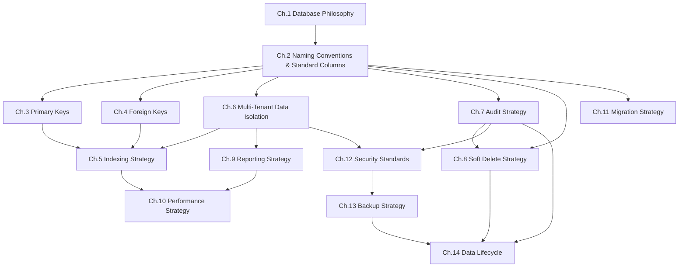
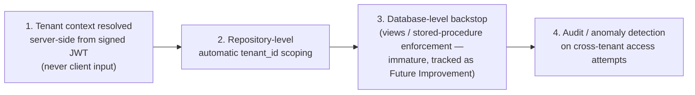
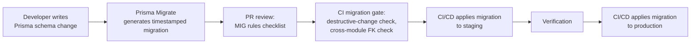
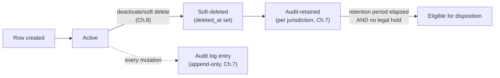

# 06_DATABASE_STANDARDS.md

**Document Type:** Database Engineering Standards Handbook
**Product:** LedgerOne — Cloud Native ERP SaaS
**Status:** In Progress — Chapter 1 of N (awaiting approval before Chapter 2)
**Depends on (frozen, never contradicted):** `00_BUSINESS_RULES.md`, `01_PROJECT_CONTEXT.md`, `02_TECH_STACK.md`, `03_ARCHITECTURE.md`, `04_FOLDER_STRUCTURE.md`, `05_CODING_STANDARDS.md`
**Audience:** Every engineer who writes a Prisma schema, migration, repository, or raw query in LedgerOne. Also the primary reference consumed by AI coding assistants generating database code for this project.

> This is not a schema document. It defines *how* every database object must be designed, not *what* the objects are. No SQL, no Prisma models, no table definitions appear in this handbook — those live in the per-module `.prisma` schema files described in `04_FOLDER_STRUCTURE.md` Ch.11.

---

## Chapter 1 — Database Philosophy

### 1.1 Purpose

LedgerOne is a financial system of record before it is anything else. Every other module — Inventory, Sales, Payroll, Manufacturing — eventually produces a debit or a credit. A database mistake in an ERP does not surface as a broken button; it surfaces as a company's books not balancing, a regulator asking a question the system cannot answer, or one tenant seeing another tenant's revenue.

This chapter establishes the non-negotiable beliefs that every later chapter (naming, keys, indexing, multi-tenancy, audit, soft delete, migrations, security) is derived from. Where a later chapter appears to make an arbitrary choice, the reasoning traces back to one of the principles below. Nothing in this chapter introduces new decisions — it names and justifies decisions already ratified in `03_ARCHITECTURE.md` (Ch.4, Ch.8, Ch.17) and `00_BUSINESS_RULES.md`, and establishes them as the philosophy this handbook enforces.

### 1.2 Core Philosophy

| # | Principle | One-line rationale |
|---|---|---|
| P1 | **The database is the source of truth, not the application.** | Application bugs are fixed in minutes; a corrupted ledger can take months to reconcile, if it can be reconciled at all. |
| P2 | **Explicit beats implicit, everywhere.** | An implicit default (nullable tenant_id, a convention nobody enforces) becomes a production incident the moment one engineer doesn't know the convention. |
| P3 | **Tenant isolation is a database concern, not an application courtesy.** | The application layer will eventually have a bug. The schema must not depend on the application never having one. |
| P4 | **Financial data has zero tolerance for precision loss.** | A rounding error in a `float` column is not a bug ticket, it is a misstated financial statement. |
| P5 | **Nothing that was ever true stops being provable.** | Audit, compliance, and historical reporting all depend on being able to answer "what did this record look like on that date," not just "what does it look like now." |
| P6 | **Schema is code.** | Every schema change is versioned, reviewed, and reproducible — never a manual `ALTER TABLE` run by hand against production. |
| P7 | **Consistency of convention beats local optimization.** | A table that breaks naming/key/audit convention "because this one case is special" costs the whole team forever; the convention itself will have already accounted for the general case. |
| P8 | **Design for the module that isn't built yet.** | LedgerOne ships 15 modules over years, not one module once (`project.md`). Every standard in this handbook must hold for Payroll and Manufacturing, not just for Accounting. |

These are not aspirational. Each has a corresponding enforcement mechanism in §1.6, and each is traceable to a frozen decision:

- P1, P4 → `00_BUSINESS_RULES.md` Ch.7 (Currency, CUR-003), Ch.8 (Time Zone, TZ-002)
- P3 → `03_ARCHITECTURE.md` Ch.4 (Multi-Tenancy, Decision 4.7.2)
- P5 → `03_ARCHITECTURE.md` Ch.17 (Audit & Compliance), `00_BUSINESS_RULES.md` Ch.33/Ch.85
- P6 → `04_FOLDER_STRUCTURE.md` Ch.11 (per-module `.prisma` files, timestamped migrations)
- P2, P7, P8 → derived engineering philosophy for this handbook, consistent with `05_CODING_STANDARDS.md` Ch.6 (Naming) and the "never carve out exceptions for convenience" language of `03_ARCHITECTURE.md` Decision 4.7.2.

### 1.3 Why MySQL 8 (and what that choice commits us to)

MySQL 8 is fixed by `02_TECH_STACK.md` and is not open for reconsideration in this document. What this chapter must do is state what an ERP database engineer needs to *believe* about MySQL 8 to use it correctly:

| Belief | Implication for later chapters |
|---|---|
| InnoDB clustered index means the primary key **is** the row's physical storage order. | Primary keys must be monotonically increasing (Ch.3 — Primary Keys) — this is why the dual-key strategy (bigint internal / uuid external) exists at all. |
| MySQL enforces `utf8mb4` correctly only when explicitly configured. | Character set and collation are standards, not defaults left to the server (Ch.2 — Standard Columns / Ch.9 — Migrations). |
| `DECIMAL` is exact; `FLOAT`/`DOUBLE` are not. | Every monetary column is `DECIMAL`, never a floating-point type — no exception, ever (Ch.2, Ch.6 — Performance, Ch.10 — Security touches on this too since silent precision loss is a data-integrity failure, not just a bug). |
| Foreign keys are enforced by InnoDB but every cross-module FK is architecturally forbidden. | `03_ARCHITECTURE.md` Ch.6.6 forbids cross-module foreign keys at the DB level — a decision this handbook inherits, not revisits (Ch.4 — Foreign Keys). |
| Replication, backup, and point-in-time recovery on AWS RDS MySQL are ops primitives, not application-layer concerns. | Backup/retention/DR strategy (Ch.14) is written against RDS's actual capabilities, not generic MySQL. |

### 1.4 Why Prisma

Prisma is the mandated ORM (`02_TECH_STACK.md`), used behind the Repository pattern (`05_CODING_STANDARDS.md` Ch.14, `04_FOLDER_STRUCTURE.md` Ch.11). The philosophy this handbook applies to Prisma specifically:

- **The schema file is documentation.** A per-module `.prisma` file (Ch.11 of `04_FOLDER_STRUCTURE.md`) must be readable by a new engineer as the definition of that module's data, not just a codegen input.
- **Prisma's camelCase-in-code / snake_case-in-database mapping is deliberate, not incidental.** TypeScript code stays consistent with `05_CODING_STANDARDS.md` Ch.6.3 (camelCase fields), while the database stays consistent with this handbook's `snake_case` table/column convention (Ch.2). Every field needs an explicit `@map`, every model an explicit `@@map` — never left to Prisma's auto-pluralization or casing defaults.
- **The Repository is the only code allowed to import the Prisma client.** This is a `05_CODING_STANDARDS.md` Ch.14 rule this handbook depends on structurally: it is what makes it possible to enforce tenant-scoping (Ch.5 of this handbook) and transactional audit writes (Ch.6) at a single chokepoint instead of trusting every call site.
- **Migrations are Prisma Migrate, run through CI/CD, never `db push` against a shared environment.** Elaborated in Ch.9 (Migration Strategy).

### 1.5 What This Handbook Is Not

To keep every future chapter honest about scope:

- Not a schema — no table or column list. (Those live in `{module}.prisma` files.)
- Not an architecture document — multi-tenancy's *existence* and audit's *existence* are decided in `03_ARCHITECTURE.md`; this handbook defines how they are *implemented at the database level*.
- Not a business rules document — *why* a Chart of Accounts code is never reused is `00_BUSINESS_RULES.md` COA-003; *how* that's enforced at the schema level (unique constraint + soft delete, never hard delete) is this handbook.
- Not permissive of local exceptions. A module that believes it needs to deviate from this handbook requires an ADR (see §1.7), not a silent one-off.

### 1.6 Enforcement Model

Every rule in this handbook (from Chapter 2 onward) will carry a Rule ID, a severity, and an enforcement method, using this shared taxonomy:

**Severity levels**

| Severity | Meaning | Example consequence of violation |
|---|---|---|
| 🔴 Critical | Violates data integrity, tenant isolation, or financial correctness. | Cross-tenant data leak, misstated ledger, unrecoverable audit gap. |
| 🟠 High | Violates a structural convention with system-wide blast radius. | Breaks automated migration tooling, breaks repository codegen assumptions. |
| 🟡 Medium | Violates a convention with local, contained blast radius. | Inconsistent naming in a single module, harder onboarding. |
| ⚪ Low | Style/readability preference. | Non-blocking review comment. |

**Enforcement methods** (a rule should state which of these actually catches a violation — a rule with no enforcement method is a wish, not a standard):

| Method | What it catches |
|---|---|
| Prisma schema lint / custom codegen check | Naming, casing, missing `@map`, missing standard columns |
| CI migration gate | Missing index on FK/tenant_id, disallowed column types (`FLOAT` for money), destructive migrations without an approved flag |
| Repository base class / lint rule | Missing `tenantId` in `where` clause, direct Prisma client usage outside repositories |
| Code review checklist (this handbook's per-chapter Checklist) | Anything not mechanically enforceable yet |
| Runtime / anomaly detection | Cross-tenant access attempts (`03_ARCHITECTURE.md` Ch.4 layer 4) |

### 1.7 Decision Records

This handbook references architectural decisions already made elsewhere rather than re-litigating them. Where this handbook makes a *new* decision not already present in `03_ARCHITECTURE.md` or `00_BUSINESS_RULES.md` (for example, exact `DECIMAL` precision/scale per currency, or exact index composition rules), it will be recorded inline as a numbered Decision with Alternatives Considered and Trade-offs, in the same style as `03_ARCHITECTURE.md`, so a future engineer can find *why* without needing a separate ADR log. Chapter 1 introduces no new decisions of its own — it is the philosophy layer that later decisions must justify themselves against.

### 1.8 Diagram — How This Handbook's Chapters Depend on Each Other



Every downstream chapter inherits P1–P8. Where a downstream rule cannot be justified by at least one principle in §1.2, it does not belong in this handbook.

### 1.9 Examples

**Philosophy applied, not just stated:**

- *P3 in practice*: A repository method is not allowed to omit `tenantId` from a `where` clause even when the caller "knows" the record already belongs to the right tenant (e.g., it was just fetched by a tenant-scoped query earlier in the same function). The database layer does not trust the call site's memory of context — it re-asserts tenant scope on every query, independently.
- *P4 in practice*: A discount percentage might reasonably be a `FLOAT` in a non-financial system. In LedgerOne it is not — every value that participates in a monetary calculation is `DECIMAL`, including intermediate values like tax rates and discount percentages, because a `FLOAT` anywhere in a calculation chain reintroduces the precision risk P4 exists to eliminate.
- *P5 in practice*: Deleting a Customer row when the business rule says "deactivate, never delete" (`00_BUSINESS_RULES.md` CUS-003) is not just a business-rule violation — it is a P5 violation, because it destroys the ability to prove what was once true (that a now-deleted customer had these historical invoices).

### 1.10 Best Practices

- Treat every principle in §1.2 as a question to ask during design review: "does this table design assume the application will always behave correctly?" (P1/P3) "would a rounding error here be recoverable?" (P4).
- When a later chapter's rule feels arbitrary, trace it back to a principle here before assuming it can be relaxed.
- When onboarding a new engineer, have them read this chapter before touching a single `.prisma` file — the naming/key/index rules make more sense once P1–P8 are understood as the reason they exist.

### 1.11 Common Mistakes

| Mistake | Why it happens | Principle violated |
|---|---|---|
| "This table doesn't really need `tenant_id`, it's basically global config" — for something that is actually tenant-owned. | Convenience, or misjudging whether data is platform-owned vs tenant-owned. | P2, P3 |
| Using `FLOAT`/`DOUBLE` for a percentage, tax rate, or exchange rate "because it's not a currency amount." | Underestimating that any value feeding a monetary calculation carries the same risk. | P4 |
| Hard-deleting a row during a bug fix or data cleanup "just this once, in production." | Treating soft delete as a feature toggle rather than a compliance requirement. | P5 |
| Running a manual migration by hand against staging/production instead of through Prisma Migrate + CI. | Time pressure, "it's a small change." | P6 |
| Naming a new table's columns to match a personal preference instead of the established convention. | Not knowing, or not checking, the convention before writing the schema. | P7 |
| Designing a table only for the module's current needs, ignoring that three other modules will reference similar data next year. | Short-horizon thinking. | P8 |

### 1.12 Checklist

Before any schema design work begins on a new table or module, confirm:

- [ ] I can state, in one sentence, why this table needs `tenant_id` or why it is platform-owned and does not.
- [ ] Every monetary or rate-bearing column is planned as `DECIMAL`, not `FLOAT`/`DOUBLE`.
- [ ] I know whether this data requires soft delete or qualifies for the documented hard-delete exception (Ch.8).
- [ ] I know whether this table's mutations require audit trail entries (Ch.7) and, if so, that they'll be written in the same transaction.
- [ ] The schema will be added to this module's `.prisma` file and migrated through Prisma Migrate — not hand-run SQL.
- [ ] I have not introduced a naming or structural exception "just for this table" without an explicit Decision record (§1.7).

### 1.13 Future Considerations

- As LedgerOne's tenant count and data volume grow, §1.3's belief that "MySQL 8 + RDS is sufficient" should be revisited with real production metrics, not re-argued from first principles — this is explicitly a Future Improvement already flagged in `03_ARCHITECTURE.md` (§4.18 area) regarding the database-level tenant isolation backstop (views/stored-procedure enforcement) being immature; this handbook's Ch.6 will need to track that decision's evolution rather than assume it is finished.
- If LedgerOne ever needs a analytical/OLAP workload at a scale the reporting strategy (Ch.9) can't serve from the primary MySQL instance, that would be a new architectural decision (data warehouse, read replica specialization) — out of scope for this handbook until `03_ARCHITECTURE.md` addresses it.
- This chapter's principles (P1–P8) should be treated as stable; if a future chapter needs a P9, it should be added here first, with the same rigor, before being relied upon downstream.

### 1.14 AI Assistant Guidance

When an AI coding assistant (or a human) generates Prisma schema, migrations, or repository code for LedgerOne:

- Never generate a tenant-owned table without `tenant_id`. If unsure whether a table is tenant-owned or platform-owned, stop and ask — do not guess (P2, P3).
- Never generate a `FLOAT`/`DOUBLE` column for any value that is or could feed a monetary calculation (P4).
- Never generate a hard `DELETE` for business data unless the table is on the documented hard-delete-exception list (P5, Ch.8).
- Never generate a manual `ALTER TABLE` / raw SQL migration outside Prisma Migrate's generated migration files (P6).
- Never introduce a naming, key, or column convention that deviates from Chapter 2 onward "for this one table" — flag it as a Decision to be reviewed instead (P7).
- When in doubt about a rule not yet covered by this handbook (chapters not yet written), default to the most conservative interpretation consistent with P1–P8 and flag the gap rather than inventing a convention silently.

### 1.15 Related Documents

| Document | Relationship |
|---|---|
| `00_BUSINESS_RULES.md` | Source of *why* (currency precision, audit retention, deactivate-never-delete rules) |
| `01_PROJECT_CONTEXT.md` | Product scope this database must serve |
| `02_TECH_STACK.md` | Fixes MySQL 8, Prisma, Redis, BullMQ, AWS RDS as non-negotiable technology choices |
| `03_ARCHITECTURE.md` Ch.4, Ch.8, Ch.17 | Source of *what* (multi-tenancy strategy, dual-key ID strategy, audit architecture) this handbook implements *how* |
| `04_FOLDER_STRUCTURE.md` Ch.11 | Where schema/migration files physically live |
| `05_CODING_STANDARDS.md` Ch.6, Ch.14, Ch.20 | TypeScript-side naming, Repository pattern, transaction rules this handbook's database-side rules must interoperate with |

---

## Chapter 2 — Naming Conventions & Standard Columns

### 2.1 Purpose

A naming convention's job is to make a table or column's meaning, ownership, and behavior predictable without reading application code. This chapter turns the existing seed rules (`06_DATABASE_STANDARDS.md`'s original bullets: `snake_case tables`, `created_at/updated_at`, `created_by/updated_by`, `tenant_id on business tables`) into enforceable, complete standards, and defines the shared "standard columns" block every table starts from.

### 2.2 Rules

| Rule ID | Rule | Severity | Enforcement |
|---|---|---|---|
| NAM-001 | Table names are `snake_case`, plural, English nouns (`journal_entries`, not `JournalEntry` or `journal_entry`). | 🟠 High | Prisma schema lint |
| NAM-002 | Column names are `snake_case` (`posted_at`, not `postedAt`). Prisma `@map`/`@@map` bridges to camelCase in application code per `05_CODING_STANDARDS.md` Ch.6.3. | 🟠 High | Prisma schema lint |
| NAM-003 | No abbreviations in table/column names except the list already approved in `05_CODING_STANDARDS.md` Ch.6.7 (`id`, `url`, `dto`, `req`, `res`, `db`). | 🟡 Medium | Code review checklist |
| NAM-004 | Join/pivot tables are named `{table_a}_{table_b}` in alphabetical order (`role_permissions`, not `permission_roles`). | 🟡 Medium | Code review checklist |
| NAM-005 | Boolean columns are prefixed `is_`/`has_` (`is_active`, `has_attachments`), never bare adjectives (`active`). | 🟡 Medium | Prisma schema lint |
| NAM-006 | Foreign key columns are named `{singular_referenced_table}_id` (`company_id`, referencing `companies`). | 🟠 High | Prisma schema lint |
| NAM-007 | Enum-like status columns are named `status`, not `state`/`flag`/module-specific synonyms, unless a table legitimately has more than one independent status dimension. | 🟡 Medium | Code review checklist |
| NAM-008 | Every model has an explicit `@map`/`@@map` in the `.prisma` file — never rely on Prisma's default casing/pluralization inference. | 🟠 High | Prisma schema lint |

### 2.3 Standard Columns

Every table (tenant-owned or platform-owned) starts from this shared block, applied via the shared `base.prisma` fragment (`03_ARCHITECTURE.md` Decision 8.9.2) — never retyped by hand per table:

| Column | Type | Present on | Purpose |
|---|---|---|---|
| `id` | `BIGINT UNSIGNED AUTO_INCREMENT` (PK) | Every table | Internal surrogate key, clustered index order (Ch.3) |
| `uuid` | `CHAR(36)` / `BINARY(16)` | Every table exposed via any API | External identifier, never leaks row count/order (Ch.3) |
| `tenant_id` | `BIGINT UNSIGNED` | Every tenant-owned table only | Tenant discriminator (Ch.6) |
| `created_at` | `DATETIME(3)` | Every table | Row creation timestamp, UTC (§2.5) |
| `updated_at` | `DATETIME(3)` | Every table | Last modification timestamp, UTC, auto-updated |
| `created_by` | `BIGINT UNSIGNED` (nullable for system-generated rows) | Every table with user-attributable writes | User attribution |
| `updated_by` | `BIGINT UNSIGNED` (nullable) | Every table with user-attributable writes | User attribution |
| `deleted_at` | `DATETIME(3)` (nullable) | Every table using soft delete (Ch.8) | Soft delete marker |

A table omitting any of these requires a Decision record (§1.7 pattern) stating why — e.g., a pure platform reference table with no per-row mutation history may reasonably omit `created_by`/`updated_by`.

### 2.4 Character Set & Collation

All tables use `utf8mb4` with `utf8mb4_0900_ai_ci` collation (MySQL 8's Unicode-9-aware, accent/case-insensitive default) — set at schema level, never left to a mismatched server default. This is a §1.3 belief (MySQL 8 enforces `utf8mb4` correctly only when explicit) made concrete.

### 2.5 Timestamp & Timezone Standard

Per `00_BUSINESS_RULES.md` TZ-002, the authoritative posting date/time is the Company/Branch timezone, never the User's display preference. This handbook's database-level elaboration (consistent with, not contradicting, TZ-001/002):

- All `DATETIME`/`TIMESTAMP` columns are stored in **UTC**, always.
- Any column representing a business-authoritative moment (posting date, period-close date) stores UTC and is paired with the Company/Branch's IANA timezone (already a Company/Branch attribute per `00_BUSINESS_RULES.md` Ch.8) for display conversion — the conversion happens at the presentation layer, never by storing localized timestamps.
- `DATETIME(3)` (millisecond precision) is the standard column type — not `TIMESTAMP`, which is range-limited (2038 problem) and has MySQL's implicit auto-update footguns.

### 2.6 Examples

```
-- illustrative only, not a schema definition
journal_entries          (table: snake_case, plural)
  id, uuid, tenant_id, company_id, posted_at, is_reversed, created_at, updated_at, created_by, updated_by, deleted_at
role_permissions         (join table: alphabetical order)
```

### 2.7 Best Practices

- Write the `.prisma` model with `@map`/`@@map` from the first draft — retrofitting mapping later touches every migration.
- When naming a new boolean, say the column name out loud as a yes/no question (`is_active` → "is active?" reads correctly; `active` does not).

### 2.8 Common Mistakes

| Mistake | Fix |
|---|---|
| `camelCase` or `PascalCase` table/column names copied from a TypeScript-first mental model. | Always `snake_case` at the DB layer; let Prisma's mapping bridge to TypeScript casing. |
| Storing local time "because the customer is in one timezone anyway." | Store UTC always; convert at display time, every time, no exceptions. |
| Reusing `TIMESTAMP` out of habit. | Use `DATETIME(3)`. |

### 2.9 Checklist

- [ ] Table name is `snake_case`, plural.
- [ ] Every column is `snake_case`, uses approved abbreviations only.
- [ ] Standard columns block applied (or a Decision recorded for the omission).
- [ ] All timestamps stored UTC as `DATETIME(3)`.
- [ ] `.prisma` model has explicit `@map`/`@@map`.

### 2.10 Future Considerations

- If LedgerOne introduces a table needing per-row field-level history (not just row-level `updated_at`), that is a Ch.7 (Audit) concern, not a new standard column — tracked there, not here.

### 2.11 AI Assistant Guidance

Always generate `snake_case` names with explicit `@map`/`@@map`; always include the standard columns block unless told a table is a documented exception; always use `DATETIME(3)` for timestamps, never `TIMESTAMP` or a bare `DATE` for anything requiring time precision.

### 2.12 Related Documents

`05_CODING_STANDARDS.md` Ch.6 (TypeScript naming this bridges to), `03_ARCHITECTURE.md` Ch.8.4 (standard columns origin), `00_BUSINESS_RULES.md` Ch.8 (Time Zone rules).

---

## Chapter 3 — Primary Keys

### 3.1 Purpose

Defines the dual-key strategy already decided in `03_ARCHITECTURE.md` Decision 8.9.1, and the rules that make it consistent across every table.

### 3.2 Rules

| Rule ID | Rule | Severity | Enforcement |
|---|---|---|---|
| PK-001 | Every table has an internal surrogate `id` (`BIGINT UNSIGNED AUTO_INCREMENT`) as the physical primary key. | 🔴 Critical | Prisma schema lint |
| PK-002 | Every table exposed via any API, URL, or export carries a separate `uuid` column (unique, indexed), generated at insert time (application layer, `uuid` npm package per `02_TECH_STACK.md`). | 🔴 Critical | Prisma schema lint, code review |
| PK-003 | The internal `id` is never serialized to a client, URL, log line visible to customers, or export file. | 🔴 Critical | Code review checklist, DTO/serializer convention (`05_CODING_STANDARDS.md`) |
| PK-004 | No table uses a natural key (email, code, tax ID) as its primary key, even when that value is also unique. | 🟠 High | Code review checklist |
| PK-005 | No table uses `CHAR(36)`/UUID as the physical primary key. | 🔴 Critical | Prisma schema lint |

### 3.3 Standards & Rationale

- **Why bigint auto-increment, not UUID, as PK**: InnoDB clusters rows physically by primary key order (§1.3). A random UUID primary key causes page splits and fragmented I/O under write load — a well-documented InnoDB performance failure mode. Monotonic `bigint` keeps inserts sequential and joins fast.
- **Why a separate `uuid` at all**: exposing the internal auto-increment `id` leaks row count and creation order (competitive/business intelligence leakage) and enables trivial ID-enumeration attacks (`00_BUSINESS_RULES.md`/`03_ARCHITECTURE.md` security posture, elaborated in Ch.12). The `uuid` is the only identifier that ever leaves the database boundary.
- **`BIGINT` not `INT`**: an ERP with years of transactional volume across many tenants will exceed `INT`'s ~2.1B ceiling in high-volume tables (journal lines, audit records) well within the product's lifetime; using `BIGINT` uniformly avoids a future type-migration project.

### 3.4 Examples

A Customer row: internal `id = 48213` used only in FK joins and repository internals; `uuid = 7f3a1e2c-...` is the only identifier that appears in `GET /api/customers/{uuid}` and any customer-facing export.

### 3.5 Best Practices

- Index the `uuid` column explicitly (`UNIQUE`) — it is the lookup path for every external-facing query.
- Generate the `uuid` in the application layer (repository/service), not as a MySQL default expression, to keep generation logic testable and consistent across environments.

### 3.6 Common Mistakes

| Mistake | Fix |
|---|---|
| Using `uuid` as the physical PK "for simplicity." | Keep `bigint` PK; add `uuid` as a second unique column. |
| Leaking `id` in a list endpoint's pagination cursor. | Cursor-based pagination (Ch.9) uses `uuid` or a composite of non-sensitive sortable columns, never raw `id` where it would be customer-visible. |

### 3.7 Checklist

- [ ] PK is `BIGINT UNSIGNED AUTO_INCREMENT`.
- [ ] `uuid` column present and unique-indexed if this table is ever API-exposed.
- [ ] No natural key used as PK.
- [ ] Serializers/DTOs never expose `id`.

### 3.8 Future Considerations

If LedgerOne adopts multi-region active-active writes in the future, auto-increment `bigint` PKs may need a partitioned/offset scheme (e.g., per-region ID ranges) — explicitly out of scope until `03_ARCHITECTURE.md` addresses multi-region write topology.

### 3.9 AI Assistant Guidance

Never generate a UUID primary key. Never expose `id` in any API response, DTO, or log statement reachable by a tenant user. Always pair `id` with `uuid` on any model referenced by a controller.

### 3.10 Related Documents

`03_ARCHITECTURE.md` Decision 8.9.1, Ch.12 (Security Standards, this handbook).

---

## Chapter 4 — Foreign Keys

### 4.1 Purpose

Defines how referential integrity is enforced within a module, and reinforces the already-frozen prohibition on cross-module foreign keys.

### 4.2 Rules

| Rule ID | Rule | Severity | Enforcement |
|---|---|---|---|
| FK-001 | Foreign keys reference the internal `id` (bigint) of the target table, never its `uuid`. | 🔴 Critical | Prisma schema lint |
| FK-002 | Cross-module foreign keys are forbidden at the database level (`03_ARCHITECTURE.md` Ch.6.6). Cross-module references go through application-layer contracts/events, storing the referenced `uuid` as a plain column with no DB-level FK constraint. | 🔴 Critical | CI migration gate (rejects FK constraints spanning module schema files) |
| FK-003 | Every FK column is indexed (see also Ch.5 — Indexing). MySQL does not auto-index FK columns the way some engines do. | 🟠 High | CI migration gate |
| FK-004 | `ON DELETE` behavior is explicit on every FK — never left to the database default. Default posture is `RESTRICT`; `CASCADE` requires a Decision record justifying it (cascading deletes are inherently risky in a system where P5 requires historical provability). | 🟠 High | Prisma schema lint, code review |
| FK-005 | `ON UPDATE CASCADE` is never used — primary keys never change, so there is nothing to cascade. | 🟡 Medium | Prisma schema lint |

### 4.3 Standards & Rationale

- **Within-module FKs are real InnoDB foreign keys.** A Journal Entry's lines referencing its header within the Accounting module is a real, enforced FK — this is where referential integrity genuinely protects the business.
- **Cross-module "references" are eventually-consistent by design.** An Inventory record referencing a Sales Order does not get a DB-level FK; it stores the Sales Order's `uuid` and relies on application-layer validation/events. This is not a weaker form of the same idea — it is deliberate decoupling so modules can be deployed, migrated, and (eventually) scaled independently, per `03_ARCHITECTURE.md`'s modular monolith boundary rules.
- **`RESTRICT` over `CASCADE` by default**: an accidental cascading delete in a financial system can silently destroy historically-required records (violates P5). `CASCADE` is reserved for genuinely dependent child data with no independent audit/reporting value (e.g., a UI-only preferences row).

### 4.4 Examples

`journal_lines.journal_entry_id → journal_entries.id`: real FK, `RESTRICT`, indexed. `inventory_movements.sales_order_uuid`: plain indexed column, no FK constraint, validated via application-layer service call at write time.

### 4.5 Best Practices

- When in doubt whether two tables are "same module," check `04_FOLDER_STRUCTURE.md`'s module boundary list before adding a FK — don't infer it from convenience.
- Name the FK column per NAM-006 even when there's no DB constraint (cross-module), so the relationship is still discoverable by name.

### 4.6 Common Mistakes

| Mistake | Fix |
|---|---|
| Adding a "quick" cross-module FK to make a join easier. | Use the application-layer contract/event pattern instead; the join happens at the read/reporting layer (Ch.9), not via SQL join across module boundaries. |
| Leaving `ON DELETE` unspecified. | Always explicit; default to `RESTRICT`. |
| Un-indexed FK column. | Always index (Ch.5). |

### 4.7 Checklist

- [ ] FK targets `id`, not `uuid`.
- [ ] FK is within-module only; cross-module uses the `uuid`-reference pattern.
- [ ] FK column indexed.
- [ ] `ON DELETE` explicit; `CASCADE` justified by a Decision record if used.

### 4.8 Future Considerations

If a module is ever split out of the modular monolith into a separate service (a possibility `03_ARCHITECTURE.md` leaves open long-term), the cross-module `uuid`-reference pattern is exactly what makes that split possible without a data-migration of foreign keys — this rule is partly insurance for that future.

### 4.9 AI Assistant Guidance

Never generate a foreign key constraint that spans two different modules' schema files. When a relationship crosses modules, generate a plain indexed `{table}_uuid` column and note that application-layer validation is required, not a DB constraint.

### 4.10 Related Documents

`03_ARCHITECTURE.md` Ch.6.6 (cross-module boundary rule), Ch.5 of this handbook (Indexing).

---

## Chapter 5 — Indexing Strategy

### 5.1 Purpose

An ERP database's dominant failure mode under load is not lack of features — it's an unindexed query on a multi-million-row transactional table. This chapter defines the minimum indexing every table must have and how tenant-scoping interacts with index design.

### 5.2 Rules

| Rule ID | Rule | Severity | Enforcement |
|---|---|---|---|
| IDX-001 | Every FK column is indexed. | 🟠 High | CI migration gate |
| IDX-002 | On tenant-owned tables, `tenant_id` is indexed and is the **leading column** of any composite index used for the table's primary access patterns (`03_ARCHITECTURE.md` §4.13/Ch.8.15). | 🔴 Critical | CI migration gate, code review |
| IDX-003 | `uuid` columns are uniquely indexed. | 🟠 High | Prisma schema lint |
| IDX-004 | Composite indexes are ordered most-selective-usable-first after `tenant_id` — equality columns before range columns (e.g., `(tenant_id, status, created_at)`, not `(tenant_id, created_at, status)` if `status` is typically filtered by equality and `created_at` by range). | 🟡 Medium | Code review checklist |
| IDX-005 | No index is added speculatively without a known query pattern that uses it. Every index has a comment (in the `.prisma` file or migration) naming the query/report it serves. | 🟡 Medium | Code review checklist |
| IDX-006 | Soft-deleted rows (`deleted_at IS NULL`) that dominate query volume get a covering/composite index that includes `deleted_at`, avoiding full scans over dead rows. | 🟡 Medium | Code review checklist |

### 5.3 Standards & Rationale

- **Tenant-leading composite indexes** are the single most important indexing rule in this handbook — it is both a performance rule and, combined with Ch.6's mandatory `tenant_id` predicate, a defense-in-depth tenant-isolation mechanism: a query missing its `tenant_id` filter is also a query that can't use its index efficiently, making the mistake visible in slow-query logs before it becomes a security incident.
- **Every index costs write throughput.** Indexes are not free — each one adds insert/update overhead. IDX-005 exists so index proliferation is deliberate, not cargo-culted.
- **Unique constraints double as indexes.** A `UNIQUE(tenant_id, code)` constraint (e.g., Chart of Accounts codes unique per tenant, `00_BUSINESS_RULES.md` COA-003/004) satisfies both the uniqueness rule and the tenant-leading lookup pattern in one index.

### 5.4 Examples

```
-- illustrative
journal_entries: INDEX (tenant_id, company_id, posted_at)   -- primary listing/report query
journal_entries: UNIQUE (uuid)
chart_of_accounts: UNIQUE (tenant_id, code)                  -- COA-003/004 code uniqueness, tenant-scoped
```

### 5.5 Best Practices

- Validate new indexes against `EXPLAIN` on realistic data volume before merging, not just against an empty dev database.
- Periodically review `information_schema` for unused indexes (via RDS Performance Insights) — this is a Ch.10 (Performance) recurring practice, seeded here.

### 5.6 Common Mistakes

| Mistake | Fix |
|---|---|
| Composite index with `tenant_id` not first. | Reorder — `tenant_id` always leads. |
| Adding an index "just in case" for a report that doesn't exist yet. | Wait for the actual query pattern (Ch.9 defines reporting access patterns first). |
| Indexing every column individually instead of the composite pattern actually queried. | Design indexes around real `WHERE`/`ORDER BY` clauses, not per-column reflexes. |

### 5.7 Checklist

- [ ] Every FK indexed.
- [ ] `tenant_id` leads every tenant-owned table's composite indexes.
- [ ] `uuid` uniquely indexed.
- [ ] Each index's purpose is documented.

### 5.8 Future Considerations

As reporting workloads grow (Ch.9), some indexes may need to move to a read-replica-only covering-index strategy rather than burdening the primary write path — flagged for Ch.10/Ch.9 to develop further, not decided here.

### 5.9 AI Assistant Guidance

Always index FK columns. Always place `tenant_id` first in composite indexes on tenant-owned tables. Never propose a speculative index without naming the query it serves.

### 5.10 Related Documents

Ch.6 (Multi-Tenant Isolation), Ch.9 (Reporting Strategy), Ch.10 (Performance Strategy).

---

## Chapter 6 — Multi-Tenant Data Isolation

### 6.1 Purpose

Implements, at the database level, the shared-database/tenant-discriminator strategy already decided in `03_ARCHITECTURE.md` Ch.4. This is the highest-severity chapter in this handbook: a violation here is a cross-tenant data breach, not a bug.

### 6.2 Rules

| Rule ID | Rule | Severity | Enforcement |
|---|---|---|---|
| MT-001 | Every tenant-owned table carries `tenant_id` (`BIGINT UNSIGNED`, FK to the tenant registry), with no convenience exceptions (`03_ARCHITECTURE.md` Decision 4.7.2). | 🔴 Critical | Prisma schema lint |
| MT-002 | Every repository query against a tenant-owned table includes `tenant_id` in its `where` clause. No query method may omit it silently. | 🔴 Critical | Repository base class / lint rule |
| MT-003 | Any repository method that legitimately needs cross-tenant access (platform admin tooling, migrations) is separately named (e.g., `findAcrossTenantsForAdmin`) and requires its own code review sign-off — it is never the default method. | 🔴 Critical | Code review checklist |
| MT-004 | `tenant_id` is never sourced from client-supplied input (URL, body, header) — only from the server-resolved session/JWT context (`03_ARCHITECTURE.md` §4.5). | 🔴 Critical | Code review checklist, runtime/anomaly detection |
| MT-005 | Platform-owned tables (system config, marketplace catalog, reference data) do not carry `tenant_id` and are explicitly documented as platform-owned in their `.prisma` file comment. | 🟠 High | Code review checklist |
| MT-006 | Redis cache keys touching tenant data are tenant-prefixed with the same severity as the DB rule (`03_ARCHITECTURE.md` Ch.12.4). | 🔴 Critical | Code review checklist |

### 6.3 Standards & Rationale

This chapter implements the four defense-in-depth layers already defined in `03_ARCHITECTURE.md` Ch.4 from the database engineer's point of view:



- Layer 1 and 4 are application/platform concerns owned by `03_ARCHITECTURE.md`; this handbook is authoritative for Layer 2 (MT-001–004) and tracks Layer 3 as an open item (§6.6).
- **Why no exceptions for "obviously fine" tables**: `03_ARCHITECTURE.md` Decision 4.7.2 explicitly rejects convenience carve-outs. A table that seems tenant-agnostic today (e.g., a lookup table) can become tenant-specific tomorrow (tenant-customizable categories) — retrofitting `tenant_id` onto an existing table with data is far more expensive than including it from day one on any table with even a plausible future tenant dimension. Only genuinely platform-owned reference data (MT-005) is exempt.

### 6.4 Examples

A `CompanyRepository.findByUuid(uuid)` method must resolve `tenant_id` from the authenticated session and filter `WHERE tenant_id = ? AND uuid = ?` — never `WHERE uuid = ?` alone, even though `uuid` is globally unique, because relying on `uuid`'s global uniqueness as an implicit isolation mechanism violates MT-002's explicit-filter requirement and P3 (isolation is a database concern, not an incidental side effect).

### 6.5 Best Practices

- Build tenant-scoping into a shared repository base class so every concrete repository inherits it rather than reimplementing the `where` clause per method (this is the Repository-pattern chokepoint referenced in §1.4).
- Log and alert on any query executed without a resolvable tenant context outside the explicitly-named cross-tenant admin methods (MT-003).

### 6.6 Common Mistakes

| Mistake | Fix |
|---|---|
| Filtering by `uuid` alone because it's globally unique anyway. | Always include `tenant_id` explicitly — uniqueness is not isolation. |
| Trusting a `tenantId` passed in a request body/query param. | Resolve tenant context only from the signed session server-side. |
| Adding a "just this one" table without `tenant_id` because "it doesn't feel tenant-specific yet." | Default to including it unless the table is genuinely platform-owned (MT-005). |

### 6.7 Checklist

- [ ] Table has `tenant_id` or is documented as platform-owned.
- [ ] Every non-admin repository method filters by `tenant_id`.
- [ ] `tenant_id` is never read from client input.
- [ ] Any cross-tenant method is separately named and reviewed.
- [ ] Related Redis keys are tenant-prefixed.

### 6.8 Future Considerations

Layer 3 (database-level backstop via views or stored-procedure-level enforcement scoped by session-level tenant context) is explicitly flagged in `03_ARCHITECTURE.md` as immature/not-yet-validated. This handbook will incorporate a concrete standard for Layer 3 once `03_ARCHITECTURE.md` finalizes that decision — until then, Layers 1/2/4 are the enforced standard and MT rules above are not to be weakened in anticipation of Layer 3 arriving.

### 6.9 AI Assistant Guidance

Never generate a repository query against a tenant-owned table without a `tenant_id` filter. Never resolve `tenant_id` from request input. When generating a new table, default to including `tenant_id` unless explicitly told the table is platform-owned reference data.

### 6.10 Related Documents

`03_ARCHITECTURE.md` Ch.4 (Multi-Tenancy, Decision 4.7.2), Ch.12.4 (cache key rules), Ch.5 of this handbook (Indexing — tenant-leading composite indexes).

---

## Chapter 7 — Audit Strategy

### 7.1 Purpose

Implements, at the database level, the append-only audit architecture already decided in `03_ARCHITECTURE.md` Ch.17 and the retention rules in `00_BUSINESS_RULES.md` Ch.33/Ch.85 (AUD-001/002/003, AUD-102).

### 7.2 Rules

| Rule ID | Rule | Severity | Enforcement |
|---|---|---|---|
| AUD-D-001 | Audit records are stored in a distinct audit store/table set, separate from transactional tables, per `03_ARCHITECTURE.md` Ch.17. | 🟠 High | Code review checklist |
| AUD-D-002 | Audit tables are append-only: no `UPDATE` or `DELETE` statement is ever issued against them by application code. | 🔴 Critical | Repository base class (no update/delete methods exposed), CI migration gate rejects `ON DELETE CASCADE`/triggers implying mutation |
| AUD-D-003 | Every audit record insert happens inside the same database transaction as the business mutation it records (`05_CODING_STANDARDS.md` Ch.20 `$transaction` rule). | 🔴 Critical | Code review checklist, repository pattern |
| AUD-D-004 | Audit writes go through shared Business-layer infrastructure — no module reimplements its own audit logging. | 🟠 High | Code review checklist |
| AUD-D-005 | Audit retention follows the strictest applicable statutory/regulatory requirement per Company jurisdiction (`00_BUSINESS_RULES.md` AUD-002/AUD-102) — never shortened for storage convenience, and enforced by a scheduled tenant-scoped job, never ad hoc deletion. | 🔴 Critical | Code review checklist, scheduled job code review |
| AUD-D-006 | Audit records carry enough data to reconstruct full historical state (before/after values), not merely "a change occurred" (AUD-003). | 🔴 Critical | Code review checklist |

### 7.3 Standards & Rationale

- **Separate store, separate access path**: audit queries (compliance export, "who changed this") have different volume and access patterns than transactional queries. Co-locating them in the same tables/indexes as hot transactional paths would let audit read load degrade day-to-day performance, and vice versa (`03_ARCHITECTURE.md` Ch.17 rationale).
- **Same-transaction write**: if the audit insert happened in a separate transaction (or worse, an async job) and the business write succeeded while the audit write failed, the system would have a business change with no provable audit trail — a direct P5 violation. They succeed or fail together.
- **No bespoke per-module audit logging**: consistent audit shape (before/after, actor, timestamp, tenant) is what makes cross-module compliance reporting (Ch.9) possible at all; a module inventing its own audit table shape breaks that.

### 7.4 Examples

Posting a Journal Entry: within one `$transaction`, the application writes the `journal_entries`/`journal_lines` rows AND an `audit_log` row capturing `{tenant_id, actor_user_id, entity_type: 'journal_entry', entity_uuid, action: 'post', before: null, after: {...}, occurred_at}`. If either write fails, both roll back.

### 7.5 Best Practices

- Model the audit table(s) to be queried by `(tenant_id, entity_type, entity_uuid, occurred_at)` — this is the dominant "show me the history of this record" access pattern, and should lead the composite index (consistent with Ch.5/Ch.6).
- Treat the audit retention job as tenant-scoped and idempotent — re-running it must not double-delete or skip records.

### 7.6 Common Mistakes

| Mistake | Fix |
|---|---|
| Writing the audit record in an async job/queue after the business transaction commits. | Write in the same `$transaction` — never decouple audit from the mutation it documents. |
| Allowing an `UPDATE` "to fix a typo in an audit record." | Audit records are never mutated; a correction is itself a new audit record. |
| Each module building its own `{module}_audit_log` table with a different shape. | Use the shared audit infrastructure (AUD-D-004). |
| Deleting old audit records via an ad hoc script "to save space." | Retention deletion only via the scheduled, tenant-scoped, jurisdiction-aware job (AUD-D-005). |

### 7.7 Checklist

- [ ] Audit write is in the same transaction as the business mutation.
- [ ] Audit table lives in the distinct audit store, not co-located with hot transactional tables.
- [ ] No repository method exposes update/delete against audit tables.
- [ ] Retention policy references jurisdiction-specific rules, not a hardcoded global default.

### 7.8 Future Considerations

If audit data volume eventually requires archival to cold storage (S3) rather than living entirely in MySQL, that is a Ch.14 (Data Lifecycle) concern to develop — this chapter's rules (append-only, same-transaction write) remain valid regardless of where the data physically lives long-term.

### 7.9 AI Assistant Guidance

Never generate an audit table with update/delete repository methods. Always generate audit inserts inside the same `$transaction` as the business write they document. Never let a module define its own bespoke audit table — route through shared audit infrastructure.

### 7.10 Related Documents

`03_ARCHITECTURE.md` Ch.17, `00_BUSINESS_RULES.md` Ch.33/Ch.85 (AUD-001/002/003/102), `05_CODING_STANDARDS.md` Ch.20 (Transactions), Ch.14 of this handbook (Data Lifecycle).

---

## Chapter 8 — Soft Delete Strategy

### 8.1 Purpose

Implements, at the database level, the soft-delete-by-default rule already decided in `03_ARCHITECTURE.md` §8.6/Decision 8.9.3 and reflected throughout `00_BUSINESS_RULES.md`'s "deactivate, never delete" entity rules.

### 8.2 Rules

| Rule ID | Rule | Severity | Enforcement |
|---|---|---|---|
| SD-001 | Soft delete (`deleted_at` nullable `DATETIME(3)`) is the default for all business/tenant data. | 🔴 Critical | Prisma schema lint |
| SD-002 | Hard deletion is permitted only for tables on an explicit, documented exception list, each with a named Decision record justifying the exception (e.g., expired session tokens). | 🔴 Critical | Code review checklist |
| SD-003 | Every read query against a soft-deletable table filters `deleted_at IS NULL` by default; "include deleted" is an explicit, separately-named query variant, never the default. | 🔴 Critical | Repository base class |
| SD-004 | Unique constraints on soft-deletable tables include `deleted_at` (or a generated/computed column deriving from it) so a "deleted" code/email can be reused without violating uniqueness against a live row — except where the business rule explicitly forbids reuse (e.g., Chart of Accounts codes, COA-003/004, which are never reused even after deactivation). | 🟠 High | Code review checklist |
| SD-005 | Soft-deleting a row never cascades to hard-delete related rows; related rows are independently soft-deleted or left intact per their own lifecycle rules. | 🟠 High | Code review checklist |

### 8.3 Standards & Rationale

- **Default-soft, exception-hard** mirrors `03_ARCHITECTURE.md` Decision 8.9.3 exactly — hard delete requires justification, not the reverse, because P5 (nothing that was ever true stops being provable) is the default assumption for financial/business data.
- **The `deleted_at`-in-unique-constraint pattern** resolves a common real conflict: a Customer named "Acme Corp" is deactivated, and a genuinely new "Acme Corp" customer is onboarded later — without this pattern, the unique constraint on `(tenant_id, name)` would incorrectly block the new row. This does not apply to COA codes, which `00_BUSINESS_RULES.md` explicitly says are never reused (COA-003/004) — that exception is a business rule, not a database limitation, and this handbook does not override it.

### 8.4 Examples

`customers`: `UNIQUE(tenant_id, email, deleted_at)` (MySQL allows multiple `NULL`s in a unique index, so this correctly permits one active + any number of soft-deleted rows sharing an email). `chart_of_accounts`: `UNIQUE(tenant_id, code)` with no `deleted_at` in the constraint, per COA-003/004's never-reuse rule.

### 8.5 Best Practices

- Build the `deleted_at IS NULL` filter into the shared repository base class alongside `tenant_id` scoping (Ch.6) — the two filters travel together on almost every query.
- Document, per table, which unique constraints include `deleted_at` and which don't, and why — this is exactly the kind of "looks like an inconsistency" case that needs a one-line rationale so it isn't "fixed" incorrectly later.

### 8.6 Common Mistakes

| Mistake | Fix |
|---|---|
| Hard-deleting a row during a support/data-cleanup task. | Soft delete; hard delete only via the documented exception list. |
| Forgetting `deleted_at IS NULL` on a report query, showing deactivated records as active. | Bake the filter into the base repository so it can't be forgotten. |
| Applying the `deleted_at`-in-unique-constraint pattern to Chart of Accounts codes. | Don't — COA codes are never reused regardless of soft delete (COA-003/004). |

### 8.7 Checklist

- [ ] Table has `deleted_at` unless on the hard-delete exception list.
- [ ] Default queries filter `deleted_at IS NULL`.
- [ ] Unique constraints correctly include or exclude `deleted_at` per the underlying business rule.
- [ ] No cascading hard deletes triggered by a soft delete.

### 8.8 Future Considerations

`03_ARCHITECTURE.md` §8.18 flags a possible future archival strategy for high-volume, low-value soft-deleted tables — deferred there and here; not yet a standard.

### 8.9 AI Assistant Guidance

Never generate a hard `DELETE` repository method for business data unless the table is explicitly named as a hard-delete exception. Always default generated read queries to `deleted_at IS NULL`. When generating a unique constraint, ask whether the underlying business rule (e.g., COA-003/004) forbids value reuse before deciding whether to include `deleted_at` in it.

### 8.10 Related Documents

`03_ARCHITECTURE.md` §8.6/Decision 8.9.3, `00_BUSINESS_RULES.md` (USR-003, CUS-003, VEN-002, EMP-003, COA-003/004, BRN-003, DPT-003, WHS-002, BNK-002).

---

## Chapter 9 — Reporting Strategy

### 9.1 Purpose

Defines how reporting/analytical read patterns coexist with transactional write patterns on the same MySQL 8 instance without one degrading the other, consistent with `03_ARCHITECTURE.md` Ch.18 (Reporting / Read Models).

### 9.2 Rules

| Rule ID | Rule | Severity | Enforcement |
|---|---|---|---|
| RPT-001 | Reporting queries never join across module boundaries at the SQL level (consistent with FK-002); cross-module reporting reads from denormalized read models/materialized views built by application-layer aggregation, not ad hoc cross-schema SQL joins. | 🟠 High | Code review checklist |
| RPT-002 | Heavy/long-running report queries execute against a read replica where available, never the primary write instance, once replica infrastructure exists. | 🟠 High | Code review checklist, ops runbook |
| RPT-003 | Every reporting table/view carries `tenant_id` leading its indexes, identical to Ch.5/Ch.6 rules — reporting data is not exempt from tenant isolation. | 🔴 Critical | Code review checklist |
| RPT-004 | Pagination for large result sets uses cursor-based pagination (keyset, on an indexed column), not `OFFSET`, once offsets would scan past a few thousand rows. | 🟡 Medium | Code review checklist |
| RPT-005 | Report-specific denormalized tables are clearly named (`{domain}_report_*` or `{domain}_summary_*`) and documented as derived data, never treated as a second source of truth. | 🟡 Medium | Code review checklist |

### 9.3 Standards & Rationale

- **No cross-module SQL joins, even for reporting**: this is FK-002's boundary rule applied to reads. A report needing Sales + Inventory data assembles it at the application/read-model layer, preserving the modular monolith's module independence even under reporting pressure — otherwise reporting becomes the backdoor that quietly re-couples every module.
- **`OFFSET` pagination degrades linearly with offset depth** (MySQL must scan and discard all preceding rows) — at ERP transactional volumes this becomes a real bottleneck well before "big data" scale. Keyset pagination (`WHERE (created_at, id) > (?, ?) ORDER BY created_at, id LIMIT ?`) stays fast regardless of depth.

### 9.4 Examples

A "Sales by Customer, with current Inventory levels" report does not `JOIN` the `sales` and `inventory` schemas directly; it reads a `sales_summary` table (maintained by the Sales module) and an `inventory_summary` table (maintained by Inventory) and combines them at the application/reporting-service layer.

### 9.5 Best Practices

- Treat any denormalized reporting table as rebuildable from source-of-truth transactional tables at any time — never let it drift into being the only place a fact is recorded (that would violate P1).
- Prefer keyset pagination from the start for any table expected to grow past low-thousands of rows per tenant.

### 9.6 Common Mistakes

| Mistake | Fix |
|---|---|
| A "quick" cross-schema SQL join to make a report easier to write. | Build a denormalized read model instead; keep module boundaries intact. |
| `OFFSET 50000 LIMIT 20` in a "recent activity" report. | Keyset pagination on an indexed, monotonic column. |
| Treating a report summary table as authoritative when it disagrees with the source transactional tables. | The transactional tables are always the source of truth (P1); the summary is derived and must be rebuilt/reconciled if it drifts. |

### 9.7 Checklist

- [ ] No cross-module SQL join in a reporting query.
- [ ] `tenant_id` leads reporting table/view indexes.
- [ ] Large result sets use keyset pagination.
- [ ] Denormalized report tables are named and documented as derived, not authoritative.

### 9.8 Future Considerations

If reporting workloads eventually justify a dedicated analytical store (columnar warehouse, read-replica specialization), that is a new `03_ARCHITECTURE.md`-level decision, not something this handbook decides preemptively (consistent with §1.13).

### 9.9 AI Assistant Guidance

Never generate a SQL join across module boundaries for a report. Never generate `OFFSET`-based pagination for a result set expected to grow large — default to keyset pagination.

### 9.10 Related Documents

`03_ARCHITECTURE.md` Ch.18, Ch.4 of this handbook (Foreign Keys, cross-module rule), Ch.5 (Indexing).

---

## Chapter 10 — Performance Strategy

### 10.1 Purpose

Defines the recurring engineering practices that keep the database performant as tenants and data volume scale, building on the indexing (Ch.5) and reporting (Ch.9) chapters.

### 10.2 Rules

| Rule ID | Rule | Severity | Enforcement |
|---|---|---|---|
| PERF-001 | Every new query added in a PR is validated with `EXPLAIN` against realistic data volume before merge, not just an empty local database. | 🟡 Medium | Code review checklist |
| PERF-002 | N+1 query patterns are forbidden in repository methods — batch/`IN`-clause loading or a join replaces per-row loop queries. | 🟠 High | Code review checklist |
| PERF-003 | Connection pool sizing and slow-query logging are configured and monitored via AWS RDS Performance Insights, not left at defaults. | 🟡 Medium | Ops runbook |
| PERF-004 | Any query expected to scan more than a documented row-count threshold (set per table based on realistic tenant data volume) requires either an index redesign or a denormalized read model (Ch.9) before shipping. | 🟠 High | Code review checklist |
| PERF-005 | Redis caching (per `02_TECH_STACK.md`) is used for expensive, infrequently-changing, tenant-scoped reads — cache keys always tenant-prefixed (MT-006) with an explicit TTL, never cached indefinitely without an invalidation path. | 🟠 High | Code review checklist |

### 10.3 Standards & Rationale

- Performance problems in an ERP surface as user-visible slowness during month-end close and period-end reporting — exactly the moments when the business most needs the system to be fast and reliable. Treating performance as a review-time gate (PERF-001/002/004) rather than a post-incident fix is deliberate.
- Caching (PERF-005) must always be invalidatable — a stale cached balance in a financial system is a correctness bug, not just a UX annoyance, so every cache entry needs an explicit TTL and, wherever feasible, an active invalidation trigger on write.

### 10.4 Examples

A repository method fetching line items for 50 invoices in a loop (`for each invoice: SELECT * FROM lines WHERE invoice_id = ?`) is an N+1 violation; the fix is `SELECT * FROM lines WHERE invoice_id IN (?, ?, ...)` or a proper join, loaded once.

### 10.5 Best Practices

- Add slow-query alerting thresholds tuned per table's expected volume, not one global threshold for the whole database.
- Prefer denormalized read models (Ch.9) over increasingly exotic indexes when a query's access pattern is fundamentally reporting-shaped.

### 10.6 Common Mistakes

| Mistake | Fix |
|---|---|
| Looping over records in application code to fetch related rows one at a time. | Batch-load with `IN` or a join. |
| Caching a financial balance with no invalidation on write. | Invalidate (or short-TTL) any cached value derived from mutable financial data. |
| Assuming local dev database performance reflects production. | Validate with `EXPLAIN` against realistic volume. |

### 10.7 Checklist

- [ ] New queries validated with `EXPLAIN` at realistic volume.
- [ ] No N+1 pattern introduced.
- [ ] Any cache entry has a TTL and an invalidation path.
- [ ] Slow-query thresholds considered for high-volume tables touched.

### 10.8 Future Considerations

As tenant count grows, per-tenant noisy-neighbor effects on shared MySQL 8 may need connection/resource governance beyond RDS defaults — tracked as an open item for future revision of this chapter alongside `03_ARCHITECTURE.md`'s infrastructure decisions.

### 10.9 AI Assistant Guidance

Never generate a loop that issues one query per iteration when a batched query is possible. Always propose a TTL and invalidation strategy when generating caching code for financial data.

### 10.10 Related Documents

Ch.5 (Indexing), Ch.9 (Reporting), `02_TECH_STACK.md` (Redis), `03_ARCHITECTURE.md` Ch.21.

---

## Chapter 11 — Migration Strategy

### 11.1 Purpose

Defines how schema changes move from a developer's machine to production safely, implementing P6 ("schema is code") concretely and consistent with `04_FOLDER_STRUCTURE.md` Ch.11's per-module migration folder structure.

### 11.2 Rules

| Rule ID | Rule | Severity | Enforcement |
|---|---|---|---|
| MIG-001 | All schema changes go through Prisma Migrate, generating a timestamped migration file per `04_FOLDER_STRUCTURE.md`'s `{timestamp}_{description}` convention — never `prisma db push` against a shared (staging/production) environment. | 🔴 Critical | CI migration gate |
| MIG-002 | Migrations run through CI/CD only; no engineer runs a migration by hand against staging or production. | 🔴 Critical | CI/CD pipeline, ops policy |
| MIG-003 | Destructive migrations (dropping a column/table, narrowing a type) require an explicit approval flag and a documented rollback/backfill plan — CI blocks them by default. | 🔴 Critical | CI migration gate |
| MIG-004 | Migrations affecting large tables use an online-schema-change-safe pattern (add nullable column → backfill in batches → add constraint, rather than a single blocking `ALTER TABLE` with `NOT NULL DEFAULT` on a huge table). | 🟠 High | Code review checklist |
| MIG-005 | Each module's migrations live in that module's own migration folder (`04_FOLDER_STRUCTURE.md` Ch.11.5); there is no shared/global migration history, consistent with the no-cross-module-FK rule. | 🟠 High | CI migration gate |
| MIG-006 | Every migration is reversible in principle (a documented down-path exists) even if MySQL/Prisma's tooling doesn't auto-generate the down migration. | 🟡 Medium | Code review checklist |

### 11.3 Standards & Rationale

- **CI-only migrations** close the gap that "just this once, run it by hand" always opens — a hand-run migration is exactly the kind of shortcut P6 exists to prevent, and it's also unauditable (violates P5 in spirit — there'd be no reliable record of when/how the schema changed).
- **Batched online-schema-change pattern** avoids the classic ERP-scale incident: an `ALTER TABLE ADD COLUMN ... NOT NULL` on a 50-million-row journal_lines table taking an exclusive lock for the duration of the migration, causing an outage during business hours. MIG-004 makes the safe multi-step pattern the default expectation, not something invoked only after an incident.

### 11.4 Diagram — Migration Flow



### 11.5 Examples

Adding a required `settlement_currency` column to a large `payments` table: (1) add nullable column, (2) backfill in batches via a scripted job, (3) follow-up migration adds `NOT NULL` constraint once backfill is verified complete — three migrations, never one blocking statement.

### 11.6 Best Practices

- Always generate the migration via Prisma Migrate locally, review the generated SQL, then commit both schema and migration file together.
- Treat migration PRs as a distinct review category — a schema change deserves the same scrutiny as a financial calculation change.

### 11.7 Common Mistakes

| Mistake | Fix |
|---|---|
| Running `prisma db push` against staging to "save time." | Always go through a generated migration + CI. |
| A single `ALTER TABLE` adding a `NOT NULL` column to a huge table. | Use the add-nullable → backfill → constrain pattern. |
| Dropping a column in the same migration that stops using it in code. | Deploy code that stops using the column first; drop the column in a later migration, after confirming nothing still reads it. |

### 11.8 Checklist

- [ ] Migration generated via Prisma Migrate, not `db push`.
- [ ] Destructive changes flagged and approved explicitly.
- [ ] Large-table changes use the batched online pattern.
- [ ] Migration lives in the correct module's folder.
- [ ] Rollback path documented.

### 11.9 Future Considerations

As table sizes grow, LedgerOne may need a dedicated online-schema-change tool (e.g., `gh-ost`/`pt-online-schema-change`) beyond Prisma Migrate's native capability for the largest tables — an infrastructure decision to be made with `03_ARCHITECTURE.md` when volume warrants it, not decided preemptively here.

### 11.10 AI Assistant Guidance

Never generate raw SQL to be run manually against staging/production. Always generate changes as Prisma schema edits producing a Prisma Migrate migration file. For any migration touching a column with `NOT NULL` on an existing table, always propose the batched backfill pattern rather than a single blocking statement.

### 11.11 Related Documents

`04_FOLDER_STRUCTURE.md` Ch.11, Ch.4 of this handbook (cross-module FK rule extended to migrations).

---

## Chapter 12 — Security Standards

### 12.1 Purpose

Consolidates database-level security rules that support `03_ARCHITECTURE.md`'s multi-tenancy and `00_BUSINESS_RULES.md`'s audit/compliance posture, and `09_SECURITY_GUIDELINES.md`'s RBAC/audit-logging requirements.

### 12.2 Rules

| Rule ID | Rule | Severity | Enforcement |
|---|---|---|---|
| SEC-001 | Internal `id` values are never exposed in any client-facing surface (API, URL, export, log reachable by a tenant user) — `uuid` only (reinforces PK-003). | 🔴 Critical | Code review checklist, DTO convention |
| SEC-002 | Database credentials are never hardcoded or committed; sourced from AWS-managed secrets, rotated per ops policy. | 🔴 Critical | CI secret-scanning |
| SEC-003 | The application's database user has the minimum privilege needed (no `DROP`/`ALTER` grants for the runtime application user — schema changes use a separate, more privileged migration-only credential). | 🟠 High | Ops/infra review |
| SEC-004 | Sensitive columns (bank account numbers, tax IDs, government IDs) are encrypted at the application layer before storage (column-level encryption), not stored plaintext relying solely on RDS at-rest encryption. | 🔴 Critical | Code review checklist |
| SEC-005 | Every cross-tenant-capable query (MT-003) is logged with actor identity, consistent with audit strategy (Ch.7) and `09_SECURITY_GUIDELINES.md`'s audit logging requirement. | 🔴 Critical | Code review checklist |
| SEC-006 | SQL injection is structurally prevented by exclusive use of Prisma's parameterized query API — raw SQL (`$queryRaw`) is permitted only with parameterized placeholders, never string-concatenated input. | 🔴 Critical | Code review checklist, lint rule |

### 12.3 Standards & Rationale

- **RDS at-rest encryption is necessary but not sufficient** for the most sensitive fields — it protects against physical disk compromise, not against an authorized-but-compromised application-tier credential reading plaintext bank details. Application-layer column encryption (SEC-004) adds a second boundary.
- **Least-privilege DB credentials** (SEC-003) mean a SQL-injection or compromised-credential incident in the runtime path cannot itself alter schema or drop tables — it's a blast-radius control independent of application-layer input validation.

### 12.4 Examples

A `bank_accounts.account_number` column stores an application-layer-encrypted value (e.g., AES-256-GCM via a KMS-backed key), never plaintext, even though RDS storage is already encrypted at rest.

### 12.5 Best Practices

- Treat `$queryRaw` as an exception requiring review, not a routine escape hatch — Prisma's query builder should cover the overwhelming majority of needs.
- Rotate the migration-privileged credential separately from and less frequently exposed than the runtime application credential.

### 12.6 Common Mistakes

| Mistake | Fix |
|---|---|
| Storing a tax ID or bank account number in plaintext, relying on "RDS is encrypted anyway." | Encrypt at the application layer for genuinely sensitive fields. |
| Building a raw SQL string with template interpolation of user input. | Use Prisma's parameterized query API exclusively. |
| Giving the runtime application DB user `ALTER`/`DROP` privileges "for convenience." | Separate migration credential, minimum-privilege runtime credential. |

### 12.7 Checklist

- [ ] No `id` ever appears in a client-facing surface.
- [ ] Sensitive columns are application-layer encrypted.
- [ ] Runtime DB credential has minimum necessary privileges.
- [ ] No string-concatenated raw SQL anywhere.
- [ ] Cross-tenant-capable queries are logged with actor identity.

### 12.8 Future Considerations

If LedgerOne pursues a compliance certification (SOC 2, ISO 27001) requiring formal key-rotation schedules or field-level encryption audits, this chapter will need dedicated sub-rules per certification requirement — tracked as a future expansion, not yet in scope.

### 12.9 AI Assistant Guidance

Never generate code that exposes an internal `id`. Never generate raw SQL with string-interpolated user input. Always suggest application-layer encryption when generating a schema field for bank/tax/government ID data.

### 12.10 Related Documents

`09_SECURITY_GUIDELINES.md`, Ch.3 (Primary Keys), Ch.6 (Multi-Tenant Isolation), Ch.7 (Audit Strategy).

---

## Chapter 13 — Backup Strategy

### 13.1 Purpose

Defines database backup, retention, and recovery expectations on AWS RDS MySQL, consistent with `10_DEPLOYMENT_ARCHITECTURE.md`'s ECS/RDS topology.

### 13.2 Rules

| Rule ID | Rule | Severity | Enforcement |
|---|---|---|---|
| BAK-001 | AWS RDS automated backups are enabled with point-in-time recovery, retention set to the maximum period justified by the strictest applicable audit/compliance requirement (consistent with Ch.7's retention posture). | 🔴 Critical | Ops/infra review |
| BAK-002 | A documented, periodically-tested restore procedure exists — an untested backup is not considered a valid backup. | 🟠 High | Ops runbook, scheduled DR drill |
| BAK-003 | Cross-region backup replication is in place for disaster recovery, matching the business continuity requirements of a financial system of record. | 🟠 High | Ops/infra review |
| BAK-004 | Backup and snapshot data is subject to the same encryption-at-rest and access-control standards as production (Ch.12) — a backup is not a lower-security copy of the data. | 🔴 Critical | Ops/infra review |

### 13.3 Standards & Rationale

Backups exist to make P1 and P5 true in practice, not just in policy: "the database is the source of truth" and "nothing that was ever true stops being provable" both fail the moment a backup can't actually be restored. BAK-002 exists because an unverified backup is a false sense of security — the only backup that counts is one that has been proven restorable.

### 13.4 Examples

A quarterly DR drill restores the latest automated RDS snapshot into an isolated environment and validates row counts and referential integrity against a known checkpoint, documented in an ops runbook.

### 13.5 Best Practices

- Keep restore-time objectives (RTO) and recovery-point objectives (RPO) explicit and reviewed alongside `10_DEPLOYMENT_ARCHITECTURE.md`'s infrastructure decisions, not left implicit.

### 13.6 Common Mistakes

| Mistake | Fix |
|---|---|
| Assuming automated backups exist and are sufficient without ever testing a restore. | Schedule and document periodic restore drills. |
| Treating snapshot storage as exempt from the same access controls as production. | Apply identical encryption/access standards to backups. |

### 13.7 Checklist

- [ ] Automated backups + PITR enabled with retention matching audit requirements.
- [ ] Restore procedure documented and periodically tested.
- [ ] Cross-region replication in place.
- [ ] Backups held to the same security standard as production.

### 13.8 Future Considerations

As data volume grows, backup/restore duration itself becomes a constraint on RTO — to be revisited with real production metrics, consistent with §1.13's general posture on revisiting infrastructure assumptions empirically.

### 13.9 AI Assistant Guidance

This chapter is primarily an ops/infrastructure concern; when asked to generate application code, never implement custom backup logic in application code — rely on RDS-native backup infrastructure exclusively.

### 13.10 Related Documents

`10_DEPLOYMENT_ARCHITECTURE.md`, Ch.7 (Audit Strategy retention rules), Ch.14 (Data Lifecycle).

---

## Chapter 14 — Data Lifecycle

### 14.1 Purpose

Ties together retention, archival, and eventual disposition of data across its full lifecycle — from creation through soft delete, audit retention, and (where legally permissible) final disposition — synthesizing Ch.7, Ch.8, and Ch.13.

### 14.2 Rules

| Rule ID | Rule | Severity | Enforcement |
|---|---|---|---|
| DLC-001 | Every table's data lifecycle (active → soft-deleted → audit-retained → eventual disposition, if any) is documented per module, not assumed. | 🟡 Medium | Code review checklist |
| DLC-002 | No data is permanently disposed of before its jurisdiction-specific statutory retention period (Ch.7 AUD-D-005) has elapsed, regardless of tenant offboarding. | 🔴 Critical | Scheduled job code review |
| DLC-003 | Tenant offboarding (a Company/Organization ceasing to be a customer) follows a documented data retention/export/disposition process — data is not immediately purged on offboarding. | 🔴 Critical | Code review checklist, ops policy |
| DLC-004 | Any eventual disposition job is tenant-scoped, idempotent, and logged (consistent with AUD-D-005's retention job pattern). | 🟠 High | Code review checklist |

### 14.3 Standards & Rationale

Data lifecycle is where Ch.7 (Audit), Ch.8 (Soft Delete), and Ch.13 (Backup) meet a reality this handbook must not contradict: `00_BUSINESS_RULES.md`'s audit retention rules (AUD-002/AUD-102) are framed around the *strictest applicable jurisdiction*, which by definition can outlive a tenant's commercial relationship with LedgerOne. DLC-002/003 make explicit that offboarding a tenant is a commercial event, not a data-disposition trigger — the two are decoupled by design.



### 14.4 Examples

A tenant cancels their LedgerOne subscription. Their data is not deleted at cancellation — it is retained per the same jurisdiction-driven retention rules as an active tenant's data, with a documented export path available to the former customer, and disposed of only after the statutory retention window elapses with no legal hold in effect.

### 14.5 Best Practices

- Document each module's lifecycle diagram (per DLC-001) alongside its `.prisma` schema file, so the lifecycle is discoverable next to the data it governs.
- Keep disposition jobs separate from and more conservative than soft-delete jobs — the former is irreversible, the latter is not.

### 14.6 Common Mistakes

| Mistake | Fix |
|---|---|
| Purging a tenant's data immediately upon subscription cancellation. | Follow the documented retention/export/disposition process (DLC-003); retention rules don't change based on commercial status. |
| Assuming "soft deleted" and "eligible for disposition" are the same state. | They are distinct lifecycle stages (§14.3 diagram) — disposition requires the retention period to have elapsed on top of soft delete. |

### 14.7 Checklist

- [ ] Table's lifecycle (active → soft-deleted → retained → disposition, if applicable) is documented.
- [ ] No disposition logic runs before the jurisdiction-specific retention period elapses.
- [ ] Tenant offboarding does not trigger immediate data purge.
- [ ] Disposition jobs are tenant-scoped, idempotent, and logged.

### 14.8 Future Considerations

A formal "legal hold" mechanism (suspending disposition for a specific tenant/record pending litigation or investigation) is not yet defined anywhere in the approved documents — flagged here as a likely future chapter/rule addition once `00_BUSINESS_RULES.md` or `03_ARCHITECTURE.md` addresses it; this handbook should not invent that mechanism unilaterally.

### 14.9 AI Assistant Guidance

Never generate a tenant-offboarding routine that deletes data immediately. Always route disposition logic through the same retention-aware, tenant-scoped, idempotent job pattern established in Ch.7.

### 14.10 Related Documents

Ch.7 (Audit Strategy), Ch.8 (Soft Delete Strategy), Ch.13 (Backup Strategy), `00_BUSINESS_RULES.md` Ch.85.

---

*End of Handbook — Chapters 1 through 14 complete. This document should be reviewed alongside `00_BUSINESS_RULES.md` through `05_CODING_STANDARDS.md` whenever any of those are revised, since every rule here traces back to a decision made in one of them.*
