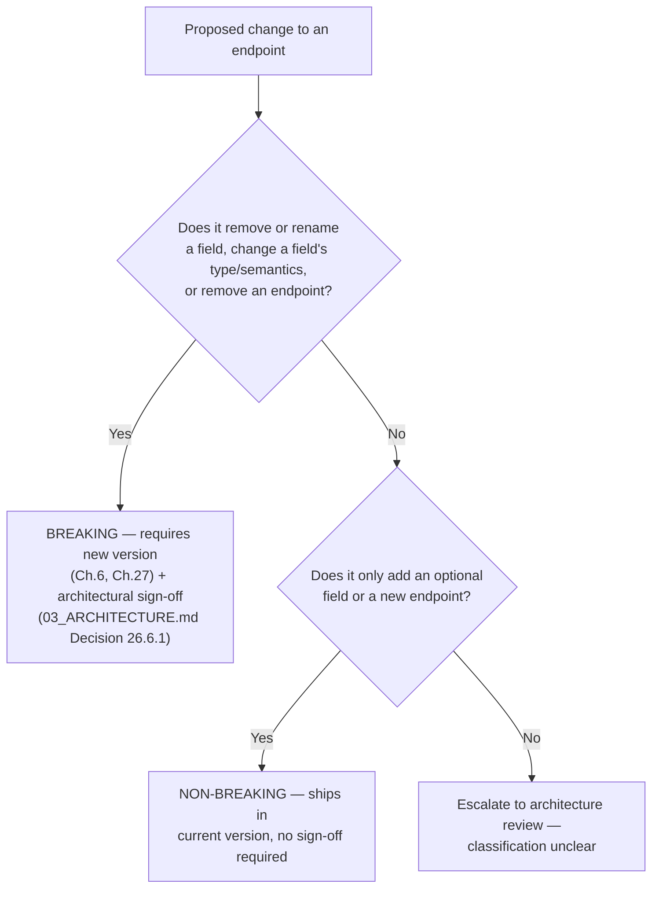
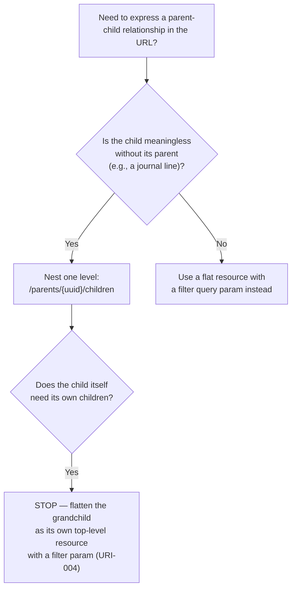
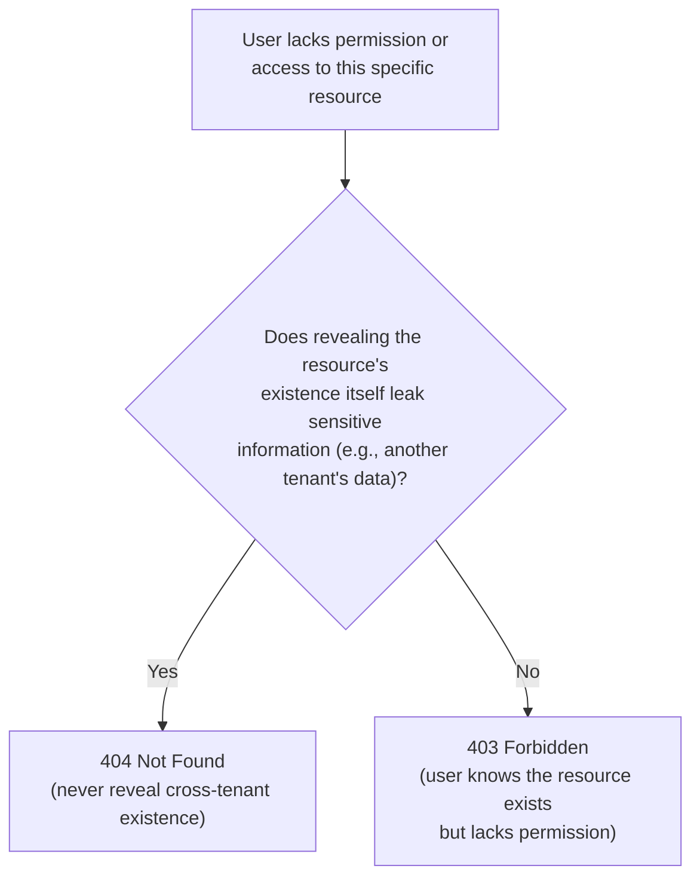
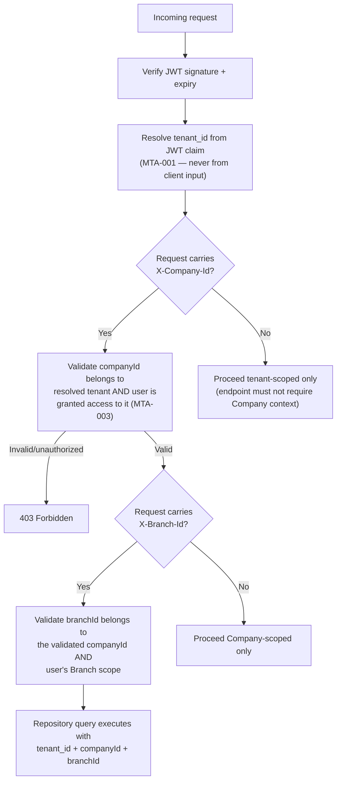
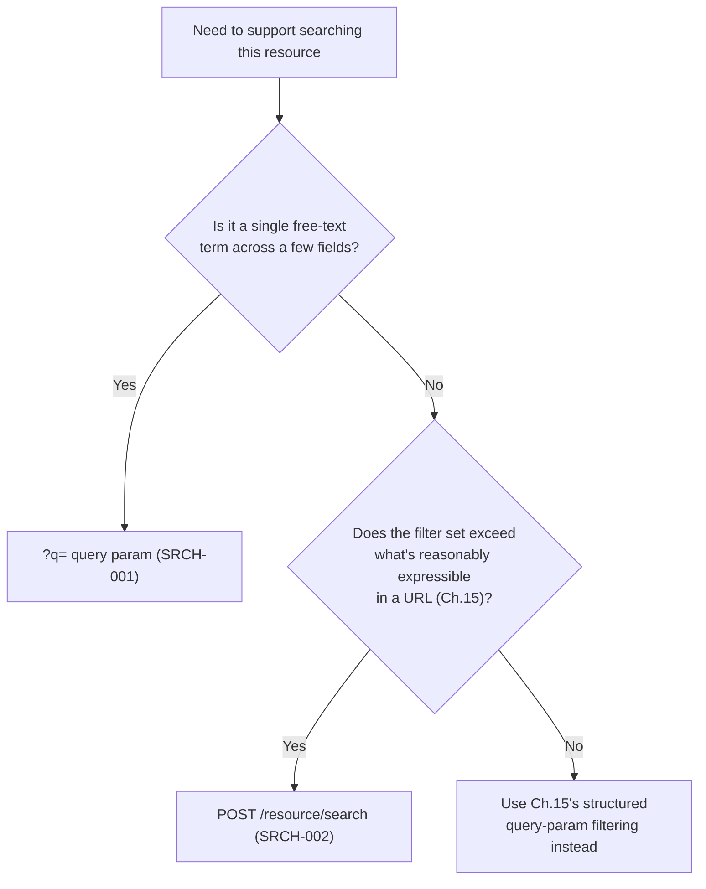
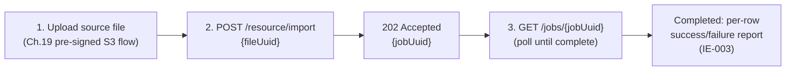
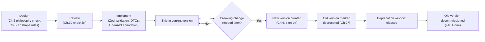

# 07_REST_API_STANDARDS.md

**Document Type:** REST API Engineering Standards Handbook
**Product:** LedgerOne — Cloud Native ERP SaaS
**Status:** Complete — Chapters 1–31
**Depends on (frozen, never contradicted):** `00_BUSINESS_RULES.md`, `01_PROJECT_CONTEXT.md`, `02_TECH_STACK.md`, `03_ARCHITECTURE.md`, `04_FOLDER_STRUCTURE.md`, `05_CODING_STANDARDS.md`, `06_DATABASE_STANDARDS.md`
**Audience:** Every engineer implementing or consuming a LedgerOne API endpoint. Referenced directly by `05_CODING_STANDARDS.md` (response envelope, error shape, pagination shape, DTO conventions) and `03_ARCHITECTURE.md` Ch.10/26 (Presentation layer, versioning policy) — this document is the concrete contract those chapters defer to.

> If an API violates this document, it fails code review. This is not a schema document, not Express.js code, not controller code. It defines engineering standards only.

---

## Chapter 1 — Introduction

### 1.1 Purpose

LedgerOne exposes every module's functionality through one consistent REST surface — `/api/v1/...` today, with future versions following the same URL-path versioning already fixed in `03_ARCHITECTURE.md` Decision 10.5.1 and `02_TECH_STACK.md`. An ERP's API is used by three very differently-trusted callers: the first-party frontend, authenticated tenant users integrating directly, and third-party Marketplace developers. This handbook exists so that all three experience one coherent, predictable contract — never a different shape per module, per team, or per developer's personal preference (`03_ARCHITECTURE.md`:2015 — "no module may invent a bespoke error format, pagination scheme, or filtering syntax").

### 1.2 Responsibilities of This Document

- Define the concrete shape of every request and response envelope that `05_CODING_STANDARDS.md` and `03_ARCHITECTURE.md` Ch.10 already assume exists.
- Define naming, versioning, security, and lifecycle rules for every endpoint across all 16 current and future modules.
- Serve as the single review gate: "does this endpoint follow 07?" is a yes/no code-review question, not a judgment call.

### 1.3 Relationship to Other Documents

| Document | What it owns | What this document owns instead |
|---|---|---|
| `03_ARCHITECTURE.md` Ch.10 | Presentation layer's existence, responsibility, and boundary within Clean Architecture | The concrete request/response contract that layer must produce |
| `03_ARCHITECTURE.md` Ch.26 | Breaking-change classification and deprecation window policy | The mechanics of implementing a deprecation (headers, Swagger annotations, sunset dates) |
| `05_CODING_STANDARDS.md` | Controller code structure, DTO folder layout, Zod middleware pattern | The response envelope, error shape, and pagination shape those controllers must emit |
| `06_DATABASE_STANDARDS.md` | `uuid`-only external identifiers, keyset pagination at the query level | How that `uuid` and cursor surface in the URL and JSON contract |
| `09_SECURITY_GUIDELINES.md` | Platform-wide security posture (RBAC, rate limiting, audit logging) | API-specific implementation of that posture (Ch.24 of this document) |

### 1.4 Enforcement Model (shared across this entire handbook)

Every rule from Chapter 2 onward carries a Rule ID, severity, and enforcement method, using the same taxonomy as `06_DATABASE_STANDARDS.md` §1.6:

**Severity**

| Severity | Meaning |
|---|---|
| 🔴 Critical | Tenant isolation breach, security defect, or breaks every consumer of the API. |
| 🟠 High | Breaks a structural convention with platform-wide blast radius (versioning, error shape, pagination). |
| 🟡 Medium | Convention violation with contained, single-endpoint/module blast radius. |
| ⚪ Low | Style preference. |

**Enforcement methods**

| Method | Catches |
|---|---|
| Code Review | Anything not mechanically enforceable yet |
| ESLint / custom lint rule | Naming, forbidden patterns (raw `id` in DTOs, ad hoc error throws) |
| CI Pipeline | Missing pagination, missing OpenAPI annotation, contract-test failures |
| Architecture Review | Breaking changes, new API version, cross-module endpoint design |

### 1.5 How to Use This Handbook

Read Chapters 2–3 once, as philosophy. Use Chapters 4–26 as a per-endpoint reference during implementation. Use Chapter 30 (API Review Checklist) as the literal PR template. Chapter 31 (AI Assistant Guidance) is written for both human engineers onboarding an AI pair-programmer and for the AI assistant itself when generating API code for this repository.

### 1.6 Related Documents

`03_ARCHITECTURE.md` Ch.10, Ch.26; `05_CODING_STANDARDS.md`; `06_DATABASE_STANDARDS.md`; `09_SECURITY_GUIDELINES.md`.

---

## Chapter 2 — API Philosophy

### 2.1 Purpose

States the beliefs every rule in this handbook is derived from — mirroring `06_DATABASE_STANDARDS.md` Ch.1's role for the database layer.

### 2.2 Core Philosophy

| # | Principle | Rationale |
|---|---|---|
| AP1 | **The API is a contract, not an implementation detail.** | Once a third-party Marketplace developer depends on a shape, changing it silently is a breaking promise, not a refactor. |
| AP2 | **Consistency beats local optimization.** | A uniquely "better" pagination scheme for one endpoint costs every consumer who has to special-case it. |
| AP3 | **Tenant isolation is enforced at the API boundary, not assumed from the caller's good behavior.** | Mirrors `03_ARCHITECTURE.md`'s strongest rule: tenant context is resolved server-side from the signed JWT, never trusted from client input. |
| AP4 | **Fail loud and structured, never silent or free-text.** | A financial system's error must be machine-parseable (field-level detail) so a client can correct and retry, not just "something went wrong." |
| AP5 | **Every state-changing operation must be safe to retry.** | Networks fail; an ERP client retrying a payment post must never double-post. |
| AP6 | **The API is designed for the module that doesn't exist yet.** | Payroll, Manufacturing, and Marketplace all consume the same conventions Accounting establishes first — no module-specific exception. |
| AP7 | **Internal database identifiers never cross the API boundary.** | Direct extension of `06_DATABASE_STANDARDS.md` PK-002/003 — `uuid` only, everywhere a client can see. |

### 2.3 Decision Tree — "Does my endpoint change need a new API version?"



This decision tree is the literal application of `03_ARCHITECTURE.md` §26.3's breaking-change test to a single API change.

### 2.4 Best Practices

- Before implementing, ask "would this surprise a third-party developer who hasn't read our Slack channel?" — if yes, it likely violates AP1 or AP2.
- Design the error response before the success response — AP4 means error shape is not an afterthought.

### 2.5 Common Mistakes

| Mistake | Principle violated |
|---|---|
| "This one report endpoint doesn't really need pagination, it's always small." | AP2, AP6 — it will not stay small forever, and every exception costs consistency. |
| Trusting a `tenantId` query parameter because "the frontend always sends the right one." | AP3 |
| Returning `500` with a stack trace to speed up debugging in production. | AP4, and Ch.24 security rules |

### 2.6 Checklist

- [ ] I can name which principle (AP1–AP7) justifies this design choice.
- [ ] Nothing here assumes a well-behaved client.

### 2.7 Future Considerations

If LedgerOne ever adds GraphQL for a specific reporting need, `03_ARCHITECTURE.md` records that GraphQL was formally considered and rejected platform-wide — this handbook does not reopen that question; any future reconsideration happens at the architecture layer first.

### 2.8 AI Assistant Guidance

When generating any API-related code or documentation, check every design choice against AP1–AP7 before proposing it. Never propose a one-off exception "because this endpoint is different."

### 2.9 Related Documents

`03_ARCHITECTURE.md` Ch.10, Ch.26.

---

## Chapter 3 — REST Design Principles

### 3.1 Purpose

Fixes LedgerOne's specific interpretation of REST — not academic Fielding-purity, but the pragmatic subset that keeps 16 modules consistent.

### 3.2 Rules

| Rule ID | Rule | Severity | Enforcement |
|---|---|---|---|
| REST-001 | Resources are nouns; HTTP methods carry the verb. `POST /journal-entries/post` is forbidden — use `POST /journal-entries/{uuid}/postings` or a status transition (Ch.5). | 🟠 High | Code Review |
| REST-002 | Every resource is addressable by a stable identifier (`uuid`) independent of its position in any list. | 🔴 Critical | Code Review |
| REST-003 | The API is stateless — no server-side session state beyond the JWT itself; no endpoint depends on a prior request's server memory. | 🔴 Critical | Architecture Review |
| REST-004 | Representations are JSON only; no XML, no form-encoded responses. | 🟡 Medium | ESLint / CI |
| REST-005 | HATEOAS-style hypermedia links are not required (rejected as unnecessary complexity for LedgerOne's known, documented client set) — Swagger (Ch.26) is the discovery mechanism instead. | ⚪ Low | Code Review |

### 3.3 Decision Matrix — REST Purity vs. Pragmatism

| Concern | Academic REST | LedgerOne's Choice | Why |
|---|---|---|---|
| Hypermedia (HATEOAS) | Required | Not required | Clients are known/documented via Swagger; added complexity has no payoff (Alternative rejected, consistent with `03_ARCHITECTURE.md`'s GraphQL rejection reasoning: reject speculative flexibility with no concrete demand) |
| Verbs in URLs | Forbidden | Forbidden, with a narrow status-transition exception (Ch.5.5) | Financial state transitions (post, void, reverse) are not naturally CRUD |
| Statelessness | Required | Required | REST-003 |
| Content negotiation for versioning | Common alternative | Rejected — URL-path versioning only | `03_ARCHITECTURE.md` Decision 10.5.1 |

### 3.4 Examples

**Good:** `POST /api/v1/accounting/journal-entries/{uuid}/postings` (models "posting" as a sub-resource action, resource-oriented).
**Bad:** `POST /api/v1/accounting/postJournalEntry` (verb-as-endpoint, RPC-style, forbidden by REST-001).

### 3.5 Best Practices

- When a business action doesn't map cleanly to CRUD (e.g., "reverse a journal entry"), model it as creating a new sub-resource (`POST /journal-entries/{uuid}/reversals`) rather than inventing a verb endpoint.

### 3.6 Common Mistakes

| Mistake | Fix |
|---|---|
| `GET /getAllInvoices` | `GET /invoices` |
| `POST /invoices/{uuid}/delete` | `DELETE /invoices/{uuid}` (or a soft-delete-appropriate status transition, Ch.5.5) |

### 3.7 Checklist

- [ ] URL contains only nouns.
- [ ] Business actions that aren't CRUD are modeled as sub-resources, not verbs.
- [ ] No server-side state assumed between requests.

### 3.8 Future Considerations

None — this chapter's principles are stable; revisit only alongside a full architecture-level API-paradigm reconsideration (out of scope here per §2.7).

### 3.9 AI Assistant Guidance

Never generate a verb-shaped endpoint (`/doThing`, `/getX`). Always model actions as resources or sub-resources.

### 3.10 Related Documents

Ch.4 (URI Naming), Ch.5 (HTTP Methods).

---

## Chapter 4 — URI Naming Standards

### 4.1 Purpose

Defines exact URI structure so every module's endpoints look and feel identical.

### 4.2 Rules

| Rule ID | Rule | Severity | Enforcement |
|---|---|---|---|
| URI-001 | Format: `/api/v{n}/{module}/{resource-plural}` — e.g., `/api/v1/accounting/journal-entries`. | 🟠 High | ESLint / CI |
| URI-002 | Resource segments are `kebab-case`, plural nouns. | 🟠 High | ESLint |
| URI-003 | Path parameters reference `uuid` only, never the internal `id` (`06_DATABASE_STANDARDS.md` PK-003). | 🔴 Critical | Code Review, contract test |
| URI-004 | Nesting is limited to two levels (`/journal-entries/{uuid}/lines`); a third level requires flattening with a query filter instead (`/journal-entry-lines?journalEntryUuid=...`). | 🟡 Medium | Code Review |
| URI-005 | Query parameters are `camelCase` (matching JSON body/response casing, Ch.7), never `snake_case`, even though the database is `snake_case` (`06_DATABASE_STANDARDS.md` NAM-002) — the API boundary is where the casing translation happens. | 🟡 Medium | ESLint |
| URI-006 | No trailing slashes; no file extensions in the URL. | ⚪ Low | ESLint |

### 4.3 Standards

```
/api/v1/accounting/journal-entries
/api/v1/accounting/journal-entries/{uuid}
/api/v1/accounting/journal-entries/{uuid}/lines
/api/v1/inventory/warehouses/{uuid}
/api/v1/auth/refresh
```

### 4.4 Decision Tree — How deep should nesting go?



### 4.5 Examples

**Good:** `GET /api/v1/accounting/journal-entries/{uuid}/lines`
**Bad:** `GET /api/v1/accounting/journal-entries/{uuid}/lines/{lineUuid}/attachments/{attachmentUuid}` — three levels deep; flatten to `GET /api/v1/accounting/attachments?journalLineUuid={lineUuid}`.

### 4.6 Best Practices

- Name the module segment to match the module's folder name in `04_FOLDER_STRUCTURE.md`, so the URL and the codebase are navigable by the same mental map.

### 4.7 Common Mistakes

| Mistake | Fix |
|---|---|
| `/api/v1/JournalEntries` (PascalCase) | `/api/v1/journal-entries` |
| `/api/v1/accounting/journal_entries` (snake_case in URL) | `/api/v1/accounting/journal-entries` |
| `/api/v1/accounting/journal-entries/48213` (raw internal id) | `/api/v1/accounting/journal-entries/{uuid}` |

### 4.8 Checklist

- [ ] `kebab-case`, plural resource segments.
- [ ] Path parameters are `uuid` only.
- [ ] Nesting ≤ 2 levels.
- [ ] Query params `camelCase`.

### 4.9 Future Considerations

None currently — stable convention.

### 4.10 AI Assistant Guidance

Always generate `kebab-case` plural URL segments and `uuid` path parameters. Never generate a URL containing the internal numeric `id`.

### 4.11 Related Documents

`04_FOLDER_STRUCTURE.md` (module naming), Ch.3 (REST Principles), `06_DATABASE_STANDARDS.md` PK-002/003.

---

## Chapter 5 — HTTP Method Standards

### 5.1 Purpose

Fixes method-to-action mapping and status code conventions.

### 5.2 Rules

| Rule ID | Rule | Severity | Enforcement |
|---|---|---|---|
| HTTP-001 | `GET` never mutates state; safe to call any number of times, safe to cache. | 🔴 Critical | Code Review |
| HTTP-002 | `POST` creates a resource or triggers a non-idempotent action; returns `201` with the created resource (including its `uuid`) on success. | 🟠 High | Code Review |
| HTTP-003 | `PUT` fully replaces a resource; idempotent by definition — calling it twice with the same body yields the same end state. | 🟠 High | Code Review |
| HTTP-004 | `PATCH` partially updates a resource; not required to be idempotent unless the change itself is idempotent. | 🟡 Medium | Code Review |
| HTTP-005 | `DELETE` removes a resource (or triggers its soft-delete per `06_DATABASE_STANDARDS.md` Ch.8); idempotent — deleting an already-deleted resource returns `204`, not `404`, on a second call within a reasonable window. | 🟡 Medium | Code Review |
| HTTP-006 | Financial state transitions that aren't naturally CRUD (post, void, reverse, approve) are modeled as `POST` to a sub-resource (`/journal-entries/{uuid}/postings`), never as a custom HTTP verb or a query-string action flag. | 🟠 High | Code Review |

### 5.3 Status Code Standards

| Code | Meaning | Used for |
|---|---|---|
| `200 OK` | Success, response body present | `GET`, successful `PUT`/`PATCH` |
| `201 Created` | Resource created | Successful `POST` creating a resource |
| `202 Accepted` | Accepted for async processing | Bulk/import operations (Ch.18, Ch.21) |
| `204 No Content` | Success, no body | Successful `DELETE`, idempotent repeat `DELETE` |
| `400 Bad Request` | Malformed request (not schema validation — see `422`) | Unparseable JSON, missing required header |
| `401 Unauthorized` | Missing/invalid/expired auth token | Any unauthenticated call to a protected endpoint |
| `403 Forbidden` | Authenticated but not authorized | RBAC denial, cross-tenant/cross-company access attempt |
| `404 Not Found` | Resource does not exist (or does not exist *for this tenant* — see Ch.13) | Unknown `uuid`, or a `uuid` belonging to another tenant |
| `409 Conflict` | State conflict | Optimistic concurrency failure, duplicate unique constraint |
| `422 Unprocessable Entity` | Schema-valid but business-rule/validation failure | Zod validation failure (`05_CODING_STANDARDS.md`:1202), `DomainError` |
| `429 Too Many Requests` | Rate limit exceeded | Ch.23 |
| `500 Internal Server Error` | Unhandled/unexpected failure | Generic, no internal detail leaked (Ch.9, Ch.24) |

### 5.4 Decision Matrix — Which method for which action?

| Action | Method | Path |
|---|---|---|
| List invoices | `GET` | `/invoices` |
| Get one invoice | `GET` | `/invoices/{uuid}` |
| Create invoice | `POST` | `/invoices` |
| Replace invoice entirely | `PUT` | `/invoices/{uuid}` |
| Update invoice status field only | `PATCH` | `/invoices/{uuid}` |
| Void an invoice (business action) | `POST` | `/invoices/{uuid}/void` — narrow, documented exception to REST-001's noun rule, reserved for true state-machine transitions with no natural resource shape |
| Soft-delete a draft invoice | `DELETE` | `/invoices/{uuid}` |

### 5.5 Standard: The Status-Transition Exception

Financial documents (Journal Entries, Invoices, Payments) move through state machines (Draft → Posted → Reversed). Modeling every transition as a sub-resource (`/postings`, `/reversals`) is preferred (REST-001); a terse verb-suffixed action (`/void`) is permitted only when: (a) the transition has no meaningful resource of its own to create, and (b) the verb is a fixed, small, documented set per module — never an open-ended action namespace.

### 5.6 Examples

**Good:** `POST /api/v1/accounting/journal-entries/{uuid}/postings` → `201`, body is the created posting record.
**Bad:** `GET /api/v1/accounting/journal-entries/{uuid}/delete` — `GET` must never mutate (HTTP-001 violation), compounded by a verb in the URL.

### 5.7 Best Practices

- Return the full updated resource from `PUT`/`PATCH`, not just a success flag — saves the client a follow-up `GET`.
- Use `422`, never `400`, for Zod/business-rule failures — reserve `400` for structurally malformed requests (`05_CODING_STANDARDS.md`:1202 convention).

### 5.8 Common Mistakes

| Mistake | Fix |
|---|---|
| Returning `200` for a failed validation. | `422` with the standard error envelope (Ch.9). |
| Using `POST` for a pure read because "it's easier to pass a big filter body." | Use `GET` with query params (Ch.15); if the filter is genuinely too large for a URL, use `POST /resource/search` (Ch.17) as a documented read-only exception, never a plain `POST /resource`. |
| `DELETE` returning `404` on a second call to an already-deleted resource. | Idempotent `DELETE` returns `204` (HTTP-005). |

### 5.9 Checklist

- [ ] Method matches the action's actual semantics (safe/idempotent properties respected).
- [ ] Status code matches Section 5.3's table exactly.
- [ ] Non-CRUD business actions use the sub-resource pattern or the narrow verb exception (5.5).

### 5.10 Future Considerations

None — stable.

### 5.11 AI Assistant Guidance

Always choose the HTTP method by its safety/idempotency semantics, never by convenience. Always map validation failures to `422`, never `400` or `200`.

### 5.12 Related Documents

Ch.9 (Error Handling), Ch.22 (Idempotency).

---

## Chapter 6 — API Versioning

### 6.1 Purpose

Implements `03_ARCHITECTURE.md` Decision 10.5.1 (URL-path versioning) and Ch.26 (breaking-change policy) as concrete API-layer mechanics.

### 6.2 Rules

| Rule ID | Rule | Severity | Enforcement |
|---|---|---|---|
| VER-001 | Version is a URL path segment: `/api/v1/...`. Never a header, query param, or Accept-header content negotiation. | 🔴 Critical | Architecture Review |
| VER-002 | A new major version is created only for a breaking change, per `03_ARCHITECTURE.md` §26.3's classification test, and only after Decision 26.6.1's architectural sign-off. | 🔴 Critical | Architecture Review |
| VER-003 | Non-breaking changes (new optional field, new endpoint) ship into the current version — never trigger a version bump. | 🟠 High | Code Review |
| VER-004 | A new version's controller lives in a sibling `v2/` folder within the module (`04_FOLDER_STRUCTURE.md`), created only when the breaking change actually ships — never scaffolded speculatively. | 🟡 Medium | Code Review |
| VER-005 | Both the old and new version run simultaneously for the deprecation window defined in Ch.27 — never a hard cutover. | 🔴 Critical | Architecture Review |

### 6.3 Standards

`/api/v1/accounting/journal-entries` and, only once a breaking change is approved, `/api/v2/accounting/journal-entries` coexist. Modules version independently — a breaking change in Inventory does not force Accounting to bump its version.

### 6.4 Examples

**Good:** Adding an optional `notes` field to the Invoice response → ships directly into `/v1`.
**Bad:** Renaming `totalAmount` to `total` in the Invoice response without a version bump — silently breaks every existing consumer's field access.

### 6.5 Best Practices

- Default to additive design (new optional fields, new endpoints) specifically to avoid needing a version bump at all — Ch.26's long deprecation windows are expensive; the best version-management strategy is minimizing how often one is needed.

### 6.6 Common Mistakes

| Mistake | Fix |
|---|---|
| Bumping the version for a purely additive change "to be safe." | Only breaking changes bump the version (VER-003). |
| Versioning via an `Accept: application/vnd.ledgerone.v2+json` header. | URL-path only (VER-001). |

### 6.7 Checklist

- [ ] Change classified via `03_ARCHITECTURE.md` §26.3 before deciding version impact.
- [ ] Breaking changes have architectural sign-off before implementation.
- [ ] Old version continues running through its full deprecation window.

### 6.8 Future Considerations

`03_ARCHITECTURE.md` §26.15 flags that concrete deprecation window lengths are deferred pending real integration volume — this chapter's Ch.27 will need updating once that's decided.

### 6.9 AI Assistant Guidance

Never propose a version bump for an additive change. Always propose the URL-path scheme for any versioning need.

### 6.10 Related Documents

`03_ARCHITECTURE.md` Decision 10.5.1, Ch.26; Ch.27 of this document (Deprecation Policy).

---

## Chapter 7 — Request Standards

### 7.1 Purpose

Defines the shape every incoming request must take, regardless of module.

### 7.2 Rules

| Rule ID | Rule | Severity | Enforcement |
|---|---|---|---|
| REQ-001 | Request bodies are `camelCase` JSON. | 🟠 High | ESLint, contract test |
| REQ-002 | Every authenticated request carries `Authorization: Bearer {accessToken}`. | 🔴 Critical | Code Review |
| REQ-003 | Every request carries (or the platform assigns) a correlation ID via `X-Correlation-Id`; if absent, the server generates one and echoes it back in the response (`03_ARCHITECTURE.md` Ch.22.4). | 🟠 High | Code Review |
| REQ-004 | Monetary amounts in request bodies are JSON strings, not floating-point numbers (`"amount": "1234.50"`, never `"amount": 1234.50`), to avoid client/serializer floating-point precision loss before the value even reaches validation. | 🔴 Critical | Zod schema convention, Code Review |
| REQ-005 | Timestamps in request bodies are ISO-8601 UTC strings (`2026-08-02T14:30:00.000Z`). | 🟠 High | Zod schema convention |
| REQ-006 | Request bodies are validated against a Zod schema before any business logic executes (`05_CODING_STANDARDS.md`'s `validate()` middleware) — no controller reads `req.body` directly. | 🔴 Critical | ESLint / Code Review |

### 7.3 Standards & Rationale

REQ-004 exists because JavaScript's `number` type is IEEE-754 double-precision — the same reason `06_DATABASE_STANDARDS.md` forbids `FLOAT` columns for money applies at the API boundary too. A client serializing `1234.50` as a JSON number and a server parsing it back can both introduce representable-value drift for certain amounts; representing money as a decimal *string* on the wire removes the ambiguity entirely, and the server parses it into an exact decimal type before any calculation.

### 7.4 Examples

**Good request body:**
```json
{
  "customerUuid": "7f3a1e2c-4b2d-4e1a-9c3d-1a2b3c4d5e6f",
  "amount": "1250.00",
  "currency": "USD",
  "issuedAt": "2026-08-02T14:30:00.000Z"
}
```
**Bad:** `{"amount": 1250.00}` — floating-point number for a monetary value.

### 7.5 Best Practices

- Define one shared Zod "money string" type (regex-validated decimal string) reused across every module's DTOs, rather than each module inventing its own amount validation.

### 7.6 Common Mistakes

| Mistake | Fix |
|---|---|
| Sending/accepting monetary values as JSON numbers. | Decimal strings (REQ-004). |
| Reading `req.body.field` directly in a controller. | Route through the shared `validate()` Zod middleware first. |
| Omitting a correlation ID and not generating a fallback. | Always generate one server-side if absent. |

### 7.7 Checklist

- [ ] Body is `camelCase`.
- [ ] Monetary fields are decimal strings.
- [ ] Timestamps are ISO-8601 UTC.
- [ ] Body validated via Zod before controller logic runs.

### 7.8 Future Considerations

None — stable.

### 7.9 AI Assistant Guidance

Always generate monetary request fields as strings with a decimal-string Zod schema, never `z.number()`. Always route request parsing through the shared `validate()` middleware pattern.

### 7.10 Related Documents

Ch.8 (Response Standards), Ch.10 (Validation Standards), `05_CODING_STANDARDS.md`.

---

## Chapter 8 — Response Standards

### 8.1 Purpose

Defines the single JSON response envelope every endpoint returns — the concrete shape `05_CODING_STANDARDS.md`:1002 defers to this document.

### 8.2 Rules

| Rule ID | Rule | Severity | Enforcement |
|---|---|---|---|
| RES-001 | Every successful response is wrapped in a standard envelope: `{ data, meta }`. | 🔴 Critical | Code Review, contract test |
| RES-002 | `data` contains the resource(s); for a list endpoint, `data` is always an array, `meta` always contains pagination info (Ch.14). | 🟠 High | Code Review |
| RES-003 | Response bodies are `camelCase` JSON, mirroring REQ-001. | 🟠 High | ESLint |
| RES-004 | Monetary amounts in responses are decimal strings, mirroring REQ-004. | 🔴 Critical | Contract test |
| RES-005 | Internal `id` never appears anywhere in a response body — `uuid` only (`06_DATABASE_STANDARDS.md` PK-003, SEC-001). | 🔴 Critical | Contract test, Code Review |
| RES-006 | Every response echoes the request's correlation ID in an `X-Correlation-Id` response header. | 🟠 High | Code Review |
| RES-007 | Timestamps in responses are ISO-8601 UTC, converted for display only on the client (`06_DATABASE_STANDARDS.md` §2.5). | 🟠 High | Contract test |

### 8.3 Standard Envelope

```json
{
  "data": { "uuid": "...", "amount": "1250.00", "currency": "USD" },
  "meta": { "correlationId": "..." }
}
```

**List response:**
```json
{
  "data": [ { "uuid": "..." }, { "uuid": "..." } ],
  "meta": { "correlationId": "...", "pagination": { "nextCursor": "...", "hasMore": true } }
}
```

### 8.4 Examples

**Good:** Every endpoint, success or list, uses the exact `{ data, meta }` shape above.
**Bad:** One module returning a bare array `[{...}, {...}]` with no envelope — breaks every generic client-side response handler built against the standard shape.

### 8.5 Best Practices

- Generate response DTOs from a shared `ApiResponse<T>`/`ApiListResponse<T>` TypeScript generic type (living in the shared-types package per `04_FOLDER_STRUCTURE.md`) so the envelope shape is enforced by the type system, not just convention.

### 8.6 Common Mistakes

| Mistake | Fix |
|---|---|
| Returning a bare object/array without the envelope. | Always wrap in `{ data, meta }`. |
| Including the internal `id` alongside `uuid` "just in case the frontend needs it." | Never include it — no exceptions (RES-005). |
| Inconsistent field casing between modules (`snake_case` in one, `camelCase` in another). | `camelCase` everywhere, no exceptions. |

### 8.7 Checklist

- [ ] Every response uses `{ data, meta }`.
- [ ] No internal `id` anywhere in the payload.
- [ ] Monetary values are decimal strings.
- [ ] Correlation ID echoed in response header.

### 8.8 Future Considerations

If GraphQL or a BFF layer is ever introduced (currently rejected per Ch.2.7), this envelope convention would need re-evaluation at that time — not anticipated now.

### 8.9 AI Assistant Guidance

Always generate responses wrapped in `{ data, meta }`. Never generate a DTO/serializer that includes the internal `id` field.

### 8.10 Related Documents

`05_CODING_STANDARDS.md`:1002, `06_DATABASE_STANDARDS.md` PK-003.

---

## Chapter 9 — Error Handling Standards

### 9.1 Purpose

Defines the standard error envelope that `05_CODING_STANDARDS.md`'s centralized error middleware (Ch.18/Ch.31 of that document) maps every `DomainError` into.

### 9.2 Rules

| Rule ID | Rule | Severity | Enforcement |
|---|---|---|---|
| ERR-001 | Every error response uses the standard envelope: `{ error: { code, message, details, correlationId } }`. | 🔴 Critical | Code Review, contract test |
| ERR-002 | `code` is a stable, machine-readable string (`VALIDATION_ERROR`, `JOURNAL_ENTRY_ALREADY_POSTED`), never a raw HTTP status or a free-text message reused as the code. | 🟠 High | Code Review |
| ERR-003 | `details` is an array of field-level errors for validation failures (`{ field, message }`), empty/absent otherwise. | 🟡 Medium | Contract test |
| ERR-004 | A `500` response never includes a stack trace, internal file path, SQL fragment, or raw exception message — `message` is a generic, safe string (`05_CODING_STANDARDS.md`:1811). | 🔴 Critical | Code Review, security review |
| ERR-005 | Every `DomainError` subclass maps to exactly one HTTP status, defined once in the centralized mapping — never re-decided per endpoint. | 🟠 High | Code Review |
| ERR-006 | Error responses always echo the correlation ID, identical to success responses (RES-006). | 🟠 High | Contract test |

### 9.3 Standard Error Envelope

```json
{
  "error": {
    "code": "VALIDATION_ERROR",
    "message": "Request validation failed.",
    "details": [
      { "field": "amount", "message": "Must be a valid decimal string." }
    ],
    "correlationId": "c7e1-..."
  }
}
```

### 9.4 Decision Matrix — DomainError → Status → Code

| DomainError subclass | HTTP Status | Error code |
|---|---|---|
| `ValidationError` (Zod failure) | 422 | `VALIDATION_ERROR` |
| `NotFoundError` | 404 | `RESOURCE_NOT_FOUND` |
| `UnauthorizedError` | 401 | `UNAUTHORIZED` |
| `ForbiddenError` | 403 | `FORBIDDEN` |
| `ConflictError` (e.g. optimistic lock failure) | 409 | `CONFLICT` |
| `AlreadyPostedError` (module-specific business rule) | 422 | `ALREADY_POSTED` |
| Unknown/unhandled exception | 500 | `INTERNAL_ERROR` |

### 9.5 Examples

**Good — 422 validation failure:**
```json
{ "error": { "code": "VALIDATION_ERROR", "message": "Request validation failed.", "details": [{"field": "currency", "message": "Unsupported currency code."}], "correlationId": "..." } }
```
**Bad:** `{ "message": "Error: Cannot read property 'amount' of undefined at JournalEntryService.post (/app/src/...)" }` — leaks internals (ERR-004 violation), no code, no correlation ID.

### 9.6 Best Practices

- Add a new `DomainError` subclass whenever a new business rule needs a distinct client-actionable error, rather than reusing a generic error with a different message string — the `code` is the contract, not the human-readable `message`.

### 9.7 Common Mistakes

| Mistake | Fix |
|---|---|
| Reusing `INTERNAL_ERROR` for a known business-rule violation. | Add a specific `DomainError` subclass and code. |
| Different modules inventing their own error shape. | One centralized shape and mapping, platform-wide (ERR-005). |
| Leaking a database constraint violation message directly to the client. | Map to a generic `CONFLICT`/`VALIDATION_ERROR` with a safe message. |

### 9.8 Checklist

- [ ] Error uses the standard envelope.
- [ ] `code` is stable and specific, not a generic catch-all.
- [ ] No internal detail leaked on `500`.
- [ ] Correlation ID present.

### 9.9 Future Considerations

A machine-readable error code registry (a single source-of-truth list of all `code` values across modules) may be worth formalizing as the platform grows — not yet built.

### 9.10 AI Assistant Guidance

Always generate errors through a `DomainError` subclass mapped centrally, never a bare `throw new Error()` or ad hoc `res.status(500).json(...)` in a controller. Never include stack traces or internal paths in any response.

### 9.11 Related Documents

`05_CODING_STANDARDS.md` Ch.18/Ch.31, Ch.10 of this document (Validation Standards).

---

## Chapter 10 — Validation Standards

### 10.1 Purpose

Defines how request validation (Zod, per `02_TECH_STACK.md`) integrates with the request/error standards above.

### 10.2 Rules

| Rule ID | Rule | Severity | Enforcement |
|---|---|---|---|
| VAL-001 | Every endpoint accepting a body, query, or path params defines an explicit Zod schema for each — no implicit "anything goes" endpoint. | 🔴 Critical | Code Review, ESLint |
| VAL-002 | Validation runs before any business/domain logic — a controller never reaches the service layer with unvalidated input. | 🔴 Critical | `05_CODING_STANDARDS.md` middleware convention |
| VAL-003 | Validation failures always return `422` with `ERR-003`'s field-level `details` array, never `400`. | 🟠 High | Contract test |
| VAL-004 | Business-rule validation (e.g., "this journal entry must balance") is distinct from schema validation and lives in the Domain layer, surfaced as a `DomainError`, not folded into the Zod schema. | 🟡 Medium | Code Review |
| VAL-005 | Zod schemas for external-facing DTOs are the intended future source for OpenAPI generation (`05_CODING_STANDARDS.md`:1178/1215) — write them as the single source of truth for a field's shape, not duplicated in separate Swagger annotations. | 🟡 Medium | Code Review |

### 10.3 Standards & Rationale

VAL-004 draws the same schema-vs-business-rule line `03_ARCHITECTURE.md` draws between Presentation-layer "fast-fail" checks and Business/Domain-layer authoritative checks (Ch.12 of this document extends the same principle to authorization) — a Zod schema can confirm "amount is a valid decimal string," but only the Domain layer can confirm "this specific set of debits and credits balances to zero."

### 10.4 Examples

**Good:** `amount: z.string().regex(DECIMAL_REGEX)` at the schema layer; `"journal entry does not balance"` raised as a `DomainError` from the Domain layer, not from Zod's `.refine()`.
**Bad:** Encoding "the invoice total must not exceed the customer's credit limit" as a Zod `.refine()` — a business rule masquerading as schema validation, invisible to Domain-layer reuse (e.g., a background job posting the same entity bypasses the HTTP-layer Zod check entirely).

### 10.5 Best Practices

- Keep Zod schemas purely structural/type-level (format, range, required-ness); push anything requiring a database lookup or cross-field business logic into the Domain layer.

### 10.6 Common Mistakes

| Mistake | Fix |
|---|---|
| A Zod `.refine()` that queries the database. | Move to Domain-layer validation — schema validation must stay synchronous and side-effect-free. |
| Returning `400` for a Zod failure. | `422` always (VAL-003). |

### 10.7 Checklist

- [ ] Every input surface (body/query/params) has an explicit Zod schema.
- [ ] No business rule is encoded as a Zod refinement requiring external state.
- [ ] Failures return `422` with field-level details.

### 10.8 Future Considerations

Once OpenAPI-from-Zod tooling matures (`05_CODING_STANDARDS.md`:1178), this chapter should be updated to make Zod schemas the canonical, enforced source for Swagger generation rather than a parallel hand-maintained spec.

### 10.9 AI Assistant Guidance

Always generate a Zod schema for every request surface. Never encode a business rule requiring a DB lookup inside a Zod schema — flag it for Domain-layer implementation instead.

### 10.10 Related Documents

Ch.9 (Error Handling), Ch.26 (Swagger Standards), `05_CODING_STANDARDS.md`.

---

## Chapter 11 — Authentication

### 11.1 Purpose

Defines the API-layer contract for LedgerOne's JWT + refresh token authentication, already architecturally decided in `03_ARCHITECTURE.md` Ch.9 and fixed in `02_TECH_STACK.md` (JWT, Refresh Token, Passport.js, Argon2).

### 11.2 Rules

| Rule ID | Rule | Severity | Enforcement |
|---|---|---|---|
| AUTH-001 | Every endpoint requires `Authorization: Bearer {accessToken}` except an explicitly documented allow-list (login, refresh, health check, public Marketplace listing endpoints if any). | 🔴 Critical | Passport.js middleware, Code Review |
| AUTH-002 | Access tokens are short-lived JWTs carrying resolved identity + `tenant_id` as signed claims — never a client-editable claim. | 🔴 Critical | Architecture Review |
| AUTH-003 | Refresh tokens are opaque, stored server-side in Redis, revocable on logout/password-change/admin session-revoke. | 🔴 Critical | Code Review |
| AUTH-004 | Passwords are hashed with Argon2 exclusively; plaintext or reversible-encryption storage of passwords is forbidden. | 🔴 Critical | Code Review |
| AUTH-005 | `POST /api/v1/auth/refresh` is the only endpoint that exchanges a refresh token for a new access token; access tokens are never refreshed via any other endpoint. | 🟠 High | Code Review |
| AUTH-006 | An expired or invalid access token returns `401` with `code: "UNAUTHORIZED"`, never a `403` (403 is reserved for authenticated-but-forbidden, Ch.12). | 🟠 High | Contract test |

### 11.3 Sequence Diagram — Login & Refresh Flow

```mermaid
sequenceDiagram
    participant C as Client
    participant A as Auth Endpoint
    participant R as Redis (refresh store)
    C->>A: POST /api/v1/auth/login {email, password}
    A->>A: Verify Argon2 hash
    A->>R: Store new refresh token
    A-->>C: 200 {accessToken}; Set-Cookie: refreshToken (httpOnly, Secure, SameSite=Strict)
    Note over C: Access token held in memory only,\nlost on tab close (09_SECURITY_GUIDELINES.md Ch.7)
    C->>A: POST /api/v1/auth/refresh (cookie sent automatically + CSRF token)
    A->>R: Validate refresh token, check revocation
    R-->>A: Valid
    A-->>C: 200 {new accessToken}
    C->>A: Any request with Authorization: Bearer {accessToken}
    A->>A: Verify JWT signature + expiry,\nresolve tenant_id from claims
```

> **Token storage note:** the exact client-side storage mechanism for both tokens (in-memory access token, httpOnly-cookie refresh token) is authoritatively defined in `09_SECURITY_GUIDELINES.md` Ch.7 (Session Management) and Ch.19 (CSRF Protection), which also defines the CSRF defense required on this endpoint as a result. This diagram reflects that resolution rather than repeating it.

### 11.4 Standards & Rationale

AUTH-002's "`tenant_id` as a signed claim, resolved server-side at login" is the API-layer expression of `03_ARCHITECTURE.md`'s single strongest architectural rule (tenant context never trusted from client input) — every downstream chapter of this document (Ch.13, Ch.24) depends on this being true.

### 11.5 Examples

**Good:** Access token payload `{ "sub": "user-uuid", "tenantId": "tenant-uuid", "iat": ..., "exp": ... }`, signed server-side at login, never accepting a client-supplied `tenantId` override.
**Bad:** An endpoint accepting `?tenantId=...` as a query override "for admin testing convenience" — a direct tenant-isolation bypass vector (Ch.13 forbids this explicitly).

### 11.6 Best Practices

- Keep access token TTL short (minutes, not hours) precisely because it cannot be revoked before expiry — the refresh token is the revocation control point (AUTH-003).

### 11.7 Common Mistakes

| Mistake | Fix |
|---|---|
| Long-lived access tokens "to reduce refresh calls." | Short-lived access token + cheap refresh flow instead. |
| Storing refresh tokens in `localStorage` on the client without any server-side revocation list. | Server-side Redis-backed revocable refresh tokens (AUTH-003). |
| Accepting a `tenantId` from the request body/query anywhere. | Always resolve from the signed JWT claim only. |

### 11.8 Checklist

- [ ] Endpoint requires `Authorization: Bearer` unless explicitly allow-listed.
- [ ] No client-supplied `tenantId` accepted anywhere.
- [ ] Expired/invalid token returns `401`, not `403`.

### 11.9 Future Considerations

Multi-factor authentication and SSO/SAML for enterprise tenants are plausible future additions — not yet decided at the architecture level; this chapter will expand once `03_ARCHITECTURE.md` addresses them.

### 11.10 AI Assistant Guidance

Never generate an endpoint that accepts tenant identity from anywhere other than the verified JWT. Always apply the shared authentication middleware rather than reimplementing token verification per route.

### 11.11 Related Documents

`03_ARCHITECTURE.md` Ch.9, `02_TECH_STACK.md`, Ch.12 (Authorization), Ch.13 (Multi-Tenant API Standards).

---

## Chapter 12 — Authorization

### 12.1 Purpose

Defines the API-layer contract for RBAC, consistent with `03_ARCHITECTURE.md` Ch.9.5.1's choice of RBAC over ABAC and Ch.9.8's rule that authorization is authoritative at the Business/Domain layer.

### 12.2 Rules

| Rule ID | Rule | Severity | Enforcement |
|---|---|---|---|
| AUTHZ-001 | Every endpoint declares its required permission (e.g., `accounting.journal_entry.post`) explicitly — no endpoint is "implicitly" reachable by any authenticated user. | 🔴 Critical | Code Review |
| AUTHZ-002 | A controller-level permission check is a fast-fail convenience only (`03_ARCHITECTURE.md`'s "Presentation Guard") — the Business/Domain layer re-checks authorization authoritatively; a controller check is never the only enforcement point. | 🔴 Critical | Architecture Review |
| AUTHZ-003 | An authenticated user lacking the required permission receives `403 Forbidden` with `code: "FORBIDDEN"` — never `404`, except where hiding resource existence is itself the security requirement (Ch.13.4). | 🟠 High | Contract test |
| AUTHZ-004 | Platform Operators (internal LedgerOne staff) and Tenant End Users never share an authentication surface or permission namespace (`03_ARCHITECTURE.md` Ch.9.6's two-plane model) — no endpoint is reachable by both without an explicit, documented dual-purpose design. | 🔴 Critical | Architecture Review |

### 12.3 Decision Tree — 403 vs 404 for unauthorized access



### 12.4 Examples

**Good:** A user without `accounting.journal_entry.post` permission calling `POST /journal-entries/{uuid}/postings` receives `403 FORBIDDEN`. A user requesting a `uuid` belonging to a different tenant receives `404` (Ch.13.4), not `403` — never confirming the resource exists elsewhere.

### 12.5 Best Practices

- Name permissions consistently as `{module}.{resource}.{action}` platform-wide, matching `03_ARCHITECTURE.md`'s example (`accounting.journal_entry.post`), so a permission's scope is self-describing.

### 12.6 Common Mistakes

| Mistake | Fix |
|---|---|
| Relying only on a controller-level check and skipping Domain-layer re-verification. | Both layers check; Domain layer is authoritative (AUTHZ-002). |
| Returning `403` for a cross-tenant resource, confirming it exists. | Return `404` instead (Ch.13.4). |
| Mixing Platform Operator and Tenant User permissions in one namespace. | Keep the two-plane model strictly separate (AUTHZ-004). |

### 12.7 Checklist

- [ ] Endpoint's required permission is explicitly declared.
- [ ] Domain layer re-verifies authorization, not just the controller.
- [ ] Correct choice between `403`/`404` per Section 12.3.

### 12.8 Future Considerations

None beyond what `03_ARCHITECTURE.md` Ch.9 already anticipates.

### 12.9 AI Assistant Guidance

Always generate an explicit permission declaration per endpoint. Never treat a controller-level check as sufficient on its own — always note that Domain-layer authorization is required too.

### 12.10 Related Documents

`03_ARCHITECTURE.md` Ch.9.5–9.8, Ch.13 of this document.

---

## Chapter 13 — Multi-Tenant API Standards

### 13.1 Purpose

Defines how tenant, Company, and Branch context flow through every request — the API-layer implementation of `06_DATABASE_STANDARDS.md` Ch.6 and `03_ARCHITECTURE.md`'s tenant-resolution rule. This chapter also **originates** the Company/Branch context mechanism, which no existing approved document defines at the request level (confirmed gap, not a contradiction).

### 13.2 Rules

| Rule ID | Rule | Severity | Enforcement |
|---|---|---|---|
| MTA-001 | `tenant_id` is resolved exclusively from the verified JWT's signed claim — never from any header, query param, or body field. Any client-supplied `tenantId` in a request is ignored, not merely distrusted. | 🔴 Critical | Middleware, Code Review |
| MTA-002 | Every request that operates within a specific Company or Branch carries `X-Company-Id: {companyUuid}` (and optionally `X-Branch-Id: {branchUuid}`) — the **active context** the user has selected, analogous to how a desktop ERP client remembers "which company you're logged into." | 🟠 High | Code Review |
| MTA-003 | A supplied `X-Company-Id`/`X-Branch-Id` is validated on every request against the authenticated user's granted Company/Branch scope (`00_BUSINESS_RULES.md` permission-scoping rules) — never trusted at face value the way `tenant_id` is never trusted at all. A user requesting a Company they aren't scoped to receives `403`. | 🔴 Critical | Code Review, contract test |
| MTA-004 | A `uuid` belonging to a different tenant than the resolved `tenant_id` is treated identically to a nonexistent resource — `404`, never `403`, never a distinguishable error (§12.3). | 🔴 Critical | Contract test |
| MTA-005 | Async/bulk operations (Ch.18, Ch.21) capture `tenant_id`, `companyId`, and `branchId` immutably into the job payload at enqueue time — never re-derived from a (possibly stale) session at execution time, consistent with `03_ARCHITECTURE.md` Decision 13.10.1. | 🔴 Critical | Code Review |

### 13.3 Standards & Rationale — Why `X-Company-Id` Is a Header, Not a JWT Claim

Unlike `tenant_id` (fixed at login, one Organization = one Tenant), a user may legitimately hold roles across multiple Companies within one Organization (`00_BUSINESS_RULES.md`:1217) and switch between them within a single session — baking `companyId` into the JWT would require re-issuing a token on every context switch. Instead, `companyId`/`branchId` travel as a per-request header, explicitly re-validated server-side on every single call (MTA-003) — this is deliberately a *weaker* trust model than `tenant_id`'s (which is never client-supplied at all), but it is never trusted blindly either: it is checked against the user's granted scope every time, exactly the way `03_ARCHITECTURE.md`'s tenant rule is checked, just at a different layer of the hierarchy.

### 13.4 Diagram — Context Resolution Order



### 13.5 Examples

**Good:** `GET /api/v1/accounting/journal-entries` with headers `Authorization: Bearer ...`, `X-Company-Id: 9f2a...` — server resolves `tenant_id` from the JWT, validates `X-Company-Id` against the user's granted Companies, then queries scoped by both.
**Bad:** An endpoint reading `req.body.tenantId` for a background-triggered report — even if "internal," this reopens the exact bypass `03_ARCHITECTURE.md`'s core rule exists to close.

### 13.6 Best Practices

- Build Company/Branch validation into the same shared middleware chokepoint as tenant resolution, so no individual controller can forget it.
- Document, per endpoint, whether it is tenant-scoped-only, Company-scoped, or Branch-scoped, in its Swagger annotation (Ch.26) — not every endpoint needs Company/Branch context (e.g., a user-profile endpoint is tenant-scoped only).

### 13.7 Common Mistakes

| Mistake | Fix |
|---|---|
| Trusting `X-Company-Id` without validating it against the user's granted scope. | Always validate (MTA-003) — treat it with real skepticism, just not JWT-claim-level trust. |
| Returning `403` for a cross-tenant `uuid`. | Always `404` (MTA-004) — never confirm cross-tenant existence. |
| An async job re-resolving `companyId` from a live session at execution time. | Capture context immutably at enqueue time (MTA-005). |

### 13.8 Checklist

- [ ] `tenant_id` resolved only from JWT.
- [ ] `X-Company-Id`/`X-Branch-Id`, if present, validated against the user's granted scope on every request.
- [ ] Cross-tenant resource access returns `404`, never `403`.
- [ ] Async job payloads capture context immutably.

### 13.9 Future Considerations

This chapter originates the Company/Branch header convention because no existing document defines one — flag this design to the Architecture owner for formal ratification into `03_ARCHITECTURE.md` (an ADR per that document's Ch.28 mechanism) rather than treating it as settled purely by this handbook.

### 13.10 AI Assistant Guidance

Never generate code trusting `tenant_id` from any client-supplied source. Always validate `X-Company-Id`/`X-Branch-Id` against the authenticated user's granted scope before using them in a query. Always return `404`, not `403`, for cross-tenant resource lookups.

### 13.11 Related Documents

`03_ARCHITECTURE.md` Ch.4, Ch.9; `06_DATABASE_STANDARDS.md` Ch.6; `00_BUSINESS_RULES.md` (Organization/Company/Branch hierarchy).

---

## Chapter 14 — Pagination Standards

### 14.1 Purpose

Implements, at the API contract level, the mandatory cursor-based pagination already required architecturally (`03_ARCHITECTURE.md` Ch.10.3 "every list endpoint") and at the database level (`06_DATABASE_STANDARDS.md` RPT-004).

### 14.2 Rules

| Rule ID | Rule | Severity | Enforcement |
|---|---|---|---|
| PAG-001 | Every list endpoint is paginated — no endpoint returns an unbounded collection. | 🔴 Critical | Code Review, CI |
| PAG-002 | Pagination is cursor-based (`cursor`/`limit` query params), never `offset`/`page` for any resource expected to grow, per `06_DATABASE_STANDARDS.md` RPT-004. | 🟠 High | Code Review |
| PAG-003 | The cursor is an opaque, encoded token (never the raw internal `id`, per PK-002/003) — clients must not decode or construct cursors themselves. | 🔴 Critical | Contract test |
| PAG-004 | `limit` has a documented default and a maximum (e.g., default 25, max 100); a request exceeding the max is clamped, not rejected. | 🟡 Medium | Code Review |
| PAG-005 | The response's `meta.pagination` always includes `nextCursor` (nullable) and `hasMore` (boolean). | 🟠 High | Contract test |

### 14.3 Standard Shape

```json
GET /api/v1/accounting/journal-entries?limit=25&cursor=eyJjcmVhdGVkQXQiOi...

{
  "data": [ { "uuid": "..." } ],
  "meta": {
    "correlationId": "...",
    "pagination": { "limit": 25, "nextCursor": "eyJjcmVhdGVkQXQiOi...", "hasMore": true }
  }
}
```

### 14.4 Examples

**Good:** Client follows `nextCursor` opaquely without inspecting it.
**Bad:** `GET /invoices?page=400&pageSize=20` — `OFFSET`-style pagination on a table expected to grow into the millions; directly forbidden by RPT-004's underlying query pattern this endpoint would have to use.

### 14.5 Best Practices

- Encode the cursor as a base64 JSON blob of the sort key(s) actually used by the underlying keyset query (e.g., `{createdAt, uuid}`), so it stays opaque to the client while remaining decodable by the server.

### 14.6 Common Mistakes

| Mistake | Fix |
|---|---|
| `page`/`pageSize` query params on a high-volume resource. | Cursor-based (`cursor`/`limit`). |
| Cursor built from the raw internal `id`. | Encode from `uuid`/`createdAt`, never the internal `id`. |
| No `hasMore` in the response, forcing the client to guess when to stop paginating. | Always include it. |

### 14.7 Checklist

- [ ] Endpoint is paginated, no exceptions.
- [ ] Cursor-based, not offset-based.
- [ ] Cursor is opaque and doesn't leak the internal `id`.
- [ ] `nextCursor`/`hasMore` present in every list response.

### 14.8 Future Considerations

A small, genuinely bounded resource (e.g., a tenant's list of Companies, capped at some low number by business rule) may reasonably use simple offset pagination or no pagination at all — treated as a documented, narrow exception, not a precedent (consistent with AP2/AP6).

### 14.9 AI Assistant Guidance

Always generate cursor-based pagination for list endpoints. Never generate `page`/`offset` query params for a resource with unbounded growth potential.

### 14.10 Related Documents

`06_DATABASE_STANDARDS.md` Ch.5, Ch.9 (RPT-004), Ch.15 (Filtering), Ch.16 (Sorting).

---

## Chapter 15 — Filtering Standards

### 15.1 Purpose

Defines one consistent query-parameter filtering syntax across every list endpoint.

### 15.2 Rules

| Rule ID | Rule | Severity | Enforcement |
|---|---|---|---|
| FIL-001 | Simple equality filters are plain query params: `?status=posted`. | 🟡 Medium | Code Review |
| FIL-002 | Range/comparison filters use bracket operator suffixes: `?createdAt[gte]=2026-01-01&createdAt[lte]=2026-01-31`. | 🟡 Medium | Code Review |
| FIL-003 | Multi-value filters are comma-separated: `?status=posted,draft`. | 🟡 Medium | Code Review |
| FIL-004 | Every filterable field is explicitly documented (Swagger, Ch.26) and validated by Zod — an unrecognized filter param returns `422`, never silently ignored. | 🟠 High | Contract test |
| FIL-005 | Filters never allow filtering by the internal `id` — `uuid`-based or business-field filters only. | 🔴 Critical | Contract test |

### 15.3 Standard Operator Table

| Operator | Meaning | Example |
|---|---|---|
| (bare) | Equals | `?status=posted` |
| `gte`/`lte` | Range bounds | `?amount[gte]=100&amount[lte]=500` |
| `ne` | Not equal | `?status[ne]=voided` |
| `in` | Set membership (equivalent to comma-list) | `?status[in]=posted,draft` |

### 15.4 Examples

**Good:** `GET /invoices?status=posted&issuedAt[gte]=2026-01-01`
**Bad:** `GET /invoices?filter={"status":{"$eq":"posted"}}` — a MongoDB-style query DSL exposed directly over HTTP; inconsistent with the rest of the platform and impossible to validate cleanly with Zod's query-param parsing.

### 15.5 Best Practices

- Build one shared Zod-based query-filter parser reused by every module, rather than each module hand-rolling its own bracket-notation parsing.

### 15.6 Common Mistakes

| Mistake | Fix |
|---|---|
| A bespoke JSON-in-query-string filter DSL for one module. | Use the standard bracket-operator syntax (FIL-002/003). |
| Silently ignoring an unknown filter param. | Reject with `422` (FIL-004) — silent ignoring hides client bugs. |

### 15.7 Checklist

- [ ] Filters use the standard operator syntax.
- [ ] Every filter field is documented and Zod-validated.
- [ ] Unknown filter params rejected, not ignored.

### 15.8 Future Considerations

If a module's filtering needs genuinely exceed this syntax's expressiveness (rare, complex reporting queries), route it through Ch.17's `POST /resource/search` pattern instead of stretching query-param filtering past its natural limits.

### 15.9 AI Assistant Guidance

Always use the bracket-operator syntax for range/comparison filters. Never invent a custom filter DSL per module.

### 15.10 Related Documents

Ch.14 (Pagination), Ch.16 (Sorting), Ch.17 (Search).

---

## Chapter 16 — Sorting Standards

### 16.1 Purpose

Defines the standard sort query parameter.

### 16.2 Rules

| Rule ID | Rule | Severity | Enforcement |
|---|---|---|---|
| SORT-001 | Sorting uses a `sort` query param with a comma-separated field list; a leading `-` denotes descending: `?sort=-createdAt,uuid`. | 🟡 Medium | Code Review |
| SORT-002 | Every sortable field must be indexed appropriately at the database layer (`06_DATABASE_STANDARDS.md` Ch.5) — sorting is never exposed on an unindexed column for a large table. | 🟠 High | Code Review |
| SORT-003 | A default sort order is always defined per endpoint (typically `-createdAt`) — no endpoint returns arbitrary/undefined order when `sort` is omitted. | 🟡 Medium | Code Review |
| SORT-004 | Sorting by the internal `id` is never exposed — sort by `createdAt`/`uuid`/documented business fields only. | 🔴 Critical | Contract test |

### 16.3 Examples

**Good:** `GET /invoices?sort=-issuedAt,customerName`
**Bad:** `GET /invoices?sort=id` — exposes the internal identifier as a sortable/inferable field.

### 16.4 Best Practices

- Pair the documented default sort with the cursor encoding (Ch.14.5) — the cursor's encoded fields must match the active sort fields exactly, or keyset pagination breaks.

### 16.5 Common Mistakes

| Mistake | Fix |
|---|---|
| Allowing `sort=id`. | Expose `uuid`/business fields only. |
| No default sort order — results appear in arbitrary/inconsistent order across requests. | Always define one (SORT-003). |

### 16.6 Checklist

- [ ] `sort` param follows the standard syntax.
- [ ] Sortable fields are indexed.
- [ ] Default sort order always defined.
- [ ] Internal `id` never sortable.

### 16.7 Future Considerations

None — stable.

### 16.8 AI Assistant Guidance

Always generate the `-field` comma-list sort syntax. Never expose the internal `id` as sortable.

### 16.9 Related Documents

Ch.14 (Pagination), `06_DATABASE_STANDARDS.md` Ch.5.

---

## Chapter 17 — Search Standards

### 17.1 Purpose

Defines free-text and complex search, distinct from structured filtering (Ch.15).

### 17.2 Rules

| Rule ID | Rule | Severity | Enforcement |
|---|---|---|---|
| SRCH-001 | Simple free-text search uses a `q` query param on `GET` list endpoints: `?q=acme`. | 🟡 Medium | Code Review |
| SRCH-002 | Complex, multi-condition search that doesn't fit cleanly in a URL (e.g., a saved report's filter set) uses `POST /{resource}/search` — a documented, read-only exception to HTTP-001's "GET is the only read verb" convention, chosen only when query-string filtering (Ch.15) is genuinely insufficient. | 🟡 Medium | Code Review |
| SRCH-003 | `POST /{resource}/search` still returns the standard paginated envelope (Ch.8, Ch.14) — it is a read operation with a body, not a mutation. | 🟠 High | Contract test |
| SRCH-004 | Search still respects tenant/Company/Branch scoping (Ch.13) identically to any other list endpoint. | 🔴 Critical | Code Review |

### 17.3 Decision Tree — `q` param vs `POST /search`



### 17.4 Examples

**Good:** `GET /customers?q=acme` for a simple name search; `POST /journal-entries/search` with a body `{ "conditions": [...], "cursor": "...", "limit": 25 }` for a saved, complex report filter.

### 17.5 Best Practices

- Reserve `POST /search` for genuinely complex cases — defaulting to it everywhere erodes the simplicity Ch.15's query-param filtering is meant to provide for the common case.

### 17.6 Common Mistakes

| Mistake | Fix |
|---|---|
| Using `POST /search` for a simple single-field filter that Ch.15 already handles. | Use plain query-param filtering. |
| `POST /search` mutating anything or having side effects. | It is read-only, full stop (SRCH-003). |

### 17.7 Checklist

- [ ] Simple search uses `q`.
- [ ] Complex search uses `POST /search` only when justified.
- [ ] `POST /search` is read-only and paginated.

### 17.8 Future Considerations

If full-text search infrastructure (e.g., a dedicated search index) is introduced for large text fields, this chapter should be revisited alongside that architectural decision — not in scope now.

### 17.9 AI Assistant Guidance

Default to `?q=` for simple search. Only generate `POST /search` when the filter complexity genuinely exceeds query-string expressiveness, and always keep it read-only.

### 17.10 Related Documents

Ch.14 (Pagination), Ch.15 (Filtering).

---

## Chapter 18 — Bulk API Standards

### 18.1 Purpose

Defines how bulk create/update operations are exposed, consistent with `03_ARCHITECTURE.md`'s async job/tenant-context rules (Decision 13.10.1).

### 18.2 Rules

| Rule ID | Rule | Severity | Enforcement |
|---|---|---|---|
| BULK-001 | Bulk operations are a dedicated endpoint (`POST /{resource}/bulk`), never an array silently accepted by the single-resource `POST` endpoint. | 🟠 High | Code Review |
| BULK-002 | A bulk request has a documented maximum item count; exceeding it returns `422`, never silently truncated. | 🟠 High | Contract test |
| BULK-003 | Bulk operations are partial-failure-tolerant by default: the response reports per-item success/failure, not an all-or-nothing transaction, unless the endpoint explicitly documents itself as atomic. | 🟠 High | Code Review |
| BULK-004 | A bulk request large enough to require async processing returns `202 Accepted` with a job reference (`uuid`), trackable via a status endpoint — never blocks the HTTP connection for a long-running batch. | 🟠 High | Code Review |
| BULK-005 | Async bulk jobs capture tenant/Company/Branch context immutably at enqueue time (Ch.13.2, MTA-005). | 🔴 Critical | Code Review |

### 18.3 Standard Response Shape (Partial Failure)

```json
{
  "data": {
    "succeeded": [ { "uuid": "...", "index": 0 } ],
    "failed": [ { "index": 1, "error": { "code": "VALIDATION_ERROR", "message": "..." } } ]
  },
  "meta": { "correlationId": "...", "totalRequested": 2, "totalSucceeded": 1, "totalFailed": 1 }
}
```

### 18.4 Examples

**Good:** `POST /invoices/bulk` with 500 invoices, exceeding the synchronous threshold → `202 Accepted`, body `{ "data": { "jobUuid": "..." }, "meta": {...} }`; client polls `GET /jobs/{jobUuid}`.

### 18.5 Best Practices

- Document each bulk endpoint's atomicity guarantee explicitly (all-or-nothing vs. partial-failure-tolerant) in its Swagger spec — never leave it implicit.

### 18.6 Common Mistakes

| Mistake | Fix |
|---|---|
| A single failing item in a batch of 1000 aborting the entire batch silently, with no per-item detail. | Report partial success/failure explicitly (BULK-003) unless atomicity is the documented design. |
| Blocking the HTTP request for a multi-minute bulk import. | Return `202` + job reference for large/slow bulk operations (BULK-004). |

### 18.7 Checklist

- [ ] Bulk operation is a dedicated endpoint.
- [ ] Max item count documented and enforced.
- [ ] Partial-failure behavior documented and returned per-item.
- [ ] Large/slow bulk operations go async with a job reference.

### 18.8 Future Considerations

A standard job-status endpoint shape (`GET /jobs/{uuid}`) is referenced here and in Ch.21 — worth formalizing as its own shared platform capability rather than each module reimplementing it.

### 18.9 AI Assistant Guidance

Always generate bulk endpoints as dedicated routes with documented limits. Always design for partial failure reporting unless atomicity is a deliberate, documented choice.

### 18.10 Related Documents

Ch.21 (Import & Export APIs), Ch.13 (Multi-Tenant API Standards), `03_ARCHITECTURE.md` Decision 13.10.1.

---

## Chapter 19 — File Upload Standards

### 19.1 Purpose

Defines how files (attachments, import source files) are uploaded, consistent with `02_TECH_STACK.md`'s AWS S3 storage.

### 19.2 Rules

| Rule ID | Rule | Severity | Enforcement |
|---|---|---|---|
| UP-001 | File upload uses a pre-signed S3 URL flow: the client requests an upload URL from the API, uploads directly to S3, then confirms completion to the API — files never transit through the application server as a proxy for large payloads. | 🟠 High | Architecture Review |
| UP-002 | Every upload is tenant/Company-scoped in its S3 key prefix (e.g., `{tenantId}/{module}/{uuid}`), mirroring the tenant-isolation discipline of Ch.13 at the storage layer. | 🔴 Critical | Code Review |
| UP-003 | Allowed file types and a maximum size are declared per endpoint and enforced both client-side (pre-signed URL constraints) and server-side (on confirmation). | 🟠 High | Code Review |
| UP-004 | The confirmation endpoint validates the uploaded object actually exists and matches the declared constraints before creating the corresponding database record — a client cannot register a metadata record for a file it never actually uploaded. | 🟠 High | Code Review |

### 19.3 Sequence Diagram — Upload Flow

```mermaid
sequenceDiagram
    participant C as Client
    participant A as API
    participant S as AWS S3
    C->>A: POST /attachments/upload-url {fileName, contentType}
    A->>A: Validate type/size constraints,\nbuild tenant-scoped S3 key
    A-->>C: 200 {uploadUrl (pre-signed), attachmentUuid}
    C->>S: PUT {uploadUrl} (file bytes)
    S-->>C: 200
    C->>A: POST /attachments/{attachmentUuid}/confirm
    A->>S: HEAD object — verify existence/size/type
    A-->>C: 201 {attachment record}
</br>
```

### 19.4 Examples

**Good:** S3 key `tenants/9f2a.../accounting/attachments/7c1b....pdf`.
**Bad:** A shared, non-tenant-prefixed bucket path (`uploads/{filename}`) — a direct tenant-isolation violation at the storage layer, and a filename collision risk across tenants.

### 19.5 Best Practices

- Set a short expiry on pre-signed upload URLs (minutes) to limit the window an intercepted URL could be reused.

### 19.6 Common Mistakes

| Mistake | Fix |
|---|---|
| Proxying large file uploads through the Express application server. | Pre-signed direct-to-S3 upload (UP-001). |
| Trusting the client's declared file size/type without server-side confirmation. | Verify via `HEAD` on confirm (UP-004). |

### 19.7 Checklist

- [ ] Upload flow uses pre-signed S3 URLs.
- [ ] S3 key is tenant/Company-scoped.
- [ ] Type/size constraints enforced server-side on confirmation.

### 19.8 Future Considerations

Virus/malware scanning of uploaded files before they're considered "confirmed" is a plausible future addition, not yet decided — flag for `09_SECURITY_GUIDELINES.md` to address.

### 19.9 AI Assistant Guidance

Always generate the pre-signed-URL upload pattern for file handling, never a direct multipart-through-Express upload for anything beyond trivially small files. Always tenant-scope the S3 key.

### 19.10 Related Documents

`02_TECH_STACK.md` (S3), Ch.20 (File Download), Ch.13 (Multi-Tenant API Standards).

---

## Chapter 20 — File Download Standards

### 20.1 Purpose

Defines the mirror-image download flow.

### 20.2 Rules

| Rule ID | Rule | Severity | Enforcement |
|---|---|---|---|
| DL-001 | Downloads are served via a short-lived pre-signed S3 URL returned by the API — the API never streams large file bytes through itself except for small, generated-on-the-fly documents. | 🟠 High | Architecture Review |
| DL-002 | The API validates the requesting user's tenant/Company/permission scope against the attachment's ownership before issuing a pre-signed download URL — the URL itself carries no authorization, so this check must happen before it's issued. | 🔴 Critical | Code Review |
| DL-003 | Pre-signed download URLs expire quickly (minutes), consistent with UP-005's upload URL expiry rationale. | 🟡 Medium | Code Review |

### 20.3 Examples

**Good:** `GET /attachments/{uuid}/download-url` → `200 { "data": { "downloadUrl": "https://...expires in 5 min..." } }`, only after confirming the attachment belongs to the caller's tenant/Company and the caller has read permission.

### 20.4 Best Practices

- Log every download-URL issuance with the correlation ID and actor (Ch.25) — even though the download itself happens directly against S3 and isn't independently logged by the application.

### 20.5 Common Mistakes

| Mistake | Fix |
|---|---|
| Issuing a long-lived or permanent download URL. | Short expiry always (DL-003). |
| Skipping the authorization check because "the URL itself is hard to guess." | Always check before issuing — security through obscurity is not a substitute for authorization (DL-002). |

### 20.6 Checklist

- [ ] Download URL issuance checks tenant/Company/permission scope first.
- [ ] URL expires quickly.

### 20.7 Future Considerations

None beyond Ch.19's.

### 20.8 AI Assistant Guidance

Always check authorization before issuing a pre-signed download URL. Never generate a permanent or long-lived download link.

### 20.9 Related Documents

Ch.19 (File Upload).

---

## Chapter 21 — Import & Export APIs

### 21.1 Purpose

Defines large-scale data import/export, building on Ch.18 (Bulk) and Ch.19/20 (Files).

### 21.2 Rules

| Rule ID | Rule | Severity | Enforcement |
|---|---|---|---|
| IE-001 | Import is a three-step flow: upload the source file (Ch.19), trigger `POST /{resource}/import` referencing the uploaded file's `uuid`, then poll a job-status endpoint (Ch.18.8) — never a single synchronous "upload and process" call for anything beyond a trivially small file. | 🟠 High | Code Review |
| IE-002 | Export is asynchronous by default for any dataset expected to exceed a modest row count: `POST /{resource}/export` returns `202` with a job reference; completion produces a pre-signed download URL (Ch.20). | 🟠 High | Code Review |
| IE-003 | Import validation reports errors per-row with enough detail (row number, field, message) for the user to correct and re-upload — mirrors Ch.18.3's partial-failure reporting. | 🟠 High | Code Review |
| IE-004 | Import/export jobs are tenant/Company/Branch-scoped and immutable at enqueue time, identical to Ch.18/13's bulk-job rule. | 🔴 Critical | Code Review |

### 21.3 Diagram — Import Flow



### 21.4 Examples

**Good:** Importing 10,000 Chart of Accounts rows: upload CSV → `POST /accounting/chart-of-accounts/import {fileUuid}` → `202 {jobUuid}` → poll → final report lists exactly which rows failed COA-003/004's uniqueness rule and why.

### 21.5 Best Practices

- Reuse the exact same job-status endpoint shape across import, export, and bulk operations (Ch.18) — one polling contract for the whole platform, not one per module.

### 21.6 Common Mistakes

| Mistake | Fix |
|---|---|
| A synchronous import endpoint that times out on large files. | Async job pattern (IE-001). |
| Export returning a giant JSON array inline for a multi-million-row report. | Async export → pre-signed download URL (IE-002). |

### 21.7 Checklist

- [ ] Import/export follows the async job + polling pattern for non-trivial sizes.
- [ ] Per-row error detail provided for failed imports.
- [ ] Jobs are tenant-scoped and immutable at enqueue.

### 21.8 Future Considerations

A standard set of export formats (CSV, XLSX) should be enumerated per module as needs emerge — not yet standardized platform-wide.

### 21.9 AI Assistant Guidance

Always generate the async upload → trigger → poll pattern for import/export of non-trivial datasets. Never generate a synchronous endpoint that could block on a large file.

### 21.10 Related Documents

Ch.18 (Bulk API Standards), Ch.19 (File Upload), Ch.20 (File Download).

---

## Chapter 22 — Idempotency Standards

### 22.1 Purpose

Implements `03_ARCHITECTURE.md` Decision 10.5.3 (mandatory idempotency for externally-reachable state-changing endpoints) at the API contract level.

### 22.2 Rules

| Rule ID | Rule | Severity | Enforcement |
|---|---|---|---|
| IDEM-001 | Every state-changing endpoint reachable by third-party/Marketplace callers requires an `Idempotency-Key` request header. | 🔴 Critical | Code Review, contract test |
| IDEM-002 | The idempotency key format follows the platform-wide convention already fixed by analogy in `03_ARCHITECTURE.md` Decision 13.10.3: `{business_meaning}:{tenant_id}:{period_or_identifier}` — derived from stable business identifiers, never a client-generated random UUID alone (which would defeat true business-level idempotency across retries from different client instances). | 🟠 High | Code Review |
| IDEM-003 | A repeated request with the same `Idempotency-Key` within the key's validity window returns the original response (same status, same body) without re-executing the underlying business operation. | 🔴 Critical | Contract test |
| IDEM-004 | Idempotency keys are scoped per-tenant and per-endpoint — the same key value used by two different tenants (or against two different endpoints) never collides. | 🔴 Critical | Code Review |
| IDEM-005 | First-party frontend-originated requests may omit `Idempotency-Key` for endpoints where client-side retry logic is already controlled and safe (e.g., a single-page app that never double-submits) — the requirement is mandatory specifically for the uncoordinated third-party/network-retry risk `03_ARCHITECTURE.md` names. | 🟡 Medium | Code Review |

### 22.3 Examples

**Good:** `POST /payments {..., headers: {"Idempotency-Key": "payment_post:tenant-9f2a:invoice-7c1b-attempt-1"}}` — retried three times due to network timeouts, processed exactly once.
**Bad:** A payment-posting endpoint with no idempotency mechanism at all, reachable by a third-party integration that retries on timeout — risks double-posting a payment, a severe financial-correctness failure.

### 22.4 Best Practices

- Store idempotency keys and their original response in a short-TTL cache (Redis) keyed by `{tenant_id}:{endpoint}:{key}`, distinct from the refresh-token store.

### 22.5 Common Mistakes

| Mistake | Fix |
|---|---|
| No idempotency mechanism on a third-party-reachable payment/posting endpoint. | Mandatory `Idempotency-Key` (IDEM-001). |
| Using a purely client-random UUID as the idempotency key with no business-identifier grounding. | Follow the `{business_meaning}:{tenant_id}:{period}` convention (IDEM-002). |

### 22.6 Checklist

- [ ] Externally-reachable state-changing endpoints require `Idempotency-Key`.
- [ ] Key format follows the platform convention.
- [ ] Repeated key returns the original response, doesn't re-execute.
- [ ] Keys scoped per-tenant, per-endpoint.

### 22.7 Future Considerations

A formal idempotency-key TTL/retention policy should be documented per endpoint category once real retry patterns are observed in production.

### 22.8 AI Assistant Guidance

Always generate the `Idempotency-Key` requirement for state-changing endpoints reachable by external/third-party callers. Always follow the `{business_meaning}:{tenant_id}:{period}` key format convention, never a bare random key.

### 22.9 Related Documents

`03_ARCHITECTURE.md` Decision 10.5.3, Decision 13.10.3.

---

## Chapter 23 — Rate Limiting

### 23.1 Purpose

Implements `03_ARCHITECTURE.md` Ch.20.4's tiered-by-trust-level rate limiting at the API layer, using the Rate Limiter named in `02_TECH_STACK.md`.

### 23.2 Rules

| Rule ID | Rule | Severity | Enforcement |
|---|---|---|---|
| RATE-001 | Rate limits are tiered by caller trust level: first-party frontend, authenticated tenant users, third-party Marketplace callers — each tier has its own documented limit, never one global limit for all callers. | 🟠 High | Architecture Review |
| RATE-002 | A rate-limited request returns `429 Too Many Requests` with `Retry-After` header and the standard error envelope (`code: "RATE_LIMITED"`). | 🟠 High | Contract test |
| RATE-003 | Rate limiting is applied per-tenant (and additionally per-API-key for third-party callers) — never a single global counter shared across all tenants, which would let one noisy tenant degrade every other tenant's access. | 🔴 Critical | Architecture Review |
| RATE-004 | Rate limit status is exposed via standard headers on every response (`X-RateLimit-Limit`, `X-RateLimit-Remaining`, `X-RateLimit-Reset`), so well-behaved clients can self-throttle before hitting `429`. | 🟡 Medium | Contract test |

### 23.3 Decision Matrix — Example Tiering (illustrative, exact numbers TBD)

| Caller tier | Basis | Notes |
|---|---|---|
| First-party frontend | Per authenticated user session | Highest limit — trusted, coordinated client |
| Authenticated tenant user (direct API use) | Per `tenant_id` | Moderate limit |
| Third-party Marketplace integration | Per API key | Lowest default limit, tunable per partner agreement |

### 23.4 Examples

**Good:** A Marketplace integration exceeding its per-key limit receives `429`, `Retry-After: 30`, `{ "error": { "code": "RATE_LIMITED", ... } }`.

### 23.5 Best Practices

- Rate-limit at the API gateway/ALB or a dedicated middleware layer consistently across all modules — never per-module ad hoc limiting.

### 23.6 Common Mistakes

| Mistake | Fix |
|---|---|
| One global rate limit shared across all tenants. | Per-tenant/per-API-key scoping (RATE-003). |
| Returning `403` instead of `429` for rate limiting. | Always `429` with `Retry-After`. |

### 23.7 Checklist

- [ ] Rate limit scoped per-tenant/per-API-key, not global.
- [ ] `429` + `Retry-After` + standard error envelope on limit exceeded.
- [ ] Rate limit headers present on every response.

### 23.8 Future Considerations

Exact numeric limits per tier are deliberately left undefined here — set based on real usage data and partner agreements, tracked as an operational configuration, not a fixed handbook rule.

### 23.9 AI Assistant Guidance

Always design rate limiting as per-tenant/per-API-key, never global. Always return `429` with `Retry-After` for limit violations.

### 23.10 Related Documents

`03_ARCHITECTURE.md` Ch.20.4, `02_TECH_STACK.md` (Rate Limiter).

---

## Chapter 24 — API Security

### 24.1 Purpose

Consolidates API-layer security rules supporting `09_SECURITY_GUIDELINES.md` and the tech stack's Helmet/CORS/Rate Limiter.

### 24.2 Rules

| Rule ID | Rule | Severity | Enforcement |
|---|---|---|---|
| SEC-API-001 | Helmet (or equivalent) security headers are applied to every response (CSP, X-Content-Type-Options, etc.). | 🟠 High | Architecture Review |
| SEC-API-002 | CORS allows only explicitly registered origins (the first-party frontend domain(s), plus registered Marketplace partner origins where applicable) — never a wildcard `*` origin for any authenticated endpoint. | 🔴 Critical | Code Review |
| SEC-API-003 | All traffic is HTTPS-only (enforced at the ALB/CloudFront layer per `02_TECH_STACK.md`) — no plaintext HTTP endpoint ever accepts credentials. | 🔴 Critical | Architecture Review |
| SEC-API-004 | No endpoint ever returns the internal `id`, raw stack traces, internal file paths, or database error text (reinforces RES-005, ERR-004). | 🔴 Critical | Code Review, contract test |
| SEC-API-005 | Every mutating endpoint's inputs are validated (Ch.10) and parameterized at the data layer (`06_DATABASE_STANDARDS.md` SEC-006) — no raw SQL string interpolation reachable from any API input. | 🔴 Critical | Code Review |
| SEC-API-006 | Sensitive fields (bank details, tax IDs) are never echoed back in full in API responses after creation — masked/partial display (e.g., last 4 digits) unless the specific authenticated context requires the full value. | 🟠 High | Code Review |

### 24.3 Examples

**Good:** A bank account response returns `{"accountNumberMasked": "****4321"}`, never the full number, on list/read endpoints; the full value is only ever returned (if at all) on a narrowly-scoped, explicitly-permissioned reveal endpoint.

### 24.4 Best Practices

- Run automated contract tests asserting no response body ever contains a bare numeric `id` field pattern — a cheap, high-value regression guard for SEC-API-004/RES-005.

### 24.5 Common Mistakes

| Mistake | Fix |
|---|---|
| Wildcard CORS origin on an authenticated endpoint. | Explicit origin allow-list (SEC-API-002). |
| Full bank account number returned in every GET response. | Mask by default; full value only via a dedicated, tightly-permissioned endpoint. |

### 24.6 Checklist

- [ ] CORS is an explicit allow-list, no wildcard on authenticated routes.
- [ ] HTTPS enforced everywhere.
- [ ] Sensitive fields masked by default.
- [ ] No internal error detail ever leaked.

### 24.7 Future Considerations

Formal API security testing (automated penetration/fuzz testing against this contract) should be added to CI as the API surface grows — not yet built.

### 24.8 AI Assistant Guidance

Never generate a wildcard CORS configuration for an authenticated endpoint. Always mask sensitive fields by default in generated DTOs.

### 24.9 Related Documents

`09_SECURITY_GUIDELINES.md`, `06_DATABASE_STANDARDS.md` Ch.12, `02_TECH_STACK.md` (Helmet, CORS, Rate Limiter).

---

## Chapter 25 — Logging & Monitoring

### 25.1 Purpose

Defines API-layer request logging and observability using Pino (`02_TECH_STACK.md`) and CloudWatch, consistent with `03_ARCHITECTURE.md` Ch.22's correlation-ID propagation rule.

### 25.2 Rules

| Rule ID | Rule | Severity | Enforcement |
|---|---|---|---|
| LOG-001 | Every request is logged with: correlation ID, tenant ID (if resolved), route, method, status code, duration — as structured Pino JSON, never string-concatenated log lines. | 🟠 High | Code Review |
| LOG-002 | Request/response bodies are never logged in full for endpoints touching sensitive fields (passwords, bank details, tax IDs) — only metadata (route, status, duration, correlation ID). | 🔴 Critical | Code Review |
| LOG-003 | Correlation ID is propagated through every downstream call (repository, async job, external HTTP call) triggered by the request, per `03_ARCHITECTURE.md` Ch.22.4. | 🟠 High | Architecture Review |
| LOG-004 | API logs/observability data are accessible only to the Platform Operator plane, never exposed to tenant users (`03_ARCHITECTURE.md` Ch.22.3/20.4). | 🔴 Critical | Architecture Review |
| LOG-005 | 4xx/5xx responses are logged at `warn`/`error` level respectively; 2xx at `info` or below — log level reflects actual severity, not uniformly `info` for everything. | 🟡 Medium | Code Review |

### 25.3 Standard Log Fields

```json
{
  "level": "info",
  "correlationId": "c7e1-...",
  "tenantId": "9f2a-...",
  "method": "POST",
  "route": "/api/v1/accounting/journal-entries",
  "statusCode": 201,
  "durationMs": 42
}
```

### 25.4 Examples

**Bad:** Logging the full request body of `POST /auth/login`, including the plaintext password field, "for debugging." — a direct SEC/LOG-002 violation.

### 25.5 Best Practices

- Configure Pino redaction paths (e.g., `req.body.password`, `req.body.accountNumber`) globally, so sensitive-field omission doesn't depend on every engineer remembering it per log call.

### 25.6 Common Mistakes

| Mistake | Fix |
|---|---|
| Logging full request bodies indiscriminately. | Redact sensitive fields globally (LOG-002). |
| Losing the correlation ID when a request triggers an async job. | Propagate it into the job payload (LOG-003). |

### 25.7 Checklist

- [ ] Every request logged with the standard structured fields.
- [ ] Sensitive fields redacted from logs.
- [ ] Correlation ID propagated to every downstream call.
- [ ] Log level matches response status severity.

### 25.8 Future Considerations

Distributed tracing (e.g., OpenTelemetry spans keyed by the same correlation ID) is a plausible future enhancement beyond structured logging alone — not yet decided at the architecture level.

### 25.9 AI Assistant Guidance

Always use structured Pino logging with the standard field set. Always apply redaction to sensitive fields — never log a raw request body without checking what it contains.

### 25.10 Related Documents

`03_ARCHITECTURE.md` Ch.22, `02_TECH_STACK.md` (Pino, CloudWatch).

---

## Chapter 26 — Swagger Standards

### 26.1 Purpose

Defines OpenAPI/Swagger documentation requirements, per `02_TECH_STACK.md`'s Swagger tooling and the contract-first direction `05_CODING_STANDARDS.md` (1015, 1178, 1215) anticipates.

### 26.2 Rules

| Rule ID | Rule | Severity | Enforcement |
|---|---|---|---|
| SWG-001 | Every endpoint has a complete OpenAPI annotation: summary, request schema, all documented response schemas (success and error), and required permission. | 🟠 High | CI Pipeline (spec-completeness check) |
| SWG-002 | The OpenAPI spec is generated/validated as part of CI — a merge is blocked if an endpoint is undocumented or the spec doesn't match the actual Zod schemas. | 🟠 High | CI Pipeline |
| SWG-003 | Deprecated endpoints (Ch.27) are marked `deprecated: true` in their OpenAPI annotation with a `sunset` date, visible to API consumers ahead of retirement. | 🟠 High | CI Pipeline |
| SWG-004 | The published Swagger UI is the canonical, only source of API documentation — no separate, hand-maintained Postman collection or wiki page is treated as authoritative. | 🟡 Medium | Code Review |

### 26.3 Best Practices

- Move toward generating Zod schemas and OpenAPI specs from one shared source as `05_CODING_STANDARDS.md`'s contract-first tooling matures (§10.8 of this document) — until then, keep them manually synchronized and CI-validated (SWG-002).

### 26.4 Examples

**Good:** Every endpoint's OpenAPI entry includes a `422` response example matching Ch.9's standard error envelope exactly.
**Bad:** A hand-maintained Postman collection that's drifted out of sync with the actual API, used as the "real" documentation by one team.

### 26.5 Common Mistakes

| Mistake | Fix |
|---|---|
| Shipping an endpoint with no OpenAPI annotation. | CI blocks merge (SWG-002). |
| A deprecated endpoint with no `sunset` date or deprecation notice. | Always mark it explicitly (SWG-003). |

### 26.6 Checklist

- [ ] Every endpoint fully annotated (request/response/errors/permission).
- [ ] CI validates the spec against actual schemas.
- [ ] Deprecated endpoints marked with a sunset date.

### 26.7 Future Considerations

Full contract-first generation (Zod/DTOs generated from the OpenAPI spec, or vice versa) per `05_CODING_STANDARDS.md`'s stated direction.

### 26.8 AI Assistant Guidance

Always generate a complete OpenAPI annotation alongside any new endpoint. Never ship an endpoint without one.

### 26.9 Related Documents

`05_CODING_STANDARDS.md` (1015, 1178, 1215), `02_TECH_STACK.md` (Swagger).

---

## Chapter 27 — API Deprecation Policy

### 27.1 Purpose

Implements the concrete mechanics of `03_ARCHITECTURE.md` Ch.26's deprecation window policy at the API-contract level.

### 27.2 Rules

| Rule ID | Rule | Severity | Enforcement |
|---|---|---|---|
| DEP-001 | A deprecated endpoint/version returns a `Deprecation` and `Sunset` HTTP header (per RFC 8594 conventions) on every response, in addition to its Swagger annotation (SWG-003). | 🟠 High | Contract test |
| DEP-002 | Deprecation is never silent — advance, documented communication precedes the deprecation window per `03_ARCHITECTURE.md` §26.4. | 🔴 Critical | Architecture Review |
| DEP-003 | A retired version is fully decommissioned (returns `410 Gone`, not merely undocumented) at the end of its deprecation window, per `03_ARCHITECTURE.md` §26.11 — a "quietly still running" old version is treated as unreviewed attack surface. | 🟠 High | Architecture Review |
| DEP-004 | The deprecation window length is set per `03_ARCHITECTURE.md` §26.4/§26.15's policy (long enough for uncoordinated third-party migration) — not shortened unilaterally by an individual module team. | 🔴 Critical | Architecture Review |

### 27.3 Examples

**Good:** `/api/v1/accounting/journal-entries` marked deprecated with `Sunset: Wed, 01 Jul 2026 00:00:00 GMT` six months before `/api/v2` fully replaces it; after that date, `v1` returns `410 Gone`.

### 27.4 Best Practices

- Track every deprecated endpoint's real external call volume during its deprecation window — dropping to near-zero before the sunset date confirms it's safe to retire on schedule.

### 27.5 Common Mistakes

| Mistake | Fix |
|---|---|
| Leaving an old version running indefinitely "just in case." | Decommission at the end of the window (DEP-003). |
| No `Sunset` header, leaving consumers to discover deprecation only via a changelog they may not read. | Always set the header (DEP-001). |

### 27.6 Checklist

- [ ] `Deprecation`/`Sunset` headers present on deprecated endpoints.
- [ ] Advance communication documented before the window starts.
- [ ] Old version returns `410` after decommissioning, not left silently running.

### 27.7 Future Considerations

Concrete window lengths are pending real integration-volume data per `03_ARCHITECTURE.md` §26.15 — this chapter updates once that's decided.

### 27.8 AI Assistant Guidance

Always add `Deprecation`/`Sunset` headers when marking an endpoint deprecated. Never suggest silently removing an old version without going through the documented window.

### 27.9 Related Documents

`03_ARCHITECTURE.md` Ch.26.

---

## Chapter 28 — API Lifecycle

### 28.1 Purpose

Describes an endpoint's full life from design through retirement, tying together Ch.6 (Versioning), Ch.26 (Swagger), and Ch.27 (Deprecation).

### 28.2 Lifecycle Diagram



### 28.3 Rules

| Rule ID | Rule | Severity | Enforcement |
|---|---|---|---|
| LIFE-001 | Every endpoint's current lifecycle stage is discoverable from its OpenAPI annotation (active / deprecated / retired). | 🟡 Medium | CI Pipeline |
| LIFE-002 | No endpoint skips the Review stage (Ch.30 checklist) before shipping, regardless of urgency. | 🟠 High | Code Review |

### 28.4 Best Practices

- Treat this diagram as the literal PR/release checklist reference for "what stage is this endpoint at, and what's required to move to the next."

### 28.5 Common Mistakes

| Mistake | Fix |
|---|---|
| Shipping an endpoint directly to production without the Review stage "because it's urgent." | Review is never skipped (LIFE-002). |

### 28.6 Checklist

- [ ] Endpoint's lifecycle stage is documented and current.
- [ ] Review stage completed before every ship.

### 28.7 Future Considerations

None beyond what Ch.6/26/27 already anticipate.

### 28.8 AI Assistant Guidance

When generating a new endpoint, always note which lifecycle stage it's entering and confirm the Review checklist (Ch.30) has been considered.

### 28.9 Related Documents

Ch.6, Ch.26, Ch.27, Ch.30.

---

## Chapter 29 — API Governance

### 29.1 Purpose

Defines who decides what, and how disputes about this handbook's application are resolved.

### 29.2 Rules

| Rule ID | Rule | Severity | Enforcement |
|---|---|---|---|
| GOV-001 | This handbook is the single source of truth for API standards; a module-specific exception requires an ADR (`03_ARCHITECTURE.md` Ch.28 mechanism), never a silent deviation. | 🔴 Critical | Architecture Review |
| GOV-002 | New API-wide conventions (a new standard header, a new pagination variant) are proposed as a change to this document, reviewed, and applied platform-wide — never adopted by one module first and retrofitted later. | 🟠 High | Architecture Review |
| GOV-003 | Breaking-change sign-off (`03_ARCHITECTURE.md` Decision 26.6.1) and this handbook's Chapter 30 review checklist are the two mandatory gates for any API change reaching production. | 🔴 Critical | Architecture Review |

### 29.3 Best Practices

- When a module team believes a rule in this handbook doesn't fit their case, the first move is proposing a rule change here (GOV-002), not a local workaround — consistent with `06_DATABASE_STANDARDS.md` §1.7's Decision-record philosophy.

### 29.4 Common Mistakes

| Mistake | Fix |
|---|---|
| A module quietly using a different pagination scheme "just for now." | Propose the change to this handbook first (GOV-002). |

### 29.5 Checklist

- [ ] Any deviation from this handbook has an associated ADR.
- [ ] New platform-wide conventions are proposed here, not adopted piecemeal.

### 29.6 Future Considerations

As the API surface grows across 16 modules, a lightweight API-design-review board (mirroring `03_ARCHITECTURE.md`'s architectural-decision review gates) may formalize GOV-003 further.

### 29.7 AI Assistant Guidance

When asked to deviate from this handbook, always flag that an ADR is required rather than silently implementing the deviation.

### 29.8 Related Documents

`03_ARCHITECTURE.md` Ch.26, Ch.28.

---

## Chapter 30 — API Review Checklist

### 30.1 Purpose

The literal, consolidated PR checklist for every new or modified endpoint — every item below is a rule already defined in a prior chapter, gathered here for review-time convenience.

### 30.2 The Checklist

- [ ] **Naming & Method** — Noun-based URL, correct HTTP method for the operation's semantics (Ch.3, Ch.4, Ch.5).
- [ ] **Versioning** — Change correctly classified as breaking/non-breaking; version impact assessed (Ch.6).
- [ ] **Request** — Zod schema defined for body/query/params; monetary fields are decimal strings; timestamps ISO-8601 UTC (Ch.7, Ch.10).
- [ ] **Response** — Standard `{ data, meta }` envelope; no internal `id` anywhere; monetary fields decimal strings (Ch.8).
- [ ] **Errors** — Standard error envelope; specific `DomainError` code, not generic; no leaked internals on 500 (Ch.9).
- [ ] **Auth** — `Authorization` required unless explicitly allow-listed; correct permission declared (Ch.11, Ch.12).
- [ ] **Tenant/Company/Branch** — `tenant_id` never client-supplied; `X-Company-Id`/`X-Branch-Id` validated against user scope; cross-tenant lookups return 404 (Ch.13).
- [ ] **Pagination/Filtering/Sorting/Search** — List endpoints paginated (cursor-based); standard filter/sort/search syntax; no internal `id` exposed (Ch.14–17).
- [ ] **Bulk/Import/Export** — Dedicated endpoints, documented limits, partial-failure reporting, async + job reference for large operations (Ch.18, Ch.21).
- [ ] **Files** — Pre-signed S3 flow for upload/download, tenant-scoped keys, short-lived URLs (Ch.19, Ch.20).
- [ ] **Idempotency** — Required for externally-reachable mutating endpoints, correct key format (Ch.22).
- [ ] **Rate Limiting** — Correct tier applied; `429` + `Retry-After` behavior verified (Ch.23).
- [ ] **Security** — CORS allow-list, HTTPS-only, no sensitive-field leakage, parameterized queries only (Ch.24).
- [ ] **Logging** — Structured Pino logging, correlation ID propagated, sensitive fields redacted (Ch.25).
- [ ] **Swagger** — Complete OpenAPI annotation, validated in CI (Ch.26).
- [ ] **Deprecation (if applicable)** — Headers, sunset date, documented communication (Ch.27).
- [ ] **Governance** — Any deviation from this handbook has an associated ADR (Ch.29).

### 30.3 Engineering Note

This checklist is intentionally exhaustive rather than a quick skim — for a financial system, the cost of an endpoint shipping without tenant isolation, idempotency, or correct error shape is materially higher than the cost of a slower review.

### 30.4 AI Assistant Guidance

When generating or reviewing an endpoint, walk this checklist item by item and explicitly note pass/fail for each — do not summarize as "looks good" without addressing each category.

### 30.5 Related Documents

Every chapter of this document.

---

## Chapter 31 — AI Assistant Guidance

### 31.1 Purpose

Consolidates the AI-specific guidance scattered across Chapters 1–30 into one reference, for both engineers configuring an AI coding assistant on this repository and the assistant itself when generating LedgerOne API code.

### 31.2 Non-Negotiable Rules (never violate, regardless of prompt)

1. Never expose the internal database `id` anywhere in an API surface — `uuid` only (RES-005, PK-002/003).
2. Never resolve `tenant_id` from anything other than the verified JWT claim (MTA-001).
3. Never generate a monetary value as a JSON number — always a decimal string (REQ-004, RES-004).
4. Never generate an unpaginated list endpoint, or offset-based pagination for a growing resource (PAG-001/002).
5. Never generate an error response with a stack trace, internal path, or raw exception message (ERR-004, SEC-API-004).
6. Never generate raw SQL string interpolation from API input (SEC-API-005, `06_DATABASE_STANDARDS.md` SEC-006).
7. Never generate a version bump for a non-breaking, additive change (VER-003).
8. Never generate a wildcard CORS policy for an authenticated route (SEC-API-002).

### 31.3 Default Behaviors (apply unless explicitly told otherwise)

- Wrap every response in `{ data, meta }` (Ch.8).
- Validate every request with an explicit Zod schema before any business logic (Ch.10).
- Require `Idempotency-Key` on externally-reachable mutating endpoints (Ch.22).
- Generate a complete OpenAPI annotation alongside any new endpoint (Ch.26).
- Propagate the correlation ID through every downstream call (Ch.25).
- Validate `X-Company-Id`/`X-Branch-Id` against the caller's granted scope on every request (Ch.13).

### 31.4 When Uncertain

If a request seems to require deviating from this handbook, or touches an area this handbook doesn't yet cover (e.g., a genuinely novel endpoint shape), the correct response is to flag the gap and propose it as a governance change (Ch.29, GOV-002) — not to silently invent a one-off convention.

### 31.5 Related Documents

All prior chapters; `06_DATABASE_STANDARDS.md` §1.14 (its equivalent AI guidance for the database layer, which this chapter mirrors at the API layer).

---

*End of Handbook — Chapters 1 through 31 complete.*

*Engineering note on scope: per the brief's request for depth "like Microsoft, Stripe, or Shopify" internal documentation, each chapter here is written for direct engineering usefulness — Rule IDs, severity, enforcement, examples, checklists — rather than expanded to hit a literal page-count target. If deeper elaboration on any specific chapter (e.g., additional sequence diagrams, more worked examples) is wanted, flag which chapter and it can be expanded further.*