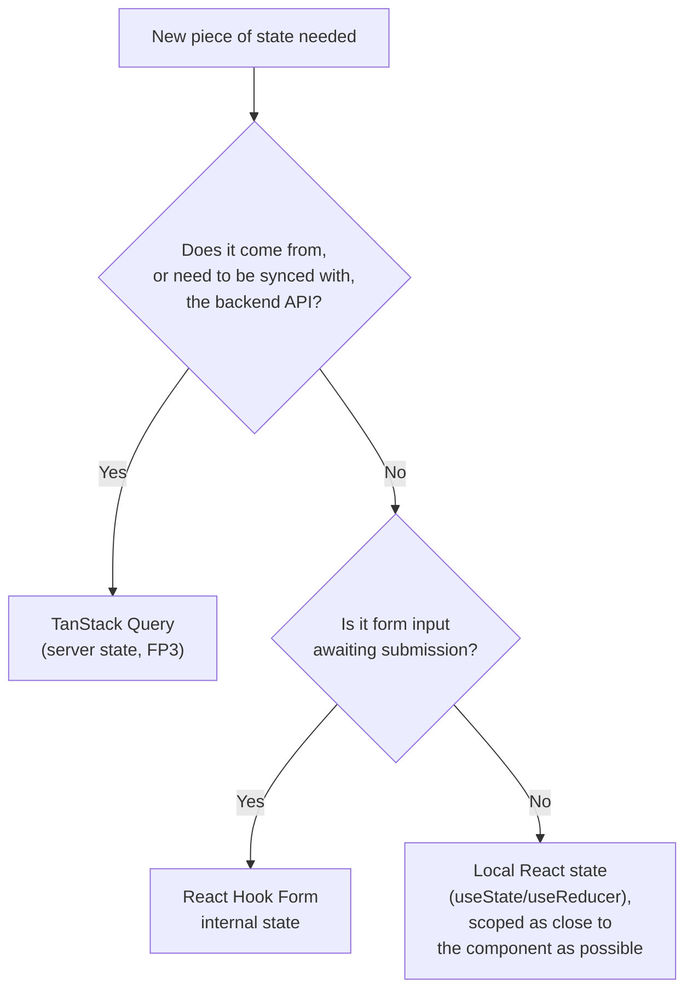
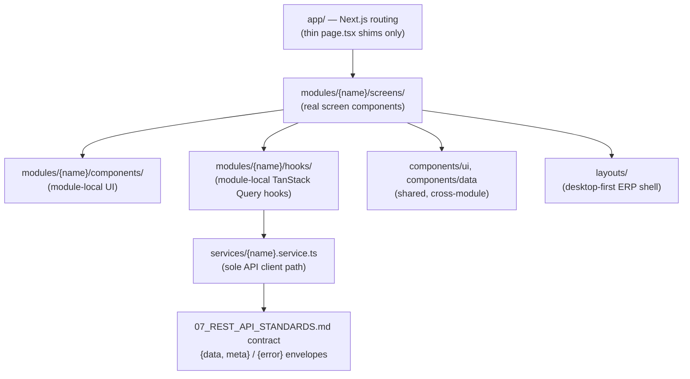
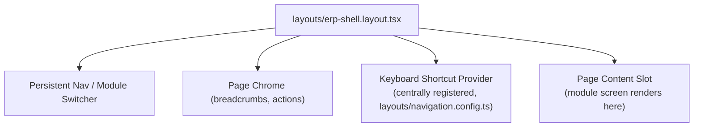
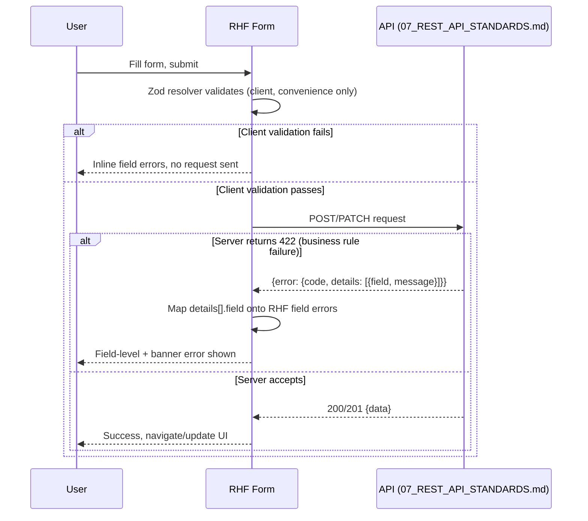
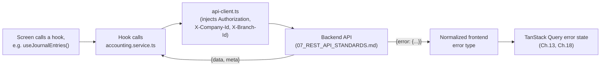
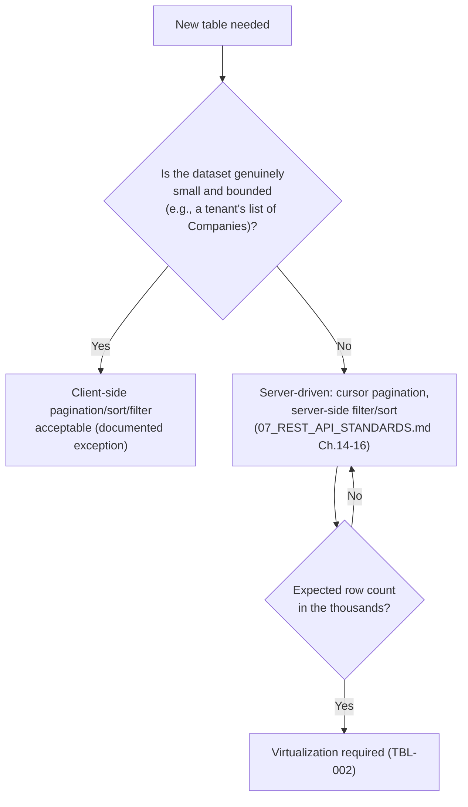
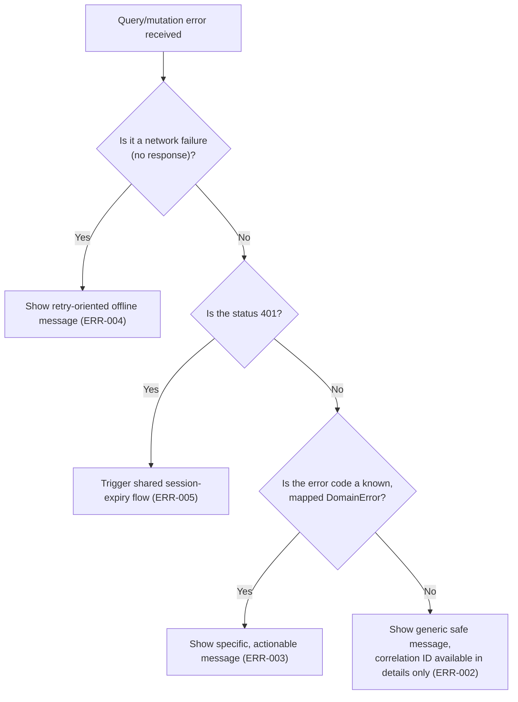

# 08_FRONTEND_STANDARDS.md

**Document Type:** Frontend Engineering Standards Handbook
**Product:** LedgerOne — Cloud Native ERP SaaS
**Status:** Complete — Chapters 1–29
**Depends on (frozen, never contradicted):** `00_BUSINESS_RULES.md`, `01_PROJECT_CONTEXT.md`, `02_TECH_STACK.md`, `03_ARCHITECTURE.md` Ch.11 (Frontend Architecture), `04_FOLDER_STRUCTURE.md` Ch.12–15, `05_CODING_STANDARDS.md` Ch.6, `06_DATABASE_STANDARDS.md`, `07_REST_API_STANDARDS.md`
**Audience:** Every frontend engineer building a screen, component, hook, or API integration in LedgerOne's Next.js application.

> `03_ARCHITECTURE.md` Ch.11 was written expecting this document to already establish desktop-first baseline, a centrally-defined keyboard-shortcut system, and mandatory loading/error/empty-state handling. This handbook makes those expectations concrete and enforceable. If frontend code violates this handbook, it fails code review.

---

## Chapter 1 — Introduction

### 1.1 Purpose

LedgerOne's frontend serves non-technical SMB/mid-market finance and operations staff through a desktop-first ERP interface (`03_ARCHITECTURE.md` Ch.11.2), built by a team of 100+ engineers across 16 modules. This handbook exists so a Chart of Accounts screen in Accounting and a Bill of Materials screen in Manufacturing feel like the same product, built by the same team, even though different engineers who may never talk to each other build them.

### 1.2 Relationship to Other Documents

| Document | What it owns | What this document owns instead |
|---|---|---|
| `03_ARCHITECTURE.md` Ch.11 | Frontend's existence as an untrusted client, module-mirroring rationale, state-management category split, security posture | The concrete component/page/hook conventions that implement those decisions |
| `04_FOLDER_STRUCTURE.md` Ch.12–15 | Exact folder trees and file-naming patterns | How to design *within* those files — component structure, hook design, page composition |
| `05_CODING_STANDARDS.md` Ch.6 | Platform-wide naming (camelCase, PascalCase, kebab-case files) | Frontend-specific application of those rules (component naming, hook naming, prop naming) |
| `07_REST_API_STANDARDS.md` | The wire contract (envelope, error shape, pagination) | How the `services/` layer and TanStack Query consume that contract |

### 1.3 Enforcement Model

Same taxonomy as `06_DATABASE_STANDARDS.md`/`07_REST_API_STANDARDS.md`:

| Severity | Meaning |
|---|---|
| 🔴 Critical | Breaks the untrusted-client security model, or breaks every screen (state management, API integration). |
| 🟠 High | Breaks a structural convention with cross-module blast radius (folder structure, component split). |
| 🟡 Medium | Convention violation contained to one module/screen. |
| ⚪ Low | Style preference. |

| Enforcement | Catches |
|---|---|
| Code Review | Anything not mechanically enforceable |
| ESLint | Naming, forbidden imports (cross-module, direct Axios calls) |
| CI | Bundle size budgets, accessibility lint failures, type errors |
| Architecture Review | New shared component categories, state-management exceptions |

### 1.4 How to Use This Handbook

Chapters 2–3 are philosophy, read once. Chapters 4–25 are a reference during implementation. Chapter 28 is the literal PR checklist. Chapter 29 is AI assistant guidance.

### 1.5 Related Documents

`03_ARCHITECTURE.md` Ch.11, `04_FOLDER_STRUCTURE.md` Ch.12–15, `05_CODING_STANDARDS.md` Ch.6, `07_REST_API_STANDARDS.md`.

---

## Chapter 2 — Frontend Philosophy

### 2.1 Purpose

States the beliefs every rule in this handbook derives from, mirroring `06_DATABASE_STANDARDS.md` Ch.1 and `07_REST_API_STANDARDS.md` Ch.2's role for their layers.

### 2.2 Core Philosophy

| # | Principle | Rationale |
|---|---|---|
| FP1 | **The frontend is an untrusted client — never the source of truth for authorization or business rules.** | `03_ARCHITECTURE.md` Ch.11.2/11.12: hiding a button from an unauthorized user is UX, not security; the server re-checks everything. |
| FP2 | **Desktop-first, not mobile-first.** | LedgerOne's real users work at a desk with dense, data-heavy screens — Chart of Accounts trees, multi-line Sales Orders, large filterable tables (`03_ARCHITECTURE.md` Ch.11.2/11.6). |
| FP3 | **Server state and client state are different problems solved with different tools.** | TanStack Query for anything from the API; React state/RHF for anything that is purely local UI (`03_ARCHITECTURE.md` Ch.11.4). |
| FP4 | **Client-side validation is convenience, never enforcement.** | The Two-Layer Validation Model (`03_ARCHITECTURE.md` Ch.11.5) — a form must always be ready to surface a server-rejected business rule even after passing client validation. |
| FP5 | **Loading, error, and empty states are not optional polish.** | TanStack Query always exposes these three states — there's no architectural excuse to omit handling any of them (`03_ARCHITECTURE.md` Ch.11.7.3). |
| FP6 | **Consistency across modules beats local optimization.** | A uniquely "better" table/modal/form pattern in one module costs every engineer who has to learn a second pattern. |
| FP7 | **Data density is a feature, not a bug to hide.** | ERP power users process many transactions per day; keyboard efficiency and dense tables matter more than whitespace-heavy consumer-app aesthetics. |
| FP8 | **Design for the module that isn't built yet.** | Payroll, Manufacturing, and Marketplace all consume the same component/hook conventions Accounting establishes first. |

### 2.3 Decision Tree — "Where does this piece of state live?"



### 2.4 Best Practices

- Before writing a component, ask "would this surprise an engineer who just finished the Accounting module and is now starting Payroll?" — if yes, it likely violates FP6.
- Default to the desktop layout first; treat responsive breakpoints as an adaptation, not the starting design (FP2).

### 2.5 Common Mistakes

| Mistake | Principle violated |
|---|---|
| Hiding a "Post" button via client-side permission check and calling that sufficient security. | FP1 |
| Building a global Redux-style store for both server and UI state. | FP3 — rejected alternative per `03_ARCHITECTURE.md` Ch.11.9 |
| Skipping the empty-state design because "the list will usually have data." | FP5 |
| Designing a mobile-first card layout for a transaction list, then squeezing it onto desktop. | FP2 |

### 2.6 Checklist

- [ ] I can name which principle (FP1–FP8) justifies this design choice.
- [ ] Nothing here assumes the server won't need to re-validate.

### 2.7 Future Considerations

Desktop-first emphasis may be revisited only for targeted mobile flows (e.g., warehouse Inventory scanning), never as a platform-wide shift (`03_ARCHITECTURE.md` Ch.11.16).

### 2.8 AI Assistant Guidance

Check every generated component against FP1–FP8 before proposing it. Never propose client-side-only authorization as sufficient.

### 2.9 Related Documents

`03_ARCHITECTURE.md` Ch.11.

---

## Chapter 3 — Architecture

### 3.1 Purpose

Restates, at the frontend-engineering level, the structural decisions `03_ARCHITECTURE.md` Ch.11 already made, so this handbook's later chapters have a fixed foundation to reference.

### 3.2 Rules

| Rule ID | Rule | Severity | Enforcement |
|---|---|---|---|
| ARCH-001 | `modules/` mirrors the backend's module list 1:1 (Accounting, Inventory, Sales, etc.) — frontend modules contain only presentation, interaction, and convenience validation, never real business rules (`03_ARCHITECTURE.md` Ch.11.3). | 🔴 Critical | Architecture Review |
| ARCH-002 | `app/` contains only Next.js routing; its URL structure aligns to the API's resource structure (`07_REST_API_STANDARDS.md` Ch.4) — no separate URL taxonomy invented at the frontend layer. | 🟠 High | Code Review |
| ARCH-003 | `services/` is the sole path to the backend API — no module, screen, or component calls Axios/fetch directly (`03_ARCHITECTURE.md` Decision 11.7.1). | 🔴 Critical | ESLint (forbidden import rule) |
| ARCH-004 | Frontend modules never import from another module's `modules/{name}/` subdirectory — cross-module UI needs are composed through shared `components/`, or via a dedicated cross-module API endpoint (`03_ARCHITECTURE.md` Decision 11.7.2). | 🟠 High | ESLint (import boundary rule) |
| ARCH-005 | New modules are added as new `modules/` subdirectories only — existing modules are never modified to accommodate a new one (`03_ARCHITECTURE.md` Ch.11.14). | 🟡 Medium | Code Review |

### 3.3 Diagram — Frontend Layer Map



### 3.4 Standards & Rationale

This mirrors the backend's Clean Architecture layering (`03_ARCHITECTURE.md` Ch.3.4) deliberately: the frontend's `services/` is analogous to the backend's Repository layer — the one chokepoint through which the outside world (here, the API) is accessed, making it possible to enforce auth-header injection, tenant-context forwarding, and error-shape parsing in one place instead of trusting every call site (same rationale as `06_DATABASE_STANDARDS.md` §1.4's Repository argument).

### 3.5 Examples

**Good:** `modules/accounting/hooks/use-journal-entries.ts` calls `services/accounting.service.ts`, which calls `services/api-client.ts`. **Bad:** a component inside `modules/sales/` importing `axios` directly to hit `/api/v1/accounting/journal-entries` — bypasses `services/`, duplicates auth/error handling, and reaches across module boundaries.

### 3.6 Best Practices

- When two modules genuinely need the same UI pattern, promote it to shared `components/` rather than one module importing from the other (ARCH-004).

### 3.7 Common Mistakes

| Mistake | Fix |
|---|---|
| A `page.tsx` containing a `useQuery` call and business logic directly. | Move to `modules/{name}/screens/`; `page.tsx` only imports and renders (`04_FOLDER_STRUCTURE.md` Ch.12). |
| Direct `axios.get(...)` in a screen component. | Route through `services/` (ARCH-003). |
| Modifying the Accounting module's shared component to fit a new Payroll need. | Add Payroll's own module-local component, or promote a genuinely shared version to `components/`. |

### 3.8 Checklist

- [ ] New screen lives under `modules/{name}/screens/`, not `app/`.
- [ ] No direct Axios/fetch calls outside `services/`.
- [ ] No cross-module `modules/*` imports.

### 3.9 Future Considerations

A formal cross-module UI composition pattern is deferred until the Dashboard module is designed (`03_ARCHITECTURE.md` Ch.11.16) — this chapter will be revisited then.

### 3.10 AI Assistant Guidance

Never generate a component that imports Axios/fetch directly. Never generate an import from one module's directory into another's.

### 3.11 Related Documents

`03_ARCHITECTURE.md` Ch.11.3–11.7, `04_FOLDER_STRUCTURE.md` Ch.12–13.

---

## Chapter 4 — Folder Structure

### 4.1 Purpose

Restates `04_FOLDER_STRUCTURE.md` Ch.12–15's exact frontend tree as the binding reference for this handbook's later chapters — this handbook does not redefine folder structure, only explains how to work within it.

### 4.2 Standards — The Tree

```
apps/web/src/
├── app/                              # Next.js routing — thin page.tsx shims only
│   ├── (dashboard)/
│   │   ├── accounting/journal-entries/page.tsx
│   │   └── sales/
│   └── layout.tsx
├── modules/                          # mirrors backend modules/
│   ├── accounting/
│   │   ├── screens/                  # JournalEntryListScreen.tsx
│   │   ├── components/               # module-local components
│   │   └── hooks/                    # useJournalEntries.ts
│   └── sales/
├── components/
│   ├── ui/                           # primitives: Button, Input, Modal
│   └── data/                         # data-dense: Table, VirtualizedList
├── services/
│   ├── api-client.ts                 # base Axios instance
│   ├── accounting.service.ts
│   └── sales.service.ts
├── hooks/                            # shared hooks
│   ├── use-current-tenant.ts
│   └── use-permissions.ts
└── layouts/
    ├── erp-shell.layout.tsx
    └── navigation.config.ts

packages/
├── shared-types/                     # DTOs shared with apps/api
├── shared-utils/                     # money.util.ts, etc.
└── ui/                                # design-system primitives, if shared beyond web
```

### 4.3 Rules

| Rule ID | Rule | Severity | Enforcement |
|---|---|---|---|
| FLD-001 | `page.tsx` files contain only routing — import and render the screen from `modules/{name}/screens/`; never a `useQuery` call or business logic. | 🟠 High | Code Review, ESLint |
| FLD-002 | Data-dense components (tables, virtualized lists) always live in `components/data/`, never mixed into `components/ui/`. | 🟠 High | Code Review |
| FLD-003 | Every DTO/type shared between frontend and backend is imported from `packages/shared-types` — never redeclared locally. | 🔴 Critical | ESLint, contract test |
| FLD-004 | Every per-module API wrapper lives in `services/{module}.service.ts` and wraps `services/api-client.ts` — no module constructs its own HTTP client instance. | 🟠 High | Code Review |

### 4.4 Best Practices

- When adding a new module, copy the existing tree shape from an established module (Accounting) rather than inventing a new internal structure.

### 4.5 Common Mistakes

| Mistake | Fix |
|---|---|
| A locally-redeclared `Invoice` interface in a frontend file that duplicates the shared DTO. | Import from `packages/shared-types` (FLD-003). |
| A large data table placed in `components/ui/`. | Move to `components/data/` (FLD-002). |

### 4.6 Checklist

- [ ] `page.tsx` is a thin shim.
- [ ] Data-dense components are in `components/data/`.
- [ ] No locally duplicated DTO types.
- [ ] Module API wrapper follows `{module}.service.ts` and wraps `api-client.ts`.

### 4.7 Future Considerations

None — this tree is stable; any structural change is a `04_FOLDER_STRUCTURE.md` update first.

### 4.8 AI Assistant Guidance

Always place a new screen under `modules/{name}/screens/`, never directly in `app/`. Always import shared DTOs from `packages/shared-types`.

### 4.9 Related Documents

`04_FOLDER_STRUCTURE.md` Ch.12–15.

---

## Chapter 5 — Component Standards

### 5.1 Purpose

Defines how components are structured and categorized.

### 5.2 Rules

| Rule ID | Rule | Severity | Enforcement |
|---|---|---|---|
| CMP-001 | Every component is either **smart** (owns data-fetching/state, composes dumb components) or **dumb/presentational** (props in, JSX out, no data-fetching) — never a component that does both ambiguously. | 🟠 High | Code Review |
| CMP-002 | Shared components (`components/ui`, `components/data`) are always dumb/presentational — they never call a hook that fetches data, and never depend on a specific business module. | 🔴 Critical | Code Review, ESLint |
| CMP-003 | Screens (`modules/{name}/screens/*.tsx`) are the smart layer — they call TanStack Query hooks and pass resolved data down as props to dumb components. | 🟠 High | Code Review |
| CMP-004 | A component's props are fully typed (no `any`), and optional props have explicit defaults, not `undefined`-checked inline repeatedly. | 🟡 Medium | ESLint (TypeScript strict) |
| CMP-005 | A component that grows beyond a single, clearly-nameable responsibility is split — no "God component" handling a whole page's logic in one file. | 🟡 Medium | Code Review |

### 5.3 Decision Matrix — Smart vs. Dumb

| Concern | Smart Component | Dumb Component |
|---|---|---|
| Location | `modules/{name}/screens/`, or a module's `components/` if it fetches data | `components/ui/`, `components/data/`, or module `components/` with no fetching |
| Data source | TanStack Query hooks, `services/` | Props only |
| Reusability | Module-specific, not shared | Designed to be shared across modules |
| Testing | Integration-style (mock the query) | Unit-style (pure props → render) |

### 5.4 Examples

**Good:** `JournalEntryListScreen` (smart — calls `useJournalEntries()`) renders `<DataTable data={entries} columns={columns} />` (dumb — `components/data/`, receives everything as props).
**Bad:** A `DataTable` component in `components/data/` that internally calls `useJournalEntries()` — couples a shared, cross-module component to one module's data source, violating CMP-002.

### 5.5 Best Practices

- Name smart components with a `Screen` suffix (`JournalEntryListScreen`) to make the smart/dumb distinction visible at a glance, consistent with `04_FOLDER_STRUCTURE.md`'s naming convention.

### 5.6 Common Mistakes

| Mistake | Fix |
|---|---|
| A shared `components/ui/Modal` that fetches its own data. | Modal receives content/data as props (children), stays dumb. |
| A 600-line screen component handling fetching, form state, table config, and modal logic all inline. | Split into a screen (orchestration) + dumb sub-components (CMP-005). |

### 5.7 Checklist

- [ ] Component is clearly smart or dumb, not ambiguous.
- [ ] Shared components never fetch data or depend on a specific module.
- [ ] Props are fully typed.

### 5.8 Future Considerations

None — stable convention.

### 5.9 AI Assistant Guidance

Always classify a generated component as smart or dumb before writing it. Never generate a shared `components/` component that calls a data-fetching hook.

### 5.10 Related Documents

Ch.6 (Naming Conventions), Ch.9 (Page Standards).

---

## Chapter 6 — Naming Conventions

### 6.1 Purpose

Applies `05_CODING_STANDARDS.md` Ch.6's platform-wide naming rules specifically to frontend artifacts.

### 6.2 Rules

| Rule ID | Rule | Severity | Enforcement |
|---|---|---|---|
| NAME-001 | Component files: `PascalCase.tsx` (`JournalEntryListScreen.tsx`, `DataTable.tsx`). | 🟠 High | ESLint |
| NAME-002 | Hook files: `kebab-case.ts` containing a `useCamelCase` export (`use-journal-entries.ts` exporting `useJournalEntries`) — matches `04_FOLDER_STRUCTURE.md`'s established pattern. | 🟠 High | ESLint |
| NAME-003 | Service files: `{module}.service.ts`, `kebab-case`. | 🟡 Medium | ESLint |
| NAME-004 | Boolean props/variables read as yes/no questions (`isLoading`, `hasError`, `canEdit`) — no negative-sounding booleans (`05_CODING_STANDARDS.md` Ch.6). | 🟡 Medium | Code Review |
| NAME-005 | Domain vocabulary in UI labels, variable names, and component names matches `00_BUSINESS_RULES.md`'s exact terms ("Tenant," "Company," "Branch" — never ad hoc synonyms). | 🟠 High | Code Review |
| NAME-006 | Event handler props are named `onX` (`onSubmit`, `onRowClick`); internal handler functions are named `handleX`. | 🟡 Medium | Code Review |

### 6.3 Examples

**Good:** `use-permissions.ts` exporting `usePermissions()`; a prop `isPosted: boolean`; a handler `onSave` prop wired to an internal `handleSave` function.
**Bad:** `Use-Permissions.tsx` (wrong case, wrong extension for a non-component file); a prop `notEditable` (negative-sounding, violates NAME-004 — use `canEdit` inverted at the call site instead).

### 6.4 Best Practices

- When in doubt about a domain term, check `00_BUSINESS_RULES.md`'s glossary before naming a component or variable — don't invent a shorter synonym for convenience.

### 6.5 Common Mistakes

| Mistake | Fix |
|---|---|
| A hook file named `JournalEntries.ts`. | `use-journal-entries.ts`. |
| A boolean named `disabled` when the concept is really "can the user edit this." | `canEdit`, inverted where needed, never a double-negative like `isNotDisabled`. |

### 6.6 Checklist

- [ ] Component files `PascalCase.tsx`.
- [ ] Hook files `kebab-case.ts`, hook export `useCamelCase`.
- [ ] Booleans read as yes/no questions.
- [ ] Domain vocabulary matches `00_BUSINESS_RULES.md`.

### 6.7 Future Considerations

None — stable.

### 6.8 AI Assistant Guidance

Always apply these naming patterns without exception. Never invent a shorter domain term than what `00_BUSINESS_RULES.md` uses.

### 6.9 Related Documents

`05_CODING_STANDARDS.md` Ch.6.

---

## Chapter 7 — Routing Standards

### 7.1 Purpose

Defines how Next.js `app/` routing maps to the API's resource structure, per ARCH-002.

### 7.2 Rules

| Rule ID | Rule | Severity | Enforcement |
|---|---|---|---|
| ROUTE-001 | URL structure mirrors the API's module/resource structure (`07_REST_API_STANDARDS.md` Ch.4): `/accounting/journal-entries`, `/accounting/journal-entries/{uuid}`. | 🟠 High | Code Review |
| ROUTE-002 | Route params reference `uuid` only, never the internal `id`, identical to the API layer's rule. | 🔴 Critical | Code Review, contract test |
| ROUTE-003 | Route groups (`(dashboard)`) organize layout composition, never business logic — a route group folder contains no screen logic itself. | 🟡 Medium | Code Review |
| ROUTE-004 | Every protected route is guarded by the shared auth-check mechanism (redirect to login if unauthenticated) at the layout level, not duplicated per page. | 🟠 High | Code Review |

### 7.3 Examples

**Good:** `/app/(dashboard)/accounting/journal-entries/[uuid]/page.tsx`.
**Bad:** `/app/(dashboard)/accounting/journal-entries/[id]/page.tsx` using the internal numeric id in the URL.

### 7.4 Best Practices

- Keep the route tree's shape a direct mirror of the API's URL shape so an engineer can predict one from the other without checking documentation.

### 7.5 Common Mistakes

| Mistake | Fix |
|---|---|
| A route param named `[id]` that's actually the internal database id. | Always `[uuid]` (ROUTE-002). |
| Auth-check logic duplicated in every page component. | Centralize at the layout level (ROUTE-004). |

### 7.6 Checklist

- [ ] URL mirrors API resource structure.
- [ ] Route params are `uuid`, never internal `id`.
- [ ] Auth guard is centralized, not per-page.

### 7.7 Future Considerations

None — stable.

### 7.8 AI Assistant Guidance

Always generate `[uuid]` route params, never `[id]`. Always mirror the API's resource URL structure.

### 7.9 Related Documents

`07_REST_API_STANDARDS.md` Ch.4, Ch.13 (Multi-Tenant API Standards).

---

## Chapter 8 — Layout Standards

### 8.1 Purpose

Defines the desktop-first ERP shell (`03_ARCHITECTURE.md` Ch.11.6) and its keyboard-shortcut system.

### 8.2 Rules

| Rule ID | Rule | Severity | Enforcement |
|---|---|---|---|
| LAY-001 | The ERP shell (`layouts/erp-shell.layout.tsx`) provides persistent navigation, module switcher, and page chrome — designed for large-screen, multi-panel layouts first; responsive collapse is a secondary adaptation. | 🟠 High | Architecture Review |
| LAY-002 | Keyboard shortcuts are registered through one centrally-defined shortcut system (`layouts/navigation.config.ts` or equivalent) — no screen implements its own ad hoc `keydown` listener for a shortcut that should be global or semi-global. | 🔴 Critical | Code Review |
| LAY-003 | Every module's primary list/detail screens support the platform-standard shortcut set (e.g., `/` to focus search, `n` to create new, `Esc` to close a modal/drawer) unless a documented conflict exists. | 🟡 Medium | Code Review |
| LAY-004 | The navigation/module switcher reflects only modules and screens the authenticated user has permission to see — but this is UX convenience only; the server remains authoritative (FP1). | 🟠 High | Code Review |

### 8.3 Diagram — Shell Composition



### 8.4 Examples

**Good:** A new module registers its shortcuts in the shared config; the shell's shortcut provider handles global dispatch.
**Bad:** A Sales screen adding its own `document.addEventListener('keydown', ...)` for a "new order" shortcut, duplicating logic and risking conflicts with another module's shortcut.

### 8.5 Best Practices

- Document each module's shortcut additions in one central registry so shortcut conflicts are visible at review time, not discovered by users in production.

### 8.6 Common Mistakes

| Mistake | Fix |
|---|---|
| A screen-local `keydown` listener for a shortcut that should be global. | Register through the central shortcut system (LAY-002). |
| A responsive-first layout that collapses navigation aggressively on desktop widths. | Design for large-screen persistent nav first (LAY-001). |

### 8.7 Checklist

- [ ] Shortcuts registered through the central system, not ad hoc.
- [ ] Layout designed desktop-first, responsive as adaptation.
- [ ] Navigation reflects permissions as UX only, not enforcement.

### 8.8 Future Considerations

A dedicated mobile flow (e.g., warehouse scanning) may need its own layout variant later — evaluated per concrete need (`03_ARCHITECTURE.md` Ch.11.16), not built speculatively.

### 8.9 AI Assistant Guidance

Never generate a screen-local keyboard event listener for a shortcut that should be shared. Always register new shortcuts through the central config.

### 8.10 Related Documents

`03_ARCHITECTURE.md` Ch.11.6.

---

## Chapter 9 — Page Standards

### 9.1 Purpose

Defines the composition pattern for a full screen — list, detail, and form pages.

### 9.2 Rules

| Rule ID | Rule | Severity | Enforcement |
|---|---|---|---|
| PAGE-001 | A list screen composes: page chrome (title, actions) + filter/search bar (Ch.15/16/17 of `07_REST_API_STANDARDS.md` equivalents) + `components/data/DataTable` + pagination controls. | 🟡 Medium | Code Review |
| PAGE-002 | A detail screen composes: page chrome + a read-only or editable form section + related-data sections (e.g., Journal Entry lines), each independently loading via its own TanStack Query hook. | 🟡 Medium | Code Review |
| PAGE-003 | Every screen handles all three TanStack Query states explicitly: loading (Ch.19 skeletons), error (Ch.18), and empty (Ch.19) — no screen renders only the "happy path." | 🔴 Critical | Code Review |
| PAGE-004 | Page-level actions (Save, Post, Void) are visually and structurally consistent across modules — same button placement, same confirmation pattern for destructive/irreversible actions. | 🟡 Medium | Code Review |

### 9.3 Examples

**Good:** `JournalEntryDetailScreen` renders a loading skeleton while `useJournalEntry(uuid)` resolves, an error state with retry on failure, and the form once data resolves — never a blank screen during any of these states.

### 9.4 Best Practices

- Build one shared `<QueryStateBoundary>`-style composition pattern (loading/error/empty wrapper) reused by every screen rather than each screen hand-rolling the same three-branch conditional.

### 9.5 Common Mistakes

| Mistake | Fix |
|---|---|
| A screen that renders a blank page while data loads, with no skeleton. | Always show a loading state (Ch.19). |
| Inconsistent confirmation dialogs for "Void" across different modules. | Standardize the pattern (Ch.15 Modal Standards). |

### 9.6 Checklist

- [ ] Loading/error/empty states all handled.
- [ ] Page-level actions follow the platform-standard pattern.

### 9.7 Future Considerations

None beyond Ch.19/20's evolution.

### 9.8 AI Assistant Guidance

Always generate all three query states for any screen consuming TanStack Query. Never generate a screen that only handles the success case.

### 9.9 Related Documents

Ch.13 (TanStack Query Standards), Ch.18 (Error Handling), Ch.19 (Loading States).

---

## Chapter 10 — Form Standards

### 10.1 Purpose

Defines form structure using React Hook Form (RHF), consistent with the Two-Layer Validation Model (`03_ARCHITECTURE.md` Ch.11.5).

### 10.2 Rules

| Rule ID | Rule | Severity | Enforcement |
|---|---|---|---|
| FORM-001 | Every form uses React Hook Form; no form manages field state with ad hoc `useState` per field. | 🟠 High | Code Review |
| FORM-002 | Client-side validation (RHF + Zod resolver) is convenience only — the form must always be able to display a server-side `422` error (`07_REST_API_STANDARDS.md` Ch.9/10) even after client validation passed (FP4). | 🔴 Critical | Code Review |
| FORM-003 | A server-side field-level error (`error.details[].field`) is mapped back onto the corresponding RHF field, not shown only as a generic top-level banner. | 🟠 High | Code Review |
| FORM-004 | Monetary input fields display and submit as decimal strings, matching `07_REST_API_STANDARDS.md` REQ-004/RES-004 — never coerced to a JS `number` internally before submission. | 🔴 Critical | Code Review |
| FORM-005 | Destructive/irreversible submit actions (Post, Void, Delete) require an explicit confirmation step (Ch.15 Modal Standards), never a single accidental click. | 🟠 High | Code Review |
| FORM-006 | Unsaved-changes protection (warn before navigating away) is applied to any form with dirty state, using RHF's `formState.isDirty`. | 🟡 Medium | Code Review |

### 10.3 Diagram — Two-Layer Validation Flow



### 10.4 Examples

**Good:** A journal entry form passes client validation (fields present, decimal format correct) but the server rejects it with `ALREADY_POSTED` or a period-closed business rule — the form surfaces this exact server message, not a generic "something went wrong."
**Bad:** A form that only trusts its own Zod schema and has no code path to display a server-returned `422` error at all.

### 10.5 Best Practices

- Share one Zod schema definition between the RHF resolver and (where reasonable) the equivalent backend schema reference, to reduce drift, while remembering the backend copy is still authoritative (FP4).

### 10.6 Common Mistakes

| Mistake | Fix |
|---|---|
| Treating passed client validation as proof the submission will succeed. | Always handle the server `422` case (FORM-002). |
| Submitting a monetary field as `parseFloat(input)`. | Keep as a decimal string end-to-end (FORM-004). |
| A one-click "Void" button with no confirmation. | Require explicit confirmation (FORM-005). |

### 10.7 Checklist

- [ ] Built with RHF, not ad hoc field state.
- [ ] Server-side `422` errors are handled and mapped to fields.
- [ ] Monetary fields stay decimal strings.
- [ ] Destructive actions require confirmation.

### 10.8 Future Considerations

Once `07_REST_API_STANDARDS.md`'s contract-first OpenAPI/Zod generation matures, form schemas may eventually be generated from the same source as the backend's Zod schemas — not yet built.

### 10.9 AI Assistant Guidance

Always generate forms with React Hook Form. Always include a code path for server-side `422` field errors, never treat client validation as sufficient. Always keep monetary fields as strings.

### 10.10 Related Documents

`03_ARCHITECTURE.md` Ch.11.5, `07_REST_API_STANDARDS.md` Ch.9/Ch.10, Ch.11 of this document (Validation Standards).

---

## Chapter 11 — Validation Standards

### 11.1 Purpose

Expands on Form Standards' validation split with the concrete Zod-on-the-frontend conventions.

### 11.2 Rules

| Rule ID | Rule | Severity | Enforcement |
|---|---|---|---|
| VAL-001 | Every RHF form has an explicit Zod schema passed via `@hookform/resolvers/zod` — no form validates purely via ad hoc inline rules. | 🟠 High | Code Review |
| VAL-002 | Frontend Zod schemas mirror the shape of `packages/shared-types` DTOs — imported/derived from shared types where possible, not redefined field-by-field independently. | 🟡 Medium | Code Review |
| VAL-003 | Client validation never attempts to encode a business rule requiring server state (e.g., "does this code already exist for this tenant") — that always requires a server round-trip and is surfaced per FORM-002/003. | 🟠 High | Code Review |
| VAL-004 | Validation error messages are human-readable and consistent in tone/format across modules — no raw Zod default messages ("Expected string, received number") shown to end users. | 🟡 Medium | Code Review |

### 11.3 Examples

**Good:** A shared `moneyStringSchema` (from `packages/shared-utils` or `shared-types`) reused across every module's amount fields.
**Bad:** A client-side check that calls the API mid-validation to see if a Chart of Accounts code is already taken, treating that as if it were the final answer instead of just an early hint (real enforcement still happens server-side on submit).

### 11.4 Best Practices

- Centralize common field validators (money, email, tax ID format) in `packages/shared-utils` so every module's form schema imports them rather than reimplementing.

### 11.5 Common Mistakes

| Mistake | Fix |
|---|---|
| Showing raw Zod error messages to end users. | Map to human-readable, consistent messages (VAL-004). |
| Duplicating a DTO's shape as a hand-written Zod schema that drifts from the shared type. | Derive from/validate against `packages/shared-types` (VAL-002). |

### 11.6 Checklist

- [ ] Every form has an explicit Zod schema.
- [ ] Schema shape matches shared DTOs.
- [ ] Error messages are human-readable and consistent.

### 11.7 Future Considerations

See Ch.10.8 — contract-first schema generation.

### 11.8 AI Assistant Guidance

Always generate a Zod schema per form, reusing shared validators where they exist. Never surface raw Zod default error text to the user.

### 11.9 Related Documents

Ch.10 (Form Standards), `packages/shared-types`, `packages/shared-utils`.

---

## Chapter 12 — API Integration

### 12.1 Purpose

Defines how `services/` consumes the `07_REST_API_STANDARDS.md` contract.

### 12.2 Rules

| Rule ID | Rule | Severity | Enforcement |
|---|---|---|---|
| API-001 | `services/api-client.ts` is the single Axios instance for the entire app — injects the `Authorization: Bearer` header and any active `X-Company-Id`/`X-Branch-Id` context header automatically; no per-module service constructs its own client. | 🔴 Critical | ESLint, Code Review |
| API-002 | Every per-module `{module}.service.ts` function returns the unwrapped `data` from the `{data, meta}` envelope — callers (hooks) never manually unwrap the envelope themselves. | 🟠 High | Code Review |
| API-003 | Every service function's error path normalizes `07_REST_API_STANDARDS.md`'s `{error: {code, message, details, correlationId}}` shape into one shared frontend error type, consumed uniformly by Ch.18's error handling. | 🟠 High | Code Review |
| API-004 | Tenant context is never set explicitly by frontend code — it is embedded in the JWT and forwarded automatically by `api-client.ts` (`03_ARCHITECTURE.md` Decision 11.7.1) — no service function accepts or passes a `tenantId` parameter. | 🔴 Critical | Code Review, ESLint |
| API-005 | The active Company/Branch context (`X-Company-Id`/`X-Branch-Id`, `07_REST_API_STANDARDS.md` Ch.13) is managed by one shared context/hook (e.g., `hooks/use-current-tenant.ts` or a sibling `use-active-company.ts`) and injected automatically by `api-client.ts` — individual screens never set these headers manually. | 🟠 High | Code Review |

### 12.3 Diagram — Request Flow



### 12.4 Examples

**Good:** `accounting.service.ts`'s `getJournalEntries()` returns `Promise<JournalEntry[]>` (already unwrapped from `data`), with pagination `meta` returned as a separate typed field for the hook to use.
**Bad:** A hook calling `axios.get('/api/v1/accounting/journal-entries')` directly and manually reading `response.data.data` inline — bypasses the shared client, duplicates envelope-unwrapping logic per call site.

### 12.5 Best Practices

- Keep `services/` functions thin — they translate between the wire contract and clean TypeScript types; business/display logic belongs in hooks or components, not in the service layer.

### 12.6 Common Mistakes

| Mistake | Fix |
|---|---|
| A component reading `response.data.data.uuid` directly. | Service layer unwraps the envelope; component receives clean typed data. |
| A hook accepting a `tenantId` argument "to be explicit." | Never — tenant context is automatic via the JWT (API-004). |

### 12.7 Checklist

- [ ] All API calls go through `services/`.
- [ ] Envelope unwrapping happens once, in the service layer.
- [ ] No `tenantId` ever passed explicitly by frontend code.
- [ ] Company/Branch context managed by one shared mechanism, not per-screen.

### 12.8 Future Considerations

None — this contract is stable as long as `07_REST_API_STANDARDS.md`'s envelope shape doesn't change (a breaking change there would flow through here per that document's Ch.6 versioning rules).

### 12.9 AI Assistant Guidance

Always route API calls through `services/{module}.service.ts`. Never generate a component or hook that manually sets tenant/company headers or unwraps the response envelope inline.

### 12.10 Related Documents

`07_REST_API_STANDARDS.md` Ch.8, Ch.9, Ch.13, `03_ARCHITECTURE.md` Decision 11.7.1.

---

## Chapter 13 — TanStack Query Standards

### 13.1 Purpose

Defines conventions for server-state hooks, the primary state-management tool per FP3/`03_ARCHITECTURE.md` Ch.11.4.

### 13.2 Rules

| Rule ID | Rule | Severity | Enforcement |
|---|---|---|---|
| TQ-001 | Every data-fetching hook lives in `modules/{name}/hooks/` (module-specific) or `hooks/` (shared) and wraps `useQuery`/`useMutation` — never called ad hoc inline inside a screen component's body. | 🟠 High | Code Review |
| TQ-002 | Query keys follow a consistent, hierarchical structure: `[module, resource, ...params]` (e.g., `['accounting', 'journal-entries', {cursor, filters}]`) — never a bare string or an inconsistent shape per module. | 🟠 High | Code Review |
| TQ-003 | Mutations invalidate the exact affected query keys on success (`queryClient.invalidateQueries`) — never a blanket invalidate-everything, and never a silent failure to invalidate leaving stale data displayed. | 🟠 High | Code Review |
| TQ-004 | Every `useQuery` call's `isLoading`, `isError`, and empty-data cases are consumed by the calling screen (Ch.9.2, PAGE-003) — a hook itself doesn't need to render anything, but nothing may discard these states. | 🔴 Critical | Code Review |
| TQ-005 | Cache/staleness configuration (`staleTime`, `refetchOnWindowFocus`, etc.) is set deliberately per query based on how frequently the underlying data changes — never left at a single global default for every resource type without consideration. | 🟡 Medium | Code Review |

### 13.3 Decision Matrix — Query Key Structure

| Level | Example | Purpose |
|---|---|---|
| Module | `'accounting'` | Namespace, avoids collisions across modules |
| Resource | `'journal-entries'` | Identifies the resource type |
| Params | `{cursor, filters, sort}` | Makes each distinct query variant separately cacheable/invalidatable |

### 13.4 Examples

**Good:** `useJournalEntries({cursor, status})` → key `['accounting', 'journal-entries', {cursor, status}]`; posting a journal entry invalidates `['accounting', 'journal-entries']` (prefix match) to refresh any open list view.
**Bad:** A mutation that calls `queryClient.invalidateQueries()` with no key argument, invalidating and refetching every active query on the page — unnecessary network load and a common perf antipattern.

### 13.5 Best Practices

- Co-locate a resource's query-key factory function (e.g., `journalEntryKeys.list(params)`) in the same hook file, so every consumer builds keys identically instead of hand-typing the array shape.

### 13.6 Common Mistakes

| Mistake | Fix |
|---|---|
| Calling `useQuery` directly inside a screen with an inline key/fetcher instead of a named hook. | Extract to `use-journal-entries.ts` (TQ-001). |
| Forgetting to invalidate after a mutation, leaving stale list data displayed. | Always invalidate the specific affected keys (TQ-003). |

### 13.7 Checklist

- [ ] Data fetching goes through a named hook, not inline `useQuery`.
- [ ] Query keys are hierarchical and consistent.
- [ ] Mutations invalidate exactly the affected keys.
- [ ] Loading/error/empty states are consumed by the calling screen.

### 13.8 Future Considerations

If a specific view needs near-real-time updates, evaluate WebSockets/SSE per `03_ARCHITECTURE.md` Ch.11.16 rather than aggressive polling — not yet built.

### 13.9 AI Assistant Guidance

Always wrap `useQuery`/`useMutation` in a named hook with a hierarchical query key. Always invalidate specific keys on mutation success, never a blanket invalidate-all.

### 13.10 Related Documents

`03_ARCHITECTURE.md` Ch.11.4, Ch.12 (API Integration), Ch.9 (Page Standards).

---

## Chapter 14 — Table Standards

### 14.1 Purpose

Defines TanStack Table conventions for LedgerOne's data-dense ERP screens (FP7).

### 14.2 Rules

| Rule ID | Rule | Severity | Enforcement |
|---|---|---|---|
| TBL-001 | The shared `components/data/DataTable` primitive wraps TanStack Table — no module builds its own table component from scratch. | 🟠 High | Code Review |
| TBL-002 | Tables expected to render more than a few hundred rows use row virtualization/windowing as a built-in capability of the shared primitive — not something each module solves independently (`03_ARCHITECTURE.md` Ch.11.13). | 🔴 Critical | Architecture Review, Code Review |
| TBL-003 | Server-driven pagination (Ch.14 of `07_REST_API_STANDARDS.md`) is the default for any table backed by a growing dataset — client-side-only pagination/sorting is reserved for genuinely small, bounded datasets. | 🟠 High | Code Review |
| TBL-004 | Column definitions are typed against the shared DTO type (`packages/shared-types`), not loosely typed inline. | 🟡 Medium | Code Review |
| TBL-005 | Every table has a defined empty state (Ch.19) and a defined loading-skeleton state (Ch.19) — never rendering a bare empty `<table>` shell. | 🟠 High | Code Review |

### 14.3 Decision Tree — Client-Side vs. Server-Driven Table



### 14.4 Examples

**Good:** A Journal Entries table with server-driven cursor pagination, virtualized rendering, columns typed against the shared `JournalEntry` DTO.
**Bad:** A module fetching all 50,000 rows client-side and paginating in JavaScript — directly violates both `06_DATABASE_STANDARDS.md` RPT-004's server-side intent and TBL-002/003.

### 14.5 Best Practices

- Build column-definition helpers (e.g., a shared `moneyColumn()`, `dateColumn()` factory) so every module's money/date columns format identically.

### 14.6 Common Mistakes

| Mistake | Fix |
|---|---|
| A module-specific table built from raw `<table>` markup instead of the shared primitive. | Use `components/data/DataTable` (TBL-001). |
| An unvirtualized table rendering thousands of DOM rows, causing jank. | Enable virtualization (TBL-002). |

### 14.7 Checklist

- [ ] Uses the shared `DataTable` primitive.
- [ ] Virtualized if the dataset can grow large.
- [ ] Server-driven pagination for growing datasets.
- [ ] Empty and loading states defined.

### 14.8 Future Considerations

None — stable, revisit only if TanStack Table's major version changes require a primitive rewrite.

### 14.9 AI Assistant Guidance

Always use the shared `DataTable` primitive. Always default to server-driven pagination and flag virtualization need for any table without a known small bound.

### 14.10 Related Documents

`03_ARCHITECTURE.md` Ch.11.13, `07_REST_API_STANDARDS.md` Ch.14–16, Ch.4 of this document (Folder Structure, FLD-002).

---

## Chapter 15 — Modal Standards

### 15.1 Purpose

Defines conventions for Modals, Drawers, and Dialogs — grouped here as one chapter since they share the same underlying interaction pattern.

### 15.2 Rules

| Rule ID | Rule | Severity | Enforcement |
|---|---|---|---|
| MOD-001 | Modal = focused single-task interaction blocking the background (e.g., "Create Customer" quick-add); Drawer = side panel for viewing/editing detail without leaving list context (e.g., "Journal Entry quick view"); Dialog = short confirmation/alert (e.g., "Are you sure you want to void this?"). Each has a distinct, named shared component — never used interchangeably. | 🟡 Medium | Code Review |
| MOD-002 | All three use the shared `components/ui` primitives; no module builds its own overlay/focus-trap implementation. | 🟠 High | Code Review |
| MOD-003 | Destructive/irreversible actions always use the Dialog confirmation pattern before executing (FORM-005) — never a Modal/Drawer's primary button alone. | 🟠 High | Code Review |
| MOD-004 | `Esc` closes any Modal/Drawer/Dialog by default (consistent with the keyboard-shortcut system, LAY-003) unless the action is mid-submission. | 🟡 Medium | Code Review |
| MOD-005 | Focus is trapped within an open Modal/Dialog and returned to the triggering element on close (accessibility requirement, Ch.23). | 🟠 High | Code Review, accessibility lint |

### 15.3 Decision Matrix — Which Pattern?

| Need | Pattern |
|---|---|
| Quick-create a related record without navigating away | Modal |
| View/edit a record's detail while keeping list context visible | Drawer |
| Confirm a destructive or irreversible action | Dialog |
| Show a brief, non-blocking status update | Toast (Ch.20), not a Modal |

### 15.4 Examples

**Good:** Voiding a Journal Entry opens a Dialog ("Void this entry? This cannot be undone.") before the action executes.
**Bad:** A "Delete" button that executes immediately on click with no Dialog confirmation — violates MOD-003/FORM-005.

### 15.5 Best Practices

- Reuse one shared confirmation-Dialog component parameterized by title/body/confirm-label across every module's destructive actions, rather than each module building its own.

### 15.6 Common Mistakes

| Mistake | Fix |
|---|---|
| Using a full Modal for a simple yes/no confirmation. | Use the lighter Dialog pattern (MOD-001). |
| A custom overlay implementation per module. | Use the shared primitive (MOD-002). |

### 15.7 Checklist

- [ ] Correct pattern (Modal/Drawer/Dialog) chosen per Section 15.3.
- [ ] Destructive actions confirmed via Dialog.
- [ ] `Esc` closes, focus trapped and returned.

### 15.8 Future Considerations

None — stable.

### 15.9 AI Assistant Guidance

Always require a Dialog confirmation before executing a destructive action. Never generate a custom overlay/focus-trap implementation — always use the shared primitive.

### 15.10 Related Documents

Ch.5 (Component Standards), Ch.23 (Accessibility).

---

## Chapter 16 — State Management

### 16.1 Purpose

Consolidates the server-state/client-state split (FP3) into concrete guidance beyond TanStack Query's role (Ch.13).

### 16.2 Rules

| Rule ID | Rule | Severity | Enforcement |
|---|---|---|---|
| STATE-001 | Server state (anything from the API) uses TanStack Query exclusively — never mirrored into a separate global store "for convenience." | 🔴 Critical | Code Review |
| STATE-002 | Client-only UI state (modal open/closed, active tab, form draft before submission) uses local React state or RHF — never promoted to a global store unless genuinely shared across distant components. | 🟠 High | Code Review |
| STATE-003 | Cross-cutting client state that genuinely needs to be global (current user, active Company/Branch context, theme) uses React Context, not a full global-state library, given LedgerOne's rejection of a single all-purpose global store (`03_ARCHITECTURE.md` Ch.11.9). | 🟠 High | Architecture Review |
| STATE-004 | No component derives its own copy of server data into local state and lets it drift — if a value comes from a query, it's read from the query result, not copied into `useState` and manually kept in sync. | 🟠 High | Code Review |

### 16.3 Decision Matrix

| State type | Tool | Example |
|---|---|---|
| Server data | TanStack Query | Journal entries list |
| Form input | React Hook Form | Invoice creation form |
| Local UI toggle | `useState` | "Is this row expanded" |
| Global cross-cutting | React Context | Active Company/Branch, current user, theme |

### 16.4 Examples

**Good:** Active Company context lives in a `CompanyContext` provider read by `use-current-tenant.ts`-adjacent hooks; a screen reads it via context, never duplicates it into local state.
**Bad:** A screen copying `data` from `useJournalEntries()` into `useState` "so I can edit it locally," then manually syncing on refetch — creates exactly the stale-data bug class FP3/`03_ARCHITECTURE.md` Ch.11.9 warns against.

### 16.5 Best Practices

- When tempted to reach for a global store, first check whether TanStack Query (server state) or React Context (rare global client state) already solves the actual need.

### 16.6 Common Mistakes

| Mistake | Fix |
|---|---|
| Introducing Redux/Zustand for what is actually server state. | TanStack Query (STATE-001). |
| Copying query data into local state to "make it editable" before a form submission. | Use RHF's own state, initialized from the query result, not a manual copy loop. |

### 16.7 Checklist

- [ ] Server state uses TanStack Query only.
- [ ] Global client state uses Context, not a full state library.
- [ ] No component manually mirrors/copies query data into local state.

### 16.8 Future Considerations

If a genuine need for complex, cross-cutting client-only state emerges at scale, revisit whether Context remains sufficient — not currently a problem.

### 16.9 AI Assistant Guidance

Never introduce a global state library for server data — always TanStack Query. Never generate code that copies query results into local state as a workaround.

### 16.10 Related Documents

`03_ARCHITECTURE.md` Ch.11.4/11.9, Ch.13 (TanStack Query Standards).

---

## Chapter 17 — Custom Hooks

### 17.1 Purpose

Defines conventions for hooks beyond data-fetching (Ch.13) — shared logic extraction.

### 17.2 Rules

| Rule ID | Rule | Severity | Enforcement |
|---|---|---|---|
| HOOK-001 | A custom hook is extracted when the same stateful logic is needed in two or more components — not preemptively for single-use logic. | 🟡 Medium | Code Review |
| HOOK-002 | Hooks follow the Rules of Hooks strictly (top-level calls only, no conditional hook calls) — enforced by the standard `eslint-plugin-react-hooks`. | 🔴 Critical | ESLint |
| HOOK-003 | A hook does exactly one conceptual thing (`usePermissions`, `useCurrentTenant`) — a hook that returns an unrelated grab-bag of values is split. | 🟡 Medium | Code Review |
| HOOK-004 | Shared hooks (`hooks/`) never depend on a specific business module; module-specific hooks live in `modules/{name}/hooks/`. | 🟠 High | ESLint (import boundary) |

### 17.3 Examples

**Good:** `usePermissions()` (shared, module-agnostic) returns `{can: (permission: string) => boolean}`; `useJournalEntries()` (module-local) wraps `useQuery` for one specific resource.
**Bad:** A "kitchen sink" `useAccountingUtils()` hook returning unrelated formatting functions, permission checks, and a query result all together — violates HOOK-003.

### 17.4 Best Practices

- Name a hook precisely after what it returns/does; if the name needs "and" to describe it, it's probably two hooks.

### 17.5 Common Mistakes

| Mistake | Fix |
|---|---|
| Extracting a hook for logic used in exactly one place, adding indirection with no reuse benefit. | Keep it inline until a second use case appears (HOOK-001). |
| A shared hook importing something from a specific module. | Move it to that module's local `hooks/` instead (HOOK-004). |

### 17.6 Checklist

- [ ] Hook has a clear, single responsibility.
- [ ] Extracted only once genuinely reused.
- [ ] Shared hooks have no module-specific dependencies.

### 17.7 Future Considerations

None — stable.

### 17.8 AI Assistant Guidance

Never extract a hook prematurely for single-use logic. Always keep a shared hook module-agnostic.

### 17.9 Related Documents

Ch.13 (TanStack Query Standards), Ch.4 (Folder Structure).

---

## Chapter 18 — Error Handling

### 18.1 Purpose

Defines how frontend code surfaces API errors (`07_REST_API_STANDARDS.md` Ch.9) to the user.

### 18.2 Rules

| Rule ID | Rule | Severity | Enforcement |
|---|---|---|---|
| ERR-001 | Every screen consuming a query/mutation handles the `isError` state explicitly — never left to an unhandled promise rejection or a blank screen. | 🔴 Critical | Code Review |
| ERR-002 | A generic/unexpected error (`INTERNAL_ERROR`) is shown as a safe, generic message — the frontend never displays a raw server exception message, stack trace, or correlation ID as the primary user-facing text (the correlation ID is shown only in a "details"/support-facing affordance, per `07_REST_API_STANDARDS.md` ERR-004's no-leak intent extended to the display layer). | 🟠 High | Code Review |
| ERR-003 | A specific, known `DomainError` code (`ALREADY_POSTED`, `PERIOD_CLOSED`) maps to a specific, actionable, human-readable message per module — not the same generic fallback text for every error code. | 🟠 High | Code Review |
| ERR-004 | Network/offline failures (no response at all) are distinguished from server-returned errors and shown with a distinct, retry-oriented message. | 🟡 Medium | Code Review |
| ERR-005 | A `401` response triggers the shared session-expiry flow (redirect to login / silent refresh attempt), never a bespoke per-screen handler. | 🟠 High | Code Review |

### 18.3 Decision Tree — Error Display



### 18.4 Examples

**Good:** A `PERIOD_CLOSED` error on a journal entry post shows "This posting period is closed. Contact your administrator to reopen it." — specific and actionable.
**Bad:** Every error, regardless of code, showing "An error occurred. Please try again." — technically safe but unhelpfully generic where a specific mapping (ERR-003) is available.

### 18.5 Best Practices

- Maintain a shared `{code → message}` mapping table per module (or platform-wide for common codes) so error copy stays consistent and is easy to update centrally.

### 18.6 Common Mistakes

| Mistake | Fix |
|---|---|
| Displaying the raw server `message` field verbatim without a mapping layer. | Map known codes to curated, user-facing text (ERR-003). |
| An unhandled promise rejection crashing the screen. | Explicit `isError` handling always (ERR-001). |

### 18.7 Checklist

- [ ] Every query/mutation's error state is explicitly handled.
- [ ] Known error codes map to specific, actionable messages.
- [ ] `401` triggers the shared session-expiry flow.
- [ ] No raw internal error text shown as primary user-facing content.

### 18.8 Future Considerations

A shared error-boundary component at the layout level could catch unhandled render errors platform-wide — worth considering as the app grows, not yet built.

### 18.9 AI Assistant Guidance

Always generate explicit error-state handling for any query/mutation. Always map known error codes to specific messages rather than displaying raw server text.

### 18.10 Related Documents

`07_REST_API_STANDARDS.md` Ch.9, Ch.13 (TanStack Query Standards).

---

## Chapter 19 — Loading States

### 19.1 Purpose

Implements FP5/PAGE-003's mandatory loading-state handling with concrete skeleton conventions, and covers Empty States alongside since both are "what to show when there's no real data yet."

### 19.2 Rules

| Rule ID | Rule | Severity | Enforcement |
|---|---|---|---|
| LOAD-001 | Every screen shows a skeleton loader (matching the eventual content's approximate shape) during a query's initial load — never a spinner-only or blank-screen default for content-shaped data. | 🟠 High | Code Review |
| LOAD-002 | Skeleton components live in `components/ui`/`components/data` alongside their corresponding real component (e.g., `DataTableSkeleton` beside `DataTable`) — not one generic skeleton reused regardless of shape. | 🟡 Medium | Code Review |
| LOAD-003 | An empty result (successfully loaded, zero items) shows a dedicated empty state with contextual guidance (e.g., "No journal entries yet — create your first one") — never an empty table shell with no explanation. | 🟠 High | Code Review |
| LOAD-004 | A background refetch (data already present, revalidating) does not replace visible content with a full-page loading state — use a subtle in-place indicator instead. | 🟡 Medium | Code Review |

### 19.3 Decision Matrix — Which Loading Treatment?

| Situation | Treatment |
|---|---|
| Initial load, no data yet | Skeleton loader matching content shape (LOAD-001) |
| Background refetch, stale data displayed | Subtle indicator (e.g., a small spinner near the refresh point), content stays visible (LOAD-004) |
| Load succeeded, zero results | Empty state with guidance (LOAD-003) |
| Load failed | Error state (Ch.18) |

### 19.4 Examples

**Good:** A Journal Entries table shows row-shaped skeleton placeholders on first load, and "No journal entries yet — click 'New Entry' to create one" when the tenant genuinely has none.
**Bad:** A blank white page with no indicator during load, or an empty `<table>` with just a header row and no rows or explanation when there's no data.

### 19.5 Best Practices

- Build skeleton components as a natural pairing convention (`{Component}Skeleton`) so every new shared component ships with its skeleton counterpart from the start.

### 19.6 Common Mistakes

| Mistake | Fix |
|---|---|
| A single generic spinner used for every loading situation regardless of content shape. | Shape-matched skeletons for content-heavy views (LOAD-001/002). |
| Full-page loading spinner on every background refetch, causing jarring flashes. | Subtle in-place indicator instead (LOAD-004). |

### 19.7 Checklist

- [ ] Initial load shows a shape-matched skeleton.
- [ ] Zero-result state has contextual guidance, not a bare empty shell.
- [ ] Background refetch doesn't replace visible content with a full loading state.

### 19.8 Future Considerations

None — stable.

### 19.9 AI Assistant Guidance

Always generate a skeleton loader matched to the content's shape for initial loads. Always generate a contextual empty state for zero-result success cases — never leave either implicit.

### 19.10 Related Documents

`03_ARCHITECTURE.md` Ch.11.7.3, Ch.9 (Page Standards), Ch.14 (Table Standards).

---

## Chapter 20 — Notifications

### 20.1 Purpose

Defines Toast/notification conventions for transient, non-blocking feedback.

### 20.2 Rules

| Rule ID | Rule | Severity | Enforcement |
|---|---|---|---|
| NOTIF-001 | A Toast is used for brief, non-blocking confirmation ("Journal entry posted") or non-critical warning — never for something requiring user decision (that's a Dialog, Ch.15). | 🟡 Medium | Code Review |
| NOTIF-002 | Toasts use one shared notification system/provider — no module renders its own ad hoc toast implementation. | 🟠 High | Code Review |
| NOTIF-003 | A Toast triggered by a mutation's success/error is dispatched from the mutation's `onSuccess`/`onError` callback, consistently, rather than scattered ad hoc calls throughout a component. | 🟡 Medium | Code Review |
| NOTIF-004 | Critical/blocking errors (e.g., a `500` during a financial post) are never *only* a Toast — they must also be reflected in the persistent error state of the relevant form/screen (Ch.18), since a Toast can be missed or auto-dismiss. | 🟠 High | Code Review |

### 20.3 Examples

**Good:** Posting a journal entry successfully triggers a Toast ("Journal entry posted") dispatched from the mutation's `onSuccess`. A failed post also updates the form's persistent error banner, not just a Toast that might be missed.
**Bad:** A module implementing its own custom toast div/animation instead of the shared notification system.

### 20.4 Best Practices

- Keep Toast copy short and specific ("Invoice #1042 created"), consistent in tone across modules.

### 20.5 Common Mistakes

| Mistake | Fix |
|---|---|
| Using a Toast as the only feedback for a critical failure that the user might miss. | Pair with a persistent error state (NOTIF-004). |
| A per-module custom toast implementation. | Use the shared system (NOTIF-002). |

### 20.6 Checklist

- [ ] Toast used only for non-blocking, transient feedback.
- [ ] Shared notification system used, not a custom implementation.
- [ ] Critical errors also reflected in persistent UI state, not Toast-only.

### 20.7 Future Considerations

None — stable.

### 20.8 AI Assistant Guidance

Always use the shared Toast/notification system. Never rely on a Toast as the sole feedback mechanism for a critical error.

### 20.9 Related Documents

Ch.15 (Modal Standards), Ch.18 (Error Handling).

---

## Chapter 21 — Theme Standards

### 21.1 Purpose

Defines Tailwind CSS-based theming conventions, including dark-mode readiness (per the existing seed content's "Dark mode ready").

### 21.2 Rules

| Rule ID | Rule | Severity | Enforcement |
|---|---|---|---|
| THEME-001 | All colors, spacing, and typography are drawn from the shared Tailwind design-token configuration — no component hardcodes a raw hex color or arbitrary pixel value outside the token scale. | 🟠 High | ESLint (Tailwind config lint) |
| THEME-002 | Every shared component supports both light and dark color schemes via Tailwind's dark-mode variant classes, even if dark mode isn't yet exposed to end users — "dark mode ready" means the token/class structure supports it now, not retrofitted later. | 🟡 Medium | Code Review |
| THEME-003 | Semantic color tokens (e.g., `text-danger`, `bg-success`) are used for meaning-carrying colors (errors, success, warnings) rather than raw palette colors (`text-red-500`) directly in feature code — this keeps meaning consistent if the palette changes. | 🟡 Medium | Code Review |

### 21.3 Examples

**Good:** An error banner uses `bg-danger-50 text-danger-700 dark:bg-danger-950 dark:text-danger-300` semantic tokens.
**Bad:** A component using `style={{color: '#FF0000'}}` inline or `text-red-600` directly for an error state, bypassing the semantic token layer.

### 21.4 Best Practices

- Define the semantic token layer once in the shared Tailwind config (`packages/ui` or the app's `tailwind.config`) and document it so every module references the same names.

### 21.5 Common Mistakes

| Mistake | Fix |
|---|---|
| Hardcoded hex colors in component styles. | Use Tailwind design tokens (THEME-001). |
| A component that only defines light-mode classes. | Include dark-mode variants from the start (THEME-002). |

### 21.6 Checklist

- [ ] No hardcoded colors/spacing outside the token scale.
- [ ] Dark-mode variants present on shared components.
- [ ] Semantic tokens used for meaning-carrying colors.

### 21.7 Future Considerations

Dark mode's actual end-user toggle/rollout is a product decision independent of this readiness requirement — this chapter only requires the underlying structure exists.

### 21.8 AI Assistant Guidance

Always use Tailwind design tokens, never raw hex/pixel values. Always include dark-mode variant classes on shared components.

### 21.9 Related Documents

`02_TECH_STACK.md` (Tailwind CSS).

---

## Chapter 22 — Responsive Design

### 22.1 Purpose

Defines how desktop-first (FP2) coexists with genuine responsive need.

### 22.2 Rules

| Rule ID | Rule | Severity | Enforcement |
|---|---|---|---|
| RESP-001 | Layouts are designed and tested at desktop breakpoints first; smaller breakpoints are an adaptation of the desktop design, not a separate design (`03_ARCHITECTURE.md` Ch.11.6). | 🟠 High | Code Review |
| RESP-002 | Data-dense views (large tables) may reasonably degrade to a reduced-column or scroll-contained view on small screens rather than attempting a full card-based mobile redesign — ERP power users are not the primary small-screen audience. | 🟡 Medium | Code Review |
| RESP-003 | Every screen remains functional (not necessarily optimal) down to a documented minimum supported width — never entirely broken/unusable below desktop size. | 🟡 Medium | Code Review |

### 22.3 Examples

**Good:** A Journal Entry table shows all columns on desktop; on a narrow viewport, secondary columns collapse into an expandable row detail rather than a from-scratch mobile card layout.

### 22.4 Best Practices

- Test critical financial workflows (posting, approvals) at the minimum supported width even though they're rarely used there — "remains functional" is a real requirement, not a formality.

### 22.5 Common Mistakes

| Mistake | Fix |
|---|---|
| Designing mobile-first and stretching to desktop, producing sparse desktop screens with wasted space. | Design desktop-first (RESP-001). |
| A screen that becomes entirely unusable below a certain width with no adaptation at all. | Ensure baseline functionality at the documented minimum width (RESP-003). |

### 22.6 Checklist

- [ ] Designed and reviewed at desktop breakpoints first.
- [ ] Data-dense views degrade sensibly, not redesigned as mobile cards by default.
- [ ] Screen remains functional at the documented minimum width.

### 22.7 Future Considerations

A dedicated mobile flow for specific use cases (warehouse scanning) is evaluated per concrete need (`03_ARCHITECTURE.md` Ch.11.16), separate from this general responsive-adaptation rule.

### 22.8 AI Assistant Guidance

Always design and generate desktop-first layouts; treat smaller breakpoints as an adaptation, never the starting point.

### 22.9 Related Documents

`03_ARCHITECTURE.md` Ch.11.2/11.6.

---

## Chapter 23 — Accessibility

### 23.1 Purpose

Defines the accessibility baseline every component must meet.

### 23.2 Rules

| Rule ID | Rule | Severity | Enforcement |
|---|---|---|---|
| A11Y-001 | Every interactive element is keyboard-reachable and operable (tab order, Enter/Space activation) — no mouse-only interaction. | 🔴 Critical | Accessibility lint, Code Review |
| A11Y-002 | Every form input has an associated, programmatically-linked label (not just visual placeholder text). | 🟠 High | Accessibility lint |
| A11Y-003 | Color is never the sole means of conveying meaning (e.g., a status shown only by color, with no text/icon alongside it). | 🟠 High | Code Review |
| A11Y-004 | Modals/Dialogs trap focus and are announced to screen readers (`role="dialog"`, `aria-modal`), per MOD-005. | 🟠 High | Accessibility lint |
| A11Y-005 | Automated accessibility linting (axe or equivalent) runs in CI; a new violation blocks merge. | 🟠 High | CI Pipeline |

### 23.3 Examples

**Good:** A status badge shows both a color and a text label ("Posted" in green, not just a green dot).
**Bad:** A custom dropdown with no keyboard support, operable only by mouse click.

### 23.4 Best Practices

- Use the shared `components/ui` primitives (which bake in accessibility patterns) rather than building custom interactive elements from raw `div`s.

### 23.5 Common Mistakes

| Mistake | Fix |
|---|---|
| A clickable `div` with no keyboard handler or role. | Use a real `<button>` or the shared primitive. |
| Status conveyed by color alone. | Add text/icon alongside color (A11Y-003). |

### 23.6 Checklist

- [ ] Fully keyboard-operable.
- [ ] Labels programmatically linked to inputs.
- [ ] Meaning never conveyed by color alone.
- [ ] CI accessibility lint passes.

### 23.7 Future Considerations

A formal WCAG conformance target (A vs AA vs AAA) should be explicitly chosen and documented as the product matures — not yet formally declared.

### 23.8 AI Assistant Guidance

Always generate keyboard-operable, properly labeled interactive elements. Never convey status/meaning by color alone.

### 23.9 Related Documents

Ch.15 (Modal Standards), Ch.5 (Component Standards).

---

## Chapter 24 — Performance

### 24.1 Purpose

Defines frontend performance conventions, building on TBL-002's virtualization requirement and TanStack Query's caching role.

### 24.2 Rules

| Rule ID | Rule | Severity | Enforcement |
|---|---|---|---|
| PERF-001 | Route-level code splitting is used by default (Next.js's automatic per-route splitting) — no manual effort needed for standard pages, but heavy, rarely-used components (complex charts, rich text editors) are explicitly lazy-loaded (`next/dynamic`) rather than bundled into the initial page load. | 🟠 High | Code Review |
| PERF-002 | Large tables use virtualization (TBL-002) — restated here as a performance rule, not just a table-design rule. | 🔴 Critical | Architecture Review |
| PERF-003 | Images use Next.js's `Image` component (automatic optimization/lazy loading), never a bare `` for content images. | 🟡 Medium | ESLint |
| PERF-004 | A bundle-size budget is enforced in CI per route; a PR that regresses a route's bundle size beyond the budget requires explicit justification. | 🟡 Medium | CI Pipeline |
| PERF-005 | TanStack Query's cache/staleness settings (TQ-005) are treated as a performance lever, not just a correctness one — tuned to avoid redundant refetches of rarely-changing data (e.g., a tenant's Chart of Accounts). | 🟡 Medium | Code Review |

### 24.3 Examples

**Good:** A complex financial chart component is loaded via `next/dynamic` with a loading skeleton, not bundled into the initial Dashboard page load.
**Bad:** A rarely-used, heavy rich-text editor imported eagerly at the top of every Invoice screen, bloating the initial bundle for a feature most users don't touch.

### 24.4 Best Practices

- Periodically review CI's bundle-size report per route, not just at initial launch — bundle bloat accumulates gradually across many small additions.

### 24.5 Common Mistakes

| Mistake | Fix |
|---|---|
| Eagerly importing a heavy, rarely-used component. | Lazy-load via `next/dynamic` (PERF-001). |
| A bare `` tag for a content image. | Use `next/image` (PERF-003). |

### 24.6 Checklist

- [ ] Heavy, rarely-used components are lazy-loaded.
- [ ] Large tables are virtualized.
- [ ] Images use `next/image`.
- [ ] Bundle-size budget respected or justified.

### 24.7 Future Considerations

As the app grows past 16 modules, consider per-module bundle budgets rather than one flat platform-wide number.

### 24.8 AI Assistant Guidance

Always lazy-load heavy, rarely-used components. Always use `next/image` for content images. Always flag a large table for virtualization.

### 24.9 Related Documents

`03_ARCHITECTURE.md` Ch.11.13, Ch.14 (Table Standards).

---

## Chapter 25 — Security

### 25.1 Purpose

Restates and operationalizes FP1 (untrusted-client model) at the frontend-engineering level.

### 25.2 Rules

| Rule ID | Rule | Severity | Enforcement |
|---|---|---|---|
| FSEC-001 | Hiding a UI element (button, menu item) based on the user's permissions is UX convenience only — the corresponding API call remains server-authorized regardless, and frontend code must never assume a hidden action is actually unreachable. | 🔴 Critical | Code Review, Architecture Review |
| FSEC-002 | No secret (API key, signing secret) is ever embedded in frontend code or a `NEXT_PUBLIC_*` environment variable — anything exposed via `NEXT_PUBLIC_*` is, by definition, public. | 🔴 Critical | Code Review, CI secret-scanning |
| FSEC-003 | User-supplied content rendered as HTML (rich text fields, imported descriptions) is sanitized before rendering — no `dangerouslySetInnerHTML` with unsanitized input. | 🔴 Critical | Code Review, ESLint |
| FSEC-004 | The access token is held in memory only (never `localStorage`/`sessionStorage`); the refresh token lives in an httpOnly, Secure, SameSite=Strict cookie set by the server — this is authoritatively defined in `09_SECURITY_GUIDELINES.md` Ch.7 (Session Management), not a locally improvised alternative. | 🔴 Critical | Architecture Review |
| FSEC-005 | Environment variables are scoped correctly: server-only secrets never prefixed `NEXT_PUBLIC_*`; only genuinely public config uses that prefix. | 🔴 Critical | Code Review |

### 25.3 Examples

**Good:** A "Post" button is hidden for a user without `accounting.journal_entry.post`, but the corresponding backend endpoint still independently checks and would reject the call if attempted directly (defense in depth, matching `07_REST_API_STANDARDS.md` Ch.12's authoritative Domain-layer check).
**Bad:** Frontend code that assumes "if the button isn't shown, the action is impossible" and skips designing for the server-rejection case entirely.

### 25.4 Best Practices

- Treat every permission-based UI hide/show as a UX nicety, and separately verify (in tests or manual review) that the corresponding API call is independently protected server-side.

### 25.5 Common Mistakes

| Mistake | Fix |
|---|---|
| Storing an API secret in a `NEXT_PUBLIC_` env var. | Never — that variable is shipped to every browser (FSEC-002). |
| Rendering user-supplied rich text via `dangerouslySetInnerHTML` without sanitization. | Sanitize first (FSEC-003). |

### 25.6 Checklist

- [ ] No secret ever exposed via `NEXT_PUBLIC_*` or hardcoded.
- [ ] Permission-based UI hiding is treated as UX only, never assumed to be enforcement.
- [ ] User-supplied HTML is sanitized before rendering.

### 25.7 Future Considerations

None beyond what `09_SECURITY_GUIDELINES.md` and `03_ARCHITECTURE.md` Ch.9 already establish.

### 25.8 AI Assistant Guidance

Never generate code that stores a secret in `NEXT_PUBLIC_*` or hardcodes one. Always sanitize before using `dangerouslySetInnerHTML`. Never assume a hidden UI element makes the underlying action secure.

### 25.9 Related Documents

`03_ARCHITECTURE.md` Ch.11.12, Ch.9; `07_REST_API_STANDARDS.md` Ch.11, Ch.12, Ch.24; `09_SECURITY_GUIDELINES.md`.

---

## Chapter 26 — Testing

### 26.1 Purpose

Defines the frontend testing pyramid and what must be tested at each level.

### 26.2 Rules

| Rule ID | Rule | Severity | Enforcement |
|---|---|---|---|
| TEST-001 | Dumb/presentational components (Ch.5) have unit tests asserting rendered output for given props — no data-fetching mocked, since there is none. | 🟡 Medium | CI Pipeline |
| TEST-002 | Smart components/screens have integration-style tests with the query/mutation layer mocked (e.g., MSW) — asserting loading/error/empty/success states are all handled (mirrors PAGE-003). | 🟠 High | CI Pipeline |
| TEST-003 | Forms have tests covering both client-validation failure and simulated server-side `422` rejection (mirrors FORM-002's Two-Layer model) — not just the happy path. | 🟠 High | CI Pipeline |
| TEST-004 | Critical financial workflows (posting, voiding, approvals) require end-to-end test coverage, not unit tests alone. | 🟠 High | CI Pipeline |
| TEST-005 | Accessibility assertions (Ch.23) are included in component tests where feasible (e.g., `jest-axe`), not left to manual review alone. | 🟡 Medium | CI Pipeline |

### 26.3 Decision Matrix — Test Level per Component Type

| Component type | Test level | Tooling |
|---|---|---|
| Dumb/presentational | Unit | Testing Library, snapshot/prop assertions |
| Smart/screen | Integration | Testing Library + MSW-mocked API |
| Full workflow (post/void/approve) | E2E | Playwright/Cypress-class tool |

### 26.4 Examples

**Good:** A journal-entry-posting E2E test covers: create draft → attempt post with unbalanced entry (expect client + server rejection) → correct and post successfully → verify list reflects the posted status.

### 26.5 Best Practices

- Mock the API at the network boundary (MSW) rather than mocking `services/` functions directly, so tests exercise the same envelope-parsing/error-handling code paths real usage does.

### 26.6 Common Mistakes

| Mistake | Fix |
|---|---|
| Testing only the happy path for a form. | Include client-failure and server-`422` cases (TEST-003). |
| Mocking `services/` functions directly, bypassing envelope/error-parsing logic entirely. | Mock at the network layer (MSW) instead. |

### 26.7 Checklist

- [ ] Dumb components have unit tests.
- [ ] Smart components/screens have integration tests covering all query states.
- [ ] Forms test both client and server validation failure paths.
- [ ] Critical financial workflows have E2E coverage.

### 26.8 Future Considerations

Visual regression testing for shared `components/ui` primitives may be worth adding as the design system matures — not yet built.

### 26.9 AI Assistant Guidance

Always generate tests covering loading/error/empty/success states for smart components. Always include a server-`422`-rejection test case for forms, not just client validation.

### 26.10 Related Documents

Ch.10 (Form Standards), Ch.13 (TanStack Query Standards), Ch.18 (Error Handling).

---

## Chapter 27 — Documentation

### 27.1 Purpose

Defines what frontend code must document beyond this handbook's own rules.

### 27.2 Rules

| Rule ID | Rule | Severity | Enforcement |
|---|---|---|---|
| DOC-001 | Every shared `components/ui`/`components/data` component has a brief usage doc (Storybook story or equivalent) demonstrating its prop variants — not just inline JSDoc. | 🟡 Medium | Code Review |
| DOC-002 | A non-obvious deviation from this handbook (approved via the ADR-style exception process, mirroring `07_REST_API_STANDARDS.md` Ch.29's governance model) is documented inline at the deviation site with a reference to the approving decision. | 🟠 High | Code Review |
| DOC-003 | Module-level READMEs (per `12_MODULE_TEMPLATE.md`'s "Frontend Module" section) describe the module's screens and any module-specific conventions, kept current as the module evolves. | 🟡 Medium | Code Review |

### 27.3 Best Practices

- Treat a shared component's Storybook entry as part of "done" for that component's PR, not a follow-up task.

### 27.4 Common Mistakes

| Mistake | Fix |
|---|---|
| Shipping a new shared component with no usage example. | Add a Storybook story (DOC-001). |
| A silent, undocumented deviation from this handbook. | Document it with the approving decision reference (DOC-002). |

### 27.5 Checklist

- [ ] Shared components have a usage doc/story.
- [ ] Deviations are documented with an approval reference.
- [ ] Module README reflects current screens/conventions.

### 27.6 Future Considerations

None — stable.

### 27.7 AI Assistant Guidance

Always suggest a Storybook story (or equivalent) alongside a new shared component.

### 27.8 Related Documents

`12_MODULE_TEMPLATE.md`, `07_REST_API_STANDARDS.md` Ch.29 (governance model this mirrors).

---

## Chapter 28 — Code Review Checklist

### 28.1 Purpose

The literal, consolidated PR checklist for any frontend change — every item is a rule already defined in a prior chapter.

### 28.2 The Checklist

- [ ] **Architecture** — Correct folder placement (`app/` thin shim, `modules/`, shared `components/`); no cross-module imports; no direct Axios calls outside `services/` (Ch.3, Ch.4).
- [ ] **Naming** — Component/hook/service file naming matches convention; booleans read as yes/no questions; domain vocabulary matches `00_BUSINESS_RULES.md` (Ch.6).
- [ ] **Component Design** — Smart/dumb distinction is clear; shared components have no data-fetching or module dependency (Ch.5).
- [ ] **Routing** — URL mirrors API structure; route params are `uuid` (Ch.7).
- [ ] **Layout** — Desktop-first; shortcuts registered centrally, not ad hoc (Ch.8).
- [ ] **Forms** — Built with RHF; server-side `422` errors handled and mapped to fields; monetary fields stay decimal strings; destructive actions confirmed (Ch.10, Ch.11).
- [ ] **API Integration** — Routed through `services/`; envelope unwrapped once; no explicit `tenantId` passed by frontend code (Ch.12).
- [ ] **TanStack Query** — Named hooks, hierarchical query keys, correct invalidation, all three states consumed (Ch.13).
- [ ] **Tables** — Shared `DataTable` primitive; virtualized if large; server-driven pagination (Ch.14).
- [ ] **Modals/Dialogs** — Correct pattern chosen; destructive actions confirmed; focus trapped (Ch.15).
- [ ] **State Management** — Server state only in TanStack Query; no query-data copied into local state (Ch.16).
- [ ] **Loading/Error/Empty** — All three states explicitly handled with shape-matched skeletons and contextual empty guidance (Ch.18, Ch.19).
- [ ] **Notifications** — Shared Toast system used; critical errors also reflected persistently, not Toast-only (Ch.20).
- [ ] **Theming** — No hardcoded colors; dark-mode variants present (Ch.21).
- [ ] **Responsive** — Desktop-first, functional at minimum supported width (Ch.22).
- [ ] **Accessibility** — Keyboard-operable, labeled, no color-only meaning, CI a11y lint passes (Ch.23).
- [ ] **Performance** — Heavy components lazy-loaded, images via `next/image`, bundle budget respected (Ch.24).
- [ ] **Security** — No secret in `NEXT_PUBLIC_*`; permission-based hiding treated as UX only; sanitized HTML rendering (Ch.25).
- [ ] **Testing** — Appropriate test level per component type; server-`422` case covered for forms (Ch.26).
- [ ] **Documentation** — Shared components have a usage doc; deviations documented with approval reference (Ch.27).

### 28.3 Engineering Note

Like `07_REST_API_STANDARDS.md`'s equivalent checklist, this is deliberately exhaustive — for an ERP handling financial transactions, the cost of a screen shipping without proper error handling, tenant-safe API integration, or accessible interaction is materially higher than a slower review.

### 28.4 AI Assistant Guidance

When generating or reviewing frontend code, walk this checklist item by item and explicitly note pass/fail per category — do not summarize as "looks good" without addressing each one.

### 28.5 Related Documents

Every chapter of this document.

---

## Chapter 29 — AI Assistant Guidance

### 29.1 Purpose

Consolidates AI-specific guidance scattered across Chapters 1–28, mirroring `06_DATABASE_STANDARDS.md` §1.14 and `07_REST_API_STANDARDS.md` Ch.31 for the frontend layer.

### 29.2 Non-Negotiable Rules

1. Never generate a component that calls Axios/fetch directly — always route through `services/` (ARCH-003).
2. Never generate a shared `components/` component that fetches its own data or depends on a specific module (CMP-002).
3. Never treat client-side (RHF/Zod) validation as sufficient — always generate a code path for server-side `422` field errors (FORM-002).
4. Never generate a screen that omits loading, error, or empty state handling (PAGE-003, LOAD-001/003, ERR-001).
5. Never generate a destructive action (void, delete, reverse) without a confirmation Dialog (MOD-003).
6. Never generate a table without considering virtualization and server-driven pagination for growing datasets (TBL-002/003).
7. Never embed a secret in a `NEXT_PUBLIC_*` variable or hardcode one (FSEC-002).
8. Never assume a permission-hidden UI element makes the underlying action secure (FSEC-001).
9. Never generate monetary fields as JS numbers — always decimal strings, end to end (FORM-004).
10. Never generate a route param, URL segment, or sort/filter field using the internal database `id` — `uuid` only (ROUTE-002).

### 29.3 Default Behaviors

- Classify every new component as smart or dumb before writing it (Ch.5).
- Extract data-fetching into a named TanStack Query hook with a hierarchical key (Ch.13).
- Use the shared `DataTable`, Modal/Drawer/Dialog, and Toast primitives rather than building new ones (Ch.14, Ch.15, Ch.20).
- Apply Tailwind design tokens and dark-mode variants by default (Ch.21).
- Generate keyboard-operable, properly labeled markup by default (Ch.23).

### 29.4 When Uncertain

If a request seems to require deviating from this handbook, or touches an area not yet covered, flag the gap and propose it as a documented exception (Ch.27, DOC-002) rather than silently inventing a one-off convention — consistent with `07_REST_API_STANDARDS.md` Ch.29's governance model.

### 29.5 Related Documents

All prior chapters; `06_DATABASE_STANDARDS.md` §1.14; `07_REST_API_STANDARDS.md` Ch.31.

---

*End of Handbook — Chapters 1 through 29 complete.*

*Engineering note on scope: consistent with `07_REST_API_STANDARDS.md`'s closing note, each chapter here is written for direct engineering usefulness rather than expanded to hit a literal page-count target. Flag any chapter for deeper elaboration if wanted.*