# 09_SECURITY_GUIDELINES.md

**Document Type:** Security Engineering Standards Handbook
**Product:** LedgerOne — Cloud Native ERP SaaS
**Status:** Complete — Chapters 1–36
**Depends on (frozen, never contradicted):** `00_BUSINESS_RULES.md`, `01_PROJECT_CONTEXT.md`, `02_TECH_STACK.md`, `03_ARCHITECTURE.md`, `04_FOLDER_STRUCTURE.md`, `05_CODING_STANDARDS.md`, `06_DATABASE_STANDARDS.md`, `07_REST_API_STANDARDS.md`, `08_FRONTEND_STANDARDS.md`
**Audience:** Every engineer, at every layer, in LedgerOne. Security is not one team's job — this handbook is binding on backend, frontend, database, and infrastructure work alike.

> `03_ARCHITECTURE.md` Ch.20.4 explicitly defers "HTTPS-only (per `09_SECURITY_GUIDELINES.md`)" to this document — several prior chapters were written expecting this handbook to supply the concrete numbers (TLS version, session timeout, Argon2 parameters, rate limits) they left qualitative. This chapter supplies them.

---

## Chapter 1 — Security Philosophy

### 1.1 Purpose

LedgerOne holds financial system-of-record data for many tenants at once. A security failure here is not "a bug" — it is either a cross-tenant data breach, a falsified financial record, or a compliance failure with legal consequence. This chapter states the beliefs every rule in Chapters 2–36 derives from, consistent with `06_DATABASE_STANDARDS.md` Ch.1 and `07_REST_API_STANDARDS.md` Ch.2's role for their layers.

### 1.2 Core Philosophy

| # | Principle | Rationale |
|---|---|---|
| SP1 | **Defense in depth — no single control is ever the only control.** | `03_ARCHITECTURE.md` Ch.4's 4-layer tenant-isolation model is the template: JWT resolution, repository scoping, DB backstop, anomaly detection all independently matter. |
| SP2 | **Trust nothing from the client — validate, authorize, and re-check server-side, always.** | The frontend is an untrusted client (`08_FRONTEND_STANDARDS.md` FP1); a hidden button is UX, never enforcement. |
| SP3 | **Security is everyone's responsibility, not a gate at the end.** | A vulnerability caught in design costs nothing; the same vulnerability caught in production costs a tenant's trust. |
| SP4 | **Fail closed, never fail open.** | An unresolvable tenant context, an unverifiable token, or an unreachable authorization check all result in denial, never silent pass-through. |
| SP5 | **Least privilege, everywhere — people, services, and code.** | A compromised credential's blast radius is bounded by what it was never granted in the first place. |
| SP6 | **Assume breach — design so a single compromised component doesn't compromise everything.** | Tenant isolation, secrets scoping, and audit trails all exist because "if X is compromised, what can an attacker actually do" is a question with a bounded answer. |
| SP7 | **Nothing that was ever true stops being provable.** | Shared with `06_DATABASE_STANDARDS.md` P5 — a security incident's forensic value depends entirely on an untampered audit trail existing. |
| SP8 | **Security controls must be usable, or engineers will route around them.** | A control so cumbersome it gets bypassed "just this once" is worse than a slightly weaker control that's actually followed. |

### 1.3 Enforcement Model

Same taxonomy as `06_DATABASE_STANDARDS.md`/`07_REST_API_STANDARDS.md`/`08_FRONTEND_STANDARDS.md`:

| Severity | Meaning |
|---|---|
| 🔴 Critical | Direct path to a tenant-isolation breach, credential compromise, or financial-data falsification. |
| 🟠 High | Weakens a structural defense significantly even without an immediate exploit path known. |
| 🟡 Medium | Hardening that reduces attack surface but isn't independently exploitable. |
| ⚪ Low | Best-practice hygiene. |

| Enforcement | Catches |
|---|---|
| Code Review | Anything not mechanically enforceable |
| SAST/Dependency Scanning (Ch.30) | Known-vulnerable patterns and dependencies |
| CI Pipeline | Missing security headers, missing tests, policy-as-code gate failures |
| Architecture Review | New trust boundaries, new external integrations, cryptographic decisions |
| Security Review (Ch.2) | Every new module/feature, per the SSDLC gate |

### 1.4 Diagram — Defense in Depth, Platform-Wide

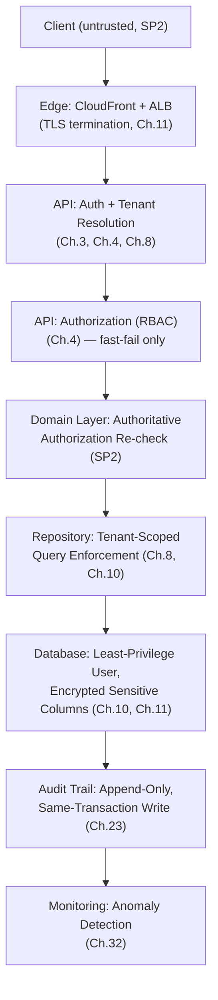

### 1.5 Best Practices

- Treat every principle in §1.2 as a design-review question, not a slogan.
- When a control feels too cumbersome to follow, escalate it as a design problem (SP8) rather than quietly bypassing it.

### 1.6 Common Mistakes

| Mistake | Principle violated |
|---|---|
| "The frontend already checks permissions, so the API doesn't need to." | SP2 |
| A single security control (e.g., just JWT verification) treated as sufficient for tenant isolation. | SP1 |
| An unresolvable auth check defaulting to "allow" to avoid blocking a user. | SP4 |

### 1.7 Checklist

- [ ] I can name which principle (SP1–SP8) justifies this control.
- [ ] Nothing here assumes a single layer is sufficient.

### 1.8 Future Considerations

As LedgerOne pursues formal compliance certification (SOC 2, ISO 27001 — see Ch.26), this chapter's principles should map explicitly onto that framework's control families.

### 1.9 AI Assistant Guidance

Check every generated security-relevant code path against SP1–SP8. Never propose a single-layer control as sufficient.

### 1.10 Related Documents

`03_ARCHITECTURE.md` Ch.4, Ch.9, Ch.17, Ch.20; `06_DATABASE_STANDARDS.md` Ch.1, Ch.6, Ch.12.

---

## Chapter 2 — Secure Development Lifecycle (SSDLC)

### 2.1 Purpose

Defines when and how security review happens across a feature's life, operationalizing `03_ARCHITECTURE.md` Decision 20.5.1's security review gate.

### 2.2 Rules

| Rule ID | Rule | Severity | Enforcement |
|---|---|---|---|
| SSDLC-001 | Every new module or externally-reachable feature undergoes a security review before merge, checked against this handbook's relevant chapters — not a one-time platform-launch review only. | 🟠 High | Architecture Review |
| SSDLC-002 | Threat modeling (identify trust boundaries, data flows, and abuse cases) happens at design time for any feature introducing a new trust boundary (new external integration, new file-handling path, new auth flow) — not retrofitted after implementation. | 🟠 High | Architecture Review |
| SSDLC-003 | Dependency and static-analysis scanning (Ch.30) run in CI on every PR — a new high/critical finding blocks merge unless explicitly waived with a documented reason and expiry. | 🟠 High | CI Pipeline |
| SSDLC-004 | Security debt (an accepted, not-yet-fixed finding) is tracked with the same visibility as other technical debt and reviewed on a defined cadence (`03_ARCHITECTURE.md` Decision 20.5.2) — never silently forgotten. | 🟡 Medium | Architecture Review |
| SSDLC-005 | This handbook itself is reviewed whenever a dependency changes materially (e.g., a new auth library, a new cloud service) that could affect a chapter's assumptions. | 🟡 Medium | Architecture Review |

### 2.3 Diagram — SSDLC Gates

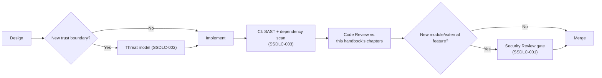

### 2.4 Best Practices

- Do threat modeling as a short structured conversation (data in, data out, who can call this, what's the worst input) rather than a heavyweight document — the goal is catching design-time issues cheaply (mirrors `06_DATABASE_STANDARDS.md` Ch.11's pre-extraction-audit philosophy of catching things while cheap).

### 2.5 Common Mistakes

| Mistake | Fix |
|---|---|
| Treating the security review as a one-time, platform-launch event. | Every new module/external feature gets its own review (SSDLC-001). |
| A waived SAST finding with no expiry, quietly living forever. | Every waiver has a documented reason and expiry (SSDLC-003). |

### 2.6 Checklist

- [ ] New trust boundaries threat-modeled at design time.
- [ ] CI security scans passing or explicitly, temporarily waived.
- [ ] Security review completed for new modules/external features.

### 2.7 Future Considerations

As the team grows past what one security review process can handle, consider a tiered review (self-service checklist for low-risk changes, full review for high-risk) — not yet needed at current scale.

### 2.8 AI Assistant Guidance

When generating a new module or externally-reachable feature, always note that it requires a security review before merge, and flag any new trust boundary for threat modeling.

### 2.9 Related Documents

`03_ARCHITECTURE.md` Decision 20.5.1/20.5.2, Ch.30 (Dependency Security), Ch.35 (Security Review Checklist).

---

## Chapter 3 — Authentication

### 3.1 Purpose

Consolidates the authentication architecture already fixed in `03_ARCHITECTURE.md` Ch.9 and `07_REST_API_STANDARDS.md` Ch.11 — this chapter is the security-layer restatement plus the concrete parameters those chapters left open.

### 3.2 Rules

| Rule ID | Rule | Severity | Enforcement |
|---|---|---|---|
| AUTHN-001 | Authentication is JWT access token + Redis-backed revocable refresh token, per `03_ARCHITECTURE.md` Ch.9 and `07_REST_API_STANDARDS.md` Ch.11 — restated here as the binding security baseline, not re-decided. | 🔴 Critical | Architecture Review |
| AUTHN-002 | Access tokens expire in **15 minutes**; refresh tokens expire in **7 days** of inactivity, or immediately on logout/password-change/admin-revoke. These are this handbook's concrete answer to `07_REST_API_STANDARDS.md` Ch.11's qualitative "short-lived" language. | 🟠 High | Architecture Review |
| AUTHN-003 | The Tenant End User and Platform Operator authentication planes (`03_ARCHITECTURE.md` Ch.9.6) use physically separate token-signing keys — a token issued for one plane is cryptographically incapable of being accepted by the other, not merely logically checked. | 🔴 Critical | Architecture Review |
| AUTHN-004 | Multi-factor authentication (MFA/TOTP) is available for all tenant users and **mandatory** for any user holding an Administrator-level role or any Platform Operator account. | 🟠 High | Code Review |
| AUTHN-005 | Failed authentication attempts return an identical error/timing profile regardless of whether the email exists — never revealing "user not found" vs. "wrong password" (user enumeration prevention). | 🟠 High | Code Review, contract test |

### 3.3 Sequence Diagram — Full Authentication Flow with MFA

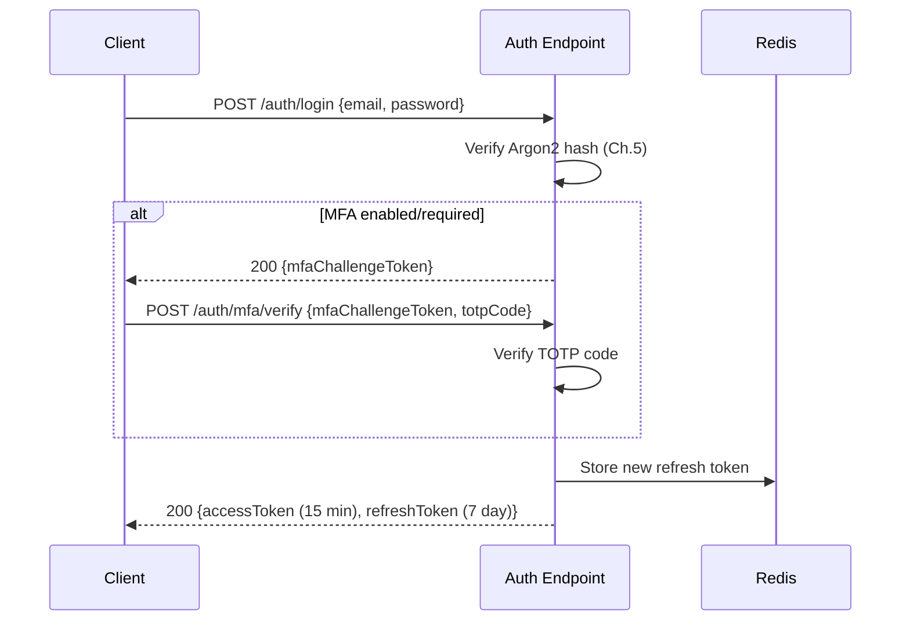

### 3.4 Standards & Rationale

AUTHN-003's separate signing keys per plane is a stronger, cryptographic version of `03_ARCHITECTURE.md` Ch.9.6's "never share an authentication surface" rule — a logical check ("is this a Platform Operator token?") can have a bug; a key that literally cannot verify against the other plane's expected signer cannot.

### 3.5 Examples

**Good:** A Platform Operator's JWT signed with `PLATFORM_JWT_SECRET`; a Tenant User's JWT signed with `TENANT_JWT_SECRET` — the Tenant-facing verification middleware only ever attempts verification against `TENANT_JWT_SECRET`, so a Platform token presented there fails verification outright, not just an authorization check.

### 3.6 Best Practices

- Rotate signing keys on a defined schedule (Ch.11) and support graceful key rotation (verify against current + previous key during a transition window).

### 3.7 Common Mistakes

| Mistake | Fix |
|---|---|
| One shared JWT secret for both Tenant and Platform planes, relying only on a claim check to distinguish them. | Separate signing keys (AUTHN-003). |
| "Email not found" vs. "wrong password" as distinct login error messages. | Identical generic message and response timing (AUTHN-005). |
| MFA optional for Administrator accounts. | Mandatory for Administrators and Platform Operators (AUTHN-004). |

### 3.8 Checklist

- [ ] Token expiry matches AUTHN-002's concrete durations.
- [ ] Tenant/Platform planes use separate signing keys.
- [ ] MFA mandatory for Administrators/Platform Operators.
- [ ] Login failure responses don't leak account existence.

### 3.9 Future Considerations

SSO/SAML for enterprise tenants is a plausible future addition — not yet decided; this chapter expands once `03_ARCHITECTURE.md` addresses it (consistent with `07_REST_API_STANDARDS.md` Ch.11.9's note).

### 3.10 AI Assistant Guidance

Always generate the 15-minute/7-day token expiry values. Always use separate signing-key configuration per auth plane. Never generate a login error message that distinguishes "user not found" from "wrong password."

### 3.11 Related Documents

`03_ARCHITECTURE.md` Ch.9, `07_REST_API_STANDARDS.md` Ch.11, Ch.5 (Password Policy), Ch.6 (JWT Standards).

---

## Chapter 4 — Authorization (RBAC)

### 4.1 Purpose

Consolidates the RBAC model already fixed in `03_ARCHITECTURE.md` Ch.9.5/9.8 and `07_REST_API_STANDARDS.md` Ch.12 into its security-review form.

### 4.2 Rules

| Rule ID | Rule | Severity | Enforcement |
|---|---|---|---|
| AUTHZ-001 | RBAC is the platform-wide authorization model (ABAC rejected, `03_ARCHITECTURE.md` Decision 9.5.1) — restated as binding here. | 🔴 Critical | Architecture Review |
| AUTHZ-002 | Every permission follows the `{module}.{resource}.{action}` naming convention and is granted only through a Role, never assigned directly to a User (avoids permission sprawl that's invisible at audit time). | 🟠 High | Code Review |
| AUTHZ-003 | The Presentation-layer permission check is fast-fail UX only; the Business/Domain layer re-checks authorization authoritatively on every request — this is restated from `07_REST_API_STANDARDS.md` AUTHZ-002 because it is the single most commonly violated rule in ERP systems (a controller-only check "because the UI already hid the button"). | 🔴 Critical | Architecture Review, Code Review |
| AUTHZ-004 | A Role's permission set is reviewable and diffable (not a black box) — Role definitions are version-controlled/auditable data, not ad hoc runtime configuration invisible to review. | 🟡 Medium | Code Review |
| AUTHZ-005 | Privilege escalation paths are explicitly reviewed: a user must never be able to grant themselves or another user a permission they do not themselves hold ("can't grant what you don't have"). | 🔴 Critical | Architecture Review |

### 4.3 Decision Tree — Granting a New Permission

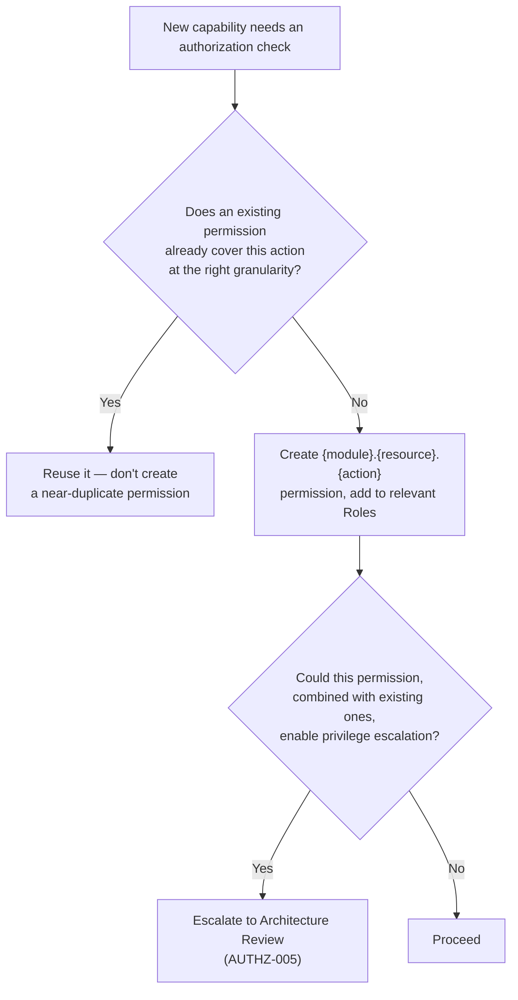

### 4.4 Examples

**Good:** `accounting.journal_entry.post` granted via the "Accountant" Role; a user's effective permissions are always the union of their assigned Roles' permissions, auditable as a diff when Roles change.
**Bad:** A permission granted directly to an individual User "as a one-off," invisible in any Role-level audit review.

### 4.5 Best Practices

- Periodically audit for permission sprawl (near-duplicate permissions created for slightly different endpoints that should have reused an existing one).

### 4.6 Common Mistakes

| Mistake | Fix |
|---|---|
| Relying on the Presentation-layer check alone. | Domain layer always re-checks (AUTHZ-003). |
| Direct-to-user permission grants bypassing Role review. | Permissions only via Roles (AUTHZ-002). |
| A user-management feature that lets any Administrator grant any permission, including ones they don't hold. | Explicitly block "can't grant what you don't have" (AUTHZ-005). |

### 4.7 Checklist

- [ ] Permission follows the naming convention and is granted via Role only.
- [ ] Domain layer re-checks authorization, not just the controller.
- [ ] New permission reviewed for privilege-escalation risk.

### 4.8 Future Considerations

None beyond what `03_ARCHITECTURE.md` Ch.9 already anticipates.

### 4.9 AI Assistant Guidance

Always generate Domain-layer authorization checks alongside any Presentation-layer check — never one without the other. Always name permissions per the `{module}.{resource}.{action}` convention.

### 4.10 Related Documents

`03_ARCHITECTURE.md` Ch.9.5/9.8, `07_REST_API_STANDARDS.md` Ch.12.

---

## Chapter 5 — Password Policy

### 5.1 Purpose

Defines the concrete password/Argon2 parameters `07_REST_API_STANDARDS.md` AUTH-004 mandates Argon2 for but leaves unparameterized — confirmed as a genuine open gap in prior research.

### 5.2 Rules

| Rule ID | Rule | Severity | Enforcement |
|---|---|---|---|
| PWD-001 | Passwords are hashed with **Argon2id** (the hybrid variant, resistant to both GPU-cracking and side-channel attacks), never Argon2i/Argon2d alone. | 🔴 Critical | Code Review |
| PWD-002 | Argon2id parameters: memory cost ≥ 19 MiB, iteration count ≥ 2, parallelism = 1, per current OWASP-recommended minimums — reviewed and increased as hardware capability grows. | 🟠 High | Code Review |
| PWD-003 | Minimum password length is 12 characters; no maximum below 128; no forced character-class composition rules (e.g., "must contain a symbol") — length is prioritized over composition complexity, per current NIST guidance. | 🟠 High | Code Review, contract test |
| PWD-004 | New passwords are checked against a breached-password list (e.g., HaveIBeenPwned's k-anonymity API or an equivalent offline corpus) and rejected if found. | 🟡 Medium | Code Review |
| PWD-005 | No mandatory periodic password rotation (e.g., "change every 90 days") — rotation is required only on suspected compromise, consistent with current NIST guidance that forced rotation encourages weak, predictable password patterns. | 🟡 Medium | Code Review |
| PWD-006 | Password reset tokens are single-use, expire in 15 minutes, and invalidate all other outstanding reset tokens for the same account when one is used. | 🟠 High | Code Review |

### 5.3 Examples

**Good:** A 14-character passphrase like `correct-horse-battery` (not in a breach corpus) is accepted with no symbol requirement.
**Bad:** Rejecting a strong 16-character passphrase for lacking a special character while accepting a weak, breach-corpus-listed 8-character `P@ssw0rd!` — composition rules alone don't guarantee strength.

### 5.4 Best Practices

- Show a real-time password-strength indicator based on length/breach-corpus status, not a checklist of composition rules that trains users toward predictable patterns (`Password1!`).

### 5.5 Common Mistakes

| Mistake | Fix |
|---|---|
| Forced 90-day password rotation. | Not required (PWD-005) — rotate only on suspected compromise. |
| Composition rules requiring uppercase+lowercase+digit+symbol. | Prioritize length (PWD-003); no forced composition. |
| A password-reset token that remains valid after use or doesn't expire. | Single-use, 15-minute expiry (PWD-006). |

### 5.6 Checklist

- [ ] Argon2id with PWD-002's minimum parameters.
- [ ] 12-character minimum, no forced composition.
- [ ] Breach-corpus check on new passwords.
- [ ] No forced periodic rotation.
- [ ] Reset tokens single-use, short-lived.

### 5.7 Future Considerations

Argon2 parameters (PWD-002) should be revisited periodically as hardware/GPU cracking capability improves — treated as a living minimum, not a permanent fixed value.

### 5.8 AI Assistant Guidance

Always generate Argon2id with the minimum parameters in PWD-002. Never generate forced password rotation or composition-rule validation. Always generate single-use, short-lived reset tokens.

### 5.9 Related Documents

`07_REST_API_STANDARDS.md` AUTH-004, Ch.3 (Authentication), Ch.22 (Brute Force Protection).

---

## Chapter 6 — JWT Standards

### 6.1 Purpose

Defines the concrete JWT claim structure and validation rules.

### 6.2 Rules

| Rule ID | Rule | Severity | Enforcement |
|---|---|---|---|
| JWT-001 | Access tokens are signed with **RS256** (asymmetric) — the signing key is held only by the Auth service; verification uses the public key, distributable to any service that needs to verify without being able to forge tokens. | 🔴 Critical | Architecture Review |
| JWT-002 | Standard claims: `sub` (user uuid), `tenantId`, `plane` (`tenant`/`platform`), `iat`, `exp`, `jti` (unique token ID, enabling targeted revocation). No claim ever contains PII beyond the user's own `uuid`. | 🟠 High | Code Review |
| JWT-003 | Every protected endpoint verifies signature, expiry, and issuer — a token missing or failing any check is rejected with `401`, never partially trusted. | 🔴 Critical | Code Review, contract test |
| JWT-004 | `tenantId` and `plane` claims are set exclusively by the Auth service at token-issuance time from server-side data — never accepted as input from a client-supplied field anywhere in the token-issuance flow. | 🔴 Critical | Code Review |
| JWT-005 | Revocation is via the `jti` claim checked against a Redis deny-list on logout/compromise — since JWTs are otherwise stateless and can't be "deleted," explicit revocation requires this check on every verification. | 🟠 High | Code Review |

### 6.3 Standards & Rationale

JWT-001's RS256 over a shared-secret HS256 exists specifically so that a compromised verifying service (one that only holds the public key) cannot be used to forge new tokens — a meaningful blast-radius reduction under SP6 (assume breach).

### 6.4 Examples

**Good:** `{ "sub": "user-uuid", "tenantId": "tenant-uuid", "plane": "tenant", "jti": "...", "iat": ..., "exp": ... }`, signed RS256.
**Bad:** A JWT accepting a `tenantId` field from the login request body instead of resolving it server-side from the authenticated user's actual tenant membership — a direct tenant-isolation bypass.

### 6.5 Best Practices

- Keep the JWT payload minimal — it is not encrypted by default (only signed), so it must never carry sensitive data beyond identifiers.

### 6.6 Common Mistakes

| Mistake | Fix |
|---|---|
| HS256 with a shared secret distributed to every verifying service. | RS256, public key distributed, private key isolated to the issuer (JWT-001). |
| No `jti`, making targeted revocation of a single token impossible. | Always include `jti` (JWT-002/005). |
| Sensitive PII embedded in the JWT payload "for convenience." | Keep the payload to identifiers only. |

### 6.7 Checklist

- [ ] RS256 signing.
- [ ] Standard claim set, no PII beyond `uuid`.
- [ ] Full verification (signature, expiry, issuer) on every request.
- [ ] `tenantId`/`plane` set only by the Auth service.
- [ ] `jti`-based revocation supported.

### 6.8 Future Considerations

None — stable unless a future architectural change (e.g., token introspection service) is adopted.

### 6.9 AI Assistant Guidance

Always generate RS256-signed tokens with the standard claim set. Never accept `tenantId` from client input anywhere in the token-issuance path.

### 6.10 Related Documents

`03_ARCHITECTURE.md` Ch.9, Ch.3 (Authentication), Ch.8 (Multi-Tenant Security).

---

## Chapter 7 — Session Management

### 7.1 Purpose

Resolves the genuine gap identified in research: neither `07_REST_API_STANDARDS.md` nor `08_FRONTEND_STANDARDS.md` specifies where the client stores tokens. This chapter settles it.

### 7.2 Rules

| Rule ID | Rule | Severity | Enforcement |
|---|---|---|---|
| SESS-001 | The access token is stored **in memory only** (a JS variable/React context) on the frontend — never in `localStorage`, `sessionStorage`, or a cookie. It is lost on tab close/refresh by design, and re-obtained via the refresh flow. | 🔴 Critical | Code Review |
| SESS-002 | The refresh token is stored in an **httpOnly, Secure, SameSite=Strict cookie**, set by the server on login/refresh — never readable by client-side JavaScript. This resolves the open gap: a cookie-based refresh token is the deliberate choice, made here. | 🔴 Critical | Architecture Review |
| SESS-003 | Because the refresh token now lives in a cookie (SESS-002), CSRF protection is required specifically for the `/auth/refresh` endpoint and any other cookie-authenticated endpoint — see Ch.19 for the concrete mechanism. This supersedes `07_REST_API_STANDARDS.md` §11.3's body-delivered refresh token example, which predates this decision. | 🔴 Critical | Architecture Review |
| SESS-004 | A user can view and revoke their own active sessions (refresh tokens) from an account-security screen; an Administrator can revoke any user's sessions in their tenant. | 🟡 Medium | Code Review |
| SESS-005 | All active sessions for a user are revoked immediately on password change or suspected-compromise flag — never left valid until natural expiry. | 🟠 High | Code Review |

### 7.3 Diagram — Revised Token Storage Model

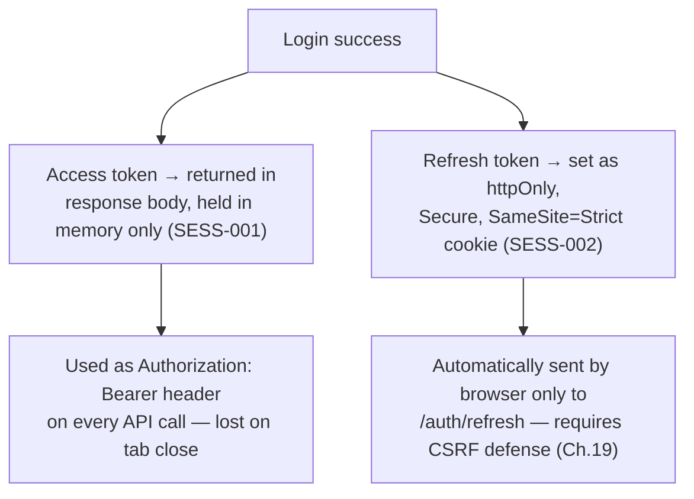

### 7.4 Standards & Rationale

This is a deliberate revision of `07_REST_API_STANDARDS.md` §11.3's illustrative example (refresh token in the JSON response body) — that document's sequence diagram was written before this handbook resolved the storage question, and this handbook is the authoritative source now, per §7.6's cross-document note. An in-memory-only access token is not readable by a successful XSS payload the way a `localStorage`-persisted token would be (mitigates Ch.18's residual XSS risk); an httpOnly cookie for the refresh token is similarly unreadable by JavaScript, at the cost of reintroducing CSRF risk for exactly one endpoint, which Ch.19 addresses directly rather than being left unaddressed.

### 7.5 Examples

**Good:** On page refresh, the frontend has no access token in memory, silently calls `/auth/refresh` (cookie sent automatically), receives a new access token, and proceeds — the user doesn't notice.
**Bad:** Persisting the access token in `localStorage` "so it survives a page refresh without an extra round-trip" — trades a real security property for a minor UX convenience.

### 7.6 Cross-Document Note

`07_REST_API_STANDARDS.md` §11.3's sequence diagram and `08_FRONTEND_STANDARDS.md` FSEC-004 both predate this resolution and describe the refresh token as body-delivered/storage-unspecified respectively. This handbook is the authoritative, more recent decision — those documents' illustrative examples should be treated as superseded by SESS-001/002 above; flag for a follow-up documentation pass to update those two references directly rather than leaving two answers to the same question live at once.

### 7.7 Best Practices

- Implement silent-refresh-on-load in the frontend's `api-client.ts` (`08_FRONTEND_STANDARDS.md` API-001) so the in-memory-only access token model is invisible to the end user.

### 7.8 Common Mistakes

| Mistake | Fix |
|---|---|
| Access token in `localStorage`. | In-memory only (SESS-001). |
| Refresh token in a non-httpOnly cookie or `localStorage`. | httpOnly, Secure, SameSite=Strict cookie (SESS-002). |
| No CSRF defense on `/auth/refresh` now that it's cookie-authenticated. | Required — see Ch.19. |

### 7.9 Checklist

- [ ] Access token in memory only.
- [ ] Refresh token in httpOnly/Secure/SameSite cookie.
- [ ] CSRF defense present on `/auth/refresh`.
- [ ] Session list/revocation available to users and Administrators.

### 7.10 Future Considerations

Update `07_REST_API_STANDARDS.md` §11.3 and `08_FRONTEND_STANDARDS.md` FSEC-004 to reference this chapter directly rather than their own now-superseded illustrative language — flagged as a documentation-consistency follow-up, not a re-decision.

### 7.11 AI Assistant Guidance

Always generate in-memory-only access token storage and httpOnly-cookie refresh token storage. Always pair cookie-based refresh with CSRF protection on that endpoint specifically.

### 7.12 Related Documents

`07_REST_API_STANDARDS.md` Ch.11, `08_FRONTEND_STANDARDS.md` FSEC-004, Ch.19 (CSRF Protection).

---

## Chapter 8 — Multi-Tenant Security

### 8.1 Purpose

Consolidates tenant-isolation security rules already established in `03_ARCHITECTURE.md` Ch.4, `06_DATABASE_STANDARDS.md` Ch.6, and `07_REST_API_STANDARDS.md` Ch.13.

### 8.2 Rules

| Rule ID | Rule | Severity | Enforcement |
|---|---|---|---|
| MTS-001 | `tenant_id` is resolved exclusively from the verified JWT claim, never client input, at every layer — restated here as the platform's single most important security invariant. | 🔴 Critical | All layers |
| MTS-002 | Every repository query, every cache key, every S3 key, and every log entry touching tenant data is tenant-scoped — no exceptions for "obviously fine" data. | 🔴 Critical | Code Review |
| MTS-003 | Cross-tenant resource lookups return `404`, never `403` — never confirming another tenant's data exists. | 🟠 High | Contract test |
| MTS-004 | Automated anomaly detection flags a single account attempting access across an unusual number of distinct tenant contexts, or repeated cross-tenant `404`s in a short window (potential enumeration attempt). | 🟠 High | Security Monitoring (Ch.32) |
| MTS-005 | The Company/Branch context header mechanism (`07_REST_API_STANDARDS.md` Ch.13) is validated against the user's granted scope on every single request — never cached/trusted across requests within a session. | 🔴 Critical | Code Review |

### 8.3 Standards & Rationale

This chapter doesn't re-decide anything — it exists so a security review has one place naming every tenant-isolation control as a security requirement, not scattered as an architecture/database/API convention each in its own document. MTS-004 is the one genuinely new addition: turning the existing "never trust client tenant_id" rule into an active, monitored signal (SP1's defense-in-depth layer 4 from `03_ARCHITECTURE.md` Ch.4, made concrete).

### 8.4 Examples

**Good:** A monitoring alert fires when one user account's JWT `sub` claim appears in requests carrying `X-Company-Id` values spanning more Companies than that user is actually granted — a signal of either a bug or an attack.

### 8.5 Best Practices

- Include tenant-isolation checks explicitly in every module's security review (Ch.2), not just assumed from the shared middleware existing.

### 8.6 Common Mistakes

| Mistake | Fix |
|---|---|
| Assuming shared middleware alone is sufficient without monitoring for anomalies. | Add MTS-004's active detection. |
| A newly-added cache key or log field that isn't tenant-prefixed. | Every touch point is tenant-scoped, no exceptions (MTS-002). |

### 8.7 Checklist

- [ ] Every data-touching layer is tenant-scoped.
- [ ] Cross-tenant lookups return `404`.
- [ ] Anomaly detection covers cross-tenant access patterns.

### 8.8 Future Considerations

The database-level backstop (`03_ARCHITECTURE.md` Ch.4 Layer 3, immature) remains an open item this chapter will incorporate once ratified.

### 8.9 AI Assistant Guidance

Treat any missing tenant scoping as a Critical finding in any generated or reviewed code, regardless of how "obviously safe" the specific table/cache/log seems.

### 8.10 Related Documents

`03_ARCHITECTURE.md` Ch.4, `06_DATABASE_STANDARDS.md` Ch.6, `07_REST_API_STANDARDS.md` Ch.13.

---

## Chapter 9 — API Security

### 9.1 Purpose

Consolidates `07_REST_API_STANDARDS.md` Ch.24's API security rules as binding security requirements, adding the concrete TLS requirement Ch.20.4 of the architecture doc deferred here.

### 9.2 Rules

| Rule ID | Rule | Severity | Enforcement |
|---|---|---|---|
| APISEC-001 | All traffic is **TLS 1.2 minimum, TLS 1.3 preferred** — enforced at CloudFront/ALB; no plaintext HTTP endpoint ever accepts a request beyond a redirect-to-HTTPS. This is this handbook's answer to `03_ARCHITECTURE.md` Ch.20.4's deferred "HTTPS-only (per `09_SECURITY_GUIDELINES.md`)." | 🔴 Critical | Architecture Review |
| APISEC-002 | CORS is an explicit origin allow-list — no wildcard for any authenticated endpoint (restated from `07_REST_API_STANDARDS.md` SEC-API-002). | 🔴 Critical | Code Review |
| APISEC-003 | No internal `id`, stack trace, internal path, or raw exception text ever appears in a response (restated from `07_REST_API_STANDARDS.md` ERR-004/SEC-API-004). | 🔴 Critical | Code Review, contract test |
| APISEC-004 | Every mutating endpoint parameterizes all data access — no raw SQL string interpolation from any API input (restated from `06_DATABASE_STANDARDS.md` SEC-006). | 🔴 Critical | Code Review |
| APISEC-005 | Idempotency keys (`07_REST_API_STANDARDS.md` Ch.22) are treated as a security control, not just a correctness one — a missing idempotency key on a payment/posting endpoint reachable externally is a security review finding. | 🟠 High | Security Review |

### 9.3 Best Practices

- Test TLS configuration (cipher suites, protocol versions) with an automated scanner (e.g., `testssl.sh`) as part of infrastructure review, not just trust the ALB default.

### 9.4 Common Mistakes

| Mistake | Fix |
|---|---|
| Allowing TLS 1.0/1.1 for legacy client compatibility. | TLS 1.2 minimum, no exceptions (APISEC-001). |

### 9.5 Checklist

- [ ] TLS 1.2 minimum enforced.
- [ ] CORS allow-list, no wildcard.
- [ ] No internal detail leaked in any response.
- [ ] Parameterized queries only.

### 9.6 Future Considerations

Consider mutual TLS (mTLS) for Marketplace partner-to-partner service calls if that integration model matures — not currently in scope.

### 9.7 AI Assistant Guidance

Always assume TLS 1.2+ is required; never generate code that would work over plaintext HTTP.

### 9.8 Related Documents

`07_REST_API_STANDARDS.md` Ch.9, Ch.22, Ch.24; `03_ARCHITECTURE.md` Ch.20.4.

---

## Chapter 10 — Database Security

### 10.1 Purpose

Consolidates `06_DATABASE_STANDARDS.md` Ch.12's rules as binding security requirements and adds the concrete encryption specifics Ch.11 of this document elaborates further.

### 10.2 Rules

| Rule ID | Rule | Severity | Enforcement |
|---|---|---|---|
| DBSEC-001 | The runtime application database user has no `DROP`/`ALTER`/`CREATE` privileges — schema changes use a separate, more privileged, non-runtime credential (restated from `06_DATABASE_STANDARDS.md` SEC-003). | 🔴 Critical | Ops/infra review |
| DBSEC-002 | Database credentials are sourced from AWS Secrets Manager, never hardcoded or committed (restated from `06_DATABASE_STANDARDS.md` SEC-002, with the mechanism named explicitly per Ch.12 of this document). | 🔴 Critical | CI secret-scanning |
| DBSEC-003 | RDS is configured for encryption at rest (AWS-managed KMS key at minimum, customer-managed KMS key for the production environment) and enforces TLS for all client connections. | 🔴 Critical | Ops/infra review |
| DBSEC-004 | Sensitive columns (bank account numbers, tax IDs, government IDs) are application-layer encrypted with AES-256-GCM via a KMS-backed key (restated from `06_DATABASE_STANDARDS.md` SEC-004) — RDS at-rest encryption is necessary but not sufficient for these fields. | 🔴 Critical | Code Review |
| DBSEC-005 | Database audit logging (RDS's native audit log / Performance Insights) is enabled and retained consistent with `06_DATABASE_STANDARDS.md` Ch.7's audit retention posture. | 🟠 High | Ops/infra review |

### 10.3 Best Practices

- Periodically rotate the KMS key used for application-layer field encryption per AWS KMS's key-rotation feature, without requiring re-encryption of existing data (envelope encryption pattern).

### 10.4 Common Mistakes

| Mistake | Fix |
|---|---|
| The application's runtime DB user having `ALTER`/`DROP` privileges. | Separate migration credential (DBSEC-001). |
| Relying on RDS at-rest encryption alone for bank account numbers. | Application-layer encryption in addition (DBSEC-004). |

### 10.5 Checklist

- [ ] Runtime DB user has minimum privileges only.
- [ ] Credentials from Secrets Manager, never hardcoded.
- [ ] RDS encryption at rest + TLS in transit enabled.
- [ ] Sensitive fields application-layer encrypted.

### 10.6 Future Considerations

Formal key-rotation schedules and audits as part of a future compliance certification (Ch.26).

### 10.7 AI Assistant Guidance

Never generate a runtime DB credential with schema-altering privileges. Always propose application-layer encryption for bank/tax/government ID fields.

### 10.8 Related Documents

`06_DATABASE_STANDARDS.md` Ch.7, Ch.12; Ch.11 (Encryption Standards), Ch.12 (Secrets Management) of this document.

---

## Chapter 11 — Encryption Standards

### 11.1 Purpose

Defines the concrete encryption algorithms and key-management approach — the specifics `03_ARCHITECTURE.md` Ch.20.4 left qualitative and `06_DATABASE_STANDARDS.md` DBSEC-004 named only by example.

### 11.2 Rules

| Rule ID | Rule | Severity | Enforcement |
|---|---|---|---|
| ENC-001 | Data in transit: TLS 1.2 minimum everywhere (restated from APISEC-001), including service-to-service traffic within the VPC where it crosses any non-trusted boundary. | 🔴 Critical | Architecture Review |
| ENC-002 | Data at rest: RDS, S3, and Redis (where persistence is enabled) all use AWS-managed or customer-managed KMS encryption — no data store is provisioned without at-rest encryption enabled. | 🔴 Critical | Ops/infra review |
| ENC-003 | Application-layer field encryption (bank accounts, tax IDs, government IDs) uses **AES-256-GCM**, with a per-tenant or per-field Data Encryption Key (DEK) wrapped by a KMS Customer Master Key (CMK) — envelope encryption, not a single static application-wide key. | 🔴 Critical | Code Review, Architecture Review |
| ENC-004 | Encryption keys are never stored alongside the data they encrypt, and never embedded in application code or environment variables directly — only KMS key ARNs/references are configured; the actual key material never leaves KMS. | 🔴 Critical | Code Review |
| ENC-005 | Password hashes (Argon2id, Ch.5) are a distinct concept from encryption — hashes are never "decrypted" and the system has no capability to recover a plaintext password, ever. | 🔴 Critical | Architecture Review |

### 11.3 Diagram — Envelope Encryption for Sensitive Fields

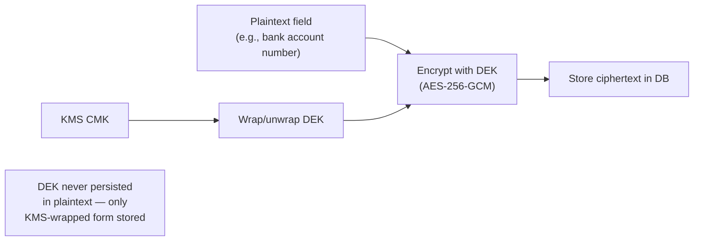

### 11.4 Examples

**Good:** A bank account number is encrypted with a DEK generated per-record, the DEK itself encrypted ("wrapped") by a tenant-scoped KMS CMK, and only the wrapped DEK + ciphertext are stored — decryption requires a live KMS call, which is itself logged and auditable.
**Bad:** A single hardcoded `ENCRYPTION_KEY` environment variable used to encrypt every sensitive field platform-wide — a single point of compromise decrypts everything, and rotation requires re-encrypting all data at once.

### 11.5 Best Practices

- Use KMS's audit trail (CloudTrail) of key-usage events as an additional forensic signal — every decryption of a sensitive field is itself an auditable event.

### 11.6 Common Mistakes

| Mistake | Fix |
|---|---|
| A single static encryption key for all tenants/fields. | Envelope encryption with per-tenant/per-field DEKs (ENC-003). |
| Encryption key stored in an environment variable. | Only a KMS key reference is configured; key material stays in KMS (ENC-004). |

### 11.7 Checklist

- [ ] TLS 1.2+ everywhere in transit.
- [ ] At-rest encryption enabled on every data store.
- [ ] Sensitive fields use envelope encryption via KMS.
- [ ] No key material in code/env vars.

### 11.8 Future Considerations

Customer-managed KMS keys per-tenant (rather than platform-wide) could be offered as an enterprise-tier feature — not yet decided.

### 11.9 AI Assistant Guidance

Always propose KMS-backed envelope encryption for sensitive fields, never a static application-wide key. Never generate code that stores raw key material in an environment variable.

### 11.10 Related Documents

Ch.10 (Database Security), Ch.12 (Secrets Management), `06_DATABASE_STANDARDS.md` DBSEC-004.

---

## Chapter 12 — Secrets Management

### 12.1 Purpose

Names the concrete secrets-management mechanism `03_ARCHITECTURE.md` Ch.20.4 referred to only as "the deployment platform's secrets mechanism."

### 12.2 Rules

| Rule ID | Rule | Severity | Enforcement |
|---|---|---|---|
| SECR-001 | All secrets (DB credentials, JWT signing keys, third-party API keys) are stored in **AWS Secrets Manager**, injected into the ECS task at runtime — never committed to source control, never baked into a Docker image. | 🔴 Critical | CI secret-scanning |
| SECR-002 | Secrets are rotated on a defined schedule (e.g., DB credentials every 90 days via Secrets Manager's automatic rotation) and immediately on suspected compromise. | 🟠 High | Ops/infra review |
| SECR-003 | Access to read a given secret in Secrets Manager is scoped by IAM policy to only the specific ECS task role that needs it — no shared "read all secrets" role. | 🔴 Critical | Ops/infra review |
| SECR-004 | CI secret-scanning (e.g., gitleaks/truffleHog-class tooling) runs on every push and PR, blocking merge if a secret pattern is detected in a diff. | 🟠 High | CI Pipeline |
| SECR-005 | A leaked secret (detected or reported) is rotated immediately, and the incident follows the process in Ch.33 (Incident Response) — never just "quietly rotated and moved on" without a recorded incident. | 🔴 Critical | Incident Response process |

### 12.3 Examples

**Good:** The JWT signing key is stored in Secrets Manager, referenced by ARN in the ECS task definition, and injected as an environment variable at container start — never present in the Docker image or a `.env` file committed anywhere.
**Bad:** A third-party payment gateway API key hardcoded in a config file committed to the repository "temporarily," even if later removed — the key must be treated as compromised the moment it touches git history, requiring rotation regardless of removal.

### 12.4 Best Practices

- Treat `.env.example` files as documentation of *which* variables exist, never as a place any real secret value is ever written, even temporarily.

### 12.5 Common Mistakes

| Mistake | Fix |
|---|---|
| A secret briefly committed then removed in a follow-up commit. | Treat as compromised regardless — rotate it (SECR-005); git history retains it. |
| One IAM role with access to every secret. | Scope per-task, least privilege (SECR-003). |

### 12.6 Checklist

- [ ] All secrets in AWS Secrets Manager, none hardcoded/committed.
- [ ] IAM access scoped per-task.
- [ ] CI secret-scanning active and blocking.
- [ ] Rotation schedule defined; immediate rotation on suspected leak.

### 12.7 Future Considerations

Consider AWS Secrets Manager's automatic rotation Lambda integration for more secret types as the platform matures beyond DB credentials.

### 12.8 AI Assistant Guidance

Never generate code with a hardcoded secret, even a placeholder-looking one in an example. Always reference secrets via the Secrets Manager injection pattern.

### 12.9 Related Documents

`03_ARCHITECTURE.md` Ch.20.4, Ch.13 (Environment Variables), Ch.33 (Incident Response).

---

## Chapter 13 — Environment Variables

### 13.1 Purpose

Defines the boundary between what's a "secret" (Ch.12) and what's ordinary configuration.

### 13.2 Rules

| Rule ID | Rule | Severity | Enforcement |
|---|---|---|---|
| ENV-001 | Environment variables are classified as either **secret** (goes through Secrets Manager, Ch.12) or **config** (non-sensitive, e.g., a feature flag, a log level) — never mixed in the same file/mechanism without this distinction being explicit. | 🟠 High | Code Review |
| ENV-002 | Frontend `NEXT_PUBLIC_*` variables are, by definition, public — no secret or sensitive configuration value is ever assigned to one (restated from `08_FRONTEND_STANDARDS.md` FSEC-002/005). | 🔴 Critical | Code Review, CI secret-scanning |
| ENV-003 | Environment-specific configuration (dev/staging/production) is never hardcoded as a conditional in application code (`if (env === 'production')` sprinkled everywhere) — configuration values differ, code paths don't, except where a documented, reviewed exception exists. | 🟡 Medium | Code Review |
| ENV-004 | A `.env.example` file documents every variable name and a placeholder/description, kept in sync with what the application actually reads — never a stale, incomplete list. | 🟡 Medium | Code Review |

### 13.3 Examples

**Good:** `LOG_LEVEL=info` (config, safe to commit an example value) vs. `DATABASE_URL` (secret, injected via Secrets Manager, never in `.env.example` with a real value).

### 13.4 Best Practices

- Validate required environment variables at application startup (fail fast if a required config/secret reference is missing) rather than failing deep in a request handler later.

### 13.5 Common Mistakes

| Mistake | Fix |
|---|---|
| A real API key value committed in `.env.example` "as a working default." | Only placeholder/description values ever appear there (ENV-004). |
| Scattered `if (process.env.NODE_ENV === 'production')` branches implementing different logic per environment. | Keep code paths identical; only configuration values differ (ENV-003). |

### 13.6 Checklist

- [ ] Every env var classified as secret or config.
- [ ] No secret value in a `NEXT_PUBLIC_*` variable.
- [ ] `.env.example` current and placeholder-only.

### 13.7 Future Considerations

None — stable.

### 13.8 AI Assistant Guidance

Always classify a new environment variable as secret or config before generating code that reads it. Never generate a `NEXT_PUBLIC_*` variable holding anything sensitive.

### 13.9 Related Documents

Ch.12 (Secrets Management), `08_FRONTEND_STANDARDS.md` FSEC-002/005.

---

## Chapter 14 — File Upload Security

### 14.1 Purpose

Adds the security-specific hardening on top of `07_REST_API_STANDARDS.md` Ch.19's pre-signed-URL upload flow.

### 14.2 Rules

| Rule ID | Rule | Severity | Enforcement |
|---|---|---|---|
| FILESEC-001 | Every uploaded file is scanned for malware (e.g., via an S3-event-triggered Lambda calling a scanning service) before being marked "confirmed"/available for download — an upload is quarantined, not accessible, until scanning completes clean. | 🟠 High | Architecture Review |
| FILESEC-002 | Allowed file types are enforced by **content inspection** (magic-byte/MIME sniffing), not just the client-declared `Content-Type` or file extension, which are trivially spoofable. | 🟠 High | Code Review |
| FILESEC-003 | Uploaded files are served for download from a separate, cookie-less domain/subdomain (or via signed URLs only) — never served in a way that could execute in the context of the main application's origin (mitigates stored-content XSS via uploaded HTML/SVG files). | 🟠 High | Architecture Review |
| FILESEC-004 | File size limits (`07_REST_API_STANDARDS.md` UP-003) are enforced before the file is fully received where possible (streaming size check), not only after a large file has already consumed bandwidth/storage. | 🟡 Medium | Code Review |

### 14.3 Examples

**Good:** An uploaded "invoice.pdf" that's actually a renamed executable is caught by magic-byte inspection, rejected before scanning even runs.
**Bad:** Trusting a client-declared `Content-Type: application/pdf` header for a file that's actually an HTML file with an embedded script — if served from the app's own origin, this could execute as stored XSS.

### 14.4 Best Practices

- Strip metadata (EXIF GPS data, embedded macros in office documents) from uploaded files where feasible, reducing incidental PII/attack-surface exposure.

### 14.5 Common Mistakes

| Mistake | Fix |
|---|---|
| Trusting the client's declared file type. | Content-inspect (magic bytes) server-side (FILESEC-002). |
| Serving uploaded files from the same origin as the main app. | Separate cookie-less domain or signed-URL-only access (FILESEC-003). |

### 14.6 Checklist

- [ ] Malware scanning before file is marked available.
- [ ] File type verified by content inspection, not just declared type.
- [ ] Uploaded files served from an isolated origin.

### 14.7 Future Considerations

`07_REST_API_STANDARDS.md` §19.8 already flagged malware scanning as a plausible future addition — this chapter makes it a concrete requirement; that document should be updated to cross-reference this chapter.

### 14.8 AI Assistant Guidance

Always propose content-based (magic-byte) file type verification, never trust the declared MIME type alone. Always flag that uploaded files need malware scanning before being served.

### 14.9 Related Documents

`07_REST_API_STANDARDS.md` Ch.19, Ch.20 (SSRF Prevention — webhook/URL-fetch adjacent risk).

---

## Chapter 15 — Input Validation

### 15.1 Purpose

Consolidates `07_REST_API_STANDARDS.md` Ch.10's Zod-based validation rules as a security baseline, distinct from business-rule validation.

### 15.2 Rules

| Rule ID | Rule | Severity | Enforcement |
|---|---|---|---|
| INVAL-001 | Every input surface (body, query, params, headers used in logic) is validated with an explicit Zod schema before use — restated as a security control, not just a correctness one: unvalidated input is the root cause of most injection classes (Ch.17, Ch.18). | 🔴 Critical | Code Review |
| INVAL-002 | Validation is allow-list based (define what's valid) wherever feasible, not deny-list based (block known-bad patterns) — a deny-list is inherently incomplete against novel payloads. | 🟠 High | Code Review |
| INVAL-003 | File paths, URLs, and identifiers used in any filesystem or external-request operation are validated against an explicit allow-list/pattern — never constructed by directly concatenating unvalidated user input (path traversal, SSRF prevention groundwork for Ch.20). | 🔴 Critical | Code Review |
| INVAL-004 | Validation failures are logged with enough context to detect a pattern of probing (many failed validations from one source in a short window) — feeding Ch.32's monitoring. | 🟡 Medium | Code Review |

### 15.3 Examples

**Good:** A file-download endpoint validates the requested `attachmentUuid` against a Zod UUID schema and looks up the record by that UUID — never accepts or constructs a raw filesystem path from user input.
**Bad:** An endpoint accepting a `filename` query parameter and concatenating it directly into a filesystem read path — a textbook path-traversal vector (`../../etc/passwd`).

### 15.4 Best Practices

- Default every new schema to the strictest reasonable shape (exact enum values, bounded string lengths, explicit formats) rather than a permissive `z.string()` "to be safe for now."

### 15.5 Common Mistakes

| Mistake | Fix |
|---|---|
| A permissive `z.any()` or bare `z.string()` for a field that has a known, narrow valid shape. | Use the narrowest valid schema (INVAL-002). |
| Constructing a file path or URL from unvalidated user input. | Allow-list validate first (INVAL-003). |

### 15.6 Checklist

- [ ] Every input has an explicit, narrow Zod schema.
- [ ] Validation is allow-list, not deny-list, based.
- [ ] No file path/URL constructed from unvalidated input.

### 15.7 Future Considerations

None beyond `07_REST_API_STANDARDS.md` Ch.10's evolution.

### 15.8 AI Assistant Guidance

Always generate the narrowest reasonable Zod schema for a field, never a permissive catch-all. Never generate code that builds a file path or URL by concatenating raw user input.

### 15.9 Related Documents

`07_REST_API_STANDARDS.md` Ch.10, Ch.17 (SQL Injection Prevention), Ch.20 (SSRF Prevention).

---

## Chapter 16 — Output Encoding

### 16.1 Purpose

Defines how data is safely rendered/serialized on the way out, complementing input validation.

### 16.2 Rules

| Rule ID | Rule | Severity | Enforcement |
|---|---|---|---|
| OUTENC-001 | Any user-supplied content rendered as HTML is escaped by default (React's default JSX behavior) — `dangerouslySetInnerHTML` is used only with sanitized input (restated from `08_FRONTEND_STANDARDS.md` FSEC-003). | 🔴 Critical | Code Review |
| OUTENC-002 | Data serialized into non-HTML contexts (CSV export, PDF generation) is escaped per that format's injection risk — e.g., a cell value starting with `=`, `+`, `-`, or `@` in a CSV export is prefixed/escaped to prevent CSV/Excel formula injection when opened in a spreadsheet application. | 🟠 High | Code Review |
| OUTENC-003 | API JSON responses never require additional escaping by the consumer beyond standard JSON parsing — no double-encoding, no HTML fragments embedded inside JSON string fields where the consumer is expected to render them raw. | 🟡 Medium | Code Review |

### 16.3 Examples

**Good:** An exported CSV cell containing `=SUM(A1:A10)` (perhaps a customer's literal notes field) is exported as `'=SUM(A1:A10)` (leading apostrophe) to prevent it from executing as a formula when opened in Excel.
**Bad:** Exporting user-supplied free-text fields into a CSV with no formula-injection escaping — a classic, still-common vulnerability class in ERP export features.

### 16.4 Best Practices

- Treat every new export format (CSV, XLSX, PDF) as needing its own output-encoding review — each has different injection risks.

### 16.5 Common Mistakes

| Mistake | Fix |
|---|---|
| CSV export with no formula-injection escaping. | Prefix/escape leading `=+-@` characters (OUTENC-002). |
| Using `dangerouslySetInnerHTML` for user-supplied text without sanitization. | Sanitize first, always (OUTENC-001). |

### 16.6 Checklist

- [ ] User content rendered as HTML is escaped/sanitized.
- [ ] Export formats escape their own injection risks (CSV formula injection, etc.).

### 16.7 Future Considerations

As new export formats are added (Ch.21 of `07_REST_API_STANDARDS.md`), extend this chapter's format-specific rules accordingly.

### 16.8 AI Assistant Guidance

Always generate CSV export code with formula-injection escaping for user-supplied fields. Always sanitize before any HTML-rendering of user content.

### 16.9 Related Documents

`08_FRONTEND_STANDARDS.md` FSEC-003, `07_REST_API_STANDARDS.md` Ch.21 (Import & Export APIs).

---

## Chapter 17 — SQL Injection Prevention

### 17.1 Purpose

Restates `06_DATABASE_STANDARDS.md` SEC-006 as a dedicated security chapter, since SQLi remains a top-tier OWASP risk for any data-heavy application.

### 17.2 Rules

| Rule ID | Rule | Severity | Enforcement |
|---|---|---|---|
| SQLI-001 | All data access uses Prisma's parameterized query API — no string concatenation or template-literal interpolation of user input into a query, anywhere. | 🔴 Critical | Code Review, ESLint |
| SQLI-002 | `$queryRaw`/`$executeRaw` (Prisma's raw-SQL escape hatches) are used only with Prisma's tagged-template parameterization (`Prisma.sql` / parameter placeholders), never plain string interpolation — and require explicit code review sign-off as an exception, not routine use. | 🔴 Critical | Code Review |
| SQLI-003 | Dynamic query construction (e.g., dynamic `ORDER BY` column from a sort parameter) validates the column name against an explicit allow-list of permitted columns — never passes the user-supplied string directly into the query, even parameterized (parameters can't parameterize identifiers like column names). | 🔴 Critical | Code Review |

### 17.3 Examples

**Good:** `prisma.journalEntry.findMany({ where: { tenantId, status } })` — fully parameterized via Prisma's query builder.
**Bad:** `` prisma.$executeRawUnsafe(`SELECT * FROM journal_entries WHERE status = '${status}'`) `` — direct string interpolation, classic SQLi vector even with Prisma in the codebase.

### 17.4 Best Practices

- Default to Prisma's query builder for everything; treat any `$queryRaw`/`$executeRaw` usage as requiring its own explicit justification comment and reviewer sign-off.

### 17.5 Common Mistakes

| Mistake | Fix |
|---|---|
| Using `$executeRawUnsafe` with template-literal interpolation. | Use Prisma's query builder, or `Prisma.sql`-tagged parameterization if raw SQL is genuinely required (SQLI-002). |
| A user-supplied sort-column string passed directly into a dynamic `ORDER BY`. | Validate against an allow-list of permitted column names first (SQLI-003). |

### 17.6 Checklist

- [ ] No string-concatenated SQL anywhere.
- [ ] Any raw SQL usage is parameterized and explicitly reviewed.
- [ ] Dynamic identifiers (column/table names) validated against an allow-list.

### 17.7 Future Considerations

None — this is a stable, well-understood control; revisit only if Prisma's API changes materially.

### 17.8 AI Assistant Guidance

Never generate string-concatenated or template-literal-interpolated SQL. Always use Prisma's query builder; if raw SQL is unavoidable, always use tagged-template parameterization and flag it for explicit review.

### 17.9 Related Documents

`06_DATABASE_STANDARDS.md` SEC-006, Ch.15 (Input Validation).

---

## Chapter 18 — XSS Prevention

### 18.1 Purpose

Consolidates Cross-Site Scripting defenses across the React/Next.js frontend.

### 18.2 Rules

| Rule ID | Rule | Severity | Enforcement |
|---|---|---|---|
| XSS-001 | React's default JSX escaping is relied upon for all rendered user content — `dangerouslySetInnerHTML` is used only with content sanitized by a vetted library (e.g., DOMPurify), never raw (restated from `08_FRONTEND_STANDARDS.md` FSEC-003/Ch.16 OUTENC-001). | 🔴 Critical | Code Review |
| XSS-002 | A Content Security Policy (CSP) header (Ch.31) restricts script sources to the application's own origin plus explicitly allow-listed third-party domains — no `unsafe-inline`/`unsafe-eval` in production. | 🟠 High | Architecture Review |
| XSS-003 | Access tokens are never accessible to JavaScript-injected content in a way that a successful XSS payload could exfiltrate them at scale — reinforced by SESS-001's in-memory storage design (a successful XSS could still read in-memory JS state during its execution, but this is bounded relative to persistent `localStorage` exposure, and CSP (XSS-002) is the primary defense against the injection succeeding at all). | 🟠 High | Architecture Review |
| XSS-004 | Any third-party script/widget embedded in the application (analytics, chat widgets) is loaded from a pinned, integrity-checked source (Subresource Integrity where applicable) — never an unpinned, mutable third-party script tag. | 🟡 Medium | Code Review |

### 18.3 Examples

**Good:** A customer's free-text "notes" field is rendered via normal JSX (`{note.text}`), automatically escaped by React.
**Bad:** Rendering the same field via `dangerouslySetInnerHTML={{__html: note.text}}` with no sanitization — a stored-XSS vector the moment any customer input contains a script tag.

### 18.4 Best Practices

- Treat CSP as the primary layered defense (XSS-002) precisely because output-encoding discipline (XSS-001) can have a single missed spot across a large codebase — CSP limits the blast radius even if one does.

### 18.5 Common Mistakes

| Mistake | Fix |
|---|---|
| `dangerouslySetInnerHTML` used for user-supplied rich text with no sanitization. | Sanitize with DOMPurify or equivalent first (XSS-001). |
| A CSP with `unsafe-inline` "to make some existing inline script work." | Refactor to external scripts/nonces rather than weakening CSP (XSS-002). |

### 18.6 Checklist

- [ ] No unsanitized `dangerouslySetInnerHTML`.
- [ ] CSP restricts script sources, no `unsafe-inline`/`unsafe-eval` in production.
- [ ] Third-party scripts are pinned/integrity-checked.

### 18.7 Future Considerations

As more rich-text/WYSIWYG features are added (per `08_FRONTEND_STANDARDS.md` Ch.24's mention of a rich-text editor), the sanitization library and its configuration should be centrally maintained, not reimplemented per feature.

### 18.8 AI Assistant Guidance

Always sanitize before any `dangerouslySetInnerHTML` usage. Never generate a CSP with `unsafe-inline`/`unsafe-eval` for production configuration.

### 18.9 Related Documents

`08_FRONTEND_STANDARDS.md` FSEC-003, Ch.16 (Output Encoding), Ch.31 (Secure Headers).

---

## Chapter 19 — CSRF Protection

### 19.1 Purpose

Resolves the CSRF question the prior research flagged: because Ch.7 of this document now places the refresh token in an httpOnly cookie (SESS-002), CSRF becomes a real, narrow, addressable risk specifically for cookie-authenticated endpoints — this chapter defines that defense.

### 19.2 Rules

| Rule ID | Rule | Severity | Enforcement |
|---|---|---|---|
| CSRF-001 | The refresh-token cookie is set with `SameSite=Strict` (restated from SESS-002) — this alone blocks the overwhelming majority of cross-site request forgery scenarios for modern browsers, since the cookie is never sent on a cross-site-initiated request. | 🔴 Critical | Architecture Review |
| CSRF-002 | As defense in depth beyond `SameSite`, the `/auth/refresh` endpoint (and any other cookie-authenticated endpoint) also requires a double-submit CSRF token: a value set in a separate, readable cookie and mirrored in a custom request header, checked for equality server-side. | 🟠 High | Code Review |
| CSRF-003 | Every other endpoint — the entire rest of the API — is Bearer-token (Authorization header) authenticated, per `07_REST_API_STANDARDS.md` Ch.11, and is **not** CSRF-vulnerable, since browsers do not auto-attach `Authorization` headers cross-site the way they do cookies. CSRF defenses are scoped to cookie-authenticated endpoints only, not applied platform-wide where they'd add no protection. | 🟡 Medium | Architecture Review |
| CSRF-004 | If a future feature ever introduces a new cookie-authenticated endpoint, it inherits CSRF-001/002's requirements automatically — this is a standing rule, not a one-time fix for `/auth/refresh` alone. | 🟠 High | Architecture Review |

### 19.3 Decision Tree — Does This Endpoint Need CSRF Protection?

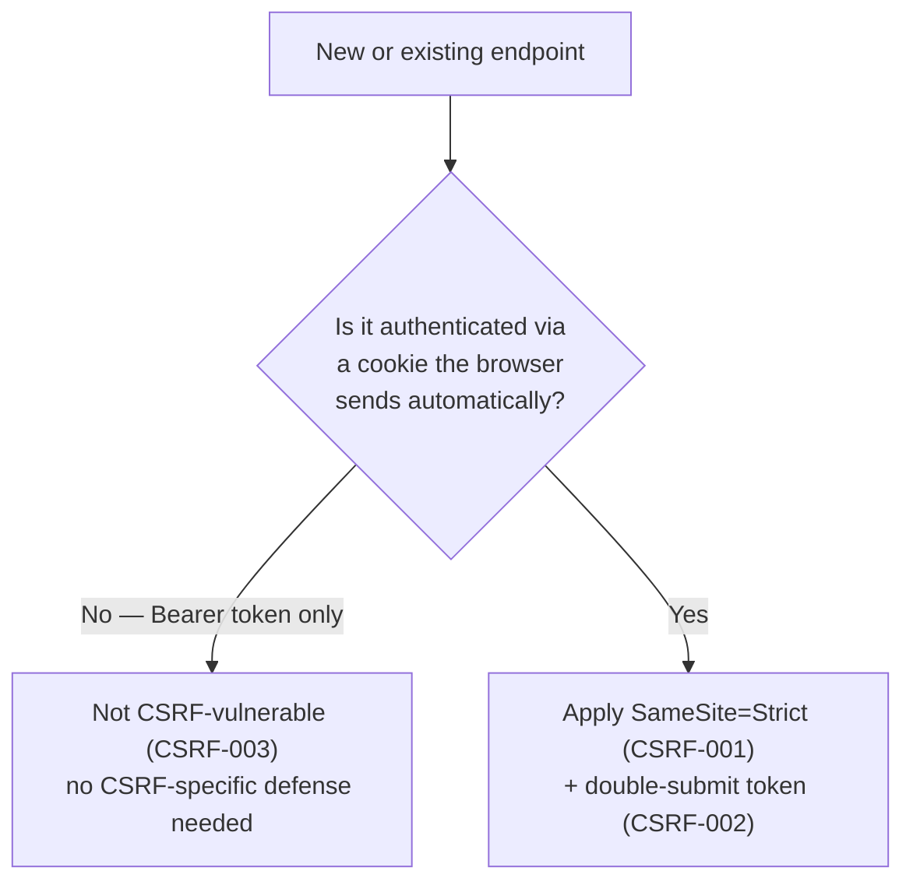

### 19.4 Examples

**Good:** `/auth/refresh` requires the `SameSite=Strict` cookie to even arrive, plus a matching `X-CSRF-Token` header/cookie pair — a malicious cross-site page cannot forge this request even if it tricks a logged-in user into visiting it.
**Bad:** Applying heavyweight CSRF-token middleware to every single API endpoint platform-wide "to be safe," when 99% of endpoints are Bearer-token-only and gain zero protection from it — unnecessary complexity with no security benefit (violates SP8, usability of controls).

### 19.5 Best Practices

- Keep the CSRF-protected surface area explicitly small and documented (just the cookie-authenticated endpoints) so it's obvious to any engineer which threat model applies where.

### 19.6 Common Mistakes

| Mistake | Fix |
|---|---|
| Assuming Bearer-token endpoints need CSRF tokens "just in case." | They don't — scope CSRF defense to cookie-authenticated endpoints only (CSRF-003). |
| A new cookie-authenticated endpoint added later without CSRF protection. | CSRF-004 — inherits the requirement automatically; flag in review. |

### 19.7 Checklist

- [ ] Refresh-token cookie is `SameSite=Strict`.
- [ ] Double-submit CSRF token required on cookie-authenticated endpoints.
- [ ] No unnecessary CSRF middleware on Bearer-token-only endpoints.

### 19.8 Future Considerations

If SSO/SAML (a plausible future addition, per Ch.3.9) introduces additional cookie-based flows, this chapter's rules extend to them automatically per CSRF-004.

### 19.9 AI Assistant Guidance

Always apply `SameSite=Strict` + double-submit token to any cookie-authenticated endpoint. Never apply CSRF-token middleware to a Bearer-token-only endpoint — it adds complexity with no protective value there.

### 19.10 Related Documents

Ch.7 (Session Management), `07_REST_API_STANDARDS.md` Ch.11.

---

## Chapter 20 — SSRF Prevention

### 20.1 Purpose

Closes the genuine gap identified in research: no existing document addresses Server-Side Request Forgery, and LedgerOne has at least two plausible SSRF vectors — outbound webhook calls to tenant-configured URLs, and any future AI-assistant-driven URL fetching.

### 20.2 Rules

| Rule ID | Rule | Severity | Enforcement |
|---|---|---|---|
| SSRF-001 | Any server-initiated outbound HTTP request to a URL derived from user/tenant input (webhook targets, imported file URLs, AI-tool URL fetches) validates the resolved destination against a deny-list of internal/private ranges before connecting: `169.254.169.254` (cloud metadata service), `127.0.0.0/8`, `10.0.0.0/8`, `172.16.0.0/12`, `192.168.0.0/16`, and `localhost`/`::1`. | 🔴 Critical | Code Review, Architecture Review |
| SSRF-002 | DNS resolution happens once, is checked against the deny-list, and the connection is made to the resolved IP directly (not re-resolved) — preventing a DNS-rebinding attack where the domain resolves to a safe IP at validation time but a private IP at connection time. | 🔴 Critical | Code Review |
| SSRF-003 | Outbound requests to tenant-configured URLs (webhooks) run through a dedicated egress path with a restrictive network policy (e.g., a NAT/proxy that cannot reach the VPC's internal services) — defense in depth beyond the application-layer check (SSRF-001). | 🟠 High | Architecture Review |
| SSRF-004 | Redirects followed during an outbound request are re-validated against the same deny-list at each hop — a request that resolves safely but redirects to an internal address is rejected, not silently followed. | 🟠 High | Code Review |

### 20.3 Diagram — Outbound Request Validation

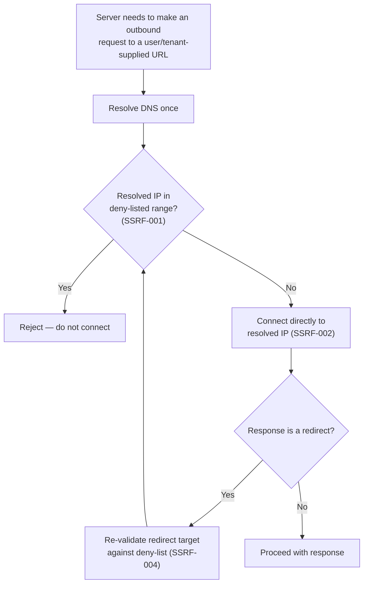

### 20.4 Examples

**Good:** A tenant configures a webhook URL `https://api.customer-erp.com/hook`; the platform resolves and validates it's a public IP before ever connecting, and re-validates on any redirect.
**Bad:** A webhook delivery system that accepts `http://169.254.169.254/latest/meta-data/iam/security-credentials/` as a "webhook URL" and dutifully calls it, leaking AWS instance credentials to whoever configured the webhook.

### 20.5 Best Practices

- Route all tenant-configured-URL outbound calls (webhooks, import-by-URL features) through one shared, centrally-maintained "safe HTTP client" utility that implements SSRF-001 through 004 — never reimplemented per feature.

### 20.6 Common Mistakes

| Mistake | Fix |
|---|---|
| Validating a URL's hostname string but not the resolved IP it actually connects to. | Validate the resolved IP, not just the string (SSRF-001/002). |
| Following redirects without re-validating each hop. | Re-validate every redirect target (SSRF-004). |

### 20.7 Checklist

- [ ] Outbound request to user/tenant-supplied URL validates resolved IP against the deny-list.
- [ ] DNS resolved once, connection made to that resolved IP (no re-resolution/rebinding risk).
- [ ] Redirects re-validated at each hop.
- [ ] Tenant-configured-URL egress runs through a restrictive network path.

### 20.8 Future Considerations

If a Marketplace/webhook feature (referenced in prior research as `14_WEBHOOK_STANDARDS.md`) is formalized, that document should reference this chapter's SSRF rules directly rather than redefining them.

### 20.9 AI Assistant Guidance

Always propose SSRF validation (deny-list check on the resolved IP, redirect re-validation) for any feature making an outbound request to a user/tenant-supplied URL — including webhook delivery and any AI-tool URL-fetching capability.

### 20.10 Related Documents

Ch.15 (Input Validation), `14_WEBHOOK_STANDARDS.md` (if/when formalized).

---

## Chapter 21 — Rate Limiting

### 21.1 Purpose

Supplies the concrete numeric thresholds `07_REST_API_STANDARDS.md` Ch.23 deliberately left undefined pending real usage data — this chapter provides the initial, revisable baseline.

### 21.2 Rules

| Rule ID | Rule | Severity | Enforcement |
|---|---|---|---|
| RATE-001 | Tiered limits (restated structure from `07_REST_API_STANDARDS.md` RATE-001), with initial baseline numbers: first-party frontend — 300 requests/minute per authenticated user; direct tenant API use — 120 requests/minute per `tenant_id`; third-party Marketplace — 60 requests/minute per API key, configurable per partner agreement. | 🟡 Medium | Architecture Review |
| RATE-002 | Authentication endpoints (`/auth/login`, `/auth/mfa/verify`) have a separate, stricter limit — 5 attempts per 15 minutes per account **and** per source IP, whichever is hit first — since these are the highest-value brute-force targets (Ch.22). | 🟠 High | Code Review |
| RATE-003 | Rate limit state is stored in Redis, shared across all ECS tasks — never per-instance in-memory counting, which would allow a distributed attacker to multiply their effective limit by the number of instances. | 🔴 Critical | Architecture Review |

### 21.3 Examples

**Good:** A brute-force login attempt from one IP against one account is blocked after 5 failed attempts in 15 minutes, regardless of which ECS task instance handled each request (Redis-backed, shared state).

### 21.4 Best Practices

- Review actual production rate-limit-hit metrics quarterly and adjust RATE-001's baseline numbers — these are explicitly a starting point, not permanent.

### 21.5 Common Mistakes

| Mistake | Fix |
|---|---|
| Per-instance in-memory rate limiting. | Redis-backed shared state (RATE-003). |
| Same rate limit for `/auth/login` as for a general `GET` endpoint. | Stricter, dedicated limit for auth endpoints (RATE-002). |

### 21.6 Checklist

- [ ] Tiered limits per caller trust level.
- [ ] Auth endpoints have a stricter, dedicated limit.
- [ ] Rate limit state is Redis-backed, not per-instance.

### 21.7 Future Considerations

RATE-001's numbers are a starting baseline explicitly expected to be revised with real production data, per `07_REST_API_STANDARDS.md` Ch.23.8's original note.

### 21.8 AI Assistant Guidance

Always implement rate limiting with shared (Redis) state, never per-instance memory. Always apply a stricter limit to authentication endpoints than general API endpoints.

### 21.9 Related Documents

`07_REST_API_STANDARDS.md` Ch.23, Ch.22 (Brute Force Protection).

---

## Chapter 22 — Brute Force Protection

### 22.1 Purpose

Defines account-level (not just IP-level) brute-force defenses, complementing Ch.21's rate limiting.

### 22.2 Rules

| Rule ID | Rule | Severity | Enforcement |
|---|---|---|---|
| BRUTE-001 | An account temporarily locks (login attempts rejected, even with the correct password) after 10 consecutive failed attempts within 15 minutes, for a 15-minute cooldown — distinct from and in addition to RATE-002's per-IP/per-account rate limit. | 🟠 High | Code Review |
| BRUTE-002 | A locked account's owner is notified (email) of the lockout, including the source IP/approximate location of the triggering attempts, so a legitimate user can distinguish "I mistyped my password" from "someone is attacking my account." | 🟡 Medium | Code Review |
| BRUTE-003 | CAPTCHA or an equivalent bot-detection challenge is introduced after repeated failures from the same source before outright lockout, to slow down automated attempts without immediately locking out a legitimate user who mistyped their password a few times. | 🟡 Medium | Code Review |
| BRUTE-004 | Credential-stuffing patterns (many distinct accounts attempted from one source in a short window) are detected and the source IP is temporarily blocked platform-wide, distinct from any single account's lockout. | 🟠 High | Security Monitoring (Ch.32) |

### 22.3 Examples

**Good:** After 10 failed logins in 15 minutes, the account locks for 15 minutes and the account owner receives an email noting the failed attempts and their approximate source.

### 22.4 Best Practices

- Tune BRUTE-001's exact thresholds based on observed false-positive rates (legitimate users locking themselves out) once in production — like Ch.21's rate limits, these are an informed starting point.

### 22.5 Common Mistakes

| Mistake | Fix |
|---|---|
| No account-level lockout, relying only on IP-based rate limiting (easily bypassed via distributed source IPs). | Add account-level lockout independent of source IP (BRUTE-001). |
| A silent lockout with no user notification. | Notify the account owner (BRUTE-002). |

### 22.6 Checklist

- [ ] Account-level lockout independent of IP-based rate limiting.
- [ ] Account owner notified on lockout.
- [ ] Credential-stuffing pattern detection in place.

### 22.7 Future Considerations

Adaptive/risk-based authentication (requiring MFA step-up only when a login looks anomalous — new device, new location) is a plausible future enhancement.

### 22.8 AI Assistant Guidance

Always generate account-level lockout logic distinct from IP-based rate limiting. Always include an account-owner notification on lockout.

### 22.9 Related Documents

Ch.21 (Rate Limiting), Ch.32 (Security Monitoring).

---

## Chapter 23 — Audit Logging

### 23.1 Purpose

Restates `03_ARCHITECTURE.md` Ch.17 and `06_DATABASE_STANDARDS.md` Ch.7's audit architecture as a binding security control, since audit trail integrity is what makes every other chapter's forensic claims (SP7) actually true.

### 23.2 Rules

| Rule ID | Rule | Severity | Enforcement |
|---|---|---|---|
| AUDLOG-001 | Every business-significant action produces an append-only audit record, written in the same DB transaction as the mutation — restated as binding here (`03_ARCHITECTURE.md` Ch.17, `06_DATABASE_STANDARDS.md` AUD-D-001–006). | 🔴 Critical | Architecture Review |
| AUDLOG-002 | Security-relevant events beyond ordinary business mutations are also audited: login success/failure, MFA challenges, permission/Role changes, password resets, session revocations, cross-tenant access attempts (MTS-004). | 🟠 High | Code Review |
| AUDLOG-003 | Audit records are never mutated or deleted by application code — restated from `06_DATABASE_STANDARDS.md` AUD-D-002, with the security framing: an attacker who compromises application-layer credentials still cannot alter the historical record without also compromising the database layer directly (defense in depth, SP1). | 🔴 Critical | Repository base class |
| AUDLOG-004 | Audit log access itself is restricted and logged — reading the audit trail is a Platform Operator-only capability (restated from `03_ARCHITECTURE.md` Ch.22.3/20.4), and access to it is itself an auditable event. | 🟠 High | Architecture Review |

### 23.3 Examples

**Good:** A failed login attempt, a Role permission change, and a journal entry posting are all recorded in the append-only audit store with actor, timestamp, and (for the permission change) before/after state.

### 23.4 Best Practices

- Include security events (Ch.22.2) in the same audit infrastructure as business events rather than a separate, differently-governed security log — one consistent, tamper-resistant store.

### 23.5 Common Mistakes

| Mistake | Fix |
|---|---|
| Security events (logins, permission changes) logged only to application logs (Ch.32), not the append-only audit store. | Route security-relevant events through the same audit infrastructure (AUDLOG-002). |

### 23.6 Checklist

- [ ] Security-relevant events are audited, not just business mutations.
- [ ] Audit access is Platform-Operator-only and itself logged.

### 23.7 Future Considerations

None beyond `03_ARCHITECTURE.md` Ch.17/`06_DATABASE_STANDARDS.md` Ch.7's evolution.

### 23.8 AI Assistant Guidance

Always route security-relevant events (login, permission change, session revocation) through the shared audit infrastructure, not just application logging.

### 23.9 Related Documents

`03_ARCHITECTURE.md` Ch.17, `06_DATABASE_STANDARDS.md` Ch.7.

---

## Chapter 24 — Financial Data Protection

### 24.1 Purpose

Names the security-specific requirements for LedgerOne's core asset — financial transaction data — beyond what's already covered structurally.

### 24.2 Rules

| Rule ID | Rule | Severity | Enforcement |
|---|---|---|---|
| FINSEC-001 | Every financial-mutation endpoint (post, void, reverse, approve) requires an idempotency key (`07_REST_API_STANDARDS.md` Ch.22) — treated as Critical here specifically because a duplicate financial mutation is a direct monetary-correctness failure, not just an API-hygiene issue. | 🔴 Critical | Security Review |
| FINSEC-002 | A financial approval workflow requiring dual-control (e.g., a payment above a threshold requiring two distinct approvers) cannot be satisfied by the same user account acting twice — enforced server-side, never assumed from UI flow alone. | 🔴 Critical | Code Review |
| FINSEC-003 | Financial reports/exports containing bank account or tax ID data mask those fields by default (restated from `07_REST_API_STANDARDS.md` SEC-API-006) in any bulk export, not only in the interactive UI. | 🟠 High | Code Review |
| FINSEC-004 | Any code path capable of altering a posted (non-draft) financial record does so only through a documented reversal/adjustment mechanism, never a direct update to the original record — preserving FP1's provability guarantee at the security layer, not just the database layer. | 🔴 Critical | Architecture Review |

### 24.3 Examples

**Good:** A payment above the tenant's configured dual-control threshold requires Approver A and a distinct Approver B; the server rejects a second approval attempt from the same `user_id` that provided the first.
**Bad:** A dual-control requirement enforced only by the frontend disabling the "approve" button for the first approver — trivially bypassed by calling the API directly.

### 24.4 Best Practices

- Treat any financial-mutation endpoint's security review (Ch.2) as requiring explicit sign-off on idempotency, dual-control (if applicable), and immutability-of-posted-records — a standing checklist item, not case-by-case judgment.

### 24.5 Common Mistakes

| Mistake | Fix |
|---|---|
| Dual-control enforced only in the UI. | Enforce server-side, rejecting a second approval from the same user (FINSEC-002). |
| A "fix" that directly updates a posted journal entry instead of creating a reversal. | Always use the reversal/adjustment mechanism (FINSEC-004). |

### 24.6 Checklist

- [ ] Financial mutations require idempotency keys.
- [ ] Dual-control (where applicable) enforced server-side against the same user acting twice.
- [ ] Exports mask sensitive financial fields by default.
- [ ] Posted records are never directly updated, only reversed/adjusted.

### 24.7 Future Considerations

As Payroll and Fixed Assets modules are built, this chapter's dual-control/immutability rules extend to their financial-mutation endpoints identically — no module-specific exception.

### 24.8 AI Assistant Guidance

Always flag a financial-mutation endpoint for idempotency-key requirement and, if dual-control applies, always generate the same-user-rejection check server-side, never rely on UI-only enforcement.

### 24.9 Related Documents

`07_REST_API_STANDARDS.md` Ch.22, `06_DATABASE_STANDARDS.md` Ch.8 (Soft Delete — immutability of posted records intersects here).

---

## Chapter 25 — PII Protection

### 25.1 Purpose

Defines how personally identifiable information is classified and protected, distinct from Ch.26's GDPR-specific process requirements.

### 25.2 Rules

| Rule ID | Rule | Severity | Enforcement |
|---|---|---|---|
| PII-001 | PII fields (name, email, phone, address, government ID, bank details) are explicitly classified as such in the shared DTO/schema layer (e.g., a marker/comment convention), making a data inventory possible without manual code archaeology. | 🟠 High | Code Review |
| PII-002 | PII is never included in application logs (restated from `07_REST_API_STANDARDS.md` LOG-002) — logging redaction rules explicitly cover the PII field list from PII-001. | 🔴 Critical | Code Review |
| PII-003 | PII is never sent to third-party analytics/monitoring tools (e.g., an error-tracking service) without explicit scrubbing — a raw exception object containing a user's email must be redacted before being sent to an external error-tracking provider. | 🟠 High | Code Review |
| PII-004 | Access to PII fields in the UI/API is governed by the same RBAC permission model (Ch.4) as any other data — no blanket "any authenticated user can see any other user's PII" default. | 🟠 High | Code Review |

### 25.3 Examples

**Good:** A maintained list of PII field names (`email`, `phone`, `taxId`, `bankAccountNumber`, ...) is fed into both the Pino redaction config (Ch.23 of `07_REST_API_STANDARDS.md`) and the error-tracking tool's scrubbing config, so both stay in sync from one source.
**Bad:** An unhandled exception object serialized wholesale to an external error-tracking service, including the full request body with a customer's email and phone number.

### 25.4 Best Practices

- Maintain the PII field list (PII-001) as a shared, importable constant rather than a document that engineers have to remember to check.

### 25.5 Common Mistakes

| Mistake | Fix |
|---|---|
| Sending a raw request/error object to a third-party monitoring tool. | Scrub PII first, using the shared field list (PII-003). |

### 25.6 Checklist

- [ ] PII fields explicitly classified.
- [ ] PII excluded from logs and third-party tool payloads.
- [ ] PII access governed by RBAC, not universally readable.

### 25.7 Future Considerations

A formal, tooling-enforced PII data inventory (rather than a maintained list) could be built as the schema grows across 16 modules.

### 25.8 AI Assistant Guidance

Always check whether a field being logged, exported, or sent to a third-party tool is PII, and redact it if so.

### 25.9 Related Documents

Ch.26 (GDPR Readiness), `07_REST_API_STANDARDS.md` Ch.25.

---

## Chapter 26 — GDPR Readiness

### 26.1 Purpose

Resolves the genuine tension research surfaced: GDPR's right to erasure vs. `06_DATABASE_STANDARDS.md`'s statutory retention rules (DLC-002/003) and `00_BUSINESS_RULES.md`'s "deactivation never anonymizes historical audit attribution" (USR-003). This chapter is the first to state the resolution explicitly, and it does so by subordinating erasure to retention, not the reverse.

### 26.2 Rules

| Rule ID | Rule | Severity | Enforcement |
|---|---|---|---|
| GDPR-001 | A data subject's right-to-erasure request is fulfilled via **anonymization/pseudonymization of non-essential personal fields** (name, email, contact details replaced with a non-identifying placeholder) — never via deletion of the underlying financial/audit record itself, which remains subject to `06_DATABASE_STANDARDS.md` DLC-002's statutory retention window. | 🔴 Critical | Code Review, Architecture Review |
| GDPR-002 | Anonymization is irreversible and itself logged as an audited action (who requested it, when, what was anonymized) — the audit trail records that anonymization occurred, even though the personal data it once referenced is no longer retrievable. | 🟠 High | Code Review |
| GDPR-003 | An erasure/anonymization request is honored only after confirming no active legal hold applies to the affected records (a legal hold, per `06_DATABASE_STANDARDS.md` Ch.14.8's flagged-but-undefined mechanism, takes precedence and must be formalized before this rule can be fully automated — until then, legal holds are checked manually as part of the request-fulfillment process). | 🔴 Critical | Architecture Review |
| GDPR-004 | Data residency/portability requests (export a data subject's personal data in a structured format) are supported as a distinct, separate capability from erasure — an export request never triggers anonymization as a side effect. | 🟡 Medium | Code Review |
| GDPR-005 | A Data Protection Officer (DPO) contact/process is designated for the platform (organizationally, not a code requirement) — this handbook flags the requirement; the organizational designation itself is outside engineering's scope. | 🟡 Medium | Architecture Review |

### 26.3 Diagram — Erasure Request Resolution

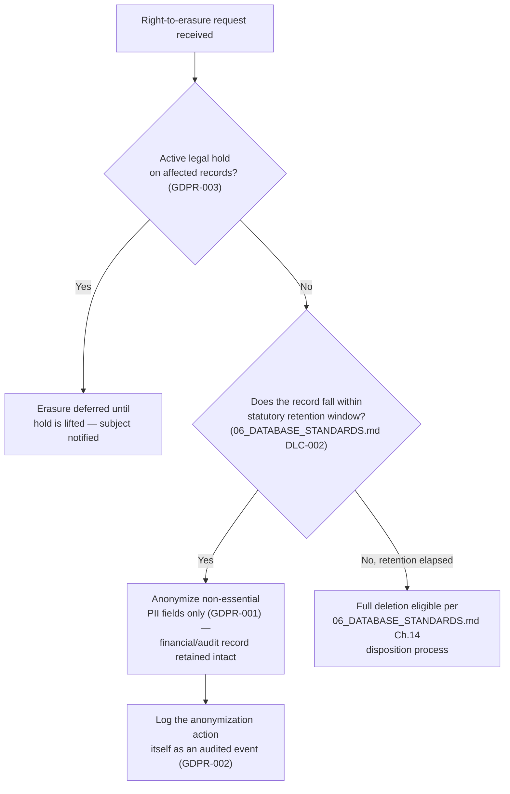

### 26.4 Standards & Rationale

This resolution is the only one consistent with everything already frozen: `06_DATABASE_STANDARDS.md` DLC-002 (🔴 Critical, "no data is permanently disposed of before its jurisdiction-specific statutory retention period has elapsed... regardless of tenant offboarding") and `00_BUSINESS_RULES.md` USR-003 ("deactivation never anonymizes or reassigns historical audit attribution") both take precedence over a blanket erasure right. GDPR itself recognizes exactly this carve-out (Article 17(3)(b) — erasure is not required where processing is necessary for compliance with a legal obligation) — so anonymizing the *personal identifying fields* while retaining the *financial/audit substance* satisfies both GDPR's actual requirement and LedgerOne's existing retention rules, without contradicting either.

### 26.5 Examples

**Good:** A former Customer's contact record has `name`, `email`, and `phone` replaced with `[ANONYMIZED]`/a generated placeholder; the invoices and payment history that reference that Customer remain fully intact, financially accurate, and attributable to "a customer" for audit purposes, just no longer to identifiable personal contact details.
**Bad:** Deleting a Customer record entirely on an erasure request, breaking referential integrity with years of posted invoices and violating both DLC-002 and USR-003.

### 26.6 Best Practices

- Build the anonymization capability once, centrally (a shared "anonymize personal fields for entity X" utility), rather than each module inventing its own partial version.

### 26.7 Common Mistakes

| Mistake | Fix |
|---|---|
| Treating "right to erasure" as requiring literal row deletion. | Anonymize personal fields; retain the financial/audit substance (GDPR-001). |
| Anonymizing without checking for an active legal hold first. | Always check GDPR-003 first. |

### 26.8 Checklist

- [ ] Erasure requests are fulfilled via anonymization, not deletion, for records under retention.
- [ ] Legal hold checked before honoring any erasure/anonymization request.
- [ ] Anonymization action itself is audited.
- [ ] Export/portability requests are handled separately from erasure.

### 26.9 Future Considerations

`06_DATABASE_STANDARDS.md` Ch.14.8 already flags a formal "legal hold" mechanism as undefined and a likely future addition — GDPR-003 depends on that mechanism existing; until it's built, legal hold checks remain a manual step in the erasure-fulfillment process, explicitly called out here as a gap, not silently assumed solved.

### 26.10 AI Assistant Guidance

Never generate a "delete user data" feature that performs literal row deletion of financial/audit-linked records — always anonymize personal fields instead, and flag the legal-hold-check gap (GDPR-003) as needing manual verification until that mechanism is built.

### 26.11 Related Documents

`06_DATABASE_STANDARDS.md` Ch.8, Ch.14 (especially DLC-002/003 and the Ch.14.8 legal-hold gap), `00_BUSINESS_RULES.md` USR-003.

---

## Chapter 27 — Backup Security

### 27.1 Purpose

Restates `06_DATABASE_STANDARDS.md` Ch.13's backup rules as a binding security requirement — a backup is a full copy of every tenant's data and deserves the same scrutiny as the primary database.

### 27.2 Rules

| Rule ID | Rule | Severity | Enforcement |
|---|---|---|---|
| BAKSEC-001 | Backups/snapshots are encrypted at rest with the same KMS-backed encryption as the primary database (restated from `06_DATABASE_STANDARDS.md` BAK-004). | 🔴 Critical | Ops/infra review |
| BAKSEC-002 | Access to restore or export a backup is restricted to a small, named set of Platform Operators via IAM policy, and every restore/export action is itself an audited event. | 🔴 Critical | Ops/infra review |
| BAKSEC-003 | Backups are tested via periodic restore drills (restated from `06_DATABASE_STANDARDS.md` BAK-002) — an untested backup is not treated as a valid security control, since "we have a backup" is meaningless if it can't actually be restored under incident conditions. | 🟠 High | Ops runbook |
| BAKSEC-004 | Cross-region backup replicas (restated from `06_DATABASE_STANDARDS.md` BAK-003) maintain identical access controls and encryption as the primary region — a DR copy is never a weaker-security copy. | 🟠 High | Ops/infra review |

### 27.3 Best Practices

- Include a backup-restore drill in the incident response tabletop exercise (Ch.33) so the restore process is practiced under realistic time pressure, not just verified in isolation.

### 27.4 Common Mistakes

| Mistake | Fix |
|---|---|
| A broad IAM role with backup-restore access shared across the whole engineering team. | Restrict to a small, named set of Platform Operators (BAKSEC-002). |

### 27.5 Checklist

- [ ] Backups encrypted identically to the primary database.
- [ ] Restore/export access restricted and audited.
- [ ] Restore drills actually performed periodically.
- [ ] Cross-region replicas match primary-region security posture.

### 27.6 Future Considerations

None beyond `06_DATABASE_STANDARDS.md` Ch.13's evolution.

### 27.7 AI Assistant Guidance

Always flag backup/restore access as requiring restricted IAM policy and audit logging when discussing infrastructure configuration.

### 27.8 Related Documents

`06_DATABASE_STANDARDS.md` Ch.13, Ch.34 (Disaster Recovery).

---

## Chapter 28 — Cloud Security (AWS)

### 28.1 Purpose

Defines AWS-account-level security posture beyond application-level controls.

### 28.2 Rules

| Rule ID | Rule | Severity | Enforcement |
|---|---|---|---|
| AWSSEC-001 | Production AWS access requires MFA for every IAM user/root account; the root account is never used for day-to-day operations and has hardware-MFA where feasible. | 🔴 Critical | Ops/infra review |
| AWSSEC-002 | IAM policies follow least privilege — no `*:*` policy attached to any role beyond a tightly controlled break-glass emergency-access role, itself requiring approval and generating an alert on use. | 🔴 Critical | Ops/infra review |
| AWSSEC-003 | Production, staging, and development run in separate AWS accounts (not just separate resources in one account) — a compromise or misconfiguration in staging cannot reach production resources. | 🟠 High | Architecture Review |
| AWSSEC-004 | VPC security groups follow least-access (RDS reachable only from the ECS task security group, never `0.0.0.0/0`) — restated/extended from `06_DATABASE_STANDARDS.md`'s implicit assumption. | 🔴 Critical | Ops/infra review |
| AWSSEC-005 | CloudTrail logging is enabled account-wide and its logs are shipped to a separate, restricted-access account/bucket — so a compromised production account can't also delete the evidence of what happened in it. | 🟠 High | Ops/infra review |

### 28.3 Examples

**Good:** RDS's security group allows inbound MySQL traffic only from the ECS task security group's ID, not from any CIDR range.
**Bad:** An RDS security group open to `0.0.0.0/0` on port 3306 "temporarily, for debugging" — a well-known cause of real-world data breaches.

### 28.4 Best Practices

- Use AWS Config rules or an equivalent policy-as-code tool to continuously detect drift from AWSSEC-001–005 rather than relying solely on point-in-time manual review.

### 28.5 Common Mistakes

| Mistake | Fix |
|---|---|
| A security group temporarily opened to `0.0.0.0/0` and forgotten. | Least-access only, no broad temporary openings (AWSSEC-004). |
| Staging and production sharing one AWS account. | Separate accounts (AWSSEC-003). |

### 28.6 Checklist

- [ ] MFA enforced on all IAM access; root account not used operationally.
- [ ] Least-privilege IAM policies, no broad wildcard grants.
- [ ] Environment separation by AWS account.
- [ ] Security groups least-access, no `0.0.0.0/0` on data-tier resources.
- [ ] CloudTrail enabled and shipped to a separate account.

### 28.7 Future Considerations

Consider AWS Organizations SCPs (Service Control Policies) as the platform's AWS footprint grows across more accounts.

### 28.8 AI Assistant Guidance

Never generate infrastructure configuration with a `0.0.0.0/0` security group rule on a data-tier resource. Always recommend least-privilege IAM scoping.

### 28.9 Related Documents

`02_TECH_STACK.md`, `03_ARCHITECTURE.md` Ch.24, Ch.29 (Infrastructure Security).

---

## Chapter 29 — Infrastructure Security

### 29.1 Purpose

Covers container/deployment-level security, complementing Ch.28's AWS-account-level rules.

### 29.2 Rules

| Rule ID | Rule | Severity | Enforcement |
|---|---|---|---|
| INFRA-001 | Docker images are built from minimal, pinned base images (e.g., `node:22-slim` with a pinned digest, not `node:latest`) and scanned for known vulnerabilities (Ch.30) before deployment. | 🟠 High | CI Pipeline |
| INFRA-002 | Containers run as a non-root user inside ECS — no application process runs as `root` inside its container. | 🟠 High | Code Review |
| INFRA-003 | ECS task IAM roles are scoped per-service (least privilege, extending AWSSEC-002) — no task role has broader permissions than that specific service's actual needs. | 🟠 High | Ops/infra review |
| INFRA-004 | Deployments follow the staged-rollout-with-auto-rollback pattern already established in `03_ARCHITECTURE.md` Decision 24.6.1 — restated here because a bad deploy that can't be quickly rolled back extends every other incident's blast radius. | 🟠 High | CI/CD Pipeline |

### 29.3 Examples

**Good:** A Dockerfile's final stage runs `USER node` before `CMD`, never leaving the process as `root`.
**Bad:** A container image built `FROM node:latest` with no digest pinning — the same tag can silently resolve to a different, potentially vulnerable image over time.

### 29.4 Best Practices

- Multi-stage Docker builds keep build-time dependencies (compilers, dev dependencies) out of the final production image, reducing attack surface.

### 29.5 Common Mistakes

| Mistake | Fix |
|---|---|
| Running the application as `root` inside the container. | Non-root user (INFRA-002). |
| An unpinned `:latest` base image tag. | Pin to a specific digest (INFRA-001). |

### 29.6 Checklist

- [ ] Base images pinned and scanned.
- [ ] Non-root container user.
- [ ] Per-service least-privilege task IAM roles.
- [ ] Staged rollout with auto-rollback in place.

### 29.7 Future Considerations

None beyond `03_ARCHITECTURE.md` Ch.24's evolution.

### 29.8 AI Assistant Guidance

Always generate Dockerfiles with a pinned base image and a non-root final user. Never suggest `:latest` for a production image tag.

### 29.9 Related Documents

`03_ARCHITECTURE.md` Ch.24, Ch.28 (Cloud Security), Ch.30 (Dependency Security).

---

## Chapter 30 — Dependency Security

### 30.1 Purpose

Closes the confirmed gap: no dependency-scanning tooling exists in any prior document.

### 30.2 Rules

| Rule ID | Rule | Severity | Enforcement |
|---|---|---|---|
| DEP-001 | Automated dependency vulnerability scanning (e.g., `npm audit`, GitHub Dependabot, or Snyk) runs on every PR and on a scheduled daily basis against `main` — a new critical/high vulnerability in a dependency is flagged, not silently accumulated. | 🟠 High | CI Pipeline |
| DEP-002 | A critical/high-severity dependency vulnerability with an available fix blocks merge until resolved or explicitly waived with a documented reason and expiry (mirrors SSDLC-003). | 🟠 High | CI Pipeline |
| DEP-003 | New dependencies are reviewed for maintenance health (recent commits, no known abandoned status) and minimal necessary scope before being added — not added reflexively for a small utility function that could be hand-written. | 🟡 Medium | Code Review |
| DEP-004 | Lockfiles (`package-lock.json`) are committed and CI installs are `--frozen-lockfile`/equivalent — no build ever silently resolves to a different dependency version than what was reviewed. | 🟡 Medium | CI Pipeline |

### 30.3 Examples

**Good:** A Dependabot PR bumping a transitive dependency with a known CVE is auto-generated, reviewed, and merged within the SLA implied by DEP-002.

### 30.4 Best Practices

- Periodically audit the dependency tree for unused packages — smaller dependency surface means smaller vulnerability surface.

### 30.5 Common Mistakes

| Mistake | Fix |
|---|---|
| A known critical CVE in a dependency left unaddressed for months with no tracked waiver. | Block merge or explicitly waive with an expiry (DEP-002). |
| Installing a small, single-function npm package for something easily hand-written. | Evaluate necessity before adding a new dependency (DEP-003). |

### 30.6 Checklist

- [ ] Dependency scanning runs on every PR and on a schedule.
- [ ] Critical/high findings block merge or are explicitly waived.
- [ ] Lockfile committed, CI uses frozen-lockfile installs.

### 30.7 Future Considerations

As the monorepo grows (`packages/*`), consider per-package dependency scanning granularity rather than one flat scan.

### 30.8 AI Assistant Guidance

Always recommend evaluating a new dependency's necessity and maintenance health before adding it. Always assume dependency scanning is part of CI when reasoning about the release pipeline.

### 30.9 Related Documents

Ch.2 (SSDLC), `04_FOLDER_STRUCTURE.md` (monorepo structure).

---

## Chapter 31 — Secure Headers

### 31.1 Purpose

Defines the concrete HTTP security header set, extending `07_REST_API_STANDARDS.md` SEC-API-001's "Helmet applied" rule with specifics.

### 31.2 Rules

| Rule ID | Rule | Severity | Enforcement |
|---|---|---|---|
| HDR-001 | `Strict-Transport-Security: max-age=63072000; includeSubDomains; preload` on every response, enforcing HTTPS at the browser level (complements APISEC-001's server-side TLS enforcement). | 🟠 High | Contract test |
| HDR-002 | `Content-Security-Policy` restricts `default-src 'self'`, with script/style sources explicitly allow-listed — no `unsafe-inline`/`unsafe-eval` in production (restated from XSS-002). | 🟠 High | Contract test |
| HDR-003 | `X-Content-Type-Options: nosniff`, `X-Frame-Options: DENY` (or CSP `frame-ancestors 'none'`), and `Referrer-Policy: strict-origin-when-cross-origin` on every response. | 🟡 Medium | Contract test |
| HDR-004 | `Permissions-Policy` disables browser features the application doesn't use (camera, microphone, geolocation) by default. | ⚪ Low | Contract test |

### 31.3 Standards Table

| Header | Value | Purpose |
|---|---|---|
| `Strict-Transport-Security` | `max-age=63072000; includeSubDomains; preload` | Forces HTTPS, prevents downgrade attacks |
| `Content-Security-Policy` | `default-src 'self'; script-src 'self'; ...` | Limits XSS blast radius |
| `X-Content-Type-Options` | `nosniff` | Prevents MIME-sniffing attacks |
| `X-Frame-Options` | `DENY` | Prevents clickjacking |
| `Referrer-Policy` | `strict-origin-when-cross-origin` | Limits referrer leakage |

### 31.4 Best Practices

- Apply the full header set via one shared Helmet configuration, never per-route custom header logic.

### 31.5 Common Mistakes

| Mistake | Fix |
|---|---|
| Missing `X-Frame-Options`/`frame-ancestors`, allowing the app to be iframed for a clickjacking attack. | Always set `DENY` (HDR-003). |

### 31.6 Checklist

- [ ] Full header set (Section 31.3) applied to every response.
- [ ] CSP has no `unsafe-inline`/`unsafe-eval` in production.

### 31.7 Future Considerations

Revisit CSP directives as new third-party integrations (analytics, chat widgets, per `08_FRONTEND_STANDARDS.md` XSS-004) are added — each requires an explicit allow-list addition, never a blanket loosening.

### 31.8 AI Assistant Guidance

Always generate the full standard header set via Helmet configuration. Never generate a CSP with `unsafe-inline`/`unsafe-eval` for production.

### 31.9 Related Documents

`07_REST_API_STANDARDS.md` SEC-API-001, Ch.18 (XSS Prevention).

---

## Chapter 32 — Security Monitoring

### 32.1 Purpose

Defines what's actively monitored for anomalies, beyond passive audit logging (Ch.23).

### 32.2 Rules

| Rule ID | Rule | Severity | Enforcement |
|---|---|---|---|
| MON-001 | The signals named throughout this handbook (MTS-004 cross-tenant anomalies, BRUTE-004 credential stuffing, SECR-005 leaked secrets, DEP-002 critical CVEs) feed into one consolidated security monitoring dashboard/alerting pipeline (CloudWatch + an alerting layer) — not scattered, individually-checked logs. | 🟠 High | Architecture Review |
| MON-002 | Alert thresholds distinguish "needs investigation" from "needs immediate incident response" (Ch.33) — not every anomaly triggers a full incident, but every genuine incident-triggering signal is actually alerted, not silently logged. | 🟡 Medium | Architecture Review |
| MON-003 | Security monitoring dashboards/alerts are visible only to the Platform Operator plane (restated from `03_ARCHITECTURE.md` Ch.22.3), consistent with audit log access restrictions. | 🟠 High | Architecture Review |

### 32.3 Diagram — Monitoring Signal Consolidation

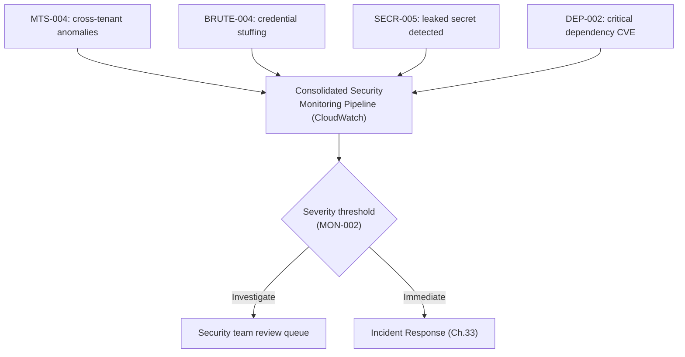

### 32.4 Best Practices

- Periodically review alert noise (false-positive rate) — an alerting pipeline that cries wolf trains responders to ignore it, undermining SP8.

### 32.5 Common Mistakes

| Mistake | Fix |
|---|---|
| Security-relevant signals logged but never actually alerted on. | Consolidate into an active monitoring pipeline (MON-001). |

### 32.6 Checklist

- [ ] All security signals named across this handbook feed one consolidated pipeline.
- [ ] Alert severity thresholds distinguish investigate-vs-immediate-response.
- [ ] Monitoring access restricted to Platform Operators.

### 32.7 Future Considerations

A dedicated SIEM tool may be warranted as alert volume grows beyond what CloudWatch's native alerting comfortably handles.

### 32.8 AI Assistant Guidance

When generating any security-relevant detection logic, always route its output into the consolidated monitoring pipeline rather than a standalone log no one actively watches.

### 32.9 Related Documents

`03_ARCHITECTURE.md` Ch.22, Ch.33 (Incident Response).

---

## Chapter 33 — Incident Response

### 33.1 Purpose

Closes the confirmed gap: no incident response process exists in any prior document. This chapter defines it.

### 33.2 Rules

| Rule ID | Rule | Severity | Enforcement |
|---|---|---|---|
| IR-001 | A defined incident severity scale (SEV1–SEV4) with response-time expectations exists and is used consistently — a SEV1 (active breach, tenant data exposure) triggers immediate all-hands response; lower severities follow proportionate process. | 🟠 High | Architecture Review |
| IR-002 | A designated on-call rotation and communication channel exists for security incidents specifically, distinct from general operational on-call, given the specialized decisions a security incident requires. | 🟠 High | Ops policy |
| IR-003 | Every SEV1/SEV2 incident produces a blameless post-incident review with a written root-cause analysis and concrete follow-up actions, tracked to completion. | 🟠 High | Architecture Review |
| IR-004 | Tenant notification for a confirmed data breach follows applicable legal requirements (breach notification laws vary by jurisdiction) — Legal/Compliance is looped in immediately upon SEV1 confirmation, not after engineering has "finished investigating." | 🔴 Critical | Architecture Review |
| IR-005 | A tabletop exercise (simulated incident walkthrough) is run periodically to validate the process actually works under pressure, not just exists on paper. | 🟡 Medium | Ops policy |

### 33.3 Decision Matrix — Severity Scale

| Severity | Definition | Response |
|---|---|---|
| SEV1 | Active breach, confirmed cross-tenant data exposure, or financial data falsification | Immediate all-hands, Legal/Compliance notified immediately (IR-004) |
| SEV2 | Significant vulnerability found (not yet known to be exploited) or a contained incident affecting one tenant | Urgent response within hours, Legal/Compliance looped in |
| SEV3 | Lower-risk vulnerability or anomaly requiring investigation, no confirmed exposure | Response within the next business day |
| SEV4 | Hardening opportunity, no immediate risk | Tracked as security debt (SSDLC-004) |

### 33.4 Diagram — Incident Response Flow

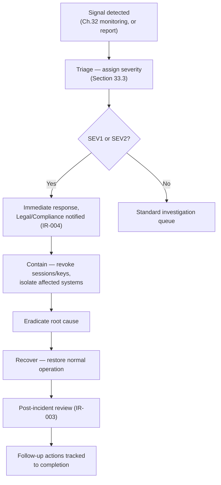

### 33.5 Examples

**Good:** A leaked API key (SECR-005) triggers immediate rotation, a SEV2 classification, and a post-incident review examining how the key was exposed and what CI check would have caught it earlier.

### 33.6 Best Practices

- Keep an incident response runbook template ready before an incident happens — improvising the process during a live SEV1 costs precious response time.

### 33.7 Common Mistakes

| Mistake | Fix |
|---|---|
| Treating every anomaly as requiring the full SEV1 process. | Use the proportionate severity scale (Section 33.3). |
| Investigating a confirmed breach for days before looping in Legal/Compliance. | Immediate notification on SEV1 confirmation (IR-004). |

### 33.8 Checklist

- [ ] Severity scale and response expectations defined and known to the team.
- [ ] Security-specific on-call exists.
- [ ] Post-incident review process produces tracked follow-up actions.
- [ ] Tabletop exercises actually happen periodically.

### 33.9 Future Considerations

As the platform scales, consider a dedicated security incident response retainer with an external firm for SEV1-class incidents beyond internal team capacity.

### 33.10 AI Assistant Guidance

When discussing a security finding, always help classify its severity per Section 33.3 and note whether Legal/Compliance notification is implicated.

### 33.11 Related Documents

Ch.32 (Security Monitoring), Ch.34 (Disaster Recovery), Ch.12 (Secrets Management, SECR-005).

---

## Chapter 34 — Disaster Recovery

### 34.1 Purpose

Closes the confirmed gap: no RTO/RPO or DR process exists in any prior document, complementing `06_DATABASE_STANDARDS.md` Ch.13's backup strategy.

### 34.2 Rules

| Rule ID | Rule | Severity | Enforcement |
|---|---|---|---|
| DR-001 | Recovery Time Objective (RTO) and Recovery Point Objective (RPO) are explicitly defined per environment tier (e.g., production RTO ≤ 4 hours, RPO ≤ 15 minutes via RDS automated backups + point-in-time recovery) and reviewed as real operational data accumulates. | 🟠 High | Architecture Review |
| DR-002 | A documented DR runbook exists covering: full region failure, database corruption requiring point-in-time restore, and accidental mass-data-deletion scenarios — each with its own recovery procedure, since "restore the backup" isn't identical across these cases. | 🟠 High | Ops runbook |
| DR-003 | DR drills (restated/extended from `06_DATABASE_STANDARDS.md` BAK-002) are run at least annually against the actual documented runbook, not just a generic "we could probably restore if needed" assumption. | 🟠 High | Ops runbook |
| DR-004 | Cross-region failover capability (leveraging the cross-region backup replication already required, `06_DATABASE_STANDARDS.md` BAK-003) is tested, not just provisioned. | 🟡 Medium | Ops runbook |

### 34.3 Examples

**Good:** An annual DR drill actually fails over to the cross-region replica, measures the real time-to-recovery against the DR-001 RTO target, and documents any gap found for follow-up.

### 34.4 Best Practices

- Treat DR-001's RTO/RPO numbers as a starting commitment to validate against real drill results (DR-003), not a number chosen once and never checked against reality — mirrors Ch.21/22's "revisit with real data" pattern.

### 34.5 Common Mistakes

| Mistake | Fix |
|---|---|
| An RTO/RPO target that's never actually been tested against a real drill. | Annual drills validate the real number (DR-003). |
| Treating "restore the backup" as one generic procedure regardless of failure scenario. | Distinct runbooks per scenario type (DR-002). |

### 34.6 Checklist

- [ ] RTO/RPO explicitly defined per environment tier.
- [ ] Runbooks exist per distinct failure scenario.
- [ ] DR drills actually performed at least annually.
- [ ] Cross-region failover tested, not just provisioned.

### 34.7 Future Considerations

As tenant count and data volume grow, DR-001's RTO/RPO targets should be revisited — a target that was achievable at launch scale may not hold at 10x the data volume.

### 34.8 AI Assistant Guidance

When discussing infrastructure resilience, always ask whether the relevant RTO/RPO target has actually been validated by a real drill, not just assumed from the backup configuration existing.

### 34.9 Related Documents

`06_DATABASE_STANDARDS.md` Ch.13, Ch.27 (Backup Security), Ch.33 (Incident Response).

---

## Chapter 35 — Security Review Checklist

### 35.1 Purpose

The literal, consolidated security-review PR/design checklist, mirroring `07_REST_API_STANDARDS.md` Ch.30 and `08_FRONTEND_STANDARDS.md` Ch.28's role for their layers.

### 35.2 The Checklist

- [ ] **Authentication** — Correct token expiry, plane separation, MFA where required (Ch.3, Ch.6).
- [ ] **Authorization** — Domain-layer re-check present, not just Presentation-layer (Ch.4).
- [ ] **Password Handling** — Argon2id with correct parameters; no forced rotation/composition rules (Ch.5).
- [ ] **Session** — Access token in memory, refresh token in httpOnly/SameSite cookie, CSRF defense on cookie-authenticated endpoints (Ch.7, Ch.19).
- [ ] **Multi-Tenant** — `tenant_id` never client-supplied; Company/Branch context validated per-request; cross-tenant lookups return 404 (Ch.8).
- [ ] **API/DB Security** — TLS 1.2+, parameterized queries, no internal detail leaked, least-privilege DB user (Ch.9, Ch.10, Ch.17).
- [ ] **Encryption/Secrets** — Sensitive fields envelope-encrypted via KMS; no secret hardcoded or in `NEXT_PUBLIC_*` (Ch.11, Ch.12, Ch.13).
- [ ] **File Handling** — Content-inspected file types, malware scanning, isolated serving origin (Ch.14).
- [ ] **Injection Classes** — Input validated (allow-list), SQLi/XSS/SSRF defenses applied where relevant (Ch.15–20).
- [ ] **Rate Limiting/Brute Force** — Tiered limits, account-level lockout, credential-stuffing detection (Ch.21, Ch.22).
- [ ] **Audit** — Security-relevant events (not just business mutations) audited (Ch.23).
- [ ] **Financial Data** — Idempotency, dual-control enforced server-side, posted records immutable (Ch.24).
- [ ] **PII/GDPR** — PII classified, excluded from logs/third-party tools, erasure via anonymization not deletion (Ch.25, Ch.26).
- [ ] **Infra/Cloud** — Least-privilege IAM, no `0.0.0.0/0` on data tier, pinned/scanned container images (Ch.28, Ch.29, Ch.30).
- [ ] **Headers/Monitoring** — Full secure-header set applied; new detection signals feed the consolidated monitoring pipeline (Ch.31, Ch.32).
- [ ] **Incident/DR readiness** — Any new critical dependency has a defined incident/DR posture, not assumed (Ch.33, Ch.34).

### 35.3 Engineering Note

This checklist is deliberately exhaustive, consistent with `07_REST_API_STANDARDS.md` Ch.30 and `08_FRONTEND_STANDARDS.md` Ch.28's precedent — for a financial system holding many tenants' data, the cost of a missed security control is categorically higher than the cost of a slower review.

### 35.4 AI Assistant Guidance

When generating or reviewing security-relevant code, walk this checklist item by item and explicitly note pass/fail per category — do not summarize as "looks secure" without addressing each one.

### 35.5 Related Documents

Every chapter of this document.

---

## Chapter 36 — AI Assistant Guidance

### 36.1 Purpose

Consolidates AI-specific guidance scattered across Chapters 1–35, mirroring the equivalent closing chapters in `06_DATABASE_STANDARDS.md`, `07_REST_API_STANDARDS.md`, and `08_FRONTEND_STANDARDS.md`.

### 36.2 Non-Negotiable Rules

1. Never generate a hardcoded secret, API key, or credential — always reference Secrets Manager (SECR-001).
2. Never generate string-concatenated/interpolated SQL — Prisma's parameterized API only (SQLI-001).
3. Never generate an access token stored in `localStorage`/`sessionStorage` — in-memory only (SESS-001).
4. Never generate a refresh token stored anywhere other than an httpOnly, Secure, SameSite=Strict cookie (SESS-002).
5. Never generate code trusting `tenant_id` from client input, at any layer (MTS-001).
6. Never generate a "delete user data" feature that deletes financial/audit-linked records — anonymize instead (GDPR-001).
7. Never generate an outbound request to a user/tenant-supplied URL without SSRF validation of the resolved IP (SSRF-001).
8. Never generate `dangerouslySetInnerHTML` usage without sanitization (XSS-001).
9. Never generate a CSP with `unsafe-inline`/`unsafe-eval` for production (XSS-002, HDR-002).
10. Never generate a security group or network rule opening a data-tier resource to `0.0.0.0/0` (AWSSEC-004).
11. Never generate dual-control/approval logic enforced only client-side — always server-side, rejecting same-user double-action (FINSEC-002).
12. Never generate forced password rotation or composition-rule validation — length + breach-corpus check instead (PWD-003/004/005).

### 36.3 Default Behaviors

- Classify every new field as PII or not, and apply logging/export redaction accordingly (Ch.25).
- Apply the full secure-header set via shared configuration to any new response path (Ch.31).
- Route any new detection/anomaly signal into the consolidated monitoring pipeline (Ch.32).
- Flag any new financial-mutation endpoint for idempotency-key and immutability review (Ch.24).

### 36.4 When Uncertain

If a request seems to require deviating from this handbook, or touches an area not yet covered (e.g., a genuinely novel integration pattern), flag the gap and propose it as a documented exception requiring Architecture Review — never silently invent a security posture, given the cost asymmetry (SP3/SP8) between a slower review and a missed control.

### 36.5 Related Documents

All prior chapters; `06_DATABASE_STANDARDS.md` §1.14; `07_REST_API_STANDARDS.md` Ch.31; `08_FRONTEND_STANDARDS.md` Ch.29.

---

*End of Handbook — Chapters 1 through 36 complete.*

*Engineering note on scope: consistent with the prior three handbooks' closing notes, each chapter here is written for direct engineering usefulness rather than expanded to hit a literal page-count target.*

*Cross-document follow-up flagged during authoring: `07_REST_API_STANDARDS.md` §11.3's refresh-token sequence diagram and `08_FRONTEND_STANDARDS.md` FSEC-004 both predate this handbook's Ch.7 resolution of token storage (in-memory access token, httpOnly-cookie refresh token) and should be updated to reference Ch.7 directly rather than retaining their own now-superseded illustrative language. This is a documentation-consistency task, not a re-decision — flagging here per this document's own consistency-check mandate.*