# 10_DEPLOYMENT_ARCHITECTURE.md

**Document Type:** Deployment Architecture Handbook
**Product:** LedgerOne — Cloud Native ERP SaaS
**Status:** Complete — Chapters 1–45
**Depends on (frozen, never contradicted):** `00_BUSINESS_RULES.md`, `01_PROJECT_CONTEXT.md`, `02_TECH_STACK.md`, `03_ARCHITECTURE.md` Ch.8, Ch.12, Ch.17, Ch.21, Ch.22, Ch.23, Ch.24, `04_FOLDER_STRUCTURE.md` Ch.17, `05_CODING_STANDARDS.md`, `06_DATABASE_STANDARDS.md`, `07_REST_API_STANDARDS.md`, `08_FRONTEND_STANDARDS.md`, `09_SECURITY_GUIDELINES.md`
**Audience:** Every engineer who deploys, operates, monitors, or scales LedgerOne in any environment.

> `03_ARCHITECTURE.md` Ch.24 defined the topology (CloudFront/ECS/RDS/Redis/S3/CloudWatch/GitHub Actions) and deferred its concrete operational numbers — canary percentages, bake times, scaling thresholds, retention days, alert values — to this document, consistent with how `07_REST_API_STANDARDS.md` left rate limits and `09_SECURITY_GUIDELINES.md` left Argon2 parameters for their own documents to fix first. This handbook supplies those numbers as a revisable starting baseline, explicitly flagged wherever no prior document had already decided one.

---

## Chapter 1 — Deployment Philosophy

### 1.1 Purpose

LedgerOne runs many tenants' financial data on shared infrastructure. A deployment failure here is never "just downtime" — it can mean a mid-posting transaction left in an inconsistent state, a tenant unable to close their books on schedule, or a rollback that silently reintroduces a fixed bug. This chapter states the beliefs every rule in Chapters 2–45 derives from.

### 1.2 Core Philosophy

| # | Principle | Rationale |
|---|---|---|
| DP1 | **Every deploy is a staged rollout — no fast path, ever, including hotfixes.** | `03_ARCHITECTURE.md` Decision 24.6.1: a rushed hotfix is exactly the moment a mistake is likely and skipping safety gates is most tempting. |
| DP2 | **Infrastructure is defined as code, reviewed like application code.** | A manually-clicked AWS console change is unreproducible, unauditable, and the first thing that drifts silently out of sync with reality. |
| DP3 | **Nothing is provisioned without at-rest encryption, least-privilege access, and monitoring from day one.** | Retrofitting security onto live infrastructure is materially harder than building it in (`09_SECURITY_GUIDELINES.md` SP1/SP5). |
| DP4 | **Measure before you tune — no scaling/caching/alerting threshold is set from intuition alone.** | `03_ARCHITECTURE.md` Ch.21/22 deliberately left every threshold "measured, not assumed" — this handbook's starting numbers are a baseline to validate, not a guess to defend. |
| DP5 | **Staging must be structurally realistic, never a toy environment.** | `03_ARCHITECTURE.md` Ch.24.5: a staging environment with only single-tenant fixtures cannot exercise tenant-isolation guarantees at all. |
| DP6 | **Recovery is designed, not hoped for.** | An untested backup or an undrilled DR runbook is not a real capability (`06_DATABASE_STANDARDS.md` Ch.13, `09_SECURITY_GUIDELINES.md` Ch.34). |
| DP7 | **Cost is an engineering constraint, not an afterthought — but never traded against correctness or security.** | Multi-tenant SaaS economics depend on efficient infrastructure use; this is optimized only after DP1–DP6 are satisfied, never instead of them. |
| DP8 | **Design for the module that isn't built yet.** | Payroll, Manufacturing, and Marketplace all deploy through the same pipeline Accounting establishes first — no module-specific deployment exception. |

### 1.3 Enforcement Model

Same taxonomy as `06_DATABASE_STANDARDS.md`/`07_REST_API_STANDARDS.md`/`08_FRONTEND_STANDARDS.md`/`09_SECURITY_GUIDELINES.md`:

| Severity | Meaning |
|---|---|
| 🔴 Critical | Direct path to an outage, data loss, or cross-tenant/cross-environment data exposure. |
| 🟠 High | Weakens a structural reliability/security guarantee even without an immediate incident. |
| 🟡 Medium | Operational hygiene that reduces risk but isn't independently catastrophic. |
| ⚪ Low | Cost/performance optimization. |

| Enforcement | Catches |
|---|---|
| DevOps Review | Anything not mechanically enforceable |
| CI/CD Pipeline | Missing checks, failed health gates, unauthorized fast-path attempts |
| Architecture Review | New infrastructure components, topology changes |
| Operations Checklist | Runbook-driven manual verification (DR drills, restore tests) |

### 1.4 Diagram — This Handbook's Place in the Stack

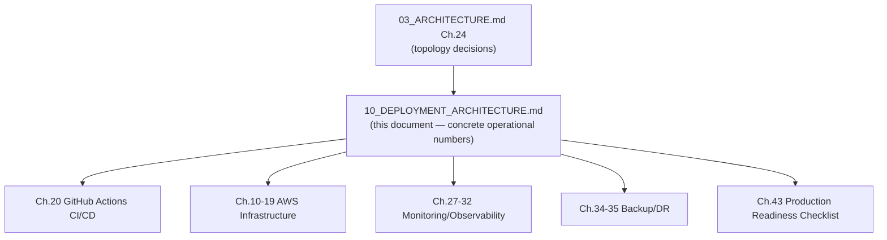

### 1.5 Best Practices

- Treat every numeric value in this handbook as a starting hypothesis validated against real production data, per DP4 — revisit rather than defend.

### 1.6 Common Mistakes

| Mistake | Principle violated |
|---|---|
| A "quick hotfix" deploy workflow that skips staging (explicitly named as a common mistake in `04_FOLDER_STRUCTURE.md` Ch.17.11). | DP1 |
| A manual AWS console change made "just this once" during an incident, never reflected in code. | DP2 |
| Setting an alert threshold from a guess instead of observed baseline data. | DP4 |

### 1.7 Checklist

- [ ] I can name which principle (DP1–DP8) justifies this deployment decision.
- [ ] Nothing here assumes staging is optional for any change.

### 1.8 Future Considerations

As the platform scales, DP7's cost-optimization posture will need more formal FinOps tooling (Ch.41) — not yet required at current scale.

### 1.9 AI Assistant Guidance

Check every generated infrastructure/pipeline change against DP1–DP8. Never propose a deployment path that bypasses staging.

### 1.10 Related Documents

`03_ARCHITECTURE.md` Ch.24, `09_SECURITY_GUIDELINES.md` Ch.28–29.

---

## Chapter 2 — Environment Strategy

### 2.1 Purpose

Restates `03_ARCHITECTURE.md` Ch.24.5's environment separation as the binding baseline for Chapters 3–7's per-environment detail.

### 2.2 Rules

| Rule ID | Rule | Severity | Enforcement |
|---|---|---|---|
| ENV-001 | Four distinct environments exist: Local, Development (shared, ephemeral), Staging, Production — each fully isolated (own AWS account or, at minimum, own VPC/RDS/Redis/S3, per `09_SECURITY_GUIDELINES.md` AWSSEC-003). | 🔴 Critical | Architecture Review |
| ENV-002 | Staging never contains real tenant data — only structurally realistic synthetic multi-tenant data, purpose-built to exercise `03_ARCHITECTURE.md` Ch.4's isolation guarantees (restated from Ch.24.5). | 🔴 Critical | DevOps Review |
| ENV-003 | Synthetic staging data is a maintained artifact (a seed/generation pipeline), refreshed on a defined cadence — never allowed to degrade into trivial single-tenant fixtures over time (restated from Ch.24.10). | 🟠 High | DevOps Review |
| ENV-004 | Production credentials, secrets, and real tenant data never exist in any lower-trust environment (restated from Ch.24.11). | 🔴 Critical | Architecture Review |
| ENV-005 | Every environment is provisioned from the same Infrastructure-as-Code definitions (Ch.3), differing only in parameterized configuration (instance sizes, replica counts) — never a hand-built snowflake environment. | 🟠 High | DevOps Review |

### 2.3 Decision Matrix — Environment Comparison

| Environment | Tenant Data | Uptime Target | Deploy Trigger | Access |
|---|---|---|---|---|
| Local | None (per-developer, Ch.3) | N/A | Manual | Individual developer |
| Development | None (shared, ephemeral) | Best-effort | Every merge to `develop` | Engineering team |
| Staging | Synthetic, multi-tenant, realistic | High (mirrors production behavior) | Every merge to `main` | Engineering + QA |
| Production | Real | 99.9% target (Ch.32) | Manual promotion from Staging (Ch.22) | Restricted, audited |

### 2.4 Diagram — Environment Promotion Flow

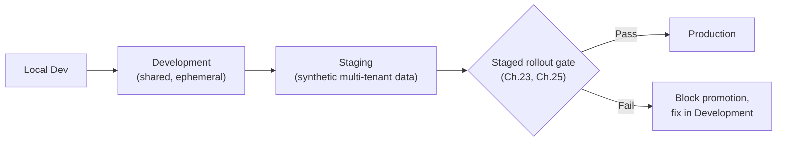

### 2.5 Examples

**Good:** Staging's seed pipeline generates 20+ synthetic tenants with overlapping data shapes specifically designed to catch a missing `tenant_id` filter.
**Bad:** Staging seeded once at project launch with two tenants and never refreshed — three years later it no longer resembles production's actual data shape or scale.

### 2.6 Best Practices

- Version the staging seed/generation pipeline in source control, reviewed like any other code (DP2).

### 2.7 Common Mistakes

| Mistake | Fix |
|---|---|
| Copying real production data into staging "temporarily" for debugging. | Never — always synthetic (ENV-002); debug against a targeted, anonymized reproduction instead. |
| A hand-configured staging environment that's drifted from production's actual instance types/configuration. | Provision from the same IaC definitions, parameterized (ENV-005). |

### 2.8 Checklist

- [ ] Four environments exist, fully isolated.
- [ ] Staging data is synthetic, multi-tenant, and actively maintained.
- [ ] No production secret/data ever exists in a lower environment.
- [ ] All environments provisioned from shared IaC.

### 2.9 Future Considerations

A dedicated QA environment (mentioned in the original objectives list) may be merged into Staging or kept distinct depending on team size — currently treated as the same environment; revisit if QA needs diverge materially from staging's purpose (see Ch.5).

### 2.10 AI Assistant Guidance

Never propose copying real tenant data into a non-production environment. Always propose synthetic, multi-tenant-realistic data for staging.

### 2.11 Related Documents

`03_ARCHITECTURE.md` Ch.4, Ch.24.5; `09_SECURITY_GUIDELINES.md` AWSSEC-003.

---

## Chapter 3 — Local Development Environment

### 3.1 Purpose

Defines how an engineer runs LedgerOne on their own machine.

### 3.2 Rules

| Rule ID | Rule | Severity | Enforcement |
|---|---|---|---|
| LOCAL-001 | Local development uses `docker-compose.dev.yml` (per `04_FOLDER_STRUCTURE.md` Ch.17) providing MySQL, Redis, and a local S3-compatible store (e.g., MinIO) — no engineer points their local app at shared/staging AWS resources for routine development. | 🟠 High | Code Review |
| LOCAL-002 | A single bootstrap script (`scripts/setup/bootstrap-dev-environment.sh`, per `04_FOLDER_STRUCTURE.md`) brings a fresh clone to a runnable state — no undocumented manual setup steps. | 🟡 Medium | DevOps Review |
| LOCAL-003 | Local environment variables are seeded from `.env.example` (restated from `09_SECURITY_GUIDELINES.md` ENV-004) with safe local-only defaults — never a real secret. | 🔴 Critical | Code Review |
| LOCAL-004 | Local data is fully disposable — no engineer's local database is treated as a source of anything that must survive a `docker-compose down -v`. | 🟡 Medium | Code Review |

### 3.3 Examples

**Good:** A new engineer runs one bootstrap script, gets a working local stack (API, web, MySQL, Redis, MinIO) with seeded sample data in under 10 minutes.
**Bad:** A new engineer's onboarding requires manually creating an RDS instance or asking a teammate for staging credentials to develop locally.

### 3.4 Best Practices

- Keep `docker-compose.dev.yml` resource-light (small MySQL/Redis footprint) so it runs comfortably on a standard laptop.

### 3.5 Common Mistakes

| Mistake | Fix |
|---|---|
| Local development pointed at shared staging AWS resources. | Fully local, containerized stack (LOCAL-001). |
| A real API key placed in a developer's local `.env` and later accidentally committed. | Local-only, clearly fake defaults in `.env.example` (LOCAL-003). |

### 3.6 Checklist

- [ ] Fully local, containerized stack — no dependency on shared AWS resources.
- [ ] One bootstrap script gets a new clone running.
- [ ] No real secrets ever used locally.

### 3.7 Future Considerations

None — stable.

### 3.8 AI Assistant Guidance

Always assume local development runs against `docker-compose.dev.yml`'s local services, never real AWS resources.

### 3.9 Related Documents

`04_FOLDER_STRUCTURE.md` Ch.17, Ch.13 (Environment Variables) of `09_SECURITY_GUIDELINES.md`.

---

## Chapter 4 — Development Environment

### 4.1 Purpose

Defines the shared, ephemeral Development environment used for integration testing before Staging.

### 4.2 Rules

| Rule ID | Rule | Severity | Enforcement |
|---|---|---|---|
| DEVENV-001 | Development deploys automatically on every merge to the `develop` branch — no manual promotion step, since this environment carries no uptime guarantee. | 🟡 Medium | CI/CD Pipeline |
| DEVENV-002 | Development uses minimally-sized AWS resources (smallest reasonable ECS task count/RDS instance class) — cost-optimized (DP7), since it isn't customer- or QA-facing. | ⚪ Low | DevOps Review |
| DEVENV-003 | Development data is synthetic and disposable — reset/reseeded periodically, no expectation of continuity. | 🟡 Medium | DevOps Review |

### 4.3 Examples

**Good:** Development is torn down and reseeded weekly on a schedule, keeping it lightweight and preventing accumulated cruft.

### 4.4 Best Practices

- Use Development as the first automated-integration-test target so failures surface before a change even reaches Staging.

### 4.5 Common Mistakes

| Mistake | Fix |
|---|---|
| Treating Development as if it needs production-grade uptime. | It doesn't — cost-optimize freely (DEVENV-002). |

### 4.6 Checklist

- [ ] Auto-deploys on merge to `develop`.
- [ ] Minimally sized, cost-optimized.
- [ ] Data is disposable and periodically reset.

### 4.7 Future Considerations

None — stable.

### 4.8 AI Assistant Guidance

Never propose production-grade resource sizing for the Development environment.

### 4.9 Related Documents

Ch.2 (Environment Strategy), Ch.20 (GitHub Actions CI/CD).

---

## Chapter 5 — QA Environment

### 5.1 Purpose

Clarifies QA's relationship to Staging (flagged in Ch.2.9 as an open question — resolved here).

### 5.2 Rules

| Rule ID | Rule | Severity | Enforcement |
|---|---|---|---|
| QA-001 | QA activity (manual exploratory testing, UAT) runs against the Staging environment — a dedicated separate QA environment is not provisioned unless QA's needs genuinely diverge from Staging's purpose (e.g., needing to hold state across a longer manual test cycle than Staging's refresh cadence allows). | 🟡 Medium | Architecture Review |
| QA-002 | If a dedicated QA environment is later provisioned, it follows every rule in Chapter 2 (isolated, synthetic multi-tenant data, IaC-provisioned) identically to Staging. | 🟠 High | Architecture Review |

### 5.3 Best Practices

- Coordinate QA test cycles with Staging's data-refresh cadence (Ch.2.3) so a long-running manual test isn't disrupted by a routine reseed.

### 5.4 Common Mistakes

| Mistake | Fix |
|---|---|
| QA testing against Production "just to be sure it's realistic." | Never — Staging only (QA-001), consistent with ENV-004. |

### 5.5 Checklist

- [ ] QA activity scoped to Staging unless a dedicated environment is explicitly justified.

### 5.6 Future Considerations

Revisit if QA cycle length and Staging's refresh cadence genuinely conflict at scale.

### 5.7 AI Assistant Guidance

Default to treating QA and Staging as the same environment unless told otherwise.

### 5.8 Related Documents

Ch.2 (Environment Strategy), Ch.6 (Staging Environment).

---

## Chapter 6 — Staging Environment

### 6.1 Purpose

Defines Staging's concrete configuration as the pre-production gate.

### 6.2 Rules

| Rule ID | Rule | Severity | Enforcement |
|---|---|---|---|
| STAGE-001 | Staging deploys automatically on every merge to `main`, and every Production deploy is a manual promotion of a Staging build that has already run there successfully — Production never deploys from a commit that hasn't first run in Staging. | 🔴 Critical | CI/CD Pipeline |
| STAGE-002 | Staging is sized at a meaningful fraction of Production (e.g., same instance types, reduced replica count) so performance-budget regression tests (Ch.21 of `03_ARCHITECTURE.md`) are representative, not run against an underpowered environment that would mask real regressions. | 🟠 High | DevOps Review |
| STAGE-003 | Staging's synthetic data set includes at least 20 distinct tenants with overlapping/adjacent data shapes, specifically designed to exercise tenant-isolation logic (restated/quantified from `03_ARCHITECTURE.md` Ch.24.5's qualitative requirement). | 🟠 High | DevOps Review |
| STAGE-004 | Staging refreshes its synthetic data set on a defined cadence (weekly, or before any major test cycle) via the versioned seed pipeline (Ch.2.6). | 🟡 Medium | DevOps Review |

### 6.3 Examples

**Good:** Staging's 20-tenant synthetic dataset includes two tenants with near-identical Chart of Accounts structures, deliberately probing whether a missing `tenant_id` filter would leak data between them.

### 6.4 Best Practices

- Run the same performance-budget regression suite (`03_ARCHITECTURE.md` Decision 21.6.1) against Staging as part of every deploy, not just in isolated load-testing sessions.

### 6.5 Common Mistakes

| Mistake | Fix |
|---|---|
| Staging sized so small that performance regressions are invisible until Production. | Meaningful fractional sizing (STAGE-002). |
| Deploying directly to Production from a commit never run in Staging. | Never — always promote a Staging-validated build (STAGE-001). |

### 6.6 Checklist

- [ ] Auto-deploys from `main`; Production only promotes from a validated Staging build.
- [ ] Sized to make performance regressions visible.
- [ ] ≥20 synthetic tenants, refreshed on a defined cadence.

### 6.7 Future Considerations

The 20-tenant baseline (STAGE-003) is a starting number — increase if real production tenant-isolation bugs are found that a larger synthetic set would have caught.

### 6.8 AI Assistant Guidance

Always assume a Production deploy requires a prior successful Staging run of the same build — never propose deploying directly to Production.

### 6.9 Related Documents

`03_ARCHITECTURE.md` Ch.24.5, Ch.21 (Decision 21.6.1), Ch.25 (Zero Downtime Deployment).

---

## Chapter 7 — Production Environment

### 7.1 Purpose

Defines Production's concrete operational posture.

### 7.2 Rules

| Rule ID | Rule | Severity | Enforcement |
|---|---|---|---|
| PROD-001 | Production runs in its own AWS account, isolated from Development/Staging (restated from `09_SECURITY_GUIDELINES.md` AWSSEC-003). | 🔴 Critical | Architecture Review |
| PROD-002 | Production has an availability target of **99.9% monthly uptime** (≈43 minutes of allowed downtime/month) — this handbook's concrete answer to `03_ARCHITECTURE.md` Ch.23's qualitative reliability goals, revisited once real incident data accumulates. | 🟠 High | Architecture Review |
| PROD-003 | Production deploys only via the staged-rollout pipeline (Ch.20, Ch.25) — no direct console changes, no manual `docker run`, no exception for urgency (restated from Decision 24.6.1). | 🔴 Critical | CI/CD Pipeline |
| PROD-004 | Production access (SSH/exec into containers, direct DB access) is restricted to a small, named set of Platform Operators, MFA-required, and every access is logged (restated from `09_SECURITY_GUIDELINES.md` Ch.28). | 🔴 Critical | Ops/infra review |
| PROD-005 | Production runs a minimum of 2 replicas per service at all times (no single point of failure from one task crashing), across at least 2 Availability Zones. | 🔴 Critical | Architecture Review |

### 7.3 Examples

**Good:** An engineer investigating a Production issue uses a break-glass, logged, MFA-gated access path — never a standing SSH key.

### 7.4 Best Practices

- Track actual monthly uptime against PROD-002's 99.9% target and treat a miss as an input to the post-incident review (`09_SECURITY_GUIDELINES.md` Ch.33), not just a number to note.

### 7.5 Common Mistakes

| Mistake | Fix |
|---|---|
| A single-replica service in Production "because it's rarely under load." | Minimum 2 replicas, multi-AZ (PROD-005) — availability, not just load, is the reason. |
| A direct `docker exec` into a Production container to "quickly check something." | Use the logged, restricted break-glass path (PROD-004). |

### 7.6 Checklist

- [ ] Own AWS account, isolated.
- [ ] 99.9% uptime target tracked.
- [ ] All deploys via the staged pipeline, no exceptions.
- [ ] Access restricted, MFA-gated, logged.
- [ ] Minimum 2 replicas, multi-AZ.

### 7.7 Future Considerations

PROD-002's 99.9% target should be revisited (up or down) once a year of real incident/uptime data exists.

### 7.8 AI Assistant Guidance

Never propose a single-replica Production service. Never propose a Production deployment path other than the staged pipeline.

### 7.9 Related Documents

`03_ARCHITECTURE.md` Ch.23, Ch.24; `09_SECURITY_GUIDELINES.md` Ch.28, AWSSEC-003.

---

## Chapter 8 — Docker Standards

### 8.1 Purpose

Restates `09_SECURITY_GUIDELINES.md` Ch.29's container rules as the binding deployment-layer standard, adding build-structure conventions.

### 8.2 Rules

| Rule ID | Rule | Severity | Enforcement |
|---|---|---|---|
| DOCK-001 | Multi-stage builds separate build-time dependencies (compilers, dev dependencies) from the final production image — the final stage contains only production `node_modules` and compiled output. | 🟠 High | CI Pipeline |
| DOCK-002 | Base images are pinned to a specific digest, not a mutable tag like `:latest` (restated from `09_SECURITY_GUIDELINES.md` INFRA-001). | 🟠 High | CI Pipeline |
| DOCK-003 | The final image runs as a non-root user (restated from INFRA-002). | 🟠 High | CI Pipeline |
| DOCK-004 | One Dockerfile per deployable app (`docker/api.Dockerfile`, `docker/web.Dockerfile`, per `04_FOLDER_STRUCTURE.md` Ch.17) — never a single monolithic image serving multiple purposes. | 🟡 Medium | Code Review |
| DOCK-005 | Images are scanned for vulnerabilities (Ch.30's dependency scanning extended to the OS-layer/base-image level) as part of the build pipeline — a critical finding blocks promotion to Staging. | 🟠 High | CI Pipeline |

### 8.3 Examples

**Good:** `docker/api.Dockerfile`'s final stage is `FROM node:22-slim@sha256:...` running `USER node`, containing only `dist/` and production dependencies.

### 8.4 Best Practices

- Cache Docker layers effectively in CI (dependency install layer separate from source-copy layer) to keep build times fast without sacrificing DOCK-001/002.

### 8.5 Common Mistakes

| Mistake | Fix |
|---|---|
| A single image bundling both `apps/api` and `apps/web`. | Separate Dockerfiles per app (DOCK-004). |
| Dev dependencies (TypeScript compiler, test frameworks) present in the final production image. | Multi-stage build strips them (DOCK-001). |

### 8.6 Checklist

- [ ] Multi-stage build, dev dependencies excluded from final image.
- [ ] Base image pinned by digest.
- [ ] Non-root final user.
- [ ] Image scanned before promotion.

### 8.7 Future Considerations

None beyond `09_SECURITY_GUIDELINES.md` Ch.29/30's evolution.

### 8.8 AI Assistant Guidance

Always generate multi-stage Dockerfiles with a pinned digest and non-root final user. Never generate a single Dockerfile serving multiple deployable apps.

### 8.9 Related Documents

`09_SECURITY_GUIDELINES.md` Ch.29, `04_FOLDER_STRUCTURE.md` Ch.17.

---

## Chapter 9 — Container Strategy

### 9.1 Purpose

Defines how containers map to ECS services and tasks.

### 9.2 Rules

| Rule ID | Rule | Severity | Enforcement |
|---|---|---|---|
| CONT-001 | The backend Modular Monolith (`03_ARCHITECTURE.md` Ch.3.3.1) runs as **one ECS service** (`api`), horizontally replicated — not split into per-module containers, consistent with the Modular Monolith decision. | 🔴 Critical | Architecture Review |
| CONT-002 | Background workers (BullMQ consumers, Ch.18–19) run as a **separate ECS service** (`worker`) from the request-handling `api` service, scaled independently per queue depth (restated from `03_ARCHITECTURE.md` Ch.21.4). | 🟠 High | Architecture Review |
| CONT-003 | The frontend (`web`) runs as its own ECS service (or is served statically via CloudFront/S3 for fully static output where applicable) — never bundled into the same container as the API. | 🟡 Medium | Architecture Review |
| CONT-004 | Every container defines explicit CPU/memory resource limits — no container runs unbounded, which would let one noisy task starve others on the same ECS cluster. | 🟠 High | DevOps Review |
| CONT-005 | Container health is reported via a dedicated health-check endpoint (Ch.30), not inferred from process liveness alone. | 🟠 High | Code Review |

### 9.3 Diagram — Service Map

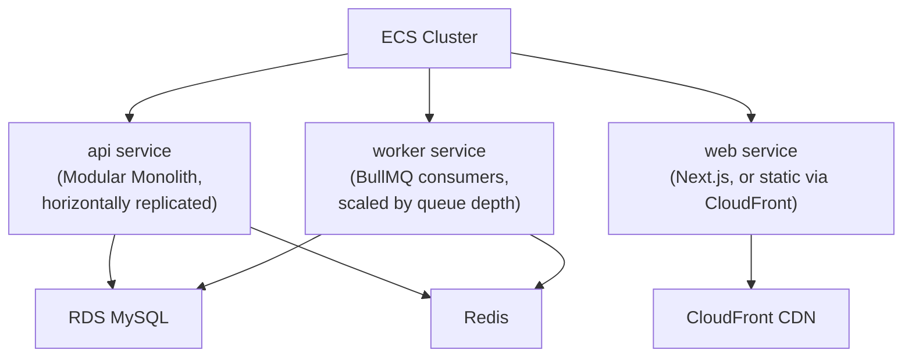

### 9.4 Examples

**Good:** `worker` service scales from 2 to 10 tasks based on BullMQ queue depth, entirely independent of `api`'s replica count, which scales on request-based metrics.

### 9.5 Best Practices

- Keep each ECS service's task definition minimal and single-purpose — resist the temptation to combine `api` and `worker` "to save resources," which would defeat CONT-002's independent-scaling goal.

### 9.6 Common Mistakes

| Mistake | Fix |
|---|---|
| Combining `api` and `worker` into one service. | Keep them separate for independent scaling (CONT-002). |
| A container with no CPU/memory limit set. | Always set explicit limits (CONT-004). |

### 9.7 Checklist

- [ ] `api`, `worker`, and `web` are separate ECS services.
- [ ] Each has explicit resource limits.
- [ ] Each reports health via a dedicated endpoint.

### 9.8 Future Considerations

If a specific module's resource consumption disproportionately drives `api` service scaling (the extraction trigger named in `03_ARCHITECTURE.md` Ch.21.4/Ch.27), that module becomes a candidate for its own ECS service at that point — not provisioned speculatively now.

### 9.9 AI Assistant Guidance

Always propose separate ECS services for `api`, `worker`, and `web`. Never propose combining request-handling and background-worker processes into one service.

### 9.10 Related Documents

`03_ARCHITECTURE.md` Ch.3.3.1, Ch.21.4, Ch.27; Ch.18–19 of this document (Background Workers, BullMQ Deployment).

---

## Chapter 10 — AWS Architecture

### 10.1 Purpose

Provides the top-level AWS account/service map every later infrastructure chapter details further.

### 10.2 Rules

| Rule ID | Rule | Severity | Enforcement |
|---|---|---|---|
| AWS-001 | Separate AWS accounts for Development+Staging (may share one non-production account) and Production (its own account), managed under AWS Organizations (restated/extended from `09_SECURITY_GUIDELINES.md` AWSSEC-003). | 🔴 Critical | Architecture Review |
| AWS-002 | Infrastructure is defined as code using **AWS CDK (TypeScript)** — chosen over Terraform/CloudFormation-YAML for consistency with the platform's all-TypeScript stack, letting infrastructure definitions share tooling/review conventions with application code. This is a new decision originated by this handbook (no prior document specified an IaC tool) and should be ratified via an ADR per `03_ARCHITECTURE.md` Ch.28's mechanism. | 🟠 High | Architecture Review |
| AWS-003 | Every AWS resource is tagged with `environment`, `service`, and `managed-by: cdk` at minimum, enabling cost allocation (Ch.41) and drift detection. | 🟡 Medium | DevOps Review |
| AWS-004 | AWS ECR (Elastic Container Registry) hosts Docker images, one repository per deployable app (`api`, `web`, `worker`) — a reasonable, AWS-native addition to `02_TECH_STACK.md`'s infrastructure list, which named ECS/RDS/CloudFront/ALB/S3/CloudWatch but did not explicitly list a registry. | 🟡 Medium | DevOps Review |

### 10.3 Diagram — AWS Account Topology

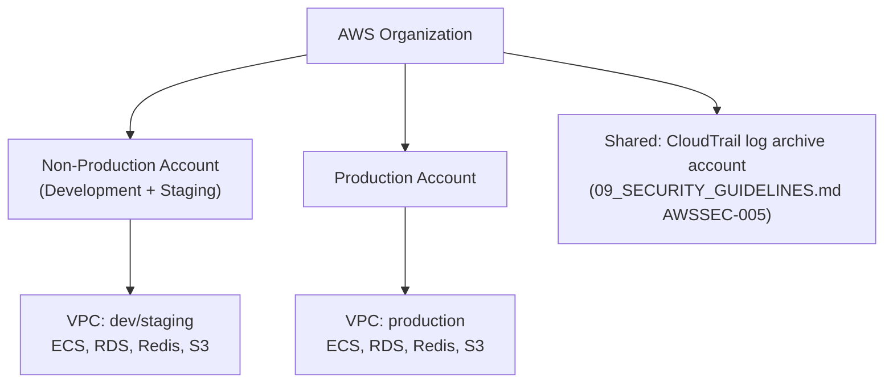

### 10.4 Standards & Rationale

AWS-002's CDK choice is flagged explicitly as new territory (confirmed in research: no IaC tool is named anywhere in prior documents) — it's the most consistent choice given the platform's TypeScript-everywhere convention (`05_CODING_STANDARDS.md`), letting the same engineers who write application code read and review infrastructure code without context-switching to HCL or YAML.

### 10.5 Examples

**Good:** A new SQS-adjacent resource (if ever needed) is added as a CDK construct, reviewed via the same PR process as application code, deployed through the same CI/CD pipeline (Ch.20).

### 10.6 Best Practices

- Keep CDK stacks organized per logical boundary (networking, data layer, compute, CDN) rather than one monolithic stack, so a change to one layer doesn't require redeploying everything.

### 10.7 Common Mistakes

| Mistake | Fix |
|---|---|
| A manually-created AWS resource with no corresponding CDK construct. | Every resource must be defined in code (DP2, AWS-002). |
| Untagged resources making cost allocation impossible. | Tag everything per AWS-003. |

### 10.8 Checklist

- [ ] Separate accounts for Production vs. non-production.
- [ ] All infrastructure defined via CDK, no manual console resources.
- [ ] Resources tagged consistently.
- [ ] ECR repositories exist per deployable app.

### 10.9 Future Considerations

AWS-002's CDK decision should be formally ratified as an ADR in `03_ARCHITECTURE.md` Ch.28, since it's a genuinely new architectural decision this handbook originated, not merely restated.

### 10.10 AI Assistant Guidance

Always assume AWS CDK (TypeScript) as the IaC tool when generating infrastructure-related guidance. Never propose a manual console change as a substitute for a CDK construct.

### 10.11 Related Documents

`02_TECH_STACK.md`, `03_ARCHITECTURE.md` Ch.24, Ch.28 (ADR mechanism), `09_SECURITY_GUIDELINES.md` Ch.28.

---

## Chapter 11 — VPC Design

### 11.1 Purpose

Defines network topology and segmentation.

### 11.2 Rules

| Rule ID | Rule | Severity | Enforcement |
|---|---|---|---|
| VPC-001 | Each environment's VPC has public subnets (ALB, NAT Gateway only) and private subnets (ECS tasks, RDS, Redis) — no data-tier resource is ever placed in a public subnet. | 🔴 Critical | Architecture Review |
| VPC-002 | Subnets span at least 2 Availability Zones for high availability (restated from PROD-005). | 🔴 Critical | Architecture Review |
| VPC-003 | Security groups follow least-access (restated from `09_SECURITY_GUIDELINES.md` AWSSEC-004) — RDS/Redis security groups permit inbound only from the specific ECS task security group, never a CIDR range. | 🔴 Critical | Ops/infra review |
| VPC-004 | Outbound internet access from private subnets routes through a NAT Gateway, enabling the SSRF-prevention egress-path control named in `09_SECURITY_GUIDELINES.md` SSRF-003. | 🟠 High | Architecture Review |

### 11.3 Diagram — VPC Layout

```mermaid
flowchart TD
    subgraph VPC
        subgraph Public Subnets (2+ AZ)
            ALB["Application Load Balancer"]
            NAT["NAT Gateway"]
        end
        subgraph Private Subnets (2+ AZ)
            ECS["ECS Tasks (api, worker, web)"]
            RDS["RDS MySQL"]
            Redis["ElastiCache Redis"]
        end
    end
    Internet["Internet"] --> ALB
    ALB --> ECS
    ECS --> RDS
    ECS --> Redis
    ECS --> NAT --> Internet
```

### 11.4 Examples

**Good:** RDS's security group allows inbound MySQL (3306) only from the `api-task-sg` and `worker-task-sg` security group IDs.

### 11.5 Best Practices

- Use VPC Flow Logs (shipped to the CloudTrail log archive account per `09_SECURITY_GUIDELINES.md` AWSSEC-005) for network-level forensic visibility.

### 11.6 Common Mistakes

| Mistake | Fix |
|---|---|
| RDS placed in a public subnet "temporarily." | Never — private subnet only (VPC-001). |
| A security group rule allowing `0.0.0.0/0` on the database port. | Least-access, security-group-to-security-group only (VPC-003). |

### 11.7 Checklist

- [ ] Public/private subnet separation, data tier always private.
- [ ] Multi-AZ subnets.
- [ ] Security groups least-access, no CIDR-based data-tier rules.
- [ ] Outbound egress routes through NAT Gateway.

### 11.8 Future Considerations

If a future integration requires a dedicated, more restrictive egress path (per `09_SECURITY_GUIDELINES.md` SSRF-003's proxy recommendation), evaluate a forward-proxy layer in addition to the NAT Gateway.

### 11.9 AI Assistant Guidance

Never generate a network configuration placing a data-tier resource in a public subnet or allowing `0.0.0.0/0` inbound to it.

### 11.10 Related Documents

`09_SECURITY_GUIDELINES.md` Ch.20 (SSRF), AWSSEC-004.

---

## Chapter 12 — ECS Cluster Standards

### 12.1 Purpose

Defines ECS cluster and task-definition conventions.

### 12.2 Rules

| Rule ID | Rule | Severity | Enforcement |
|---|---|---|---|
| ECS-001 | ECS uses **Fargate** (serverless compute) rather than EC2-backed clusters — removes host-patching/OS-management burden, consistent with a small platform team's operational capacity. | 🟠 High | Architecture Review |
| ECS-002 | Each service's task definition specifies explicit CPU/memory (restated from CONT-004) sized from observed usage (Ch.31 metrics), not a round-number guess. | 🟡 Medium | DevOps Review |
| ECS-003 | Task IAM roles are scoped per-service, least privilege (restated from `09_SECURITY_GUIDELINES.md` INFRA-003). | 🔴 Critical | Ops/infra review |
| ECS-004 | Every service has a minimum of 2 tasks in Production (restated from PROD-005), spread across Availability Zones via ECS's built-in AZ-balancing. | 🔴 Critical | Architecture Review |

### 12.3 Best Practices

- Start with a conservative CPU/memory allocation and adjust based on CloudWatch Container Insights data rather than over-provisioning speculatively (DP4, DP7).

### 12.4 Common Mistakes

| Mistake | Fix |
|---|---|
| One shared IAM role used by both `api` and `worker` tasks. | Per-service roles (ECS-003). |

### 12.5 Checklist

- [ ] Fargate launch type.
- [ ] Resource sizing based on observed data.
- [ ] Per-service IAM roles.
- [ ] Minimum 2 tasks per service in Production.

### 12.6 Future Considerations

Revisit Fargate vs. EC2-backed ECS if cost analysis (Ch.41) at scale favors reserved EC2 capacity — not currently warranted.

### 12.7 AI Assistant Guidance

Default to Fargate for ECS task definitions unless told otherwise.

### 12.8 Related Documents

Ch.9 (Container Strategy), Ch.33 (Auto Scaling).

---

## Chapter 13 — Application Load Balancer

### 13.1 Purpose

Defines ALB configuration standards.

### 13.2 Rules

| Rule ID | Rule | Severity | Enforcement |
|---|---|---|---|
| ALB-001 | The ALB terminates TLS (restated from `09_SECURITY_GUIDELINES.md` APISEC-001's TLS 1.2 minimum) and forwards plaintext HTTP internally only within the private subnet to ECS tasks. | 🔴 Critical | Architecture Review |
| ALB-002 | The ALB's health check targets the dedicated health-check endpoint (Ch.30), not `/` or an arbitrary route. | 🟠 High | DevOps Review |
| ALB-003 | Unhealthy-threshold: 3 consecutive failed health checks (30-second interval) mark a target unhealthy and remove it from rotation; healthy-threshold: 2 consecutive successes to rejoin. | 🟡 Medium | DevOps Review |
| ALB-004 | Access logs are enabled and shipped to S3/CloudWatch for request-level visibility (feeding Ch.27 monitoring). | 🟡 Medium | DevOps Review |

### 13.3 Standards & Rationale

ALB-003's numbers (3 failures/30s interval, 2 successes to recover) are this handbook's concrete answer to `03_ARCHITECTURE.md` Ch.23.5's health-check-triggered-replacement mechanism, which was left unspecified — a deliberately fast-but-not-flappy default, revisable per DP4 once real failure-pattern data exists.

### 13.4 Examples

**Good:** A task that starts failing its health check is pulled from rotation within 90 seconds (3 × 30s), before it can serve many failed requests.

### 13.5 Best Practices

- Keep the health-check endpoint (Ch.30) fast and cheap to compute — a slow health check delays detection of a real problem.

### 13.6 Common Mistakes

| Mistake | Fix |
|---|---|
| Health check pointed at a heavy endpoint (e.g., a full page render) that's slow even when healthy. | Point at the dedicated lightweight health endpoint (ALB-002). |

### 13.7 Checklist

- [ ] TLS terminated at ALB, internal traffic within the VPC only.
- [ ] Health check targets the dedicated endpoint.
- [ ] Thresholds set per ALB-003.
- [ ] Access logs enabled.

### 13.8 Future Considerations

Tune ALB-003's thresholds once real failure-pattern data from Production is available (DP4).

### 13.9 AI Assistant Guidance

Always point ALB health checks at the dedicated health endpoint, never a generic route.

### 13.10 Related Documents

Ch.30 (Health Checks), `09_SECURITY_GUIDELINES.md` APISEC-001.

---

## Chapter 14 — CloudFront Architecture

### 14.1 Purpose

Defines CDN configuration for the frontend, restating `03_ARCHITECTURE.md` Ch.24.3's topology choice.

### 14.2 Rules

| Rule ID | Rule | Severity | Enforcement |
|---|---|---|---|
| CF-001 | CloudFront serves static assets (JS/CSS/images) with long cache TTLs (immutable, content-hashed filenames) and server-rendered pages with short/no caching where dynamic per-tenant content is involved. | 🟠 High | DevOps Review |
| CF-002 | CloudFront enforces HTTPS-only (redirect HTTP → HTTPS), consistent with `09_SECURITY_GUIDELINES.md` APISEC-001. | 🔴 Critical | Architecture Review |
| CF-003 | The full secure-header set (`09_SECURITY_GUIDELINES.md` Ch.31) is applied at the CloudFront/origin layer, not left to the application alone, providing defense in depth. | 🟠 High | DevOps Review |
| CF-004 | CloudFront's origin (the `web` ECS service or S3 for static export) is not directly publicly reachable — only CloudFront can reach it, preventing CDN bypass. | 🟠 High | Architecture Review |

### 14.3 Examples

**Good:** A content-hashed JS bundle (`app.a1b2c3.js`) is cached at the edge for a year; a server-rendered dashboard page with tenant-specific data is cached for zero seconds or a very short, tenant-safe window.

### 14.4 Best Practices

- Use CloudFront's cache-key configuration carefully — never cache a response that varies by authenticated user/tenant without including that variance in the cache key, which would otherwise leak one tenant's cached page to another.

### 14.5 Common Mistakes

| Mistake | Fix |
|---|---|
| Caching a per-tenant dynamic page with a cache key that doesn't vary by tenant/session. | Exclude from caching or include tenant/session in the cache key (CF-001, tenant-isolation-critical). |
| The origin (ECS service) directly reachable, bypassing CloudFront. | Restrict origin access to CloudFront only (CF-004). |

### 14.6 Checklist

- [ ] Static assets long-cached, dynamic tenant content not cached unsafely.
- [ ] HTTPS-only enforced.
- [ ] Secure headers applied at the CDN layer.
- [ ] Origin not directly publicly reachable.

### 14.7 Future Considerations

None beyond `03_ARCHITECTURE.md` Ch.24's evolution.

### 14.8 AI Assistant Guidance

Never propose caching a per-tenant dynamic response without including tenant/session context in the cache key — a direct tenant-isolation risk if done wrong.

### 14.9 Related Documents

`03_ARCHITECTURE.md` Ch.24.3, `09_SECURITY_GUIDELINES.md` Ch.31, Ch.8 (Multi-Tenant Security).

---

## Chapter 15 — Amazon S3 Standards

### 15.1 Purpose

Supplies the concrete S3 lifecycle-policy numbers that research confirmed don't exist anywhere yet — this chapter is the first to define them, implementing `03_ARCHITECTURE.md` Ch.17.5's per-category retention model.

### 15.2 Rules

| Rule ID | Rule | Severity | Enforcement |
|---|---|---|---|
| S3-001 | Buckets are tenant-prefixed (restated from `07_REST_API_STANDARDS.md` UP-002) and encrypted at rest via KMS (restated from `09_SECURITY_GUIDELINES.md` ENC-002). | 🔴 Critical | Ops/infra review |
| S3-002 | Uploaded attachments transition to S3 Infrequent Access after 90 days of no access, and to Glacier after 1 year — implementing `03_ARCHITECTURE.md` Ch.17.5's category-based retention model with concrete numbers, distinct from the data's *deletion* eligibility (governed by `06_DATABASE_STANDARDS.md` Ch.14's retention/legal-hold rules, never by storage-class lifecycle alone). | 🟡 Medium | DevOps Review |
| S3-003 | Generated financial documents (statements, invoices PDFs) use a **separate, longer-retention storage-class lifecycle** than general attachments, per the open question flagged in `03_ARCHITECTURE.md` Ch.15.15 — resolved here: no automatic transition to Glacier for these documents within the statutory retention window, since restore-from-Glacier latency is incompatible with on-demand re-download of a financial statement a tenant might request at any time. | 🟠 High | DevOps Review |
| S3-004 | S3 lifecycle transitions never trigger deletion on their own — deletion eligibility is governed exclusively by `06_DATABASE_STANDARDS.md` Ch.14's retention/legal-hold process (restated to prevent a storage-class policy from accidentally becoming a de facto deletion policy). | 🔴 Critical | DevOps Review |
| S3-005 | Versioning is enabled on all buckets holding financial documents, providing an additional recovery layer against accidental overwrite. | 🟡 Medium | Ops/infra review |

### 15.3 Decision Matrix — Storage Class by Document Category

| Category | Standard | Transition to IA | Transition to Glacier | Deletion |
|---|---|---|---|---|
| General attachments (invoices' supporting docs, receipts) | Standard | 90 days no access | 1 year | Per `06_DATABASE_STANDARDS.md` Ch.14 retention/legal-hold process only |
| Generated financial statements/PDFs | Standard | Never (S3-003) | Never within retention window | Per Ch.14 retention/legal-hold process only |
| Temporary import/export files (Ch.21 of `07_REST_API_STANDARDS.md`) | Standard | N/A | N/A | Auto-deleted after 30 days (short-lived, non-financial-record data) |

### 15.4 Examples

**Good:** A tenant requests a 3-year-old financial statement PDF instantly, because S3-003 kept it in Standard/IA rather than Glacier.
**Bad:** A general attachment auto-transitioned to Glacier after 1 year is also auto-deleted by the same lifecycle rule, silently violating the statutory retention window `06_DATABASE_STANDARDS.md` DLC-002 requires — this is exactly what S3-004 exists to prevent.

### 15.5 Best Practices

- Keep S3 lifecycle rules and the database-driven retention/disposition process (`06_DATABASE_STANDARDS.md` Ch.14) as two independently reviewed configurations — a storage-class transition and a deletion decision must never be the same rule.

### 15.6 Common Mistakes

| Mistake | Fix |
|---|---|
| A single S3 lifecycle rule that both changes storage class and deletes after N days. | Split concerns — storage class transitions are cost-only; deletion is retention-policy-driven (S3-004). |

### 15.7 Checklist

- [ ] Buckets tenant-prefixed and KMS-encrypted.
- [ ] Lifecycle transitions match Section 15.3's category table.
- [ ] No lifecycle rule performs deletion directly.
- [ ] Versioning enabled on financial-document buckets.

### 15.8 Future Considerations

S3-002/003's day/year thresholds are this handbook's first concrete numbers for a previously open question (`03_ARCHITECTURE.md` Ch.15.15) — revisit based on actual access-pattern data once in production.

### 15.9 AI Assistant Guidance

Never generate an S3 lifecycle rule that combines storage-class transition with deletion. Always keep financial-document storage in immediately-retrievable classes.

### 15.10 Related Documents

`03_ARCHITECTURE.md` Ch.15, Ch.17.5; `06_DATABASE_STANDARDS.md` Ch.14; `07_REST_API_STANDARDS.md` Ch.19–21.

---

## Chapter 16 — Amazon RDS Standards

### 16.1 Purpose

Restates `06_DATABASE_STANDARDS.md` Ch.13's backup rules and adds concrete instance/HA configuration.

### 16.2 Rules

| Rule ID | Rule | Severity | Enforcement |
|---|---|---|---|
| RDS-001 | Production RDS runs Multi-AZ (synchronous standby replica in a second AZ, automatic failover) — restated as a concrete requirement of PROD-005's availability posture. | 🔴 Critical | Architecture Review |
| RDS-002 | Automated backups retained for **35 days** (RDS's maximum standard retention) with point-in-time recovery enabled — this handbook's concrete number for `06_DATABASE_STANDARDS.md` BAK-001's qualitative "maximum period justified by compliance requirements." | 🟠 High | Ops/infra review |
| RDS-003 | A read replica is provisioned once reporting/analytical query load (`06_DATABASE_STANDARDS.md` RPT-002) measurably contends with transactional write performance — not provisioned speculatively before that evidence exists (DP4). | 🟡 Medium | DevOps Review |
| RDS-004 | Instance sizing starts conservatively and scales vertically based on observed CPU/memory/connection metrics (Ch.31), reviewed quarterly. | 🟡 Medium | DevOps Review |
| RDS-005 | Storage auto-scaling is enabled with a defined maximum ceiling, preventing runaway, unbounded storage cost growth from an unexpected data-volume issue. | 🟡 Medium | DevOps Review |

### 16.3 Examples

**Good:** A Multi-AZ RDS instance fails over automatically to its standby within roughly 60-120 seconds during an AZ outage, with the application's connection pool retrying transparently.

### 16.4 Best Practices

- Monitor RDS connection count against the instance class's max-connections limit — a connection-pool misconfiguration exhausting connections is a common, avoidable outage cause.

### 16.5 Common Mistakes

| Mistake | Fix |
|---|---|
| Single-AZ RDS in Production "to save cost." | Multi-AZ is required for the availability target (RDS-001, PROD-002). |
| Provisioning a read replica before any evidence of read/write contention. | Wait for measured evidence (RDS-003, DP4). |

### 16.6 Checklist

- [ ] Multi-AZ enabled in Production.
- [ ] 35-day backup retention with PITR.
- [ ] Read replica provisioned only with measured justification.
- [ ] Storage auto-scaling with a defined ceiling.

### 16.7 Future Considerations

RDS-002's 35-day figure is RDS's platform maximum for automated backups; if compliance requirements (jurisdiction-dependent, per `06_DATABASE_STANDARDS.md` AUD-D-005) demand longer retention, that's satisfied via manual snapshots or exported backups beyond RDS's native window, not by this rule alone.

### 16.8 AI Assistant Guidance

Always assume Multi-AZ RDS for Production. Never propose a read replica without first citing measured read/write contention evidence.

### 16.9 Related Documents

`06_DATABASE_STANDARDS.md` Ch.13, RPT-002; Ch.34 (Disaster Recovery) of this document.

---

## Chapter 17 — Redis Deployment

### 17.1 Purpose

Implements `03_ARCHITECTURE.md` Decision 12.6.1's Redis dual-role separation, which that document explicitly left as an open evaluation pending this handbook's operational findings.

### 17.2 Rules

| Rule ID | Rule | Severity | Enforcement |
|---|---|---|---|
| REDIS-001 | Redis's caching role and session/token-storage role (`03_ARCHITECTURE.md` Ch.12.6) run as **logically separate namespaces on the same ElastiCache cluster initially**, not physically separate clusters — this handbook's resolution of Ch.12.6's open evaluation, chosen for operational simplicity at current scale, explicitly revisited if eviction-policy conflicts are observed in practice (per Ch.12.6's own stated concern). | 🟠 High | Architecture Review |
| REDIS-002 | The caching namespace uses an `allkeys-lru` eviction policy (safe — cache misses fall back to the primary datastore, per `03_ARCHITECTURE.md` Decision 12.7.2) with a defined max-memory ceiling. | 🟡 Medium | DevOps Review |
| REDIS-003 | The session/token namespace uses `noeviction` (never silently evict revocation-state data) combined with an explicit TTL matching the relevant token's lifetime (`09_SECURITY_GUIDELINES.md` AUTHN-002) — data expires on schedule, never evicted early under memory pressure. | 🔴 Critical | Architecture Review |
| REDIS-004 | ElastiCache runs in cluster mode with automatic failover (Multi-AZ) in Production, mirroring RDS-001's rationale. | 🟠 High | Architecture Review |
| REDIS-005 | If REDIS-001's shared-cluster approach shows eviction-policy contention in production monitoring (Ch.31), the session/token role is split onto its own physically separate ElastiCache cluster — a defined trigger condition, not left ambiguous. | 🟡 Medium | Architecture Review |

### 17.3 Diagram — Redis Topology Decision

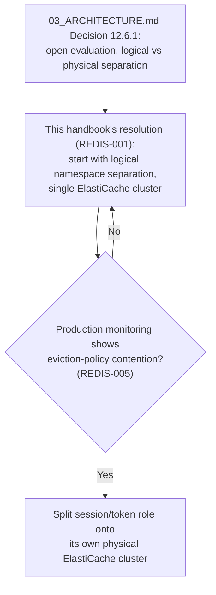

### 17.4 Standards & Rationale

This chapter is where `03_ARCHITECTURE.md` Ch.12.6's explicitly-open question gets its first concrete answer, per that chapter's own framing ("depending on Chapter 24's operational findings"). Starting with logical separation (namespace prefixing + distinct eviction policy per namespace) is the DP4-consistent choice: it's the cheaper starting point, with REDIS-005 naming the exact evidence (observed eviction contention) that would trigger the more expensive physical split — rather than provisioning two clusters speculatively before any evidence exists.

### 17.5 Examples

**Good:** Cache keys are prefixed `cache:{tenantId}:...` and session keys `session:{jti}:...`, with distinct eviction policies applied per key pattern via Redis ACLs or separate logical databases within the same cluster.

### 17.6 Best Practices

- Monitor Redis memory pressure and eviction events per namespace (Ch.31) specifically so REDIS-005's trigger condition is actually observable, not just theoretically defined.

### 17.7 Common Mistakes

| Mistake | Fix |
|---|---|
| A single `allkeys-lru` policy applied cluster-wide, risking eviction of session/revocation data under memory pressure. | Distinct eviction policy per namespace (REDIS-002/003). |
| Provisioning two separate ElastiCache clusters from day one with no observed need. | Start with logical separation; split only on evidence (REDIS-001/005). |

### 17.8 Checklist

- [ ] Namespace separation between caching and session/token roles.
- [ ] Correct eviction policy per namespace.
- [ ] Multi-AZ failover enabled in Production.
- [ ] Eviction-contention monitoring in place to evaluate the physical-split trigger.

### 17.9 Future Considerations

This chapter's REDIS-001 resolution should be reported back to `03_ARCHITECTURE.md` Ch.12.6 as the "operational finding" that chapter deferred to — closing the loop that document explicitly left open.

### 17.10 AI Assistant Guidance

Always propose namespace-based logical separation for Redis's caching vs. session roles as the starting point, with distinct eviction policies. Never propose `allkeys-lru` for session/token data.

### 17.11 Related Documents

`03_ARCHITECTURE.md` Ch.12.6, Decision 12.7.2; `09_SECURITY_GUIDELINES.md` Ch.7 (Session Management).

---

## Chapter 18 — Background Workers

### 18.1 Purpose

Defines the `worker` ECS service's operational conventions.

### 18.2 Rules

| Rule ID | Rule | Severity | Enforcement |
|---|---|---|---|
| WORK-001 | Workers are stateless with respect to any single job — a worker process crashing mid-job never loses the job itself (BullMQ's at-least-once delivery, Ch.19), only its current in-progress attempt, which is retried. | 🟠 High | Architecture Review |
| WORK-002 | Worker scaling is driven by queue depth (Ch.33), independent of `api` service's request-driven scaling (restated from CONT-002). | 🟠 High | DevOps Review |
| WORK-003 | Long-running jobs (imports/exports, `07_REST_API_STANDARDS.md` Ch.21) have an explicit timeout and are designed to checkpoint/resume rather than restart from scratch on a worker restart during a deploy. | 🟡 Medium | Code Review |
| WORK-004 | Worker deploys follow the same staged-rollout discipline as `api` (Ch.25) — in-flight jobs are allowed to drain before old worker tasks are terminated (graceful shutdown, not abrupt `SIGKILL`). | 🟠 High | CI/CD Pipeline |

### 18.3 Examples

**Good:** During a deploy, old worker tasks stop accepting new jobs but finish their current job before shutting down (graceful drain), while new-version workers pick up new jobs from the queue.

### 18.4 Best Practices

- Set BullMQ job timeouts conservatively longer than the expected worst-case duration, to avoid killing a legitimately slow-but-progressing job.

### 18.5 Common Mistakes

| Mistake | Fix |
|---|---|
| A worker deploy that abruptly kills in-flight jobs. | Graceful drain (WORK-004). |
| Worker scaling tied to the same metric as `api` (request count). | Queue-depth-driven (WORK-002). |

### 18.6 Checklist

- [ ] Workers scale independently on queue depth.
- [ ] Long-running jobs have explicit timeouts.
- [ ] Deploys drain in-flight jobs gracefully.

### 18.7 Future Considerations

None beyond Ch.19's BullMQ-specific evolution.

### 18.8 AI Assistant Guidance

Always design worker deploys to gracefully drain in-flight jobs, never abrupt termination.

### 18.9 Related Documents

Ch.9 (Container Strategy), Ch.19 (BullMQ Deployment), Ch.33 (Auto Scaling).

---

## Chapter 19 — BullMQ Deployment

### 19.1 Purpose

Defines BullMQ-specific operational conventions on top of Redis (Ch.17).

### 19.2 Rules

| Rule ID | Rule | Severity | Enforcement |
|---|---|---|---|
| BMQ-001 | BullMQ queues run on the **session/token Redis namespace's persistence tier**, not the volatile caching namespace — job data must survive a cache eviction event (extends REDIS-003's rationale to queue durability). | 🔴 Critical | Architecture Review |
| BMQ-002 | Every queue has a configured dead-letter/failed-job retention policy — failed jobs are retained for inspection (e.g., 7 days) rather than silently discarded, feeding `03_ARCHITECTURE.md` Ch.13.9's DLQ-depth monitoring. | 🟠 High | DevOps Review |
| BMQ-003 | Job retry policy uses exponential backoff with a maximum retry count — no job retries indefinitely, which would mask a permanently-failing job as "still processing." | 🟡 Medium | Code Review |
| BMQ-004 | Queue concurrency (jobs processed per worker) is tuned per queue type — a CPU-bound job (e.g., PDF generation) gets lower concurrency than an I/O-bound job (e.g., a webhook delivery), based on observed resource usage. | 🟡 Medium | Code Review |

### 19.3 Examples

**Good:** A failed import job is retained in the dead-letter set for 7 days, visible in a monitoring dashboard (Ch.27), with its failure reason inspectable before manual reprocessing or dismissal.

### 19.4 Best Practices

- Alert on dead-letter queue depth growth (`03_ARCHITECTURE.md` Decision 22.5.1's named signal) rather than only checking it manually.

### 19.5 Common Mistakes

| Mistake | Fix |
|---|---|
| Infinite job retries with no maximum count. | Bounded exponential backoff (BMQ-003). |
| Failed jobs immediately discarded with no inspection window. | Retain for a defined period (BMQ-002). |

### 19.6 Checklist

- [ ] Queue data on the durable Redis namespace, not the volatile cache namespace.
- [ ] Dead-letter retention policy configured.
- [ ] Bounded retry with exponential backoff.
- [ ] Concurrency tuned per queue type.

### 19.7 Future Considerations

None beyond Ch.17's Redis-topology evolution.

### 19.8 AI Assistant Guidance

Always configure a bounded retry policy with exponential backoff for BullMQ jobs. Always configure a dead-letter retention window rather than silent discard.

### 19.9 Related Documents

`03_ARCHITECTURE.md` Ch.13.9, Ch.17 (Redis Deployment), Ch.18 (Background Workers).

---

## Chapter 20 — GitHub Actions CI/CD

### 20.1 Purpose

Defines the pipeline structure, restating `04_FOLDER_STRUCTURE.md` Ch.17.4's stage order as the binding pipeline contract.

### 20.2 Rules

| Rule ID | Rule | Severity | Enforcement |
|---|---|---|---|
| CICD-001 | Every PR runs the full CI pipeline: lint → unit tests → integration tests → build (restated from `04_FOLDER_STRUCTURE.md` Ch.17.4). | 🔴 Critical | CI/CD Pipeline |
| CICD-002 | Merge to `main`/`develop` additionally runs: performance-budget regression (`03_ARCHITECTURE.md` Decision 21.6.1), dependency/SAST security scanning (`09_SECURITY_GUIDELINES.md` Ch.30, SSDLC-003), and Docker image build + scan (Ch.8 DOCK-005). | 🟠 High | CI/CD Pipeline |
| CICD-003 | Three distinct workflow files exist (per `04_FOLDER_STRUCTURE.md` Ch.17): `ci.yml` (every PR), `deploy-staging.yml` (auto, on merge to `main`), `deploy-production.yml` (manual-trigger promotion, staged rollout) — never a single monolithic workflow handling all cases. | 🟡 Medium | Code Review |
| CICD-004 | No workflow file bypasses any of these stages for any reason, including a "hotfix" label (restated from `04_FOLDER_STRUCTURE.md` Ch.17.11's named common mistake and Decision 24.6.1). | 🔴 Critical | CI/CD Pipeline |
| CICD-005 | Workflow files are reviewed with the same rigor as a security review gate (restated from `04_FOLDER_STRUCTURE.md` Ch.17.10) — a change to `deploy-production.yml` requires Architecture Review, not routine code review alone. | 🟠 High | Architecture Review |

### 20.3 Diagram — Full Pipeline

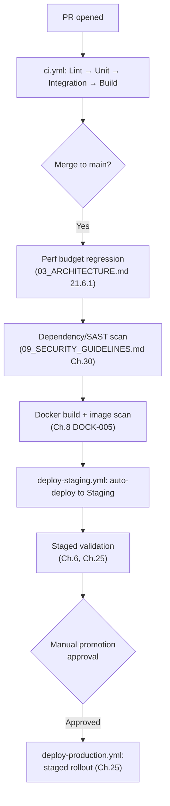

### 20.4 Best Practices

- Keep `ci.yml` fast (target under 10 minutes) so PR feedback stays tight; push heavier checks (perf regression, security scan) to the merge-triggered pipeline (CICD-002) where slightly longer runtime is acceptable.

### 20.5 Common Mistakes

| Mistake | Fix |
|---|---|
| A "hotfix" workflow variant that skips stages. | Never exists (CICD-004). |
| `deploy-production.yml` changed via routine code review with no Architecture Review. | Always requires Architecture Review (CICD-005). |

### 20.6 Checklist

- [ ] Three distinct workflow files exist per CICD-003.
- [ ] No workflow skips any pipeline stage.
- [ ] Production deploy workflow changes go through Architecture Review.

### 20.7 Future Considerations

None beyond `04_FOLDER_STRUCTURE.md` Ch.17's evolution.

### 20.8 AI Assistant Guidance

Never generate a CI/CD workflow variant that skips lint/test/security stages for any reason, including urgency. Always flag a `deploy-production.yml` change as requiring Architecture Review.

### 20.9 Related Documents

`04_FOLDER_STRUCTURE.md` Ch.17, `03_ARCHITECTURE.md` Decision 21.6.1/24.6.1, `09_SECURITY_GUIDELINES.md` Ch.30.

---

## Chapter 21 — Build Pipeline

### 21.1 Purpose

Defines the build stage's concrete outputs.

### 21.2 Rules

| Rule ID | Rule | Severity | Enforcement |
|---|---|---|---|
| BUILD-001 | The build stage produces immutable, uniquely-tagged artifacts (Docker images tagged with the Git commit SHA, never `latest`) — the same artifact promoted from Staging to Production, never rebuilt in between. | 🔴 Critical | CI/CD Pipeline |
| BUILD-002 | TypeScript compilation, linting (`05_CODING_STANDARDS.md`), and the module-boundary/layer-dependency checks (`04_FOLDER_STRUCTURE.md` Ch.17.5, `03_ARCHITECTURE.md` Ch.5.7.1/Ch.6.7) all run and must pass before an image is built. | 🟠 High | CI Pipeline |
| BUILD-003 | Build artifacts are pushed to ECR (Ch.10 AWS-004) with the commit SHA tag, and a separate `staging`/`production` mutable tag is moved to point at the validated SHA only after that environment's gate passes — the mutable tag is a pointer, never the deploy target directly. | 🟡 Medium | CI/CD Pipeline |

### 21.3 Standards & Rationale

BUILD-001's "same artifact promoted, never rebuilt" rule is what makes Staging validation actually meaningful — if Production were built fresh from the same source instead of promoting Staging's exact artifact, a non-deterministic build (a dependency resolving differently, a base-image digest drift) could introduce a difference between what was validated and what actually deploys.

### 21.4 Examples

**Good:** `api:a1b2c3d` (commit SHA) is built once, validated in Staging, then the exact same image is deployed to Production — never a `api:a1b2c3d-prod-rebuild`.

### 21.5 Best Practices

- Make builds reproducible (pinned dependency versions, pinned base image digest per DOCK-002) so rebuilding from the same commit would produce an identical artifact even if it were ever necessary.

### 21.6 Common Mistakes

| Mistake | Fix |
|---|---|
| Rebuilding the image for Production from the same source instead of promoting Staging's exact artifact. | Always promote the exact validated artifact (BUILD-001). |

### 21.7 Checklist

- [ ] Artifacts tagged immutably by commit SHA.
- [ ] Lint/type-check/boundary checks pass before image build.
- [ ] The exact Staging-validated artifact is promoted to Production, never rebuilt.

### 21.8 Future Considerations

None — stable.

### 21.9 AI Assistant Guidance

Always assume immutable, SHA-tagged build artifacts. Never propose rebuilding an image between Staging and Production.

### 21.10 Related Documents

`04_FOLDER_STRUCTURE.md` Ch.17, Ch.10 (AWS Architecture), Ch.22 (Release Pipeline).

---

## Chapter 22 — Release Pipeline

### 22.1 Purpose

Defines the promotion-to-Production process.

### 22.2 Rules

| Rule ID | Rule | Severity | Enforcement |
|---|---|---|---|
| REL-001 | Production promotion is a manual, explicit trigger (restated from STAGE-001) — no automatic Production deploy on every `main` merge, even though Staging deploys automatically. | 🔴 Critical | CI/CD Pipeline |
| REL-002 | A promotion requires the triggering artifact to have run successfully in Staging for a minimum bake time (e.g., 30 minutes of healthy operation, no elevated error rate) before it's eligible for promotion. | 🟡 Medium | CI/CD Pipeline |
| REL-003 | Every promotion is logged with who triggered it, when, and which artifact SHA — feeding both `09_SECURITY_GUIDELINES.md`'s audit requirements and post-incident review context. | 🟠 High | CI/CD Pipeline |
| REL-004 | A release note/changelog entry is required as part of the promotion request, summarizing what's changing — never a promotion with no human-readable description of its content. | 🟡 Medium | Code Review |

### 22.3 Diagram — Release Approval Flow

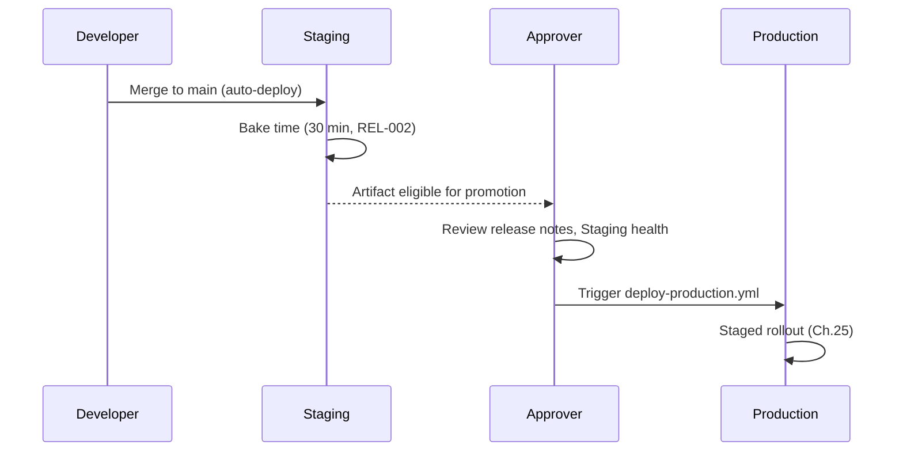

### 22.4 Best Practices

- Keep the promotion approval lightweight (a single button/command with visible Staging health data) so REL-001's manual gate doesn't become a bottleneck that tempts engineers toward CICD-004-violating shortcuts.

### 22.5 Common Mistakes

| Mistake | Fix |
|---|---|
| Promoting to Production immediately after Staging deploy with no bake time. | Wait the minimum bake time (REL-002), watching for elevated errors. |
| A promotion with no release note. | Always require one (REL-004). |

### 22.6 Checklist

- [ ] Promotion is manual and explicit.
- [ ] Minimum bake time observed before promotion.
- [ ] Promotion is logged with actor/timestamp/artifact.
- [ ] Release note provided.

### 22.7 Future Considerations

REL-002's 30-minute bake time is a starting number, adjustable once real Staging-vs-Production failure correlation data exists (DP4).

### 22.8 AI Assistant Guidance

Always assume Production promotion is a manual, logged, release-noted action — never automatic.

### 22.9 Related Documents

Ch.6 (Staging Environment), Ch.7 (Production Environment), Ch.25 (Zero Downtime Deployment).

---

## Chapter 23 — Blue-Green Deployment

### 23.1 Purpose

Defines the blue-green pattern as one of two supported deployment strategies (alongside rolling, Ch.24), per service type.

### 23.2 Rules

| Rule ID | Rule | Severity | Enforcement |
|---|---|---|---|
| BG-001 | Blue-green deployment (via ECS/CodeDeploy's native blue-green support, or an ALB target-group swap) is used for the `api` service, where an instant, fully-tested cutover with fast rollback is valuable given the financial-correctness stakes of the request-handling layer. | 🟠 High | Architecture Review |
| BG-002 | The "green" (new) environment receives a small percentage of traffic first (canary, Ch.25) before a full cutover — blue-green and canary are combined, not treated as mutually exclusive alternatives. | 🟠 High | CI/CD Pipeline |
| BG-003 | The "blue" (old) environment remains running, unterminated, for a defined post-cutover window (e.g., 1 hour) enabling instant rollback by simply routing traffic back — never torn down immediately after cutover. | 🟠 High | CI/CD Pipeline |

### 23.3 Diagram — Blue-Green with Canary

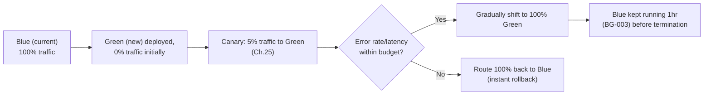

### 23.4 Examples

**Good:** A deploy that fails its canary window automatically routes 100% of traffic back to Blue within seconds — no Blue task was ever terminated, so rollback requires no rebuild.

### 23.5 Best Practices

- Keep Blue's task count unchanged during the canary window (don't scale it down prematurely) so a full-traffic rollback has immediate capacity.

### 23.6 Common Mistakes

| Mistake | Fix |
|---|---|
| Terminating Blue immediately upon Green's cutover. | Keep Blue running for the defined window (BG-003). |

### 23.7 Checklist

- [ ] Blue-green used for `api`.
- [ ] Canary percentage applied before full cutover.
- [ ] Blue retained for a defined rollback window.

### 23.8 Future Considerations

BG-003's 1-hour retention window is a starting value — extend if incidents are found to sometimes surface later than that window allows.

### 23.9 AI Assistant Guidance

Always combine blue-green with a canary percentage rather than an instant 100% cutover. Always keep the old environment running for a defined rollback window.

### 23.10 Related Documents

Ch.24 (Rolling Deployment), Ch.25 (Zero Downtime Deployment), Ch.26 (Rollback Strategy).

---

## Chapter 24 — Rolling Deployment

### 24.1 Purpose

Defines the rolling-update pattern for services where blue-green's resource duplication isn't justified.

### 24.2 Rules

| Rule ID | Rule | Severity | Enforcement |
|---|---|---|---|
| ROLL-001 | The `worker` service uses rolling deployment (replace tasks incrementally, respecting WORK-004's graceful-drain requirement) rather than blue-green, since workers have no "traffic" to cut over — only in-flight jobs to drain. | 🟠 High | Architecture Review |
| ROLL-002 | ECS's `minimumHealthyPercent`/`maximumPercent` deployment configuration ensures at least the minimum required replica count remains available throughout the rolling update (e.g., 100% minimum healthy, 200% maximum, allowing one extra task to start before an old one stops). | 🟠 High | DevOps Review |
| ROLL-003 | A rolling deployment halts automatically if the new tasks fail health checks (ALB-003's thresholds) beyond a defined count — never continuing to replace all tasks with a version already shown to be unhealthy. | 🔴 Critical | CI/CD Pipeline |

### 24.3 Examples

**Good:** `worker` service's rolling update starts one new-version task, waits for it to become healthy and pick up jobs successfully, then stops one old-version task — repeating until fully replaced.

### 24.4 Best Practices

- Use rolling deployment specifically where duplicate-environment cost (blue-green) isn't justified by a corresponding rollback-speed benefit.

### 24.5 Common Mistakes

| Mistake | Fix |
|---|---|
| A rolling deployment that replaces all tasks even after early replacements start failing health checks. | Automatic halt on failure (ROLL-003). |

### 24.6 Checklist

- [ ] `worker` uses rolling deployment.
- [ ] Minimum healthy percent maintained throughout.
- [ ] Deployment halts automatically on health-check failures.

### 24.7 Future Considerations

None — stable.

### 24.8 AI Assistant Guidance

Default to rolling deployment for background-worker services; reserve blue-green for the request-handling `api` service.

### 24.9 Related Documents

Ch.18 (Background Workers), Ch.23 (Blue-Green Deployment).

---

## Chapter 25 — Zero Downtime Deployment

### 25.1 Purpose

Consolidates Ch.23/24's mechanisms into the canary-percentage/bake-time specifics that `03_ARCHITECTURE.md` Ch.23.6.2/Decision 24.6.1 deliberately left unspecified.

### 25.2 Rules

| Rule ID | Rule | Severity | Enforcement |
|---|---|---|---|
| ZDT-001 | Canary traffic starts at **5%** for **10 minutes**, then **25%** for **10 minutes**, then **100%** — this handbook's concrete answer to the staged-rollout mechanism `03_ARCHITECTURE.md` named but didn't quantify. | 🟠 High | CI/CD Pipeline |
| ZDT-002 | Rollback triggers automatically if, during any canary stage, the error rate exceeds **2x the pre-deploy baseline** or p99 latency exceeds the relevant `03_ARCHITECTURE.md` Ch.21.3 budget category — no human intervention required to initiate rollback, only to investigate afterward. | 🔴 Critical | CI/CD Pipeline |
| ZDT-003 | Database migrations (`06_DATABASE_STANDARDS.md` Ch.11, `03_ARCHITECTURE.md` Ch.8.7) apply before any canary traffic begins, following the online-schema-change-safe pattern for large tables — the new code version must be compatible with both the pre- and post-migration schema during the canary window (backward-compatible migrations only during a rolling window). | 🔴 Critical | Code Review, CI/CD Pipeline |
| ZDT-004 | No connection-draining/in-flight-request loss occurs during cutover — ALB connection draining timeout is set long enough for the slowest expected request to complete (e.g., 60 seconds) before a terminating task is force-stopped. | 🟠 High | DevOps Review |

### 25.3 Diagram — Full Zero-Downtime Sequence

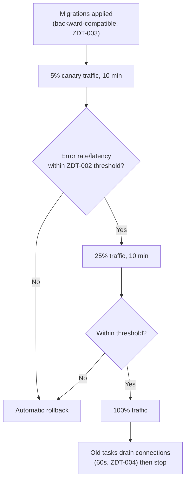

### 25.4 Standards & Rationale

ZDT-003's backward-compatibility requirement is the standard "expand/contract" migration pattern: a column is added before it's used, used by new code while old code ignores it, and only removed in a later, separate deploy once no canary/rolling window could still be running old code against it — directly extending `06_DATABASE_STANDARDS.md` Ch.11's online-schema-change-safe pattern to the deployment-cutover window specifically.

### 25.5 Examples

**Good:** A new required field is added as nullable first, backfilled, made `NOT NULL` only in a subsequent deploy — never in the same deploy that also starts requiring it in application code during a canary window where both versions briefly coexist.

### 25.6 Best Practices

- Treat ZDT-001/002's numbers as a starting configuration validated against real deploy-failure data — a canary stage that never catches anything in months of deploys might reasonably shrink; one that's too short to catch a slow-onset regression should lengthen.

### 25.7 Common Mistakes

| Mistake | Fix |
|---|---|
| A migration that makes a column `NOT NULL` in the same deploy that starts writing to it. | Split into expand (nullable, backfill) then contract (constrain) across separate deploys (ZDT-003). |
| Manual-only rollback decision-making during a canary failure. | Automatic rollback on threshold breach (ZDT-002). |

### 25.8 Checklist

- [ ] Canary stages follow ZDT-001's percentages/durations (or a data-informed revision).
- [ ] Rollback triggers automatically on threshold breach.
- [ ] Migrations are backward-compatible during the rollout window.
- [ ] Connection draining timeout set appropriately.

### 25.9 Future Considerations

ZDT-001/002's numbers are this handbook's first concrete answer to `03_ARCHITECTURE.md`'s deliberately qualitative staged-rollout mechanism — revisit with real deploy-outcome data per DP4.

### 25.10 AI Assistant Guidance

Always design database migrations as backward-compatible expand/contract pairs across separate deploys. Always assume automatic, threshold-triggered rollback rather than manual-only.

### 25.11 Related Documents

`03_ARCHITECTURE.md` Ch.21.3, Ch.23.6.2, Decision 24.6.1; `06_DATABASE_STANDARDS.md` Ch.11; Ch.23 (Blue-Green), Ch.26 (Rollback Strategy).

---

## Chapter 26 — Rollback Strategy

### 26.1 Purpose

Defines what happens after a rollback trigger fires (Ch.25 ZDT-002).

### 26.2 Rules

| Rule ID | Rule | Severity | Enforcement |
|---|---|---|---|
| RB-001 | Application-code rollback is instant (route traffic back to the retained Blue/old-version tasks, Ch.23 BG-003) — never requires a rebuild. | 🔴 Critical | CI/CD Pipeline |
| RB-002 | Database migration rollback is handled separately from code rollback: because migrations are backward-compatible (ZDT-003), a code rollback alone is safe without also rolling back the migration — the old code simply ignores the new column/table. | 🟠 High | Code Review |
| RB-003 | A genuinely destructive migration (per `06_DATABASE_STANDARDS.md` MIG-003) that must be reversed has a documented, tested down-migration path prepared *before* the forward migration ships — never improvised during an active incident. | 🔴 Critical | Code Review |
| RB-004 | Every rollback (automatic or manual) triggers the incident response process if it occurred in Production (`09_SECURITY_GUIDELINES.md` Ch.33) — a Production rollback is itself a signal worth a post-incident review, even if brief. | 🟠 High | Architecture Review |

### 26.3 Decision Tree — Rollback Path

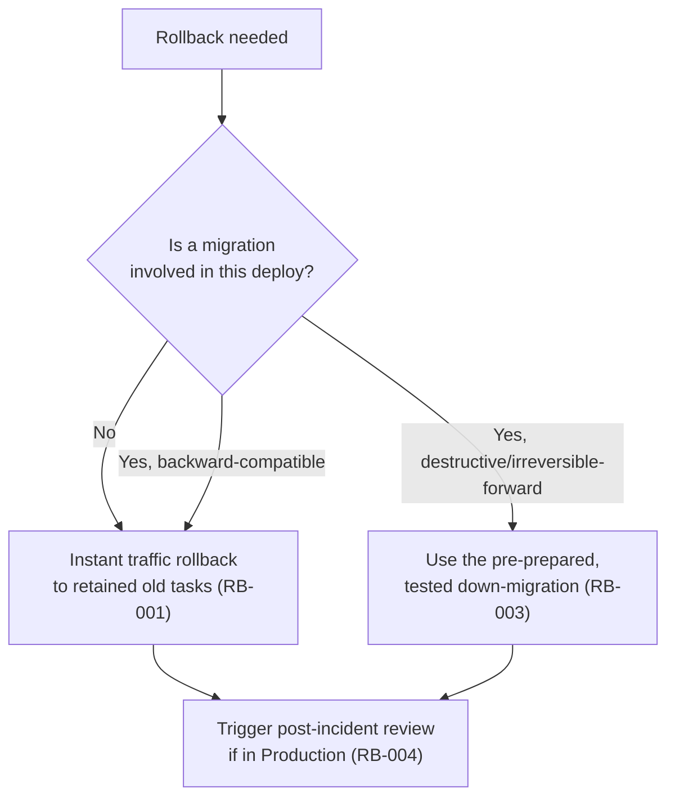

### 26.4 Examples

**Good:** A canary failure triggers instant traffic rollback to Blue; because the accompanying migration only added a nullable column, no migration rollback is needed at all — the old code never referenced it.

### 26.5 Best Practices

- Prepare and test the down-migration path in Staging whenever a migration is flagged destructive (`06_DATABASE_STANDARDS.md` MIG-003), not only when a rollback is actually needed.

### 26.6 Common Mistakes

| Mistake | Fix |
|---|---|
| Improvising a down-migration during a live incident. | Always prepared and tested in advance for destructive migrations (RB-003). |

### 26.7 Checklist

- [ ] Code rollback path is instant, no rebuild required.
- [ ] Migration rollback need assessed separately from code rollback.
- [ ] Destructive migrations have a pre-tested down-path.
- [ ] Production rollbacks trigger a post-incident review.

### 26.8 Future Considerations

None beyond Ch.25's evolution.

### 26.9 AI Assistant Guidance

Always ask whether a migration involved in a deploy is backward-compatible before assuming code-only rollback is sufficient. Always prepare a tested down-migration for any destructive migration before it ships.

### 26.10 Related Documents

Ch.25 (Zero Downtime Deployment), `06_DATABASE_STANDARDS.md` Ch.11, `09_SECURITY_GUIDELINES.md` Ch.33.

---

## Chapter 27 — Monitoring

### 27.1 Purpose

Implements `03_ARCHITECTURE.md` Ch.22's three-pillar observability model with concrete CloudWatch tooling.

### 27.2 Rules

| Rule ID | Rule | Severity | Enforcement |
|---|---|---|---|
| MON-001 | CloudWatch Container Insights is enabled for all ECS services, providing CPU/memory/network metrics per task without custom instrumentation. | 🟡 Medium | Ops/infra review |
| MON-002 | Structured application logs (Pino, per `02_TECH_STACK.md`) ship to CloudWatch Logs with the standard fields defined in `07_REST_API_STANDARDS.md` LOG-001/`09_SECURITY_GUIDELINES.md` — restated here as the deployment-layer requirement that makes those fields actually queryable in production. | 🟠 High | DevOps Review |
| MON-003 | One consolidated CloudWatch dashboard per service shows: request rate, error rate, p50/p95/p99 latency, replica count, and (for `worker`) queue depth — a single place an on-call engineer checks first. | 🟡 Medium | DevOps Review |
| MON-004 | Distributed tracing (correlation ID propagation, `03_ARCHITECTURE.md` Ch.22.4) is queryable across logs from a single correlation ID — an engineer can find every log line for one request/job across every service it touched. | 🟠 High | DevOps Review |

### 27.3 Examples

**Good:** An on-call engineer pastes a correlation ID from a customer-reported error into a saved CloudWatch Logs Insights query and sees every log line across `api` and `worker` for that exact request.

### 27.4 Best Practices

- Build the correlation-ID lookup query once, save it, and document it in the on-call runbook rather than each engineer improvising a CloudWatch query during an incident.

### 27.5 Common Mistakes

| Mistake | Fix |
|---|---|
| Logs shipped without the standard structured fields, making correlation-ID lookup impossible. | Enforce the standard field set at the logging-library configuration level (MON-002). |

### 27.6 Checklist

- [ ] Container Insights enabled.
- [ ] Structured logs with standard fields shipped to CloudWatch.
- [ ] Per-service consolidated dashboard exists.
- [ ] Correlation-ID-based cross-service log lookup works.

### 27.7 Future Considerations

Consider a dedicated tracing backend (e.g., AWS X-Ray) if CloudWatch Logs Insights-based correlation becomes unwieldy at higher request volume.

### 27.8 AI Assistant Guidance

Always assume structured logging with the standard field set (correlation ID, tenant ID, actor) ships to CloudWatch. Always design new logging to support correlation-ID-based lookup.

### 27.9 Related Documents

`03_ARCHITECTURE.md` Ch.22, `07_REST_API_STANDARDS.md` Ch.25, `09_SECURITY_GUIDELINES.md` Ch.32.

---

## Chapter 28 — Logging

### 28.1 Purpose

Defines log retention and access conventions specific to the deployment layer, complementing Ch.27's monitoring.

### 28.2 Rules

| Rule ID | Rule | Severity | Enforcement |
|---|---|---|---|
| LOG-D-001 | CloudWatch Logs retention is **90 days** for application logs, **1 year** for audit-adjacent security logs (restated/quantified alongside `09_SECURITY_GUIDELINES.md` Ch.23's audit trail, which itself lives in the database, not CloudWatch — this is specifically the *application/infrastructure* log retention, distinct from the database audit store). | 🟡 Medium | Ops/infra review |
| LOG-D-002 | Log access is restricted to the Platform Operator plane (restated from `03_ARCHITECTURE.md` Ch.22.3), enforced via IAM policy on the CloudWatch Logs group, not just an application-level convention. | 🔴 Critical | Ops/infra review |
| LOG-D-003 | PII is never present in application logs (restated from `09_SECURITY_GUIDELINES.md` PII-002) — enforced at the logging-library redaction-configuration level, applied uniformly, not per log call. | 🔴 Critical | Code Review |

### 28.3 Examples

**Good:** A CloudWatch Logs group IAM resource policy restricts read access to the `PlatformOperator` IAM role only.

### 28.4 Best Practices

- Export logs older than the retention window to S3 (cheaper, longer-term cold storage) if longer-term log analysis is ever needed, rather than extending CloudWatch's retention indefinitely at higher cost.

### 28.5 Common Mistakes

| Mistake | Fix |
|---|---|
| CloudWatch Logs readable by any IAM principal in the account. | Restrict via resource policy to Platform Operators (LOG-D-002). |

### 28.6 Checklist

- [ ] Retention set per LOG-D-001.
- [ ] Access restricted via IAM, not just convention.
- [ ] PII redaction enforced at the logging-library level.

### 28.7 Future Considerations

Revisit retention windows if a compliance certification (per `09_SECURITY_GUIDELINES.md` Ch.1.8) requires longer application-log retention specifically.

### 28.8 AI Assistant Guidance

Always assume application logs retain for 90 days and are IAM-restricted to Platform Operators.

### 28.9 Related Documents

`03_ARCHITECTURE.md` Ch.22.3, `09_SECURITY_GUIDELINES.md` Ch.23, Ch.25.

---

## Chapter 29 — Alerting

### 29.1 Purpose

Supplies the concrete alert thresholds `03_ARCHITECTURE.md` Decision 22.5.1 named signals for but left unquantified.

### 29.2 Rules

| Rule ID | Rule | Severity | Enforcement |
|---|---|---|---|
| ALERT-001 | Error-rate alert: fires if 5xx responses exceed **1% of requests over a 5-minute window** (restated as a concrete number for Ch.21.3's latency-budget-adjacent error-rate concern). | 🟠 High | Ops/infra review |
| ALERT-002 | Latency alert: fires if p99 latency exceeds the relevant `03_ARCHITECTURE.md` Ch.21.3 budget category by **50%** sustained over 5 minutes. | 🟠 High | Ops/infra review |
| ALERT-003 | Dead-letter queue depth alert (implementing `03_ARCHITECTURE.md` Ch.13.9's named signal): fires if DLQ depth exceeds **10 jobs** or grows for more than **15 minutes** continuously. | 🟠 High | Ops/infra review |
| ALERT-004 | Cache-hit-rate anomaly alert (implementing Ch.12.15's named signal): fires if hit rate on a frequently-changing dataset drops more than **20 percentage points** from its trailing 7-day average. | 🟡 Medium | Ops/infra review |
| ALERT-005 | Disproportionate per-module resource consumption alert (implementing Ch.21.4's named extraction-trigger signal): fires as an informational, non-paging alert when one module's request volume/CPU time exceeds **40% of the total `api` service load** sustained over a week — feeding the Ch.27 (`03_ARCHITECTURE.md`) extraction-consideration process, not an incident by itself. | 🟡 Medium | Ops/infra review |
| ALERT-006 | Every paging alert (ALERT-001/002/003) routes to the on-call rotation and, if sustained past a defined escalation window, triggers `09_SECURITY_GUIDELINES.md` Ch.33's incident response process at the appropriate severity. | 🟠 High | Ops/infra review |

### 29.3 Examples

**Good:** A deploy that introduces a subtle bug causing a 2% error rate triggers ALERT-001 within 5 minutes, paging on-call before most tenants notice.

### 29.4 Best Practices

- Review alert-firing history monthly for false-positive rate — an alert that pages frequently with no real issue trains responders to ignore it (`09_SECURITY_GUIDELINES.md` SP8).

### 29.5 Common Mistakes

| Mistake | Fix |
|---|---|
| No alert on DLQ depth, discovering a stuck queue only when a tenant complains about a missing import result. | Configure ALERT-003. |

### 29.6 Checklist

- [ ] Error-rate, latency, DLQ-depth, cache-hit-rate, and per-module-load alerts all configured.
- [ ] Paging alerts route to on-call and escalate into incident response.

### 29.7 Future Considerations

Every threshold in this chapter is this handbook's first concrete answer to a signal `03_ARCHITECTURE.md` named but explicitly left "measured, not assumed" — revisit all of them with real production data (DP4).

### 29.8 AI Assistant Guidance

Always assume the alert thresholds in this chapter when reasoning about monitoring configuration; flag them as revisable starting values, not permanent constants.

### 29.9 Related Documents

`03_ARCHITECTURE.md` Ch.13.9, Ch.12.15, Ch.21.4, Decision 22.5.1; `09_SECURITY_GUIDELINES.md` Ch.32–33.

---

## Chapter 30 — Health Checks

### 30.1 Purpose

Defines the dedicated health-check endpoint every service exposes, referenced by ALB-002/13.2 and ECS task health checks.

### 30.2 Rules

| Rule ID | Rule | Severity | Enforcement |
|---|---|---|---|
| HC-001 | Every service exposes `GET /health` (unauthenticated, not tenant-scoped, not rate-limited) returning `200` only if the service can actually serve traffic — not merely "the process is running." | 🟠 High | Code Review, contract test |
| HC-002 | `/health` checks its critical dependencies (DB connection pool reachable, Redis reachable) with a fast timeout (e.g., under 500ms) — slow or hanging dependency checks must not make the health check itself unreliable. | 🟠 High | Code Review |
| HC-003 | A separate `GET /health/deep` (Platform-Operator-only, not used by the ALB) exists for manual, more thorough diagnostic checks — the ALB never uses the deep check, since a slow deep check would create false-positive unhealthy signals. | 🟡 Medium | Code Review |
| HC-004 | `/health` never leaks internal details (version numbers, dependency hostnames) in its response body beyond a simple `{status: "ok"}` — consistent with `09_SECURITY_GUIDELINES.md`'s no-internal-detail-leakage posture. | 🟠 High | Contract test |

### 30.3 Examples

**Good:** `/health` returns `200 {"status": "ok"}` in under 100ms when DB and Redis are reachable; returns `503` if either is unreachable, triggering ALB-003's replacement logic.

### 30.4 Best Practices

- Keep `/health`'s dependency checks lightweight (a fast `SELECT 1`-equivalent, a Redis `PING`) rather than a full business-logic exercise.

### 30.5 Common Mistakes

| Mistake | Fix |
|---|---|
| `/health` returning `200` regardless of whether the DB is actually reachable. | Check real dependencies (HC-001/002). |
| The ALB configured to hit a slow diagnostic endpoint. | Use the fast `/health`, never `/health/deep` (HC-003). |

### 30.6 Checklist

- [ ] `/health` checks real dependencies with a fast timeout.
- [ ] `/health/deep` exists separately, not used by the ALB.
- [ ] No internal detail leaked in the response.

### 30.7 Future Considerations

None — stable.

### 30.8 AI Assistant Guidance

Always generate `/health` to check real critical dependencies with a fast timeout, never a hardcoded `200`.

### 30.9 Related Documents

Ch.13 (ALB), Ch.24 (Rolling Deployment).

---

## Chapter 31 — Metrics

### 31.1 Purpose

Defines the specific metrics captured, feeding Ch.29's alerts and Ch.33's auto-scaling.

### 31.2 Rules

| Rule ID | Rule | Severity | Enforcement |
|---|---|---|---|
| MET-001 | Every service emits, at minimum: request count, error count (by status code class), latency histogram (p50/p95/p99), and (for `worker`) queue depth and job-processing duration. | 🟠 High | Code Review |
| MET-002 | Metrics are tagged with `service`, `environment`, and where applicable `module` (for the per-module load visibility ALERT-005 depends on) — never emitted without dimensional tags that make them filterable. | 🟡 Medium | Code Review |
| MET-003 | Custom business metrics (e.g., journal entries posted per minute) are emitted where they'd meaningfully inform scaling or alerting decisions — not every business event needs a metric, only ones tied to an operational decision. | 🟡 Medium | Code Review |

### 31.3 Examples

**Good:** `api.request.duration` metric tagged `{service: "api", environment: "production", module: "accounting"}` feeds both ALERT-002's latency alert and ALERT-005's per-module load signal.

### 31.4 Best Practices

- Resist metric proliferation — each new metric has a small ongoing cost (CloudWatch custom metric pricing); add ones tied to an actual decision (alert, scaling trigger), not speculatively.

### 31.5 Common Mistakes

| Mistake | Fix |
|---|---|
| Metrics emitted with no dimensional tags, making them useless for per-module analysis. | Always tag per MET-002. |

### 31.6 Checklist

- [ ] Standard metric set (request/error/latency, queue depth for workers) emitted.
- [ ] Metrics tagged with service/environment/module.
- [ ] New custom metrics tied to an actual operational decision.

### 31.7 Future Considerations

None beyond Ch.27's evolution.

### 31.8 AI Assistant Guidance

Always tag emitted metrics with service/environment/module dimensions. Avoid proposing a new metric without naming the decision it would inform.

### 31.9 Related Documents

Ch.27 (Monitoring), Ch.29 (Alerting), Ch.33 (Auto Scaling).

---

## Chapter 32 — Scaling Strategy

### 32.1 Purpose

Restates `03_ARCHITECTURE.md` Ch.21.4's horizontal scaling model as the binding baseline before Ch.33's auto-scaling specifics.

### 32.2 Rules

| Rule ID | Rule | Severity | Enforcement |
|---|---|---|---|
| SCALE-001 | Horizontal scaling (more replicas) is the default strategy for the `api` and `worker` services — vertical scaling (bigger instances) is reserved for RDS (Ch.16) where horizontal read/write scaling has real limits. | 🟠 High | Architecture Review |
| SCALE-002 | All `api`/`worker` replicas are stateless with respect to request/job handling — restated from `03_ARCHITECTURE.md` Ch.21.4 as the precondition that makes horizontal scaling safe at all (no server-local session state, no in-memory job state that isn't also durably queued). | 🔴 Critical | Architecture Review |
| SCALE-003 | A module's disproportionate resource consumption (ALERT-005) is a scaling-strategy signal, not automatically a scaling *action* — it feeds the extraction-consideration process (`03_ARCHITECTURE.md` Ch.27), reviewed by Architecture Review before any structural change, never an automated response. | 🟡 Medium | Architecture Review |

### 32.3 Best Practices

- Validate statelessness explicitly in code review for any new feature touching request-scoped data — a subtle server-local cache or in-memory queue is an easy way to accidentally violate SCALE-002.

### 32.4 Common Mistakes

| Mistake | Fix |
|---|---|
| A feature that stores in-memory state assumed to persist across requests to the same replica. | Stateless design only (SCALE-002) — use Redis/DB instead. |

### 32.5 Checklist

- [ ] Horizontal scaling is the default approach.
- [ ] No server-local state introduced anywhere in `api`/`worker`.
- [ ] Disproportionate module load reviewed by Architecture Review, not auto-acted-on.

### 32.6 Future Considerations

None beyond `03_ARCHITECTURE.md` Ch.21/27's evolution.

### 32.7 AI Assistant Guidance

Always assume horizontal scaling is the default; flag any code introducing server-local state as a SCALE-002 violation.

### 32.8 Related Documents

`03_ARCHITECTURE.md` Ch.21.4, Ch.27; Ch.33 (Auto Scaling).

---

## Chapter 33 — Auto Scaling

### 33.1 Purpose

Supplies concrete ECS auto-scaling policy numbers.

### 33.2 Rules

| Rule ID | Rule | Severity | Enforcement |
|---|---|---|---|
| AS-001 | `api` service scales on a target-tracking policy: target **60% average CPU utilization**, scale-out cooldown **60 seconds**, scale-in cooldown **300 seconds** (slower scale-in avoids flapping under bursty load). | 🟠 High | DevOps Review |
| AS-002 | `worker` service scales on BullMQ queue depth: add a task per **50 queued jobs** above a baseline of 2 tasks, up to a defined maximum (e.g., 20 tasks), scale-in when queue depth has been below threshold for **10 minutes** continuously. | 🟠 High | DevOps Review |
| AS-003 | Minimum replica count never drops below PROD-005's floor (2) regardless of low load — auto-scaling adjusts capacity above the floor, never below it. | 🔴 Critical | Architecture Review |
| AS-004 | A maximum replica count is always defined (cost/blast-radius ceiling) — auto-scaling never scales unbounded in response to an anomalous load spike (which could itself be a symptom worth investigating, not just absorbing). | 🟠 High | DevOps Review |

### 33.3 Diagram — Scaling Signals

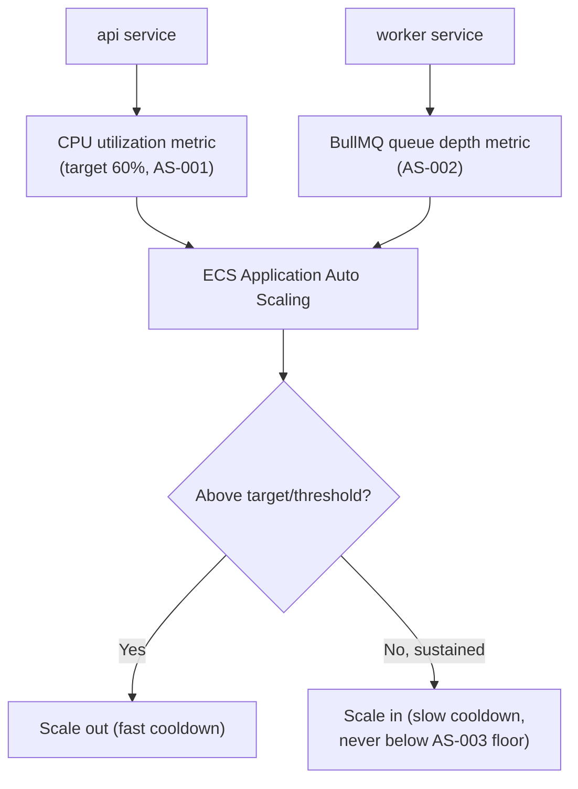

### 33.4 Examples

**Good:** A traffic spike pushes `api` CPU to 80%; scale-out adds tasks within a minute; when load subsides, scale-in waits a full 5 minutes of sustained low CPU before removing capacity, avoiding a flap back to high CPU moments later.

### 33.5 Best Practices

- Load-test the scaling policy before trusting it in Production — verify it actually adds capacity fast enough to absorb a realistic traffic spike within the latency budget (`03_ARCHITECTURE.md` Ch.21.3).

### 33.6 Common Mistakes

| Mistake | Fix |
|---|---|
| Symmetric fast cooldowns on both scale-out and scale-in, causing flapping. | Slower scale-in cooldown (AS-001). |
| No maximum replica ceiling, letting a runaway load spike scale indefinitely. | Always define a maximum (AS-004). |

### 33.7 Checklist

- [ ] Target-tracking/queue-depth policies configured per AS-001/002.
- [ ] Minimum floor and maximum ceiling both defined.
- [ ] Scale-in cooldown longer than scale-out to avoid flapping.

### 33.8 Future Considerations

AS-001/002's specific numbers are starting values — tune based on real load-test and production scaling-event data (DP4).

### 33.9 AI Assistant Guidance

Always configure asymmetric cooldowns (faster scale-out, slower scale-in). Always define both a minimum and maximum replica count.

### 33.10 Related Documents

Ch.32 (Scaling Strategy), `03_ARCHITECTURE.md` Ch.21.4, Ch.18–19 (Background Workers, BullMQ).

---

## Chapter 34 — Backup Strategy

### 34.1 Purpose

Consolidates `06_DATABASE_STANDARDS.md` Ch.13 and `09_SECURITY_GUIDELINES.md` Ch.27's backup rules as the deployment-layer implementation, adding S3/Redis backup specifics beyond RDS (already covered in Ch.16).

### 34.2 Rules

| Rule ID | Rule | Severity | Enforcement |
|---|---|---|---|
| BAK-D-001 | RDS backup/PITR per Ch.16 RDS-002 (restated as the anchor of this chapter). | 🔴 Critical | Ops/infra review |
| BAK-D-002 | S3 bucket versioning (Ch.15 S3-005) plus cross-region replication for financial-document buckets specifically, providing an additional recovery layer beyond S3's own eleven-nines durability. | 🟡 Medium | Ops/infra review |
| BAK-D-003 | Redis (session/token namespace) is **not** backed up in the traditional sense — its data is either reconstructible (revoke-and-relogin is an acceptable degradation) or short-lived by design (TTL-bound); this is a deliberate, documented non-backup decision, not an oversight. | 🟡 Medium | Architecture Review |
| BAK-D-004 | CDK infrastructure definitions (Ch.10) are themselves backed up implicitly by living in source control — no infrastructure state exists that isn't reconstructible from a Git repository plus the RDS/S3 data backups. | 🟡 Medium | Architecture Review |

### 34.3 Examples

**Good:** A full environment could theoretically be reconstructed from: the Git repository (CDK + application code) + the latest RDS backup + S3 bucket contents — nothing else is a single point of unrecoverable state.

### 34.4 Best Practices

- Periodically validate BAK-D-004's claim by actually attempting a from-scratch environment reconstruction in a non-production account (feeds Ch.35's DR drills).

### 34.5 Common Mistakes

| Mistake | Fix |
|---|---|
| Assuming Redis needs the same backup rigor as RDS. | Deliberately not backed up (BAK-D-003) — document why, don't just skip it silently. |

### 34.6 Checklist

- [ ] RDS backups per Ch.16.
- [ ] S3 versioning + cross-region replication for financial documents.
- [ ] Redis's non-backup status is a documented decision, not an oversight.
- [ ] Infrastructure is fully reconstructible from source control + data backups.

### 34.7 Future Considerations

None beyond Ch.16/Ch.35's evolution.

### 34.8 AI Assistant Guidance

Never propose backing up Redis's session/token data as if it were a durability requirement equal to RDS — it's a deliberate non-backup by design.

### 34.9 Related Documents

`06_DATABASE_STANDARDS.md` Ch.13, `09_SECURITY_GUIDELINES.md` Ch.27, Ch.16 (Amazon RDS Standards), Ch.35 (Disaster Recovery).

---

## Chapter 35 — Disaster Recovery

### 35.1 Purpose

Supplies concrete RTO/RPO numbers and runbook structure for `09_SECURITY_GUIDELINES.md` Ch.34's DR chapter, at the infrastructure-implementation level.

### 35.2 Rules

| Rule ID | Rule | Severity | Enforcement |
|---|---|---|---|
| DR-D-001 | Production RTO: **4 hours** for a full region failure (cross-region failover); RPO: **15 minutes** (via RDS automated backups + PITR, restated/quantified from `09_SECURITY_GUIDELINES.md` DR-001). | 🟠 High | Architecture Review |
| DR-D-002 | Three distinct DR runbooks exist, per `09_SECURITY_GUIDELINES.md` DR-002: (a) full region failure — fail over to the cross-region replica/backup; (b) database corruption — point-in-time restore to a pre-corruption timestamp; (c) accidental mass deletion — restore affected tables/records from the most recent clean backup, reconciled against the audit trail (`06_DATABASE_STANDARDS.md` Ch.7) to identify exactly what needs restoring. | 🟠 High | Ops runbook |
| DR-D-003 | An annual DR drill actually executes runbook (a) — failing over to the cross-region replica in a controlled exercise — and measures real time-to-recovery against DR-D-001's 4-hour target. | 🟠 High | Ops runbook |
| DR-D-004 | The DR runbooks are stored and accessible even if the primary region/account is unreachable (e.g., in a separate repository/location, or printed/exported) — a runbook that's only accessible via the system it describes recovering is a single point of failure in the recovery plan itself. | 🟠 High | Architecture Review |

### 35.3 Diagram — DR Scenario Routing

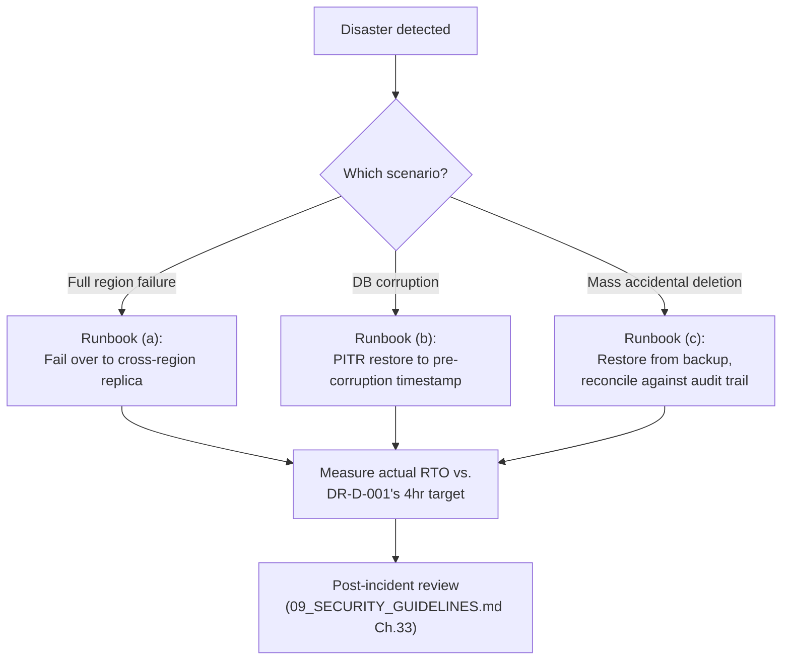

### 35.4 Examples

**Good:** An annual drill fails over to the cross-region replica, completes in 3.5 hours (within the 4-hour target), and the gap analysis identifies one manual step that could be automated to shave 30 minutes off the next drill.

### 35.5 Best Practices

- Treat each DR drill's findings as input to the next runbook revision — a runbook that's never updated after a drill reveals a gap isn't actually improving.

### 35.6 Common Mistakes

| Mistake | Fix |
|---|---|
| Treating "database corruption" and "mass accidental deletion" as the same recovery procedure. | Distinct runbooks (DR-D-002) — corruption needs PITR to a timestamp; deletion needs targeted restore reconciled against the audit trail. |
| A DR runbook stored only in the system it describes recovering. | Store accessibly outside that system (DR-D-004). |

### 35.7 Checklist

- [ ] RTO/RPO targets defined (DR-D-001).
- [ ] Three distinct runbooks exist for the three named scenarios.
- [ ] Annual drill actually performed and measured against the target.
- [ ] Runbooks accessible independent of the systems they describe recovering.

### 35.8 Future Considerations

DR-D-001's 4-hour/15-minute targets are starting values — revisit once real drill data (DR-D-003) validates or challenges them.

### 35.9 AI Assistant Guidance

When discussing disaster recovery, always distinguish which of the three named scenarios applies and reference its specific runbook rather than a generic "restore from backup" answer.

### 35.10 Related Documents

`09_SECURITY_GUIDELINES.md` Ch.34, `06_DATABASE_STANDARDS.md` Ch.7, Ch.13; Ch.16 (Amazon RDS Standards), Ch.34 (Backup Strategy).

---

## Chapter 36 — SSL & TLS

### 36.1 Purpose

Restates `09_SECURITY_GUIDELINES.md` APISEC-001's TLS requirement at the certificate-management/infrastructure level.

### 36.2 Rules

| Rule ID | Rule | Severity | Enforcement |
|---|---|---|---|
| TLS-001 | TLS certificates are provisioned and auto-renewed via AWS Certificate Manager (ACM), attached to CloudFront and the ALB — no manually-managed certificate files. | 🟠 High | Ops/infra review |
| TLS-002 | TLS 1.2 minimum, TLS 1.3 preferred (restated from `09_SECURITY_GUIDELINES.md` APISEC-001), enforced via ALB/CloudFront security policy configuration. | 🔴 Critical | Ops/infra review |
| TLS-003 | Certificate expiry is monitored with an alert well before expiry (e.g., 30 days) as a safety net, even though ACM auto-renews — never rely on auto-renewal alone with zero visibility into its success. | 🟡 Medium | Ops/infra review |

### 36.3 Examples

**Good:** ACM auto-renews the certificate 30+ days before expiry; a CloudWatch alarm would still fire if, for any reason, renewal failed and expiry approached.

### 36.4 Best Practices

- Use ACM exclusively rather than any manually-issued certificate — removes an entire class of "forgot to renew" incidents.

### 36.5 Common Mistakes

| Mistake | Fix |
|---|---|
| A manually-issued certificate with no renewal automation. | Use ACM (TLS-001). |

### 36.6 Checklist

- [ ] Certificates via ACM, auto-renewed.
- [ ] TLS 1.2 minimum enforced.
- [ ] Expiry monitored as a safety net regardless of auto-renewal.

### 36.7 Future Considerations

None — stable.

### 36.8 AI Assistant Guidance

Always assume ACM-managed certificates; never propose manual certificate file management.

### 36.9 Related Documents

`09_SECURITY_GUIDELINES.md` APISEC-001, Ch.13 (ALB), Ch.14 (CloudFront).

---

## Chapter 37 — DNS Strategy

### 37.1 Purpose

Defines DNS management conventions.

### 37.2 Rules

| Rule ID | Rule | Severity | Enforcement |
|---|---|---|---|
| DNS-001 | DNS is managed via AWS Route 53, with records defined in CDK (Ch.10 AWS-002) alongside the resources they point to — never manually configured outside IaC. | 🟠 High | Architecture Review |
| DNS-002 | Health-checked DNS failover is configured for the Production domain, providing an additional layer beyond ALB-level health checks for a full-region failure scenario (feeding Ch.35 DR-D-001). | 🟡 Medium | Ops/infra review |
| DNS-003 | TTLs are set low enough (e.g., 60 seconds) on records likely to change during a DR failover, balancing fast propagation against unnecessary query load for stable records. | 🟡 Medium | Ops/infra review |

### 37.3 Examples

**Good:** During a DR failover drill, Route 53 health checks detect the primary region's failure and automatically shift DNS resolution to the secondary region within the low-TTL propagation window.

### 37.4 Best Practices

- Test DNS failover as part of the annual DR drill (Ch.35 DR-D-003), not assumed to work from configuration alone.

### 37.5 Common Mistakes

| Mistake | Fix |
|---|---|
| A high TTL on a record needed for fast DR failover. | Lower TTL on failover-relevant records (DNS-003). |

### 37.6 Checklist

- [ ] DNS managed via Route 53 + CDK, not manual console changes.
- [ ] Health-checked failover configured for Production.
- [ ] TTLs appropriately low on failover-relevant records.

### 37.7 Future Considerations

None — stable.

### 37.8 AI Assistant Guidance

Always assume Route 53 + CDK for DNS configuration; never propose a manually-configured DNS record outside IaC.

### 37.9 Related Documents

Ch.10 (AWS Architecture), Ch.35 (Disaster Recovery).

---

## Chapter 38 — Secrets Management

### 38.1 Purpose

Restates `09_SECURITY_GUIDELINES.md` Ch.12's secrets rules as the binding deployment-layer requirement.

### 38.2 Rules

| Rule ID | Rule | Severity | Enforcement |
|---|---|---|---|
| SECR-D-001 | All secrets are injected into ECS task definitions from AWS Secrets Manager at container start, via the task definition's `secrets` field (not baked into the image, not passed as plain environment variables in the task definition itself) — restated as the concrete ECS-level mechanism for `09_SECURITY_GUIDELINES.md` SECR-001. | 🔴 Critical | Ops/infra review |
| SECR-D-002 | CDK code (Ch.10) references secrets by ARN only — the CDK repository itself never contains a secret value, even in a "for local testing" comment. | 🔴 Critical | CI secret-scanning |
| SECR-D-003 | Secrets Manager rotation Lambdas are configured for database credentials (restated from `09_SECURITY_GUIDELINES.md` SECR-002's 90-day schedule), with the ECS task definition referencing the secret ARN (not a specific version), so rotation is transparent to running tasks. | 🟠 High | Ops/infra review |

### 38.3 Examples

**Good:** The ECS task definition's `secrets` field references `arn:aws:secretsmanager:...:database-credentials`, resolved at container start — the actual credential value never appears in the task definition JSON, CDK code, or CI logs.

### 38.4 Best Practices

- Use ECS's native Secrets Manager integration rather than an application-level secrets-fetching call at startup — reduces the code surface that could accidentally log a secret value.

### 38.5 Common Mistakes

| Mistake | Fix |
|---|---|
| A secret value passed as a plain environment variable in the task definition. | Use the `secrets` field referencing Secrets Manager (SECR-D-001). |

### 38.6 Checklist

- [ ] Secrets injected via ECS's native Secrets Manager integration.
- [ ] CDK references secrets by ARN only.
- [ ] Rotation configured, task definitions reference ARN not version.

### 38.7 Future Considerations

None beyond `09_SECURITY_GUIDELINES.md` Ch.12's evolution.

### 38.8 AI Assistant Guidance

Always generate ECS task definitions referencing secrets via the `secrets` field and a Secrets Manager ARN, never a plain environment variable holding a real secret value.

### 38.9 Related Documents

`09_SECURITY_GUIDELINES.md` Ch.12, Ch.10 (AWS Architecture).

---

## Chapter 39 — Environment Variables

### 39.1 Purpose

Restates `09_SECURITY_GUIDELINES.md` Ch.13's env-var classification at the deployment/CDK level.

### 39.2 Rules

| Rule ID | Rule | Severity | Enforcement |
|---|---|---|---|
| ENV-D-001 | Non-secret configuration (log level, feature flags) is set via ECS task definition environment variables, defined in CDK per environment (restated/extended from `09_SECURITY_GUIDELINES.md` ENV-001). | 🟡 Medium | Code Review |
| ENV-D-002 | Configuration differs by environment only in values, never in the CDK construct/task-definition shape itself — Development, Staging, and Production use the same CDK stack definitions, parameterized (restated from ENV-005). | 🟠 High | Architecture Review |
| ENV-D-003 | Frontend build-time environment variables (`NEXT_PUBLIC_*`) are set at build time per environment, never assumed to be identical across Staging/Production builds — each environment gets its own build with its own public config values (e.g., a different API base URL). | 🟡 Medium | CI/CD Pipeline |

### 39.3 Examples

**Good:** The same CDK `ApiServiceStack` construct is instantiated for Development, Staging, and Production with different parameter values (task count, instance size, log level) — never three separately-hand-written stack definitions.

### 39.4 Best Practices

- Keep environment-specific configuration values in a single, reviewed CDK parameters file per environment, not scattered across multiple places.

### 39.5 Common Mistakes

| Mistake | Fix |
|---|---|
| Separate, hand-maintained CDK stacks per environment that drift apart over time. | One parameterized stack definition (ENV-D-002). |

### 39.6 Checklist

- [ ] Non-secret config via task-definition environment variables.
- [ ] Same CDK construct shape across environments, only values differ.
- [ ] Frontend builds are environment-specific.

### 39.7 Future Considerations

None beyond `09_SECURITY_GUIDELINES.md` Ch.13's evolution.

### 39.8 AI Assistant Guidance

Always propose one parameterized CDK construct reused across environments rather than separate per-environment stack definitions.

### 39.9 Related Documents

`09_SECURITY_GUIDELINES.md` Ch.13, Ch.10 (AWS Architecture), `08_FRONTEND_STANDARDS.md` Ch.25.

---

## Chapter 40 — Infrastructure Security

### 40.1 Purpose

Cross-references `09_SECURITY_GUIDELINES.md` Ch.28–29's infrastructure security rules as binding on every chapter of this handbook — avoids duplicating that document's content, states the dependency explicitly.

### 40.2 Rules

| Rule ID | Rule | Severity | Enforcement |
|---|---|---|---|
| INFRASEC-001 | Every infrastructure decision in this handbook (Ch.10–19) is subject to `09_SECURITY_GUIDELINES.md` Ch.28 (Cloud Security) and Ch.29 (Infrastructure Security) without exception — this chapter does not re-decide those rules, only confirms this handbook's topology complies with them. | 🔴 Critical | Architecture Review |
| INFRASEC-002 | Any new infrastructure component introduced after this handbook's initial writing is checked against `09_SECURITY_GUIDELINES.md`'s SSDLC gate (Ch.2 of that document) before provisioning. | 🟠 High | Security Review |

### 40.3 Compliance Cross-Check Table

| This Handbook's Decision | Compliant With |
|---|---|
| Ch.11 VPC Design (private subnets, least-access security groups) | `09_SECURITY_GUIDELINES.md` AWSSEC-004 |
| Ch.10 AWS-001 (separate accounts) | AWSSEC-003 |
| Ch.38 Secrets Management (ECS + Secrets Manager) | SECR-001–005 |
| Ch.8 Docker Standards (non-root, pinned images) | INFRA-001–002 |
| Ch.28 Logging (IAM-restricted CloudWatch access) | Ch.22.3 of `03_ARCHITECTURE.md` |

### 40.4 Best Practices

- Treat this cross-check table as a living index — update it whenever either document adds a new relevant rule.

### 40.5 Common Mistakes

| Mistake | Fix |
|---|---|
| Introducing a new infrastructure component in this handbook's future revisions without checking it against `09_SECURITY_GUIDELINES.md` first. | Always cross-check (INFRASEC-002). |

### 40.6 Checklist

- [ ] Every infrastructure decision traced to its `09_SECURITY_GUIDELINES.md` compliance rule.

### 40.7 Future Considerations

Keep Section 40.3's table current as both documents evolve.

### 40.8 AI Assistant Guidance

When proposing new infrastructure, always cross-check against `09_SECURITY_GUIDELINES.md` Ch.28–29 before finalizing the proposal.

### 40.9 Related Documents

`09_SECURITY_GUIDELINES.md` Ch.28, Ch.29.

---

## Chapter 41 — Cost Optimization

### 41.1 Purpose

Operationalizes DP7 (cost is an engineering constraint, never traded against correctness/security).

### 41.2 Rules

| Rule ID | Rule | Severity | Enforcement |
|---|---|---|---|
| COST-001 | Every AWS resource is tagged (restated from AWS-003) enabling per-service, per-environment cost allocation review. | 🟡 Medium | DevOps Review |
| COST-002 | Non-Production environments (Ch.4) use the smallest reasonable instance sizes and, where feasible, scheduled shutdown during off-hours (e.g., Development scaled to zero overnight) — never sized like Production. | 🟡 Medium | DevOps Review |
| COST-003 | A monthly cost review compares actual spend per service against expectations, flagging anomalies (a service whose cost doubled without a corresponding traffic/feature change) for investigation. | 🟡 Medium | Ops/infra review |
| COST-004 | Cost optimization changes (e.g., switching a component to cheaper Reserved/Savings-Plan capacity) never reduce redundancy/availability below PROD-005's floor or weaken any `09_SECURITY_GUIDELINES.md` control — cost is optimized only after correctness/security/availability requirements are met (DP7). | 🔴 Critical | Architecture Review |

### 41.3 Examples

**Good:** Development's ECS services scale to zero tasks overnight via a scheduled action, resuming each morning — no cost incurred for idle capacity nobody is using.

### 41.4 Best Practices

- Use AWS Cost Explorer with the tagging scheme (COST-001) as the primary input to the monthly review (COST-003), rather than ad hoc spend investigation.

### 41.5 Common Mistakes

| Mistake | Fix |
|---|---|
| Reducing Production replica count below the availability floor to save cost. | Never — cost optimization never compromises PROD-005 (COST-004). |

### 41.6 Checklist

- [ ] Resources tagged for cost allocation.
- [ ] Non-Production environments cost-optimized (right-sized, scheduled shutdown where feasible).
- [ ] Monthly cost review process exists.
- [ ] No cost optimization ever reduces availability/security below the established floor.

### 41.7 Future Considerations

As tenant count grows, consider per-tenant cost attribution to inform pricing/margin analysis — not yet needed at current scale.

### 41.8 AI Assistant Guidance

Never propose a cost optimization that reduces Production redundancy below its availability floor or weakens a security control.

### 41.9 Related Documents

Ch.4 (Development Environment), Ch.7 (Production Environment), Ch.1 (DP7).

---

## Chapter 42 — Performance Optimization

### 42.1 Purpose

Restates `03_ARCHITECTURE.md` Ch.21's performance-budget model as the deployment-layer verification point.

### 42.2 Rules

| Rule ID | Rule | Severity | Enforcement |
|---|---|---|---|
| PERF-D-001 | Performance-budget regression tests (`03_ARCHITECTURE.md` Decision 21.6.1) run against Staging on every merge to `main` (restated as the concrete CI stage, CICD-002) — a regression blocks promotion, not just logs a warning. | 🟠 High | CI/CD Pipeline |
| PERF-D-002 | CloudFront cache-hit ratio is monitored (Ch.14) as a performance signal — a declining hit ratio for static assets indicates a caching-configuration regression worth investigating. | 🟡 Medium | Ops/infra review |
| PERF-D-003 | Database query performance (slow-query log, `06_DATABASE_STANDARDS.md` Ch.10 PERF-003) is monitored via RDS Performance Insights, feeding both this chapter's optimization loop and Ch.16's instance-sizing decisions. | 🟡 Medium | Ops/infra review |

### 42.3 Examples

**Good:** A merge that regresses Journal Entry posting latency beyond `03_ARCHITECTURE.md` Ch.21.3's budget fails the CI gate before it ever reaches Staging deployment.

### 42.4 Best Practices

- Treat performance budgets as a release gate with the same seriousness as a failing test — a regression is a bug, not a "we'll look at it later."

### 42.5 Common Mistakes

| Mistake | Fix |
|---|---|
| A performance regression logged as a warning but not blocking the pipeline. | Must block (PERF-D-001). |

### 42.6 Checklist

- [ ] Performance-budget regression tests block the pipeline on failure.
- [ ] CloudFront hit ratio and RDS query performance actively monitored.

### 42.7 Future Considerations

None beyond `03_ARCHITECTURE.md` Ch.21's evolution.

### 42.8 AI Assistant Guidance

Always treat a performance-budget regression as a pipeline-blocking failure, never a warning-only signal.

### 42.9 Related Documents

`03_ARCHITECTURE.md` Ch.21, `06_DATABASE_STANDARDS.md` Ch.10, Ch.14 (CloudFront), Ch.16 (RDS).

---

## Chapter 43 — Production Readiness Checklist

### 43.1 Purpose

The literal, consolidated pre-launch/pre-major-feature checklist, mirroring the closing checklist chapters in `06_DATABASE_STANDARDS.md`, `07_REST_API_STANDARDS.md`, `08_FRONTEND_STANDARDS.md`, and `09_SECURITY_GUIDELINES.md`.

### 43.2 The Checklist

- [ ] **Environments** — Four environments exist, isolated, staging has realistic synthetic multi-tenant data (Ch.2–7).
- [ ] **Containers** — Multi-stage, pinned, non-root, scanned Docker images; correct ECS service separation (Ch.8–9).
- [ ] **AWS Topology** — VPC segmented correctly, least-access security groups, IaC-defined (Ch.10–11).
- [ ] **Compute/Data Tier** — ECS Fargate configured, ALB health checks correct, CloudFront caching safe, RDS Multi-AZ + backups, Redis namespace separation (Ch.12–17).
- [ ] **Workers/Queues** — Independent scaling, graceful drain, bounded retry with DLQ (Ch.18–19).
- [ ] **CI/CD** — Full pipeline with no fast-path, immutable artifacts, manual Production promotion with bake time (Ch.20–22).
- [ ] **Deployment Strategy** — Blue-green/rolling as appropriate, canary + auto-rollback thresholds configured, backward-compatible migrations (Ch.23–26).
- [ ] **Observability** — Structured logs with correlation IDs, dashboards, alert thresholds configured and tested, health checks correct (Ch.27–31).
- [ ] **Scaling** — Stateless replicas, auto-scaling policies configured with floor/ceiling (Ch.32–33).
- [ ] **Resilience** — Backups verified, DR runbooks exist and drilled, RTO/RPO targets defined (Ch.34–35).
- [ ] **Security/Networking** — TLS via ACM, DNS via Route 53 + IaC, secrets via Secrets Manager, infra security cross-checked against `09_SECURITY_GUIDELINES.md` (Ch.36–40).
- [ ] **Cost/Performance** — Resources tagged, non-Production right-sized, performance budgets enforced as a pipeline gate (Ch.41–42).
- [ ] **Incident Readiness** — On-call rotation exists, incident response process known to the team (Ch.44).

### 43.3 Engineering Note

Consistent with the closing checklists in every prior handbook, this is deliberately exhaustive — the cost of discovering a missing DR runbook or an unbounded auto-scaler during a real incident is categorically higher than the cost of a thorough pre-launch review.

### 43.4 AI Assistant Guidance

When asked "are we production-ready," walk this checklist item by item and explicitly note pass/fail per category — never summarize as "looks ready" without addressing each one.

### 43.5 Related Documents

Every chapter of this document.

---

## Chapter 44 — Incident Response

### 44.1 Purpose

Restates `09_SECURITY_GUIDELINES.md` Ch.33's incident response process as it applies specifically to deployment/infrastructure incidents (as distinct from security incidents, though the process and severity scale are shared).

### 44.2 Rules

| Rule ID | Rule | Severity | Enforcement |
|---|---|---|---|
| IR-D-001 | An infrastructure/availability incident (service down, elevated error rate, DR event) uses the same severity scale and process as `09_SECURITY_GUIDELINES.md` Ch.33 — one incident process platform-wide, not a separate "ops incident" process duplicating it. | 🟠 High | Architecture Review |
| IR-D-002 | Every SEV1/SEV2 infrastructure incident (per Ch.33's scale) produces a blameless post-incident review examining: what alert fired (or should have), what the rollback/mitigation path was, and whether Ch.29's alert thresholds or Ch.25's rollback triggers need adjustment as a result. | 🟠 High | Architecture Review |
| IR-D-003 | The on-call rotation (restated from `09_SECURITY_GUIDELINES.md` IR-002) has access to this handbook's runbooks (Ch.35 DR runbooks, Ch.26 rollback procedures) without needing to hunt for them mid-incident. | 🟡 Medium | Ops policy |

### 44.3 Examples

**Good:** A Production outage triggers ALERT-001, pages on-call, on-call executes the rollback runbook (Ch.26) within minutes, and the subsequent post-incident review identifies that ZDT-002's error-rate threshold should have caught the regression during canary — leading to a threshold adjustment.

### 44.4 Best Practices

- Keep this handbook's own chapters (Ch.26, Ch.35) as the literal runbooks referenced during an incident, rather than a separate, easily-stale incident-response wiki.

### 44.5 Common Mistakes

| Mistake | Fix |
|---|---|
| A separate "infrastructure incident" process duplicating `09_SECURITY_GUIDELINES.md` Ch.33 with different severity definitions. | One shared process and severity scale (IR-D-001). |

### 44.6 Checklist

- [ ] Infrastructure incidents use the shared severity scale/process.
- [ ] Post-incident reviews feed back into alert/rollback threshold tuning.
- [ ] On-call has direct access to this handbook's runbooks.

### 44.7 Future Considerations

None beyond `09_SECURITY_GUIDELINES.md` Ch.33's evolution.

### 44.8 AI Assistant Guidance

Always reference `09_SECURITY_GUIDELINES.md` Ch.33's severity scale when discussing an infrastructure incident, never propose a separate, parallel classification.

### 44.9 Related Documents

`09_SECURITY_GUIDELINES.md` Ch.33, Ch.26 (Rollback Strategy), Ch.29 (Alerting), Ch.35 (Disaster Recovery).

---

## Chapter 45 — AI Assistant Guidance

### 45.1 Purpose

Consolidates AI-specific guidance scattered across Chapters 1–44, mirroring the equivalent closing chapters in `06_DATABASE_STANDARDS.md`, `07_REST_API_STANDARDS.md`, `08_FRONTEND_STANDARDS.md`, and `09_SECURITY_GUIDELINES.md`.

### 45.2 Non-Negotiable Rules

1. Never propose a deployment path that bypasses staging or any pipeline stage, including for "hotfixes" (DP1, CICD-004).
2. Never propose a manually-created AWS resource — everything is CDK-defined (DP2, AWS-002).
3. Never propose copying real tenant data into a non-Production environment (ENV-002).
4. Never propose a single-replica Production service (PROD-005, ECS-004).
5. Never propose a hardcoded secret or plain-environment-variable secret in an ECS task definition — always Secrets Manager (SECR-D-001).
6. Never propose a database migration that isn't backward-compatible during a rolling/canary deployment window (ZDT-003).
7. Never propose an S3 lifecycle rule that combines storage-class transition with deletion (S3-004).
8. Never propose Redis session/token data using an eviction-prone policy (REDIS-003).
9. Never propose an auto-scaler with no maximum ceiling (AS-004).
10. Never propose reducing Production redundancy or weakening a security control to save cost (COST-004).
11. Never propose a health check that doesn't verify real dependency reachability (HC-001/002).
12. Never propose a rollback plan improvised at incident time for a destructive migration — always pre-tested (RB-003).

### 45.3 Default Behaviors

- Assume AWS CDK (TypeScript) as the IaC tool for any infrastructure-related generation (AWS-002).
- Assume the staged-rollout-with-canary-and-auto-rollback pattern (Ch.25) for any deployment-related generation.
- Assume structured logging with correlation IDs, tenant context, and standard fields for any logging-related generation (Ch.27–28).
- Tag every generated infrastructure resource with `environment`, `service`, `managed-by` (AWS-003).

### 45.4 When Uncertain

If a request seems to require deviating from this handbook, or touches infrastructure not yet covered, flag the gap and propose it as a documented Architecture Review item rather than silently inventing a topology — consistent with the governance pattern established in `07_REST_API_STANDARDS.md` Ch.29 and `09_SECURITY_GUIDELINES.md` Ch.36.4.

### 45.5 Related Documents

All prior chapters; `06_DATABASE_STANDARDS.md` §1.14; `07_REST_API_STANDARDS.md` Ch.31; `08_FRONTEND_STANDARDS.md` Ch.29; `09_SECURITY_GUIDELINES.md` Ch.36.

---

*End of Handbook — Chapters 1 through 45 complete.*

*Engineering note on scope: consistent with the prior four handbooks' closing notes, each chapter here is written for direct engineering usefulness rather than expanded to hit a literal page-count target.*

*New decisions originated by this handbook, flagged for ADR ratification per `03_ARCHITECTURE.md` Ch.28: AWS CDK as the IaC tool (Ch.10 AWS-002); Redis dual-role logical-separation resolution (Ch.17 REDIS-001), which directly closes the open evaluation `03_ARCHITECTURE.md` Decision 12.6.1 explicitly deferred to this document's operational findings; and all concrete numeric thresholds (canary percentages, scaling targets, alert thresholds, RTO/RPO, backup retention days) that prior documents deliberately left qualitative pending real data.*