# 11_GIT_WORKFLOW.md

**Version:** 1.0

**Audience:** Every engineer who commits code to the LedgerOne monorepo — backend, frontend, or full-stack, employee or contractor — plus any AI coding assistant (Claude, ChatGPT, GitHub Copilot, Cursor) generating or reviewing code, commits, or Pull Requests for this project.

This handbook defines the official Git workflow, engineering collaboration standards, and release management process for LedgerOne. It does not teach Git commands or GitHub features — it defines the engineering standards every contributor, human or AI, must follow when using them. It assumes the reader already knows how to use Git; what it fixes is *how LedgerOne specifically uses it*.

This document is consistent with, and never contradicts, `00_BUSINESS_RULES.md`, `01_PROJECT_CONTEXT.md`, `02_TECH_STACK.md`, `03_ARCHITECTURE.md`, `04_FOLDER_STRUCTURE.md`, `05_CODING_STANDARDS.md`, `06_DATABASE_STANDARDS.md`, `07_REST_API_STANDARDS.md`, `08_FRONTEND_STANDARDS.md`, `09_SECURITY_GUIDELINES.md`, and `10_DEPLOYMENT_ARCHITECTURE.md`. Where this handbook references a mechanism another handbook owns (CI pipeline stages, secrets scanning, staged deploys), it defers to that handbook rather than redefining it.

## Severity Legend (used throughout this document)

| Severity | Meaning |
|---|---|
| 🔴 Critical | A violation blocks merge or deploy outright. No exception without documented, signed-off justification. |
| 🟠 High | A strong default. A deviation requires written justification and explicit reviewer sign-off. |
| 🟡 Medium | A convention that should be followed; a reviewer may waive it with a stated reason, no escalation needed. |
| ⚪ Low | Stylistic/advisory. Not independently blocking. |

## Table of Contents

**PART I — PHILOSOPHY & REPOSITORY FOUNDATIONS**
Ch.1 Git Philosophy · Ch.2 Repository Structure · Ch.3 Monorepo Standards · Ch.4 Branching Strategy · Ch.5 Branch Naming Convention

**PART II — COMMITS & PULL REQUESTS**
Ch.6 Commit Message Standards · Ch.7 Conventional Commits · Ch.8 Pull Request Standards · Ch.9 Pull Request Template · Ch.10 Code Review Process · Ch.11 Code Ownership

**PART III — MERGING & RELEASE MANAGEMENT**
Ch.12 Merge Strategy · Ch.13 Release Branches · Ch.14 Hotfix Process · Ch.15 Bug Fix Workflow · Ch.16 Feature Development Workflow

**PART IV — VERSIONING & RELEASES**
Ch.17 Versioning Strategy · Ch.18 Semantic Versioning · Ch.19 Tagging Strategy · Ch.20 Release Notes

**PART V — PROJECT MANAGEMENT ON GITHUB**
Ch.21 GitHub Issues · Ch.22 GitHub Projects · Ch.23 Labels · Ch.24 Milestones · Ch.25 Sprint Workflow

**PART VI — AUTOMATION & PIPELINE GOVERNANCE**
Ch.26 CI/CD Integration · Ch.27 Protected Branch Rules · Ch.28 Merge Conflict Resolution · Ch.29 Rollback Strategy

**PART VII — TEAM ENGINEERING PRACTICE**
Ch.30 Engineering Checklist · Ch.31 Developer Onboarding · Ch.32 Team Collaboration · Ch.33 Pair Programming Guidelines · Ch.34 Documentation Update Process · Ch.35 Architecture Change Process

**PART VIII — GOVERNANCE & AI-ASSISTED ENGINEERING**
Ch.36 AI Assistant Development Workflow · Ch.37 Engineering Governance · Ch.38 Definition of Ready · Ch.39 Definition of Done · Ch.40 Engineering Best Practices

---

# PART I — PHILOSOPHY & REPOSITORY FOUNDATIONS

# Chapter 1 — Git Philosophy

## 1.1 Purpose

This chapter establishes the non-negotiable beliefs every later chapter in this handbook is derived from. Where a later rule (branch naming, merge strategy, hotfix process) appears procedural rather than principled, its justification traces back to one of the statements below. This chapter introduces no new architectural decisions — it names and enforces, at the version-control layer, commitments already ratified in `03_ARCHITECTURE.md` (Modular Monolith, staged-rollout deploys, ADR discipline) and `05_CODING_STANDARDS.md` (Must/Should severity, mandatory code review, PR-sized reviewability).

## 1.2 Responsibilities

This chapter is responsible for stating:

- Why LedgerOne treats Git as a governance system, not a convenience tool.
- What "every change is traceable" means in practice, and what it rules out.
- The non-negotiable posture toward direct commits, unreviewed merges, and undocumented exceptions.
- How this handbook's authority relates to the other nine approved handbooks.

It is **not** responsible for branch naming syntax (Chapter 5), commit message syntax (Chapter 6), or PR template contents (Chapter 9) — those are downstream mechanics that implement the beliefs stated here.

## 1.3 Core Beliefs

| # | Belief | What it rules out |
|---|--------|---|
| GP-1 | **Every code change has a traceable origin.** A GitHub Issue (or, for genuinely trivial changes, a linked Pull Request description standing in for one) exists before a branch is created. | "I'll just push a quick fix" with no recorded reason a reviewer or a future engineer can trace. |
| GP-2 | **`main` is always releasable.** At any commit on `main`, the system is deployable to production without additional stabilization work. | Long-lived "stabilization" branches, or a `main` that is routinely broken between releases. |
| GP-3 | **History is a record, not a scratchpad.** Once a Pull Request is merged, its commit history is permanent and is never rewritten to hide how the work actually happened. | Force-pushing over merged history, silently rewriting merged commits. |
| GP-4 | **No change reaches `main` without human review.** Automated checks (CI, lint, tests) are necessary gates, never a substitute for Chapter 10's Code Review process. | "The pipeline passed" as a stand-in for reviewer sign-off. |
| GP-5 | **Process applies uniformly, regardless of urgency or seniority.** A hotfix under production-incident pressure and a principal engineer's PR both go through the same review and pipeline gates (`03_ARCHITECTURE.md` Decision 24.6.1; `05_CODING_STANDARDS.md` §1.4). | A "just this once" fast path that skips review or skips a pipeline stage. |
| GP-6 | **Every exception is written down, not silently taken.** If a rule in this handbook cannot be followed for a specific change, that deviation is stated explicitly in the Pull Request description with a reason — never worked around quietly. | Undocumented deviations discovered later by accident during an incident review. |

These six beliefs are the reason this handbook exists at all: at 100+ engineers working in a single monorepo against a financial ERP, "everyone use good judgment" stops being a workable policy within a quarter. GP-1 through GP-6 are what "good judgment" is replaced with — a stated, citable standard.

## 1.4 Rule IDs

| Rule ID | Statement | Severity | Enforcement |
|---|---|---|---|
| GIT-001 | Direct commits to `main` are prohibited. All changes reach `main` exclusively through a reviewed, merged Pull Request. | 🔴 Critical | GitHub Branch Protection |
| GIT-002 | Every branch traces to a GitHub Issue (Chapter 21) or, at minimum, a Pull Request description stating the reason for the change. | 🟠 High | Code Review |
| GIT-003 | Merged commit history on `main` is never rewritten (no force-push, no history-altering rebase against `main` once merged). | 🔴 Critical | GitHub Branch Protection |
| GIT-004 | A Pull Request is not eligible for merge until it has passed CI (lint, test, build — Chapter 26) **and** received required human review approval (Chapter 10). Neither substitutes for the other. | 🔴 Critical | CI/CD Pipeline, Code Review |
| GIT-005 | Process defined in this handbook applies identically regardless of the author's seniority or the change's perceived urgency. A hotfix follows Chapter 14, not a shortcut around it. | 🔴 Critical | Engineering Review |
| GIT-006 | A deviation from any **Must**-severity rule in this handbook requires an explicit, written justification in the Pull Request description and reviewer sign-off on that justification specifically (mirrors `05_CODING_STANDARDS.md` §1.9). | 🟠 High | Code Review |

## 1.5 Enforcement Mechanisms Referenced in This Chapter

| Mechanism | What it catches |
|---|---|
| GitHub Branch Protection | Direct pushes to `main`/`develop`, force-pushes, merges without required status checks or required reviews |
| CI/CD Pipeline | Lint, test, build failures — a mechanical gate independent of human judgment |
| Code Review | Judgment calls no mechanical rule can express — whether the *reason* for a change is sound, not just whether it compiles |
| Engineering Review | Escalations: repeated rule deviations, process disputes, exception requests that need more than one reviewer's sign-off |

## 1.6 Standards

1. **A GitHub Issue is the default unit of work.** Every feature, bug fix, or refactor of non-trivial size starts as an Issue (Chapter 21) before a branch exists.
2. **`main` is the single source of production truth.** No parallel long-lived branch is treated as "the real state of the system" — see Chapter 4 for how release branches are scoped so they do not become a second `main`.
3. **A Pull Request is the only path to `main`.** This is enforced structurally (GitHub Branch Protection — GIT-001), not by convention alone, for the same reason `03_ARCHITECTURE.md` Ch.6.7 rejects "trust engineers not to take shortcuts" for module boundaries: manual discipline does not scale past a small team.
4. **Every rule in this handbook is citable.** A reviewer objects with a Rule ID ("see GIT-014"), not "this feels off" — mirroring `05_CODING_STANDARDS.md` §1.11's citation discipline.

## 1.7 Best Practices

- Treat the GitHub Issue, not the branch name or commit message, as the canonical statement of *why* a change exists — branch names and commits are mechanics that point back to it (Chapter 5, Chapter 6).
- Open a Pull Request early (as a Draft) for any change likely to take more than a day, so review conversation happens alongside the work, not only at the end.
- When a rule in this handbook seems to conflict with shipping speed, default to following the rule and raising the conflict explicitly (GIT-006) — do not resolve it unilaterally by skipping the rule.

## 1.8 Common Mistakes

| Mistake | Why it's a problem | Correct behavior |
|---|---|---|
| Pushing a "temporary" commit directly to `main` "just to unblock CI" | Bypasses GIT-001 and GIT-004 entirely — the one situation branch protection exists for | Open a Pull Request, even for a one-line fix |
| Force-pushing over a merged commit on `main` to "clean up history" | Destroys the traceable record GP-3 and GIT-003 exist to guarantee | History is corrected with a new, forward commit — never rewritten |
| Treating a senior engineer's hotfix as exempt from review under incident pressure | Directly violates GP-5/GIT-005 — urgency is exactly when process failures are most expensive | Follow Chapter 14's Hotfix Process, which is a faster *path*, not a *skip* |
| Silently working around a rule instead of documenting the deviation | The next engineer has no way to know the deviation was deliberate versus an oversight | State it in the PR description per GIT-006 |

## 1.9 Decision Matrix — "Do I need an Issue before I branch?"

| Change size | Issue required? | Rationale |
|---|---|---|
| New feature, any size | Yes | GP-1 — traceable origin |
| Bug fix affecting business logic (`00_BUSINESS_RULES.md`-governed behavior) | Yes | Same defect may recur; Issue is the searchable record |
| Typo, comment fix, formatting-only change | No — PR description alone suffices | Disproportionate overhead for zero-risk change |
| Dependency version bump (routine, non-breaking) | No — PR description alone suffices | Tracked instead by Chapter 26's dependency-scanning process |
| Hotfix for a live production incident | Yes — Issue may be opened concurrently with the fix, not necessarily before | Chapter 14 defines the sequencing; traceability is still mandatory, just not blocking on incident response time |

## 1.10 Decision Tree — "Can this change go straight to `main`?"

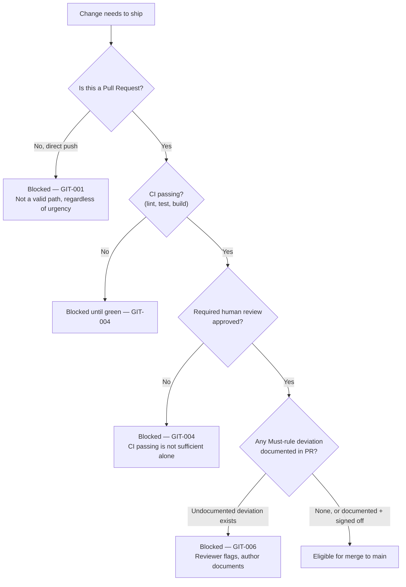

## 1.11 Workflow Diagram — Where This Chapter Sits

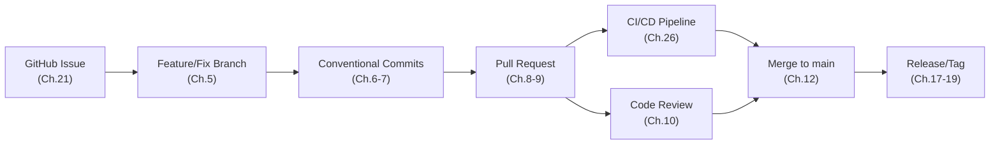

## 1.12 Checklist — Is This Change Following Git Philosophy?

- [ ] A GitHub Issue exists, or the change is trivial enough that a PR description substitutes (§1.9).
- [ ] The change reaches `main` only through a Pull Request — no direct commit was made.
- [ ] CI is green **and** a required human reviewer has approved — neither alone is treated as sufficient.
- [ ] No merged commit on `main` has been rewritten or force-pushed over.
- [ ] Any deviation from a Must-severity rule elsewhere in this handbook is written into the PR description, not silently taken.

## 1.13 Engineering Notes

- This chapter deliberately states beliefs before mechanics. Chapters 4–9 (branching, naming, commits) are all downstream implementations of GP-1 through GP-6; if a future mechanical rule ever seems to contradict a belief in this chapter, the belief wins and the mechanical rule is corrected — not the reverse.
- GP-5 and GIT-005 exist specifically because incident pressure is the single most common real-world condition under which teams erode good process. Chapter 14 (Hotfix Process) is written to give urgency a legitimate fast *path* through the existing gates, precisely so no one is ever tempted to invent an illegitimate one around them.

## 1.14 Related Documents

| Document | Relevance |
|---|---|
| `03_ARCHITECTURE.md` Decision 24.6.1 | Staged-rollout, no-fast-path deploy rule — the architectural root of GP-5/GIT-005 |
| `03_ARCHITECTURE.md` Chapter 28 (ADR Log) | The historical-record mechanism this handbook's Architecture Change Process (Chapter 35) routes into |
| `04_FOLDER_STRUCTURE.md` §2.3, Ch.17 | Monorepo/workspace structure and CI/CD folder layout this handbook's branching and pipeline chapters assume |
| `05_CODING_STANDARDS.md` §1.4–1.11 | Must/Should severity model and citation discipline, reused as-is in this handbook |
| `09_SECURITY_GUIDELINES.md` Ch.12, SECR-004 | Secret-scanning gate referenced by Chapter 26 (CI/CD Integration) |

## 1.15 Related ADR

No ADR currently exists for this chapter's beliefs — they are stated here for the first time as this handbook's foundation, not as a revision of a prior decision. Per `03_ARCHITECTURE.md` §28.4, an ADR is required only when a decision *changes* an already-recorded one; this chapter's first publication does not itself trigger an ADR entry. Any future revision to GP-1 through GP-6 **does** require one, per the same section.

## 1.16 AI Assistant Guidance

- An AI assistant generating code for LedgerOne must never propose a direct commit to `main`/`develop`, never propose a force-push over shared history, and never propose skipping review "to save time" — even when explicitly asked, the assistant should surface GIT-001/GIT-004/GIT-005 rather than comply silently.
- When an AI assistant is used to draft a Pull Request description, it must state the originating Issue (or explain why none applies, per §1.9) — an AI-authored PR is held to GIT-002 identically to a human-authored one.

## 1.17 Future Considerations

- Revisit whether GP-1's Issue-first requirement should be mechanically enforced (a bot that blocks PR creation without a linked Issue) once Issue-linking discipline is measured, rather than assumed, to be inconsistent — deferred until evidence, consistent with this handbook family's anti-speculation discipline (`03_ARCHITECTURE.md` §2.13).

---

# Chapter 2 — Repository Structure

## 2.1 Purpose

Defines what lives in the single LedgerOne Git repository, at the level Git itself cares about — not the internal folder tree (`04_FOLDER_STRUCTURE.md` owns that), but repository-level concerns: what is tracked, what is ignored, how large binary/generated content is kept out of history, and how the repository's top level maps to `.github/`, `apps/`, `packages/`, and `docs/`.

## 2.2 Responsibilities

- State that LedgerOne is one Git repository, not a constellation of repositories (Chapter 3 justifies why).
- Define what must never be committed (build output, `node_modules`, real secrets, IDE-local state).
- Define how the repository's root-level layout maps to `04_FOLDER_STRUCTURE.md`'s canonical tree, without re-deriving that tree here.

## 2.3 Rule IDs

| Rule ID | Statement | Severity | Enforcement |
|---|---|---|---|
| GIT-007 | The repository root contains only `apps/`, `packages/`, `docs/`, `.github/`, and named infrastructure folders (`scripts/`, `docker/`) per `04_FOLDER_STRUCTURE.md` §2.6 — no ad hoc top-level files or folders. | 🟡 Medium | Code Review |
| GIT-008 | Build output, dependency directories (`node_modules`, `dist`, `.next`), and IDE-local state are never committed; `.gitignore` is the single source of truth for exclusions and is never bypassed with `git add -f`. | 🔴 Critical | CI Pipeline (pre-commit hook), Code Review |
| GIT-009 | No file containing a real secret value is ever committed, at any point in history, even temporarily (restated from `09_SECURITY_GUIDELINES.md` SECR-001/004). A secret that reaches history is treated as compromised and rotated, regardless of later removal. | 🔴 Critical | CI secret-scanning |
| GIT-010 | Generated artifacts (Prisma client output, OpenAPI-generated types) are never committed; they are produced by the build/CI pipeline from committed source (`.prisma` schema, source annotations), never hand-edited or checked in. | 🟠 High | CI Pipeline |

## 2.4 Standards

1. The repository is the single, authoritative source for backend, frontend, shared packages, infrastructure-as-config, and this handbook family itself (`docs/`).
2. `.gitignore` is reviewed whenever a new tool or generated-output path is introduced — added in the same Pull Request that introduces the tool, never after the fact (mirrors `04_FOLDER_STRUCTURE.md`'s "same PR" discipline for `.env.example`).
3. Large binary assets (design exports, sample data dumps) are not committed to the application repository; they belong in the object storage mechanism `10_DEPLOYMENT_ARCHITECTURE.md` already defines (S3), referenced by URL where needed.

## 2.5 Best Practices

- Run a local pre-commit check (lint, secret-scan) before pushing, so CI failures are the exception, not routine.
- When adding a new workspace (`apps/*`, `packages/*`), confirm its `.gitignore`-relevant output paths are covered by the root `.gitignore` in the same PR that adds the workspace.

## 2.6 Common Mistakes

| Mistake | Why it's a problem | Correct behavior |
|---|---|---|
| Committing `node_modules` after a merge conflict "just to make CI pass locally" | Bloats repository history permanently; a `.gitignore` entry exists for exactly this | Delete and rely on `npm install` in CI/local |
| Adding a real `.env` value to unblock a broken local build | Leaks a secret into permanent history (GIT-009) | Use `.env.example` as a template; obtain the real value through the secrets mechanism (`09_SECURITY_GUIDELINES.md` Ch.12) |
| Hand-editing a Prisma-generated file to work around a stale client | Diverges from schema silently; breaks on next `prisma generate` | Regenerate from the `.prisma` schema; never hand-edit generated output |

## 2.7 Decision Matrix — "Does this belong in the repository?"

| Content | Committed? | Where |
|---|---|---|
| Application source code (`apps/`, `packages/`) | Yes | Canonical tree, `04_FOLDER_STRUCTURE.md` |
| `.env.example` (placeholder config documentation) | Yes | Workspace root |
| Real `.env` with live secrets | Never | Local only, `.gitignore`d; real values in AWS Secrets Manager |
| `node_modules`, `dist`, `.next`, build caches | Never | `.gitignore`d, reproduced by CI/local build |
| Prisma-generated client, OpenAPI-generated types | Never | Reproduced by `prisma generate` / codegen step in CI |
| This handbook family (`docs/*.md`) | Yes | `docs/` |
| Design exports, large sample datasets | Never | S3 (`10_DEPLOYMENT_ARCHITECTURE.md`), referenced by URL |

## 2.8 Checklist

- [ ] New workspace's generated-output paths added to `.gitignore` in the same PR.
- [ ] No real secret value appears anywhere in the diff, including example files.
- [ ] No generated/build artifact is staged.

## 2.9 Engineering Notes

Repository-level hygiene (this chapter) is intentionally thin — most of what "belongs where" is already answered by `04_FOLDER_STRUCTURE.md`'s canonical tree. This chapter exists only to state the Git-specific consequences (history permanence, secret-scanning, `.gitignore` discipline) that a folder-structure document would not naturally cover.

## 2.10 Related Documents

`04_FOLDER_STRUCTURE.md` §2.6 (canonical root tree), `09_SECURITY_GUIDELINES.md` Ch.12 (Secrets Management), Chapter 26 of this document (CI secret-scanning gate).

## 2.11 Related ADR

None — this chapter restates existing `04_FOLDER_STRUCTURE.md` and `09_SECURITY_GUIDELINES.md` decisions at the Git-mechanics level; it does not introduce a new decision requiring one.

## 2.12 AI Assistant Guidance

An AI assistant must never generate a code sample containing a realistic-looking secret value, even for `.env.example` — only placeholder/description text (per `09_SECURITY_GUIDELINES.md` ENV-004). It must never suggest `git add -f` to bypass `.gitignore`.

## 2.13 Future Considerations

Consider a `.gitattributes`-based Git LFS policy if design or data-fixture assets ever grow large enough to justify it — deferred until a concrete need is measured (no such need exists today).

---

# Chapter 3 — Monorepo Standards

## 3.1 Purpose

Restates the monorepo decision already ratified in `04_FOLDER_STRUCTURE.md` §2.3 ("Single Monorepo, Multi-Workspace") and defines its Git-specific consequences: how atomic cross-workspace commits are expected to work, how CI determines what changed, and how this handbook's branching/PR rules apply uniformly across `apps/api`, `apps/web`, and `packages/*` rather than per-workspace.

## 3.2 Responsibilities

- Confirm the monorepo decision is inherited, not re-litigated, here.
- Define what "atomic commit" means in a multi-workspace repository.
- State how a single Pull Request may legitimately span more than one workspace, and when it should not.

## 3.3 Rule IDs

| Rule ID | Statement | Severity | Enforcement |
|---|---|---|---|
| GIT-011 | A single Pull Request may modify more than one workspace (`apps/api`, `apps/web`, `packages/*`) only when the change is a single logical unit — e.g., a shared DTO change and its two consumers. Unrelated changes across workspaces are split into separate PRs (Chapter 8). | 🟠 High | Code Review |
| GIT-012 | CI (Chapter 26) determines affected workspaces from the diff and runs only the necessary build/test scope where path-based triggering is configured — this is a CI concern, not something an engineer manually restricts by splitting otherwise-atomic commits. | 🟡 Medium | CI Pipeline |
| GIT-013 | A shared package (`packages/*`) version bump and its consumers' updated usage are committed in the same Pull Request — never a package change merged with consumer updates deferred to a follow-up PR. | 🟠 High | Code Review |

## 3.4 Standards

1. The monorepo exists so a single PR can update a shared contract (DTO, event schema) and both its consumers atomically (`04_FOLDER_STRUCTURE.md` §2.3) — this handbook's branching and PR rules are written assuming that capability is used, not worked around by artificially splitting atomic changes.
2. One CI/CD pipeline, one versioning history, one place to search — this handbook does not define per-workspace branching or per-workspace release cadences; Chapter 17 (Versioning) applies platform-wide unless a chapter states otherwise.

## 3.5 Best Practices

- When a change touches a shared package and its consumers, describe the blast radius explicitly in the PR description (which consumers were updated, which were verified unaffected).
- Prefer one focused PR per logical unit of work even within a monorepo — "everything changed together" is not, by itself, a reason to bundle unrelated changes (see Chapter 8's PR-size discipline).

## 3.6 Common Mistakes

| Mistake | Why it's a problem | Correct behavior |
|---|---|---|
| Splitting a shared-DTO change from its consumer updates into two PRs, merged out of order | Leaves the repository in a broken intermediate state between merges — defeats the monorepo's atomic-commit purpose | One PR, GIT-013 |
| Bundling an unrelated frontend refactor into a backend-only bugfix PR "since I was in the monorepo anyway" | Violates GIT-011; makes the PR unreviewable as one unit (Chapter 8) | Split into two PRs |

## 3.7 Decision Matrix — "One PR or several?"

| Scenario | PR count |
|---|---|
| Shared DTO changed + both frontend and backend consumers updated | One PR |
| Backend bugfix in `apps/api` + unrelated frontend styling tweak in `apps/web` | Two PRs |
| New shared package + its first consumer wired in | One PR (package is meaningless without a consumer) |
| Two unrelated bugfixes in the same module, discovered together | Two PRs, unless trivially small (Chapter 8 discretion) |

## 3.8 Workflow Diagram

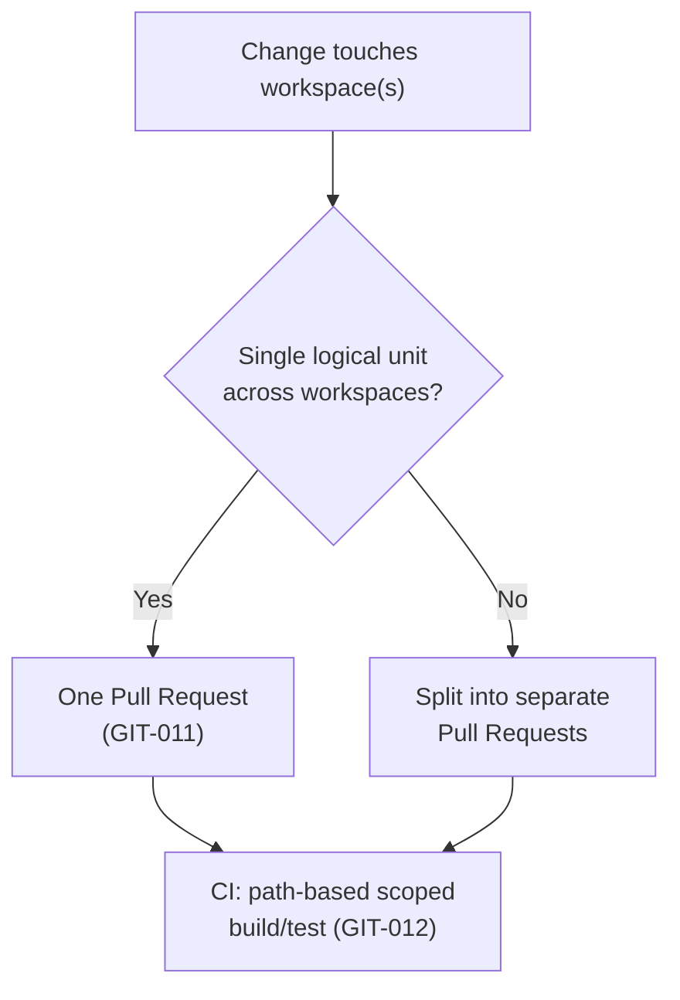

## 3.9 Checklist

- [ ] Every workspace touched in this PR is part of the same logical change.
- [ ] A shared package's version bump ships with its consumer updates in the same PR.
- [ ] PR description states the blast radius if a shared package/type changed.

## 3.10 Engineering Notes

This chapter deliberately does not re-argue monorepo vs. polyrepo — that decision, and its rejected alternatives, live in `04_FOLDER_STRUCTURE.md` §2.3–2.4. Restating the reasoning here would risk the two documents drifting out of sync as the reasoning evolves; this chapter only adds the Git-workflow-specific consequences.

## 3.11 Related Documents

`04_FOLDER_STRUCTURE.md` §2.3 (monorepo decision), §2.13 (future workspace-tooling reconsideration), Chapter 26 of this document (CI path-based triggering).

## 3.12 Related ADR

None at this time — inherits `04_FOLDER_STRUCTURE.md`'s existing decision without modification.

## 3.13 AI Assistant Guidance

When an AI assistant proposes a change spanning a shared package and its consumers, it must include the consumer updates in the same proposed diff/PR — never propose the package change alone with consumer updates as a "follow-up."

## 3.14 Future Considerations

Revisit path-based CI triggering granularity (GIT-012) once pipeline runtime, measured in practice, justifies finer-grained configuration — consistent with `04_FOLDER_STRUCTURE.md` §2.13's deferred reconsideration of monorepo tooling.

---

# Chapter 4 — Branching Strategy

## 4.1 Purpose

Defines LedgerOne's branching model: which long-lived branches exist, what each one means, and how short-lived branches flow into them. This chapter answers "what branches exist and why" — Chapter 5 answers "what do I name mine."

## 4.2 Responsibilities

- Name the long-lived branches and their guarantees.
- Define how short-lived branches (feature, fix, hotfix, chore) relate to them.
- State explicitly why LedgerOne does not adopt a heavier model (e.g., full GitFlow with parallel `develop`/`release` branches) at current team scale.

## 4.3 Decision: Trunk-Based Development with Short-Lived Release Branches

LedgerOne uses **trunk-based development**: `main` is the single long-lived integration branch, always releasable (GP-2). Short-lived branches (feature, fix, hotfix, chore — Chapter 5) branch from `main` and merge back into `main` via Pull Request. A release branch (Chapter 13) is cut from `main` only at the point of a release candidate and is intentionally short-lived — not a second permanent integration branch.

**Alternative considered — full GitFlow (`develop` + long-lived `release/*` + `main`).**
Rejected. A permanent `develop` branch reintroduces exactly the problem GP-2 exists to prevent: two branches, each claiming to represent "current," inevitably drift, and integration pain is deferred rather than eliminated. GitFlow's release-branch stabilization phase also assumes a batch-release cadence; `10_DEPLOYMENT_ARCHITECTURE.md`'s staged-rollout pipeline (`03_ARCHITECTURE.md` Decision 24.6.1) is designed for continuous, small, staged deploys from `main`, not periodic batch releases — trunk-based development is the branching model that matches the deploy model already committed to.

**Alternative considered — direct-to-`main` with no short-lived branches at all.**
Rejected. This would satisfy GP-2 but violate GIT-001/GIT-004 — there would be no Pull Request boundary for review to attach to.

## 4.4 Rule IDs

| Rule ID | Statement | Severity | Enforcement |
|---|---|---|---|
| GIT-014 | `main` is the only long-lived integration branch. No permanent `develop` branch exists. | 🔴 Critical | GitHub Branch Protection |
| GIT-015 | Every short-lived branch (feature, fix, chore, hotfix) branches from the current tip of `main` and is merged back into `main` — never into another short-lived branch, except for an explicitly stacked PR (Chapter 8.9). | 🟠 High | Code Review |
| GIT-016 | A release branch (Chapter 13) is cut only at release-candidate time, lives only as long as stabilization takes, and is deleted after its release is finalized — it is never treated as an ongoing integration target for new feature work. | 🟠 High | Engineering Review |
| GIT-017 | A short-lived branch that has been merged is deleted immediately (GitHub's "delete branch on merge" setting is enabled repository-wide). | 🟡 Medium | GitHub automation |

## 4.5 Branch Lifecycle Table

| Branch type | Branches from | Merges into | Lifetime |
|---|---|---|---|
| `main` | — (root) | — | Permanent |
| `feat/*`, `fix/*`, `chore/*`, `refactor/*`, `docs/*`, `test/*` (Chapter 5) | `main` | `main` | Duration of the work; deleted on merge |
| `hotfix/*` (Chapter 14) | `main` | `main` | Hours, typically same-day; deleted on merge |
| `release/*` (Chapter 13) | `main` (at RC cut) | Not merged — used to produce the release, then deleted | Days, for stabilization only |

## 4.6 Standards

1. No engineer branches from another engineer's unmerged feature branch except through an explicit, declared stacked-PR flow (Chapter 8.9) — otherwise, GIT-015 requires branching from `main`.
2. A branch that has been open for review longer than roughly two weeks without merging is treated as a signal to reduce its scope (Chapter 8's PR-size discipline), not to let it drift further from `main`.

## 4.7 Best Practices

- Rebase (or merge `main` into) a long-running feature branch periodically so its eventual PR is reviewed against near-current `main`, not a stale baseline.
- Prefer smaller, faster-merging branches over one large branch — this is both a review-quality practice (Chapter 10) and a branching-hygiene practice (less drift to reconcile).

## 4.8 Common Mistakes

| Mistake | Why it's a problem | Correct behavior |
|---|---|---|
| Branching a fix off a teammate's still-open feature branch informally | Creates an undeclared dependency; if the base branch is reworked, the dependent branch silently breaks | Branch from `main` (GIT-015), or use an explicit stacked-PR flow with both parties aware |
| Treating a `release/*` branch as a place to land new feature work "since it's already open" | Reintroduces GitFlow's stabilization-branch drift problem this model was chosen to avoid | New feature work always targets `main`; a release branch only receives release-blocking fixes (Chapter 13) |
| Leaving merged branches undeleted indefinitely | Clutters branch list, makes "what's actually in flight" hard to see at a glance | Enable delete-on-merge (GIT-017) |

## 4.9 Decision Tree — "Where does my branch come from, and where does it go?"

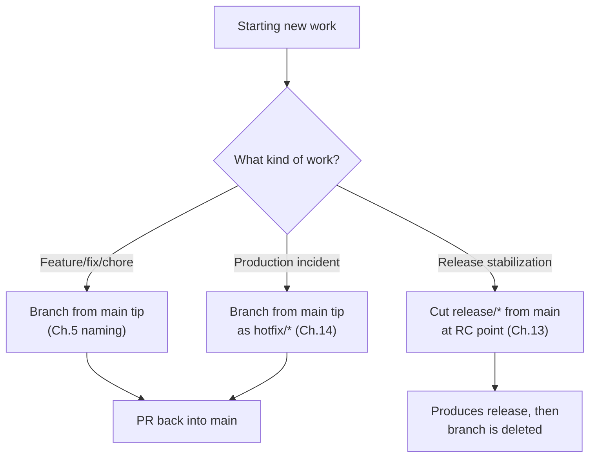

## 4.10 Checklist

- [ ] Branch was created from current `main`, not from another unmerged branch (unless explicitly stacked).
- [ ] Branch type matches its purpose (feature vs. hotfix vs. release) per §4.5.
- [ ] Long-running branches are periodically synced with `main`.

## 4.11 Engineering Notes

Trunk-based development is a deliberate match to `03_ARCHITECTURE.md` Decision 24.6.1's staged, continuous deploy model. If LedgerOne's release cadence ever shifts toward infrequent, large batch releases, this chapter's decision should be revisited via ADR (§4.13) rather than eroded informally by teams reintroducing a `develop`-like branch.

## 4.12 Related Documents

`03_ARCHITECTURE.md` Decision 24.6.1 (staged rollout), Chapter 5 (naming), Chapter 13 (release branches), Chapter 14 (hotfix process).

## 4.13 Related ADR

This chapter's trunk-based decision is foundational (first publication) and does not yet have an ADR entry. Any future move toward a different branching model (e.g., reintroducing `develop`) requires one per `03_ARCHITECTURE.md` §28.4.

## 4.14 AI Assistant Guidance

An AI assistant proposing a new branch must default to branching from `main` and must never propose creating or targeting a `develop` branch, since none exists in this model.

## 4.15 Future Considerations

Reassess trunk-based development if the team's release cadence or deployment model (`10_DEPLOYMENT_ARCHITECTURE.md`) changes materially — no such change is anticipated today.

---

# Chapter 5 — Branch Naming Convention

## 5.1 Purpose

Fixes the exact branch naming syntax every engineer and AI assistant uses, resolving the naming convention already partially specified in `04_FOLDER_STRUCTURE.md`'s naming table (`type/short-description`, e.g. `feat/journal-entry-reversal`) into a complete, unambiguous rule set.

## 5.2 Note on a Resolved Inconsistency

An earlier draft of this handbook's placeholder content referenced `feature/*` and `hotfix/*` prefixes. This chapter supersedes that with the convention already fixed by `04_FOLDER_STRUCTURE.md`'s naming table — `type/short-description`, using Conventional Commit type vocabulary (Chapter 7) as the prefix. `feat/`, not `feature/`, is canonical.

## 5.3 Rule IDs

| Rule ID | Statement | Severity | Enforcement |
|---|---|---|---|
| GIT-018 | A branch name follows `{type}/{short-description}`, where `{type}` is one of the Conventional Commit types (Chapter 7): `feat`, `fix`, `refactor`, `docs`, `test`, `chore`, `perf`, `hotfix`. | 🟠 High | Code Review, CI branch-name lint |
| GIT-019 | `{short-description}` is lowercase, hyphen-separated, and states the change in 2–6 words (e.g., `feat/journal-entry-reversal`, not `feat/fix-stuff` or `feat/JE-Reversal`). | 🟡 Medium | Code Review |
| GIT-020 | A branch name references the GitHub Issue number when one exists, appended as a suffix: `{type}/{short-description}-{issueNumber}` (e.g., `fix/invoice-rounding-1423`). | 🟡 Medium | Code Review |
| GIT-021 | `hotfix/` is reserved exclusively for Chapter 14's Hotfix Process — it is never used as a synonym for `fix/` on a non-incident change. | 🟠 High | Code Review |

## 5.4 Naming Table

| Type prefix | Used for | Example |
|---|---|---|
| `feat/` | New feature or capability | `feat/journal-entry-reversal` |
| `fix/` | Bug fix, non-incident | `fix/invoice-rounding-1423` |
| `refactor/` | Behavior-preserving restructuring | `refactor/repository-base-class` |
| `docs/` | Documentation-only change | `docs/update-api-versioning-chapter` |
| `test/` | Test-only addition/change | `test/journal-entry-service-coverage` |
| `chore/` | Tooling, dependency, config change | `chore/bump-prisma-5-18` |
| `perf/` | Performance-only change | `perf/journal-entry-query-index` |
| `hotfix/` | Production-incident fix (Chapter 14 only) | `hotfix/payment-webhook-500-2091` |

## 5.5 Standards

1. The branch type prefix must match the Conventional Commit type(s) used in the branch's commits (Chapter 7) — a `feat/` branch whose only commit is `fix: ...` signals the branch was misclassified and should be renamed or reconsidered.
2. `{short-description}` describes *what changed*, not *who's working on it* or *when* — never `feat/john-wip` or `feat/monday-task`.

## 5.6 Best Practices

- Include the Issue number (GIT-020) so `git branch` output and GitHub's branch list are independently searchable back to the originating Issue, without needing to open the PR first.
- Rename a branch early if its scope shifts enough that its original type no longer fits, rather than letting the name silently mismatch its content.

## 5.7 Common Mistakes

| Mistake | Why it's a problem | Correct behavior |
|---|---|---|
| `feature/add-invoice-export` | Wrong prefix — `feature/` was superseded (§5.2) | `feat/invoice-export` |
| `fix/johns-branch-2` | Description doesn't state the change | `fix/invoice-export-timeout-1502` |
| `hotfix/minor-typo-fix` | `hotfix/` used for a non-incident change (violates GIT-021) | `fix/typo-invoice-label` |

## 5.8 Decision Matrix — "Which prefix?"

| Question | If yes |
|---|---|
| Is this fixing a live production incident right now? | `hotfix/` (Chapter 14) |
| Does it add new user-facing or API capability? | `feat/` |
| Does it fix incorrect behavior, non-incident? | `fix/` |
| Does it restructure code with no behavior change? | `refactor/` |
| Is it test-only? | `test/` |
| Is it docs-only? | `docs/` |
| Is it tooling/config/dependency-only? | `chore/` |
| Is it a targeted performance improvement with no behavior change? | `perf/` |

## 5.9 Checklist

- [ ] Prefix is one of the eight approved types (§5.4).
- [ ] Description is lowercase, hyphenated, 2–6 words, states the change.
- [ ] Issue number appended when an Issue exists (GIT-020).
- [ ] `hotfix/` used only for an active production incident.

## 5.10 Engineering Notes

Tying branch-type vocabulary to Conventional Commit types (Chapter 7) rather than inventing a separate vocabulary keeps one mental model across branch names, commit prefixes, and (Chapter 18) SemVer-impacting commit types — an engineer learns one type vocabulary, not three.

## 5.11 Related Documents

`04_FOLDER_STRUCTURE.md` naming conventions table (origin of `type/short-description`), Chapter 7 (Conventional Commits, shared type vocabulary), Chapter 14 (Hotfix Process, `hotfix/` usage), Chapter 21 (GitHub Issues, source of the issue number in GIT-020).

## 5.12 Related ADR

None — this chapter resolves an internal inconsistency (§5.2) rather than changing an existing ratified decision; `04_FOLDER_STRUCTURE.md`'s naming table is unaffected and this chapter is fully consistent with it.

## 5.13 AI Assistant Guidance

An AI assistant creating or naming a branch must use `{type}/{short-description}` with a type from §5.4, append the Issue number when known, and never propose `feature/` or use `hotfix/` for a non-incident change.

## 5.14 Future Considerations

Consider a CI branch-name lint step (rejecting a PR whose branch name doesn't match §5.4's pattern) once GIT-018 compliance is measured to need mechanical enforcement beyond code review — deferred until evidence.

---

# PART II — COMMITS & PULL REQUESTS

# Chapter 6 — Commit Message Standards

## 6.1 Purpose

Defines what makes a commit message acceptable at LedgerOne, independent of the specific Conventional Commits syntax (Chapter 7 fixes the syntax). This chapter states *why* commit message quality matters here specifically: commit history is a searchable audit trail for a financial system, not just a developer convenience.

## 6.2 Responsibilities

- Define the structural parts of a commit message (subject, body, footer) and when each is required.
- State the relationship between a commit message and the PR it belongs to.
- Define what a commit message must never contain.

## 6.3 Rule IDs

| Rule ID | Statement | Severity | Enforcement |
|---|---|---|---|
| GIT-022 | A commit subject line is imperative mood, under 72 characters, and does not end with a period (`fix: correct rounding in invoice totals`, not `Fixed rounding.`). | 🟡 Medium | Code Review, commit-lint CI check |
| GIT-023 | A commit body is required whenever the subject line alone cannot convey *why* the change was made — not merely *what* changed (identifiers already say what; per `05_CODING_STANDARDS.md`'s comment philosophy applied to commits). | 🟠 High | Code Review |
| GIT-024 | No commit message contains a secret value, internal credential, or customer-identifying data, in subject, body, or footer. | 🔴 Critical | CI secret-scanning |
| GIT-025 | A commit that fixes a defect references the GitHub Issue in its footer (`Fixes #1423`), which auto-closes the Issue on merge to `main`. | 🟡 Medium | Code Review |

## 6.4 Standards

1. Subject line: `{type}({scope}): {imperative summary}` — full syntax in Chapter 7.
2. Body (when present): explains the reasoning, trade-off, or context a future reader would need — never restates the diff in prose.
3. Footer (when present): Issue references (`Fixes #1423`, `Refs #1502`), and `BREAKING CHANGE:` notes per Chapter 7.

## 6.5 Best Practices

- Write the commit message before writing the code, as a one-line statement of intent — if it's hard to write, the change may be trying to do more than one thing.
- Prefer several small, well-described commits within a branch over one large "final" commit — reviewers can review incrementally (Chapter 10), and `git bisect` (Chapter 29) stays useful.

## 6.6 Common Mistakes

| Mistake | Why it's a problem | Correct behavior |
|---|---|---|
| `fix: fixed the bug` | Says nothing searchable; no future reader can tell what bug | `fix(billing): correct rounding in invoice totals over $10,000` |
| `wip`, `more changes`, `asdf` | Actively harms `git log`/`git blame` usefulness | Squash into a properly described commit before merge (Chapter 12) |
| Pasting a stack trace containing a request payload with customer data into a commit body | Violates GIT-024 and `09_SECURITY_GUIDELINES.md`'s data-handling rules | Reference the Issue/incident ticket instead; redact before ever committing |

## 6.7 Decision Matrix — "Does this commit need a body?"

| Situation | Body required? |
|---|---|
| Subject fully explains a self-evident change (e.g., `docs: fix typo in Ch.6`) | No |
| Change involves a non-obvious trade-off or workaround | Yes — explain why |
| Change fixes a subtle bug whose root cause isn't obvious from the diff | Yes — explain the root cause |
| Routine dependency bump with no behavior change | No |

## 6.8 Checklist

- [ ] Subject is imperative, under 72 characters, no trailing period.
- [ ] Body present where the *why* isn't obvious from the diff alone.
- [ ] No secret, credential, or customer data anywhere in the message.
- [ ] Issue reference in footer when applicable.

## 6.9 Engineering Notes

Commit message quality compounds: `git blame` on a financial-calculation function five years from now is only as useful as the discipline applied today. This is a case where the cost (a few extra seconds per commit) is paid by the author and the benefit is captured by someone else, later — exactly the kind of externality a written standard exists to correct.

## 6.10 Related Documents

Chapter 7 (Conventional Commits syntax), Chapter 21 (GitHub Issues), Chapter 29 (Rollback Strategy — relies on clean, bisectable history), `09_SECURITY_GUIDELINES.md` (data-handling in logs and, by extension, commit messages).

## 6.11 Related ADR

None — foundational, first publication.

## 6.12 AI Assistant Guidance

An AI assistant generating a commit message must follow §6.3–6.4's structure, write in imperative mood, never fabricate a body that merely restates the diff, and never include example data that resembles a real secret or customer record.

## 6.13 Future Considerations

Consider adopting `commitlint` as a CI check enforcing GIT-022's format mechanically, once manual review-based enforcement is measured to let enough malformed messages through to justify the tooling investment.

---

# Chapter 7 — Conventional Commits

## 7.1 Purpose

Fixes the exact Conventional Commits syntax LedgerOne uses, resolving the abbreviated list already present in the prior placeholder (`feat:`, `fix:`, `refactor:`, `docs:`, `test:`) into a complete, closed type vocabulary shared with branch naming (Chapter 5) and SemVer impact (Chapter 18).

## 7.2 Syntax

```
{type}({scope}): {imperative summary}

{optional body}

{optional footer(s)}
```

## 7.3 Rule IDs

| Rule ID | Statement | Severity | Enforcement |
|---|---|---|---|
| GIT-026 | `{type}` is exactly one of: `feat`, `fix`, `refactor`, `perf`, `docs`, `test`, `chore`, `build`, `ci`, `style`. No other type is used. | 🟠 High | Code Review, commit-lint CI check |
| GIT-027 | `{scope}` names the affected module or workspace (e.g., `accounting`, `sales`, `web`, `api`) using `03_ARCHITECTURE.md`/`04_FOLDER_STRUCTURE.md`'s existing module vocabulary — never an invented ad hoc scope name. | 🟡 Medium | Code Review |
| GIT-028 | A breaking change is marked with `!` after the type/scope (`feat(api)!: ...`) **and** a `BREAKING CHANGE:` footer explaining the break — both, never one alone. | 🔴 Critical | Code Review |
| GIT-029 | `feat` and `fix` types are the only ones that affect the SemVer-relevant changelog (Chapter 18, Chapter 20) — `chore`, `ci`, `build`, `style`, `test`, `docs` are excluded from user-facing release notes. | 🟡 Medium | Release tooling (Chapter 20) |

## 7.4 Type Vocabulary Table

| Type | Meaning | SemVer impact (Ch.18) |
|---|---|---|
| `feat` | New capability | Minor (or Major if `!`) |
| `fix` | Bug fix | Patch (or Major if `!`) |
| `refactor` | Behavior-preserving restructuring | None |
| `perf` | Performance improvement, no behavior change | None (Patch if user-visible latency claim is made) |
| `docs` | Documentation only | None |
| `test` | Test-only | None |
| `chore` | Tooling, dependency, config | None |
| `build` | Build system/packaging change | None |
| `ci` | CI/CD pipeline configuration change | None |
| `style` | Formatting only, no logic change | None |

## 7.5 Standards

1. One commit, one type — a commit that is genuinely both a `feat` and a `fix` is split into two commits.
2. `{scope}` is required for any commit touching a specific module; omitted only for truly cross-cutting changes (e.g., a root `tsconfig.json` change).

## 7.6 Best Practices

- Use `feat(accounting): add journal entry reversal` rather than `feat: add journal entry reversal` whenever a scope is knowable — scope is what makes Chapter 20's auto-generated release notes readable by module.
- Reserve `!`/`BREAKING CHANGE:` for changes that genuinely require `07_REST_API_STANDARDS.md`'s version-bump sign-off (Decision 26.6.1) — not for internal refactors with no external contract impact.

## 7.7 Common Mistakes

| Mistake | Why it's a problem | Correct behavior |
|---|---|---|
| `update: fixed stuff` | `update` is not an approved type (violates GIT-026) | `fix(billing): correct rounding in invoice totals` |
| `feat(api)!: ...` with no `BREAKING CHANGE:` footer | Violates GIT-028 — the footer is what release tooling (Chapter 20) actually parses | Include both the `!` and the footer |
| Marking an internal-only refactor as `feat` because "it's new code" | Misrepresents the change's SemVer impact, inflating the next release to Minor unnecessarily | `refactor(...)`, no version impact |

## 7.8 Decision Tree — "What type is my commit?"

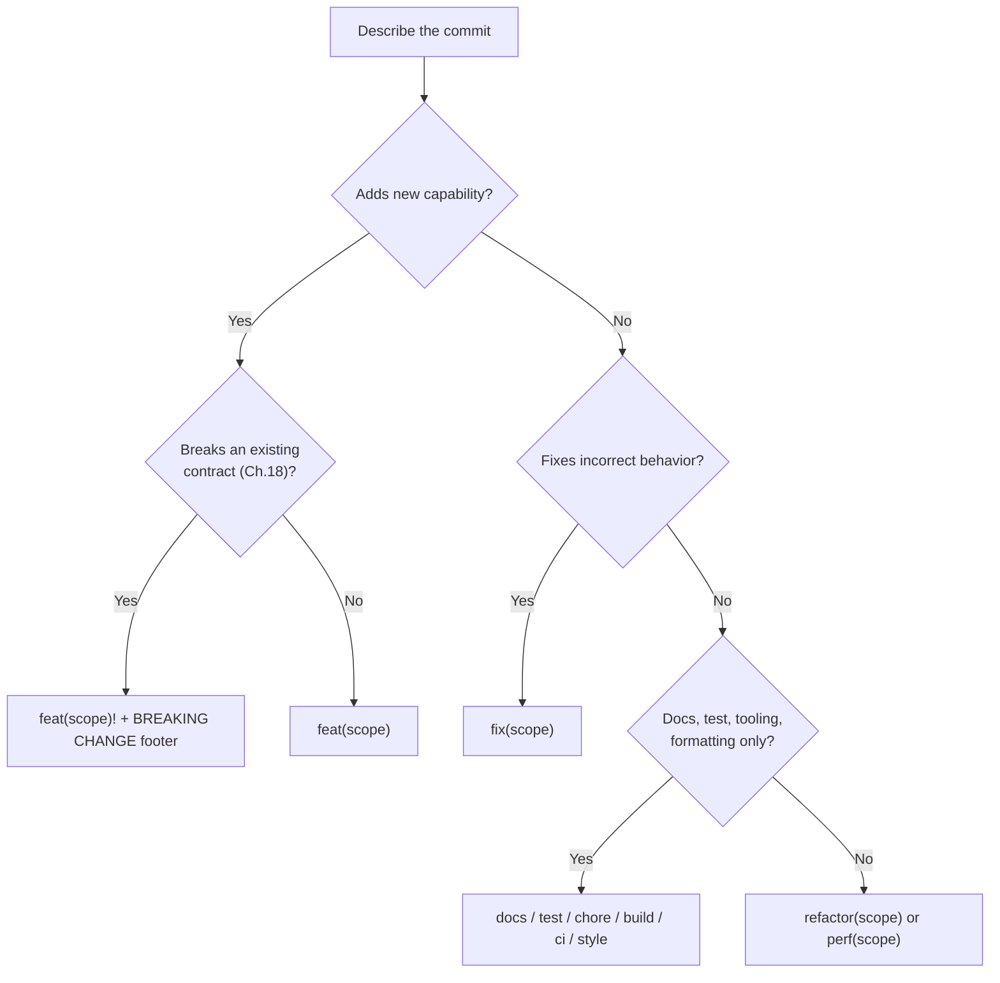

## 7.9 Checklist

- [ ] Type is one of the ten approved values (§7.4).
- [ ] Scope matches an existing module/workspace name.
- [ ] Breaking change has both `!` and `BREAKING CHANGE:` footer.
- [ ] Type accurately reflects SemVer impact, not inflated or understated.

## 7.10 Engineering Notes

The type vocabulary is deliberately the same list used for branch prefixes (Chapter 5) minus `hotfix` (which is a branching concept, not a commit-type concept — a hotfix's commits are still typed `fix`/`feat` normally). One vocabulary, two contexts.

## 7.11 Related Documents

Chapter 5 (branch naming, shared vocabulary), Chapter 18 (Semantic Versioning, consumes commit types), Chapter 20 (Release Notes, auto-generated from `feat`/`fix` commits), `07_REST_API_STANDARDS.md` Decision 26.6.1 (breaking-change sign-off).

## 7.12 Related ADR

None — foundational, first publication.

## 7.13 AI Assistant Guidance

An AI assistant authoring commits must select from the exact ten-type vocabulary in §7.4, never invent a type, and must flag (not silently decide) when a change's breaking-change status is ambiguous — ambiguity here should surface for human sign-off per `07_REST_API_STANDARDS.md` Decision 26.6.1, not be resolved unilaterally.

## 7.14 Future Considerations

If release-note automation (Chapter 20) ever needs finer granularity than ten types, extend the vocabulary via this chapter's amendment process (Chapter 37) rather than letting ad hoc types accumulate informally.

---

# Chapter 8 — Pull Request Standards

## 8.1 Purpose

Defines what makes a Pull Request mergeable at LedgerOne beyond the mechanical CI/review gate (GIT-004) — size, scope, description quality, and draft-vs-ready state.

## 8.2 Responsibilities

- Define PR size and scope expectations.
- Define the Draft PR convention and when to use it.
- Define the stacked-PR exception referenced in Chapter 4.

## 8.3 Rule IDs

| Rule ID | Statement | Severity | Enforcement |
|---|---|---|---|
| GIT-030 | A Pull Request implements one logical change, reviewable in one sitting (mirrors `05_CODING_STANDARDS.md` §1's PR-size principle). A PR mixing unrelated concerns is split (Chapter 3's monorepo exception aside). | 🟠 High | Code Review |
| GIT-031 | A Pull Request is opened as **Draft** until it is ready for review; converting Draft → Ready for Review is the explicit signal that review should begin. | 🟡 Medium | Code Review |
| GIT-032 | A Pull Request description follows the template (Chapter 9) in full — an empty or placeholder-only description is not acceptable. | 🟠 High | Code Review |
| GIT-033 | A stacked PR (one PR targeting another unmerged PR's branch instead of `main`) is permitted only when explicitly declared as stacked in both PR descriptions, with the dependency order stated. | 🟡 Medium | Code Review |

## 8.4 Standards

1. Target PR size: a diff a reviewer can hold in working memory in one pass — as a guideline, under ~400 lines of net change, excluding generated/lock files; larger is not automatically rejected but requires the author to justify why it wasn't split (mirrors GIT-006's deviation-documentation pattern).
2. A PR's title follows Conventional Commits syntax (Chapter 7) — it becomes the squash-merge commit subject (Chapter 12).

## 8.5 Best Practices

- Open a Draft PR as soon as a branch has meaningful, if incomplete, progress — this surfaces direction early and invites course-correction before more work is sunk into a wrong approach.
- When a change genuinely cannot be split (e.g., a cross-cutting rename), say so explicitly in the description rather than leaving the reviewer to wonder why the PR is large.

## 8.6 Common Mistakes

| Mistake | Why it's a problem | Correct behavior |
|---|---|---|
| A 2,000-line PR bundling three unrelated features | Violates GIT-030; effectively unreviewable, forces rubber-stamp approval | Split into three PRs, or justify explicitly if truly indivisible |
| Marking a PR "Ready for Review" while it's still failing CI locally | Wastes reviewer time reviewing code that isn't yet stable | Keep as Draft until CI-clean |
| An empty PR description with just a title | Violates GIT-032 — reviewer has no stated context | Fill out the template (Chapter 9) |

## 8.7 Decision Matrix — "Should I split this PR?"

| Signal | Split? |
|---|---|
| Touches more than one module for unrelated reasons | Yes |
| Over ~400 lines net change with no structural reason it must be one unit | Consider splitting, or justify in description |
| One shared type change + its direct consumers (Chapter 3) | No — this is the atomic-unit case |
| Reviewer explicitly requests a split during review | Yes |

## 8.8 Checklist

- [ ] PR is one logical, reviewable change.
- [ ] Draft until genuinely ready; converted explicitly when ready.
- [ ] Description fully completed per Chapter 9's template.
- [ ] Any stacked-PR dependency is declared explicitly.

## 8.9 Stacked PRs

A stacked PR targets another open PR's branch rather than `main`, used when work B genuinely depends on work A that hasn't merged yet. Both PR descriptions must state the stack order (`Stacked on #1201`) so reviewers and CI understand the dependency. Once the base PR merges, the dependent PR's target is retargeted to `main` automatically by GitHub.

## 8.10 Engineering Notes

PR-size discipline (GIT-030) is the single highest-leverage rule in this chapter — nearly every downstream review-quality problem (Chapter 10) traces back to a PR that was too large to review carefully in one sitting.

## 8.11 Related Documents

`05_CODING_STANDARDS.md` §1 (PR-size-and-reviewability principle, restated here at the Git-process level), Chapter 9 (PR Template), Chapter 10 (Code Review Process), Chapter 12 (Merge Strategy — squash uses PR title).

## 8.12 Related ADR

None — foundational, first publication.

## 8.13 AI Assistant Guidance

An AI assistant proposing a large multi-concern change should proactively suggest splitting it into multiple PRs before generating one large diff, rather than producing an unreviewable single PR by default.

## 8.14 Future Considerations

Consider a CI check that flags (not blocks) PRs exceeding a line-count threshold, prompting the author to confirm the size is justified — deferred until PR-size drift is measured as a recurring problem.

---

# Chapter 9 — Pull Request Template

## 9.1 Purpose

Defines the required sections of every Pull Request description (GIT-032), so review context is consistent and complete regardless of author.

## 9.2 Required Template Sections

| Section | Content |
|---|---|
| **Summary** | One to three sentences: what changed and why (references the Issue — Chapter 21). |
| **Type of Change** | One of: Feature / Bug Fix / Refactor / Docs / Chore / Hotfix — matches the branch/commit type (Chapters 5, 7). |
| **Related Issue(s)** | `Fixes #1423` / `Refs #1502`. |
| **Changes Made** | Bullet list of the concrete changes, at a level a reviewer can use as a map of the diff. |
| **Testing Performed** | What was tested and how (unit, integration, manual) — per Definition of Done (Chapter 39). |
| **Screenshots/Recordings** | Required for any frontend-visible change (`08_FRONTEND_STANDARDS.md`); N/A otherwise. |
| **Breaking Changes** | Explicit "None" or a description matching a `BREAKING CHANGE:` commit footer (Chapter 7). |
| **Deviation Justification** | Required only if a Must-severity rule was deviated from (GIT-006); "N/A" otherwise. |
| **Rollback Plan** | How this change would be reverted if it caused a production issue (Chapter 29) — required for anything touching a migration, external integration, or payment flow; optional for low-risk changes. |

## 9.3 Rule IDs

| Rule ID | Statement | Severity | Enforcement |
|---|---|---|---|
| GIT-034 | Every section in §9.2 is present in every Pull Request description; sections that don't apply are marked "N/A" explicitly rather than deleted. | 🟠 High | Code Review |
| GIT-035 | "Testing Performed" states the actual testing done — a PR is not eligible for merge with this section left blank or stating only "tests pass" with no specifics for a non-trivial change. | 🟠 High | Code Review |
| GIT-036 | Any migration-touching, external-integration-touching, or payment-flow-touching PR includes a completed Rollback Plan, not "N/A" (cross-referenced with Chapter 29). | 🔴 Critical | Code Review |

## 9.4 Standards

The template is enforced via GitHub's `.github/PULL_REQUEST_TEMPLATE.md` mechanism (a file, not a manually retyped structure) so every new PR is pre-populated with the required headings — an author fills in content, never invents the structure from memory.

## 9.5 Best Practices

- Fill in "Changes Made" as a genuine map of the diff, not a restatement of the Summary — a reviewer should be able to open the diff with this list as a guide.
- Attach a before/after screenshot for any visual change, even a small one — `08_FRONTEND_STANDARDS.md`'s UX consistency goals are hard for a reviewer to assess from a text diff alone.

## 9.6 Common Mistakes

| Mistake | Why it's a problem | Correct behavior |
|---|---|---|
| Deleting the "Breaking Changes" section instead of writing "None" | A reviewer can't distinguish "considered and none" from "never considered" | Always state explicitly |
| "Testing Performed: tests pass" on a PR touching a payment webhook | Doesn't demonstrate the specific risk was addressed | State which specific scenarios were tested (e.g., "verified idempotent retry on duplicate webhook delivery") |
| Skipping the Rollback Plan on a migration PR | Violates GIT-036 — migrations are exactly the highest-cost-to-reverse change type (`06_DATABASE_STANDARDS.md` Ch.11) | Complete the section |

## 9.7 Checklist

- [ ] All template sections present, "N/A" used explicitly where not applicable.
- [ ] Testing Performed is specific, not generic.
- [ ] Rollback Plan completed for migration/integration/payment changes.
- [ ] Screenshots attached for visible frontend changes.

## 9.8 Engineering Notes

The template's Rollback Plan section is this handbook's earliest connection point to Chapter 29 — deliberately placed at PR-authoring time, not deferred to incident time, because a rollback plan is far easier to reason about while the change is fresh in the author's mind than during a live incident.

## 9.9 Related Documents

Chapter 21 (Issues, linked in Related Issues), Chapter 29 (Rollback Strategy), Chapter 39 (Definition of Done, testing expectations), `08_FRONTEND_STANDARDS.md` (screenshot expectation for visual changes).

## 9.10 Related ADR

None — foundational, first publication.

## 9.11 AI Assistant Guidance

An AI assistant drafting a PR description must complete every section in §9.2 with real content or an explicit "N/A" — never omit a section, and never fabricate testing claims not actually performed.

## 9.12 Future Considerations

Consider adding a template checkbox that CI can verify was checked (a lightweight "did you fill this out" mechanical gate) if template-skipping is measured as a recurring problem.

---

# Chapter 10 — Code Review Process

## 10.1 Purpose

Defines how a Pull Request is reviewed: required approvals, reviewer responsibilities, response-time expectations, and how review disagreements are resolved. This chapter operationalizes GP-4 ("no change reaches `main` without human review").

## 10.2 Responsibilities

- Define minimum required approvals and who can grant them (Chapter 11 — Code Ownership — layers on top of this).
- Define reviewer and author responsibilities during the review conversation.
- Define how a blocking disagreement escalates.

## 10.3 Rule IDs

| Rule ID | Statement | Severity | Enforcement |
|---|---|---|---|
| GIT-037 | Every Pull Request requires at least one approval from a reviewer who is not the author before merge; a PR touching a Code-Owned path (Chapter 11) additionally requires that owner's approval. | 🔴 Critical | GitHub Branch Protection (required reviews) |
| GIT-038 | A reviewer cites a specific Rule ID (this handbook, `05_CODING_STANDARDS.md`, or another approved document) when raising a blocking objection — "this feels off" is not a valid blocking comment (mirrors `05_CODING_STANDARDS.md` §1.11's citation discipline). | 🟠 High | Code Review |
| GIT-039 | A reviewer responds to a review request (approve, request changes, or comment) within one business day; if unavailable, they reassign rather than let the PR go silently unreviewed. | 🟡 Medium | Team Collaboration norm (Chapter 32) |
| GIT-040 | An author does not merge their own Pull Request, even with sufficient permissions, until required approvals are actually granted — approval count is never worked around by self-merging. | 🔴 Critical | GitHub Branch Protection |
| GIT-041 | A blocking disagreement between author and reviewer that isn't resolved after one round of discussion is escalated to a third reviewer or Engineering Review (Chapter 37) — it is never resolved by the author unilaterally overriding the objection. | 🟠 High | Engineering Review |

## 10.4 Reviewer Responsibilities

1. Verify the change matches its stated Issue/PR description (Chapter 9).
2. Check for correctness, not just style — CI already checks style/lint; a human reviewer's value is judgment CI cannot express (per `05_CODING_STANDARDS.md` §1's division of labor).
3. Verify test coverage matches the risk of the change (Chapter 39 — Definition of Done).
4. Confirm any Must-rule deviation (GIT-006) is genuinely justified, not just present.

## 10.5 Author Responsibilities

1. Respond to every review comment — either with a change or a stated reason it wasn't applied; comments are never silently ignored.
2. Re-request review explicitly after addressing feedback, rather than assuming a reviewer is watching for updates.
3. Keep the PR in the size range Chapter 8 defines — a reviewer struggling with a PR's size is a signal to split it, not push through faster.

## 10.6 Standards

Two-reviewer minimum applies for changes to: authentication/authorization code (`09_SECURITY_GUIDELINES.md`), database migrations (`06_DATABASE_STANDARDS.md` Ch.11), and this handbook itself (mirrors `05_CODING_STANDARDS.md` §1.7's two-reviewer amendment rule). All other changes require the one-reviewer minimum (GIT-037).

## 10.7 Best Practices

- Review in small batches, frequently, rather than one long session at the end of the day — this keeps GIT-039's response-time expectation realistic.
- Distinguish blocking comments ("must fix before merge") from non-blocking suggestions ("consider, but not required") explicitly in the comment itself, so an author isn't left guessing which comments gate the merge.

## 10.8 Common Mistakes

| Mistake | Why it's a problem | Correct behavior |
|---|---|---|
| Approving without reading the diff, based on trust in the author | Defeats GP-4's purpose entirely | Review every PR on its merits, regardless of author seniority (GP-5) |
| "LGTM" with no comments on a security-sensitive change | Doesn't demonstrate the judgment-based review GP-4 exists for | Note specifically what was checked, especially on security/migration changes |
| Author merges their own PR after getting one Slack thumbs-up instead of a formal GitHub approval | Violates GIT-040; bypasses the auditable review record | Wait for a recorded GitHub approval |

## 10.9 Decision Tree — "Is this PR ready to merge?"

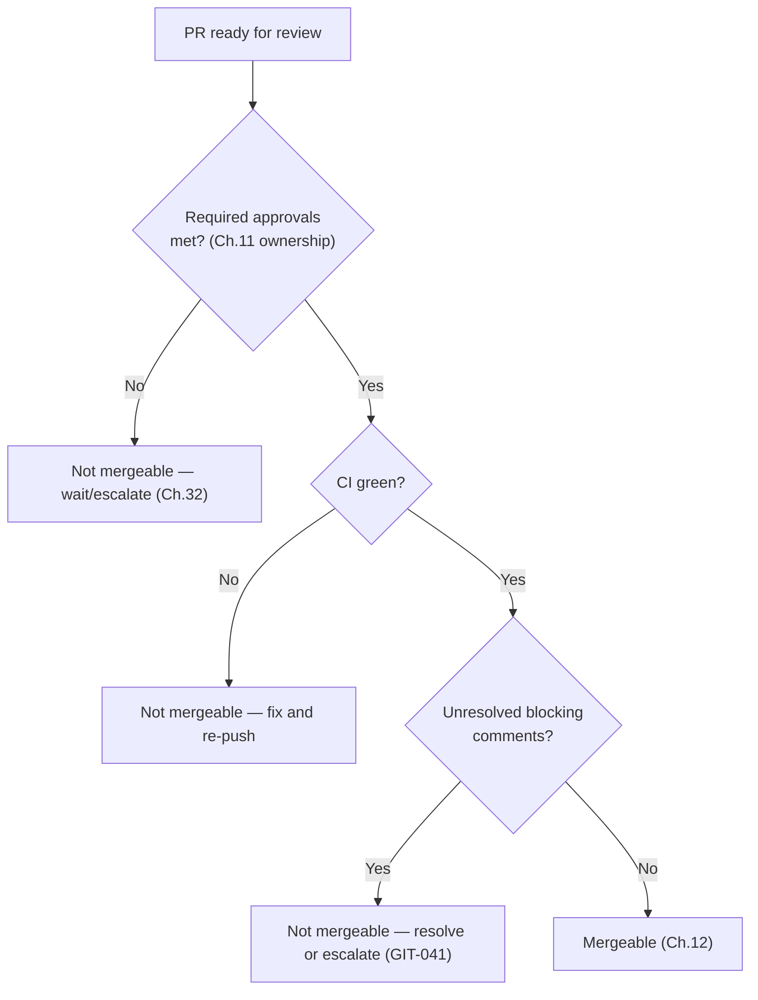

## 10.10 Checklist

- [ ] Required approvals obtained, including Code Owner sign-off where applicable.
- [ ] All blocking comments resolved or escalated — none silently dismissed.
- [ ] Two-reviewer threshold met for auth/migration/handbook changes (§10.6).
- [ ] Author did not self-merge.

## 10.11 Engineering Notes

GIT-038's citation discipline exists for the same reason `05_CODING_STANDARDS.md` §1.11 states it: a reviewer's authority comes from a citable, checkable standard, not from seniority or confidence of tone. This keeps review quality consistent across reviewers of very different experience levels.

## 10.12 Related Documents

`05_CODING_STANDARDS.md` §1 (review philosophy, citation discipline), Chapter 11 (Code Ownership), Chapter 32 (Team Collaboration — escalation norms), Chapter 37 (Engineering Governance — escalation path), Chapter 39 (Definition of Done).

## 10.13 Related ADR

None — foundational, first publication.

## 10.14 AI Assistant Guidance

An AI assistant may draft review comments as a first pass (e.g., a static-analysis-style summary), but its output is never treated as satisfying GIT-037's human-reviewer requirement — an AI-generated review comment still requires a human reviewer's actual approval before merge.

## 10.15 Future Considerations

Consider CODEOWNERS-driven automatic reviewer assignment (ties into Chapter 11) once team size makes manual reviewer selection an observable bottleneck.

---

# Chapter 11 — Code Ownership

## 11.1 Purpose

Defines how module ownership (already established conceptually in `03_ARCHITECTURE.md`'s Bounded Context model, Ch.6) maps onto GitHub's `CODEOWNERS` mechanism, so that a Pull Request touching a given module automatically requires sign-off from an engineer accountable for it.

## 11.2 Responsibilities

- Map `04_FOLDER_STRUCTURE.md`'s module folders to owning teams/individuals.
- Define what ownership grants and what it does not (it is not a gatekeeping veto beyond Chapter 10's citation-based review discipline).

## 11.3 Rule IDs

| Rule ID | Statement | Severity | Enforcement |
|---|---|---|---|
| GIT-042 | A `.github/CODEOWNERS` file maps each module path (`apps/api/src/modules/{module}/`, per `04_FOLDER_STRUCTURE.md`) to its owning team; every module has a named owner — no module is ownerless. | 🟠 High | GitHub Branch Protection (required review from code owners) |
| GIT-043 | Shared packages (`packages/*`) and cross-cutting infrastructure (`.github/`, root config) are owned by a platform/infrastructure owning group, distinct from individual module owners. | 🟡 Medium | GitHub CODEOWNERS |
| GIT-044 | Code ownership grants required-reviewer status (Chapter 10), not unilateral veto — an owner's blocking objection is still subject to GIT-038's citation requirement and GIT-041's escalation path. | 🟡 Medium | Code Review |

## 11.4 Standards

Ownership mirrors the module list `03_ARCHITECTURE.md` Ch.1.3/6 already defines — this chapter does not invent a new ownership boundary, it wires the existing one into GitHub's enforcement mechanism.

## 11.5 Best Practices

- Update `CODEOWNERS` in the same PR that creates a new module or shared package (mirrors `04_FOLDER_STRUCTURE.md`'s "same PR" discipline) — never retroactively.
- When ownership changes (team reorganization), update `CODEOWNERS` explicitly rather than leaving it to silently drift from who's actually accountable.

## 11.6 Common Mistakes

| Mistake | Why it's a problem | Correct behavior |
|---|---|---|
| A new module shipped without a corresponding `CODEOWNERS` entry | Violates GIT-042; the module has no accountable required reviewer | Add the entry in the same PR |
| Treating a Code Owner's "request changes" as automatically final regardless of merit | Violates GIT-044 — ownership isn't an override of the citation/escalation discipline | Owner's objection still needs a Rule ID citation; escalate if unresolved |

## 11.7 Checklist

- [ ] Every module has a `CODEOWNERS` entry.
- [ ] New module/package PRs include the `CODEOWNERS` update.
- [ ] Ownership changes are reflected promptly, not left stale.

## 11.8 Engineering Notes

Code ownership is deliberately thin in this handbook — it is a routing mechanism for Chapter 10's review requirement, not a separate governance layer with its own rules. This avoids the common anti-pattern of ownership becoming a political veto disconnected from the actual review-quality discipline Chapter 10 establishes.

## 11.9 Related Documents

`03_ARCHITECTURE.md` Ch.1.3/6 (module/Bounded Context list), `04_FOLDER_STRUCTURE.md` (module folder structure), Chapter 10 (Code Review Process).

## 11.10 Related ADR

None — foundational, first publication.

## 11.11 AI Assistant Guidance

When an AI assistant scaffolds a new module or shared package, it should flag that a corresponding `CODEOWNERS` entry is needed, per GIT-042.

## 11.12 Future Considerations

Revisit ownership granularity (module-level vs. finer-grained sub-path ownership) if a module grows large enough that a single owning team can no longer meaningfully review all of it.

---

# PART III — MERGING & RELEASE MANAGEMENT

# Chapter 12 — Merge Strategy

## 12.1 Purpose

Fixes exactly how a Pull Request's commits land on `main`, resolving history-cleanliness (GP-3) against traceability.

## 12.2 Decision: Squash Merge Only

Every Pull Request merges into `main` via **squash merge**. The PR's commits are combined into a single commit on `main`, whose message is the PR title (Conventional Commits format, Chapter 7) plus a body linking the PR and Issue.

**Alternative considered — merge commit (preserving all individual commits).**
Rejected as the default: individual in-branch commits (`wip`, fixup commits, review-feedback commits) are useful during review but add noise to `main`'s permanent history: `git log main` should read as one line per shipped change, not per edit-review cycle.

**Alternative considered — rebase-and-merge (linear history, individual commits preserved).**
Considered for cases where a PR's individual commits are independently meaningful (e.g., a large refactor landed as several logically distinct steps). Not the default, because it requires every commit within the PR to independently meet Chapter 6's commit-message standard, which squash-merge doesn't require of in-progress commits — reserved as an explicit, reviewer-agreed exception (§12.4).

## 12.3 Rule IDs

| Rule ID | Statement | Severity | Enforcement |
|---|---|---|---|
| GIT-045 | The default and required merge method is **squash merge**; GitHub's repository setting disables merge-commit and rebase-merge as selectable options except where GIT-046 applies. | 🔴 Critical | GitHub Branch Protection (merge method restriction) |
| GIT-046 | Rebase-and-merge is permitted only when explicitly agreed between author and reviewer in the PR description, and only when every individual commit in the branch independently satisfies Chapter 6's commit-message standard. | 🟡 Medium | Code Review |
| GIT-047 | The squash-merge commit message uses the PR title as its subject (already Conventional-Commits-formatted per Chapter 8.4) and includes `Fixes #{issue}` in the body when applicable. | 🟡 Medium | Code Review, GitHub PR merge UI |

## 12.4 Standards

1. In-branch commit hygiene during review (fixup commits, `wip` commits) is acceptable — it is squashed away and never reaches `main`.
2. The final PR title, not any individual in-branch commit message, is what Chapter 20's release notes are generated from.

## 12.5 Best Practices

- Keep the PR title accurate throughout review — if scope changes materially during review, update the title before merge so the squashed commit message reflects the final change.
- Use fixup commits (`git commit --fixup`) liberally during review iteration; they disappear on squash regardless.

## 12.6 Common Mistakes

| Mistake | Why it's a problem | Correct behavior |
|---|---|---|
| Manually squashing commits locally before pushing, then requesting merge-commit | Adds unnecessary local ceremony; GitHub's squash merge does this automatically at merge time | Push normally, let GitHub squash at merge |
| PR title left as a stale draft description after scope changed during review | Squash-merge commit message on `main` misrepresents what actually shipped | Update the PR title before merge |

## 12.7 Checklist

- [ ] Merge method used is squash, unless GIT-046's exception was explicitly agreed.
- [ ] PR title accurately reflects the final shipped change at merge time.
- [ ] Issue auto-close reference present where applicable.

## 12.8 Engineering Notes

Squash-merge-only is what makes Chapter 29's rollback strategy (`git revert` of a single commit) mechanically simple — a rollback of a squash-merged change is always a single, clean revert, never a multi-commit untangling exercise.

## 12.9 Related Documents

Chapter 6 (Commit Message Standards), Chapter 7 (Conventional Commits), Chapter 20 (Release Notes — generated from squash-merge commit subjects), Chapter 29 (Rollback Strategy).

## 12.10 Related ADR

None — foundational, first publication.

## 12.11 AI Assistant Guidance

An AI assistant should never instruct a developer to manually rewrite/squash commits locally before pushing "to keep history clean" — that is GitHub's job at merge time, per this chapter.

## 12.12 Future Considerations

None identified — squash-merge-only is a stable, low-maintenance default consistent with trunk-based development (Chapter 4).

---

# Chapter 13 — Release Branches

## 13.1 Purpose

Defines the narrow, short-lived role a `release/*` branch plays (introduced conceptually in Chapter 4.3): stabilizing a release candidate without becoming a second integration branch.

## 13.2 Rule IDs

| Rule ID | Statement | Severity | Enforcement |
|---|---|---|---|
| GIT-048 | A `release/{version}` branch (e.g., `release/2.4.0`) is cut from `main` only at the moment a release candidate is declared (Chapter 17), never earlier as a staging area for in-progress work. | 🟠 High | Engineering Review |
| GIT-049 | Only release-blocking fixes (a regression found during release stabilization) are committed to a `release/*` branch, via the same PR/review process as any other change (GIT-001–GIT-004 apply unchanged). | 🔴 Critical | Code Review |
| GIT-050 | Every fix committed to a `release/*` branch is also merged (cherry-picked or re-applied via PR) back into `main`, so `main` never regresses relative to a shipped release. | 🔴 Critical | Code Review |
| GIT-051 | A `release/*` branch is deleted once its release is finalized (tagged, per Chapter 19) — it is never reused for the next release. | 🟡 Medium | GitHub automation |

## 13.3 Standards

1. A release branch exists only for the stabilization window between "feature-complete" and "shipped" — its lifetime is measured in days, not weeks.
2. If a release branch's stabilization is taking long enough that new feature work on `main` is being held back "to keep things in sync," that is a signal the release scope was cut too late, not a reason to extend the release branch's role.

## 13.4 Best Practices

- Cut the release branch as late as possible relative to the release date, minimizing the divergence window between it and `main`.
- Cherry-pick release-branch fixes back to `main` immediately, not batched at the end of stabilization — reduces the risk of forgetting one (GIT-050).

## 13.5 Common Mistakes

| Mistake | Why it's a problem | Correct behavior |
|---|---|---|
| Cutting `release/*` weeks early and landing ongoing feature work on it | Recreates the GitFlow drift problem Chapter 4 rejected | Keep feature work on `main`; cut the release branch only at RC time |
| A release-branch fix never merged back to `main` | The bug reappears in the next release the moment `main` ships | Enforce GIT-050 as part of the release checklist (Chapter 30) |

## 13.6 Workflow Diagram

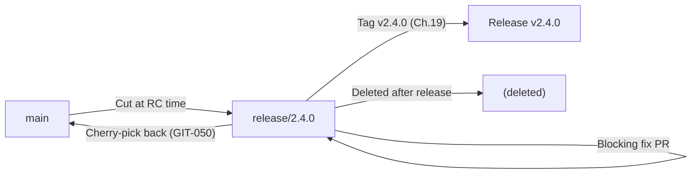

## 13.7 Checklist

- [ ] Release branch cut only at RC declaration, not earlier.
- [ ] Every fix on the release branch also lands on `main`.
- [ ] Branch deleted after the release is tagged.

## 13.8 Engineering Notes

This chapter is intentionally the only place in this handbook where a second branch is allowed to receive direct merges alongside `main` — and even then, only release-blocking fixes, through the same PR/review gates, for the shortest practical window.

## 13.9 Related Documents

Chapter 4 (Branching Strategy — trunk-based rationale), Chapter 17 (Versioning Strategy — RC declaration trigger), Chapter 19 (Tagging Strategy), Chapter 30 (Engineering Checklist — release checklist).

## 13.10 Related ADR

None — foundational, first publication.

## 13.11 AI Assistant Guidance

An AI assistant should never propose landing new (non-release-blocking) feature work on a `release/*` branch, and should always propose the corresponding `main`-targeted PR when a release-branch fix is made (GIT-050).

## 13.12 Future Considerations

None identified at current release cadence.

---

# Chapter 14 — Hotfix Process

## 14.1 Purpose

Defines the fast *path* — never a fast *skip* — for a production-incident fix, operationalizing GP-5/GIT-005 and `03_ARCHITECTURE.md` Decision 24.6.1's no-exception staged-rollout rule.

## 14.2 Rule IDs

| Rule ID | Statement | Severity | Enforcement |
|---|---|---|---|
| GIT-052 | A hotfix branches from `main` as `hotfix/{short-description}-{incidentId}` (Chapter 5) and goes through the identical PR, CI, and review gates as any other change (GIT-001–GIT-004) — no stage is skipped for urgency. | 🔴 Critical | GitHub Branch Protection, Engineering Review |
| GIT-053 | A hotfix PR requires the same minimum one reviewer (GIT-037), obtained on an expedited basis (immediate ping/page to an available reviewer) — not waived. | 🔴 Critical | Code Review |
| GIT-054 | A hotfix deploys through the same staged pipeline (`03_ARCHITECTURE.md` Decision 24.6.1) as any other change — there is no "skip staging, deploy straight to production" path, regardless of incident severity. | 🔴 Critical | CI/CD Pipeline |
| GIT-055 | A hotfix's originating incident is documented (an Issue, opened concurrently with or immediately after the fix per Chapter 1.9) even when it couldn't be opened beforehand. | 🟠 High | Code Review |

## 14.3 Standards

1. "Fast" in a hotfix context means: an available reviewer is found immediately, CI runs against a smaller, targeted diff, and the deploy pipeline runs at its normal (not skipped) speed — not that any gate is removed.
2. A hotfix's diff is kept as small as possible, addressing only the incident's root cause — unrelated cleanup is deferred to a follow-up PR, even under pressure to "fix it properly while we're in there."

## 14.4 Workflow Diagram

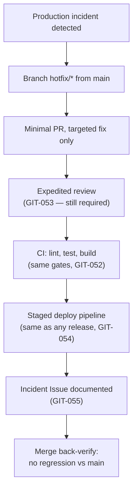

## 14.5 Best Practices

- Identify a designated on-call reviewer rotation ahead of time (Chapter 32) so GIT-053's "expedited" review has a known first point of contact, rather than an ad hoc scramble during the incident.
- Write the incident Issue immediately after the fix ships if it couldn't be written before — waiting until "later" risks it never happening.

## 14.6 Common Mistakes

| Mistake | Why it's a problem | Correct behavior |
|---|---|---|
| Deploying a hotfix directly to production, bypassing the staged pipeline, "because it's an emergency" | Directly violates GIT-054 and `03_ARCHITECTURE.md` Decision 24.6.1 — the no-exception policy exists specifically for this scenario | Same staged pipeline, same speed it always runs at |
| Skipping review because "there's no time" | Violates GIT-053 — incident pressure is exactly when a second set of eyes catches a bad fix fastest | Page an available reviewer immediately; do not merge unreviewed |
| Using the hotfix as an opportunity to also refactor the surrounding code | Expands blast radius and review time exactly when both should be minimized | Fix only the root cause; file a follow-up Issue for the refactor |

## 14.7 Checklist

- [ ] Branch named `hotfix/*` per Chapter 5, from current `main`.
- [ ] Diff is minimal — root cause only, no incidental cleanup.
- [ ] Reviewer obtained and approved — not skipped.
- [ ] Deployed through the same staged pipeline as any other change.
- [ ] Incident Issue exists, even if opened after the fact.

## 14.8 Engineering Notes

This chapter exists precisely because incident pressure is the single condition under which "just this once" erosion of process is most tempting and most costly. Every rule here is a *speed* optimization within the existing gates, never a *removal* of one — that distinction is the chapter's entire point.

## 14.9 Related Documents

`03_ARCHITECTURE.md` Decision 24.6.1 (no-exception staged rollout), Chapter 1 (GP-5), Chapter 5 (branch naming), Chapter 29 (Rollback Strategy — the other side of incident response), Chapter 32 (Team Collaboration — on-call norms).

## 14.10 Related ADR

None — this chapter implements an existing `03_ARCHITECTURE.md` decision at the Git-process level without changing it.

## 14.11 AI Assistant Guidance

An AI assistant must never suggest bypassing review, CI, or the staged deploy pipeline for a hotfix, even when a user frames the request as urgent — surface GIT-052/GIT-054 rather than comply.

## 14.12 Future Considerations

Consider formalizing an on-call reviewer rotation schedule (ties to Chapter 32) if expedited-review response time (GIT-053) is ever measured as a bottleneck during real incidents.

---

# Chapter 15 — Bug Fix Workflow

## 15.1 Purpose

Defines the standard (non-incident) path from a reported defect to a merged fix — distinct from Chapter 14's incident-specific fast path.

## 15.2 Workflow Diagram

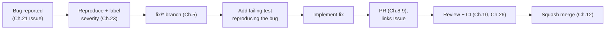

## 15.3 Rule IDs

| Rule ID | Statement | Severity | Enforcement |
|---|---|---|---|
| GIT-056 | Every bug fix PR includes a test that fails without the fix and passes with it — a regression test, not just a behavior change (mirrors `05_CODING_STANDARDS.md` Ch.35's testing standard). | 🟠 High | Code Review |
| GIT-057 | A bug fix references its originating Issue and the Issue's severity label (Chapter 23) in the PR description, so review urgency matches actual impact. | 🟡 Medium | Code Review |
| GIT-058 | A bug fix's root cause is stated in the commit body (Chapter 6) or PR description — not just what line changed, but why the prior code was wrong. | 🟡 Medium | Code Review |

## 15.4 Standards

A bug fix is scoped to the reported defect. If investigation surfaces a related-but-distinct issue, that is filed as a new Issue (Chapter 21) rather than folded silently into the current fix's scope (Chapter 8's PR-size discipline applies).

## 15.5 Best Practices

- Reproduce the bug locally before writing the fix — a fix written without a reproducing test is unverifiable and often incomplete.
- When the same class of bug has occurred before, note the pattern in the PR description so a systemic fix (a lint rule, a base-class guarantee — mirrors `03_ARCHITECTURE.md`'s "move it to infrastructure" philosophy) can be considered, not just this instance.

## 15.6 Common Mistakes

| Mistake | Why it's a problem | Correct behavior |
|---|---|---|
| Fixing a bug with no accompanying test | Violates GIT-056; the same defect can silently regress later with nothing to catch it | Add a failing-then-passing regression test |
| Expanding a bug-fix PR into an unrelated refactor "while in the area" | Violates Chapter 8's scope discipline | File a separate `refactor/` PR |

## 15.7 Checklist

- [ ] Regression test added.
- [ ] Root cause explained, not just the symptom fixed.
- [ ] Issue and severity referenced.
- [ ] Scope limited to the reported defect.

## 15.8 Engineering Notes

This chapter deliberately separates "bug fix" (this chapter, standard pace) from "hotfix" (Chapter 14, incident pace) — conflating the two either slows down incident response or erodes standard-pace test discipline under manufactured urgency.

## 15.9 Related Documents

Chapter 14 (Hotfix Process — the incident-pace counterpart), Chapter 21 (GitHub Issues), Chapter 23 (Labels — severity), `05_CODING_STANDARDS.md` Ch.35 (Testing Standards).

## 15.10 Related ADR

None — foundational, first publication.

## 15.11 AI Assistant Guidance

An AI assistant fixing a reported bug must generate the regression test alongside the fix, and must state the root cause in its explanation — not just describe the line changed.

## 15.12 Future Considerations

None identified.

---

# Chapter 16 — Feature Development Workflow

## 16.1 Purpose

Defines the standard path from a planned feature (Chapter 21's Issue, Chapter 22's Project, Chapter 25's Sprint) to a merged, released capability.

## 16.2 Workflow Diagram

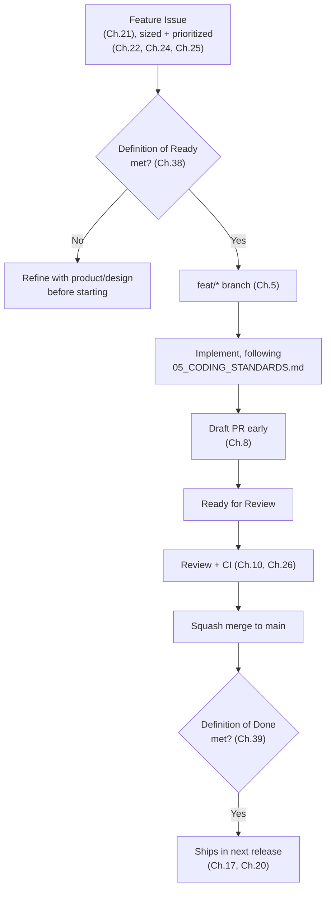

## 16.3 Rule IDs

| Rule ID | Statement | Severity | Enforcement |
|---|---|---|---|
| GIT-059 | A feature branch is not started until its Issue meets Definition of Ready (Chapter 38) — starting implementation against an under-specified Issue is treated as a process gap, not a normal risk of feature work. | 🟡 Medium | Engineering Review |
| GIT-060 | A feature PR is not considered complete until Definition of Done (Chapter 39) is met, independent of whether CI passes and review is approved — DoD is a superset check, not redundant with them. | 🟠 High | Code Review |
| GIT-061 | A feature that introduces a new API version or a breaking change follows `07_REST_API_STANDARDS.md`'s versioning sign-off (Decision 26.6.1) before merge, not after. | 🔴 Critical | Architecture Review |

## 16.4 Standards

Feature work defaults to additive design (`07_REST_API_STANDARDS.md` §26.5) specifically to avoid needing GIT-061's heavier sign-off — a feature scoped as a new optional field or new endpoint ships through the standard path in §16.2 without an extra gate.

## 16.5 Best Practices

- Break a large feature into multiple smaller, independently mergeable PRs behind a feature flag or additive schema, rather than one large PR at the end (Chapter 8's size discipline, applied to feature work specifically).
- Keep the originating Issue updated as scope is discovered during implementation — the Issue, not tribal knowledge, is the source of truth for what the feature actually became.

## 16.6 Common Mistakes

| Mistake | Why it's a problem | Correct behavior |
|---|---|---|
| Starting a feature branch from a one-line Issue with no acceptance criteria | Leads to rework once real requirements surface mid-implementation | Apply Definition of Ready (Ch.38) before branching |
| Treating "CI green + approved" as done, skipping DoD's broader checklist (docs, telemetry, rollback plan) | Ships a feature that's code-complete but not operationally complete | Apply Definition of Done (Ch.39) explicitly before considering the PR finished |

## 16.7 Checklist

- [ ] Issue met Definition of Ready before branching.
- [ ] Large feature was decomposed into reviewable increments where possible.
- [ ] Definition of Done met at merge, not just CI-green + approved.
- [ ] Versioning sign-off obtained if the feature is a breaking change.

## 16.8 Engineering Notes

This chapter is the "everything else in this handbook, applied end-to-end" chapter — it intentionally introduces few new rules of its own and instead sequences Chapters 5, 8, 10, 21, 26, 38, and 39 into one coherent path.

## 16.9 Related Documents

Chapter 21 (Issues), Chapter 22 (Projects), Chapter 25 (Sprint Workflow), Chapter 38 (Definition of Ready), Chapter 39 (Definition of Done), `07_REST_API_STANDARDS.md` Decision 26.6.1.

## 16.10 Related ADR

None — foundational, first publication.

## 16.11 AI Assistant Guidance

An AI assistant asked to "implement feature X" should check whether the request includes Definition-of-Ready-level detail (acceptance criteria, affected modules) and ask for clarification if not, rather than guessing scope silently.

## 16.12 Future Considerations

None identified.

---

# PART IV — VERSIONING & RELEASES

# Chapter 17 — Versioning Strategy

## 17.1 Purpose

Defines LedgerOne's platform release versioning — distinct from `07_REST_API_STANDARDS.md`'s API URL versioning (`/api/v1`), which governs API contract stability specifically. This chapter governs the *product/platform* release number.

## 17.2 Rule IDs

| Rule ID | Statement | Severity | Enforcement |
|---|---|---|---|
| GIT-062 | LedgerOne's platform release version follows Semantic Versioning (Chapter 18): `MAJOR.MINOR.PATCH`. | 🟠 High | Release tooling |
| GIT-063 | A release candidate is declared by cutting a `release/*` branch (Chapter 13) from `main` at the point the release's scope is feature-complete. | 🟡 Medium | Engineering Review |
| GIT-064 | Platform versioning (this chapter) and API URL versioning (`07_REST_API_STANDARDS.md` Decision 10.5.1) are independent numbers — a platform Minor release does not imply an API version bump, and vice versa. | 🟡 Medium | Architecture Review |

## 17.3 Standards

The platform version answers "what release is deployed," used in release notes (Chapter 20), support communication, and incident references. The API version answers "what contract shape does this endpoint expose" — the two need not move together, and conflating them has previously caused confusion in ERP platforms this handbook's authors have worked on; keeping them explicitly separate avoids that.

## 17.4 Best Practices

Reference the platform version in incident reports and support tickets ("regression introduced in 2.4.0"); reference the API version in integration documentation and Marketplace developer communication (`03_ARCHITECTURE.md` Ch.7's Marketplace context).

## 17.5 Common Mistakes

| Mistake | Why it's a problem | Correct behavior |
|---|---|---|
| Bumping the platform Major version because an API Major version bumped | Conflates two independent version numbers (GIT-064) | Evaluate each independently against its own chapter's rules |

## 17.6 Checklist

- [ ] Platform version follows SemVer (Chapter 18).
- [ ] Release candidate declared via `release/*` branch cut, not informally.
- [ ] Platform and API versions are not assumed to move together.

## 17.7 Engineering Notes

Keeping platform and API versioning independent is a small but deliberate decision: an ERP with fourteen-plus modules (`01_PROJECT_CONTEXT.md`) will very likely bump individual module API versions at a different cadence than platform releases ship — coupling the two would force artificial synchronization.

## 17.8 Related Documents

Chapter 13 (Release Branches), Chapter 18 (Semantic Versioning), Chapter 19 (Tagging), `07_REST_API_STANDARDS.md` Decision 10.5.1 (API versioning, independent number).

## 17.9 Related ADR

None — foundational, first publication.

## 17.10 AI Assistant Guidance

An AI assistant must not conflate a platform release version with an API version in generated documentation or changelogs — state both explicitly where relevant, per GIT-064.

## 17.11 Future Considerations

None identified at current release cadence.

---

# Chapter 18 — Semantic Versioning

## 18.1 Purpose

Fixes exactly how `MAJOR.MINOR.PATCH` is determined from merged commits, using the Conventional Commits type vocabulary (Chapter 7) as the mechanical input.

## 18.2 Rule IDs

| Rule ID | Statement | Severity | Enforcement |
|---|---|---|---|
| GIT-065 | `MAJOR` increments only for a commit marked `!`/`BREAKING CHANGE:` (Chapter 7, GIT-028), and only after the corresponding architectural sign-off where applicable (`07_REST_API_STANDARDS.md` Decision 26.6.1). | 🔴 Critical | Release tooling, Architecture Review |
| GIT-066 | `MINOR` increments when at least one `feat` commit (non-breaking) has merged since the last release. | 🟡 Medium | Release tooling |
| GIT-067 | `PATCH` increments when only `fix` commits (non-breaking) have merged since the last release, with no `feat` or breaking change. | 🟡 Medium | Release tooling |
| GIT-068 | Pre-1.0 (`0.MINOR.PATCH`) versioning is not used for LedgerOne's platform version once the first production release ships — the platform starts at `1.0.0` and follows standard SemVer semantics from that point (distinguishing it from `01_PROJECT_CONTEXT.md`/`02_TECH_STACK.md`'s internal document-versioning convention, which is unrelated). | 🟡 Medium | Release tooling |

## 18.3 Standards

Version bump determination is mechanical, derived from the set of Conventional-Commit-typed squash-merge commits (Chapter 12) since the last tag — not a subjective judgment call at release time, precisely so the number is trustworthy to downstream consumers.

## 18.4 Decision Matrix

| Commits since last release | Next version bump |
|---|---|
| Any `!`/`BREAKING CHANGE:` | Major |
| No breaking change, at least one `feat` | Minor |
| No breaking change, no `feat`, at least one `fix` | Patch |
| Only `chore`/`docs`/`ci`/`test`/`style`/`refactor` | No release necessary (or Patch, if a release is being cut anyway for scheduling reasons) |

## 18.5 Best Practices

Let release tooling compute the version from commit history rather than manually deciding it — manual override is reserved for the rare case where a change's true user-facing impact doesn't match its literal commit type (documented explicitly when it happens).

## 18.6 Common Mistakes

| Mistake | Why it's a problem | Correct behavior |
|---|---|---|
| Bumping Major "to signal a big release" with no actual breaking change | Misleads consumers checking SemVer to decide if upgrading is safe | Major is reserved strictly for breaking changes (GIT-065) |
| Marking a change `fix!` for an internal-only behavior correction with no external contract impact | Forces an unnecessary Major bump | Reserve `!` for changes with real external-consumer impact |

## 18.7 Checklist

- [ ] Version bump matches the highest-impact commit type since the last release (§18.4).
- [ ] Any Major bump has corresponding architectural sign-off where the change is API-facing.

## 18.8 Engineering Notes

This chapter is deliberately mechanical rather than a judgment call at release time — a release manager reads the number off commit history, they don't decide it, which is what makes the version number trustworthy to integrators.

## 18.9 Related Documents

Chapter 7 (Conventional Commits — the mechanical input), Chapter 17 (Versioning Strategy), Chapter 20 (Release Notes — same commit-history source), `07_REST_API_STANDARDS.md` Decision 26.6.1.

## 18.10 Related ADR

None — foundational, first publication.

## 18.11 AI Assistant Guidance

An AI assistant computing or proposing a version bump must apply §18.4 mechanically from the actual commit types present, and must flag rather than silently resolve any case where a commit's literal type seems to understate its real-world impact.

## 18.12 Future Considerations

Consider automated release-please/semantic-release-style tooling to compute and tag versions directly from merged commit history, once manual release cutting (Chapter 13) is measured as an overhead worth automating.

---

# Chapter 19 — Tagging Strategy

## 19.1 Purpose

Defines how a finalized release is marked permanently in Git history via annotated tags.

## 19.2 Rule IDs

| Rule ID | Statement | Severity | Enforcement |
|---|---|---|---|
| GIT-069 | Every release is marked with an annotated tag `v{MAJOR}.{MINOR}.{PATCH}` (e.g., `v2.4.0`) on the exact commit deployed to production. | 🟠 High | Release tooling |
| GIT-070 | A tag is never moved or deleted once pushed — a correction is a new tag (a new Patch release), never a re-tag of an existing version. | 🔴 Critical | GitHub Branch Protection (tag protection rule) |
| GIT-071 | A tag's annotation message links to its generated Release Notes (Chapter 20). | 🟡 Medium | Release tooling |

## 19.3 Standards

Tags are created against `main` (for a Patch/Minor cut directly from `main`) or against the `release/*` branch's final commit before deletion (for a release that required stabilization, Chapter 13) — never against an arbitrary, untested commit.

## 19.4 Best Practices

Tag immediately at the point of production deployment, not before — a tag represents "this is what's actually running," not "this is what we intended to ship."

## 19.5 Common Mistakes

| Mistake | Why it's a problem | Correct behavior |
|---|---|---|
| Force-moving a tag to point at a newer commit after discovering an issue | Violates GIT-070; breaks any external reference (a deploy record, an incident report) already pointing at the original tag | Cut a new Patch version and tag it |
| Tagging a commit that was never actually deployed | The tag no longer means "what's running in production" | Tag only at actual deploy time, against the deployed commit |

## 19.6 Checklist

- [ ] Tag format is `v{MAJOR}.{MINOR}.{PATCH}`.
- [ ] Tag is on the exact commit deployed, created at deploy time.
- [ ] No existing tag is ever moved or deleted.

## 19.7 Engineering Notes

Tag immutability (GIT-070) matters specifically because a financial ERP's incident history ("what version were we running when X happened") depends on tags being a trustworthy, permanent record — the same principle GP-3 applies to commit history applies here to tags.

## 19.8 Related Documents

Chapter 17 (Versioning Strategy), Chapter 18 (Semantic Versioning), Chapter 20 (Release Notes), Chapter 29 (Rollback Strategy — rollback targets a prior tag).

## 19.9 Related ADR

None — foundational, first publication.

## 19.10 AI Assistant Guidance

An AI assistant must never suggest moving or force-updating an existing Git tag — a correction is always a new version and a new tag.

## 19.11 Future Considerations

None identified.

---

# Chapter 20 — Release Notes

## 20.1 Purpose

Defines how release notes are generated and what they must contain, so every release is communicable to internal stakeholders and (where relevant) customers without manual transcription of commit history.

## 20.2 Rule IDs

| Rule ID | Statement | Severity | Enforcement |
|---|---|---|---|
| GIT-072 | Release notes are generated from squash-merge commit subjects (Chapter 12) since the prior tag, grouped by Conventional Commit type (Chapter 7) — `feat` and `fix` only are customer-facing; other types appear only in an internal "Other Changes" section. | 🟡 Medium | Release tooling |
| GIT-073 | A breaking change (Chapter 7, GIT-028) is called out in its own "Breaking Changes" section at the top of the release notes, never buried in the general `feat` list. | 🟠 High | Code Review, release tooling |
| GIT-074 | Release notes are published (internally at minimum) before or at the moment of production deployment — never written retroactively after an incident makes their absence noticed. | 🟡 Medium | Engineering Review |

## 20.3 Standards

Release notes are organized: Breaking Changes → New Features (`feat`) → Bug Fixes (`fix`) → Other Changes (internal audience only). Each entry links back to its Issue/PR for full context.

## 20.4 Best Practices

Write commit subjects (Chapter 6) with release-notes readability in mind from the start — a well-formed `feat(accounting): add journal entry reversal` commit subject is nearly release-notes-ready as-is, which is the point of Chapter 7's discipline.

## 20.5 Common Mistakes

| Mistake | Why it's a problem | Correct behavior |
|---|---|---|
| A breaking change listed under "New Features" with no distinct callout | A consumer upgrading may miss that action is required | Always a separate, prominent "Breaking Changes" section (GIT-073) |
| Release notes written days after deployment, reconstructed from memory | Prone to omissions; defeats the purpose of generating from commit history directly | Generate and publish at deploy time (GIT-074) |

## 20.6 Checklist

- [ ] Notes generated from actual merged commits since the last tag, not hand-written from memory.
- [ ] Breaking changes are called out separately and prominently.
- [ ] Published at deploy time.

## 20.7 Engineering Notes

Release notes quality is a direct, measurable payoff of Chapters 6, 7, and 12's discipline — poorly written commit subjects produce unreadable release notes; this chapter has almost no rules of its own because the real work happens upstream.

## 20.8 Related Documents

Chapter 6 (Commit Message Standards), Chapter 7 (Conventional Commits), Chapter 12 (Merge Strategy), Chapter 18 (Semantic Versioning).

## 20.9 Related ADR

None — foundational, first publication.

## 20.10 AI Assistant Guidance

An AI assistant generating release notes must source them from actual merged commit subjects, never fabricate or infer entries not backed by a real commit, and must always surface breaking changes in their own section.

## 20.11 Future Considerations

Consider automated release-notes generation tooling (e.g., `release-please`-style) once manual compilation is measured as consistently error-prone or slow.

---

# PART V — PROJECT MANAGEMENT ON GITHUB

# Chapter 21 — GitHub Issues

## 21.1 Purpose

Defines GitHub Issues as the canonical unit of trackable work referenced throughout this handbook (GP-1, GIT-002) — what an Issue must contain, its lifecycle, and its relationship to branches and PRs.

## 21.2 Rule IDs

| Rule ID | Statement | Severity | Enforcement |
|---|---|---|---|
| GIT-075 | An Issue states: the problem or goal, acceptance criteria (for a feature), reproduction steps (for a bug), and affected module(s) using `03_ARCHITECTURE.md`'s module vocabulary. | 🟡 Medium | Engineering Review |
| GIT-076 | An Issue is labeled (Chapter 23) with at minimum a type label and a severity/priority label before work begins. | 🟡 Medium | Code Review |
| GIT-077 | An Issue closes automatically via its linked PR's `Fixes #{n}` footer (Chapter 6) — it is not manually closed while a fix is still in an open, unmerged PR. | ⚪ Low | GitHub automation |
| GIT-078 | A bug Issue includes severity classification aligned with `09_SECURITY_GUIDELINES.md`'s 🔴🟠🟡 scale where the bug has a security dimension, or a separate Critical/High/Medium/Low operational-impact scale otherwise. | 🟡 Medium | Engineering Review |

## 21.3 Standards

Every unit of work larger than a trivial fix (§1.9's decision matrix) begins as an Issue. An Issue is the durable record; a branch and PR are its temporary implementation vehicle.

## 21.4 Best Practices

Link related Issues to each other (`Relates to #X`) rather than duplicating description content — keeps a single source of truth per distinct problem.

## 21.5 Common Mistakes

| Mistake | Why it's a problem | Correct behavior |
|---|---|---|
| A bug Issue with no reproduction steps | Forces the assignee to rediscover the bug from scratch | Include exact steps, expected vs. actual behavior |
| Manually closing an Issue before its PR merges | Loses the auto-close audit trail; risks the Issue being closed while unfixed | Let `Fixes #{n}` (Chapter 6) close it on merge |

## 21.6 Checklist

- [ ] Problem/goal and acceptance criteria or repro steps stated.
- [ ] Type and severity/priority labels applied before work starts.
- [ ] Affected module(s) named.

## 21.7 Engineering Notes

Issues are this handbook's connective tissue — nearly every other chapter (branch naming, PR description, sprint workflow, milestones) assumes an Issue exists as the anchor everything else references back to.

## 21.8 Related Documents

Chapter 1 (GP-1), Chapter 5 (branch naming references Issue number), Chapter 9 (PR template references Issue), Chapter 23 (Labels), Chapter 24 (Milestones), Chapter 25 (Sprint Workflow).

## 21.9 Related ADR

None — foundational, first publication.

## 21.10 AI Assistant Guidance

An AI assistant drafting an Issue must include acceptance criteria or reproduction steps as applicable — a vague Issue is not acceptable output even if the user's original request was vague; ask a clarifying question instead of guessing.

## 21.11 Future Considerations

None identified.

---

# Chapter 22 — GitHub Projects

## 22.1 Purpose

Defines how GitHub Projects (the board/table view spanning Issues and PRs) is used to visualize work-in-progress across modules, without becoming a second, conflicting source of truth alongside Issues.

## 22.2 Rule IDs

| Rule ID | Statement | Severity | Enforcement |
|---|---|---|---|
| GIT-079 | Every Issue and PR intended for a given release cycle is added to the corresponding GitHub Project board — the board is a view over Issues/PRs, never a place where task state is tracked independently of them. | 🟡 Medium | Engineering Review |
| GIT-080 | A Project board's columns reflect actual GitHub state (Open/In Progress/In Review/Done) via automation, not manually dragged cards disconnected from the Issue/PR's real status. | 🟡 Medium | GitHub automation |

## 22.3 Standards

One Project board per active release cycle or per quarter (whichever the team finds more useful) — not one permanent, ever-growing board mixing years of completed and active work.

## 22.4 Best Practices

Configure automation (Issue closed → card moves to Done) rather than relying on manual board maintenance, which drifts from reality within weeks.

## 22.5 Common Mistakes

| Mistake | Why it's a problem | Correct behavior |
|---|---|---|
| Tracking a task's real status only on the board, with no corresponding Issue | Violates GIT-079; the board becomes an untraceable shadow system | Every board card is backed by a real Issue or PR |

## 22.6 Checklist

- [ ] Every card corresponds to a real Issue/PR.
- [ ] Board automation reflects actual GitHub state.

## 22.7 Engineering Notes

A Project board's value is entirely derivative of Issue/PR hygiene (Chapters 21, 23, 24) — if those are followed, the board is nearly free; if they aren't, no amount of board discipline compensates.

## 22.8 Related Documents

Chapter 21 (GitHub Issues), Chapter 24 (Milestones), Chapter 25 (Sprint Workflow).

## 22.9 Related ADR

None — foundational, first publication.

## 22.10 AI Assistant Guidance

Not directly applicable — Project board maintenance is a human/automation concern outside typical AI-assistant code-generation scope.

## 22.11 Future Considerations

None identified.

---

# Chapter 23 — Labels

## 23.1 Purpose

Fixes the closed label vocabulary used across Issues and PRs, so filtering and reporting are consistent platform-wide.

## 23.2 Label Taxonomy

| Category | Values |
|---|---|
| Type | `type:feature`, `type:bug`, `type:refactor`, `type:docs`, `type:chore` |
| Severity (bugs) | `severity:critical`, `severity:high`, `severity:medium`, `severity:low` (mirrors the 🔴🟠🟡⚪ scale used platform-wide) |
| Module | `module:accounting`, `module:sales`, `module:inventory`, ... (one per `03_ARCHITECTURE.md` module) |
| Status | `status:blocked`, `status:needs-design`, `status:needs-triage` |
| Special | `security` (also notifies the security review process, `09_SECURITY_GUIDELINES.md` SSDLC-001), `breaking-change` |

## 23.3 Rule IDs

| Rule ID | Statement | Severity | Enforcement |
|---|---|---|---|
| GIT-081 | Every Issue carries exactly one `type:*` label and, if a bug, exactly one `severity:*` label. | 🟡 Medium | Engineering Review |
| GIT-082 | The `security` label triggers `09_SECURITY_GUIDELINES.md` SSDLC-001's mandatory pre-merge security review — it is never applied or removed without the security review actually happening. | 🔴 Critical | Architecture Review |
| GIT-083 | No ad hoc label is created outside this chapter's taxonomy without an amendment to this chapter (Chapter 37's governance process) — label sprawl is treated as a documentation debt, not a convenience. | 🟡 Medium | Engineering Review |

## 23.4 Best Practices

Apply `module:*` labels consistently enough that "everything open for Accounting" is a reliable filter — this is what makes Chapter 11's ownership model and Chapter 25's sprint planning practically usable.

## 23.5 Common Mistakes

| Mistake | Why it's a problem | Correct behavior |
|---|---|---|
| Inventing a one-off label ("urgent-please-look") instead of using the fixed taxonomy | Fragments filtering/reporting over time | Use `severity:critical` + the relevant `module:*` label |
| Removing the `security` label to "unblock" a PR without the review completing | Violates GIT-082 directly | Security review must complete first, per `09_SECURITY_GUIDELINES.md` |

## 23.6 Checklist

- [ ] Type and (if applicable) severity label present.
- [ ] Module label present.
- [ ] `security` label, if present, has a completed review before removal.

## 23.7 Engineering Notes

A fixed, closed taxonomy (GIT-083) is what keeps Chapter 22's Project board filters and Chapter 25's sprint reports meaningful over years, not just for the team that set them up.

## 23.8 Related Documents

Chapter 21 (Issues), Chapter 22 (Projects), Chapter 25 (Sprint Workflow), `09_SECURITY_GUIDELINES.md` SSDLC-001.

## 23.9 Related ADR

None — foundational, first publication.

## 23.10 AI Assistant Guidance

An AI assistant applying labels to an Issue/PR must select only from §23.2's fixed taxonomy — never invent a new label.

## 23.11 Future Considerations

Extend the `module:*` list as new modules are added to `03_ARCHITECTURE.md`'s module roster — additive, per this handbook family's consistent scalability pattern.

---

# Chapter 24 — Milestones

## 24.1 Purpose

Defines how GitHub Milestones map to release versions (Chapter 17), giving "what's left before we ship 2.4.0" a mechanical answer.

## 24.2 Rule IDs

| Rule ID | Statement | Severity | Enforcement |
|---|---|---|---|
| GIT-084 | A Milestone is named after its target platform version (`2.4.0`), created when release scope is first planned, not retroactively after the release ships. | 🟡 Medium | Engineering Review |
| GIT-085 | An Issue/PR assigned to a Milestone is expected to ship in that version; if it slips, it is explicitly reassigned to the next Milestone — never left silently attached to a shipped Milestone it wasn't actually part of. | 🟡 Medium | Engineering Review |

## 24.3 Best Practices

Use a Milestone's completion percentage as a release-readiness signal feeding Chapter 13's release-candidate cut decision, not as the sole determinant — untested scope-complete work isn't yet release-ready.

## 24.4 Common Mistakes

| Mistake | Why it's a problem | Correct behavior |
|---|---|---|
| An Issue left attached to a Milestone that already shipped without it | Milestone's historical record becomes inaccurate | Reassign slipped work to the next Milestone explicitly (GIT-085) |

## 24.5 Checklist

- [ ] Milestone named after its target version.
- [ ] Slipped work reassigned explicitly, not left stale.

## 24.6 Engineering Notes

Milestones are a thin, release-version-scoped view — they answer a narrower question than Chapter 22's Projects (which can span multiple releases or ongoing themes).

## 24.7 Related Documents

Chapter 13 (Release Branches), Chapter 17 (Versioning Strategy), Chapter 22 (GitHub Projects).

## 24.8 Related ADR

None — foundational, first publication.

## 24.9 AI Assistant Guidance

Not directly applicable.

## 24.10 Future Considerations

None identified.

---

# Chapter 25 — Sprint Workflow

## 25.1 Purpose

Defines how a fixed-length sprint (or iteration) interacts with Issues, Labels, and Milestones — the cadence layer on top of this handbook's structural mechanisms.

## 25.2 Rule IDs

| Rule ID | Statement | Severity | Enforcement |
|---|---|---|---|
| GIT-086 | Work pulled into a sprint meets Definition of Ready (Chapter 38) at pull-in time — an Issue is not added to a sprint "to figure out later." | 🟡 Medium | Engineering Review |
| GIT-087 | A sprint's Project board view (Chapter 22) filters by the sprint's label/iteration field — sprint tracking is a view over the same Issues/PRs, never a separate tracking artifact (a spreadsheet, a separate doc). | 🟡 Medium | Engineering Review |
| GIT-088 | Work not completed within a sprint rolls over explicitly (reassigned to the next sprint/iteration) — it is never silently dropped or left ambiguously attached to a closed sprint. | 🟡 Medium | Engineering Review |

## 25.3 Best Practices

Size sprint commitments against actual historical throughput, not aspirational capacity — a sprint that consistently rolls over the majority of its committed work is a planning signal, not an execution failure to be pushed through harder.

## 25.4 Common Mistakes

| Mistake | Why it's a problem | Correct behavior |
|---|---|---|
| Pulling an under-specified Issue into a sprint "since there's room" | Violates GIT-086; work stalls mid-sprint on missing requirements | Apply Definition of Ready before pull-in |
| Tracking sprint progress in a separate spreadsheet alongside GitHub | Creates two sources of truth that inevitably diverge | Use GitHub Projects' iteration/sprint field (Chapter 22) exclusively |

## 25.5 Checklist

- [ ] All pulled-in work meets Definition of Ready.
- [ ] Sprint tracking uses GitHub natively, no shadow spreadsheet.
- [ ] Incomplete work explicitly rolled over at sprint close.

## 25.6 Engineering Notes

This chapter intentionally does not mandate a specific sprint length or ceremony cadence (daily standup format, etc.) — those are team-process choices outside Git/GitHub workflow governance; this chapter only fixes how sprint work is represented in the tooling this handbook otherwise governs.

## 25.7 Related Documents

Chapter 21 (Issues), Chapter 22 (Projects), Chapter 24 (Milestones), Chapter 38 (Definition of Ready).

## 25.8 Related ADR

None — foundational, first publication.

## 25.9 AI Assistant Guidance

Not directly applicable.

## 25.10 Future Considerations

None identified.

---

# PART VI — AUTOMATION & PIPELINE GOVERNANCE

# Chapter 26 — CI/CD Integration

## 26.1 Purpose

Defines how this handbook's rules connect to the CI/CD pipeline `04_FOLDER_STRUCTURE.md` Ch.17 and `03_ARCHITECTURE.md` Ch.24.4 already define structurally. This chapter states which of *this handbook's* rules are mechanically gated by that pipeline, and in what order — it does not redefine the pipeline's implementation (no workflow YAML is authored here; that is `04_FOLDER_STRUCTURE.md` Ch.17's domain).

## 26.2 Rule IDs

| Rule ID | Statement | Severity | Enforcement |
|---|---|---|---|
| GIT-089 | Every Pull Request triggers the same CI pipeline regardless of branch type (feature, fix, hotfix, release) — lint, layer/module-boundary checks (`03_ARCHITECTURE.md` Ch.6.7), test, build, dependency and secret scanning (`09_SECURITY_GUIDELINES.md` DEP-001, SECR-004). | 🔴 Critical | CI Pipeline |
| GIT-090 | A required status check (each CI stage) is configured as a required check in GitHub Branch Protection (Chapter 27) — merge is mechanically blocked, not just discouraged, when a required stage fails. | 🔴 Critical | GitHub Branch Protection |
| GIT-091 | A CI stage failure is fixed at the source (the code, migration, or dependency) — it is never bypassed via an admin override, skip flag, or force-merge. | 🔴 Critical | GitHub Branch Protection |
| GIT-092 | CI pipeline stage ordering (lint → boundary checks → test → build → security/dependency scan) reflects the no-fast-path rule (`03_ARCHITECTURE.md` Decision 24.6.1) — no branch type, including `hotfix/*`, skips a stage. | 🔴 Critical | CI Pipeline |

## 26.3 Standards

This handbook does not own CI pipeline *implementation* — `04_FOLDER_STRUCTURE.md` Ch.17 (workflow file layout) and `03_ARCHITECTURE.md` Ch.24.4 (deploy-time migration execution, staged rollout) already do. This chapter's role is narrower: stating which of this handbook's own rules (squash-merge-only, required reviews, branch naming) are enforced through that pipeline versus through GitHub configuration versus through human review, so an engineer knows where to look when something is unexpectedly blocked.

## 26.4 Enforcement Mapping

| This handbook's rule | Enforced by |
|---|---|
| GIT-001 (no direct commits to `main`) | GitHub Branch Protection |
| GIT-004 (CI + review both required) | GitHub Branch Protection (required checks + required reviews) |
| GIT-037 (minimum approvals) | GitHub Branch Protection (required reviews), Chapter 11 CODEOWNERS |
| GIT-045 (squash-merge only) | GitHub repository merge-method setting |
| GIT-054 (hotfix uses same staged pipeline) | CI/CD Pipeline, `03_ARCHITECTURE.md` Decision 24.6.1 |
| GIT-070 (tags immutable) | GitHub tag protection rule |

## 26.5 Best Practices

Treat a CI failure as informative, not adversarial — a lint or boundary-check failure (`03_ARCHITECTURE.md` Ch.6.7) is the exact mechanism that keeps this handbook's structural rules true without relying on every reviewer catching every violation manually.

## 26.6 Common Mistakes

| Mistake | Why it's a problem | Correct behavior |
|---|---|---|
| An admin using elevated GitHub permissions to merge past a failing required check | Violates GIT-091 and undermines every rule this chapter maps to a "required check" | Fix the underlying failure; admin override is not a valid path, per GP-5 |
| Assuming a hotfix's CI run uses a reduced stage set to go faster | Violates GIT-092 — no branch type skips a stage | Same full pipeline, every time |

## 26.7 Checklist

- [ ] All required CI stages are configured as required GitHub status checks.
- [ ] No branch type bypasses any stage.
- [ ] Failures are fixed at the source, never overridden.

## 26.8 Engineering Notes

This chapter is deliberately a thin index, not a duplicate specification — `03_ARCHITECTURE.md` Ch.24.4 and `04_FOLDER_STRUCTURE.md` Ch.17 remain the authoritative descriptions of pipeline stages and structure; this chapter would drift out of sync with them if it restated their content rather than referencing it.

## 26.9 Related Documents

`03_ARCHITECTURE.md` Ch.24.4 (CI/CD pipeline, staged rollout), `04_FOLDER_STRUCTURE.md` Ch.17 (workflow file layout, pipeline stage diagram), `09_SECURITY_GUIDELINES.md` (dependency/secret scanning gates), Chapter 27 (Protected Branch Rules — the GitHub-side enforcement).

## 26.10 Related ADR

None — this chapter references existing `03_ARCHITECTURE.md`/`04_FOLDER_STRUCTURE.md` decisions without changing them.

## 26.11 AI Assistant Guidance

An AI assistant must never suggest an admin override, a `[skip ci]`-style bypass, or a reduced-stage path for any branch type, including hotfixes — surface GIT-091/GIT-092 instead.

## 26.12 Future Considerations

Consider path-based CI triggering (per `04_FOLDER_STRUCTURE.md` §2.13/17.6's already-flagged future work) once pipeline runtime is measured as a bottleneck — this chapter would then document which of this handbook's rules remain full-pipeline versus scoped.

---

# Chapter 27 — Protected Branch Rules

## 27.1 Purpose

Enumerates the exact GitHub Branch Protection configuration `main` (and, narrowly, active `release/*` branches) carry, so this handbook's Critical-severity rules are mechanically true, not just documented.

## 27.2 Rule IDs

| Rule ID | Statement | Severity | Enforcement |
|---|---|---|---|
| GIT-093 | `main` requires: no direct pushes (including from administrators), a linear history (squash-merge-only, Chapter 12), all required status checks passing (Chapter 26), and at least one approving review (Chapter 10, Chapter 11) before merge. | 🔴 Critical | GitHub Branch Protection |
| GIT-094 | Force-pushes and branch deletion are disabled on `main` unconditionally — no role, including repository admin, is exempted. | 🔴 Critical | GitHub Branch Protection |
| GIT-095 | An active `release/*` branch carries the same protection profile as `main` for the duration of its short lifetime (Chapter 13) — it is not left unprotected "since it's temporary." | 🟠 High | GitHub Branch Protection |
| GIT-096 | Tags matching `v*` (Chapter 19) are protected from deletion and from being force-updated to a different commit. | 🔴 Critical | GitHub tag protection rule |

## 27.3 Standards

Branch protection settings are themselves configuration, and a change to them (e.g., temporarily disabling a required check) is treated as a change to this handbook's enforcement layer — it requires the same two-reviewer sign-off this handbook's own amendments require (Chapter 37), never a unilateral admin action, even "temporarily."

## 27.4 Best Practices

Periodically audit the actual GitHub settings against this chapter (a "does configuration match documentation" check) — settings drift silently in a way code changes do not, since they aren't reviewed via the normal PR mechanism.

## 27.5 Common Mistakes

| Mistake | Why it's a problem | Correct behavior |
|---|---|---|
| Temporarily disabling "require status checks" to unblock a merge during a CI outage | Directly defeats GIT-004/GIT-090's entire purpose at the exact moment it matters most | Wait for CI to recover, or use the CI outage as an incident (Chapter 14 logic applies to tooling outages too — fix the pipeline, don't bypass the gate) |
| Leaving a `release/*` branch without protection "since it'll be deleted soon anyway" | A short lifetime doesn't reduce blast radius while it's live (violates GIT-095) | Apply full protection immediately on branch creation |

## 27.6 Checklist

- [ ] `main` protection matches §27.2 exactly.
- [ ] Any active `release/*` branch is protected identically.
- [ ] Tag protection is active for `v*`.
- [ ] Any change to protection settings went through the same review rigor as a handbook amendment.

## 27.7 Engineering Notes

This chapter is what turns Chapters 1, 4, 10, 12, and 19's stated rules from policy into mechanism — a rule in this handbook that isn't reflected here is, in practice, enforced only by discipline, which this handbook consistently treats as insufficient at scale (mirrors `03_ARCHITECTURE.md` Ch.6.7's reasoning for mechanical over conventional enforcement).

## 27.8 Related Documents

Chapter 1 (GIT-001, GIT-003), Chapter 4 (branching model), Chapter 10 (review requirements), Chapter 12 (merge strategy), Chapter 19 (tag immutability), Chapter 37 (Engineering Governance — amendment process this chapter's own changes follow).

## 27.9 Related ADR

None — this chapter is the mechanical implementation of already-stated rules, not a new decision.

## 27.10 AI Assistant Guidance

An AI assistant must never propose disabling, weakening, or working around a branch protection setting, even temporarily, even to resolve an urgent blocker.

## 27.11 Future Considerations

None identified — this configuration is expected to be stable as long as the underlying rules it implements (Chapters 1, 4, 10, 12, 19) are stable.

---

# Chapter 28 — Merge Conflict Resolution

## 28.1 Purpose

Defines how a merge conflict is resolved without silently discarding either party's intent — a real risk in a monorepo (Chapter 3) where multiple engineers legitimately touch adjacent code.

## 28.2 Rule IDs

| Rule ID | Statement | Severity | Enforcement |
|---|---|---|---|
| GIT-097 | A merge conflict is resolved by the branch author, syncing with `main` (merge or rebase, author's choice for their own unmerged branch) — never resolved unilaterally by a reviewer editing the author's branch without the author's awareness. | 🟠 High | Code Review |
| GIT-098 | When a conflict resolution is non-trivial (touches business logic, not just adjacent formatting), the resolution is itself reviewed — pushed as a visible commit/diff, not squashed away invisibly before review. | 🟠 High | Code Review |
| GIT-099 | A recurring conflict pattern in the same file/module across multiple PRs is raised as a signal (module boundary too coarse, a shared file acting as a bottleneck — `03_ARCHITECTURE.md` Ch.6's anti-pattern) rather than repeatedly resolved without comment. | 🟡 Medium | Engineering Review |

## 28.3 Standards

A conflict is resolved by understanding both changes' intent (referencing both PRs/Issues if needed), not by mechanically picking one side or the other without reading what each side was trying to do.

## 28.4 Best Practices

Sync a long-running branch with `main` frequently (Chapter 4.7) specifically to keep any eventual conflict small and easy to reason about, rather than accumulating divergence for weeks.

## 28.5 Common Mistakes

| Mistake | Why it's a problem | Correct behavior |
|---|---|---|
| Resolving a conflict by blindly taking "theirs" or "ours" without reading either diff | Risks silently discarding a correct change from one side | Read both changes' intent; ask the other author if unclear |
| A reviewer pushing a conflict-resolution commit directly to someone else's branch without a heads-up | Author may be unaware their branch changed underneath them | Resolve on the author's behalf only with explicit coordination, or let the author resolve it |

## 28.6 Decision Tree

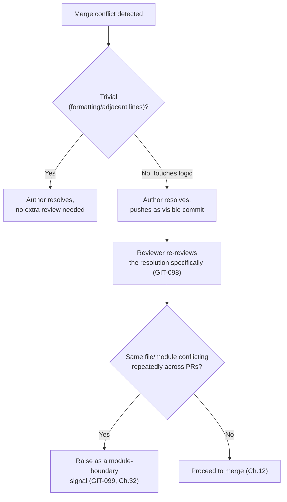

## 28.7 Checklist

- [ ] Conflict resolved by the branch author (or with their explicit awareness).
- [ ] Non-trivial resolutions are visible and re-reviewed.
- [ ] Recurring conflict hotspots are raised, not silently repeated.

## 28.8 Engineering Notes

GIT-099 connects this chapter back to `03_ARCHITECTURE.md` Ch.6's rejection of shared-bottleneck files (API clients, translation files) — a recurring merge-conflict hotspot is often the practical, observable symptom of exactly the architectural anti-pattern that chapter already warns against.

## 28.9 Related Documents

Chapter 3 (Monorepo Standards), Chapter 4.7 (branch-sync best practice), `03_ARCHITECTURE.md` Ch.6 (module boundary, shared-bottleneck anti-pattern).

## 28.10 Related ADR

None — foundational, first publication.

## 28.11 AI Assistant Guidance

An AI assistant resolving a merge conflict on a user's behalf must explain its reasoning for each resolved hunk (what each side intended, why the resolution was chosen) rather than silently picking a side.

## 28.12 Future Considerations

None identified.

---

# Chapter 29 — Rollback Strategy

## 29.1 Purpose

Defines how a merged, deployed change is reversed safely — connecting Chapter 9's Rollback Plan (written at PR time) to actual execution during an incident.

## 29.2 Rule IDs

| Rule ID | Statement | Severity | Enforcement |
|---|---|---|---|
| GIT-100 | A code-only regression is reverted via `git revert` of the specific squash-merge commit (Chapter 12) on `main`, itself going through the standard PR/review/CI path (GIT-001–GIT-004) — a revert is a normal change, not an exception to process. | 🔴 Critical | Code Review, CI/CD Pipeline |
| GIT-101 | A migration-involving change's rollback plan (Chapter 9, GIT-036) is validated as actually reversible **before** merge, per `06_DATABASE_STANDARDS.md`'s backward-compatible migration discipline — a rollback is never designed for the first time during the incident itself. | 🔴 Critical | Code Review |
| GIT-102 | A production rollback targets a specific prior tag (Chapter 19) or a specific revert commit — never an ambiguous "go back to yesterday" instruction with no precise commit reference. | 🟠 High | Engineering Review |
| GIT-103 | Every rollback, once executed, is followed by an incident Issue (if one doesn't already exist per Chapter 14) documenting what was reverted and why, closing the loop this handbook's traceability principle (GP-1) requires even under incident pressure. | 🟠 High | Code Review |

## 29.3 Standards

A rollback is a `fix`-typed (Chapter 7) revert commit, following Chapter 15's bug-fix discipline (a regression test capturing what went wrong is added alongside or immediately after the revert) — a rollback resolves the immediate incident; the regression test prevents silent recurrence.

## 29.4 Decision Matrix — "How do I roll back?"

| Situation | Rollback mechanism |
|---|---|
| Bad code change, no migration involved | `git revert` of the squash commit, standard PR path (GIT-100) |
| Bad change including a forward-compatible migration (additive column, no data loss) | `git revert` the code; the migration's rollback plan (validated at merge time, GIT-101) determines whether the migration itself is also reverted |
| Bad change including a destructive/irreversible migration | Should not have merged in the first place per `06_DATABASE_STANDARDS.md`'s migration-reversibility discipline — this is treated as a process failure to investigate, not a routine rollback case |
| Infrastructure/deploy-config regression, no application code change | Handled via `10_DEPLOYMENT_ARCHITECTURE.md`'s staged-rollout auto-rollback mechanism (`03_ARCHITECTURE.md` Decision 24.6.1), not a Git-level revert |

## 29.5 Best Practices

- Validate a migration's down-path (or documented irreversibility with an explicit, reviewed justification) at PR time (Chapter 9), never assume it's reversible without checking.
- Keep the revert commit's description clear about *why* — the original PR's context, plus what went wrong in production — so `git log` remains a trustworthy incident history (GP-3).

## 29.6 Common Mistakes

| Mistake | Why it's a problem | Correct behavior |
|---|---|---|
| Manually editing files on `main` to "undo" a bad change instead of reverting the commit | Produces a new, undocumented diff disconnected from the original change's history | `git revert` the specific commit; history stays traceable |
| Discovering during an incident that a migration has no rollback path | Exactly the gap GIT-101 exists to catch before merge, not during an incident | Rollback plans are validated at PR time, always |
| A rollback executed with no follow-up Issue | Breaks GP-1's traceability guarantee for the single class of change (incident-driven) where it matters most | File the Issue immediately (GIT-103) |

## 29.7 Workflow Diagram

```mermaid
flowchart TD
    A["Regression detected in production"] --> B{"Migration involved?"}
    B -->|No| C["git revert squash commit\n(GIT-100), standard PR path"]
    B -->|Yes, reversible per validated\nrollback plan (GIT-101)| D["Revert code + apply\nvalidated down-migration"]
    B -->|Yes, irreversible| E["Process failure —\nshould not have merged;\nescalate (Ch.37)"]
    C --> F["Standard staged deploy\n(no fast-path, Ch.14 logic)"]
    D --> F
    F --> G["File/confirm incident Issue\n(GIT-103)"]
```

## 29.8 Checklist

- [ ] Rollback targets a specific commit/tag, never an ambiguous point in time.
- [ ] Reverts through the standard PR/CI/review path — no bypass, even during an incident.
- [ ] Migration reversibility was validated before the original merge, not discovered as a gap now.
- [ ] Incident Issue exists documenting the rollback.

## 29.9 Engineering Notes

This chapter deliberately treats rollback as a normal, well-trodden path rather than a rare emergency procedure — the entire design (squash-merge-only, GIT-101's pre-merge validation, Chapter 14's same-pipeline hotfix rule) exists so that "we need to roll this back" is never the first time anyone has thought about how.

## 29.10 Related Documents

Chapter 9 (PR Template — Rollback Plan section), Chapter 12 (Merge Strategy — squash enables clean reverts), Chapter 14 (Hotfix Process), Chapter 15 (Bug Fix Workflow), Chapter 19 (Tagging), `06_DATABASE_STANDARDS.md` (migration reversibility), `03_ARCHITECTURE.md` Decision 24.6.1 (staged-rollout auto-rollback).

## 29.11 Related ADR

None — this chapter operationalizes existing `03_ARCHITECTURE.md`/`06_DATABASE_STANDARDS.md` commitments at the Git-workflow level.

## 29.12 AI Assistant Guidance

An AI assistant asked to help with a rollback must default to proposing a `git revert` of the specific offending commit through the standard PR path — never a direct edit to `main`, and never a bypass of CI/review, even when framed as urgent.

## 29.13 Future Considerations

Consider a documented rollback drill (a periodic, non-incident practice run of the rollback path) once the real-incident rollback frequency is low enough that the muscle memory risks atrophying.

---

# PART VII — TEAM ENGINEERING PRACTICE

# Chapter 30 — Engineering Checklist

## 30.1 Purpose

Consolidates this handbook's per-chapter checklists into role-based master checklists — for the moments where an engineer wants "everything relevant to this action" in one place rather than navigating forty chapters.

## 30.2 Master Checklist — Opening a Pull Request

- [ ] Issue exists or PR description substitutes (Ch.1.9)
- [ ] Branch named per `{type}/{short-description}-{issue}` (Ch.5)
- [ ] Commits follow Conventional Commits (Ch.6-7)
- [ ] PR is scoped to one logical change (Ch.8)
- [ ] PR template fully completed, including Rollback Plan if applicable (Ch.9)
- [ ] Draft until genuinely ready (Ch.8)

## 30.3 Master Checklist — Reviewing a Pull Request

- [ ] CI green (Ch.26)
- [ ] Blocking comments cite a Rule ID (Ch.10)
- [ ] Code Ownership sign-off obtained where required (Ch.11)
- [ ] Test coverage matches risk (Ch.39)
- [ ] No Must-rule deviation is undocumented (Ch.1, GIT-006)

## 30.4 Master Checklist — Cutting a Release

- [ ] Release branch cut at RC time, not earlier (Ch.13)
- [ ] Version bump matches actual commit history (Ch.18)
- [ ] Release notes generated and reviewed, breaking changes called out (Ch.20)
- [ ] Tag created against the exact deployed commit (Ch.19)
- [ ] Release-branch fixes cherry-picked back to `main` (GIT-050)

## 30.5 Master Checklist — Responding to a Production Incident

- [ ] Hotfix branch from current `main` (Ch.5, Ch.14)
- [ ] Same review/CI/deploy gates as any change — no bypass (Ch.14, Ch.26)
- [ ] Rollback plan validated, or rollback path executed per Ch.29
- [ ] Incident Issue filed, even if after the fact (GIT-055/GIT-103)

## 30.6 Rule IDs

| Rule ID | Statement | Severity | Enforcement |
|---|---|---|---|
| GIT-104 | These master checklists are a convenience index — a checklist item's authority always traces to its cited chapter; this chapter never introduces a requirement not already stated elsewhere. | ⚪ Low | N/A (informational) |

## 30.7 Engineering Notes

This chapter is intentionally non-authoritative on its own — if it ever conflicts with a per-chapter rule, the per-chapter rule wins, and this chapter is corrected to match.

## 30.8 Related Documents

Every chapter referenced above.

## 30.9 Related ADR

None.

## 30.10 AI Assistant Guidance

An AI assistant may use these checklists as a quick self-check before proposing a PR, release, or incident response, but must still apply the full, specific rule from the cited chapter when detail matters.

## 30.11 Future Considerations

Extend with additional role-based checklists (e.g., "Onboarding Week 1") as recurring needs are identified.

---

# Chapter 31 — Developer Onboarding

## 31.1 Purpose

Defines what a new engineer (employee or contractor) must read and set up before their first Pull Request, specifically for Git/GitHub workflow — general codebase onboarding is `05_CODING_STANDARDS.md` §1.16's responsibility; this chapter is the Git-workflow-specific subset.

## 31.2 Rule IDs

| Rule ID | Statement | Severity | Enforcement |
|---|---|---|---|
| GIT-105 | A new engineer reads this handbook's Table of Contents in full, and Part I–II (Chapters 1–11) in full, before opening their first Pull Request. | 🟡 Medium | Engineering Review |
| GIT-106 | A new engineer's local environment is verified (Git configured with their real name/company email, commit signing configured if required by `09_SECURITY_GUIDELINES.md`, pre-commit hooks installed) before their first push. | 🟡 Medium | Engineering Review |
| GIT-107 | A new engineer's first Pull Request is explicitly flagged for a slightly more thorough review pass — not a lower bar, but more explanatory review comments, so the handbook's rules are learned in context rather than only in the abstract. | ⚪ Low | Code Review |

## 31.3 Onboarding Checklist — Week One

- [ ] Read this handbook's Table of Contents and Part I–II in full.
- [ ] Git configured (real name, company email).
- [ ] Repository cloned, `npm install` succeeds, pre-commit hooks active.
- [ ] Completed a first, small, real Pull Request following Chapters 5–9 end to end.
- [ ] Attended or reviewed a recorded walkthrough of Chapter 14's Hotfix Process (read-only understanding, not a live drill).

## 31.4 Best Practices

Pair a new engineer with an assigned reviewer for their first two weeks of PRs specifically for handbook-familiarity purposes (distinct from Chapter 33's general pair programming guidance).

## 31.5 Common Mistakes

| Mistake | Why it's a problem | Correct behavior |
|---|---|---|
| A new engineer's first PR merged with minimal review "to be welcoming" | Skips the calibration opportunity GIT-107 exists for; sets a low-rigor precedent | Review thoroughly and explain citations, per GIT-107 |

## 31.6 Engineering Notes

This chapter deliberately scopes itself to Git/GitHub workflow onboarding only — architecture, coding standards, and domain (`00_BUSINESS_RULES.md`) onboarding are each owned by their respective handbooks; duplicating them here would create drift risk.

## 31.7 Related Documents

`05_CODING_STANDARDS.md` §1.16 (broader onboarding checklist this chapter is a subset of), Chapter 1 (foundational reading), Chapter 33 (Pair Programming).

## 31.8 Related ADR

None.

## 31.9 AI Assistant Guidance

An AI assistant onboarding-support tool should point a new engineer to this chapter's checklist and Chapter 1 first, before deeper chapters, matching the reading order this chapter specifies.

## 31.10 Future Considerations

None identified.

---

# Chapter 32 — Team Collaboration

## 32.1 Purpose

Defines norms for asynchronous collaboration around Git/GitHub artifacts — response times, escalation paths, and how disagreements are surfaced, referenced by earlier chapters (GIT-039, GIT-041, GIT-099).

## 32.2 Rule IDs

| Rule ID | Statement | Severity | Enforcement |
|---|---|---|---|
| GIT-108 | A reviewer who cannot meet Chapter 10's one-business-day response expectation (GIT-039) reassigns the review explicitly rather than leaving it silently pending. | 🟡 Medium | Team Collaboration norm |
| GIT-109 | A recurring cross-team friction point (repeated merge conflicts — GIT-099; repeated review disagreements — GIT-041) is raised in a recurring engineering sync, not left to resolve itself PR by PR indefinitely. | 🟡 Medium | Engineering Review |
| GIT-110 | An on-call/hotfix-review rotation (Chapter 14) is published and kept current, so "who do I page" has a known, current answer at incident time. | 🟠 High | Engineering Review |

## 32.3 Best Practices

Default to discussing a disagreement synchronously (a short call) once a PR comment thread exceeds roughly five back-and-forth exchanges without resolution — async threads past that point tend to cost more time than they save.

## 32.4 Common Mistakes

| Mistake | Why it's a problem | Correct behavior |
|---|---|---|
| A review request left unanswered for days with no reassignment | Blocks the author with no visible path forward | Reassign per GIT-108 |
| A recurring conflict/disagreement pattern never raised beyond the individual PRs it appears in | The systemic cause (module boundary, ownership ambiguity) never gets fixed | Raise in engineering sync (GIT-109) |

## 32.5 Checklist

- [ ] Review requests answered or reassigned within one business day.
- [ ] On-call/hotfix rotation is current and published.
- [ ] Recurring friction is raised at the team level, not just handled per-instance.

## 32.6 Engineering Notes

This chapter is the human-norms layer underneath several earlier chapters' mechanical rules — GIT-039 states the expectation, this chapter states what happens when it can't be met.

## 32.7 Related Documents

Chapter 10 (Code Review Process), Chapter 14 (Hotfix Process), Chapter 28 (Merge Conflict Resolution), Chapter 37 (Engineering Governance).

## 32.8 Related ADR

None.

## 32.9 AI Assistant Guidance

Not directly applicable — team-norms chapter, outside typical AI code-generation scope.

## 32.10 Future Considerations

None identified.

---

# Chapter 33 — Pair Programming Guidelines

## 33.1 Purpose

Defines how pair/mob programming sessions interact with this handbook's commit and PR rules — specifically, attribution and review implications when code is authored by more than one person.

## 33.2 Rule IDs

| Rule ID | Statement | Severity | Enforcement |
|---|---|---|---|
| GIT-111 | A commit authored during a pair session includes both participants via Git's `Co-authored-by:` trailer — attribution is explicit, never just the driver's name. | 🟡 Medium | Code Review |
| GIT-112 | A Pull Request produced entirely through pairing still requires an independent reviewer per GIT-037 — pairing satisfies neither the review requirement nor a substitute for it, since both participants were already involved in authoring. | 🟠 High | GitHub Branch Protection |
| GIT-113 | Code Ownership sign-off (Chapter 11) for a paired change comes from an owner who was not one of the pairing participants, for the same reason GIT-112 applies. | 🟠 High | Code Review |

## 33.3 Best Practices

Rotate driver/navigator roles within a session so `Co-authored-by:` attribution reflects genuine joint authorship, not one person typing while another watches silently.

## 33.4 Common Mistakes

| Mistake | Why it's a problem | Correct behavior |
|---|---|---|
| Treating a pair-programmed PR as "already reviewed" since two people wrote it | Violates GIT-112 — two authors are not a substitute for an independent reviewer's fresh perspective | Require a third, independent reviewer |
| Omitting `Co-authored-by:` for the navigator | Misattributes authorship in permanent history (GP-3) | Always include both via the trailer (GIT-111) |

## 33.5 Checklist

- [ ] `Co-authored-by:` present for all pairing participants.
- [ ] Reviewer/Code Owner is independent of the pairing session.

## 33.6 Engineering Notes

The core insight this chapter encodes: pairing improves code quality during authoring, but does not substitute for the independent, adversarial-by-design review Chapter 10 requires — the two serve different purposes.

## 33.7 Related Documents

Chapter 6 (Commit Message Standards — trailer syntax), Chapter 10 (Code Review Process), Chapter 11 (Code Ownership).

## 33.8 Related ADR

None.

## 33.9 AI Assistant Guidance

When an AI assistant is used as a "pairing partner" during implementation, its involvement does not satisfy GIT-112's independent-reviewer requirement — a human reviewer who did not co-author the change is still required.

## 33.10 Future Considerations

None identified.

---

# Chapter 34 — Documentation Update Process

## 34.1 Purpose

Defines when a code change requires an update to one of the ten approved handbooks (including this one), so documentation does not drift from reality (`03_ARCHITECTURE.md` §1.7.2's "documentation must not drift" principle, applied at the Git-workflow level).

## 34.2 Rule IDs

| Rule ID | Statement | Severity | Enforcement |
|---|---|---|---|
| GIT-114 | A Pull Request that changes behavior a handbook explicitly documents (an API contract, a database convention, a folder-structure rule, a Git-workflow rule) includes the corresponding handbook update in the same PR — never a separate, later "docs follow-up" PR. | 🟠 High | Code Review |
| GIT-115 | A documentation-only change (`docs/*` branch, Chapter 5) still goes through the full PR/review path (GIT-001–GIT-004) — documentation is not exempt from review because it isn't executable code. | 🟠 High | Code Review |
| GIT-116 | An amendment to this handbook specifically requires two reviewers from the engineering standards group (mirrors `05_CODING_STANDARDS.md` §1.7's identical rule for that handbook). | 🟠 High | Code Review |

## 34.3 Standards

The "same PR" discipline in GIT-114 mirrors the pattern already established throughout the approved handbook family (`.env.example` updates, `CODEOWNERS` updates, translation-key updates) — documentation debt is treated as a bug, not an acceptable byproduct of shipping fast.

## 34.4 Best Practices

When a PR's review reveals that a handbook chapter is unclear or outdated (not just wrong about this specific change), file a `docs/` Issue immediately rather than fixing it as an unrelated addition to the current PR (Chapter 8's scope discipline still applies).

## 34.5 Common Mistakes

| Mistake | Why it's a problem | Correct behavior |
|---|---|---|
| Shipping a new Git-workflow rule in practice (e.g., a new required CI stage) without updating this handbook | Handbook becomes fiction — the exact failure mode `03_ARCHITECTURE.md` §1.7.2 warns about | Update this handbook in the same PR (GIT-114) |
| Treating a docs-only PR as low-stakes enough to self-merge or skip review | Violates GIT-115 — a wrong documented rule is followed by every future reader | Full review, same as code |

## 34.6 Checklist

- [ ] Behavior-documenting handbook content updated in the same PR as the behavior change.
- [ ] Docs-only PRs went through full review.
- [ ] This handbook's own amendments had two qualifying reviewers.

## 34.7 Engineering Notes

This chapter is this handbook's own immune system against the single most common failure mode of any documentation-heavy engineering culture: rules that were once true and are now silently false.

## 34.8 Related Documents

`03_ARCHITECTURE.md` §1.7.2, `05_CODING_STANDARDS.md` §1.7, Chapter 37 (Engineering Governance — broader amendment process), Chapter 35 (Architecture Change Process).

## 34.9 Related ADR

None — this chapter restates an existing cross-handbook principle at the Git-workflow level.

## 34.10 AI Assistant Guidance

An AI assistant that generates a code change altering documented behavior must proactively propose the corresponding handbook update in the same PR, not leave it for a human to remember separately.

## 34.11 Future Considerations

None identified.

---

# Chapter 35 — Architecture Change Process

## 35.1 Purpose

Defines how a change to this handbook (or any approved handbook) that constitutes an actual architectural decision — not a routine clarification — routes into `03_ARCHITECTURE.md` Chapter 28's ADR Log, so the "why did we used to do X" record stays intact.

## 35.2 Rule IDs

| Rule ID | Statement | Severity | Enforcement |
|---|---|---|---|
| GIT-117 | A Pull Request that changes an existing, previously-ratified decision in this handbook (e.g., moving off squash-merge-only, adopting a different branching model) includes a new ADR entry in `03_ARCHITECTURE.md` Chapter 28, per that chapter's §28.4 trigger condition. | 🔴 Critical | Architecture Review |
| GIT-118 | A Pull Request that only clarifies, restates, or extends this handbook additively (a new module label, a new checklist item) does **not** require an ADR — per `03_ARCHITECTURE.md` §28.4, an ADR is only required when a decision *changes*. | 🟡 Medium | Code Review |
| GIT-119 | An architecture-changing PR requires Architecture Review sign-off (the same escalation tier `07_REST_API_STANDARDS.md` and `03_ARCHITECTURE.md` already use for breaking changes) in addition to standard code review. | 🔴 Critical | Architecture Review |

## 35.3 Decision Matrix — "Does this change need an ADR?"

| Change | ADR required? |
|---|---|
| Adding a new module label (Chapter 23) | No |
| Adding a new checklist item to Chapter 30 | No |
| Changing the merge strategy from squash-only to allowing merge commits (Chapter 12) | Yes |
| Changing the branching model away from trunk-based (Chapter 4) | Yes |
| Adding a new Conventional Commit type (Chapter 7) | Borderline — requires Architecture Review judgment; typically yes if it affects SemVer computation (Chapter 18) |

## 35.4 Standards

The ADR itself follows `03_ARCHITECTURE.md` §28.3's format (date, decision, context, alternatives considered, decision, consequences) exactly — this chapter does not define a separate ADR format for Git-workflow decisions.

## 35.5 Best Practices

When in doubt about whether a proposed handbook change is "architectural" or merely clarifying, default to treating it as architectural (requiring the ADR) — the cost of an unnecessary ADR entry is far lower than the cost of a silently-changed decision with no historical trace.

## 35.6 Common Mistakes

| Mistake | Why it's a problem | Correct behavior |
|---|---|---|
| Silently changing this handbook's merge strategy (Chapter 12) without an ADR, reasoning "it's just a workflow tweak" | A merge-strategy change is exactly the kind of decision `03_ARCHITECTURE.md` §28.4 requires a trace for | File the ADR (GIT-117) |
| Requiring an ADR for every minor checklist addition | Creates ADR-log noise that devalues the log for changes that actually matter | Apply §35.3's matrix — additive clarifications don't need one (GIT-118) |

## 35.7 Checklist

- [ ] Determined whether the change is a decision change (ADR required) or an additive clarification (not required), per §35.3.
- [ ] ADR filed in `03_ARCHITECTURE.md` Chapter 28 before or alongside merge, for decision changes.
- [ ] Architecture Review sign-off obtained for decision changes.

## 35.8 Engineering Notes

This chapter exists so this handbook's own evolution is subject to the same discipline it demands of the rest of the codebase — a Git-workflow handbook that could silently rewrite its own settled decisions would be a glaring exception to `03_ARCHITECTURE.md` Decision 1.7.3's "never silently edit a settled decision" principle.

## 35.9 Related Documents

`03_ARCHITECTURE.md` Chapter 28 (ADR Log, format, trigger condition), Decision 1.7.3 (vision statement precedent this chapter generalizes), Chapter 34 (Documentation Update Process — the routine-update counterpart to this chapter's decision-change process).

## 35.10 Related ADR

This chapter is itself the *process* by which future ADRs against this handbook are triggered — it has no ADR of its own since it introduces no decision change, only a routing mechanism for `03_ARCHITECTURE.md`'s existing ADR Log.

## 35.11 AI Assistant Guidance

An AI assistant proposing a change to an existing, ratified rule in this handbook (not an additive one) must flag that an ADR entry is required per GIT-117, and must not silently treat the change as routine.

## 35.12 Future Considerations

None identified.

---

# PART VIII — GOVERNANCE & AI-ASSISTED ENGINEERING

# Chapter 36 — AI Assistant Development Workflow

## 36.1 Purpose

Defines, comprehensively, how AI coding assistants (Claude, ChatGPT, GitHub Copilot, Cursor, or any equivalent tool) are used within LedgerOne's Git workflow specifically — consolidating the "AI Assistant Guidance" notes scattered through Chapters 1–35 into one authoritative chapter, and adding the rules that apply across all of them.

## 36.2 Responsibilities

- State that AI-generated code and AI-authored Git artifacts (commits, PRs, branch names) are held to every rule in this handbook identically to human-authored ones.
- Define what human review must independently verify for AI-assisted changes, beyond what it verifies for human-only changes.
- Define disclosure expectations — when AI involvement in a change is stated explicitly.

## 36.3 Rule IDs

| Rule ID | Statement | Severity | Enforcement |
|---|---|---|---|
| GIT-120 | An AI-assisted Pull Request follows every rule in this handbook exactly as a human-only PR would — no rule (branch naming, commit format, PR template, review requirements, CI gates) is relaxed because an AI assistant produced part of the diff. | 🔴 Critical | Code Review, GitHub Branch Protection |
| GIT-121 | A human engineer is the accountable author of record for every commit and PR, regardless of how much of the content an AI assistant generated — "the AI wrote it" is never a valid answer to "why does this code exist" (GP-1 still requires a traceable, human-owned reason). | 🔴 Critical | Code Review |
| GIT-122 | A reviewer treats AI-generated code with the same scrutiny as human-written code — not more lenient (assuming the tool "got it right"), and not more suspicious by default; the review standard is the code itself, per Chapter 10. | 🟠 High | Code Review |
| GIT-123 | AI-generated code touching authentication, authorization, tenant-scoping, financial calculation, or payment flows (`09_SECURITY_GUIDELINES.md`'s highest-severity domains) requires the same security review (SSDLC-001) as human-written code in those domains — never an assumed exemption. | 🔴 Critical | Architecture Review |
| GIT-124 | An AI assistant must never be instructed to bypass, weaken, or work around any Critical-severity rule in this handbook, and must decline (surfacing the relevant Rule ID) if asked to. | 🔴 Critical | Code Review |
| GIT-125 | A PR description notes when a substantial portion of the change was AI-generated (a single checkbox or line is sufficient) — not as a stigma, but so a reviewer calibrates which parts warrant closer independent verification (per GIT-122, applied practically). | 🟡 Medium | Code Review |

## 36.4 Standards

1. AI assistants are a productivity tool operating entirely within this handbook's existing gates — GIT-001 through GIT-119 apply to AI-assisted work without exception or special case.
2. An AI assistant's own internal reasoning or confidence is never treated as a substitute for CI (Chapter 26) or human review (Chapter 10) — both remain mandatory regardless of how the diff was produced.
3. Where this handbook's per-chapter "AI Assistant Guidance" sections give tool-specific direction (never propose a direct commit, never fabricate testing claims, never propose a version bump for a non-breaking change, etc.), those sections remain the authoritative detail; this chapter is the consolidating index and the source of the cross-cutting rules above.

## 36.5 What a Reviewer Must Independently Verify for AI-Assisted Changes

| Area | Why it needs independent human verification |
|---|---|
| Business rule correctness (`00_BUSINESS_RULES.md`) | An AI assistant can produce plausible-looking code that satisfies neither the actual business rule nor its edge cases; plausibility is not correctness. |
| Test coverage claims (Chapter 39) | An AI assistant's stated "tests pass" must be verified against CI (Chapter 26) actually running them — never taken as an unverified claim in a PR description. |
| Security-sensitive logic (`09_SECURITY_GUIDELINES.md`) | Per GIT-123 — highest-severity domains get the same review depth regardless of authorship. |
| Rationale/root cause (Chapter 6, Chapter 15) | An AI assistant may describe *what* changed fluently without correctly identifying *why* the prior code was wrong — a reviewer checks the stated root cause makes sense, not just that the diff compiles. |

## 36.6 Best Practices

- Use an AI assistant for a first-pass draft (implementation, tests, PR description, commit messages, even review comments) and treat all of it as a draft requiring the same human judgment this handbook already requires everywhere else — not as a shortcut past that judgment.
- When an AI assistant proposes a Rule ID citation in a review comment, verify the citation is accurate (the actual chapter says what's claimed) before relying on it — misciting a rule confidently is a known failure mode worth checking for.

## 36.7 Common Mistakes

| Mistake | Why it's a problem | Correct behavior |
|---|---|---|
| Merging an AI-generated PR with a lighter review pass "since the tool is usually right" | Violates GIT-122; erodes GP-4's review guarantee exactly where confidence is least warranted | Same review depth, every time |
| Accepting an AI assistant's "this is fully tested" claim without checking CI actually ran and passed those tests | Violates the verification principle in §36.5 | Confirm against actual CI results (Chapter 26), not the claim alone |
| Asking an AI assistant to "just push it directly, we're in a hurry" | The assistant complying would violate GIT-001/GIT-124; a compliant assistant should refuse and cite the rule | The assistant surfaces GIT-001 rather than complying — and a human should not route around that refusal through a different tool or manual override |

## 36.8 Decision Tree — "Is this AI-assisted change ready to merge?"

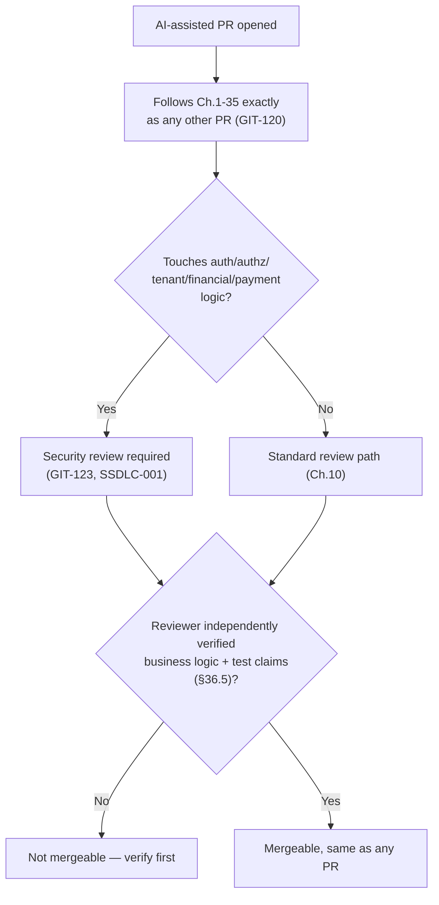

## 36.9 Checklist

- [ ] Every rule in Chapters 1–35 applied without exception to this AI-assisted change.
- [ ] A human is the accountable author of record.
- [ ] AI involvement noted in the PR description where substantial (GIT-125).
- [ ] Reviewer independently verified business logic and test claims, not just diff plausibility.
- [ ] Security review completed if the change touches a highest-severity domain.

## 36.10 Engineering Notes

This chapter is deliberately not a separate rulebook for "AI-generated code" — LedgerOne's position is that the authorship tool is irrelevant to whether a change is correct, secure, and well-tested. The per-chapter "AI Assistant Guidance" sections throughout this handbook exist to give the tool itself clear, checkable instructions; this chapter exists to give the human reviewer and the engineering organization the cross-cutting rules that don't fit naturally into any single earlier chapter.

## 36.11 Related Documents

Every chapter's "AI Assistant Guidance" section (§1.16, §2.12, §3.13, and so on throughout), `09_SECURITY_GUIDELINES.md` SSDLC-001 (security review trigger), Chapter 10 (Code Review Process), Chapter 39 (Definition of Done).

## 36.12 Related ADR

None — foundational, first publication.

## 36.13 AI Assistant Guidance

This chapter's guidance to any AI assistant operating in this repository: follow every rule in this handbook exactly as stated, cite the specific Rule ID when declining a request that would violate one, never claim testing or verification that wasn't actually performed, and never treat "the user is in a hurry" as grounds to bypass a Critical-severity gate.

## 36.14 Future Considerations

Revisit this chapter as AI-assistant tooling capability changes materially (e.g., an assistant with direct merge/deploy permissions) — any such capability change is itself an architectural decision requiring an ADR per Chapter 35, not an informal adoption.

---

# Chapter 37 — Engineering Governance

## 37.1 Purpose

Defines who has authority to amend this handbook, how disputes escalate beyond a single PR's reviewers, and how this handbook's rules are enforced when disagreement about their application arises.

## 37.2 Rule IDs

| Rule ID | Statement | Severity | Enforcement |
|---|---|---|---|
| GIT-126 | Amendments to this handbook go through the same Pull Request process as any change (GIT-001–GIT-004), with the two-reviewer requirement from the engineering standards group (GIT-116). | 🟠 High | Code Review |
| GIT-127 | A rule change that would make previously-compliant, already-merged code non-compliant does not retroactively obligate a rewrite — it obligates compliance going forward (mirrors `05_CODING_STANDARDS.md` §1.7's identical principle). | 🟡 Medium | Engineering Review |
| GIT-128 | A dispute about whether a specific PR complies with a specific rule, unresolved after Chapter 10's escalation path (GIT-041), is decided by the engineering standards group — not by whichever party has more seniority or tenure (GP-5 applied to governance itself). | 🟠 High | Engineering Review |
| GIT-129 | This handbook's version header is incremented on every merged amendment, with a dated changelog entry stating what changed. | 🟡 Medium | Code Review |

## 37.3 Standards

The engineering standards group referenced throughout this handbook (GIT-116, GIT-126, GIT-128) is the same body `05_CODING_STANDARDS.md` §1.7 already establishes for that handbook — this document does not create a second, competing governance body.

## 37.4 Best Practices

Raise a disagreement about a rule's *application* (does this specific case fall under GIT-030's split-PR guidance) separately from a disagreement about whether the rule itself is *correct* (which routes through Chapter 35's ADR process if it's a genuine decision change) — conflating the two slows down resolution of the more common, narrower case.

## 37.5 Common Mistakes

| Mistake | Why it's a problem | Correct behavior |
|---|---|---|
| A senior engineer's interpretation of an ambiguous rule treated as automatically authoritative | Violates GP-5/GIT-128 — governance itself is not exempt from the uniformity principle | Escalate to the engineering standards group for a citable resolution |
| Amending this handbook via a single-reviewer PR | Violates GIT-116/GIT-126's two-reviewer requirement | Two engineering-standards-group reviewers, same as `05_CODING_STANDARDS.md` |

## 37.6 Checklist

- [ ] Amendment PR has two engineering-standards-group reviewers.
- [ ] Version header and changelog updated (GIT-129).
- [ ] A genuine decision change routed through Chapter 35's ADR process, not just this chapter's amendment path.

## 37.7 Engineering Notes

This chapter deliberately reuses `05_CODING_STANDARDS.md`'s existing governance body rather than inventing a Git-workflow-specific one — one standards group, citable across every approved handbook, is more coherent than ten parallel governance structures.

## 37.8 Related Documents

`05_CODING_STANDARDS.md` §1.7 (engineering standards group, precedent for this chapter), Chapter 10 (escalation path this chapter extends), Chapter 35 (Architecture Change Process — the decision-change counterpart to this chapter's routine-amendment process).

## 37.9 Related ADR

None — this chapter establishes the amendment process itself, not a specific architectural decision.

## 37.10 AI Assistant Guidance

An AI assistant must never present its own interpretation of an ambiguous or disputed rule as the final word — it should state the rule, note the ambiguity if one genuinely exists, and defer resolution to the engineering standards group per GIT-128.

## 37.11 Future Considerations

None identified.

---

# Chapter 38 — Definition of Ready

## 38.1 Purpose

Fixes the exact bar an Issue must clear before a branch is created against it (referenced by GIT-059, GIT-086) — the single most common source of mid-implementation rework when skipped.

## 38.2 Definition of Ready — Checklist

An Issue is Ready when:

- [ ] The problem or goal is stated in one or two sentences a reviewer could restate accurately without asking a clarifying question.
- [ ] Acceptance criteria are listed (for a feature) or reproduction steps are listed (for a bug).
- [ ] Affected module(s) are named, using `03_ARCHITECTURE.md`'s module vocabulary.
- [ ] Type and severity/priority labels are applied (Chapter 23).
- [ ] Any known dependency on another in-flight Issue/PR is stated explicitly.
- [ ] For a feature touching the API surface: it's stated whether the change is additive or potentially breaking (`07_REST_API_STANDARDS.md` §2.3's decision tree has been at least informally applied).
- [ ] For a feature touching the database: the rough shape of the schema change is sketched, even informally (full design happens during implementation, but "we'll figure out the schema during the PR" is not Ready).

## 38.3 Rule IDs

| Rule ID | Statement | Severity | Enforcement |
|---|---|---|---|
| GIT-130 | A branch is not created against an Issue that has not met every applicable item in §38.2 — an engineer who starts anyway does so with the explicit understanding that rework risk is on them, not a process failure to blame on the handbook. | 🟡 Medium | Engineering Review |
| GIT-131 | Definition of Ready is assessed by whoever is about to pick up the work, in collaboration with whoever filed the Issue (product, design, or another engineer) — it is not a unilateral self-certification with no second party involved. | 🟡 Medium | Engineering Review |

## 38.4 Best Practices

Apply Definition of Ready during sprint planning (Chapter 25) or backlog refinement, before work is pulled in — catching an under-specified Issue at planning time is far cheaper than catching it mid-implementation.

## 38.5 Common Mistakes

| Mistake | Why it's a problem | Correct behavior |
|---|---|---|
| Starting a feature branch on a one-line Issue "to save time on planning" | Nearly always costs more time in rework than the planning would have taken | Apply §38.2 before branching (GIT-059) |
| One engineer declaring their own Issue "Ready" with no second-party check | Misses the outside perspective that usually catches ambiguity | Involve the Issue's filer or another engineer (GIT-131) |

## 38.6 Checklist

See §38.2 — this chapter's checklist *is* its primary content.

## 38.7 Engineering Notes

Definition of Ready and Definition of Done (Chapter 39) are deliberately symmetric — one gates the start of work, the other gates its completion, and both exist for the identical reason: "obviously it's fine" is exactly the judgment this handbook consistently replaces with an explicit, checkable list.

## 38.8 Related Documents

Chapter 16 (Feature Development Workflow, GIT-059), Chapter 25 (Sprint Workflow, GIT-086), Chapter 39 (Definition of Done), Chapter 21 (GitHub Issues), Chapter 23 (Labels).

## 38.9 Related ADR

None — foundational, first publication.

## 38.10 AI Assistant Guidance

An AI assistant asked to implement a feature from an under-specified request should apply §38.2 as an implicit check and ask a clarifying question for any unmet item, rather than filling gaps with an unstated assumption.

## 38.11 Future Considerations

None identified.

---

# Chapter 39 — Definition of Done

## 39.1 Purpose

Fixes the exact bar a Pull Request must clear before it is considered complete — a superset of "CI green and approved" (GIT-060), covering the operational completeness a purely mechanical gate cannot verify.

## 39.2 Definition of Done — Checklist

A change is Done when:

- [ ] CI is green (lint, test, build, security/dependency scan — Chapter 26).
- [ ] Required review approvals obtained, including Code Ownership where applicable (Chapter 10, Chapter 11).
- [ ] Test coverage matches the risk of the change, per `05_CODING_STANDARDS.md` Ch.35 — including a regression test for every bug fix (GIT-056).
- [ ] The originating handbook(s) are updated in the same PR if documented behavior changed (GIT-114).
- [ ] The PR template's Rollback Plan is completed and, for migrations, validated as actually reversible (GIT-101).
- [ ] Any new configuration variable is documented in `.env.example` (`04_FOLDER_STRUCTURE.md`'s "same PR" rule).
- [ ] Telemetry/logging exists for any new failure mode introduced, sufficient to detect it in production (`05_CODING_STANDARDS.md` Ch.19).
- [ ] The originating Issue is linked and will auto-close on merge (GIT-025, GIT-077).
- [ ] For a feature: acceptance criteria stated at Definition-of-Ready time (Chapter 38) are demonstrably met.

## 39.3 Rule IDs

| Rule ID | Statement | Severity | Enforcement |
|---|---|---|---|
| GIT-132 | A Pull Request is not merged on the strength of "CI green + approved" alone when any applicable §39.2 item is unmet — Definition of Done is a distinct, superset gate (restates GIT-060 with full detail). | 🟠 High | Code Review |
| GIT-133 | An item in §39.2 that genuinely does not apply to a given change is marked "N/A" explicitly in the PR description, not silently omitted. | 🟡 Medium | Code Review |

## 39.4 Best Practices

Review §39.2 against the PR before requesting the final approval, not after — catching a missing rollback plan or missing telemetry before merge is far cheaper than discovering the gap during an incident.

## 39.5 Common Mistakes

| Mistake | Why it's a problem | Correct behavior |
|---|---|---|
| Merging as soon as CI is green and one approval lands, without checking the rest of §39.2 | Violates GIT-132 — ships operationally incomplete work that passes every mechanical gate | Apply the full Definition of Done checklist |
| A new failure mode shipped with no corresponding log line or metric | The team learns about the failure from a customer, not from monitoring | Add telemetry per `05_CODING_STANDARDS.md` Ch.19 as part of Definition of Done |

## 39.6 Checklist

See §39.2 — this chapter's checklist *is* its primary content.

## 39.7 Engineering Notes

Definition of Done is where several earlier chapters' individually-scoped requirements (Chapter 9's Rollback Plan, Chapter 15's regression-test rule, Chapter 34's same-PR docs rule) are recombined into the single gate a reviewer checks immediately before approving — no new requirement is introduced here that wasn't already stated in its originating chapter.

## 39.8 Related Documents

Chapter 9 (PR Template), Chapter 15 (Bug Fix Workflow), Chapter 16 (Feature Development Workflow), Chapter 34 (Documentation Update Process), Chapter 38 (Definition of Ready), `05_CODING_STANDARDS.md` Ch.19, Ch.35, Ch.43.

## 39.9 Related ADR

None — foundational, first publication; consolidates existing requirements.

## 39.10 AI Assistant Guidance

An AI assistant preparing a PR for review should self-check §39.2 and flag any unmet, applicable item explicitly rather than presenting the PR as complete when it isn't.

## 39.11 Future Considerations

None identified.

---

# Chapter 40 — Engineering Best Practices

## 40.1 Purpose

Closes this handbook with a consolidated set of cross-cutting best practices — patterns that don't rise to a Rule ID because they're judgment-dependent, but that experienced engineers at LedgerOne are expected to internalize over time.

## 40.2 Cross-Cutting Best Practices

1. **Small, frequent, well-described changes beat large, infrequent, thin-described ones** — this is the single idea Chapters 6, 7, 8, and 16 each apply to a different artifact (commit, message, PR, feature slice).
2. **A rule's citation matters more than its enforcer's seniority** — GIT-038 and GP-5 both encode this; internalizing it is what keeps review quality consistent as the team scales past the size where informal trust works.
3. **Traceability is cheap when done at the time of the change, and expensive when reconstructed later** — true of commit messages (Chapter 6), rollback plans (Chapter 9), and incident Issues (Chapter 14) alike.
4. **Process exists to survive pressure, not to be waived under it** — Chapter 14's hotfix process is the clearest example, but the principle (GP-5) generalizes to any moment where "just this once" feels reasonable.
5. **Documentation debt is a form of technical debt** — Chapter 34 makes this a rule (GIT-114); this best practice is the mindset that makes following it feel natural rather than bureaucratic.
6. **A disagreement resolved by citation is resolved faster and more durably than one resolved by authority** — cite the Rule ID, don't just assert the conclusion.
7. **An AI assistant is a drafting tool operating inside this handbook's gates, not a way around them** — Chapter 36's rules are strict specifically so this practice doesn't need to be re-litigated per engineer, per tool.

## 40.3 Engineering Notes

This chapter deliberately contains no new Rule IDs — every idea in §40.2 is already a rule somewhere earlier in this handbook. Its purpose is to state, in one place, the handful of underlying instincts that make the other 39 chapters feel coherent rather than arbitrary, for an engineer reading this handbook end to end for the first time.

## 40.4 Related Documents

This entire handbook — §40.2 is a synthesis, not a new set of obligations.

## 40.5 Related ADR

None.

## 40.6 AI Assistant Guidance

Internalize §40.2 as the spirit this handbook's individual rules serve — when a specific rule doesn't obviously cover a novel situation, reason from these seven practices and this handbook's Chapter 1 core beliefs, and surface the judgment call explicitly rather than resolving it silently.

## 40.7 Future Considerations

Revisit this closing chapter whenever a new Part is added to this handbook, so it continues to reflect the whole document rather than only Chapters 1–39.

---

# Document Control

| Field | Value |
|---|---|
| Document | `11_GIT_WORKFLOW.md` |
| Version | 1.0 |
| Status | Approved |
| Supersedes | Prior placeholder content (branch list: `main`/`develop`/`feature/*`/`hotfix/*`; commit prefixes only) |
| Amendment process | Chapter 37 (routine), Chapter 35 (decision changes, routes to `03_ARCHITECTURE.md` Ch.28 ADR Log) |
| Related documents | `00_BUSINESS_RULES.md` · `01_PROJECT_CONTEXT.md` · `02_TECH_STACK.md` · `03_ARCHITECTURE.md` · `04_FOLDER_STRUCTURE.md` · `05_CODING_STANDARDS.md` · `06_DATABASE_STANDARDS.md` · `07_REST_API_STANDARDS.md` · `08_FRONTEND_STANDARDS.md` · `09_SECURITY_GUIDELINES.md` · `10_DEPLOYMENT_ARCHITECTURE.md` |

*End of `11_GIT_WORKFLOW.md`.*

