# 12_MODULE_DEVELOPMENT_GUIDE

**Version:** 1.0 (draft — Chapter 1 of 36)

**Status:** Draft under review. Do not treat as ratified until all chapters are approved and the version is bumped to 1.0-final.

**Supersedes:** The file-structure checklist previously held in `12_MODULE_TEMPLATE.md` is being folded into this guide (target: Chapter 11 — Folder Creation, and Chapter 33 — Engineering Checklist). `12_MODULE_TEMPLATE.md` will be retired once that merge lands; it is not deleted yet and remains authoritative for the flat file list until Chapter 11 is approved.

This document defines the official engineering process for designing, building, testing, documenting, and releasing every module in LedgerOne. It does not contain code. It contains rules, workflows, checklists, and decision criteria that every engineer — human or AI — must follow.

---

## How to Read This Handbook

- Every chapter is self-contained but assumes chapters before it.
- Every rule has a **Rule ID** (`MOD-XXX`). Rule IDs are permanent once published — never renumber a shipped rule, only deprecate it.
- **Severity** tells you what happens if the rule is broken. **Enforcement** tells you where that gets caught.
- This guide is downstream of `00_BUSINESS_RULES.md` through `11_GIT_WORKFLOW.md`. If this guide and an earlier numbered document disagree, the earlier document wins and this guide has a bug — report it, don't route around it.

---

# Chapter 1 — Module Development Philosophy

## Purpose

LedgerOne is a modular monolith: many business modules (General Ledger, AP, AR, Fixed Assets, Payroll, Inventory, etc.) sharing one deployable backend and one deployable frontend, isolated from each other by folder boundaries and dependency rules rather than by network boundaries. That architectural choice only pays off if every module is built the same way. Chapter 1 states the non-negotiable beliefs behind the entire handbook — the philosophy every later rule is a special case of.

A new engineer, or an AI assistant, reading only this chapter should understand *why* LedgerOne insists on the process in Chapters 2–36, not just that it does.

## Responsibilities

| Role | Responsibility under this chapter |
|---|---|
| Module Owner (Engineer) | Internalizes the philosophy before writing the first line of a new module; cites the relevant principle when a shortcut is proposed. |
| Tech Lead | Rejects designs that violate a MOD-001–MOD-010 principle at design review, before code exists. |
| Architecture Reviewer | Uses this chapter as the rubric for "is this actually a LedgerOne module" during Architecture Review (Chapter 3 gate). |
| AI Assistant (Claude, Copilot, Cursor, ChatGPT) | Treats these principles as hard constraints on generated code and generated plans — never optimizes them away for brevity or speed. |
| Engineering Manager | Uses violations of this chapter as the primary signal for "this module needs to be redesigned," not just "this module needs a lint fix." |

## Rule IDs

| Rule ID | Statement |
|---|---|
| MOD-001 | Every module is a **feature-first, self-contained unit** inside the monolith: its own folder, its own layers, its own tests, its own docs. No module reaches into another module's internals. |
| MOD-002 | Every module obeys **Clean Architecture** layering (Controller → Service → Repository → Entity) exactly as defined in `03_ARCHITECTURE.md`. No layer skipping, in either direction. |
| MOD-003 | Every module is built against **Practical Domain-Driven Design**: the domain model is discovered from `00_BUSINESS_RULES.md`, not invented at the API or database layer and reverse-engineered into a "domain." |
| MOD-004 | A module cannot be marked ready for development until it has passed **Requirement Analysis, Business Rule Analysis, and Domain Analysis** (Chapters 3–5). Skipping straight to Technical Design is a Critical violation. |
| MOD-005 | Cross-module communication happens only through **published module interfaces** (service-level contracts), never through direct Prisma model imports or reaching into another module's repository. |
| MOD-006 | Every module ships with **tests, documentation, audit trail wiring, and permission definitions** in the same pull request as the feature — these are not follow-up tickets. |
| MOD-007 | AI-generated code is held to the **same bar** as human-written code — passing this handbook's gates is mandatory regardless of authorship. "The AI wrote it" is never an exemption at code review. |
| MOD-008 | Every module decision that deviates from this handbook requires a **written ADR** (Architecture Decision Record) before implementation, not after. |
| MOD-009 | A module is never "done" at deployment. It is done when **Post-Deployment Validation** (Chapter 27) confirms it behaves correctly in production. |
| MOD-010 | When this handbook and business urgency conflict, urgency may compress *time*, never *sequence*. You may parallelize Chapters 3–10 with extra staffing; you may not skip them. |

## Severity

| Rule ID | Severity |
|---|---|
| MOD-001 | Critical |
| MOD-002 | Critical |
| MOD-003 | High |
| MOD-004 | Critical |
| MOD-005 | Critical |
| MOD-006 | High |
| MOD-007 | Critical |
| MOD-008 | Medium |
| MOD-009 | High |
| MOD-010 | Medium |

## Enforcement

| Rule ID | Enforced at |
|---|---|
| MOD-001 | Architecture Review, Code Review, CI/CD (folder-boundary lint) |
| MOD-002 | Code Review, CI/CD (layering lint) |
| MOD-003 | Architecture Review |
| MOD-004 | Architecture Review (Definition of Ready gate, Chapter 35) |
| MOD-005 | Code Review, CI/CD (import-boundary lint) |
| MOD-006 | Code Review, QA Validation |
| MOD-007 | Code Review |
| MOD-008 | Architecture Review |
| MOD-009 | QA Validation, Post Deployment Validation |
| MOD-010 | Engineering Manager sign-off |

## Standards

1. **One module, one bounded context.** A module's folder is the unit of ownership, the unit of testing, and the unit of code review. If a change touches two modules' internals in one PR, the PR is wrong-sized — split it (see `11_GIT_WORKFLOW.md` branch/PR conventions).
2. **The database does not define the domain.** Tables in `06_DATABASE_STANDARDS.md` are a projection of the domain model, not the source of it. Domain analysis (Chapter 5) happens before schema design (Chapter 8).
3. **The stack is fixed, the module is not.** Frontend (Next.js/React/TypeScript/Tailwind/TanStack/RHF), backend (Node/Express/TypeScript/Prisma), MySQL, Redis, BullMQ, JWT+Passport+Argon2, Zod, Pino, S3 — per `02_TECH_STACK.md` — are not decisions a module makes. A module's only decisions are how it uses these within its own boundary.
4. **Every module is audited, permissioned, and logged by default**, not by request. There is no "internal tool" exemption inside an ERP system of record.
5. **AI assistance is a participant in the process, not a shortcut around it.** Chapter 34 defines exactly where AI tools plug into this lifecycle; this chapter establishes that they plug in *at every gate*, not just at code generation.

## Best Practices

- Write the one-paragraph "what business problem does this module solve" statement before opening an editor. If you can't write it in one paragraph, you don't understand the requirement yet (see Chapter 3).
- Treat `00_BUSINESS_RULES.md` as executable specification, not background reading — every business rule referenced by a module should be traceable to a rule ID in that document.
- Default to the smallest module boundary that is still a coherent bounded context. It is cheaper to merge two modules later than to split one that grew tangled dependencies.
- Raise an ADR the moment you notice you're about to break a MOD rule for a "good reason." A good reason documented is an exception. A good reason undocumented is drift.

## Common Mistakes

| Mistake | Why it happens | Consequence |
|---|---|---|
| Jumping straight to Prisma schema design | Feels like "real progress" | Domain model gets shaped by table constraints instead of business rules; expensive to unwind post-launch |
| Treating a module as "just an API + a table" | Prior experience with simpler CRUD apps | Misses permissions, audit trail, validation depth required by an ERP system of record |
| Letting one module import another module's repository directly | Fastest path to "make it work" | Breaks MOD-005, creates a hidden coupling that turns the monolith into a distributed monolith with none of the benefits |
| Writing tests after the PR is "functionally done" | Tests feel like overhead under deadline pressure | Violates MOD-006; tests end up validating implementation instead of behavior |
| Accepting AI-generated code because it "looks right" | Plausible code is easy to mistake for correct code | Violates MOD-007; defects ship with no human who actually understood the change |

## Decision Matrix

| Situation | Correct action | Rule ID |
|---|---|---|
| New feature clearly belongs inside an existing module's bounded context | Extend the existing module | MOD-001 |
| New feature needs data or behavior from two existing modules | Define a published interface between them; do not merge the modules and do not reach across | MOD-005 |
| Business urgency demands skipping Domain Analysis | Escalate to Engineering Manager for an ADR (MOD-008); do not skip silently | MOD-004, MOD-010 |
| Deadline pressure to defer tests to a follow-up PR | Reject; tests ship in the same PR (MOD-006) | MOD-006 |
| AI assistant proposes a design that violates MOD-002 layering "for simplicity" | Reject the proposal; ask the assistant to redo within layering constraints | MOD-002, MOD-007 |

## Decision Trees

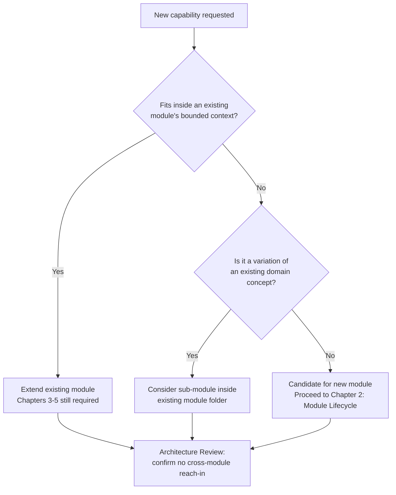

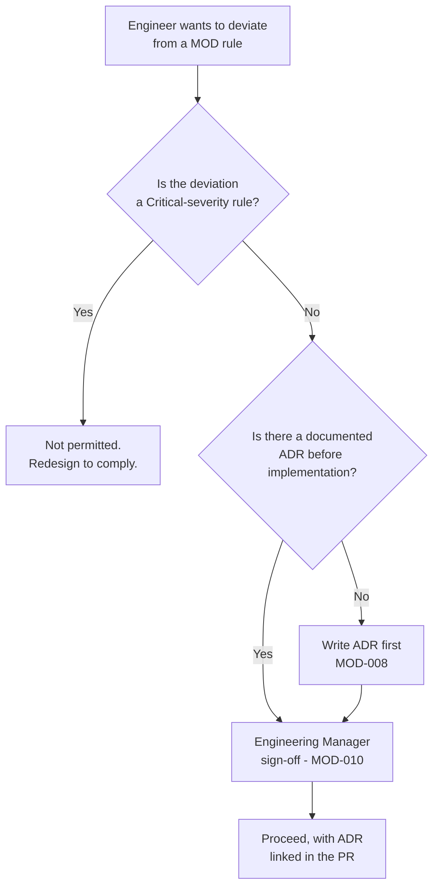

## Mermaid Workflow Diagrams


This is the master flow that every remaining chapter of this handbook details one link at a time. Chapter 2 (Module Lifecycle) restates it as a stateful process with entry/exit criteria per stage.

## Tables

**Philosophy-to-Chapter Traceability**

| Principle | Elaborated in |
|---|---|
| Feature-first, self-contained module (MOD-001) | Chapter 11 (Folder Creation), Chapter 32 (Reusable Components) |
| Clean Architecture layering (MOD-002) | Chapter 7 (Technical Design), Chapter 12 (Backend Development Process) |
| Domain-first, not database-first (MOD-003) | Chapter 5 (Domain Analysis), Chapter 8 (Database Planning) |
| Gated lifecycle, no skipped stages (MOD-004, MOD-010) | Chapter 2 (Module Lifecycle), Chapter 35 (Definition of Ready) |
| Published interfaces only (MOD-005) | Chapter 3 (Requirement Analysis), Chapter 31 (Module Dependencies) |
| Tests/docs/audit/permissions in-PR (MOD-006) | Chapter 21 (Testing Strategy), Chapter 20 (Audit Trail), Chapter 17 (Permissions) |
| AI held to the same bar (MOD-007) | Chapter 34 (AI Assistant Workflow) |
| ADR-first deviation (MOD-008) | Chapter 29 (Refactoring Guidelines) |
| Done means validated in production (MOD-009) | Chapter 27 (Post Deployment Validation) |
| Compress time, not sequence (MOD-010) | Chapter 2 (Module Lifecycle) |

## Checklists

**Before starting any new module, confirm:**

- [ ] The business problem is written in one paragraph and agreed with the requester.
- [ ] The relevant section(s) of `00_BUSINESS_RULES.md` are identified and read.
- [ ] It is clear whether this is a new module, an extension of an existing module, or a sub-module.
- [ ] No existing module already owns this bounded context (checked against `04_FOLDER_STRUCTURE.md`).
- [ ] The engineer (or AI assistant) has read Chapters 1–5 of this guide, not just this chapter.
- [ ] Any anticipated deviation from a MOD rule has an ADR drafted, not just planned.

## Engineering Notes

- This handbook is deliberately process-heavy for an ERP product because ERP defects are expensive in a way most SaaS defects are not: a miscalculated depreciation schedule or a wrong tax posting doesn't surface as a broken button, it surfaces as an incorrect financial statement, potentially months later. Chapters 3–5 exist to catch that class of error before code is written, because it is nearly unrecoverable after.
- "Modular monolith" is a deployment decision, not a design license. The discipline described here exists specifically because the monolith removes the network boundary that would otherwise force module isolation for free. Folder discipline and import-boundary lints are how LedgerOne buys back what a network boundary would have given it automatically.

## Architecture Notes

- This chapter assumes and does not repeat `03_ARCHITECTURE.md`'s definitions of Modular Monolith, Clean Architecture, and Feature-First Architecture. If a future engineer needs those primitives explained, send them there first.
- Practical DDD, as used at LedgerOne, means: ubiquitous language sourced from `00_BUSINESS_RULES.md`, explicit aggregates for the accounting-critical entities (Journal Entry, Invoice, Payment, Asset, etc.), and repositories per aggregate — without full tactical DDD ceremony (no CQRS, no event sourcing, no separate read/write models) unless a specific module's ADR justifies it.

## Related Documents

- `00_BUSINESS_RULES.md` — source of domain truth; Chapters 3–5 depend on it directly.
- `03_ARCHITECTURE.md` — defines Modular Monolith, Clean Architecture, Feature-First Architecture referenced throughout this chapter.
- `04_FOLDER_STRUCTURE.md` — defines where module boundaries physically live.
- `05_CODING_STANDARDS.md` — the layer-by-layer coding rules that MOD-002 compliance is checked against at Code Review.
- `09_SECURITY_GUIDELINES.md` — governs the permission and audit-trail obligations referenced in MOD-006.
- `11_GIT_WORKFLOW.md` — governs the branch/PR shape referenced in "Standards" item 1.

## Related ADR

- No ADRs exist yet under this chapter. The first ADR template and log location will be defined in Chapter 29 (Refactoring Guidelines) and Chapter 8 (Database Planning); this section will be back-filled with a link once that structure exists.

## AI Assistant Guidance

- An AI assistant asked to scaffold, extend, or review a module must first identify: (a) which existing module this belongs to, or whether it is genuinely new, and (b) which chapters of this guide are already satisfied versus still open, before generating any code or file.
- An AI assistant must never silently "simplify" a task by skipping Domain Analysis, skipping tests, or collapsing Clean Architecture layers, even if the human prompt only asks for "a quick endpoint." If a prompt implies skipping a Critical-severity rule, the assistant must surface that conflict instead of complying quietly.
- An AI assistant must never present its own output as pre-approved by Architecture Review, Code Review, or Security Review. Those are human gates (Chapters 23, 25) that this handbook does not delegate to AI judgment alone — AI participates in preparing for them (Chapter 34), it does not replace them.
- When an AI assistant is uncertain whether a proposed change fits inside an existing module's bounded context, it must say so explicitly rather than guessing, per the Decision Tree above.

## Future Considerations

- As LedgerOne's module count grows, this chapter's principles will need a companion "module registry" (a living index of bounded contexts) so that MOD-001 ("does this already belong somewhere") stops depending on institutional memory. That registry is out of scope for this handbook and should be tracked as a separate tooling initiative.
- If LedgerOne ever splits the modular monolith into services, MOD-005 (published interfaces only) is the seam that makes that split tractable — this chapter is written so that future decision costs nothing to exercise the option, without requiring it now.

---

*End of Chapter 1.*

---

# Chapter 2 — Module Lifecycle

## Purpose

Chapter 1 stated the beliefs. This chapter turns them into a stateful process: named stages, entry criteria, exit criteria, and the gate between each. Every module — new, extended, or refactored — moves through these stages in order. This is the process referenced by "Chapters 3–10" throughout the rest of this handbook.

## Responsibilities

| Role | Responsibility |
|---|---|
| Module Owner | Drives the module through each stage, produces the exit artifact for each |
| Tech Lead | Signs off on stage-exit criteria before the next stage starts |
| Architecture Reviewer | Owns the Technical Design and Database Planning gates |
| Security Reviewer | Owns the Security Review gate |
| QA | Owns the Testing and Post-Deployment Validation gates |
| AI Assistant | May produce draft artifacts for any stage but never self-certifies a gate |

## Rule IDs

| Rule ID | Statement |
|---|---|
| MOD-011 | A module has exactly one lifecycle state at a time, tracked in the module's tracking ticket, not inferred from branch existence. |
| MOD-012 | A stage cannot begin until the previous stage's exit artifact exists and is linked from the tracking ticket. |
| MOD-013 | Stage exit artifacts are durable (documents, diagrams, ADRs, code, tests) — verbal sign-off without an artifact does not satisfy a gate. |
| MOD-014 | Stages may run with overlapping staffing (e.g., a frontend engineer starts Frontend Planning while backend is mid-Technical-Design) but may not skip their own predecessor's exit criteria. |
| MOD-015 | Reopening an earlier stage after a later stage has started requires an explicit regression note in the tracking ticket explaining what invalidated the earlier artifact. |

## Severity

| Rule ID | Severity |
|---|---|
| MOD-011 | Medium |
| MOD-012 | Critical |
| MOD-013 | High |
| MOD-014 | Low |
| MOD-015 | High |

## Enforcement

| Rule ID | Enforced at |
|---|---|
| MOD-011 | Architecture Review |
| MOD-012 | Architecture Review, Code Review |
| MOD-013 | Architecture Review, QA Validation |
| MOD-014 | Tech Lead discretion |
| MOD-015 | Architecture Review |

## Standards

The lifecycle has eleven stages, each detailed in its own chapter:

| # | Stage | Exit Artifact | Chapter |
|---|---|---|---|
| 1 | Requirement Analysis | One-page requirement brief | 3 |
| 2 | Business Rule Analysis | Rule-ID mapping to `00_BUSINESS_RULES.md` | 4 |
| 3 | Domain Analysis | Domain model (entities, aggregates, invariants) | 5 |
| 4 | Functional Specification | Approved functional spec | 6 |
| 5 | Technical Design | Approved technical design doc + ADRs | 7 |
| 6 | Database Planning | Schema plan reviewed against `06_DATABASE_STANDARDS.md` | 8 |
| 7 | API Planning | Endpoint contract reviewed against `07_REST_API_STANDARDS.md` | 9 |
| 8 | Frontend Planning | Screen/state plan reviewed against `08_FRONTEND_STANDARDS.md` | 10 |
| 9 | Folder Creation | Module skeleton committed | 11 |
| 10 | Backend + Frontend Development | Passing PR, tests included | 12–13 |
| 11 | Testing → Security Review → Deployment → Post-Deployment Validation | Production sign-off | 21, 25–27 |

## Best Practices

- Keep the tracking ticket as the single source of truth for lifecycle state; do not let Slack threads or standups become the record of what stage a module is in.
- For small modules (single CRUD-shaped feature), stages 1–4 can be a single half-page document — the rule is that the *content* exists, not that it must be four separate files.
- For large modules (e.g., a new accounting sub-ledger), expect stages 1–8 to take longer than stages 9–11 combined. That is correct, not a sign of stalling.

## Common Mistakes

| Mistake | Consequence |
|---|---|
| Starting Technical Design before Business Rule Analysis is written down | Design encodes assumptions instead of verified rules; expensive rework at Database Planning |
| Treating Folder Creation as "step 1" | Produces a folder structure that gets reshaped mid-development because domain boundaries weren't settled first |
| Collapsing stages 1–3 into a single "kickoff meeting" with no artifact | Violates MOD-013; nothing durable to review or revisit |

## Decision Matrix

| Situation | Correct action |
|---|---|
| Module is a small CRUD extension of an existing module | Combine stages 1–4 into one brief document; still produce it |
| Module touches money movement, tax, or regulatory reporting | Full separate artifact per stage; extra Business Rule Analysis review by Finance SME |
| Mid-development discovery invalidates the Domain Analysis | Reopen stage 3 per MOD-015; do not patch around it in code |

## Decision Trees

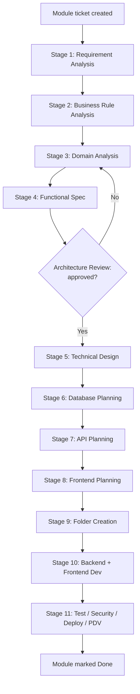

## Mermaid Workflow Diagrams

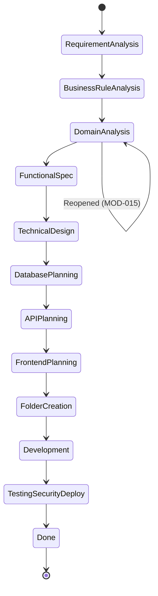

## Tables

**Stage Ownership Matrix**

| Stage | Primary Owner | Reviewer |
|---|---|---|
| 1–3 (Analysis) | Module Owner + Business Analyst | Tech Lead |
| 4–5 (Spec + Design) | Tech Lead | Architecture Reviewer |
| 6–8 (DB/API/FE Planning) | Backend/Frontend Leads | Architecture Reviewer |
| 9–10 (Build) | Engineers | Code Reviewers |
| 11 (Release) | QA + Security | Engineering Manager |

## Checklists

- [ ] Tracking ticket exists and names the current stage.
- [ ] Every completed stage has a linked, durable exit artifact.
- [ ] No stage was skipped; any reopened stage has a regression note (MOD-015).
- [ ] Staffing overlap (MOD-014) is documented, not implicit.

## Engineering Notes

The eleven-stage shape looks heavy for a two-day feature. It is meant to *scale down* in effort, not in sequence — a two-day feature still visits every stage, just briefly and often by one person. What must never happen is a stage being skipped because it was "obviously fine" — that judgment is exactly what a domain-first architecture makes expensive to be wrong about.

## Architecture Notes

This lifecycle is the Chapter-1 philosophy expressed as a state machine. MOD-004 (no skipping to Technical Design) and MOD-010 (compress time, not sequence) are the philosophical rules; MOD-012 (gate enforcement) is their mechanical enforcement.

## Related Documents

- `00_BUSINESS_RULES.md`, `03_ARCHITECTURE.md`, `06_DATABASE_STANDARDS.md`, `07_REST_API_STANDARDS.md`, `08_FRONTEND_STANDARDS.md` — each stage's exit artifact is reviewed against the corresponding standards document.

## Related ADR

- None yet. ADR template lands in Chapter 29.

## AI Assistant Guidance

- An AI assistant may draft the exit artifact for any stage (e.g., a first-pass domain model, a first-pass API contract) but must label it as a draft pending human review, and must not advance a ticket's lifecycle state itself.
- If asked to "just build the module," an AI assistant must ask which lifecycle stage the module is currently at rather than assuming stage 10.

## Future Considerations

- A lightweight tracking-ticket template (per stage, with required-artifact links) would make MOD-012/MOD-013 mechanically checkable instead of relying on reviewer diligence. Candidate for a future tooling chapter or an engineering-systems initiative outside this handbook's scope.

---

*End of Chapter 2.*

---

# Chapter 3 — Requirement Analysis

## Purpose
Converts a raw ask ("we need X") into a written, testable requirement before any design happens. This is the stage that stops "vibes-based" module scoping.

## Responsibilities

| Role | Responsibility |
|---|---|
| Business Analyst / Module Owner | Writes the requirement brief |
| Requester (Finance/Ops/Product) | Confirms the brief matches intent |
| Tech Lead | Confirms the brief is scoped to one bounded context (MOD-001) |

## Rule IDs, Severity, Enforcement

| Rule ID | Statement | Severity | Enforcement |
|---|---|---|---|
| MOD-016 | Every module has a written requirement brief: problem statement, target users, success criteria, out-of-scope list. | Critical | Architecture Review |
| MOD-017 | Success criteria must be testable statements, not adjectives ("faster", "better"). | High | Architecture Review |
| MOD-018 | Out-of-scope items are listed explicitly, not left implicit. | Medium | Architecture Review |
| MOD-019 | The requester signs off on the brief before Business Rule Analysis (Chapter 4) starts. | High | Architecture Review |

## Standards
A requirement brief is one page: Problem, Users, Success Criteria, Out of Scope, Known Constraints (regulatory, deadline, dependency). It is written before any UI mockup or schema sketch exists.

## Best Practices
- Write success criteria as Given/When/Then statements — they convert directly into acceptance tests later (Chapter 21).
- Interview the requester for the business rule behind the ask, not just the ask ("why do we need to split this invoice line" surfaces a business rule Chapter 4 needs).

## Common Mistakes

| Mistake | Consequence |
|---|---|
| Brief written after Technical Design as a formality | Defeats the purpose; design already encodes unverified assumptions |
| Success criteria stated as UI descriptions | Untestable; QA has nothing objective to check in Chapter 21 |

## Decision Matrix

| Situation | Correct action |
|---|---|
| Requester can't articulate success criteria | Do not proceed to Chapter 4 until they can |
| Ask is actually a bug in an existing module | Route to Chapter 28 (Bug Fix Workflow), not new-module lifecycle |

## Decision Tree

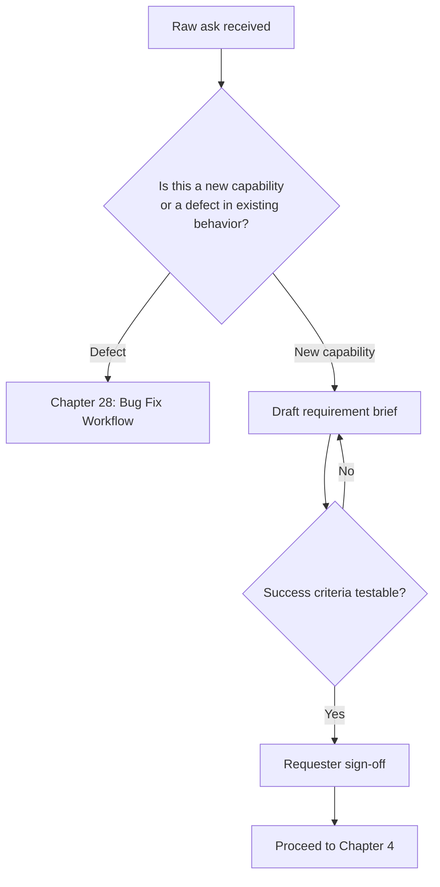

## Checklist
- [ ] Problem statement is one paragraph.
- [ ] Success criteria are Given/When/Then, not adjectives.
- [ ] Out-of-scope list exists.
- [ ] Requester signed off.

## Engineering Notes
Most ERP scope creep traces back to a requirement brief that was never actually written — the "brief" existed only as a Slack thread, and every reader remembered a different version of it.

## Architecture Notes
This stage produces the input to MOD-004 (Chapter 1) — Requirement, Business Rule, and Domain Analysis are the three gates that must exist before Technical Design.

## Related Documents
`00_BUSINESS_RULES.md`, `01_PROJECT_CONTEXT.md`

## AI Assistant Guidance
An AI assistant may draft the requirement brief from a raw ask, but must flag any success criterion it cannot phrase testably rather than inventing a testable-sounding but meaningless one.

## Future Considerations
A standard brief template (Markdown, checked into the repo per module) would make MOD-016 self-enforcing.

---

# Chapter 4 — Business Rule Analysis

## Purpose
Maps the requirement to specific, numbered rules in `00_BUSINESS_RULES.md`, and drafts new rule entries when the requirement introduces behavior not yet documented there. No module encodes a business rule that only lives in code.

## Responsibilities

| Role | Responsibility |
|---|---|
| Module Owner | Produces the rule-ID mapping |
| Finance/Domain SME | Validates rules affecting money movement, tax, or regulatory reporting |
| Tech Lead | Confirms every rule referenced by the design later traces back to this mapping |

## Rule IDs, Severity, Enforcement

| Rule ID | Statement | Severity | Enforcement |
|---|---|---|---|
| MOD-020 | Every business rule a module enforces is mapped to a rule ID in `00_BUSINESS_RULES.md`, or added there first. | Critical | Architecture Review |
| MOD-021 | Business logic never lives only as a code comment or tribal knowledge — if it's in the code, it's in the rules doc. | Critical | Code Review |
| MOD-022 | Rules affecting financial postings, tax, or regulatory output require Domain SME sign-off, not just Tech Lead. | Critical | Architecture Review |
| MOD-023 | Conflicting or ambiguous existing rules are resolved (with an update to `00_BUSINESS_RULES.md`) before design proceeds, not worked around in code. | High | Architecture Review |

## Standards
Deliverable is a table: Requirement item → Business Rule ID(s) → New/Existing → SME sign-off (if financial). New rules are proposed as a diff to `00_BUSINESS_RULES.md`, reviewed like any other doc change.

## Best Practices
- Prefer citing an existing rule over writing a near-duplicate new one; near-duplicates are how `00_BUSINESS_RULES.md` drifts into contradiction.
- When a rule is genuinely module-specific and unlikely to generalize, still record it centrally — a "local-only" business rule is a support incident waiting to happen when a second module needs the same behavior.

## Common Mistakes

| Mistake | Consequence |
|---|---|
| Encoding a tax or posting rule directly in service-layer code with no doc trail | Untraceable behavior; next engineer can't tell if it's a bug or a rule |
| Treating SME review as optional for "small" financial changes | Small financial rule errors compound silently across many transactions |

## Decision Matrix

| Situation | Correct action |
|---|---|
| Requirement implies a rule that contradicts an existing documented rule | Escalate to Domain SME + Tech Lead before Chapter 5 |
| Requirement has no financial impact at all | Domain SME sign-off not required; Tech Lead sign-off suffices |

## Decision Tree

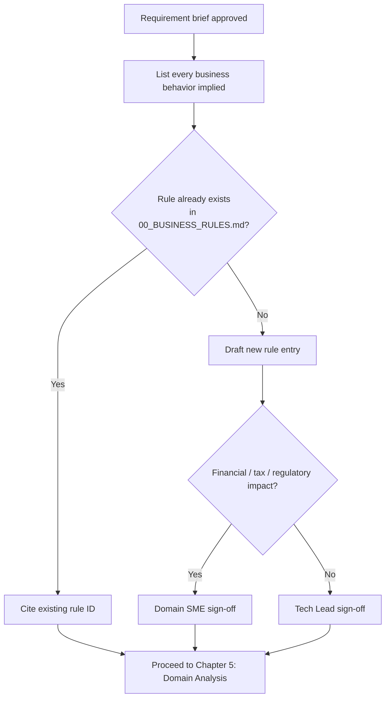

## Checklist
- [ ] Every implied business behavior has a rule ID.
- [ ] New rules are added to `00_BUSINESS_RULES.md`, not left in a design doc only.
- [ ] Financial-impact rules have SME sign-off.

## Engineering Notes
In an ERP, "the code is the documentation" is backwards — the code must be a faithful implementation of `00_BUSINESS_RULES.md`, checkable by someone who never reads TypeScript.

## Architecture Notes
This chapter is the practical mechanism behind MOD-003 (domain discovered from business rules, not invented at the API/DB layer).

## Related Documents
`00_BUSINESS_RULES.md`

## AI Assistant Guidance
An AI assistant must never invent a plausible-sounding business rule to fill a gap. If a requirement implies behavior with no traceable rule, the assistant must say so and request SME input rather than guessing at rounding, tax, or posting behavior.

## Future Considerations
Consider a machine-readable rule-ID registry (rather than prose-only) so Chapter 21 tests can assert against rule IDs directly.

---

# Chapter 5 — Domain Analysis

## Purpose
Builds the actual domain model — entities, aggregates, invariants, relationships — from the business rules identified in Chapter 4. This is the last stage before any technical (framework/database/API) decision is allowed, per MOD-003 and MOD-004.

## Responsibilities

| Role | Responsibility |
|---|---|
| Tech Lead | Owns the domain model diagram |
| Module Owner | Drafts entities/aggregates and invariants |
| Architecture Reviewer | Confirms no technology leaks into the domain model |

## Rule IDs, Severity, Enforcement

| Rule ID | Statement | Severity | Enforcement |
|---|---|---|---|
| MOD-024 | The domain model names entities, aggregates, and invariants using business language from `00_BUSINESS_RULES.md`, not database or framework terms. | High | Architecture Review |
| MOD-025 | Every invariant (a rule that must always hold, e.g. "a posted Journal Entry's debits equal its credits") is stated explicitly and traced to a business rule ID. | Critical | Architecture Review |
| MOD-026 | Aggregate boundaries are decided here, before Chapter 8 (Database Planning) — the schema follows the aggregate, not the reverse. | Critical | Architecture Review |
| MOD-027 | Cross-aggregate references are by identity (ID) only, never by embedding another aggregate's mutable state. | High | Code Review |

## Standards
Deliverable: a domain model diagram (entities, aggregates, relationships) plus an invariants table (Invariant → Business Rule ID → Enforced where — service layer, DB constraint, or both).

## Best Practices
- Name aggregates after the business concept a domain expert would use ("Journal Entry", not "LedgerRecord").
- Write invariants as assertions ("X must always be true"), not as validation error messages — the error message is a Chapter 14 concern, derived from the invariant, not the other way around.

## Common Mistakes

| Mistake | Consequence |
|---|---|
| Naming entities after their Prisma model names | Domain model becomes a database diagram with extra steps; violates MOD-024 |
| Skipping invariants for "obvious" rules | Obvious rules are exactly the ones that get silently broken by a later edge-case fix |
| One aggregate embedding another's full mutable object | Violates MOD-027; creates hidden coupling and stale-data bugs |

## Decision Matrix

| Situation | Correct action |
|---|---|
| Unsure whether two entities are one aggregate or two | Ask: "must these always be consistent within one transaction?" Yes → one aggregate |
| An invariant can't be enforced at the service layer alone | Note it explicitly for Chapter 8 as a required DB constraint (e.g., CHECK, unique index) |

## Decision Tree

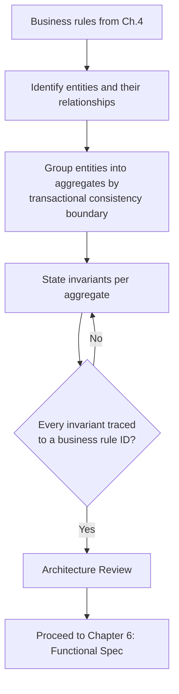

## Tables

**Example invariant mapping (illustrative only, not a real LedgerOne rule)**

| Invariant | Business Rule ID | Enforced at |
|---|---|---|
| Sum of debit lines equals sum of credit lines on a posted entry | (example) BR-GL-014 | Service layer + DB CHECK |
| An asset cannot be depreciated past its salvage value | (example) BR-FA-022 | Service layer |

## Checklist
- [ ] Domain model uses business language only.
- [ ] Every invariant traces to a business rule ID.
- [ ] Aggregate boundaries decided before any schema sketch.
- [ ] Cross-aggregate references are by ID only.

## Engineering Notes
This is the stage where an AI assistant is most likely to over-help by jumping straight to a Prisma schema "for clarity." Resist it — a schema is a downstream artifact of this chapter, not a substitute for it.

## Architecture Notes
Directly implements MOD-003. Chapter 8 (Database Planning) is required to cite this chapter's aggregate boundaries; it cannot introduce new ones.

## Related Documents
`00_BUSINESS_RULES.md`, `03_ARCHITECTURE.md`

## AI Assistant Guidance
An AI assistant asked to "design the schema" for a new module must first ask whether Domain Analysis exists; if not, it should produce the domain model first and label the schema as blocked on review, rather than silently skipping to tables and columns.

## Future Considerations
As the domain model library grows, a shared glossary of aggregate names across modules would prevent two modules from independently inventing incompatible terms for the same concept.

---

*End of Chapter 5.*

---

# Chapter 6 — Functional Specification

## Purpose
Translates the domain model into user-facing behavior: screens, flows, states, and edge cases, written so QA, frontend, and backend engineers share one description of "what the module does" before anyone designs "how."

## Responsibilities

| Role | Responsibility |
|---|---|
| Module Owner / Product | Writes the functional spec |
| Frontend Lead | Confirms flows are implementable within `08_FRONTEND_STANDARDS.md` |
| QA | Confirms every flow has a corresponding acceptance criterion |

## Rule IDs, Severity, Enforcement

| Rule ID | Statement | Severity | Enforcement |
|---|---|---|---|
| MOD-028 | Every user-facing flow is described as a sequence of states (happy path + edge cases), not just a happy-path narrative. | High | Architecture Review |
| MOD-029 | Every flow references the domain invariants (Chapter 5) it must not violate. | High | Architecture Review |
| MOD-030 | Permission-gated behavior (who can see/do what) is specified here, not left to be decided at code-review time. | Critical | Architecture Review |
| MOD-031 | The functional spec is approved before Technical Design (Chapter 7) begins. | Critical | Architecture Review |

## Standards
Deliverable: per-flow description (Actor → Trigger → Steps → Success State → Failure States), a permission matrix stub (refined in Chapter 17), and explicit edge cases (empty states, concurrent edits, partial failures).

## Best Practices
- Write edge cases before happy paths are finalized — happy-path-only specs are the leading cause of Chapter 21 test gaps.
- Reuse existing UI patterns from `08_FRONTEND_STANDARDS.md` rather than specifying novel interactions per module.

## Common Mistakes

| Mistake | Consequence |
|---|---|
| Spec describes screens instead of flows | Misses multi-step, multi-actor behavior (e.g., approval chains) |
| Permission behavior deferred to "we'll figure it out in code" | Violates MOD-030; permission logic ends up inconsistent across similar flows |

## Decision Matrix

| Situation | Correct action |
|---|---|
| Flow involves an approval or multi-actor handoff | Model each actor's steps and states explicitly, not as one linear narrative |
| Edge case is rare but affects money movement | Specify it fully; rarity is not a reason to omit financial edge cases |

## Decision Tree

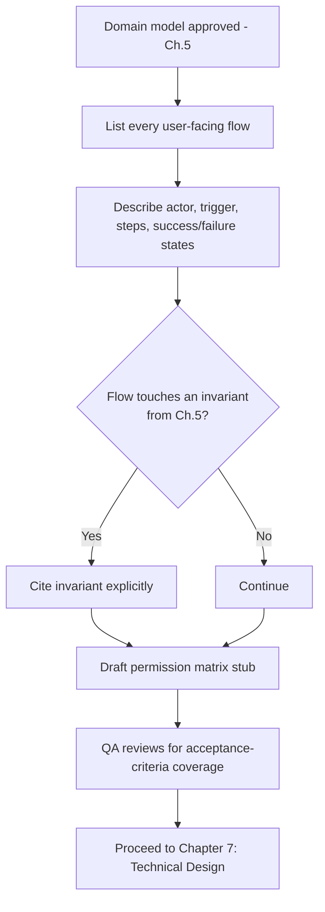

## Checklist
- [ ] Every flow has happy path + edge cases.
- [ ] Every flow cites relevant invariants.
- [ ] Permission-gated behavior specified.
- [ ] QA has confirmed testability.

## Engineering Notes
A functional spec that only a developer can read has failed its purpose — it should be reviewable by the original business requester from Chapter 3 without translation.

## Architecture Notes
This is the bridge artifact between domain modeling (Chapter 5) and technical design (Chapter 7) — it is deliberately technology-agnostic.

## Related Documents
`08_FRONTEND_STANDARDS.md`, Chapter 17 (Permissions), Chapter 21 (Testing Strategy)

## AI Assistant Guidance
An AI assistant drafting a functional spec must generate edge cases proactively (empty states, concurrent access, partial failure) rather than waiting to be asked, and must flag any flow where permission rules are ambiguous.

## Future Considerations
A shared flow-notation (e.g., a lightweight state-machine syntax) across all modules would make specs machine-checkable against actual implemented state transitions.

---

# Chapter 7 — Technical Design

## Purpose
The first technology-aware stage. Decides how the approved domain model and functional spec map onto Clean Architecture layers, module boundaries, and cross-module interfaces — still without writing implementation code.

## Responsibilities

| Role | Responsibility |
|---|---|
| Tech Lead | Owns the technical design document |
| Architecture Reviewer | Approves or rejects at the design gate |
| Module Owner | Documents any cross-module dependency |

## Rule IDs, Severity, Enforcement

| Rule ID | Statement | Severity | Enforcement |
|---|---|---|---|
| MOD-032 | Technical design explicitly maps each domain aggregate to Controller/Service/Repository/Entity layers per `03_ARCHITECTURE.md` and `05_CODING_STANDARDS.md`. | Critical | Architecture Review |
| MOD-033 | Any dependency on another module is named explicitly as a published interface (MOD-005), with the owning module's sign-off. | Critical | Architecture Review |
| MOD-034 | Any deviation from standard layering or standard module shape requires an ADR (MOD-008) attached to the design doc. | High | Architecture Review |
| MOD-035 | Non-functional requirements (expected volume, concurrency, latency budget) are stated, even if approximate. | Medium | Architecture Review |

## Standards
Deliverable: a technical design doc containing layer mapping, sequence diagrams for non-trivial flows, cross-module dependency list, and non-functional targets.

## Best Practices
- Sequence-diagram any flow that spans more than two layers or touches another module — prose alone hides ordering bugs.
- State non-functional targets even roughly ("under 500 concurrent users, sub-200ms p95 for list endpoints") — an approximate target beats no target at Chapter 24 (Performance Review).

## Common Mistakes

| Mistake | Consequence |
|---|---|
| Design skips stating cross-module dependencies explicitly | Surfaces later as an unreviewed direct import, violating MOD-005 |
| Copy-pasting another module's design doc structure without adapting to this module's actual aggregates | Design reads plausible but doesn't match the real domain model from Chapter 5 |

## Decision Matrix

| Situation | Correct action |
|---|---|
| Module needs data owned by another module | Design a published interface; get the owning module's Tech Lead sign-off |
| Design must deviate from standard Clean Architecture layering for a real technical reason | Write an ADR (MOD-008) before proceeding |

## Decision Tree

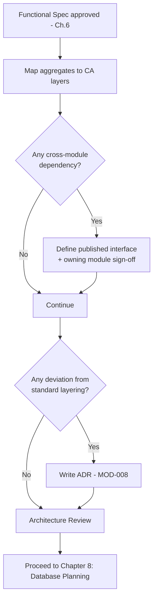

## Checklist
- [ ] Layer mapping complete for every aggregate.
- [ ] Cross-module dependencies named and signed off.
- [ ] Deviations have an ADR.
- [ ] Non-functional targets stated.

## Engineering Notes
Technical Design is where "clever" ideas should be caught, not celebrated — a design that impresses at review but that a second engineer can't extend without asking the author has failed Chapter 7's actual job.

## Architecture Notes
Implements MOD-002 (Clean Architecture layering) and MOD-005 (published interfaces) as concrete, per-module decisions.

## Related Documents
`03_ARCHITECTURE.md`, `05_CODING_STANDARDS.md`, Chapter 31 (Module Dependencies)

## AI Assistant Guidance
An AI assistant must map every proposed component to a specific Clean Architecture layer and flag anything that doesn't fit cleanly, rather than inventing a new layer or blending responsibilities to make code "simpler."

## Future Considerations
A standard sequence-diagram template (Mermaid) per module would make cross-module flows auditable in bulk later.

---

# Chapter 8 — Database Planning

## Purpose
Turns the Chapter 5 domain model and aggregate boundaries into a concrete schema plan, reviewed against `06_DATABASE_STANDARDS.md`, before any migration is written.

## Responsibilities

| Role | Responsibility |
|---|---|
| Backend Lead | Drafts the schema plan |
| DBA / Architecture Reviewer | Reviews against `06_DATABASE_STANDARDS.md` |
| Module Owner | Confirms invariants from Chapter 5 map to constraints here |

## Rule IDs, Severity, Enforcement

| Rule ID | Statement | Severity | Enforcement |
|---|---|---|---|
| MOD-036 | Schema tables map to Chapter 5 aggregates; no table is introduced that doesn't trace to a domain entity or a documented technical necessity (e.g., join table). | Critical | Architecture Review |
| MOD-037 | Every invariant flagged in Chapter 5 as "DB-enforceable" becomes an actual constraint (FK, unique index, CHECK) in the plan. | Critical | Architecture Review |
| MOD-038 | Schema plan follows `06_DATABASE_STANDARDS.md` naming, typing, and indexing conventions exactly. | High | Code Review, CI/CD |
| MOD-039 | Migrations are additive-first (Chapter 30 versioning); destructive migrations require an explicit rollout plan. | Critical | Architecture Review |

## Standards
Deliverable: entity-relationship diagram, table list with purpose per table, constraint list mapped to Chapter 5 invariants, and index plan for expected query patterns from Chapter 9.

## Best Practices
- Design indexes against the API's actual query patterns (Chapter 9), not speculative ones.
- Keep money/quantity columns in the fixed-point types mandated by `06_DATABASE_STANDARDS.md` — never floating point.

## Common Mistakes

| Mistake | Consequence |
|---|---|
| Adding a table with no traceable aggregate | Violates MOD-036; usually a sign Chapter 5 was incomplete |
| Skipping a DB-level CHECK for an invariant because "the service layer already checks it" | Defense-in-depth lost; direct DB access or a future bug bypasses the service layer |

## Decision Matrix

| Situation | Correct action |
|---|---|
| Invariant can only realistically be enforced in application code (e.g., cross-row business logic) | Document why; don't force an awkward CHECK constraint |
| Migration would drop or truncate existing data | Requires explicit rollout plan and sign-off (MOD-039), not silent inclusion in a routine migration |

## Decision Tree

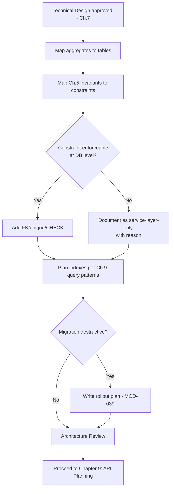

## Checklist
- [ ] Every table traces to an aggregate or documented necessity.
- [ ] Every DB-enforceable invariant has a constraint.
- [ ] Naming/typing/indexing follows `06_DATABASE_STANDARDS.md`.
- [ ] Destructive migrations have a rollout plan.

## Engineering Notes
The schema is the most expensive artifact in this handbook to change post-launch in an ERP system — historical financial data depends on it. This is why Chapters 5 and 8 are kept strictly separate: get the shape right conceptually before it's expensive to move.

## Architecture Notes
Directly implements MOD-003 and MOD-026 — schema follows the aggregate, never the reverse.

## Related Documents
`06_DATABASE_STANDARDS.md`, Chapter 5 (Domain Analysis), Chapter 30 (Module Versioning)

## AI Assistant Guidance
An AI assistant must reject "convenient" denormalization or new tables that don't trace to an aggregate, and must proactively ask whether an invariant should be a DB constraint rather than only application logic.

## Future Considerations
Automated CI checks that diff a migration against the Chapter 5 invariant list would catch missing constraints before Code Review.

---

# Chapter 9 — API Planning

## Purpose
Defines the module's REST contract — endpoints, request/response shapes, status codes, and pagination/filtering behavior — against `07_REST_API_STANDARDS.md`, before backend implementation begins.

## Responsibilities

| Role | Responsibility |
|---|---|
| Backend Lead | Drafts the API contract |
| Frontend Lead | Reviews contract against actual screen needs (Chapter 10) |
| Architecture Reviewer | Confirms conformance to `07_REST_API_STANDARDS.md` |

## Rule IDs, Severity, Enforcement

| Rule ID | Statement | Severity | Enforcement |
|---|---|---|---|
| MOD-040 | Every endpoint is documented (path, method, request, response, status codes) before implementation, per `07_REST_API_STANDARDS.md`. | Critical | Architecture Review |
| MOD-041 | Endpoints are versioned under `/api/v1` and resource-oriented, matching existing module conventions. | High | Code Review, CI/CD |
| MOD-042 | Every endpoint declares its required permission(s) (Chapter 17) at planning time. | Critical | Architecture Review |
| MOD-043 | List endpoints define pagination, filtering, and sort behavior explicitly — no unbounded result sets. | High | Architecture Review |

## Standards
Deliverable: OpenAPI/Swagger-style contract (per `02_TECH_STACK.md`'s Swagger standard) listing every endpoint, DTO shape, validation rules (Chapter 14 pointer), and required permission.

## Best Practices
- Design the contract from the frontend's actual data needs (Chapter 10 in parallel), not from what the database happens to expose.
- Keep error response shape consistent with `07_REST_API_STANDARDS.md` across all endpoints in the module — no module-specific error format.

## Common Mistakes

| Mistake | Consequence |
|---|---|
| Endpoint shape mirrors the DB table 1:1 | Leaks internal schema into the public contract; breaks on future refactors |
| Pagination added after an endpoint ships unbounded | Production incident under real data volume |

## Decision Matrix

| Situation | Correct action |
|---|---|
| Frontend needs a shape the database doesn't naturally provide | Design a DTO/aggregation in the service layer; don't reshape the database for API convenience |
| Endpoint could return large result sets | Mandatory pagination + filtering, defined now, not retrofitted |

## Decision Tree

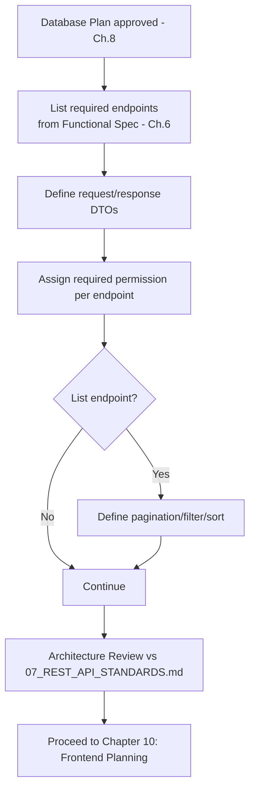

## Checklist
- [ ] Every endpoint documented before code.
- [ ] `/api/v1` resource-oriented paths.
- [ ] Permissions assigned per endpoint.
- [ ] List endpoints have pagination/filter/sort defined.

## Engineering Notes
An API contract reviewed before code exists is cheap to change. The same contract discovered by reading controller code after the PR is open is expensive to change — frontend work may already depend on it.

## Architecture Notes
This chapter's output is what Chapter 12 (Backend Development) implements against, and what Chapter 17 (Permissions) formalizes per endpoint.

## Related Documents
`07_REST_API_STANDARDS.md`, Chapter 17 (Permissions), Chapter 10 (Frontend Planning)

## AI Assistant Guidance
An AI assistant must generate the full contract (including error responses and permission tags) rather than only happy-path request/response pairs, and must flag any endpoint it cannot assign a clear permission to.

## Future Considerations
Generating this chapter's contract directly as a committed OpenAPI file (rather than prose) would let Chapter 12 validate implementation against it automatically in CI.

---

# Chapter 10 — Frontend Planning

## Purpose
Plans screens, component composition, state management, and data-fetching strategy against `08_FRONTEND_STANDARDS.md` and the Chapter 9 API contract, before frontend implementation begins.

## Responsibilities

| Role | Responsibility |
|---|---|
| Frontend Lead | Drafts the screen/state plan |
| Backend Lead | Confirms API contract (Chapter 9) covers every planned screen's data needs |
| UX (if available) | Reviews flows against Chapter 6 functional spec |

## Rule IDs, Severity, Enforcement

| Rule ID | Statement | Severity | Enforcement |
|---|---|---|---|
| MOD-044 | Every screen maps to a Chapter 6 flow; no screen is planned that isn't in the functional spec. | High | Architecture Review |
| MOD-045 | Data fetching uses TanStack Query per `08_FRONTEND_STANDARDS.md`; no ad-hoc fetch/state duplication of server state. | Critical | Code Review |
| MOD-046 | Forms use React Hook Form + the module's Zod schema (Chapter 14) shared or mirrored between frontend and backend. | High | Code Review |
| MOD-047 | Every screen's required permission(s) are declared at planning time, matching Chapter 9's endpoint permissions. | Critical | Architecture Review |

## Standards
Deliverable: screen list mapped to flows, component composition sketch (reusing `08_FRONTEND_STANDARDS.md` components first), state plan (server state via TanStack Query, local/UI state only where genuinely local), and list of shared components this module will need vs. contribute (Chapter 32 pointer).

## Best Practices
- Check `08_FRONTEND_STANDARDS.md`'s existing component library before planning a new one — most CRUD-shaped screens should assemble from existing TanStack Table / RHF patterns.
- Plan loading, empty, and error states per screen now — they are Chapter 6 edge cases made concrete in UI.

## Common Mistakes

| Mistake | Consequence |
|---|---|
| Planning a bespoke table/grid instead of TanStack Table | Duplicated logic, inconsistent UX, violates `08_FRONTEND_STANDARDS.md` |
| Server data held in local component state instead of TanStack Query | Cache invalidation bugs, stale data across screens |

## Decision Matrix

| Situation | Correct action |
|---|---|
| Screen's data need isn't covered by the Chapter 9 contract | Go back to Chapter 9, don't invent a client-side workaround |
| A UI pattern doesn't exist yet in the shared component library | Plan it as a reusable component (Chapter 32), not a one-off |

## Decision Tree

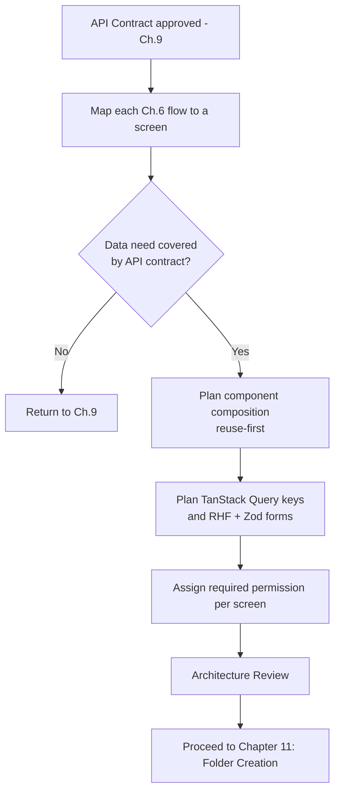

## Checklist
- [ ] Every screen maps to a functional-spec flow.
- [ ] Data fetching plan uses TanStack Query exclusively for server state.
- [ ] Forms plan uses RHF + Zod.
- [ ] Screen permissions declared and match API permissions.

## Engineering Notes
Frontend Planning and API Planning (Chapter 9) should run with overlapping staffing (MOD-014) — a contract designed with zero frontend input reliably needs revision once real screens are planned.

## Architecture Notes
Enforces the frontend half of MOD-002's layering discipline: presentation concerns stay in components, server-state concerns stay in TanStack Query, never blended.

## Related Documents
`08_FRONTEND_STANDARDS.md`, Chapter 9 (API Planning), Chapter 32 (Reusable Components)

## AI Assistant Guidance
An AI assistant must check for existing shared components before proposing new ones, and must never plan local component state for data that the API contract defines as server state.

## Future Considerations
A component-library index (searchable by pattern: table, form, wizard, approval flow) would make the "reuse-first" best practice mechanically easy to follow instead of memory-dependent.

---

*End of Chapter 10.*

---

# Chapter 11 — Folder Creation

## Purpose
Turns all prior planning into the committed module skeleton. This chapter formally absorbs and retires the standalone `12_MODULE_TEMPLATE.md` file list — the required file set below is now the single source of truth for "what every module contains."

> **Retirement note:** `12_MODULE_TEMPLATE.md`'s content is fully represented in the "Standards" section below. Once this chapter is approved, `12_MODULE_TEMPLATE.md` should be deleted in a follow-up commit — flagged here for confirmation before deletion, per repository hygiene practice.

## Responsibilities

| Role | Responsibility |
|---|---|
| Module Owner | Creates the folder skeleton |
| Tech Lead | Confirms it matches `04_FOLDER_STRUCTURE.md` and this chapter's file list |
| CI/CD | Lints folder shape automatically on first PR |

## Rule IDs, Severity, Enforcement

| Rule ID | Statement | Severity | Enforcement |
|---|---|---|---|
| MOD-048 | Every module folder contains, at minimum, the standard file set defined below — no module ships partial structure "to add later." | Critical | CI/CD, Code Review |
| MOD-049 | Folder placement matches `04_FOLDER_STRUCTURE.md` exactly; no ad-hoc top-level folders. | Critical | CI/CD |
| MOD-050 | The module README is written at creation time, not left as a stub. | Medium | Code Review |
| MOD-051 | Folder creation happens only after Chapters 3–10 are approved (MOD-004, MOD-012) — an empty skeleton is not a way to "start early." | High | Architecture Review |

## Standards

**Required file set per module** (supersedes `12_MODULE_TEMPLATE.md`):

| File/Folder | Purpose |
|---|---|
| README | One-page module overview: purpose, owner, links to Chapters 3–10 artifacts |
| Controller | Request handling layer, per `05_CODING_STANDARDS.md` |
| DTO | Request/response shapes, matching Chapter 9's contract |
| Validation | Zod schemas, per Chapter 14 |
| Service | Business logic layer, implementing Chapter 5 invariants |
| Repository | Data access layer, per `06_DATABASE_STANDARDS.md` |
| Entity | Domain entity types, matching Chapter 5's domain model |
| Interfaces | Published contracts for cross-module use (MOD-005) |
| Tests | Unit + integration tests, per Chapter 21 |
| API Documentation | Swagger/OpenAPI fragment, per Chapter 9 |
| Frontend Module | Screens/components/hooks, per Chapter 10 |
| Business Rules | Local reference back to the `00_BUSINESS_RULES.md` sections this module implements (not a duplicate copy) |

## Best Practices
- Generate the skeleton from a scaffolding script/template where possible so every module starts byte-identical in structure.
- Populate the README's links (Chapters 3–10 artifacts) immediately — an empty README at this stage becomes a permanently empty README in practice.

## Common Mistakes

| Mistake | Consequence |
|---|---|
| Creating the folder before Chapters 3–10 are approved, "to get a head start" | Violates MOD-051; skeleton often needs reshaping once real planning lands, wasting the head start |
| Business Rules file duplicating `00_BUSINESS_RULES.md` content instead of referencing it | Two sources of truth drift apart silently |

## Decision Matrix

| Situation | Correct action |
|---|---|
| Module is small; some folders (e.g., Interfaces) would be empty | Still create the folder with a placeholder noting "no cross-module interface yet" — don't omit it |
| Scaffolding script doesn't yet support a new module type | Manually create the full file set; update the scaffolding script in the same PR |

## Decision Tree

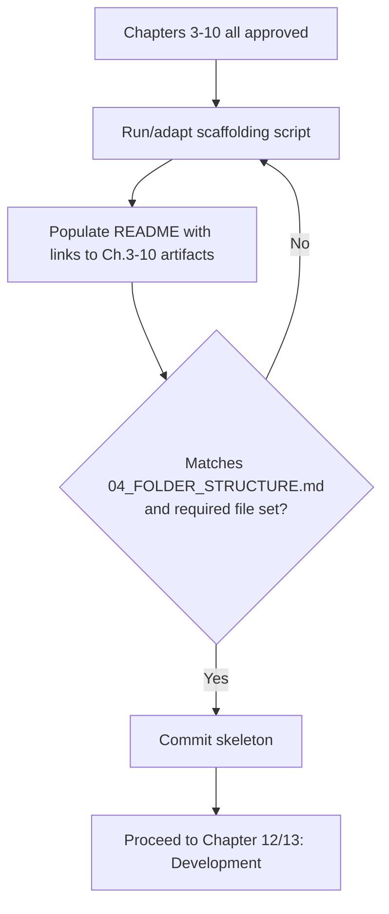

## Checklist
- [ ] All required files/folders present (table above).
- [ ] Folder location matches `04_FOLDER_STRUCTURE.md`.
- [ ] README populated with links, not a stub.
- [ ] Business Rules file references, does not duplicate, `00_BUSINESS_RULES.md`.

## Engineering Notes
This chapter is intentionally the shortest planning-adjacent chapter — by the time a team reaches it, the hard thinking (Chapters 3–10) is done. If Folder Creation feels hard, that's a signal a prior chapter was skipped or shallow.

## Architecture Notes
Directly implements MOD-001 (feature-first, self-contained module) as a literal, checkable folder shape.

## Related Documents
`04_FOLDER_STRUCTURE.md`, `05_CODING_STANDARDS.md`, formerly `12_MODULE_TEMPLATE.md` (retiring)

## AI Assistant Guidance
An AI assistant scaffolding a module must produce the complete required file set in one pass, including placeholder content that references the correct upstream chapter artifacts, not empty files.

## Future Considerations
A CLI scaffolding tool that reads this chapter's table directly would make MOD-048/MOD-049 self-enforcing rather than reviewer-dependent.

---

# Chapter 12 — Backend Development Process

## Purpose
Defines how the Service/Repository/Controller layers are actually implemented, in what order, and against which upstream artifacts, so backend work is a faithful implementation of Chapters 5–9, not a reinterpretation of them.

## Responsibilities

| Role | Responsibility |
|---|---|
| Backend Engineer | Implements layer by layer, bottom-up |
| Tech Lead | Reviews for fidelity to Technical Design (Chapter 7) |
| CI/CD | Runs lint, type-check, unit tests on every push |

## Rule IDs, Severity, Enforcement

| Rule ID | Statement | Severity | Enforcement |
|---|---|---|---|
| MOD-052 | Implementation order is Entity → Repository → Service → Controller — never Controller-first. | High | Code Review |
| MOD-053 | Service layer is the only layer permitted to contain business logic; Controllers and Repositories stay thin, per `05_CODING_STANDARDS.md`. | Critical | Code Review, CI/CD |
| MOD-054 | Every Service method implementing a Chapter 5 invariant includes a code comment citing the invariant/business rule ID only where the "why" is non-obvious. | Medium | Code Review |
| MOD-055 | No direct Prisma client usage outside the Repository layer. | Critical | Code Review, CI/CD (lint rule) |

## Standards
Follow `05_CODING_STANDARDS.md` for style, naming, and error propagation. Every PR implements one coherent slice (e.g., one endpoint's full stack), not a partial layer across many endpoints.

## Best Practices
- Write the Repository layer against the Chapter 8 schema plan directly — don't let Repository shape drift from the reviewed schema.
- Keep Controllers free of any conditional business logic; if a Controller has an `if` that isn't purely about HTTP concerns (status code, shape), it belongs in the Service.

## Common Mistakes

| Mistake | Consequence |
|---|---|
| Business logic creeping into the Controller "just this once" | Violates MOD-053; logic becomes untestable without an HTTP layer, and untraceable to Chapter 5 |
| Repository methods that return DTOs instead of entities | Blurs layer boundaries; Service ends up doing double-mapping or trusting Repository-shaped data |

## Decision Matrix

| Situation | Correct action |
|---|---|
| A validation rule seems simple enough to inline in the Controller | Still route it through Validation (Chapter 14) + Service; no exceptions for "simple" |
| Implementation reveals the Technical Design (Chapter 7) was wrong in a specific way | Update Chapter 7's doc and note the regression (MOD-015), don't silently diverge in code only |

## Decision Tree

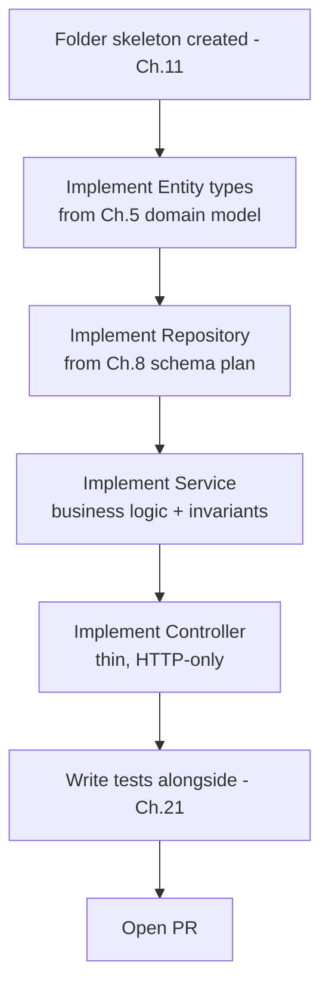

## Checklist
- [ ] Implementation order followed bottom-up.
- [ ] No business logic in Controller or Repository.
- [ ] No direct Prisma usage outside Repository.
- [ ] PR is one coherent vertical slice with tests included.

## Engineering Notes
"Controller-first" development is tempting because it produces a visible, testable-by-Postman result fastest — but it's exactly backwards from Clean Architecture's dependency direction and tends to bake HTTP concerns into business logic.

## Architecture Notes
Directly enforces MOD-002. Chapter 23 (Code Review) is where layering violations are the single most common rejection reason.

## Related Documents
`05_CODING_STANDARDS.md`, `03_ARCHITECTURE.md`, Chapter 5, Chapter 8

## AI Assistant Guidance
An AI assistant generating backend code must produce it in Entity → Repository → Service → Controller order and must refuse to place business logic in a Controller even when asked for "a quick endpoint."

## Future Considerations
A CI lint rule that flags Prisma imports outside `*/repository/*` paths would make MOD-055 fully mechanical.

---

# Chapter 13 — Frontend Development Process

## Purpose
Defines how screens, components, hooks, and forms are implemented against the Chapter 10 plan and the Chapter 9 API contract, keeping server-state, form-state, and UI-state cleanly separated per `08_FRONTEND_STANDARDS.md`.

## Responsibilities

| Role | Responsibility |
|---|---|
| Frontend Engineer | Implements components/hooks bottom-up |
| Frontend Lead | Reviews for fidelity to Chapter 10 plan and `08_FRONTEND_STANDARDS.md` |
| CI/CD | Runs lint, type-check, component tests on every push |

## Rule IDs, Severity, Enforcement

| Rule ID | Statement | Severity | Enforcement |
|---|---|---|---|
| MOD-056 | Server state is fetched and cached only via TanStack Query hooks; no `useEffect` + manual fetch for server data. | Critical | Code Review, CI/CD |
| MOD-057 | Forms use React Hook Form bound to the module's Zod schema (Chapter 14); no unmanaged/manual form state. | High | Code Review |
| MOD-058 | Tables/grids use TanStack Table; no bespoke table implementations. | High | Code Review |
| MOD-059 | Components consume permission state (Chapter 17) to conditionally render actions — permission checks are never solely a backend concern for UI affordances. | Critical | Code Review |

## Standards
Follow `08_FRONTEND_STANDARDS.md` for component structure, styling (Tailwind), and file naming. Implementation order: hooks (TanStack Query) → presentational components → screen composition → routing.

## Best Practices
- Co-locate query keys with the module's hooks folder so cache invalidation stays predictable and local to the module.
- Design loading/empty/error states from the Chapter 6 edge cases directly — don't invent new ones ad hoc during implementation.

## Common Mistakes

| Mistake | Consequence |
|---|---|
| Fetching data in a `useEffect` instead of TanStack Query | Violates MOD-056; loses caching, refetch, and invalidation behavior the rest of the app relies on |
| Hiding an action only via CSS/disabled state without checking permission first | Violates MOD-059; leaks that the action exists, and is trivially bypassable client-side |

## Decision Matrix

| Situation | Correct action |
|---|---|
| A screen needs data shaped differently than the API returns | Reshape in a `select` on the TanStack Query hook, not in ad-hoc component state |
| An existing shared component almost fits but not quite | Extend the shared component's props first; fork only with a documented reason (Chapter 32) |

## Decision Tree

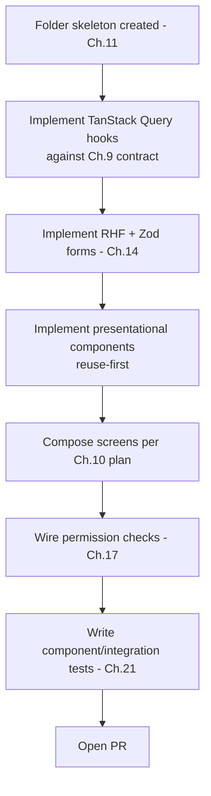

## Checklist
- [ ] All server state via TanStack Query.
- [ ] All forms via RHF + Zod.
- [ ] All tables via TanStack Table.
- [ ] Permission checks gate action rendering, not just backend calls.

## Engineering Notes
Frontend permission checks are a UX affordance, not a security boundary — the backend (Chapter 16) remains the actual authorization enforcement point. This chapter's MOD-059 exists so the UI doesn't show actions users can't actually perform, which is a usability defect, not a security one.

## Architecture Notes
Enforces `08_FRONTEND_STANDARDS.md`'s state-management discipline as a per-module rule, not just a style guideline.

## Related Documents
`08_FRONTEND_STANDARDS.md`, Chapter 9, Chapter 10, Chapter 17

## AI Assistant Guidance
An AI assistant generating frontend code must default to TanStack Query for any server data and React Hook Form + Zod for any form, and must ask before introducing a new UI pattern not already in the shared component library.

## Future Considerations
Storybook-style catalog of shared components (if adopted) would make "reuse-first" enforceable by search rather than tribal knowledge.

---

*End of Chapter 13.*

---

# Chapter 14 — Validation Rules

## Purpose
Defines when and how a module applies `05_CODING_STANDARDS.md` Ch.17 (Validation Standards) during its own build, so validation isn't reinvented per module. This chapter governs *process*; Ch.17 of the coding standards governs the *technical rule*.

## Responsibilities

| Role | Responsibility |
|---|---|
| Backend Engineer | Writes the Zod schema per endpoint, at the trust boundary |
| Frontend Engineer | Reuses/mirrors the same schema in RHF forms (Chapter 13) |
| Code Reviewer | Confirms every trust-boundary crossing is validated |

## Rule IDs, Severity, Enforcement

| Rule ID | Statement | Severity | Enforcement |
|---|---|---|---|
| MOD-060 | Every module defines its Zod schemas during Backend Development (Chapter 12), derived from the Chapter 9 API contract — not invented ad hoc mid-implementation. | High | Code Review |
| MOD-061 | DTO types are inferred from Zod schemas (`z.infer`) per `05_CODING_STANDARDS.md` Ch.16.5 — never hand-declared separately. | Critical | Code Review, CI/CD |
| MOD-062 | Frontend forms (Chapter 13) reuse the same validation intent as the backend schema — the two must never silently diverge on what's "valid." | High | Code Review |
| MOD-063 | Domain entities enforce their own invariants (Chapter 5) in plain TypeScript — Zod is a Presentation-boundary concern only, per `05_CODING_STANDARDS.md` Ch.15.3. | Critical | Code Review |

## Standards
Follow `05_CODING_STANDARDS.md` Ch.17 exactly for schema shape, error format, and boundary placement. This chapter only adds: schemas are written in the same PR as the endpoint (Chapter 12), not deferred.

## Best Practices
- Name schemas per `05_CODING_STANDARDS.md` convention (`<useCase>InputSchema`) so Chapter 23 reviewers can find them by convention alone.
- Treat a validation failure as a fail-loud, Chapter 18-routed error — never a silently-defaulted value.

## Common Mistakes

| Mistake | Consequence |
|---|---|
| Hand-declaring a DTO interface alongside a Zod schema | Violates MOD-061; the two drift silently |
| Frontend form allows a value the backend schema rejects | User sees a confusing 400 after a form appeared to "succeed" client-side |

## Decision Matrix

| Situation | Correct action |
|---|---|
| A domain invariant looks like it could be "validated" with Zod inside the Service layer | Don't — invariants are enforced by domain logic (Chapter 5), Zod stays at the Presentation boundary |
| Frontend needs a slightly different validation message wording than backend | Wording may differ; the underlying accepted/rejected set of values must not |

## Decision Tree

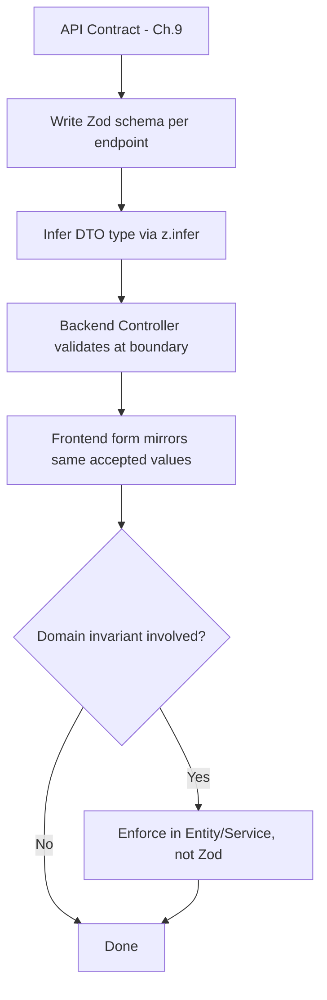

## Checklist
- [ ] Every endpoint has a Zod schema written alongside it.
- [ ] DTO types are inferred, not hand-declared.
- [ ] Frontend and backend validation intents match.
- [ ] Domain invariants are not implemented as Zod rules.

## Engineering Notes
Validation drift between frontend and backend is one of the most common sources of "works on my machine" bug reports in ERP forms — the fix is structural (share the schema's intent, not just its existence), not procedural nagging.

## Architecture Notes
This chapter is a thin process wrapper around `05_CODING_STANDARDS.md` Ch.15–17; it intentionally does not restate their technical detail.

## Related Documents
`05_CODING_STANDARDS.md` Ch.15–17, Chapter 9 (API Planning), Chapter 13 (Frontend Development)

## AI Assistant Guidance
An AI assistant must always derive DTO types from Zod schemas and must never hand-write a parallel TypeScript interface for the same shape.

## Future Considerations
Sharing schema files directly between backend and a generated frontend types package (rather than mirrored-by-convention) would make MOD-062 structurally guaranteed instead of review-enforced.

---

# Chapter 15 — Authentication

## Purpose
States how a module *consumes* the platform's authentication system — it does not define authentication itself. Authentication architecture, token lifetimes, and MFA rules are fixed platform-wide in `09_SECURITY_GUIDELINES.md` Ch.3 and `03_ARCHITECTURE.md` Ch.9; no module may reimplement or bypass them.

## Responsibilities

| Role | Responsibility |
|---|---|
| Backend Engineer | Wires standard auth middleware; never writes module-specific auth logic |
| Tech Lead | Rejects any module-level authentication code at Technical Design (Chapter 7) |

## Rule IDs, Severity, Enforcement

| Rule ID | Statement | Severity | Enforcement |
|---|---|---|---|
| MOD-064 | No module implements its own authentication check, token parsing, or session logic — all endpoints sit behind the platform's standard Passport/JWT middleware per `09_SECURITY_GUIDELINES.md` AUTHN-001–005. | Critical | Architecture Review, Code Review |
| MOD-065 | A module's Technical Design (Chapter 7) states which auth plane (Tenant End User vs. Platform Operator, per `03_ARCHITECTURE.md` Ch.9.6) its endpoints belong to — never both without explicit justification. | Critical | Architecture Review |

## Standards
See `09_SECURITY_GUIDELINES.md` Ch.3 in full — token expiry, MFA requirements, plane separation, and enumeration-safe error handling are binding and unmodifiable by any module.

## Best Practices
- If a module seems to need "special" authentication behavior, that's a signal the requirement belongs in `09_SECURITY_GUIDELINES.md` as a platform-wide change, not a module-local exception — raise it at Architecture Review.

## Common Mistakes

| Mistake | Consequence |
|---|---|
| A module writes its own token-verification middleware "for a special case" | Violates MOD-064; creates a second, likely weaker, auth surface |
| Mixing Tenant and Platform Operator endpoints under one router without stating the plane | Violates MOD-065; risks the exact cross-plane leakage AUTHN-003 exists to prevent |

## Decision Matrix

| Situation | Correct action |
|---|---|
| Module thinks it needs a different token lifetime | Raise as a platform-wide ADR against `09_SECURITY_GUIDELINES.md`, never override locally |
| Module serves both tenant users and platform operators | Split into two clearly separated route groups, each on its correct plane |

## Checklist
- [ ] No module-local auth middleware exists.
- [ ] Auth plane stated explicitly in Technical Design.
- [ ] No token lifetime or MFA rule overridden locally.

## Engineering Notes
This chapter is deliberately short — that's the point. Authentication is a platform concern with exactly one correct implementation; a module chapter that had a lot to say here would indicate the platform boundary is being violated somewhere.

## Related Documents
`09_SECURITY_GUIDELINES.md` Ch.3, `03_ARCHITECTURE.md` Ch.9

## AI Assistant Guidance
An AI assistant must never generate custom authentication logic for a module. If a prompt implies a module needs its own login/token behavior, the assistant must flag this as a platform-level (not module-level) concern.

## Future Considerations
SSO/SAML expansion (noted as pending in `09_SECURITY_GUIDELINES.md` Ch.3.9) will be a platform-level change; no module-level action is anticipated when it lands.

---

# Chapter 16 — Authorization

## Purpose
States how a module wires into the platform-wide RBAC model defined in `09_SECURITY_GUIDELINES.md` Ch.4 (AUTHZ-001–005). Authorization *design* (which roles, which permissions) is module-specific and covered in Chapter 17; this chapter covers the *mechanism* every module must use.

## Responsibilities

| Role | Responsibility |
|---|---|
| Backend Engineer | Applies the standard permission-check middleware/guard to every endpoint |
| Frontend Engineer | Applies matching permission checks to conditionally render UI (Chapter 13, MOD-059) |
| Tech Lead | Confirms no endpoint is left unchecked |

## Rule IDs, Severity, Enforcement

| Rule ID | Statement | Severity | Enforcement |
|---|---|---|---|
| MOD-066 | Every endpoint re-checks authorization at the Service/Domain layer — a Presentation-layer or frontend-only check is never sufficient, per `09_SECURITY_GUIDELINES.md` AUTHZ-003. | Critical | Architecture Review, Code Review |
| MOD-067 | Every permission a module introduces follows the `{module}.{resource}.{action}` naming convention (AUTHZ-002) and is defined in Chapter 17's permission matrix before implementation. | Critical | Architecture Review |
| MOD-068 | No module grants a permission directly to a User — only through a Role. | High | Code Review |

## Standards
Follow `09_SECURITY_GUIDELINES.md` Ch.4 in full for the RBAC model and privilege-escalation review (AUTHZ-005).

## Best Practices
- Reuse an existing permission at the right granularity before minting a new one (per AUTHZ-002's decision tree) — check Chapter 17's registry first.

## Common Mistakes

| Mistake | Consequence |
|---|---|
| Controller checks permission but Service trusts the caller implicitly | Violates AUTHZ-003/MOD-066; a second code path calling the Service bypasses authorization entirely |
| New permission created that near-duplicates an existing one | Permission sprawl; audit review (Chapter 25) becomes unreliable |

## Decision Tree

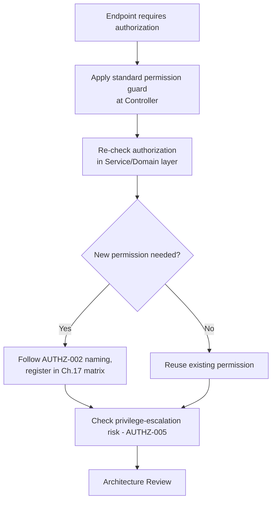

## Checklist
- [ ] Every endpoint checked at both Controller and Service layer.
- [ ] New permissions named per convention and registered in Chapter 17.
- [ ] No direct User-level permission grants.
- [ ] Privilege-escalation risk reviewed for new permissions.

## Engineering Notes
AUTHZ-003 (re-check authorization below the Controller) is, per `09_SECURITY_GUIDELINES.md` itself, the single most commonly violated authorization rule in ERP systems — treat any PR that checks permission only once as a Critical-severity Code Review finding.

## Related Documents
`09_SECURITY_GUIDELINES.md` Ch.4, Chapter 17 (Permissions)

## AI Assistant Guidance
An AI assistant generating a Service-layer method must include an authorization check there even if the Controller already checks — never assume the Controller's check is sufficient.

## Future Considerations
A shared authorization-guard utility usable identically at Controller and Service layers would make MOD-066 harder to accidentally skip.

---

# Chapter 17 — Permissions

## Purpose
Defines how a specific module designs its own permission set — which actions require which permission — building on the mechanism from Chapter 16 and the naming rule from AUTHZ-002.

## Responsibilities

| Role | Responsibility |
|---|---|
| Module Owner | Drafts the permission matrix during Chapter 6 (Functional Spec) and Chapter 9 (API Planning) |
| Tech Lead | Approves the matrix before Backend Development starts |

## Rule IDs, Severity, Enforcement

| Rule ID | Statement | Severity | Enforcement |
|---|---|---|---|
| MOD-069 | Every module ships a permission matrix (Action → Permission → Default Roles) as part of its documentation (Chapter 22), kept current as the module evolves. | High | Architecture Review, Code Review |
| MOD-070 | Read and write actions are permissioned separately — a role with view access is never implicitly granted write access. | Critical | Architecture Review |
| MOD-071 | Financially significant actions (posting, approving, voiding) have their own distinct permission, never bundled with general "edit" permissions. | Critical | Architecture Review |

## Standards
Matrix format: Action, Permission Key (`{module}.{resource}.{action}`), Default Roles, Notes (financial impact, approval-chain interaction).

## Best Practices
- Design the matrix alongside Chapter 6's flows — permission gaps are easiest to spot when walking through an actual user flow, not a table in isolation.
- Separate "view" from "export" — exporting financial data is its own risk surface even when viewing is broadly granted.

## Common Mistakes

| Mistake | Consequence |
|---|---|
| One "manage" permission covering view/edit/post/void | Impossible to grant a bookkeeper edit rights without also granting posting authority |
| Permission matrix written after implementation, to match whatever the code happened to check | Defeats the purpose; matrix should drive the code, not describe it after the fact |

## Checklist
- [ ] Every action in the functional spec has a named permission.
- [ ] Read/write separated.
- [ ] Financially significant actions have distinct permissions.
- [ ] Matrix is part of the module's committed documentation.

## Related Documents
`09_SECURITY_GUIDELINES.md` Ch.4, Chapter 6 (Functional Spec), Chapter 16 (Authorization)

## AI Assistant Guidance
An AI assistant drafting a permission matrix must default to separating view/edit/post/void/export rather than collapsing them, and must flag any financially significant action left ungated.

## Future Considerations
A generated, always-current permission matrix (derived from route decorators/guards rather than hand-maintained) would eliminate matrix/code drift entirely.

---

# Chapter 18 — Error Handling

## Purpose
States how a module applies `05_CODING_STANDARDS.md` Ch.18 (Exception Handling) so errors are handled consistently and propagate to the centralized error middleware rather than being caught and swallowed locally.

## Responsibilities

| Role | Responsibility |
|---|---|
| Backend Engineer | Throws domain-specific errors; never catches-and-swallows |
| Code Reviewer | Confirms every catch block either re-throws, translates, or is the centralized handler |

## Rule IDs, Severity, Enforcement

| Rule ID | Statement | Severity | Enforcement |
|---|---|---|---|
| MOD-072 | Errors propagate to the centralized error-handling middleware per `05_CODING_STANDARDS.md` Ch.18/Ch.9.5's route-handler contract — a Controller never catches a Service error to return a generic 200/500 itself. | Critical | Code Review |
| MOD-073 | Every thrown error carries enough structured context (entity ID, tenant ID) for Chapter 19 logging to reconstruct the failure without reproduction. | High | Code Review |
| MOD-074 | User-facing error messages never leak internal details (stack traces, SQL, file paths); only the centralized handler's sanitized response format is returned. | Critical | Code Review, Security Review |

## Standards
Follow `05_CODING_STANDARDS.md` Ch.18 exactly for error class hierarchy and propagation contract.

## Best Practices
- Model domain errors as specific, named error classes (e.g., `InsufficientFundsError`) rather than generic `Error` — this is what makes MOD-073's structured context possible.

## Common Mistakes

| Mistake | Consequence |
|---|---|
| Try/catch in a Controller that swallows the error and returns `{success: false}` | Violates MOD-072; bypasses the centralized handler's logging/status-code contract |
| Generic `Error` thrown with only a string message | Violates MOD-073; Chapter 19 logs lack reconstructable context |

## Checklist
- [ ] No Controller catches and swallows Service errors.
- [ ] Errors are specific classes, not generic `Error`.
- [ ] Thrown errors carry structured context.
- [ ] User-facing responses never leak internals.

## Related Documents
`05_CODING_STANDARDS.md` Ch.18, Chapter 19 (Logging)

## AI Assistant Guidance
An AI assistant must throw specific, named error types with structured context and must never catch an error in a Controller solely to reformat it into a success-shaped response.

## Future Considerations
A shared, growing library of domain error classes (per module, exported for reuse) would reduce near-duplicate error types across modules.

---

# Chapter 19 — Logging

## Purpose
States how a module applies `05_CODING_STANDARDS.md` Ch.19 (Pino logging) so production incidents are reconstructable from logs alone.

## Responsibilities

| Role | Responsibility |
|---|---|
| Backend Engineer | Logs structured context at every significant state transition and caught error |
| Security Reviewer | Confirms no sensitive data is logged (Chapter 25) |

## Rule IDs, Severity, Enforcement

| Rule ID | Statement | Severity | Enforcement |
|---|---|---|---|
| MOD-075 | Every log call passes a structured object, never a manually interpolated string, per `05_CODING_STANDARDS.md` Ch.19. | High | Code Review, CI/CD |
| MOD-076 | No password, token, Argon2 hash, or payment credential ever appears in a log entry — enforced via the shared Pino redaction config, not per-call-site discipline. | Critical | Code Review, Security Review |
| MOD-077 | Every significant business state transition (e.g., posting, approval, void) is logged with enough context to answer "who did what, when" without needing the audit trail (Chapter 20) as the only source. | Medium | Code Review |

## Standards
Follow `05_CODING_STANDARDS.md` Ch.19 exactly for structured-object shape and redaction configuration.

## Best Practices
- Log the error object itself (`err`), not just `.message`, so Pino's serializer captures the full stack trace.

## Common Mistakes

| Mistake | Consequence |
|---|---|
| Logging the full request body on an auth or payment endpoint | May capture a raw password or card detail; violates MOD-076 |
| String-interpolated log messages | Not queryable as structured JSON in production log tooling |

## Checklist
- [ ] All logs are structured objects.
- [ ] No sensitive fields logged, verified against the redaction config.
- [ ] Significant state transitions are logged with context.

## Related Documents
`05_CODING_STANDARDS.md` Ch.19, `09_SECURITY_GUIDELINES.md` Ch.23 (Audit Logging), Chapter 20 (Audit Trail)

## AI Assistant Guidance
An AI assistant must always use structured Pino log calls and must never include a raw request body on an authentication, payment, or credential-bearing endpoint.

## Future Considerations
None beyond what `05_CODING_STANDARDS.md` Ch.19 already anticipates (shared job-processor logging wrapper).

---

# Chapter 20 — Audit Trail

## Purpose
States how a module implements the business-level audit trail requirement defined in `00_BUSINESS_RULES.md` Ch.33 and the technical audit-logging standard in `09_SECURITY_GUIDELINES.md` Ch.23. Logging (Chapter 19) tells you what happened technically; the audit trail is the immutable business record of who did what, when, to what data.

## Responsibilities

| Role | Responsibility |
|---|---|
| Module Owner | Identifies every business-significant action requiring an audit entry, during Chapter 6 |
| Backend Engineer | Wires the standard audit-write call at every such action |
| Security Reviewer | Confirms audit entries are immutable and complete (Chapter 25) |

## Rule IDs, Severity, Enforcement

| Rule ID | Statement | Severity | Enforcement |
|---|---|---|---|
| MOD-078 | Every business-significant action identified in Chapter 6 (create/update/delete of financial or configuration data, approvals, postings, voids) writes an audit trail entry, per `00_BUSINESS_RULES.md` Ch.33 and `09_SECURITY_GUIDELINES.md` Ch.23. | Critical | Architecture Review, Security Review |
| MOD-079 | Audit entries capture who, when, what changed (prior value → new value), and are immutable once written — never updated or deleted by application code. | Critical | Code Review, Security Review |
| MOD-080 | Audit-trail writing uses the shared platform audit-write utility — no module writes its own ad hoc audit table or logic. | Critical | Architecture Review, Code Review |

## Standards
Follow `09_SECURITY_GUIDELINES.md` Ch.23 for the technical mechanism and `00_BUSINESS_RULES.md` Ch.33 for which actions qualify as business-significant.

## Best Practices
- Identify audit-worthy actions during Chapter 6 (Functional Spec), not as an afterthought during Code Review — this keeps the audit-write call part of the natural implementation flow in Chapter 12.
- Prefer capturing the full before/after diff over a vague "record was updated" entry — the diff is what makes an audit trail actually useful during an investigation.

## Common Mistakes

| Mistake | Consequence |
|---|---|
| Audit entries added reactively after a Security Review finding | Signals Chapter 6 didn't identify audit-worthy actions up front; likely means other actions were also missed |
| A module writing directly to its own "history" table instead of the shared audit utility | Violates MOD-080; creates an audit trail that other modules' tooling (reports, investigations) can't see |

## Decision Tree

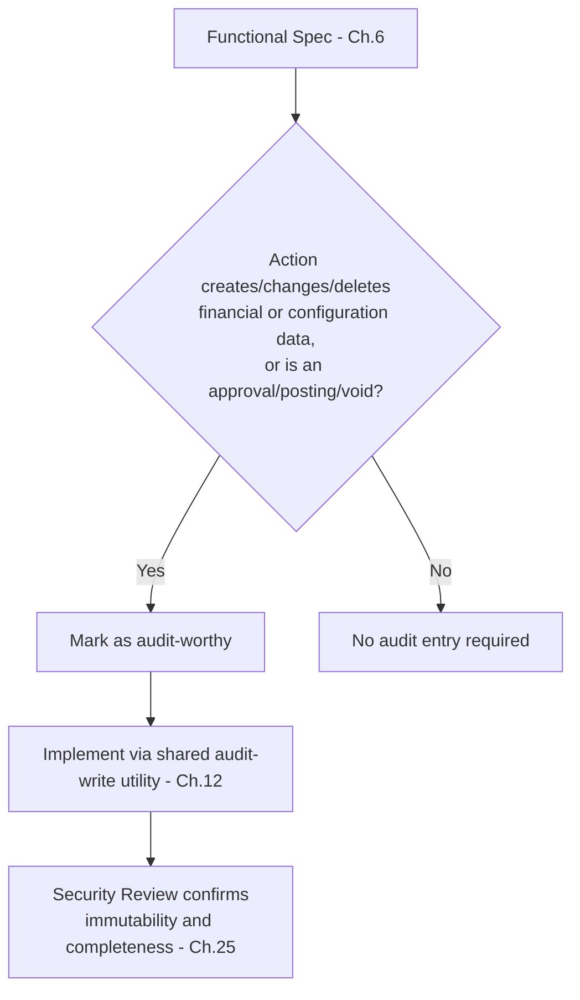

## Checklist
- [ ] Every business-significant action identified in Chapter 6 has an audit entry.
- [ ] Audit entries capture who/when/before/after.
- [ ] Audit writes use the shared utility, not module-local logic.
- [ ] Audit entries are immutable (no update/delete path exists in code).

## Engineering Notes
`00_BUSINESS_RULES.md` Ch.33 treats the audit trail as the accountability foundation for every other chapter's audit requirements — this is why MOD-078's severity is Critical rather than High: an ERP audit trail with gaps is, for compliance purposes, often worse than no audit trail, because it implies completeness it doesn't have.

## Related Documents
`00_BUSINESS_RULES.md` Ch.33, `09_SECURITY_GUIDELINES.md` Ch.23

## AI Assistant Guidance
An AI assistant implementing any create/update/delete on financial or configuration data must add an audit-write call using the shared utility by default, and must ask if uncertain whether an action qualifies as audit-worthy, rather than omitting it.

## Future Considerations
An automated check that diffs Chapter 6's flagged audit-worthy actions against actual audit-write call sites in the PR would make MOD-078 CI-checkable rather than review-dependent.

---

*End of Chapter 20.*

---

# Chapter 21 — Testing Strategy

## Purpose
Defines what tests every module must ship in the same PR as its feature (MOD-006), using Jest and Supertest per `02_TECH_STACK.md`. `17_TESTING_STRATEGY.md` is currently an empty placeholder — until it is written, this chapter is the binding testing standard for module work.

## Responsibilities

| Role | Responsibility |
|---|---|
| Backend Engineer | Writes unit tests (Service, domain invariants) and integration tests (Controller + Repository via Supertest) |
| Frontend Engineer | Writes component/integration tests for screens and hooks |
| QA | Confirms Chapter 6 acceptance criteria have corresponding tests |

## Rule IDs, Severity, Enforcement

| Rule ID | Statement | Severity | Enforcement |
|---|---|---|---|
| MOD-081 | Every Chapter 6 acceptance criterion (happy path + edge cases) has a corresponding automated test — no criterion ships untested. | Critical | QA Validation, CI/CD |
| MOD-082 | Every Chapter 5 invariant has a dedicated unit test that asserts it holds and a test that asserts violating it is rejected. | Critical | Code Review |
| MOD-083 | Integration tests exercise the real Repository against a test database — not a mocked Prisma client — for any test covering a Chapter 8 constraint. | High | Code Review |
| MOD-084 | Tests ship in the same PR as the feature (MOD-006); a PR that adds "tests to follow" is not mergeable. | Critical | Code Review, CI/CD |

## Standards
Test pyramid per module: unit tests for Service/domain logic (fast, majority of tests), integration tests for Controller→Service→Repository→DB flows (fewer, cover contract + constraints), and frontend component tests for screen states from Chapter 6.

## Best Practices
- Write the test for a Chapter 5 invariant's *violation* case first — it's the one most often skipped, and the one most valuable in an ERP system.
- Name tests after the business behavior they verify, not the function name, so a failing test is self-explanatory to a non-author.

## Common Mistakes

| Mistake | Consequence |
|---|---|
| Mocking the Repository/DB for tests that are meant to verify a DB constraint | Violates MOD-083; test passes even if the actual migration's constraint is missing |
| Testing only the happy path from Chapter 6 | Violates MOD-081; edge cases specified in Chapter 6 ship unverified |

## Decision Matrix

| Situation | Correct action |
|---|---|
| A Chapter 5 invariant is enforced by both application code and a DB constraint | Test both independently — application test with a real DB, and a DB-level test that the constraint alone rejects bad data |
| Time pressure to ship without full edge-case coverage | Escalate to Tech Lead/Engineering Manager for an explicit, logged exception — never ship silently under-tested |

## Decision Tree

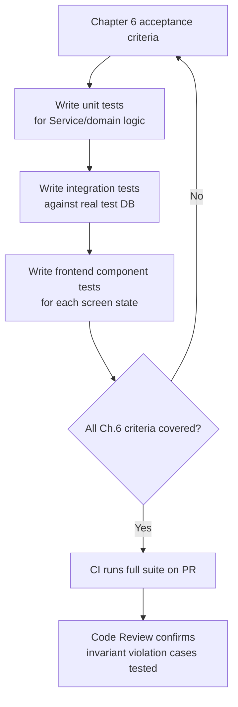

## Checklist
- [ ] Every acceptance criterion has a test.
- [ ] Every invariant has both a "holds" and "violates" test.
- [ ] Integration tests use a real test database.
- [ ] Tests are in the same PR as the feature.

## Engineering Notes
Mocked-Repository tests are the most common way a Chapter 8 constraint silently goes untested — a migration typo (wrong column, missing unique index) will pass every mocked test and only fail in production.

## Architecture Notes
Implements MOD-006 mechanically; this chapter is what "tests ship with the feature" concretely means per module.

## Related Documents
`02_TECH_STACK.md` (Jest, Supertest), Chapter 5, Chapter 6, Chapter 8

## AI Assistant Guidance
An AI assistant generating a feature must generate its tests in the same response/PR, covering both the happy path and every edge case named in the functional spec, and must use a real (test) database connection for integration tests rather than mocking the Repository.

## Future Considerations
Once `17_TESTING_STRATEGY.md` is written, this chapter should be trimmed to a pointer, matching the pattern already used for Chapters 15/16/19/20 against `09_SECURITY_GUIDELINES.md` and `05_CODING_STANDARDS.md`.

---

# Chapter 22 — Documentation Updates

## Purpose
Ensures every module's documentation — README, API docs, permission matrix, and any impacted platform-level doc — is updated in the same PR as the code, not as a follow-up task.

## Responsibilities

| Role | Responsibility |
|---|---|
| Module Owner | Updates module README and permission matrix |
| Backend Engineer | Updates Swagger/OpenAPI fragment (Chapter 9) |
| Tech Lead | Confirms no platform-level doc (`00`–`11`) needs updating as a result of this module |

## Rule IDs, Severity, Enforcement

| Rule ID | Statement | Severity | Enforcement |
|---|---|---|---|
| MOD-085 | A PR that changes module behavior updates that module's README, API docs, and permission matrix in the same PR. | High | Code Review |
| MOD-086 | If a module's implementation reveals a gap or error in `00_BUSINESS_RULES.md` through `11_GIT_WORKFLOW.md`, that platform doc is updated in the same PR or a linked follow-up PR opened immediately — not left implicit. | Critical | Architecture Review |
| MOD-087 | New business rules introduced during Chapter 4 are reflected in `00_BUSINESS_RULES.md` before the PR merges, not only in the module's local docs. | Critical | Architecture Review |

## Best Practices
- Treat documentation diffs as part of the PR's review surface, not an afterthought — a reviewer should read the doc diff alongside the code diff.

## Common Mistakes

| Mistake | Consequence |
|---|---|
| README left describing the module's state from its first version after several feature additions | New engineers onboard against a stale picture of the module |
| A discovered gap in `00_BUSINESS_RULES.md` fixed silently in code only | The next module to touch the same domain concept repeats the same wrong assumption |

## Checklist
- [ ] Module README current.
- [ ] API docs current.
- [ ] Permission matrix current.
- [ ] Any platform-doc gaps found during implementation are filed/fixed, not left implicit.

## Related Documents
All approved handbooks `00`–`11`, Chapter 11 (Folder Creation)

## AI Assistant Guidance
An AI assistant must update the module README, API doc fragment, and permission matrix as part of generating a feature PR, and must explicitly flag any place where implementation revealed a platform-doc gap.

## Future Considerations
A CI check that fails a PR touching `src/modules/<name>/` without a corresponding README diff would make MOD-085 partially self-enforcing.

---

# Chapter 23 — Code Review

## Purpose
Defines the review gate every PR passes through before merge — the point where this handbook's Critical and High rules are checked by a second engineer, not just self-certified by the author.

## Responsibilities

| Role | Responsibility |
|---|---|
| Author | Self-checks against this handbook's relevant chapters before requesting review |
| Reviewer | Verifies layering (Chapter 12–13), tests (Chapter 21), docs (Chapter 22), and security basics (Chapter 25 pre-screen) |
| Tech Lead | Final approver for any Critical-severity finding |

## Rule IDs, Severity, Enforcement

| Rule ID | Statement | Severity | Enforcement |
|---|---|---|---|
| MOD-088 | No PR merges with an open Critical-severity finding from this handbook. | Critical | Code Review |
| MOD-089 | Every PR's description links its Chapter 3–10 planning artifacts — a reviewer should never have to ask "what was this supposed to do." | Medium | Code Review |
| MOD-090 | A reviewer who is uncertain whether a Clean Architecture layering rule (MOD-002) is satisfied escalates to the Tech Lead rather than approving on ambiguity. | High | Code Review |
| MOD-091 | AI-authored code is reviewed identically to human-authored code — authorship is never noted as a reason to relax scrutiny (MOD-007). | Critical | Code Review |

## Standards
Review checklist per PR: layering (MOD-002), cross-module boundaries (MOD-005), validation (Chapter 14), auth/authz wiring (Chapters 15–17), error handling (Chapter 18), logging (Chapter 19), audit trail (Chapter 20), tests (Chapter 21), docs (Chapter 22).

## Best Practices
- Review the domain/service layer before the controller — bugs in business logic are more expensive to catch later than HTTP-shape nits.
- Leave a comment citing the specific MOD rule ID when requesting a change — it turns a review comment into a traceable, handbook-linked decision.

## Common Mistakes

| Mistake | Consequence |
|---|---|
| Rubber-stamp approval on a large PR under time pressure | Critical findings (layering, missing audit trail) ship to production |
| Treating AI-authored code as pre-vetted | Violates MOD-091; defects ship with no human who verified the logic |

## Decision Tree

```mermaid
flowchart TD
    A[PR opened] --> B[Author links Ch.3-10 artifacts]
    B --> C[Reviewer checks layering,<br/>boundaries, validation, auth]
    C --> D{Any Critical finding?}
    D -- Yes --> E[Request changes,<br/>cite MOD rule ID]
    D -- No --> F{Any High/Medium finding?}
    F -- Yes --> G[Discuss; author fixes<br/>or justifies with ADR]
    F -- No --> H[Approve]
    E --> A
    G --> H
```

## Checklist
- [ ] No open Critical finding.
- [ ] Planning artifacts linked in PR description.
- [ ] Layering, boundaries, validation, auth/authz all checked.
- [ ] Reviewed identically regardless of AI or human authorship.

## Related Documents
`11_GIT_WORKFLOW.md`, Chapters 12–20

## AI Assistant Guidance
An AI assistant acting as a reviewer (or reviewing its own prior output) must apply every chapter's Critical rules with no leniency, and must never describe AI authorship as a mitigating factor for a finding.

## Future Considerations
A PR template that auto-links Chapter 3–10 artifacts by ticket ID would make MOD-089 automatic rather than manual.

---

# Chapter 24 — Performance Review

## Purpose
Confirms a module meets the non-functional targets stated in Chapter 7 (Technical Design) before merge, catching N+1 queries, missing indexes, and unbounded payloads early.

## Responsibilities

| Role | Responsibility |
|---|---|
| Backend Engineer | Profiles Repository queries against Chapter 8's index plan |
| Tech Lead | Confirms Chapter 7's non-functional targets are met or explicitly renegotiated |

## Rule IDs, Severity, Enforcement

| Rule ID | Statement | Severity | Enforcement |
|---|---|---|---|
| MOD-092 | No Repository method causes an N+1 query pattern for a list endpoint's default page size. | High | Code Review |
| MOD-093 | Every list endpoint's query plan is checked against the Chapter 8 index plan before merge. | High | Code Review |
| MOD-094 | If Chapter 7's non-functional target can't be met, it is renegotiated explicitly (with Tech Lead + requester) rather than shipped silently under target. | Medium | Architecture Review |

## Best Practices
- Load-test list/report endpoints against realistic data volume (not empty/seed data) before merge for any module expected to handle high transaction volume.

## Common Mistakes

| Mistake | Consequence |
|---|---|
| Testing only against seed data with a handful of rows | Performance problems surface only after production data grows |
| Adding a new query filter without checking the Chapter 8 index plan | Full table scan under production volume |

## Checklist
- [ ] No N+1 patterns in list/report endpoints.
- [ ] Query plans checked against index plan.
- [ ] Non-functional targets met or explicitly renegotiated.

## Related Documents
Chapter 7 (Technical Design), Chapter 8 (Database Planning)

## AI Assistant Guidance
An AI assistant implementing a list endpoint must default to eager-loading/batching strategies that avoid N+1 patterns and must flag any query it cannot confirm is covered by an existing index.

## Future Considerations
Automated query-plan capture in CI (via `EXPLAIN`) for endpoints touching large tables would make MOD-093 mechanically checkable.

---

# Chapter 25 — Security Review

## Purpose
Confirms a module passes the platform-wide security bar defined across `09_SECURITY_GUIDELINES.md`, using its Ch.35 Security Review Checklist as the binding gate. This chapter defines *when* that gate applies in the module lifecycle, not the checklist content itself.

## Responsibilities

| Role | Responsibility |
|---|---|
| Security Reviewer | Runs `09_SECURITY_GUIDELINES.md` Ch.35 checklist against the module |
| Module Owner | Remediates findings before merge |
| Tech Lead | Confirms no Critical/High finding ships unresolved |

## Rule IDs, Severity, Enforcement

| Rule ID | Statement | Severity | Enforcement |
|---|---|---|---|
| MOD-095 | Every module passes `09_SECURITY_GUIDELINES.md` Ch.35's checklist before merge — not before deployment, before merge. | Critical | Security Review |
| MOD-096 | Any module touching payment data, PII, or financial reporting gets an additional Domain SME + Security Reviewer joint pass, per `09_SECURITY_GUIDELINES.md` Ch.24–25. | Critical | Security Review |
| MOD-097 | A Security Review finding is never downgraded in severity to "ship now, fix later" without Engineering Manager sign-off logged as an ADR. | Critical | Architecture Review |

## Standards
Run the full `09_SECURITY_GUIDELINES.md` Ch.35 checklist; this chapter adds no new technical criteria, only the process placement (pre-merge, not pre-deployment) and the escalation path for exceptions.

## Best Practices
- Run Security Review in parallel with Code Review (Chapter 23) for small modules, and as a dedicated pass for anything touching MOD-096's categories.

## Common Mistakes

| Mistake | Consequence |
|---|---|
| Security Review scheduled after merge "to not block the release" | Defeats the purpose; fixes now require a second PR against already-shipped code |
| Downgrading a finding informally in a Slack thread | Violates MOD-097; no durable record of why an exception was accepted |

## Checklist
- [ ] `09_SECURITY_GUIDELINES.md` Ch.35 checklist run and passed.
- [ ] Payment/PII/financial-reporting modules got joint SME + Security review.
- [ ] No finding downgraded without a logged ADR.

## Related Documents
`09_SECURITY_GUIDELINES.md` Ch.23–25, Ch.35

## AI Assistant Guidance
An AI assistant must treat every Security Review finding it helps investigate as blocking by default, and must never suggest deferring a Critical/High finding without explicitly naming that as an exception requiring Engineering Manager sign-off.

## Future Considerations
None beyond what `09_SECURITY_GUIDELINES.md` Ch.35–36 already anticipates.

---

# Chapter 26 — Deployment Checklist

## Purpose
Defines the pre-deployment gate for a module that has passed Code Review, Performance Review, and Security Review — the last checkpoint before production traffic per `10_DEPLOYMENT_ARCHITECTURE.md`.

## Responsibilities

| Role | Responsibility |
|---|---|
| Module Owner | Confirms migration plan and rollback path |
| DevOps/Tech Lead | Confirms ECS/RDS deployment readiness |

## Rule IDs, Severity, Enforcement

| Rule ID | Statement | Severity | Enforcement |
|---|---|---|---|
| MOD-098 | Every deployment has a stated rollback path before it starts — for both code (previous ECS task definition) and schema (per Chapter 8/30's additive-first migration rule). | Critical | Architecture Review |
| MOD-099 | Destructive migrations (MOD-039) deploy only behind an explicit, reviewed rollout plan, never bundled silently with a routine feature deploy. | Critical | Architecture Review |
| MOD-100 | CI/CD (GitHub Actions, per `10_DEPLOYMENT_ARCHITECTURE.md`) must pass fully — build, lint, tests — before deployment; no manual override without Engineering Manager sign-off. | Critical | CI/CD |

## Standards
Deployment checklist: migration applied and reversible, feature flag (if used) defaulted off, monitoring/alerting exists for new endpoints, rollback path documented, CI green.

## Best Practices
- Deploy schema migrations ahead of application code that depends on them where the platform's deployment model allows it, reducing the window where old code meets new schema or vice versa.

## Common Mistakes

| Mistake | Consequence |
|---|---|
| Deploying a destructive migration bundled with a feature release | No isolated rollback path if the feature has a defect unrelated to the migration |
| Skipping CI on a "hotfix" without Engineering Manager sign-off | Violates MOD-100; the fastest path to an unreviewed regression |

## Checklist
- [ ] Rollback path stated for code and schema.
- [ ] Destructive migrations have a separate, reviewed rollout plan.
- [ ] CI is fully green.
- [ ] Monitoring/alerting exists for new endpoints.

## Related Documents
`10_DEPLOYMENT_ARCHITECTURE.md`, `11_GIT_WORKFLOW.md`, Chapter 30 (Module Versioning)

## AI Assistant Guidance
An AI assistant must never suggest bypassing CI or skipping a stated rollback path to expedite a deployment, even under explicit time pressure.

## Future Considerations
As `10_DEPLOYMENT_ARCHITECTURE.md` is currently a stub, this chapter should be expanded once that document defines concrete ECS deployment strategy (blue/green vs. rolling) in detail.

---

# Chapter 27 — Post Deployment Validation

## Purpose
Confirms a deployed module behaves correctly in production — the final gate implied by MOD-009 ("done means validated in production," Chapter 1).

## Responsibilities

| Role | Responsibility |
|---|---|
| QA | Runs smoke tests against production for the deployed module |
| Module Owner | Monitors logs/metrics for the first defined observation window |
| On-call/Tech Lead | Owns rollback decision if validation fails |

## Rule IDs, Severity, Enforcement

| Rule ID | Statement | Severity | Enforcement |
|---|---|---|---|
| MOD-101 | Every deployment has a defined post-deploy smoke test, run against production, before the module is marked Done. | Critical | QA Validation |
| MOD-102 | Logs and audit trail entries (Chapters 19–20) are checked for the expected shape immediately after deployment — not just endpoint status codes. | High | QA Validation |
| MOD-103 | A module is not marked Done (MOD-009) until Post-Deployment Validation passes; a merged, deployed PR with no completed validation remains "in progress." | Critical | QA Validation, Architecture Review |

## Standards
Smoke test covers: each new/changed endpoint returns expected status codes, a representative business flow from Chapter 6 completes end-to-end, audit trail entries appear as expected, no error-rate spike in the observation window.

## Best Practices
- Define the observation window length (e.g., 24–48 hours for a financially significant module) explicitly in the deployment ticket, not left implicit.

## Common Mistakes

| Mistake | Consequence |
|---|---|
| Marking a ticket Done at merge time instead of after validation | Violates MOD-009/MOD-103; production defects go untracked back to an "open" module |
| Only checking HTTP status codes, not actual business outcome or audit trail | A 200 response with wrong data or missing audit entry passes unnoticed |

## Decision Tree

```mermaid
flowchart TD
    A[Deployment complete] --> B[Run smoke test against<br/>Ch.6 representative flow]
    B --> C[Check logs and audit entries]
    C --> D{All expected?}
    D -- No --> E[Trigger rollback per Ch.26 plan]
    D -- Yes --> F[Mark module Done - Ch.36]
```

## Checklist
- [ ] Smoke test run against production.
- [ ] Logs and audit entries verified.
- [ ] Observation window defined and completed.
- [ ] Module marked Done only after this passes.

## Related Documents
Chapter 26 (Deployment Checklist), Chapter 36 (Definition of Done)

## AI Assistant Guidance
An AI assistant must never report a module as "complete" or "done" solely because code merged or a deployment succeeded — completion requires Post-Deployment Validation per MOD-103.

## Future Considerations
Automated smoke-test suites triggered on deployment (rather than manual QA execution) would tighten the feedback loop for MOD-101.

---

*End of Chapter 27.*

---

# Chapter 28 — Bug Fix Workflow

## Purpose
Defines a lighter-weight but not lower-rigor path for defects in existing modules — distinct from new-module lifecycle (Chapter 2), but still passing through Testing, Review, and Validation gates.

## Responsibilities

| Role | Responsibility |
|---|---|
| Reporting Engineer/Support | Files the defect with reproduction steps |
| Assigned Engineer | Root-causes before patching |
| Tech Lead | Confirms root cause, not just symptom, is addressed |

## Rule IDs, Severity, Enforcement

| Rule ID | Statement | Severity | Enforcement |
|---|---|---|---|
| MOD-104 | Every bug fix identifies root cause before a patch is written — a fix that only suppresses a symptom is rejected at Code Review. | Critical | Code Review |
| MOD-105 | Every bug fix adds a regression test reproducing the original defect, per Chapter 21. | Critical | Code Review, CI/CD |
| MOD-106 | If a bug traces to a wrong or missing business rule (Chapter 4), `00_BUSINESS_RULES.md` is corrected in the same PR. | Critical | Architecture Review |
| MOD-107 | A hotfix (per `11_GIT_WORKFLOW.md` `hotfix/*` branch) still passes Code Review and CI — urgency compresses time, not review (MOD-010). | Critical | Code Review, CI/CD |

## Standards
Bug ticket format: Reproduction steps, expected vs. actual behavior, root cause, affected modules, fix approach, regression test plan.

## Best Practices
- Ask "why did our tests not catch this" before closing the ticket — the answer usually points to a Chapter 21 gap worth fixing generally, not just for this one case.
- Check whether the same defect pattern exists in sibling modules before considering the fix complete.

## Common Mistakes

| Mistake | Consequence |
|---|---|
| Patching the symptom (e.g., adding a null check) without understanding why the null arose | Same class of defect resurfaces elsewhere |
| Skipping the regression test because "the fix is obviously correct" | Defect silently reintroduced by a future unrelated change |

## Decision Tree

```mermaid
flowchart TD
    A[Defect reported] --> B[Reproduce and root-cause]
    B --> C{Root cause is a wrong/missing<br/>business rule?}
    C -- Yes --> D[Update 00_BUSINESS_RULES.md<br/>in same PR - MOD-106]
    C -- No --> E[Continue]
    D --> E
    E --> F[Write regression test<br/>reproducing original defect]
    F --> G[Patch root cause]
    G --> H[Code Review + CI<br/>even for hotfix - MOD-107]
    H --> I[Deploy per Ch.26-27]
```

## Checklist
- [ ] Root cause identified and documented.
- [ ] Regression test added.
- [ ] `00_BUSINESS_RULES.md` corrected if applicable.
- [ ] Hotfix still passed Code Review and CI.

## Related Documents
`11_GIT_WORKFLOW.md` (`hotfix/*`), Chapter 21 (Testing Strategy)

## AI Assistant Guidance
An AI assistant fixing a bug must state the root cause explicitly before proposing a patch, and must always include a regression test — never present a fix as complete without one.

## Future Considerations
A recurring-defect-pattern log (tagging bug fixes by root-cause category) would help identify which chapters of this handbook need strengthening over time.

---

# Chapter 29 — Refactoring Guidelines

## Purpose
Defines when and how existing module code may be restructured without changing behavior, and formalizes the ADR requirement (MOD-008) referenced since Chapter 1.

## Responsibilities

| Role | Responsibility |
|---|---|
| Engineer | Proposes refactor with a stated motivation |
| Tech Lead | Approves scope; ensures behavior-preservation is testable |

## Rule IDs, Severity, Enforcement

| Rule ID | Statement | Severity | Enforcement |
|---|---|---|---|
| MOD-108 | A refactor ships with the existing test suite passing unmodified in behavior-assertions (only structural/mock updates allowed) — a refactor that requires rewriting behavioral assertions is not "just a refactor." | Critical | Code Review |
| MOD-109 | Any refactor that changes a module's public interface (Chapter 9 API or MOD-005 cross-module interface) requires an ADR and consumer sign-off. | Critical | Architecture Review |
| MOD-110 | Refactors and feature work are separate PRs — a PR is never "refactor + new feature" combined. | High | Code Review |

## Standards
**ADR template:** Context, Decision, Alternatives Considered, Consequences, Rule(s) Deviated From (if any). Stored alongside the module's documentation (Chapter 22).

## Best Practices
- Refactor with a failing-then-passing test for any behavior you're not sure is preserved — don't rely on manual inspection alone for ERP business logic.

## Common Mistakes

| Mistake | Consequence |
|---|---|
| Refactor PR quietly includes a new feature "since I was already in there" | Violates MOD-110; review can't isolate risk of either change |
| Renaming/reshaping a published cross-module interface without notifying consumers | Breaks other modules silently; violates MOD-005 and MOD-109 |

## Checklist
- [ ] Existing tests pass with behavior-assertions unchanged.
- [ ] Public interface changes have an ADR + consumer sign-off.
- [ ] Refactor is its own PR, not bundled with a feature.

## Related Documents
Chapter 1 (MOD-008), Chapter 9 (API Planning), Chapter 31 (Module Dependencies)

## AI Assistant Guidance
An AI assistant asked to refactor must not alter observable behavior, must flag if a proposed refactor touches a public interface, and must never combine refactor and feature work in one generated change.

## Future Considerations
An ADR index (searchable by module) would make MOD-109's "check for prior deviations" step faster than grepping module folders.

---

# Chapter 30 — Module Versioning

## Purpose
Defines how a module's API surface and schema evolve over time without breaking consumers — internal (other modules) or external (frontend, integrations).

## Responsibilities

| Role | Responsibility |
|---|---|
| Backend Lead | Ensures additive-first evolution of schema and API |
| Tech Lead | Approves any breaking change and its migration path |

## Rule IDs, Severity, Enforcement

| Rule ID | Statement | Severity | Enforcement |
|---|---|---|---|
| MOD-111 | Schema and API changes are additive by default (new nullable column, new optional field, new endpoint) — breaking changes are the exception, not the norm. | Critical | Architecture Review |
| MOD-112 | A breaking API change requires a new `/api/v1` → `/api/v2`-style version or an explicit deprecation window with both shapes supported simultaneously. | Critical | Architecture Review |
| MOD-113 | A breaking schema change (column removal/type change) requires a documented multi-step migration (expand → migrate data → contract) never a single destructive step. | Critical | Architecture Review |

## Standards
Deprecation process: announce → dual-support window → consumer migration confirmed → old path removed. Minimum window length set per consumer impact (internal module vs. external integration).

## Best Practices
- Default to additive changes until an ADR justifies otherwise — most "necessary" breaking changes turn out to have an additive alternative on inspection.

## Common Mistakes

| Mistake | Consequence |
|---|---|
| Renaming a response field in place without versioning | Breaks any consumer (internal module, frontend, integration) synchronously with deploy |
| Single-step destructive column migration | No rollback path if a consumer wasn't actually migrated yet |

## Checklist
- [ ] Change is additive, or has an approved breaking-change plan.
- [ ] Deprecation window defined for any breaking API change.
- [ ] Schema breaking changes use expand/migrate/contract.

## Related Documents
Chapter 8 (Database Planning), Chapter 9 (API Planning), `07_REST_API_STANDARDS.md`

## AI Assistant Guidance
An AI assistant must default to additive schema/API changes and must explicitly flag any proposed change that would break an existing consumer, proposing a versioning/deprecation path instead of a silent breaking change.

## Future Considerations
Contract testing between consumer and producer modules would make MOD-112 violations fail CI automatically instead of surfacing in production.

---

# Chapter 31 — Module Dependencies

## Purpose
Governs how modules declare and consume each other through published interfaces (MOD-005), preventing the modular monolith from silently becoming a tangle of direct imports.

## Responsibilities

| Role | Responsibility |
|---|---|
| Module Owner | Declares dependencies explicitly in Technical Design (Chapter 7) |
| Architecture Reviewer | Confirms no undeclared or circular dependency exists |

## Rule IDs, Severity, Enforcement

| Rule ID | Statement | Severity | Enforcement |
|---|---|---|---|
| MOD-114 | Every module's dependencies on other modules are declared in its README (Chapter 22) and Technical Design (Chapter 7). | High | Architecture Review |
| MOD-115 | Circular dependencies between modules are not permitted — if Module A needs Module B and vice versa, the shared concept is extracted or the boundary is redrawn. | Critical | Architecture Review, CI/CD (import-graph lint) |
| MOD-116 | A module depends on another module's published interface only (MOD-005) — never on its internal types, repository, or database tables directly. | Critical | Code Review, CI/CD |

## Best Practices
- Keep a dependency direction that mirrors business layering where possible (e.g., Payroll depends on Employee, not the reverse) — it keeps the dependency graph readable as a hierarchy rather than a mesh.

## Common Mistakes

| Mistake | Consequence |
|---|---|
| Two modules importing each other's services directly | Circular dependency; violates MOD-115, breaks independent testability |
| A dependency used in code but never declared in the README | Next engineer removing/refactoring the "unused-looking" dependency breaks the dependent module unexpectedly |

## Decision Tree

```mermaid
flowchart TD
    A[Module needs data/behavior<br/>from another module] --> B{Does that module<br/>expose a published interface?}
    B -- Yes --> C[Depend on the interface;<br/>declare in README + Ch.7]
    B -- No --> D[Request the owning module<br/>add one - MOD-005]
    C --> E{Would this create<br/>a circular dependency?}
    E -- Yes --> F[Redraw boundary or<br/>extract shared concept]
    E -- No --> G[Proceed]
```

## Checklist
- [ ] All dependencies declared in README and Technical Design.
- [ ] No circular dependencies.
- [ ] No direct internal-type/repository imports across modules.

## Related Documents
Chapter 1 (MOD-005), Chapter 7 (Technical Design), Chapter 22 (Documentation)

## AI Assistant Guidance
An AI assistant must check whether a needed cross-module capability already has a published interface before importing anything directly from another module's internals, and must refuse to create a circular dependency.

## Future Considerations
An automated module dependency graph (generated from import-boundary lint data) would make circular-dependency detection continuous rather than review-time-only.

---

# Chapter 32 — Reusable Components

## Purpose
Governs when a piece of frontend or backend logic becomes a shared component/utility rather than a module-local one, keeping the "reuse-first" best practice from Chapters 10 and 13 concrete.

## Responsibilities

| Role | Responsibility |
|---|---|
| Engineer | Checks shared library before building module-local |
| Tech Lead | Approves promotion of module-local code to shared |

## Rule IDs, Severity, Enforcement

| Rule ID | Statement | Severity | Enforcement |
|---|---|---|---|
| MOD-117 | Before building a new UI pattern or backend utility, an engineer checks the existing shared library (`08_FRONTEND_STANDARDS.md` components, `05_CODING_STANDARDS.md` `common/utils/`) for an existing fit. | Medium | Code Review |
| MOD-118 | A pattern used identically in two or more modules is promoted to the shared library rather than duplicated a third time. | Medium | Code Review |
| MOD-119 | Shared components/utilities carry their own tests and documentation — promotion to "shared" raises its quality bar, it doesn't lower module-local scrutiny. | High | Code Review |

## Best Practices
- Promote on the third occurrence, not the first — two similar-looking implementations may still be coincidentally similar rather than truly the same concept; a third instance is a stronger signal.

## Common Mistakes

| Mistake | Consequence |
|---|---|
| Promoting to "shared" after only one use, speculatively | Premature abstraction; shape is guessed rather than proven by real second/third usage |
| Never promoting despite three+ near-identical implementations | Bug fixes and improvements have to be applied N times instead of once |

## Checklist
- [ ] Existing shared library checked before building new.
- [ ] Third occurrence of a pattern triggers promotion.
- [ ] Promoted components have their own tests/docs.

## Related Documents
`08_FRONTEND_STANDARDS.md`, `05_CODING_STANDARDS.md` (`common/utils/`), Chapter 10, Chapter 13

## AI Assistant Guidance
An AI assistant must search the shared library first before generating a new component or utility, and should flag (not silently create) a third near-duplicate implementation as a promotion candidate.

## Future Considerations
A searchable, tagged component/utility catalog would make MOD-117's "check first" step a lookup instead of tribal knowledge.

---

# Chapter 33 — Engineering Checklist

## Purpose
A single consolidated checklist spanning the entire module lifecycle (Chapters 2–32) — the reference an engineer opens once, at the start, and re-checks at each gate.

## Master Checklist

**Analysis (Chapters 3–5)**
- [ ] Requirement brief written, testable success criteria, requester sign-off.
- [ ] Every business behavior mapped to a rule ID in `00_BUSINESS_RULES.md`.
- [ ] Domain model (entities, aggregates, invariants) documented in business language.

**Design (Chapters 6–10)**
- [ ] Functional spec covers happy path + edge cases + permissions.
- [ ] Technical design maps aggregates to Clean Architecture layers; cross-module deps named.
- [ ] Schema plan maps to aggregates; invariants mapped to constraints.
- [ ] API contract documented per endpoint with permissions and pagination.
- [ ] Frontend plan reuses shared components; server state via TanStack Query.

**Build (Chapters 11–20)**
- [ ] Folder skeleton matches required file set and `04_FOLDER_STRUCTURE.md`.
- [ ] Backend built bottom-up; no business logic outside Service layer.
- [ ] Frontend built with TanStack Query/Table + RHF/Zod; permission-gated UI.
- [ ] Validation schemas derived DTOs; no hand-declared duplicate types.
- [ ] Auth/authz use platform middleware; re-checked at Service layer.
- [ ] Permission matrix complete and current.
- [ ] Errors propagate to centralized handler with structured context.
- [ ] Logs are structured, redacted of sensitive fields.
- [ ] Audit trail entries written via shared utility for every business-significant action.

**Verify & Ship (Chapters 21–27)**
- [ ] Tests cover every acceptance criterion and invariant (both directions).
- [ ] Documentation (README, API docs, permission matrix) updated in-PR.
- [ ] Code Review passed with no open Critical finding.
- [ ] Performance reviewed against non-functional targets.
- [ ] Security Review checklist (`09_SECURITY_GUIDELINES.md` Ch.35) passed.
- [ ] Deployment checklist complete: rollback path, CI green.
- [ ] Post-Deployment Validation passed before marking Done.

**Ongoing (Chapters 28–32)**
- [ ] Bug fixes root-caused with regression tests.
- [ ] Refactors isolated from feature work, with ADRs for interface changes.
- [ ] Schema/API changes additive-first; breaking changes versioned.
- [ ] Dependencies declared; no circular or internal-type imports.
- [ ] Shared-library checked before building module-local patterns.

## AI Assistant Guidance
An AI assistant supporting module work should be able to answer, at any point, "which of these boxes are checked and which are open" for the module in question, and should proactively flag unchecked Critical-severity items rather than waiting to be asked.

## Related Documents
Every chapter of this handbook.

---

*End of Chapter 33.*

---

# Chapter 34 — AI Assistant Workflow

## Purpose
Defines exactly where and how AI tools (Claude, ChatGPT, GitHub Copilot, Cursor, and similar) participate across the module lifecycle. AI is a participant at every stage, not a shortcut around any of them (MOD-007) — this chapter is the concrete map of what "participate correctly" means stage by stage.

## Responsibilities

| Role | Responsibility |
|---|---|
| Engineer using an AI tool | Reviews and owns every AI-generated artifact as if self-authored; never merges without understanding it |
| AI Assistant | Produces draft artifacts, flags gaps/ambiguities, never self-certifies a gate |
| Tech Lead / Reviewer | Applies identical scrutiny to AI- and human-authored work (MOD-007, MOD-091) |

## Rule IDs

| Rule ID | Statement |
|---|---|
| MOD-120 | An AI assistant may draft the exit artifact for any lifecycle stage (Chapters 3–10) but must label it a draft pending human review; it never advances a ticket's lifecycle state itself (consistent with Chapter 2). |
| MOD-121 | An AI assistant must validate its own output against the specific chapter it was asked to help with before presenting it — e.g., checking a generated schema plan against Chapter 8's rules — and state explicitly if it could not fully validate. |
| MOD-122 | An AI assistant must never silently skip a Critical-severity rule to satisfy a prompt that implies skipping it; it must surface the conflict instead. |
| MOD-123 | An AI assistant must never present AI authorship as pre-approved by Architecture Review, Code Review, or Security Review — those remain human gates. |
| MOD-124 | A human engineer remains accountable for every AI-generated artifact merged into the codebase or documentation — "the AI wrote it" is never a defense at Code Review (MOD-007) or in a post-incident review. |

## Severity

| Rule ID | Severity |
|---|---|
| MOD-120 | High |
| MOD-121 | Critical |
| MOD-122 | Critical |
| MOD-123 | Critical |
| MOD-124 | Critical |

## Enforcement

| Rule ID | Enforced at |
|---|---|
| MOD-120 | Architecture Review |
| MOD-121 | Code Review |
| MOD-122 | Code Review, Architecture Review |
| MOD-123 | Code Review, Security Review |
| MOD-124 | Code Review, Engineering Manager |

## Standards — AI Validation Responsibilities by Lifecycle Stage

| Stage | AI Assistant Must Validate Against |
|---|---|
| Requirement Analysis (Ch.3) | Testable success criteria (MOD-017); flag adjective-only criteria |
| Business Rule Analysis (Ch.4) | Existing `00_BUSINESS_RULES.md` rule IDs (MOD-020); never invent a plausible-sounding rule |
| Domain Analysis (Ch.5) | Business-language naming (MOD-024); invariants traced to rule IDs (MOD-025) |
| Functional Spec (Ch.6) | Edge cases and permission-gating stated (MOD-028, MOD-030) |
| Technical Design (Ch.7) | Clean Architecture layer mapping (MOD-032); cross-module deps flagged (MOD-033) |
| Database Planning (Ch.8) | Aggregate-to-table traceability (MOD-036); invariant-to-constraint mapping (MOD-037) |
| API Planning (Ch.9) | Full contract incl. errors and permissions (MOD-040, MOD-042); pagination on list endpoints (MOD-043) |
| Frontend Planning (Ch.10) | Shared component reuse-first (MOD-044); TanStack Query for server state (MOD-045) |
| Folder Creation (Ch.11) | Complete required file set (MOD-048); correct location (MOD-049) |
| Backend Dev (Ch.12) | Layer order and boundaries (MOD-052–055) |
| Frontend Dev (Ch.13) | TanStack Query/Table, RHF+Zod, permission-gated rendering (MOD-056–059) |
| Validation (Ch.14) | Zod-derived DTOs (MOD-061); Presentation-boundary-only Zod usage (MOD-063) |
| Auth/Authz (Ch.15–17) | No custom auth logic (MOD-064); Service-layer re-check (MOD-066) |
| Error Handling (Ch.18) | Centralized propagation (MOD-072); structured context (MOD-073) |
| Logging (Ch.19) | Structured, redacted logs (MOD-075, MOD-076) |
| Audit Trail (Ch.20) | Shared audit-write utility for every business-significant action (MOD-078, MOD-080) |
| Testing (Ch.21) | Every acceptance criterion and invariant covered, both directions (MOD-081, MOD-082) |
| Documentation (Ch.22) | README/API docs/permission matrix updated in the same change (MOD-085) |
| Code/Security Review (Ch.23, 25) | Never self-certifies; flags every Critical finding it can detect (MOD-088, MOD-095) |

## Best Practices
- Give an AI assistant the specific chapter and rule IDs relevant to the task rather than a bare feature request — it produces sharper, more checkable output.
- Ask the assistant to explicitly list which MOD rules it validated against and which it could not verify (e.g., "I could not confirm this satisfies MOD-093's index-plan check — please verify against `06_DATABASE_STANDARDS.md`").
- Treat an AI-generated PR exactly like a junior engineer's PR: full Chapter 23 review, no shortcuts.

## Common Mistakes

| Mistake | Consequence |
|---|---|
| Prompting "just build the endpoint" with no chapter context | AI produces plausible code that skips validation/audit/permission wiring |
| Accepting AI output because it compiles and passes a quick manual check | Misses Critical rules (layering, audit trail, authz re-check) that don't fail at compile time |
| Reviewer relaxing scrutiny because "an AI probably followed the rules" | Violates MOD-091/MOD-124; defects ship with no accountable verification |

## Decision Matrix

| Situation | Correct action |
|---|---|
| AI-generated code conflicts with a Critical rule to satisfy a fast turnaround request | Reject the shortcut; ask the assistant to redo within constraints (MOD-122) |
| Uncertain whether AI output satisfies a specific chapter's rule | Treat as unverified; have a human check explicitly, don't assume compliance |
| AI assistant flags that it could not validate a claim | Escalate to the relevant human reviewer before merging, not after |

## Decision Tree

```mermaid
flowchart TD
    A[AI assistant asked to help<br/>with a module task] --> B[Identify current lifecycle stage - Ch.2]
    B --> C[AI drafts artifact for that stage]
    C --> D[AI self-validates against<br/>that stage's MOD rules]
    D --> E{AI confident<br/>in full compliance?}
    E -- No --> F[AI states what it could not verify]
    E -- Yes --> G[Presents as draft,<br/>pending human review]
    F --> G
    G --> H[Human reviewer applies<br/>full Ch.23/25 scrutiny]
    H --> I{Any Critical finding?}
    I -- Yes --> C
    I -- No --> J[Proceed to next stage]
```

## Tables

**AI Participation Boundaries**

| AI May | AI May Never |
|---|---|
| Draft requirement briefs, domain models, technical designs, code, tests, docs | Advance a lifecycle stage or mark a gate as passed |
| Flag ambiguity, missing rules, or unverifiable claims | Invent a business rule to fill a gap |
| Point out where a prompt conflicts with a Critical rule | Silently comply with a request to skip a Critical rule |
| Be reviewed exactly like a human's PR | Be treated as pre-approved because it's AI-authored |

## Checklists

**Before accepting any AI-generated artifact:**
- [ ] Artifact is explicitly labeled draft/pending review.
- [ ] AI stated what it validated and what it could not.
- [ ] No Critical-severity rule was silently skipped to satisfy the prompt.
- [ ] A human reviewer applied full Chapter 23 (and 25, if applicable) scrutiny.
- [ ] A named human is accountable for the merged result.

## Engineering Notes
The realistic failure mode with AI-assisted ERP development isn't "the AI writes obviously wrong code" — it's "the AI writes plausible code that quietly omits the audit trail entry, the Service-layer authz re-check, or the edge-case test," because those omissions compile clean and look complete at a glance. This chapter exists because that failure mode is structural, not a matter of the AI "getting better" — it requires the human review discipline in Chapter 23 to stay full-strength regardless of authorship.

## Architecture Notes
This chapter operationalizes MOD-007 (Chapter 1) across every subsequent chapter's rule set, rather than introducing new technical rules of its own.

## Related Documents
Every chapter of this handbook; MOD-007, MOD-091.

## Related ADR
None yet.

## AI Assistant Guidance
This entire chapter is AI Assistant Guidance. Its single compressed form: identify the stage, draft within that stage's rules, self-validate against them explicitly, flag what you can't verify, never advance a gate yourself, and never treat your own output as pre-reviewed.

## Future Considerations
As AI tooling gains the ability to run CI/tests/lints itself before presenting output, some of Chapter 23's mechanical checks (layering lint, import-boundary lint) could shift left into the AI's own drafting loop — the human gate for judgment-based findings (business rule correctness, privilege-escalation risk) remains regardless.

---

# Chapter 35 — Definition of Ready

## Purpose
States the precise, checkable bar a module must clear before Backend/Frontend Development (Chapters 12–13) may begin — the mechanical form of MOD-004 and MOD-012.

## Responsibilities

| Role | Responsibility |
|---|---|
| Tech Lead | Certifies Definition of Ready at the Architecture Review gate |
| Module Owner | Ensures every item below has a linked artifact, not a verbal confirmation |

## Rule IDs, Severity, Enforcement

| Rule ID | Statement | Severity | Enforcement |
|---|---|---|---|
| MOD-125 | Development (Chapters 12–13) does not start until every Definition of Ready item below is checked and linked in the tracking ticket. | Critical | Architecture Review |
| MOD-126 | Definition of Ready is certified by the Tech Lead, not self-certified by the module owner alone. | High | Architecture Review |

## Definition of Ready Checklist
- [ ] Requirement brief approved with testable success criteria (Ch.3).
- [ ] Business rules mapped to `00_BUSINESS_RULES.md` rule IDs, SME sign-off if financial (Ch.4).
- [ ] Domain model with invariants traced to rule IDs (Ch.5).
- [ ] Functional spec with happy path, edge cases, and permission gating (Ch.6).
- [ ] Technical design with layer mapping and cross-module dependencies named (Ch.7).
- [ ] Database plan with constraints mapped to invariants (Ch.8).
- [ ] API contract with permissions and pagination defined (Ch.9).
- [ ] Frontend plan with reuse-first component decisions (Ch.10).
- [ ] Folder skeleton created and matches the required file set (Ch.11).
- [ ] All of the above certified by Tech Lead, not just drafted.

## Common Mistakes

| Mistake | Consequence |
|---|---|
| Starting development because "the design is basically done" | "Basically done" artifacts are exactly where Chapter 23 findings concentrate |
| Tech Lead certifying Ready based on a verbal update rather than the linked artifacts | Violates MOD-126; no durable record of what was actually reviewed |

## Related Documents
Chapters 2–11

## AI Assistant Guidance
An AI assistant asked to start writing code for a module should first check whether Definition of Ready is certified; if not, it should help complete the missing upstream artifact rather than proceeding to code.

---

# Chapter 36 — Definition of Done

## Purpose
States the precise, checkable bar a module must clear to be marked Done — the mechanical form of MOD-009 (done means validated in production, not merely deployed).

## Responsibilities

| Role | Responsibility |
|---|---|
| QA | Certifies Post-Deployment Validation passed |
| Tech Lead | Certifies Definition of Done at the final gate |
| Engineering Manager | Final sign-off for modules with outstanding logged exceptions (ADRs) |

## Rule IDs, Severity, Enforcement

| Rule ID | Statement | Severity | Enforcement |
|---|---|---|---|
| MOD-127 | A module is marked Done only after every Definition of Done item below is checked — merge and deployment alone are insufficient (MOD-009, MOD-103). | Critical | QA Validation, Architecture Review |
| MOD-128 | Any outstanding exception (a logged ADR deviating from a rule in this handbook) is listed explicitly on the Done record, not left implicit. | High | Architecture Review |

## Definition of Done Checklist
- [ ] Tests cover every acceptance criterion and invariant, both directions (Ch.21).
- [ ] Documentation (README, API docs, permission matrix) current (Ch.22).
- [ ] Code Review passed with no open Critical finding (Ch.23).
- [ ] Performance reviewed against non-functional targets (Ch.24).
- [ ] Security Review (`09_SECURITY_GUIDELINES.md` Ch.35) passed (Ch.25).
- [ ] Deployed with a stated, viable rollback path (Ch.26).
- [ ] Post-Deployment Validation passed: smoke test, logs, audit trail confirmed (Ch.27).
- [ ] Any outstanding ADR-logged exception is listed and accepted by Engineering Manager.
- [ ] Tracking ticket closed with all Chapter 2 lifecycle stages' artifacts linked.

## Common Mistakes

| Mistake | Consequence |
|---|---|
| Marking Done at merge or at deploy, before Post-Deployment Validation | Violates MOD-009/MOD-127; production issues go untracked against an already-closed ticket |
| Closing a ticket with an unlisted, undiscussed exception | Violates MOD-128; the deviation becomes invisible technical debt |

## Related Documents
Chapters 21–27, Chapter 1 (MOD-009)

## AI Assistant Guidance
An AI assistant must never describe a module as "done," "complete," or "shipped" based only on a successful merge or deploy — Definition of Done requires Post-Deployment Validation (Ch.27) to have actually passed.

## Future Considerations
None — this chapter closes the lifecycle loop opened in Chapter 2; future revisions should come only from lessons in Chapter 28 (Bug Fix Workflow) patterns, not from loosening this bar.

---

*End of Chapter 36. End of `12_MODULE_DEVELOPMENT_GUIDE.md` v1.0 draft — all 36 chapters complete, pending your review and approval.*
