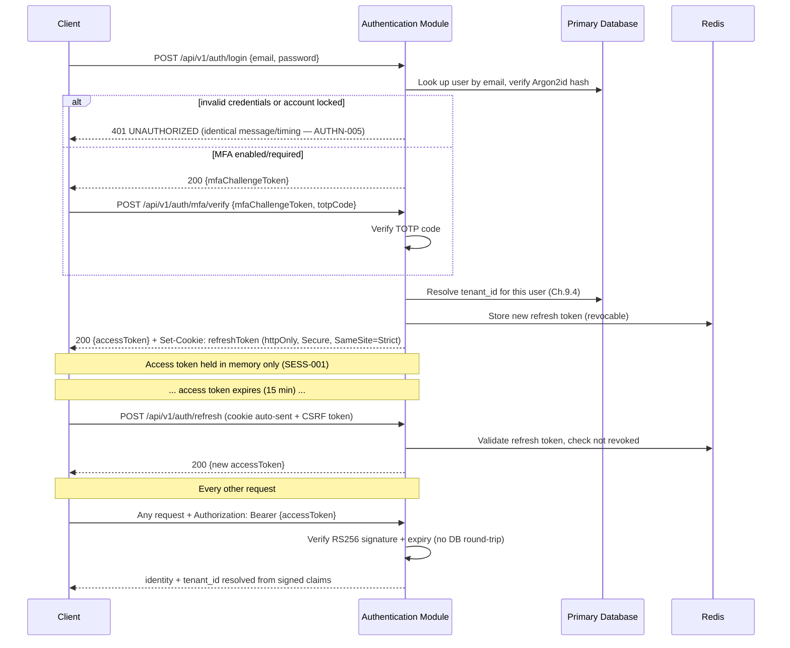

# Authentication Module Specification

**Status:** Approved (Business Analysis). Architectural decisions recorded (ADR-001, ADR-002). Module ownership boundaries confirmed. No implementation code exists yet — proceeding next to database design (`12_MODULE_DEVELOPMENT_GUIDE.md` Ch.8).
**Phase:** 02 — Platform (`engineering/implementation/roadmap.md`)
**Author step:** Business Analysis, revised post-approval with confirmed architectural decisions.

> **Sequencing (resolved):** Phase 00 — Setup is marked Done in `roadmap.md`/`current-phase.md`. Phase 01 — Foundation remains deliberately deferred; Phase 02 — Platform (this module) proceeds ahead of it per explicit direction, since Authentication has no dependency on Foundation's ledger/domain-primitive work.

---

## 1. Purpose

The Authentication module is the structural answer to `03_ARCHITECTURE.md` Chapter 9's question: *"who is calling, and how do we know?"* It is a **Foundation/Platform module** (`03_ARCHITECTURE.md` §6.4) — it owns no business capability of its own, but every other module depends on it to establish identity and tenant context before any business logic runs.

Concretely, this module is responsible for:
- Verifying a user's identity (login) and issuing tokens that prove that identity on every subsequent request.
- Resolving and cryptographically binding the tenant context a user operates within (`03_ARCHITECTURE.md` §9.4), so no other module ever has to re-derive or trust a client-supplied tenant value.
- Managing the credential lifecycle: password set/change/reset, MFA enrollment/verification, session/token lifecycle, and account lockout.
- Emitting the security-relevant audit events (`09_SECURITY_GUIDELINES.md` AUDLOG-002) every other module's forensic story depends on.

## 2. Responsibilities

**In scope:**
- Credential verification (email + password via Argon2id).
- Access/refresh token issuance, verification, refresh, and revocation.
- MFA (TOTP) enrollment and challenge verification.
- Session (refresh token) lifecycle: list, revoke-one, revoke-all.
- Forgot-password / reset-password flow.
- Account lockout and brute-force detection for authentication endpoints.
- Emitting audit events for every security-relevant action listed in §14.

**Module ownership (confirmed):**

| Module | Owns |
|---|---|
| **Authentication** (this module) | Credentials, Sessions, Login, Passwords, MFA |
| **User Management** (new module — not yet scaffolded, see §16) | User Profile, Status (lifecycle), Personal Information |
| **Authorization** | Roles, Permissions |
| **Organization** | Tenant, Company, Branch, Department |

**Explicitly out of scope (owned by other modules — dependencies, §21):**
- **Role/Permission definitions, RBAC assignment, and authorization checks** — owned by the **Authorization** module (`03_ARCHITECTURE.md` §9.5, §9.9.1; `00_BUSINESS_RULES.md` Ch.11–12). Authentication answers "who is this," Authorization answers "what can they do."
- **Tenant/Company/Branch/Department provisioning and the `X-Company-Id`/`X-Branch-Id` scoping mechanism** — owned by the **Organization** module (`07_REST_API_STANDARDS.md` Ch.13; `00_BUSINESS_RULES.md` Ch.1–4).
- **User profile, business-level status lifecycle (invite → active → suspended → deactivated), and personal information** — owned by the **User Management** module. Per `00_BUSINESS_RULES.md` §10.4, this was already explicitly out of scope for authentication mechanics; it is now a confirmed, separately-owned module rather than an open scope question. See §16 for the entity-ownership split this implies.
- **Platform Operator authentication realm** (`03_ARCHITECTURE.md` §9.6) — structurally separate from this module's Tenant End User plane; its concrete implementation is deferred per §9.17's Future Improvements and is not built as part of this module.

## 3. Actors

| Actor | Description | Source |
|---|---|---|
| **Tenant End User** | A human belonging to exactly one Organization/Tenant (`03_ARCHITECTURE.md` §4.3), authenticating to use LedgerOne. The only actor this module's login/session flows serve. | `03_ARCHITECTURE.md` §4.3, §9.6 |
| **Tenant Administrator** | A Tenant End User holding an Administrator-level Role. Distinguished here only because MFA is **mandatory** for this actor (AUTHN-004) and they can revoke other users' sessions (SESS-004). Not a separate authentication mechanism. | `09_SECURITY_GUIDELINES.md` AUTHN-004, SESS-004 |
| **Platform Operator** | LedgerOne's own internal staff, authenticating through a structurally separate realm with its own signing keys and permission set. Out of scope for this module's build (§2), acknowledged here only because AUTHN-003/JWT-001 require this module's token design to never let a Platform Operator token verify on the tenant plane, or vice versa. | `03_ARCHITECTURE.md` §9.6, `09_SECURITY_GUIDELINES.md` AUTHN-003 |
| **System Identity** | A named, narrowly-scoped non-human identity used by background jobs invoking Business-layer use cases directly (`03_ARCHITECTURE.md` §13.6, §9.16). Not a login actor, but audit records (§14) must be able to attribute an action to a System Identity, not only a human User. | `03_ARCHITECTURE.md` §9.16, §13.6 |

## 4. User Stories

1. **As a Tenant End User**, I can log in with my email and password so that I can access my organization's data.
2. **As a Tenant End User with MFA enabled**, after a correct password I am challenged for a TOTP code before a session is issued.
3. **As a Tenant Administrator**, MFA is mandatory on my account — I cannot opt out.
4. **As a Tenant End User**, my session survives a page refresh without re-entering credentials, but a stolen access token has a short natural expiry.
5. **As a Tenant End User**, I can log out, which immediately invalidates my refresh token so a copied token is useless afterward.
6. **As a Tenant End User**, I can view my active sessions and revoke any one of them (e.g., a lost device) without affecting my other sessions.
7. **As a Tenant Administrator**, I can revoke any user's sessions within my own tenant (e.g., offboarding).
8. **As a Tenant End User who forgot my password**, I can request a reset link by email and set a new password without an administrator's help.
9. **As a Tenant End User**, if I mistype my password repeatedly, my account temporarily locks and I'm notified by email — so I can tell "I made a mistake" apart from "someone is attacking my account."
10. **As an attacker** (negative story, defines a requirement by its absence), I cannot determine whether a given email address has a LedgerOne account from any authentication endpoint's response.
11. **As any caller of a Business-layer use case** (HTTP controller, background job — `03_ARCHITECTURE.md` §9.8), I am authenticated/authorized identically regardless of entry point; there is no second, weaker path.

## 5. Authentication Flow

Login and refresh follow `03_ARCHITECTURE.md` §9.3.1 exactly, with `09_SECURITY_GUIDELINES.md` Ch.3's MFA step and Ch.7's token-storage resolution layered in:

**Sources:** `03_ARCHITECTURE.md` §9.3–9.4; `09_SECURITY_GUIDELINES.md` Ch.3 (§3.2, §3.3); `07_REST_API_STANDARDS.md` Ch.11.

## 6. Password Policy

| Rule | Requirement | Source |
|---|---|---|
| Hash algorithm | **Argon2id** exclusively — never Argon2i/Argon2d alone, never plaintext or reversible encryption. | PWD-001; `07_REST_API_STANDARDS.md` AUTH-004 |
| Argon2id parameters | Memory cost ≥ 19 MiB, iteration count ≥ 2, parallelism = 1 (current OWASP minimums; revisited as hardware capability grows). | PWD-002 |
| Length | Minimum 12 characters, no maximum below 128. **No forced character-class composition** (no mandatory symbol/uppercase/digit rule). | PWD-003 |
| Breach check | New/changed passwords checked against a breached-password corpus (e.g., HaveIBeenPwned k-anonymity API or an offline equivalent) and rejected if found. | PWD-004 |
| Rotation | **No mandatory periodic rotation.** Rotation is required only on suspected compromise. | PWD-005 |
| Reset tokens | Single-use, expire in 15 minutes, and using one invalidates every other outstanding reset token for the same account. | PWD-006 |

## 7. Session Management

| Rule | Requirement | Source |
|---|---|---|
| Access token storage | In-memory only (JS variable/React context) on the frontend. Never `localStorage`/`sessionStorage`/a readable cookie. Lost on tab close by design. | SESS-001 |
| Refresh token storage | `httpOnly`, `Secure`, `SameSite=Strict` cookie, set by the server. Never readable by client-side JS. | SESS-002 |
| CSRF | Because the refresh token is cookie-delivered, `/auth/refresh` requires `SameSite=Strict` **and** a double-submit CSRF token (separate readable cookie + mirrored request header, checked server-side). Every other endpoint is Bearer-token-only and is not CSRF-vulnerable — CSRF middleware is not applied there. | SESS-002/003; CSRF-001–004 |
| Session visibility/revocation | A user can view and revoke their own active sessions from an account-security screen. A Tenant Administrator can revoke any user's sessions within their own tenant. | SESS-004 |
| Forced revocation | All of a user's active sessions are revoked immediately on password change or a suspected-compromise flag — never left valid until natural expiry. | SESS-005 |
| Access token lifetime | 15 minutes. | AUTHN-002 |

## 8. Refresh Token Strategy

- Refresh tokens are **RS256-signed JWTs**, signed with `REFRESH_TOKEN_PRIVATE_KEY` and verified with `REFRESH_TOKEN_PUBLIC_KEY` (ADR-001) — a dedicated keypair, separate from the access token's. Each carries a `jti` claim checked against a Redis revocation store on every use, so revocability is identical to `07_REST_API_STANDARDS.md` AUTH-003's "opaque, server-side revocable" intent even though the token itself is a verifiable JWT rather than a random string (ADR-001's note on this). (`03_ARCHITECTURE.md` §9.7)
- Lifetime: **7 days of inactivity**; invalidated immediately on logout, password change, or an administrator's explicit revoke action — not left to expire naturally in those cases. (AUTHN-002; SESS-005)
- Refresh is exchanged **only** via `POST /api/v1/auth/refresh`; no other endpoint accepts a refresh token. (`07_REST_API_STANDARDS.md` AUTH-005)
- Refresh does not require re-entering credentials or re-passing MFA — it is a continuation of an already-established session, not a new login.
- A successful refresh rotates the refresh token's Redis-backed session record (updates last-used timestamp) but reuses the same revocation identity, so an administrator's "revoke this user's sessions" (SESS-004) reliably terminates the session even mid-refresh-cycle.

## 9. Forgot Password

1. `POST /api/v1/auth/forgot-password {email}` — **always returns the same generic success response** regardless of whether the email exists, applying AUTHN-005's user-enumeration-prevention principle consistently to this endpoint (the handbook states this rule for login specifically; this spec extends the identical principle to password reset, since the enumeration risk is the same).
2. If the email exists, a single-use reset token is generated and emailed with a reset link. Issuing a new token invalidates any previously outstanding one for that account (PWD-006).
3. Rate-limited and monitored for abuse the same way `/auth/login` is (RATE-002-equivalent — see §13).
4. Emits an audit event (§14) regardless of outcome (existence or non-existence of the account is not itself logged in a way that leaks account existence outside the Platform Operator-only audit path, AUDLOG-004).

## 10. Reset Password

1. `POST /api/v1/auth/reset-password {token, newPassword}`.
2. Token must be valid, unexpired (15 min, PWD-006), and unused.
3. New password validated against §6's policy (length, breach corpus).
4. On success: password hash updated, **the used token and every other outstanding reset token for the account are invalidated** (PWD-006), and **all active sessions for the account are revoked** (SESS-005 — a password reset is exactly the "suspected compromise" trigger that rule anticipates).
5. Emits an audit event (AUDLOG-002).

## 11. Account Lock Policy

| Rule | Requirement | Source |
|---|---|---|
| Lockout threshold | 10 consecutive failed login attempts within 15 minutes locks the account (login rejected even with the correct password) for a 15-minute cooldown. | BRUTE-001 |
| Distinct from rate limiting | This is an **account-level** control, independent of and in addition to the per-IP/per-account rate limit on `/auth/login` (5 attempts / 15 min — RATE-002). | BRUTE-001; RATE-002 |
| Owner notification | The account owner is emailed on lockout, including the triggering attempts' source IP/approximate location. | BRUTE-002 |
| Bot slowdown | A CAPTCHA or equivalent challenge is introduced after repeated failures from the same source, before outright lockout, to slow automated attempts without punishing a user who mistyped their password a few times. | BRUTE-003 |
| Credential stuffing | Many distinct accounts attempted from one source in a short window is detected and that source IP is temporarily blocked platform-wide, independent of any single account's lockout. | BRUTE-004 |

## 12. Multi-Tenant Login

`03_ARCHITECTURE.md` §4.3/§4.6 establishes the **initial model as one Organization = one Tenant**, and a User belongs to exactly one Organization/Tenant at a time. Consequently, "multi-tenant login" for this module means:

- **Tenant resolution, not tenant selection.** At login, the module looks up which tenant the authenticating user's account belongs to and binds that `tenant_id` into the access token's signed claims (§9.4). There is no "choose your organization" step in v1 — a user does not hold logins spanning multiple tenants.
- **The tenant claim is immutable for the token's lifetime.** A client can never alter or select a different `tenant_id` — the only value the rest of the system ever trusts is the one cryptographically bound at issuance (`03_ARCHITECTURE.md` §9.4; MTS-001).
- **Company/Branch context is a separate, later concern**, not part of login. A user may hold roles across multiple Companies within one Organization (`00_BUSINESS_RULES.md` §10.12) and switches between them via the `X-Company-Id`/`X-Branch-Id` request headers defined in `07_REST_API_STANDARDS.md` Ch.13 — validated per-request by the Organization/Authorization modules, not resolved or cached by this module. This module's login response returns identity + tenant + tokens only; it does not enumerate a user's available Companies/Branches (see §21 for the boundary note).
- Cross-tenant login is not a concept this module needs to support in v1 — the trigger for revisiting this (multi-entity consolidation under one Organization) is named in `03_ARCHITECTURE.md` §4.10 as a future, not current, requirement.

## 13. Security Requirements

Consolidated from `09_SECURITY_GUIDELINES.md` Chapters 3, 6, 19, 21; binding for this module's implementation.

| Area | Requirement | Source |
|---|---|---|
| Token signing algorithm | **RS256** (asymmetric) — the private signing key is held only by the Authentication module; any other service verifies with the public key only, and cannot forge tokens. Both the access token and the refresh token are RS256-signed, each with its **own dedicated keypair**. **Resolved: ADR-001.** | JWT-001; ADR-001 |
| Signing key material | `JWT_PRIVATE_KEY` / `JWT_PUBLIC_KEY` (access token); `REFRESH_TOKEN_PRIVATE_KEY` / `REFRESH_TOKEN_PUBLIC_KEY` (refresh token). No `_SECRET`-style variable is used anywhere in this module. These cover the Tenant End User plane only — the Platform Operator plane (out of scope, §2) uses its own separate keypair, never these variables, per AUTHN-003. | ADR-001 |
| Standard JWT claims | `sub` (user uuid), `tenantId`, `plane` (`tenant`/`platform`), `iat`, `exp`, `jti` (enables targeted revocation). No PII beyond the user's own `uuid`. | JWT-002 |
| Verification | Every protected endpoint verifies signature, expiry, and issuer in full — a token failing any check is rejected `401`, never partially trusted. | JWT-003 |
| Claim provenance | `tenantId` and `plane` are set exclusively by this module at issuance time from server-side data — never accepted from any client-supplied field anywhere in the issuance flow. | JWT-004; MTS-001 |
| Revocation | `jti`-based deny-list check in Redis on every verification, populated on logout/compromise. | JWT-005 |
| MFA | Available to all tenant users; **mandatory** for any Administrator-level Role or Platform Operator account. TOTP-based via **Speakeasy**. **Resolved: ADR-002.** | AUTHN-004; ADR-002 |
| User enumeration | Failed login returns an identical error/timing profile regardless of whether the email exists. | AUTHN-005 |
| Rate limiting | `/auth/login` and `/auth/mfa/verify`: 5 attempts / 15 min per account **and** per source IP (whichever is hit first), Redis-backed shared state (not per-instance memory). | RATE-002/003 |
| CSRF | `SameSite=Strict` + double-submit token on `/auth/refresh` specifically; not applied to Bearer-only endpoints. | CSRF-001–003 |
| Secrets at rest | MFA/TOTP secrets (Speakeasy-generated) and refresh-token records are sensitive data requiring encryption at rest per the platform's general encryption-at-rest requirement. | `03_ARCHITECTURE.md` §20.4 |

Both open items previously flagged here (JWT signing algorithm vs. environment-variable naming; MFA library tech-stack gap) are resolved — see **ADR-001** and **ADR-002** (`engineering/architecture-decisions/`) and `02_TECH_STACK.md` (updated).

## 14. Permissions

Per `03_ARCHITECTURE.md` Decision 9.9.1, permissions are namespaced and owned per module — the Authentication module does not own or check any `accounting.*`/`sales.*`-style business permission. Its own permission surface is narrow, self-referential, and covers only account-security actions on one's own account versus another user's:

| Permission | Meaning |
|---|---|
| `authentication.session.view_own` | View one's own active sessions (implicit for any authenticated user — not gated, listed for completeness). |
| `authentication.session.revoke_own` | Revoke one's own session(s) (implicit for any authenticated user). |
| `authentication.session.revoke_any` | Revoke another user's session(s) within the same tenant — Administrator-level. |
| `authentication.mfa.enforce` | Mark MFA mandatory for a given Role — this is a policy decision, not a per-user toggle a non-Administrator can set. |

All Role/permission-grant mechanics, including how `authentication.session.revoke_any` gets bundled into an "Administrator" Role, are the Authorization module's responsibility (§2) — this module only declares and authoritatively checks its own permission keys in its Business layer, per AUTHZ-002/`03_ARCHITECTURE.md` §9.8.

## 15. Future Enhancements

Explicitly deferred, not built now — named in the handbook as plausible future work, not fabricated here:

- **SSO/SAML** for enterprise tenants (`00_BUSINESS_RULES.md` §10.21; `09_SECURITY_GUIDELINES.md` §3.9; `07_REST_API_STANDARDS.md` §11.9).
- **Adaptive/risk-based authentication** (step-up MFA only on anomalous login signals — new device/location) (BRUTE §22.7).
- **ABAC-like refinements** for specific permission shapes RBAC handles awkwardly, e.g. numeric approval limits (`03_ARCHITECTURE.md` §9.17) — an Authorization-module concern, noted here only because Authentication's identity model must not preclude it.
- **Platform Operator authentication realm's concrete implementation** (possibly an external enterprise IdP for LedgerOne's own staff) (`03_ARCHITECTURE.md` §9.17).
- **Tenant-configurable session lifetime policy** (an enterprise tenant wanting shorter sessions) (`03_ARCHITECTURE.md` §9.17).

## 16. Database Entities (High Level Only)

No entity/field names below are frozen in any handbook chapter today — Users (`00_BUSINESS_RULES.md` Ch.10) explicitly defers "login credentials — mechanics" to this chapter, and no table names are pre-assigned. Module ownership is now confirmed (§2); the entity split below follows directly from it, per `06_DATABASE_STANDARDS.md`'s naming/standard-columns conventions (Ch.2: `snake_case`, plural, standard `id`/`uuid`/`tenant_id`/`created_at`/`updated_at`/`created_by`/`updated_by`/`deleted_at` columns).

**Owned by this module (Authentication):**

| Entity (proposed) | Purpose | Tenant-owned? |
|---|---|---|
| `user_credentials` | Login identity + credential record, one-to-one with User Management's `users` row (referenced by `user_id`/`uuid`, never joined directly across module tables per Ch.6.5): `email` (the login identifier — owned here since it is the credential, not merely a profile field), `password_hash` (Argon2id), `mfa_enabled`, `mfa_secret` (Speakeasy secret, encrypted at rest), `failed_login_count`, `locked_until`, `last_login_at`. | Yes — `tenant_id` per MT-001. |
| `refresh_tokens` | Server-side revocable session records: `user_credential_id`, the RS256-signed refresh JWT's `jti`, `expires_at`, `revoked_at`, `created_from_ip`. | Yes. |
| `password_reset_tokens` | Single-use reset tokens: `user_credential_id`, hashed token, `expires_at`, `used_at`. | Yes. |
| `login_attempts` | Rolling record of recent attempts (success/failure, source IP) feeding lockout (§11) and anomaly detection (MTS-004); may be Redis-backed counters rather than a durable table — an implementation-phase decision, not fixed here. | Yes. |

**Owned by other modules (referenced by `uuid` via published contract, never joined directly):**

| Entity | Owning module | Purpose |
|---|---|---|
| `users` | **User Management** (new module) | Canonical identity row: `name`, `status` (Invited/Active/Suspended/Deactivated — `00_BUSINESS_RULES.md` §10.5), personal information. Authentication's `user_credentials` references this row's `uuid`; it does not duplicate name/status. |
| `roles`, `permissions`, `role_permissions`, `user_roles` | **Authorization** | RBAC mechanics (§9.5), referencing User Management's `users` by `uuid`. |
| Tenant/Company/Branch/Department tables | **Organization** | Provisioning and the `X-Company-Id`/`X-Branch-Id` scoping mechanism (§12). |

**Note — email ownership:** email is modeled as part of Authentication's `user_credentials` (it is the login identifier, and changing it is a security-sensitive credential-change operation), not User Management's `users`. Other modules needing a user's email for display/notification purposes call Authentication's published contract (§21) rather than duplicating it as a second source of truth. This is a reasonable implementation detail within the confirmed ownership boundaries, not itself a new open question, but is called out explicitly for visibility.

**New module flag:** User Management does not yet exist in the folder skeleton (`apps/api/src/shared/`, `apps/web/src/modules/`) — it must be scaffolded at Folder Creation (`12_MODULE_DEVELOPMENT_GUIDE.md` Ch.11), following the same Foundation/Platform module shape as Authentication/Authorization/Organization.

Per-module audit events (§14 concept, distinct from this table list) are **not** a table this module owns — audit is shared infrastructure per `03_ARCHITECTURE.md` §17.6.1 / AUD-D-004; this module only writes into it.

## 17. REST APIs (High Level Only)

All under `/api/v1/auth`, per `07_REST_API_STANDARDS.md` versioning (Ch.6) and this module's own endpoint allow-list exemption from the default Bearer-auth requirement (AUTH-001) where noted.

| Method & Path | Auth required? | Purpose |
|---|---|---|
| `POST /auth/login` | No (allow-listed) | Credential verification; returns access token + sets refresh cookie, or an MFA challenge. |
| `POST /auth/mfa/verify` | No (allow-listed; requires a valid `mfaChallengeToken`) | Completes login when MFA is enabled/required. |
| `POST /auth/refresh` | Cookie-authenticated (not Bearer) | Exchanges a valid refresh token for a new access token. Requires CSRF double-submit (§13). |
| `POST /auth/logout` | Bearer | Revokes the current session's refresh token. |
| `GET /auth/sessions` | Bearer | Lists the caller's active sessions. |
| `DELETE /auth/sessions/{id}` | Bearer | Revokes one of the caller's own sessions, or (with `authentication.session.revoke_any`) another user's session in-tenant. |
| `POST /auth/forgot-password` | No (allow-listed) | Requests a reset email; always returns an identical generic response (§9). |
| `POST /auth/reset-password` | No (allow-listed; requires a valid reset token) | Sets a new password using a reset token. |
| `POST /auth/mfa/enroll` | Bearer | Begins TOTP enrollment (returns provisioning QR/secret). |
| `POST /auth/mfa/confirm` | Bearer | Confirms enrollment with a valid TOTP code, activating MFA on the account. |
| `POST /auth/mfa/disable` | Bearer (re-authentication likely required) | Disables MFA — not available if the caller's Role makes MFA mandatory (AUTHN-004). |

Each endpoint's exact request/response DTOs, error codes, and Swagger documentation (`07_REST_API_STANDARDS.md` Ch.26) are a detailed-design/implementation-phase artifact, not fixed at this high level.

## 18. Frontend Screens (High Level Only)

Per `08_FRONTEND_STANDARDS.md`'s module-mirrored structure (`apps/web/src/modules/authentication/screens/`):

- **Login** — email/password form; conditionally reveals an MFA code field.
- **Forgot Password** — email input, generic confirmation message regardless of outcome (§9).
- **Reset Password** — new-password form (token from emailed link), with a real-time strength indicator per PWD §5.4's guidance (length/breach-status based, not a composition checklist).
- **MFA Enrollment** — QR code + manual secret entry, confirmation code input.
- **Account Security** (a section within a broader account/profile screen, not necessarily standalone) — active sessions list with per-session revoke, MFA enable/disable toggle (disabled state itself disabled when Role mandates MFA).

Detailed component/state-management design is a `08_FRONTEND_STANDARDS.md`-governed implementation-phase concern, not fixed here.

## 19. Validation Rules

| Field | Rule | Source |
|---|---|---|
| Email | Valid email format; unique within the tenant/organization; verified before first login. | `00_BUSINESS_RULES.md` §10.8 |
| Password (set/change/reset) | 12–128 characters; no forced composition; rejected if found in breach corpus. | PWD-003/004 |
| MFA TOTP code | 6-digit numeric, time-window validated per standard TOTP tolerance (implementation detail). | Ch.3.3 |
| Reset token | Must exist, be unexpired (≤15 min old), and unused. | PWD-006 |
| Login request | Rejects malformed input via DTO validation (Presentation layer) **and** re-validated at Domain layer per defense-in-depth — no input trusted from a single validation point. | `03_ARCHITECTURE.md` §20.4 |

## 20. Acceptance Criteria

1. A user with correct credentials and no MFA receives a valid access token (15 min expiry, RS256, correct claim set) and a `Set-Cookie` refresh token (httpOnly/Secure/SameSite=Strict).
2. A user with MFA enabled is challenged for a TOTP code before any token is issued; an incorrect TOTP code does not issue a token.
3. Login failure for a nonexistent email and login failure for a wrong password on an existing email are **indistinguishable** in response body and response timing.
4. After 10 failed attempts within 15 minutes, the 11th attempt (even with the correct password) is rejected, and the account owner receives a lockout email.
5. A refresh call with a revoked, expired, or unknown refresh token is rejected; a valid one issues a new access token without requiring credentials.
6. Logout revokes the current refresh token immediately — a subsequent refresh attempt with that token fails.
7. Password reset invalidates all other outstanding reset tokens and all of the account's active sessions.
8. A Platform Operator token is cryptographically rejected by every tenant-facing verification path, and vice versa.
9. No endpoint response, header, or error message ever contains a client-supplied `tenantId`/`companyId` value being echoed back as trusted — the resolved value always originates from the verified JWT.
10. Every login (success/failure), MFA challenge, password reset, and session revocation produces an audit record via the shared audit infrastructure (not merely an application log).
11. An Administrator-Role account cannot disable MFA on itself.
12. `/auth/refresh` rejects a request missing a valid CSRF double-submit token even if the refresh cookie itself is valid.

## 21. Dependencies

**Depends on (must exist or be decided first):**
- **User Management module** (new — §16) — Authentication's `user_credentials` row references this module's canonical `users` row by `uuid`; login needs User Management's contract to confirm the account isn't Deactivated (a status this module does not itself own).
- **Authorization module** — for Role/permission mechanics that gate `authentication.session.revoke_any` and `authentication.mfa.enforce` (§14). Authentication can define its own permission keys before Authorization's engine exists, but cannot enforce them end-to-end without it.
- **Organization module** — for the Company/Branch context this module's login deliberately does not resolve (§12).
- **Audit infrastructure** (`03_ARCHITECTURE.md` §17.6.1) — Authentication must write into shared audit infrastructure, not its own bespoke log; if that shared infrastructure doesn't exist yet, this module cannot ship AUDLOG-002 compliantly.
- **Redis** (`02_TECH_STACK.md`) — for refresh-token storage, MFA challenge tokens, rate-limit counters, and `jti` deny-lists.
- ~~Resolution of the two flagged items in §13~~ — **Resolved**: ADR-001 (JWT/RS256), ADR-002 (MFA/Speakeasy).

**Depended upon by (nothing can proceed without this module):**
- Every other module's Business-layer authorization check (`03_ARCHITECTURE.md` §9.8) needs a resolved, verified identity + tenant context that only this module produces.
- The frontend's `api-client.ts` (`08_FRONTEND_STANDARDS.md` API-001) needs this module's token contract to implement silent refresh.

## 22. Definition of Done

Per `05_CODING_STANDARDS.md` Ch.43, plus this module's specific gates:

- [x] This specification reviewed and approved.
- [x] The two flagged conflicts in §13 resolved — ADR-001 (JWT/RS256), ADR-002 (MFA/Speakeasy).
- [x] Module ownership boundaries confirmed (§2, §16): Authentication, User Management, Authorization, Organization.
- [ ] User Management module scaffolded (new module, §16) — required before Authentication's contract dependency on it can be implemented.
- [ ] Domain model, DTOs, and Prisma schema implemented per `05_CODING_STANDARDS.md`/`06_DATABASE_STANDARDS.md`, passing `scripts/lint/check-layer-boundaries.ts` and `check-module-imports.ts`.
- [ ] Every endpoint in §17 implemented with explicit permission declarations (AUTHZ-001) and Business/Domain-layer authoritative checks (AUTHZ-002), not Presentation-layer-only.
- [ ] Every rule in §6–§13 covered by an automated test (unit for Business/Domain logic, contract test for the specific behaviors §20 names — enumeration-proofing, 401-vs-403, CSRF, lockout).
- [ ] Security review completed against `09_SECURITY_GUIDELINES.md` Ch.3/6/7/19/21/22 specifically (Decision 20.5.1's module-review discipline), recorded under `engineering/reviews/security/`.
- [ ] Database review completed (`engineering/reviews/database/`) confirming tenant scoping (MT-001–006) and audit table shape (AUD-D-001–006).
- [ ] OpenAPI/Swagger documentation generated for every endpoint (`07_REST_API_STANDARDS.md` Ch.26).
- [ ] `engineering/implementation/module-checklist.md` updated to reflect Authentication's status (`roadmap.md`/`current-phase.md` already updated).

---

*Specification approved. No implementation code has been written. Proceeding next to database design (`12_MODULE_DEVELOPMENT_GUIDE.md` Ch.8 — Database Planning).*
